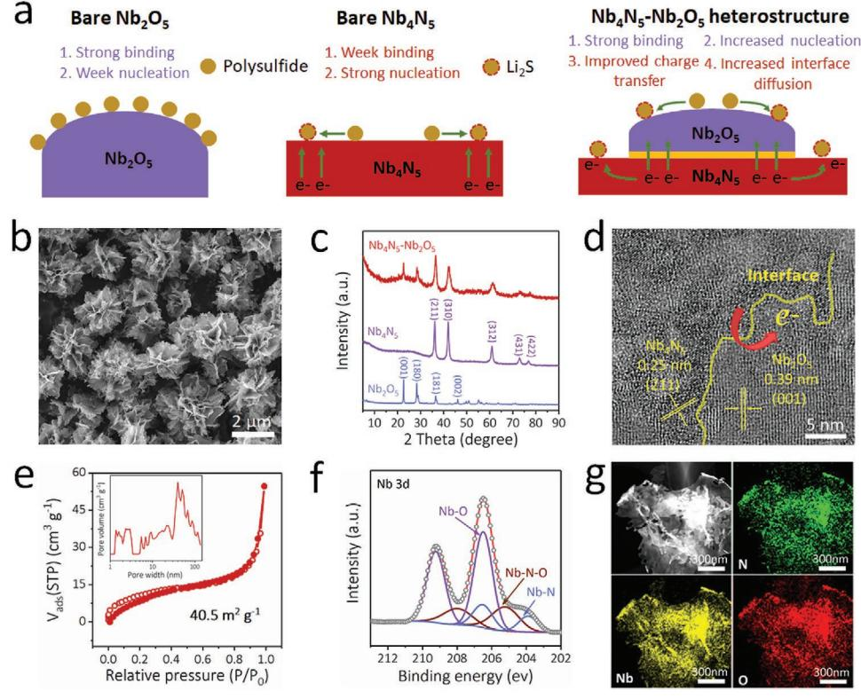
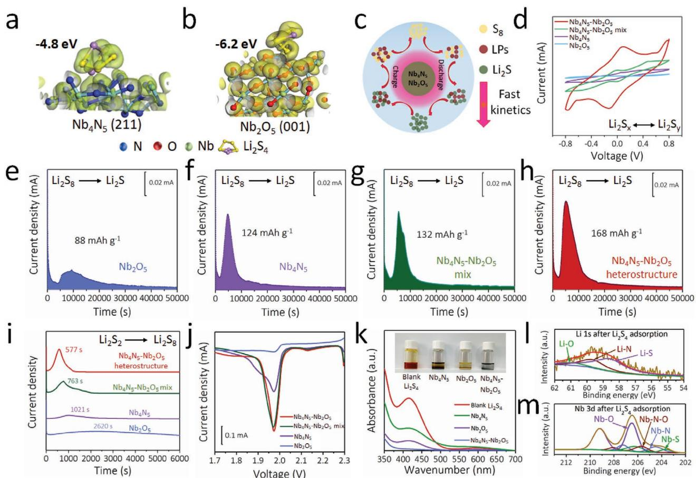
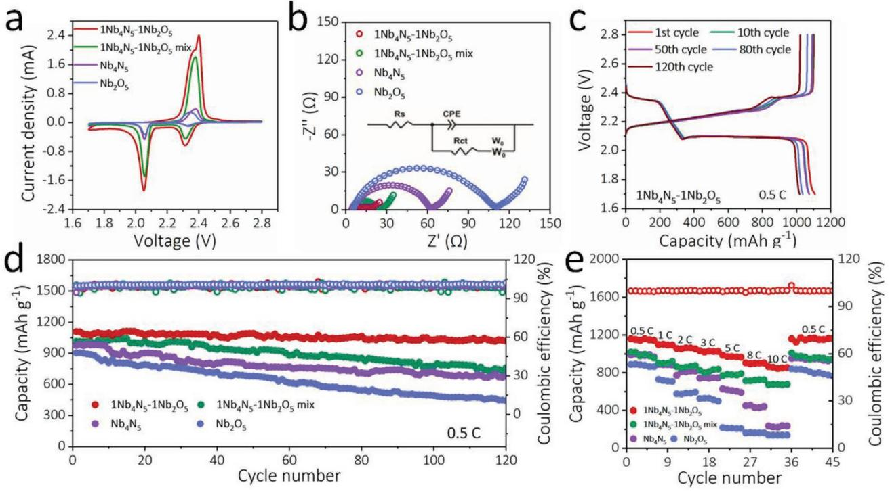
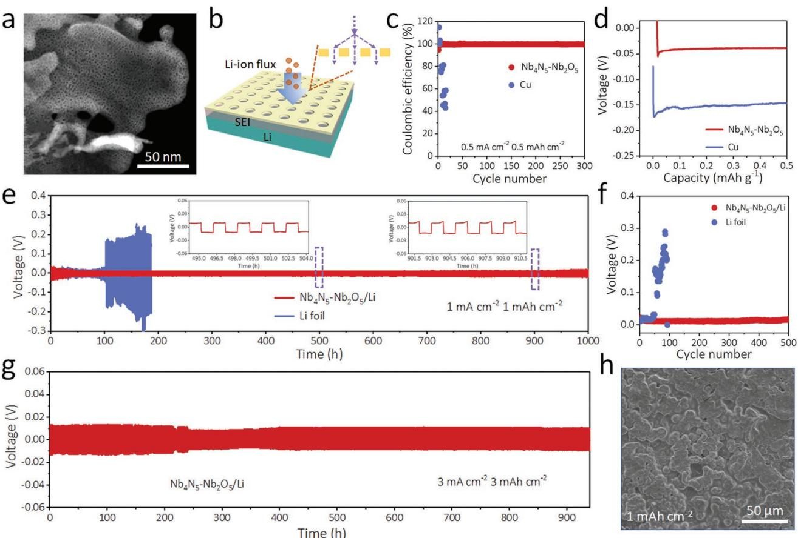
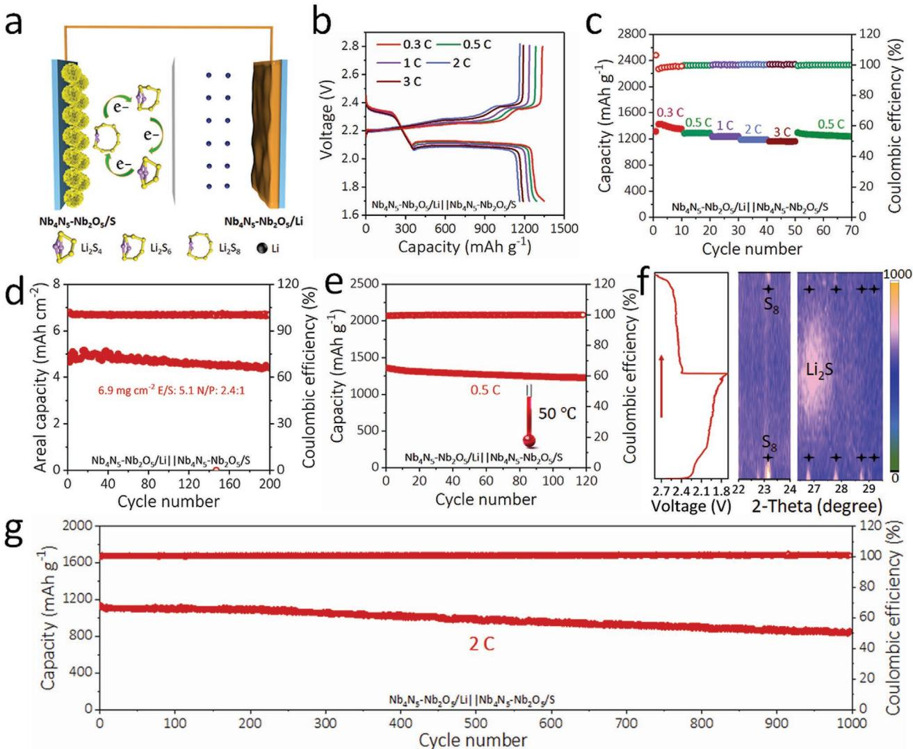

# **Interfacial Engineering of Bifunctional Niobium (V)-Based Heterostructure Nanosheet Toward High Efficiency Lean-Electrolyte Lithium–Sulfur Full Batteries**

*Haodong Shi, Jieqiong Qin, Pengfei Lu, Cong Dong, Jian He, Xiujian Chou, Pratteek Das, Jiemin Wang, Liangzhu Zhang, and Zhong-Shuai Wu\**

**High-efficiency lithium–sulfur (Li–S) batteries depend on an advanced electrode structure that can attain high sulfur utilization at lean-electrolyte conditions and minimum amount of lithium. Herein, a twinborn holey Nb4N5–Nb2O5 heterostructure is designed as a dual-functional host for both redox–kinetics–accelerated sulfur cathode and dendrite-inhibited lithium anode simultaneously for long-cycling and lean-electrolyte Li–S full batteries. Benefiting from the accelerative polysulfides anchoring–diffusion–converting efficiency of Nb4N5–Nb2O5, polysulfide-shutting is significantly alleviated. Meanwhile, the lithiophilic nature of holey Nb4N5–Nb2O5 is applied as an ion-redistributor for homogeneous Li-ion deposition. Taking advantage of these merits, the Li–S full batteries present excellent electrochemical properties, including a minimum capacity decay rate of 0.025% per cycle, and a high areal capacity of 5.0 mAh cm−2 at sulfur loading of 6.9 mg cm−2, corresponding to negative to positive capacity ratio of 2.4:1 and electrolyte to sulfur ratio of 5.1 µL mg−1 . Therefore, this work paves a new avenue for boosting high-performances Li–S batteries toward practical applications.**

H. D. Shi, Dr. J. Q. Qin, Dr. P. F. Lu, C. Dong, P. Das, Dr. J. M. Wang, L. Z. Zhang, Prof. Z.-S. Wu State Key Laboratory of Catalysis Dalian Institute of Chemical Physics Chinese Academy of Sciences 457 Zhongshan Road, Dalian 116023, China E-mail: wuzs@dicp.ac.cn H. D. Shi, C. Dong, P. Das University of Chinese Academy of Sciences 19 A Yuquan Rd, Shijingshan District, Beijing 100049, China Dr. J. Q. Qin College of Science Henan Agricultural University No. 63 Agricultural Road, Zhengzhou 450002, China Prof. J. He, Prof. X. J Chou School of Instrument and Electronics North University of China Taiyuan 030051, China Prof. Z.-S. Wu Dalian National Laboratory for Clean Energy Dalian Institute of Chemical Physics Chinese Academy of Sciences 457 Zhongshan Road, Dalian 116023, China

The ORCID identification number(s) for the author(s) of this article can be found under https://doi.org/10.1002/adfm.202102314.

#### **DOI: 10.1002/adfm.202102314**

#### **1. Introduction**

The growing demands for hand-held electronics and electric vehicles have promoted the exploration of high-energydensity rechargeable batteries over 400 Wh kg−1 . [1] Lithium-sulfur (Li–S) batteries with exceptional theoretical energy density (≈2500 Wh kg−1 ), coupled with highly reversible and efficient reactions at the sulfur cathode-electrolyte and lithium (Li) anode–electrolyte interface, are one of the most appealing battery techniques.[2] Basically, the physicochemical properties of the designed electrode host materials significantly influence the reversibility and kinetics of the heterogeneous reaction of Li–S batteries. In addition, the capacity degradation resulting from the irreversible lithium polysulfides (LiPSs) "shuttle effect" of the sulfur cathode, and safety concern deriving from huge volume change and uncontrollable den-

drite-forming of the Li metal anode, have severely impeded the commercial generalization.[3] In this regard, a low electrolyte to sulfur ratio (E/S) (<6 µL mg−1 ) and low negative to positive capacity ratio (N/P) (<5) under high sulfur loading (>5 mg cm−2 ) are required for practical Li–S batteries.[4]

For the cathode, intensive efforts have been devoted to effectively confine the original sulfur particles, soluble polysulfides, and final solid discharged products via physical and chemical immobilization. The polar materials, especially with catalytic effect, such as metal oxides,[5] sulfides,[6] phosphides,[7] nitrides,[8] boron nitride,[9] and functional carbons,[10] have shown improved electrical performance of sulfur electrodes by enhancing the reaction kinetics and chemical conversion of LiPSs.[10] Although with great progress, implementing high electrical conductivity, strong adsorption, and abundant catalytic sites simultaneously from a single electrode remains challenging.[11] Recently, interface engineering of heterostructure sulfur host is considered as a promise route to achieve LiPSs chemical adsorption, promote electron transfer at interfaces and improve LiPSs surface redox kinetics.[12]

Apart from sulfur cathode, various strategies have been explored for modifying the Li metal anodes since the fully assembled Li–S batteries strongly depend on the synergy **www.advancedsciencenews.com www.afm-journal.de** between sulfur and Li electrodes. Typically, they include the engineering of artificial protection layers,[13] optimizing the electrolytes with additives,[14] using high-surface-area 3D conductive scaffolds,[15] and developing solid-state or polymer electrolytes.[16] However, the inhomogeneous Li–ion flux distribution, especially at high current density still emerges during the repeated Li plating and stripping process, which could not fully suppress the formation of Li dendrite and "dead Li".[17] In addition, a lithophilic matrix tends to appear a certain threshold of Li deposition on the surface, which can't fully prevent the growth of dendrites.[18–21] To overcome this issue, nanoporous structures such as vertical microchannels,[22] aligned holey nanosheets,[17a] and 3D structure containing nanopore[23] serving as ion redistributors have been proposed to homogenize Li–ion flux on the electrolyte–electrode interface for dendrite-free Li anodes. In short, rational construction of a lithiophilic heterostructured material integrating interface engineering and precise nanoporous surface for both sulfur host and Li metal anode is promising for boosting the performance

of Li–S batteries. Herein, we designed a holey 2D Nb4N5–Nb2O5 heterostructure as a dual-functional host material for both sulfur cathode (Nb4N5–Nb2O5/S) and Li anode (Nb4N5–Nb2O5/Li). Such a bibasic host integrated strong chemisorptive Nb2O5 and high conductive Nb4N5, simultaneously facilitate high trapping efficiency and fast electron transportation for LiPSs conversion on the heterostructure surface. As for the anode scaffold, the holey lithiophilic Nb4N5–Nb2O5 heterostructure greatly reduced the deposition current density and enabled homogeneous Li–ion distribution, hence suppressing Li dendrite formation. Based on that, a meticulously designed Li–S full battery configuration was achieved with super-rate capability of 1163 mAh g−1 at 3 C and remarkable cycle stability over 1000 cycles (capacity degradation rate of 0.025% per cycle). Furthermore, a promising areal capacity up to 5.0 mAh cm−2 for 200 cycles with a high sulfur loading of 6.9 mg cm−2 was achieved for the Nb4N5–Nb2O5/Li||Nb4N5–b2O5/S batteries. Thus, this work presents a novel design of advanced host to comprehensively address the obstacles in sulfur cathode and Li anode toward the high performance Li–S batteries.

# **2. Results and Discussion**

#### **2.1. Fabrication and Characterization of Nb4N5–Nb2O5 Heterostructure**

The desirable properties of electrocatalysts for fast conversion of LiPSs are dominated by three main factors: (i) high adsorption ability to anchor LiPSs, (ii) rich catalytic active sites to enhance the conversion kinetics, and (iii) good electrical conductivity for effectively electron transfer.[24,25] Based on that, 2D Nb4N5–Nb2O5 heterostructure integrates those properties with synergetic effect of Nb2O5 and Nb4N5. To be more specific, the bare Nb2O5 possesses desirable chemical adsorption, which is good for the conversion of LiPSs. However, electrical conductivity is not high for electron transfer.[5] In contrast, polar Nb4N5 with superior electrical conductivity facilitates efficient conversion of LiPSs, but suffers from poor affinity of the LiPSs on its surface.[26] Therefore, the novel design of Nb4N5–Nb2O5 heterostructure by coupling the merits of highly adsorptive Nb2O5 and conductive Nb4N5 can enable a fast nucleation and conversion of the LiPSs. Consequently, the LiPSs shuttling is effectively confined and the utilization of sulfur is greatly promoted (**Figure 1**a).

The 2D Nb4N5–Nb2O5 heterostructures were prepared by hydrothermal reaction and subsequent ammonia annealing treatment. The scanning electron microscope (SEM) image showed uniform flower morphology, composed of holey nanosheets (Figure 1b; and Figure S1, Supporting Information). Significantly, the Nb4N5–Nb2O5 heterostructure with the ratio of around 1:1 (Table S1, Supporting Information) was successfully obtained (Figure 1c) by adjusting the nitriding temperature and time. The high-resolution transmission electron microscope (TEM) images illustrated that the lattice spacings were 0.25 and 0.39 nm, matching the (211) planes of Nb4N5 (Figure S2, Supporting Information) and (001) planes of Nb2O5 (Figure S3, Supporting Information), respectively. More importantly, a heterostructured interface between them was clearly observed (Figure 1d). Such an interface was not only conducive for fast electron transportation, but also improved the adsorption and conversion of LiPSs.[24] In addition, the porous structure was beneficial to offer easy accessibility to LiPSs with enriched active sites for the consequent adsorption and catalytic conversion (Figure 1e; and Figure S4, Supporting Information). X-ray photoelectron spectroscopy (XPS) further confirmed the co-existence of Nb–O and Nb–N bonding configuration (Figure 1f).[27] The intact connection and uniform distribution of Nb2O5 and Nb4N5 were verified by the energy-dispersive spectrometry element mapping results (Figure 1g).

#### **2.2. Electrocatalytic and Adsorption Effects of Nb4N5–Nb2O5 Heterostructure**

First-principle calculations were performed to disclose the chemical interaction of LiPSs (Li2S4 was chosen as the protype for modelling) with Nb2O5 and Nb4N5 configurations. The adsorption energies of Li2S4 on Nb4N5 (211) and Nb2O5 (001) surfaces were -4.8 and -6.2 eV, respectively, indicating that Nb2O5 had higher adsorption affinity for LiPSs.[28] Further, the superior conductivity of Nb4N5 guaranteed the fast diffusion of LiPSs from Nb2O5 surface to Nb4N5 surface across the interfacial migration between them (**Figure 2**a,b). As a result, Nb4N5–Nb2O5 could efficiently enhance the electrochemical reaction and accelerate the oxidation conversion of dissolved LiPSs to solid Li2S in the discharge process, which ensured a discharging/charging loop process with excellent reversibility (Figure 2c).

We selected the Nb4N5–Nb2O5 heterostructure (with the ratio of around 1:1) as the model catalyst representation for deducing the reaction mechanism of electrocatalysis in corresponding Li–S batteries. Nb4N5–Nb2O5 mixture (Nb4N5–Nb2O5 mix with the ratio of 1:1), bare Nb4N5, and bare Nb2O5 were also selected for comparison. In order to confirm the improved redox-reaction kinetics in liquid–liquid transformation process, cyclic voltammetry (CV) measurement using symmetric batteries based on Li2S6 catholyte were employed. It was observed that the

**Figure 1.** Schematics of the catalytic mechanism and characterization of Nb4N5–Nb2O5 heterostructure. a) Schematic illustration of the polysulfides anchoring–diffusion–conversion processes on bare 2D Nb2O5, bare 2D Nb4N5, and 2D Nb4N5–Nb2O5 heterostructure surface. b) SEM image of Nb4N5–Nb2O5 heterostructures. c) XRD patterns of Nb2O5, Nb4N5, and Nb4N5–Nb2O5 heterostructure. d) HRTEM image and e) nitrogen adsorption– desorption isotherm of Nb4N5–Nb2O5 heterostructure. Inset is its pore size distribution. f) High-resolution XPS Nb 3d spectrum of Nb4N5–Nb2O5 heterostructure. g) HAADF-STEM image of Nb4N5–Nb2O5 heterostructure and corresponding element mapping of N, Nb, and O element.

redox current peak response increased in the order of Nb2O5 < Nb4N5 < Nb4N5–Nb2O5 mix < Nb4N5–Nb2O5 heterostructure (Figure 2d; and Figure S5, Supporting Information), reflecting that Nb4N5–Nb2O5 heterostructure possessed better interfacial kinetics.[29] Apart from the liquid–liquid transformation of LiPSs, the polar and conductive heterostructure also played a key role at liquid–solid boundary. A potentiostatic nucleation experiment was conducted to understand the electrochemical deposition from LiPSs to solid Li2S. Specifically, the capacity 168 mAh g−1 of the precipitated Li2S on Nb4N5–Nb2O5 heterostructure electrode was much higher than those of Nb4N5– Nb2O5 mix (132 mAh g−1 ), Nb4N5 (124 mAh g−1 ), and Nb2O5 (88 mAh g−1 ). Besides, the battery with Nb4N5–Nb2O5 heterostructure exhibited the highest current density of 0.074 mA, suggesting the role of heterostructure in fast LiPSs trapping and nucleation of Li2S (Figure 2e–h).[30] Moreover, the sluggish oxidation kinetics of solid Li2S at the charging cycle is the dominant factor for the reduced reversibility of Li2Sto-LiPSs interconversion, thus leaving behind unusable electrochemical phases (also called "dead sulfur"). Similarly, kinetic evaluation of Li2S decomposition was conducted by a potentiostatic charging process after fully discharging into solid Li2S. Nb4N5–Nb2O5 heterostructure showed an obvious oxidation current peak at 577 s, which was much earlier than those of Nb4N5–Nb2O5 mix (763 s), Nb4N5 (1021 s), and Nb2O5 (2620 s) (Figure 2i). In addition, the improved Li2S dissolution could reduce the deactivation of the catalyst surface and increase the utilization of sulfur.[31] Furthermore, the linear sweep voltammetry (LSV) indicated that Nb4N5–Nb2O5 heterostructure electrode exhibited highest reaction peak current (0.43 mA cm−2 ) with the lowest Tafel slope (89.4 mV dec−1 ), further demonstrative of the improved kinetics of LiPSs redox reactions (Figure 2j; and Figure S6, Supporting Information).[32]

To study the chemical adsorption behavior of the Nb4N5– Nb2O5 heterostructure for LiPSs, a visual adsorption test was conducted by adding the same amount (≈5 mg) of materials into the Li2S6 solution. As shown in Figure 2k, the solution with Nb4N5–Nb2O5 heterostructure additive rapidly decolored. The sample with Nb2O5 showed slightly inferior decoloration phenomenon due to the limited specific area (33.9 m2 g−1 ), compared to the heterostructure (40.5 m2 g−1 ), while the control sample with bare Nb4N5 showed minor difference (Figure 1e; and Figure S4, Supporting Information). This was consistent with the ultraviolet-visible (UV–vis) absorption and density functional theory (DFT) calculation results. Moreover, the nature of the interaction between LiPSs and Nb4N5–Nb2O5 heterostructure was probed by XPS measurement. In the deconvoluted Li 1s spectrum, two obvious peaks at 60.9 and 59.7 eV were observed, corresponding to Li–O and Li–N bond (Figure 2l). Moreover, additional Nb–S peaks (203.7, 206.3 eV) were detected in Nb 3d XPS spectrum.[33] These results indicated that the Nb4N5–Nb2O5 heterostructure strongly interacted

**Figure 2.** Electrocatalytic and adsorption effects of Nb4N5–Nb2O5 heterostructure. a,b) Optimized geometries and their corresponding binding energies of Li2S4 on a) Nb4N5 (211) and b) Nb2O5 (001) surfaces. c) Schematic illustration of the reaction pathways of the sulfur cathode catalyzed by Nb4N5–Nb2O5 heterostructure. d) CV curves of Li2S6 symmetric batteries employing Nb4N5–Nb2O5 heterostructure, Nb4N5–Nb2O5 mix, Nb4N5, or Nb2O5 electrodes obtained at 5 mV s−1 . e–h) Potentiostatic discharge curves of Li2S8 electrolyte discharged at 2.05 V on the e) Nb2O5, f) Nb4N5, g) Nb4N5–Nb2O5 mix, and h) Nb4N5–Nb2O5 heterostructure, respectively. i) Potentiostatic charge profiles at 2.40 V on Nb4N5–Nb2O5 heterostructure, Nb4N5–Nb2O5 mix, Nb4N5, and Nb2O5 electrodes to evaluate the dissolution behaviors of Li2S2. j) LSV analyses of Nb4N5–Nb2O5 heterostructure, Nb4N5–Nb2O5 mix, Nb4N5, and Nb2O5 electrodes with Li2S4 catholyte. k) UV–vis spectra of Li2S4 with variation in color upon adsorption by blank Li2S4 solution, Nb4N5, Nb2O5, and Nb4N5–Nb2O5 heterostructure. l,m) High-resolution XPS l) Li 1s and m) Nb 3d spectra of Nb4N5–Nb2O5 heterostructure after adsorption of Li2S4.

with LiPSs (Figure 2m), offering a potential functional material for LiPSs electrocatalysis.

To demonstrate the favorable LiPSs adsorption and electrocatalytic reactivity of Nb4N5–Nb2O5 heterostructure on the sulfur reaction, the half-cell configurations were fabricated with a Li metal foil as anode and Nb4N5–Nb2O5 heterostructure, Nb4N5– Nb2O5 mix, Nb4N5 and Nb2O5 loaded with sulfur (80%; Figure S7, Supporting Information) as cathodes, respectively to evaluate their electrochemical performance. The CV curves of all the assembled Li–S batteries showed the typical pair of redox peaks, corresponding to the formation of soluble LiPSs (2.2–2.4 V) and solid Li2S (2.1–2.0 V). Obviously, the Nb4N5–Nb2O5 heterostructure exhibited a considerably mitigated electrochemical polarization with the highest current intensity and a good overlap of CV profiles (**Figure 3**a; and Figure S8, Supporting Information), indictive of enhanced redox kinetics and sufficient utilization of the LiPSs along Nb4N5–Nb2O5 heterostructure.[34] Moreover, the substantial improvement of the charge transfer from the Nb4N5–Nb2O5 heterostructure was further verified by electrochemical impedance spectroscopy (EIS). Obviously, the charge–transfer resistance (*R*ct) of Nb4N5–Nb2O5 electrode (18.8 Ω) was lower compared with the Nb4N5–Nb2O5 mix (24.5 Ω), Nb4N5 (64.0 Ω), and Nb2O5 (111.8 Ω), implying better interfacial kinetics of Nb4N5–Nb2O5 heterostructure (Figure 3b).[35]

Subsequently, the cyclability was tested at a constant current density of 0.5 C to evaluate the catalytic ability of the cathodes. The initial capacity of the cathode with Nb4N5–Nb2O5 heterostructure was 1108 mAh g−1 , significantly higher than those of Nb4N5–Nb2O5 mix (1015 mAh g−1 ), Nb4N5 (975 mAh g−1 ); and Nb2O5 (903 mAh g−1 ) (Figure 3c; and Figure S9, Supporting Information). In addition, the cathode with Nb4N5–Nb2O5 heterostructure showed smaller polarization (150 mV) than those of Nb4N5–Nb2O5 mix (213 mV), Nb4N5 (210mV), and Nb2O5 (259 mV) (Figure S10, Supporting Information), suggesting the improved redox reaction.[36] Apart from that, Nb4N5–Nb2O5

**Figure 3.** The electrochemical performance of Li–S battery based on Nb4N5–Nb2O5 cathode. a) CV curves of Li–S batteries using Nb4N5–Nb2O5 heterostructure, Nb4N5–Nb2O5 mix, Nb4N5, and Nb2O5 electrodes as the sulfur hosts obtained at a scan rate of 1 mV s−1 . b) Nyquist plots of Li–S batteries with different cathodes before cycling. c) Galvanostatic charge and discharge profiles of Li–S batteries with Nb4N5–Nb2O5 cathode at 0.5 C. d) Cycling performance and Coulombic efficiencies of Li–S batteries with Nb4N5–Nb2O5 heterostructure, Nb4N5–Nb2O5 mix, Nb4N5, and Nb2O5 electrodes at 0.5 C. e) Rate performance of Li–S batteries with different cathodes with areal sulfur loading of 1 mg cm−2.

heterostructure based sulfur cathode retained high capacity of 1021 mAh g−1 and high Coulombic efficiency 99.6% over 120 cycles, with an ultralow capacity decay rate of 0.07%. Impressively, a high capacity of 942 mAh g−1 with high Coulombic efficiency 99.3% was sustained more than 500 cycles (Figure S11, Supporting Information), which suggested that the shutting effect of LiPSs was significantly suppressed as the strong chemisorption. In contrast, only 760 mAh g−1 for Nb4N5–Nb2O5 mix (capacity degradation rate of 0.18%), 681 mAh g−1 for Nb4N5 (capacity degradation rate of 0.21%), and 443 mAh g−1 for Nb2O5 (capacity degradation rate of 0.42%) were remained at 120 cycles (Figure 3d). The rate performance from 0.5 to 10 C was further tested to evaluate the superior kinetics of LiPSs conversion. As shown in Figure 3e, the Nb4N5–Nb2O5 heterostructure based sulfur cathode presented superior rate response and exceptional reversibility compared with those of the reference electrodes. Specifically, when cycled at step current rates (0.5, 1, 2, 3, 5, and 8 C), such a heterostructure electrode could deliver discharge capacities of 1159, 1095, 1063, 1028, 968, and 899 mAh g−1 with 99.9% Coulombic efficiency, respectively. Even increasing high current rate to 10 C, an excellent reversible capacity (844 mAh g−1 ) was remained. In contrast, the batteries employing Nb4N5–Nb2O5 mix, bare Nb4N5 and Nb2O5 showed much inferior capacities of 675, 225, and 141 mAh g−1 under the rate of 10 C (Figure S12, Supporting Information). Remarkably, the ultrahigh rate capability coupled with ultralow capacity decay rate has been rarely reported in the former heterostructure materials-based Li–S batteries (Table S2, Supporting Information),

such as MoN-VN (636 mAh g−1 at 2 C with 0.06% decay rate),[37] VO2-VN (587 mAh g−1 at 5 C with 0.06% decay rate),[24] and TiO2–Ni3S2 (534 mAh g−1 at 5 C with 0.04% decay rate).[31] In addition, the maximum power density (12 010 W kg−1 ) and energy density (1628 Wh kg−1 ) calculated by the whole mass of cathode are competitive to majority recent reports (Figure S13, Supporting Information), such as VN-S (3058W kg−1 , 1014 Wh kg−1 ),[38] TiS2-S (3058 W kg−1 , 1014 Wh kg−1 ),[39] and ZnS-S (3863 W kg−1 , 1396 Wh kg−1 ).[40]

#### **2.3. Lithium Dendrite Suppression of Nb4N5–Nb2O5 Heterostructure**

In fact, the performance of Li–S batteries is also severely limited by the unacceptable Li dendrite formation and unstable solid electrolyte interphase (SEI) film.[41] In particular, the uneven Li-ion flux during the repeating plating/stripping is regard as the main reason causing the safety risks and short lifetime of Li metal anode.[42] Our Nb4N5–Nb2O5 heterostructure with dominating hole (1.7-3.5 nm) (**Figure 4**a; and Figure S14, Supporting Information) is expected as the Li-ion redistributor. The holey structure can not only redistribute the non-uniform Li-ion flux and form stable SEI film, but also facilitate Li-ion transport (Figure 4b). Besides, the abundant and homogeneously distributed N and O element on the Nb4N5–Nb2O5 surface could be regarded as lithiophilic sites (binding energy with Li atom: -3.5 eV for Nb2O5 and -5.3 eV for Nb4N5) to guide the

**Figure 4.** Lithium dendrite suppression of Nb4N5–Nb2O5 heterostructure. a) High angle annular dark field-scanning transmission electron microscope/microscopy (HAADF-STEM) image of Nb4N5–Nb2O5 heterostructure. b) Schematic illustration of the Li-ion redistribution behavior of the holey Nb4N5–Nb2O5 for dendrite-free Li anode. c) Coulombic efficiencies and d) enlarged plating–striping curves of Nb4N5–Nb2O5 and Cu foil electrodes at current density of 0.5 mA cm−2 with the capacity of 0.5 mAh cm−2 . e) Voltage profiles of the symmetric batteries based on Nb4N5–Nb2O5/Li and Cu–Li electrodes at current density of 1 mA cm−2 under stripping/plating capacity of 1 mAh cm−2 , and f) corresponding voltage hysteresis variation with cycling number. Inset of e) is the enlarged voltage–time curves at different times. g) Voltage profile of the symmetric batteries using different electrodes at current density of 3 mA cm−2 with a capacity of 3 mAh cm−2. h) SEM image of Nb4N5–Nb2O5/Li electrode after cycling.

uniform Li nucleation (Figure 1g; and Figure S15, Supporting Information).[43] Half-cell configurations paired with Li foil as counter electrode were developed first to explore the reversibility of Nb4N5–Nb2O5 electrodes. For comparison, the bare Cu electrode was also assembled. After pre-cycling between 0.01 and 1 V for 4 cycles to stabilize the SEI film and clean impurity (Figure S16, Supporting Information),[44] the Nb4N5–Nb2O5 showed significantly improved Coulombic efficiency of 99.9% with a steady voltage hysteresis (≈53 mV) for 300 cycles than that of bare Cu foil electrode (58.6% for 16 cycles) at 0.5 mA cm−2 for tripping/plating capacity of 0.5 mAh cm−2 (Figure 4c; and Figure S17, Supporting Information). Impressively, ultralong cycling lifespan of 1400 h coupled with high average Coulombic efficiency of 99.7% was enabled at 0.5 mA cm−2 without dendrite growth (Figure S18, Supporting Information). In addition, the voltage dropped sharply to −174 mV (vs Li+/Li) at the Li nucleation stage on Cu foil electrode, while the voltage curve of Nb4N5–Nb2O5 electrode exhibited much smoother voltage dip with a smaller nucleation overpotential of only 56 mV (Figure 4d). These results indicated the excellent lithiophilic property of the Nb4N5–Nb2O5 surface.[45] Then, the long cycling stability of Nb4N5–Nb2O5 electrode was evaluated by the Li||Li symmetrical configuration. With the pre-stored capacity of 1 mAh cm−2 at 1 mA cm−2 , excellent cycling stability of 1000 h with highly stable overpotential (≈10.5 mV) was highlighted for Nb4N5–Nb2O5/Li||Nb4N5–Nb2O5/Li symmetric batteries. However, a limited cycle lifespan with obvious fluctuant overpotential (162 mV for 102 h) was observed for the Cu– Li||Cu–Li symmetric batteries (Figure 4e,f). Even at high current density of 3 mA cm−2 and large plating capacity of 3 mAh cm−2 , the Nb4N5–Nb2O5/Li based anode could also exhibit long cycling life more than 900 h with a stable voltage hysteresis of ≈11.0 mV (Figure 4g; and Figure S19, Supporting Information). SEM characterizations were conducted to clearly elucidate the Li deposition morphology after cycling. For the Cu/Li electrode, the cavities and dendrites were formed on the surface after Li plating and striping at 1 mA cm−2 (Figure S20, Supporting Information). As for Nb4N5–Nb2O5/Li anode, no obvious "dead Li" and Li dendrite were observed after cycling (Figure 4h; Figures S21 and S22, Supporting Information), indicative of the homogeneous Li deposition, due to the uniform distribution of Li ions by the holey and lithiophilic Nb4N5–Nb2O5 nanosheets.

**Figure 5.** Performance of Nb4N5–Nb2O5/Li||Nb4N5–Nb2O5/S full battery. a) Schematic configuration of Nb4N5–Nb2O5 heterostructure based Li–S full batteries. b) Galvanostatic charge and discharge profiles of Nb4N5–Nb2O5/Li||Nb4N5–Nb2O5/S batteries obtained at various rates. c) Rate capability of Nb4N5–Nb2O5/Li||Nb4N5–Nb2O5/S full batteries. d) Areal capacity of Nb4N5–Nb2O5/Li||Nb4N5–Nb2O5/S battery obtained at 0.3 C with high sulfur loading of 6.9 mg cm−2 . e) Cycling performance of the Nb4N5–Nb2O5/Li||Nb4N5–Nb2O5/S full battery operated at an elevated temperature of 50 °C. f) In situ XRD contour plots of the Nb4N5–Nb2O5/Li||Nb4N5–Nb2O5/S cathode with the corresponding discharge–-charge profiles on the left and the diffraction intensity chart on the right. g) Long-term cycling stability of 1000 cycles of Nb4N5–Nb2O5/Li||Nb4N5–Nb2O5/S battery measured at 2 C.

#### **2.4. Performance of Nb4N5–Nb2O5/Li**||**Nb4N5–Nb2O5/S Full Battery**

Based on the great advantages of Nb4N5–Nb2O5 heterostructure for both S cathode and Li anode, the as-developed Nb4N5–Nb2O5/Li anode (with an excess Li of 50%) and Nb4N5– Nb2O5/S cathode were paired for full-battery configuration (Nb4N5–Nb2O5/Li||Nb4N5–Nb2O5/S) (**Figure 5**a). Impressively, the greatly improved rate performance was realized with a high discharged capacity (1163 mAh g−1 ) and well-maintained twoplateau profiles at 3 C (nearly 87% capacity retention ratio of the capacity at 0.3 C, 1348 mAh g−1 ) (Figure 5b,c), suggesting the fast reaction kinetics of the obtained full batteries. The Nb4N5–Nb2O5/Li||Nb4N5–Nb2O5/S full battery could deliver a stable cycling capacity of 856 mAh g−1 under the sulfur loading of 5.4 mg cm−2 at 0.3 C (Figure S23, Supporting Information). Moreover, a high sulfur loading (6.9 mg cm−2 ), corresponding to N/P (2.4:1) and E/S (5.1 µL mg−1 ), respectively, was successfully assembled. As indicated in Figure 5d, a practicable areal capacity (5.0 mAh cm−2 ) with nearly 100% Coulombic efficiency was attained for 200 cycles, which exceeded the common Li-ion batteries (4 mAh cm−2 ).[4b] In addition, a favorable capacity of 1354 mAh g−1 could be achieved with excellent cycle stability for 120 cycles for the Nb4N5–Nb2O5/Li||Nb4N5–Nb2O5/S at an elevated temperature of 50 °C (Figure 5e), demonstrative of high temperature affordability. Encouragingly, the assembled Nb4N5–Nb2O5/Li||Nb4N5–Nb2O5/S batteries could keep yellow LED constantly lit for 2 h (Figure S24, Supporting Information), highlighting the potential in practical application. In addition, in-situ XRD patterns showed the efficient conversion of

S8 into short chained solid product Li2S during the transition to low voltage and vice versa (Figure 5f). It was further indicated that the Nb4N5–Nb2O5 heterostructure facilitated efficient electron transfer and promoted the Li2S nucleation and dissolution during cycling, which ensured the minimization of LiPSs shuttle. Most importantly, the full batteries showed an exceptionally low fading rate of only 0.025% during 1000 cycles with high maintaining capacity of 1136 mAh g−1 and Coulombic efficiency of 99.9% (Figure 5g; and Figure S25, Supporting Information). Also, our assembled batteries were superior to a majority of the most advanced Li–S full batteries (Table S3, Supporting Information), such as mesoporous carbon (6.9 mg cm−2 , 607 mAh g−1 at 1 C, 0.125% decay rate),[46] TiN-VN (5.6 mg cm−2 , 650 mAh g−1 at 5 C, 0.051% decay rate)[21] and graphite foam (2.6 mg cm−2 , 950 mAh g−1 at 3 C, 0.057% decay rate).[47] Overall, the great advantage of our full battery showcases the potential of 2D Nb4N5–Nb2O5 heterostructure for advanced energy storage equipment in the future.

# **3. Conclusion**

In summary, we developed long-cycling, high capacity, and superior rate Li–S full batteries by adopting 2D holey Nb4N5– Nb2O5 heterostructure as difunctional host for shuttling-inhibited sulfur cathode and dendrite-suppressed Li anode. The joint merits of strong anchoring (Nb2O5) and electronic conducting (Nb4N5) efficiently completed the immobilization-diffusionconversion of LiPSs, hence successfully suppressing the LiPSs shuttling and facilitating their reaction kinetics. In addition, remarkably reduced effective deposition current density and evenly dispersed Li-ion flux were realized by the lithiophilic Nb4N5–Nb2O5 ion redistributor. As a result, the constructed Nb4N5–Nb2O5/Li||Nb4N5–Nb2O5/S batteries showed impressive electrochemical performance including an excellent capacity retention with ultralow capacity fading rate of 0.025% for 1000 cycles and a remarkable areal capacity of 5.0 mAh cm−2 at high sulfur loading up to 6.9 mg cm−1 and low E/S of 5.1 µL mg−1 . The present study provides new perspective for the design of heterojunction materials for the next-generation practical highenergy-density Li–S batteries.

## **4. Experimental Section**

*Preparation of Nb*4*N*5*–Nb*2*O*5 *Heterostructure*: 160 mg niobium oxalate (C10H5NbO20, 98%, Macklin) was dissolved in 56 mL deionized water and 24 mL ethylene glycol (Sigma–Aldrich, AR), followed by slowly adding drops of ammonium hydroxide (Aladdin, AR) to adjust the pH of the solution to 9 to form homogenous solution. Then, the reaction mixture was transferred and sealed in a 200 mL Teflon-lined stainless autoclave and kept at 180 °C for 24 h. The resulting white precipitate was collected by centrifugation and washed with deionized water three times, followed by freeze-drying. After calcination at 650 °C in air for 3 h with a heating rate of 2 °C min−1 , the bare 2D Nb2O5 was obtained. The bare 2D Nb4N5 was prepared by annealing the as-prepared bare Nb2O5 under ammonia atmosphere at 700 °C for 3 h with a heating rate of 2 °C min−1 . The Nb4N5–Nb2O5 heterostructure nanosheet with a ratio of 1:1 was prepared via heating the Nb2O5 under ammonia atmosphere at 550 °C for 2 h with a heating rate of 2 °C min−1 .

*Synthesis of Sulfur Composite Electrode*: The sulfur composite was prepared via the classical melt-diffusion method.[48] The sample powder (Nb2O5, Nb4N5, and Nb4N5–Nb2O5) was thoroughly grinded with sulfur (1:4 by mass, 99%, Alfa Aesar). Then, the obtained powder was annealed at 155 °C for 12 h under Ar atmosphere.

*Visualized Adsorption of Polysulfides*: Li2S4 solution with a concentration of 5.0 mmol L−1 was prepared by mixing sulfur particles and Li2S (99.9%, Aladdin) with a molar ratio of 3:1 in 1,2-dimethoxyethane (DME, 99.5%, Aladdin) solution in an Ar-filled glovebox, followed by intense stirring for 24 h. Nb4N5, Nb2O5, or Nb4N5–Nb2O5 heterostructure with the same mass (5 mg) was added into 1.0 mL Li2S4/DME solution, respectively. After the mixture was kept still for 12 h, the digital photographs were taken. The supernatant and Nb4N5–Nb2O5 heterostructure precipitates were studied by UV–vis spectrophotometry and XPS, respectively.

*Assembly of Symmetric Cells and Kinetic Evaluation of Polysulfide Conversion*: The Nb4N5–Nb2O5 heterostructure, Nb4N5–Nb2O5 mix, Nb4N5, or Nb2O5 electrode powders were mixed with polyvinylidene fluoride (PVDF, Sigma–Aldrich) binder with a weight ratio of 4:1, and then coated on the Al foil and dried at 120 °C for 12 h. The electrodes were obtained with an average mass loading of 1 mg cm−2 . The electrodes were used as both working and counter electrodes, and 40 µL catholyte (0.5 m Li2S6 and 1.0 m solution of lithium bis (trifluoromethanesulfonyl) imide (LiTFSI, Sigma–Aldrich) with 1 wt% LiNO3 (Sigma–Aldrich) in 1,3-dioxolane (DOL, Sigma–Aldrich) and DME, *v*/*v* = 1:1 was added into each coin cell. The CV measurement of the symmetric cell was conducted at a scan rate of 5 mV s−1 with a voltage window between 0.8 and 0.8 V.

*Measurement for Li*2*S Nucleation and Li*2*S Dissolution*: The nucleation of Li2S on different electrodes were probed in standard CR-2016 coin cells with 20 µL Li2S8 tetraglyme solution (0.2 mol L−1 based on sulfur) as catholyte and 20 µL control electrolyte without Li2S8 was used as anolyte. Li foil was employed as the anode, Nb4N5–Nb2O5 heterostructure, Nb4N5–Nb2O5 mix, Nb4N5, or Nb2O5 electrodes used in the kinetic study served as the working electrode. The assembled cells were first discharged galvanostatically at 0.112 mA to 2.06 V and then discharged potentiostatically at 2.05 V for Li2S nucleation and growth until the current dropped below 10−5 A. The capacities of the deposition of Li2S on various surfaces were calculated according to Faraday's law. For the Li2S dissolution, the assembled cells were firstly galvanostatically discharged at 0.10 mA to 1.80 V, and subsequently galvanostatically discharged at 0.01 mA to 1.80 V for full transformation of sulfur species into solid Li2S. Then, the cells were potentiostatically charged at 2.40 V for the oxidization of Li2S into soluble polysulfides. The potentiostatic charge was stopped when the charge current was below 10−5 A.

*Characterization*: The morphology and structure of materials and electrodes were characterized by SEM (JEOL JSM-7900F), STEM (ARM 200F), TEM (JEM-2100), HRTEM (JEOL 2100), XPS (Thermo ESCALAB 250Xi) equipped with monochromatic Al K*α* source of 1486.5eV), XRD (Empyrean with Cu K*α* radiation in the 2*θ* range from 5 to 90°), and nitrogen adsorption and desorption isotherm (Quadrasorb SI).

*Electrochemical Measurement*: The sulfur composite cathodes were prepared by mixing the as-prepared samples (Nb4N5–Nb2O5 heterostructure/S, Nb4N5–Nb2O5 mix/S, Nb4N5/S, or Nb2O5/S), acetylene black and binder (PVDF) in *N*-methy-pyrrolidinone(NMP, Sigma–Aldrich) solvent with a weight ratio of 8:1:1. The resulting homogeneous slurry was coated onto the current collector, followed by drying at 60 °C for 24 h. CR-2016 coin cells were assembled in an argon-filled glove box using the Nb4N5–Nb2O5 heterostructure/S, Nb4N5–Nb2O5 mix/S, Nb4N5/S, or Nb2O5/S as the cathodes, a porous membrane (Celgard 2400) as the separator, and Li foil as the counter electrode. A 1.0 mol L−1 solution of LiTFSI with 1 wt% LiNO3 in DOL and DME, *v/v* = 1:1) was used as the electrolyte. Nb4N5–Nb2O5/Li||Nb4N5–Nb2O5/S full cells were assembled by using Nb4N5–Nb2O5/S as cathode and Nb4N5–Nb2O5/Li as anode. The average mass of sulfur cathodes used in the work was controlled around 1.0 mg cm−2 and the E/S was around 10. For high sulfur loading test, 5.4 and 6.9 mg cm−2 areal loading sulfur were also prepared and the E/S ratio was 6.1 and 5.1, respectively. The Nb4N5–Nb2O5/Li anodes were prepared by pre-plating Li into Nb4N5–Nb2O5 with excessive Li of 50% relative to Nb4N5–Nb2O5/S cathode. The performances of Li-S– batteries

were measured on a LANDCT2001A analyzer under different current rates at a voltage interval from 1.7 to 2.8 V. The CV curves were collected on a CHI-760E electrochemical workstation (Chenhua Instrument, Shanghai) at a scan rate of 0.1 mV s−1 . EIS analysis was carried out in the range of 100 kHz–0.01 Hz.

*Computational Simulation*: The DFT computation was performed using the CASTEP code which was integrated in Materials Studio 8.0 package. The interaction between the ionic core and valence electrons was described by the projector augmented wave method (PAW).[49] The electron exchange correlation energy was calculated by the generalized gradient approximation (GGA) corrected the Perdew–Burke–Ernzerhof (PBE) functional.[50] The DFT-D2 method of Tkatchenko and Scheffler (TS) was used for dispersion corrections. The Kohn–Sham orbitals were expanded in a plane wave basis with a kinetic energy cutoff energy of 400 eV. The total energy convergence and the forces on each atom were set to be lower than 10−5 eV and 0.05 eV Å−1 for geometry optimization. A 5 × 5 × 1 Monkhorst-Pack *k*-point mesh was employed to sample the Brillouin zone for the monolayers of Nb4N5 or Nb2O5 separated by 15 Å of vacuum.[51] The binding energies (*E*ads) of the LiPSs on Nb4N5 or Nb2O5 monolayer substrates were calculated as following:

$$
E_{ads} = E_{LiPSs/suff} - E_{surf} - E_{LiPSs}
$$
 (1)

where *E*LiPSs/surf, *E*surf, and *E*LiPSs are the energy of the LiPSs adsorbed on the catalyst surface, the energy of catalyst clean surface, and the energy of isolated LiPSs cluster in a cubic box with side length of 15 Angstroms, respectively.

# **Supporting Information**

Supporting Information is available from the Wiley Online Library or from the author.

# **Acknowledgements**

The authors acknowledge financial support by the National Key R@D Program of China (Grants 2016YBF0100100), National Natural Science Foundation of China (Grants 51872283, 21805273, 22005298, 22005297, and 22075279), Liaoning BaiQianWan Talents Program, LiaoNing Revitalization Talents Program (Grant XLYC1807153), Natural Science Foundation of Liaoning Province, Joint Research Fund Liaoning-Shenyang National Laboratory for Materials Science (Grant 20180510038), Dalian Innovation Support Plan for High Level Talents (2019RT09), DICP (DICP ZZBS201708, DICP ZZBS201802, and DICP I202032), DICP&QIBEBT (Grant DICP&QIBEBT UN201702), Dalian National Laboratory For Clean Energy (DNL), DNL Cooperation Fund, CAS (DNL180310, DNL180308, DNL201912, and DNL201915).

## **Conflict of Interest**

The authors declare no conflict of interest.

# **Data Availability Statement**

Research data are not shared.

# **Keywords**

2D heterostructures, holey nanosheets, lithium dendrites, lithium–sulfur batteries, polysulfide electrocatalysis

Received: March 9, 2021

- Revised: April 12, 2021
- Published online: April 28, 2021

- [1] a) K. Kang, Y. S. Meng, J. Bréger, C. P. Grey, G. Ceder, *Science* **2006**, *311*, 977; b) J. W. Choi, D. Aurbach, *Nat. Rev. Mater.* **2016**, *1*, 16013; c) P. Albertus, S. Babinec, S. Litzelman, A. Newman, *Nat. Energy* **2018**, *3*, 16.
- [2] a) Z. Q. Peng, S. A. Freunberger, Y. H. Chen, P. G. Bruce, *Science* **2012**, *337*, 563; b) X. Shen, H. Liu, X.-B. Cheng, C. Yan, J.-Q. Huang, *Energy Storage Mater.* **2018**, *12*, 161.
- [3] R. Cao, W. Xu, D. Lv, J. Xiao, J. G. Zhang, *Adv. Energy Mater.* **2015**, *5*, 1402273.
- [4] a) A. Bhargav, J. He, A. Gupta, A. Manthiram, *Joule* **2020**, *4*, 285; b) X. Yang, X. Li, K. Adair, H. Zhang, X. Sun, *Electrochem. Energy Rev.* **2018**, *1*, 239; c) S. H. Chung, A. Manthiram, *Adv. Mater.* **2018**, *30*, 1705951.
- [5] Y. Tao, Y. Wei, Y. Liu, J. Wang, W. Qiao, L. Ling, D. Long, *Energy Environ. Sci.* **2016**, *9*, 3230.
- [6] a) G. M. Zhou, H. Z. Tian, Y. Jin, X. Y. Tao, B. F. Liu, R. F. Zhang, Z. W. Seh, D. Zhuo, Y. Y. Liu, J. Sun, J. Zhao, C. X. Zu, D. S. Wu, Q. F. Zhang, Y. Cui, *Proc. Natl. Acad. Sci. U.S.A.* **2017**, *114*, 840. b) Y. Boyjoo, H. Shi, E. Olsson, Q. Cai, Z. S. Wu, J. Liu, G. Q. Lu, *Adv. Energy Mater.* **2020**, *10*, 2000651.
- [7] J. Zhou, X. Liu, L. Zhu, J. Zhou, Y. Guan, L. Chen, S. Niu, J. Cai, D. Sun, Y. Zhu, J. Du, G. Wang, Y. Qian, *Joule* **2018**, *2*, 2681.
- [8] Z. Sun, J. Zhang, L. Yin, G. Hu, R. Fang, H.-M. Cheng, F. Li, *Nat. Commun.* **2017**, *8*, 1..
- [9] Y. Fan, Z. Yang, W. Hua, D. Liu, T. Tao, M. M. Rahman, W. Lei, S. Huang, Y. Chen, *Adv. Energy Mater.* **2017**, *7*, 1602380.
- [10] A. Fu, C. Wang, F. Pei, J. Cui, X. Fang, N. Zheng, *Small* **2019**, *15*, 1804786.
- [11] L. Zhou, D. L. Danilov, R. A. Eichel, P. H. Notten, *Adv. Energy Mater.* **2020**, *10*, 2001304.
- [12] Z. W. Zhang, H. J. Peng, M. Zhao, J. Q. Huang, *Adv. Funct. Mater.* **2018**, *28*, 1707536.
- [13] B. Zhu, Y. Jin, X. Hu, Q. Zheng, S. Zhang, Q. Wang, J. Zhu, *Adv. Mater.* **2017**, *29*, 1603755.
- [14] J. Qian, W. A. Henderson, W. Xu, P. Bhattacharya, M. Engelhard, O. Borodin, J. G. Zhang, *Nat. Commun.* **2015**, *6*, 6362..
- [15] Y. Zhang, W. Luo, C. Wang, Y. Li, C. Chen, J. Song, J. Dai, E. M. Hitz, S. Xu, C. Yang, Y. Wang, L. Hu, *Proc. Natl. Acad. Sci. U.S.A.* **2017**, *114*, 3584..
- [16] X. B. Cheng, R. Zhang, C. Z. Zhao, F. Wei, J. G. Zhang, Q. Zhang, *Adv. Sci.* **2016**, *3*, 1500213.
- [17] a) H. Shi, J. Qin, K. Huang, P. Lu, C. Zhang, Y. Dong, M. Ye, Z. Liu, Z.-S. Wu, *Angew. Chem., Int. Ed.* **2020**, *59*, 12147; b) T. Tao, S. Lu, Y. Fan, W. Lei, S. Huang, Y. Chen, *Adv. Mater.* **2017**, *29*, 1700542; c) T. Tao, S. Lu, Y. Chen, *Adv. Mater. Interfaces* **2018**, *3*, 1700375.
- [18] K. Yan, Z. Lu, H.-W. Lee, F. Xiong, P.-C. Hsu, Y. Li, J. Zhao, S. Chu, Y. Cui, *Nat. Energy* **2016**, *1*, 16010.
- [19] R. Zhang, X. Chen, X. Shen, X.-Q. Zhang, X.-R. Chen, X.-B. Cheng, C. Yan, C.-Z. Zhao, Q. Zhang, *Joule* **2018**, *2*, 764.
- [20] Y. Y. Liu, D. C. Lin, Z. Liang, J. Zhao, K. Yan, Y. Cui, *Nat. Commun.* **2016**, *7*, 10992..
- [21] Y. Yao, H. Wang, H. Yang, S. Zeng, R. Xu, F. Liu, P. Shi, Y. Feng, K. Wang, W. Yang, X. Wu, W. Luo, Y. Yu, *Adv. Mater.* **2020**, *32*, 1905658.
- [22] B. Moorthy, J.-H. Kim, H.-W. Lee, D. K. Kim, *Energy Storage Mater.* **2020**, *24*, 602.
- [23] H. Ye, S. Xin, Y. X. Yin, J. Y. Li, Y. G. Guo, L. J. Wan, *J. Am. Chem. Soc.* **2017**, *139*, 5916..
- [24] Y. Song, W. Zhao, L. Kong, L. Zhang, X. Zhu, Y. Shao, F. Ding, Q. Zhang, J. Sun, Z. Liu, *Energy Environ. Sci.* **2018**, *11*, 2620.
- [25] T. Zhou, W. Lv, J. Li, G. Zhou, Y. Zhao, S. Fan, B. Liu, B. Li, F. Kang, Q.-H. Yang, *Energy Environ. Sci.* **2017**, *10*, 1694.
- [26] W. Ge, L. Wang, C. Li, C. Wang, D. Wang, Y. Qian, L. Xu, *J. Mater. Chem. A* **2020**, *8*, 6276.

- [27] H. Cui, G. Zhu, X. Liu, F. Liu, Y. Xie, C. Yang, T. Lin, H. Gu, F. Huang, *Adv. Sci.* **2015**, *2*, 1500126.
- [28] L.-C. Yin, J. Liang, G.-M. Zhou, F. Li, R. Saito, H.-M. Cheng, *Nano Energy* **2016**, *25*, 203.
- [29] S. Li, S. Pang, X. Wu, X. Qian, S. Yao, M. Jing, T. Li, C. Chen, X. Shen, *Int. J. Energy Res.* **2020**, *44*, 4933.
- [30] B. Q. Li, L. Kong, C. X. Zhao, Q. Jin, X. Chen, H. J. Peng, J. L. Qin, J. X. Chen, H. Yuan, Q. Zhang, *InfoMat* **2019**, *1*, 533.
- [31] R. Wang, C. Luo, T. Wang, G. Zhou, Y. Deng, Y. He, Q. Zhang, F. Kang, W. Lv, Q. H. Yang, *Adv. Mater.* **2020**, *32*, 2000315.
- [32] Z. L. Xu, S. Lin, N. Onofrio, L. Zhou, F. Shi, W. Lu, K. Kang, Q. Zhang, S. P. Lau, *Nat. Commun.* **2018**, *9*, 4164..
- [33] D. Luo, Z. Zhang, G. Li, S. Cheng, S. Li, J. Li, R. Gao, M. Li, S. Sy, Y.-P. Deng, *ACS Nano* **2020**, *14*, 4849..
- [34] D. Liu, C. Zhang, G. Zhou, W. Lv, G. Ling, L. Zhi, Q. H. Yang, *Adv. Sci.* **2018**, *5*, 1700270.
- [35] X. Yang, X. Gao, Q. Sun, S. P. Jand, Y. Yu, Y. Zhao, X. Li, K. Adair, L. Y. Kuo, J. Rohrer, *Adv. Mater.* **2019**, *31*, 1901220.
- [36] Y. Tsao, M. Lee, E. C. Miller, G. Gao, J. Park, S. Chen, T. Katsumata, H. Tran, L.-W. Wang, M. F. Toney, *Joule* **2019**, *3*, 872.
- [37] C. Ye, Y. Jiao, H. Jin, A. D. Slattery, K. Davey, H. Wang, S. Z. Qiao, *Angew. Chem., Int. Ed.* **2018**, *57*, 16703.
- [38] J. He, A. Manthiram, *Adv. Energy Mater.* **2020**, *10*, 1903241.
- [39] X. Huang, J. Tang, B. Luo, R. Knibbe, T. Lin, H. Hu, M. Rana, Y. Hu, X. Zhu, Q. Gu, *Adv. Energy Mater.* **2019**, *9*, 1901872.
- [40] J. Xu, W. Zhang, H. Fan, F. Cheng, D. Su, G. Wang, *Nano Energy* **2018**, *51*, 73.
- [41] Y. Jin, S. Li, A. Kushima, X. Zheng, Y. Sun, J. Xie, J. Sun, W. Xue, G. Zhou, J. Wu, *Energy Environ. Sci.* **2017**, *10*, 580.
- [42] X. Shen, R. Zhang, X. Chen, X. B. Cheng, X. Li, Q. Zhang, *Adv. Energy Mater.* **2020**, *10*, 1903645.
- [43] X. Chen, X.-R. Chen, T.-Z. Hou, B.-Q. Li, X.-B. Cheng, R. Zhang, Q. Zhang, *Sci. Adv.* **2019**, *5*, eaau7728..
- [44] S. Liu, A. Wang, Q. Li, J. Wu, K. Chiou, J. Huang, J. Luo, *Joule* **2018**, *2*, 184.
- [45] R. Zhang, X. R. Chen, X. Chen, X. B. Cheng, X. Q. Zhang, C. Yan, Q. Zhang, *Angew. Chem., Int. Ed.* **2017**, *56*, 7764.
- [46] D. Cao, Y. Jiao, Q. Cai, D. Han, Q. Zhang, Y. Ma, A. Dong, H. Zhu, *J. Mater. Chem. A* **2019**, *7*, 3289.
- [47] S. Jin, S. Xin, L. Wang, Z. Du, L. Cao, J. Chen, X. Kong, M. Gong, J. Lu, Y. Zhu, *Adv. Mater.* **2016**, *28*, 9094..
- [48] H. Shi, X. Ren, J. Lu, C. Dong, J. Liu, Q. Yang, J. Chen, Z. S. Wu, *Adv. Energy Mater.* **2020**, *10*, 2002271.
- [49] P. E. Blöchl, *Phys. Rev. B* **1994**, *50*, 5188.
- [50] J. P. Perdew, K. Burke, M. Ernzerhof, *Phys. Rev. Lett.* **1996**, *77*, 3865.
- [51] H. J. Monkhorst, J. D. Pack, *Phys. Rev. B* **1976**, *13*, 5188.