## **PIM-1 as a multifunctional framework to enable high-performance solid-state Li-S batteries**

*Yuchen Ji, Kai Yang, Mingqiang Liu, Shiming Chen, Xinhua Liu\*, Biao Yang, Zijian Wang, Weiyuan Huang, Zhibo Song, Shida Xue, Yanda Fu, Luyi Yang\*, Thomas S Miller and Feng Pan\** 

Y. Ji, K. Yang, M. Liu, S. Chen, B. Yang, Z. Wang, W. Huang, Z. Song, S. Xue, Y. Fu, Dr. L. Yang, Prof. F. Pan

School of Advanced Materials, Peking University Shenzhen Graduate School, Shenzhen 518055, People's Republic of China;

E-mail: yangly@pkusz.edu.cn; panfeng@pkusz.edu.cn

Prof. X. Liu

School of Transportation Science and Engineering, Beihang University, Beijing 100191, China E-mail: liuxinhua19@buaa.edu.cn;

M. Liu, Dr. T. S. Miller

Electrochemical Innovation Lab, University College London, London, WC1E 7JE, UK The Faraday Institution, Quad One, Becquerel Avenue, Harwell Campus, Didcot, OX11 ORA, UK

Keywords: PIMs, PEO electrolyte, mechanical properties, ion conductance, polysulfide shuttling,

Poly(ethylene oxide) (PEO) is a promising solid electrolyte material for solid-state lithium-sulfur (Li-S) batteries, but low intrinsic ionic conductivity, poor mechanical properties and failure to hinder the polysulfide shuttle effect limits its application. Herein, a polymer of intrinsic microporosity (PIM) is synthesized and applied as an organic framework to comprehensively enhance the performance of PEO by forming a composite electrolyte (PEO-PIM). The unique structure of PIM-1 not only enhances the mechanical strength and hardness over the PEO electrolyte by an order of magnitude, increasing stability towards the metallic lithium anode, but also increases its ionic conductivity by lowering the degree of crystallinity. Furthermore, the PIM-1 is shown to effectively trap lithium polysulfide species to mitigate against the detrimental polysulfide shuttle effect, as electrophilic 1,4-dicyanooxanthrene functional groups possess higher binding energy to polysulfides. Together these benefits enable solid-state Li-S batteries, using a PEO-PIM composite electrolyte, that achieve greatly

improved rate performance, cycling stability and excellent safety features. This methodology offers a new direction for the optimization of solid polymer electrolytes.

## **1. Introduction**

With the technological development of electric vehicles, grid-scale energy storage and portable electronic equipment, the demand for the advanced batteries with high performance has continuously increased dramatically in the last few decades.[1-3] Lithium-sulfur (Li-S) batteries have attracted much attention because of their high theoretical energy density (2600 Wh kg-1 ),[4] low cost and the high earth-abundance of sulfur.[5] However, although the use of a metallic Li anode in Li-S batteries is significantly safer than in a lithium ion battery, the formation of Li dendrites can still lead to the short circuiting of cells, with the consequent safety issues[6] . Developing solid-state Li-S batteries without flammable liquid organic electrolytes is a promising route to overcome these challenges. [6-10]

Among the various solid-state electrolytes available, poly(ethylene oxide) (PEO) has been extensively researched due to its merits of good film-forming ability, flexibility and low interfacial resistance.[11,12] However, the intrinsic shortcoming of low ionic conductivity (10-6 to 10-7 S cm-1 at room temperature) limits its application in commercially-relevant batteries; the semi-crystalline nature of the PEO matrix hinders the formation of continuous Li+ transfer pathways.[13] In addition, the mechanical strength and hardness of PEO electrolytes are not high enough to resist lithium dendrite growth, allowing short circuits at relatively low current densities.[14] Moreover, having a similar molecular structure to polyether liquid electrolytes (e.g. dimethoxyethane), PEO can also dissolve lithium polysulfides and allow the polysulfide shuttle effect to occur, a significant driver in Li-S battery degradation. [15] Consequently, PEO-based solid-state Li-S batteries generally suffer from rapid capacity decay and low coulombic efficiencies (CE), especially when operated at temperatures approaching the melting temperature of PEO (~60 ◦C). [16]

Many strategies have been suggested to improve the overall performance of PEO-based electrolytes in solid-state Li-ion batteries, such as creating composite solid electrolytes,[17] optimization of lithium salts,[18-20] incorporation of ceramic or inorganic nanoparticles as fillers,[21,22] and the introduction of novel polymer composites,[23,24] or quasi-ionic liquids,[25] into the electrolyte[25] . Unfortunately, few strategies manage to mitigate the shuttling of polysulfides within the PEO polymer, or eliminate dendrites, limiting the effectiveness of these solid polymer electrolytes (SPEs) in solid-state Li-S batteries.

Polymers of intrinsic microporosity (PIMs) are a class of microporous polymer material with rigid and contorted spiro-centers in their backbone, preventing an efficient packing of the consistent macromolecules in the solid state.[26] The presence of abundant, stable and interconnected micro-pores mean PIMs are widely applied in gas adsorption,[27] separation,[28,29] and electronic devices.[30] They also offer both rigidity and flexibility, as they are organic materials with rigid chains.[31] Nonetheless, their application in the field of energy storage has seldom been reported.

In this work we couple the multifaceted structural and mechanical properties of PIMs[31] with the proven ability of PEO based Li-S battery electrolytes to form a SPE with both high conductivity and resistance to traditional degradation mechanisms. PIM-1 (a first generation PIM, **Scheme S1**) is utilised as a framework into which a PEO electrolyte is inserted to form a composite solid electrolyte, effectively enhancing the mechanical strength of the PEO. This SPE is shown to resist lithium dendrite growth, and the built-in framework decreases the degree of crystallinity of the PEO, increasing the lithium ion conductivity. Moreover, the electrophilic 1,4-dicyanooxanthrene functional groups in PIM-1 effectively trap polysulfides, due to their high binding energy, hence retarding the shuttling effect of polysulfides. Together these features produce solid-state Li-S batteries with a PEO-PIM composite electrolyte that exhibit outstanding rate performance and cycling stability.

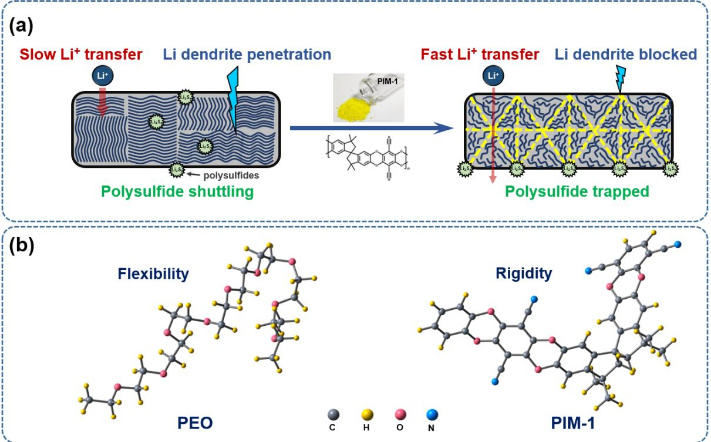

**Scheme 1.** (a)Schematic illustration of how PIM-1 boosts the performance of PEO-based solidstate Li-S batteries. (b) 3D molecular structures and properties of PEO and PIM-1.

## **2. Result and Discussion**

The composite solid electrolytes were obtained by separetely dissolving PIM-1 in trichloromethane and PEO in acetonitrile, and then mixing the two to obtain a homogenous solution, which was subsequently cast on a Teflon substrate and dried, forming smooth and flat films (see methods for more details). As shown in **Figure 1a**, the prepared PEO-PIM composite solid electrolyte is a uniform bright yellow translucent membrane without obvious powder agglomerates, the opacity of the PEO-PIM membrane increases with the percentage of PIM-1 (**Figure S1**). This free-standing PEO-PIM SPE is flexible and mechanically stable, being resistant to bending without cracking **(Figure 1a)**. Scanning electron microscope (SEM) images show that the surface morphology of PEO-PIM is flat and smooth without phase segregation (**Figure S2**). As PIM-1 is known to be good at film-forming (**Figure S3**), this suggests that instead of distributed independently, PIM-1 tends to form a (partially) connected network within the composite electrode.

It is well known that the mechanical properties of SPEs are critical to the overall performance of solid-state batteries: high mechanical strength is essential to resist lithium dendrite growth and withstand stress. [32] The tensile strength of the as-prepared solid electrolytes with different ratios of PIM-1 were assessed by stress-strain curves (**Figure 1b**). The elastic limit of PEO-PIM electrolyte reaches 0.5 MPa, 0.9 MPa and 1.3 MPa as the weight percentage of PIM-1 increases to 4%, 8% and 12%, respectively (inset, **Figure 1b**), a significant improvement compared to that of pure PEO (0.3 MPa). The high elastic limit reveals that PEO-PIM electrolytes could better resist elastic deformation under the influence of the external environment. It is noteworthy that PEO-PIM (8%) exhibits the highest elongation strain limit (2000%), which infers that an excess amount of PIM-1 may compromise elasticity. Next, in order to simulate the growth process of lithium dendrites in solid-state batteries, nanoindentation was employed to measure the compressive strength of PEO and PEO-PIM (**Figure 1c**).[33] Both PEO and PEO-PIM are compressed to the same depth and the force feedback was measured synchronously. The force feedback of PEO-PIM become larger with the increase of PIM-1 content (0.8 mN, 4%; 1.5 mN, 8%; 2.2 mN, 12%), and the results are an order of magnitude higher than those for PEO (0.05 mN), thus the introduction of PIM-1 significantly improves the compressive strength.

Next, the ionic conductivity of SPEs from 30 ℃ to 70 ℃ was measured by electrochemical impedance spectroscopy (EIS). The Nyquist (**Figure 1d**) and Arrhenius (**Figure 1e**) plots of PEO and PEO-PIM electrolytes show that as the ratio of PIM-1 increases, the conductivity of the SPEs initially increases, up to a maximum at 4%, then decreases (see detailed data in **Figure S4**). Above 8% the conductivity is lower than pure PEO. This drop in conductivity is expected due to the low intrinsic conductivity of the PIM, hence excessive PIM-1 in the composite polymer electrolyte will block ion transfer pathways by disrupting the continuity of PEO domains. However, at low percentages PIM-1 does increase the SPE conductivity. The ionic conductivity of PEO-based SPEs is closely related to its crystallinity.[21] Low crystallinity

improves the chain motility of PEO, allowing it to rapidly transfer Li+ in the interlayer channels.[24] Additionally, XRD patterns of the composite electrolytes (**Figure S6**) also infer that PIM-1 has lowered the crystallinity of PEO.

Differential scanning calorimetry (DSC) was carried out to further investigate the mechanism of improved Li-ion conductivity. To exclude the impact of LiTFSI, composite electrolytes without lithium salt were measured (**Figure 1f**). The incorporation of PIM-1 can be seen to inhibit the polymer crystallization, leading to a change of melting point from 71.7 ℃ to 65 ℃ (4 %), 66.9 ℃ (8 %) and 71.1 ℃ (12 %). The DSC results indicate that the addition of PIM-1 promotes the movement of PEO segments by disrupting the crystalline regions, which resembles the effect of adding nano-fillers into PEO-based electrolytes.[21] This can be attributed to the strong interaction between PIM-1 and PEO, which weakens the intermolecular interaction between PEO chains, hence the lowering the crystallinity. The DSC results of polymer electrolyte containing lithium salt are presented in **Figure S7**. The significant decrease of melting point from 62.1 to 55 ℃ with the introduction of PIM-1 (8 %) indicates that the mechanism of improved Li-ion conductivity discussed above also hold for the solid polymer electrolytes in practical application.

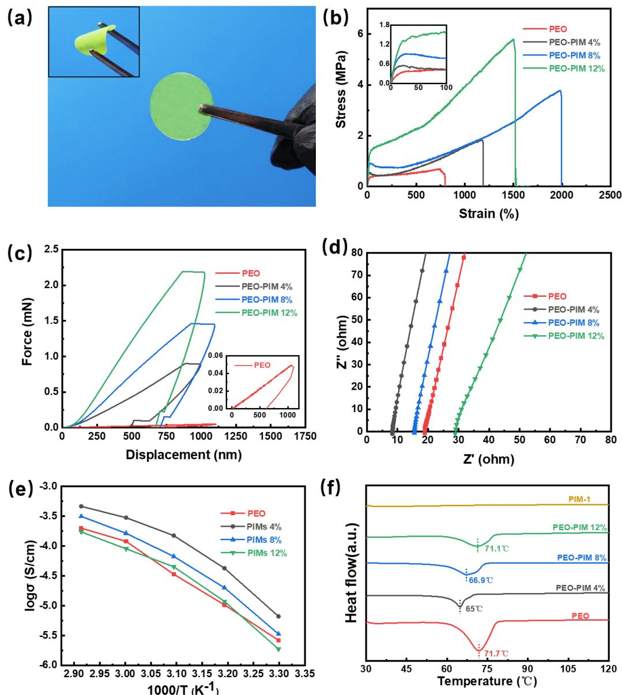

**Figure 1.** (a) Optical photographs of prepared PEO-PIM membranes. (b) Stress-strain curves of PEO and PEO-PIM (4 %, 8 % and 12 %) under tensile test. (c) Load-displacement curves of PEO and PEO-PIM (4 %, 8 % and 12 %) under nano-indentation test. (d) EIS curves of PEO and PEO-PIM(4 %, 8 % and 12 %) at working temperature (60 ℃). (e) Ionic conductivities of PEO and PEO-PIM (4 %, 8 % and 12 %). (f) DSC profiles of PIM-1 material, PEO and PEO-PIM (4 %, 8 % and 12 %) membrane in the absence of Li salt.

Quantitative nano-mechanics (QNM) mode atomic force microscope (AFM) was applied to quantitatively reveal the changes in morphology (**Figure 2a-b**), relative modulus (**Figure 2c-d)** and adhesion (**Figure 2e-f)** caused by the addition of 8 % PIM-1 to PEO. [34] Compared with the surface morpholohy of PEO (Figure 2a), PEO-PIM exhibits a rougher surface (see detailed data in Table S1) with smaller domains, infering a lowered crystallinity, which is in accordance with DSC results. Moreover, the average modulus of the PEO-PIM (8 %) sample was found to be 8.48 GPa (**Figure 2c)**, significantly higher than that found for PEO alone 0.87 GPa (**Figure 2d)**, confirming that the PIM improves the mechanical strength of the SPE. Interestingly, although it is generally seen that an increase in hardness is accompanied a decrease of adhesion which leads a poor contacted interface between SPE and electrodes, [35] the average adhesion force of PEO-PIM membrane (**Figure 2e**) is even higher than that PEO (213 vs 114 nN, **Figure 2f**). This could provide further evidence that the addition of rigid PIM-1 not only forms a hard framework to improve the mechanical strength at the macroscopic level, but also disrupts the crystalline regions of PEO to promote segment movement at the microscopic level. As a result, PEO-PIM inherits not only the rigidity of PIM-1, [31] meaning it can resist lithium dendrite penetration, but also the flexibility of PEO[17] to enable good contact with electrodes.

Fourier transform infrared (FT-IR) measurements were applied to investigate the nature of the interactions between PIM-1 and PEO (**Figure S8**), and no additional peaks are observed in the spectra after mixing. This suggests that there is no significant chemical bonding between PIM-1 and PEO. It can be speculated that the interactions between PIM-1 and PEO mainly result from the dipole-dipole attraction between 1,4-dicyanooxanthrene functional groups in PIM-1 monomer with the O atoms of the ether groups in the PEO segments.

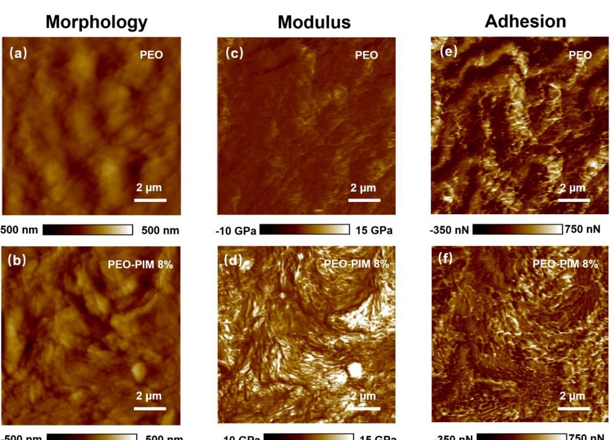

**Figure 2.** Surface morphology and corresponding mechanical properties of solid polymer electrolytes measured via AFM. (a) PEO morphology, (b) PEO-PIM morphology, (c) PEO modulus distribution, (d) PEO-PIM modulus distribution, (e) PEO adhesion distribution, (f) PEO-PIM adhesion distribution.

Although mechanical tests can be indicative of an SPE's resistance against Li dendrites, this must also be proven in-situ. The stability of the PEO-PIM electrolyte against penetration of dendrites was tested in symmetric Li/SPE/Li cells via galvanostatic plating and stripping at 60 ℃ (**Figure 3**). The symmetric cells using PEO-PIM (8 %) demonstrate outstanding stability: At 0.05 mA cm-2 they present an initial overpotential of 0.015 V and remain operative for over 700 h (**Figure S11c**); At 0.2mA cm-2 the overponteial is 0.055V and the cells survive for over 250 h (**Figure 3a**). This is in sharp contrast to the equivalent data for the pure PEO electrolyte, which displays a sudden potential drop after 124 h (0.05 mA cm-2 ) and 28 h (0.2 mA cm-2 ) of cycling, due Li dendrites piercing the electrolyte to cause a short circuit. [36] The overpotential of the PEO electrolyte reached 0.078 V at 0.2 mA cm-2 ,much higher than that for the PEO-PIM electrolyte. The impact of the PIM-1 ratio in the SPEs on Li plating/stripping performance was

also tested. Although the SPE with 4% of PIM-1 has been shown to exhibit the highest ionic conductivity, which is also reflected in the fact it had lowest overpotential (0.01 V at 0.05 mA cm-2 and 0.05 V at 0.2 mA cm-2 ), it appears less able to resist Li dendrite growth as it short circuited within short periods (**Figure S11b** and **Figure 3a**). As the ratio increases to 12 %, the mechanical the ionic conductivity becomes too low, leading to the large overpotentials, although the cells did still survive for extended periods (**Figure S11d** and **Figure 3a**). Operation at higher current densities is also desirable for solid-state batteries, hence the current limit of Li/SPE/Li cells was investigated. [37] **Figure 3b** and **Figure 3c** demonstrate that PEO-PIM (8 %) can function at 0.5 mA cm-2 , while sudden failure occurs in the cell with pristine PEO at this current density. The improved critical current density widens the application of PEO-based SPE in Li metal batteries.

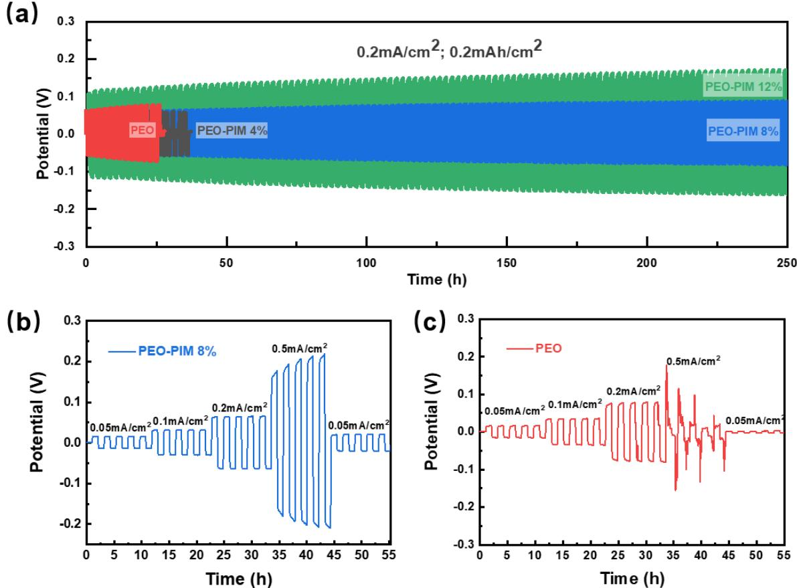

**Figure 3.** Voltage profiles of Li symmetrical cells of (a) PEO and PEO-PIM (4 %,8 % and 12 %) at 0.2 mA cm-2 . (b) PEO-PIM (8 %) and (c) PEO at different current densities from 0.05 to 0.5 mA cm-2 .

It has been previously reported that the 1,4-dicyanooxanthrene functional group in PIM-1 exhibits strong eletrophilicity, which is likely to bond with nucleophilic polysulfides.[26,38] Density functional theory (DFT) simulations were used to identify the probable binding sites (**Figure 4a** and **Figure S12**, taking Li2S6 for an example) and binding energies (**Figure 4b** and **Table S2**) of various polysulfide species (Li2S2~Li2S8) with PIM-1 and PEO. The DFT results show that the binding energies of PIM-1 to polysulfides are much higher than those of PEO by 60.0 to 86.4 %. Hence, polysulfides are likely to be trapped on the active site of immobile PIM-1 in Li-S cells (according to the DSC results in **Figure 1f**, melting point of PIM-1 is far beyond 60 ℃), rather than to the ether bonds of PEO, whose chain segments are mobile at this working temperature. This may act to mitigate the shuttling effect and reduce loss of inventory.

To confirm the suppressing effect of PIM-1 on polysulfide shuttling, cathodes consisting of sublimed sulfur without a carbon host (so its impact can be ruled out) were prepared for cell testing at 60 ℃. Cycling performance of cells using PEO and PEO-PIM (4 %, 8 % and 12 %) SPEs is compared in **Figure 4c**. The cell with pristine PEO shows rapid failure after a small number of cycles, which is likely, in part, due to the unconstrained polysulfide shuttling. By contrast, the addition of PIM-1 facilitates much improved capacity retention with an optimal ratio of 8 %, which outperforms other ratios. It is speculated that an insufficient amount (4 %) of PIM-1 cannot effectively block polysulfide shuttling while an excessive amount (12 %) could cause the loss of active materials due to the strong binding between polysulfide and PIM-1.

Next, to further investigate the inhibition effect of polysulfide shuttling, S2p X-ray photoelectron spectra (XPS) of lithium anodes cycled (3 cycles) in cells with PEO-PIM (8%) and PEO electrolytes are shown in **Figure 4d** and **Figure 4e**, respectively. The characteristic peaks of Li2S2 at 161.4 eV[8] are detected on the anode with PEO and not found for PEO-PIM. In addition, the relative intensity ratio between PS species and SO2/SO3 2 for PEO electrolyte is much higher than PEO-PIM, revealing that PEO caused much severe polysulfide dissolution compared with PEO-PIM electrolyte.

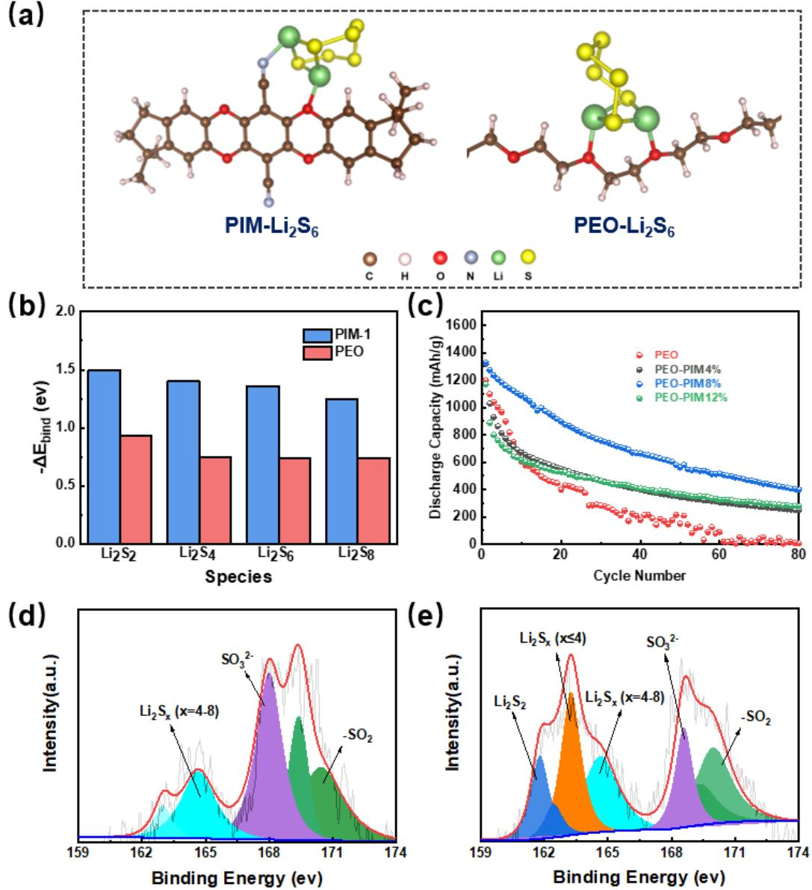

**Figure 4.** (a) Fully optimized structures of the stationary points for Li2S6 on PEO and PIM-1. (b) DFT calculation results of the corresponding binding energies of various polysulfides (Li2S2-Li2S8) with PEO and PIM, respectively. (c) Cycling performance of S/PEO/Li cells and S/PEO-PIM/Li(4 %, 8 %, 12 %) in the absence of hosting materials for sulfur under 0.05 C at 60 ℃. XPS S2p spectra of lithium electrode obtained from (d) S/PEO-PIM/Li and (e) S/PEO/Li cells after three cycles.

Full cells consisting of a sulfur-carbon composite cathode, a Li metal anode and the PEObased SPEs were assembled and tested to assess the SPEs in an industrially-relevant configuration at 60 ℃. Since the PIM-1 (8 %) material exhibited the best overall performance, this ratio was used for the PEO-PIM full cell tests. Rate performance is first evaluated. As shown in **Figure 5a**, the battery capacity of PEO-PIM-8 % at 0.1C remains much more stable

(only 135 mA h g-1 capacity decay) than PEO (503 mA h g-1 capacity fading), showing that the PIM-1 framework does retard the shuttling effective at low rate conditions. Furthermore, the capacity remained above 600 mA h g-1 for PEO-PIM-8 % at a high rate of 2 C, while PEO only delivers 366 mA h g-1 . The corresponding voltage profiles are presented in **Figure 5b** and **Figure 5c**. Next, the cycle life of the PEO-PIM-8 % and PEO cells at 0.5 C rate is compared in **Figure 5d** and **Figure 5e**. The cell with PEO-PIM-8 % electrolyte exhibits an initial capacity of 1181 mA h g-1 , which outperforms that with PEO (928 mA h g-1 ). In addition, the capacity of PEO dropped dramatically below 500 mA h g-1 after only 26 cycles. Whereas, PEO-PIM (8 %) maintained a capacity over 890 mAh g-1 after 50 cycles and 730 mAh g-1 after 100 cycles, indicating much a more stable cycling performance. Moreover, a high Coulombic efficiency over 98 % can be retained in the cell using PEO-PIM-8 %, which is much higher than those using PEO (less than 90 % after 100 cycles). This is another evidence for suppressed shuttle effect with the introduction of PIM-1 framework. It is noteworthy that although PIM-1 has facilitated enhanced cycling performance, the shuttling issue in this system cannot be fully addressed by itself as polysulfide will diffuse along the percolating PEO domains and leads to inevitable capacity fading. In addition, cathode optimization, which is critical to electrochemical performance, should be implemented to jointly mitigate the loss of polysulfide species.[39-41]

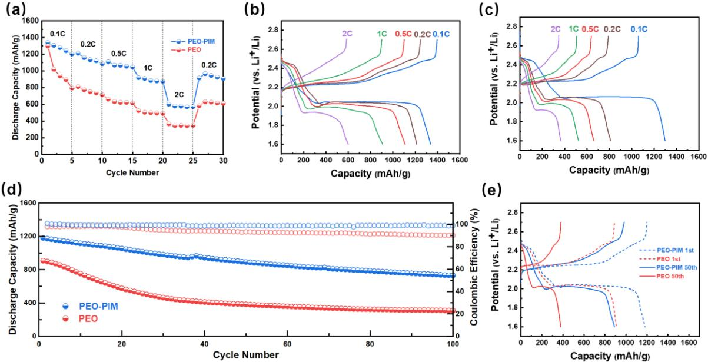

**Figure 5.** (a) Rate discharge capacities of S@C/PEO-PIM/Li and S@C/PEO/Li at different rate. Charge-discharge profiles of (b) S@C/PEO-PIM/Li and (c) S@C/PEO/Li at different rate (0.1C, 0.2C, 0.5C, 1C, 2C). (d) Comparison of cycling performance of S@C/PEO-PIM/Li and S@C/PEO/Li under 0.5C. (e) Charge-discharge profiles of S@C/PEO-PIM/Li and S@C/PEO/Li of 0.5C at 1st cycle and 50th cycle under 0.5C.

To further demonstrate the advantages offered by the PEO-PIM electrolyte in terms of flexibility and mechanical resilience, solid-state Li-S pouch cells (S@C/PEO-PIM/Li) were assembled and tested at 60 ℃. **Figure 4a** shows that the pouch cell works normally at 0.5 C when folded to various angles, without short circuiting or losing capacity. Moreover, as shown in **Figure 6b-d**, the pouch cell can still provide a current even after significant abuse via cutting and nail penetration, demonstrating that PEO-PIM promises excellent safety performance, highlighting the exciting future prospects of solid-state Li-S batteries.

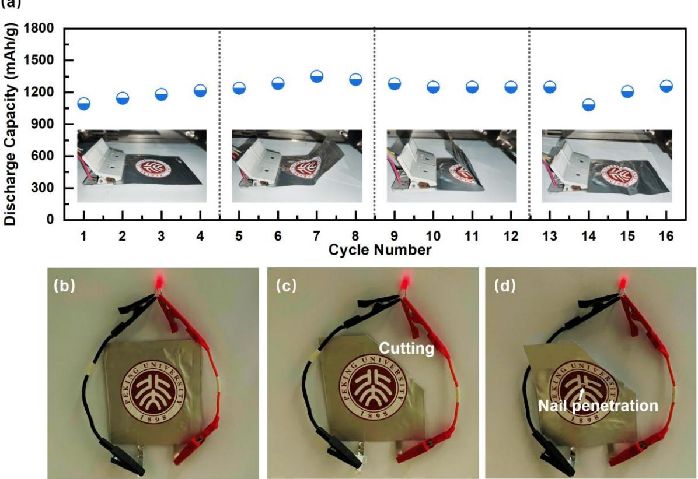

**Figure 6.** (a) Cycling performance of the assembled S@C/PEO-PIM/Li pouch cell at different bending deformation degrees at 0.5 C, 60 ℃. (b) Assembled S@C/PEO-PIM/Li pouch cell lighting a LED bulb, as well as after (c) cutting and (d) nail penetration.

## **3. Conclusion**

In summary, through employing PIM-1 as an organic framework for a PEO, a composite solid polymer electrolyte with highly desirable properties for solid-state Li-S batteries has been manufactured. Exhibiting high rigidity and contorted spiro-centers, PIM-1 has effectively boosted the mechanical strength and hardness of the PEO electrolyte by an order of magnitude, while the ionic conductivity of the composite electrolyte has also been improved due to the lowered PEO crystallinity. As a result, better stability when utilised with metallic Li anodes, and lower overpotentials, could be achieved. Moreover, PIM-1 has been shown to trap polysulfide species, owing to its electrophilic functional groups, hence mitigating the shuttling effect. Finally, solid-state Li-S batteries using a PEO-PIM composite electrolyte has achieved greatly improved rate performance, cycling stability and excellent safety features (see **Table S3** for detailed performance comparison with other reported works). By introducing one single

component exhibiting desirable properties to tackle multiple issues in a system, this work has demonstrated a simple yet effective route to modification of solid electrolytes without lengthy preparation as well as complex multi-component systems, which promotes the widespread application of solid-state battery one step further.

## **4. Experimental Section**

*Materials and chemicals:* PEO (average Mw 2,000,000), lithium bis (trifluoromethanesulfonyl)imide (LiTFSI), sublimed sulfur, anhydrous DMF, acetonitrile (CH3CN) and K2CO3 were purchased from Macklin. Carbon black (super P) and sulfur/carbon composite cathode material were supplied by Shenzhen Kejing Co., Ltd. 5,5′,6,6′-tetrahydroxy-3,3,3′,3′ tetramethylspirobisindane and 2,3,5,6-tetrafluoro-terephthalonitrile were purchased from Aladdin Chemical Co., Ltd.

*Synthesis of PIM-1*: 5,5′,6,6′-tetrahydroxy-3,3,3′,3′-tetramethylspirobisindane (10.25 g) and 2,3,5,6-tetrafluoro-terephthalonitrile (6.02 g) were mixed and dissolved in anhydrous DMF (200 ml). Anhydrous K2CO3 (33.34 g) powder was added to the mixture subsequently, and the temperature of mixture was stirred at 70 ℃ for 72 h with the atmosphere of argon. Then, the reaction was cooled down and poured into deionized water with stirring. The mixture was filtered and washed with deionized water three times, and then dried to gain the yellow solid. The crude product was dissolved in tetrahydrofuran and precipitated by methyl alcohol in order to gain the PIM-1 final product.

*Preparation of solid polymer electrolytes (SPEs)*: The dried polyethylene oxide (PEO, Mw 2×106 , 0.3 g) was mixed with lithium bis (trifluoro-methanesulfonyl)imide (LiTFSI, 0.08 g) in 8 mL acetonitrile (CH3CN, AR grade), and the mixture was stirred at 70 ℃ for 12 h. The PIM-1 synthetic product was dissolved in trichloromethane (2 mL) and was stirred at 50 ℃ for 12 h.

Various mass ratios of PIM-1 to PEO (0 %, 4 %, 8 %, 12 %) were obtained by mixing the two solutions mentioned above. The new mixture colloidal was stirred at 50 ℃ for 12 h and casted onto the Teflon substrate in argon-filled glove box. The film was dried at room temperature, forming smooth and flat solid polymer electrolytes with the thickness ~ 50 μm.

*Material characterization*: A Bruker D8 Advance X-ray diffraction analyzer (Cu Kα radiation, λ ¼ 0.154 nm) was applied to detect the crystal structure of the polymer electrolyte films. The morphology of the electrolytes was characterized using a field-emission scanning electron microscope (ZEISS Supra 55), with the voltage of 5.0 kV. The FT-IR spectra were obtained by a PerkinElmer Frontier FT-IR analyzer. Stress-strain curves were recorded using a MARK-10 ESM303 mechanical tester at a speed of 2.5 mm s-1 . Nano-indentation was tested via Agilent U9820A Nano Indenter G200. Thermo gravimetric analysis (TGA) and was measured by METTLER TOLEDO TGA/DSC1 system to detect the decomposition temperature of the polymer electrolytes. A Bruker Multimode 8 atomic force microscope was applied to test the surface morphology, modulus and adhesion of polymer membranes.

*Battery assembly*: Cathode electrodes was prepared by mixing the sublimed sulphur or S@C composite material, super P and polyvinylidene fluoride (PVDF) in a weight ratio of 8:1:1. The N-methylpyrrolidone (NMP) was used as the solvent and stirred to form a homogeneous slurry, which was subsequently coated onto an aluminum foil using a 300 µm height blade. The slurry was dried in a vacuum oven at 80℃ for 12 h and punched into 10 mm diameter plates. The active material loading of cathode electrode was around 1 mg cm-2 . Then, the newly punched electrodes were dried in a vacuum oven for 12 h and prepared to be assembled. 2025-type coin cells were assembled by fabricating stainless steel (SS)/SPE/SS, Li/SPE/SS, Li/SPE/Li and cathode electrodes (S/C and S)/SPE/Li in an Argon-filled glove box.

*Electrochemical measurements*: The galvanostatic discharge-charge tests of coin cells were applied by Neware battery cycler at 60℃. The capacity and cycling stability measurements of S and S/C half cells were tested at different rate. Symmetrical Li cells with different ratio of PIM-1 were charged and discharged at the current densities of 0.05 mA cm-2 and 0.2 mA cm-2 , respectively to measure the resistance against Li dendrites. Linear sweep voltammetry (LSV) was measured using a CHI 660E electrochemical workstation from open-circuit potential to 6 V to detect the electrochemical windows. Electrochemical impedance spectroscopy (EIS) were tested by Solartron electrochemical workstation with a frequency range of 1 MHz-100 mHz to measure the ionic conductivities at different temperature.

*Density functional theory (DFT) calculations*: All calculations were based on the Gaussian 09 package by the density functional theory (DFT) method. We used m062x/6-311G\*\* theory level to optimize the molecular structure and calculate the adsorption binding energies. The split-valence-shell Gaussian basis set 6-311G\*\* was used for the C, O, H, N, S, and Li atoms. Gauss View software was used to process the data and draw the Structural diagram. The adsorption binding energy (∆bind) was calculated to measure the binding strength of Li2Sn (Li2S2, Li2S4, Li2S6, Li2S8) species and the polymer X (PEO/PIM-1). It was defined by

$$
\Delta E_{\text{bind}} = E_{\text{Li}_2\text{S}_n + \text{X}} - E_{\text{Li}_2\text{S}_n} - E_{\text{X}} + E_{\text{BSSE}}
$$

where Li2Sn+X denotes the total energy of the Li2Sn/X adsorbed system; the Li2Sn and X are the energies of isolated Li2Sn species and PEO(PIM-1) calculated at their states. The last term BSSE is the energy of the basis set superposition error (BSSE) which was obtained by using the counterpoise method.

## **Supporting Information**

Supporting Information is available from the Wiley Online Library or from the author.

## **Acknowledgements**

Y. Ji, K. Yang, M. Liu and S. Chen contributed equally to this work. This research was financially supported by National Key R&D Program of China (2016YFB0700600), National Key R&D Program of China (2016YFB0100300), the Shenzhen Science and Technology Research Grant (JCYJ20200109140416788), the Chemistry and Chemical Engineering Guangdong Laboratory (Grant No.19220180), National Key R&D Program of China (2020YFB07045000). T. Miller thanks the Faraday Institution (EP/S003053/1) for support via the LiSTAR project (FIRG014).

> Received: ((will be filled in by the editorial staff)) Revised: ((will be filled in by the editorial staff)) Published online: ((will be filled in by the editorial staff))

## References

- [1] J. Zheng, Y. Ye, F. Pan. *Natl. Sci. Rev.* **2020**, 7, 242.
- [2] S. Yang, R. He, Z. Zhang, Y. Cao, X. Gao, X. Liu. *Matter* **2020**, 3, 27.
- [3] L. Yang, K. Yang, J. Zheng, K. Xu, K. Amine, F. Pan. *Chem. Soc. Rev.* **2020**, 49, 4667.
- [4] M. Jana, R. Xu, X.-B. Cheng, J. S. Yeon, J. M. Park, J.-Q. Huang, Q. Zhang, H. S. Park. *Energy Environ. Sci.* **2020**, 13, 1049.
- [5] W. J. Chen, B. Q. Li, C. X. Zhao, M. Zhao, T. Q. Yuan, R. C. Sun, J. Q. Huang, Q. Zhang. *Angew. Chem. Int. Ed. Engl.* **2020**, 59, 10732.
- [6] S. H. Kim, J. H. Kim, S. J. Cho, S. Y. Lee. *Adv. Energy Mater.* **2019**, 9, 1901841.
- [7] M. Li, J. E. Frerichs, M. Kolek, W. Sun, D. Zhou, C. J. Huang, B. J. Hwang, M. R. Hansen, M. Winter, P. Bieker. *Adv. Funct. Mater.* **2020**, 30, 1910123.
- [8] Y.-X. Song, Y. Shi, J. Wan, S.-Y. Lang, X.-C. Hu, H.-J. Yan, B. Liu, Y.-G. Guo, R. Wen, L.-J. Wan. *Energy Environ. Sci.* **2019**, 12, 2496.
- [9] J. Xiang, L. Yang, L. Yuan, K. Yuan, Y. Zhang, Y. Huang, J. Lin, F. Pan, Y. Huang. *Joule* **2019**, 3, 2334.
- [10] M.-c. Pang, K. Yang, R. Brugge, T. Zhang, X. Liu, F. Pan, S. Yang, A. Aguadero, B. Wu, M. Marinescu, H. Wang, G. J. Offer. *Mater. Today*, DOI: 10.1016/j.mattod.2021.02.011.

19

- [11] X. Yang, M. Jiang, X. Gao, D. Bao, Q. Sun, N. Holmes, H. Duan, S. Mukherjee, K. Adair, C. Zhao, J. Liang, W. Li, J. Li, Y. Liu, H. Huang, L. Zhang, S. Lu, Q. Lu, R. Li, C. V. Singh, X. Sun. *Energy Environ. Sci.* **2020**, 13, 1318.
- [12] Z. Wang, L. Yang, J. Liu, Y. Song, Q. Zhao, K. Yang, F. Pan. *ACS Appl. Mater. Interfaces* **2020**, 12, 48677.
- [13] Z. Xue, D. He, X. Xie. *J. Mater. Chem. A* **2015**, 3, 19218.
- [14] M. Yan, J. Y. Liang, T. T. Zuo, Y. X. Yin, S. Xin, S. J. Tan, Y. G. Guo, L. J. Wan. *Adv. Funct. Mater.* **2019**, 30, 1908047.
- [15] R. Fang, H. Xu, B. Xu, X. Li, Y. Li, J. B. Goodenough. *Adv. Funct. Mater.* **2020**, 31, 2001812.
- [16] B. K. Money, J. Swenson. *Macromolecules* **2013**, 46, 6949.
- [17] L. Yang, Z. Wang, Y. Feng, R. Tan, Y. Zuo, R. Gao, Y. Zhao, L. Han, Z. Wang, F. Pan. *Adv. Energy Mater.* **2017**, 7, 1701437.
- [18] H. Zhang, U. Oteo, X. Judez, G. G. Eshetu, M. Martinez-Ibañez, J. Carrasco, C. Li, M. Armand. *Joule* **2019**, 3, 1689.
- [19] G. G. Eshetu, X. Judez, C. Li, M. Martinez-Ibañez, I. Gracia, O. Bondarchuk, J. Carrasco, L. M. Rodriguez-Martinez, H. Zhang, M. Armand. *J. Am. Chem. Soc.* **2018**, 140, 9921.
- [20] C. Wang, T. Wang, L. Wang, Z. Hu, Z. Cui, J. Li, S. Dong, X. Zhou, G. Cui. *Adv. Sci.*  **2019**, 6, 1901036.
- [21] R. Tan, J. Yang, J. Zheng, K. Wang, L. Lin, S. Ji, J. Liu, F. Pan. *Nano Energy* **2015**, 16, 112.
- [22] N. Wu, P. H. Chien, Y. Qian, Y. Li, H. Xu, N. S. Grundish, B. Xu, H. Jin, Y. Y. Hu, G. Yu, J. B. Goodenough. *Angew. Chem. Int. Ed. Engl.* **2020**, 59, 4131.
- [23] J. Wan, J. Xie, X. Kong, Z. Liu, K. Liu, F. Shi, A. Pei, H. Chen, W. Chen, J. Chen, X. Zhang, L. Zong, J. Wang, L. Q. Chen, J. Qin, Y. Cui. *Nat. Nanotechnol.* **2019**, 14, 705.
- [24] P. Zhai, N. Peng, Z. Sun, W. Wu, W. Kou, G. Cui, K. Zhao, J. Wang. *J. Mater. Chem. A* **2020**, 8, 23344.
- [25] H. Wu, Y. Xu, X. Ren, B. Liu, M. H. Engelhard, M. S. Ding, P. Z. El‐Khoury, L. Zhang, Q. Li, K. Xu, C. Wang, J. G. Zhang, W. Xu. *Adv. Energy Mater.* **2019**, 9, 1902108.
- [26] S. E. Doris, A. L. Ward, P. D. Frischmann, L. Li, B. A. Helms. *J. Mater. Chem. A* **2016**, 4, 16946.
- [27] G. Genduso, Y. Wang, B. S. Ghanem, I. Pinnau. *J. Membr. Sci.* **2019**, 584, 100.
- [28] X. Wu, Z. Tian, S. Wang, D. Peng, L. Yang, Y. Wu, Q. Xin, H. Wu, Z. Jiang. *J. Membr. Sci.* **2017**, 528, 273.
- [29] H. Zhao, Q. Xie, X. Ding, J. Chen, M. Hua, X. Tan, Y. Zhang. *J. Membr. Sci.* **2016**, 514, 305.
- [30] B. K. Gupta, G. Kedawat, P. Kumar, M. A. Rafiee, P. Tyagi, R. Srivastava, P. M. Ajayan. *J. Mater. Chem. C* **2015**, 3, 2568.
- [31] P. M. Budd, B. S. Ghanem, S. Makhseed, N. B. McKeown, K. J. Msayib, C. E. Tattershall. *Chem. Commun. (Camb.)* **2004**, 230.
- [32] H. L. Guo, H. Sun, Z. L. Jiang, J. Y. Hu, C. S. Luo, M. Y. Gao, J. Y. Cheng, W. K. Shi, H. J. Zhou, S. G. Sun. *ACS Appl. Mater. Interfaces* **2019**, 11, 46783.
- [33] L. Liu, J. Lyu, J. Mo, H. Yan, L. Xu, P. Peng, J. Li, B. Jiang, L. Chu, M. Li. *Nano Energy* **2020**, 69.
- [34] L. L. Jia, Y. C. Ji, K. Yang, Z. J. Wang, H. B. Chen, F. Pan. *Chin. J. Struct. Chem.* **2020**, 39, 200.
- [35] M. B. Dixit, W. Zaman, N. Hortance, S. Vujic, B. Harkey, F. Shen, W.-Y. Tsai, V. De Andrade, X. C. Chen, N. Balke, K. B. Hatzell. *Joule* **2020**, 4, 207.
- [36] H. Qin, K. Fu, Y. Zhang, Y. Ye, M. Song, Y. Kuang, S.-H. Jang, F. Jiang, L. Cui. *Energy Storage Mater.* **2020**, 28, 293.
- [37] Y. Song, L. Yang, L. Tao, Q. Zhao, Z. Wang, Y. Cui, H. Liu, Y. Lin, F. Pan. *J. Mater. Chem. A* **2019**, 7, 22898.
- [38] J. W. Jeon, D. M. Kim, J. Lee, J. C. Lee, Y. S. Kim, K. T. Lee, B. G. Kim. *J. Mater. Chem. A* **2020**, 8, 3580.
- [39] Y. Yao, H. Wang, H. Yang, S. Zeng, R. Xu, F. Liu, P. Shi, Y. Feng, K. Wang, W. Yang, X. Wu, W. Luo, Y. Yu. *Adv. Mater.* **2020**, 32, e1905658.
- [40] R. Wang, J. Yang, X. Chen, Y. Zhao, W. Zhao, G. Qian, S. Li, Y. Xiao, H. Chen, Y. Ye, G. Zhou, F. Pan. *Adv. Energy Mater.* **2020**, 10, 1903550.
- [41] Y. Wang, Y. Yu, Y. Tan, T. Li, Y. Chen, S. Wang, K. Sui, H. Zhang, Y. Luo, X. Li. *Adv. Energy Mater.* **2019**, 10, 1903233.

The unique molecular structure of PIM-1 not only enhances the mechanical properties of PEO electrolyte, but also increases its intrinsic ionic conductivity by lowering the degree of crystallinity. Moreover, polysulfide shuttling effect is also reatrded due to the higher binding energy between polysulfides and electrophilic functional groups. As a result, the PEO-PIM composite electrolyte enables high-performance solid-state Li-S batteries.

Yuchen Ji, Kai Yang, Mingqiang Liu, Shiming Chen, Xinhua Liu\*, Biao Yang, Zijian Wang, Weiyuan Huang, Zhibo Song, Shida Xue, Yanda Fu, Luyi Yang\*, Thomas S Miller and Feng Pan\*

# **PIM-1 as a multifunctional framework to enable high-performance solid-state Li-S batteries**

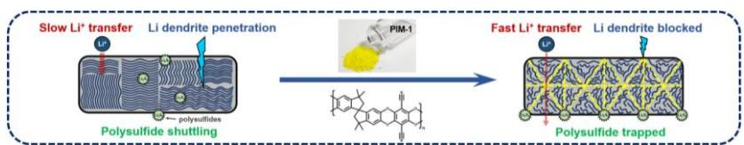

# Supporting Information

# **PIM-1 as a multifunctional framework to enable high-performance solid-state Li-S batteries**

*Yuchen Ji, Kai Yang, Mingqiang Liu, Shiming Chen, Xinhua Liu\*, Biao Yang, Zijian Wang, Weiyuan Huang, Zhibo Song, Shida Xue, Yanda Fu, Luyi Yang\*, Thomas S Miller and Feng Pan\** 

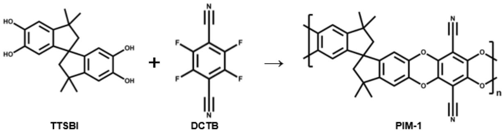

**Scheme S1.** Reaction scheme for the synthesis of PIM-1.

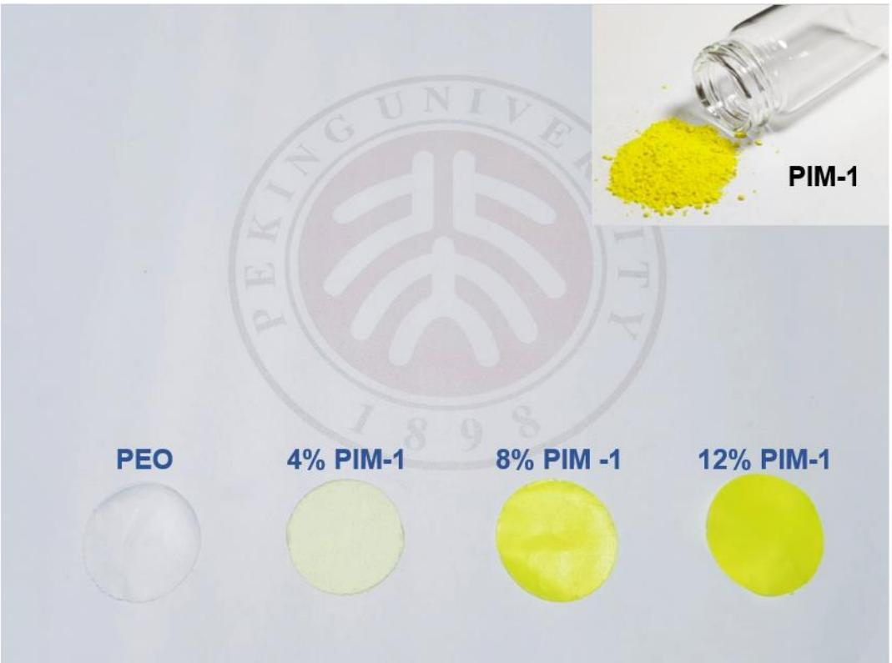

**Figure S1.** Optical photographs of prepared PIM-1 powder and PEO membranes with different ratios of PIM-1.

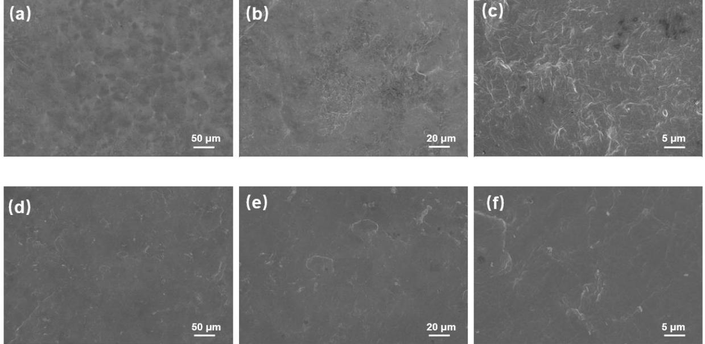

**Figure S2.** (a-c) SEM image of PEO-PIM (8%) electrolyte. (d-e) SEM image of PEO electrolyte.

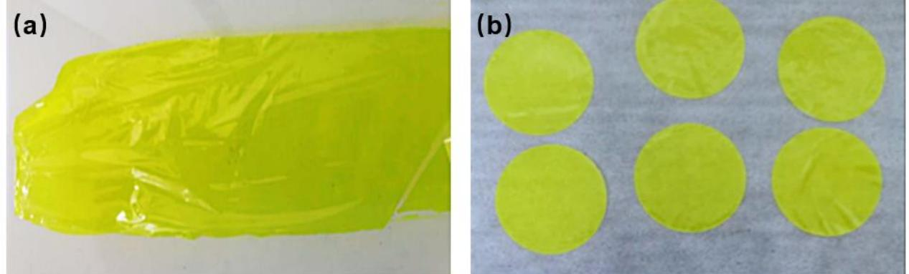

**Figure S3.** Optical photographs of prepared PIM-1 membrane (a) before and (b) after cliping to circles, indicating PIM-1 has good film-forming property.

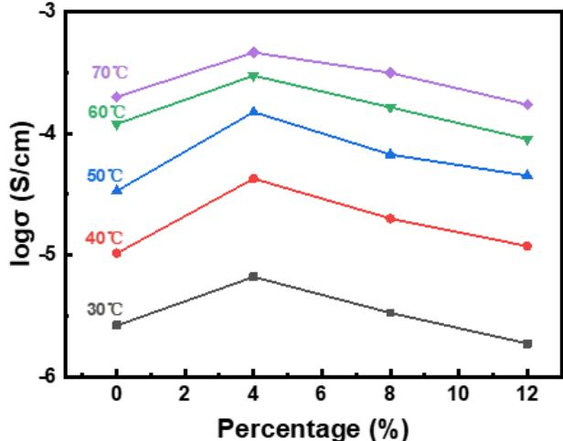

**Figure S4.** Ionic conductivities of PEO and PEO-PIM (4 %, 8 % and 12 %) from 30 ℃ to 70 ℃.

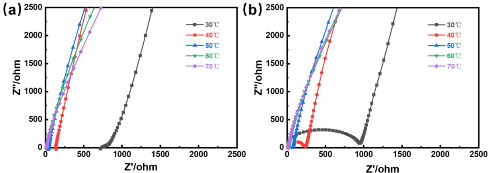

**Figure S5.** (a) EIS curves of PEO-PIM (8 %) at different temperature. (b) EIS curves of PEO at different temperatures.

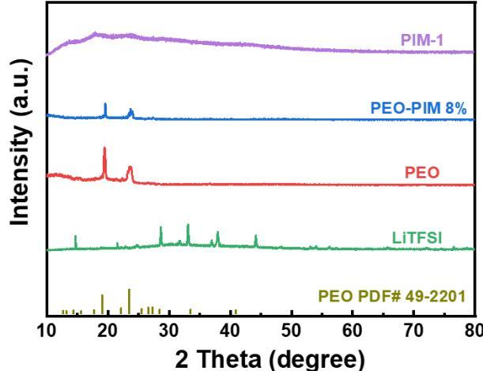

**Figure S6.** XRD patterns of PIM-1 powder, PEO-PIM (8 %) solid-state electrolyte, PEO solidstate electrolyte and LiTFSI powder.

**Table S1**. Roughness of PEO-PIM (8 %) and PEO membrane caculated by arithmetic average deviation (Ra) and root-mean-square deviation measured via AFM

| Sample  | PEO-PIM (8%) | PEO  |
|---------|--------------|------|
| Ra (nm) | 127          | 86.7 |
| Rq (nm) | 160          | 104  |

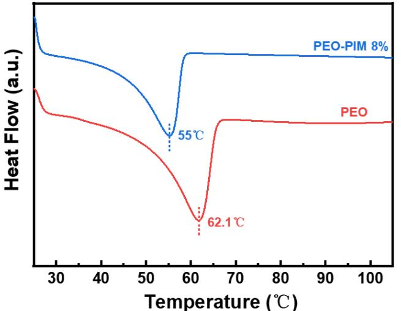

**Figure S7.** DSC profiles of PEO and PEO-PIM (8 %) electrolyte with LiTFSI.

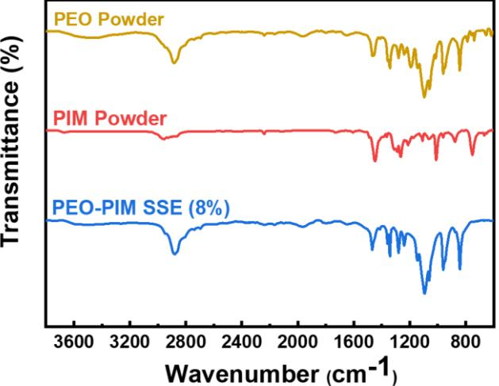

**Figure S8.** FTIR spectra of PEO powder, PIM-1 powder and PEO-PIM (8 %) solid-state electrolyte.

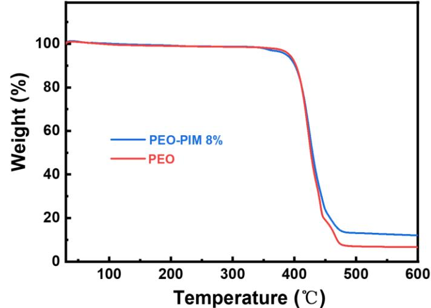

**Figure S9.** TGA profiles of PEO and PEO-PIM (8 %) electrolyte with LiTFSI.

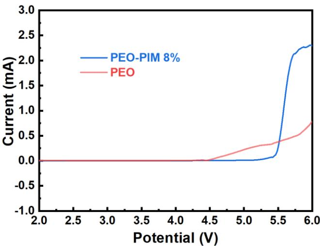

**Figure S10.** LSV plot of the PEO and PEO-PIM (8 %) electrolyte at a scan rate of 0.1 mV s−1 .

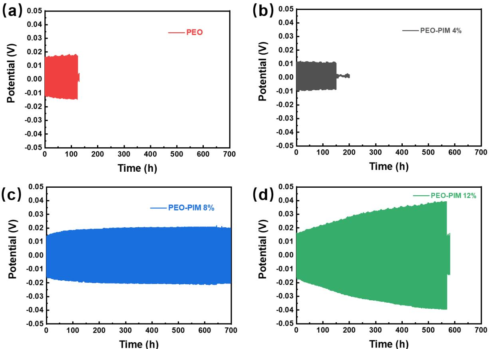

**Figure S11.** Voltage profiles of Li symmetrical cells of (a) PEO, (b) PEO-PIM (4 %), (c) PEO-PIM (8 %) and (d) PEO-PIM (12 %) at 0.05 mA cm-2 current density.

**Table S2**. Binding energies of various polysulfide species (Li2S2~Li2S8) with PIM-1 and PEO, caculated via DFT.

|       | Li2S2 (ev) | Li2S4 (ev) | Li2S6 (ev) | Li2S8 (ev) |
|-------|------------|------------|------------|------------|
| PIM-1 | 1.497176   | 1.398798   | 1.360579   | 1.241588   |
| PEO   | 0.935561   | 0.750425   | 0.733065   | 0.732548   |

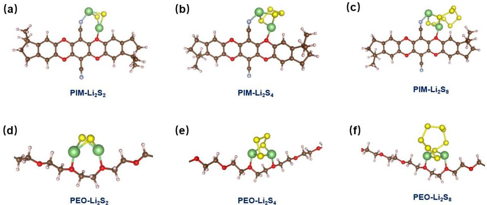

**Figure S12.** Fully optimized structures of the stationary points for (a) Li2S2 on PEO, (b) Li2S4 on PEO, (c) Li2S8 on PEO, (d) Li2S2 on PIM-1, (e) Li2S4 on PIM-1 and (f) Li2S8 on PIM-1.

| Solid electrolyte component       | Sulfur cathode                          | Capacity/ mA h g-1 | Cycl e life | Current density | Temperatur e | Coulombi c efficiency | Reference |
|--------------------------------------|-----------------------------------------|-----------------------|----------------|--------------------|-----------------|-----------------------------|-----------|
| PEO-LiTFSI                           | S@C (PVDF coating)                      | 825                   | 60             | 0.05 mA cm-2       | 55℃             | 99%                         | [1]       |
| PEO-LiFSI                            | S-containing copolymer (p(S DVB)) | 1100                  | 50             | 0.05C-0.1C         | 70℃             | N/A                         | [2]       |
| PEO-iCP-LiTFSI                       | S@C                                     | 1237                  | 100            | 0.2C               | 60℃             | N/A                         | [3]       |
| PEO-vermiculite nanosheets-LiTFSI | S@C                                     | 1254                  | 150            | 0.05C              | 60℃             | 95%                         | [4]       |
| PEO-Li6SiPON                         | S@PAN                                   | 1000                  | 100            | 0.25C              | 65-75°C         | N/A                         | [5]       |
| PEO–Ionic liquid– ZrO2            | N-CNs/S                                 | 1437                  | 40             | N/A                | 50℃             | N/A                         | [6]       |
| PEO-TiO2 nanoparticles LiTFSI  | S@C                                     | 1450                  | 100            | 0.1C               | 60℃             | N/A                         | [7]       |
| PEO-LiFSI                            | S@C (30 % S contain)                    | 900                   | 50             | 0.05C-0.1C         | 70℃             | N/A                         | [8]       |
| PEO-PIM-LiTFSI                       | S@C                                     | 1181                  | 100            | 0.5C               | 60℃             | 98%                         | This work |

**Table S3**. Summary of the performances of recently reported PEO based solid-state Li-S batteries.

## Supplementary References

- [1] R. Fang, H. Xu, B. Xu, X. Li, Y. Li, J. B. Goodenough. *Adv. Funct. Mater.* **2020**, 31, 2001812.
- [2] I. Gracia, H. Ben Youcef, X. Judez, U. Oteo, H. Zhang, C. Li, L. M. Rodriguez-Martinez, M. Armand. *J*. *Power Sources* **2018**, 390, 148.
- [3] Y. Wang, H. Ji, X. Zhang, J. Shi, X. Li, X. Jiang, X. Qu. *ACS Appl. Mater. Interfaces* **2021**, 13, 16469.
- [4] P. Zhai, N. Peng, Z. Sun, W. Wu, W. Kou, G. Cui, K. Zhao, J. Wang. *J. Mater. Chem. A* **2020**, 8, 23344.
- [5] E. Temeche, X. Zhang, R. M. Laine. *ACS Appl. Mater. Interfaces* **2020**, 12, 30353.
- [6] O. Sheng, C. Jin, J. Luo, H. Yuan, C. Fang, H. Huang, Y. Gan, J. Zhang, Y. Xia, C. Liang, W. Zhang, X. Tao. *J. Mater. Chem. A* **2017**, 5, 12934.
- [7] F. Lee, M. C. Tsai, M. H. Lin, Y. L. Ni'mah, S. Hy, C. Y. Kuo, J. H. Cheng, J. Rick, W. N. Su, B. J. Hwang. *J. Mater. Chem. A* **2017**, 5, 6708.

[8] X. Judez, H. Zhang, C. Li, J. A. Gonzalez-Marcos, Z. Zhou, M. Armand, L. M. Rodriguez-Martinez. *J. Phys. Chem. Lett.* **2017**, 8, 1956.