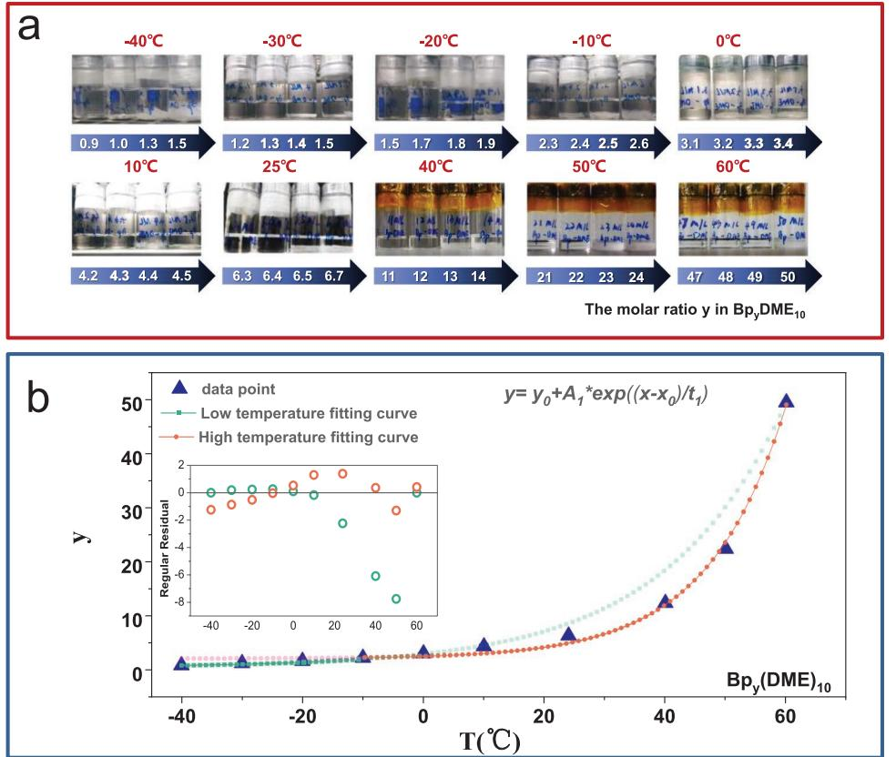
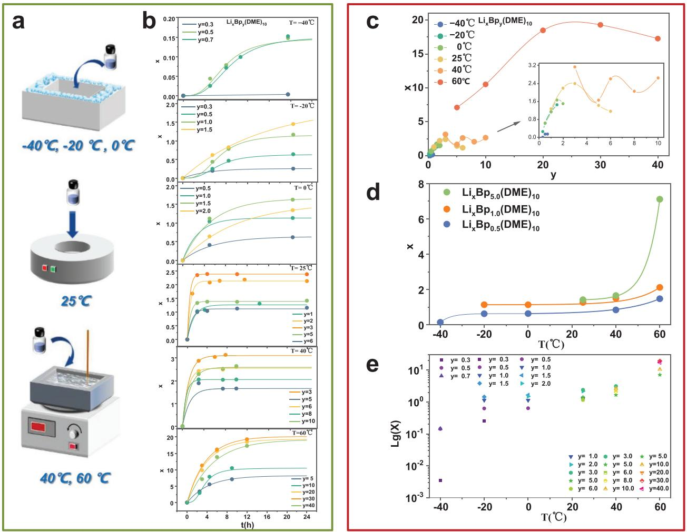
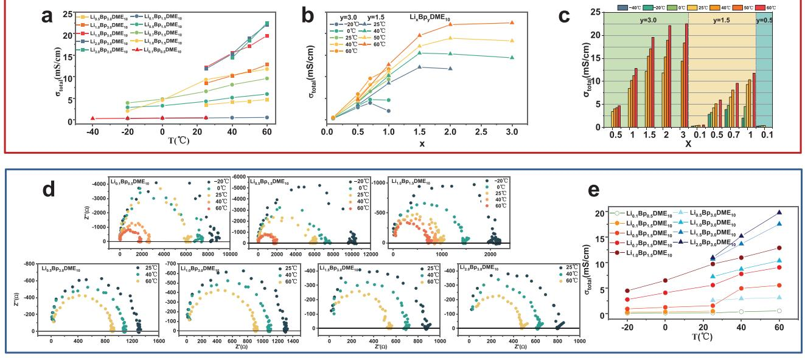
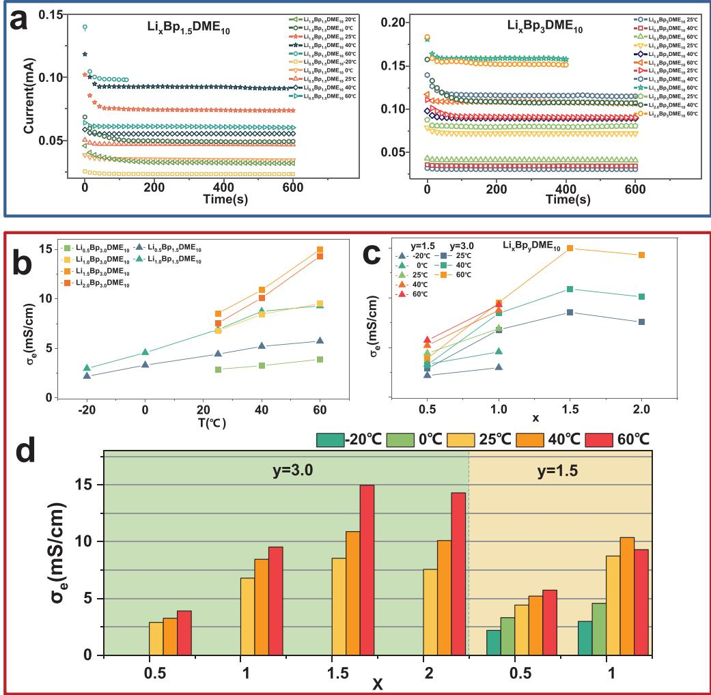
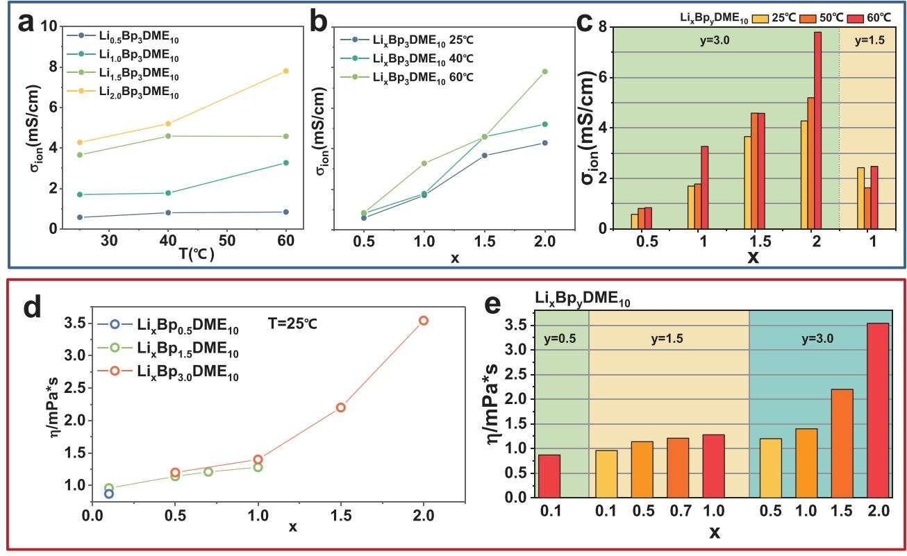
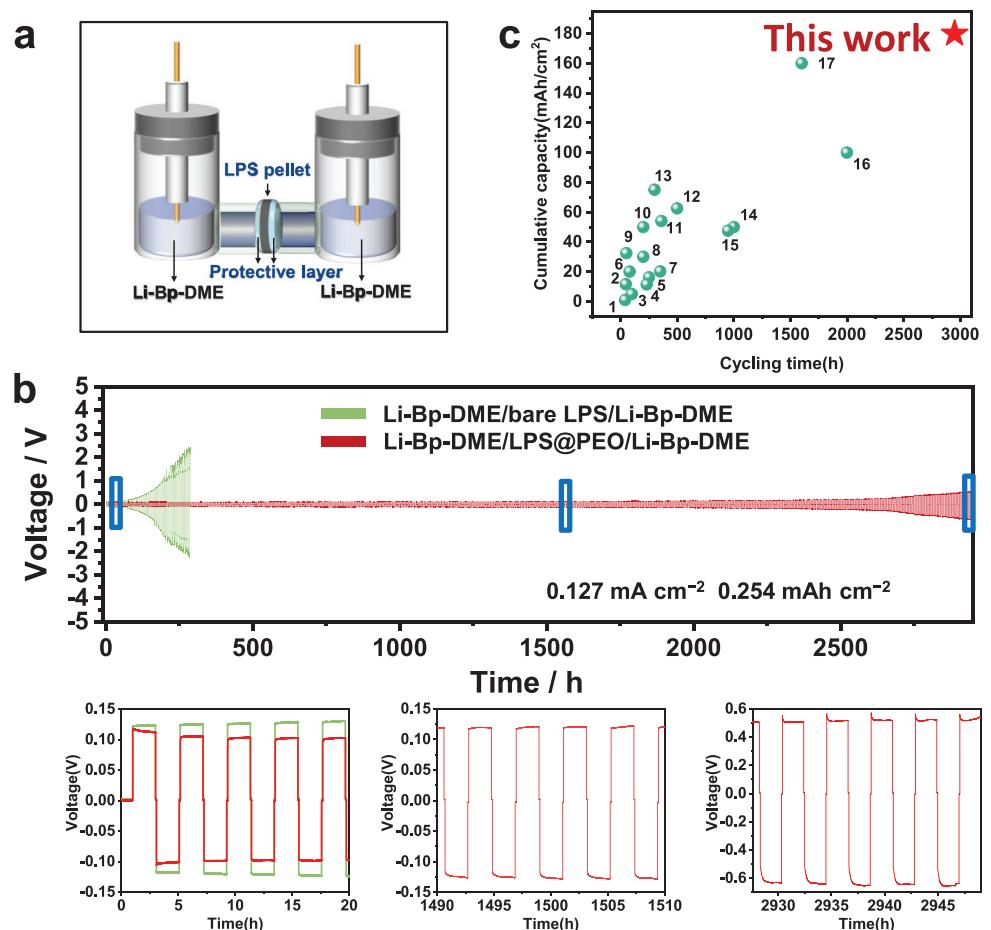
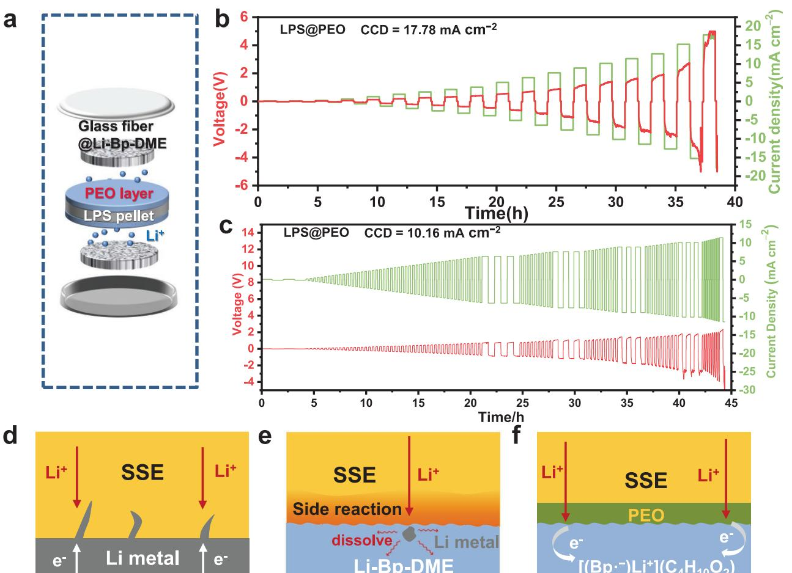
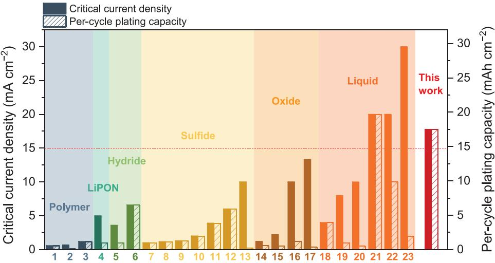

# **High Current Density and Long Cycle Life Enabled by Sulfide Solid Electrolyte and Dendrite-Free Liquid Lithium Anode**

*Jian Peng, Dengxu Wu, Fengmei Song, Shuo Wang, Quanhai Niu, Jieru Xu, Pushun Lu, Hong Li, Liquan Chen, and Fan Wu\**

**Lithium metal is the ideal anode candidate but suffers from great challenges including poor thermodynamic stability in liquid organic electrolytes and dendrite nucleation/growth during the continuous plating/stripping process. To solve the difficulties listed above, here, a battery configuration combining a liquid lithium solution anode, a sulfide solid electrolyte, and an interfacial protection layer is proposed to prevent interfacial reaction between the two components. This configuration combines the advantages of liquid-lithium-solution anode (dissolve lithium to essentially prevent lithium nucleation) and sulfide solid electrolyte (highest room-temperature ionic conductivity among all solid electrolytes and ideal mechanical ductility for fully compact layer simply by cold pressing), so that a record-high current density (17.78 mA cm−2 ) and long cycle life (nearly 3000 h) are realized. At the same time, the solubility of lithium metal in the liquid Li anode and electrochemical properties of liquid Li anode are systematically studied to find the most suitable liquid Li anode concentration with the highest room-temperature conductivity (12.2 mS cm−1 ). This work provides a promising approach and battery configuration for achieving high-specificcapacity, high-energy/power-density and long-cycle-life secondary batteries.**

J. Peng, D. Wu, F. Song, S. Wang, Q. Niu, J. Xu, P. Lu, H. Li, L. Chen, F. Wu Tianmu Lake Institute of Advanced Energy Storage Technologies Liyang, Jiangsu 213300, China E-mail: fwu@iphy.ac.cn

J. Peng, D. Wu, F. Song, S. Wang, Q. Niu, J. Xu, P. Lu, H. Li, L. Chen, F. Wu

Yangtze River Delta Physics Research Center Liyang, Jiangsu 213300, China

J. Peng, D. Wu, S. Wang, Q. Niu, J. Xu, P. Lu, H. Li, L. Chen, F. Wu Key Laboratory for Renewable Energy Beijing Key Laboratory for New Energy Materials and Devices Beijing National Laboratory for Condensed Matter Physics

Institute of Physics

Chinese Academy of Sciences

Beijing 100190, China J. Peng, D. Wu, S. Wang, Q. Niu, J. Xu, P. Lu, H. Li, L. Chen, F. Wu

University of Chinese Academy of Sciences Beijing 100049, China

F. Song, F. Wu

Nano Science and Technology Institute University of Science and Technology of China Suzhou 215123, China

The ORCID identification number(s) for the author(s) of this article can be found under https://doi.org/10.1002/adfm.202105776.

### **DOI: 10.1002/adfm.202105776**

# **1. Introduction**

Lithium anode is one of the most ideal candidates for high-energy-density batteries because of the lowest electrochemical potential (0 V vs Li/Li+) and ultra-high specific capacity (3861 mAh g−1 ). However, lithium metal reacts severely with organic liquid electrolytes due to its poor thermodynamic compatibility with organic solvents. Moreover, lithium dendrites tend to repetitively nucleate and grow from lithium metal during the continuous plating/stripping process, leading to internal short circuit and ultimately thermal runaway/fire. Recently, liquid alkali metal anode/interface layer has been proposed as an approach to suppress alkali metal dendrite growth and improve cycle stability of the batteries. For example, Chiang et al.[1] exploited semi-liquid biphasic Na–K alloys as anode. The battery has shown impressive dendrite inhibition

ability and Critical Current Density (CCD) value (15 mA cm−2 ). Similar to liquid alkali metal alloys, the alkali metal-based organic liquid metal solution (Li/Na/K-Bp-DME) anode has also attracted much attention due to its relatively low cost and high safety. This kind of highly conductive liquid anode can essentially inhibit the growth of alkali metals dendrites due to its strong ability to dissolve alkali metals even if nucleated. Hu et al.[2] used Na-Bp-DME liquid anodes in sodium-sulfur batteries, which inhibited the growth of sodium dendrites and realized good long-cycle performance. Later, to solve the longstanding metal-anode issues in potassium–oxygen batteries, Lu et al.[3,4] utilized K-Bp-DME anode with improved safety, low redox potential, fast kinetics and high reversibility. The metalanode-free organic–O2 battery demonstrated an unprecedented cycling stability. Zhou et al.[5] applied Li-Bp-DME in Li-oxygen batteries to improve the cycle stability of their batteries.

It should be noted that the traditional battery configuration including liquid electrolyte (LE) and separator is no longer applicable if liquid metal interface layer/anode is used, since the liquid can flow through the whole battery to cause internal short circuit. Therefore, solid electrolytes (SEs) must be used together with liquid alkali metal anode/interface layer to block liquid flow, and all the above studies exploited various kinds of SEs including oxide SEs (Na-*β*"-Al2O3, K-*β*"-Al2O3) and metal organic framework SEs (MOF-incorporated CPEs).

However, the above material systems still face the following challenges. (1). From the perspective of the solid electrolyte layer, oxide SE requires extremely high temperature sintering to obtain low porosity due to its mechanical stiffness, resulting in poor interfacial contact, fabrication difficulty, and easy penetration of liquid alkali metal anode into cathode through pores and cracks of oxide SE layer. This leads to not only short circuit, but also loss of liquid alkali metal anode and consequently battery failure. MOF SE suffers from high cost, complicated preparation process and poor thermal stability. Moreover, both oxide and MOF SEs have relatively low room-temperature ionic conductivity, greatly limiting the critical current density and highrate performance of their batteries. (2). From the perspective of liquid alkali metal anode, the semi-liquid Na–K alloys electrode cannot intrinsically prevent short circuit at high current densities, since liquid K or Na will cause cracks and fracture of K or Na-*β*"-Al2O3 respectively if Na-K alloy electrode contacts with *β*"-Al2O3 surface directly.[6] Moreover, Na-K alloy is even more dangerous than Li due to its higher chemical activity.[7] Furthermore, Na-K alloy can hardly dissolve lithium metal,[1] making it unsuitable for lithium-ion battery (LIB) anode or interface material. Last but not least, Na/K-Bp-DME or Na-K alloy has higher chemical potential than the Li counterparts, thus is undesirable for high energy density batteries.

To solve the above problems, we propose a new combination of sulfide SE and liquid lithium metal anode (Li-Bp-DME) system herein to further improve battery performance while retaining the advantages of Li-Bp-DME in essentially inhibiting lithium dendrite nucleation and growth. The resultant new battery configuration is expected to have much better high-rate charge/discharge performance (since sulfide SE has the highest room-temperature ionic conductivity among all SEs), almost completely blocked penetration of Li-Bp-DME and thus greatly improved cycle stability/life (a fully compact sulfide SE layer without porosity can be achieved simply by room-temperature cold pressing, due to the benign mechanical property of sulfide SE). Besides, sulfide SEs have other advantages like good thermal safety[8] and large-scale production possibility.[9] However, sulfide SE suffers from bad compatibility with Li-Bp-DME, including physical dissolution and electrochemical reaction on the interface. This results to continuous decomposition and destruction of sulfide SE during battery operation, and finally the penetration of liquid lithium metal anode (Li-Bp-DME) into sulfide SE or even short-circuit. To overcome this issue, a polymer interface layer was further applied on the interface to improve the compatibility and stability between Li-Bp-DME and sulfide SE. As a result, the new battery configuration incorporating sulfide SE, liquid lithium metal anode (Li-Bp-DME) and interfacial optimization achieved a record-high CCD (17.78 mA cm−2 ) and long cycle life (≈3000 h at current density of 0.127 mA cm−2 ). This CCD value is the highest among all SE-based batteries reported in the literature (e.g., most CCD of lithium metal batteries with sulfide SE is only 1–6 mA cm−2 (refs. [10–15])). Moreover, to comprehensively study the electrochemical properties of Li-Bp-DME, and obtain the most suitable Li-Bp-DME solution as liquid alkali metal anode, the solubility of lithium metal in Li-Bp-DME and electrochemical properties of Li-Bp-DME are systematically studied. Overall, this work provides a new approach for achieving high-rate-density, highsafety and long-cycle-life secondary batteries.

# **2. Results**

### **2.1. Solubility of Biphenyl and Metal Lithium**

Accurately measuring the solubility of lithium metal in Bp-DME solutions with different concentrations and finding the optimum concentration of Li-Bp-DME solution for higher molar amount of lithium and ionic/electronic conductivity are first priority before applying Li-Bp-DME solution as an anode.

The characterization of lithium metal solubility in Bp-DME solution is divided into two steps. First, the solubility of biphenyl in DME at different temperatures (−40 to 60 °C) was measured to provide a basis for the preparation of Bp-DME solutions with different concentrations. Then the solubility of lithium metal in Bp-DME at different temperatures (−40 to 60 °C) was measured based on the law of biphenyl solubility in DME. The blue points in **Figure 1**b are the solubility data obtained experimentally (**Table 1**), fitted by the green curve (*y*1 = 0.62195 + 2.42777 exp((*T* + 80)/(−19.98431))) and orange curve (*y*2 = 2.17547 + 0.45035 exp((*T* + 80)/(−12.91419))) for low temperature section (−40 to 10 °C) and high-temperature section (−10 to 60 °C), respectively. The regular residuals of the measured data and the fitted data are shown in the inset of Figure 1b. Results show that Bp solubility in DME increases exponentially with the increase of temperature, reaching 49.5 at 60°C, 7 times higher than that (*y*average = 6.45) at room temperature (25°C). The low-temperature and high-temperature part of the solubility curve cannot be fitted by one curve, indicating different dissolution mechanisms of Bp in DME in these two temperature ranges. Since the solubility of organics are affected by parameters including organic molecular structure, similarity compatibility, temperature and polarity. The different solubility curves and dissolution mechanisms within different temperature ranges can be attributed to the change of structural vibration and intermolecular force and the consequent structural change of Bp molecules.

The dissolution law of lithium metal can be obtained by measuring the dissolution curves of lithium metal at different temperatures. As the solubility of lithium metal is very sensitive to temperature, the solution bottles were placed in different devices to ensure different dissolution temperatures, as shown in **Figure 2**a. Specifically, a self-made bio-ice (sodium polyacrylate) insulation device was used at low temperatures (−40 °C, −20 °C, 0 °C) for Li*x*Bp*y*(DME)10 solution, while a constant-temperature device was used at room temperature (25 °C) and a water bath device was used at high temperatures (40 °C, 60 °C). The lithium metal dissolution curves (Figure 2b) show that as time passed by, the dissolved lithium metal in Li*x*Bp*y*(DME)10 solution gradually became saturated. Summarized from Figure 2b, the maximum solubility of Li (xmax) in Bp*y*DME10 at different temperatures are shown in Supplementary Table 1.

Figure 2c shows the relationship between the molar amount of lithium (*x*) dissolved in Bp*y*(DME)10 solution and the molar

**Figure 1.** Dissolution of Bp in DME. a) Photograph of Bp*y*DME10 at different temperatures. b) Solubility data and fitting of biphenyl in DME solution at different temperatures (−40 to 60 °C).

amount of Bp (*y*) at different temperatures (−40 to 60 °C). Generally, *x* increases along with *y* and reaches maximum at a critical value of *y*. However, at *T* = 40°C, "*x* versus *y*" curve shows a complex "W" shape, which may be related to the change of the interaction among Lithium, Bp and DME molecules in the Li*x*Bp*y*(DME)10 solution with different molar amounts *y* of biphenyl at this temperature. Furthermore, this illustration shows that *x* reaches the extreme value (≈2.4) when *y* is 3 at room temperature (25 °C), such that a solution with the highest lithium concentration can be prepared as Li2.4Bp3(DME)10 at

**Table 1.** Solubility of Bp in DME (Bp*y*DME10, molar ratio).

| T [°C] | ymin | ymax | yaverage |
|--------|------|------|----------|
| −40    | 0.9  | 1    | 0.95     |
| −30    | 1.3  | 1.4  | 1.35     |
| −20    | 1.7  | 1.8  | 1.75     |
| −10    | 2.3  | 2.4  | 2.35     |
| 0      | 3.1  | 3.2  | 3.15     |
| 10     | 4.4  | 4.5  | 4.45     |
| 25     | 6.4  | 6.5  | 6.45     |
| 40     | 12   | 13   | 12.50    |
| 50     | 21   | 22   | 21.50    |
| 60     | 49   | 50   | 49.50    |

room temperature. Figure 2d shows the relationship between *x* and the temperature *T* (°C) with different *y* values (*y* = 0.5, 1.0, 5.0). For Bp0.5(DME)10 and Bp1.0(DME)10 solutions, *x* increases slowly with *T* in the temperature range of −20 to 40 °C, but increases more sharply in the temperature ranges of −40 to −20 °C and 40–60 °C. For Bp5.0(DME)10 solution, *x* increases exponentially with *T* in the high temperature range of 40–60 °C. This set of lithium dissolution data is summarized in Figure 2e for better demonstration and understanding. It can be seen that the higher the temperature, the more lithium metal is dissolved in Bp*y*(DME)10 solution until a maximum value is achieved. At room temperature, Bp3(DME)10 has the maximum lithium solubility.

### **2.2. Electrochemical Performance**

The electronic and ionic conductivities are very important when Li-Bp-DME solution is applied as electrode material. Total conductivity *σ*total of the Li*x*Bp*y*(DME)10 solution versus temperature (*σ*total s *T*) was acquired by a benchtop conductivity meter and shown in **Figure 3**a and **Table 2**. For each individual LixBpy(DME)10 solution, *σ*total increases linearly with *T*. For solutions with the same *y* value, the slope of *σ*total versus *T* increases with *x*, indicating a higher sensitivity of *σ*total versus *T* as *x* increases. Furthermore, the relationship between *σ*total and *x* is shown in Figure 3b. Results show that *σ*total increases

**Figure 2.** Dissolution of Li in Bp*y*DME10. a) Insulation device used at different temperatures (*T* = −40 to 60 °C). b) Molar amount *x* of lithium versus time of dissolution curve of lithium at different temperature (*T* = −40–60 °C). c) Molar amount *x* of lithium versus molar amount *y* of biphenyl under different temperatures (−40 to 60 °C). d) Molar amount *x* of lithium versus temperature with different molar amount *y* of biphenyl (*y* = 0.5, 1.0, 5.0). e) The maximum molar amount *x* of lithium versus temperature with different molar amount *y* of biphenyl.

with *x* and reaches a maximum value of 12.2 mS cm−1 for Li1.5Bp3.0(DME)10 at room temperature, and 22.5 mS cm−1 for Li3.0Bp3.0(DME)10 at 60 °C. Figure 3c illustrates the relationship between *σ*total and *x* by bar graph, providing us with a new perspective to compare the law of *σ*total with the same *x* and temperature, but different *y*. For Li0.5Bp*y*(DME)10 and Li1.0Bp*y*(DME)10 solutions at a certain temperature, *σ*total is not much different, indicating that Bp(*y*) in the Li*x*Bp*y*(DME)10 solution has little effect on *σ*total when *x* is less than 1.

To compare the difference among *σ*total of Li*x*Bp*y*(DME)10 solutions measured by different methods, the electrochemical impedance spectrum (EIS) of Li*x*Bp*y*(DME)10 solution was also measured from −20 to 60 °C and shown in Figure 3d. The total conductivities are calculated by the following formula,

$$
\sigma_{\text{total}} = k/R \tag{1}
$$

where *σ*total and *R* are the conductivity of the Li*x*Bp*y*(DME)10 solution and the impedance obtained from EIS, respectively. *k* is the electrode coefficient of the platinum black electrode. Through equation (1), *σ*total of Li*x*Bp*y*(DME)10 solutions were obtained from EIS and summarized in Figure 3e. It can be seen that *σ*total values obtained by two methods are very similar with small difference, and share the same trend. This shows the consistency of *σ*total measured by different methods and provides a basis for calculating ionic conductivity by subtracting the electronic conductivity from the total conductivities obtained by different measurement methods.

The electronic conductivity of the Li*x*Bp*y*(DME)10 solution was measured by isothermal transient ionic current (ITIC) method. The Hebb-Wagner direct-current polarization curve (i.e., current-time) curves of 22 Li*x*Bp*y*(DME)10 solutions are shown in **Figure 4**a. When *x* ≥ 1.00, the current decreases quickly and stabilizes around a steady value (0.02mA-0.17mA). For *x* < 1.00, the current does not change with time obviously, indicating a low ionic conductivity. The electronic conductivities of the Li*x*Bp*y*(DME)10 solutions are achieved by fitting the curves in Figure 4a with the following formula,

**Figure 3.** Total conductivity of Li*x*Bp*y*(DME)10 solution. a) Temperature dependence of total conductivity *σ*total of Li*x*Bp*y*(DME)10 solution. b) Molar amount *x* of lithium dependence of total conductivity *σ*total of Li*x*Bp*y*(DME)10 solution. c) Molar amount *y* of biphenyl and molar amount *x* of lithium dependence of total conductivity *σ*total of Li*x*Bp*y*(DME)10 solution. d) Impedance spectroscopy of different Li*x*Bp*y*(DME)10 solution at different temperature (−20 to 60 °C). e) Temperature dependence of total conductivity *σ*total of Li*x*Bp*y*(DME)10 solutions summarized from the impedance spectroscopy.

$$
J(t) = \frac{\sigma_{\text{dc},e} - U}{L} + \frac{\sigma_{\text{dc},Li} + U}{L} \exp\left(-\frac{\mu_{Li} + U}{L^2}t\right)
$$
 (2)

where *J* is the current density, *L* is the distance between the two platinum black electrodes and *μL*i+ is the lithium ion mobility, *σ*dc,e− and *σ*dc,Li+ denote the electronic and ionic conductivities, respectively, *t* is time and *U* is the voltage between two electrodes. The fitting results are summarized and shown in Figure 4b–d and **Table 3**.

The relationships between *σ*dc,e− and temperature *T* (°C), *x*, *y*, are similar to the laws between total conductivity and these parameters. Figure 4b shows that *σ*dc,e− increases linearly with temperature. *σ*dc,e− is 8.54 mS cm−1 in the Li1.5Bp3.0(DME)10 solution at room temperature, this is an amazing result because very few solutions have such a high electronic conductivity at room temperature. And *σ*dc,e− even reach to 14.97 mS cm−1

in the Li1.5Bp3.0(DME)10 solution when temperature *T* is up to 60 °C indicating that the Li*x*Bp*y*(DME)10 solutions has very high *σ*dc,e− regardless of whether it is at room temperature or high temperature. In addition, the slope of linear curves increases with *x*, demonstrating an increasing sensitivity of electronic conductivity with temperature. Figure 4c displays the *σ*dc,e− versus *x* curves, showing a gradually decreasing rising speed and a maximum value when *x* = 1.5. Similar to Figure 4c, Figure 4d also describes the relationship between conductivity and *x* in the format of a histogram, providing a different perspective on the relationship between *σ*dc,e− and *y*. For Li*x*Bp*y*(DME)10 solutions with same *x* of lithium but different *y*, the electronic conductivity is not much different.

The ionic conductivity *σ*ion of Li*x*Bp*y*(DME)10 solution is obtained by subtracting the electronic conductivity from the

| y   | x   | Temperature |        |       |       |       |       |       |  |
|-----|-----|-------------|--------|-------|-------|-------|-------|-------|--|
|     |     | −40 °C      | −20 °C | 0 °C  | 25 °C | 40 °C | 50 °C | 60 °C |  |
| 3   | 0.5 |             |        |       | 3.47  | 4.07  | 4.32  | 4.74  |  |
|     | 1.0 |             |        |       | 8.49  | 10.23 | 11.26 | 12.8  |  |
|     | 1.5 |             |        |       | 12.2  | 15.48 | 17.09 | 19.55 |  |
|     | 2.0 |             |        |       | 11.84 | 15.3  | 18.92 | 22.1  |  |
|     | 3.0 |             |        |       |       | 14.39 | 18.33 | 22.5  |  |
| 1.5 | 0.1 |             | 0.3    | 0.363 | 0.444 | 0.495 |       | 0.544 |  |
|     | 0.5 |             | 2.88   | 3.27  | 4.28  | 5.14  |       | 5.98  |  |
|     | 0.7 |             | 3.92   | 4.79  | 6.6   | 8.14  |       | 9.6   |  |
|     | 1.0 |             | 2.06   | 4.57  | 9.337 | 10.37 |       | 11.78 |  |
| 0.5 | 0.1 | 0.291       | 0.358  | 0.419 | 0.447 |       |       |       |  |

**Table 2.** Total conductivity (mS cm−1 ).

**Figure 4.** Electronic conductivity of Li*x*Bp*y*(DME)10 solution. a) DC polarization of Li*x*Bp*y*(DME)10 solutions at 0.1 V from −20 to 60 °C. b) Temperature dependence of electronic conductivity *σ*e of Li*x*Bp*y*(DME)10 solutions. c) Molar amount *x* of lithium dependence of electronic conductivity *σ*e of Li*x*Bp*y*(DME)10 solutions. d) Molar amount *y* of biphenyl and molar amount *x* of lithium dependence of electronic conductivity *σ*e of Li*x*Bp*y*(DME)10 solutions.

total conductivity (**Figure 5**a–c and **Table 4**). The relationship between ionic conductivity and temperature is shown in Figure 5a. It is obvious that *σ*ion increases with *T*, e.g. for Li2.0Bp3.0(DME)10 solution, *σ*ion increases from 4.28 mS cm−1 at room temperature to 7.8 mS cm−1 at 60 °C. Similarly, *σ*ion increases with *x* (Figure 5b and Figure 5c). Moreover, compared with the electronic conductivity, the ionic conductivity always shows a lower value, indicating that the solvated electrons migrate more easily than ions in the solution.

Interestingly, the relationship between viscosity (*η*) and molar amount of lithium (*x*) for different Li*x*Bp*y*(DME)10 solutions is also explored and demonstrated in Figure 5d and Figure 5e, showing a positively-correlated relationship between *η* and *x*. For low-Bp-concentration solutions Li*x*Bp1.5(DME)10,

| y   | x   | Temperature |      |       |       |       |  |  |
|-----|-----|-------------|------|-------|-------|-------|--|--|
|     |     | −20 °C      | 0 °C | 25 °C | 40 °C | 60 °C |  |  |
| 3   | 0.5 |             |      | 2.89  | 3.26  | 3.9   |  |  |
|     | 1.0 |             |      | 6.79  | 8.45  | 9.53  |  |  |
|     | 1.5 |             |      | 8.54  | 10.89 | 14.97 |  |  |
|     | 2.0 |             |      | 7.56  | 10.1  | 14.3  |  |  |
| 1.5 | 0.5 | 2.19        | 3.31 | 4.42  | 5.21  | 5.73  |  |  |
|     | 1.0 | 2.98        | 4.57 | 6.91  | 8.74  | 9.3   |  |  |

**Table 3.** Electronic conductivity (mS cm−1 ).

**Figure 5.** Ionic conductivity and viscosity of Li*x*Bp*y*(DME)10 solution. a) Temperature dependence of ionic conductivity *σ*e of the Li*x*Bp*y*(DME)10 solution. b) Molar amount *x* of lithium dependence of ionic conductivity *σ*e of the Li*x*Bp*y*(DME)10 solution. c) Molar amount *y* of biphenyl and molar amount *x* of lithium dependence of ionic conductivity *σ*e of the Li*x*Bp*y*(DME)10 solution. d) Molar amount *x* of lithium dependence of viscosity of the Li*x*Bp*y*(DME)10 solution. e) Molar amount *y* of biphenyl and molar amount *x* of lithium dependence of viscosity of the Li*x*Bp*y*(DME)10 solution.

the linearity of *η* versus *x* implies that Li*x*Bp1.5(DME)10 solutions fall within Einstein Equation boundaries (Supplementary Figure 1a). The Einstein Equation,

$$
\eta / \eta_0 = 1 + Kc \tag{3}
$$

is based on the hydrodynamics model of dilute solution of rigid spheres suspended in a continuum,[16] where *K* is a constant, *c* is concentration, and *η0* is the viscosity of the medium at *c* = 0. However, the nonlinearity of viscosity versus concentration in high-Bp-concentration-solutions Li*x*Bp3.0(DME)10 implies that Li*x*Bp3.0(DME)10 solutions are not governed by Einstein Equation, possibly due to the modified mass transport properties by molecular interactions such as charge dipole, electron-electron,

| and electron-ion interactions. Here, another empirical equa        |
|--------------------------------------------------------------------|
| tion[17] can be used to describe the relation that η scale expo |
| nentially with x in LixBp3.0(DME)10 solutions (Supplementary       |
| Figure 1b),                                                        |

$$
\eta = A \exp\left[\frac{x}{B}\right] \tag{4}
$$

Where A and B are fitting constants.

Based on classical Stokes-Einstein equation, the relationship between viscosity and ionic conductivity in liquid electrolytes can usually be expressed as,[18]

$$
\sigma_{\text{ion}} = \frac{q^2 c}{6 \pi \eta R_0} \tag{5}
$$

where *q*, *c*, *R0* are the charge, concentration, and radius of the ion, respectively and *η* is the viscosity of the solution. However, the classical Stokes-Einstein equation has many strict restrictions, as it is most accurate for infinitively-dilute systems. In order to quantitively describe the relation between *σ*ion, *x* and *η* in Li*x*Bp3(DME)10, an empirical modified fractional Stokes-Einstein equation[19,20] is used here,

$$
\sigma_{\text{ion}} = a + \frac{cx}{\eta^b} \tag{6}
$$

| Table 4. Ionic conductivity (mS cm−1 ). |
|--------------------------------------------|
|                                            |

| y   | x   |       | Temperature |       |
|-----|-----|-------|-------------|-------|
|     |     | 25 °C | 40 °C       | 60 °C |
| 3   | 0.5 | 0.58  | 0.81        | 0.84  |
|     | 1.0 | 1.7   | 1.78        | 3.27  |
|     | 1.5 | 3.66  | 4.59        | 4.58  |
|     | 2.0 | 4.28  | 5.2         | 7.8   |
| 1.5 | 1.0 | 2.427 | 1.63        | 2.48  |

where *a*, *b*, *c* are fitting constants (Supplementary Figure 2). Since *σ*ion is a part of *σ*total, this equation helps to explain that the maximum in the *σ*total may result from a trade-off between charge carrier density (*x*) and viscosity (*η*). However, more data is needed to verify it. These analyses among viscosity, ionic conductivity and concentration demonstrate totally different physical properties of Li-Bp-DME compared with conventional liquid electrolytes.

Based on the above results, Li1.5Bp3(DME)10 solution is selected as the optimum anode material because it has the highest total conductivity of 12.2 mS cm−1 at room temperature. However, directly using Li1.5Bp3(DME)10 solution as anode in traditional LIBs with liquid electrolyte and separator is no longer practicable, because the liquid anode can flow within the whole battery without any blocking mechanism. The most effective approach is using solid electrolyte to physically separate the liquid anode solution with cathode and to avoid short circuit. Among all solid electrolytes, sulfides represent the most promising candidate due to the extremely high ionic conductivity (e.g., Li7P3S11 (LPS), 1.7 × 10−2 S cm−1 (ref. [21])) and ideal mechanical property for a highly compact (low-porosity) pellet with just room-temperature pressing. Although sulfide SEs face many challenges like air stability, electrochemical stability and compatibility with positive/negative electrodes,[22–24] tremendous effort has been made to effectively overcome the drawbacks.[25–27] Therefore, a new-configuration battery with Li1.5Bp3(DME)10 anode and sulfide solid electrolyte may promote a high power-density energy storage device with essentially suppressed lithium-dendrite nucleation and growth. However, sulfide SEs will decompose in organic solvents with high polarity,[28–30] making the chemical stability between sulfide SE and organic liquid anode first priority before assembling the battery.

To solve this incompatibility issue, a protection layer is necessary for operation. Li-Bp-DME solution, as an active electron indirect transfer initiator, can initiate the anion active polymerization of ethylene oxide to generate polyethylene oxide (PEO). Therefore, Li-Bp-DME has a good chemical stability with high-molecular-weight PEO. Moreover, PEO has good ion conductivity, film compactness, flexibility, and compatibility with sulfide SE.[31,32] Therefore, an artificial PEO layer is adopted in this work to avoid the side reaction between LPS and Li-Bp-DME solution.

The interfacial stability of LPS SE against Li1.5Bp3(DME)10 anode was first evaluated by a home-made symmetric cell (**Figure 6**a, Supplementary Figure 3). The voltage profiles of Li-Bp-DME/PEO/LPS/PEO/Li-Bp-DME cells at a fixed current of 0.127 mA cm−2 and area capacity of 0.254 mAh cm−2 are shown in Figure 6b. The battery exhibits a low initial overpotential around 0.11 V. After stable cycling for nearly 3000 h, the voltage increases to 0.5 V. The extraordinary cycling stability is reproducible from another set of experiment (Supplementary Figure 4). In contrast, Li-Bp-DME/bare LPS/Li-Bp-DME symmetric cell shows low initial overpotential (0.12 V) but rapid voltage increase and poor cycle stability (Figure 6b). Low initial overpotential indicates a low interfacial impedance and good interfacial contact before cycling, but the rapidly increased voltage demonstrates a severe reaction between LPS and organic solution (ether components). Compared with the Li-Bp-DME/bare LPS/Li-Bp-DME symmetric cell, the battery with PEO protective layer shows a relatively lower initial overpotential (0.11 V) and much better cycle stability (≈3000 h). Due to the good mechanical property of PEO, it can physically prevent the contact between liquid anode and sulfide SE. Moreover, PEO with ether bonds have good affinity with the DME component[33] in the liquid Li1.5Bp3(DME)10 anode, so that DME can act as a plasticizer to improve the ionic conductivity of PEO for a reduced interfacial impedance. However, if Li1.5Bp3(DME)10 anode is replaced by common Li metal anode, the voltage curve of Li/PEO/LPS/PEO/Li symmetric cell will no longer be stable and micro-short circuit can be observed (Supplementary Figure 5). This means that Li dendrites can nucleate and grow easily in Li metal symmetric cell, while Li1.5Bp3(DME)10 shows its capability of suppressing dendrite nucleation. It is worth to note that the cycle stability of Li-Bp-DME/PEO@LPS/Li-Bp-DME cell already reaches the best performance level of the majority of sulfide SE-based symmetric cells reported in previous researches (Figure 6c and **Table 5**).

The critical current density (CCD) is used as an evaluation method of dendrite suppression capacity. It is defined as the maximum current density at which the cell reaches a short circuit.[14] In this research, a home-made coin-cell setup was adopted to detect the CCD of Li-Bp-DME/PEO/LPS/ PEO/Li-Bp-DME symmetric cells. Glass fiber soaked with Li1.5Bp3(DME)10 solution was placed on both sides of PEOprotected LPS pellet in the coin cell (**Figure 7**a). The current densities of the galvanostatic test were increased step by step and the plating/stripping time was fixed at 1.0 h. Figure 7b shows Li plating/stripping profiles of the cells with PEO protective layer. No obvious voltage drops (short circuit) were observed even at a current density of 17.78 mA cm−2, and the per-cycle plating areal capacity reaches 17.78 mAh cm−2. It is predicted that the new-configuration battery system with Li1.5Bp3(DME)10 solution and sulfide SE can achieve higher current density and per-cycle plating capacity, since any nucleated lithium dendrites at high current rate would dissolve in Li1.5Bp3(DME)10 solution. The measured maximum current density of 17.78 mA cm−2 is simply limited by the cutoff voltage (5 V) of the instrument.

To further prove the repeatability and strictness of CCD measurement, stable cycling for three times at some particular current densities were added into the step-increase test of CCD for Li-Bp-DME/PEO/LPS/PEO/Li-Bp-DME cell, as shown in Figure 7c. Although the total cycling time is prolonged compared with the tests in Figure 7a, an ultra-high current density of 10.16 mA cm−2 was achieved with a per-cycle plating areal capacity of 3.81 mAh cm−2 . It confirms that the cell has superior lithium dendrite suppression ability.

To the best of our knowledge, the Li-Bp-DME/PEO/LPS/ PEO/Li-Bp-DME symmetric cells has shown the highest CCD and per-cycle plating capacity than any other reported symmetric cells using Li metal anode and solid electrolytes (**Figure 8** and **Table 6**). Specifically, the CCD value of 17.78 mA cm−2 has surpassed 15 mA cm−2 , a recent reported value using Na–K alloys anode,[1] and the CCD in this work is the highest room-temperature value reported for an alkali metal electrode on a solid electrolyte. The high CCD value promises the potential to meet the current density (10 mA cm−2 ) required for the fast-charge goal,[47] and high-current cycling at 3C with a

**Figure 6.** Electrochemical performances of the Li plating/stripping in the Li-Bp-DME/PEO/LPS/PEO/Li-Bp-DME symmetric cells at 30 °C. a) Schematic illustration of the home-made symmetric cell used in long-term cycling. b) Galvanostatic discharge/charge voltage profiles of Li-Bp-DME/PEO@LPS/ Li-Bp-DME cell and Li-Bp-DME/bare LPS/Li-Bp-DME cell at 30 °C. c) Comparison of the performance of Li-Bp-DME/PEO@LPS/Li-Bp-DME cell and other sulfide electrolyte-based symmetric cells.

typical LIB electrode area capacity (3 mAh cm−2 ). This inspiring result stems from the essential capability of lithium-based organic liquid anode to dissolve any lithium dendrites from the very beginning of its nucleation. More importantly, for sulfide SE-Li metal ASSBs, poor interfacial contact, grain boundaries, flaws, voids and cracks are inevitable, accelerating Li dendrite growth[15] (Figure 7d). According to Zhang et al.,[48] Li ionic transport, charge transfer, and the Li adatom diffusion and voids diffusion constitute the basic rate-determining steps for CCD in solid-state Li metal batteries. The application of liquid metal anode can avoid contact loss caused by stripped void layer in solid Li anode and an ultra-high areal capacity could be achieved. Besides, liquid anode contributes to a uniform and compact interfacial contact between anode and sulfide SE, thus leading to the homogeneous electron distribution and rapid lithium transportation. These two advantages have broken the limits of rate-determining steps and improved the CCD. In addition, Wen et al. [49] also illustrated that the introduction of liquid component can increase the CCD of hybrid solid-liquid electrolyte symmetric cell due to the improved Li+ transportation kinetic at solid-liquid interface. However, the lithium dendrite can also form in a battery with solid-liquid hybrid electrolyte.[28] For Li-Bp-DME anode, the most important and unique property is that it is a kind of solvated electron solution in which Li-ions can interact with biphenyl radical anions and form stable [(Bp·−)Li+](C4H10O2) structure[50] during lithium plating. That means solid lithium metal will not appear in the liquid anode solution, so that Li dendrite nucleation and growth at electrode/electrolyte interface or inside the SSE are ultimately suppressed. At the same time, PEO layer is applied to strengthen the chemical stability between LPS and Li-Bp-DME solution, ensuring the effectiveness of dendrites-free property in the long cycle process (Figure 7e and Figure 7f). As the result, compared with other hybrid lithium batteries containing liquid component and solid electrolyte, the battery in this work achieved the best performance (Supplementary Table 3 and Supplementary Table 4). Although the Li1.5Bp3.0DME10 solution has a high conductivity and a low working potential, its small theoretical specific capacity (29 Ah Kg−1 , based on the total mass of Li, Bp and DME)[2] hinders its practical use in the battery with high energy density. However, due to its excellent performance of eliminating/suppressing lithium dendrites, it is very promising to use Li-Bp-DME solution as the intermediate layer between lithium metal anode and solid electrolyte,

|  |  |  |  | Table 5. Summary of the sulfide electrolyte-based Li-Li symmetric cells performance. |  |
|--|--|--|--|--------------------------------------------------------------------------------------|--|

| No. | Cell configuration                | Classification               | Plating current density [mA cm−2] | Per-cycle plating capacity [mAh cm−2] | Cycling time [h] | Number of cycles | Cumulative capacity plated [mAh cm−2] | Test temperature | Ref.         |
|-----|-----------------------------------|------------------------------|--------------------------------------|------------------------------------------|---------------------|---------------------|------------------------------------------|---------------------|--------------|
| 1   | Li/LiG3-assisted LGPS/Li          | hybrid solid ionic liquid | 0.05                                 | 0.025                                    | 40                  | 40                  | 1                                        | RT                  | [34]         |
| 2   | Li/LiI//Li7P3S11//LiI/Li          | all solid-state              | 0.5                                  | 0.1                                      | 46.4                | 116                 | 11.6                                     | RT                  | [35]         |
| 3   | Li/77.5Li2S·(22.5−x)P2S5·xP2O5/Li | all solid-state              | 0.1                                  | 0.1                                      | 100                 | 50                  | 5                                        | RT                  | [36]         |
| 4   | Li/SEs-EVAP/Li                    | all solid-state              | 0.1                                  | 0.05                                     | 230                 | 230                 | 11.5                                     | 50 °C               | [37]         |
| 5   | Li/PCE-LGPS-PCE/L                 | all solid-state              | 0.13                                 | 0.13                                     | 250                 | 125                 | 16.25                                    | RT                  | [38]         |
| 6   | Li/LiF//Li7P3S11//LiF/Li          | all solid-state              | 0.5                                  | 0.1                                      | 80                  | 200                 | 20                                       | RT                  | [35]         |
| 7   | Li/Li10SnP2S12(LiTFSI+IL)/Li      | hybrid solid ionic liquid | 0.115                                | 0.115                                    | 350                 | 175                 | 20.125                                   | RT                  | [39]         |
| 8   | Li//0.7Li3PS4-0.3LiI//Li          | all solid-state              | 0.3                                  | 0.3                                      | 200                 | 100                 | 30                                       | RT                  | [14]         |
| 9   | Li/Cu film//Li3PS4//Li/Cu film    | all solid-state              | 1.3                                  | 6.5                                      | 50                  | 5                   | 32.5                                     | 100 °C              | [40]         |
| 10  | Li/Li7P2.88Nb0.12S10.7O0.3/Li     | all solid-state              | 0.5                                  | 0.5                                      | 200                 | 100                 | 50                                       | RT                  | [11]         |
| 11  | Li/LiFSI@LPS/Li                   | all solid-state              | 0.3                                  | 0.6                                      | 360                 | 90                  | 54                                       | RT                  | [13]         |
| 12  | Li/G-LGPS-G/Li (high pressure)    | all solid-state              | 0.25                                 | 0.25                                     | 500                 | 250                 | 62.5                                     | RT                  | [41]         |
| 13  | Li/Li6PS5Cl(LiTFSI+PPC)/Li        | all solid-state              | 0.5                                  | 1                                        | 300                 | 75                  | 75                                       | RT                  | [42]         |
| 14  | Li/LGPS(LiTFSI+IL)/Li             | hybrid solid ionic liquid | 0.1                                  | 0.1                                      | 1000                | 500                 | 50                                       | RT                  | [43]         |
| 15  | Li/LiH2PO4//LGPS//LiH2PO4/Li      | all solid-state              | 0.1                                  | ≈0.05                                    | 950                 | ≈950                | 47.5                                     | RT                  | [44]         |
| 16  | Li/LixSiSy-1@Li3PS4/Li            | all solid-state              | 0.1                                  | 0.5                                      | 2000                | 200                 | 100                                      | RT                  | [45]         |
| 17  | Li/Li7P2S8I/Li                    | all solid-state              | 0.2                                  | 0.2                                      | 1600                | 800                 | 160                                      | RT                  | [46]         |
|     | Li-Bp-DME/PEO@LPS/ Li-Bp-DME      | hybrid solid liquid anode | 0.127                                | 0.254                                    | 2950                | 708                 | 179.83                                   | 30 °C               | This work |

enabling high-energy-density batteries with long cycle life and high power density. Further work is needed to explore this possibility.

# **3. Conclusion**

In summary, this work systematically studied the solubility and electrochemical properties of liquid metal solution Li-Bp-DME and demonstrated its usage in sulfide SEs batteries. The Li1.5Bp3(DME)10 solution was found to be relatively low-cost, safe and highly conductive, which can function as a potential substitute to Li metal anode. Moreover, Li-ions can interact with Bp-DME and form stable [(Bp·−) Li+] (C4H10O2) structure during lithium plating, so that Li dendrite nucleation and growth are ultimately suppressed. Furthermore, sulfide SE has the highest room-temperature ionic conductivity among all SEs, this advantage greatly improves the ionic transport capacity of the SE layer. A fully compact sulfide SE layer without porosity can be achieved simply by room-temperature cold pressing, which greatly simplifies the synthesis process of a compact SE layer and prevents the penetration of liquid lithium solution anode into SE layer and short circuit. As a result, the symmetric cell achieved a record high current density of >17.78 mA cm−2 and >17.78 mAh cm−2 per-cycle plating capacity, proving its superior lithium dendrite suppression capability. Through interfacial engineering by adding protection layer PEO, the cells with liquid Li1.5Bp3(DME)10 anodes and sulfide SEs exhibit excellent cycling for nearly 3000 h at 0.127 mA cm−2 without short circuit, representing the best performance reported to date for Li cycling with sulfide SEs. This work provides a systematic understanding for applying lithium-based organic liquid anode in sulfide SE-based batteries, and paves the way for achieving high-specific-capacity, high-energy/power-density, high-safety and long-cycle-life secondary batteries.

# **4. Experimental Section**

*Bpy(DME)10 Solution Preparation*: The Bp*y*(DME)10 solution was prepared in a glove box filled with argon (O2 < 0.1 ppm, H2O < 0.1 ppm). Different amounts of biphenyl (alfa Aesar, China) and DME (alfa Aesar, China) were prepared according to "*y*" of the Bp*y*(DME)10 solution. Then, biphenyl was dissolved in DME at ambient temperature in glass bottles to give transparent, colorless solutions.

*Li*x*Bpy(DME)10 Solution Preparation*: The Li*x*Bp*y*(DME)10 solution was prepared in a glove box filled with argon (O2 < 0.1 ppm, H2O < 0.1 ppm). Different amounts of lithium metal (China Energy Lithium Co. Ltd, China), biphenyl (alfa Aesar, China) and DME (alfa Aesar, China) were prepared according to "*x*" and "*y*" of the Li*x*Bp*y*(DME)10 solution. Then, biphenyl was dissolved in DME at ambient temperature in glass bottles to form a transparent, colorless solution. Finally, the lithium metal pieces were put into the Bp*y*(DME)10 solution with heating for 10 min in a 60 °C water bath.

*Solubility Measurement of Biphenyl in DME*: Bp was dissolved in DME at ambient temperature in glass bottles to form transparent, colorless solutions. The prepared solution was left untouched for sufficient time (24 hours) at different temperatures (−40 to 60 °C) in high/lowtemperature dry oven to observe if Bp crystalized or not. The solubility of biphenyl in DME was then obtained.

**Figure 7.** a) Schematic illustration of the symmetric coin cell used for CCD detection. b) Voltage profiles of the symmetric cell using PEO protective layer at step-increased current densities, and the cell cycled once under each current density. c) Voltage profiles of the symmetric cell using PEO protective layer at increased current densities and the cell cycled three times under some particular current densities. d–f) Schematic diagrams of Li plating behavior in battery with d) Li metal anode and bare sulfide SE, e) Li-Bp-DME liquid anode with bare sulfide SE, and f) Li-Bp-DME liquid anode with PEO protective sulfide SE.

**Figure 8.** Comparison of the critical current density and per-cycle plating capacity of symmetric cell using Li-Bp-DME anode and symmetric cells using Li-metal anode with various electrolytes (more details are shown in Table 6).

|  | Table 6. Summary of the performance of Li-Li symmetric cells using different electrolytes. |  |  |  |
|--|--------------------------------------------------------------------------------------------|--|--|--|
|  |                                                                                            |  |  |  |

| No. | Cell configuration                | Classification     | Critical current density [mA cm−2] | Per-cycle plating capacity [mAh cm−2 ] | Test temperature | Reference |
|-----|-----------------------------------|--------------------|------------------------------------|-------------------------------------------|------------------|-----------|
| 1   | Li/FG-SPE/Li                      | all solid-state    | 0.6                                | 0.6                                       | RT               | [51]      |
| 2   | Li/CPEs@BP/Li                     | all solid-state    | 0.7                                | 0.1                                       | 60 °C            | [52]      |
| 3   | Li/SPE2-PI-ZIF8/Li                | all solid-state    | 1.2                                | 1.2                                       | RT               | [53]      |
| 4   | Li/LiPON/A-LLTO/LiPON/Li          | all solid-state    | 5.0                                | 1.0                                       | RT               | [54]      |
| 5   | Li/LiF-decorated Li2B12H12/Li     | all solid-state    | 3.6                                | 1.0                                       | 75 °C            | [55]      |
| 6   | Li/LiBH4-30LiF/Li                 | all solid-state    | 6.6                                | 6.6                                       | RT               | [56]      |
| 7   | Li/Li3PS4/Li(170 °C hot-pressed)  | all solid-state    | 1.0                                | 1.0                                       | RT               | [10]      |
| 8   | Li/Li7P2.88Nb0.12S10.7O0.3/Li     | all solid-state    | 1.16                               | 1.16                                      | RT               | [11]      |
| 9   | Li/LGPS-LiMg22/Li                 | all solid-state    | 1.3                                | 1.3                                       | RT               | [12]      |
| 10  | Li/LiFSI@Li3PS4/Li                | all solid-state    | 2.0                                | 2.0                                       | RT               | [13]      |
| 11  | Li/0.7Li3PS4-0.3LiI/Li            | all solid-state    | 3.9                                | 3.9                                       | 100 °C           | [14]      |
| 12  | Li/Li3N-LiF//Li3PS4//Li3N-LiF/Li  | all solid-state    | 6.0                                | 6.0                                       | RT               | [15]      |
| 13  | Li/G–LGPS–G/Li (50 MPa)           | all solid-state    | 10.0                               | 0.25                                      | RT               | [41]      |
| 14  | Li/LLZTO@EBS/Li                   | all solid-state    | 1.2                                | 0.6                                       | RT               | [57]      |
| 15  | Li/Li3PO4@Li7La3Zr2O12/Li         | all solid-state    | 2.2                                | 0.5                                       | RT               | [58]      |
| 16  | Li/porous LLZ/Li                  | all solid-state    | 10.0                               | 1.25                                      | RT               | [59]      |
| 17  | Lir/LLZT/Lir                      | all solid-state    | 13.3                               | 0.36                                      | RT               | [60]      |
| 18  | Li/EC:DMC-LiPF6-0.5%LiF/Li        | liquid electrolyte | 4.0                                | 4.0                                       | RT               | [61]      |
| 19  | Li@CDG/LiTFSI-DOL:DME/Li@CDG      | liquid electrolyte | 8.0                                | 1.0                                       | RT               | [62]      |
| 20  | Li/4M LiFSI-DME/Li                | liquid electrolyte | 10.0                               | 0.5                                       | RT               | [63]      |
| 21  | Li/rGO/Aramid/rGO/Li              | liquid electrolyte | 20.0                               | 20.0                                      | RT               | [64]      |
| 22  | FCF hosted Li/LE/FCF hosted Li    | liquid electrolyte | 20.0                               | 10.0                                      | RT               | [65]      |
| 23  | Li-ONPCGs/LE/ Li-ONPCGs           | liquid electrolyte | 30.0                               | 2.0                                       | RT               | [66]      |
|     | Li-Bp-DME/PEO/LPS/PEO/Li-Bp-DMEa) | liquid anode       | 17.78                              | 17.78                                     | 30 °C            | This work |
|     | Li-Bp-DME/PEO/LPS/PEO/Li-Bp-DMEb) | liquid anode       | 10.16                              | 3.81                                      | 30 °C            |           |

a)This symmetric cell was tested by step-increased currents, and the cell cycled once under each current; b)This symmetric cell was tested by increased currents, and the cell cycled three times under some currents.

*Solubility Measurement of Lithium Metal in Bpy(DME)10*: Firstly, the lithium metal disc with oxide surface layer removed was put into Bp*y*(DME)10 solution. Then the mixture was stirred for a period of time using a glass-coated magnetic bar at different temperatures (−40 to 60 °C). The lithium metal disc was sequentially taken out from the Li*x*Bp*y*(DME)10 solution and weighted after removing the surface passivation layer. Finally, lithium metal disc was put back to the Li*x*Bp*y*(DME)10 solution. Consequently, the dissolution curves of metal lithium in different Bp*y*(DME)10 solutions at different temperatures were obtained by repeating the process above. Since the solubility of lithium metal is very sensitive to temperature, the glass bottle with Li*x*Bp*y*(DME)10 solution was placed in different devices to keep temperature, as shown in Figure 2a. The glass bottle was placed in high/low- temperature dry oven for low-temperature tests (−40 to 0 °C), a constant temperature device for room-temperature (25 °C) tests and a water bath for hightemperature (40 °C, 60 °C) tests respectively. Particularly, a self-made bio-ice low temperature (−40, −20, and 0 °C) insulation device was used to keep low temperature when the bottle was transferred from the high/ low- temperature dry oven to the glove box for weighing.

*Conductivity Measurement*: The total conductivity was measured by two methods, one using a benchtop conductivity meter, and the other adopting electrochemical impedance spectroscopy (EIS) by an electrochemical workstation (Zahner IM6e). Both of these two methods used two platinum black conductivity electrodes with k = 0.976 cell constant, 0.5 mm2 area and 5 mm distance. EIS data was recorded in the frequency range from 100 mHz to 8.0 MHz by applying an alternating voltage of 5 mV at different temperatures (−40−60 °C). For isothermal transient ionic current (ITIC) measurements, the voltage was 0.1 V between two platinum black conductivity electrodes, and the current was recorded for 10 minutes at different temperatures (−40 to 60 °C).

*Viscosity Measurement*: The viscosity of Li*x*Bp*y*(DME)10 solution was measured by using an LV-SSR-URL Small Sample Viscometer inside a glove box filled with argon (O2 < 0.1 ppm, H2O < 0.1 ppm) at room temperature (25 °C).

*Cells Assembly*: All the preparation processes were performed in an argon-filled glovebox (O2 < 0.1 ppm, H2O < 0.1 ppm).

*Cells Assembly—Preparation of the Li7P3S11 Pellet*: Amorphous Li7P3S11 powder was synthesized by two steps: first, the precursor was obtained by ball-milling Li2S (99.9%, Ganfeng Lithium) and P2S5 (99.9%, Macklin) with a molar ratio of 7:3. Then the precursor was pressed into pellets, which were vacuum sealed in a quartz tube, and heated at 260 °C for several hours. 150 mg of the Li7P3S11 power was pressed into a pellet under a pressure of 65 MPa. The diameter of the Li7P3S11 pellet was 15 mm and the thickness is 500 µm.

*Cells Assembly—Synthesis of PEO/LiTFSI Precursor Solution*: The PEO/ LiTFSI precursor solution was prepared by dissolving PEO (Mw 600 000, Sigma Aldrich) and lithium *bis*-(trifluoromethanesulfonyl) imide (LiTFSI) (99%, INNOCHEM) in acetonitrile with O/Li mole ratio of 24:1 and stirred for 24 h.

*Cells Assembly—Synthesis of Li7P3S11 Pellet with PEO Protective Layer*: 40 µL PEO/LiTFSI precursor solution was dropped onto the surface

of Li7P3S11 pellet and then casted uniformly with a doctor blade. The Li7P3S11 pellet with precursor solution was heated at 200°C for 2 min to evaporate the acetonitrile solvent.

*Cells Assembly—Preparation of Symmetric Coin Cell*: 150 µL Li1.5Bp3DME10 solution was added into three pieces of glass fiber (Whatman) by pipette. The diameter of the glass fiber was 10 mm. These three pieces of glass fibers soaked with Li-Bp-DME liquid were placed on both sides of the LPS pellet with protective layer in the CR2032-type coin cells.

*Cells Assembly—Preparation of Home-Made Symmetric Cell*: 5 mL Li1.5Bp3DME10 solution was added into two tanks of the home-made cell separately. The LPS pellet with protective layer was placed in the middle of two tanks.

*Electrochemical Cell Testing*: The galvanostatic charge-discharge test was carried out on a battery tester (CT2001, Land Ins., Wuhan, China) at a cutoff voltage between −5 and 5 V.

# **Supporting Information**

Supporting Information is available from the Wiley Online Library or from the author.

### **Acknowledgements**

This work was supported by Key Program-Automobile Joint Fund of National Natural Science Foundation of China (Grant No. U1964205), Key R&D Project funded by Department of Science and Technology of Jiangsu Province (Grant No. BE2020003), General Program of National Natural Science Foundation of China (Grant No. 51972334), General Program of National Natural Science Foundation of Beijing (Grant No. 2202058), Cultivation project of leading innovative experts in Changzhou City (CQ20210003), National Overseas High-level Expert recruitment Program (Grant No. E1JF021E11), Joint research program supported by Science and Technology Research Institute of China Three Gorges Corporation(Grant No. 202103402), Talent Program of Chinese Academy of Sciences, "Scientist Studio Program Funding" from Yangtze River Delta Physics Research Center and Tianmu Lake Institute of Advanced Energy Storage Technologies (Grant No. TIES-SS0001).

# **Conflict of Interest**

The authors declare no conflict of interest.

## **Author contributions**

J.P., D.W., and F.S. contributed equally to this work. J.P. and F.W. conceived the idea, designed the experiment, and analyzed the results. J.P., S.W., P.L. investigated the solubility and electrochemical properties of Li-Bp-DME. D.W. investigated the protection layer of sulfide SE and related literature data. J.P. and J.X. constructed the protection layer of sulfide SE. J.P., F.S., and Q.N. investigated symmetrical cells. J.P. and D.W. investigated the research background and wrote the manuscript. F.W., H.L., and L.C. wrote and revised the manuscript. F.W. supervised the whole project. All authors discussed the results and commented on the manuscript.

### **Data Availability Statement**

Research data are not shared.

### **Keywords**

liquid lithium metal, lithium anodes, lithium dendrites, sulfide solid electrolytes

> Received: June 15, 2021 Revised: September 22, 2021 Published online: October 5, 2021

- [1] R. J.-Y. Park, C. M. Eschler, C. D. Fincher, A. F. Badel, P. Guan, M. Pharr, B. W. Sheldon, W. C. Carter, V. Viswanathan, Y.-M. Chiang, *Nat. Energy* **2021**, *6*, 314.
- [2] J. Yu, Y.-S. Hu, F. Pan, Z. Zhang, Q. Wang, H. Li, X. Huang, L. Chen, *Nat. Commun.* **2017**, *8*, 14629.
- [3] G. Cong, W. Wang, N.-C. Lai, Z. Liang, Y.-C. Lu, *Nat. Mater.* **2019**, *18*, 390.
- [4] W. Wang, Y.-C. Lu, *ACS Energy Lett.* **2020**, *5*, 3804.
- [5] H. Deng, Z. Chang, F. Qiu, Y. Qiao, H. Yang, P. He, H. Zhou, *Adv. Energy Mater.* **2020**, *10*, 1903953.
- [6] X. Lu, M. E. Bowden, V. L. Sprenkle, J. Liu, *Adv. Mater.* **2015**, *27*, 5915.
- [7] P. E. Mason, F. Uhlig, V. Vaněk, T. Buttersack, S. Bauerecker, P. Jungwirth, *Nat. Chem.* **2015**, *7*, 250.
- [8] Y. Wu, S. Wang, H. Li, L. Chen, F. Wu, *InfoMat* **2021**, *3*, 827.
- [9] P. Lu, L. Liu, S. Wang, J. Xu, J. Peng, W. Yan, Q. Wang, H. Li, L. Chen, F. Wu, *Adv. Mater.* **2021**, *33*, 2100921.
- [10] R. Garcia-Mendez, F. Mizuno, R. Zhang, T. S. Arthur, J. Sakamoto, *Electrochim. Acta* **2017**, *237*, 144.
- [11] Z. Jiang, T. Liang, Y. Liu, S. Zhang, Z. Li, D. Wang, X. Wang, X. Xia, C. Gu, J. Tu, *ACS Appl. Mater. Interfaces* **2020**, *12*, 54662.
- [12] H. Wan, S. Liu, T. Deng, J. Xu, J. Zhang, X. He, X. Ji, X. Yao, C. Wang, *ACS Energy Lett.* **2021**, *6*, 862.
- [13] X. Fan, X. Ji, F. Han, J. Yue, J. Chen, L. Chen, T. Deng, J. Jiang, C. Wang, *Sci. Adv.* **2018**, *4*, eaau9245.
- [14] F. Han, J. Yue, X. Zhu, C. Wang, *Adv. Energy Mater.* **2018**, *8*, 1703644.
- [15] X. Ji, S. Hou, P. Wang, X. He, N. Piao, J. Chen, X. Fan, C. Wang, *Adv. Mater.* **2020**, *32*, 2002741.
- [16] K. S. Tan, R. Yazami, *Electrochim. Acta* **2015**, *180*, 629.
- [17] P. M. Richardson, A. M. Voice, I. M. Ward, *Electrochim. Acta* **2014**, *130*, 606.
- [18] Y. Tang, Y. Zhang, W. Li, B. Ma, X. Chen, *Chem. Soc. Rev.* **2015**, *44*, 5926.
- [19] Y. Bai, Y. Cao, J. Zhang, M. Wang, R. Li, P. Wang, S. M. Zakeeruddin, M. Grätzel, *Nat. Mater.* **2008**, *7*, 626.
- [20] C. Xi, Y. Cao, Y. Cheng, M. Wang, X. Jing, S. M. Zakeeruddin, M. Grätzel, P. Wang, *J. Phys. Chem. C* **2008**, *112*, 11063.
- [21] Y. Seino, T. Ota, K. Takada, A. Hayashi, M. Tatsumisago, *Energy Environ. Sci.* **2014**, *7*, 627.
- [22] L. Liu, J. Xu, S. Wang, F. Wu, H. Li, L. Chen, *eTransportation* **2019**, *1*, 100010.
- [23] L. Liu, F. Wu, H. Li, L. Chen, *J. Chin. Ceram. Soc.* **2019**, *47*, 1367.
- [24] W. Yan, F. Wu, H. Li, L. Chen, *Energy Storage Sci. Technol.* **2021**, *10*, 821.
- [25] F. Wu, W. Fitzhugh, L. Ye, J. Ning, X. Li, *Nat. Commun.* **2018**, *9*, 4037.
- [26] W. Fitzhugh, F. Wu, L. Ye, H. Su, X. Li, *Small* **2019**, *15*, 1901470.
- [27] W. Fitzhugh, F. Wu, L. Ye, W. Deng, P. Qi, X. Li, *Adv. Energy Mater.* **2019**, *9*, 1900807.
- [28] B. Fan, Y. Xu, R. Ma, Z. Luo, F. Wang, X. Zhang, H. Ma, P. Fan, B. Xue, W. Han, *ACS Appl. Mater. Interfaces* **2020**, *12*, 52845.
- [29] D. Y. Oh, Y. J. Nam, K. H. Park, S. H. Jung, S.-J. Cho, Y. K. Kim, Y.-G. Lee, S.-Y. Lee, Y. S. Jung, *Adv. Energy Mater.* **2015**, *5*, 1500865.

- [30] J. Xu, L. Liu, N. Yao, F. Wu, H. Li, L. Chen, *Mater. Today Nano* **2019**, *8*, 100048.
- [31] F. J. Simon, M. Hanauer, A. Henss, F. H. Richter, J. Janek, *ACS Appl. Mater. Interfaces* **2019**, *11*, 42186.
- [32] F. J. Simon, M. Hanauer, F. H. Richter, J. Janek, *ACS Appl. Mater. Interfaces* **2020**, *12*, 11713.
- [33] J. Qian, B. Jin, Y. Li, X. Zhan, Y. Hou, Q. Zhang, *J. Energy Chem.* **2021**, *56*, 420.
- [34] Y. Cao, S. Lou, Z. Sun, W. Tang, Y. Ma, P. Zuo, J. Wang, C. Du, Y. Gao, G. Yin, *Chem. Eng. J.* **2020**, *382*, 123046.
- [35] R. Xu, F. Han, X. Ji, X. Fan, J. Tu, C. Wang, *Nano Energy* **2018**, *53*, 958.
- [36] M. Cengiz, H. Oh, S.-H. Lee, *J. Electrochem. Soc.* **2019**, *166*, A3997.
- [37] W. Jiang, L. Yan, X. Zeng, X. Meng, R. Huang, X. Zhu, M. Ling, C. Liang, *ACS Appl. Mater. Interfaces* **2020**, *12*, 54876.
- [38] C. Wang, K. R. Adair, J. Liang, X. Li, Y. Sun, X. Li, J. Wang, Q. Sun, F. Zhao, X. Lin, R. Li, H. Huang, L. Zhang, R. Yang, S. Lu, X. Sun, *Adv. Funct. Mater.* **2019**, *29*, 1900392.
- [39] B. Zheng, J. Zhu, H. Wang, M. Feng, E. Umeshbabu, Y. Li, Q.-H. Wu, Y. Yang, *ACS Appl. Mater. Interfaces* **2018**, *10*, 25473.
- [40] A. Kato, M. Suyama, C. Hotehama, H. Kowada, A. Sakuda, A. Hayashi, M. Tatsumisago, *J. Electrochem. Soc.* **2018**, *165*, A1950.
- [41] Y. Su, L. Ye, W. Fitzhugh, Y. Wang, E. Gil-González, I. Kim, X. Li, *Energy Environ. Sci.* **2020**, *13*, 908.
- [42] Y. Chen, W. Li, C. Sun, J. Jin, Q. Wang, X. Chen, W. Zha, Z. Wen, *Adv. Energy Mater.* **2021**, *11*, 2002545.
- [43] E. Umeshbabu, B. Zheng, J. Zhu, H. Wang, Y. Li, Y. Yang, *ACS Appl. Mater. Interfaces* **2019**, *11*, 18436.
- [44] Z. Zhang, S. Chen, J. Yang, J. Wang, L. Yao, X. Yao, P. Cui, X. Xu, *ACS Appl. Mater. Interfaces* **2018**, *10*, 2556.
- [45] J. Liang, X. Li, Y. Zhao, L. V. Goncharova, W. Li, K. R. Adair, M. N. Banis, Y. Hu, T. Sham, H. Huang, L. Zhang, S. Zhao, S. Lu, R. Li, X. Sun, *Adv. Energy Mater.* **2019**, *9*, 1902125.
- [46] E. Rangasamy, Z. Liu, M. Gobet, K. Pilar, G. Sahu, W. Zhou, H. Wu, S. Greenbaum, C. Liang, *J. Am. Chem. Soc.* **2015**, *137*, 1384.
- [47] P. Albertus, S. Babinec, S. Litzelman, A. Newman, *Nat. Energy* **2018**, *3*, 16.
- [48] Y. Lu, C.-Z. Zhao, H. Yuan, X.-B. Cheng, J.-Q. Huang, Q. Zhang, *Adv. Funct. Mater.* **2021**, *31*, 2009925.
- [49] Y. Lu, X. Huang, Z. Song, K. Rui, Q. Wang, S. Gu, J. Yang, T. Xiu, M. E. Badding, Z. Wen, *Energy Storage Mater.* **2018**, *15*, 282.
- [50] N. Liu, H. Li, J. Jiang, X. Huang, L. Chen, *J. Phys. Chem. B* **2006**, *110*, 10341.
- [51] J. Liu, J. Zhou, M. Wang, C. Niu, T. Qian, C. Yan, *J. Mater. Chem. A* **2019**, *7*, 24477.
- [52] N. Wu, Y. Li, A. Dolocan, W. Li, H. Xu, B. Xu, N. S. Grundish, Z. Cui, H. Jin, J. B. Goodenough, *Adv. Funct. Mater.* **2020**, *30*, 2000831.
- [53] G. Wang, P. He, L. Fan, *Adv. Funct. Mater.* **2021**, *31*, 2007198.
- [54] H. T. T. Le, D. T. Ngo, V.-C. Ho, G. Cao, C.-N. Park, C.-J. Park, *J. Mater. Chem. A* **2016**, *4*, 11124.
- [55] X. Shi, Y. Pang, B. Wang, H. Sun, X. Wang, Y. Li, J. Yang, H.-W. Li, S. Zheng, *Mater. Today Nano* **2020**, *10*, 100079.
- [56] F. Mo, J. Ruan, S. Sun, Z. Lian, S. Yang, X. Yue, Y. Song, Y. Zhou, F. Fang, G. Sun, S. Peng, D. Sun, *Adv. Energy Mater.* **2019**, *9*, 1902123.
- [57] H. Huo, J. Gao, N. Zhao, D. Zhang, N. G. Holmes, X. Li, Y. Sun, J. Fu, R. Li, X. Guo, X. Sun, *Nat. Commun.* **2021**, *12*, 176.
- [58] T. Deng, X. Ji, Y. Zhao, L. Cao, S. Li, S. Hwang, C. Luo, P. Wang, H. Jia, X. Fan, X. Lu, D. Su, X. Sun, C. Wang, J. Zhang, *Adv. Mater.* **2020**, *32*, 2000030.
- [59] G. T. Hitz, D. W. McOwen, L. Zhang, Z. Ma, Z. Fu, Y. Wen, Y. Gong, J. Dai, T. R. Hamann, L. Hu, E. D. Wachsman, *Mater. Today* **2019**, *22*, 50.
- [60] H. Zheng, S. Wu, R. Tian, Z. Xu, H. Zhu, H. Duan, H. Liu, *Adv. Funct. Mater.* **2020**, *30*, 1906189.
- [61] S. Choudhury, L. A. Archer, *Adv. Electron. Mater.* **2016**, *2*, 1500246.
- [62] J. Li, P. Zou, S. W. Chiang, W. Yao, Y. Wang, P. Liu, C. Liang, F. Kang, C. Yang, *Energy Storage Mater.* **2020**, *24*, 700.
- [63] J. Qian, W. A. Henderson, W. Xu, P. Bhattacharya, M. Engelhard, O. Borodin, J.-G. Zhang, *Nat. Commun.* **2015**, *6*, 6362.
- [64] Y. J. Gong, J. W. Heo, H. Lee, H. Kim, J. Cho, S. Pyo, H. Yun, H. Kim, S. Y. Park, J. Yoo, Y. S. Kim, *Adv. Energy Mater.* **2020**, *10*, 2001479.
- [65] S. Xia, X. Zhang, L. Luo, Y. Pang, J. Yang, Y. Huang, S. Zheng, *Small* **2021**, *17*, 2006002.
- [66] Y. Liu, X. Qin, S. Zhang, Y. Huang, F. Kang, G. Chen, B. Li, *Energy Storage Mater.* **2019**, *18*, 320.

