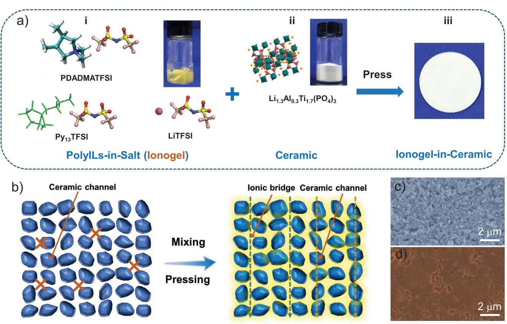
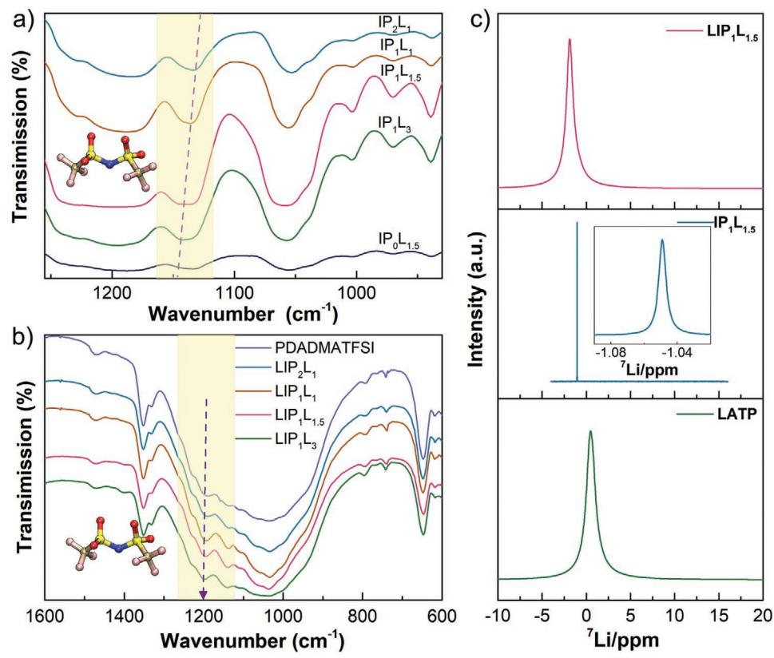
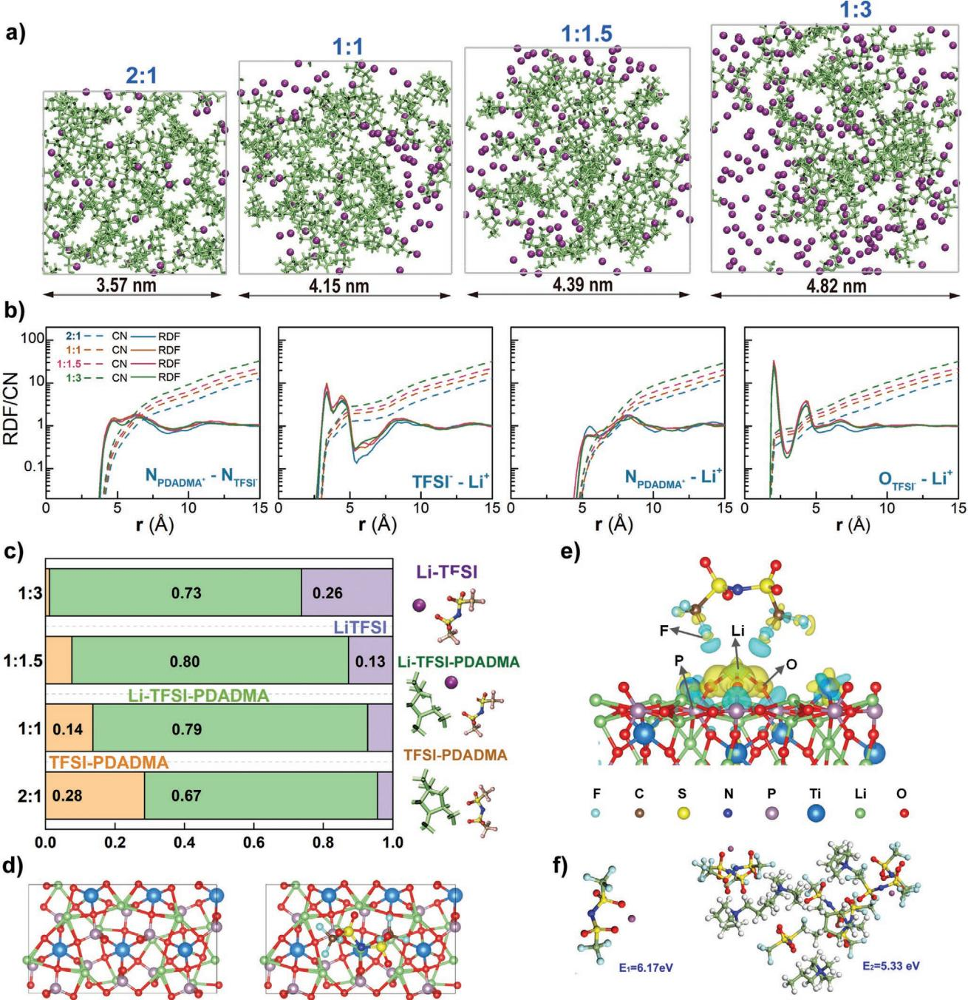
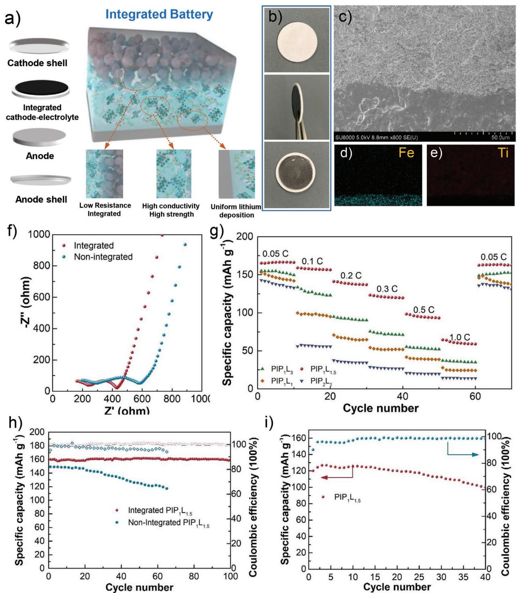
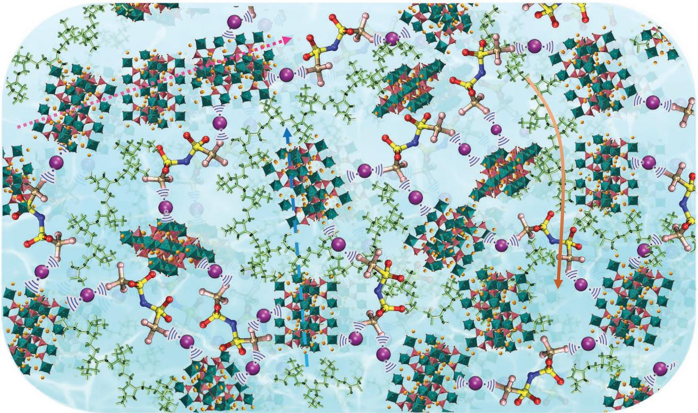

# **Unraveling the Synergistic Coupling Mechanism of Li<sup>+</sup> Transport in an "Ionogel-in-Ceramic" Hybrid Solid Electrolyte for Rechargeable Lithium Metal Battery**

*Xianli Song, Chenlu Wang, Junwu Chen, Sen Xin, Du Yuan, Yanlei Wang, Kun Dong, Lipeng Yang, Gongying Wang, Haitao Zhang,\* and Suojiang Zhang\**

**Understanding the ionic transport behaviors in hybrid solid electrolytes (HSEs) is critically important for the practical realization of rechargeable Li-metal batteries (LMBs) with high safety. Herein, it is reported a new solid "Ionogel-in-Ceramic" electrolyte by using the Li1.3Al0.3Ti1.7(PO4)3 (LATP) ceramic particles as a framework and "Poly(ionic liquid)s-in-Salt" ("PolyIL-in-Salt") ionogel as an ionic bridge via a simple pressing process. The "PolyIL-in-Salt" ionogel precursor is designed to improve the chemical compatibility at solid–solid interfaces. Molecular dynamics simulations reveal the roles of salt concentrations on the distribution of cocoordination of "PolyIL-in-Salt" ionogel. Moreover, the "PolyIL-in-Salt" ionogel containing co-coordination not only inhibits the parasitic reactions between LATP and Li anode but also provides efficient Li<sup>+</sup> conducting pathways. Benefiting from the designed structure, the "Ionogel-in-Ceramic" HSE exhibits an excellent ionic conductivity of 0.17 mS cm<sup>−</sup><sup>1</sup> at 50 °C. Meanwhile, the as-formed solid electrolyte enables a long cycle of over 3500 h in Li/Li symmetric cell. Further, all-solid-state lithium metal batteries fabricated on LiFePO4 and high voltage LiCoO2 cathodes deliver 160.0 mAh g<sup>−</sup><sup>1</sup> , 125.0 mAh g<sup>−</sup><sup>1</sup> , respectively. This study sheds light on the rational design of solid-state electrolytes with efficient interparticle Li<sup>+</sup> conduction, compatible, stable, compact, and durable electrode–electrolyte interfaces.**

# **1. Introduction**

Rational design of solid electrolytes is of critical importance to address the safety issues associated with battery thermal runaway, which are due to improper use and solvent leakage

#### X. L. Song

CAS Key Laboratory of Green Process and Engineering Beijing Key Laboratory of Ionic Liquids Clean Process Institute of Process Engineering Chinese Academy of Sciences Beijing 100190, China X. L. Song, G. Y. Wang

Chengdu Institute of Organic Chemistry Chinese Academy of Sciences Chengdu 610041, China

X. L. Song, G. Y. Wang National Engineering Laboratory for VOCs Pollution Control Material & Technology University of Chinese Academy of Sciences Beijing 101408, China

The ORCID identification number(s) for the author(s) of this article can be found under https://doi.org/10.1002/adfm.202108706.

#### **DOI: 10.1002/adfm.202108706**

of rechargeable lithium batteries incorporating conventional flammable organic liquid electrolytes.[1–3] For time being, allsolid-state lithium batteries are widely considered as the most competitive candidates for next-generation energy storage systems with the distinctions of safety, eco-friendly, and high energy density. Two types of common solid electrolytes, namely, the solid polymer electrolytes (SPEs) and inorganic solid electrolytes (ISEs), can complement each other to meet requirement of solid batteries. ISEs have the advantages of profound thermal stability and mechanical stability, but their usage is severely hindered by the weak interfacial contact between the electrolytes and electrodes.[4–6] Compared with inorganic electrolytes, SPEs are light, flexible, and easy to be processed.[7–9] In order to integrate the merits of inorganic and polymer electrolytes, tremendous efforts have been given to investigate solid-state

composite electrolytes.[10–14] Introducing various inorganic particles into polymer matrix is considered to be an effective strategy to favor Li<sup>+</sup> conduction.[15–17]

Several types of solid electrolytes have been investigated for all-solid-state Li-metal batteries (LMBs), including garnet

```
C. L. Wang, J. W. Chen, Y. L. Wang, K. Dong, L. P. Yang, H. T. Zhang, 
S. J. Zhang
CAS Key Laboratory of Green Process and Engineering
Beijing Key Laboratory of Ionic Liquids Clean Process
Institute of Process Engineering
Chinese Academy of Sciences
Beijing 100190, China
E-mail: htzhang@ipe.ac.cn; sjzhang@ipe.ac.cn
S. Xin
Institute of Chemistry
Chinese Academy of Sciences
Beijing 100190, China
D. Yuan
College of Materials Science and Engineering
Changsha University of Science and Technology
960, 2nd Section, Wanjiali RD (S), Changsha, Hunan 410004, China
```


Li5La3Ta2O12, Li1+*<sup>x</sup>*Ti2-*x*Al*x*(PO4)3, Li1+*<sup>x</sup>*Al*x*Ge2−*<sup>x</sup>*(PO4)3, and LiTi2−*<sup>x</sup>*Zr*x*(PO4)3. [15,18–30] Among them, NASICON-type Li1.3Al0.3Ti1.7(PO4)3 (LATP) is being pursued greatly because of its low cost, high oxidation potential, profound ionic conductivity, reactive inertia to water and air. However, side reactions between LATP and Li are the main restriction for the commercialization of LATP-based solid-state lithium batteries.[27] Moreover, LATP exhibits high grain-boundary resistance and reduced density (≈2.9 g cm<sup>−</sup><sup>3</sup> ). To reduce the grain boundary resistance, a hightemperature sintering process is typically employed to remove the voids, where huge energy consumption by high-temperature calcination further hinders its application. Another major obstacle for developing solid electrolytes lies in high electrolyte/Li interfacial resistance. An effective strategy was proposed by introducing an artificial interfacial layer with lithiophilic materials to avoid the intimate contact between solid electrolytes and anode, and diminish the interfacial impedance simultaneously.[31–34] Interfacial impedance was significantly reduced via depositing a thin Al2O3 layer onto LATP pellet using an atomic layer deposition technique.[31] More recently, a thin percolative inorganic layer, which exhibits a mixed conductive feature, between LATP and cathode was demonstrated by an in situ low-temperature sintering process.[32] Kinetics of high loading solid high-voltage cathodes could be dramatically improved by such a mixed conductive interphase. Wan et al. designed a Janus interface engineering route by coating distinct functional polymers to both sides of LATP to improve the compatibility with electrode.[33] In addition to the utilization of "selfextinguishing" LATP-based hybrid electrolyte film, one more protective poly[2,3-bis(2,2,6,6-tetramethylpiperidine-*N*-oxycarbonyl) norbornene] interlayer was found to be able to prolongate rate capability and cycling stability.[34]

Although significant progress has been achieved, high-performance of SSLMBs have been rarely demonstrated. So far, it remains a great challenge of addressing the interfacial issues of both anode and cathode sides simultaneously.[35,36] Generally, the inferior interfacial contact is carefully ameliorated to reduce the unexpected side reactions on both anode and cathode sides.

Conventional design on composite electrolytes employs dispersion of ceramic fillers into polymers. To enhance the conductivity, the optimal filler loading in composite electrolytes is generally between 10 and 15 vol%, where discrete ceramic particles are dispersed homogenously in the polymer matrix.[37] On the other hand, ceramic fillers can immobilize lithium salt anions through Lewis acid-base action. Ionic conductivity will be diminished greatly once the loading regime exceeds the ceramic percolation threshold, where abundant fillers tend to aggregate to form large clusters, hindering the transport of ions.[38] As a result, it is difficult for the traditional fabrication of composite electrolytes with discrete particles to take full advantage of the high ionic conductivities of the ceramic components. In this concern, it becomes a research hotspot of synthesizing solid composite electrolyte to break through the above threshold of solid electrolytes. Importantly, it reshapes the main transport path and conduction mechanism of lithium-ion in composite electrolytes. Also, the high ceramic content composite electrolyte with high mechanical properties can suppress Li dendrites.

From the perspective of ionic contributor, ionic liquids (ILs) are attracting numerous attentions in energy storage field, especially lithium metal batteries. ILs have the special characteristics of negligible vapor pressures, robust ionic conductivity, thermal stabilities, and wide electrochemical window.[39–42] Recent reports suggest that the growth of lithium dendrites could be inhibited by using hybrid ILs based electrolytes, as the presence of ILs will favor the dissolution of lithium salt in polymer matrix and the fast transport of lithium ions.[43–46] Moreover, lithium anode can be separated from inorganic Li1.5Al0.5Ge1.5(PO4)3 by using ILs to form a chemically stable interface.[46] In addition, the existence of ILs in hybrid electrolyte can depress the interfacial resistance. ILs tend to fill into the voids around the interfaces and eventually lead to intimate electrode–electrolyte contact. Also, they favor the reaction kinetics on cathode side by penetrating through the pores of composite electrode. As the charge carrier, IL can soften the electrode/electrolyte interface and hence benefit the ionic transport at the interfaces. *N*-propyl-*N*-methylpyrrolidiniumbis (trifluoromethanesulfonyl) imide (Py13TFSI) was pursued extensively in lithium batteries because it has suitable viscosity and sufficient ionic conductivity.[47]

PolyILs are being pursued widely as quasi-solid state electrolytes as they integrate both the merits of ILs and reasonable mechanical durability of polymers.[48–52] Appetecchi[53] reported that polyILs can alleviate the effects of concentration polarization, which will accordingly improve the transference number. Generally, anion transport in polyILs takes place through intraand intermolecular ion hopping via the formation and breaking of ion-associations.[54] Forsyth found that the Li conduction in a mixture of IL-PolyILs depends highly on the salt concentration.[51] Generally, the conductivity of lithium ions in polyILs is lower than that in IL electrolytes. Numerous experimental and simulation studies have been conducted recently to enhance the Li<sup>+</sup> conduction properties of polyILs. For example, Ganesan et al. used atomistic molecular dynamics simulation to unravel the underlying correlation between ion mobility and salt doping effect, and they found the complex coupling between ion transport and polymer segmental dynamics.[55] Therefore, it will be significant to understand the transport behaviors with the underlying intrinsic mechanisms to accelerate the design of better hybrid electrolytes.

Herein, a novel "Ionogel-in-Ceramic" hybrid solid electrolyte was prepared with the combination of "PolyILs-in-Salt" ionogel and LATP via a grinding and pressing method, as illustrated in **Figure 1**. Here, ceramic LATP was selected because of its robust electrochemical stability and high ionic conductivity. In addition, the inorganic filler can depress the growth of lithium metal dendrites. Py-type IL was employed on account of its relatively high electrochemical stability. Besides, IL can effectively fill up gaps between inorganic particles and act as lithium-ion conducting pathways, which is efficient in lowering the interfacial resistance.[43] Moreover, PDADMATFSI was chosen as it will form an ionogel with IL. As formed ionogel will not only alleviate the effects of concentration polarization but also maintain the effective contact with ceramic particles.

The physiochemical and electrochemical properties of optimized electrolyte were systemically investigated. As listed in **Table 1**, the composition and content were modulated systemically to optimize the performances of hybrid electrolyte. LIP1L1.5 achieved the highest ionic conductivity compared to all the other hybrid solid electrolytes (HSEs). The improved conductivity of LIP1L1.5 can be attributed to the introduced trace




**Figure 1.** Fabrication flowchart of hybrid electrolytes. a) i) molecular structures of ionogel precursors and photograph of "polyILs-in-salt" ionogel, ii) Crystallographic structure and photograph of LATP ceramic, iii) photograph of as-formed "ionogel-in-ceramic" film; b) Li-ion pathways in (left) pressed LATP particle pellet and (right) "ionogel-in-ceramic" electrolyte membrane; c,d) FESEM images of LATP and d) LIP1L1.5 electrolyte films.

amount of ionogel, which can facilitate the formation of ion transfer pathways. Theoretical simulations were conducted to unveil the molecular interactions of LATP-Li-TFSI-PDADMA, which is responsible for the Li<sup>+</sup> transport. The LIP1L1.5 enables highly stable lithium stripping/plating cycling for over 4000 h at 50 and 80 °C. Further, solid state lithium metal batteries were prepared using LiFePO4 and LiCoO2. Li/LIP1L1.5/LiFePO4 showed a promising capacity retention of 99.6% after 100 cycles.

### **2. Results and Discussion**

#### **2.1. Characterization of HSE**

HSEs were fabricated by using LATP, and ionogel consisting of PDADMATFSI, Py13TFSI, and LiTFSI as precursors (Figure 1a). PDADMATFSI, Py13TFSI, and LiTFSI were mixed thoroughly to form a light-yellow ionogel. Various mass ratios

|  |  |  |  |  | Table 1. Composition and content of hybrid electrolyte. (First L represents LATP, I and P denote Py13TFSI and PDADMATFSI, and last L is LiTFSI). |
|--|--|--|--|--|--------------------------------------------------------------------------------------------------------------------------------------------------|
|--|--|--|--|--|--------------------------------------------------------------------------------------------------------------------------------------------------|

| Sample          |              | Composition    | PDADMATFSI:LiTFSI | (polyIL-in-salt):LATP |               |               |
|-----------------|--------------|----------------|-------------------|-----------------------|---------------|---------------|
|                 | Py13TFSI [g] | PDADMATFSI [g] | LiTFSI [g]        | LATP [g]              | (mass ratios) | (mass ratios) |
| LIP2L1          | 0.205        | 0.03           | 0.015             | 1                     | 2:1           | /             |
| LIP1L1          | 0.19         | 0.03           | 0.03              | 1                     | 1:1           | /             |
| LIP1L1.5        | 0.175        | 0.03           | 0.045             | 1                     | 1:1.5         | /             |
| LIP1L3          | 0.13         | 0.03           | 0.09              | 1                     | 1:3           | /             |
| L1(IP1L1.5)0.1  | 0.07         | 0.01           | 0.02              | 1                     | /             | 0.1:1         |
| L1(IP1L1.5)0.15 | 0.10         | 0.02           | 0.03              | 1                     | /             | 0.15:1        |
| L1(IP1L1.5)0.2  | 0.14         | 0.02           | 0.04              | 1                     | /             | 0.2:1         |
| LI0P1L1.5       | /            | 0.1            | 0.15              | 1                     | /             | /             |
| LIP1L0          | 0.21         | 0.04           | /                 | 1                     | /             | /             |
| LIP0L1.5        | 0.2          | /              | 0.05              | 1                     | /             | /             |


of PDADMATFSI to LiTFSI were investigated to form pellets with a thickness of ≈0.60 mm, as depicted in Figure S1, Supporting Information. After being isostatically pressed, the contact area between neighboring LATP particles within pellet is relatively small. Therefore, the Li<sup>+</sup> transport behavior can be considered as a point-contact type, as illustrated in Figure 1b. On the other hand, once LATP particles are coated well with ionic conductive ionogel layer, Li<sup>+</sup> in HSEs will not only transport rapidly across the particle boundaries but also in ionogel, which is incorporated within particle network, on account that the continuous "PolyIL-in-Salt" ionogel can facilitate the formation of an ionic conducting network. Such a transport behavior can be regarded as a face-contact type and it will benefit the efficient Li<sup>+</sup> conduction (Figure 1b).

Field-emission scanning electron microscopy (FESEM) was performed to explore the microstructures of the solid electrolytes. It is clear that a significant amount of open porosity was formed between the grains in the pristine LATP (Figure 1c). Due to the rigid powdery nature, the stacking of LATP particles leads to a rugged pellet surface. By contrast, LIP1L1.5 HSE shows much smoother surface with LATP homogeneously embedded within the "PolyIL-in-Salt" ionogel (Figure 1d). Ionogel acts as a binder to compact the structure. Such a homogenous and thin ionogel layer can provide favorable conducting pathways for efficient Li<sup>+</sup> transport. Varying LATP to ionogel with modulated polymer-to-salt ratios was assessed, all the compositions are summarized in Table 1. The coated ionogel layer increased significantly with the increasing of ionogel (Figure S2, Supporting Information). The ionogel segment can be filled into the interspaces, thus bridging the ion conduction between LATP particles and enhancing the overall ionic conductivity. Meanwhile, the softer nature of ionogel is able to endow the electrode surface with improved ionic contact at the electrode/electrolyte interface. Note that the structure of HSE is stable while introducing the ionogel (Figure S3, Supporting Information).

Hence, the merits of LATP and ionogel are well integrated in HSEs. Fourier transform infrared (FTIR) was used to monitor the evolution of ion–ion interaction and the effect of salt content on the interaction in the ionogel and HSE. As shown in **Figure 2**a (see Figure S4, Supporting Information, for the full range spectra), the vibrational peak at 1133 cm<sup>−</sup><sup>1</sup> of neat PolyILs can be assigned to the symmetrical stretching of the SO2 groups in the TFSI<sup>−</sup>. [56–61] After adding the LiTFSI, this peak continuously shifts to higher wavenumber, suggesting a modulation of the coordination environment of the SO2. After the incorporation of LATP, the vibrational peak at 1200 cm<sup>−</sup><sup>1</sup> assigned to the *ν*as CF3 of TFSI<sup>−</sup> red-shifts continuously (Figure 2b), suggesting the reshaped coordination environment derived from the interaction between "PolyILs-in-Salt" ionogel and LATP accordingly. The evolution of TFSI<sup>−</sup> coordination environment was further confirmed by Raman spectra. It shows a higher intensity of SNS stretching vibrations compared with LIP2L1 (751 cm<sup>−</sup><sup>1</sup> for LiTFSI, Figure S5, Supporting Information). These results suggest that the introduction of LiTFSI will improve the co-coordination with the TFSI<sup>−</sup> from the polyILs. Specifically, breaking the strong anion–polycation interaction



**Figure 2.** Characterization of the "PolyILs-in-Salt" and "PolyILs-in-Ceramic" electrolytes. FTIR spectra of ionogel with a) IPL, b) LIPL. c) <sup>7</sup> Li solid-state nuclear magnetic resonance (NMR) spectroscopy of LATP, IP1L1.5, and LIP1L1.5. The inset is the magnified spectrum of IP1L1.5.


leads to the lower Tg of "PolyILs-in-Salt" ionogel with the increasing content of LiTFSI (Figure S6, Supporting Information). Interactions between LATP and "PolyILs-in-Salt" ionogel in HSE were further studied by solid-state NMR (Figure 2c). For 7 Li spectral feature, there is one strong sharp peak in the "PolyILs-in-Salt" ionogel compared with a broad line in the LATP. The solid-state <sup>7</sup> Li NMR spectra for Li<sup>+</sup> in LIP1L1.5, IP1L1.5, and LATP show that the signal in the LATP (0.47 ppm) is shifted downfield compared with that in LIP1L1.5 (−1.87 ppm). Such a downfield shift indicates the reduced electron density around Li atom, suggesting looser coordination with the donating nitrogen electrons in the TFSI<sup>−</sup> and the donating phosphorus electrons in the PO4 −. [59,62] This can be attributed to the interaction of Li<sup>+</sup> in "PolyILs-in-Salt" ionogel and LATP.

The microstructural evolution of polyIL upon the addition of LiTFSI salt was further understood by MD simulation at 323.15 K with four polyIL repeat units to LiTFSI ratios of 2:1, 1:1, 1:1.5, and 1:3. A distinct trend of evolving distribution of Li<sup>+</sup> was captured and presented in **Figure 3**a. Obviously, the structure of "PolyIL-Salt" ionogel exhibits a nanoscale heterogeneous feature. The 2:1 system has a polyIL dominated structure with a small fraction of LiTFSI distributed in the polymer matrix. As the LiTFSI concentration was enhanced to 1:1.5, Li<sup>+</sup> will begin to distribute more uniformly in the simulation box. Particularly, with a high salt concentration (1:3), the salt-rich domains are prominent. Four snapshots in Figure 3b present the radial distribution functions (RDF) and a coordination number (CN) of NPDADMA<sup>+</sup>-NTFSI<sup>−</sup>, TFSI<sup>−</sup>-Li<sup>+</sup>, NPDADMA<sup>+</sup>-Li<sup>+</sup>, and OTFSI<sup>−</sup>-Li<sup>+</sup> with various salt concentrations, respectively. It shows all the values of CN in NPDADMA<sup>+</sup>-NTFSI<sup>−</sup>, TFSI<sup>−</sup>-Li<sup>+</sup>, NPDADMA<sup>+</sup>-Li<sup>+</sup>, and OTFSI<sup>−</sup>-Li<sup>+</sup> will go up as salt concentration growing, suggesting the co-coordination of TFSI<sup>−</sup> with both polycation and Li<sup>+</sup>. The excess salt cannot participate in co-coordination with polycations, and thus tend to interact with each other to form Li<sup>+</sup>-TFSI<sup>−</sup> aggregates.

Figure 3c displays the percentages of the three types of TFSI<sup>−</sup> coordination environments, including TFSI<sup>−</sup> coordinated with Li<sup>+</sup> (Li-TFSI), TFSI<sup>−</sup> coordinated with both polycation and Li<sup>+</sup> (Li-TFSI-PDADMA), and TFSI<sup>−</sup> coordinated with only polycation (TFSI-PDADMA). For the 2:1 system, 28% of TFSI<sup>−</sup> are coordinating with polycations, while almost all the remaining TFSI<sup>−</sup> coordinate with both the polycations and Li<sup>+</sup>. As to the 1:1.5 system, 80% of TFSI− have a co-coordination environment that is related to both polycations and Li+. As LiTFSI concentration increases to 1:3, there is a significant increase in the percentage of Li-TFSI, up to 26%, while the TFSI-PDADMA almost disappears. The effects of coordination environment on the performances will be discussed later.

Figure 3d,e displays the charge density difference between Li+ adsorpted on LATP surface and TFSI−. Our simulation suggests that LATP-Li-TFSI system will exhibit an isosurface value of 0.002 e Bohr−<sup>3</sup> with the presence of TFSI− species. The obvious accumulation of electrons centered around the Li and the charge depletion are observed around F atom of TFSI<sup>−</sup> and PO4 tetrahedra of LATP. P atom and O atom of LATP matrix shows the Lewis acid nature, which will compete with Li atom (Lewis acid) and reduce the bondage of F atoms (from CF3 in TFSI−) to Li atom. For the electrolyte, decreasing the interaction between F atoms and Li atoms will lead to the dissociation of LiTFSI and increase the number of free Li<sup>+</sup> carriers. In addition, the effect of IL and polyIL on the decoupling energy of LiTFSI was assessed by DFT simulation. As illustrated in Figure 3, the decoupling energy of LiTFSI diminished from 6.17 eV to 5.33 eV due to the presence of ionogel. Such behavior may be related plausibly to the dilution effect and competitive interaction between newly added cations (Py13<sup>+</sup> and PDADMA<sup>+</sup>) and TFSI<sup>−</sup>. These analysis confirm that introduction of both IL and LATP particles can facilitate the transport of Li<sup>+</sup> ions.

Considering the critical safety and stability issue of battery, the thermal stability of HSEs was analyzed by TGA (Figure S7, Supporting Information). LATP exhibited a high thermal stability up to 800 °C. LIPL was found to be thermally stable up to 330 °C, the weight of LATP remains about 80 wt%, exhibited typical "Ionogel-in-Ceramic" characteristics. Moreover, the flame retardancy of electrolytes is important for the safety of LMB. When the pristine LATP pellet and LIP1L1.5 pellet were placed close to fire (Figure S8, Supporting Information), it neither ignited nor shrank when exposed to the flame. It may be related to that HSE consists of non-flammable materials. Based on above, the safety of the battery can be guaranteed by the high stability of HSEs.

#### **2.2. Electrochemical Performance of HSE**

To investigate the transportation properties of HSEs, electrochemical impedance spectroscopy (EIS) was applied to the sandwich-type symmetric cells, which contain stainless steel (SS) electrode and as-formed solid electrolytes (Figure S9, Supporting Information). The impedance spectrum of SS/LATP/SS shows a semicircle and sloping line in the high and low-frequency ranges, respectively (Figure S9a, Supporting Information). The combination of the bulk resistance (*R*b) and grain boundary resistance (*R*gb) calculates the ionic conductivity of the LATP,[63–65] where LATP with high *R*gb results in low ionic conductivity. For SS/LIP1L1.5/SS, no semicircle is observed for the *R*gb, as shown in Figure S9b, Supporting Information. Semicircles are observed in the spectra of the LIP2L1 and LIP1L1, which drastically decrease in the real-axis, and smooth sloping appears in the Nyquist plot (Figure S10, Supporting Information).

**Figure 4**a shows the dependence of ionic conductivities on temperature for HSEs with different mass ratios of PDADMATFSI and LiTFSI. The ionic conductivity of LIP1L1.5 reached 0.172 mS cm−<sup>1</sup> at 50 °C, indicating the highest ionic conductivity among HSEs (0.0425 mS cm−<sup>1</sup> , 0.0548 mS cm−<sup>1</sup> , 0.113 mS cm−<sup>1</sup> for LIP2L1, LIP1L1, and LIP1L3, respectively). The different mass ratios between LATP and ionogel have an effect on the performance of HSEs. The comparison of ionic conductivity performances using the LIP1L1.5 with other reports is listed in Table S1, Supporting Information. It can be obviously seen that the ionic conductivity of LIP1L1.5 is higher than those of other reported solid-state electrolytes using polymerceramic (LATP) composites.[66–69] The results show that ionic conductivity decreased with the decreasing ionogel weight ratio (Figure 4b and Figure S11, Supporting Information). When increasing the ionogel weight ratio to 0.3 g, the pellet could not exist stably, so the optimal mass ratio of LATP and ionogel was 1:0.25.



**Figure 3.** Electrolyte Structures with Different LiTFSI Contents Demonstrated by MD Simulations. Snapshots of the simulation box of a) the 2:1 system, the 1:1 system, the 1:1.5 system, the 1:3 system, show the distribution of Li+ in a polymer matrix (green stick and purple sphere represent polymer backbone and Li<sup>+</sup>, respectively), b) RDF and CN the pair of NPDADMA<sup>+</sup>-TFSI−, TFSI−-Li<sup>+</sup>, NPDADMA<sup>+</sup>-Li<sup>+</sup>, OTFSI<sup>−</sup>-Li+, respectively, showing an increase in the number of Li+ coordinated to TFSI− as Li+ concentration growing, c) Percentages of three types of TFSI− coordination environments calculated from MD simulations at 323.15 K. The bar figures show the percentage of coordination modes of Li-TFSI, Li-TFSI-PDADMA, and TFSI-PDADMA, with the PDADMATFSI repeat units to LiTFSI ratio of 2:1, 1:1, 1:1.5, and 1:3. The snapshots represent three types of TFSI− coordination environments, d) Top view of LATP (left) and LATP-Li-TFSI (right), respectively, e) The charge density difference (with and without TFSI−) for LATP-Li-TFSI (the yellow and cyan color indicate electron accumulation and depletion, respectively, with isosurface value of 0.002 e Bohr<sup>−</sup><sup>3</sup> ), f) diagram of the decoupling energy of LiTFSI and LiTFSI-Py13TFSI-PDADMATFSI systems.

From the microscopy images (Figure S11, Supporting Information, and Figure 1d), with increasing the amount of ionogel, the more LATP are fully coated by the ionogel. Meanwhile, the ion conductivity of the electrolyte with PDADMATFSI:LiTFSI (1:1.5) is higher than the electrolytes without PDADMATFSI and without LiTFSI (Figure 4c and Figure S9c, Supporting


**Figure 4.** Electrochemical characterization of the solid electrolyte. a) The ionic conductivities of LIPL with varying temperature. b) The ion conductivities of different mass ratios between LATP and ionogel with PDADMATFSI:LiTFSI (1:1.5) systems at 25, 50, and 80 °C, respectively. c) Arrhenius plot of LIP1L0 and LIP0L1.5 conductivity. d) Galvanostatic cycling of Li/LIP1L1.5/Li cell at 50 °C with different current densities of 0.05, 0.1, and 0.15 mA cm−<sup>2</sup> , respectively. e) Galvanostatic cycling of Li/LIP1L1.5/Li cell at current densities of 0.05 mA cm<sup>−</sup><sup>2</sup> at 50 and 80 °C. Schematics illustrating the interface evolution f) between LATP and Li, and g) after introducing of "PolyILs-in-Salt" ionogel into LATP nanoparticle enhanced LATP/Li interface.

Information). It indicates that the polyIL in the HSE is beneficial for facilitating Li+ conduction. The improved conductivity of HSE compared with LATP can be attributed to the enriched ion conduction pathways constructed in the "Ionogel-in-Ceramic" network, where the co-coordination of TFSI− with both Li+ and PDADMA is responsible for the boosted Li+ transportation. Linear sweep voltammetry (LSV) spectra of SS/Li cells with the solid electrolytes were collected to evaluate their electrochemical windows. The electrochemical window of representative "Ionogel-in-Ceramic" electrolytes can exhibit a wide and stable oxidative voltage up to 4.9 V (versus Li+/Li) (Figure S13, Supporting Information), indicating that HSE can match well with high-voltage cathodes. Note that the oxidative voltage decreased with the increase of lithium salt, suggesting that the introduction of more LiTFSI will corrode the aluminum foil.

Lithium dendrites on the anode surface are usually formed via heterogeneous Li+ deposition during the process of lithium stripping/plating. Suppressing the growth of lithium dendrite is key to the safety of solid-state LMBs. The electrochemical performance of cell is primarily determined by the interfacial stability between solid electrolyte and Li anode.[70–72] The cyclability behavior was studied at a current density of 0.05 mA cm<sup>−</sup>2 at 50 °C. Li/LATP/Li cell could work well for 25 h before appearance of short circuit (Figure S14a, Supporting Information). Such behavior was caused mainly by both the high interfacial resistance that is related to the inferior solid–solid contact, and the severe side reactions as the Ti<sup>4</sup><sup>+</sup> of the LATP tended to be reduced to lower valance once they were exposed directly to Li.[22] Scanning electron microscopy (SEM) study (Figure S15a, Supporting Information) indicated


that many small particles were formed on as-pressed pristine LATP pellet after it was allowed to be cycled for 25 h. On the other hand, no obvious particles were formed on the surface of hybrid film. Galvanostatic cycling performances of the Li/LIP1L1.5/Li symmetric cell were collected to unravel the influence of LIP1L1.5 electrolyte on lithium dendrite growth. Figure 4d displays the cycling performance at various current densities from 0.05 to 0.15 mA cm<sup>−</sup>2 for 2000 h. The cell with LIP1L1.5 electrolyte exhibited a stable and low overpotential plateau (about 60 mV) at a current density of 0.05 mA cm<sup>−</sup>2. This overpotential increased (<0.2 V) correspondingly once the current density was increased to 0.15 mA cm<sup>−</sup>2. In addition, this cell exhibited good cyclability without short circuit. The voltage became 50 mV when the current was set back to 0.05 mA cm<sup>−</sup>2, indicating its good retention. Li/LIP1L1.5/Li presents stable polarization at 0.05 mA cm<sup>−</sup>2 for up to 3500 h at 50 °C (Figure S14b, Supporting Information). Polarization curves of Li/LIPL/Li are stable after 4000 h at 50 and 80 °C (Figure 4e and Figure S16, Supporting Information).

Compared to LATP, an ex situ SEM study indicates that the surface of (Figure S15b, Supporting Information) LIP1L1.5 pellet was well-retained after 3500 h. This result suggests that ionogel layer could protect LATP particles very well from being exposed directly to Li metal electrode, which will avoid effectively the unexpected side reaction. In addition, the formed ionogel layer could lead to a reduced ion transfer barrier at the electrode/electrolyte interface, and improved the kinetics of battery. Recent studies imply that either a polymer layer or a magnetron sputtered inorganic ZnO layer can diminish the interfacial resistance and avoid the side reaction.[22,34] The presence of multiple Li<sup>+</sup> migration pathways in the solid electrolyte can provide an opportunity for a homogenous lithium stripping/plating to inhibit the growth of lithium dendrites.

These results demonstrate that the compatibility of the electrode-electrolyte interface can be enhanced due to the restrained Li<sup>+</sup> concentration gradient and efficient Li<sup>+</sup> migration at the interface at an elevated temperature.[73] To verify the role of interface in the solid electrolytes, a storage time-dependent EIS was studied (Figure S17, Supporting Information). The symmetric cell based on HSE exhibited an excellent interface stability, no observable changes for both bulk and interface resistances took place after 15 days. On the other hand, the cell with LATP suffered destroyed stability because of the reaction between LATP and Li. Figure 4f,g presents the interface scheme of LATP and HSE with respect to Li metal anode. The growth and formation of Li dendrites are conceivably triggered by the ineffective contact between Li metal anode and solid electrolyte. Generally, the growth of Li dendrites could be suppressed by employing composite electrolytes as they can guarantee efficient Li<sup>+</sup> flux.[74]

HSE can effectively suppress lithium dendrite, owing to the following factors. The LATP fillers possess excellent mechanical strength. The co-coordination of Li-TFSI-PDADMA enhances the ion conductivity. "PolyILs-in-Salt" ionogel can be easily infiltrated into the voids, ensuring an enhanced compatibility of LATP/Li interface and mitigating side reactions between electrolyte and Li metal anode. The highly ionic conducting and stable interface guarantee a continuous and unifies Li<sup>+</sup>

distribution. The above factors contribute to the stable lithium stripping/plating.[75,76]

#### **2.3. Performances of Integrated All-Solid-State Batteries**

The performance of "Ionogel-in-Ceramic" electrolyte was assessed further in solid-state LiFePO4/HSE/Li. A schematic diagram of integrated structure solid-state LMB is illustrated in **Figure 5**a. LiFePO4 cathode and "Ionogel-in-Ceramic" electrolyte were pressed to construct an integrated structure, which can facilitate Li<sup>+</sup> migration at heterointerfaces (Figure 5b). The cross-section image indicates that the cathode was tightly coated on the solid "Ionogel-in-Ceramic" electrolyte surface (Figure 5c), which may be attributed to the wetting of IL. The surface morphology and corresponding EDS mapping of Fe and Ti distribution are presented in Figure 5d,e, respectively, showing the integrated structure of the PIP1L1.5/LiFePO4 interface. The integrated structure of battery will favor Li<sup>+</sup> transport in the cathode. To verify the effects of cell integration on the interfacial contact, we further compared the impedance spectra of the integrated and non-integrated LiFePO4/Li cells, where the interfacial resistance of the integrated cell is much lower than that of the non-integrated one (600 Ω) at 50 °C, as shown in Figure 5f.

The rate capabilities of LiFePO4/PIPL/Li cells were evaluated at 50 °C under a series of current densities ranging from 0.1 to 1 C. As shown in Figure 5g, the cell using PIP1L1.5 exhibits a superior rate capability. The discharge capacities achieved 163.6, 155.6, 136.6, 121.1, 94.5, and 61.1 mAh g<sup>−</sup><sup>1</sup> at 0.05, 0.1, 0.2, 0.3, 0.5, and at 1.0 C, respectively. Moreover, when the rate was switched back to 0.1 C, the recoverable capacity is as high as 96.2%, suggesting a good capacity recovery ability of the cell using PIP1L1.5. Such an intensively improved rate performance was plausibly caused by the co-functioning structural advantages of PIP1L1.5 electrolyte facilitating Li<sup>+</sup> conduction and improving stability.[77] Additionally, Figure S18, Supporting Information, displays the smooth charge and discharge curves of the LiFePO4/PIP1L1.5/Li cell at different rates with a small polarization voltage of about 100 mV, suggesting low internal impedance and rapid reaction kinetics.[78] The minimal polarization through the cycle indicates that the PIP1L1.5 solid electrolyte applies to improve the overall electrochemical performance of the battery (Figure S19, Supporting Information).

Figure 5h compares the cycling performance of the integrated and non-integrated LiFePO4/PIP1L1.5/Li cells. A stable cycling was achieved in the integrated LiFePO4/PIP1L1.5/ Li cell, with high Coulombic efficiency and high capacity retention of 99.6% after 100 cycles (discharge capacity of 160.0 mAh g−<sup>1</sup> at the 1st cycle, and that of 159.5 mAh g−<sup>1</sup> at 100th cycle). The battery capacity retention of the non-integrated battery after 65 cycles is only 78.6%. It is worth to highlight that the impedance of LiFePO4/PIP1L1.5/Li cell after 30 cycles was slightly increased (Figure S20, Supporting Information), indicating a tight contact interface between the electrolyte and the electrode. Ex situ SEM shows that the integrated structure can be well maintained after 100 cycles (Figure S21, Supporting Information). Utilizing the high potential window of PIP1L1.5, we further fabricated the high voltage LMB cell of LiCoO2/PIP1L1.5/Li.




**Figure 5.** Construction of the integrated solid-state lithium metal batteries by pairing with LiFePO4 and LiCoO2 cathode. a) Schematic illustration of an integrated all-solid-state LiFePO4/PIP1L1.5/Li battery. Photographs of the LiFePO4/PIP1L1.5 integration b) front and back view. c) Cross-sectional images of LiFePO4 cathode and PIP1L1.5 electrolyte. d,e) The corresponding EDS mapping of Fe and Ti. f) Impedance curves of integrated and nonintegrated LiFePO4/PIP1L1.5/Li cells. g) Rate performance of LiFePO4/Li cell using different solid electrolytes. h) Cycling performance of integrated and non-integrated LiFePO4/PIP1L1.5/Li cells at 0.1 C. i) Electrochemical properties of the LiCoO2/PIP1L1.5/Li solid-state batteries at 80 °C.

The charge/discharge curves of LiCoO2/PIP1L1.5/Li battery at 80 °C were performed on the assembled cell within 3.0–4.3 V (Figure S22, Supporting Information). The discharge capacity decreased from 125 to 100.2 mAh g−<sup>1</sup> after 40 h, as depicted in Figure 5i. The reduced cycling performance may be related plausibly to electrochemical stability of electrolyte at enhanced




**Figure 6.** Proposed Li+ transport mechanism in hybrid electrolytes. Three kinds of transport pathways: i) transport via neighboring LATP particles (dotted line), ii) transport in "PolyIL-in-Salt" ionogel (solid line), iii) transport via both LATP solid particles and ionogel (dashed line).

working potential on account that carbon-coated Al current collector was employed here.

The excellent electrochemical performance of the solid-state LMBs can be attributed to the following reasons as summarized in **Figure 6**. The favorable wettability of the "PolyIL-in-Salt" ionogel as ionic bridge can sufficiently be infiltrated into the porous and improve tightly contact at the adjacent LATP interface, significantly boosting the Li<sup>+</sup> transport across the solid electrolyte of the ceramic materials. The optimized hybrid electrolyte indicates fast ion migration by multiple Li<sup>+</sup> migration pathways, suppressing large Li<sup>+</sup> concentration gradient and achieving uniform Li deposition. On account of the novel design of Ionogel-in-Ceramic electrolytes, the transportation of Li+ ions can proceed through three main pathways. As illustrated in Figure 6, Li+ ions can be transported mainly i) through tightly contacted LATP particles, ii) in the soft and continuous ionogel medium, and iii) by a model through both ionogel and LATP particles simultaneously in a shortened route. The "PolyIL-in-Salt" ionogel solves not only the physical contact problem but also avoid the side reaction, buffer the volumetric change of the electrodes during cycling.

# **3. Conclusion**

In summary, a novel "Ionogel-in-Ceramic" hybrid electrolyte was designed and fabricated successfully to suppress the dendrite capability and to achieve good compatibility with Li metal anode for safe solid battery. The key point of this strategy is that solid-state electrolytes composed of "PolyILin-Salt" ionogel as ionic bridge and LATP as a rigid backbone. The "PolyIL-in-Salt" with co-coordination can uniformly redistribute Li<sup>+</sup> in the solid composite electrolyte, which can effectively increase the contact areas and the robust interfaces, including the ceramic particle/particle as well as the electrode/electrolyte interfaces. Furthermore, the volumetric change of the electrodes could be effectively buffered by the elasticity of "PolyILs-in-Salt" as it contains soft ionogelstate precursor. Therefore, optimized Li/Li symmetric cell could last for over 4000 h, whereas the cell using bare LATP could only be cycled for 25 h. These rational and effective approaches represent a promising strategy to revolutionize solid electrolyte. Our work will promote the commercialization of easy processing and high safety rechargeable Li metal batteries via using composite electrolytes.

### **4. Experimental Section**

*Materials Synthesis*: Lithium bis(trifluoromethanesulfonyl)imide (LiTFSI, 99%, Guotai Super Power), *N*-propyl-*N*-methylpyrrolidinium bis(trifluoromethanesulfonyl)amide (Py13TFSI, 99%). Polydiallyldimethylammonium bis(fluorosulfonyl)imide (PDADMATFSI), was synthesized by an anion exchange method using PDADMAC and LiTFSI.[42] NASICON-type LATP solid electrolytes were obtained via a facile sol-gel method.[46]

*Preparation of Composite solid Electrolytes*: Different ratios of PDADMATFSI to LiTFSI (2:1, 1:1, 1:1.5, 1:3) were firstly dissolved in Py13TFSI under magnetic stirring at 80 °C, resulting in lightly yellow


solid-state ionogel with reasonable elasticity and ionic conductivity. In order to prepare "Ionogel-in-Ceramic" electrolyte, LATP powder and the ionogel with various ratios of the PDADMATFSI and LiTFSI were mixed together in different mass ratios and grounded thoroughly and uniformly in a mortar. Solid-state electrolytes were pressed into discs under a pressure of 20 MPa. Corresponding to polyIL-to-salt ratios, the electrolytes are denoted as LIPL (LIP2L1, LIP1L1, LIP1L1.5, and LIP1L3, respectively). As a comparison, electrolyte without adding the PDADMATFSI was denoted as LIP0L1.5. The electrolyte without LiTFSI was referred to as LIP1L0. Corresponding to varying LATP and ionogel with polyIL-to-salt ratios (1:1.5) was prepared, the electrolytes were denoted as L1(IP1L1.5)0.1, L1(IP1L1.5)0.15, L1(IP1L1.5)0.2, respectively. The LATP pellet without any material was denoted as bare LATP. The thickness and diameter of as-obtained solid electrolyte pellets are around 0.60 and 16 mm, respectively.

*Characterizations*: Crystalline phase was characterized by X-ray diffraction (XRD) with Cu K*α* radiation. The morphologies of LATP and composite electrolyte were observed by field-emission scanning electron microscopy (FE-SEM, JSM-7001F). Differential scanning calorimetry (DSC) measurements were carried out on Mettler-Toledo equipment. <sup>7</sup> Li magic-angle-spinning NMR experiments were carried out on a Bruker Avance III-500 with Larmor frequencies of 194.4 MHz for <sup>7</sup> Li, respectively. FTIR spectra were performed on a Thermo Nicolet 380 spectrometer. Thermogravimetric analysis (TGA) was carried out on a DTG-60H instrument under air atmosphere in the temperature range 30–800 °C with a rate of 10 °C min−<sup>1</sup> .

*Electrochemical Measurements and Cell Assembly*: Assembly of CR 2025-type coin batteries was operated within an argon-filled glove box. The testing temperatures were in the range from 25 to 80 °C with a step size of 5 °C min−<sup>1</sup> , and the ionic conductivity (*σ*) of electrolyte was computed with the bulk resistance (*R*) of electrolyte obtained by impedance measurements with stainless steel using Equation (1):

$$
\sigma = d/RS \tag{1}
$$

Where *R*b is the bulk resistance, *d* is the thickness, *S* is surface area of stainless steel. To assess the electrochemical stability of "Ionogel-in-Ceramic" electrolytes, the LSV was investigated employing SS/SPE/Li under a scan rate of 1 mV s−<sup>1</sup> .

To prepare the cathodes electrode, active (LiFePO4 or LiCoO2) and PVDF (poly(vinylidene fluoride), and super P were mixed in *N*-Methyl pyrrolidone (NMP) by ball milling to make a homogeneous slurry, with the ratio 8:1:1 by weight. Then, the resultant slurry was coated onto carbon-coated Al foil and dried at 80 °C for 12 h to remove the residue solvent. The area mass loading of LiFePO4 and LiCoO2 cathode materials are 2.5–3 and 3–3.5 mg cm<sup>−</sup>2, respectively. The charge/ discharge behaviors, interfacial stability, and cycling performances were evaluated using a LAND battery tester.

Simulation methods and procedure is presented in the supporting information section.

# **Supporting Information**

Supporting Information is available from the Wiley Online Library or from the author.

### **Acknowledgements**

This work was financially supported by the National Key Research and Development Program of China (No. 2019YFA0705601), the Key Science and Technology Special Project of Henan Province (No. 202102210106), Zhengzhou major Science and technology projects (No. 2019CXZX0074), the Key Program of Chinese Academy of Sciences (ZDRW\_CN\_2020-1), Innovation Academy for Green Manufacture, Chinese Academy of Sciences (IAGM-2019-A15), the Key Research Program of Frontier Sciences, CAS (QYZDY-SSW-JSC011), the Major Program of National

Natural Science Foundation of China (No. 21890762) and Science Fund for Creative Research Groups of the National Natural Science Foundation of China (No. 21921005). The National Natural Science Foundation of China (No. 21878308)

# **Conflict of Interest**

The authors declare no conflict of interest.

# **Data Availability Statement**

The data that support the findings of this study are available from the corresponding author upon reasonable request.

### **Keywords**

hybrid solid electrolytes, ionic bridges, ionogel-in-Ceramic, lithium metal batteries, poly(ionic liquid)s-in-salt

> Received: September 24, 2021 Revised: November 2, 2021 Published online: November 25, 2021

- [1] Y. K. Lin, K. Liu, M. C. Wu, C. Zhao, T. S. Zhao, *ACS Appl. Energy Mater.* **2020**, *3*, 5712.
- [2] R. Fan, C. Liu, K. Q. He, S. H. Cheng, D. Z. Chen, C. Z. Liao, R. K. Y. Li, J. N. Tang, Z. G. Lu, *ACS Appl. Mater. Interfaces* **2020**, *12*, 7222.
- [3] L. Wang, Z. Y. Zhou, X. Yan, F. Hou, L. Wen, W. B. Luo, J. Liang, S. X. Dou, *Energy Storage Mater.* **2018**, *14*, 22.
- [4] X. B. Cheng, R. Zhang, C. Z. Zhao, Q. Zhang, *Chem. Rev.* **2017**, *117*, 10403.
- [5] B. Y. Li, Q. M. Su, L. T. Yu, S. J. Dong, M. Zhang, S. K. Ding, G. H. Du, B. S. Xu, *J. Membr. Sci.* **2021**, *618*, 118734.
- [6] Z. Z. Zhang, Y. J. Shao, B. Lotsch, Y. S. Hu, H. Li, J. Janek, L. F. Nazar, C. N. Nan, J. Maier, M. Armand, L. Q. Chen, *Energy Environ. Sci.* **2018**, *11*, 1945.
- [7] M. Keller, A. Varzi, S. Passerini, *J. Power Sources* **2018**, *392*, 206.
- [8] M. Yao, H. T. Zhang, K. Dong, B. S. Li, C. X. Xing, M. Y. Dang, S. J. Zhang, *J. Mater. Chem. A* **2021**, *9*, 6232.
- [9] X. H. Wu, K. C. Pan, M. M. Jia, Y. F. Ren, H. Y. He, L. Zhang, S. J. Zhang, *Green Energy Environ.* **2019**, *4*, 360.
- [10] J. Wan, J. Xie, D. G. Mackanic, W. Burke, Z. Bao, Y. Cui, *Mater. Today Nano* **2018**, *4*, 1.
- [11] B. J. Li, Y. J. Liu, X. Y. Zhang, P. He, H. S. Zhou, *Green Energy Environ.* **2019**, *4*, 7.
- [12] A. Su, P. L. Guo, J. Li, D. X. Kan, Q. Pang, T. Q. Li, J. Q. Sun, G. Chen, Y. J. Wei, *J. Mater. Chem. A* **2020**, *8*, 4775.
- [13] F. Chen, D. Yang, W. Zha, B. Zhu, Y. Zhang, J. Li, Y. Gu, Q. Shen, L. Zhang, D. R. Sadoway, *Electrochim. Acta* **2017**, *258*, 1106.
- [14] R. J. Chen, W. J. Qu, X. Guo, L. Li, F. Wu, *Mater. Horiz.* **2016**, *3*, 487.
- [15] C. J. Bai, Z. G. Wu, W. Xiang, G. K. Wang, Y. X. Liu, Y. J. Zhong, B. T. Chen, R. D. Liu, F. R. He, X. D. Guo, *J. Power Sources* **2020**, *472*, 228461.
- [16] L. Chen, Y. T. Li, S. P. Li, L. Z. Fan, C. W. Nan, J. B. Goodenough, *Nano Energy* **2018**, *46*, 176.
- [17] H. W. Kim, J. H. Han, Y. J. Lim, Y. S. Choi, E. Lee, Y. Kim, *Adv. Funct. Mater.* **2020**, *31*, 2002008.
- [18] K. S. Kim, J. Park, G. Jeong, J. S. Yu, Y. C. Kim, M. S. Park, W. Cho, R. Kanno, *ChemSusChem* **2019**, *12*, 2637.


- [19] S. C. Yu, S. Schmohl, Z. G. Liu, M. Hoffmeyer, S. Nino, F. Hausen, H. Tempel, H. Kungl, H. D. Wiemhofer, R. A. Eichel, *J. Mater. Chem. A* **2019**, *7*, 3882.
- [20] S. A. Pervez, G. Kim, B. P. Vinayan, M. A. Cambaz, M. Kuenzel, M. Hekmatfar, M. Fichtner, S. Passerini, *Small* **2020**, *16*, 2000279.
- [21] D. C. Zhang, X. J. Xu, X. Y. Huang, Z. C. Shi, Z. S. Wang, Z. B. Liu, R. Z. Hu, J. Liu, M. Zhu, *J. Mater. Chem. A* **2020**, *8*, 18043.
- [22] X. G. Hao, Q. Zhao, S. M. Su, S. Q. Zhang, J. B. Ma, L. Shen, Q. P. Yu, L. Zhang, Y. Liu, F. Y. Kang, Y. B. He, *Adv. Energy Mater.* **2019**, *9*, 1901604.
- [23] X. Yu, A. Manthiram, *Adv. Funct. Mater.* **2018**, *29*, 1805996.
- [24] C. Z. Zhao, X. Q. Zhang, X. B. Cheng, R. Zhang, R. Xu, P. Y. Chen, H. J. Peng, J. Q. Huang, Q. Zhang, *Proc. Natl. Acad. Sci. USA* **2017**, *114*, 11069.
- [25] C. Z. Zhao, P. Y. Chen, R. Zhang, X. Chen, B. Q. Li, X. Q. Zhang, X. B. Cheng, Q. Zhang, *Sci. Adv.* **2018**, *4*, 3446.
- [26] W. P. Chen, H. Duan, J. L. Shi, Y. M. Qian, J. Wan, X. D. Zhang, H. Sheng, B. Guan, R. Wen, Y. X. Yin, S. Xin, Y. G. Guo, L. J. Wan, *J. Am. Chem. Soc.* **2021**, *143*, 5717.
- [27] W. Xiao, J. Y. Wang, L. L. Fan, J. J. Zhang, X. F. Li, *Energy Storage Mater.* **2019**, *19*, 379.
- [28] Z. Zhang, Y. Shao, B. Lotsch, Y. S. Hu, H. Li, J. Janek, L. F. Nazar, C. W. Nan, J. Maier, M. Armand, L. Chen, *Energy Environ. Sci.* **2018**, *11*, 1945.
- [29] K. C. Pan, L. Zhang, W. W. Qian, X. K. Wu, K. Dong, H. T. Zhang, S. J. Zhang, *Adv. Mater.* **2020**, *32*, 2000399.
- [30] Y. Wang, G. X. Wang, P. G. He, J. K. Hu, J. H. Jiang, L. Z. Fan, *Chem. Eng. J.* **2020**, *393*, 124705.
- [31] Y. L. Liu, Q. Sun, Y. Zhao, B. Q. Wang, P. Kaghazchi, K. R. Adair, R. Li, C. Zhang, J. R. Liu, L. Y. Kuo, *ACS Appl. Mater. Interfaces* **2018**, *10*, 31240.
- [32] X. Han, S. Y. Wang, Y. B. Xu, G. M. Zhong, Y. Zhou, B. Liu, X. Y. Jing, X. Wang, Y. Li, Z. Q. Zhang, S. Y. Chen, C. M. Wang, Y. Yang, W. Q. Zhang, J. L. Wang, J. Liu, J. H. Yang, *Energy Environ. Sci.* **2021**, *14*, 5044.
- [33] J. Y. Liang, X. X. Zeng, X. D. Zhang, T. T. Zuo, M. Yan, Y. X. Yin, J. L. Shi, X. W. Wu, Y. G. Guo, L. J. Wan, *J. Am. Chem. Soc.* **2019**, *141*, 9165.
- [34] Z. Chen, G. T. Kim, J. K. Kim, M. Zarrabeitia, M. Kuenzel, H. P. Liang, D. Geiger, U. Kaiser, S. Passerini, *Adv. Energy Mater.* **2021**, *11*, 2101339.
- [35] C. H. Wang, Q. Sun, Y. L. Liu, Y. Zhao, X. Li, X. T. Lin, M. N. Banis, M. Li, W. H. Li, K. R. Adair, D. W. Wang, J. N. Liang, R. Y. Li, L. Zhang, R. Yang, S. G. Lu, X. L. Sun, *Nano Energy* **2018**, *48*, 35.
- [36] A. S. Pandiana, X. C. Chen, J. H. Chen, B. S. Lokitz, R. E. Ruther, G. Yang, K. Lou, J. Nanda, F. M. Delnicka, N. J. Dudney, *J. Power Sources* **2018**, *390*, 153.
- [37] L. Chen, Y. T. Li, S. P. Li, L. Z. Fan, C. W. Nan, J. B. Goodenough, *Nano Energy* **2018**, *46*, 176.
- [38] H. Y. Huo, Y. Chen, J. Luo, X. F. Yang, X. X. Guo, X. L. Sun, *Adv. Energy Mater.* **2019**, *9*, 1804004.
- [39] J. H. Choi, C. H. Lee, J. H. Yu, C. H. Doh, S. M. Lee, *J. Power Sources* **2015**, *274*, 458.
- [40] H. T. Zhang, S. J. Zhang, X. X. Zhang, *Chem. Mat.* **2016**, *28*, 8710.
- [41] B. W. Li, C. L. Wang, Y. Q. Zhang, Y. L. Wang, *Green Energy Environ.* **2021**, *6*, 253.
- [42] W. J. Hyun, C. M. Thomas, N. S. Luu, M. C. Hersam, *Adv. Mater.* **2021**, *33*, 2007864.
- [43] F. Wu, N. Chen, R. J. Chen, Q. Z. Zhu, G. Q. Tan, L. Li, *Adv. Sci.* **2015**, *3*, 1500306.
- [44] E. J. F. Cheng, T. Kimura, S. J. Mao, H. Ueda, M. Hirokazu, K. Kiyoshi, *ACS Appl. Mater. Interfaces* **2020**, *12*, 10382.
- [45] A. K. Tripathi, *Mater. Today Energy* **2020**, *20*, 100643.
- [46] S. Z. Xiong, Y. Y. Liu, P. Jankowski, Q. Liu, F. Nitze, K. Xie, J. X. Song, A. Matic, *Adv. Funct. Mater.* **2020**, *30*, 2001444.
- [47] N. Chen, Y. Xing, L. L. Wang, F. Liu, L. Li, R. J. Chen, F. Wu, S. J. Guo, *Nano Energy* **2018**, *47*, 35.
- [48] A. S. Shaplov, R. Marcilla, D. Mecerreyes, *Electrochim. Acta* **2015**, *175*, 18.
- [49] X. E. Wang, G. M. A. Girard, H. J. Zhu, R. Yunis, D. R. MacFarlane, D. Mecerreyes, A. J. Bhattacharyya, P. C. Howlett, M. Forsyth, *ACS Appl. Energy Mater.* **2019**, *2*, 6237.
- [50] X. E. Wang, H. J. Zhu, G. M. A. Girard, R. Yunis, D. R. MacFarlane, D. Mecerreyes, A. J. Bhattacharyya, P. C. Howlett, M. Forsyth, *J. Mater. Chem. A* **2017**, *5*, 23844.
- [51] X. E. Wang, F. F. Chen, G. M. A. Girard, H. J. Zhu, D. R. MacFarlane, D. Mecerreyes, M. Armand, P. C. Howlett, M. Forsyth, *Joule* **2019**, *3*, 2687.
- [52] G. B. Appetecchi, G. T. Kima, M. Montaninoa, M. Carewskaa, R. Marcilla, D. Mecerreyes, I. D. Meatza, *J. Power Sources* **2010**, *195*, 3668.
- [53] F. Frenzel, R. Guterman, A. M. Anton, J. Y. Yuan, F. Kremer, *Macromolecules* **2017**, *50*, 4022.
- [54] S. Mogurampelly, J. R. Keith, V. Ganesan, *J. Am. Chem. Soc.* **2017**, *139*, 9511.
- [55] Z. D. Zhang, A. T. Nasrabadi, D. Aryal, V. Ganesan, *Macromolecules* **2020**, *53*, 6995.
- [56] S. Y. Zhang, Q. Zhuang, M. Zhang, H. Wang, Z. M. Gao, J. K. Sun, J. Y. Yuan, *Chem. Soc. Rev.* **2020**, *49*, 1726.
- [57] T. Huang, M. C. Long, X. L. Wang, G. Wu, Y. Z. Wang, *Chem. Eng. J.* **2019**, *375*, 122062.
- [58] S. A. M. Noor, N. C. Su, L. T. Khoon, N. S. Mohamed, A. Ahmad, M. Z. A. Yahya, H. Zhu, M. Forsyth, D. R. MacFarlane, *Electrochim. Acta* **2017**, *247*, 983.
- [59] X. Ao, X. T. Wang, J. W. Tan, S. L. Zhang, C. L. Su, L. Dong, M. X. Tang, Z. C. Wang, B. B. Tian, H. H. Wang, *Nano Energy* **2021**, *79*, 105475.
- [60] J. P. Zhu, J. Zhao, Y. X. Xiang, M. Lin, H. C. Wang, B. Z. Zheng, H. J. He, Q. H. Wu, J. Y. Huang, Y. Yang, *Chem. Mater.* **2020**, *32*, 4998.
- [61] X. Zhang, T. Liu, S. F. Zhang, X. Huang, B. Q. Xu, Y. H. Lin, B. Xu, L. L. Li, C. W. Nan, Y. Shen, *J. Am. Chem. Soc.* **2017**, *139*, 13779.
- [62] N. Chen, Y. Xing, L. L. Wang, F. Liu, L. Lia, R. J. Chena, F. Wu, S. J. Guo, *Nano Energy* **2018**, *47*, 35.
- [63] H. W. Kim, P. Manikandan, Y. J. Lim, J. H. Kim, S. C. Nam, Y. Kim, *J. Mater. Chem. A* **2016**, *4*, 17025.
- [64] L. Wang, Z. Y. Zhou, X. Yan, F. Hou, L. Wen, W. B. Luo, J. Liang, S. X. Dou, *Energy Storage Mater.* **2018**, *14*, 22.
- [65] P. P. Chen, X. Liu, S. Wang, Q. H. Zeng, Z. N. Wang, Z. X. Li, L. Y. Zhang, *ACS Appl. Mater. Interfaces* **2019**, *11*, 43146.
- [66] S. Bonizzoni, C. Ferrara, V. Berbenni, U. Anselmi-Tamburini, P. Mustarelli, C. Tealdi, *Phys. Chem. Chem. Phys.* **2019**, *21*, 6142.
- [67] M. D. Singh, A. Dalvil, D. M. Phase, Y. Kumar, *J. Mater. Sci.* **2020**, *55*, 3951.
- [68] H. J. Ling, L. Shen, Y. F. Huang, J. B. Ma, L. K. Chen, X. G. Hao, L. Zhao, F. Y. Kang, Y. B. He, *ACS Appl. Mater. Interfaces* **2020**, *12*, 56995.
- [69] Y. M. Jin, X. Zong, X. B. Zhang, C. J. Liu, D. Li, Z. G. Jia, G. Li, X. G. Zhou, J. H. Wei, Y. P. Xiong, *J. Power Sources* **2021**, *501*, 230027.
- [70] Q. Y. Zhou, Q. H. Li, S. L. Liu, X. Yin, B. Huang, M. Q. Sheng, *J. Power Sources* **2021**, *482*, 228929.
- [71] L. Chen, W. Li, L. Z. Fan, C. W. Nan, Q. Zhang, *Adv. Funct. Mater.* **2019**, *29*, 1901047.
- [72] H. Y. Huo, X. N. Li, Y. Chen, J. N. Liang, S. X. Deng, X. J. Gao, K. Doyle-Davis, R. Y. Li, X. X. Guo, Y. Shen, C. W. Nan, X. L. Sun, *Energy Storage Mater.* **2020**, *29*, 361.


- [73] G. Yasin, M. Arif, T. Mehtab, X. Lu, D. L. Yu, N. Muhammad, M. T. Nazirf, H. H. Song, *Energy Storage Mater.* **2020**, *25*, 644.
- [74] W. Q. Zhang, J. H. Nie, F. Li, Z. L. Wang, C. W. Sun, *Nano Energy* **2018**, *45*, 413.
- [75] L. Gao, J. X. Li, J. G. Ju, B. W. Cheng, W. M. Kang, N. P. Deng, *J. Energy Chem.* **2021**, *54*, 644.
- [76] Z. P. Wan, D. N. Lei, W. Yang, C. Liu, K. Shi, X. G. Hao, L. Shen, W. Lv, B. H. LiQ. H. Yang, F. Y. Kang, Y. B. He, *Adv. Funct. Mater.* **2018**, *29*, 1805301.
- [77] T. Yang, J. Zheng, Q. Cheng, Y. Y. Hu, C. K. Chan, *ACS Appl. Mater. Interfaces* **2017**, *9*, 21773.
- [78] J. Wang, M. Li, C. Liu, Y. Liu, T. Zhao, P. Zhai, J. Wang, *Ind. Eng. Chem. Res.* **2019**, *58*, 14538.