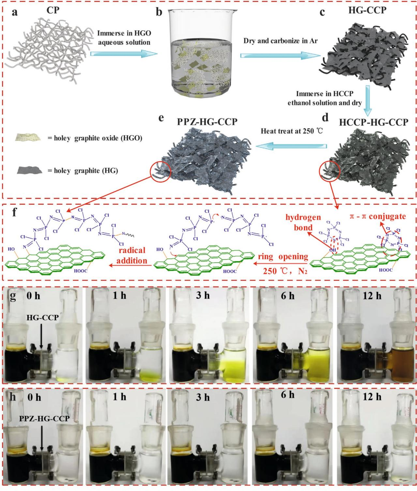
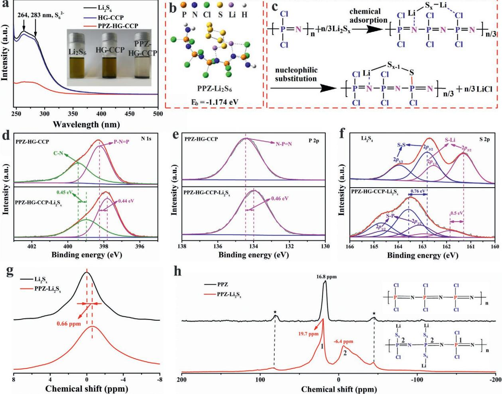
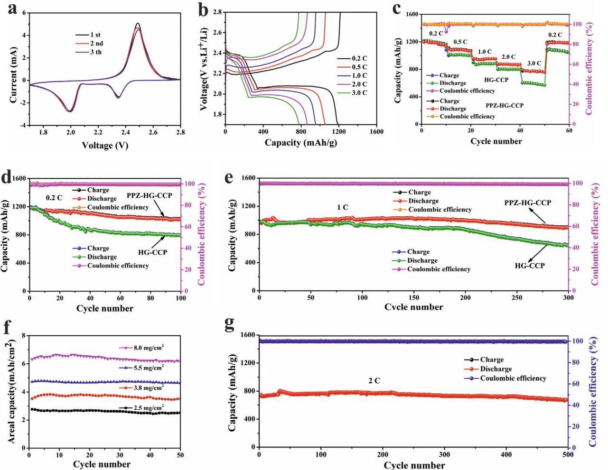
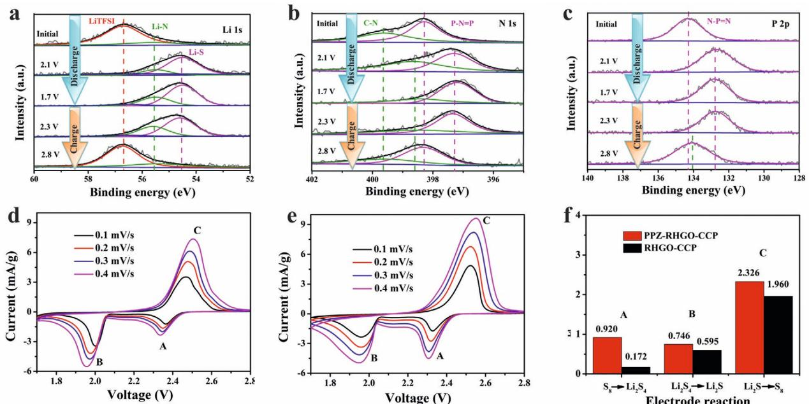
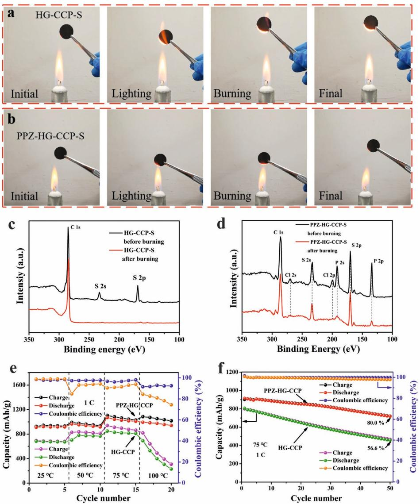
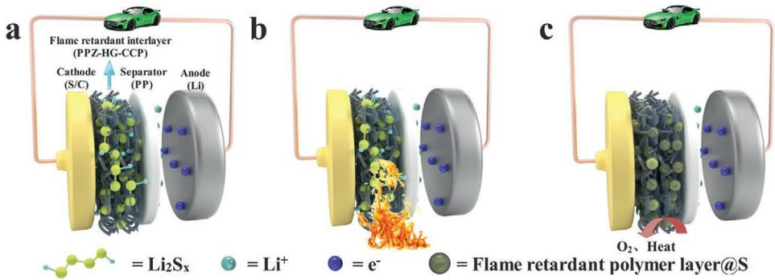

# **Strong Chemical Interaction between Lithium Polysulfides and Flame-Retardant Polyphosphazene for Lithium–Sulfur Batteries with Enhanced Safety and Electrochemical Performance**

*Peng Chen, Zhen Wu, Tong Guo, Yan Zhou, Mingliang Liu, Xifeng Xia, Jingwen Sun, Lude Lu, Xiaoping Ouyang, Xin Wang, Yongsheng Fu,\* and Junwu Zhu\**

**The shuttle effect of lithium polysulfides (LiPS) and potential safety hazard caused by the burning of flammable organic electrolytes, sulfur cathode, and lithium anode seriously limit the practical application of lithium–sulfur (Li–S) batteries. Here, a flame-retardant polyphosphazene (PPZ) covalently modified holey graphene/carbonized cellulose paper is reported as a multifunctional interlayer in Li–S batteries. During the discharge/charge process, once the LiPS are generated, the as-obtained flame-retardant interlayer traps them immediately through the nucleophilic substitution reaction between PPZ and LiPS, effectively inhibiting the shuttling effect of LiPS to enhance the cycle stability of Li–S batteries. Meanwhile, this strong chemical interaction increases the diffusion coefficient for lithium ions, accelerating the lithiation reaction with complete inversion. Moreover, the as-obtained interlayer can be used as a fresh 3D current collector to establish a flameretardant "vice-electrode," which can trap dissolved sulfur and absorb a large amount of electrolyte, prominently bringing down the flammability of the sulfur cathode and electrolyte to improve the safety of Li–S batteries. This work provides a viable strategy for using PPZ-based materials as strong chemical scavengers for LiPS and a flame-retardant interlayer toward next-generation Li–S batteries with enhanced safety and electrochemical performance.**

P. Chen, Z. Wu, T. Guo, Y. Zhou, M. Liu, Dr. X. Xia, Dr. J. Sun, Prof. L. Lu, Prof. X. Wang, Prof. Y. Fu, Prof. J. Zhu Key Laboratory for Soft Chemistry and Functional Materials of Ministry of Education Nanjing University of Science and Technology Nanjing 210094, P. R. China E-mail: fuyongsheng@njust.edu.cn; zhujw@njust.edu.cn Prof. X. Ouyang Key Laboratory of Low Dimensional Materials and Application Technology School of Materials Science and Engineering Xiangtan University Xiangtan 411105, P. R. China

The ORCID identification number(s) for the author(s) of this article can be found under https://doi.org/10.1002/adma.202007549.

#### **DOI: 10.1002/adma.202007549**

Lithium–sulfur (Li–S) batteries, as one of the most promising candidates for the next generation of energy-storage devices, have garnered increasing attention in recent years because of their high theoretical capacity (1675 mAh g−1 ) and energy density (2600 Wh kg−1 ).[1–3] Nevertheless, there are several intractable scientific and technical problems such as the dissolution of lithium polysulfides (LiPS) in electrolyte, non-electric conductivity and serious volume expansion of sulfur, impeding the practical application of Li–S batteries.[4–6] To break through these bottlenecks, many strategies have been used to enhance the electrochemical performance of Li–S batteries such as constructing host materials of sulfur cathode,[6–9] modifying functional separators,[10,11] introducing interlayers,[12–14] adding electrolyte additive,[15–17] and using new binders.[18,19] Chen and coworkers synthesized a yolk–shelled carbon@Fe3O4 nanoboxes as highly efficient sulfur host for Li–S batteries, delivering high specific capacity, excellent rate capacity, and long cycling stability.[6]

On the other hand, the safe operation of Li–S batteries has become an extremely important criterion, especially for largescale commercial application.[20,21] In Li–S batteries, the volatile and flammable organic electrolytes with low flash points, such as ether and carbonate, are susceptible to burning caused by external heat sources or inadvertent abuse of the battery, leading to thermal runaway and explosion.[22,23] Moreover, the carbon– sulfur composite materials are very easy to explode, especially in the presence of lithium nitrate, something like the composition of black gunpowder containing sulfur, niter, and charcoal, seriously affecting the safety of Li–S batteries.[21,24] Therefore, it is of great interest to intrinsically increase the battery safety and simultaneously enhance electrochemical performance for the commercialization of Li–S batteries. Currently, there are several main strategies for increasing safety of Li–S batteries: using solid-state electrolytes,[25] adding flame-retardant additives into

the electrolyte,[26–28] employing refractory binders,[29] and constructing nonflammable separators.[30,31] However, it is found that high concentration of flame-retardant electrolyte additives with high viscosity and low conductivity[32] and solid-state electrolytes with high interfacial impedance[25] may greatly affect the electrochemical performance and industrial applications of Li–S batteries. Zhou and co-workers used an aqueous inorganic polymer of ammonium polyphosphate as multifunctional binder, which can not only reduce the flammability of the sulfur cathode due to its flame retardancy, but also suppress the shuttling effect of LiPS and accelerate cathode reaction kinetics via rapid transmission of Li+ on the ammonium polyphosphate.[33] Lei and coworkers constructed a nonflammable separator consisting of ammonium polyphosphate and polyacrylonitrile (PAN) via electrospinning process for improving the stabilization of the battery at high temperatures, as a result, the asobtained nonflammable separator can effectively block LiPS migration.[34] Even so, employing refractory binders and constructing nonflammable separators cannot avoid inflammation of the volatile organic electrolytes, thus the safety problem of Li–S batteries still remains to be a big challenge.

As a kind of inorganic–organic hybrid polymers consisting of nitrogen and phosphorus atoms in the main chains, polyphosphazene (PPZ) has been receiving attention in recent years, on account of its high and low temperature resistance property as well as good flame-retardant characteristics.[35,36] In this work, we first propose the concept of flame-retardant interlayer which presents a brand new strategy to simultaneously improve the safety and electrochemical performance for Li–S battery. As a flame-retardant interlayer for Li–S batteries, a polyphosphazene covalently modified holey graphene/carbonized cellulose paper (PPZ-HG-CCP) was prepared by facile impregnation and carbonization processes. PPZ-HG-CCP can effectively restrain shuttle effect of LiPS via nucleophilic substitution reaction between PPZ and LiPS, thereby improving the cycle stability of Li–S batteries. In addition, PPZ can also serve as an excellent flame retardant for reducing the flammability of the PPZ-HG-CCP interlayer. What's more, during the charge and discharge processes, the PPZ-HG-CCP interlayer can trap dissolved sulfur and absorb a large amount of electrolyte. PPZ in PPZ-HG-CCP interlayer has excellent flame retardancy and will decompose to form a dense protective layer that isolates heat and oxygen at high temperatures, bringing down the flammability of the sulfur cathode and electrolyte simultaneously, and thus improving the safety of Li–S battery. Moreover, holey graphene can provide a fast channel for the migration of lithium ions, achieving significant rate capability. As a result, the Li–S battery with PPZ-HG-CCP interlayer displays a high discharge capacity (1019 mAh g−1 at 0.2 C after 100 cycles, 893 mAh g−1 at 1.0 C after 300 cycles) and an excellent cycling stability (a low average capacity fading rate of 0.0152% at 2 C over 500 cycles). When the sulfur loading is up to 8.0 mg cm−2 , the areal capacity can attain 6.5 mAh cm−2 . Even after sulfur and electrolyte was absorbed on the PPZ-HG-CCP interlayer, the interlayer still exhibit excellent flame-retardant performance.

**Figure 1**a–e elucidates an ingenious method for the construction of PPZ-HG-CCP interlayer, which involves two impregnation processes and two heat treatment steps under the protection of N2. Figure S1a, Supporting Information, shows the photographs of cellulose paper (CP), holey graphene oxide modified

cellulose paper (HGO-CP), carbonized HGO-CP (HG-CCP), phosphonitrilic chloride trimer (HCCP) decorated HG-CCP (HCCP-HG-CCP), and PPZ covalently modified HG-CCP (PPZ-HG-CCP). The size of HG-CCP after calcined at 800 °C is obviously reduced in 19 mm compared with 24 mm for HGO-CP without heat treatment. While, there are no noticeable change in sizes of HG-CCP, HCCP-HG-CCP, and PPZ-HG-CCP after adsorption of HCCP and heat treatment at 250 °C. The PPZ-HG-CCP interlayer exhibits admirable flexibility (Figure S1b, Supporting Information), guaranteeing the viability of assembling the coin cell. CP contains plenty of hydroxyl groups, endowing it with excellent self-assembly capacity with diverse polar materials.[37] As a consequence, HGO can be easily coupled with CP through *π*–*π* stacking and hydrogen bond interactions, forming HGO-CP during drying (Figure 1b). After calcination, HGO-CP is turned into HG-CCP through the reduction of HGO and carbonization of CP (Figure 1c). The surface of CCP is covered with large sheets of HG (Figure S2a–d, Supporting Information). Then HG-CCP is dipped in HCCP ethanol solution for 1 h and then dried, consequently, HCCP was stuck on the surface of HG-CCP (Figure 1d and Figure S2e–h, Supporting Information). After heat treatment at 250 °C for 4 h, the ring-opening reactions of HCCP first occurs to generate HCCP radicals, and then the radical addition reaction takes place between the CC bond on the HG-CCP and HCCP radicals to form HCCP radical-modified HG-CCP via covalent CN bond. Simultaneously, PPZ can be in situ formed via self-polymerization of HCCP radicals resulting in the formation of the covalently coupled PPZ-HG-CCP (Figure 1f). Compared with SEM images of HG-CCP interlayer (Figure S2a–d, Supporting Information), it can be seen that a polymer layer appears on the surface of PPZ-HG-CCP (Figure S2i–l, Supporting Information). The PPZ-HG-CCP interlayer with a thickness of about 50 µm displays adequate space to accommodate the volumetric expansion of sulfur (Figure S2k, Supporting Information). By contrast, HG-CCP and HCCP-HG-CCP interlayers exhibit comparable thickness to that of PPZ-HG-CCP (Figure S2c,g, Supporting Information), suggesting that there was no effect of chemical adsorption and polymerization of HCCP on the thickness of the materials. The elemental mappings demonstrate a uniform distribution of C, P, N, Cl, and O in HCCP-HG-CCP interlayer (Figure S3, Supporting Information). In addition, the elemental mappings of PPZ-HG-CCP show that the C, P, N, Cl, and O elements were evenly distributed on the surface (Figure S4, Supporting Information). The contents of P, N, and Cl elements on the surface of PPZ-HG-CCP are slightly less than that of HCCP-HG-CCP, which can be ascribed to the evaporation of HCCP during the heat treatment at 250 °C (Figure S5, Supporting Information). The XPS technique was employed to confirm the elemental composition and chemical state. Figure S6a, Supporting Information, shows the survey XPS spectrum, in which peaks located at 531.0, 397.0, 284.6, 269.8, 199.3, 189.9, and 132.7 eV can be identified as C 1s, O 1s, N 1s, Cl 2s, Cl 2p, P 2s, and P 2p, respectively. The C 1s species in PPZ-HG-CCP existed in the forms of CC (284.6 eV), CC (285.1 eV), CN (285.8 eV), CO (286.8eV), and OCO (289.7 eV), respectively (Figure S6b, Supporting Information). The area ratio of CC/CC in PPZ-HG-CCP (29%) is much higher than that of HG-CCP (17%). The formation of

**Figure 1.** a–e) Illustration of the fabrication process of PPZ-HG-CCP interlayer. f) The mechanism diagram from HCCP-HG-CCP to PPZ-HG-CCP. g,h) Permeation experiments with an H type of permeation device for HG-CCP interlayer (g) and PPZ-HG-CCP interlayer (h).

CN and the increase of CC content may be ascribed to the fact that the CC in HG-CCP can readily undergo a radical addition reaction with the as-generated HCCP radicals at 250 °C. As shown in Figure S6c, Supporting Information, the two peaks at the binding energies of 397.0 and 399.2 eV are assigned to PNP and CN, respectively.[35] In Figure S6d, Supporting Information, the peak at binding energy of 133.0 eV is corresponding to PNP.[38] The above XPS results confirm the successful preparation of the covalently coupled PPZ-HG-CCP. Figure S7, Supporting Information, presents the XRD patterns

**Figure 2.** a) UV–vis spectra of Li2S6 solution before and after the addition of HG-CCP and PPZ-HG-CCP, respectively. Digital image of the Li2S6 (0.005 m) captured by HG-CCP and PPZ-HG-CCP powders in DOL/DME solution. b) Adsorption conformations and binding strengths for Li2S6 on PPZ. c) Mechanism diagram of chemical adsorption and nucleophilic substitution reaction between PPZ and Li2S*x*. d–f) XPS spectra of N 1s (d), P 2p (e), and S 2p (f) of the PPZ-HG-CCP and PPZ-HG-CCP-Li2S*x*. g) Solid-state 7 Li MAS-NMR spectra of Li2S*x* and PPZ-Li2S*x*. h) 31P MAS-NMR spectra of PPZ and PPZ-Li2S*x*. ★ indicates spinning side bands.

of HG-CCP, HCCP-HG-CCP, and PPZ-HG-CCP. All samples show one wide peak at 2*θ* of 23.0° attributing to the (002) lattice plane of carbon.[39,40] For the HCCP-HG-CCP, the peaks at 2*θ* of 12.5°, 13.6°, 15.6°, 19.1°, 23.7°, 24.1°, 25.2°, 28.8°, 29.1°, and 29.5.0° correspond to the (200), (020), (101), (201), (301), (230), (400), (002), (401), and (102) lattice planes of HCCP, respectively (JCPDS no. 70–0717), indicative of the successful adsorption of HCCP on the surface of HG-CCP. For the PPZ-HG-CCP, only the carbon (002) peak appeared, implying that as-obtained PPZ is an amorphous material.

PPZ has abundant polar functional groups of PNP and PCl, which can endow PPZ-HG-CCP interlayer with strong chemical adsorption capacity for LiPS, restraining the shuttle effect of LiPS and enhancing stability of Li–S battery. To clearly display effective inhibition of PPZ-HG-CCP on shuttle effect of LiPS, the permeation experiments were conducted using two H type of permeation devices with the right side filled with ethers solvent and the left side filled with 0.1 m Li2S6 solution, which were separated by PPZ-HG-CCP and HG-CCP interlayers, respectively. As illustrated in Figure 1g, it can be clearly seen that HG-CCP interlayer fails to block the shuttle effect of Li2S6. It is observed that the permeation of LiPS obviously occurs within 1 h and remarkably increases with the prolongation of time. For the PPZ-HG-CCP interlayer (Figure 1h), the electrolyte region (right) still remains the transparent state even after 12 h, suggesting that PPZ-HG-CCP interlayer can really effectively suppress the shuttle effect of LiPS.

The adsorption capacity of PPZ-HG-CCP toward LiPS was also evaluated by adding same mass of 20 mg HG-CCP and PPZ-HG-CCP interlayer powders into 10 mL dimethoxyethane/dioxolane (DME/DOL, v:v = 1:1) solution including 0.005 m Li2S6. After being mixed with HG-CCP for 6 h, the color of Li2S6 solution is almost unchanged, indicating a weak adsorption between HG-CCP and Li2S6 (**Figure 2**a). In stark contrast, the color of the Li2S6 solution immediately changes to nearly colorless for the PPZ-HG-CCP interlayer, implying a

strong interaction between Li2S6 and PPZ-HG-CCP interlayer. For further assess quantitatively the LiPS capturing ability on PPZ-HG-CCP interlayers, the homogeneous liquid of above three samples after mixture and adsorption were measured by UV–vis spectroscopy. The three samples reveal a wide absorption in the region between 250 and 300 nm, where the peaks located about 264 and 283 nm can be imputed to S6 2− species (Figure 2a).[41] Compared with untreated Li2S6 solution, the peak intensity of Li2S6 solution mixed with HG-CCP reduces mildly, but for PPZ-HG-CCP, the absorption peak intensity of Li2S6 solution decreases significantly, demonstrating the strong affinity of PPZ-HG-CCP toward LiPS, and thus preventing shuttle effect of LiPS. When the 0.1 m LiPS solution was added to the PPZ powder (100 mg), it can be clearly seen that the color of the solution quickly becomes colorless (Video S1, Supporting Information), indicating that the strong affinity of PPZ-HG-CCP toward LiPS is mainly ascribed to the interaction between PPZ and LiPS.

In order to further clarify the strong interaction between PPZ and LiPS species, the density functional theory was carried out to calculate the binding energies for the PPZ-LiPS system, which can be expressed as *E*b = *E*P-LiPS − *E*PPZ − *E*LiPS (*E*P-LiPS, *E*PPZ, and *E*LiPS are the total energies for the adsorption system, PPZ, and isolated LiPS species, respectively).[34] Due to the large amount of potential conformations, several potential candidates are selected to evaluate the interaction between PPZ and Li2S4 (Figure S8, Supporting Information). As shown in Figure S8d, Supporting Information, the adsorption conformation that two Li atoms on Li2S4, respectively, interact with N atom and Cl atom on the P atom, has the lowest value of *E*b of −0.965 eV, and thus is chosen to simulate the interaction between PPZ and LiPS including Li2S2, Li2S4, Li2S6, and Li2S8. As shown in Figure 2b and Figure S9, Supporting Information, the binding energies for PPZ-Li2S2, PPZ-Li2S4, PPZ-Li2S6, and PPZ-Li2S8 are −0.965, −0.965, −1.174, and −0.93 eV, respectively, which are much stronger than other common organic polymers used in Li–S batteries, such as PAN, polyethylene oxide, and polyvinylidene fluoride,[42] indicating a stronger interaction between PPZ polymer and LiPS. More importantly, it can be seen from Figure 2c and Figure S10, Supporting Information, that a nucleophilic substitution reaction between PPZ and the absorbed LiPS can spontaneously occur (the Gibbs free energies are calculated to be −1.087, −1.267, and −1.0074 eV for Li2S8, Li2S6, and Li2S4, respectively), leading to the formation of LiPS chemically modified PPZ via a covalent PS bond. This can be further verified by XPS spectra of N 1s, P 2p, and S 2p. For the high-resolution XPS spectra of N 1s shown in Figure 2d, the peaks of CN and PNP bonds for the PPZ-HG-CCP-Li2S*x* are shifted by about 0.45 eV toward lower binding energy with respect to those of PPZ-HG-CCP, suggesting strong interaction between nitrogen atoms on PPZ and Li2S*x*. Similarly, a more significant trend was observed in the high-resolution P 2p XPS spectrum: there is a shift of 0.46 eV in binding energy of NPN bond before and after the interaction between PPZ-HG-CCP and Li2S*x* (Figure 2e), which results from the joint action of the formed PS covalent bonds via nucleophilic substitution reaction between PPZ and absorbed Li2S*x* as well as the strong chemisorption of nitrogen atoms on PPZ to Li2S*x*. Furthermore, for the XPS spectra of S 2p of PPZ-HG-CCP-Li2S*x* (Figure 2f), the SLi (S 2p3/2 at 161.8 eV) and SS (S 2p3/2 at 163.6 eV) are shifted by 0.5 and 0.76 eV, respectively, toward higher binding energy compared with those of Li2S4. Meanwhile, the peak intensity of SLi bond decreases significantly. More importantly, a new peak appeared at 163.1 eV, corresponding to the SP bond (S 2p3/2), which is a direct evidence of the nucleophilic substitution reaction between PPZ and Li2S*x*. [43]

The solid-state magic-angle-spinning nuclear magnetic resonance (MAS-NMR) spectroscopy was carried out to further confirm the strong chemical interaction induced by nucleophilic substitution reaction between PPZ and LiPS. As shown in Figure 2g, the signal of 7 Li MAS-NMR spectrum for PPZ-Li2S*x* is shifted by about 0.66 ppm toward high field of lower chemical shift compared to that of Li2S*x*. This may be ascribed to the fact that the nucleophilic substitution reaction between PPZ and Li2S*x* can occur spontaneously, leading to the formation of PS bond via the removal of one LiCl. On the other hand, the remaining Li atom on Li2S*x* interacts with N atom with lone pair electrons on PPZ (Figure S8d, Supporting Information), resulting in the chemical shift of 7 Li MAS-NMR spectrum shifting to high field. Figure 2h shows the 31P MAS-NMR spectra of PPZ and PPZ-Li2S*x*. For the PPZ, the strong peak at 16.8 ppm is corresponding to the characteristic resonance of PPZ. For the PPZ-Li2S*x*, the characteristic signal of PPZ shifts to 19.7 ppm due to the change of volume magnetic susceptibility. Moreover, the PPZ-Li2S*x* presents additional resonances: the broad signal located at high field of about −6.4 ppm can be assigned to the generation of PS bonds as a result of nucleophilic substitution reaction between PPZ and LiPS. Therefore, the strong chemical interaction of PS bonds induced by nucleophilic substitution reaction between PPZ and LiPS is in favor to effectively suppress the block shuttle effect of LiPS and deliver fascinating electrochemical performance.

**Figure 3**a and Figure S11, Supporting Information, show typical cyclic voltammetry (CV) curves of Li–S batteries with PPZ-HG-CCP and HG-CCP interlayers, respectively. Both batteries displayed two reduction peaks at 2.35 and 2.05 V, which are assigned to the multistep reduction of sulfur to LiPS (Li2S*x*, 4 ≤ *x* ≤ 8) and then to Li2S2/Li2S, respectively. During the charge process, the oxidation peak at ≈2.5 V is caused by the reversible conversion from Li2S to S8. [44] For the battery with PPZ-HG-CCP interlayer, the CV curves almost completely overlap, indicative of an excellent cyclic stability.

As shown in Table S1, Supporting Information, the PPZ-HG-CCP exhibits a considerable conductivity of 8.333 S cm−1 , higher than that of HG-CCP (6.667 S cm−1 ), which can be ascribed to the introduction of PPZ with a conjugated structure of alternating single and double bond. The electrochemical impedance spectroscopy of as-assembled Li–S batteries can further confirm the excellent electrical conductivity of PPZ-HG-CCP shown in Figure S12, Supporting Information. It can be seen that the Ohmic resistance and charge transfer resistance of Li–S battery with PPZ-HG-CCP interlayer are 8.5 and 44.1 Ω, respectively, which are lower than those of HG-CCP (11.5 Ω for Ohmic resistance and 47.1 Ω for charge transfer resistance). Therefore, it can be concluded that the highly conductive PPZ-HG-CCP can be used as "vice-electrode" to improve the conductivity of sulfur and reaction kinetics.

**Figure 3.** a) Cyclic voltammetry curves of the Li–S battery with PPZ-HG-CCP interlayer. b) Galvanostatic charge–discharge voltage curves of the battery with PPZ-HG-CCP interlayer at different current densities from 0.2 to 3 C. c) Rate performance of the batteries with HG-CCP and PPZ-HG-CCP interlayers at various current densities. d) Cycling performance of Li–S batteries with HG-CCP and PPZ-HG-CCP interlayers at 0.2 C. e) Cycling performance of Li–S batteries with HG-CCP and PPZ-HG-CCP interlayers at 1 C. f) Cycling performance of the Li–S batteries with PPZ-HG-CPP interlayer at different sulfur loadings at 0.2 C. g) Cycling performance of Li–S battery with PPZ-HG-CPP interlayer at 2 C.

As shown in Figure 3b,c, the battery with the PPZ-HG-CCP interlayer reveals much higher rate capacity than that of the battery with HG-CCP interlayer, especially at lower rates of 0.2, 0.5, and 1 C, which can be attributed to the effective inhibition of shuttle effect for LiPS as result of the introduction of PPZ. The rate capacities of Li–S batteries with PPZ-HG-CCP interlayer are 1197, 1097.8, 956.5, 877.9, and 782.4 mAh g−1 at the current densities of 0.2, 0.5, 1.0, 2.0, and 3.0 C, respectively. When the current density returned back to 0.2 C, the discharge capacity can still restore to a high capacity of 1188.9 mAh g−1 , indicating an excellent rate stability. In addition, the Coulombic efficiencies of the Li–S battery with PPZ-HG-CCP interlayer at different current density are almost 100% (Figure 3c), which are consistent with that in Figure 3d.

The cyclic performances of Li–S batteries with PPZ-HG-CCP and HG-CCP interlayers tested at 0.2 C are displayed in Figure 3d. The battery with PPZ-HG-CCP interlayer delivers much better electrochemical cycling stability: a lofty initial discharge capacity of 1191.3 mAh g−1 and considerable capacity of 1019 mAh g−1 after 100 cycles with capacity retention of 85.5%. In contrast, the battery with HG-CCP interlayer shows a lower reversible discharge capacity of 789.2 mAh g−1 with capacity retention of 66.9% after 100 cycles. Figure S13, Supporting Information, displays the photographs of metallic lithium and surface SEM images of PP separators for the Li–S batteries with different interlayers after 100 cycles at 0.2 C. For the battery with HG-CCP interlayer, the surfaces of the PP separator and lithium anode show yellow and slight black color, respectively (Figure S13a, Supporting Information). Moreover, there are lots of lithium dendrites on the surface of lithium anode (Figure S13b,c, Supporting Information). These may be because of the lack of sufficient ability for the HG-CCP interlayer to prevent shuttle effect of LiPS, resulting in the formation of lithium dendrites and making the Li–S battery unstable and dangerous. In sharp contrast, for the battery with PPZ-HG-CCP interlayer, the surfaces of PP separator and

**Figure 4.** a–c) XPS spectra of Li 1s (a), N 1s (b), and P 2p (c) on the surface of the PPZ-HG-CCP at different charge/discharge states. d,e) CV curves measured at various scan rates for Li–S cells with HG-CCP and PPZ-HG-CCP interlayer. f) Calculated diffusion coefficient of lithium ion.

lithium anode almost remain in the original color and flatness (Figure S13d–f, Supporting Information), implying an excellent inhibition for shuttle effect of LiPS.

Figure 3e compares the long-term cyclic performances of above Li–S batteries at a high current density of 1.0 C. The reversible discharge capacities of Li–S batteries with PPZ-HG-CCP interlayer for the 1st and 300th cycles, respectively, are 995 and 893 mAh g−1 with a capacity retention of 89.7%, which is much higher than that of Li–S battery with HG-CCP (65.7%). In order to further evaluate the application potential, the Li–S batteries with different sulfur loadings on aluminum foil and PPZ-HG-CCP interlayer were assembled. As shown in Figure 3f, all the batteries possess excellent cyclic stability after 50 cycles. When the sulfur loading is up to 8.0 mg cm−2 , the areal capacity can attain 6.5 mAh cm−2 . Furthermore, the battery with PPZ-HG-CCP interlayer shows excellent cycling stability with a high capacity retention of 92.4% over 500 cycles at the current density of 2 C and a low average capacity fading rate of 0.0152% per cycle (Figure 3g).

The superior capacity and fantastic cyclability of the Li–S batteries with PPZ-HG-CCP interlayer can be mainly attributed to the effective inhibition of PPZ-HG-CCP interlayer for LiPS shuttle effect. **Figure 4**a–c displays the XPS spectra of the PPZ-HG-CCP interlayer in the assembled 2032 coin batteries at different charge/discharge states. The Li 1s highresolution XPS spectra (Figure 4a) show that, for the initial PPZ-HG-CCP interlayer, the peaks at 56.7 and 55.6 eV correspond to lithium bis-(trifluoromethanesulfonyl)imide (LiTFSI) and the chemisorption bonds of LiN, respectively, suggesting the strong interaction between PPZ-HG-CCP and LiTFSI. For the PPZ-HG-CCP interlayer at the state of 2.1 V (discharge), 1.7 V (full discharge), and 2.3 V (charge), the peak of LiS bond located at 54.6 eV can be clearly identified, demonstrating the presence of LiPS and Li2S.[45] Moreover, there is an obvious increase in peak area of LiN bonds compared with that of the initial PPZ-HG-CCP interlayer, which can be ascribed to the formation of LiPS and Li2S. In the fully charged state of 2.8 V, the Li 1s XPS spectrum of PPZ-HG-CCP interlayer is almost the same as that of the initial state, demonstrating an excellent reversibility of Li+ storage reaction. Figures 4b and 4c show the high-resolution XPS spectra of N 1s and P 2p, respectively, for the PPZ-HG-CCP interlayer at different charge and discharge states. For the states of 2.1 V (discharge), 1.7 V (full discharge), and 2.3 V (charge), the peaks of CN, PNP, and NPN bonds shift to lower binding energies due to the formation of LiPS and Li2S, which are highly consistent with the above XPS results for the interaction system of PPZ-HG-CCP and LiPS, further confirming the strong interaction of PS covalent bonds and chemisorption between PPZ-HG-CCP and LiPS. In the fully charged state of 2.8 V, the peaks of N 1s shift to the value of the initial state. Whereas, for the peak of P 2p, a shift to lower binding energy (0.3 eV) is observed as compared with that of the initial state due to that the formation of PS covalent bond is an irreversible process, which can continuously suppress the LiPS shuttle effect through all the cycles.

Moreover, it is well known that the high migration rate of lithium ions can improve the electrochemical performance of Li–S battery. The effect of HG-CCP and PPZ-HG-CCP interlayers on the migration of lithium ions was also investigated. CV curves measured at various scan rates from 0.1 to 0.4 mV s−1 are performed to determine the diffusion coefficient of lithium ion (Figure 4d,e). The peaks of A and B are corresponding to the cathodic reaction of S8 → Li2S4 and Li2S4 → Li2S, respectively, while peak C corresponds to the anodic reaction of Li2S → S8. All the cathodic and anodic peak currents gain with the increase of the scan rate. The diffusion coefficient of lithium ion can be calculated based on the Randles–Sevcik equation:[46]

$$
I_p = 2.69 \times 10^5 n^{3/2} A D^{1/2} C v^{1/2}
$$
 (1)

where *I*p is the peak current, *n* is 2 for Li–S batteries, which is the number of electron transfer during the charge– discharge process, *A* is the area of the active electrode, which is 1.13 cm2 , *C* is the concentration of lithium ions in the electrolyte (mol mL−1 ), *D* is the diffusion coefficient of lithium ion (cm2 s−1 ), and *ν* is the scan rate (V s−1 ).[47] Figure 4f displays the calculated *D*Li+ values in the different reaction stage according to the linear plots of *I*p against *v*1/2. For the whole discharge/charge reaction stages of S8 → Li2S4, Li2S4 → Li2S, and Li2S → S8, the Li–S battery with PPZ-HG-CCP interlayer exhibits much higher *D*Li+ values than that of the one with HG-CCP interlayer, which can be ascribed to the strong chemical interaction induced by nucleophilic substitution reaction between PPZ and LiPS, which facilitates the lithiation reaction with complete inversion. As show in Figure S14a–c, Supporting Information, all the anodic and cathodic peak currents are linear with the square root of scan rate, suggesting the diffusion-controlled reaction.[48]

Self-discharge is a serious shortcoming of Li–S battery arising from the shuttle effect between the Li anode and LiPS.[49] To evaluate the anti-self-discharge property of Li–S battery with PPZ-HG-CCP, an interval charge/discharge experiment was carried out as following: the batteries with different interlayers were cycled for 10 cycles followed by a 24-h rest, and remained in operation for the following 90 cycles. For the battery with PPZ-HG-CCP interlayer, there is a capacity decay of 4.3% between the 10th and 11th cycles, while it was 9.0% for the battery with HG-CCP (Figure S15, Supporting Information). Furthermore, the capacity of the 12th cycle for the battery with PPZ-HG-CCP interlayer is almost identical to that of the 10th cycle, demonstrating that PPZ-HG-CCP interlayer can restrain the self-discharge behavior effectively. The battery with PPZ-HG-CCP interlayer can still deliver a discharge capacity of 945.1 mAh g−1 after 100 cycles, which is higher than that of the battery with HG-CCP interlayer (860.3 mAh g−1 ), suggesting that the PPZ-HG-CCP interlayer can give Li–S battery with excellent anti-self-discharge property.

To investigate the flame-retardant property of the PPZ-HG-CCP interlayer upon thermal triggering, the combustion tests for the different interlayers were first performed on the flame of an alcohol burner and the results are shown in Figure S16 and Videos S2 and S3, Supporting Information. It can be seen that the HG-CCP interlayer underwent serious destruction in structure and resulted in great mass loss after 60 s. The residual mass fraction of HG-CCP interlayer after burning for 60 s is only 17% (Figure S17, Supporting Information). In striking contrast, the PPZ-HG-CCP interlayer is observed to be nearly nonflammable and the residual mass fraction of PPZ-HG-CCP was 81%, indicating the excellent flame-retardant property of PPZ-HG-CCP interlayer caused by the introduction of flame-retardant PPZ. Sulfur and electrolyte in the Li–S battery are highly inflammable. During the charge and discharge processes, a large amount of sulfur and electrolyte is absorbed by the interlayer, thus the combustion test of interlayer after charge/discharge cycles can better simulate the real working environment of Li–S batteries. Before the combustion tests, the interlayers were taken out of the cycled Li–S batteries which worked at 0.2 C over 100 cycles. As is shown in **Figure 5**a and Video S4, Supporting Information, the HG-CCP interlayer with the absorbed sulfur and electrolyte is ignited immediately upon approaching the flame. Even after leaving the flame, the HG-CCP interlayer continues to burn, leading to the structural failure. Excitedly, the flame-retardant PPZ-HG-CCP interlayer with absorbed sulfur and electrolyte cannot be ignited when approaching the flame (Figure 5b and Video S5, Supporting Information). After removal of the burner, the interlayer can remain intact.

To further confirm the flame-retardant property of PPZ-HG-CCP interlayer, the XPS was employed to investigate elemental composition of interlayers with the absorbed sulfur and electrolyte before and after combustion tests. After burning, the sulfur signal in HG-CCP is nearly unobservable (Figure 5c), suggesting that sulfur is burned off. For the PPZ-HG-CCP interlayer with the absorbed sulfur and electrolyte, there is no noticeable change in peak position and intensity of the sulfur signal (Figure 5d), further indicative of the excellent flame-retardant property and thermal stability of the PPZ-HG-CCP interlayer with the absorbed sulfur and electrolyte.

Figure 5e and Figure S18, Supporting Information, show the temperature-dependent electrochemical performances of batteries with different interlayers. For the battery with flame-retardant PPZ-HG-CCP interlayer, it can be seen that the capacities increased with the rise of temperature from 25 to 100 °C with high Coulombic efficiencies, which can be ascribed to the strong chemical interaction between the PPZ-HG-CCP interlayer and LiPS, the enhanced diffusion coefficient of Li+ in LiPS, and excellent heat resistance of PPZ-HG-CCP interlayer. However, for the battery with HG-CCP interlayer, the capacity is rapidly depleted at the high temperature of 100 °C due to the fast self-discharge behavior. The battery with HG-CCP interlayer is enormously affected by the increased temperature, indicating that the weak interaction between HG-CCP and LiPS cannot impede the shuttle effect. In contrast, on account of the strong chemical interaction between PPZ-HG-CCP and LiPS, the battery with PPZ-HG-CCP interlayer exhibits outstanding cyclic stability at 75 °C. After 50 cycles, the capacity retention rate for the battery with PPZ-HG-CCP reaches up to 80.0%, which is much higher than that of the battery with HG-CCP (56.6%) (Figure 5f). The loss of specific capacity of the battery with PPZ-HG-CCP interlayer may be attributed to the poor stability of solid electrolyte interphase film induced by its self-dissolution and insertion of solvents at high temperature.[50,51]

In order to prove that the PPZ-HG-CCP still has strong interaction with LiPS at high temperature, 20 mg PPZ-HG-CCP powder and 10 mL DME/DOL (v:v = 1:1) solution including 0.005 m Li2S6 were mixed and then the adsorption effect at different temperatures of 50, 75, and 100 °C were carried out (Figure S19, Supporting Information). The color of mixed solution remains nearly colorless at different high temperatures, implying a strong interaction between LiPS and PPZ-HG-CCP

**Figure 5.** a,b) Flame-retardant properties of HG-CCP-S (a) and PPZ-HG-CCP-S (b). c,d) Wide-scan survey XPS spectra of HG-CCP-S and PPZ-HG-CCP-S before/after burning. e) The cycle of Li–S batteries with HG-CCP and PPZ-HG-CCP interlayers at different temperatures. f) The cycle capacity of Li–S batteries with different interlayers at 75 °C.

interlayer. The wider operation temperature range will help the PPZ-HG-CCP to be used in the commercialization of Li–S batteries.

To further demonstrate the self-discharge behavior of different interlayers at higher temperatures, open-circuit voltage (OCV) measurements were conducted at 75 °C. Before the test, the batteries with HG-CCP and PPZ-HG-CCP interlayer were charged and discharged once at 2.4 V. Compared with the battery with HG-CCP, the OCV value of the one with PPZ-HG-CCP interlayer remains almost constant with the prolongation of time (Figure S20, Supporting Information), implying an extraordinary anti-self-discharge feature of PPZ-HG-CCP interlayer at higher temperatures.

Schematics of the flame-retardant properties for Li–S battery with PPZ-HG-CCP interlayer are shown in **Figure 6**. During the discharge, sulfur cathode will be converted into LiPS and then chemically interacted with the PPZ-HG-CCP interlayer through the nucleophilic substitution reaction between PPZ and LiPS, which can be used as a fresh 3D current collector to construct a "vice-electrode" during the following charge– discharge processes (Figure 6a).[37,52] As shown in Figure S21, Supporting Information, for PPZ-HG-CCP interlayer after 100 cycles at 0.2 C, sulfur, oxygen, and other elements are evenly distributed on the PPZ-HG-CCP interlayer, indicating that sulfur and electrolyte were adsorbed by the PPZ-HG-CCP interlayer during the cycling process, leading to the formation of "vice-electrode". At the same time, the as-obtained "vice-electrode" inherits excellent flame-retardant characteristic from the PPZ-HG-CCP interlayer, which can prevent sulfur and organic electrolyte from burning when the battery

**Figure 6.** Schematics of the PPZ-HG-CCP interlayer with flame-retardant properties for Li–S batteries. a) In working conditions, PPZ-HG-CCP acts as an efficient LiPS diverter. b,c) Upon thermal triggering, the PPZ will decompose and form an insulating and dense flame-retardant polymer layer covering the surface of the sulfur.

catch fire (Figure 6b). The flame-retardant mechanism of the PPZ-HG-CCP interlayer can be deemed as follows: During the combustion process, PPZ disintegrates and produces phosphoric acid, partial phosphoric acid, and polyphosphoric acid, which can cross-link to form an insulating and dense polymer layer. This insulating and dense polymer layer can act as a physical barrier to heat and oxygen (Figure 6c), effectively protecting the sulfur cathode and electrolyte from ignition.[53] Figure S22, Supporting Information, displays the surface SEM images and mapping of above cycled PPZ-HG-CCP interlayer after burning. It can be clearly seen that there is a dense polymer layer generated by the decomposition of PPZ and then cross-linked on the surface of the interlayer. Under the dense polymer layer, many sulfur particles with a mean diameter of 5 µm can be observed, which can be ascribed to the agglomeration of sulfur (Figure S22c–h, Supporting Information). The as-formed polymer layer can insulate oxygen and heat, and thus block sulfur and organic electrolyte from burning (Figure 5d and Figure S23, Supporting Information), endowing battery with high safety.

A multifunctional PPZ-HG-CCP interlayer with flame retardancy was synthesized with a facile method. PPZ in the interlayer can not only improve the safety performance of Li–S battery, but also enhance the electrochemical performances. The strong binding affinity between the PPZ-HG-CCP and LiPS effectively inhibits the shuttling effect of LiPS, enhancing the cycle stability of Li–S batteries. Moreover, the PPZ-HG-CCP interlayer can be used as a new 3D current collector to construct a flame-retardant "vice-electrode," which can trap dissolved sulfur and absorb a large amount of electrolyte, significantly reducing the flammability of the sulfur cathode and electrolyte, and thus enhancing the safety performance of Li–S batteries. This strategy can be integrated into other optimized devices by simple combination without modifying the electrode structure, and will display widely promising applications in the field of Li–S batteries.

#### **Supporting Information**

Supporting Information is available from the Wiley Online Library or from the author.

### **Acknowledgements**

This work was supported by National Natural Science Foundation of China (Grant Nos. 51772156 and 51872144), Natural Science Foundation of Jiangsu Province (Grant Nos. BK20180019), the Opening Project of the Jiangsu Key Laboratory for Chemistry of Low-Dimensional Materials (No. JSKC20021), PAPD of Jiangsu, and Co-constructing Collaborative Innovation Center for Advanced Micro/nanomaterials and Equipment by Jiangsu Province and Ministry of Education. In addition, the authors would like to thank Xiangxiang Gong (Testing Center of Yangzhou University) for his help with the XPS analysis.

## **Conflict of Interest**

The authors declare no conflict of interest.

#### **Keywords**

flame-retardant, lithium–sulfur batteries, polyphosphazene, safety, strong chemical interaction

> Received: November 4, 2020 Revised: December 16, 2020 Published online: January 27, 2021

- [1] Z. W. Seh, Y. Sun, Q. Zhang, Y. Cui, *Chem. Soc. Rev.* **2016**, *45*, 5605.
- [2] Y. X. Yin, S. Xin, Y. G. Guo, L. J. Wan, *Angew. Chem., Int. Ed.* **2013**, *52*, 13186.
- [3] A. Manthiram, S. H. Chung, C. Zu, *Adv. Mater.* **2015**, *27*, 1980.
- [4] L. l. Zhang, Y. Wang, Z. Niu, J. Chen, *Carbon* **2019**, *141*, 400.
- [5] X. Chen, T. Z. Hou, K. A. Persson, Q. Zhang, *Mater. Today* **2019**, *22*, 142.
- [6] J. He, L. Luo, Y. Chen, A. Manthiram, *Adv. Mater.* **2017**, *29*, 1702707.
- [7] J. He, Y. Chen, A. Manthiram, *Adv. Energy Mater.* **2019**, *9*, 1900584.
- [8] J. He, A. Bhargav, H. Y. Asl, Y. Chen, A. Manthiram, *Adv. Energy Mater.* **2020**, *10*, 2001017.
- [9] Z. Sun, S. Vijay, H. H. Heenen, A. Y. Sheng Eng, W. Tu, Y. Zhao, S. W. Koh, P. Gao, Z. W. Seh, K. Chan, H. Li, *Adv. Energy Mater.* **2020**, *10*, 1904010.
- [10] B. Yu, D. Chen, Z. Wang, F. Qi, X. Zhang, X. Wang, Y. Hu, B. Wang, W. Zhang, Y. Chen, J. He, W. He, *Chem. Eng. J.* **2020**, *399*, 125837.
- [11] J. He, Y. Chen, A. Manthiram, *Energy Environ. Sci.* **2018**, *11*, 2560.

- [12] L. L. Fan, M. Li, X. F. Li, W. Xiao, Z. W. Chen, J. Lu, *Joule* **2019**, *3*, 361.
- [13] P. Chen, Y. Fu, Z. Wu, J. Xia, Y. Zhou, J. Xu, J. Zhu, X. Wang, *J. Power Sources* **2019**, *434*, 226728.
- [14] J. Qian, F. J. Wang, Y. Li, S. Wang, Y. Y. Zhao, W. L. Li, Y. Xing, L. Deng, Q. Sun, L. Li, F. Wu, R. J. Chen, *Adv. Funct. Mater.* **2020**, *30*, 2000742.
- [15] H. Zhang, G. G. Eshetu, X. Judez, C. Li, L. M. Rodriguez-Martínez, M. Armand, *Angew. Chem., Int. Ed.* **2018**, *57*, 15002.
- [16] P. Shi, X. Liang, K. Xu, Y. Sun, S. Cheng, C. Chen, H. Xiang, *Chem. Eng. J.* **2020**, *398*, 125608.
- [17] D. Wang, H. Liu, M. Li, D. Xia, J. Holoubek, Z. Deng, M. Yu, J. Tian, Z. Shan, S. P. Ong, P. Liu, Z. Chen, *Nano Energy* **2020**, *75*, 104889.
- [18] W. Chen, T. Lei, T. Qian, W. Lv, W. He, C. Wu, X. Liu, J. Liu, B. Chen, C. Yan, J. Xiong, *Adv. Energy Mater.* **2018**, *8*, 1702889.
- [19] L. Li, T. A. Pascal, J. G. Connell, F. Y. Fan, S. M. Meckler, L. Ma, Y. M. Chiang, D. Prendergast, B. A. Helms, *Nat. Commun.* **2017**, *8*, 2277.
- [20] S. Dörfler, H. Althues, P. Härtel, T. Abendroth, B. Schumm, S. Kaskel, *Joule* **2020**, *4*, 539.
- [21] W. Chen, T. Lei, C. Wu, M. Deng, C. Gong, K. Hu, Y. Ma, L. Dai, W. Lv, W. He, X. Liu, J. Xiong, C. Yan, *Adv. Energy Mater.* **2018**, *8*, 1702348.
- [22] D. Lei, K. Shi, H. Ye, Z. Wan, Y. Wang, L. Shen, B. Li, Q. H. Yang, F. Kang, Y. B. He, *Adv. Funct. Mater.* **2018**, *28*, 1707570.
- [23] F. Lin, J. Wang, H. Jia, C. W. Monroe, J. Yang, Y. NuLi, *J. Power Sources* **2013**, *223*, 18.
- [24] Y. Z. Sun, J. Q. Huang, C. Z. Zhao, Q. Zhang, *Sci. China Chem.* **2017**, *60*, 1508.
- [25] X. Judez, H. Zhang, C. Li, G. G. Eshetu, J. A. Gonzalez-Marcos, M. Armand, L. M. Rodriguez-Martinez, *J. Electrochem. Soc.* **2018**, *165*, A6008.
- [26] J. Wang, F. Lin, H. Jia, J. Yang, C. W. Monroe, Y. NuLi, *Angew. Chem., Int. Ed.* **2014**, *53*, 10099.
- [27] H. Jia, J. Wang, F. Lin, C. W. Monroe, J. Yang, Y. NuLi, *Chem. Commun.* **2014**, *50*, 7011.
- [28] H. Yang, Q. Li, C. Guo, A. Naveed, J. Yang, Y. Nuli, J. Wang, *Chem. Commun.* **2018**, *54*, 4132.
- [29] Q. Guo, Z. Zheng, *Adv. Funct. Mater.* **2020**, *30*, 1907931.
- [30] N. Deng, Y. Liu, L. Wang, Q. Li, Y. Hao, Y. Feng, B. Cheng, W. Kang, W. Zhu, *ACS Appl. Mater. Interfaces* **2019**, *11*, 36705.
- [31] Y. Li, J. Zhang, C. Zhou, M. Ling, J. Lu, Y. Hou, Q. Zhang, Q. He, X. Zhan, F. Chen, *J. Alloys Compd.* **2020**, *826*, 154197.
- [32] S. Chen, J. Zheng, L. Yu, X. Ren, M. H. Engelhard, C. Niu, H. Lee, W. Xu, J. Xiao, J. Liu, J. G. Zhang, *Joule* **2018**, *2*, 1548.
- [33] G. Zhou, K. Liu, Y. Fan, M. Yuan, B. Liu, W. Liu, F. Shi, Y. Liu, W. Chen, J. Lopez, D. Zhuo, J. Zhao, Y. Tsao, X. Huang, Q. Zhang, Y. Cui, *ACS Cent. Sci.* **2018**, *4*, 260.
- [34] T. Lei, W. Chen, Y. Hu, W. Lv, X. Lv, Y. Yan, J. Huang, Y. Jiao, J. Chu, C. Yan, C. Wu, Q. Li, W. He, J. Xiong, *Adv. Energy Mater.* **2018**, *8*, 1802441.
- [35] W. Zhang, J. Barrio, C. Gervais, A. Kocjan, A. Yu, X. Wang, M. Shalom, *Angew. Chem., Int. Ed.* **2018**, *57*, 9764.
- [36] S. Qiu, Y. Zhou, X. Zhou, T. Zhang, C. Wang, R. K. K. Yuen, W. Hu, Y. Hu, *Small* **2019**, *15*, 1805175.
- [37] P. Chen, Y. Fan, Y. Gao, Q. Liu, Y. Sun, T. Guo, B. Huang, X. Wang, Y. Fu, *Ind. Eng. Chem. Res.* **2020**, *59*, 11475.
- [38] A. J. Pearse, T. E. Schmitt, E. J. Fuller, F. El-Gabaly, C. F. Lin, K. Gerasopoulos, A. C. Kozen, A. A. Talin, G. Rubloff, K. E. Gregorczyk, *Chem. Mater.* **2017**, *29*, 3740.
- [39] Y. Zhou, Z. Jia, L. Shi, Z. Wu, B. Jie, S. Zhao, L. Wei, A. Zhou, J. Zhu, X. Wang, Y. Fu, *Chem. Eng. J.* **2020**, *385*, 123858.
- [40] C. Yang, Q. Jiang, W. Li, H. He, L. Yang, Z. Lu, H. Huang, *Chem. Mater.* **2019**, *31*, 9277.
- [41] J. Xu, P. Chen, J. Wu, P. Hu, Y. Fu, W. Jiang, J. Fu, *Chem. Mater.* **2019**, *31*, 7951.
- [42] P. T. Dirlam, R. S. Glass, K. Char, J. Pyun, *J. Polym. Sci., Part A: Polym. Chem.* **2017**, *55*, 1635.
- [43] J. Sun, Y. Sun, M. Pasta, G. Zhou, Y. Li, W. Liu, F. Xiong, Y. Cui, *Adv. Mater.* **2016**, *28*, 9797.
- [44] Y. Zhang, X. Ge, Q. Kang, Z. Kong, Y. Wang, L. Zhan, *Chem. Eng. J.* **2020**, *393*, 124570.
- [45] Y. Fu, Z. Wu, Y. Yuan, P. Chen, L. Yu, L. Yuan, Q. Han, Y. Lan, W. Bai, E. Kan, C. Huang, X. Ouyang, X. Wang, J. Zhu, J. Lu, *Nat. Commun.* **2020**, *11*, 845.
- [46] Z. Shi, J. Wei, H. Xu, L. Wang, H. Yue, Z. Cao, H. Dong, Y. Yin, S. Yang, *Chem. Eng. J.* **2020**, *379*, 122353.
- [47] X. Ni, T. Qian, X. Liu, N. Xu, J. Liu, C. Yan, *Adv. Funct. Mater.* **2018**, *28*, 1706513.
- [48] S. Bai, X. Liu, K. Zhu, S. Wu, H. Zhou, *Nat. Energy* **2016**, *1*, 16094.
- [49] Y. Pang, J. Wei, Y. Wang, Y. Xia, *Adv. Energy Mater.* **2018**, *8*, 1702288.
- [50] M. Ishikawa, Y. Tasaka, N. Yoshimoto, M. Morita, *J. Power Sources* **2001**, *262*, 97.
- [51] X. B. Cheng, R. Zhang, C. Z. Zhao, F. Wei, J. G. Zhang, Q. Zhang, *Adv. Sci.* **2016**, *3*, 1500213.
- [52] Y. Hao, D. Xiong, W. Liu, L. Fan, D. Li, X. Li, *ACS Appl. Mater. Interfaces* **2017**, *9*, 40273.
- [53] S. Qiu, W. Xing, X. Feng, B. Yu, X. Mu, R. K. K. Yuen, Y. Hu, *Chem. Eng. J.* **2017**, *309*, 802.