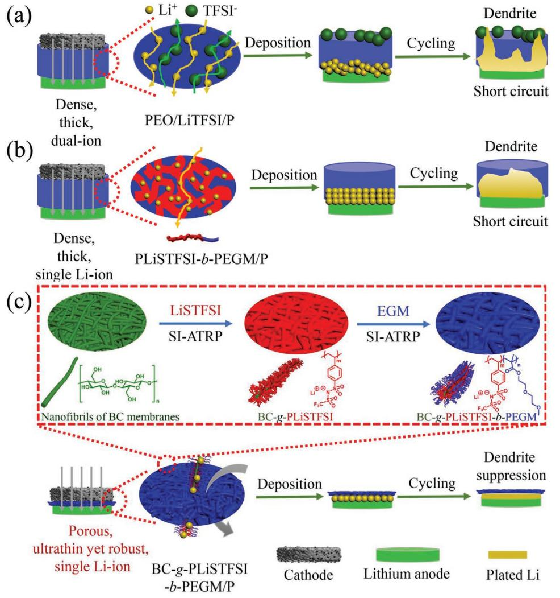
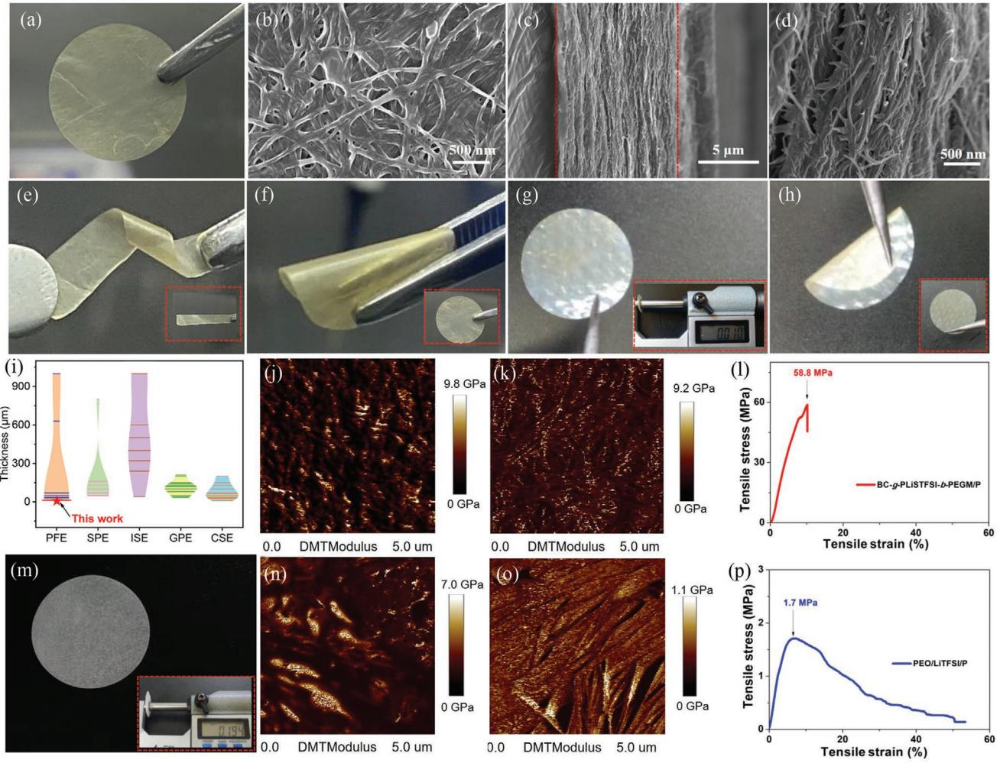
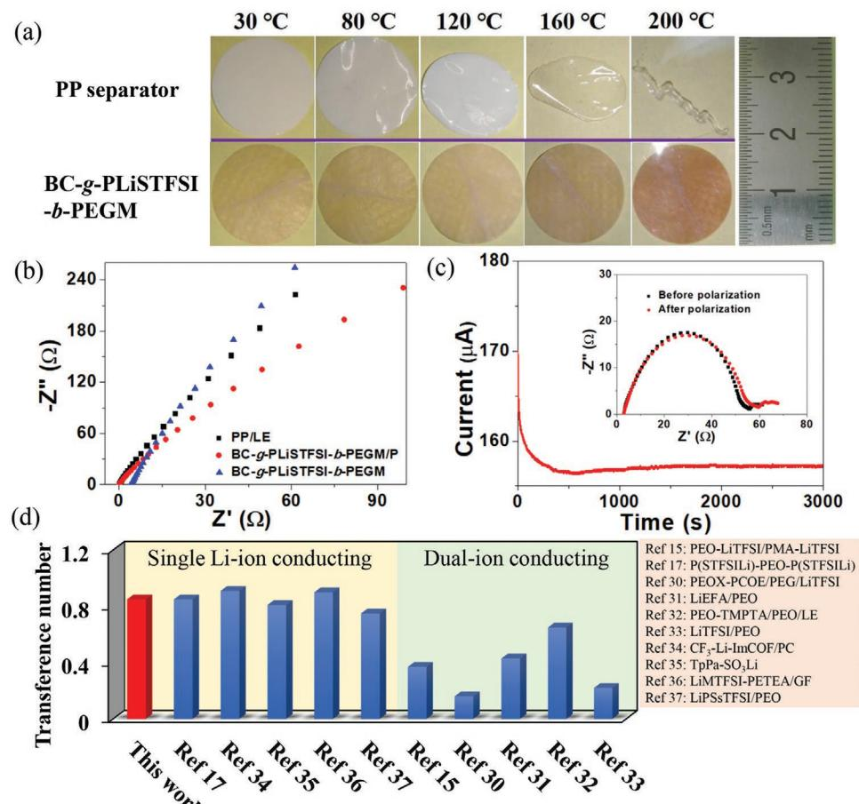
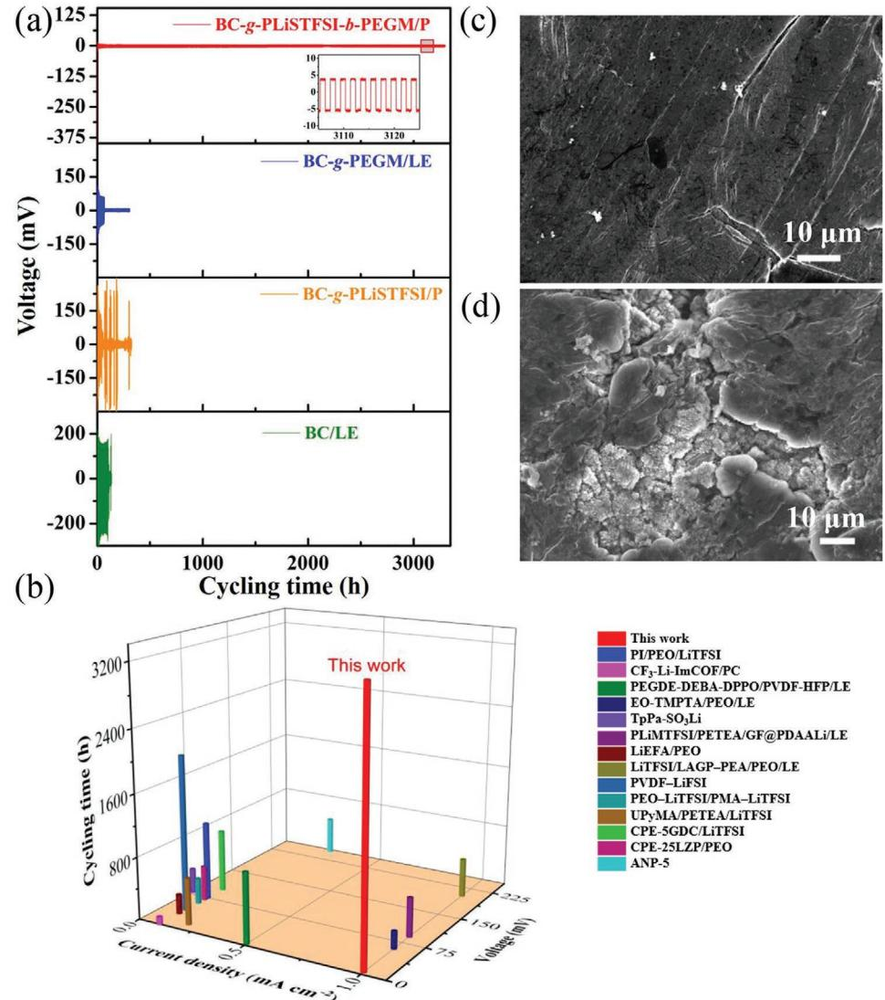
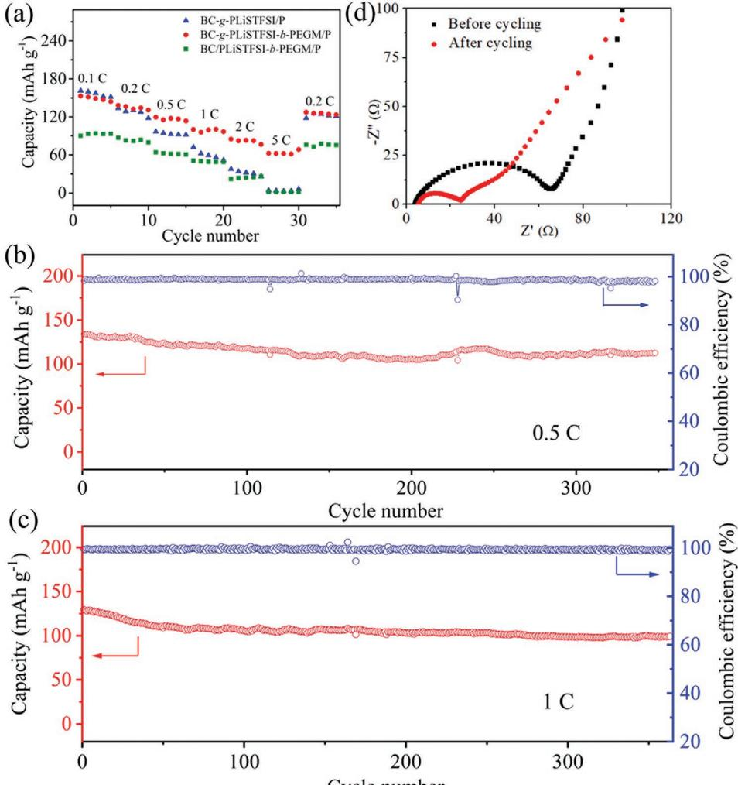

# **Ultrathin Yet Robust Single Lithium-Ion Conducting Quasi-Solid-State Polymer-Brush Electrolytes Enable Ultralong-Life and Dendrite-Free Lithium-Metal Batteries**

*Minghong Zhou, Ruliang Liu, Danyang Jia, Yin Cui, Qiantong Liu, Shaohong Liu, and Dingcai Wu\**

**Quasi-solid-state polymer electrolytes are one of the most promising candidates for long-life lithium-metal batteries. However, introduction of plasticizers for high ion conductivity at room temperature inevitably gives rise to poor mechanical strength and requires a very thick electrolyte membrane, which is detrimental to safety and energy density of the batteries. Herein, inspired by tube brushes coupling hardness with softness, a novel superstructured polymer bottlebrush BC-***g***-PLiSTFSI-***b***-PEGM (BC = bacterial cellulose; PLiSTFSI = poly(lithium 4-styrenesulfonyl-(trifluoromethylsulfonyl) imide); PEGM = poly(diethylene glycol monomethyl ether methacrylate)) with a hard nanofibril backbone and soft functional polymer side-chains is reported as an effective strategy to well balance the mechanical strength and ion conductivity of quasi-solid-state polymer electrolytes. The resulting single lithium-ion conducting quasi-solid-state polymer-brush electrolytes (SLIC-QSPBEs) integrate the features of the ultrathin membrane thickness (10 µm), the nanofibril backbone-strengthened porous nanonetwork (Young's modulus = 1.9 GPa), and the high-rate single lithium-ion conducting diblock copolymer brushes. As a result, the ultrathin yet robust SLIC-QSPBEs enable ultralong-term (over 3300 h) reversible and stable lithium plating/stripping in Li/Li symmetrical cell at a current density of 1 mA cm−2 for lithium anode. This work affords a promising strategy to develop advanced electrolytes for solid-state lithium-metal batteries.**

# **1. Introduction**

In the past decades, lithium ion batteries with an achievable energy density of 250 Wh kg−1 , [1] still could not satisfy the demand of rapid expansion of electric vehicles, unmanned planes, smart electrical grids, and unprecedented electric energy consumption in energy era, which impels the development of

Dr. M. Zhou, Dr. R. Liu, D. Jia, Y. Cui, Q. Liu, Dr. S. Liu, Prof. D. Wu Materials Science Institute PCFM Lab School of Chemistry Sun Yat-sen University Guangzhou 510275, P. R. China E-mail: wudc@mail.sysu.edu.cn

The ORCID identification number(s) for the author(s) of this article can be found under https://doi.org/10.1002/adma.202100943.

#### **DOI: 10.1002/adma.202100943**

higher energy density storage devices.[2] Lithium-metal batteries (LMBs) consisting of metallic lithium anode with the highest gravimetric energy density (3860 mAh g−1 ) and the lowest electrochemical potential (−3.04 V vs standard hydrogen electrode) have been regarded as one of the most promising candidates for high-energy-density batteries.[3–5] However, direct use of a Li-metal anode in conventional cell configuration is hindered by safety problems, especially Li dendrite growth and propagation which could penetrate the separator and cause short circuits and even fire.[6,7] Therefore, tremendous methods have been developed to improve the properties of various components of Li-metal batteries, including electrodes,[8] separators,[9] current collectors,[10] solid electrolytes,[11–13] and interface engineering.[14] Among these advances, exploration of stable and safe solid-state electrolyte could be particularly critical and indispensable,[1,2] since solidstate electrolytes could effectively improve the safety issues caused by traditional liquid electrolytes.

Solid polymer electrolytes (SPEs) have been shown to effectively suppress the

lithium dendrite growth for Li-metal anode.[15] However, the low conductivity at room temperature, poor electrode interfacial compatibility, and low lithium-ion transference number (*t*Li+) are persistent obstacles to their practical applications. Although the polymer/lithium salt systems of SPEs, which are usually composed of polymer matrix (e.g., poly(ethylene oxide) (PEO)) and free lithium salt (e.g., lithium bis(trifluoromethylsulphonyl) imide (LiTFSI)), could solve the low conductivity problem,[16] the dual ions in the dense and thick SPEs are mobile during cycling and thus form a strong salt concentration gradient, giving rise to deleterious effects, such as uncontrolled growth of lithium dendrite and limited power delivery (**Figure 1**a). One of the best methods to solve the salt concentration polarization is to increase the *t*Li+ by developing single lithium-ion conducting polymers, in which the anions are covalently immobilized onto the polymeric skeletons. Armand et al. reported single lithiumion BAB triblock copolymers P(STFSILi)-*b*-PEO-*b*-P(STFSILi) with ion conductivity of 1.3 × 10−5 S cm−1 at 60 °C and *t*Li+

**Figure 1.** Schematic illustration of structure and Li stripping/plating behaviors in solid-state Li-metal batteries with QSPEs, including a) conventional dual-ion conducting QSPEs (e.g., PEO/LiTFSI/P), b) conventional single lithium-ion conducting QSPEs (e.g., PLiSTFSI-*b*-PEGM/P), and c) our single lithium-ion conducting quasi-solid-state polymer-brush electrolyte (i.e., BC-*g*-PLiSTFSI-*b*-PEGM/P), which is prepared by grafting single lithium-ion conducting PLiSTFSI-*b*-PEGM brushes from nanofibrils of BC membrane, followed by adding plasticizer. Compared to dense and thick conventional dual-ion or single lithium-ion conducting QSPEs, our BC-*g*-PLiSTFSI-*b*-PEGM/P has a valuable synergistic effect of the ultrathin membrane thickness and the porous nanonetwork with robust BC backbones and high-rate single lithium-ion conducting polymer brushes, and thus could shorten ion transport distance, accelerate ion migration and ensure uniform Li+ flux, leading to homogeneous dendrite-free Li deposition during long-term cycling.

larger than 0.85.[17] However, the conductivity at room temperature is still very low, which could not meet the requirements of the operation level of LMBs. Introduction of plasticizers can improve the ion conductivity of SPEs at room temperature, but the resulting single lithium-ion quasi-solid-state polymer electrolytes (QSPEs) would have the sharply deceased mechanical properties. Therefore, the membrane thickness of single lithium-ion QSPEs would be inevitably increased to keep certain mechanical strength, which would prolong transport distance of lithium ion, and cause uncontrolled growth of lithium dendrite at big current densities (Figure 1b).

Essentially, in order to achieve ultimately high ion conductivity and mechanical stability, the micromorphology and structure of SPEs should be considered as a critical factor. Most SPEs are usually based on linear polymeric skeletons and would encounter two bottleneck problems. On one hand, pure linear polymers easily form a dense membrane, leading to poor ion transport. On the other hand, to ensure enough mechanical property, the thickness of SPEs membrane is often greater than 50 µm,[18] which causes an increase in the overall volume/mass of batteries, giving rise to lower energy densities. What is worse, introduction of plasticizers for high ion conductivity further decreases the mechanical property of QSPEs, which conversely requires greatly increased membrane thickness. Although crosslinking and adding fillers are common strategies to enhance the mechanical property of QSPEs to a certain extent,[12,13,19,20] most QSPEs still have ≈100–1000 µm in thickness and thus will further deteriorate the volume energy density of LMBs, which has been one of the key roadblocks for the ultimate replacement of internal combustion vehicles by electric vehicles.[19] Therefore, how to balance the plasticizer-related ion conductivity and thicknessdependent mechanical property of QSPEs is still a great challenge in LMBs. Furthermore, it is highly desirable to develop synthesis approaches of QSPEs with advanced nanotopology structure to improve the long cycling life and desirable safety of LMBs.

Herein, we propose the design of ultrathin (10 µm) single lithium-ion conducting quasi-solid-state polymer-brush electrolytes (SLIC-QSPBEs) with high conductivity and excellent mechanical properties in the presence of plasticizers by means of polymer brush topology engineering (Figure 1c). Our strategy is inspired by tube brush coupling hardness with softness, a clean tool composed of a rigid steel wire backbone and many soft polymer side-fibers for cleaning up glassware with various shapes. Similarly, our superstructured polymer brush simultaneously has a hard nanofibril backbone and soft functional polymer side-chains to well balance the mechanical strength and ion conductivity of QSPEs. As a conceptual demonstration, our polymer "bottlebrush" (BC-*g*-PLiSTFSI-*b*-PEGM) is synthesized by grafting diblock copolymers of poly(lithium 4-styrenesulfonyl-(trifluoromethylsulfonyl) imide) (PLiSTFSI) and poly(diethylene glycol monomethyl ether methacrylate) (PEGM) from bacterial cellulose (BC) nanofibrils of BC membrane via surface-initiated atom transfer radical polymerization (SI-ATRP). Then SLIC-QSPBEs (i.e., BC-*g*-PLiSTFSI-*b*-PEGM/P) with both good Li+ conduction and robust mechanical properties are obtained by adding 25 wt% plasticizer to BC*g*-PLiSTFSI-*b*-PEGM membrane. For the as-prepared SLIC-QSPBEs, BC nanofibril backbones provide a robust mechanical property and form a highly porous 3D nanonetwork structure, PLiSTFSI blocks with abundant movable lithium ions guarantee a single lithium-ion conduction behavior, PEGM blocks provide lithium ion transport matrix. Moreover, even in the presence of plasticizers, our SLIC-QSPBEs can be as thin as about 10 µm under the prerequisite of guaranteeing the mechanical property, because of the hybrid of hard cores (BC nanofibril backbones) and soft shells (PLiSTFSI-*b*-PEGM brushes) for BC-*g*-PLiSTFSI*b*-PEGM. Such ultrathin porous electrolytes can shorten ion transport distance and accelerate ion migration. Benefiting from the above unique nanotopology structure and synergistic effect of multifunctional components, our SLIC-QSPBEs can eliminate concentration polarization, boost ion conduction, enhance mechanical property, and decrease interface impedance. As a result, the as-constructed lithium-metal symmetric batteries exhibit ultralong cycling stability, indicating that the regulation of macromolecule nanostructure can significantly improve the electrochemical performance of QSPEs.

## **2. Results and Discussion**

BC membrane is composed of BC nanofibrils and demonstrates a crystalline structure (Figure S1, Supporting Information), providing robust mechanical properties.[21–23] BC nanofibrils have a diameter of around 50 nm and are interconnected with each other to form a 3D porous nanonetwork structure (Figure S2a, Supporting Information). The surfaces of BC nanofibrils have abundant OH groups (Figure S3, Supporting Information), which can be reacted with 2-bromoisobutyryl bromide to yield initiator-modified BC (BC-Br) membrane (Figure S2b, Supporting Information). Subsequently, the first block PLiSTFSI and the second block PEGM are sequentially

grafted from BC nanofibers of the membrane via SI-ATRP, yielding the target product BC-*g*-PLiSTFSI-*b*-PEGM (**Figure 2**a). To estimate molecular weight of polymers grafted from BC nanofibers, free initiators are added to their reaction systems to produce free polymers PLiSTFSI and PLiSTFSI-*b*-PEGM. As shown in gel permeation chromatography traces of Figure S4 (Supporting Information), both PLiSTFSI and PLiSTFSI-*b*-PEGM have a narrow, unimodal peak with molecular weight *M*n = 20.9 kg mol−1 and *M*w/*M*n = 1.25, and *M*n = 25.2 kg mol−1 and *M*w/*M*n = 1.32, respectively, indicating efficient SI-ATRP procedures. The scanning electron microscope (SEM) image in Figure 2b shows that the characteristic nanofiber-based 3D porous nanonetwork of BC membrane is well retained in BC-*g*-PLiSTFSI-*b*-PEGM because of the uniform surface grafting with SI-ATRP. Fourier transform infrared results confirm that PLiSTFSI-*b*-PEGM diblock copolymers are successfully grafted from BC nanofibers (Figure S3, Supporting Information). After grafting the first block PLiSTFSI from BC nanofibrils to yield BC-*g*-PLiSTFSI, the new characteristic peaks at 1638, 1324, and 1193 cm−1 appear, which are ascribed to CC stretching, SO stretching, and SN stretching, respectively.[24] Significantly increased peak intensity of CO bonds at 1726 cm−1 demonstrates that the second block PEGM is successfully grafted from BC-*g*-PLiSTFSI. Compared to BC membrane, BC-*g*-PLiSTFSI-*b*-PEGM membrane does not have new well-resolved peaks in small- and wide-angle X-ray diffraction patterns (Figure S1, Supporting Information), indicating no distinct microphase separation for the grafted PLiSTFSI-*b*-PEGM diblock copolymer brushes. SEM elemental mapping of S element of BC-*g*-PLiSTFSI-*b*-PEGM in Figure S5 (Supporting Information) reveals that the diblock copolymer brushes are uniformly distributed throughout the membrane, which would help to regulate the homogeneous transport of lithium ions. SEM images in Figure S6a,b (Supporting Information) show that BC-*g*-PLiSTFSI and BC-*g*-PEGM synthesized as control samples present the similar porous nanonetwork morphology to BC-*g*-PLiSTFSI-*b*-PEGM.

The cross-section SEM image of BC-*g*-PLiSTFSI-*b*-PEGM membrane shows that the membrane thickness is as thin as about 10 µm (Figure 2c), and the porous nanonetwork intersects throughout the whole membrane (Figure 2d), which is conducive to the storage of plasticizer and reducing the resistance of lithium ion conduction. The ultrathin BC-*g*-PLiSTFSI-*b*-PEGM membrane not only exhibits proper flexibility but also has good mechanical strength and modulus. Its morphology remains intact after repeatedly twisting or bending for 50 times (Figure 2e,f). After adding plasticizer, the resulting BC-*g*-PLiSTFSI-*b*-PEGM/P presents almost the same membrane morphology and thickness as BC-*g*-PLiSTFSI-*b*-PEGM (Figure 2g; and Figure S7a, Supporting Information). BC-*g*-PLiSTFSI-*b*-PEGM/P still keeps intact morphology after repeatedly bending for 50 times (Figure 2h). More importantly, according to the mapping of Young's modulus based on atomic force microscopy (AFM), despite containing the plasticizer, the Young's modulus of BC-*g*-PLiSTFSI-*b*-PEGM/P is still as high as 1.9 GPa (Figure 2k), which is only slightly lower than that of BC-*g*-PLiSTFSI-*b*-PEGM (2.2 GPa, Figure 2j). For comparison, PEO/LiTFSI membrane (Figure 2m) and its plasticizercontaining product PEO/LiTFSI/P (Figure S7b, Supporting

**Figure 2.** a) Digital photo, b) SEM image, and c,d) cross-section SEM images of BC-*g*-PLiSTFSI-*b*-PEGM. e,f) Digital photos of twisting (inset:digital photo after twisting 50 times) (e) and bending (inset:digital photo after bending for 50 times) (f) for BC-*g*-PLiSTFSI-*b*-PEGM. g,h) Digital photos of BC-*g*-PLiSTFSI-*b*-PEGM/P (inset: digital photo of thickness measurement) (g) and its bending (inset: digital photo after bending for 50 times) (h). i) Thickness comparison between BC-*g*-PLiSTFSI-*b*-PEGM/P and the reported solid-state electrolytes (SSEs), including porous framework electrolyte (PFE), solid polymer electrolyte (SPE), inorganic solid electrolyte (ISE), gel polymer electrolyte (GPE), and composite solid electrolyte (CSE). j,k) AFM Young's modulus mappings of BC-*g*-PLiSTFSI-*b*-PEGM (j) and BC-*g*-PLiSTFSI-*b*-PEGM/P (k). l) Stress–strain curve of BC-*g*-PLiSTFSI-*b*-PEGM/P. m) Digital photo of PEO/LiTFSI (inset: digital photo of thickness measurement). n,o) AFM Young's modulus mappings of PEO/LiTFSI (n) and PEO/ LiTFSI/P (o). p) Stress–strain curve of PEO/LiTFSI/P.

Information), a typical quasi-solid-state polymer electrolyte, are prepared as control samples. PEO/LiTFSI membrane is very thick (about 194 µm), but its Young's modulus is only 1.1 GPa by AFM test (Figure 2n), which is lower than that of our ultrathin BC-*g*-PLiSTFSI-*b*-PEGM. As highlighted here, due to introduction of plasticizer, PEO/LiTFSI/P has a significantly decreased Young's modulus of 0.3 GPa (Figure 2o), indicating a very serious plasticizer-induced softening phenomenon. Stress–strain tests also confirm that our ultrathin BC-*g*-PLiSTFSI-*b*-PEGM/P has very excellent mechanical properties as compared to the thick PEO/LiTFSI/P. For example, tensile strength and Young's modulus of BC-*g*-PLiSTFSI-*b*-PEGM/P are up to 58.8 and 739.6 MPa (Figure 2l), respectively, while tensile strength and Young's modulus of PEO/LiTFSI/P are as low as 1.7 and 29.3 MPa (Figure 2p), respectively. Furthermore, it is worth mentioning that to the best of our knowledge, our robust BC-*g*-PLiSTFSI-*b*-PEGM/P (10 µm) is the thinnest among all reported solid-state electrolytes with porous lithium-ion conducting frameworks (i.e., porous framework electrolytes), and almost the thinnest as compared to other solid-state electrolytes including SPE, inorganic solid electrolyte (ISE), gel polymer electrolyte (GPE), and composite solid electrolyte (CSE; except for a recently reported 8.6 µm CSE[25] ) (Figure 2i; and Table S1, Supporting Information). Such an ultrathin QSPE membrane not only greatly shortens the transport distance of the lithium ions but also improves the volume energy density of the battery.[26,27]

Thermogravimetric analysis of the BC-*g*-PLiSTFSI-*b*-PEGM and control samples is investigated to reveal their thermal stability, a critical character for solid-state electrolytes. As shown in Figure S8 (Supporting Information), the thermal stability temperature of BC-*g*-PLiSTFSI-*b*-PEGM is up to ≈310 °C, much **www.advancedsciencenews.com www.advmat.de**

**Figure 3.** a) Thermal shrinkage of BC-*g*-PLiSTFSI-*b*-PEGM and PP separator after heating at different temperatures for 1 h. b) Nyquist plots of symmetric cells with PP/LE, BC-*g*-PLiSTFSI-*b*-PEGM and BC-*g*-PLiSTFSI-*b*-PEGM/P using two pieces of stainless steel as blocking electrodes. c) Current–time profile for Li|BC-*g*-PLiSTFSI-*b*-PEGM/P|Li cell at 10 mV of polarization (inset: Nyquist plots before and after polarization). d) Comparison of BC-*g*-PLiSTFSI-*b*-PEGM/P with the reported SSEs in terms of Li+ transference number.

higher than that of BC (200 °C), revealing that the thermal stability is largely improved after grafting the functional polymer brushes. Furthermore, the thermal shrinkage comparison between BC-*g*-PLiSTFSI-*b*-PEGM membrane and commercial polypropylene (PP) battery separator is also carried out. Samples are placed in the oven at different temperatures for 1 h and the change of dimension and shape is recorded by digital photography. As shown in **Figure 3**a, BC-*g*-PLiSTFSI-*b*-PEGM membrane shows no obvious dimensional shrinkage throughout the testing process (≈30–200 °C), while PP separator begins to incur remarkably dimensional shrinkage at 120 °C and finally complete shrinkage at 200 °C. These results indicate that BC*g*-PLiSTFSI-*b*-PEGM shows superior thermal stability, implying a promising contribution to enhance the thermal safety of lithium-metal batteries when used as the solid-state electrolytes.

Ion conductivity of BC-*g*-PLiSTFSI-*b*-PEGM is measured via electrochemical impedance spectroscopy, and the result is presented in Figure 3b and Table S2 (Supporting Information). The conductivity of BC-*g*-PLiSTFSI-*b*-PEGM is calculated to be 4.9 × 10−6 S cm−1 at room temperature, which is higher than that of BC-*g*-PLiSTFSI (6.4 × 10−7 S cm−1 ). To solve the inherently low ion conductivity, the plasticizer (dimethyl ether/ dioxolane) is dropped uniformly into BC-*g*-PLiSTFSI-*b*-PEGM (diameter 1.8 cm, thickness 10 µm) to facilitate lithium ion solvation and transport. As a result, the ion conductivity greatly increases to 3.1 × 10−4 S cm−1 for the obtained BC-*g*-PLiSTFSI*b*-PEGM/P, which is comparable to those reported solvent-containing polymer electrolytes (e.g., 4.0 × 10−4 S cm−1 for porous aromatic framework electrolyte[28] and 3.1 × 10−5 S cm−1 for ionic covalent organic framework electrolyte[29] ). The result indicates that the ultrathin membrane thickness and the porous nanonetwork with robust BC backbones could effectively shorten ion transport distance, accelerate ion migration and keep excellent mechanical properties at the presence of plasticizer. On the other hand, our BC-*g*-PLiSTFSI-*b*-PEGM/P not only provides high ion conductivity without introducing extra lithium salt, but also eliminates the concentration polarization because of the uniform distribution of the single lithium-ion conducting polymer brushes on BC backbones. To investigate the singleion conductivity feature of BC-*g*-PLiSTFSI-*b*-PEGM/P, lithium-ion transference number (*t*Li+) is measured at room temperature via electrochemical impedance spectroscopy along with a potential polarization (10 mV). Figure 3c shows the alternating current impedance spectra and the chronoamperometry polarization profile of a symmetric Li|BC-*g*-PLiSTFSI*b*-PEGM/P|Li cell. The *t*Li+ of BC-*g*-PLiSTFSI-*b*-PEGM/P is up

to 0.85, which is higher than that of BC-*g*-PLiSTFSI-*b*-PEGM (0.44, Figure S9, Supporting Information). The *t*Li+ of BC-*g*-PLiSTFSI-*b*-PEGM/P is also significantly higher than those of reported dual-ion conducting electrolytes[15,30–33] (e.g., LiEFA/ PEO for 0.43[31] and LiTFSI/PEO for 0.22[33] at room temperature, PEO–LiTFSI/PMA–LiTFSI for 0.37[15] at 65 °C, Figure 3d), and comparable to those of most state-of-the-art single lithium-ion conducting electrolytes[17,34–37] (e.g., CF3–Li–ImCOF/ PC for 0.81[35] and LiMTFSI–PETEA/GF for 0.75[37] at room temperature, P(STFSILi)–PEO–P(STFSILi) for 0.85[17] at 60 °C, Figure 3d). The high *t*Li+ of BC-*g*-PLiSTFSI-*b*-PEGM/P could be ascribed to a valuable synergistic effect of single lithiumion conducting block polymer brushes (PLiSTFSI-*b*-PEGM), BC backbones, and plasticizers. First, STFSI anions, which are covalently anchored in PLiSTFSI blocks grafted from rigid BC nanofibrils, have limited movability, while Li ions can move freely. Second, abundant ether coordination sites from PEGM blocks facilitate the dissociation of Li ions, and flexible chain characteristic of PEGM blocks is favorable to the transport of Li ions. Last but not the least, the introduction of plasticizer could further boost the dissociation and motion of Li ions. Therefore, compared with other reported solid-state electrolytes based on polymers, BC-*g*-PLiSTFSI-*b*-PEGM/P with the unique hybrid bottlebrush superstructure exhibits an advantage for simultaneously achieving high lithium-ion conductivity and lithium-ion transference number.

The voltage polarization and interfacial performance are examined by long-term lithium stripping–plating experiments in a symmetric Li|Li cell. **Figure 4**a shows the voltage responses of BC-*g*-PLiSTFSI-*b*-PEGM/P at room temperature

**Figure 4.** a) Voltage profiles of symmetric Li|Li cells with BC-*g*-PLiSTFSI-*b*-PEGM and control samples, including BC/LE, BC-*g*-PLiSTFSI and BC-*b*-PEGM, with a cycling capacity of 1 mAh cm−2 at a current density of 1 mA cm−2. b) Comparison of cycle life of symmetric Li|Li cells with BC-*g*-PLiSTFSI-*b*-PEGM/P and the reported SSEs. c,d) SEM images of Li-metal anodes assembled with BC-*g*-PLiSTFSI-*b*-PEGM/P (c) and BC-*b*-PEGM/LE (d) afterlithium plating/stripping with a cycling capacity of 0.5 mAh cm−2 at 1 mA cm−2 for 400 h.

under a current density of 1 mA cm−2 with a cycling capacity of 1 mAh cm−2 . The symmetric lithium cell of BC-*g*-PLiSTFSI*b*-PEGM/P exhibits a superior electrochemical performance, judging from a much smaller overpotential of 5 mV and excellent long-term cyclic stability for over 3300 h (over 4.5 months), which reveals a stable interface during the stripping–plating process. Furthermore, the electrochemical impedance spectroscopy (EIS) results before and after 100 cycles at a current density of 1 mA cm−2 in Figure S10 (Supporting Information) show that the interfacial impedance is obviously decreased after cycling, indicating good interfacial compatibility between BC-*g*-PLiSTFSI-*b*-PEGM/P and lithium metal during cycling. In sharp contrast, BC and BC-*b*-PEGM membranes absorbing liquid electrolyte (BC/LE and BC-*b*-PEGM/LE) show a high overpotential (≈73–150 mV) and a short circuit after 150 and 80 h, respectively. If only PLiSTFSI is grafted from the BC membrane, the resulting BC-*g*-PLiSTFSI/P still shows an unstable and irreversible response during the first 100 h, which means that introduction of the second block PEGM is important for BC-*g*-PLiSTFSI-*b*-PEGM/P to reduce the interface resistance. In addition, a composite electrolyte of BC membrane, PLiSTFSI*b*-PEGM and plasticizer (BC/PLiSTFSI-*b*-PEGM/P) is also prepared as control sample and measured under the same conditions. The surface and cross-section SEM images of BC/ PLiSTFSI-*b*-PEGM membrane clearly show that most original pores of BC membrane are filled by PLiSTFSI-*b*-PEGM, leading to serious blockage of porous nanonetwork (Figures S11 and S12, Supporting Information). Thus, the overpotential of Li|BC/ PLiSTFSI-*b*-PEGM/P|Li cell is very large (average 700 mV) and unstable during the first 55 h (Figure S13, Supporting Information). To the best of our knowledge, such an ultralong stability with such a low polarization voltage for BC-*g*-PLiSTFSI*b*-PEGM/P could be the best compared to previously reported solid-state electrolytes for symmetric Li|Li cells under similar test conditions (Figure 4b; and Table S3, Supporting Information). Furthermore, as the areal capacity increases to 3 mAh cm−2 (Figure S14, Supporting Information), Li|BC-*g*-PLiSTFSI*b*-PEGM/P|Li cell still shows excellent long-term cyclic stability (over 1200 h). The excellent electrochemical performance of BC-*g*-PLiSTFSI-*b*-PEGM/P could be attributed to the unique 3D porous nanonetwork with hierarchical brush structure and multifunctional components, which synergistically regulate the Li-ion transmission path and greatly reduce the concentration polarization at the presence of plasticizer.

To visually investigate the suppression effect of BC-*g*-PLiSTFSI-*b*-PEGM/P against dendrite growth, the surface morphological characterization of Li anode derived from the cycled (400 h) Li-metal cells is conducted by SEM. As shown in Figure 4c, Li anode from Li|BC-*g*-PLiSTFSI-*b*-PEGM/P|Li cell presents a smooth surface with no obvious Li dendrites, while nonuniform Li deposition and massive Li dendrites are clearly observed on the surface of Li anode from Li|BC-*g*-PEGM/LE|Li cell (Figure 4d). The morphological comparison reveals that BC*g*-PLiSTFSI-*b*-PEGM can effectively inhibit Li dendrite growth in LMBs. Furthermore, the cycling efficiency of Li anode for Li|Cu cell with BC-*g*-PLiSTFSI-*b*-PEGM/P is also investigated. As shown in Figure S15 (Supporting Information), the cell exhibits the stability with an average coulombic efficiency of 97.7% for 90 cycles at a current density of 1 mA cm−2 and a total Li plating amount of 1 mAh cm−2. The coulombic efficiency result confirms that BC-*g*-PLiSTFSI-*b*-PEGM can effectively suppress the formation of Li dendrite.

Given the excellent suppression ability of Li dendrites, the solid-state LiFePO4|Li batteries are assembled using BC-*g*-PLiSTFSI-*b*-PEGM/P as a quasi-solid-state polymer electrolyte. The rate performance of LiFePO4|BC-*g*-PLiSTFSI-*b*-PEGM/P|Li cell at 0.1–5 C is shown in **Figure 5**a. LiFePO4|BC-*g*-PLiSTFSI*b*-PEGM/P|Li cell delivers reversible specific capacities of 149, 134, 116, 99, 83, and 61 mAh g−1 at 0.1, 0.2, 0.5, 1, 2, and 5 C, respectively. Moreover, when the current density is switched back to 0.2 C, the capacity retention is 84% of the starting value, indicating that this Li-ion battery system based on BC-*g*-PLiSTFSI-*b*-PEGM/P is highly stable. The rate performance is much better than that of most of reported Li-ion batteries using single lithium-ion conducting solid polymer electrolytes (e.g., 97.9–85.4, 72.7–60, 52.7–45, and 36.9 mAh g−1 at 0.2, 0.5, 1, and 2 C),[24,38–40] which benefits from the porous superstructure of single lithium-ion conducting polymer brushes grafted from BC nanofibrils. In comparison, the rate performance of the cell with BC/PLiSTFSI-*b*-PEGM/P or BC-*g*-PLiSTFSI/P is much poorer, especially at high current density. For example, when the current density increases to 5 C, the cell with BC/PLiSTFSIb-PEGM/P or BC-g-PLiSTFSI/P sharply drops to 2 or 4 mAh g−1 , respectively. On the other hand, the long cycling performances at different current densities for LiFePO4|BC-*g*-PLiSTFSI-*b*-PEGM/P|Li cell are tested. LiFePO4|BC-*g*-PLiSTFSI-*b*-PEGM/ P|Li cell maintains a reversible capacity of 111 mAh g−1 after 300 cycles at 0.5 C, along with an average coulombic efficiency higher than 99% during 300 cycles (Figure 5b). With increasing the current density to 1 C, LiFePO4|BC-*g*-PLiSTFSI-*b*-PEGM/ P|Li cell still keeps a good cycling performance (99 mAh g−1 after 300 cycles) (Figure 5c). In order to further understand its excellent cycling stability, the corresponding EIS during cycling is investigated. The EIS result before and after 300 cycles at 1 C is shown in Figure 5d. The interfacial resistance obviously diminishes with prolonging the cycling number, indicating that the interface between electrode and BC-*g*-PLiSTFSI-*b*-PEGM/P keeps tight contact and relative stability after 300 cycles.

# **3. Conclusion**

We have reported for the first time a new class of ultrathin, flexible, and thermally stable single lithium-ion conducting polymer bottlebrush BC-*g*-PLiSTFSI-*b*-PEGM via grafting multifunctional diblock copolymers from nanofibrils of BC membrane. Benefiting from the hierarchically-structured and multifunctional porous nanonetwork based on the unique brush topology, the resulting ultrathin yet robust BC*g*-PLiSTFSI-*b*-PEGM/P shows outstanding electrochemical performances as a QSPE of LMBs, including good ion conductivity at room temperature, high selectivity for lithium ion conduction, robust mechanical property, and exceptional cycling stability toward Li anode. These unique features endow BC-*g*-PLiSTFSI-*b*-PEGM/P with ultrastable and ultralong-term reversible Li plating/stripping with a very small overpotential.

**Figure 5.** a) Rate performance of solid-state LiFePO4|Li batteries with BC/PLiSTFSI-*b*-PEGM/P, BC-*g*-PLiSTFSI/P and BC-*g*-PLiSTFSI-*b*-PEGM/P. b,c) Cycling performances of LiFePO4|BC-*g*-PLiSTFSI-*b*-PEGM/P|Li cells at 0.5 C (b) and 1 C (c). d) Nyquist plots of LiFePO4|BC-*g*-PLiSTFSI-*b*-PEGM/ P|Li cells before and after 300 cycles at 1 C.

Therefore, our BC-*g*-PLiSTFSI-*b*-PEGM/P could be promising for promoting development of safe and high-energy-density LMBs in the future. We hope our work would provide an effective attempt to prepare superstructured solid polymer electrolytes via the controllable molecular engineering technology, and could open new avenues for designing other high-performance solid electrolyte materials with special ion-selective channels for high-energy-density batteries.

#### **4. Experimental Section**

The Experimental Section is available in the Supporting Information.

# **Supporting Information**

Supporting Information is available from the Wiley Online Library or from the author.

# **Acknowledgements**

M.Z. and R.L. contributed equally to this work. The authors acknowledge financial support from the project of the National Natural Science Foundation of China (Nos. 51925308, U1601206, 51703252, and 51872336), Fundamental Research Funds for the Central Universities (No. 17lgpy82), Technical and Innovation Talents of Guangdong Special Support Program (No. 2017TX04C248), Science and Technology Program of Guangzhou (No. 202002020041). The authors thank the SPM group in surface and structure analysis platform of Instrumental Analysis & Research Center, Sun Yat-sen University.

### **Conflict of Interest**

The authors declare no conflict of interest.

#### **Data Availability Statement**

Research data are not shared

**www.advancedsciencenews.com www.advmat.de**

#### **Keywords**

ion conductivity, lithium-metal batteries, mechanical strength, polymer brushes, quasi-solid-state polymer electrolytes

> Received: February 3, 2021 Revised: April 4, 2021

Published online: June 2, 2021

- [1] S. Xia, X. Wu, Z. Zhang, Y. Cui, W. Liu, *Chem* **2019**, *5*, 753.
- [2] F.-Q. Liu, W.-P. Wang, Y.-X. Yin, S.-F. Zhang, J.-L. Shi, L. Wang, X.-D. Zhang, Y. Zheng, J.-J. Zhou, L. Li, Y.-G. Guo, *Sci. Adv.* **2018**, *4*, eaat5383.
- [3] M. Armand, J. M. Tarascon, *Nature* **2008**, *451*, 652.
- [4] B. Kang, G. Ceder, *Nature* **2009**, *458*, 190.
- [5] J. W. Choi, D. Aurbach, *Nat. Rev. Mater.* **2016**, *1*, 16013.
- [6] K. J. Harry, D. T. Hallinan, D. Y. Parkinson, A. A. MacDowell, N. P. Balsara, *Nat. Mater.* **2014**, *13*, 69.
- [7] D. Lin, Y. Liu, Y. Cui, *Nat. Nanotechnol.* **2017**, *12*, 194.
- [8] X.-B. Cheng, T.-Z. Hou, R. Zhang, H.-J. Peng, C.-Z. Zhao, J.-Q. Huang, Q. Zhang, *Adv. Mater.* **2016**, *28*, 2888.
- [9] K. Liu, D. Zhuo, H.-W. Lee, W. Liu, D. Lin, Y. Lu, Y. Cui, *Adv. Mater.* **2017**, *29*, 1603987.
- [10] Z. Chen, P.-C. Hsu, J. Lopez, Y. Li, J. W. F. To, N. Liu, C. Wang, S. C. Andrews, J. Liu, Y. Cui, Z. Bao, *Nat. Energy* **2016**, *1*, 15009.
- [11] Y. Lu, Z. Tu, L. A. Archer, *Nat. Mater.* **2014**, *13*, 961.
- [12] F. Ye, X. Zhang, K. Liao, Q. Lu, X. Zou, R. Ran, W. Zhou, Y. Zhong, Z. Shao, *J. Mater. Chem. A* **2020**, *8*, 9733.
- [13] X. Zou, Q. Lu, Y. Zhong, K. Liao, W. Zhou, Z. Shao, *Small* **2018**, *14*, 1801798.
- [14] M. Du, K. Liao, Q. Lu, Z. Shao, *Energy Environ. Sci.* **2019**, *12*, 1780.
- [15] W. Zhou, Z. Wang, Y. Pu, Y. Li, S. Xin, X. Li, J. Chen, J. B. Goodenough, *Adv. Mater.* **2019**, *31*, 1805574.
- [16] X. Ji, M. Cao, X. Fu, R. Liang, A. N. Le, Q. Zhang, M. Zhong, *Giant* **2020**, *3*, 100027.
- [17] R. Bouchet, S. Maria, R. Meziane, A. Aboulaich, L. Lienafa, J.-P. Bonnet, T. N. T. Phan, D. Bertin, D. Gigmes, D. Devaux, R. Denoyel, M. Armand, *Nat. Mater.* **2013**, *12*, 452.
- [18] S. Randau, D. A. Weber, O. Kötz, R. Koerver, P. Braun, A. Weber, E. Ivers-Tiffée, T. Adermann, J. Kulisch, W. G. Zeier, F. H. Richter, J. Janek, *Nat. Energy* **2020**, *5*, 259.
- [19] Y. Gao, Z. Yan, J. L. Gray, X. He, D. Wang, T. Chen, Q. Huang, Y. C. Li, H. Wang, S. H. Kim, T. E. Mallouk, D. Wang, *Nat. Mater.* **2019**, *18*, 384.
- [20] F. Ye, K. Liao, R. Ran, Z. Shao, *Energy Fuels* **2020**, *34*, 9189.
- [21] D. Xu, B. Wang, Q. Wang, S. Gu, W. Li, J. Jin, C. Chen, Z. Wen, *ACS Appl. Mater. Interfaces* **2018**, *10*, 17809.
- [22] H. Gwon, K. Park, S.-C. Chung, R.-H. Kim, J. K. Kang, S. M. Ji, N.-J. Kim, S. Lee, J.-H. Ku, E. C. Do, S. Park, M. Kim, W. Y. Shim, H. S. Rhee, J.-Y. Kim, J. Kim, T. Y. Kim, Y. Yamaguchi, R. Iwamuro, S. Saito, G. Kim, I.-S. Jung, H. Park, C. Lee, S. Lee, W. S. Jeon, W. D. Jang, H. U. Kim, S. Y. Lee, D. Im, S.-G. Doo, S. Y. Lee, H. C. Lee, J. H. Park, *Proc. Natl. Acad. Sci. USA* **2019**, *116*, 19288.
- [23] C. Ding, X. Fu, H. Li, J. Yang, J.-L. Lan, Y. Yu, W.-H. Zhong, X. Yang, *Adv. Funct. Mater.* **2019**, *29*, 1904547.
- [24] C. Cao, Y. Li, Y. Feng, P. Long, H. An, C. Qin, J. Han, S. Li, W. Feng, *J. Mater. Chem. A* **2017**, *5*, 22519.
- [25] J. Wan, J. Xie, X. Kong, Z. Liu, K. Liu, F. Shi, A. Pei, H. Chen, W. Chen, J. Chen, X. Zhang, L. Zong, J. Wang, L.-Q. Chen, J. Qin, Y. Cui, *Nat. Nanotechnol.* **2019**, *14*, 705.
- [26] Q. Zhao, S. Stalin, C.-Z. Zhao, L. A. Archer, *Nat. Rev. Mater.* **2020**, *5*, 229.
- [27] L. Porcarelli, A. S. Shaplov, F. Bella, J. R. Nair, D. Mecerreyes, C. Gerbaldi, *ACS Energy Lett.* **2016**, *1*, 678.
- [28] J. Zou, A. Trewin, T. Ben, S. Qiu, *Angew. Chem., Int. Ed.* **2020**, *59*, 769.
- [29] Y. Du, H. Yang, J. M. Whiteley, S. Wan, Y. Jin, S.-H. Lee, W. Zhang, *Angew. Chem., Int. Ed.* **2016**, *55*, 1737.
- [30] R. Khurana, J. L. Schaefer, L. A. Archer, G. W. Coates, *J. Am. Chem. Soc.* **2014**, *136*, 7395.
- [31] H. Zhang, F. Chen, O. Lakuntza, U. Oteo, L. Qiao, M. Martinez-Ibañez, H. Zhu, J. Carrasco, M. Forsyth, M. Armand, *Angew. Chem., Int. Ed.* **2019**, *58*, 12070.
- [32] X.-X. Zeng, Y.-X. Yin, N.-W. Li, W.-C. Du, Y.-G. Guo, L.-J. Wan, *J. Am. Chem. Soc.* **2016**, *138*, 15825.
- [33] H. Zhang, U. Oteo, H. Zhu, X. Judez, M. Martinez-Ibañez, I. Aldalur, E. Sanchez-Diez, C. Li, J. Carrasco, M. Forsyth, M. Armand, *Angew. Chem., Int. Ed.* **2019**, *58*, 7829.
- [34] Q. Ma, H. Zhang, C. Zhou, L. Zheng, P. Cheng, J. Nie, W. Feng, Y.-S. Hu, H. Li, X. Huang, L. Chen, M. Armand, Z. Zhou, *Angew. Chem., Int. Ed.* **2016**, *55*, 2521.
- [35] Y. Hu, N. Dunlap, S. Wan, S. Lu, S. Huang, I. Sellinger, M. Ortiz, Y. Jin, S.-h. Lee, W. Zhang, *J. Am. Chem. Soc.* **2019**, *141*, 7518.
- [36] K. Jeong, S. Park, G. Y. Jung, S. H. Kim, Y.-H. Lee, S. K. Kwak, S.-Y. Lee, *J. Am. Chem. Soc.* **2019**, *141*, 5880.
- [37] D. Zhou, A. Tkacheva, X. Tang, B. Sun, D. Shanmukaraj, P. Li, F. Zhang, M. Armand, G. Wang, *Angew. Chem., Int. Ed.* **2019**, *58*, 6001.
- [38] M. Martinez-Ibañez, E. Sanchez-Diez, L. Qiao, Y. Zhang, X. Judez, A. Santiago, I. Aldalur, J. Carrasco, H. Zhu, M. Forsyth, M. Armand, H. Zhang, *Adv. Funct. Mater.* **2020**, *30*, 2000455.
- [39] C. Li, B. Qin, Y. Zhang, A. Varzi, S. Passerini, J. Wang, J. Dong, D. Zeng, Z. Liu, H. Cheng, *Adv. Energy Mater.* **2019**, *9*, 1803422.
- [40] C. Cao, Y. Li, S. Chen, C. Peng, Z. Li, L. Tang, Y. Feng, W. Feng, *ACS Appl. Mater. Interfaces* **2019**, *11*, 35683.