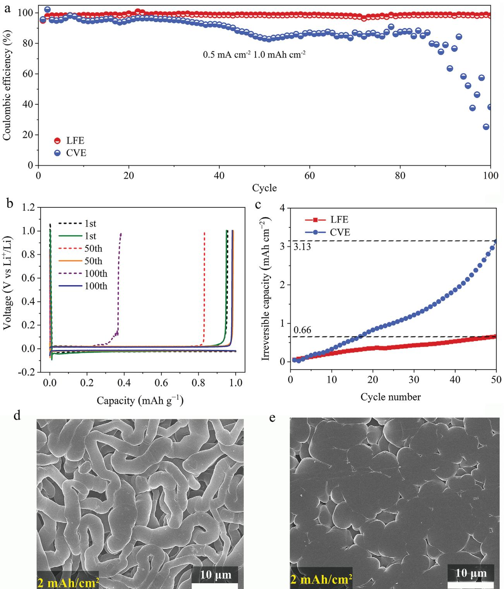
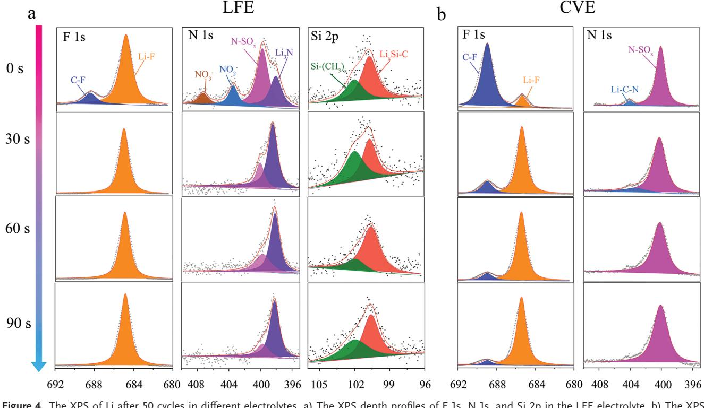
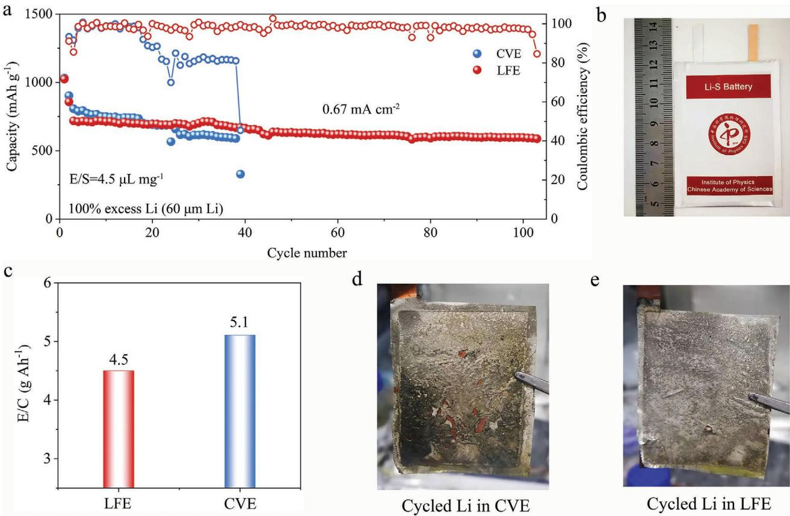
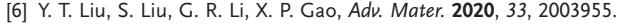

# **Low-Density Fluorinated Silane Solvent Enhancing Deep Cycle Lithium–Sulfur Batteries' Lifetime**

*Tao Liu, Zhe Shi, Huajun Li, Weijiang Xue, Shanshan Liu, Jinming Yue, Minglei Mao, Yong-sheng Hu, Hong Li, Xuejie Huang, Liquan Chen, and Liumin Suo\**

**The lithium metal anode (LMA) instability at deep cycle with high utilization is a crucial barrier for developing lithium (Li) metal batteries, resulting in excessive Li inventory and electrolyte demand. This issue becomes more severe in capacity-type lithium–sulfur (Li–S) batteries. High-concentration or localized high-concentration electrolytes are noted as effective strategies to stabilize Li metal but usually lead to a high electrolyte density (>1.4 g mL−1 ). Here we propose a bifunctional fluorinated silane-based electrolyte with a low density of 1.0 g mL−1 that not only is much lighter than conventional electrolytes (≈1.2 g mL−1 ) but also form a robust solid electrolyte interface to minimize Li depletion. Therefore, the Li loss rate is reduced over 4.5-fold with the proposed electrolyte relative to its conventional counterpart. When paired with onefold excess LMA at the electrolyte weight/cell capacity (E/C) ratio of 4.5 g Ah−1 , the Li–S pouch cell using our electrolyte can survive for 103 cycles, much longer than with the conventional electrolyte (38 cycles). This demonstrates that our electrolyte not only reduces the E/C ratio but also enhances the cyclic stability of Li–S batteries under limited Li amounts.**

#### **1. Introduction**

Conventional lithium-ion batteries (LiBs) based on intercalation chemistry are rapidly approaching their energy density ceilings.[1,2] Lithium–sulfur (Li–S) batteries stand out as one of the most attractive "beyond intercalation" systems because of their high theoretical energy density (2600 Wh kg−1 , 2800 Wh L−1 ) and cost-effectiveness.[3] Although tremendous advancements have been made in both S cathode design and Li anode protection,[4] most of the remarkable progress has been evaluated in coin cells with highly thick Li (>250 µm) and flooded

| Dr. T. Liu, H. Li, Dr. J. Yue, Dr. M. Mao, Prof. Y.-s. Hu, Prof. H. Li, Prof. X. Huang, Prof. L. Chen, Prof. L. Suo Beijing Advanced Innovation Center for Materials Genome Engineering Key Laboratory for Renewable Energy Beijing Key Laboratory for New Energy Materials and Devices Institute of Physics Chinese Academy of Sciences Beijing 100190, China E-mail: suoliumin@iphy.ac.cn Dr. Z. Shi Department of Materials Science and Engineering Massachusetts Institute of Technology Cambridge, MA 02139, USA The ORCID identification number(s) for the author(s) of this article can be found under https://doi.org/10.1002/adma.202102034. | Dr. W. Xue Department of Nuclear Science and Engineering Massachusetts Institute of Technology Cambridge, MA 02139, USA Dr. S. Liu Shandong University of Science and Technology Shandong College of Chemical and Biological Engineering Qingdao 266590, China Prof. L. Suo Center of Materials Science and Optoelectronics Engineering University of Chinese Academy of Sciences Beijing 100049, China Prof. L. Suo Yangtze River Delta Physics Research Center Co. Ltd Liyang 213300, China |
|-------------------------------------------------------------------------------------------------------------------------------------------------------------------------------------------------------------------------------------------------------------------------------------------------------------------------------------------------------------------------------------------------------------------------------------------------------------------------------------------------------------------------------------------------------------------------------------------------------------------------------------------------------------------------------------------------|-----------------------------------------------------------------------------------------------------------------------------------------------------------------------------------------------------------------------------------------------------------------------------------------------------------------------------------------------------------------------------------------------------------------------------------------------------------------------------------------------------------------------------------------|
| DOI: 10.1002/adma.202102034                                                                                                                                                                                                                                                                                                                                                                                                                                                                                                                                                                                                                                                                     |                                                                                                                                                                                                                                                                                                                                                                                                                                                                                                                                         |

electrolytes (E/S > 10 µL mg−1 ), which are far from realistic cell design conditions.[5]

Generally, Li excess exerts a significant influence on the energy density of LiBs, especially the volumetric energy density. According to our evaluation in Figure S1a, Supporting Information, when the Li excess is 100% (N/P ratio = 2), over 7% of the gravimetric energy density (*E*g), and 21% of the volumetric energy density (*E*v) will be lost because of the increased weight and thickness of the Li excess.[6] However, Li excess is always required to compensate for the irreversible Li loss arising from the uncontrollable side reactions between the Li and electrolytes.[7] Compared with LiBs, almost twice as much "deep" Li per cycle is required in Li–S batteries under the same energy output because of its lower voltage (≈2.1 V) and higher "dead weight".[8] Additionally, soluble LiPSs will further deteriorate the SEI structure and aggravate the Li

corrosion.[9] These unfavorable factors mean that more irreversible Li will be lost per cycle for Li–S batteries in comparison with LiBs. To counter this, most previous works on Li–S batteries have used over ten times the amount of Li actually being cycled, leading to a substantial loss in both the *E*g and *E*v. [10] In this regard, controlling Li excess is a critical and pragmatic way to realize a high energy density for Li–S batteries.

Many strategies have been proposed to promote a stable Li/electrolyte interface in Li metal batteries, for example, electrolyte design, an artificial SEI layer, and a 3D Li metal host.[11] Constructing a targeted SEI by electrolyte design is the most

*Adv. Mater.* **2021**, *33*, 2102034

general and practical approach to enhance the reversibility of Li metal.[12] For example, a high-concentration electrolyte (HCE) can form abundant ion pairs and aggregates, thus altering the inner Helmholtz layer structure by forcing anions onto the Li surface and resulting in a dense anion-derived SEI.[13] Adding fluorinated solvents to HCEs has been further developed to form localized high-concentration electrolytes (LHCEs).[14] In addition to maintaining the nature of HCEs, these free-moving fluorinated cosolvents lead to the formation of a highly fluorinated Li/electrolyte interphase.[7a,15] However, most previous studies paid too much attention to the reversibility behavior of Li metal and the electrolyte volume, but neglected the electrolyte density.[16] Although HCEs and localized high-concentration electrolytes (LHCEs) have demonstrated excellent LMA compatibility, highly fluorinated or high-content Li salt usually leads to a high density (>1.4 g mL−1 , Figure S2, Supporting Information).[17] As an essential and inactive component of batteries, the electrolyte weight can reach over 20 wt% in LiBs and over 50 wt% in Li–S full cells (Figure S3, Supporting Information). Consequently, the effect of electrolyte weight on the cell-level *E*g cannot be ignored. As shown in Figure S1b, Supporting Information, the electrolyte density exerts a dramatic influence on the *E*g of Li–S full cells considering the fixed electrolyte filling space. If the electrolyte density increases from 0.9 to 1.5 g mL−1 , more than 25% *E*g (from 670 to 499 Wh kg−1 ) will be lost at the E/S ratio of 3.0 µL mg−1 under otherwise identical conditions. Intuitively, the ideal electrolyte for Li–S batteries should possess excellent Li compatibility and a low density.

Here, we propose a bifunctional fluorinated silane solvent, (trifluoromethyl)trimethylsilane (TFMTMS), to construct a Li-compatible, low-density electrolyte. Benefiting from a bifunctional structure: a powerful electron-withdrawing group, CF3, and a bulky silane moiety, Si (CH3)3, a robust SEI containing abundant LiF and Li*x*Si derivatives formed in the presence of this bifunctional solvent. Paired with only 0.5 m Li salt, this lightly fluorinated electrolyte (LFE) has a low density of 1.02 g mL−1 and a Li loss rate 4.5 times lower than that of conventional electrolytes (1 m LiTFSI in DME/DOL with 2 wt% LiNO3, ≈1.17 g mL−1 ). Therefore, even under practical conditions with a lean-electrolyte condition of E/S = 4.5 µL mg−1 and onefold excess Li metal anode (60 µm), the pouch cell using our LFE can deliver an *E*g of 276 Wh kg−1 and maintain over 100 cycles compared with the 256 Wh kg−1 and 38 cycles of the conventional electrolyte.

#### **2. Results and Discussion**

As shown in **Figure 1**a, unlike previous fluorinated solvents, TFMTMS consists of two moieties, that is, a powerful electron-withdrawing group, CF3, and a silane with a multibranched-chain structure, Si (CH4)3. Benefiting from the steric hindrance of the branched-chain and the small atomic weight of Si, C, and H, TFMTMS possesses an ultralow density of 0.96 g mL−1 (20 °C), much lower than that of previous fluorinated solvents (Figure 1b). To verify its stability against Li, polished metal was soaked in TFMTMS solvent (Figure S4, Supporting Information). A colorless solvent and bright Li were well maintained in the TFMTMS sample after over 170 h, indicating that TFMTMS possesses excellent compatibility with Li metal. An X-ray photoelectron spectroscopy (XPS) analysis was conducted to identify the SEI component of the Li metal soaked in the TFMTMS; the survey spectra are shown in Figure S5, Supporting Information. The peak at ≈688.3 eV corresponded to CF, attributed to the intermediate products of TFMTMS on the Li surface. More LiF (≈684.7 eV) and Li*x*Si derivatives (≈100.5 eV) were detected with the sputtering depth (Figure 1c,d). These results clearly indicated that abundant LiF and Li*x*Si derivatives formed on the Li surface once TFMTMS came in contact with the Li, thus preventing sustained solvent decomposition. Density functional theory (DFT) calculations were then performed to gain an understanding of the reaction mechanism of TFMTMS with Li. As depicted in Figure 1e,f, the binding energy (−0.33 eV) between TFMTMS adsorption onto the Li surface is higher in absolute value than that of LiTFSI (−0.25 eV), suggesting that the F in TFMTMS is more easily to form LiF on the Li surface.

The Li*x*Si derivatives may have been derived from the chemical reaction between the Si(CH4)3 and Li (Figure S6, Supporting Information).[18] As shown in Figure S7, Supporting Information, the electrolyte density increased as the concentration and molecular weight of the Li salt increased. Thus, lowering the salt concentration could be an effective way to reduce the electrolyte density. Herein, we proposed a novel LFE (0.4 m LiTFSI + 0.4 m LiNO3 + DME/DOL/TFMTMS [48/17/35]), in which 0.1 m LiHDFD was added to form cathode–electrolyte interface on the sulfur cathode, as proven in Xu's previous work.[19] This LFE's density was only 1.02 g mL−1 , much lower than that of previous electrolytes. It presented with a much larger volume relative to that of conventional electrolytes (≈1.17 g mL−1 ) and HCEs (1.52 g mL−1 ) under the same mass (Figure S8a, Supporting Information). It was exceptionally conducive to relieving the high mass fraction of electrolytes in the full cells under the same electrolyte volume (reflected by the *E*g/*S*g shown in Figure S8b, Supporting Information). The E/S is mainly determined by the cathode porosity in a realistic cell design.[20] Moreover, compared with the conventional electrolyte (CVE), LFE not only possesses much lower viscosity of 1.12 mPa s but also maintains high ionic conductivity of 7.2 mS cm−1 (Figure S9, Supporting Information).

The Li metal cycling stability was evaluated using a Li-free configuration coin cell (Li||Cu) to verify the compatibility of electrolytes with Li metal experimentally. When measured at a deposition capacity of 1 mAh cm−2 with a 0.5 mA cm−2 current density, the conventional electrolyte sample could only maintain ≈40 cycles with >90% Coulombic efficiency (CE) and decreased to less than 40% CE after 100 cycles (**Figure 2**a). By contrast, over 100 cycles with >98.5% CE were obtained in the LFE sample (Figure 2b). Furthermore, the Li-Cu cell using LFE without LiHDFD also exhibits a high CE over 100 cycles (Figure S10, Supporting Information), further confirming the positive effect of the TFMTMS on the improvement of Li reversibility. For a more intuitive comparison of the Li compatibility between the LFE and CVE, the irreversible Li loss was integrated over cycles.[18] Over 4.5 times the Li amount was consumed in the CVE electrolyte than in the LFE electrolyte within the first 50 cycles (Figure 2c), suggesting that the latter exhibited much higher compatibility with the Li metal.

**Figure 1.** a) Molecular structure of the (trifluoromethyl)trimethylsilane (TFMTMS), consists of electron-withdrawing group (CF3) and multi-branchedchain structure (Si (CH4)3). b) Comparison of density between TFMTMS and other fluorinated solvents reported in previous works. The XPS measurement on Li surface after soaking in TFMTMS for 12 h, c) F 1s spectra, d) Si 2p spectra. e,f) Atomic configurations of TFMTMS and LiTFSI adsorption on the Li surface, the corresponding binding energies, and differential charge densities illustrating the bonding situations.

The electrochemical impedance spectroscopy was further conducted to verify the SEI stability during cycling, as shown in Figure S11, Supporting Information. As the electrolyte amount was relatively ample, the interfacial impedance was closely related to the SEI structure and components. The continuous increase (from 25 to 45 Ω) of the SEI resistance in the CVE electrolyte confirmed the continuous side reactions on the Li surface during the cycling.[21] By contrast, much lower and more stable SEI resistance was obtained in the LFE electrolyte. These observations agreed well with the high cycling stability of the Li metal in the LFE electrolyte.

Figure 2d,e shows the morphology of Li metal deposition on Cu foil with a capacity of 2 mAh cm−2 . With the CVE electrolyte, the Li deposition exhibited loose needle-like dendrites with a diameter of 1.0–5.0 µm (Figure 2d). This porous morphology contributed to a high specific surface area, generating a large Li/electrolyte interface,[22] which led to severe interfacial reactions, resulting in continuous electrolyte consumption and Li loss. However, a smooth and uniform Li deposition with a spherical structure was present in the LFE electrolyte (Figure 2e), likely resulting from its robust and uniform SEI. An XPS analysis was conducted on the surface of the Li deposition (Figure S12, Supporting Information), and abundant LiF, Li3N, and Li*x*Si derivatives were found. The LiF-rich SEI greatly suppressed the Li dendrites because of its high bulk modulus, and the Li3N and Li*x*Si derivatives facilitated the Li-ion transport on the SEI films. This was beneficial to restraining the dendritic Li growth and enhancing the Li deposition uniformity.[23] Moreover, it was also found that the thickness of the Li deposition (4 mAh cm−2 ) was ≈32 µm in the CVE electrolyte, corresponding to 37.5% porosity (Figure S13, Supporting Information), leading to high electrolyte consumption and Li

**Figure 2.** a) The Coulombic efficiency of Li/Cu half-cells using different electrolytes. b) Voltage profiles of the different cycles for Li/Cu cells using the different electrolytes (dotted line: CVE electrolyte, solid line: LFE electrolyte). c) The cumulative irreversible capacity within the first 50 cycles in the different electrolytes. Li morphology in Li/Cu half-cells with a capacity of 2 mAh cm−2 in the d) CVE electrolyte and e) LFE electrolyte.

loss. By contrast, only 26 µm of Li deposition and 23% porosity were found in the LFE electrolyte, which greatly alleviated the "dead Li" formation and electrolyte consumption. The effect of the different electrolytes containing polysulfides (Li2S*x*, *x* = 2–8) on the Li plating/stripping was further investigated (Figure S14, Supporting Information). A stable voltage curve (50 mV) was obtained in the LFE electrolyte after 400 h because of the suppressed side reactions between the Li and polysulfides.[9a] By contrast, the polarization voltage increased to over 100 mV after 300 h in the CVE electrolyte. This demonstrated that a high stable SEI could be maintained in the LFE electrolyte in the presence of polysulfides during cycling.[10b]

It should be noted that the energy density of Li–S batteries is directly proportional to the working voltage and specific capacity.[24] As shown in Figure S15, Supporting Information, the Li–S cell with a "solid–liquid–solid" conversion exhibited a much higher working voltage than that with the "solid–solid" conversion because of its high reaction kinetics.[25] Compared with the latter batteries, the "solid–liquid–solid" conversion Li–S batteries possessed a much higher energy density under the same specific capacity. It is generally accepted that adding excessive solvent with low polarity would reduce the dissolution of polysulfide in Li–S batteries, thus suppressing the shuttle effect. Although TFMTMS possesses excellent compatibility with Li metal and also mitigates the shuttle effect, adding excessive TFMTMS (Figure S16, Supporting Information) would not only reduce the dissolution of LiNO3 (which is incredibly beneficial to relieving the shuttle effect), but also bring another negative effect of reducing the utilization of sulfur to a certain extent. We found that 35 vol% TFMTMS in LFE could simultaneously suppress shuttle effect and protect lithium well in Li–S batteries, even with high sulfur loading (which will be confirmed below). The Li–S batteries in the different electrolytes were evaluated in 2032 coin cells using a conventional sulfur/carbon electrode; **Figure 3**a,b shows the selected cycle numbers. It was observed that all Li–S batteries exhibited a similar initial specific capacity of 950 mAh g−1 , but those using the CVE electrolyte exhibited a significantly degraded capacity and only maintained 40% of the initial capacity after 200 cycles (Figure 3c). By contrast, the Li–S batteries using the LFE electrolyte showed excellent cycle stability and maintained 81% capacity retention after 200 cycles, indicating that this electrolyte greatly inhibited the shuttle effect and enhanced the lifespan of the batteries.

The Li metal morphology after 200 cycles was also studied, and as shown in Figure S17, Supporting Information, highly porous structures composed of nanowires were detected on the Li surface in the CVE electrolyte because of the severe side reaction induced by the shuttle effect.[26] A relatively dense Li morphology with a larger particle size was observed in the LFE electrolyte, suggesting that it formed effective interface protection in the presence of polysulfides during the cycling. Furthermore, regarding the variation of the open-circuit voltage during the 130 h rest time after 200 cycles (Figure S18, Supporting Information), the voltage suffered a drastic decline to less than 2.15 V in the CVE sample, whereas a much higher voltage of 2.26 V was obtained in the LFE sample, implying that the self-discharge was effectively suppressed by the robust SEI of the latter. To evaluate the electrolytes' potential feasibility, Li–S batteries with a high loading of 4.1 mg cm−2 were assembled and subjected to electrochemical studies. As shown in Figure 3d, the capacity of the Li–S cell using the CVE electrolyte faded quickly to less than 350 mAh g−1 in the first 50 cycles and then started fluctuating because of the severe shuttle effect, subsequently failing at 83 cycles with 308 mAh g−1 . By contrast, the Li–S cell using the LFE electrolyte showed much higher cyclic stability, with a capacity of 648 mAh g−1 even after 100 cycles and a relatively stable and high Coulombic efficiency. Increasing the S loading to 5.3 mg cm−2 , the Li–S cell using the LFE electrolyte could still maintain high areal capacity and stable cycling performance (Figure S19, Supporting Information).

An XPS analysis was conducted on the cycled Li in the Li–S batteries. In the F1s spectra (**Figure 4**a), only a few CF bonds (≈688.3 eV) were observed on the outermost layer in the LFE sample (0 s sputtering), likely resulting from TMSTMS adsorbed on the Li surface. The LiF signal (≈684.7 eV) became evident, and the CF signal disappeared completely with the sputtering, indicating that the F of TMSTMS was prone to forming LiF completely once in contact with Li. By contrast, for the CVE electrolyte, both the CF and LiF signals prevailed inside and outside of the SEI (Figure 4b), originating from the incomplete decomposition of LiTFSI.[9b] The comparison of the F 1s spectra in the different electrolytes further confirmed that TMSTMS showed a much higher propensity to form LiF relative to LiTFSI. For the N 1s spectra, most N was in the form of Li3N (≈398.7 eV) in the LFE electrolyte, generated from the reactions of LiNO3 with Li.[27] By contrast, abundant N-SO*x* (≈400.2 eV) was detected in the CVE electrolyte, attributed to unreacted LiTFSI. In the Si 2p spectra (Figure 4a), a larger amount of Li*x*Si derivatives (≈100.2 eV) was found on the cycled Li surface in the LFE electrolyte, mainly generated via the reactions of Si(CH3)3 with the Li metal as surmised above. Based on the results, the relative amount of S element at different depths is shown in (Figure S20, Supporting Information). The low S content in the LFE further confirmed that it could effectively inhibit the shuttle effect and protect the Li anode during repetitive cycling.[28]

Controlling the electrolyte amount and Li inventory is the key to achieving a high energy density in Li–S batteries.[8a] Thus, Li–S pouch cells with a 30 \* 40 mm electrode were prepared and evaluated under practical working conditions (leanelectrolyte and low Li excess). At first, the Li–S pouch cells used 30-µm-ultrathin Li with a capacity of 6 mAh cm−2, namely, zero Li excess (N/P ratio = 1). Excess electrolyte, E/S = 6.5 µL mg−1 , was adapted in the pouch cell to eliminate the interference caused by the electrolyte depletion. As shown in **Figure 5**a, the Li–S cell using the CVE electrolyte suffered severe capacity decay upon cycling and only maintained a 13 mAh capacity (from an initial capacity of 53.6 mAh) after 15 cycles. By contrast, a capacity of 31 mAh was maintained after 19 cycles in the LFE electrolyte. The cumulative cycle capacities of the Li are compared in Figure S21, Supporting Information. The 764 mAh capacity in the LFE electrolyte was much higher than the 489 mAh capacity of the CVE electrolyte, indicating the higher reversibility of the Li metal in the former. Note that a voltage drop occurred in the second discharge plateau of the CVE sample as the cycles increased (Figure 5b). However, much lower polarization and more minor voltage oscillations were observed in the LFE electrolyte (Figure 5c). It was postulated that the cyclic stability was closely associated with the depletion rate of the Li anode in the different electrolytes, which

**Figure 3.** Galvanostatic charge–discharge curves of the Li–S cells using the different electrolytes at 0.25 C: a) CVE electrolyte, b) LFE electrolyte. c) Longterm cycling of the Li–S cells with S loading of 1.3 mg cm−2, cycled at 0.1 C for the first cycle and 0.25 C for the following cycles. d) Cycle performance of the Li–S cells with S loading of 4.1 mg cm−2 .

was further supported by the Li replacement tests (Figure S22, Supporting Information).

The pouch cells in the charging state after cycling were disassembled to reveal the failure mechanisms of the Li–S cells. As shown in Figure 5d, a large area of the Cu current collector was exposed in the CVE sample, large pieces of isolated "dead Li" covered the Cu surface, and a considerable amount of "dead Li" adhered to the separator, which was detached from the Cu current collectors (Figure 5e). These results showed that most Li metal after the cycling was powdery "dead Li" in the CVE electrolyte, which was further confirmed by the scanning electron microscope results (Figure S23, Supporting Information).

**Figure 4.** The XPS of Li after 50 cycles in different electrolytes. a) The XPS depth profiles of F 1s, N 1s, and Si 2p in the LFE electrolyte. b) The XPS depth profiles of F 1s and N 1s in the CVE electrolyte.

By contrast, relatively complete Li with a metallic luster was observed in the LFE electrolyte even after 19 cycles, and less "dead Li" adhered to the corresponding separator (Figure 5f,g). These results confirmed that capacity decay is closely related to the irreversible loss of fresh Li. Because of the zero excess Li and high LiPS activity, more and more fresh Li was seriously corroded, resulting in a highly resistive layer of "dead Li" on the available Li surface. When the available fresh Li was insufficient to support the complete discharge process of the S cathode, the corresponding pouch cell experienced an abrupt voltage drop and rapid failure, which agreed well with the above charge–discharge curves in the CVE electrolyte (Figure 5b). Furthermore, a seriously uneven distribution of Li plating/ stripping was observed in the CVE sample in the first cycle (Figure S24, Supporting Information). In the 3D simulation of the electric field distribution under a fixed working voltage (Figure 5h,i), the large and deep pits on the Li surface altered the electric field distribution, inducing an uneven local current, aggravating the inhomogeneous Li plating/stripping in subsequent cycles, and, consequently, resulting in aggravation of the Li pulverization and "dead Li" formation.[29] By contrast, more homogeneous Li plating/stripping was obtained in the LFE electrolyte, which limited the Li pulverization and extended the cycling life of the Li–S cell. Based on the above results, the pulverization and inhomogeneous plating/stripping of Li were the primary reasons for the fast degradation of the Li–S batteries with zero excess Li.[30] The LFE electrolyte enhanced the uniformity of the Li plating/stripping, leading to high Li capacity utilization and cyclic stability under the zero excess Li.

Next, 60 µm of Li was adopted to enhance the lifespan of the Li–S pouch cell. As shown in **Figure 6**a, with the Li inventory doubled, the lifespan of the pouch cells was significantly enhanced in both electrolytes even under the lean-electrolyte condition of E/S = 4.5 µL mg−1 . The cell using the CVE electrolyte exhibited an initial capacity of 1032.2 mAh g−1 at 0.33 mA cm−2 but only maintained 38 cycles with low Coulombic efficiency. The corresponding cycled cathode recovered to a capacity of 747 mAh g−1 and maintained over 40 cycles when coupled with a fresh 600 µm Li anode and ample electrolyte in the coin cell (Figure S25, Supporting Information). This strongly suggested that Li metal anode decay was the dominant reason for the Li–S cell failure in the CVE electrolyte. By contrast, the cell using the LFE electrolyte displayed an initial capacity of 1024.4 mAh g−1 at 0.33 mA cm−2 and maintained 597 mAh g−1 at 0.67 mA cm−2 after 100 cycles. Benefiting from the low density of the LFE electrolyte, the electrolyte weight/ cell capacity (E/C) ratio was only 4.5 g Ah−1 , lower than the 5.1 g Ah−1 of the CVE sample under the same condition of E/S = 4.5 µL mg−1 (Figure 6c), and much lower than previous works (Table S1, Supporting Information).[8b,15,31] This greatly reduced the "dead weight" of the electrolyte in the full cells, resulting in an energy density of 276 Wh kg−1 (based on the initial capacity of 1024.4 mAh g−1 at 0.33 mA cm−2 ) in the pouch cell with the LFE electrolyte, higher than the 256 Wh kg−1 (based on the initial capacity of 1032.2 mAh g−1 at 0.33 mA cm−2 ) of that with the CVE electrolyte. Figure 6d,e compares the Li morphology of the different electrolytes after cycling, showing that most Li was powdered completely, and many large holes were detected on the Cu surface in the CVE electrolyte.

**Figure 5.** Electrochemical performances of Li–S pouch cells with 4.0 mg cm−2 S loading under lean-electrolyte and low Li excess conditions. a) Cyclic stability of Li–S pouch cells using 30-µm-ultrathin Li (E/S = 6.5 µL mg−1 ) at 0.33 mA cm−2 for the first cycle and 0.67 mA cm−2 for the following cycles. The corresponding charge–discharge curves with different electrolytes: b) CVE electrolyte, c) LFE electrolyte. d) Cycled Li after 17 cycles in the CVE electrolyte and e) its corresponding separator. f) Cycled Li after 19 cycles in the LFE electrolyte and g) its corresponding separator. h,i) 3D phase-field simulation of electric field distribution under a fixed working voltage.

Conversely, less "dead Li" and a smoother Li surface were maintained in the LFE electrolyte, confirming the effectiveness of the LFE in stabilizing Li under high Li plating/stripping.

#### **3. Conclusion**

We designed a bifunctional fluorinated silane-based electrolyte to successfully address the Li metal instability and high-density issues of Li-compatible electrolytes. The power of our LFE electrolyte was successfully demonstrated in Li–S batteries under high sulfur loading and low Li excess. Because of the formation of a robust SEI layer rich in F and Si, our LFE significantly relieved the electrolyte depletion and promoted uniform Li deposition for practical application. Benefiting from both its light property and excellent comparability with both S and Li metal, the Li–S pouch cells with the LFE electrolyte maintained over 100 cycles under onefold excess Li metal anode (60 µm) and an E/C ratio of 4.5 g Ah−1 . In the future, this successful electrolyte design for Li–S batteries could be extended to other battery systems that require a high electrolyte volume or use high-density electrolytes.

**Figure 6.** Electrochemical performance of Li–S pouch cells with onefold excess Li metal anode (60 µm). a) Cycle performance of Li–S pouch cells using 60-µm-ultrathin Li (E/S = 4.5 µL mg−1 ); b) the corresponding digital pictures of the Li–S pouch cells. c) Comparison of the E/C at E/S = 4.5 µL mg−1 . Digital photos of Li electrode after 38 cycles. d) CVE electrolytes and e) LFE electrolytes.

# **4. Experimental Section**

Material synthesis, material characterizations, electrochemical measurements, and calculation details are provided in the Supporting Information.

### **Supporting Information**

Supporting Information is available from the Wiley Online Library or from the author.

### **Acknowledgements**

T.L. and Z.S. contributed equally to this work. This work is supported by the Center for Clean Energy. T.L. acknowledges China Postdoctoral Science Foundation (2019M660846).

# **Conflict of Interest**

The authors declare no conflict of interest.

#### **Data Availability Statement**

Research data are not shared.

# **Keywords**

bifunctional solvents, lithium–sulfur batteries, long-term cycling, lowdensity electrolytes, ultrathin lithium

> Received: March 14, 2021 Revised: May 27, 2021 Published online: August 2, 2021

- [1] J. W. Choi, D. Aurbach, *Nat. Rev. Mater.* **2016**, *1*, 16013.
- [2] X. Fan, L. Chen, O. Borodin, X. Ji, J. Chen, S. Hou, T. Deng, J. Zheng, C. Yang, S. C. Liou, K. Amine, K. Xu, C. Wang, *Nat. Nanotechnol.* **2018**, *13*, 715.
- [3] G. G. Eshetu, X. Judez, C. Li, M. Martinez-Ibanez, I. Gracia, O. Bondarchuk, J. Carrasco, L. M. Rodriguez-Martinez, H. Zhang, M. Armand, *J. Am. Chem. Soc.* **2018**, *140*, 9921.
- [4] a) E. Cha, M. D. Patel, J. Park, J. Hwang, V. Prasad, K. Cho, W. Choi, *Nat. Nanotechnol.* **2018**, *13*, 337; b) S. H. Chung, A. Manthiram, *Adv. Mater.* **2018**, *30*, 1705951; c) G. Hu, C. Xu, Z. Sun, S. Wang, H. M. Cheng, F. Li, W. Ren, *Adv. Mater.* **2016**, *28*, 1603.
- [5] a) M. Zhao, B. Q. Li, H. J. Peng, H. Yuan, J. Y. Wei, J. Q. Huang, *Angew. Chem., Int. Ed. Engl.* **2020**, *59*, 12636; b) L. Shi, S.-M. Bak, Z. Shadike, C. Wang, C. Niu, P. Northrup, H. Lee, A. Y. Baranovskiy, C. S. Anderson, J. Qin, S. Feng, X. Ren, D. Liu, X.-Q. Yang, F. Gao, D. Lu, J. Xiao, J. Liu, *Energy Environ. Sci.* **2020**, *13*, 3602; c) W. G. Lim, C. Jo, A. Cho, J. Hwang, S. Kim, J. W. Han, J. Lee, *Adv. Mater.* **2019**, *31*, 1806547; d) T. Liu, S. Sun, W. Song, X. Sun, Q. Niu, H. Liu, T. Ohsaka, J. Wu, *J. Mater. Chem. A* **2018**, *6*, 23486.

- [7] a) X. Cao, X. Ren, L. Zou, M. H. Engelhard, W. Huang, H. Wang, B. E. Matthews, H. Lee, C. Niu, B. W. Arey, Y. Cui, C. Wang, J. Xiao, J. Liu, W. Xu, J.-G. Zhang, *Nat. Energy* **2019**, *4*, 796; b) Z. Lin, Z. Liu, W. Fu, N. J. Dudney, C. Liang, *Adv. Funct. Mater.* **2013**, *23*, 1064.
- [8] a) S. Dörfler, H. Althues, P. Härtel, T. Abendroth, B. Schumm, S. Kaskel, *Joule* **2020**, *4*, 539; b) Y. Yang, Y. Zhong, Q. Shi, Z. Wang, K. Sun, H. Wang, *Angew. Chem., Int. Ed.* **2018**, *57*, 15549.
- [9] a) J.-Y. Wei, X.-Q. Zhang, L.-P. Hou, P. Shi, B.-Q. Li, Y. Xiao, C. Yan, H. Yuan, J.-Q. Huang, *Adv. Mater.* **2020**, *32*, 2003012; b) L. Suo, Y. S. Hu, H. Li, M. Armand, L. Chen, *Nat. Commun.* **2013**, *4*, 1481.
- [10] a) R. Weber, M. Genovese, A. J. Louli, S. Hames, C. Martin, I. G. Hill, J. R. Dahn, *Nat. Energy* **2019**, *4*, 683; b) Q. Pang, X. Liang, C. Y. Kwok, L. F. Nazar, *Nat. Energy* **2016**, *1*, 16132; c) Y. Zhao, Y. Ye, F. Wu, Y. Li, L. Li, R. Chen, *Adv. Mater.* **2019**, *31*, 1806532.
- [11] a) C. Yan, X. B. Cheng, Y. Tian, X. Chen, X. Q. Zhang, W. J. Li, J. Q. Huang, Q. Zhang, *Adv. Mater.* **2018**, *30*, 1707629; b) C. Jin, O. Sheng, J. Luo, H. Yuan, C. Fang, W. Zhang, H. Huang, Y. Gan, Y. Xia, C. Liang, J. Zhang, X. Tao, *Nano Energy* **2017**, *37*, 177; c) S. Jiao, X. Ren, R. Cao, M. H. Engelhard, Y. Liu, D. Hu, D. Mei, J. Zheng, W. Zhao, Q. Li, N. Liu, B. D. Adams, C. Ma, J. Liu, J.-G. Zhang, W. Xu, *Nat. Energy* **2018**, *3*, 739.
- [12] a) H. Yang, C. Guo, J. Chen, A. Naveed, J. Yang, Y. Nuli, J. Wang, *Angew. Chem., Int. Ed. Engl.* **2019**, *58*, 791; b) C. C. Su, M. He, R. Amine, K. Amine, *Angew. Chem., Int. Ed. Engl.* **2019**, *58*, 10591.
- [13] a) Y. Zhou, M. Su, X. Yu, Y. Zhang, J. G. Wang, X. Ren, R. Cao, W. Xu, D. R. Baer, Y. Du, O. Borodin, Y. Wang, X. L. Wang, K. Xu, Z. Xu, C. Wang, Z. Zhu, *Nat. Nanotechnol.* **2020**, *15*, 224; b) Y. X. Yao, X. Chen, C. Yan, X. Q. Zhang, W. L. Cai, J. Q. Huang, Q. Zhang, *Angew. Chem., Int. Ed.* **2020**, *60*, 4090.
- [14] a) X. Cao, L. Zou, B. E. Matthews, L. Zhang, X. He, X. Ren, M. H. Engelhard, S. D. Burton, P. Z. El-Khoury, H.-S. Lim, C. Niu, H. Lee, C. Wang, B. W. Arey, C. Wang, J. Xiao, J. Liu, W. Xu, J.-G. Zhang, *Energy Storage Mater.* **2021**, *34*, 76; b) M. Cuisinier, P. E. Cabelguen, B. D. Adams, A. Garsuch, M. Balasubramanian, L. F. Nazar, *Energy Environ. Sci.* **2014**, *7*, 2697.
- [15] J. Zheng, G. Ji, X. Fan, J. Chen, Q. Li, H. Wang, Y. Yang, K. C. DeMella, S. R. Raghavan, C. Wang, *Adv. Energy Mater.* **2019**, *9*, 1803774.
- [16] a) S. Chen, J. Zheng, D. Mei, K. S. Han, M. H. Engelhard, W. Zhao, W. Xu, J. Liu, J. G. Zhang, *Adv. Mater.* **2018**, *30*, 1706102; b) Q. J. Meisner, T. Rojas, N. L. Dietz Rago, J. Cao, J. Bareño, T. Glossmann, A. Hintennach, P. C. Redfern, D. Pahls, L. Zhang, I. D. Bloom, A. T. Ngo, L. A. Curtiss, Z. Zhang, *J. Power Sources* **2019**, *438*, 226939.
- [17] a) Z. Jiang, Z. Zeng, X. Liang, L. Yang, W. Hu, C. Zhang, Z. Han, J. Feng, J. Xie, *Adv. Funct. Mater.* **2021**, *31*, 2005991; b) T. Li, X.-Q. Zhang, P. Shi, Q. Zhang, *Joule* **2019**, *3*, 2647.
- [18] W. Xue, Z. Shi, M. Huang, S. Feng, C. Wang, F. Wang, J. Lopez, B. Qiao, G. Xu, W. Zhang, Y. Dong, R. Gao, Y. Shao-Horn, J. A. Johnson, J. Li, *Energy Environ. Sci* **2020**, *13*, 212.
- [19] Y. Xiao, B. Han, Y. Zeng, S. S. Chi, X. Zeng, Z. Zheng, K. Xu, Y. Deng, *Adv. Energy Mater.* **2020**, *10*, 1903937.
- [20] a) C. Shen, D. Ye, L. Jin, P. Andrei, J. P. Zheng, *J. Electrochem. Soc.* **2020**, *167*, 060517; b) N. Kang, Y. Lin, L. Yang, D. Lu, J. Xiao, Y. Qi, M. Cai, *Nat. Commun.* **2019**, *10*, 4597.
- [21] a) J. Wang, W. Huang, A. Pei, Y. Li, F. Shi, X. Yu, Y. Cui, *Nat. Energy* **2019**, *4*, 664; b) R. Xu, X.-B. Cheng, C. Yan, X.-Q. Zhang, Y. Xiao, C.-Z. Zhao, J.-Q. Huang, Q. Zhang, *Matter* **2019**, *1*, 317.
- [22] a) C. Yan, H. R. Li, X. Chen, X. Q. Zhang, X. B. Cheng, R. Xu, J. Q. Huang, Q. Zhang, *J. Am. Chem. Soc.* **2019**, *141*, 9422; b) X. R. Chen, Y. X. Yao, C. Yan, R. Zhang, X. B. Cheng, Q. Zhang, *Angew. Chem., Int. Ed. Engl.* **2020**, *59*, 7743.
- [23] X. Ji, S. Hou, P. Wang, X. He, N. Piao, J. Chen, X. Fan, C. Wang, *Adv. Mater.* **2020**, *32*, 2002741.
- [24] J.-N. Zhang, Q. Li, C. Ouyang, X. Yu, M. Ge, X. Huang, E. Hu, C. Ma, S. Li, R. Xiao, W. Yang, Y. Chu, Y. Liu, H. Yu, X.-Q. Yang, X. Huang, L. Chen, H. Li, *Nat. Energy* **2019**, *4*, 594.
- [25] a) X. Hu, L. Zhong, C. Shu, Z. Fang, M. Yang, J. Li, D. Yu, *J. Am. Chem. Soc.* **2020**, *142*, 4621; b) L. Peng, Z. Wei, C. Wan, J. Li, Z. Chen, D. Zhu, D. Baumann, H. Liu, C. S. Allen, X. Xu, A. I. Kirkland, I. Shakir, Z. Almutairi, S. Tolbert, B. Dunn, Y. Huang, P. Sautet, X. Duan, *Nat. Catal.* **2020**, *3*, 762.
- [26] a) Y. Song, S. Zhao, Y. Chen, J. Cai, J. Li, Q. Yang, J. Sun, Z. Liu, *ACS Appl. Mater. Interfaces* **2019**, *11*, 5687; b) J. Chen, K. S. Han, W. A. Henderson, K. C. Lau, M. Vijayakumar, T. Dzwiniel, H. Pan, L. A. Curtiss, J. Xiao, K. T. Mueller, Y. Shao, J. Liu, *Adv. Energy Mater.* **2016**, *6*, 1600160.
- [27] S. Xiong, K. Xie, Y. Diao, X. Hong, *Electrochim. Acta* **2012**, *83*, 78.
- [28] T. Liu, S. Sun, J. Hao, W. Song, Q. Niu, X. Sun, Y. Wu, D. Song, J. Wu, *ACS Appl. Mater. Interfaces* **2019**, *11*, 15607.
- [29] a) P. Shi, X. B. Cheng, T. Li, R. Zhang, H. Liu, C. Yan, X. Q. Zhang, J. Q. Huang, Q. Zhang, *Adv. Mater.* **2019**, *31*, 1902785; b) Y. K. Huang, R. Pan, D. Rehnlund, Z. Wang, L. Nyholm, *Adv. Energy Mater.* **2021**, *11*, 2003674.
- [30] Q. Li, B. Quan, W. Li, J. Lu, J. Zheng, X. Yu, J. Li, H. Li, *Nano Energy* **2018**, *45*, 463.
- [31] a) M. Zhao, H. J. Peng, Z. W. Zhang, B. Q. Li, X. Chen, J. Xie, X. Chen, J. Y. Wei, Q. Zhang, J. Q. Huang, *Angew. Chem., Int. Ed.* **2019**, *58*, 3779; b) X. Li, Y. Zhang, S. Wang, Y. Liu, Y. Ding, G. He, N. Zhang, G. Yu, *Nano Lett.* **2020**, *20*, 701; c) Y. Li, K. K. Fu, C. Chen, W. Luo, T. Gao, S. Xu, J. Dai, G. Pastel, Y. Wang, B. Liu, J. Song, Y. Chen, C. Yang, L. Hu, *ACS Nano* **2017**, *11*, 4801; d) M. Chen, C. Huang, Y. Li, S. Jiang, P. Zeng, G. Chen, H. Shu, H. Liu, Z. Li, X. Wang, *J. Mater. Chem. A* **2019**, *7*, 10293.