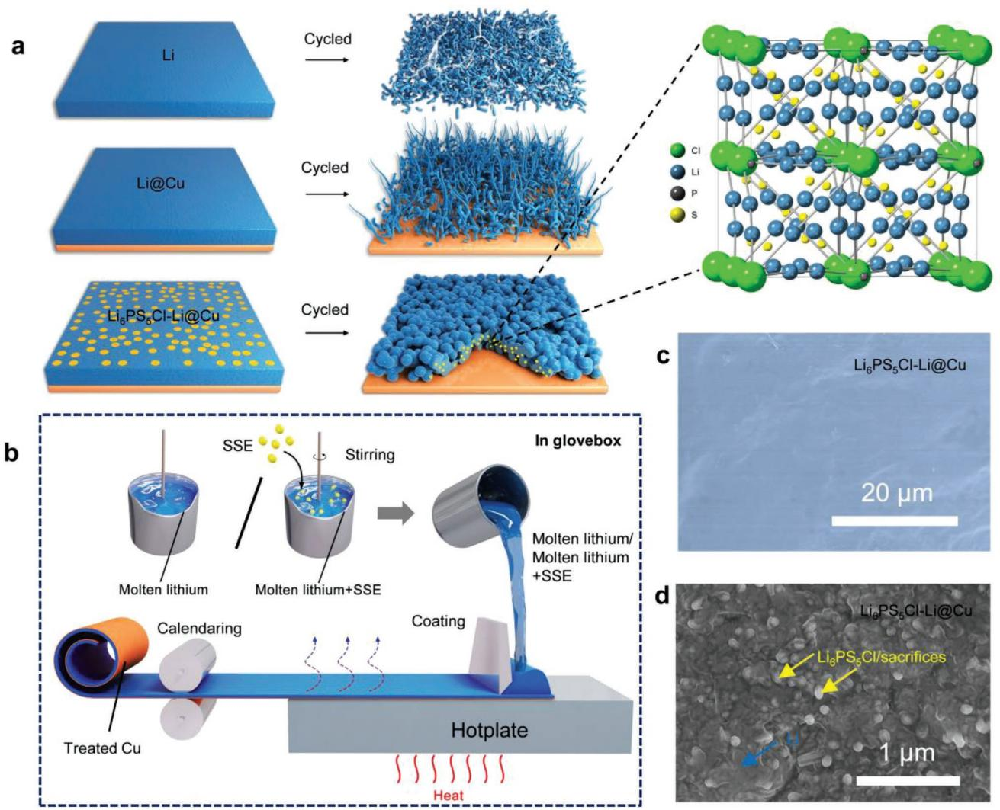
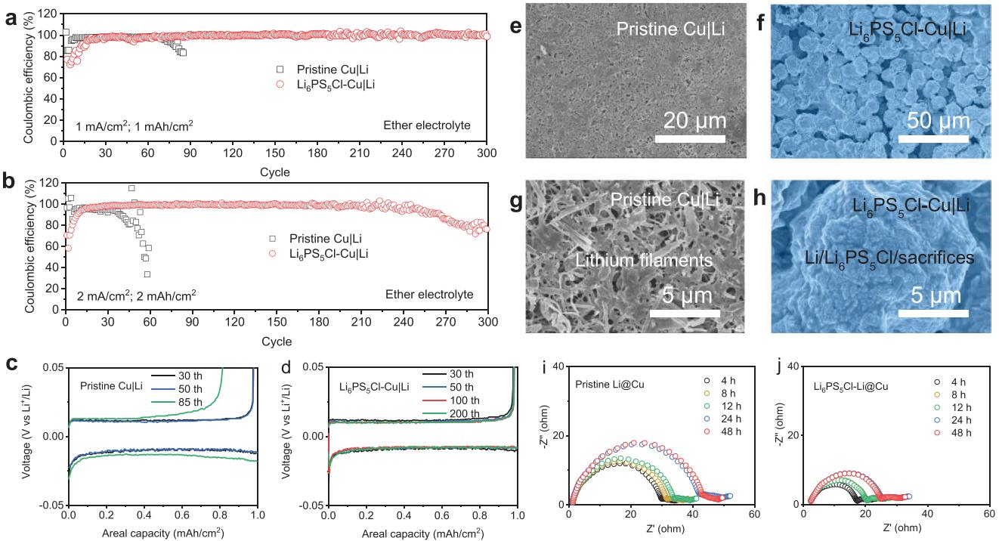
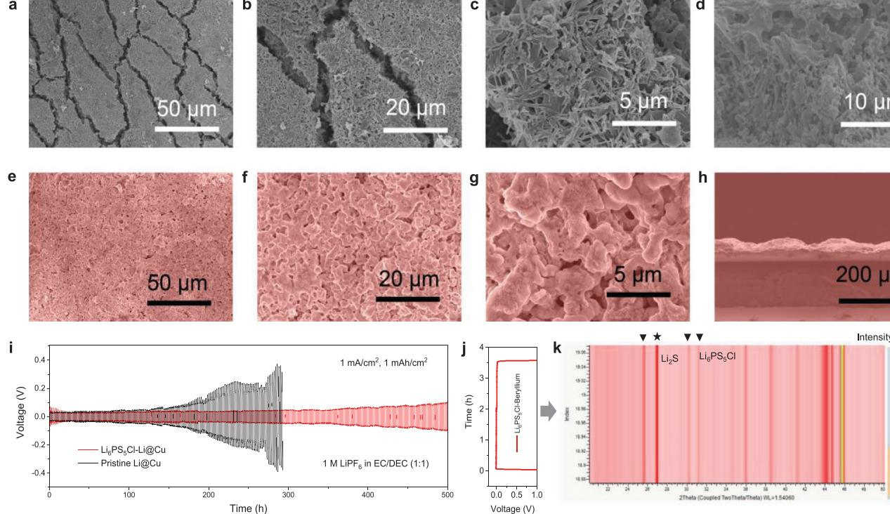
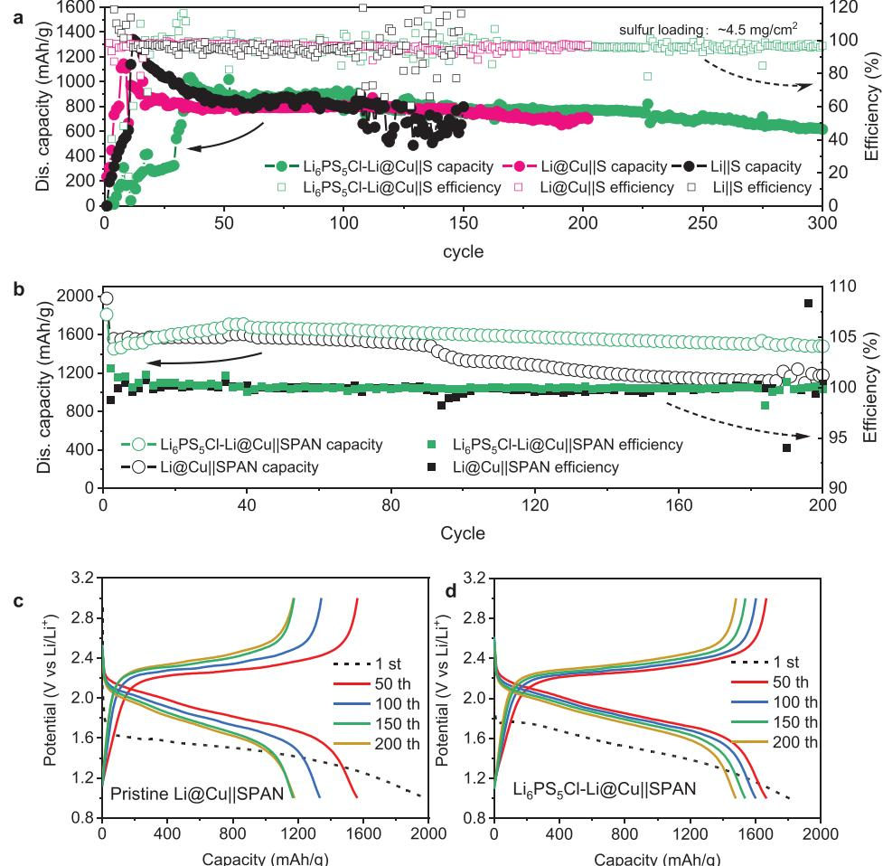
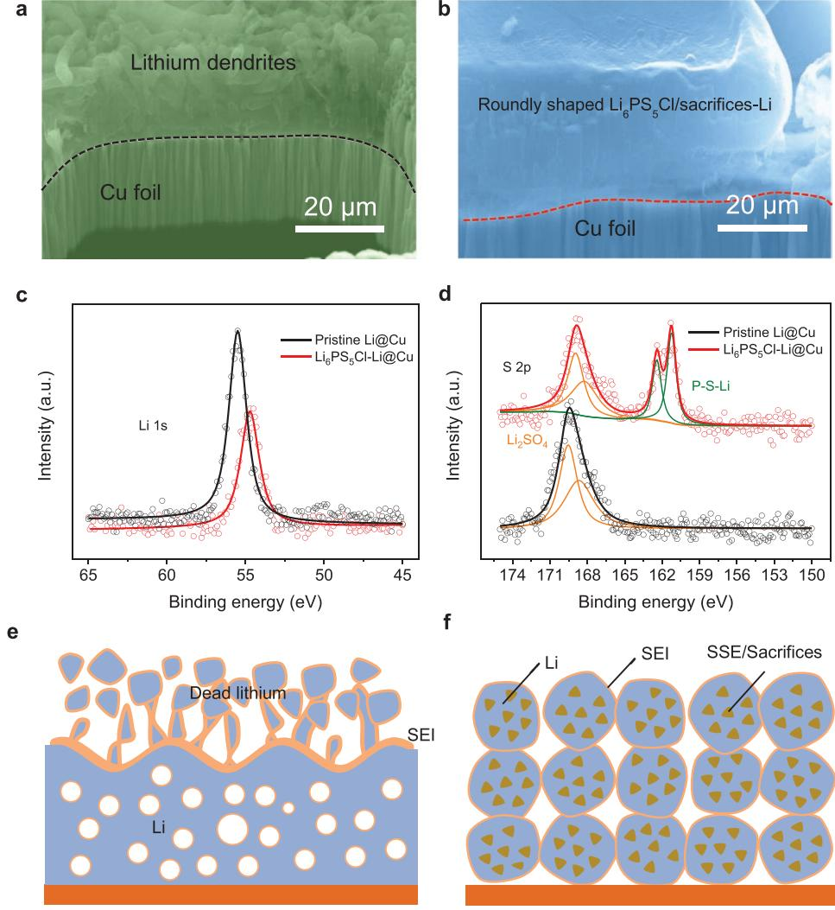

high-energy-density, long-cycle-life, and low-cost batteries, such as lithium–sulfur

metal anodes have been plagued by the large volume change during the repeated lithium plating/stripping process, which eventually causes mechanical pulverization of the electrode. Moreover, the formation of dendrite lithium structure during plating/stripping aggravates electrolyte decomposition. At the same time, the ramified growth of mossy lithium easily causes poor electrical contacts among lithium filaments by forming cracks or voids, resulting in rapid capacity fading and deteriorated cycling efficiency. These cracks or voids could expose the fresh lithium underneath and enlarge the local lithium-ion flux, further intensifying non-

However, lithium

(Li–S) batteries.[1]

# **An Antipulverization and High-Continuity Lithium Metal Anode for High-Energy Lithium Batteries**

*Yusheng Ye, Yuanyuan Zhao, Teng Zhao, Sainan Xu, Zhixin Xu, Ji Qian, Lili Wang, Yi Xing, Lei Wei, Yuejiao Li, Jiulin Wang, Li Li, Feng Wu, and Renjie Chen\**

**Lithium metal is one of the most promising anode candidates for nextgeneration high-energy batteries. Nevertheless, lithium pulverization and associated loss of electrical contact remain significant challenges. Here, an antipulverization and high-continuity lithium metal anode comprising a small number of solid-state electrolyte (SSE) nanoparticles as conformal/sacrificial fillers and a copper (Cu) foil as the supporting current collector is reported. Guiding by the SSE, this new anode facilitates lithium nucleation, contributing to form a roundly shaped, micro-sized, and dendrite-free electrode during cycling, which effectively mitigates the lithium dendrite growth. The embedded Cu current collector in the hybrid anode not only reinforces the mechanical strength but also improves the efficient charge transfer among active lithium filaments, affording good electrode structural integrity and electrical continuity. As a result, this antipulverization and high-continuity lithium anode delivers a high average Coulombic efficiency of ≈99.6% for 300 cycles under a current density of 1 mA cm−2 . Lithium–sulfur batteries (elemental sulfur or sulfurized polyacrylonitrile cathodes) equipped with this anode show high-capacity retentions in their corresponding ether-based or carbonatebased electrolytes, respectively. This new electrode provides important insight into the design of electrodes that may experience large volume variation during operations.**

# **1. Introduction**

Lithium metal anodes with high specific capacity (3861 mAh g–1) and ultralow chemical potential (−3.041 V vs standard hydrogen electrode) have drawn increasing interest as next-generation anode candidates to meet the ever-increasing demands of

uniform lithium dendrite growth. Besides, the mossy lithium with increased surface area entails severe safety concerns, and generates continuous loss of working lithium[2] and electrolyte due to the high chemical reactivity of lithium,[3] resulting in low Coulombic efficiency (CE). In recent years, progress has been made to tackle these issues, including artificial solid electrolyte interface (SEI),[4] cation and/ or ion regulation,[5] electrolyte additives,[6] host designs,[7] sustained releasing additives,[8] and lithium alloys.[9] Despite the efforts made so far, lithium metal anode is still far away from

Y. Ye, Y. Zhao, T. Zhao, S. Xu, J. Qian, L. Wang, Y. Xing, L. Wei, Y. Li, L. Li, F. Wu, R. Chen Beijing Key Laboratory of Environmental Science and Engineering School of Material Science & Engineering Beijing Institute of Technology Beijing 100081, China E-mail: chenrj@bit.edu.cn Z. Xu, J. Wang

Shanghai Electrochemical Energy Devices Research Center School of Chemistry and Chemical Engineering Shanghai Jiao Tong University Shanghai 200240, China

The ORCID identification number(s) for the author(s) of this article can be found under https://doi.org/10.1002/adma.202105029.

#### **DOI: 10.1002/adma.202105029**

practical application.

Zhengzhou University Henan 450001, China L. Li, F. Wu, R. Chen

Beijing 100081, China F. Wu, R. Chen

College of Chemistry and Molecular Engineering

Advanced Technology Research Institute Beijing Institute of Technology Jinan 250300, China

Collaborative Innovation Center of Electric Vehicles in Beijing

J. Wang

Lithium pulverization, in turn, affects the electrical connection in the whole electrode, which is another crucial issue for lithium metal anode that is often ignored. On one hand, lithium filaments could detach from the bulk anode and be wrapped by insulating SEI, leading to the formation of isolated "dead-lithium."[10] Moreover, it could also affect modified lithium electrodes by shielding active sites, such as lithophilic active sites.[11] On the other hand, lithium pulverization after long-time cycling would deteriorate electrode continuity and subsequently cut electron pathways off, drastically lowering battery capacity in a short time by fragmenting lithium metal anode and introducing large polarization.[12] As a result, lithium metal batteries often suffer from a "cliff jumping" capacity decaying instead of a slow capacity decaying. Thus, the electrode continuity of the lithium anode is one of the biggest barriers between coin cells and practical lithium metal batteries, yet neglected.[13] Free-standing lithium foil, with an excessive amount of lithium present, is often used to achieve high performance and delay the occurrence of this phenomenon. In practical cases, the loss of electrical connection becomes prominent as a limited lithium metal anode (rational negative/positive capacity ratio) is required. In traditional lithium-ion batteries, metallic current collectors (CC) are used as supporting films for electrode materials to enable efficient charge transfer and enhance electrode mechanical strength.[14] Inspired by this, we hypothesize that a lithium metal anode consisting of low-surface-area particles in whole-electrode scale and high robustness would surpass the fluctuated and unstable bare lithium foil electrode. However, the design and fabrication of such lithium metal anode remain challenging, calling for new approaches.

Herein, we report an antipulverization and high-continuity lithium metal anode with a small number of solid-state electrolyte (SSE) nanoparticles as conformal/sacrificial fillers and a copper (Cu) foil as a supporting current collector to facilitate lithium nucleation and simultaneously prevent electrode pulverization. This hybrid anode was achieved by integrating SSE with molten lithium, then coated on treated Cu CC to form a robust lithium electrode using a facile roll-to-roll strategy. The SSE nanoparticles and their sacrifices in the lithium anode act as good lithium-ion conductors to normalize lithium-ion flux and decrease the strong local electric field of lithium anodes, which eliminates the heterogeneity of lithium metal anode (**Figure 1**). As a result, the composite electrode affords a roundly shaped, crack-free, and dendrite-free morphology in the forms of secondary particles after cycling, not only greatly reduces the surface area but also enhances the electrode charge/discharge reversibility. Moreover, treated Cu CC here enables efficient electrode continuity to avoid the "cliff jumping" capacity decay and enhances cycle performance. When coupling this novel anode with sulfur cathodes, the lithium–sulfur full-cell shows an 81.7% capacity retention after 200 cycles under high areal loadings. Our work highlights the first demonstration of a robust SSE-enhanced lithium metal anode to reduce lithium dendrite hazards and concurrently improve electrode continuity, which holds great promise for developing high-energy and long-cycle energy storage devices that may experience large volume variation during operations.

# **2. Results and Discussion**

#### **2.1. Fabrication of the Antipulverization and High-Continuity Lithium Metal Anode**

To solve the soft and cracking issues of lithium metal anode, here we develop a CC supported strategy to fabricate a robust lithium anode electrode by coating molten lithium or molten lithium/ Li6PS5Cl SSE on Cu foil (Li@Cu or Li6PS5Cl-Li@ Cu) then by calendaring, as shown in Figure 1a. The Cu current collector with a layer of zinc on the surface was first treated in the furnace in the air atmosphere to oxide zinc into zinc oxide. This lithophilic layer improves the affinity between the lithium metal anode and Cu current collector. SSE with high lithium-ion conductivity was used as an alternative artificial SEI layer to improve the interfacial stability of lithium metal anode.[15] Although such passive layers contribute to the suppression of Li dendrite growth and achieve a long lifespan of lithium metal anode, new methods to integrate SSE particles into lithium metal anode are still lacking. Here, we chose to form a hybrid lithium composite anode using molten lithium and Li6PS5Cl SSE nanoparticles due to superionic ion conductivity (as high as ≈10−2 S cm−1 ) and deformability of the SSE.[16] Li6PS5Cl SSE nanoparticles were first synthesized by the energy-saving liquid-phase dissolution-precipitation approach. The SSE precursor was completely dissolved in tetrahydrofuran (THF) solvent and then heated up to enable the precipitation of the Li6PS5Cl SSE. The particle size of SSE can be tuned to nanosizes,[17] which enlarges the contact area between lithium and SSE, as shown in Figure S1 in the Supporting Information. The X-ray photoelectron spectroscopy (XPS) spectrum of argyrodite Li6PS5Cl SSE nanoparticles is provided in Figure S2 in the Supporting Information. According to the broad XPS scan spectrum, the peaks near 56.6, 134.9, 163.5, and 191.9 eV are attributed to Li, P, S, and Cl of argyrodite Li6PS5Cl SSE nanoparticles. To obtain an SSE and lithium hybrid, a stoichiometric mixture of Li metal and Li6PS5Cl SSE was used as raw materials in an argon-protected glovebox. The hybrid composite was then transferred onto a thin treated Cu CC on a hot plate and then calendared using a roll-to-roll method in the glove box (Figure 1b). Figure 1c shows the top surface morphology of synthesized Li6PS5Cl-Li@Cu lithium metal anode with a continuous and uniform morphology. From a high magnification scanning electron microscope (SEM) image (Figure 1d), randomly dispersed SSE nanoparticles and their sacrifices are covered by lithium after synthesis, which demonstrates that the Li6PS5Cl SSE nanoparticles and their sacrifices are completely mixed with lithium. Such uniform Li6PS5Cl-Li@Cu hybrid anode not only contributes to uniform lithium plating and stripping process but also shows high robustness due to the presence of additional treated Cu CC.

To investigate the effects of the Li6PS5Cl SSE on lithium plating and stripping, Li6PS5Cl SSE nanoparticles were first coated on the treated Cu CC directly by dripping 50 µL 0.1 m Li6PS5Cl SSE in THF on Cu CC surface and dried in a glove box for 48 h under an argon atmosphere (Li6PS5Cl@Cu). For comparison, pure treated Cu CC was used as the control sample. We then assembled Li||Cu and Li||Li6PS5Cl@Cu cells and study their CEs and morphology during the charging and **www.advancedsciencenews.com www.advmat.de**

**Figure 1.** The design concept of the antipulverization and high-continuity lithium metal anode. a) Schematic illustration of the pristine free-standing lithium (Li), treated copper supported lithium (Li), and SSE enhanced lithium metal anode with treated Cu as support CC (Li6PS5Cl-Li@Cu) before and after cycling. b) Li@Cu and Li6PS5Cl-Li@Cu were synthesized by heating lithium, a stoichiometric mixture of Li6PS5Cl nanoparticles and Li metal under mechanical stirring in a glove box with argon protection and coated on Cu CC, respectively. c,d) SEM and high-magnification SEM images of the Li6PS5Cl-Li@Cu anode.

discharging process in ether electrolyte, as shown in **Figure 2**a and Figures S3 and S4 in the Supporting Information. Lithium was first plated at current densities of 1 mA cm−2 for 1 h (corresponding to an areal capacity of 1 mAh cm−2 ), followed by stripping to 1 V at the same current density. Pristine treated Cu CC displayed CEs of ≈98% before the cells became unstable for 70 cycles and then quickly dropped to ≈80% for the next 10 cycles. In stark contrast, Li6PS5Cl@Cu electrodes showed significantly enhanced cycle performance which can be extended to 300 cycles with even higher CEs (≈99.6%). Although there was a slight fluctuation after 200 cycles, the average CE remained higher than 99.5%. It is worth mentioning that the CEs of the Li6PS5Cl@Cu electrode gradually increased at the initial several cycles, which can be attributed to the redistribution of Li6PS5Cl SSE nanoparticles in the lithium plating/stripping process. After activation, the Li6PS5Cl-Li in hybrid anode showed increased CEs and long cyclability. When we increased the testing current density to 2 mA cm−2 , the CE of pristine Cu|Li dropped to around 94.0% and quickly failed after 40 cycles, whereas the CE of Li6PS5Cl@Cu|Li stabilized at ≈99.2% from cycle 30 to cycle 210 (Figure 2b). Under this rigorous condition, the Li6PS5Cl@ Cu|Li preserved stable cycling capability which is 4.5 times compared to that of pristine Cu|Li. Figure 2c,d and Figure S4 in the Supporting Information show the voltage profiles of Li||Cu and Li||Li6PS5Cl-Cu cells at different cycles under 1 mA cm−2 and 1 mAh cm−2 . It is found that Li||Li6PS5Cl-Cu cell exhibited only ≈21 mV Li plating plateau voltage from the 25th to 300th cycles while the Li||Cu cell showed increased Li plating plateau voltage to ≈30 mV from 30th to 60th cycles. The decreased stripping voltage and hysteresis are attributed to the formation of a more stable interface. These observations demonstrate that the totally embedding of SSE/sacrifices into the lithium metal anode can promote the lithium stripping and plating processes, guiding the fabrication of a high-performance SSE-Li hybrid anode.

**Figure 2.** The morphology and performance of different lithium anodes in the ether-based electrolyte. a,b) CEs of Li||Cu cells using commercial Cu foil and Li6PS5Cl SSE-coated Cu foil in the ether-based electrolyte under different current densities. c,d) Corresponding voltage profiles obtained from Li||Cu cells using commercial Cu foil and Li6PS5Cl SSE-coated Cu foil in the ether-based electrolyte under a current density of 1 mA cm−2 . SEM images of e,f) Li@Cu and the g,h) Li6PS5Cl-Li@Cu hybrid anode after 50 cycles under 1 mA cm–2 current density in the ether-based electrolyte. i,j) Nyquist plots of the Li@Cu||Li@Cu symmetric cells and Li6PS5Cl-Li@Cu||Li6PS5Cl-Li@Cu symmetric cells after resting in different durations.

We then premixed SSE with molten lithium and then coated the mixture on treated Cu CC to increase the homogeneity of the SSE-Li composite anode. After the temperature cooled down, the electrode was calendared to fabricate a robust composite lithium metal anode (Li6PS5Cl-Li@Cu). The premixed SSE and calendaring process enabled the homogeneity of SSE distribution in the lithium metal anode, while the supporting Cu CC formed a robust electrode with good electronic continuity. For comparison, lithium without SSE was also coated on treated Cu CC (Li@Cu). The SEM images reveal the top-view morphology of the Li@Cu and Li6PS5Cl-Li@Cu hybrid anode after 50 cycles of stripping/plating at 1 mA cm−2 current density with a capacity of 1 mAh cm−2 . The ether electrolyte consists of lithium bis(trifluoromethanesulfonyl)imide (LiTFSI) as main lithium salt, and 1,3-dioxolane (DOL) and 1,2-dimethoxyethane (DME) as co-solvents, which is commonly used electrolyte in Li–S batteries. The Li deposition on the Li6PS5Cl-Li@Cu hybrid anode exhibits different morphologies compared to that of the Li@Cu anode. During continuous plating and stripping of the Li@Cu anode (Figure 2e,f), dendrite-shaped elongated Li filaments were formed under the uneven electric fields. Thus, lithium randomly deposited and extracted on the surface of the Li@Cu electrode. The size of the lithium flakes ranges from hundreds of nanometers to several micrometers. Interestingly, no cracks, no lithium flakes, and no lithium dendrites were observed on the Li6PS5Cl-Li@Cu hybrid anode after cycling (as a proof of concept, all ratios of Li6PS5Cl:Li are 1:9 except for special mention) (Figure 2g,h). Scattered Li6PS5Cl-Li particles with an average size of ≈15 µm were irregularly stacked through the whole anode, which is very similar to traditional electrode materials morphology. The good affinity between SSEs/their sacrifices and lithium contributes to forming micro-sized secondary sphere particles, which helps to reduce the surface energy. As a result, this special structure efficiently reduces the surface area of the lithium hybrid anode and substantially decreases the side reactions, which increase the CEs of the electrode.

To further investigate the SSE's effect in composite lithium metal anode, we conducted electrochemical impedance spectroscopy. Interfacial resistance of the symmetrical of Li@Cu||Li@Cu after 4 h resting was ≈40 Ω (Figure 2i), which is higher compared to symmetrical Li6PS5Cl-Li@Cu|| Li6PS5Cl-Li@Cu cells (≈25 Ω, Figure 2j). Even after 48 h resting, the interfacial resistance of Li-Cu cell stayed at ≈28 Ω, while that of Li6PS5Cl-Li@Cu symmetric cell was only ≈15 Ω. The lower resistance phenomenon is due to SSE in the composite anode forming a more stable interface compared to pure Li@Cu. Figure S5 in the Supporting Information exhibits the voltage hysteresis of the symmetrical Li@Cu and Li6PS5Cl-Li@Cu cells in the ether-based electrolyte, respectively. The hysteresis of pristine Li@Cu cells maintained stable at first 500 h with ≈30 mV voltage hysteresis. Subsequently, the overpotential significantly increased and fluctuated, which was attributed to unstable SEI and severe lithium dendrite formation. The destruction of the lithium on treated Cu CC, similar to that in pure lithium belt reported in previous literature, is one of the biggest challenges of lithium anode.[18] Li–Li cell assembled with Li6PS5Cl-Li@Cu hybrid anode exhibited stable voltage profiles with only ≈20 mV for the first 1800 h (900 cycles).

**Figure 3.** The morphology and performance of different anodes in the carbonate-based electrolyte. Top-view and cross-sectional SEM images of the a–d) Li@Cu and e–h) Li6PS5Cl-Li@Cu hybrid anode after 50 cycles at 1 mAh cm–2 under 1 mA cm–2 current density in the ether-based electrolyte. i) The Li deposition/stripping voltage curves of Li@Cu||Li@Cu and Li6PS5Cl-Li@Cu||Li6PS5Cl-Li@Cu symmetrical cells at a current density of 1.0 mA cm–2 and capacity of 1 mAh cm–2 in carbonate electrolyte. j) The charge–discharge curves of Li6PS5Cl-Cu||Li cell during in situ XRD testing. k) In situ XRD characterization in the 2*θ* range from 20° to 50° of Li6PS5Cl-beryllium|Li cell during the Li deposition/stripping process, where the Li deposition capacity is 1 mAh cm−2 and the current density is 0.5 mA cm−2.

The stable cycle performance and small plating voltage of the Li6PS5Cl-Li@Cu hybrid anode cell can be explained by the high ionic conductivity of SSE, which enhances the lithium-ion transportation, facilitates lithium nucleation, and uniforms the lithium-ion flux in the anode.

To explore the possibility of this hybrid anode for different battery systems, we further investigated the morphological evolution of the Li electrode and cycling performance in the carbonate electrolyte. 1.0 m LiPF6 in ethylene carbonate:diethyl carbonate (EC/DEC, 1:1 by volume) was used as the modeling carbonate electrolyte. We compared the morphologies of Li deposition in above carbonate-based electrolyte with different anode after 50 cycles of Li stripping/plating. For pristine Li@ Cu anode (**Figure 3**a–d), a huge number of lithium dendrites was found from the surface. From the close SEM image, the dendrite structures on the surface of the Li exhibited an average diameter of several hundred nanometers and lengths of up to tens of micrometers. Such filamentary morphology and interwoven dendrites, leading to form loose, porous, and dendritic structures of the lithium metal anode, which in turn cause large volume changes, severe side reactions, and low CEs. Furthermore, severe cracks can be observed from the electrode, causing bad electronic continuity of the electrode. In comparison with the pristine Li@Cu electrode, the overall morphology of the Li6PS5Cl-Li@Cu hybrid anode was much smoother, without obvious Li dendrite formation after cycling (Figure 3e–h). No cracks were observed, and the porosity of the Li6PS5Cl-Li@

Cu lithium metal anode was decreased significantly. Although there were some randomly distributed Li6PS5Cl-Li humps on Cu CC, which may be introduced by the calendaring during synthesis, no sharp tips (lithium dendrites) were observed from the cross-sectional SEM. SSE particles in the lithium anode can prevent the formation of Li dendrites and further corrosion, as well as stabilize the SEI of the anode during battery cycling. Different amounts of Li6PS5Cl in the hybrid anode were also compared, as shown in Figure S6 in the Supporting Information, it can be observed that the Li6PS5Cl-Li hybrid anode (1:9 in mass) electrode also showed a dense-packing morphology except with an average particle diameter of ≈500 nm.

The long-time Li plating/stripping cycling of symmetric cells using pristine Li@Cu and Li6PS5Cl-Li@Cu electrodes in the carbonate-based electrolyte at a current density of 1 mA cm−2 for 1 h is shown in Figure 3i. The symmetric cells based on pristine Li@Cu sustained steady for 150 h. However, the voltage hysteresis continuously increased and showed large fluctuation with more cycling. In comparison, the symmetric cells with Li6PS5Cl-Li@Cu electrode gave an excellent cycle performance under the same conditions. The Li6PS5Cl-Li@Cu electrode showed initial low overpotentials of ≈30 mV in the first 150 cycles. Even after cycling for over 500 h, it displayed very slight voltage polarizations. These results together demonstrate that no short-circuiting occurred in our SSE-enhanced lithium metal anode during this period, suggesting lithium dendrites growth had been successfully restricted and the reversibility of

stable lithium plating/stripping was greatly improved. These results agree well with the SEM observation on the cycled lithium electrodes. In situ X-ray diffraction (XRD) characterization was also performed in advance to verify the electrochemical stability Li6PS5Cl SSE behavior. Figure 3j shows the charge–discharge curve of Li6PS5Cl-beryllium|Li half-cell, corresponding to a whole cycling in situ XRD testing. In situ XRD patterns (Figure 3k) of the electrode remain stable during Li deposition/stripping process as no obvious peak intensity and position shifting was observed. This result indicates that the SSE nanoparticles and their sacrifices in the anode remains stable during these processes, preventing their further side reactions with lithium, which can be confirmed from the stable CE testing in Figure 2a,b.

#### **2.2. Electrochemical Performance of the Antipulverization and High-Continuity Lithium Metal Anode**

The effectiveness of the hybrid lithium anode was further examined in prototypical Li–S cells, which is a promising high-energy-density battery system for next-generation energy storage. The cathode was constructed based on our previously reported sulfur cathode (4.5 mg cm–2 S mass loading),[19] and 40 µL 1 m LiTFSI and 0.2 m LiNO3 in DOL/DME was used as electrolyte. **Figure 4**a shows the cycling performance of the prototype Li–S cells at a rate of 0.1 C (1 C = 1675 mA g−1 ) within the voltage window of 1.8–2.6 V. Without treated Cu metal support, the capacity of the cell with bare lithium foil anode begins to decay after 98 cycles and shows capacity fluctuation due to the loss of electron contact, after which the "cliff jumping" capacity decay occurs. The cell with Li@Cu started to decay after 150 cycles while the decay rate is much smaller. In contrast, the cell with Li6PS5Cl-Li@Cu hybrid anode demonstrated the best stable cycling with significantly higher capacity retention for 300 cycles. Repeatable testing of three sets of Li–S batteries shows good consistency (Figure S7, Supporting Information). Consequently, the Cu foil and SSE in the hybrid anode simultaneously improve the stability and cyclability of the Li–S battery. Note that the discharge capacity fluctuations in the first several cycles are ascribed to the electrochemical activation process of sulfur particles, which is more pronounced under high areal loadings. Such high sulfur loading of these batteries holds great potential for future application.

**Figure 4.** Electrochemical performance of Li–S batteries with designed lithium anodes in both ether and carbonate electrolytes. Cycling performance of the a) sulfur cathode and b) SPAN cathode with the free-standing Li, Li@Cu, and Li6PS5Cl-Li@Cu hybrid anode, respectively. Galvanostatic charge/ discharge curves of the c) SPAN||Li@Cu cell and the d) SPAN||Li6PS5Cl-Li@Cu full-cell.

Sulfurized polyacrylonitrile (SPAN) is also used as an alternative cathode to evaluate the performance of Li6PS5Cl-Li@ Cu anode since its good compatibility with carbonate electrolyte.[20] The SPAN cathode with our Li6PS5Cl-Li@Cu hybrid anode demonstrated a reversible capacity of 1452.1 mAh g–1 after 200 cycles with an average CE of 99.9% at a charge/ discharge rate of 0.5 C (Figure 4b). Whereas the SPAN cathode with pristine Li@Cu anode exhibited rapid capacity deterioration after 90 cycles due to dendrite-induced lithium anode. From charge–discharge curves (Figure 4c,d), Li–S cell with Li6PS5Cl-Li@Cu hybrid anode showed 81.7% capacity retention after 200 cycles, which is much higher than that of the Li–S cell with pristine Li@Cu lithium anode (59.6%). Comparison of another group of cycling performance displayed similar improvement in terms of discharge capacity and capacity retention (Figure S8, Supporting Information).In the meantime, the Li–S cell with the Li6PS5Cl-Li@Cu hybrid anode showed higher discharge plateaus than that of the Li–S cell with the pristine Li@Cu anode, attributing to the small overpotentials.

#### **2.3. Mechanism Understanding of the Antipulverization Lithium Metal Anode**

Focused ion beam (FIB)-SEM reveals the cross-section of the pristine Li@Cu and Li6PS5Cl-Li@Cu hybrid anode after 50 cycles at 1 mA cm−2 . As shown in **Figure 5**a, the pristine lithium anode on Cu CC as anode generates needle-like dendrites with numerous pores after cycle. The cross-sectional observations reveal the Li-metal as anode displays a dendritelike and porous structure at both the surface and bulk structure. In contrast, the Li6PS5Cl-Li@Cu hybrid anode enables a dendrite-free lithium deposition with big roundly shaped secondary particles (Figure 5b). The particles are a homogenous mixture of both Li6PS5Cl and Li metal anode. The cross-sectional view

**Figure 5.** The mechanism of the designed lithium anode in improving battery performance. FIB-SEM images of cycled a) pristine Li@Cu lithium anode and b) Li6PS5Cl-Li@Cu from after 50 cycles at 1 mA cm−2 . XPS spectra of c) Li 1s and d) S 2p of pristine Li@Cu and Li6PS5Cl-Li@Cu hybrid anode after 50 cycles at 1 mA cm−2 . The schematic mechanism e) of the Li@Cu and f) Li6PS5Cl-Li@Cu anode in Li–S batteries.

shows that a densely packed structure is generated both on the interface and bulk particles. Unlike the lithium dendrite formation and large voids of pristine Li@Cu anode, the Li6PS5Cl-Li@Cu hybrid anode shows a densely packed deposition of lithium. Such structure enables excellent structural connection with much lower porosity and electrolyte contacting interface. Besides, the round and dense-packing structure can also reduce the volume change and increase the CEs, reducing polarization during long-term cycling.

To further investigate the composition of the hybrid anode, the pristine Li@Cu anode and Li6PS5Cl-Li@Cu hybrid anode after 50 cycles were carried out by XPS (Figure 5c). The analysis identifies some significant differences in lithium metal surfaces. The relatively high binding energy of Li1s at around 56.0 eV can be ascribed to the SEI components generated from the decomposition of electrolyte solvent or lithium salts, such as LiF and Li2CO3. With Li6PS5Cl-Li@Cu hybrid anode, however, this peak shifts to a lower binding energy appear at around 55.0 eV, demonstrating a significantly different SEI composition of the deposited lithium metal with embedded Li6PS5Cl SSE. Based on previous studies, the decomposition of Li6PS5Cl lithium interface could be P2S*x*, Li2S*n*, LiCl, and Li3P, et al.[21] The difference in the decomposition products is a key reason that the morphology of the Li6PS5Cl layer is different from that of the pristine lithium and pure Li6PS5Cl. The combining of lithium metal with Li6PS5Cl SSE can be assembled into spherical particles, which formed dense-packing structures with good electrode stability. Besides, the XPS analyses of the other S 2p element also indicate notable differences in the binding energies for the elements at the Li6PS5Cl-Li@Cu and pristine Li@ Cu after cycling (Figure 5d). The S 2p spectrum of the pristine lithium metal sample shows that the main composition of top SEI is Li2SO4, corroborating a previous report.[22] In contrast, S 2p spectrum of the Li6PS5Cl-Li@Cu sample shows the characteristic signals for PS4-tetrahedra and the corresponding P-S-Li. In addition, a peak shift to lower binding energy of Li2SO4 was also observed. These results further confirmed the main hybrid sample composite of metal lithium, Li6PS5Cl SSE, and Li2SO4. Moreover, we carried out the Li6PS5Cl-Cu|Li cell after 400 cycles at 1 mA cm−2 and 1 mAh cm−2, where the CE decreased to ≈70% (Figure S9, Supporting Information). The CE degradation is mainly caused by thick SEI, which could block the effective ion transportation in cells. From the XPS spectra (Figure S10, Supporting Information), we found that SEI is polymer-rich and inorganic-rich, including Li2CO3, Li2SO4, Li2S, Li3P, LiCl, Li*x*PO*y*, Li*x*PF*y*O*z*, LiPS, Li6PS5Cl, etc.

Such roundly shaped, dense-packing, and stable interfaces successfully restricted the lithium dendrite growth and enhanced the lithium plating/stripping efficiency. The uncontrolled grown lithium dendrites caused uneven lithium nucleation and unstable SEI during the lithium plating/stripping process (Figure 5e), impeding the commercialization of lithium metal batteries. As illustrated in Figure 5f, the SSE in electrolyte may be in situ wrapped by lithium and be integrated into secondary particles, where the lithium is expected to be lithium dendrite free. Such morphology evolution can be attributed to the following three reasons: i) Enhanced ionic conductivity of SEI contributes to form a uniform structure. Most of the SSE nanoparticles and their sacrifices, such as Li2S, Li3P, LiPS, or Li6PS5Cl, take part in SEI formation and have much higher ionic conductivity compared to Li2CO3 and LiF (traditional SEI components in carbonate electrolyte), which can normalize the lithium-ion flux and form the dense-packing structure. ii) The existence of inorganic particles provides high mechanical rigidity to prevent piercing and breaking of the SEI, as well as effectively suppresses the lithium dendrite growth, forming spherical lithium morphology rather than dendritic structure. iii) The Li6PS5Cl nanoparticles and their sacrifices show good lithiophilicity, which can help to decrease surface tension and improve wettability. Our design maintains low surface energy and offers robust SEI on the secondary particles' surface throughout the cycling process. In this work, the treated commercial copper foil was used as conductive supporting CC. Based on the current results, we anticipate that the implementation of ultralight current collectors in the future could further boost the specific energy of lithium metal batteries.[14,23] Moreover, we acknowledge that other SSEs, such as lithium lanthanum zirconium oxide (LLZO), lithium aluminum germanium phosphate (LAGP), and their deviates could have similar effects in improving battery cycling, with comprehensive studies are needed in the future.

#### **3. Conclusion**

In summary, we have successfully designed an antipulverization and high-continuity lithium anode to form a robust SSEenhanced lithium metal anode. The composite anode with superior interfacial stability was achieved by premixing the SSE with molten lithium and then coated onto a treated CC, followed by calendaring. This hybrid lithium anode structure contributes to forming roundly shaped, noncrack, dense-packing, and dendrite-free structures with low porosity and low-surfacearea, which mitigates volume change and limits the increase in polarization during long-term cycling. Both the facile process and robustness make our composite anode highly attractive for practical application. By paring with the different sulfur-based cathodes (both sulfur and SPAN cathode), the Li–S full-cells all showed better cycling performance both in ether-based and carbonate-based electrolytes. These results reveal a promising method to enhance the affinity between the filler and bulk lithium. The design shows an efficient solution to address anode fracture and the lithium dendrite problem, which can be extended to other alkali metal anodes, such as sodium and potassium metal anodes.

#### **4. Experimental Section**

*Materials*: Li2S (99.0%) and LiCl (99.9%) were purchased from Alfa Aesar, P2S5 (99%) and tetrahydrofuran (THF, 99%) were purchased from Aladdin. The carbonate ester-based electrolyte with 1.0 m LiPF6 dissolved in EC and DEC (1:1 by volume) was obtained from Guotai-Huarong Company, China. The ether-based electrolyte consisted of 1.0 m LiTFSI and 0.2 m LiNO3 and dissolved in DOL/DME (1:1 by volume) were purchased from the Fosai company, China. Li metals with 100 µm thickness were purchased from China Energy Lithium, China.

*Preparation of Treated Copper CC*: To note, a thin layer of zinc is used to protect the Cu from oxidation. All the copper foils were treated

at 300 °C in an oven under air atmosphere. During this process, the thin zinc layer would be oxidized into zinc oxide, which enhances the interfacial affinity between lithium metal anode and the current collector.

*Preparation of the Li*6*PS*5*Cl-Li@Cu Hybrid Anode*: Li6PS5Cl interfacial layer was synthesized using a wet-chemical synthesis process. Li2S/ P2S5/LiCl in a molar ratio of 5/1/2 was premixed and then added to THF in an argon-filled glovebox. The formation of Li6PS5Cl in THF was via following equation

$$
5Li_2S + P_2S_5 + 2LiCl \rightarrow 2Li_6PS_5Cl
$$
 (1)

Subsequently, the mixtures were stirred for 2 days. After that, the solid-state nanoparticles were collected and dried on the hot plate for at least 48 h and milled by a mortar to avoid particle aggregation. For the preparation of Li6PS5Cl-coated Cu foil, the milled solid-state nanoparticles were re-dispersed into THF. 50 µL (0.1 m Li6PS5Cl in THF) of above solutions was dropped on the treated Cu foil and dried on the hot plate before use.

To prepare Li6PS5Cl-Li@Cu hybrid anode, fixed amount of Li6PS5Cl particles was mixed with lithium foil at 400 °C in a stainless steel container with different mass ratios (1:19, 1:9, and 1:4, respectively) for 1 h in a glove box (Ar-atmosphere, H2O level ≤ 0.1 ppm and O2 level ≤ 0.1 ppm) under mechanical stirring. The molten mixture was then coated on a treated Cu foil on a 400 °C hot plate with a thickness of 100 µm and then calendared using a roll-to-roll strategy after temperature decrease. For pristine Li@Cu preparation, pure lithium was first melted onto treated Cu foil on a 400 °C hot plate, then coated using a doctor blade and calendared with a roll-to-roll method when the temperature cooled down to form a uniform lithium anode with CC. Both the pristine Li@Cu and Li6PS5Cl-Li@Cu hybrid anodes could be cut into different sizes for further use. The thickness of lithium metal anode was ≈100 µm.

*Cell Assembly and Testing*: All the batteries were assembled in a glovebox and tested at room temperature. The Li–Li symmetric cells for plating/stripping tests were assembled with prepared Li@Cu or Li6PS5Cl-Li@Cu anode as both electrodes with 40 µL electrolyte in 2025 type coin cells, respectively. Established currents with designed capacity were applied to alternatively plate/strip the lithium between two electrodes.

For the Li@Cu cell assembling, a specified amount of lithium was plated pristine-treated Cu foil or Li6PS5Cl-Cu foil at the same current densities for 1 h, followed by stripping lithium to 1 V. The CE was calculated as the ratio of the Li stripping capacity to the Li deposition capacity for each cycle. The in situ cell was discharged to deposit 1 mAh cm−2 of lithium onto the Cu electrodes at 0.5 mA cm−2, and followed by stripping to 1 V.

Sulfur composite was prepared based on previous report.[19] Sulfur composite with an ≈89 wt% sulfur content was used as the cathode material. The weight ratio of sulfur composite:conductive carbon:binder was 80%:14%:6%. Electrodes with an areal sulfur loading of ≈4.5 mg cm–2 were dried at 70 °C and then assembled in a glove box with the freestanding Li (100 µm), Li@Cu or Li6PS5Cl-Li@Cu as the anode. Celgard 2325 separator with a thickness of 25 µm was used as the separator. The assembled Li–S cells were discharged and charged between 1.8 and 2.6 V at 0.1 C using an electrochemical station (LAND, Wuhan) to test their cycle life. The electrolyte usage was 16 µL mg−1 sulfur.

2025-type coin cells were assembled in the glove box to study the behaviors of Li6PS5Cl-Li@Cu in carbonate-based electrolyte using pyrolyzed polyacrylonitrile sulfur composite (SPAN) as cathode. The weight ratio of SPAN:conductive carbon:binder was 80%:10%:10%. The electrode was cut into small piece with an area of 1 cm2. The sulfur loading of the SPAN was ≈1.05 mg cm–2. The assembled cells were cycled at 0.5 C (1 C = 1675 mA g–1) in the voltage window of 1.0–3.0 V. The charge and discharge capacities were calculated based on the mass of sulfur. 40 µL 1.0 m LiPF6 in EC/DEC (1:1 by volume) was used as electrolyte.

*Material Characterization*: SEM was performed on an FEI Quanta 650 SEM operated at 20 kV. XPS analysis was performed on a Kratos Analytical spectrometer at room temperature with monochromatic Al K*α*

(1486.6 eV) radiation. For in situ XRD experiment during electrochemical cycling, a special cell was assembled using a beryllium window for X-ray penetration.

# **Supporting Information**

Supporting Information is available from the Wiley Online Library or from the author.

#### **Acknowledgements**

This work was financially supported by the National Natural Science Foundation of China (51772030, 52002023) and Beijing Outstanding Young Scientists Program (BJJWZYJH01201910007023).

# **Conflict of Interest**

The authors declare no conflict of interest.

# **Author Contributions**

Y.Y. and Y.Z. contributed equally to this work. Y.Y. and R.C. conceived the concept and carried out the experimental works. Y.Y. and Y.Z. carried out the synthesis and performed materials characterization and electrochemical measurements. Z.X. and J.W. helped synthesize the S-PAN cathode. Y.Y., T.Z., J.Q., L.W., L.W., Y.L., L.L., F.W., and R.C. assisted in the synthesis and characterization of materials. Y.Y. and Y.Z. analyzed the data. F.W and R.C. revised the paper. Y.Y. and Y.Z. wrote the paper. All authors discussed the results and commented on the manuscript.

#### **Data Availability Statement**

Research data are not shared.

#### **Keywords**

antipulverization, current collectors, lithium metal anodes, lithium– sulfur batteries, solid-state electrolytes

> Received: June 30, 2021 Revised: August 30, 2021 Published online: October 8, 2021

- [1] a) D. Lin, Y. Liu, Y. Cui, *Nat. Nanotechnol.* **2017**, *12*, 194; b) X.-B. Cheng, R. Zhang, C.-Z. Zhao, Q. Zhang, *Chem. Rev.* **2017**, *117*, 10403; c) S. Li, M. Jiang, Y. Xie, H. Xu, J. Jia, J. Li, *Adv. Mater.* **2018**, *30*, 1706375.
- [2] T. Mukra, E. Peled, *J. Electrochem. Soc.* **2020**, *167*, 100520.
- [3] a) R. Cao, W. Xu, D. Lv, J. Xiao, J. G. Zhang, *Adv. Energy Mater.* **2015**, *5*, 1402273; b) Y. Zhao, Y. Ye, F. Wu, Y. Li, L. Li, R. Chen, *Adv. Mater.* **2019**, *31*, 1806532.
- [4] a) C. Huang, J. Xiao, Y. Shao, J. Zheng, W. D. Bennett, D. Lu, L. V. Saraf, M. Engelhard, L. Ji, J. Zhang, X. Li, G. L. Graff, J. Liu, *Nat. Commun.* **2014**, *5*, 3015; b) Y. Gao, Z. Yan, J. L. Gray, X. He, D. Wang, T. Chen, Q. Huang, Y. C. Li, H. Wang, S. H. Kim, *Nat.*

*Mater.* **2019**, *18*, 384; c) R. Xu, X.-B. Cheng, C. Yan, X.-Q. Zhang, Y. Xiao, C.-Z. Zhao, J.-Q. Huang, Q. Zhang, *Matter* **2019**, *1*, 317; d) X. Liu, J. Liu, T. Qian, H. Chen, C. Yan, *Adv. Mater.* **2020**, *32*, 1902724; e) Y. Xu, L. Gao, L. Shen, Q. Liu, Y. Zhu, Q. Liu, L. Li, X. Kong, Y. Lu, H. B. Wu, *Matter* **2020**, *3*, 1685; f) Y. Wang, Z. Wang, L. Zhao, Q. Fan, X. Zeng, S. Liu, W. K. Pang, Y. B. He, Z. Guo, *Adv. Mater.* **2021**, *33*, 2008133.

- [5] a) W. Zhang, H. L. Zhuang, L. Fan, L. Gao, Y. Lu, *Sci. Adv.* **2018**, *4*, eaar4410; b) J. Zhi, S. Li, M. Han, P. Chen, *Sci. Adv.* **2020**, *6*, eabb1342; c) Y.-W. Song, P. Shi, B.-Q. Li, X. Chen, C.-X. Zhao, W.-J. Chen, X.-Q. Zhang, X. Chen, Q. Zhang, *Matter* **2021**, *4*, 253.
- [6] a) Z. Lin, Z. Liu, W. Fu, N. J. Dudney, C. Liang, *Adv. Funct. Mater.* **2013**, *23*, 1064; b) W. Li, H. Yao, K. Yan, G. Zheng, Z. Liang, Y.-M. Chiang, Y. Cui, *Nat. Commun.* **2015**, *6*, 7436; c) S. K. Heiskanen, B. L. Lucht, *J. Electrochem. Soc.* **2020**, *167*, 110506.
- [7] a) R. Zhang, X. Chen, X. Shen, X.-Q. Zhang, X.-R. Chen, X.-B. Cheng, C. Yan, C.-Z. Zhao, Q. Zhang, *Joule* **2018**, *2*, 764; b) Y. Zhou, X. Zhang, Y. Ding, L. Zhang, G. Yu, *Adv. Mater.* **2020**, *32*, 2005763; c) Y. Liu, D. Lin, Z. Liang, J. Zhao, K. Yan, Y. Cui, *Nat. Commun.* **2016**, *7*, 10992.
- [8] a) H. Yuan, J. Nai, H. Tian, Z. Ju, W. Zhang, Y. Liu, X. Tao, X. W. D. Lou, *Sci. Adv.* **2020**, *6*, eaaz3112; b) Y. Liu, D. Lin, Y. Li, G. Chen, A. Pei, O. Nix, Y. Li, Y. Cui, *Nat. Commun.* **2018**, *9*, 3656.
- [9] a) X. Zhang, W. Wang, A. Wang, Y. Huang, K. Yuan, Z. Yu, J. Qiu, Y. Yang, *J. Mater. Chem. A* **2014**, *2*, 11660; b) T. Xu, P. Gao, P. Li, K. Xia, N. Han, J. Deng, Y. Li, J. Lu, *Adv. Energy Mater.* **2020**, *10*, 1902343; c) Q. Yun, Y. B. He, W. Lv, Y. Zhao, B. Li, F. Kang, Q. H. Yang, *Adv. Mater.* **2016**, *28*, 6932.
- [10] a) C. Fang, J. Li, M. Zhang, Y. Zhang, F. Yang, J. Z. Lee, M.-H. Lee, J. Alvarado, M. A. Schroeder, Y. Yang, *Nature* **2019**, *572*, 511; b) A. Aryanfar, D. J. Brooks, A. J. Colussi, M. R. Hoffmann, *Phys. Chem. Chem. Phys.* **2014**, *16*, 24965; c) C. Jin, T. Liu, O. Sheng, M. Li, T. Liu, Y. Yuan, J. Nai, Z. Ju, W. Zhang, Y. Liu, *Nat. Energy* **2021**, *6*, 378; d) J. Yu, K. Shi, S. Zhang, D. Zhang, L. Chen, S. Li, J. Ma, H. Xia, Y.-B. He, *Sci. China Mater.* **2021**, [https://doi.org/10.1007/](https://doi.org/10.1007/s40843-020-1655-3) [s40843-020-1655-3](https://doi.org/10.1007/s40843-020-1655-3).
- [11] a) R. Zhang, X. R. Chen, X. Chen, X. B. Cheng, X. Q. Zhang, C. Yan, Q. Zhang, *Angew. Chem.* **2017**, *129*, 7872; b) H. Zhang, X. Liao,

Y. Guan, Y. Xiang, M. Li, W. Zhang, X. Zhu, H. Ming, L. Lu, J. Qiu, *Nat. Commun.* **2018**, *9*, 3729; c) Y. Fang, Y.-Y. Hsieh, M. Khosravifar, K. Johnson, P. K. Adusei, S. N. Kanakaraj, S. Preisler, G. Zhang, V. Shanov, *Mater. Sci. Eng., B* **2021**, *267*, 115067.

- [12] a) Y. Guo, H. Li, T. Zhai, *Adv. Mater.* **2017**, *29*, 1700007; b) L. Qie, C. Zu, A. Manthiram, *Adv. Energy Mater.* **2016**, *6*, 1502459.
- [13] X.-B. Cheng, C. Yan, J.-Q. Huang, P. Li, L. Zhu, L. Zhao, Y. Zhang, W. Zhu, S.-T. Yang, Q. Zhang, *Energy Storage Mater.* **2017**, *6*, 18.
- [14] Y. Ye, L.-Y. Chou, Y. Liu, H. Wang, H. K. Lee, W. Huang, J. Wan, K. Liu, G. Zhou, Y. Yang, *Nat. Energy* **2020**, *5*, 786.
- [15] a) Y. Kato, S. Hori, T. Saito, K. Suzuki, M. Hirayama, A. Mitsui, M. Yonemura, H. Iba, R. Kanno, *Nat. Energy* **2016**, *1*, 16030; b) Y. Xiao, Y. Wang, S.-H. Bo, J. C. Kim, L. J. Miara, G. Ceder, *Nat. Rev. Mater.* **2020**, *5*, 105.
- [16] K. H. Park, Q. Bai, D. H. Kim, D. Y. Oh, Y. Zhu, Y. Mo, Y. S. Jung, *Adv. Energy Mater.* **2018**, *8*, 1800035.
- [17] a) Z. Liu, W. Fu, E. A. Payzant, X. Yu, Z. Wu, N. J. Dudney, J. Kiggans, K. Hong, A. J. Rondinone, C. Liang, *J. Am. Chem. Soc.* **2013**, *135*, 975; b) N. H. H. Phuc, K. Morikawa, M. Totani, H. Muto, A. Matsuda, *Solid State Ionics* **2016**, *285*, 2.
- [18] D. Lin, Y. Liu, Z. Liang, H.-W. Lee, J. Sun, H. Wang, K. Yan, J. Xie, Y. Cui, *Nat. Nanotechnol.* **2016**, *11*, 626.
- [19] Y. Ye, F. Wu, Y. Liu, T. Zhao, J. Qian, Y. Xing, W. Li, J. Huang, L. Li, Q. Huang, *Adv. Mater.* **2017**, *29*, 1700598.
- [20] W. J. Chen, B. Q. Li, C. X. Zhao, M. Zhao, T. Q. Yuan, R. C. Sun, J. Q. Huang, Q. Zhang, *Angew. Chem.* **2020**, *132*, 10821.
- [21] a) T. Cheng, B. V. Merinov, S. Morozov, W. A. Goddard III, *ACS Energy Lett.* **2017**, *2*, 1454; b) D. H. Tan, E. A. Wu, H. Nguyen, Z. Chen, M. A. Marple, J.-M. Doux, X. Wang, H. Yang, A. Banerjee, Y. S. Meng, *ACS Energy Lett.* **2019**, *4*, 2418; c) J. Zhang, C. Zheng, L. Li, Y. Xia, H. Huang, Y. Gan, C. Liang, X. He, X. Tao, W. Zhang, *Adv. Energy Mater.* **2020**, *10*, 1903311.
- [22] S. Xiong, K. Xie, Y. Diao, X. Hong, *J. Power Sources* **2014**, *246*, 840.
- [23] a) Q. Wu, J. Yang, Y. Zhao*,* R. Song, Z. Wang, Z. Huang, M. Shi, Y. Ye, D. He, S. Mu, *J. Power Sources* **2020**, *455*, 227991; b) Y. Chen, K. Fu, S. Zhu, W. Luo, Y. Wang, Y. Li, E. Hitz, Y. Yao, J. Dai, J. Wan, *Nano Lett.* **2016**, *16*, 3616.