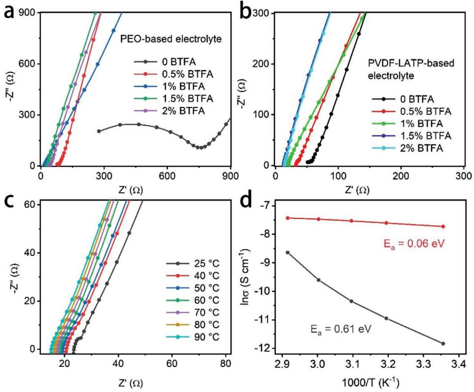
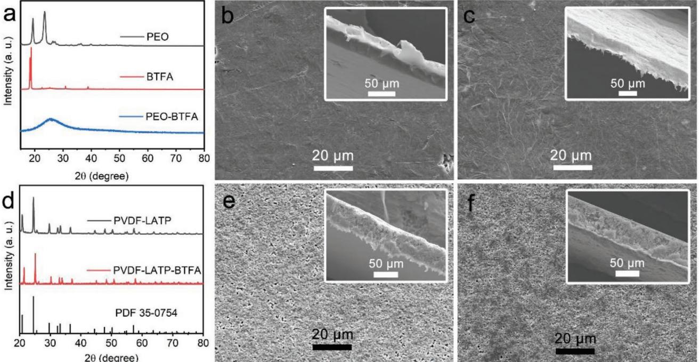
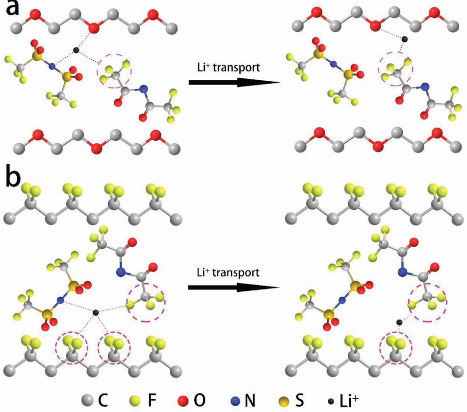
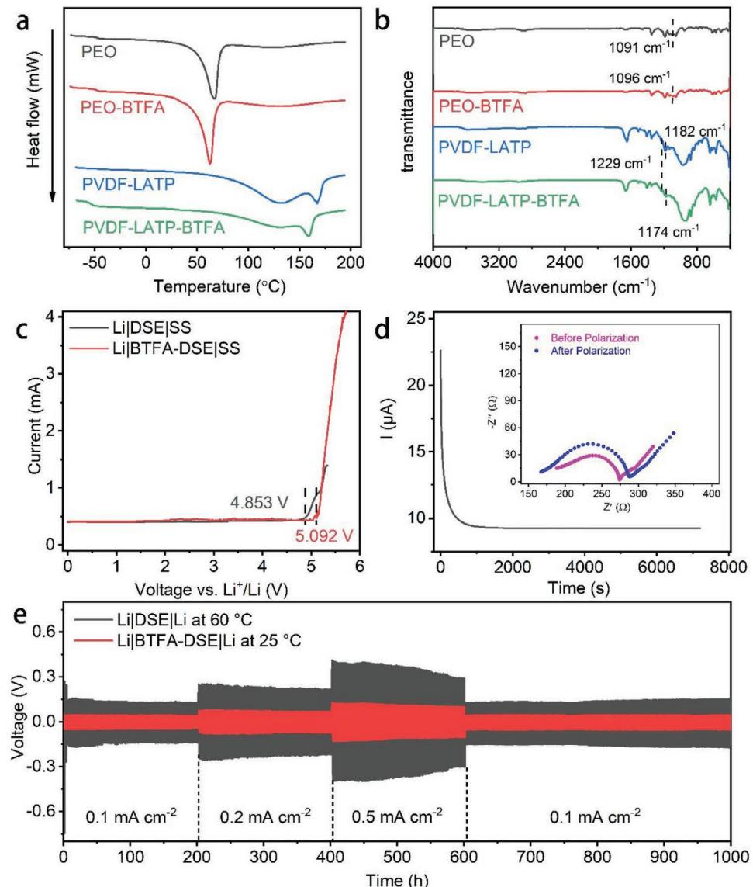
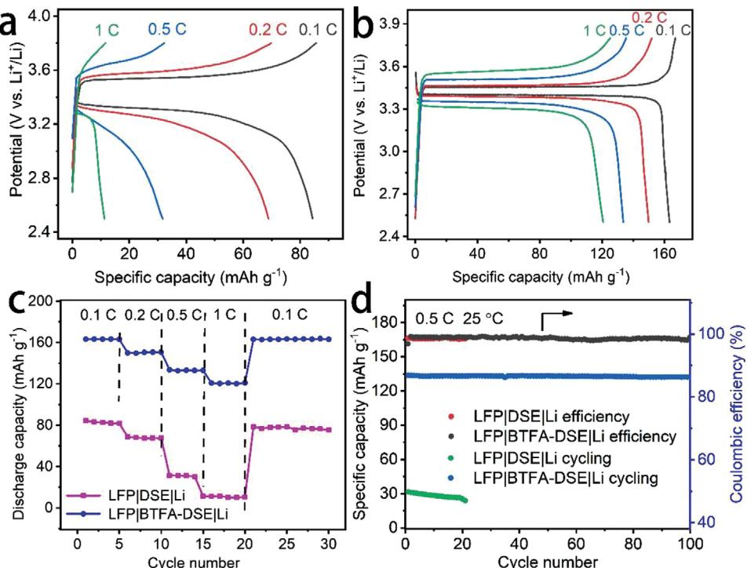
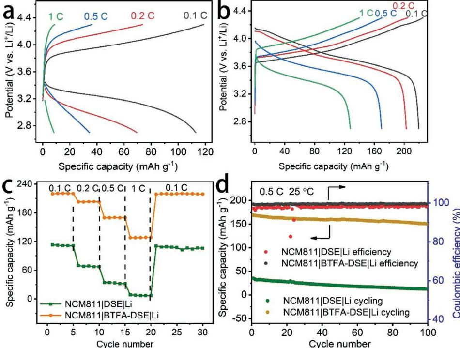

# **Bistrifluoroacetamide-Activated Double-Layer Composite Solid Electrolyte for Dendrite-Free Lithium Metal Battery**

*Shuai Hao, Qiwen Ran, Yu Xiao, Lei Li, Yuyao Ji, Jintao Liu, Ying Chun Yang,\* and Xingquan Liu\**

**The achievement of high ionic conductivity for solid-state electrolyte and low interface resistance between electrodes and electrolyte are keys to successful solid-state lithium ion batteries. In this paper, an efficient solid-state electrolyte with dual-layer structure for dendrite-free lithium metal battery is designed. A Li metal-friendly poly(ethylene oxide) (PEO) can serve as lowvoltage stable polymer electrolyte and ceramic-dominating poly(vinylidene fluoride)–lithium aluminum titanium phosphate (PVDF–LATP) composite solid electrolyte is able to resist higher voltage facing cathode. More importantly, bistrifluoroacetamide (BTFA), as a polar molecular plasticizer, can simultaneously inhibit polymer crystallization, coordinate the delocalization of negative charges, and facilitate the solvation of lithium salts, providing absorption sites for lithium ion migration. The obtained BTFA-activated PEO/PVDF–LATP double-layer solid electrolyte exhibits satisfied ionic conductivity (4.4 × 10−4 S cm−1 at 25 °C), high Li+-transfer number (0.68), and wide electrochemical stable windows (0–5.092 V vs Li/Li+). Moreover, both the assembled full cells with LiFePO4 and high-voltage LiNi0.8Co0.1Mn0.1O2 cathodes show high initial discharge capacities (163.3 and 219.5 mAh g−1 at 0.1 C, respectively), excellent cycling, and rate performance.**

### **1. Introduction**

Currently, the high energy and power density for lithium-ion batteries (LIBs) ensure their pivotal roles in electronic devices, but due to safety concerns, it is urgently demanded to develop modified solution for energy storage.[1–3] Replacing flammable liquid electrolyte and membrane in conventional LIBs with solid-state electrolytes (SSEs) is an effective approach to security issues.[4–6] Notably, solid-state lithium ion batteries (SSLIBs) hold several additional advantages, such as more flexibility, sub-

S. Hao, Q. Ran, Y. Xiao, L. Li, Y. Ji, J. Liu, X. Liu School of Materials and Energy University of Electronic Science and Technology of China Chengdu, Sichuan 610064, China E-mail: Lxquan@uestc.edu.cn S. Hao, Y. C. Yang College of Resources and Environment Chengdu University of Information Technology Chengdu, Sichuan 610225, China E-mail: yangyingchun@cuit.edu.cn

The ORCID identification number(s) for the author(s) of this article can be found under https://doi.org/10.1002/admi.202101486.

**DOI: 10.1002/admi.202101486**

duing Li dendrite growth, minimized cell dimension and less side reaction.[1,2,7] The SSEs are critical in the implementation of high-energy-density SSLIBs.[8] Among many electrolyte of interest, inorganic ceramic generally contains numerous vacancies on its surfaces, leading to Li ions hopping among vacancies so as to provide a more favorable pathway than organic polymer.[9,10] Furthermore, ceramic electrolytes possess some advantageous superiority, such as low toxicity, high mechanical strength and broad electrochemical window.[11–13]

Unfortunately, the challenges faced by SSLIBs go far beyond exploring ceramic SSEs with high ionic conductivity. The compatibility between electrolyte and Li anode also needs to be considered, because the unwanted reduction reaction between the two at low voltage will adversely affect the electrochemical stability.[14,15] One example is that despite NASICON-type Li1.3Al0.3Ti1.7(PO4)3 (LATP)

possessing attractive properties such as high voltage tolerance and high ionic conductivity, the inevitable reduction of NASICON-type LATP by Li metal leads to poor electrochemical stability. Moreover, the rigid connections between electrolyte and electrodes will result in large interfacial resistance.[14–18] Suffering from the nonhomogeneous Li deposition in Li platting/stripping process, the anode-dendrites may form and grow faster along the grain boundaries of ceramic electrolyte membranes than the conventional liquid electrolyte.[19,20]

Poly(ethylene oxide) (PEO) is considered to be the most promising polymer electrolyte due to its large amount of ether oxygen groups and strong complexing ability with lithium ions.[21–24] However, in the actual process, the stress induced by lithium deposition can easily reach dozens of gigapascals, and PEO with low Young's modulus is easy to be penetrated by dendrites during charge and discharge.[25,26] On the other hand, although some studies have verified that PEO-based composite electrolytes can expand the electrochemical window above 4.2 V in the presence of certain additives, PEO still becomes easier to decompose with the catalysis of the cathode/electrolyte interface.[27–29] The preparation of double-layer electrolyte with PEO component on anode side and ceramic-based component on cathode side can effectively solve the problem of unilateral interface instability, and give full play to the advantages

of ceramic and polymer electrolyte. Although the design of this electrolyte structure provides a possibility for high-voltage lithium-ion all-solid-state batteries, the high crystallinity of the polymer component is still an obstacle to higher energy density. Moreover, due to the excessive interaction of lithium ions with ether oxygen groups in the polymer segments, the main contribution of ion conductivity comes from migration of anions, and this will cause serious concentration polarization. In order to overcome such obstacles, researchers have developed a series of anion-fixed single-ion conductors to make the Li+ transfer number close to 1. However, this type of electrolytes is not only complicated to synthesize, but also generally has low conductivity.[30–34]

In this work, we reported the development of a novel bistrifluoroacetamide (BTFA) activated double-layer composite solid electrolyte (named as BTFA-DSE) for lithium metal battery, equipped with PEO electrolyte at anode side, "polymer in ceramic" type PVDF–LATP (3:7, weight ratio) at cathode side, and both are activated by BTFA polar molecular plasticizer. The rational design of the dual-layer structure ensures the mechanical strength of the electrolyte and the availability of high-voltage cathodes. The introduction of BTFA plastic crystals can bring the following advantages: i) it can effectively reduce the polymer crystallinity and increase the free volume for segment motion of polymer chains; ii) the additional electro-rich C–F can be regarded as Lewis based group, which can absorb Lewis acidic Li+ and regulate its solvation structure; iii) the introduction

of polar electron-withdrawing groups facilitates the delocalization of negative charges and increases the carrier concentration. Consequently, such BTFA-DSE shows a significant improvement in ion conductivity (4.4 × 10−4 S cm−1 ) than that for initial DSE (7.26 × 10−6 S cm−1 ), with wide electrochemical stable windows and robust interfacial stability toward lithium metal. In practical application, BTFA-DSE can behave as a solid electrolyte for lithium metal batteries with both LiFePO4 (LFP) and high-capacity/high-voltage LiNi0.8Co0.1Mn0.1O2 (NCM811) cathodes, demonstrating high initial discharge capacity, reliable cycling and rate performance, respectively.

#### **2. Results and Discussion**

The optimum additions of BTFA are determined by the ion conductivities of both solid electrolytes first. The Nyquist plots of a series of PEO-based, PVDF–LATP-based electrolyte membranes with various contents of BTFA are shown in **Figure 1**a,b, respectively. Observably, the conductivity of PEO-based electrolyte increases in sequence with the increase in the mass content of BTFA, and reaches a maximum value of 3.58 × 10−4 S cm−1 at 1 wt% than pristine PEO (7.4 × 10−6 S cm−1 ). On the other hands, with the BTFA additive, the ionic conductivity of PVDF–LATP-based electrolyte is enhanced to 4.67 × 10−4 S cm−1 when the ratio of PVDF, LATP and BTFA is 3:7:0.045. The conductivity of electrolyte will decrease by further increasing the content of BTFA,

**Figure 1.** a) Nyquist plots of PEO-based membranes, which were prepared with various contents of BTFA in PEO. b) Nyquist plots of PVDF–LATP-based membranes with various contents of BTFA in PVDF. c) Temperature-dependent EIS curves of BTFA-DSE membrane from 25 to 70 °C. d) Arrhenius plots of the DSE and BTFA-DSE membranes.

**www.advancedsciencenews.com**

**Figure 2.** a) XRD patterns of PEO and BTFA powders as well as PEO-BTFA membrane. SEM image of the surface and cross-section SEM images of b) PEO and c) PEO-BTFA membranes. d) XRD patterns of PVDF–LATP and PVDF–LATP-BTFA membranes. SEM image of the surface and cross-section SEM images of e) PVDF–LATP and f) PVDF–LATP-BTFA membranes.

which may be due to excessive BTFA leading to the phenomenon of local agglomeration of BTFA. For simplicity, the unilateral electrolytes with optimized additive amount of BTFA are abbreviated as PEO-BTFA and PVDF–LATP-BTFA, respectively. Figure 1c illustrates the temperature-dependent electrochemical impedance spectroscopy (EIS) curves of BTFA-DSE. As expected, such BTFA-DSE membrane provides a high conductivity of 4.4 × 10−4 S cm−1 at 25 °C, much higher than that for DSE (7.26 × 10−6 S cm−1 ; Figure S1, Supporting Information). Calculated by the Arrhenius equation, the activation energies of DSE and BTFA-DSE are 0.61 and 0.06 eV, suggesting less energy consumption of lithium ion migration in BTFA-DSE (Figure 1d). Compared to the requirement for high ionic conductivity, low electronic conductivity is more favorable in inhibiting the growth of dendrites at the Li|SSE interface.[35,36] Therefore, the direct current polarization measurements of SS|BTFA-DSE|SS were conducted, verifying its adequate low electronic conductivity (1.26 × 10−7 S cm−1 ; Figure S2, Supporting Information).

Typical X-ray diffraction (XRD) patterns of components and electrolyte membranes are demonstrated in **Figure 2**a,d and Figure S3 (Supporting Information). After adding BTFA, the degree of crystallinity of PEO-based solid membrane reduced dramatically and the amorphous content in PEO host polymer is greatly increased. As to PVDF–LATP-based membranes, only peaks corresponding to high-pure LiTi2(PO4)3 phase (JCPDS No. 35-0754) are observed, confirming the dominant component of LATP in unilateral solid electrolyte and amorphous structures of polymer. Figure 2b,c shows the scanning electron microscope (SEM) images of PEO and PEO-BTFA electrolyte membrane, respectively, which show smooth and uniform features and the corresponding thickness of membrane is ≈35 µm. The SEM images of PVDF–LATP-based electrolyte membrane are presented in Figure 2e,f, suggesting the thickness of PVDF– LATP-based films is ≈50 µm and the LATP nanoparticles are uniformly distributed and embedded in polymer matrix, which is beneficial for improving mechanical strength and Li+ conductivity. Notably, there is no obvious gap across the interface in BTFA-DSE, indicating good adhesion and uniform contact, which help to homogenize the Li+ flux across the internal solid electrolyte interface (Figure S4, Supporting Information). We also perform thermogravimetry (TG) analysis to evaluate the thermal stability and the contents of residual solvent in solid electrolyte membranes (Figure S5, Supporting Information). It can be seen that the DSE and BTFA-DSE have no obvious weight loss before 200 °C, meaning negligible solvent residue in solid electrolyte (< 1%). The decomposition temperature of the DSE and BTFA-DSE is above 300 °C, reflecting that such promising solid electrolytes could be utilized even at elevated temperature.

The migration of lithium ions in the electrolyte is mainly accomplished through the interaction with various electronegative groups under the action of an electric field. The addition of BTFA dramatically inhibits the crystallization of the matrix and increases the free volume (Figure S6, Supporting Information). Benefiting from the electron-withdrawing groups in BTFA additions and PEO or PVDF matrix, the lithium salt dissociates to generate free lithium carriers, while the movement of TFSI− anions is inhibited. On the other hand, the –CF3 group in BTFA can facilitate the transport of carriers by optimized

**Figure 3.** Schematic illustration of main interaction forms between the ions and the polymer or BTFA in BTFA-DSE. a) Li+ migration was associated with the TFSI− anion, ether linkages in PEO and –CF3 groups in BTFA. b) Transport of Li+ ions was involved with the TFSI− anion, –CF3 groups in BTFA, and –CF2 groups in PVDF.

negative charge delocalization, and weaken the combination of Li+ with the ether bond in PEO and the F atom in PVDF. Therefore, As shown in **Figure 3**, the Li+ transport in PEO-based electrolyte can be described as the motion of free Li+ between the –CF3 group of BTFA and ether oxygen group of PEO. The migration of Li+ in PVDF-BTFA matrix can be regarded as shuttles between different F-C groups.

Differential scanning calorimetry (DSC) analysis and Fourier transform infrared (FTIR) study were performed to verify the interaction between lithium salt, BTFA and polymer matrix. The DSC thermograms of prepared electrolyte membranes are displayed in **Figure 4**a, and the calculated thermodynamic data are listed in Table S1 (Supporting Information). In the PVDF–LATP membrane without BTFA, no obvious glass transition temperature is observed, which can be due to the relatively high orientation and crystallinity of PVDF, inhibiting the mobility of segments, so that the thermal tolerance changes in glass transition range are not obvious. The crystallinity of PEO, PEO-BTFA, PVDF–LATP and PVDF–LATP-BTFA membrane are calculated to be 56.06%, 38.01%, 85.96%, and 76.19%, respectively. The reduction of crystallinity result from that the excellent compatibility and interaction between polymer and added BTFA increase the proportion of amorphous regions. FTIR spectroscopy was used to explore the interaction between the polymer matrix, LiTFSI and BTFA (Figure 4b). The asymmetric stretching at 1055, 1091, and 1134 cm−1 correspond to the C–O–C of pure PEO or ether oxygen after complexation.[37,38] The broadened peak at 3525 cm−1 also verifies the complexation between Li+ and ether oxygen.[39] After adding BTFA plasticizer, peak at 1091 cm−1 broaden and shift to the left, indicating the introduction of electron-withdrawing groups results in the weakening of the interaction between polymer segments and Li+. As to PVDF–LATP electrolyte, the peaks at 1182 and 1229 cm−1 should be the stretching vibration of CF bond in PVDF, which partially overlapped with CF3 in LiTFSI.[40] With the introduction of BTFA, the peak at 1229 cm−1 demonstrates no obvious shift and shape changes, while the peak at 1182 cm−1 broadens and shifts to the right. We can judge from the FTIR results that the existence of BTFA optimizes the negative charge delocalization and enhances the interaction between CF groups and lithium ions, while the Lewis acidic CF groups provide a channel for lithium ion transport.[41,42] Besides the Li+ transport, electrochemical stability and Li+ migration efficiency of an electrolyte is also an important influence for the feasibility of an all-solid-state battery. In practical application, it is important to remain the stability of SSE in wide voltage window. In this study, linear sweep voltammetry (LSV) was used to determine electrochemical widow by sandwiching the **www.advancedsciencenews.com**

**Figure 4.** a) DSC curves of PEO, PEO-BTFA, PVDF–LATP, and PVDF–LATP-BTFA membranes. b) FTIR spectra of PEO, PEO-BTFA, PVDF–LATP, and PVDF–LATP-BTFA electrolyte. c) LSV curves of DSE and BTFA-DSE. d) polarization curve and impedance diagram of the BTFA-DSE membrane before and after polarization. e) Li plating/stripping profiles of the Li symmetric batteries with DSE and BTFA-DSE under current density of 0.1, 0.2, and 0.5 mA cm−2 . All experiments were conducted at 25 °C unless especially stated.

DSE or BTFA-DSE between Li metal and stainless steel (SS). It can be seen that the DSE start to decompose at 4.853 V, while BTFA-DSE began to decompose when the voltage scanned to 5.092 V (Figure 4c). LATP can be regarded as a surface stabilizer to improve the electrochemical oxidation stability of the composite electrolyte, and the addition of BTFA can further improve this effect.[43–46] The achieved wide voltage range for operation ensures that they can meet the demand of highenergy-density SSLIBs containing high-voltage cathodes. The Li+-transfer (*t*Li+) numbers are a critical parameter for evaluating the effectivity of ion conductivity, because less *t*Li+ means that the ratio of anionic migration to total ion conductance is excessive, which will cause strong concentration polarization and generate adverse resistance. The addition of BTFA and high content of LATP in PVDF matrix enabled the BTFA-DSE with a high *t*Li+ of 0.68 (Figure 4d), which is higher than that for DSE (0.53; Figure S7, Supporting Information) and the commonly reported polymer electrolytes, verifying the promoting effect of BTFA on the delocalization of negative charges.[47] The symmetric Li|DSE|Li and Li|BTFA-DSE|Li cells were also assembled to determine the mechanical stability of solid electrolyte against lithium anode during the lithium plating and striping cycling at different current densities (0.1, 0.2, and 0.5 mA cm−2 ; Figure 4e), and the cycling performance of Li symmetric cells in magnified areas are display in Figure S8 (Supporting Information). Limited by the high crystallinity of the PEO-based electrolyte at room temperature, the stability toward lithium metal of the DSE symmetric battery was tested at 60 °C. As observed,

**www.advmatinterfaces.de**

both symmetric cells with DSE and BTFA-DSE electrolytes display stable lithium plating/stripping overpotentials over 1000 h without short circuit faults. By comparison, the Li|BTFA-DSE|Li shows low overpotential plateau of only about 40, 75, and 110 mV at 0.1, 0.2, and 0.5 mA cm−2 , respectively. After the current densities fell to 0.1 mA cm−2 again, the overpotential returns to 42 mV, demonstrating its excellent electrochemical reversibility, the ability of fast ion transport, feasible design of solid electrolyte structure and high interface compatibility with Li metal electrode. Moreover, the homologous liquid electrolyte cell can only maintain stable less than 150 h at 0.2 mA cm−2 , followed by a rapidly increasing overpotential (Figure S9, Supporting Information). SEM images of the Li electrode in Li metal symmetric cells after galvanostatic polarization are presented in Figure S10 (Supporting Information). In comparison, the cycled Li metal electrode in Li|BTFA-DSE|Li show a smoother surface than that in Li|DSE|Li, while Li electrode in liquid symmetric battery has the roughest surface, demonstrating the most dendrites in electrode surface. A small amount of white residues on the Li electrodes of the solid symmetrical battery are DSE or BTFA-DSE membranes after disassembling the cell, which indicates a good interface connection between the electrolyte and the electrodes. The above results revealed that both DSE and BTFA-DSE membranes have reliable interfacial compatibility with Li metal and the capacity to suppress lithium dendrite growth. Besides, the C–F polar groups of BTFA weakens the coordination between Li+ and the ether-oxygen group, ensuring the uniform and stable deposition on Li metal surface.[48,49]

To evaluate the electrochemical behaviors of DSE and BTFA-DSE in real cells, rechargeable SSLIBs systems were assembled with LFP as cathode and Li metal as anode. The initial charge/ discharge profiles of LFP|DSE|Li and LFP|BTFA-DSE|Li cells performing at different rates are shown in **Figure 5**a,b, respectively. For the BTFA-DSE based cell, the initial discharge capacity can reach up to 163.3 mAh g−1 at 0.1 C, 96% of the theoretical value. As the current densities increase, the cell can still deliver high capacities of 150, 133.6, and 120.7 mAh g−1 at rates of 0.2, 0.5, and 1 C, respectively. In contrast, suffering from the terrible polarization in DSE, lower capacities of 84.4, 68.9, 31.7, and 11.3 mAh g−1 are obtained at corresponding rates for LFP|DSE|Li cell. Noticeably, the battery with BTFA-DSE electrolyte exhibits relatively low overpotential of 57 and 296 mV at 0.1 C and 1 C, respectively. Conversely, the LFP|DSE|Li cell shows larger overpotential of 254 and >400 mV at the same rates. The rate performance for all solid cells from 0.1 C to 1 C are presented in Figure 5c. The LFP|BTFA-DSE|Li cell exhibits higher and more stable capacities at each rate than cell with DSE, and the capacity can be quickly restored to 163.1 mAh g−1 . The LFP|BTFA-DSE|Li cell can deliver a maximum discharge capacity of 133.6 mAh g−1 with a retention of 98.8% after 100 cycles at 0.5 C, while the DSE-based cell shows a low capacity at the beginning and cannot complete the entire cycle. Furthermore, BTFA-DSE cell shows steady Coulombic efficiency (CE) close to 100% and negligible impedance gain throughout the cycling process (Figure 5d; Figure S11a, Supporting Information).

The DSE and BTFA-DSE electrolyte were also used to match NCM811 cathode to make a high voltage SSLIB. **Figure 6**a,b shows the charge and discharge curves of the NCM811 cells in the voltage range of 2.7–4.3 V. The cells employing DSE electrolyte exhibit initial discharge capacities of 113, 69.5, 34.5, and 8.4 mAh g−1

**Figure 5.** Typical charge and discharge curves of a) LFP|DSE|Li and b) LFP|BTFA-DSE|Li cells at different rates. c) Comparison of rate performances of LFP|DSE|Li and LFP|BTFA-DSE|Li cells. d) Cycling performances of solid-state LFP|Li batteries with DSE and BTFA-DSE at 0.5 C. All experiments were conducted at 25 °C.

**Figure 6.** Typical charge and discharge curves of a) NCM811|DSE|Li and b) NCM811|BTFA-DSE|Li cells at different rates. c) Comparison of rate performances of NCM811|DSE|Li and NCM811|BTFA-DSE|Li cells. d) Cycling performances of solid-state NCM811|Li batteries with DSE and BTFA-DSE at 0.5 C. All experiments were conducted at 25 °C.

at rates of 0.1, 0.2, 0.5, and 1 C, respectively, while the cells with BTFA-DSE electrolyte can deliver higher capacities of 219.5, 202.8, 169.6, and 127.9 mAh g−1 at each corresponding rate and show a lower level of polarization. Figure 6c compares the rate performance of NM811|Li cells with DSE and BTFA-DSE solid electrolytes. As observed, both cells show decreasing discharge capacities as the current increases, which may be due to the electrochemical polarization. The average specific capacity of SSLIB assembled with BTFA-DSE is higher than that for NM811|DSE|Li for all C rates tested, indicating its excellent rate performance. The cycle performance of the NCM811|Li cells at 0.5 C is shown in Figure 6d. After 100 cycles, the discharge capacity of the solid-state cell with BTFA-DSE electrolyte can remain as high as 150.3 mAh g−1 , 88.7% capacity retention of the first cycle. Comparably, the DSE-based cell exhibits a discharge capacity of 35.3 mAh g−1 in the beginning with 35.1% capacity retention after cycling. It also can be seen that BTFA-DSE solid cells maintain high Coulombic efficiency of >99% and tight interface contact after 100 cycles (Figure S11b, Supporting Information). This information of Li metal batteries suggests that the rational design of BTFA-activated double-layer electrolyte could provide the necessary high ionic conductivity, low interface resistance and adequate electrochemical durability to meet the actual demand of SSLIBs.

### **3. Conclusions**

In summary, the rational design of double-layer composite electrolyte enables its durable chemical stability, remarkable mechanical strength as well as high interface compatibility with Li, and BTFA as critical solid electrolyte additive ensures its rapid ion transportation with high ion conductivity of 4.4 × 10−4 S cm−1 at 25 °C. Based on BTFA-DSE, Li metal batteries employing LFP and high-voltage MCN811 cathodes were successfully realized, in which polymers as low-voltage stable electrolyte provide dendrite-free plating of Li metal, and the other "ceramic in polymer" type composite as high voltage stable electrolyte allows a Li+ extraction from high-energy-density cathode. In such designed solid battery systems, it was found that Li metal cells pairing with LFP and NCM811 cathodes can yield specific capacities of 163.3 and 219.5 mAh g−1 at 0.1 C and 25 °C, respectively, with considerable rate and cycling performances. Therefore, it is believed that such developed BTFA-DSE is promising as the critical component for next-generation highenergy-density and safe solid-state Li metal batteries.

# **4. Experimental Section**

*Materials*: Commercial LFP and NCM811 as activity materials in cathode were bought from mile xiexing technology co., LTD. Lithium acetate (Li(C2H3O)·2H2O), tetrabutyl titanate (C16H36O4Ti), aluminum nitrate (Al(NO3)3·9H2O), Ammonium phosphate (NH4H2PO4), PVDF and *N*-methyl-2-pyrrolidone (NMP) were purchased from Chengdu Kelon Chemical Reagent Factory. PEO (*M*w: 600 000) was supplied by Shanghai Macklin Biochemical Co. Ltd. BTFA was purchased from Zhonghua (Hangzhou) Technology Co., Ltd. LiTFSI was bought from Sigma-Aldrich Co. Ltd. All the chemicals in the experiment were analytical grade and used without further purification. Deionized water (18 MV, Molecular) was used for all solution preparations.

**www.advmatinterfaces.de**

*LATP Powders Preparation*: In a typical synthesis, Al(NO3)3·9H2O and Li(C2H3O)·2H2O were completely dissolved in water. To compensate for the lithium that evaporates during annealing process, an excess amount of Li(C2H3O)·2H2O (10 wt%) was added. Then, C16H36O4Ti was added in thus solution slowly, resulting in Ti(OH)4 through contact with water. NH4H2PO4 was subsequently dissolved in water and added as an anion source, leading to homogeneous gel. All precursors were mixed in stoichiometric quantities under continuous stirring unless otherwise specified. The resulting gel was isolated by centrifugation and dried at 80 °C overnight. The precursors were first annealed at 400 °C for 8 h and then annealed at 900 °C for 8 h to get LATP powders. Before preparing slurry and electrolyte membrane, the LATP powders were mixed by planetary ball milling at 250 rpm for 5 h, and then the mixtures were collected in a beaker. The mass ratio of ZrO2 balls to powders in the ball milling process is 10:1, and ethanol was used as the wet ball milling solvent.

*Preparation of PEO-BTFA Dual-Polymer Electrolyte*: To a beaker, a certain amount of PEO powder and LiTFSI salt were dissolved in NMP solvent. The molar ratio of EO to Li+-ion was maintained at 8:1. Then, various mass percent amount of BTFA (BTFA: PEO, 0.5–2 wt%) was added to the above solution. The mixture was further stirred for 30 h. The resulting glutinous slurry (Figure S12, Supporting Information) was cast into a glass plate and further dried at 60 °C overnight under vacuum, then the free-standing PEO-based electrolyte membrane can be peeled from the glass plate in vacuumed environment. Refer to the conductivity data of electrolyte membrane, the PEO-based membrane with 1 wt% BTFA is abbreviated as PEO-BTFA.

*Preparation of PVDF–LATP-BTFA Composite Electrolyte*: The electrolyte slurry was prepared by mixing LATP powders with PVDF dissolved in NMP with the weight ratio of 7:3. Then, various mass percent amount of BTFA (BTFA: PVDF, 0.5–2 wt%) was added to the above solution. The mixture was further stirred for 30 h. The separate electrolyte membrane was prepared by scraping electrolyte slurry (Figure S12, Supporting Information) onto a smooth glass plate. The solvent was effectively removed by placing the glass plate in a vacuum oven of 40 °C for 48 h, then the free-standing electrolyte membrane can be peeled from the glass plate. Refer to the conductivity data of electrolyte membrane, the PVDF–LATP-based membrane with 1.5 wt% BTFA is abbreviated as PVDF–LATP-BTFA. On the glass plate, the PEO-based electrolyte slurry is directly scraped on the dried PVDF–LATP-based electrolyte membrane, and the DSE and BTFA-DSE membranes were obtained after drying.

*Characterizations*: XRD measurements were performed using a RigakuD/MAX 2550 diffractometer with Cu K*α* radiation (*λ* = 1.5418 Å). SEM measurements were performed on a HITCHI S-4800 scanning electron microscope at an accelerating voltage of 25 kV. The FTIR spectra of the membranes are obtained using the attenuated total reflection attachment on a Frontier FTIR spectrometer (Nicolet IS5) in the transmission mode from 400 to 4000 cm−1 , which is collected with 32 scans and a resolution of 4 cm−1 . The TG analysis (Mettler-TGA2) was conducted in a N2 atmosphere at a heating rate of 10 °C min−1 .

*Cell Assembly*: The cathode for solid-state lithium ion battery was obtained by pasting the commercial LFP or NCM811, acetylene black and PVDF (85:10:5) in NMP to form uniform slurry and then cast it on aluminum current collectors. Then it was vacuum-dried at 70 °C for 12 h. The loading content of LiFePO4 or NCM811 is ≈2.9 mg cm−2 . Subsequently, the homogeneous PVDF–LATP-based electrolyte slurry was directly cast on dried positive surface followed by solvent evaporation at 60 °C for 10 h. After drying, the PEO-based electrolyte slurry was cast on PVDF–LATP-based electrolyte surface and dried at 60 °C for 10 h. The mass of PVDF–LATP-based electrolyte and PEO-based electrolyte membranes are 12.3 and 11.8 mg, respectively. The thickness of Li metal anode is 0.8 mm. SSLIBs were assembled in CR2025 cointype cells in an Ar filled glovebox.

*Electrochemical Testing*: LSV and EIS were performed on an electrochemical workstation (CHI 660E). The LSV tests were conducted using SS as working electrode and Li metal as counter and reference electrode with a scan rate of 0.1 mV s−1 . The EIS data were collected using SS|solid electrolyte|SS cell with a perturbation of 10 mV in the frequency range of 106–10−2 Hz at temperature range of 25–70 °C. Meanwhile, the cells with configuration of LFP|DSE|Li, LFP|BTFA-DSE|Li, NCM811|DSE|Li and NCM811|BTFA-DSE|Li were tested on a battery test system (LAND, China) at different current densities in a range of 2.5–3.8 V for LFP cells and 2.7–4.3 V for NCM811 cells. The symmetric cells of Li|PEO|PVDF–LATP|PEO|Li and Li|PEO-BTFA|PVDF–LATP-BTFA|PEO-BTFA|Li were cycled at different current densities with periodically charged polarity using same battery test system. The conventional liquid symmetric cell with liquid electrolyte (1 m LiPF6 in EC|DMC|DEC, 1:1:1 by volume) was assembled to compare and it was tested like solid cells. All experiments were conducted at 25 °C unless otherwise specified.

*Ionic Conductivities and Activation Energies Calculation*: The SS|electrolyte|SS were assembled to investigate ionic conductivities, which were calculated based on the following equation

$$
\sigma = \frac{L}{RS} \tag{1}
$$

where *R* is the resistance measured by EIS, *L* is the thickness of DSE or BTFA-DSE membrane, and *S* is the cross-section area.

The activation energies were calculated with the Arrhenius equation

$$
\sigma = A^* \exp\left(-\frac{E_a}{kT}\right) \tag{2}
$$

where *E*a, *σ*, *T*, *A*, and *k* are activation energy, electrical conductivity, absolute temperature, pre-exponential factor, and Boltzmann constant, respectively.

## **Supporting Information**

Supporting Information is available from the Wiley Online Library or from the author.

#### **Conflict of Interest**

The authors declare no conflict of interest.

#### **Data Availability Statement**

Research data are not shared.

#### **Keywords**

all-solid-state Li metal batteries, bistrifluoroacetamide (BTFA), dual-layer composite solid electrolytes, high-voltage cathodes

> Received: August 12, 2021 Revised: October 8, 2021 Published online: December 3, 2021

- [1] Z. Gao, H. Sun, L. Fu, F. Ye, Y. Zhang, W. Luo, Y. Huang, *Adv. Mater.* **2018**, *30*, 1705702.
- [2] D. W. McOwen, S. Xu, Y. Gong, Y. Wen, G. L. Godbey, J. E. Gritton, T. R. Hamann, J. Dai, G. T. Hitz, L. Hu, E. D. Wachsman, *Adv. Mater.* **2018**, *30*, 1707132.
- [3] P. G. Bruce, B. Scrosati, J. M. Tarascon, *Angew. Chem., Int. Ed.* **2008**, *47*, 2930.
- [4] L. Chen, W. Li, L.-Z. Fan, C.-W. Nan, Q. Zhang, *Adv. Funct. Mater.* **2019**, *29*, 1901047.

**www.advancedsciencenews.com**

- [5] H. D. Lim, X. Yue, X. Xing, V. Petrova, M. Gonzalez, H. Liu, P. Liu, *J. Mater. Chem. A* **2018**, *6*, 7370.
- [6] H. Yuan, H. Li, T. Zhang, G. Li, T. He, F. Du, S. Feng, *J. Mater. Chem. A* **2018**, *6*, 8413.
- [7] X. Chen, W. He, L.-X. Ding, S. Wang, H. Wang, *Energy Environ. Sci.* **2019**, *12*, 938.
- [8] L. Chen, Y. Li, S.-P. Li, L.-Z. Fan, C.-W. Nan, J. B. Goodenough, *Nano Energy* **2018**, *46*, 176.
- [9] S. Li, S.-Q. Zhang, L. Shen, Q. Liu, J.-B. Ma, W. Lv, Y.-B. He, Q.-H. Yang, *Adv. Sci.* **2020**, *7*, 1903088.
- [10] W. Liu, S. W. Lee, D. Lin, F. Shi, S. Wang, A. D. Sendek, Y. Cui, *Nat. Energy* **2017**, *2*, 17035.
- [11] J. C. Bachman, S. Muy, A. Grimaud, H.-H. Chang, N. Pour, S. F. Lux, O. Paschos, F. Maglia, S. Lupart, P. Lamp, L. Giordano, Y. Shao-Horn, *Chem. Rev.* **2016**, *116*, 140.
- [12] A. Manthiram, X. Yu, S. Wang, *Nat. Rev. Mater.* **2017**, *2*, 16103.
- [13] P. Knauth, *Solid State Ionics* **2009**, *180*, 911.
- [14] C. Wang, Q. Sun, Y. Liu, Y. Zhao, X. Li, X. Lin, M. N. Banis, M. Li, W. Li, K. R. Adair, D. Wang, J. Liang, R. Li, L. Zhang, R. Yang, S. Lu, X. Sun, *Nano Energy* **2018**, *48*, 35.
- [15] M. Finsterbusch, T. Danner, C.-L. Tsai, S. Unlenbruck, A. Latz, O. Guillon, *ACS Appl. Mater. Interfaces* **2018**, *10*, 22329.
- [16] J. Zheng, M. Gu, H. Chen, P. Meduri, M. H. Englhard, J.-G. Zhang, J. Liu, J. Xiao, *J. Mater. Chem. A* **2013**, *1*, 8464.
- [17] X. Han, Y. Gong, K. Fu, X. He, G. T. Hitz, J. Dai, A. Pearse, B. Liu, H. Wang, G. Rubloff, Y. Mo, V. Thangadurai, E. D. Wachsman, L. Hu, *Nat. Mater.* **2017**, *16*, 572.
- [18] Y. Zhu, X. He, Y. Mo, *J. Mater. Chem. A* **2016**, *4*, 3253.
- [19] W. Zhou, S. Wang, Y. Li, S. Xin, A. Manthiram, J. B. Goudenough, *J. Am. Chem. Soc.* **2016**, *138*, 9385.
- [20] R. Sudo, Y. Nakata, K. Ishiguro, M. Matsui, A. Hirano, Y. Takeda, O. Yamamoto, N. Imanishi, *Solid State Ionics* **2014**, *262*, 151.
- [21] S.-S. Chi, Y. Liu, N. Zhao, X. Guo, C.-W. Nan, L.-Z. Fan, *Energy Storage Mater.* **2019**, *17*, 309.
- [22] K. Liu, R. Zhang, J. Sun, M. Wu, T. Zhao, *ACS Appl. Mater. Interface* **2019**, *11*, 46930.
- [23] Z. Wan, D. Lei, W. Yang, C. Liu, K. Shi, X. Hao, L. Shen, W. Lv, B. Li, Q.-H. Yang, F. Kang, Y.-B. He, *Adv. Funct. Mater.* **2019**, *29*, 1805301.
- [24] Q. Lu, Y.-B. He, Q. Yu, B. Li, Y. V. Kaneti, Y. Yao, F. Kang, Q.-H. Yang, *Adv. Mater.* **2017**, *29*, 1604460.
- [25] J. Wu, Z. Rao, Z. Cheng, L. Yuan, Z. Li, Y. Huang, *Adv. Energy Mater.* **2019**, *9*, 1902767.
- [26] Y. Tang, L. Zhang, J. Chen, H. Sun, T. Yang, Q. Liu, Q. Huang, T. Zhu, J. Huang, *Energy Environ. Sci.* **2021**, *14*, 602.
- [27] L. Zhu, J. Li, Y. Jia, P. Zhu, M. Jing, S. Yao, X. Shen, S. Li, F. Tu, *Int. J. Energy Res.* **2020**, *44*, 10168.
- [28] W. Zhou, Z. Wang, Y. Pu, Y. Li, S. Xin, X. Li, J. Chen, J. B. Goodenough, *Adv. Mater.* **2019**, *31*, 1805574.
- [29] S. H.-S. Cheng, C. Liu, F. Zhu, L. Zhao, R. Fan, C.-Y. Chung, J. Tang, X. Zeng, Y.-B. He, *Nano Energy* **2021**, *80*, 105562.
- [30] H. Zhang, C. Li, M. Piszcz, E. Coya, T. Rojo, L. M. Rodriguez-Martinez, M. Armand, Z. Zhou, *Chem. Soc. Rev.* **2017**, *46*, 797.
- [31] J. Zhu, Z. Zhang, S. Zhao, A. S. Westover, I. Belharouak, P.-F. Cao, *Adv. Energy Mater.* **2021**, *11*, 2003836.
- [32] N. Meng, F. Lian, G. Cui, *Small* **2021**, *17*, 2005762.
- [33] H. Yuan, J. Luan, Z. Yang, J. Zhang, Y. Wu, Z. Lu, H. Liu, *ACS Appl. Mater. Interface* **2020**, *12*, 7249.
- [34] X. Wang, L. Peng, H. Hua, Y. Liu, P. Zhang, J. Zhao, *ChemElectro-Chem* **2020**, *7*, 1187.
- [35] F. Zhao, Q. Sun, C. Yu, S. Zhang, K. Adair, S. Wang, Y. Liu, Y. Zhao, J. Liang, C. Wang, X. Li, X. Li, W. Xia, R. Li, H. Huang, L. Zhang, S. Zhao, S. Lu, X. Sun, *ACS Energy Lett.* **2020**, *5*, 1035.
- [36] F. Hao, A. Westover, J. Yue, X. Fan, F. Wang, M. Chi, D. Leonard, N. Dudney, H. Wang, C. Wang, *Nat. Energy* **2019**, *4*, 187.
- [37] W. Wieczorek, D. Raducha, A. Zalewska, J. R. Stevems, *J. Phys. Chem. B* **1998**, *102*, 8725.
- [38] M. Echeverri, N. Kim, T. Kyu, *Macromolecules* **2012**, *45*, 6068
- [39] W. Wang, E. Yi, A. J. Fici, R. M. Laine, J. Kieffer, *J. Phys. Chem. C* **2017**, *121*, 2563
- [40] H. Lefebvre, F. Bauer, L. Eyraud, *Ferroelectrics* **1995**, *171*, 259
- [41] F. Li, J. He, J. Liu, M. Wu, Y. Hou, H. Wang, S. Qi, Q. Liu, J. Hu, J. Ma, *Angew. Chem., Int. Ed.* **2021**, *60*, 6600.
- [42] X. Zhang, S. Wang, C. Xue, C. Xin, Y. Lin, Y. Shen, L. Li, C.-W. Nan, *Adv. Mater.* **2019**, *31*, 1806082.
- [43] X. Shi, N. Ma, Y. Wu, Y. Lu, Q. Xiao, Z. Li, G. Lei, *Solid State Ionics* **2018**, *325*, 112.
- [44] Y. Liang, Z. Lin, Y. Qiu, X. Zhang, *Electrochim. Acta* **2011**, *56*, 6474.
- [45] N. Shubha, R. Prasanth, H. H. Hung, M. Srinivasan, *J. Power Sources* **2014**, *267*, 48.
- [46] Y. Liang, L. Ji, B. Guo, Z. Li, Y. Yao, Y. Li, M. Alcoutlabi, Y. Qiu, X. Zhang, *J. Power Sources* **2011**, *196*, 436.
- [47] S. Liu, Y. Zhao, X. Li, J. Yu, J. Yan, B. Ding, *Adv. Mater.* **2021**, *33*, 2008084.
- [48] P. Chen, X. Liu, S. Wang, Q. Zheng, Z. Wang, Z. Li, L. Zhang, *ACS Appl. Mater. Interfaces* **2019**, *11*, 43146.
- [49] J. Chai, B. Chen, F. Xian, P. Wang, H. Du, J. Zhang, Z. Liu, H. Zhang, S. Dong, X. Zhou, G. Cui, *Small* **2018**, *14*, 1802244.

