# An In Situ Polymeric Electrolyte with Low Interfacial **Resistance on Electrodes for Lithium-Ion Batteries**

Lei Jin, Giseok Jang, Hyunmin Lim, Wei Zhang, Whangi Kim, and Hohyoun Jang\*

Due to their high energy density and safety, polymer electrolytes are considered a promising alternative to the commercial liquid electrolytes used in lithium-ion batteries (LIBs). However, in practical application, polymer electrolytes are limited by the high interface resistance between electrodes and electrolyte, leading to low ionic conductivity at room temperature (RT). In the present work, an in situ cationic ring-opening technique is introduced using LiFSI as an initiator to address the issue of interfacial contact between electrolyte and electrodes in LIBs. Herein, a series of in situ poly(siloxaneepoxy)-based polymer electrolytes (PSEPEs) are synthesized, which present good thermal stability (158 °C), low glass transition temperature  $(T_{\sigma})$  (-42 °C), high ionic conductivity of 1.16 × 10-4 S cm-1, and good  $t_{1i}$ + of 0.61 at RT. The PSEPEs also show a wide electrochemical window ( $>4.7$  V vs Li/Li+), and excellent compatibility with the lithium anode with an assembled LiFePO4/ PSEPEs /Li cell. This work contributes to developing a new polymer electrolyte fabricated by in situ cationic polymerization, and its effects on the reduction of the interfacial resistance of electrodes-electrolyte.

### 1. Introduction

Due to their high energy density, low memory effects, and high efficiency, LIBs have been widely applied in portable electronic devices, electric vehicles, and energy storage systems.[1-5] Herein, the electrolyte is an important component in the battery system and plays a key role in Li+ transport and durable performance.[6,7] Among them, the liquid electrolyte has been successfully applied in commercial LIBs owing to the excellent electrodes-electrolyte interface, which is essential for the formation of solid electrolyte interphase (SEI) layers during battery cycling, and good electrochemical stability.[1,8-9] However, such liquid electrolyte is associated with an increased risk of LIBs

L. Jin, G. Jang, H. Lim, W. Zhang, W. Kim Department of Applied Chemistry Konkuk University 268 Chungwon-daero, Chungju-si, Chungcheongbuk-do 27478, Republic of Korea H. Jang College of Liberal Arts Konkuk University 268 Chungwon-daero, Chungju-si, Chungcheongbuk-do 27478, Republic of Korea E-mail: 200417450@kku.ac.kr

The ORCID identification number(s) for the author(s) of this article can be found under https://doi.org/10.1002/admi.202101958.

### DOI: 10.1002/admi.202101958

explosion caused by flammable organic solvent and lithium dendrites growth.[1-12] The risk in liquid LIBs has heightened the need for an electrolyte with thermal safety and high energy density. Recently, a growing body of research has considered the polymer electrolyte an alternative candidate to replace liquid electrolyte. Due to the lesser amount or absence of organic solvent, polymer electrolyte is safer than the liquid electrolyte. Moreover, polymer electrolyte possesses outstanding flexibility and high energy density, and suppresses lithium dendrite.[13-16] Nonetheless, the huge interfacial resistance between electrodes and electrolyte limits the practical performance of polymer electrolytes by the low ionic conductivity at RT. $^{[17-20]}$ 

Recently, in situ formed polymer electrolyte has been studied by some groups, who have used it as an effective strategy to reduce the electrodes-electrolyte interfa-

cial resistance. Qiu et al.[21] synthesized a novel composite solidstate electrolyte on the cathode including PEO, PA3, and LiTFSI by in situ UV curing, and the interfacial impedance decreased by 69.1%, compared with the ex situ one. Huang et al.[22] investigated the interfacial compatibility difference between ex situ and in situ PTSPE (PTHF and LiClO4) based cells after 100 cycles showing that the in situ formed electrolyte can dramatically enhance the interfacial contact between electrode and polymer electrolyte. Herein, azobisisobutyronitrile (AIBN), 2-hydroxy-2-methyl-1-phenyl-1-propanone (HMPP), and Irgacure 1173 are usually used as an initiator to conduct in situ polymerization.[23-25] But these initiators will remain in the polymer electrolyte as an impurity, and generate unknown parasitic reactions that may result in negative effects on the performance of LIBs.

To date, cationic polymerization is introduced as an interesting strategy to synthesize the polymer electrolyte for LIBs. Cationic polymerization is widely employed for industrial products, such as coating, printing inks, photolithography, stereolithography, and additive manufacturing.[26] In contrast, there is a relatively small body of research on the battery polymer electrolyte using this technology. A number of epoxied monomers utilize cationic polymerization to achieve the ring-opening reaction.[27] In addition, several studies have reported that the onium salts, such as  $BF_3$ ,  $AlCl_3$ ,  $SbCl_5$ ,  $PF_5$ ,  $Et_3OPF_6$ ,  $Et_3OBF_4$ , and  $(C_4H_9)_3$ Al, can be leveraged as an initiator to carry out cationic polymerization by thermal or UV light curing.[28-30] Coincidently, some lithium salts, like lithium hexafluorophosphate (LiPF6) and

lithium tetrafluoroborate (LiBF4), are used as an initiator for the cationic ring-opening polymerization; as a result, impurity-free polymer electrolyte can be obtained, which presents high ionic conductivity, and excellent electrochemical stability and battery performance.[31-33] Cheng et al.[34] reported a highly salt-concentrated electrolyte fabricated by LiFSI, 1,3-dioxolane, and ether solvents via ring-opening for 4 V class rechargeable lithium batteries, with promising electrochemical stability ( $\approx$ 5.0 V vs Li/Li+) and outstanding ionic conductivity ( $1.3 \times 10^{-3}$  S cm-1) at RT. Moreover, they also observed that a strong organic base 1,8-diazabicyclo[5.4.0]undec-7-ene (DBU) could prevent the LiFSI carrying out ring-opening polymerization with 1,3-dioxolane. Very recent work published by Cheng et al.[35] also introduced a highly concentrated LiFSI  $(3.5 \text{ m})$  that could effectively produce 1,3-dioxolane ring-opening polymerization at RT.

In this paper, we attempt to utilize LiFSI as an initiator to carry out an in situ cationic ring-opening polymerization due to its high ionic conductivity, low viscosity, and good thermal stability, and fabricate a series of poly(siloxane-epoxide)-based polymer electrolytes for LIBs. Polymeric siloxanes reveal low glass transition temperatures and outstanding thermal and chemical stabilities. Furthermore, the large bond angle of the Si-O-Si group is expected to increase the flexibility of the polymer chain, decrease the steric hindrance, and thus reward the Li+ hopping in the polymer matrix.[36,37] The optimized PSEPEs revealed low  $T_g$  (about –44 °C), and high ionic conductivity (1.16 × 10-4 S cm-1) and  $t_{Li}$ + (0.61) at RT. Furthermore, they exhibited a wide electrochemical window (around 4.7 V vs Li/  $Li^{+}$ ) and favorable compatibility with the lithium anode, which indicated that the synthesized PSEPEs in the present work are a satisfactory candidate to improve the polymer electrolyte performance for LIBs.

#### 2. Experimental Section

#### 2.1. Materials

TMDS, 97%, was purchased from Alfa Aesar (Seoul, South Korea). Allyl glycidyl ether (<99%, AGE), platinum (0)-1,3-divinyl-1,1,3,3-tetramethyldisiloxane complex solution (in xylene, Pt  $\approx$  2%, Karstedt's catalyst), and lithium bis(fluorosulfonyl)imide (ultradry, 99.9%, LiFSI) were supplied by Sigma Aldrich (Seoul, South Korea). EC, <98% and DEC, <99% were procured from SigmaAldrich (Seoul, South Korea).

Solvents, including toluene and dichloromethane (DMC), were used after distillation. LiFePO4 single side coated aluminum foil and lithium foil were purchased from MTI Corporation (California, USA) and vacuum heated at 100 °C before in situ polymerization.

#### **2.2. Synthesis of Diepoxide Tetramethyldisiloxane (DETMDS)**

**Scheme 1** shows the synthesis of DETMDS via a hydrosilylation reaction based on Tingting Zhao et al.'s work with some modifications.[38] AGE (4.08 g, 35.74 mmol) and Karstedt's catalyst (1 drop) were placed in a 100 mL 2-neck flask equipped with a condenser, and the reaction vessel was raised to 80 °C under  $N_2$  atmosphere. A mix of toluene (3.50 mL) and TMDS (2.00 g, 14.89 mmol) was then added dropwise into the flask while keeping the mixture temperature at 80–85  $\degree$ C for 15 h. The excess AGE and solvent were evaporated under reduced pressure at 85 °C. The light yellow liquid obtained was dissolved in DMC, and washed by activated carbon to remove the yellow color and Pt catalyst. A clear and pellucid DETMDS was obtained after additional evaporation (yield: 89%).

#### 2.3. Preparation of the Poly(siloxane-epoxy) Based Polymer Electrolyte (PSEPE)

All the polymer electrolytes were carried out via a facile in situ cationic ring-opening polymerization in an argon glove box (H2O and O2 < 1 ppm at RT). Scheme 1 illustrates the chemical formula of the polymerization. Generally, the clear and homogeneous precursor electrolyte solutions were mixed by DETMDS, EC/DEC solution, and various mole ratios of LiFSI, and prepared after adequately stirring at RT. The weight ratio for DETMDS monomer was 85% to the PSEPEs electrolyte (without lithium salt), and for EC/DEC solution was 15% to the PSEPEs electrolyte, while the volume ratio for EC to DEC was 5:5. The in situ cationic ring-opening polymerization was performed under 60  $^{\circ}$ C for 12 h in an argon glove box. The ex situ polymer electrolyte was prepared in the same condition and monomer ratio, but polymerized at a glass plate. The obtained polymer electrolytes are named PSEPE-1, PSEPE-1.5, PSEPE-2, and ex-PSEPE-1.5, respectively, in which the number suffix describes the mole ratio of LiFSI in the polymer electrolyte.

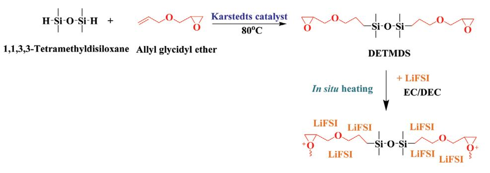

**Scheme 1.** Schematic reaction steps for the synthesis of PSEPEs.

**4DVANCED** SCIENCE NEWS

www.advancedsciencenews.com

#### 2.4. Assembly of the Symmetrical Swagelock Cell

The symmetrical Swagelock cell of in situ PSEPEs was assembled by a half cell with a structure of Li/in situ PSEPEs/LiFePO4. The precursor solution was added into a Teflon module in which a LiFePO4 chip was placed, ensuring that the LiFePO4 chip was covered by the precursor solution. The LiFePO4 and precursor solution were then polymerized at 60  $^{\circ}$ C for 12 h in an argon glove box and punched into a rounded chip with a diameter of 13 mm. The symmetrical Swagelock cell was prepared with the obtained PSEPEs/LiFePO4 and Li at RT in the glove box (Figure S5, Supporting Information).

### 2.5. Characterization

Proton nuclear magnetic resonance ( ${}^{1}$ H-NMR) spectra were confirmed on an AVANCE 400FT-NMR (Bruker, Germany) with a frequency of 400 MHz, using chloroform ( $CDCl3$ ) as a solvent, and tetramethylsilane (TMS) as an internal standard. FT-IR used a Nicolet iS5 FTIR Spectrometer (Waltham, US) over the range 4000–500 cm-1 with a spectral resolution of 4 cm-1 at RT. Thermogravimetric analysis (TGA) was measured via TGA-8000 (Perkin Elmer, USA) from 25 to 500  $^{\circ}$ C at a heating rate of 10  $^{\circ}$ C min-1 under a nitrogen flow rate of 50 mL min-1. DSC was conducted on Perkin-Elmer DSC 6000 (Waltham, MA, US) from -80 to 120 °C with a heating rate of 10 °C min-1 under a nitrogen atmosphere. The ionic conductivity of in situ polymer electrolytes was calculated from the EIS analysis data using an IM6ex, Zahner-Elektrik GmbH & Co. KG instrument (Kronach, Germany). EIS was recorded from 25 to 80 °C, and over a frequency range of 0.1 Hz to 1 MHz with an amplitude of 10 mV. The EIS spectra were fitted with an appropriate equivalent circuit model using Z-view software (version 3.1, Scribner Associates Inc., U.S.). The ionic conductivity ( $\sigma$ , S cm-1) was calculated using Equation 1

$$\sigma = L/(RA) \tag{1}$$

in which  $L$  is the thickness of the PESPE,  $A$  represents the effective contact area, and  $R$  is the bulk resistance value of PESPE. The lithium-ion transference number  $(t_{Li}^+)$  of PESPE was carried out by measuring the impedance of a symmetrical cell before and after polarization at RT, using the Bruce-Vincent-Evans Equation (Equation 2)

$$t_{\text{Li}}^{+} = I_{\text{s}} (\Delta V - I_{0} R_{0}) / I_{0} (\Delta V - I_{\text{s}} R_{\text{s}})$$
 (2)

where  $I_0$  and  $I_s$  are the initial and steady-state current, and  $R_0$ and  $R_s$  are denoted as the interfacial resistance between electrode and electrolyte of the symmetrical cell before and after polarization, respectively. The symmetrical cell was polarized at 10 mV ( $\Delta$ V). The electrochemical stability of the PESPE was measured by cyclic voltammetry (CV) using Ivium-n-Stat (Ivium Technologies B.V., Netherlands) with a potential range  $-1.5$  to 5 V at a scanning rate of 1 mV s-1. LSV were performed from  $-1.5$  to 7.0 V at a scanning rate of 0.1 mV s-1. Herein, lithium foil was used as the counter and reference electrode, and stainless steel was used as a working electrode. The  $Li/PSEPEs/LiFePO4$  cell was cycled between 2.4 and 3.8 V at RT

with a constant current using Ivium-n-Stat (Ivium Technologies B.V., Netherlands). The C rate was defined based on the active cathode material weight, which was about 12 mg  $\text{cm}^{-2}$ .

www.advmatinterfaces.de

FE-SEM image and EDS were recorded on JSM-6700F (JEOL, Japan) with an accelerating voltage of 15.0 kV. XRD was measured on D2 Phaser (Bruker, Germany) between 10° and 80°, with a speed rate of  $2^{\circ}$  min-1 at RT.

## 3. Results and Discussion

### 3.1. Characterization

DETMDS was synthesized via a platinum-catalyzed hydrosilylation reaction, which mechanism has been introduced by many research groups.[39-41] Herein, allyl glycidyl ether (AGE) was maintained at 120% of 1,1,3,3-tetramethyldisiloxane (TMDS) to give a complete reaction. Figure 1a shows the chemical structure of DETMDS that was confirmed by proton nuclear magnetic resonance (1H-NMR) spectra measurement. The characteristic peaks include Si-H (at 4.55 ppm) in TMDS and  $CH_2=CH_2$  (at (5.1–5.3) and 5.88 ppm) double bond in AGE, which is represented in Figure S1 in the Supporting Information, which was not observed in Figure 1a. In addition, all the resonance proton peaks of DETMDS have been marked clearly in the enlarged spectra, as follow[42]

1H-NMR (400 MHz, CDCl3,  $\delta$ ): 0.008 (s, 3H, Si–CH3) 0.43-0.47 (m, 2H, Si–CH2–C), 1.51-1.58 (m, 2H, Si–C–CH2), 2.55-2.57 (m, 1H, C–CHH–O),  $2.74-2.76$  (m, 1H, C–CHH–O),  $3.09-3.11$ (m, 1H, C–CH–C), 3.31-3.41 (m, 3H, C–CH2–O, O–CHH–C), 3.64-3.68 (dd,  $J = 11.6$ , 3.2 Hz, 1H, O–CH $H$ –C).

Fourier transform infrared spectroscopy (FT-IR) was also used to verify the chemical structures of TMDS, AGE, and synthesized DETMDS, as shown in Figure 1b. The intense absorption peaks at (2135, 1262, and 1074)  $cm^{-1}$  were attributed to the Si–H stretching, Si-CH3 bending, and Si-O-Si stretching vibration of TMDS, respectively.[43,44] The absorption peaks at (1647 and 1097) cm-1 were assigned to the  $C=C$  and  $C-O$  stretching vibrations of AGE, and the characteristic absorption peaks of epoxy ring breathing and bending can be observed at (1253 and 919) cm-1,[45,46] After the hydrosilylation reaction, the Si–H and  $C=C$  stretching disappeared in the spectra of DETMDS, while the finger-print peaks of Si-CH3, epoxy ring, and C-O bond were still present, proving that the TMDS was successfully combined with the AGE.

PSEPEs were fabricated by DETMDS and LiFSI via a facial in situ cationic ring-opening polymerization in various ratios, and **Figure 2**a,b shows the before and after curing pictures. Remarkably, LiFSI is not only employed as a lithium salt, but also as an initiator. As can be seen from Figure 2c, LiFSI is dissociated by ethylene carbonate/diethyl carbonate (EC/DEC) solvent into Li+ and FSI-, which combine with the impurity water that existed in monomer or lithium salt itself, generating acid initiator (H+FSIOH-). The cyclic epoxy monomer is then protonated by such acid initiator, and continually attacked by themselves, yielding ring-opening.[47,48] The number of repetitive attacks by cyclic epoxy monomer on protonated epoxy finally brings about cross-linking and polymerization.

FT-IR was utilized to determine the polymerization of DETMDS. In Figure 3a, the peak at 1780 cm-1 belonged

**www.advancedsciencenews.com**

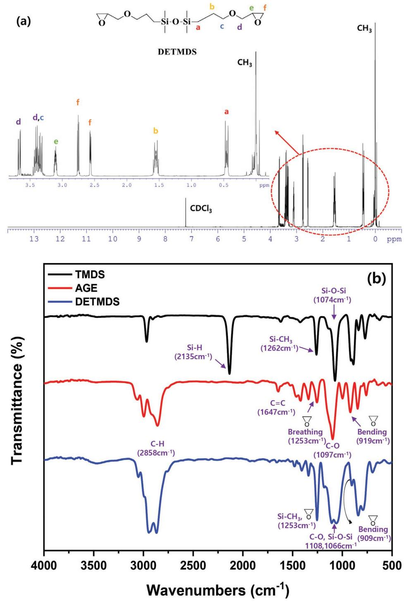

**Figure 1.** a) 1 H-NMR spectra of DETMDS, b) FT-IR spectra of TMDS, AGE, and DETMDS.

to the stretching vibration peak of CO in EC/DEC.[49] In the enlarged spectra graph, the spectrum of Si–CH3 overlays the epoxy breathing vibration at 1253 cm–1, which, after polymerization, was considerably weakened. Additionally, after ring-opening, epoxy bending at 909 cm–1 vanished, indicating the successful cationic ring-opening polymerization of DETMDS.

#### **3.2. Thermal Stability**

The thermal stability of electrolytes is a significant property for improving LIBs safety and performance. **Figure 4**a illustrates the thermo-gravimetric analysis (TGA) curves of DETMDS and in situ PSEPEs over the temperature range of 30–500 °C. DETMDS exhibited one-step weight degradation

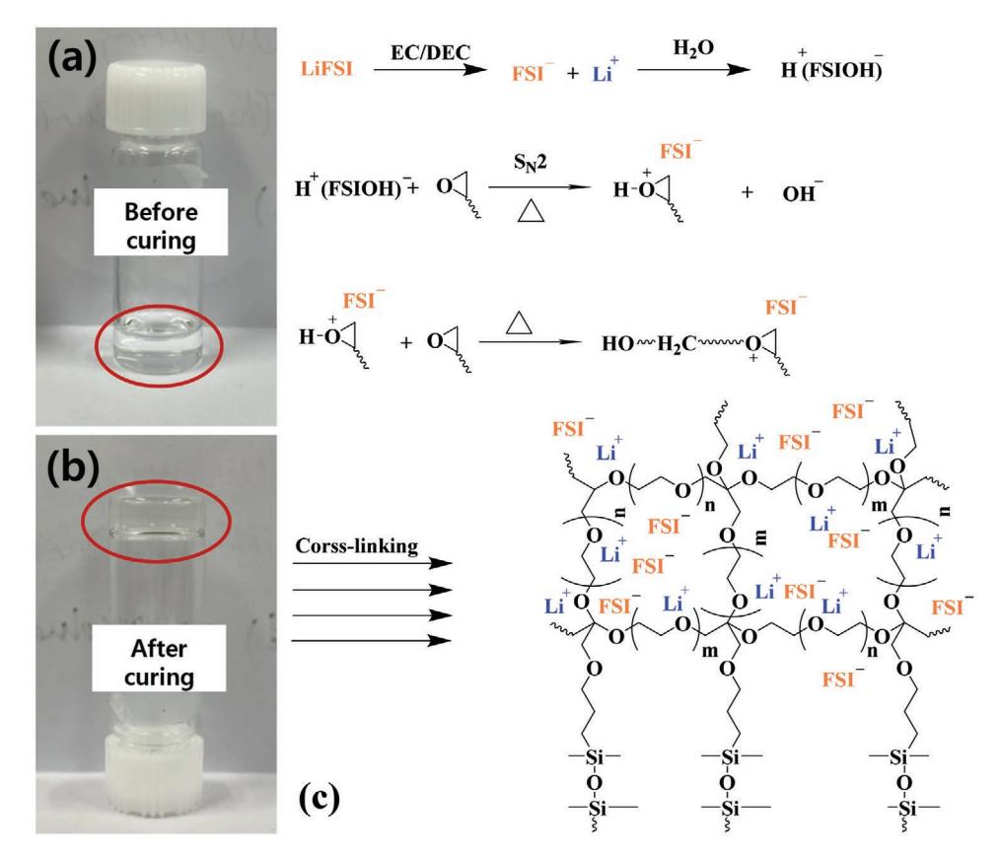

**Figure 2.** a) The image of PSEPEs precursor solution, b) The image of PSEPEs after cationic ring-opening polymerization, c) The mechanism of the LiFSI used as an initiator generate a cationic ring-opening polymerization based on DETMDS.

from 116 °C; on the other hand, in situ PSEPEs showed an initial 5% weight loss around 158 °C, which is much higher than the commercial liquid electrolyte (1 m LiPF6 in EC/DMC).[50] The above results imply that in situ polysiloxane-epoxy polymer electrolytes can offer promising thermal stability, which is satisfied with the normal operation range of −40 to 85 °C of LIBs.[51]

The glass transition temperature of DETMDS and in situ PSEPEs was measured by differential scanning calorimetry (DSC) from −80 to 120 °C. Figure 4b shows that DETMDS

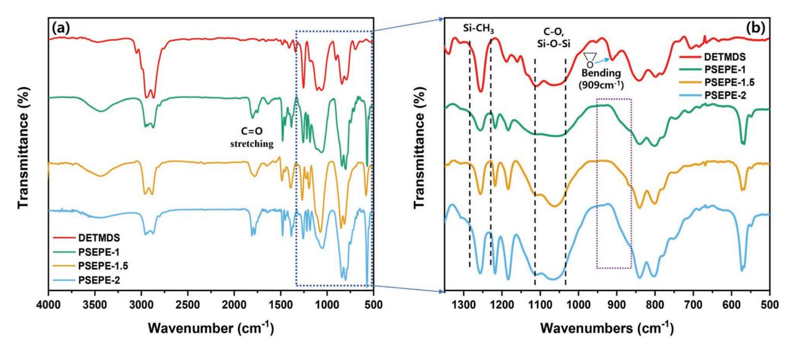

**Figure 3.** a) FTIR spectra of DETMDS and PSEPEs after ring-opening cationic polymerization. b) FTIR spectra of DETMDS and PSEPEs (from 1350 to 500 cm−1 wavenumber).

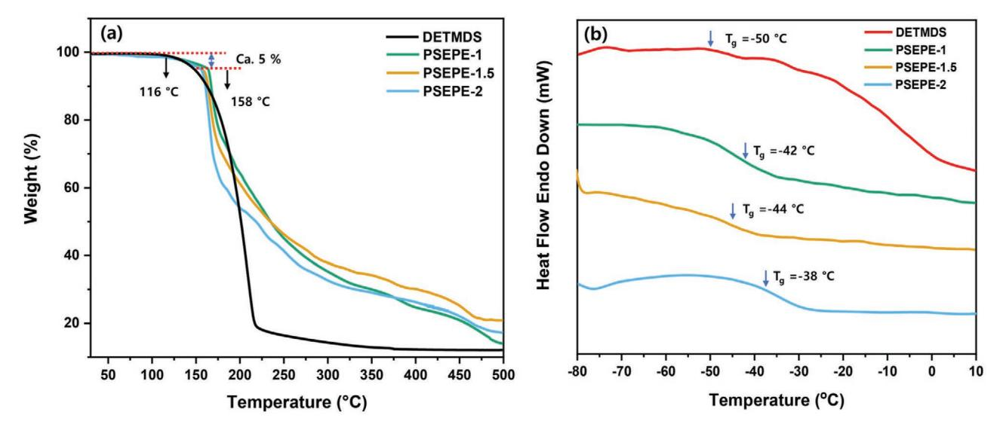

**Figure 4.** a) TGA curves of DETMDS and PSEPEs, b) DSC curves of DETMDS and PSEPEs.

presents an endothermic peak of *T*g at −50 °C, indicating that at this temperature, the rigid DETMDS transformed to a more flexible state. Moreover, the *T*g values were found to be ≈(−42, −44, and −38) °C for PSEPE–1, PSEPE–1.5, and PSEPE–2, respectively. The low *T*g values implied that the in situ PSEPEs could provide excellent chain flexibility and increased free volume for lithium-ion hopping during charging and discharging at atmospheric temperature, which is highly favorable to improve the ionic conductivity of the electrolyte.[52,53]

#### **3.3. Ionic Conductivity and Transference Number**

The temperature dependence of ionic conductivity for a series of PSEPEs has been calculated from electrochemical impedance spectroscopy (EIS) plots, and all the EIS results were fitted with an appropriate equivalent circuit model via Z-view (Figures S2 and S3, Supporting Information). The ionic conductivities of PSEPEs are present in **Figure 5**, and an increase in temperature-enhanced ionic conductivity in the temperature range of 25–80 °C can be observed from the graph. The typical values were in the range of 10–5–10–4 S cm–1 at 25–80 °C, which gradually increased with the rising temperature, due to the improved flexibility of the polymer segment at a higher temperature.[54] The ionic conductivity of PSEPE–1, PSEPE–1.5, and PSEPE–2 was 9.56 × 10–5, 1.16 × 10–4, and 2.11 × 10–5 S cm–1 at RT, respectively. The in situ PSEPEs revealed a higher ionic conductivity than ex-PSEPE–1.5 at all measurement range. This may be attributed to the excellent contact between the in situ PSEPEs electrolyte and electrodes, which can reduce the interfacial resistance, and improve the ionic conductivity of the in situ PSEPEs.[55] On the other hand, the ionic conductivity of PSEPE–1.5 is also higher than the other reported siloxane polymer electrolytes at RT (Table S1 if the Supporting Information). Furthermore, PSEPE–1.5 depicted the highest values, and this trend was extended to 80 °C (3.62 × 10−4 S cm–1), indicating the ionic conductivity of PSEPEs did indeed increase with the increase of lithium concentration. However, a high salt concentration in this system may lead to ion aggregation, and the siloxane-epoxy polymer matrix pores size could be reduced, resulting in a decrease in the ionic conductivity so that PSEPE–2 showed a lower value than PSEPE–1 and PSEPE–1.5.[56]

LIBs require a high lithium transference number (*t*Li+) (close to unity), which benefits the battery charging/discharging processes by reducing concentration gradients. The *t*Li+ followed the Bruce–Vincent equation using electrochemical impedance spectroscopy combined with a potential polarization and chronoamperometry at RT. **Figure 6** shows the chronoamperometry curve and the alternating current (AC) impedance before and after the polarization at 10 mV. The *t*Li+ for ex-PSEPE–1.5 was 0.14, and for PSEPE–1, PSEPE–1.5, and PSEPE–2, it was (0.59, 0.61, and 0.31), respectively. In situ polymer electrolytes showed at least twofold higher *t*Li+ than the ex situ one, while the result also implies that the ionic transport in the PSEPEs is mainly

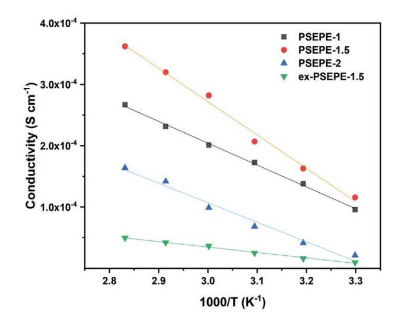

**Figure 5.** Ionic conductivity versus temperature plots of PSEPEs.

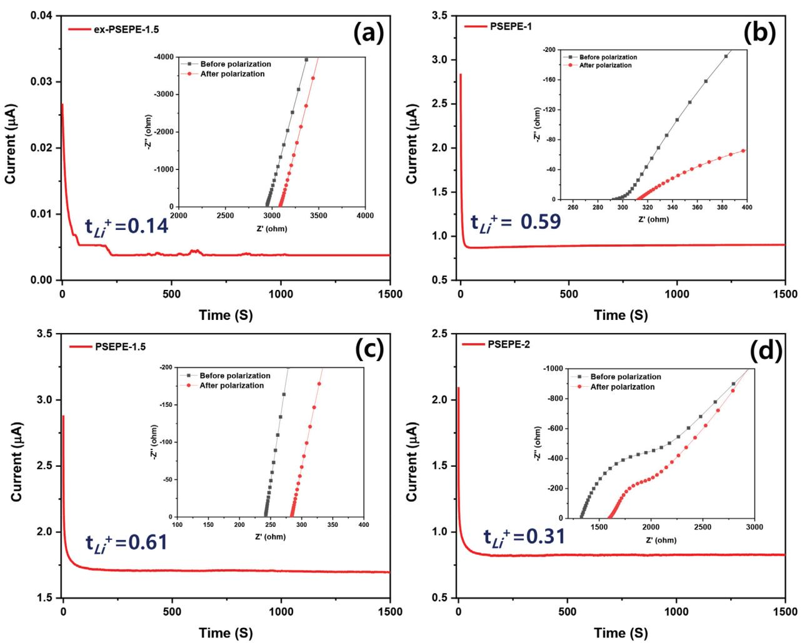

**Figure 6.** The chronoamperometry curve of the symmetrical Swagelock cell Li/ PSEPEs /Li at a polarization voltage of 10 mV, and in the inset shows the Nyquist plots of the cell before and after polarization for a) ex-PSEPE–1.5, b) PSEPE–1, c) PSEPE–1.5, and d) PSEPE–2, respectively, at room temperature.

carried out by the lithium cation rather than the counter anion, and so generates a high energy density.[57] The details of the *t*Li+ calculation can be found in Table S2 in the Supporting Information. Moreover, the *t*Li+ value of the in situ PESPEs is higher than many reported polymer electrolytes with similar structures (Table S1 in the Supporting Information).

### **3.4. FE-SEM and XRD**

To investigate the interfacial contact between the electrodes and in situ electrolyte, field emission-scanning electron microscopy (FE-SEM) analysis was carried out after fabricating an integrated cathode and in situ PSEPE–1.5. **Figure 7**a shows the transverse of the cell, in which the in situ electrolyte was in good contact with the LiFePO4; such promising interfacial contact was caused by the precursor electrolyte solution being able to wet the electrodes (like liquid electrolyte), leading to them fitting each other as much as possible. This close adherence between electrolyte and electrode was retained during the in situ polymerization. This FE-SEM result presents that in situ polymerization could relieve the interfacial contact issue between the ex situ polymer electrolyte and electrodes, which is beneficial to reducing the interface impedance, and improving the ionic conductivity of the polymer electrolyte. Moreover, the elemental composition of in situ PSEPE–1.5 was confirmed by energy dispersive X-ray spectroscopy (EDS), and Figure 7b depicts the analysis profile, identifying that the polymer electrolyte consisted of C, O, Si, N, F, and S elementals. The elemental mapping demonstrated in Figure 7c indicates the uniform distribution of LiFSI in the polymer matrix. Furthermore, Figure 7d shows the amorphous state of precursor solution and in situ PSEPE–1.5 that was verified by X-ray diffractometry (XRD). The precursor solution presented a big broad peak at around 16°, while after in situ polymerization, this peak was remarkably reduced. Also, there was no other peak over the entire measurement range, indicating that both precursor solution and in situ polymer electrolyte possessed an amorphous state.[58] As a result, the in situ PSEPEs can generate high ionic conductivity at RT due to the chain segmental motions being increased in the amorphous phase polymer matrix, which is beneficial for ion transport.[54,59]

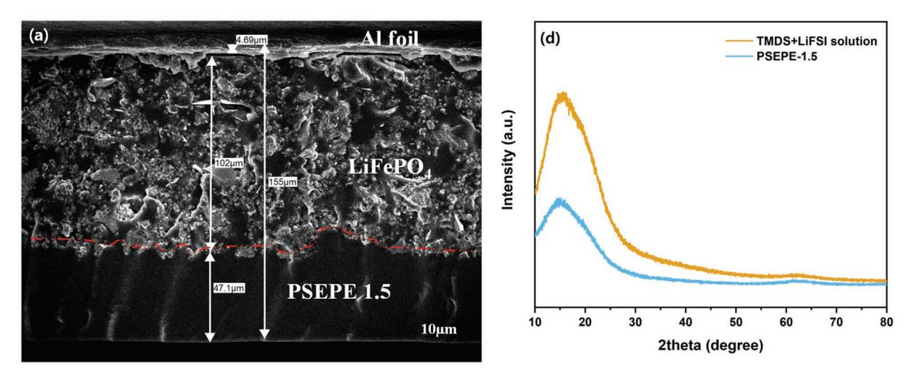

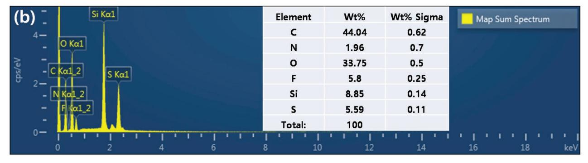

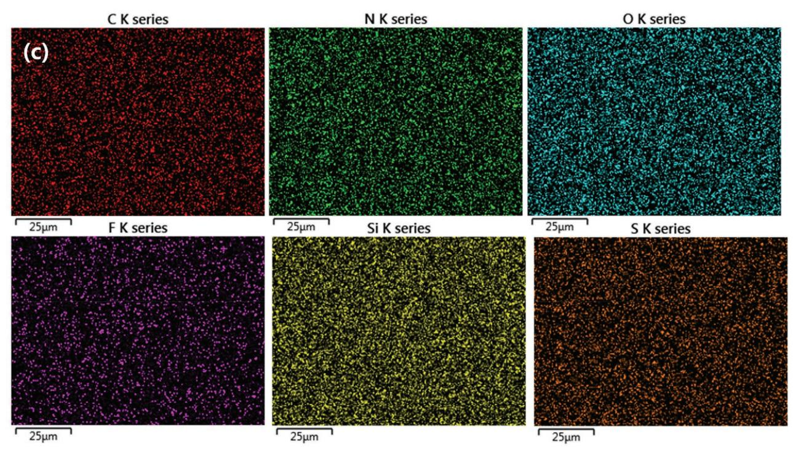

**Figure 7.** a) The cross-sectional FE-SEM images with an interface of the PSEPE–1.5 and LiFePO4, b) EDS analysis, c) elemental mapping of C, N, O, F, Si, and F of in situ PSEPE–1.5, d) XRD pattern of precursor solution and in-situ PSEPE–1.5.

**www.advancedsciencenews.com**

#### **3.5. Electrochemical Stability**

Linear sweep voltammogram (LSV) and cyclic voltammogram (CV) were leveraged to study the electrochemical stability of the PSEPE–1.5. LSV was carried out in the potential range −1.5 to 7.0 V (vs Li/Li+) at a scan rate of 0.1 mV s–1 at RT. **Figure 8**a shows that obvious oxidative decomposition was surveyed before 4.7 V, suggesting that the in situ polymer electrolyte PSEPE–1.5 was electrochemically stable up to 4.7 V (vs Li/Li+), and able to meet the common cathodes, such as LiFePO4 and LiCoO2. CV was investigated with a potential window from −1.5 to 5.0 V at a scan rate of 1 mV s–1 and RT. Figure 8b shows that the cathodic peak at 2.7 V and anodic peak at 1.5 V were assigned to lithium plating and stripping, respectively. Moreover, the CV curves were mostly overlapped with each other, indicating the good reversibility of the electrochemical reactions within the voltage range studied. In addition, the LSV and CV plots of PSEPE–1.5 are better than ex situ PSEPE–1.5 results (Figure S4 in the Supporting Information). Figure 8c,d depicts the charge and discharge curves and cycling performance of the Li/ PSEPE–1.5/ LiFePO4 symmetrical Swagelock cell with a constant current density of 0.2 C. The cell with PSEPE–1.5 presented an initial charge capacity of 126.8 mAh g–1 at 0.2 C, then after 10 and 30 cycles, dropped to 120.4 and 115.1 mAh g–1, respectively. Moreover, the reversible capacity of the 50th cycle was 111.2 mAh g–1. The charge and discharge platform demonstrate that the cell conducts a reversible electrochemical reaction, but with large voltage polarization. With

the Li stripping–plating, the Coulombic efficiency increased to 89.7% after 50 cycles, which is lower than the conventional liquid electrolyte, even though in this work, the interfacial resistance between electrolyte and electrodes has been dramatically reduced.[60] The charge and discharge results indicate that the Li/ PSEPE–1.5/ LiFePO4 based symmetrical Swagelock cell shows a reasonable cycling performance, which is an obstacle for the practical application of in situ PSEPEs.

### **4. Conclusions**

In this work, a siloxane–epoxy monomer was synthesized and used as a polymer matrix to fabricate a polymer electrolyte for LIBs. The polymerization was carried out by the in situ cationic ring-opening technique. The in situ polymerization offers the sample cell assembly process and good interfacial contact between electrodes and electrolyte, which are beneficial for reducing the interface impedance in cells, and increasing the ionic conductivity. LiFSI was not only utilized as a lithium salt but also as a cationic initiator, which could reduce the impurity in the polymer electrolyte, resulting in preserving the electrochemical stability of the LIBs. The in situ PSEPEs reveal good thermal stability until 158 °C and low *T*g values nearly −42 °C, which is beneficial to obtaining high ionic conductivity. Moreover, the 1.5 m LiFSI PSEPE shows satisfactory ionic conductivity of 1.16 × 10−4 S cm−1 and a good *t*Li+ of 0.61 at RT. LSV and CV results showed a wide electrochemical window

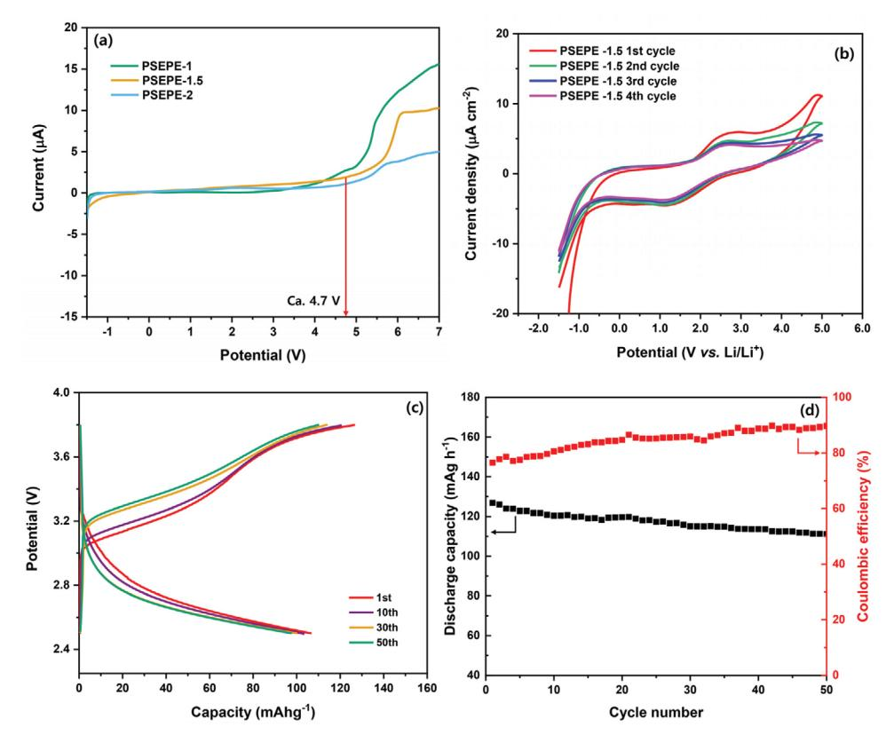

**Figure 8.** a) LSV plots of PSEPEs at room temperature with a scan rate of 0.1 mV s−1 , b) CV plots of PSEPE–1.5 at room temperature with a scan rate of 1 mV s−1 , c) CD plots, and d) cycling performance of the Graphite/PSEPE–1.5/LFP symmetrical Swagelock cell at 0.2C.

(>4.7 V vs Li/Li+) of PSEPE–1.5, and excellent compatibility with the lithium anode. Finally, the first charge capacity of the Li/ PSEPE–1.5/ LiFePO4 cell is 126.8 mAh g–1 with a Coulombic efficiency of 76.5% at 0.2 C. But due to practical limitations, this study cannot provide a full discussion of battery performance, which will be investigated in our further work. However, the above results still indicate that the in situ PSEPE–1.5 is a promising polymer electrolyte with low interfacial resistance, high ionic conductivity, and good thermal stability for the polymer electrolyte LIBs.

### **Supporting Information**

Supporting Information is available from the Wiley Online Library or from the author.

### **Acknowledgements**

This work was supported by the National Research Foundation of Korea (NRF) grant funded by the Korean government (MSIT) (NRF-2020R1G1A1102649) and (NRF-2020R1A2C1003200).

### **Conflict of Interest**

The authors declare no conflict of interest.

### **Data Availability Statement**

Research data are not shared.

### **Keywords**

cationic ring-opening, in situ polymerization, interface resistance between electrodes and electrolyte, lithium-ion batteries, polymer electrolytes

Received: October 9, 2021

- Revised: October 13, 2021
- Published online: December 5, 2021
- [1] H. Wang, L. Sheng, G. Yasin, L. Wang, H. Xu, X. He, *Energy Storage Mater.* **2020**, *33*, 188.
- [2] M. A. Hannan, M. S. H. Lipu, A. Hussain, A. Mohamed, *Renewable Sustainable Energy Rev.* **2017**, *78*, 834.
- [3] Q. Wang, B. Mao, S. I. Stoliarov, J. Sun, *Prog. Energy Combust. Sci.* **2019**, *73*, 95.
- [4] M. S. H. Lipu, M. A. Hannan, A. Hussain, M. M. Hoque, P. J. Ker, M. H. M. Saad, A. Ayob, *J. Cleaner Prod.* **2018**, *205*, 115.
- [5] X. Han, L. Lu, Y. Zheng, X. Feng, Z. Li, J. Li, M. Ouyang, *eTransportation* **2019**, *1*, 100005.
- [6] B. Pal, S. Yang, S. Ramesh, V. Thangadurai, R. Jose, *Nanoscale Adv.* **2019**, *1*, 3807.
- [7] K. Xu, *Chem. Rev.* **2004**, *104*, 4303.
- [8] X. Yu, A. Manthiram, *Energy Environ. Sci.* **2018**, *11*, 527.
- [9] M. Galiński, A. Lewandowski, I. Stepniak, *Electrochim. Acta* **2006**, *51*, 5567.
- [10] Q. Wang, L. Jiang, Y. Yu, J. Sun, *Nano Energy* **2019**, *55*, 93.

[11] L. A. Selis, J. M. Seminario, *RSC Adv.* **2018**, *8*, 5255.

- [12] D. Ren, X. Feng, L. Liu, H. Hsu, L. Lu, L. Wang, X. He, M. Ouyang, *Energy Storage Mater.* **2021**, *34*, 563.
- [13] C. Niu, M. Zhang, G. Chen, B. Cao, J. Shi, J. Du, Y. Chen, *Electrochim. Acta* **2018**, *283*, 349.
- [14] B. Zhou, M. Yang, C. Zuo, G. Chen, D. He, X. Zhou, C. Liu, X. Xie, Z. Xue, *ACS Macro Lett.* **2020**, *9*, 525.
- [15] X. Zhang, S. Wang, C. Xue, C. Xin, Y. Lin, Y. Shen, L. Li, C. W. Nan, *Adv. Mater.* **2019**, *31*, 1806082.
- [16] S. H. Kim, K. H. Choi, S. J. Cho, J. S. Park, K. Y. Cho, C. K. Lee, S. B. Lee, J. K. Shim, S. Y. Lee, *J. Mater. Chem. A* **2014**, *2*, 10854.
- [17] Q. Liu, Y. Liu, X. Jiao, Z. Song, M. Sadd, X. Xu, A. Matic, S. Xiong, J. Song, *Energy Storage Mater.* **2019**, *23*, 105.
- [18] W. Liu, S. W. Lee, D. Lin, F. Shi, S. Wang, A. D. Sendek, Y. Cui, *Nat. Energy* **2017**, *2*, 17035.
- [19] J. Bae, Y. Li, F. Zhao, X. Zhou, Y. Ding, G. Yu, *Energy Storage Mater.* **2018**, *15*, 46.
- [20] J. Zheng, Y. Y. Hu, *ACS Appl. Mater. Interfaces* **2018**, *10*, 4113.
- [21] Z. Qiu, C. Liu, J. Xin, Q. Wang, J. Wu, W. Wang, J. Zhou, Y. Liu, B. Guo, S. Shi, *ACS Sustainable Chem. Eng.* **2019**, *7*, 9875.
- [22] S. Huang, Z. Cui, L. Qiao, G. Xu, J. Zhang, K. Tang, X. Liu, Q. Wang, X. Zhou, B. Zhang, G. Cui, *Electrochim. Acta* **2019**, *299*, 820.
- [23] G. Zhou, X. Lin, J. Liu, J. Yu, J. Wu, H. M. Law, Z. Wang, F. Ciucci, *Energy Storage Mater.* **2020**, *34*, 629.
- [24] M. Zaheer, H. Xu, B. Wang, L. Li, Y. Deng, *J. Electrochem. Soc.* **2020**, *167*, 070504.
- [25] L. Chen, J. Fu, Q. Lu, L. Shi, M. Li, L. Dong, Y. Xu, R. Jia, *Chem. Eng. J.* **2019**, *378*, 122245.
- [26] S. Park, L. J. Kilgallon, Z. Yang, D. Y. Ryu, C. Y. Ryu, *Macromolecules* **2019**, *52*, 1158.
- [27] J. V. Crivello, *Radiat. Phys. Chem.* **2002**, *63*, 21.
- [28] J. V. Crivello, J. L. Lee, *Polym. J.* **1985**, *17*, 73.
- [29] J. L. Stanford, A. J. Ryan, Y. Yang, *Polym. Int.* **2001**, *50*, 1035.
- [30] J. V. Crivello, *J. Polym. Sci.* **1999**, *37*, 4241.
- [31] J. R. Nair, I. Shaji, N. Ehteshami, A. Thum, D. i. Diddens, A. Heuer, M. Winter, *Chem. Mater.* **2019**, *31*, 3118.
- [32] D. Zhou, Y. B. He, Q. Cai, X. Qin, B. Li, H. Du, Q. H. Yang, F. Kang, *J. Mater. Chem. A* **2014**, *2*, 20059.
- [33] S. Lee, S. J. Harris, M. M. Doeff, H. Zheng, *Energy Environ. Sci.* **2020**, *13*, 1832.
- [34] P. Cheng, H. Zhang, Q. Ma, W. Feng, H. Yu, X. Huang, M. Armand, Z. Zhou, *Electrochim. Acta* **2020**, *363*, 137198.
- [35] H. Cheng, J. Zhu, H. Jin, C. Gao, H. Liu, N. Cai, Y. Liu, P. Zhang, M. Wang, *Mater. Today Energy* **2020**, *20*, 100623.
- [36] J. H. Hong, J. W. Kim, S. Kumar, B. Kim, J. Jang, H. J. Kim, J. Lee, J. S. Lee, *J. Power Sources* **2020**, *450*, 227690.
- [37] Q. Wang, H. Zhang, Z. Cui, Q. Zhou, X. Shangguan, S. Tian, X. Zhou, G. Cui, *Energy Storage Mater.* **2019**, *23*, 466.
- [38] T. Zhao, R. Yu, X. Li, Y. Zhang, X. Yang, X. Zhao, W. Huang, *J. Mater. Sci.* **2019**, *54*, 5101.
- [39] K. Itami, K. Mitsudo, A. Nishino, J. Yoshida, *J. Org. Chem.* **2002**, *67*, 2645.
- [40] S. E. Denmark, Z. Wang, *Org. Lett.* **2001**, *3*, 1073.
- [41] P. B. Kettler, *Org. Process Res. Dev.* **2003**, *7*, 342.
- [42] N. A. A. Rossi, Z. Zhang, Y. Schneider, K. Morcom, L. J. Lyons, Q. Wang, K. Amine, R. West, *Chem. Mater.* **2006**, *18*, 1289.
- [43] R. Rohan, K. Pareek, Z. Chen, W. Cai, Y. Zhang, G. Xu, Z. Gao, H. Cheng, *J. Mater. Chem. A* **2015**, *3*, 20267.
- [44] Y. Niu, H. Lu, D. Wang, Y. Yue, S. Feng, *J. Organomet. Chem.* **2011**, *696*, 544.
- [45] A. Manakhov, Š. Fuková, D. Nečas, M. Michlíček, S. Ershov, M. Eliaš, M. Visotin, Z. Popov, L. Zajíčková, *Phys. Chem. Chem. Phys.* **2018**, *20*, 20070.
- [46] H. Duan, Y. X. Yin, X. X. Zeng, J. Y. Li, J. L. Shi, Y. Shi, R. Wen, Y. G. Guo, L. J. Wan, *Energy Storage Mater.* **2018**, *10*, 85.

**www.advancedsciencenews.com**

- [47] U. Bulut, J. V. Crivello, *J. Polym. Sci., Part A: Polym. Chem.* **2005**, *43*, 3205.
- [48] A. E. Porritt, *Med. Press* **1951**, *225*, 460.
- [49] N. Peruzzi, B. W. Ninham, P. Lo Nostro, P. Baglioni, *J. Phys. Chem. B* **2012**, *116*, 14398.
- [50] L. Jin, F. Ahmed, T. Ryu, S. Yoon, W. Zhang, Y. Lee, D. Kim, H. Jang, W. Kim, *Membranes (Basel)* **2019**, *9*, 139.
- [51] F. Ahmed, M. M. Rahman, S. C. Sutradhar, N. S. Lopa, T. Ryu, S. Yoon, I. Choi, Y. Lee, W. Kim, *Electrochim. Acta* **2019**, *302*, 161.
- [52] D. Zhang, L. Zhang, K. Yang, H. Wang, C. Yu, D. Xu, B. Xu, L.-M. Wang, *ACS Appl. Mater. Interfaces* **2017**, *9*, 36886.
- [53] A. Shrivastava, in *Introduction to Plastics Engineering*, William Andrew, New York **2018**, pp. 1–16.

- [54] L. Yue, J. Ma, J. Zhang, J. Zhao, S. Dong, Z. Liu, G. Cui, L. Chen, *Energy Storage Mater.* **2016**, *5*, 139.
- [55] B. Huang, Y. Zhang, M. Que, Y. Xiao, Y. Jiang, K. Yuan, Y. Chen, *RSC Adv.* **2017**, *7*, 54391.
- [56] Y. H. Song, T. Kim, U. H. Choi, *Chem. Mater.* **2020**, *32*, 3879.
- [57] L. Ye, Z. Feng, in *Polym. Electrolytes Fundam. Appl.*, Woodhead, Sawston **2010**, p. 14.
- [58] B. D. Cullity, *Elements of X-Ray Diffraction*, Addison-Wesley, Boston **1978**.
- [59] Z. Xue, D. He, X. Xie, *J. Mater. Chem. A* **2015**, *3*, 19218.
- [60] H. Shobukawa, J. Alvarado, Y. Yang, Y. S. Meng, *J. Power Sources* **2017**, *359*, 173.