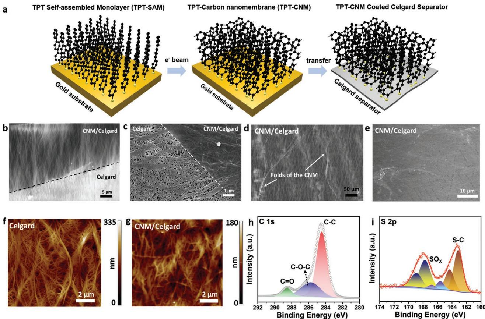
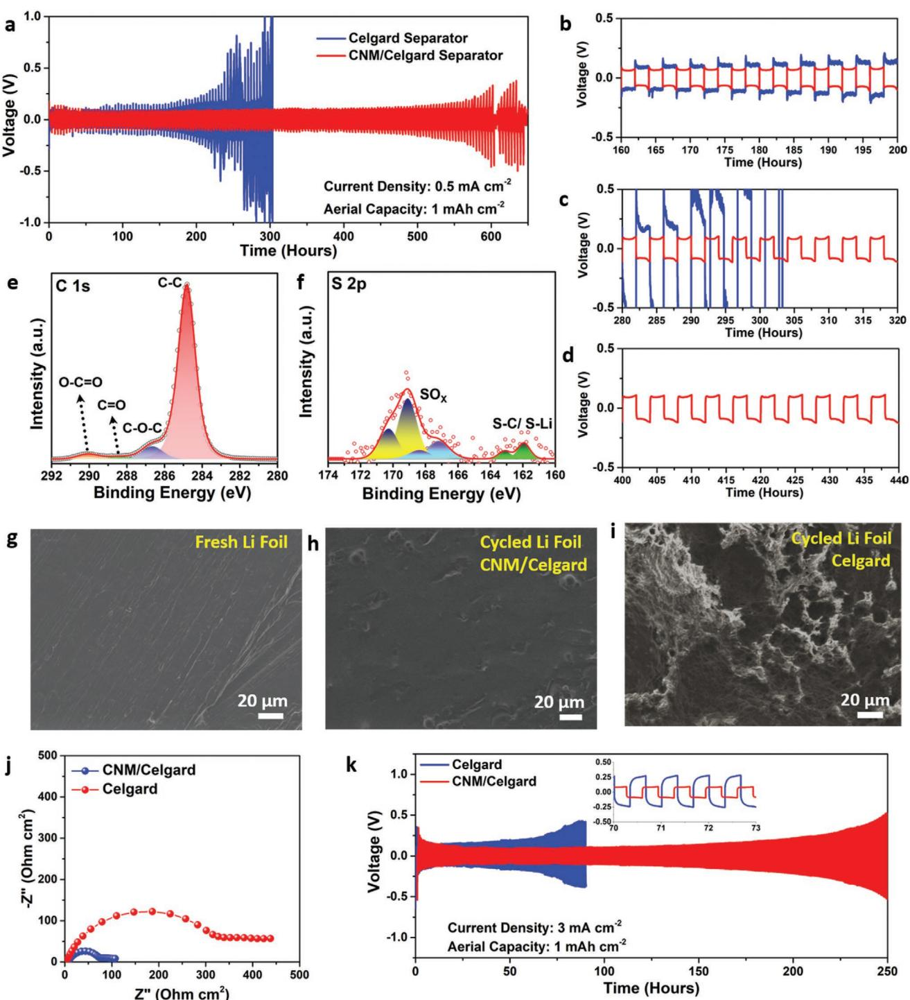
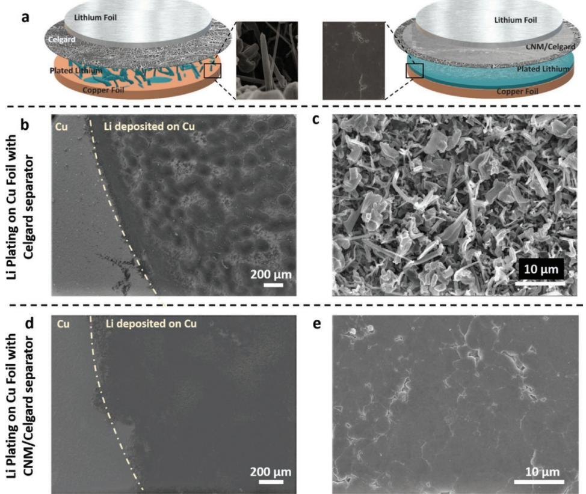
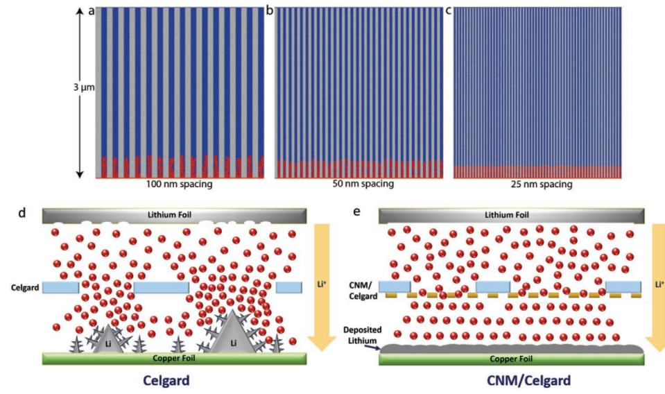
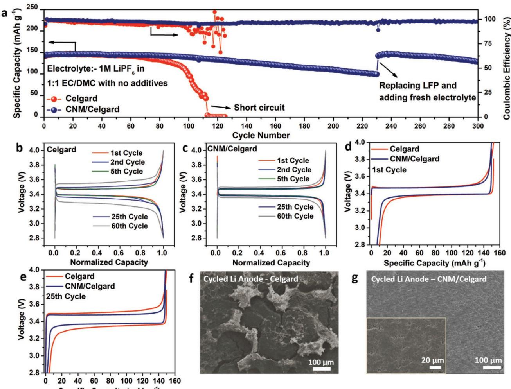

## **Inhibition of Lithium Dendrite Formation in Lithium Metal Batteries via Regulated Cation Transport through Ultrathin Sub-Nanometer Porous Carbon Nanomembranes**

*Sathish Rajendran, Zian Tang, Antony George, Andrew Cannon, Christof Neumann, Abdulrazzag Sawas, Emily Ryan, Andrey Turchanin,\* and Leela Mohana Reddy Arava\**

**Suppressing Li dendrite growth has gained research interest due to the high theoretical capacity of Li metal anodes. Traditional Celgard membranes which are currently used in Li metal batteries fall short in achieving uniform Li flux at the electrode/electrolyte interface due to their inherent irregular pore sizes. Here, the use of an ultrathin (≈1.2 nm) carbon nanomembrane (CNM) which contains sub-nanometer sized pores as an interlayer to regulate the mass transport of Li-ions is demonstrated. Symmetrical cell analysis reveals that the cell with CNM interlayer cycles over 2x longer than the control experiment without the formation of Li dendrites. Further investigation on the Li plating morphology on Cu foil reveals highly dense deposits of Li metal using a standard carbonate electrolyte. A smoothed-particle hydrodynamics simulation of the mass transport at the anode–electrolyte interface elucidates the effect of the CNM in promoting the formation of highly dense Li deposits and inhibiting the formation of dendrites. A lithium metal battery fabricated using the LiFePO4 cathode exhibits a stable, flat voltage profile with low polarization for over 300 cycles indicating the effect of regulated mass transport.**

S. Rajendran, A. Sawas, Prof. L. M. R. Arava Department of Mechanical Engineering Wayne State University Detroit, MI 48202, USA E-mail: leela.arava@wayne.edu Dr. Z. Tang, Dr. A. George, Dr. C. Neumann, Prof. A. Turchanin Institute of Physical Chemistry Friedrich Schiller University Jena 07743 Jena, Germany E-mail: andrey.turchanin@uni-jena.de A. Cannon, Prof. E. Ryan Department of Mechanical Engineering Boston University Boston, MA 02215, USA Prof. A. Turchanin Center for Energy and Environmental Chemistry Jena (CEEC Jena) 07743 Jena, Germany

The ORCID identification number(s) for the author(s) of this article can be found under https://doi.org/10.1002/aenm.202100666.

© 2021 The Authors. Advanced Energy Materials published by Wiley-VCH GmbH. This is an open access article under the terms of the Creative Commons Attribution License, which permits use, distribution and reproduction in any medium, provided the original work is properly cited.

#### **DOI: 10.1002/aenm.202100666**

## **1. Introduction**

High demand for lithium-ion batteries (LIBs) in portable electronics, grid energy storage, and electric vehicles has spurred research on the next generation of batteries with very high energy densities. This huge demand highlights an urgent need for alternate electrode materials with ultra-high capacities. The Li metal anode possesses the highest theoretical capacity of 3860 mAh g−1 and a very low reduction potential (−3.04 V vs standard hydrogen electrode).[1] In addition to the multiple advantages, use of Li metal anodes enables the use of high energy unlithiated cathodes such as sulfur, oxygen, etc.[2] Hence, employing lithium metal batteries (LMBs) could provide sufficient energy storage to meet the needs of the future. Although LMBs possess many advantages, their applications have been hindered by two major challenges: i) mechanical insta-

bility caused by the propagation of Li dendrites[3] and ii) chemical instability due to the very high reactivity of the metallic Li.[4] The use of metallic Li anodes leads to Li dendrites (mossy deposits of Li) because of the absence of spatial control over Li nucleation that further causes infinite volume expansion.[5] Such dendritic formations penetrate the separator resulting in the mechanical failure of the separator, and reach the cathode leading to short circuiting of the cell. Apart from thermal runaway, short circuits pose a potential fire hazard to battery, which may result in explosion due to the use of organic solvents in the electrolyte.[6] Other issues arise due to the very high reactivity of metallic Li with the electrolyte to form a solid-electrolyte interface (SEI) layer. Dendrite formation further increases the surface area of the metallic Li, which accelerates the chemical reactivity of Li with the electrolyte and offers high resistance for Li+ transport that results in increased polarization of the cell. Conventional LIBs overcome these issues by using a conductive carbon host to accommodate the Li ions. However, the theoretical capacity (372 mAh g−1 ) of such systems is very low to meet the energy demand of the future. Also, only a very small potential gap exists between the insertion of Li into the carbon host and the plating of Li onto the carbon, which may be disrupted during overcharging or fast charging of conventional LIBs.

Several strategies have been used to overcome the abovementioned issues of LMBs by employing: i) Li-alloy anode,[7] ii) solid-state electrolytes,[8] iii) structured anodes,[9] iv) artificial SEI,[10] v) electrolyte additives,[11] vi) interface modifications,[12] etc. Li-alloy anode undergo drastic volume changes that prevents the long-term cyclability of the battery. Solid-state electrolytes, such as polymer and ceramic electrolytes, possess very high mechanical strength and shear strength greater than that of metallic Li,[13] however, recent findings prove that they are ineffective because of the propagation of Li dendrites at a very low current density. It has also been observed that solid state electrolytes possess very low ionic conductivity at room temperature.[14] Structured electrodes with novel nanomaterialsbased designs were reported, however, resulted in the drastic reduction in the volumetric energy density.[15] Various other approaches by using additives,[5,11a,16] ionic liquid-based electrolytes,[17] incorporating interfacial materials,[12,18] etc., have been proposed for the development of LMBs. Although most of these chemical approaches show that the incorporation of electrolyte additives suppresses further growth of the formed Li dendrites/nuclei, they miss the understanding of the fundamental mechanism of dendrite formation. Also, the electrolyte in an LMB gets consumed while cycling and the effect of electrolyte additives becomes less prominent.

Separator acts as a barrier against electron tunneling between the electrodes and simultaneously facilitates the ionic transport. In an LMB, the separator is a very important component as it affects the mass transport (diffusion) of Li ions across the electrodes, which in-order influences the Li dendrite growth.[19] However, there has not been considerable attention to the role of separators in Li dendrite growth.[20] State-of-the art polyolefin separators are widely used but possess wide range of pore sizes that are larger than the size of the dendritic Li filament. Further, it also creates an inhomogenous Li ion flow pattern resulting in nonuniform flux that aids in the rapid formation of dendrites.[21] Previous works on separators to suppress Li dendrites were heavily focused on modifying conventional separators with materials like graphene,[12a] h-BN,[22] polymer,[23] organic molecules,[12b] ceramics,[12c,24] etc. However, such material coatings are highly polycrystalline with grain boundaries, which are mechanically weakened points that may eventually assist the propagation of Li dendrites.[22,25] An ideal separator must be designed to regulate the cation (Li) transport that creates uniform Li flux, which prevents the formation of Li nuclei with thermodynamic radii higher than the critical thermodynamic radius.[26] It has been suggested through computational simulations and experimental results that the Li-ion mass transport can be regulated by reducing the pore size of the cation transport channels.[27] However, reducing the pore size and maintaining the separator thickness involves compromising on the wetting properties, which would increase the impedance to the flow of Li ions. Hence, to overcome these issues, we hypothesize that the mass transport of Li ion can be regulated by introducing an ultrathin film with very small pore size at the electrode/separator interface.

Herein, we report the application of a 2D carbon nanomembrane (CNM)[28] of thickness 1.2 nm with sub-nanometer porous ion conducting channels (average pore size ≈0.7 nm, pore density of 1014 cm−2 ),[28b,29] that regulates Li-ion mass transport at the electrode-electrolyte interface to suppress the dendrite formation. The CNM is obtained by cross-linking self-assembled monolayer (SAM) of 1,1′:4′,1″-terphenyl-4-thiol (TPT) molecules using electron irradiation and it is completely different from traditional carbons that are electrically conducting in nature. To the best of the authors' knowledge, employing such a subnanometer porous membrane is the first of its kind application in LMBs. Previous study on ion permeation through CNMs shows the possibility of the Li ion permeation through the subnanometer ion conducting channels.[30] In this work, the CNM is transferred onto commercial Celgard 2325 tri-layer separator using advanced techniques that prevent any damage to the CNM layer. A systematic investigation of the role of CNMs in LMBs has been elucidated through microscopic, spectroscopic, electrochemical, and computational modeling studies. The tailored properties of CNM like sub-nanometer sized pore with very high pore density, ultra-thin, electrically insulating, and very high mechanical strength (Young's modulus ≈10 GPa)[28a] aid in the homogenous deposition and dissolution of Li metal through a regulated mass transport mechanism. Further, the synthesis and transfer of CNM to the Celgard separator is scalable to a large scale that promises better performing batteries of all form factors.

## **2. Results and Discussion**

#### **2.1. Synthesis, Transfer, and Characterization of CNM**

The CNM was synthesized and transferred to the commercial Celgard separator through a series of steps as represented in **Figure 1**a. The first step involves the self-assembly of aromatic TPT (Figure S1, Supporting Information) into a SAM on an Au/ SiO2 substrate. In the next step, the formed SAM was crosslinked using electron irradiation to obtain a layer of CNM on the Au/SiO2 substrate.[28] The formed CNM was well studied previously using advanced characterization techniques and they possess a large number (≈1014 cm−2 ) of sub-nanometer sized pores (diameter ≈0.7 nm) that are essentially the molecular separation between constituent molecules of the CNM.[28b,30,31] The final step involves transferring the formed CNM layer onto the Celgard membrane separator through electrochemical delamination-assisted transfer.[32] The CNM was transferred such that the side with thiol functional groups faces the Celgard separator. The Celgard separator with the CNM is hereafter named CNM/Celgard. In Figure 1b–e, scanning electron microscopic (SEM)/field-emission SEM (FE-SEM) characterizations of CNM/Celgard are shown. Although there were cuts observed on the edges of the CNM layer (Figure 1b), the rest of the interior area was found to be highly uniform without any presence of defects/holes. The Celgard membrane (Figure 1c and Figure S2, Supporting Information) was found to consist of a wide range of pores, ranging from a few hundreds of nanometers to microns through which the Li dendrites can easily propagate. The areas covered with the CNM layer shows typical folds/ wrinkles of the CNM layer (Figure 1d) that are formed during the transfer procedure. It is also evident that the CNM layer efficiently masks the Celgard membrane uniformly without any discontinuities (Figure 1e). The atomic force microscopy (AFM) imaging reveals the crisp and sharp profiles obtained

**Figure 1.** a) Schematic representation of the synthesis and transfer process of the CNM onto the Celgard separators, b–e) FE-SEM images of the CNM-coated Celgard separator (CNM/Celgard), AFM height maps of f) Celgard and g) CNM/Celgard separators, and XP spectra of h) C 1s and i) S 2p of CNM/Celgard separator.

when the AFM tip taps through the interior of the Celgard membrane (Figure 1f and Figure S3, Supporting Information), whereas the image corresponding to the CNM/Celgard shows a blurred image with only the surface features that are obtained when the AFM tip cannot reach the interior surface due to the presence of the CNM layer (Figure 1g). The scale bar of the AFM images shown in Figure 1f,g and the height profile (Figure S3c, Supporting Information) depict the difference in the penetration depth of the tip with and without the CNM. The number of peaks and troughs in the Celgard height profile is higher than CNM/ Celgard. This is because of the sharp profiles obtained when the AFM tip taps through the pores of the Celgard membrane. On the other hand, the tip cannot tap through the pores of the CNM/Celgard separator due to the presence of the CNM layer on top; hence, resulting in smoother height profile with a smaller number of peaks and troughs. Hence, it is evident through the characterizations that the CNM is highly uniform over the Celgard membrane without any mechanical defects that may lead to nonhomogenous deposition. X-ray photoelectron spectroscopy (XPS) analysis was performed on the pristine Celgard separator and the CNM/Celgard. As shown in Figure S4 in the Supporting Information, the C 1s spectrum of the pristine Celgard separator shows a single peak corresponding to the CC bonds present in polypropylene and there is no S 2p signal due to the absence of any functional groups that contain sulfur in the pristine Celgard. The C 1s spectrum of the CNM/Celgard exhibits

peaks with different binding energies (Figure 1h). The peaks at 285.7 and 288.5 eV corresponding to the COC and CO bonds are obtained due to a small quantity of residual polymethyl methacrylate (PMMA) on the CNM and the CS bond of the CNM. The shift in the CC peaks toward lower binding energy (284.8 to 284.5 eV) is caused due to the additional signal from the cross-linked aromatic units of the CNM. Apart from the C 1s peak, the CNM/Celgard shows a significant S 2p peak corresponding to the thiol group present in the CNM. As shown in Figure 1i, the core level sulfur spectrum (S 2p) shows a spin– orbit doublet of S 2p3/2 and S 2p1/2 peaks at 163.1 and 164.3 eV, respectively.[33] Such features clearly confirm the successful transfer of the CNM layer onto the Celgard Separator. The peaks with the S 2p3/2 components at 165.6 eV and 167.7 eV correspond to different SOx species which arise from the unwanted oxidation of sulfur in the CNM while transferring onto the Celgard separator. This is in accordance with the previously reported results from electrochemical transfer of TPT-CNMs.[32]

#### **2.2. Evaluation of Separator Wettability and Transference Number**

The wettability of the separators was studied by dropping a drop of the 1 m LiPF6 in 1:1 ethylene carbonate (EC)/dimethyl carbonate (DMC) electrolyte onto the separator, as shown in Figure S5 and Videos S1 and S2 (multimedia file) in the

Supporting Information. As observed in the case of Celgard, the electrolyte forms a hemispherical droplet (Figure S5b, Supporting Information) on the top of the separator and remains almost the same even after 3 s (Figure S5d, Supporting Information, 300 ms). When the same amount of electrolyte is dropped on the CNM/Celgard separator, the droplet spontaneously gets absorbed on the separator (Figure S5f, Supporting Information). With time, the absorbed droplet spreads evenly in all directions (Figure S5h, Supporting Information). The observed phenomenon is due to the creation of a nanoconfinement and capillary effect caused by the ultra-small pores that boosts the transport of electrolyte across the separator and also a minimal contribution from the polarity of the CNM/Celgard separator due to the presence of thiol functional groups.[34]

The Li-ion transference number was evaluated for both separators using 1 m LiPF6 in 1:1 EC/DMC electrolyte, as shown in Figure S6 in the Supporting Information. The transference number was found to be 0.38 for the cell with Celgard separator, which matched with the reported literature values.[35] The Li-ion transference number for the cell with CNM/Celgard separator was 0.67, which is comparatively higher than the value obtained for the Celgard separator. The reason behind this can be explained to the relatively larger size of the PF6 − anion (ionic diameter 0.508 nm),[36] and the electrostatic repulsion between the lone pair of electrons presents in the thiol functional group of the CNM and the PF6 − anion.[37] Thus, the CNM/Celgard separator was found to be Li+ selective that partially blocked the transport of anions. The ion selective property mitigates unwanted side reactions taking place due to the transport of anions and minimize the polarization.[38] Transference number can also be correlated with dendrite propagation through Sand's equation[39]

$$
t_{\rm sand} = \pi D_{\rm app} \frac{(z_0 c_0 F)^2}{4 (J t_a)^2}
$$
 (1)

where *t*sand is the time for dendrite nucleation, *D*app is the ambipolar diffusion coefficient, *z*0 is the charge number of the cation, *c*0 is the bulk salt concentration, *F* is the Faraday constant, *J* is the current density and *t*a is the transference number of the anion. As evident from the equation, onset of dendrite nucleation can be delayed by reducing the transference number of the anion.

#### **2.3. Symmetrical Cell Analysis**

Symmetrical cells made using a single layer of CNM on both sides of the Celgard separator were used for testing their ability to suppress Li dendrite formation. A standard carbonate electrolyte composition of 1 m LiPF6 in 1:1 EC/DMC, commonly used in most LIBs, without any additives was used for this study. Identical cells with the Celgard separator were made for the control experiment. Long-term Li plating/stripping experiments were carried out at constant current with a time limitation at an aerial capacity of 1 mAh cm−2 and current density of 0.5 mA cm−2 , as shown in **Figure 2**a. The symmetrical cell using the Celgard separator exhibited an overpotential of 67 mV during the initial cycles and drastically increased to 150 mV and 1.1 V after 200 and 300 h of cycling, respectively, after which the cell shorted just after 300 h (Figure 2b,c). The increase in polarization is due to the very high consumption of the electrolyte from the increase in surface area of the Li metal by the formation of Li dendrites (mossy deposits). On the other hand, the CNM/Celgard cell exhibited almost stable cycling for over 600 h that indicates effective dendrite suppression when compared to the cell with the Celgard separator. A constant polarization of 72 mV during the initial cycles was obtained, which increases at a very slow rate to 89 and 112 mV after 200 and 500 h, respectively (Figure 2b–d). The polarization pattern of both cells in a single plating/stripping profile was found to increase initially, followed by a stable plateau, and then further increases in the tail end of the profile. This trend is due to the presence of different energy barriers in the plating/stripping process.[40] Initial increase in polarization is due to the energy barrier for Li nucleation on the Li foil that is being plated. It is followed by a stable plateau that corresponds to the stable Li plating process after the initial nucleation. In the end, there exists a Li stripping barrier when the plated Li that is being stripped is fully consumed and further stripping would require the source of the Li reservoir. As observed from Figure 2b–d, the increase in polarization in the CNM/Celgard profile was very less when compared to the increase in polarization in the Celgard profile. This infers that the energy barrier in the cell with Celgard separator is much higher than the energy barrier present in the cell with CNM/Celgard separator. This can be attributed to the uniform Li plating/stripping that aids in the formation of a uniform SEI with a low energy barrier. Further the increase in polarization is also stable over the cycles, which represents the reversibility of the uniform Li plating/stripping process using the CNM/ Celgard separator. The polarization voltage was also found to differ between the plating and stripping process, which can be attributed to the slight variation in the energy barrier on one of the electrodes that is active in the plating process. This subtle difference arises due to the nonidentical surface microstructure changes taking place in either of the Li foil that results in the variation of the energy barrier in one of the electrodes that in turn results in the nonmatching polarization.

After the cycling experiment, the CNM/Celgard separator was removed from the symmetric cell and was rinsed in DMC solvent before analyzing it through XPS. The peaks corresponding to the residual PMMA were found to decrease and there was an additional peak at 290.2 eV corresponding to the carbonate species that could be from the electrolyte or the DMC solvent that was used to rinse the separator before the XPS analysis (Figure 2e). As seen from Figure 2f, after cycling, the S 2p3/2 peak intensity attributed to CS and oxidized sulfur bonds decreased due to the attenuation of the XPS signal by residuals from the electrolyte. Furthermore, the S 2p3/2 peak at lower binding energies shifts downward to 161.9 eV. This shift is caused by the presence of LiS bond formation during cycling.[41]

Figure 2g–i shows the comparison of the FE-SEM images of the Li foil before and after cycling with the Celgard and the CNM/Celgard separator. Fresh Li foil before cycling shows a highly smooth morphology with minor surface corrugations that arise from the surface polishing of the lithium foil to remove the

**Figure 2.** a) Galvanostatic Li plating/stripping of symmetrical cells, b–d) Zoomed voltage profile at different time intervals. e) C 1s and f) S 2p XP spectra of cycled CNM/Celgard separator. g–i) FE-SEM images of Li foils g) fresh, h) after cycling with CNM/Celgard separator, and i) after cycling with Celgard separator. j) EIS of the assembled Li–Li symmetrical cells, and k) galvanostatic Li plating/stripping of symmetrical cells at 3 mA cm−2.

surface contaminants (Figure 2g). The cycled Li foil with CNM/ Celgard separator (Figure 2h) was not as smooth as the fresh Li foil but was found to be uniform without any dendritic structures. Few corrugations and pits were observed with smooth edges, showing the effective suppression of Li dendrites. On the other hand, the cycled Li foil from the Celgard separator (Figure 2i) showed highly porous structures with edges pointing in the top direction (facing the separator) that are the result of the formation of dendritic structures. Figure 2j compares the electrochemical impedance spectra (EIS) of the assembled Li–Li

symmetrical cell using Celgard and CNM/Celgard separators. The interfacial resistance was evaluated to be 339 and 74 Ω for the cell with Celgard and CNM/Celgard separator, respectively. Such ultra-low interfacial resistance in the case of CNM/Celgard indicates the fast ion transport in the interface. This can be attributed to the improved Li ion mobility by the better wettability of the CNM/Celgard with the electrolyte as discussed earlier and an effect of increased mass transfer through quantum confinement super fluidics that takes place in membranes with very small pore size (transport channels).[42] Symmetrical cell cycling tests were also carried out at higher current density, 3 mA cm−2 (Figure 2k) with a fixed capacity of 1 mAh cm−2 . Stable and smooth cycling plateaus were obtained in the case of CNM/Celgard and in contrast, the cell with Celgard separator showed continuous increase in polarization and uneven profile during the cycling. The CNM/ Celgard cell cycled over 200 h without any drastic increase in the polarization, whereas the Celgard cell cycled for 75 h with continuous increase in polarization. The polarization of the CNM/ Celgard cell varied from 175 mV initially (5th h), 112 mV (75th h), and 173 mV (175th h). The polarization values are higher than the values obtained at lower current density, which can be attributed to the increase in the energy barrier with increasing current density. The trend of high polarization in the initial few cycles and then followed by stable polarization is the activation of the electrodes where a stable SEI formation is taking place that lowers the energy barrier for the Li plating/stripping process. This is more prominent at higher current densities as the stable SEI readily forms at lower current densities. Cycling of the cells at different current densities demonstrates the potential use of the proposed method in different applications.

#### **2.4. Morphology of the Deposited Li**

The morphology of the Li deposition was studied by making Li|Cu cells (Figure S7, Supporting Information) with both Celgard and CNM/Celgard separators. Electrodeposition of Li onto the Cu substrate was carried out for 1 mAh cm−2 at a current density of 1 mA cm−2 , after which the cell was disassembled to remove the lithium-deposited copper foil. A schematic representation of the typical deposition process with Celgard and CNM/Celgard separators is shown in **Figure 3**a. FE-SEM imaging of the Li-deposited copper foil was performed to study the morphology of the Li deposits. As shown in Figure 3b,c and Figure S8 in the Supporting Information, the Li plating morphology using the Celgard separator was highly irregular with a patch-like formation. High magnification images show whisker/needle like shapes, whose mean diameter of the deposits was found to be in the range of a few hundreds of nanometers to a few microns. In a battery, such sharp spiky structures can easily penetrate any conventional separator to reach the positive electrode that may end up in its catastrophic failure. In contrast, the FE-SEM images of the Li plating using the CNM/Celgard separator (Figure 3d,e and Figure S9,

**Figure 3.** a) Schematic representation of the Li electrodeposition process on Cu foil, b–e) FE-SEM images of Li electrodeposited for 1 mAh cm−2 on Cu foil using b,c) Celgard separator and d,e) CNM/Celgard separator.

**Figure 4.** Simulations of ionic transport and dendrite growth with channels of size a) 100, b) 50, and c) 25 nm. The ionic transport (5 µm2 s−1 ) and the reaction rate (30 µm s−1 ) is the same in each simulation. The gray region is the channel wall that does not participate in ionic transport. Schematic representation of the Li ion transport in cells with d) Celgard separator and regulated ion transport in cells using e) CNM/Celgard separator.

Supporting Information) revealed highly dense Li deposits that uniformly cover the surface of the copper foil. The high magnification image shows the presence of highly dense structures with grain boundaries. Obtaining such a highly dense morphology is the first of its kind and previous modifications and electrolyte composition changes have only been reported to form spongy, less denser structures.[43] Such flat morphological deposits cannot penetrate the separator which prevents the shorting of the cell. The formation of such highly dense Li deposits reduces the surface area drastically, whereas the spiky structures formed using only a Celgard separator possess very high surface area. This enhances the reactivity of Li with the electrolyte that forms the SEI that eventually breaks, reducing the Coulombic efficiency of the battery. Further, such highly dense deposits minimize the volume expansion/contraction of the anode during cycling. Such formation is possible only by the creation of a uniform Li-ion flux through the evenly distributed sub-nanometer sized pores of the CNM/Celgard that regulate the Li diffusion across the separator.[43] The nucleation morphology in the first few minutes of deposition can play a major role in determining the final Li deposition pattern.[44] A critical kinetic radius of Li metal is required for the growth of Li dendrites that form thermodynamically stable nuclei.[45] Dendrites can be prevented if the formation of nuclei with critical kinetic radii is prevented. To determine the type of nucleation, Li was deposited on the Cu substrate for 0.1 mAh cm−2 , which was achieved by plating Li for 6 min at a current density of 1 mA cm−2 using both Celgard and CNM/Celgard separators. As seen in Figure S10a,b in the Supporting Information, the Li deposition with Celgard separator was unevenly distributed with rod-shaped deposits with an average diameter of 400 nm, which later transforms to dendritic structures upon further deposition, as discussed earlier. The morphology obtained is also in accordance with other reports.[46] In the case of CNM/ Celgard, a completely different morphology was obtained, as shown in Figure S10c,d in the Supporting Information, where a continuous coverage of the Cu substrate with a sheet/thinfilm like morphology can be observed. The high magnification image shows the transformation of several rod-like lower dimension shapes to form a higher dimension crystal, which can be attributed to the regulated Li-ion transport through the CNM/Celgard. These observations supported the conclusion that the pore size of separators and Li ion flux during charge/ discharge are the predominant factors that influence the dendrite morphology.

#### **2.5. Computational Simulation of Mass Transport**

Computational modeling of ionic transport and dendrite growth at the anode–electrolyte interface is employed to further understand the improved Li deposition with the CNM. The model uses the smoothed particle hydrodynamics (SPH) method implemented in large-scale atomic/molecular massively parallel simulator.[47] Simulations in this work are built on a previously published model of mass transport and dendrite growth.[27c,48] Experimentally, it is shown that the addition of a CNM layer leads to smoother Li deposition. In order to provide further explanations for this finding, two scenarios are computationally modeled: the effects of the structure of CNM and the effects of regulating the ionic transport. In both scenarios (**Figure 4**a–c and Figure S11, Supporting Information), the simulation models the interfacial region above the anode (shown in red). The electrolyte is shown in blue, and the Li deposition sites and dendrite growth are also shown in red. The CNM is known to have sub-nanometer sized pores that allow Li ion transport.[29a] While the surface pores on the CNM are ≈0.7 nm, their internal shape is unknown because of the ultra-thin form factor of ≈1.2 nm. The first simulation scenario assumes the simplest geometry inside the CNM: straight

cylindrical channels (Figure 4a–c). Other researchers have explored similar geometries at larger pore sizes. Tan et al. have modeled the effects of straight cylindrical channels with diameters down to 2 µm and demonstrated the potential to suppress dendrite growth.[49] Furthermore, straight channels with diameters of 300–400 nm have also been experimentally reported to suppress dendrite growth.[50] The first modeling scenario presented here builds upon that research and depicts the trend of shrinking channel size down to 25 nm to provide an explanation for the effects of the carbon nanomembranes on dendrite growth. However, the SPH method is built on a continuum theory and this theory breaks down at the sub-nanometer scale, as such a larger domain was used to simulate the CNM and its pores. In Figure 4a–c, the CNM channel walls are the gray regions which do not participate in ionic transport or Li reactions. The simulations suggest that the small size of the columns in the CNM layer influences the dendrite growth. This effect acts to suppress the critical dendrite growth but does not suppress the overall deposition. Although resolution limits did not allow us to simulate below 25 nm spacing, it is evident that as the pore size decreases more uniform and denser deposits could be achieved for the same amount of Li deposition. Thus, reducing the pore size in the sub-nanometer scale will yield highly dense deposits of Li, as observed experimentally, suggesting that limiting the critical nucleation radius is a key factor in preventing Li dendrite growth.

In the second simulations scenario, the effects of regulating ion transport are considered where the anode is initially relatively smooth (<5 nm peak to trough). Experimentally, it was observed that the CNM regulates the ionic transport in the electrolyte which affects the subsequent dendrite growth.[31] The model represents the CNM by altering the ionic transport parameter in the electrolyte, due to the small scale of the CNM it is not modeled explicitly and is instead idealized as a uniform change in the ionic transport in the electrolyte. This scenario compares different conductivities and reaction rates. The simulation results shown in Figure S11 in the Supporting Information demonstrate that lowering the ionic transport at both higher and lower charging current densities (i.e., high and low reactions) will suppress the size of the dendrites and the overall deposition amount. The ionic transport parameters used are in line with reported values for 1 m LiPF6 in EC/DMC electrolytes, e.g., 1–5 µm2 s−1 , [51] and the reaction rates vary by an order of magnitude as they do in the experimental results reported here regarding regular charging and fast-charging conditions. However, the overall suppression of Li deposition was not seen experimentally as evident from the Li plating/stripping studies. This suggests that the ionic conductivity and reaction rate remain similar in both Celgard and CNM/Celgard separators and the role of the CNM is to regulate the ionic transport without affecting the rate of transport. The other mechanism that was not explored computationally is the effect of CNM on mechanical suppression. Previous studies have shown mechanical suppression to be an effective method for controlling dendrite growth.[52] Given the higher Young's modulus of CNM (≈10 GPa), the CNM would be expected to aid in the mechanical suppression of dendrites.[28a,53]

The overall mechanism can be explained through the schematics shown in Figure 4d,e. In the case of the Celgard separator, there exist pores/channels of various sizes, which create inhomogenous ionic flux. The dendritic Li structure would be larger as the size of the ion conducting channel increases. Further, the size of the ion conducting channels is suitable for the penetration of the Li dendrites across the separator causing internal short circuiting of the cell. The presence of inhomogenous electric fields further accelerates the growth of the Li dendrites. In the case of CNM/Celgard, the sub-nanopores regulate the Li ion flow across the electrodes, creating a uniform Li ion flux without affecting the rate of ionic transport. The sub-nanopores further prevent the formation of Li nuclei higher than the critical kinetic radius that cause Li dendrites. This further aids in the transformation of the crystalline nature of Li deposits to a higher order. The high mechanical strength of the CNM membrane also helps in the suppression of any formed Li dendrites.

#### **2.6. Lithium Metal Batteries-Full Cell Analysis**

To elucidate the effect of our observations on the lifetime of LMBs, LMBs with Li/LFP(LiFePO4) using Celgard and CNM/Celgard separators (Figure S12, Supporting Information) were assembled. Galvanostatic cycling within the potential window of 2.8–4 V was performed at C/5 rate for both systems at room temperature (20–23 °C), as shown in **Figure 5**a. Both the cells exhibited a stable capacity of roughly 145 mAh g−1 during the initial cycles. In both cases, a slight improvement of the capacity is observed in the initial cycles that can be attributed to the activation of the LFP cathode.[54] The capacity of the Celgard cell gradually dropped until the 90th cycle after which the capacity decreased drastically indicating the drastic electrolyte consumption by the propagation of Li dendrites. Such drastic changes in the capacity are not observed in the case of CNM/Celgard, where an almost stable capacity with a slow capacity fading to 100 mAh g−1 after 230 cycles was observed. The average Coulombic efficiency of the Celgard cell was 94.8% (110 cycles), whereas the Coulombic efficiency of the CNM/ Celgard cell remained stable with an average value of 97%. The long-term cycling stability of the CNM/Celgard LMB illustrates the effective suppression of dendrite growth. In order to confirm that the observed capacity fade is not related to the anode and the separator, the cell was disassembled after 230 cycles and the LFP was replaced with a new LFP from the same batch of the original coating after which the cycling was resumed. The capacity was found to increase back to the initial value of 145 mAh g−1 , which confirms that the capacity fade is not related to the separator of the cell which is the main focus of this work.

The charge–discharge profiles of 1st, 2nd, 5th, 25th, and 60th cycles of both the cells were further analyzed as a function of voltage versus normalized capacity, as shown in Figure 5b,c. The cell with the Celgard separator showed a gradual increase in the polarization as evident from the increase in the plateau potential. From the 1st cycle to the 60th cycle, the discharge plateau potential decreased from 3.38 to 3.27 V measured at a normalized capacity of 0.4, i.e., indicating the drastic increase in polarization within the first 60 cycles. In contrast, the polarization between the charge/discharge plateaus remained

**Figure 5.** a) Cycling performance of LFP|Li LMBs. b,c) Voltage profile of cells with b) Celgard and c) CNM/Celgard separators. d,e) Hysteresis profile comparison of d) 1st cycle and e) 25th cycle. f,g) Postmortem analysis using FE-SEM imaging of Li foils obtained from cells with f) Celgard separator, g) CNM/Celgard separator.

constant between several cycles in the cell with the CNM/ Celgard separator and showed a relatively smaller increase in polarization after 60 cycles. Such reversible behavior is indeed attributed to the incorporation of the CNM layer that induces the uniform Li ion flux with regulated diffusion across the electrodes and minimizes the transport of anions across the electrodes. The 1st charge cycle profile had a minor deviation from the rest of the cycles, which can be attributed to the activation of LFP as observed in other reports.[54]

Figure 5d, Figure S13a (Supporting Information), Figure 5e, and Figure S13b (Supporting Information) show the comparison of the hysteresis profiles of the 1st, 2nd, 25th, and 60th cycles of the cells with Celgard and CNM/Celgard separators. Hysteresis is directly correlated with the diffusion of Li ions across the electrodes.[55] The plateau in the first cycle was almost similar with a negligible difference between the cells made using Celgard and CNM/Celgard separators. From the 2nd cycle, it could be observed that the plateau of the cell with CNM/Celgard was flat and stable at a constant plateau potential, without any increase in the polarization, which indicates the regulated ion transport (diffusion) of Li ions in-between the electrodes. In contrast, the Celgard cell exhibited a continuous increase in polarization during the charge–discharge process which had drastic deviation from that of the CNM/Celgard cell. Galvanostatic cycling of full cells was also carried out at high "C" rates, as shown in Figure S14 in the Supporting Information. At C/2 rate (0.5 C), the CNM/Celgard cell exhibited an initial capacity of 130 mAh g−1 that gradually decreased to 113 mAh g−1 (13% loss) over 170 charge/discharge cycles, after which the cell was cycled at 1 C rate where the capacity further reduced from 96 to 69 mAh g−1 after 400 cycles (28% loss). In contrast, the Celgard cell at C/2 rate drastically lost its capacity from 129 to 30 mAh g−1 in 100 cycles and at 1 C rate (fresh cell), the capacity decreased from 106 to 26 mAh g−1 in 100 cycles (Figure S14b, Supporting Information). The regulated ion transport that takes place between the electrodes provides uniform deposits of Li metal on the anode reservoir that further reduces the active surface area that is in contact with the liquid electrolyte. This results in the reduced consumption of the electrolyte in forming the SEI (partially breaks down and reforms).

Hence, the gradual decrease in the capacity in the CNM/Celgard cells can be attributed to the slow consumption of the electrolyte, whereas in the Celgard cell, the formation of dendritic structures (high surface area) consumes the electrolyte drastically, resulting in the drastic capacity fade. To support the proposed hypothesis, the FE-SEM imaging of the Li metal anode from the cycled full cells (C/5 rate) was carried out, as shown in Figure 5f,g. The cycled Li foil was rinsed in DMC to remove any residual electrolyte solvent/salt and dried inside a glovebox for a sufficient time to remove the excess DMC solvent. The cycled Li anode (Figure 5f) from the Celgard cell showed loose and porous deposits of Li ions on its surface that include wide cracks indicating the extent of the nonuniform deposition, which was contradictory to the smooth and compact deposits seen in the Li foil obtained from the cycled CNM/Celgard cell (Figure 5g and Figure S15, Supporting Information). These results coincide with the experimentally observed phenomenon as discussed previously.

## **3. Conclusion**

An ultrathin (1.2 nm) mechanically and chemically stable CNM that contains sub-nanometer scale pores with a high pore density was employed to suppresses the formation of Li dendrites in LMBs. The CNM was obtained by cross-linking SAM of TPT molecules using electron irradiation. The sub-nanometer pores in CNM regulate the mass transport of Li ions during the charging and discharging cycles. The effect of the CNM in suppressing the formation of Li dendrites has been systematically investigated through symmetrical cell (Li|Li) Li plating/ stripping studies. Superior long-term cycling over 600 h was achieved at high current densities using the CNM/Celgard separator, whereas only 300 h of cycling with high polarization was achieved with the Celgard separator at the current density 0.5 mA cm−2. Deposition of metallic Li onto the copper foil using the CNM membrane revealed highly dense thin film like deposits of Li metal that can essentially solve the issues associated with drastic volume changes. LMBs made using the CNM/ Celgard separator exhibited superior cyclability demonstrating the safe operation of the battery without the formation of Li dendrites. We anticipate our experiments pave the way toward the development of next-generation battery devices with high energy density and long cycling life.

### **4. Experimental Section**

*Synthesis and Transfer of CNM*: Based on the well-established method, the TPT (Sigma-Aldrich, 97%) SAMs were prepared on 100 nm Au/SiO2 substrates.[28] The SAMs were then cross-linked into CNMs by a low-energy electron gun (Specs FG 15/40) using an electron energy of 100 eV with a dose of 50 mC cm−2 in a high vacuum chamber (<10−8 mbar) (see Figure 1a).[28b] The obtained TPT-CNMs were coated with PMMA support layers and transferred to the Celgard separator using electrochemical delamination-assisted transfer.[32] The Celgard separator was treated with oxygen plasma for 5 s to obtain a hydrophilic surface which made the Celgard film easier to submerge into the water during the transfer. The PMMA layer was kept on the CNM to protect it from any damage during the shipping process from Germany to the United States.

*Preparation of Electrochemical Cells*: The PMMA capping layer was removed by rinsing the CNM-coated Celgard in acetone followed by 2-propanol for 10 min each. Cu|Li cells were assembled with Celgard membranes with one side covered with CNM, Cu foil as the working electrode, and Li foil as the reference and counter. Coin cells for control experiments were made using uncoated Celgard of the same dimensions as the modified one. Symmetrical cells were made using modified and uncoated separators. Celgard separators were used with both sides coated by single layer CNM to make symmetrical cells with Li foil of 11.1 mm in diameter on both sides of the separator. Full cells were made using LiFePO4 (LFP) as the cathode and Li metal foil as the anode. Battery-grade LFP (MTI corporation) was mixed with conducting carbon (Super-P) and polyvinylidene fluoride binder in the weight ratio of 70:20:10 with *N*-methyl-2-pyrrolidone solvent in a vacuum mixer (MTI corporation). The slurry obtained was coated on aluminum foil and vacuum dried at 90 °C for 12 h. The LFP loading was found to be 3–3.5 mg cm−2 . A single side-coated single layer CNM modified separator, with the coating facing the Li side was used for the full cell studies.

All electrochemical cells were made using tri-layer Celgard 2325 separators (18 mm diameter) along with 30 µL standard 1 m LiPF6 in EC/ DMC electrolyte (Sigma Aldrich). 2032 type coin-cells (MTI corporation) were assembled in an argon filled glovebox (MBraun) with O2 and H2O < 0.2 ppm. All electrochemical cells with CNM modified separators and the control experiments were done in parallel at the same conditions.

*Electrochemical Testing*: The galvanostatic cycling of all the electrochemical cells were made using an Arbin battery cycler. Symmetrical cells were cycled at constant current densities as mentioned in the results section. Each plating/stripping cycle was carried out for 1 mAh cm−2. Full cell studies were carried out between 3 and 4 V at a constant 0.2 C rate, unless specified.

*Characterization*: SEM of the CNM on the Celgard membrane was done using a Sigma VP (Carl Zeiss) at a beam energy of 20 kV using the secondary electron detector of the system. Furthermore, FE-SEM analysis was done using JSM 7600, JOEL by applying a voltage of 5 keV to analyze the nature of the CNM coating on the Celgard separator and the morphology of the Li deposition on the copper foil. XPS of as prepared CNM/Celgard separator was carried out in a Multiprobe UHV system (Scienta Omicron) using a monochromatic X-ray source (Al K*α*, 1486.7 eV) and an electron analyzer (Argus CU) with a resolution of 0.6 eV. The XP spectra were fitted using Voigt functions (30:70) after background subtraction. The spectra were peak shift calibrated by setting the Si 2p signal to 103.5 eV. The AFM measurements were performed with a Ntegra (NT-MDT) system in semicontact mode at ambient conditions using n-doped silicon cantilevers (NSG01, NT-MDT) with resonant frequencies of 87–230 kHz and a typical tip radius of <6 nm. The XPS of Celgard separator and CNM/Celgard from the cycled cell were done using Thermofisher Nexsa system with a operating vacuum level of 2 × 10–7 mbar. The instrument was calibrated using built-in Au and Ag standards (Au: 84.0 eV and Ag: 368.2 eV).

## **Supporting Information**

Supporting Information is available from the Wiley Online Library or from the author.

## **Acknowledgements**

This work was supported in part by the National Science Foundation (NSF) under grant no. 1751472, DFG Research Infrastructure Grant (INST 275/257-1 FUGG), the ESF Research Group FGR 0092 "LiNaKon," and NSF under grant no. 2034154. S.R., A.S., and L.M.R.A. thank the Lumigen Instrument Centre at Wayne State University for the use of FE-SEM (NSF: MRI 0922912) and XPS (NSF: MRI 1849578) facilities. Z.T., A.G., C.N., and A.T. thank Stephanie Höppener and Ulrich S. Schubert for providing access to the scanning electron microscope. The SEM facilities of the Jena Center for Soft Matter (JCSM) were established with a grant from the DFG. S.R. acknowledges the contribution from Naresh Kumar Thangavel toward the fitting of the X-ray photoelectron spectra.

Open access funding enabled and organized by Projekt DEAL.

## **Conflict of Interest**

S.R., Z.T., A.G., A.T. and L.M.R.A. report a US provisional patent application filed on May 6th 2020 with a serial number: 63/020,567.

#### **Author Contributions**

A.G., A.T., and L.M.R.A. conceived and designed the experiments. S.R. and Z.T. performed all the experimental work and made the schematics. C.N. performed the AFM and SEM measurements. A.C. and E.R. performed the simulation studies. A.S. and S.R. fabricated and tested the symmetrical cells. The XPS data were analyzed by Z.T. and C.N. All the authors contributed to writing and editing the manuscript.

## **Data Availability Statement**

Data presented in this study are available upon reasonable request from the corresponding authors.

#### **Keywords**

carbon nanomembranes, dendrite suppression, lithium metal batteries, separators, sub-nanometer porous membrane

> Received: February 24, 2021 Revised: May 13, 2021 Published online: June 17, 2021

- [1] M. S. Whittingham, *Chem. Rev.* **2004**, *104*, 4271.
- [2] a) N. Jayaprakash, J. Shen, S. S. Moganty, A. Corona, L. A. Archer, *Angew. Chem., Int. Ed.* **2011**, *50*, 5904; b) P. G. Bruce, S. A. Freunberger, L. J. Hardwick, J.-M. Tarascon, *Nat. Mater.* **2012**, *11*, 19; c) K. Balakumar, R. Sathish, N. Kalaiselvi, *Electrochim. Acta* **2016**, *209*, 171.
- [3] Y. Y. Liu, Y. K. Tzeng, D. C. Lin, A. Pei, H. Y. Lu, N. A. Melosh, Z. X. Shen, S. Chu, Y. Cui, *Joule* **2018**, *2*, 1595.
- [4] K. Yan, H. W. Lee, T. Gao, G. Y. Zheng, H. B. Yao, H. T. Wang, Z. D. Lu, Y. Zhou, Z. Liang, Z. F. Liu, S. Chu, Y. Cui, *Nano Lett.* **2014**, *14*, 6016.
- [5] H. Dai, X. Gu, J. Dong, C. Wang, C. Lai, S. Sun, *Nat. Commun.* **2020**, *11*, 643.
- [6] F. Larsson, *Lithium-Ion Battery Safety-Assessment by Abuse Testing, Fluoride Gas Emissions and Fire Propagation*, Chalmers University of Technology, Sweden **2017**.
- [7] D. Rehnlund, F. Lindgren, S. Bohme, T. Nordh, Y. M. Zou, J. Pettersson, U. Bexell, M. Boman, K. Edstrom, L. Nyholm, *Energy Environ. Sci.* **2017**, *10*, 1350.
- [8] a) H. Huo, Y. Chen, J. Luo, X. Yang, X. Guo, X. Sun, *Adv. Energy Mater.* **2019**, *9*, 1804004; b) S. Rajendran, N. K. Thangavel, K. Mahankali, L. M. R. Arava, *ACS Appl. Energy Mater.* **2020**, *3*, 6775; c) Z. Bi, S. Mu, N. Zhao, W. Sun, W. Huang, X. Guo, *Energy Storage Mater.* **2021**, *35*, 512.
- [9] a) X. B. Cheng, H. J. Peng, J. Q. Huang, R. Zhang, C. Z. Zhao, Q. Zhang, *ACS Nano* **2015**, *9*, 6373; b) X. B. Cheng, T. Z. Hou,

R. Zhang, H. J. Peng, C. Z. Zhao, J. Q. Huang, Q. Zhang, *Adv. Mater.* **2016**, *28*, 2888.

- [10] a) X. B. Cheng, C. Yan, X. Chen, C. Guan, J. Q. Huang, H. J. Peng, R. Zhang, S. T. Yang, Q. Zhang, *Chem* **2017**, *2*, 258; b) S. L. Koch, B. J. Morgan, S. Passerini, G. Teobaldi, *J. Power Sources* **2015**, *296*, 150.
- [11] a) F. Ding, W. Xu, G. L. Graff, J. Zhang, M. L. Sushko, X. Chen, Y. Shao, M. H. Engelhard, Z. Nie, J. Xiao, X. Liu, P. V. Sushko, J. Liu, J. G. Zhang, *J. Am. Chem. Soc.* **2013**, *135*, 4450; b) E. Markevich, G. Salitra, D. Aurbach, *ACS Energy Lett.* **2017**, *2*, 1337; c) A. M. Haregewoin, A. S. Wotango, B. J. Hwang, *Energy Environ. Sci.* **2016**, *9*, 1955.
- [12] a) W. K. Shin, A. G. Kannan, D. W. Kim, *ACS Appl. Mater. Interfaces* **2015**, *7*, 23700; b) W. Na, A. S. Lee, J. H. Lee, S. S. Hwang, E. Kim, S. M. Hong, C. M. Koo, *ACS Appl. Mater. Interfaces* **2016**, *8*, 12852; c) M. Chi, L. Shi, Z. Wang, J. Zhu, X. Mao, Y. Zhao, M. Zhang, L. Sun, S. Yuan, *Nano Energy* **2016**, *28*, 1.
- [13] a) S. Mu, W. Huang, W. Sun, N. Zhao, M. Jia, Z. Bi, X. Guo, *J. Energy Chem.* **2021**, *60*, 162; b) S. Rajendran, A. Pilli, O. Omolere, J. Kelber, L. M. R. Arava, *Chem. Mater.* **2021**, *33*, 3401.
- [14] a) J. Kasemchainan, S. Zekoll, D. S. Jolly, Z. Ning, G. O. Hartley, J. Marrow, P. G. Bruce, *Nat. Mater.* **2019**, *18*, 1105; b) Y. Takeda, O. Yamamoto, N. Imanishi, *Electrochemistry* **2016**, *84*, 210; c) C. Brissot, M. Rosso, J. N. Chazalviel, S. Lascaud, *J. Power Sources* **1999**, *81*, 925.
- [15] R. Zhang, N. W. Li, X. B. Cheng, Y. X. Yin, Q. Zhang, Y. G. Guo, *Adv. Sci.* **2017**, *4*, 1600445.
- [16] S. Choudhury, in *Rational Design of Nanostructured Polymer Electrolytes and Solid–Liquid Interphases for Lithium Batteries*, Springer, New York **2019**, p. 81.
- [17] a) N. Byrne, P. C. Howlett, D. R. MacFarlane, M. Forsyth, *Adv. Mater.* **2005**, *17*, 2497; b) Y. Lu, S. K. Das, S. S. Moganty, L. A. Archer, *Adv. Mater.* **2012**, *24*, 4430; c) D. Gopalakrishnan, S. Alkatie, A. Cannon, S. Rajendran, N. K. Thangavel, N. Bhagirath, E. M. Ryan, L. M. R. Arava, *Sustainable Energy Fuels* **2021**, *5*, 1488.
- [18] S. A. Abbas, N. Kaisar, Y. T. Chen, S. H. Wu, C. C. Fang, A. Singh, P. C. Wang, C. W. Chu, *ACS Sustainable Chem. Eng.* **2019**, *7*, 16604.
- [19] Y. D. Liu, Q. Liu, L. Xin, Y. Z. Liu, F. Yang, E. A. Stach, J. Xie, *Nat. Energy* **2017**, *2*, 17083.
- [20] a) X. B. Cheng, R. Zhang, C. Z. Zhao, Q. Zhang, *Chem. Rev.* **2017**, *117*, 10403; b) J. Tan, A. M. Tartakovsky, K. Ferris, E. M. Ryan, *J. Electrochem. Soc.* **2015**, *163*, A318.
- [21] J. Yang, C. Y. Wang, C. C. Wang, K. H. Chen, C. Y. Mou, H. L. Wu, *J. Mater. Chem. A* **2020**, *8*, 5095.
- [22] W. Luo, L. Zhou, K. Fu, Z. Yang, J. Wan, M. Manno, Y. Yao, H. Zhu, B. Yang, L. Hu, *Nano Lett.* **2015**, *15*, 6149.
- [23] Y. Ansari, B. Guo, J. H. Cho, K. Park, J. Song, C. J. Ellison, J. B. Goodenough, *J. Electrochem. Soc.* **2014**, *161*, A1655.
- [24] X. Zhu, X. Jiang, X. Ai, H. Yang, Y. Cao, *ACS Appl. Mater. Interfaces* **2015**, *7*, 24119.
- [25] J. Xie, L. Liao, Y. Gong, Y. Li, F. Shi, A. Pei, J. Sun, R. Zhang, B. Kong, R. Subbaraman, J. Christensen, Y. Cui, *Sci. Adv.* **2017**, *3*, eaao3170.
- [26] D. R. Ely, R. E. Garcia, *J. Electrochem. Soc.* **2013**, *160*, A662.
- [27] a) A. Jana, D. R. Ely, R. E. Garcia, *J. Power Sources* **2015**, *275*, 912; b) Z. Tu, M. J. Zachman, S. Choudhury, S. Wei, L. Ma, Y. Yang, L. F. Kourkoutis, L. A. Archer, *Adv. Energy Mater.* **2017**, *7*, 1602367; c) J. W. Tan, E. M. Ryan, *Int. J. Energy Res.* **2016**, *40*, 1800.
- [28] a) A. Turchanin, A. Gölzhäuser, *Adv. Mater.* **2016**, *28*, 6075; b) P. Angelova, H. Vieker, N. E. Weber, D. Matei, O. Reimer, I. Meier, S. Kurasch, J. Biskupek, D. Lorbach, K. Wunderlich, L. Chen, A. Terfort, M. Klapper, K. Müllen, U. Kaiser, A. Gölzhäuser, A. Turchanin, *ACS Nano* **2013**, *7*, 6489.
- [29] a) Y. Yang, P. Dementyev, N. Biere, D. Emmrich, P. Stohmann, R. Korzetz, X. H. Zhang, A. Beyer, S. Koch, D. Anselmetti, A. Gölzhäuser, *ACS Nano* **2018**, *12*, 4695; b) Y. Yang, R. Hillmann,

Y. B. Qi, R. Korzetz, N. Biere, D. Emmrich, M. Westphal, B. Buker, A. Hütten, A. Beyer, D. Anselmetti, A. Gölzhäuser, *Adv. Mater.* **2020**, *32*, 1907850.

- [30] E. Griffin, L. Mogg, G. P. Hao, G. Kalon, C. Bacaksiz, G. Lopez-Polin, T. Y. Zhou, V. Guarochico, J. Cai, C. Neumann, A. Winter, M. Mohn, J. H. Lee, J. Lin, U. Kaiser, I. V. Grigorieva, K. Suenaga, B. Özyilmaz, H. M. Cheng, W. Ren, A. Turchanin, F. M. Peeters, A. K. Geim, M. Lozada-Hidalgo, *ACS Nano* **2020**, *14*, 7280.
- [31] P. M. van Deursen, Z. Tang, A. Winter, M. J. Mohn, U. Kaiser, A. A. Turchanin, G. F. Schneider, *Nanoscale* **2019**, *11*, 20785.
- [32] Z. Tang, C. Neumann, A. Winter, A. Turchanin, *Nanoscale* **2020**, *12*, 8656.
- [33] a) D. G. Castner, K. Hinds, D. W. Grainger, *Langmuir* **1996**, *12*, 5083; b) C. K. Chua, M. Pumera, *ACS Nano* **2015**, *9*, 4193.
- [34] a) M. Fichtner, *Phys. Chem. Chem. Phys.* **2011**, *13*, 21186; b) Y. Li, I. A. Murphy, Y. Chen, F. Lin, X. Wang, S. Wang, D. Hubble, S.-H. Jang, K. T. Muller, C. Wang, *J. Mater. Chem. A* **2019**, *7*, 13372.
- [35] X. Wang, Z. Liu, Q. Kong, W. Jiang, J. Yao, C. Zhang, G. Cui, *Solid State Ionics* **2014**, *262*, 747.
- [36] N. Q. Khuyen, Z. Zondaka, M. Harjo, J. Torop, T. Tamm, R. Kiefer, *Polymers* **2019**, *11*, 849.
- [37] C.-E. Lin, H. Zhang, Y.-Z. Song, Y. Zhang, J.-J. Yuan, B.-K. Zhu, *J. Mater. Chem. A* **2018**, *6*, 991.
- [38] Y. Tada, M. Sato, N. Takeno, Y. Nakacho, K. Shigehara, *Chem. Mater.* **1994**, *6*, 27.
- [39] H. J. Sand, *London, Edinburgh Dublin Philos. Mag. J. Sci.* **1901**, *1*, 45.
- [40] D. Lin, J. Zhao, J. Sun, H. Yao, Y. Liu, K. Yan, Y. Cui, *Proc. Natl. Acad. Sci. U. S. A.* **2017**, *114*, 4613.
- [41] a) X. Liang, C. Y. Kwok, F. Lodi-Marzano, Q. Pang, M. Cuisinier, H. Huang, C. J. Hart, D. Houtarde, K. Kaup, H. Sommer, T. Brezesinski, J. Janek, L. F. Nazar, *Adv. Energy Mater.* **2016**, *6*, 1501636; b) Q. Pang, D. Kundu, M. Cuisinier, L. F. Nazar, *Nat. Commun.* **2014**, *5*, 4759.
- [42] Y. Hao, X. Zhang, L. Jiang, *Nanoscale Horiz.* **2019**, *4*, 1029.
- [43] W. Liu, D. Lin, A. Pei, Y. Cui, *J. Am. Chem. Soc.* **2016**, *138*, 15443.
- [44] a) Y. X. Yuan, F. Wu, Y. Bai, Y. Li, G. H. Chen, Z. H. Wang, C. Wu, *Energy Storage Mater.* **2019**, *16*, 411; b) K. Yan, Z. D. Lu, H. W. Lee, F. Xiong, P. C. Hsu, Y. Z. Li, J. Zhao, S. Chu, Y. Cui, *Nat. Energy* **2016**, *1*, 1.
- [45] A. Jana, R. E. Garcia, *Nano Energy* **2017**, *41*, 552.
- [46] a) S. Kanamori, M. Matsumoto, S. Taminato, D. Mori, Y. Takeda, H. J. Hah, T. Takeuchi, N. Imanishi, *RSC Adv.* **2020**, *10*, 17805; b) H. Liu, X. Cheng, R. Zhang, P. Shi, X. Shen, X. Chen, T. Li, J. Huang, Q. Zhang, *Trans. Tianjin Univ.* **2020**, *26*, 127; c) X. Guan, A. Wang, S. Liu, G. Li, F. Liang, Y. W. Yang, X. Liu, J. Luo, *Small* **2018**, *14*, 1801423.
- [47] D. C. Prieve, W. B. Russel, *J. Colloid Interface Sci.* **1988**, *125*, 1.
- [48] J. Tan, E. M. Ryan, *ECS Trans.* **2013**, *53*, 35.
- [49] J. Tan, E. M. Ryan, *Int. J. Energy Res.* **2016**, *40*, 1800.
- [50] J.-H. Han, E. Khoo, P. Bai, M. Z. Bazant, *Sci. Rep.* **2014**, *4*, 7134.
- [51] A. Ehrl, J. Landesfeind, W. A. Wall, H. A. Gasteiger, *J. Electrochem. Soc.* **2017**, *164*, A826.
- [52] a) P. Barai, K. Higa, V. Srinivasan, *J. Electrochem. Soc.* **2018**, *165*, A2654; b) C. Monroe, J. Newman, *J. Electrochem. Soc.* **2005**, *152*, A396; c) X. Wang, C. O. Yenusah, K. Tantratian, M. L. Meyerson, A. Guo, C. B. Mullins, L. Zhu, L. Chen, *J. Electrochem. Soc.* **2019**, *166*, A364.
- [53] S. O. Tung, S. Ho, M. Yang, R. Zhang, N. A. Kotov, *Nat. Commun.* **2015**, *6*, 6152.
- [54] S. K. Martha, J. O. Kiggans, J. Nanda, N. J. Dudney, *J. Electrochem. Soc.* **2011**, *158*, A1060.
- [55] V. J. Ovejas, A. Cuadras, *Sci. Rep.* **2019**, *9*, 14875.