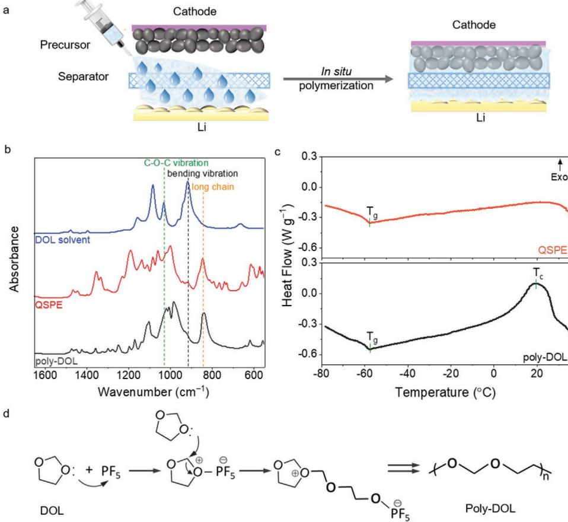
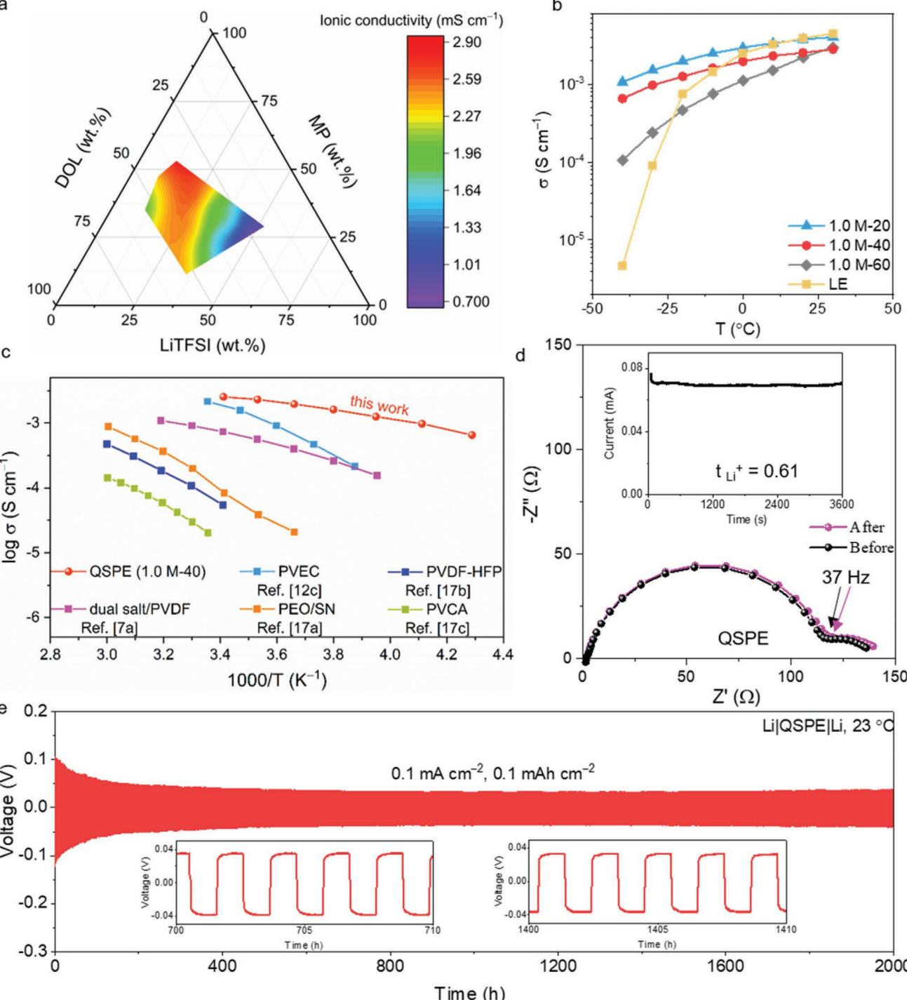
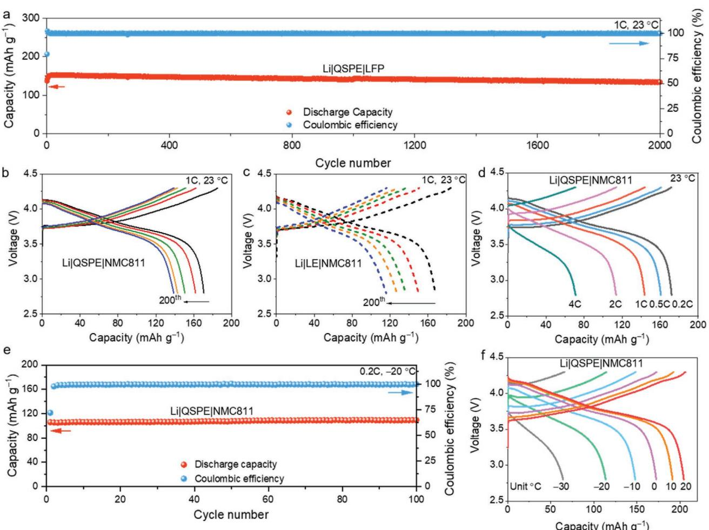
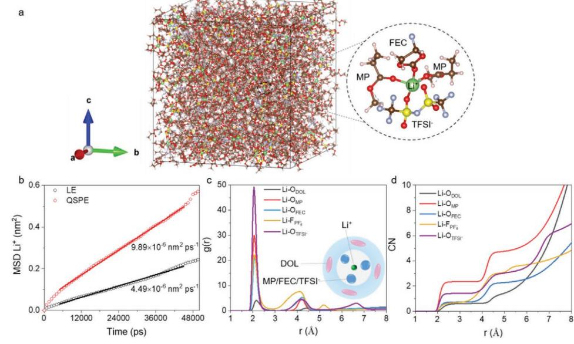
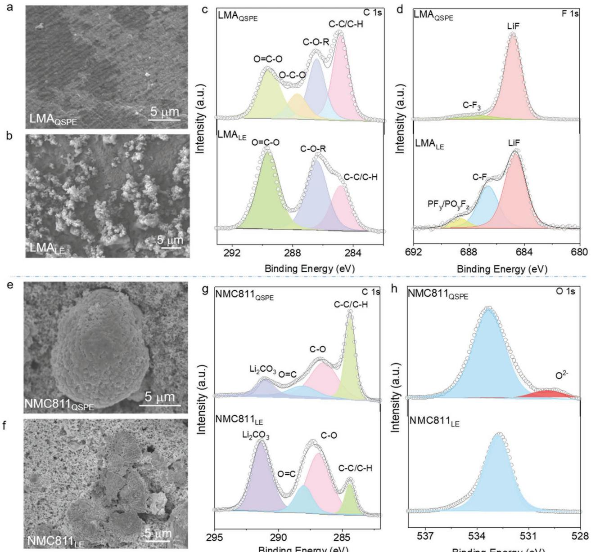

# **In Situ Fabricated Quasi-Solid Polymer Electrolyte for High-Energy-Density Lithium Metal Battery Capable of Subzero Operation**

*Jing Yu, Xidong Lin, Jiapeng Liu, Jacky T. T. Yu, Matthew J. Robson, Guodong Zhou, Ho M. Law, Haoran Wang, Ben Zhong Tang, and Francesco Ciucci\**

**Solid-state batteries (SSBs) are an emerging technology for safe and highenergy-density electrochemical energy storage. Unfortunately, SSBs suffer from inadequate ionic conductivity and sluggish interfacial transport at subzero temperatures, which limit their widespread application. Herein, a flexible, stable, and highly conductive quasi-solid polymer electrolyte (QSPE) for SSBs is developed that allows low-temperature (LT) operation. The in situ polymerized QSPE has an integrated battery structure, outstanding ionic conductivity (e.g., 1.0 mS cm−1 at −30 °C), and exhibits favorable compatibility with Li metal (>2000 h in Li|QSPE|Li). Li|QSPE|LiFePO4 and high-voltage Li|QSPE|LiNi0.8Mn0.1Co0.1O2 batteries demonstrate excellent long-term stability (>2000 cycles at room temperature) and can operate effectively at LT (e.g., −30 °C). Furthermore, pouch cells with a LiNi0.8Mn0.1Co0.1O2 (14.5 mg cm−2 ) cathode show flexibility, safety, and high capacity. The high performance of this QSPE is ascribed to its unique multilayer solvation structure that provides fast Li+ transport and excellent interfacial stability. Thus, the newly developed electrolyte chemistry enables practical high-voltage, LT solid-state Li batteries.**

Department of Mechanical and Aerospace Engineering The Hong Kong University of Science and Technology Hong Kong SAR, China E-mail: francesco.ciucci@ust.hk H. Wang, B. Z. Tang Shenzhen Institute of Molecular Aggregate Science and Engineering School of Science and Engineering The Chinese University of Hong Kong Shenzhen 518172, China H. Wang, B. Z. Tang Department of Chemistry Hong Kong Branch of Chinese National Engineering Research Center for Tissue Restoration and Reconstruction The Hong Kong University of Science and Technology

J. Yu, X. Lin, J. Liu, J. T. T. Yu, M. J. Robson, G. Zhou, H. M. Law, F. Ciucci

Hong Kong SAR, China

#### F. Ciucci

Department of Chemical and Biological Engineering The Hong Kong University of Science and Technology Hong Kong SAR, China

The ORCID identification number(s) for the author(s) of this article can be found under https://doi.org/10.1002/aenm.202102932.

#### **DOI: 10.1002/aenm.202102932**

#### **1. Introduction**

Li-ion batteries (LIBs) have revolutionized our daily lives, enabling portable electronics such as smartphones and electric vehicles.[1] In addition, LIBs show potential to facilitate the global transition from fossil fuels to renewable energy sources by providing grid-level energy storage. However, commercial LIBs have struggled to meet ever-increasing demands for energy density and to retain energy density at subzero temperatures.[2] These low-temperature (LT) challenges limit the application of LIBs in harsh conditions such as cold mountainous areas, the deep ocean, and aerospace applications.[3] In addition, the inclusion of liquid electrolytes (LEs) in commercial LIBs poses risks due to thermal instability, leakage, gas generation, and dendrite formation.[2c,4] Therefore, to increase both safety and energy density, there is an intensive research interest in pairing polymer elec-

trolytes, such as solid polymer electrolytes (SPEs) or quasi-SPEs (QSPEs), with high-capacity and high-potential-difference electrodes such as the Li-metal anode (LMA) and high-nickel layered oxide cathodes (e.g., LiNi0.8Mn0.1Co0.1O2 or NMC811).[5] However, due to poor Li+ conduction in their electrolytes, batteries with SPEs usually need to operate at 60 °C to achieve sufficient energy density. In addition, many SPEs are manufactured using ex situ, roll-to-roll processes, which can result in poor conformal contact between electrode and electrolyte when assembled into batteries, leading to high internal resistance. Furthermore, the instability issues between SPEs and advanced electrodes (e.g., the limited oxidation and reduction instability) greatly restrict batteries' long-term applications.

Various strategies have been proposed to improve the electrochemical performance of polymer electrolytes, including adding highly conductive compounds[6] and novel salts.[7] For example, incorporating liquid plasticizers into polymer matrices to form QSPEs can greatly increase the volume of amorphous regions and promote segmental motion of polymer chains, which in turn realizes the room-temperature (RT) operation of these QSPEs.[7a,8] Further, in situ polymerization has been proposed to optimize the ionic transport at electrode|electrolyte interface

**Figure 1.** a) Schematic illustration of integrated battery production via in situ polymerization. b) FTIR spectra of DOL solvent, QSPE, and poly-DOL (0.5 m LiPF6 in 500 µL DOL solvent). c) DSC of QSPE and poly-DOL. d) Possible reaction mechanism between DOL and LiPF6 (an initiator).

in QSPE. Typically, to form a QSPE through in situ polymerization, the liquid precursors, including Li salts, liquid plasticizers, initiators, and polymer monomers (e.g., vinyl carbonate,[9] 1,3-dioxolane (DOL),[10] poly(ethylene glycol) methacrylate[11] ), are injected into the cell and subsequently polymerized by thermal or ultraviolet (UV) treatment. This strategy greatly simplifies the production process and electrode|electrolyte interfacial contact, ensuring fast interfacial transport. While the aforementioned QSPE-based batteries possess good RT electrochemical properties, LT operation (e.g., <−20 °C) remains a great challenge due to increased electrolyte viscosity, reduced ionic conductivity, and slower interfacial kinetics with decreasing temperature.[12]

In this work, an in situ fabricated QSPE system has been developed to enable stable, high-energy-density Li batteries capable of excellent LT electrochemical performance. The schematic diagram in **Figure 1**a shows the preparation of the QSPE to form an integrated battery. QSPEs were obtained via in situ ring-opening polymerization of DOL by systematically adjusting the relative concentration of the monomer (DOL), solvent (methyl propionate, MP), and Li salt (Lithium bis(trifluoromethanesulfonyl)imide (LiTFSI)), as well as controlling the additive (fluoroethylene carbonate, FEC) and initiator (LiPF6) content. In addition to the intrinsic advantages of QSPEs, the as-obtained QSPEs demonstrate further novelties. First, as shown in Figure S1 (Supporting Information), in situ synthesis improves interfacial contact and interfacial compatibility between the QSPEs and electrodes. In addition, in situ synthesis enables an integrated 3D network to form through the porous electrode layer, thanks to effective wetting of the electrodes by the electrolyte precursor. Second, the presence of FEC induces the formation of fluorine-rich interphases, contributing to enhanced interfacial stability. Furthermore, the addition of MP, which freezes at −88 °C, greatly enhances LT ionic transport.[13] Finally, molecular dynamics (MD) simulations reveal a unique multilayer solvation structure of the QSPE (MP and poly-DOL dominate the inner and outer, respectively), that provides fast Li+ transport and maximizes interfacial stability.

#### **2. Results and Discussion**

Fourier-transform infrared (FTIR) spectroscopy revealed the in situ polymerization of DOL (Figure 1b). The FTIR spectrum of pure DOL shows a CH out-of-plane bending vibration (914 cm−1 ) and COC vibration (1030 cm−1 ).[14] By contrast, the QSPE featured the characteristic peak of poly-DOL with a significant intensity reduction in the bending vibration (914 cm−1 ), a shift in the COC vibration, and appearance of long-chain species vibration (845 cm−1 ).[14,15] Nuclear magnetic resonance (NMR) (Figure S2, Supporting Information) and gel permeation

chromatography (GPC) further supported the occurrence of polymerization. Via GPC, the average molecular weight of the polymer matrices in QSPE was found to be 3685, with a low polydispersity index of 1.26. Figure S3 (Supporting Information) shows the gelation time during polymerization; we gave sufficient time (12 h) for the gelation process to complete before proceeding with the subsequent tests. Differential scanning calorimetry (DSC) was used to investigate the thermal properties of QSPE and poly-DOL (Figure 1c). Compared to poly-DOL, no exothermic recrystallization peak can be observed in QSPE, suggesting that the QSPE is likely amorphous at ambient temperature. As suggested by the literature, the most likely mechanism for QSPE polymerization is the ring-opening polymerization reaction of DOL, initiated by LiPF6, which is schematized in Figure 1d.[10,16]

To improve electrolyte ionic conductivity, the ratios of LiTFSI, MP, and DOL were systematically varied, while the concentrations of FEC and LiPF6 were fixed. The electrolyte compositions are given in Table S1 (Supporting Information). Electrochemical impedance spectroscopy (EIS) was used to measure the RT ionic conductivity of the investigated electrolytes (**Figure 2**a), with values reported in Table S1 (Supporting Information). The ionic conductivity was found to be higher at moderate LiTFSI concentrations (e.g., 1.0 m). The highest RT conductivity is comparable to commercial LEs. The temperature dependence of the ionic conductivity of the LE (1.0 m LiPF6 in ethylene carbonate (EC)/dimethyl carbonate (DMC) (1:1 vol%)) and investigated electrolytes is shown in Figure 2b, where 1.0 m-*X* refers to 1.0 m LiTFSI and *X* vol% of DOL (*X* = 20, 40, and 60; DOL% = *v*DOL/(*v*DOL + *v*FEC + *v*MP)). The EIS spectra of 1.0 m-*X* and LE used to calculate the conductivity are shown in Figure S4a–e (Supporting Information). The ionic conductivity of LE showed an abrupt decrease below 0 °C (Figure 2b) with the activation energy below 0 °C being much higher than at RT (Figure S5a, Supporting Information). In sharp contrast to the LE, the ionic conductivity of 1.0 m–*X* fits well with the Vogel– Tamman–Fulcher model[7a,b] between −40 and 30 °C (Figure S5b, Supporting Information). Low pseudoactivation energies of *E*a = 0.012, 0.013, and 0.028 eV were obtained for 1.0 m-20, 1.0 m-40, and 1.0 m-60, respectively. Notably, both 1.0 m-20 and 1.0 m-40 had higher ionic conductivity than the LE below −10 °C (Figure 2b). The 1.0 m-20 sample showed a liquid-like state, and the 1.0 m-40 and 1.0 m-60 samples showed a quasi-solid state at RT (Figure S5c, Supporting Information). Remarkably, 1.0 m-40 has exceptional conductivity compared to other state-of-the-art polymer electrolytes, especially at LT (Figure 2c).[7a,12c,17] In addition to ionic conductivity, the Li+ transference number, *t* + Li , is critical in achieving effective Li+ transport as high values of *t* + Li can alleviate concentration polarization, thereby improving battery performance.[17c,18] As shown in Figure 2d and Figure S6 (Supporting Information), 1.0 m-20 displays a low *t* + Li (0.26) value similar to LE (0.27). Instead, both 1.0 m-40 and 1.0 m-60 have much higher *t* + Li (0.61 and 0.62, respectively), indicating low anionic mobility in these samples. This is attributed to greater coordination between anions and the polymer matrices of 1.0 m-40 and 1.0 m-60, which is demonstrated by the higher binding energy between TFSI− and poly-DOL compared to TFSI− and MP (Table S2, Supporting Information). The complex shear modulus (*G\**) was found to increase with increasing DOL content (Figure S7, Supporting Information); a high shear modulus correlates with strong mechanical stability and the prevention of dendrite growth.[19] As 1.0 m-20 has a liquid-like state and has low *t* + Li due to the high MP concentration, 1.0 m-40, which shows both exceptional ionic conductivity (1.0, 2.0, and 2.8 mS cm−1 at −30, 0, and 30 °C) and high *t* + Li (0.61) at RT was chosen for further study. In the remainder of this article, unless otherwise specified, QSPE refers to the 1.0 m-40 electrolyte.

In addition to possessing high Li+ conductivity, electrolytes need to form stable interfaces with electrodes. Linear sweep voltammetry (LSV) indicated that the electrochemical window of QSPE was wider than 5.0 V (Figure S8, Supporting Information). This wide window can be ascribed to the ring-opening polymerization of DOL and the resulting linear long chains,[15] and shows promise for pairing the QSPE with high-voltage cathodes (e.g., NMC811). The compatibility of the QSPE with LMA was assessed using Li/Cu cells. The Li|QSPE|Cu cell exhibited a stable columbic efficiency (CE) of ≈94% over 200 cycles (Figure S9a,b, Supporting Information). By contrast, the CE of the Li|LE|Cu cell fluctuated and dropped to <80% after 143 cycles and <20% after the 151st cycle (Figure S9a,c, Supporting Information). Moreover, as shown in Figure 2e, plating and stripping of the symmetric Li|QSPE|Li cell was stable for more than 2000 h at a current density of 0.1 mA cm−2 and a specific capacity of 0.1 mAh cm−2 . When the current density increased to 1.0 mA cm−2, the Li|QSPE|Li cell was stable for 400 h without increasing polarization (Figure S10, Supporting Information). By contrast, an initially large and gradually increasing voltage response of the Li|LE|Li cell was observed until a short circuit occurred at 337 h (Figure S10, Supporting Information). The excellent cycling stability of the Li|QSPE|Li and Li|QSPE|Cu cells demonstrates the compatibility between the electrolyte and Li anode, likely due to the formation of a stable solid electrolyte interphase (SEI) layer as discussed later in this article.[20]

Batteries containing LiFePO4 (LFP), a commonly used commercial cathode material, were assembled to evaluate longterm cycling performance. The Li|QSPE|LFP battery delivered a discharge capacity of 134 mAh g−1 with a capacity retention of 89% after 2000 cycles from 2.5 to 4.2 V at 1C at RT (**Figure 3**a and Figure S11a (Supporting Information)). When the current was increased stepwise from 0.2C to 4C, the battery still exhibited outstanding rate capability (e.g., 113 mAh g−1 at 4C), as shown in Figure S11b,c (Supporting Information). In addition, a Li|QSPE|LFP cell with high LFP loading (13.2 mg cm−2) also showed a good reversible capacity of 157.3 mAh g−1 at 0.1C and stable cycling performance (Figure S11d, Supporting Information). Thanks to the high ionic conductivity and excellent compatibility of the QSPE with the electrodes, the Li|QSPE|LFP battery operated effectively at temperatures as low as −30 °C (Figure S11e, Supporting Information), and retained a high reversible capacity and long-term cyclic stability at −20 °C (i.e., 77 mAh g−1 at 0.2C over 200 cycles), as displayed in Figure S11f (Supporting Information). Furthermore, to demonstrate potential for practical applications, a Li|QSPE|LFP battery with a low negative/positive (N/P) capacity ratio of 3.5:1 was analyzed at RT (Figure S12, Supporting Information). This battery with a low N/P ratio delivered a promising discharge capacity of 152.8 mAh g−1 with a CE of ≈99.8% over 30 cycles at 0.2C.

**Figure 2.** a) The ionic conductivity gradient of the developed electrolytes at 23 °C on the ternary phase diagram. b) Temperature-dependent ionic conductivity of the typical electrolytes and LE within a temperature range between −40 and 30 °C. 1.0 m-*X* denotes the electrolytes synthesized with different volumes of MP and DOL at 1.0 m LiTFSI (*X* represents *X* vol% of DOL in MP, DOL, and FEC). Note: 1.0 m-40 is simplified to QSPE elsewhere unless otherwise noted. c) Ionic conductivity of QSPE, together with that of the state-of-the-art polymer electrolytes. d) Nyquist and chronoamperometric plots (inset) of Li|QSPE|Li at 23 °C. e) Plating and stripping behaviors of the symmetric Li|QSPE|Li cell at 0.1 mA cm−2 and 0.1 mAh cm−2 .

It should be noted that the thickness of QSPE was ≈28 µm (Figure S13, Supporting Information), the mass loading of the LFP cathode was 7.5 mg cm−2, and the capacity of Li metal anode was 5 mAh.

Batteries with a high-voltage NMC811 cathode were assembled and evaluated from 2.8 to 4.3 V. The Li|QSPE|NMC811 cell showed remarkable cycling performance, retaining a discharge capacity of 139 mAh g−1 over 200 cycles at 1C and RT

**Figure 3.** a) Long-term cycling performance of the Li|QSPE|LFP cell at 1C at 23 °C. Typical charge–discharge curves of b) Li|QSPE|NMC811 and c) Li|LE|NMC811 batteries at 1C and at 23 °C. d) Typical charge–discharge curves of Li|QSPE|NMC811 at 23 °C at various C-rates. e) Cycling performance of the Li|QSPE|NMC811 cell at 0.2C at −20 °C. f) Typical charge–discharge curves of the Li|QSPE|NMC811 cell between −30 and 20 °C at 0.1C.

(Figure 3b). By contrast, the capacity of the Li|LE|NMC811 cell declined to 115 mAh g−1 at the 200th cycle (Figure 3c). Further, the Li|QSPE|NMC811 battery provided remarkable rate capability, achieving discharge capacities of 172, 161, 144, 114, and 71 mAh g−1 at 0.2, 0.5, 1, 2, and 4C, respectively (Figure 3d and Figure S14a (Supporting Information)). When the NMC811 mass loading was increased to 8.5 mg cm−2, the Li|QSPE|NMC811 battery still provided an average CE of ≈99.5% with a discharge capacity of 171 mAh g−1 at 0.1C after 100 cycles (Figure S14b,c, Supporting Information).

To further investigate its LT performance, the Li|QSPE|NMC811 battery was cycled at −20 °C, showing a discharge capacity of 109 mAh g−1 at 0.2C over 100 cycles (Figure 3e). The battery was also cycled at temperatures from −30 to 20 °C and delivered discharge capacities of 64, 114, 148, 172, 191, and 201 mAh g−1 at −30, −20, −10, 0, 10, and 20 °C at 0.1C, respectively (Figure 3f). By contrast, the discharge capacities of the Li|LE|NMC811 battery were inferior below −10 °C, and the battery could not function properly at −30 °C (Figure S14d, Supporting Information). The LT performance degradation is ascribed to a large reduction in ionic conductivity of the electrolyte and a severe reduction in interfacial charge transfer kinetics.[2c] As summarized in Table S3 (Supporting Information), batteries equipped with QSPE have superior performance to other batteries with recently developed polymer electrolytes and commercial liquid electrolytes, especially at LT.

To elucidate the conduction mechanism of QSPE, MD simulations were performed. **Figure 4**a and Figure S15a (Supporting Information) show MD simulation snapshots of the QSPE and LE, respectively. The calculated Li+ mean squared displacements (MSDs) for these electrolytes are shown in Figure 4b. The slope of QSPE's MSD is steeper than that of the LE, implying faster diffusion of Li+ in QSPE. The corresponding diffusivities ( ) *D* + Li at −20 °C were estimated to be 1.65 × 10−8 cm2 s−1 (QSPE) and 7.49 × 10−9 cm2 s−1 (LE), respectively. The corresponding conductivity was calculated to be 0.10 mS cm−1 (QSPE) and 0.03 mS cm−1 (LE) at −20 °C.

The radial distribution function, *g*(*r*), was calculated to unravel the solvation structure of the QSPE (Figure 4c). The first Li+ solvation sheath was found to consist primarily of MP and FEC molecules and TFSI− anions. The coordination numbers (CNs) of Li+ in the first solvation shell (≈3 Å) were computed

**Figure 4.** a) A snapshot of the simulation system for QSPE at −20 °C. b) MSD of Li+ ions in QSPE and LE at −20 °C. c) Radial distribution function *g*(*r*) and d) the coordination number (CN) with reference to Li+ in QSPE at −20 °C.

to be 2.3 for MP and 1.4 for TFSI− (Figure 4d). Consequently, the presence of low viscosity and low-freezing-temperature MP in the first Li+ solvation sheath promotes fast ionic transport even in LT. The TFSI− anions also enter the solvation sheath and may form a contact ion pair structure. This structure, which benefits Li+ transport and electrochemical stability, is similar to that observed in electrolytes with high salt concentrations or low-polarizability solvents.[21] By contrast, most of the first solvation shell of the LE is dominated by high freezingpoint and high-viscosity EC/DMC solvents, as indicated by the appearance of the sharp peaks for Li+OEC and Li+ODMC at ≈2.1 Å (Figure S15b, Supporting Information). The CN numbers (Figure S15c, Supporting Information) also confirm that Li+ are closely coordinated to EC/DMC in LE, with a high CN of 3.2 and 2.0. Furthermore, the binding energy *E*b of EC/DMC solvents is higher than that of MP/FEC (Table S4, Supporting Information), implying that Li+ transfer in QSPE is easier than in LE.[22] These results suggest the importance of MP in QSPE in ensuring high performance at LT.

Scanning electron microscopy (SEM) and X-ray photoelectron spectroscopy (XPS) were used to characterize the morphologies and chemical compositions of the anode SEI and cathode electrolyte interphase (CEI). The Li|QSPE|NMC811 and Li|LE|NMC811 cells were disassembled after 50 cycles at 1C and RT. The SEM image (**Figure 5**a) of LMAQSPE (LMA from the Li|QSPE|NMC811 cell) shows a smooth and dense surface, while LMALE (LMA from the Li|LE|NMC811 cell) has obvious surface protrusions (Figure 5b). In the C 1s spectra (Figure 5c), the COR peak (286.5 eV) and OCO peak (287.6 eV) of the SEI layer on LMAQSPE can be ascribed to the CH2CH2OCH2O unit of poly-DOL.[23] Moreover, the peak area ratio of COR and OCO species is about 2:1, which is consistent with the carbon ratio of the CH2CH2OCH2O unit, suggesting the formation of a predominately polymeric SEI capable of preventing parasitic side reactions between the solvent and LMA.[14,23] In addition, the reduction of FEC on LMAQSPE formed a LiF-rich SEI layer (Figure 5d), which improves stability.[24] By contrast, the COR and OCO species identified on LMALE are due to the decomposition of EC/DMC,[25] suggesting an unstable SEI layer in the Li|LE|NMC811 cell. Similarly, the large proportion of detected CF and PF*y*/PO*y*F*z* groups is consistent with severe electrolyte decomposition.[26]

Regarding the CEI, the cycled NMC811QSPE (NMC811 from the Li|QSPE|NMC811 cell) maintained a spherical and smooth surface (Figure 5e), while a structural collapse in the cycled NMC811LE (NMC811 from the Li|LE|NMC811 cell) was visible (Figure 5f). As shown in Figure 5g, the CEI layer on NMC-811QSPE shows dominant XPS peaks corresponding to CC/ CH and CO groups, which can be attributed to conductive carbon and poly-DOL. The low intensity of the CO group on NMC811QSPE indicates that poly-DOL incorporation impeded the breakdown of MP/FEC. By contrast, the CEI on NMC811LE shows an increased signal intensity corresponding to Li2CO3 and CO, suggesting severe consumption of the carbonate solvents. In the O 1s spectra (Figure 5h), the detected O2− peak on NMC811QSPE corresponds to lattice O2− in the NMC811 cathode.[13b,27] However, the O2− peak disappears on the NMC811LE surface, potentially due to the formation of a thick CEI layer from the continuous decomposition of the LE.

To demonstrate the safety and flexibility of the developed Li|QSPE|NMC811 battery, pouch cells with a high mass loading of NMC811 (14.5 mg cm−2 ) were assembled (**Figure 6**a). The assembled pouch cell could consistently illuminate red lightemitting diodes (LEDs) when experiencing destructive bending, cutting, and penetration tests (Figure 6b and Figure S16 (Supporting Information)), verifying its excellent safety and flexibility. Moreover, the galvanostatic charge/discharge curves of the pouch cell with different bending radii (*r*) (Figure 6c) are shown in Figure 6d. The pouch cell delivered a discharge capacity of 57 mAh (170 mAh g−1 ) with no bending. At different

**Figure 5.** Top-view SEM images of the LMA surface from the cycled (50 cycles) a) Li|QSPE|NMC811 and b) Li|LE|NMC811 cells. C 1s and F 1s spectra of the LMA surface from the cycled c) Li|QSPE|NMC811 and d) Li|LE|NMC811 cells. Top-view SEM images of the NMC811 cathode surface from the cycled e) Li|QSPE|NMC811 and f) Li|LE|NMC811 cells. C 1s and O 1s spectra of the NMC811 surface from the cycled g) Li|QSPE|NMC811 and h) Li|LE|NMC811 cells.

curvatures, the pouch cell maintained similar charge/discharge performance. Even with a bending radius of *r* = 13 mm, the pouch cell still displayed a discharge capacity of 53 mAh (158 mAh g−1 ) with a capacity retention of 93.0%. The excellent flexibility and high energy density of the Li|QSPE|NMC811 pouch cell show its strong potential for wearable electronics.

#### **3. Conclusion**

In conclusion, we developed a flexible QSPE via in situ polymerization by rational formulation of electrolyte ingredients. The resulting QSPE not only possessed unprecedented conductivity (e.g., 1.0 mS cm−1 at −30 °C), thanks to the in-built fast-ion-transportation pathways, but also exhibited excellent interfacial compatibility with the LMA and LFP or high-voltage NMC811 cathodes. The excellent interfacial stability originated from effective suppression of Li dendrite growth and the in situ formation of an integrated structure due to the stable longchain linear structure of poly-DOL. The Li|QSPE|Li cell demonstrated long-term stability for over 2000 h at 0.1 mA cm−2 , and the Li|QSPE|Cu cell showed excellent CE for 200 cycles at 0.1 mA cm−2 with a capacity of 0.2 mAh cm−2. Further, Li|QSPE|LFP and Li|QSPE|NMC811 batteries delivered

**Figure 6.** a) Schematic illustration of the Li|QSPE|NMC811 pouch cell. b) Digital photos of the pouch cells continuously illuminating red LEDs during destructive testing. c) The pouch cell under different bending states and d) the corresponding charge/discharge curves.

outstanding RT cycling stability over 2000 cycles and LT cycling stability at −20 °C, respectively. The in situ developed QSPE can therefore be effectively incorporated into LMBs to realize high safety and high energy density, and to provide high performance in extreme conditions (e.g., −30 °C). In addition, pouch cells with high-voltage and high-mass-loading NMC811 (14.5 mg cm−2) demonstrated high capacity, safety, and flexibility. Our MD simulation results suggest that the unique multilayer solvation structure (MP and poly-DOL dominate the inner and outer, respectively) contributed to fast Li+ transport and interfacial stability. This new electrolyte chemistry and related insights enable practical LT, high-energy-density, solidstate Li batteries.

#### **4. Experimental Section**

*Electrode Preparation*: The LFP (Aleees) slurry was prepared by mixing LFP powder, conductive carbon black (TIMCAL Super P, MTI), and polyvinylidene difluoride (PVDF) binder at a weight ratio of 8:1:1 in *N*-methyl-2-pyrrolidone (NMP, 99.9%, MTI) solvent. The slurry was then magnetically stirred for 8 h and cast onto carbon-coated Al foil. After drying at 80 °C for 8 h to remove the NMP, the LFP-based cathode layer was punched into disks (12 mm in diameter), with a common mass loading of ≈2.0 mg cm−2 LFP. The NMC811 (Shanshan) based cathode layer with a mass loading of 1.5–2.0 mg cm−2 NMC811 was also prepared following the same procedure. High-mass-loading LFP (≈7.5 and ≈13.5 mg cm−2) and NMC811 (≈8.5 and 14.5 mg cm−2) cathodes were further prepared by mixing active material/Super P/PVDF with a weight ratio of 9:0.6:0.4. To achieve an even and compact cathode layer at a high mass loading, a hot rolling machine was employed. Coin cells (CR2032) were assembled with a Li-metal anode, LFP/NMC811 as the cathode, and Celgard 2500 (≈25 µm thickness) separator. The thin Li metal anode (5 mAh) was prepared by depositing Li metal on a Cu foil with a capacity of 5 mAh in a Li/Cu half-cell. A Li|QSPE|LFP battery with this low N/P ratio electrode was then prepared and tested. Li|QSPE|NMC811 pouch cells were prepared in an Al-laminated film battery casing.

*Electrolyte Preparation and Battery Fabrication*: Highly conductive QSPEs were prepared by the mixing and in situ polymerization of DOL (AR, Dieckmann) monomer, LiTFSI (99%, Sigma-Aldrich) salt, MP (99%, Aladdin) solvent, LiPF6 (99%, Sigma-Aldrich) initiator, and FEC (98%, Aladdin). The proportions of DOL, LiTFSI, and MP were systematically varied, while the concentrations of LiPF6 and FEC were kept constant. Taking the preparation of a QSPE (i.e., 1.0 m LiTFSI with 40 vol% of DOL, DOL% = *v*DOL/(*v*DOL + *v*FEC + *v*MP)) as an example, first, LiTFSI (0.144 g), DOL (200.0 µL), and FEC (50.0 µL) were mixed into a sealed vial. Second, 0.038 g LiPF6 was dissolved in 250.0 µL MP to obtain a transparent solution. The solution was then added into the vial containing LiTFSI, DOL, and FEC, and mixed thoroughly to obtain the precursor solution. 50.0 µL of this solution was immediately injected into the separator and the cell was assembled and sealed. The precursor solution subsequently underwent spontaneous polymerization in the cell at room temperature to form the QSPE. All electrolyte preparation and battery fabrication processes were performed inside a glove box (Mikrouna, [O2] < 0.1 ppm, [H2O] < 0.1 ppm) filled with ultrapure Ar (≥99.999%, Air Products).

*Material Characterizations*: Surface morphologies were investigated using a SEM (JEOL-6700F). FTIR spectra were collected with a Bruker Vertex 70 FTIR spectrometer. NMR analysis was performed on a Mercury VX 300 by dissolving DOL, poly-DOL, and QSPE in dimethyl sulfoxide-d6 (99.9 at% D, Sigma-Aldrich). GPC was conducted in tetrahydrofuran at an elution rate of 1.0 mL min−1 under a Waters Associates GPC system equipped with a Waters 1515 high-performance liquid chromatography pump and an interferometric UV absorption detector. DSC measurements were carried out using a Netzsch STA 449 F3 from −80 to 30 °C at a heating rate of 10 °C min−1 under flowing N2. The rheometric experiments were performed using a parallel-plate geometry with the strain-controlled rheometer ARES3. XPS was obtained using a PHI5600 X-ray photoelectron spectrometer. For the post characterizations, both LMAs and NMC811 were cleaned with DMC three times and dried in an argon-filled glove box.

*Electrochemical Characterizations*: A Bio-Logic VSP-300 electrochemical workstation was used for EIS, chronoamperometry, and LSV. To measure the ionic conductivity of QSPEs, the corresponding precursor solution was infiltrated into a glass fiber separator which was sandwiched between stainless steel (SS) disks in a SS|QSPE|SS configuration. The ionic conductivity, *σ*, was calculated using

$$
\sigma = \frac{l}{RA} \tag{1}
$$

where *l* is the thickness of the glass fiber separator, *A* is the contact area between QSPEs and SS, and *R* is the resistance measured from EIS in the frequency range of 7 MHz–0.5 Hz. The temperature-dependent ionic conductivity of LE could be fitted with the Arrhenius equation

$$
\sigma(T) = A \exp\left(-\frac{E_a}{k_B T}\right) \tag{2}
$$

where *A* is a pre-exponential factor, *k*B is the Boltzmann constant, and *T* is the absolute temperature. The ionic conductivity of 1.0 m-*X* obtained at a wide temperature range could be fitted with the Vogel–Tamman– Fulcher equation[7b]

$$
\sigma = \sigma_0 \ T^{-0.5} \exp\left(-\frac{E_a}{(T - T_0)k_B}\right) \tag{3}
$$

where *σ*0 is the pre-exponential factor, *k*B is the Boltzmann constant, *T*0 is the reference temperature, and *E*a is the pseudoactivation energy. Temperature-dependent electrochemical measurements were performed using an isolated chamber (SU-242-5, ESPEC). The Li+ transference number, Li *t* + , was calculated based on chronoamperometry and EIS with a Li/Li symmetric cell, according to the following equation

$$
t_{\rm Li^{+}} = \frac{I_{\rm ss} (\Delta V - I_0 R_0)}{I_0 (\Delta V - I_{\rm ss} R_{\rm ss})}
$$
(4)

where *I*0 and *I*ss are the initial and steady-state currents measured by chronoamperometry, the applied DC potential difference (Δ*V*) is 10 mV, and *R*0 and *R*ss are the initial and steady-state resistances from EIS. To measure the electrochemical window, LSV was conducted between 1.0 and 6.0 V at a scan rate of 5 mV s−1 with a Li/SS asymmetric cell.

To evaluate the electrochemical stability between Li and QSPE, Li/Cu and Li/Li CR2032 coin cells with QSPE were assembled and further evaluated using a battery testing system (CT2001A, LANHE). For comparison purposes, Li/Cu and Li/Li cells with a LE were also investigated. The Li/Cu cells were cycled at a current density of 0.1 mA cm−2 and 0.2 mAh cm−2 for 200 cycles. Cycling stability and rate capability of Li/LFP (2.5–4.2 V) and Li/NMC811 (2.8–4.3 V) batteries were evaluated using the same battery testing system. The cycling performance over a wide temperature range was performed in an isolated chamber (SU-242-5, ESPEC).

*Computational Methods*: Classical MD simulations were carried out using GROMACS 2020.5[28] to provide insights on the electrolytes designed in this work. The optimized potentials for liquid simulations-all atom force field[29] was used along with restrained electrostatic potential

charge generated by Multiwfn.[30] The linear constraint solver algorithm[31] was used to constrain hydrogen atoms bonds. Initially, 458 DOL, 415 MP, 110 FEC, 80 LiTFSI, and 40 LiPF6 molecules were packed into a 53 × 53 × 53 Å3 box using the packmol[32] software to simulate QSPE. For comparison, the commercial LE with a composition of 1.0 m LiPF6 in 250 µL EC and 250 µL DMC was simulated by packing 600 EC, 475 DMC, and 80 LiPF6 molecules in a 53 × 53 × 53 Å3 box. All the systems were first heated from 10 K to their respective target temperatures (298.15 K for RT, and 253.15 K for LT) in 100 ps, followed by 10 ns equilibration under isothermal–isobaric ensemble (NPT) at 1 bar. For the production run, an additional 50 ns NPT simulation was performed. All MD simulations were carried out with a 1 fs time step. For NPT simulations, the temperature was controlled by coupling the system with a Nosé– Hoover thermostat[33] at a time constant of 2 ps, and the pressure was controlled using the Parrinello–Rahman pressure[34] coupled with a 5 ps time constant. Electrostatic interactions were treated using the Particle– Mesh–Ewald method[35] with a 1.3 nm cutoff distance.

To characterize Li+ transport, the MSD of Li+ at time *t* was calculated by

MSD 
$$
(t) = \frac{1}{N_{Li^+}} \sum_{i=1}^{N} |r_i(t) - r_i(0)|^2
$$
 (5)

where Li *N* + is the total number of Li+ in the electrolyte, *ri* (0) and *ri* (*t*) are the initial position and the position at time *t* of the *i*th Li+, respectively. The corresponding diffusivity Li *D* + was obtained by linearly fitting the curve of MSD against *t* according to the Einstein equation[36]

$$
D_{Li^+} = \lim_{t \to \infty} \frac{MSD(t)}{6t}
$$
 (6)

The corresponding ionic conductivity of Li+ was calculated by[37]

$$
\sigma_{Li^{+}} = \frac{e^{2} N_{Li^{+}} D_{Li^{+}}}{V k_{B} T}
$$
 (7)

where *V* is the system volume, *k*B is the Boltzmann constant, and *T* is the temperature.

To characterize the local structures surrounding Li+ in the electrolyte, the radial distribution function was calculated using

$$
g(r) = \frac{1}{4\pi r^2 \rho} \frac{dn(r)}{dr}
$$
 (8)

where *r* is the distance of a species from the referenced Li+, *ρ* is the average probability density of the Li+ in the electrolyte, and d*n*(*r*) is the number of particles within a d*r*-thick spherical shell. By integrating the *g*(*r*) with respect to *r*, the CN of species surrounding the Li+ center was obtained, i.e.

$$
CN = 4\pi\rho \int_{0}^{r} r^2 g(r) dr
$$
\n(9)

DFT calculations at the B3LYP level and 6-31++G (d,p) basis set with Gaussian 09 program[38] were carried out to characterize the binding energy between molecules and cations. All structures were first optimized until the maximum force converged into 0.00045 a.u. The binding energies *E*b between Li+ and other small molecules were calculated following the equation

$$
E_{\rm b} = H_{\rm total} - \sum H_{\rm frag} \tag{10}
$$

where *H*total is the total enthalpy of two fragments combined together and *H*frag is the enthalpy of a single fragment (either ion or molecule, Li+, EC, FEC, MP, DOL, TFSI−, and 6 − *PF* ). According to such a definition, a more negative value of *E*b implied stronger interaction between two components.

#### **Supporting Information**

Supporting Information is available from the Wiley Online Library or from the author.

## **Acknowledgements**

J.Y., X.L., and J.L. contributed equally to this work. The authors gratefully acknowledge the financial support from the Research Grants Council of Hong Kong (Grant Nos. 162206019 and 16201820) and the Hong Kong Innovation and Technology Fund (Grant No. ITS/292/18FP). The authors are grateful for the technical support from the Materials Characterization and Preparation Facilities (MCPF) of HKUST.

# **Conflict of Interest**

The authors declare no conflict of interest.

# **Data Availability Statement**

The data that support the findings of this study are available from the corresponding author upon reasonable request.

## **Keywords**

high ionic conductivity, high-voltage cathodes, in situ polymerization, Li-metal batteries, low temperature, quasi-solid polymer electrolytes

> Received: September 21, 2021 Revised: November 9, 2021 Published online: December 1, 2021

- [1] a) X.-B. Cheng, R. Zhang, C.-Z. Zhao, Q. Zhang, *Chem. Rev.* **2017**, *117*, 10403; b) F. Duffner, N. Kronemeyer, J. Tübke, J. Leker, M. Winter, R. Schmuch, *Nat. Energy* **2021**, *6*, 123; c) L. Chen, X. Fan, E. Hu, X. Ji, J. Chen, S. Hou, T. Deng, J. Li, D. Su, X. Yang, C. Wang, *Chem* **2019**, *5*, 896.
- [2] a) G. A. Collins, H. Geaney, K. M. Ryan, *J. Mater. Chem. A* **2021**, *9*, 14172; b) C. K. Huang, J. S. Sakamoto, J. Wolfenstine, S. Surampudi, *J. Electrochem. Soc.* **2000**, *147*, 2893; c) J. Holoubek, M. Yu, S. Yu, M. Li, Z. Wu, D. Xia, P. Bhaladhare, M. S. Gonzalez, T. A. Pascal, P. Liu, Z. Chen, *ACS Energy Lett.* **2020**, *5*, 1438.
- [3] a) M.-T. F. Rodrigues, G. Babu, H. Gullapalli, K. Kalaga, F. N. Sayed, K. Kato, J. Joyner, P. M. Ajayan, *Nat. Energy* **2017**, *2*, 17108; b) X. Fan, X. Ji, L. Chen, J. Chen, T. Deng, F. Han, J. Yue, N. Piao, R. Wang, X. Zhou, X. Xiao, L. Chen, C. Wang, *Nat. Energy* **2019**, *4*, 882.
- [4] a) C. Yang, K. Fu, Y. Zhang, E. Hitz, L. Hu, *Adv. Mater.* **2017**, *29*, 1701169; b) X.-B. Cheng, C.-Z. Zhao, Y.-X. Yao, H. Liu, Q. Zhang, *Chem* **2019**, *5*, 74.
- [5] a) H. Zhang, C. Li, M. Piszcz, E. Coya, T. Rojo, L. M. Rodriguez-Martinez, M. Armand, Z. Zhou, *Chem. Soc. Rev.* **2017**, *46*, 797; b) H. Wang, L. Sheng, G. Yasin, L. Wang, H. Xu, X. He, *Energy Storage Mater.* **2020**, *33*, 188; c) D. Zhou, D. Shanmukaraj, A. Tkacheva, M. Armand, G. Wang, *Chem* **2019**, *5*, 2326; d) G. Jiang, C. Qu, F. Xu, E. Zhang, Q. Lu, X. Cai, S. Hausdorf, H. Wang, S. Kaskel, *Adv. Funct. Mater.* **2021**, *31*, 2104300.
- [6] a) Z. Dai, J. Yu, J. Liu, R. Liu, Q. Sun, D. Chen, F. Ciucci, *J. Power Sources* **2020**, *464*, 228182; b) X. Zhang, T. Liu, S. Zhang, X. Huang,

#### **www.advancedsciencenews.com www.advenergymat.de**

B. Xu, Y. Lin, B. Xu, L. Li, C.-W. Nan, Y. Shen, *J. Am. Chem. Soc.* **2017**, *139*, 13779.

- [7] a) J. Yu, J. Liu, X. Lin, H. M. Law, G. Zhou, S. C. T. Kwok, M. J. Robson, J. Wu, F. Ciucci, *Energy Storage Mater.* **2021**, *37*, 609; b) S. Li, Y.-M. Chen, W. Liang, Y. Shao, K. Liu, Z. Nikolov, Y. Zhu, *Joule* **2018**, *2*, 1838; c) G. S. MacGlashan, Y. G. Andreev, P. G. Bruce, *Nature* **1999**, *398*, 792.
- [8] M. Patel, K. G. Chandrappa, A. J. Bhattacharyya, *Solid State Ionics* **2010**, *181*, 844.
- [9] H. Zhou, H. Liu, Y. Li, X. Yue, X. Wang, M. Gonzalez, Y. S. Meng, P. Liu, *J. Mater. Chem. A* **2019**, *7*, 16984.
- [10] F.-Q. Liu, W.-P. Wang, Y.-X. Yin, S.-F. Zhang, J.-L. Shi, L. Wang, X.-D. Zhang, Y. Zheng, J.-J. Zhou, L. Li, Y.-G. Guo, *Sci. Adv.* **2018**, *4*, eaat5383.
- [11] T. Zhou, Y. Zhao, J. W. Choi, A. Coskun, *Angew. Chem. Int. Ed.* **2021**, *60*, 2.
- [12] a) J. Wang, W. Huang, A. Pei, Y. Li, F. Shi, X. Yu, Y. Cui, *Nat. Energy* **2019**, *4*, 664; b) C. R. Sides, C. R. Martin, *Adv. Mater.* **2005**, *17*, 125; c) Z. Lin, X. Guo, Z. Wang, B. Wang, S. He, L. A. O'Dell, J. Huang, H. Li, H. Yu, L. Chen, *Nano Energy* **2020**, *73*, 104786.
- [13] a) M. C. Smart, B. V. Ratnakumar, K. B. Chin, L. D. Whitcanack, *J. Electrochem. Soc.* **2010**, *157*, A1361; b) L. Liu, S. Wang, Z. Zhang, J. Fan, W. Qi, S. Chen, *Ionics* **2019**, *25*, 1035.
- [14] Q. Zhao, X. Liu, S. Stalin, K. Khan, L. A. Archer, *Nat. Energy* **2019**, *4*, 365.
- [15] J. Xiang, Y. Zhang, B. Zhang, L. Yuan, X. Liu, Z. Cheng, Y. Yang, X. Zhang, Z. Li, Y. Shen, J. Jiang, Y. Huang, *Energy Environ. Sci.* **2021**, *14*, 3510.
- [16] a) Q. Ma, J. Yue, M. Fan, S.-J. Tan, J. Zhang, W.-P. Wang, Y. Liu, Y.-F. Tian, Q. Xu, Y.-X. Yin, Y. You, A. Luo, S. Xin, X.-W. Wu, Y.-G. Guo, *Angew. Chem. Int. Ed.* **2021**, *60*, 16554; b) K. Khan, Z. Tu, Q. Zhao, C. Zhao, L. A. Archer, *Chem. Mater.* **2019**, *31*, 8466.
- [17] a) S. Xu, Z. Sun, C. Sun, F. Li, K. Chen, Z. Zhang, G. Hou, H.-M. Cheng, F. Li, *Adv. Funct. Mater.* **2020**, *30*, 2007172; b) Y. Zhao, Y. Bai, Y. Bai, M. An, G. Chen, W. Li, C. Li, Y. Zhou, *J. Power Sources* **2018**, *407*, 23; c) J. Chai, Z. Liu, J. Ma, J. Wang, X. Liu, H. Liu, J. Zhang, G. Cui, L. Chen, *Adv. Sci.* **2017**, *4*, 1600377.
- [18] Z. Cai, Y. Liu, S. Liu, L. Li, Y. Zhang, *Energy Environ. Sci.* **2012**, *5*, 5690.
- [19] a) T. Dam, S. S. Jena, A. Ghosh, *J. Appl. Phys.* **2019**, *126*, 105104; b) S. Rajendran, Z. Tang, A. George, A. Cannon, C. Neumann, A. Sawas, E. Ryan, A. Turchanin, L. M. R. Arava, *Adv. Energy Mater.* **2021**, *11*, 2100666.
- [20] T. Chen, H. Wu, J. Wan, M. Li, Y. Zhang, L. Sun, Y. Liu, L. Chen, R. Wen, C. Wang, *J. Energy Chem.* **2021**, *62*, 172.
- [21] a) X. Dong, Y. Lin, P. Li, Y. Ma, J. Huang, D. Bin, Y. Wang, Y. Qi, Y. Xia, *Angew. Chem. Int. Ed.* **2019**, *58*, 5623; b) L. Suo, O. Borodin, T. Gao, M. Olguin, J. Ho, X. Fan, C. Luo, C. Wang, K. Xu, *Science* **2015**, *350*, 938; c) Y. Marcus, G. Hefter, *Chem. Rev.* **2006**, *106*, 4585.
- [22] Z. Zhang, T. Hu, Q. Sun, Y. Chen, Q. Yang, Y. Li, *J. Power Sources* **2020**, *453*, 227908.
- [23] Y. Wang, C.-F. Lin, J. Rao, K. Gaskell, G. Rubloff, S. B. Lee, *ACS Appl. Mater. Interfaces* **2018**, *10*, 24554.
- [24] a) J. Zheng, M. H. Engelhard, D. Mei, S. Jiao, B. J. Polzin, J.-G. Zhang, W. Xu, *Nat. Energy* **2017**, *2*, 17012; b) J. Yu, Y.-Q. Lyu, J. Liu, M. B. Effat, S. C. T. Kwok, J. Wu, F. Ciucci, *J. Mater. Chem. A* **2019**, *7*, 17995; c) T. Deng, L. Cao, X. He, A.-M. Li, D. Li, J. Xu, S. Liu, P. Bai, T. Jin, L. Ma, M. A. Schroeder, X. Fan, C. Wang, *Chem* **2021**, *7*, 1.
- [25] J.-Y. Hwang, S.-J. Park, C. S. Yoon, Y.-K. Sun, *Energy Environ. Sci.* **2019**, *12*, 2174.
- [26] X. Lin, J. Yu, M. B. Effat, G. Zhou, M. J. Robson, S. C. T. Kwok, H. Li, S. Zhan, Y. Shang, F. Ciucci, *Adv. Funct. Mater.* **2021**, *31*, 2010261.

- [27] S. Jiao, X. Ren, R. Cao, M. H. Engelhard, Y. Liu, D. Hu, D. Mei, J. Zheng, W. Zhao, Q. Li, N. Liu, B. D. Adams, C. Ma, J. Liu, J.-G. Zhang, W. Xu, *Nat. Energy* **2018**, *3*, 739.
- [28] M. J. Abraham, T. Murtola, R. Schulz, S. Páll, J. C. Smith, B. Hess, E. Lindahl, *SoftwareX* **2015**, *1–2*, 19.
- [29] W. L. Jorgensen, D. S. Maxwell, J. Tirado-Rives, *J. Am. Chem. Soc.* **1996**, *118*, 11225.
- [30] a) T. Lu, F. Chen, *J. Comput. Chem.* **2012**, *33*, 580; b) T. Lu, F.-W. Chen, *Acta Phys.-Chim. Sin.* **2012**, *28*, 1.
- [31] a) B. Hess, H. Bekker, H. J. C. Berendsen, J. G. E. M. Fraaije, *J. Comput. Chem.* **1997**, *18*, 1463; b) B. Hess, *J. Chem. Theory Comput.* **2008**, *4*, 116.
- [32] L. Martínez, R. Andrade, E. G. Birgin, J. M. Martínez, *J. Comput. Chem.* **2009**, *30*, 2157.
- [33] H. A. Posch, W. G. Hoover, F. J. Vesely, *Phys. Rev. A* **1986**, *33*, 4253.
- [34] M. Parrinello, A. Rahman, *J. Appl. Phys.* **1981**, *52*, 7182.
- [35] a) T. Darden, D. York, L. Pedersen, *J. Chem. Phys.* **1993**, *98*, 10089; b) U. Essmann, L. Perera, M. L. Berkowitz, T. Darden, H. Lee, L. G. Pedersen, *J. Chem. Phys.* **1995**, *103*, 8577.
- [36] M. P. Allen, D. J. Tildesley, *Computer Simulation of Liquids*, Oxford University Press, New York **1989**.
- [37] J. Liu, Z. Lu, M. B. Effat, F. Ciucci, *J. Power Sources* **2019**, *409*, 94.
- [38] Gaussian 09, Revision D.01, M. J. Frisch, et al., Gaussian, Inc., Wallingford CT **2009**.