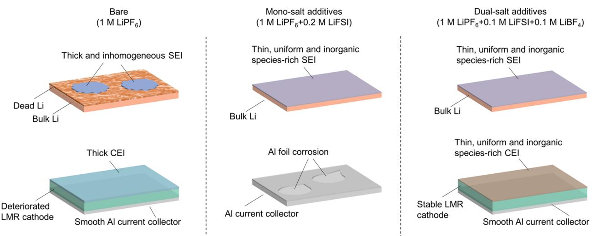
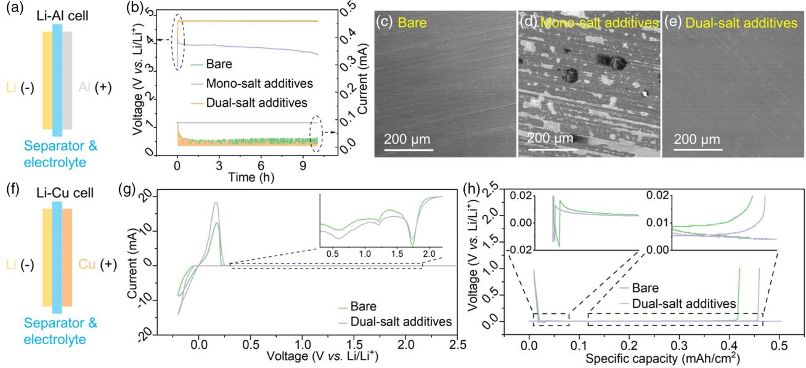
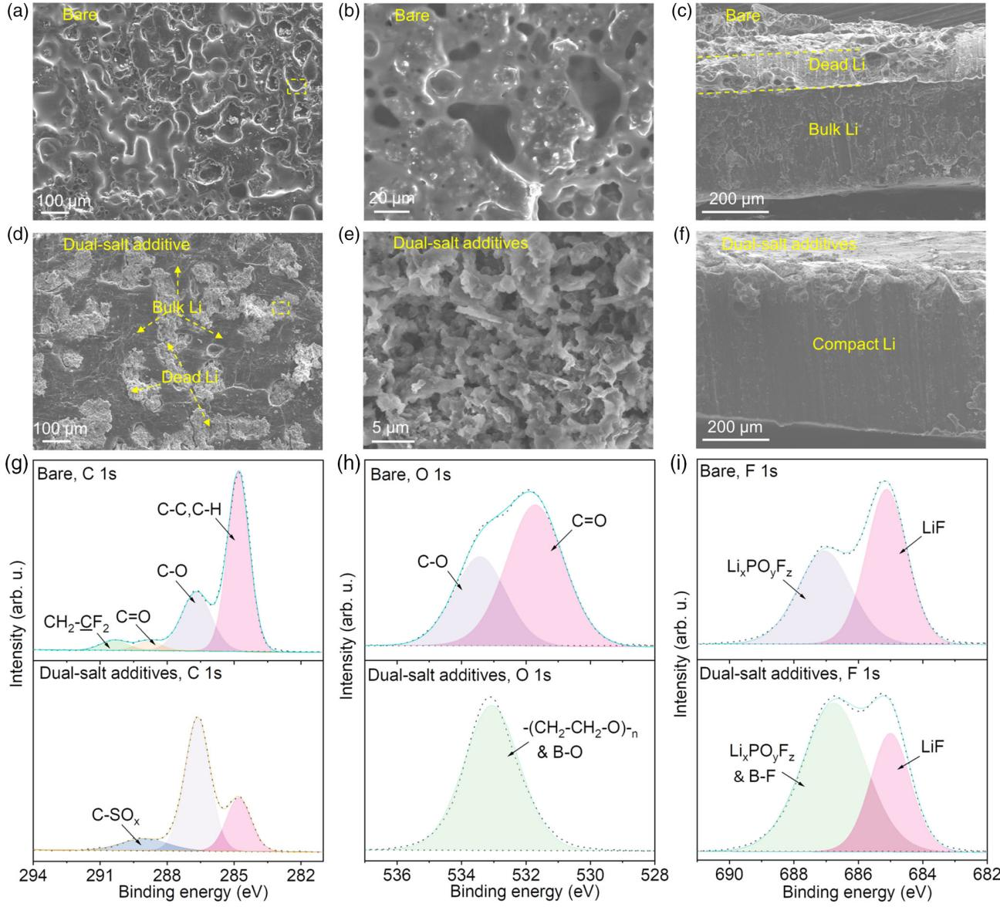
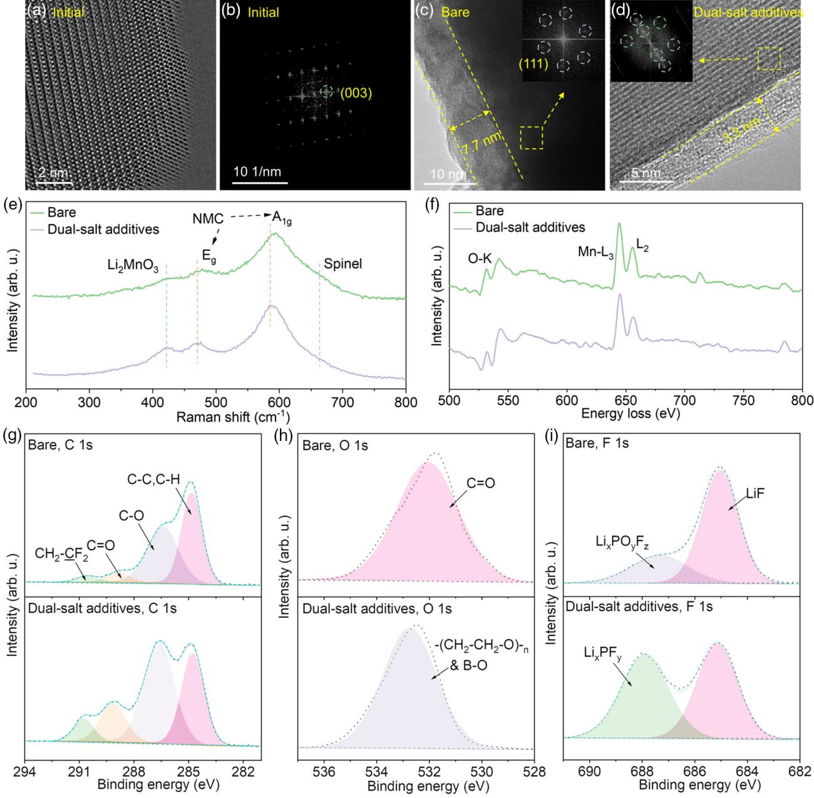

[www.advenergysustres.com](http://www.advenergysustres.com)

# Dual-Salt Electrolyte Additives Enabled Stable Lithium Metal Anode/Lithium–Manganese-Rich Cathode Batteries

Junhua Zhou, Xueyu Lian, Qitao Shi, Yu Liu, Xiaoqin Yang, Alicja Bachmatiuk, Lijun Liu, Jingyu Sun, Ruizhi Yang, Jin-Ho Choi, and Mark H. Rummeli\*

Although lithium (Li) metal anode/lithium–manganese-rich (LMR) cathode batteries have an ultrahigh energy density, the highly active Li metal and structural deterioration of LMR can make the usage of these batteries difficult. Herein, a multifunctional electrolyte containing LiBF4 and LiFSI dual-salt additives is designed, which enables the superior cyclability of Li/LMR cells with capacity retentions of 83.4%, 80.4%, and 76.6% after 400 cycles at 0.5, 1, and 2 C, respectively. The dual-salt electrolyte can form a thin, uniform, and inorganic species-rich solid electrolyte interphase (SEI) and cathode electrolyte interphase (CEI). In addition, it alleviates the bulk Li corrosion and enhances the structural sustainability of LMR cathode. Moreover, the electrolyte design strategy provides insights to develop other high-voltage lithium metal batteries (HVLMBs) to enhance the cycle stability.

#### 1. Introduction

An increasing demand for lithium-ion batteries for electric vehicles with a long range of power is required to develop next-generation lithium secondary batteries with higher energy densities (>500 Wh kgcell1 ).[1–3] The combination of a Li metal anode (3860 mAh g1 ) and lithium–manganese-rich (LMR) cathode with a high capacity (>250 mAh g1 ) and voltage (3.5 V vs Li/Liþ) is one of the most promising technical solutions.[3] Nevertheless, lithium metal suffers from severe dendrite growth

fatal safety concerns and a low Coulombic efficiency.[4–6] Regarding the LMR cathode, voltage hysteresis, sluggish kinetics, and voltage fade are mainly caused by its surface reconstruction from layered to spinel-like and finally to a disordered rock-salt structure, which also counteracts its partial advantages.[7,8] The challenges from the anode and cathode are closely linked to their interface. A well-designed electrolyte for establishing an enhanced solid electrolyte interphase (SEI) at the anode and cathode electrolyte interphase (CEI) at the cathode has been demonstrated to be an effective strategy.[9–12]

and high chemical activity, which results in

Although conventional LiPF6-based electrolytes can operate well in existing

commercial graphite anode/4.2 V-class cathode systems, their compatibility in high-voltage lithium metal batteries (HVLMBs) is very poor.[13,14] The newly developed high-concentration electrolyte (HCE) with a miscible lithium salt (e.g., lithium bis(trifluoromethylsulfonyl)imide (LiTFSI), lithium bis(fluorosulfonyl)imide (LiFSI), and lithium bis(pentafluoroethanesulfonyl) imide (LiBETI)) exhibits a significantly better performance by tuning the solvation structure to widen its electrochemical window and enhancing the interface stability. However, the costly lithium salt and decreased ionic conductivity

J. Zhou, X. Lian, Q. Shi, Y. Liu, J. Sun, R. Yang, J.-H. Choi, M. H. Rummeli College of Energy Soochow Institute for Energy and Materials InnovationS (SIEMIS) Key Laboratory of Advanced Carbon Materials and Wearable Energy Technologies of Jiangsu Province Soochow University Suzhou 215006, P. R. China E-mail: [mhr1@suda.edu.cn](mailto:mhr1@suda.edu.cn) X. Yang, L. Liu School of Energy and Power Engineering Xi'an Jiaotong University No. 28, Xianning West Road, Xi'an, Shaanxi 710049, P. R. China The ORCID identification number(s) for the author(s) of this article can be found under [https://doi.org/10.1002/aesr.202100140.](https://doi.org/10.1002/aesr.202100140) © 2021 The Authors. Advanced Energy and Sustainability Research published by Wiley-VCH GmbH. This is an open access article under the terms of the [Creative Commons Attribution](http://creativecommons.org/licenses/by/4.0/) License, which permits use, distribution and reproduction in any medium, provided the original work is properly cited. DOI: 10.1002/aesr.202100140 A. Bachmatiuk LUKASIEWICZ Research Network PORT Polish Center for Technology Development Stablowicka 147, Wroclaw 54-066, Poland J. Sun Beijing Graphene Institute (BGI) Beijing 100095, P. R. China M. H. Rummeli Institute for Complex Materials Leibniz Institute for Solid State and Materials Research Dresden P.O. Box 270116, D-01171 Dresden, Germany M. H. Rummeli Centre of Polymer and Carbon Materials Polish Academy of Sciences M. Curie-Sklodowskiej 34, Zabrze 41-819, Poland M. H. Rummeli Institute of Environmental Technology VSB-Technical University of Ostrava 17. Listopadu 15, Ostrava 708 33, Czech Republic

due to the increased viscosity impede the practical application of HCE.[15–18] Applying local HCEs seems to be a more feasible solution, implemented by introducing an inert diluent into HCE system, such as bis(2,2,2-trifluoroethyl) ether (BTFE), 1,1,2,2-tetrafluoroethyl-2,2,3,3-tetrafluoropropyl ether (TTE), and fluorinated orthoformate, tris(2,2,2-trifluoroethyl) orthoformate (TFEO). The diluent cannot damage the solvation structure of HCE, but decreases the viscosity of electrolyte.[19–22]

Moreover, the modification of traditional ethylene carbonate (EC)-based electrolytes by solvent or salt additives seems to be a more direct way to stabilize HVLMBs.[23–26] For instance, carbonate electrolytes, which contain fluoroethylene carbonate (FEC) and vinylene carbonate (VC), have been identified to be effective. This is particularly for alloy anodes with significant volume expansion, which improves the stability of SEI by forming LiF and poly(VC) species.[27,28] In addition to solvent additives, salt compounds such as LiTFSI, LiFSI, and lithium difluoro (oxalato) borate (LiDFOB) can visibly escalate the sustainability of SEI and CEI by generating an inorganic-rich interface.[29,30] Even so, the exploration of synergistic effect of dual-salt electrolyte additives, especially for LMR-based HVLMBs, is rare.

This study designed an innovative electrolyte which contains dual-salt additives by adding 0.1 M LiFSI and 0.1 M lithium tetrafluoroborate (LiBF4) salt to a bare electrolyte (1 M LiPF6 in EC–DMC–DEC (1:1:1 by volume) þ2 wt% VC þ 10 wt% FEC)). This dual-salt electrolyte can improve the cycling performance of Li/LMR battery greatly with a capacity retention of 83.4%, 80.4%, and 76.6% after 400 cycles at 0.5, 1, and 2 C, respectively (1 C ¼ 300 mAh g1 ). Notably, the monosalt additives (only contain LiFSI additives) cannot work because of the severe Al current collector corrosion which is caused by the imide ion in the LiFSI molecule (Figure 1). The Li/LMR battery can only work well when LiFSI and LiBF4 additives exist together (dual-salt additives). LiBF4 helps protect the Al current collector from being

attacked by imide ions. Meanwhile, LiFSI facilitates the formation of a thin, uniform, and inorganic species-rich SEI and CEI.

### 2. Results and Discussion

#### 2.1. Exploring the High- and Low-Voltage Character of Various Electrolytes

The Li–Al cell (Figure 2a) was used to explore the high-voltage characteristics and compatibility of the electrolyte with the Al current collector. From the galvanostatic–potentiostatic test in Figure 2b, the cell using the bare and dual-salt electrolyte can be charged from an open-circuit voltage to 4.8 V very quickly (100 s) at 0.5 mAh cm2 during the galvanostatic stage. In addition, their leak current after potentiostatic charging at 4.8 V for over 2 h is considerably tiny, which is about 0.007 mA. This indicates that they are extremely stable at a high potential. Nevertheless, the monosalt case could never be charged to 4.8 V. This is replaced by the gradually decreased voltage after only charging to 4 V. This special phenomenon reveals that LiFSI will react with the Al foil at a high potential because the LiFSI itself cannot be oxidized below 5 V.[31] The corresponding scanning electron microscopy (SEM) images in Figure 2c–e and S1a–c, Supporting Information, display the smooth surface of the Al foil for the bare and dual-salt electrolyte; however, severe Al corrosion of the monosalt electrolyte occurs after cycling. The Al corrosion mechanism with LiTFSI or LiFSI has been proven to be a Lewis reaction which is between Al and TFSI or FSI to form the complex [Al(N(SO2CF3)2)x)] 3þx species, which can be eliminated by introducing LiBF4 or LiDFOB attributed to the formation of a passive layer on Al foil composed of Al–F, Al2O3, and B–O species.[32]

The Li–Cu cell (Figure 2f ) is further applied to monitor the SEI and lithium deposition-striping characteristics in various

Figure 1. Schematic illustration of the effect of a variety of electrolyte systems on the Li metal anode and LMR cathode. The bare electrolyte cannot form a stable SEI and (CEI, thus resulting in severe Li metal corrosion and structural reconstruction of the LMR cathode. For monosalt additives, although the LiFSI containing N, S, and F elements can help generate sustainable inorganic-rich SEI and CEI, the severe Al corrosion will cause this case to fail. Dualsalt additives can face these challenges by enhancing the interface and Al current collector stability by the synergistic effect of LiFSI and LiBF4.

Figure 2. Exploring the high and low voltage characteristics of the electrolyte with the various additives. a) Configurations of the Li–Al cell. b) Galvanostatic–potentiostatic (4.8 V) charge curves of the Li–Al cell by using a bare, monosalt, and dual-salt electrolyte. c–e) SEM images of the Al foil after charging in the bare (c), monosalt (d), and dual-salt electrolyte (e), respectively. f ) Configurations of the Li–Cu cell. g) CV curves of the Li–Cu cell with a bare and dual-salt electrolyte at 0.1 mV s1 between 0.2 and 2.5 V. h) Charge–discharge plots of the Li–Cu cell by depositing 0.5 mAh cm2 of the Li foil and then fully stripping Li to 1 V at the first cycle with a current density of 0.5 mA cm2 .

electrolytes. The CV curves in Figure 2g show a pair of sharp redox peaks which originate from the lithium plating–stripping process, where the slightly higher peak current and the lesser polarization of the dual-salt in comparison with the bare electrolyte demonstrate its faster kinetics. The enlarged plots further present three main peaks (1.73, 1.21, and 0.59 V) which correspond to the decomposition of the various components in the electrolyte to form SEI. In addition, the mildly higher onset potential of the dual-salt case than the bare electrolyte can be attributed to the preferable dissociation of the LiFSI and LiBF4 additives to form SEI. The charge–discharge plots in Figure 2h and S2a, Supporting Information, and the corresponding enlarged figures on the top left and right corner indicate that the dual-salt electrolyte delivers a higher Coulombic efficiency, a lower nucleation potential, and a reduced polarization than the bare electrolyte. The minor semicircle in the Nyquist curves (Figure S2b, Supporting Information) of the dual-salt electrolyte further proves its accelerated dynamics, which agrees with the CV and the charge–discharge results.

#### 2.2. Electrochemical Performance of the Li/LMR Cell

Commercial LMR cathode (Li1.2Mn0.54Ni0.13Co0.13O2; Figure S4, Supporting Information) materials and the corresponding Li/LMR coin cells were used to assess the effect of the dual-salt additives when the conventional carbonate electrolytes were modified. LMR cathodes are usually depicted as a combination of a layered LiNixCoyMnzO2 (x þ y þ z ¼ 1, NCM) analogue and Li2MnO3 phase, where the high capacity of the LMR originates from the cumulative cationic and anionic redox processes from the NCM and Li2MnO3 parts, respectively.[33] The two-stage

charge curves in Figure 3a for the bare and dual-salt electrolytes exhibit the typical nature of the LMR cathode. As a result, the slope is at a relatively low potential, and it has a long platform at 4.5 V, which corresponds to Liþ extraction from the NCM and Li2MnO3 parts, respectively. The following S-shaped discharge profiles deliver the coupling of these two processes, where the asymmetric charge–discharge plots originating from the irreversible oxygen-redox character will result in a severe voltage hysteresis and a decreased energy efficiency. The corresponding differential curves in Figure 3b reveal a relatively low anodic peak at 3.9 V. This is indexed to the oxidation of Ni2þ to Ni4þ and Co3þ to Co4þ. In addition, the intense anodic peak at 4.5 V is assigned to the activation of Li2MnO3, and the following wide cathodic peak at 3.4 V belongs to the reduction of the oxygen and metal ions.

The cycling tests in this work all experienced three formation cycles at 0.1 C (1 C ¼ 300 mAh g1 ) to generate a stable SEI and CEI prior to formal cycling. Figure 3c and S5a, Supporting Information, show that the Li/LMR cell with a dual-salt electrolyte delivers an excellent capacity retention of 96.6% and a decent Coulombic efficiency of 99.4% after 100 cycles at 0.5 C, but the values are only 77.3% and 95.5% for the bare condition. The voltage decay is an intrinsic defect of LMR materials, which can also be partially alleviated by modifying the electrolyte additives (Figure 3d, bare electrolyte: 3.46 V ! 3.16 V, dual-salt electrolyte: 3.47 V ! 3.32 V).

The charge–discharge and the corresponding differential curves for various cycles at 0.5 C are further analyzed to reveal the capacity and voltage fade mechanism. Figure 3e shows the gradually increasing voltage polarization for the bare electrolyte. In other words, the upshift charge plots and downshift discharge

Figure 3. Electrochemical performance of the Li/LMR cell. a,b) Charge–discharge (a) and the corresponding differential (b) curves of the Li/LMR cell with a bare and dual-salt electrolyte in the first cycle at 0.1 C (1 C ¼ 300 mAh g1 ). c,d) Specific capacity (c) and average discharge potential (d) of the Li/LMR cell with a bare and dual-salt electrolyte during the initial 100 cycles at 0.5 C. e,f ) Charge–discharge curves of the Li/LMR cell with a bare (e) and dual-salt (f ) electrolyte in the 2nd, 20th, 50th, and 100th cycles at 0.5 C. g) Long cycling performance of the Li/LMR cell with the dual-salt electrolyte at 0.5, 1, and 2 C, respectively. h) A comparison of the specific capacity and cycle life for the Li/LMR cell by using a variety of electrolyte additives which are reported in the literature and in this work.

plots cause a capacity and potential decay. From the corresponding V versus dQ/dV curves in Figure S5b, Supporting Information, the voltage decay appears for the oxidation (4.46 V ! 3.75 V, 3.82 V ! 3.14 V) and reduction (3.31 V ! 3.01 V) peaks, and the decreased peak intensity implies the atrophic redox reaction. These modified peaks can be attributed to the unstable CEI, especially at high voltages (4.8 V), resulting in the marked impedance (Figure S6, Supporting Information) and polarization. Meanwhile, the surface reconstruction of the LMR material from layered to spinel-like and finally to a disordered rock-salt structure (demonstrated in the last section) gives rise to new peaks at 3 V and sluggish kinetics.

As for the dual-salt additive case, the almost overlapping final point of the charge–discharge curves (Figure 3f ) can be attributed to the gradual activation of the Li2MnO3 compound, which results in an unaltered capacity.[8] Moreover, the potential gap between the charge and discharge plots does not increase visibly because both the lithiation and delithiation curves go downward, which indicates the mitigated polarization. The corresponding differential curves presented in Figure S5c, Supporting Information, further depict the decreased peak potential and increased peak intensity after cycling. There is a markedly changed electrochemical behavior in comparison with the bare case, which demonstrates the enhanced interface and bulk stability, thus resulting in an alleviated voltage and capacity decay.

Long cycling tests finally delivered the superior performance of the Li/LMR cell by using a dual-salt electrolyte, with capacity retentions of 82.3%, 80.4%, and 76.6% at 0.5, 1, and 2 C, respectively, after 400 cycles. This electrochemical behavior largely surpasses the performance of the other works by using electrolyte additives to modify the LMR-based batteries. This includes the following: trimethyl phosphite (TMP),

tris(2,2,2-trifluoroethyl) phosphite (TTFPP), phenyl vinyl sulfone (PVS), trimethyl borate (TMB), trimethylsilyl (trimethylsiloxy) acetate (TMSA), bis(trimethylsilyl) carbodiimide (BTMSC), triphenyl phosphite (TPPi), methyl diphenylphosphinite (MDP), tris(trimethylsilyl)borate (TMSB), and prop-1-ene-1,3-sultone (PES) (the detailed data and references are listed in Table S1, Supporting Information). To further evaluate the Li/LMR cell at a condition close to that of a real Li metal battery, a thin Li metal (100 μm) and a thick LMR electrode (11.1 mg cm2 ) are used as the anode and cathode, respectively, to assemble a 2032-type coin cell (T-Li/LMR cell, Table S2, Supporting Information). Figure S9, Supporting Information, shows that the T-Li/LMR cell can cycle normally during the first primary 100 cycles at 0.1 C with the capacity retention of about 87%.

#### 2.3. Bulk and SEI Characterization of the Cycled Li Anode

The combination of the SEM and X-ray photoelectron spectroscopy (XPS) techniques was used to explore the functional mechanism of the dual-salt electrolyte to largely improve the cyclability of the Li/LMR cells regarding its SEI nature. From the SEM images in Figure 4a, the Li metal retrieved from the bare electrolyte has severe corrosion with a rough and porous surface. This was completely coated by a thick SEI layer, as shown in the corresponding enlarged Figure 4b. The cross-sectional images (Figure 4c) further reveal that the thickness of the dead Li layer is 82 μm. This indicates that the electrolyte without additives cannot generate a sustainable SEI layer, resulting in the depletion of the electrolyte and an increased impedance.

Figure 4. Bulk and SEI characterization of the cycled Li anode from the Li/LMR cell after 100 cycles. a–d) Top surface and cross-sectional SEM images of the Li metal anode with a bare (a–c) and dual-salt (d–f ) electrolyte. g–i) XPS spectra of C 1s (g), O 1s (h), and F 1s (i) with a bare and dual-salt electrolyte.

In contrast, the Li metal anodes with dual-salt electrolytes exhibit much better surface and bulk properties. Although numerous areas with a high contrast in the SEM images (Figure 4d) were captured by the dead Li, extensive intact bulk Li regions were also visible, even in the low-magnification images. The corresponding enlarged plots (Figure 4e) of the degradation area show that the dead Li displays the needle mixed with a particle-like dendrite rather than the bare case. The cross-sectional images in Figure 4f depict the compact Li for the dual-salt electrolyte. This demonstrates that these additives can facilitate the formation of a robust SEI layer to protect the bulk lithium metal from an electrolytic attack.

XPS was further applied to identify the exact composition of the SEI. For the bare electrolyte, the C 1s spectra in Figure 4g display that the carbon containing organic species of the SEI layer mainly includes a hydrocarbon (284.8 eV, C—C/C—H), ether carbon (286.7 eV, C—O), carbonyl group (288.7 eV, C═O), and carbon fluoride (290.4 eV, CH2—CF2) in the C 1s spectra.[31,34,35] These compounds can be assigned to the dissociation of the carbonate electrolyte solvent and lithium salt, where the underlined elements indicate the atoms of interest in the identified species. The O 1s spectra (Figure 4h) confirm that the oxygen-containing functional groups cover the carbonyl group (531.7 eV, C═O) and ether carbon (533.4 eV, C—O), which is consistent with the C 1s results. The conventional inorganic SEI species containing LiF (685.1 eV) and LixPOyFz (687 eV) were also monitored by the F 1s, Li 1s, and P 2p XPS patterns (Figure S10a,b, Supporting Information), which originate from the decomposition of the LiPF6 salt and FEC additives. This organic-rich SEI, which is driven by the bare electrolyte, cannot generate a sustainable SEI layer to protect the bulk Li from electrolyte attacks, thereby resulting in drastic lithium metal corrosion and electrolyte depletion. SEI cover C—C/C—H, C—O, and C—SOx (289 eV) in the C 1s

Nevertheless, for dual-salt additives, the carbon species in the spectra (Figure 4g). In particular, the newly appeared C—SOx compound comes from the dissociation of the LiFSI salt when it discharges to a low potential. In the O 1s spectra (Figure 4h), only the B—O segment originating from the LiBF4 decomposition or —(CH2—CH2—O) —n (533 eV, these two compounds have similar binding energies) is detected instead of the C═O and C—O species in the bare electrolyte. The F 1s spectra in Figure 4i further indicates the decreased LiF content and the freshly discovered B—F species for the SEI which is driven from the dual-salt additives. The newly appearing compounds, including C—SOx, B—F, NOx (400 eV), SOx (169 eV), and Li2S (162.2 eV), are also supported by the Li 1s,P2p,B1s,N1s, and S 2p XPS spectra (Figure S10a–e, Supporting Information). These inorganic species-rich SEIs (Figure S10f, Supporting Information), which are driven from the dual-salt electrolyte, are stable enough to protect the Li metal from an electrolyte attack, thus resulting in a numerous amount of bulk Li and the reduced impedance.

#### 2.4. Bulk and CEI Characterization of the Cycled LMR Cathode

In addition to the SEI layer on the Li metal, electrolyte additives also play a key role in stabilizing the bulk structure and CEI of the LMR cathode. High-resolution transmission electron microscopy (HRTEM) and the corresponding fast Fourier transform (FFT) images in Figure 5a,b were applied first to reveal the local structural evolution of the LMR cathode, where the atomic columns correlate well with the layered structure which is based on the monoclinic (C2/m space group) and rhombohedral (R-3m space group) components.[33] After 100 cycles, the LMR cathode with a bare electrolyte experiences a complete surface reconstruction from the initial layered structure to a disordered rock-salt structure (with the Fm-3m space group); moreover, it can be seen that it has been coated by the CEI film with a typical thickness of about 7.7 nm (Figure 5c and S14a,b, Supporting Information). The FFT spots of the dual-salt additives (Figure 5d and S14c, d, Supporting Information) can be attributed to the mixed layered and disordered rock-salt phase which are marked with green and purple circles, respectively, indicating its partial structure distortion character. This means that the dual-salt additives can facilitate the generation of a much thinner (3.3 nm) and more uniform CEI than the bare electrolyte and alleviate the bulk structural deformation. 100 cycles at 470.9 and 585.8 cm1 can be indexed to the M—O

From Figure 5e, the two strongest Raman peaks after cycling stretching (A1g; M represents the transition metal; M ¼ Ni, Co, or Mn) mode and O—M—O bending (Eg) mode of the R-3m structure (NMC represents the layered LiNixCoyMn1–x–yO2).[36–38] The shoulder peaks at 422.3 and 663.8 cm1 indicate the presence of Li2MnO3 and spinel-like structure, respectively. The relatively weaker and blueshifted NMC and Li2MnO3 peaks of the bare electrolyte in comparison with the dual-salt case reveal its severe structural reconstruction from layer to spinel. This is in agreement with the reduced (003) and (104) peaks in the X-ray diffraction (XRD) results (Figure S15a, Supporting Information).

The O–K and Mn–L edge electron energy loss spectroscopy (EELS) spectra were used to further reveal the oxidization state of the relevant element (Figure 5f ). For the O–K edge, the preedge peak at 531.5 eV and main peak at 542.5 eV are assigned to the electron transfer from the O 1s core state to the unoccupied O 2p states which are hybridized with the M 3 d states and TM 4sp states, respectively.[39] Meanwhile, the lower Mn–L edges of the bare electrolyte (Mn–L3: 644.5 eV, Mn–L2: 655.6 eV) than the dual-salt additives (Mn–L3: 645.1 eV, Mn–L2: 656.2 eV) and its relatively higher L3/L2 ratio demonstrate its decreased chemical valence state. Meanwhile, the Mn 3s XPS spectra in Figure S16f, Supporting Information, display new peaks at low binding energies for the bare electrolyte, which is in line with their EELS results. The reduced oxidization state of the Mn element for the bare electrolyte will trigger a damaging Jahn–Teller structural distortion, which is consistent with the HRTEM and Raman results.

The XPS technique was finally applied to confirm the composition of the CEI layer. The C 1s spectra (Figure 5g) revealed that the carbon-containing compounds in the CEI film for the bare and dual-salt electrolytes mainly include C—C/C—H, C—O, C═O, and CH2—CF2, which originate from the dissociation of the carbonate electrolyte solvent, lithium salt, and PVDF binder.[31,34] The O 1s spectra further confirm that the oxygencontaining functional groups cover C═O and —(CH2—CH2— O)—n or B—O for the bare and dual-salt conditions, respectively, in which the B—O species originated from the dissociation of the

[www.advancedsciencenews.com](http://www.advancedsciencenews.com) [www.advenergysustres.com](http://www.advenergysustres.com)

Figure 5. Bulk and CEI characterization of the cycled LMR cathode from the Li/LMR cell after 100 cycles. a,b) HRTEM (a) and the corresponding FFT (b) images of the initial LMR cathode materials. c,d) HRTEM and the corresponding FFT images of the LMR cathode with the bare (c) and dual-salt (d) electrolyte after 100 cycles. e,f ) Raman (e) and EELS (f ) spectra of the LMR cathode with the bare and dual-salt electrolyte after 100 cycles. g–i) XPS spectra of C 1s (g), O 1s (h), and F 1s (i) of the LMR cathode with the bare and dual-salt electrolyte after 100 cycles.

LiBF4 salt and electrolyte solvent. Inorganic CEI constituents such as LiF, LixPOyFz, and LixPFy can also be detected in the F 1s, Li 1s, and P 2p XPS patterns (Figure 5i and S16a,b, Supporting Information), which originate from the decomposition of the LiPF6 salt and FEC additives. The newly appearing compounds, including SOx, B—F, and NOx, which are assigned to the breakdown of the dual-salt additives, were also monitored by the B 1s,N1s, and S 2p XPS spectra (Figure S16c–e, Supporting Information). These inorganic species-rich CEIs,

which are driven by dual-salt additives, are sustainable enough to accelerate the interface dynamics and mitigate bulk structural reconstruction, which results in a stable cycling performance.

#### 3. Conclusion

In this study, we designed a novel multifunctional electrolyte containing LiBF4 and LiFSI dual-salt additives. This enables

the superior cyclability of the Li/LMR cells with capacity retentions of 83.4%, 80.4%, and 76.6% after 400 cycles at 0.5, 1, and 2 C, respectively. From the anode perspective, these electrolytes can help form a thin, uniform, and inorganic species-rich SEI, which results in alleviated Li metal corrosion, electrolyte depletion, and battery failure. Meanwhile, the dual-salt electrolyte facilitates the generation of a stable CEI, and moderates the surface reconstruction of the LMR cathode, which gives rise to enhanced dynamics and structural sustainability. Note that only LiFSI additives cannot work well because of the incompatibility between the FSI and Al current collectors. The LiBF4 additive in the dual-salt case can help protect the Al foil from attack by the imide ion. Our electrolyte design strategy also provides insights for the development of other LVLMBs to enhance the cycle stability.

#### 4. Experimental Section

Electrolyte Preparation: Bare electrolyte (1 M LiPF6 in EC–DMC–DEC (1:1:1 by volume) þ2 wt% VC þ 10 wt% FEC)) for comparison in this work was obtained from DodoChem Corporation. Lithium bis(fluorosulfonyl) imide (LiFSI) and lithium tetrafluoroborate (LiBF4), all in battery-grade purity, were also acquired from DodoChem Corporation. The monosalt electrolyte was prepared by dissolving 0.2 M LiFSI salt into the bare electrolyte in an Ar-filled glove box (H2O < 0.1 ppm, O2 < 0.1 ppm). The dualsalt electrolyte was made by the same procedure except by replacing the 0.2 M LiFSI salt with 0.1 M LiFSI and 0.1 M LiBF4 salt.

Electrode Preparation: The LMR cathode electrodes were prepared by first mixing Li1.2Mn0.54Ni0.13Co0.13O2 (Guangdong Canrd New Energy Technology Corporation) active materials, Super P (TIMCAL) conductive additives, and a poly(1,1-difluoroethylene) (PVDF, Arkema) binder in a mass ratio of 8:1:1 in N-methylpyrrolidone (NMP, Aladdin) solvent with magnetic stirring for 12 h. The obtained slurry was then cast on an Al current collector with a thickness of 200 μm by a scraper and dried at 80 C for 2 h. After that, the electrode was cut into disks (diameter ¼ 14 cm) with an active material loading of 3 mg cm2 (thickness of 40 μm). Afterward, it was further dried at 120 C for 6 h in a vacuum oven prior to being transferred into the glove box.

Battery Assembly: Li-LMR coin cells were assembled in a glove box with the LMR cathode electrode, a Li metal disk (diameter ¼ 1.5 cm, thickness ¼ 0.5 mm, Alfa Aesar, 99.9%) as the counter electrode, a PP-PE-PP separator (Celgard 2325), and a bare or monosalt or dual-salt electrolyte (the amount of electrolyte in each battery was 80 μL). Li–Al or Li–Cu coin cells were fabricated by using the same procedure, except that the LMR cathode electrode was replaced with Al or Cu foil. To evaluate the Li/LMR cell at a condition close to a real Li metal battery, a thin Li metal and a thick LMR electrode are additionally used as the anode and cathode, respectively, to assemble a 2032-type coin cell (T-Li/LMR cell. For details of the parameters, see Table S2, Supporting Information).

Electrochemical Measurement: Cycling and C-rate performance of Li–LMR coin cell at 0.5, 1, 2, 5, and 10 C (1 C ¼ 300 mA g1 ) between 2 and 4.8 V (vs Li/Liþ) with the initial three formation cycles at 0.1 C were tested at 25 C using a CT3001A system (Wuhan LAND). Electrochemical impedance spectroscopy (EIS) was obtained between 1 000 000 and 0.01 Hz with the bias voltage of 0.005 V by using the CHI800D system (CH Instruments). Potentiostatic tests of Li–Al cell were conducted by first charging to 4.8 V with constant current of 0.5 mAh cm2 , and then charging to 0.0005 mAh cm2 with constant voltage at 4.8 V. CV curves of Li–Cu cell were obtained with the scan rate at 0.1 mV s1 between 0.2 and 2.5 V. Charge–discharge plots of Li–Cu cell were acquired with depositing 0.5 mAh cm2 of Li foil and then fully stripping Li to 1 V with current density of 0.5 mA cm2 .

XRD Measurement: All XRD patterns in this article were obtained by using a Bruker D8 Advance diffractometer with a Cu Kα radiation source operating at 40 kV and 40 mA. The test range, step size, and dwell time were set as 10–80, 0.02, and 0.1 s, respectively. For the initial powder test, the powder was directly pressed on a XRD specimen stage. For failure analysis, coin cells after cycling were first disassembled in the glove box to obtain the working electrode, which was then wished with DMC solvent to remove the remaining electrolyte, and dried at room temperature. The dried electrode was then sealed on the XRD specimen stage by polyimide tape for avoiding contacting air.

Raman Measurement: The dried electrode in the glove box was first fixed on a microslide, and then sealed with a transparent tape to avoid contacting with air. The Raman spectra were measured through a micro-Raman spectrometer (Horiba Jobin Yvon, HR Evolution) using a neon laser with a wavelength of 532 nm.

SEM Measurement: For the initial powder test, the powder was directly sticked on a SEM specimen stage using conductive tape. For failure analysis, the dried electrode in the glove box was first fixed on the SEM specimen stage, and sealed with a valve bag to avoid contacting air. After that, the stage was moved into the SEM sample chamber very quickly (<5 s). SEM and corresponding EDS mapping images were taken using the Hitachi SU8010 SEM operating at 10 kV and 10 mA, and 15 kV and 15 mA, respectively.

XPS Measurement: The dried electrode in the glove box was first fixed on a XPS specimen stage, and then put into a vacuum transfer chamber to avoid contacting air. XPS patterns were obtained by using a Thermo Fisher Escalab 250Xi XPS with Al Kα radiation source. All binding energy in this work was calibrated based on C contamination using the C 1s peak at 284.8 eV.

TEM Measurement: LMR powders were first dissolved in ethyl alcohol, and then the dispersion was dripped on a standard Cu grid, and dried at room temperature. TEM images and EELS spectra were taken using spherical aberration-corrected FEI Titan Themis Cubed G2 300 TEM operating at 300 kV.

# Supporting Information

Supporting Information is available from the Wiley Online Library or from the author.

## Acknowledgements

This work was supported by the National Natural Science Foundation of China (grant no. 52071225, grant no. 51672181), the Czech Republic from ERDF "Institute of Environmental Technology–Excellent Research" (grant no. CZ.02.1.01/0.0/0.0/16\_019/0000853). M.H.R. thanks the Sino-German Research Institute for support (project GZ 1400). J.H.C. thanks the National Natural Science Foundation of China (grant no. 11874044). J.Y.S. thanks the National Natural Science Foundation of China (grant no. 51702225), Beijing Municipal Science and Technology Commission (grant no. Z161100002116020), and Natural Science Foundation of Jiangsu Province (grant no. BK20170336). R.Z.Y. thanks the National Natural Science Foundation of China (grant nos. 51972220 and 51572181), the National Key Research and Development Program of China (grant no. 2016YFB0100200), and the Key University Science Research Project of Jiangsu Province (grant no. 20KJA480003). X.Q.Y. thanks Soochow University.

# Conflict of Interest

The authors declare no conflict of interest.

#### Author Contributions

J.H.Z. and M.H.R. conceived the study. M.H.R. managed the project. J.H.Z. and M.H.R. wrote the manuscript. J.H.Z. conducted the material [www.advancedsciencenews.com](http://www.advancedsciencenews.com) [www.advenergysustres.com](http://www.advenergysustres.com)

synthesis and physical and electrochemical characterizations. J.H.Z., X.Y.L., Q.T.S., Y.L., X.Q.Y., A. B., L.J.L., J.Y.S., R.Z.Y., J.H.C., and M.H.R. discussed the results and commented on the manuscript.

### Data Availability Statement

Research data are not shared.

#### Keywords

enhanced structural sustainability, inorganic species-rich SEI and CEI, LiBF4 and LiFSI dual-salt additives, lithium metal anodes, lithium– manganese-rich cathodes

- Received: August 13, 2021
- Revised: September 16, 2021
- Published online: October 8, 2021
- [1] J.-M. Tarascon, M. Armand, Nature 2001, 414, 359.
- [2] M. Armand, J. M. Tarascon, Nature 2008, 451, 652.
- [3] J. W. Choi, D. Aurbach, Nat. Rev. Mater. 2016, 1, 16013.
- [4] D. Lin, Y. Liu, Y. Cui, Nat. Nanotechnol. 2017, 12, 194.
- [5] D. Lu, Y. Shao, T. Lozano, W. D. Bennett, G. L. Graff, B. Polzin, J. Zhang, M. H. Engelhard, N. T. Saenz, W. A. Henderson, P. Bhattacharya, J. Liu, J. Xiao, Adv. Energy Mater. 2015, 5, 1400993.
- [6] S. Li, M. Jiang, Y. Xie, H. Xu, J. Jia, J. Li, Adv. Mater. 2018, 30, 1706375.
- [7] G. Assat, J.-M. Tarascon, Nat. Energy 2018, 3, 373.
- [8] J. Zheng, P. Xu, M. Gu, J. Xiao, N. D. Browning, P. Yan, C. Wang, J.-G. Zhang, Chem. Mater. 2015, 27, 1381.
- [9] H. Maleki Kheimeh Sari, X. Li, Adv. Energy Mater. 2019, 9, 1901597.
- [10] X.-Q. Zhang, X.-B. Cheng, X. Chen, C. Yan, Q. Zhang, Adv. Funct. Mater. 2017, 27, 1605989.
- [11] X. B. Cheng, R. Zhang, C. Z. Zhao, F. Wei, J. G. Zhang, Q. Zhang, Adv. Sci. 2016, 3, 1500213.
- [12] T. Li, X.-Q. Zhang, P. Shi, Q. Zhang, Joule 2019, 3, 2647.
- [13] K. Xu, Chem. Rev. 2004, 104, 4303.
- [14] J. G. Zhang, W. Xu, J. Xiao, X. Cao, J. Liu, Chem. Rev. 2020, 120, 13312.
- [15] Y. Yamada, J. Wang, S. Ko, E. Watanabe, A. Yamada, Nat. Energy 2019, 4, 269.
- [16] Z. Zeng, V. Murugesan, K. S. Han, X. Jiang, Y. Cao, L. Xiao, X. Ai, H. Yang, J.-G. Zhang, M. L. Sushko, J. Liu, Nat. Energy 2018, 3, 674.
- [17] X. Ren, L. Zou, S. Jiao, D. Mei, M. H. Engelhard, Q. Li, H. Lee, C. Niu, B. D. Adams, C. Wang, J. Liu, J.-G. Zhang, W. Xu, ACS Energy Lett. 2019, 4, 896.

- [18] L. Suo, O. Borodin, T. Gao, M. Olguin, J. Ho, X. Fan, C. Luo, C. Wang, K. Xu, Science 2105, 350, 938.
- [19] X. Cao, H. Jia, W. Xu, J.-G. Zhang, J. Electrochem. Soc. 2021, 168, 010522.
- [20] X. Cao, X. Ren, L. Zou, M. H. Engelhard, W. Huang, H. Wang, B. E. Matthews, H. Lee, C. Niu, B. W. Arey, Y. Cui, C. Wang, J. Xiao, J. Liu, W. Xu, J.-G. Zhang, Nat. Energy 2019, 4, 796.
- [21] L. L. Jiang, C. Yan, Y. X. Yao, W. Cai, J. Q. Huang, Q. Zhang, Angew. Chem., Int. Ed. 2021, 60, 3402.
- [22] X. Ren, S. Chen, H. Lee, D. Mei, M. H. Engelhard, S. D. Burton, W. Zhao, J. Zheng, Q. Li, M. S. Ding, M. Schroeder, J. Alvarado, K. Xu, Y. S. Meng, J. Liu, J.-G. Zhang, W. Xu, Chem 2018, 4, 1877.
- [23] K. Xu, Chem. Rev. 2014, 114, 11503.
- [24] X. Zheng, X. Wang, X. Cai, L. Xing, M. Xu, Y. Liao, X. Li, W. Li, ACS Appl. Mater. Interfaces 2016, 8, 30116.
- [25] X. Li, J. Zheng, X. Ren, M. H. Engelhard, W. Zhao, Q. Li, J. G. Zhang, W. Xu, Adv. Energy Mater. 2018, 8, 1703022.
- [26] W. Tu, Y. Wen, C. Ye, L. Xing, K. Xu, W. Li, Energy Environ. Sci. 2020, 3, 19.
- [27] C. Xu, F. Lindgren, B. Philippe, M. Gorgoi, F. Björefors, K. Edström, T. Gustafsson, Chem. Mater. 2015, 27, 2591.
- [28] I. A. Profatilova, C. Stock, A. Schmitz, S. Passerini, M. Winter, J. Power Sources 2013, 222, 140.
- [29] G. Xu, X. Shangguan, S. Dong, X. Zhou, G. Cui, Angew. Chem., Int. Ed. 2020, 59, 3400.
- [30] M. Nie, B. L. Lucht, J. Electrochem. Soc. 2014, 161, A1001.
- [31] J. Zheng, M. H. Engelhard, D. Mei, S. Jiao, B. J. Polzin, J.-G. Zhang, W. Xu, Nat. Energy 2017, 2, 17012.
- [32] K. Park, S. Yu, C. Lee, H. Lee, J. Power Sources 2015, 296, 197.
- [33] S. Liu, Z. Liu, X. Shen, W. Li, Y. Gao, M. N. Banis, M. Li, K. Chen, L. Zhu, R. Yu, Z. Wang, X. Sun, G. Lu, Q. Kong, X. Bai, L. Chen, Adv. Energy Mater. 2018, 8, 1802105.
- [34] S. Jiao, X. Ren, R. Cao, M. H. Engelhard, Y. Liu, D. Hu, D. Mei, J. Zheng, W. Zhao, Q. Li, N. Liu, B. D. Adams, C. Ma, J. Liu, J.-G. Zhang, W. Xu, Nat. Energy 2018, 3, 739.
- [35] P. Verma, P. Maire, P. Novák, Electrochim. Acta 2010, 55, 6332.
- [36] R. Baddour-Hadjean, J.-P. Pereira-Ramos, Chem. Rev. 2010, 110, 1278.
- [37] F. Amalraj, M. Talianker, B. Markovsky, D. Sharon, L. Burlaka, G. Shafir, E. Zinigrad, O. Haik, D. Aurbach, J. Lampert, M. Schulz-Dobrick, A. Garsuch, J. Electrochem. Soc. 2012, 160, A324.
- [38] C. Venkateswara Rao, J. Soler, R. Katiyar, J. Shojan, W. C. West, R. S. Katiyar, J. Phys. Chem. C 2014, 118, 14133.
- [39] B. Xu, C. R. Fell, M. Chi, Y. S. Meng, Energy Environ. Sci. 2011, 4, 2223.