**2 3 4**

# **Understanding the Electrolytes of Lithium Sulfur Batteries**

N. Angulakshmi,[a] R. Baby Dhanalakshmi,[b] S. Sathya,[b, c] Jou-Hyeon Ahn,[a] and A. Manuel [Stephan](http://orcid.org/0000-0001-8533-5165)\*[b]

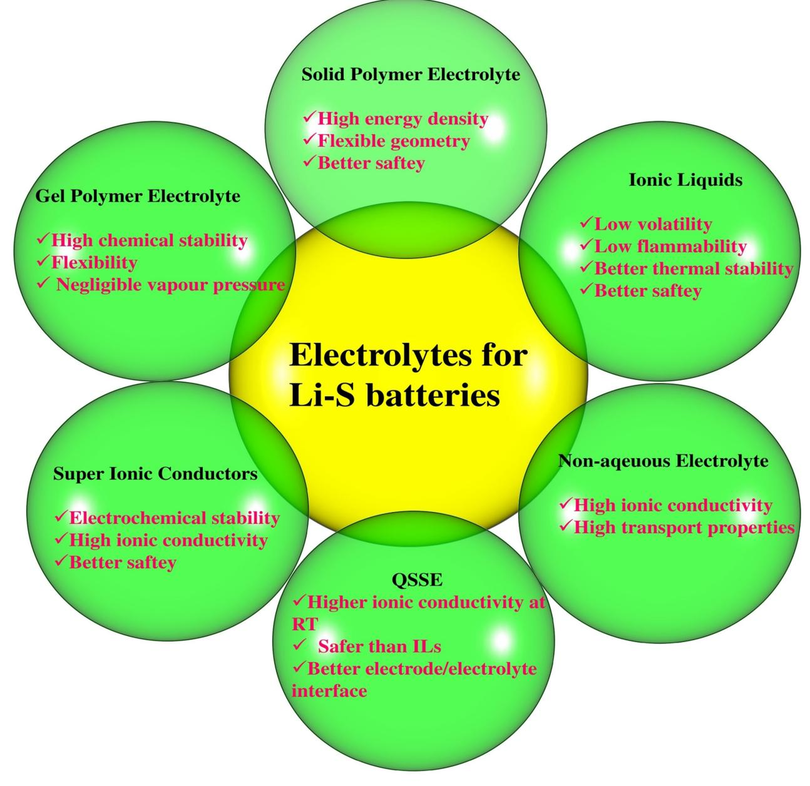

Lithium-sulfur batteries have been identified as an ultimate successor to lithium-ion batteries due to their unique properties such as extremely high theoretical specific capacity (1672 mAhg 1 ), low cost, abundance of elemental sulfur on earth's crust and environmental friendliness. However, the insulating nature and volume expansion (approximately 76%) of elemental sulfur, shuttling of polysulfides between the two electrodes and poor interfacial properties of lithium metal anode with non-aqueous liquid electrolytes still hinder the commercialization of this system. In order to mitigate the shuttling of polysulfides between two electrodes, several strategies have been adopted, including optimizing the compositions, lithium salt and additives of non-aqueous liquid

# **1. Introduction**

Although lithium-ion batteries have conquered the market for portable electronic devices such as laptop computers, mobile phone, and handy cameras,[1–4] its limited energy density and poor safety still impede this system for applications in electric vehicles and large-scale stationary energy storage devices.[5,6] With an outstanding theoretical energy density of 11,000 Whkg 1 lithium air battery system has been projected as a strong contender to fulfil the needs of energy sectors. Unfortunately, technological challenges are expected to be resolved beyond 2050.[7,8] On the other hand, unique properties such as high theoretical capacity of 1672 mAhg 1 (corresponding to the theoretical energy density of 2600 Whkg 1 or 2800 Whl 1 ), low cost, abundance of elemental sulfur and environmental friendliness of lithium-sulfur (Li S) batteries have inspired many researchers around the world.[9–10] Moreover sulfur is electrochemically active and can accept up to two electrons per atom approximately at 2.1 V vs. Li+/Li.[11,12] Despite these advantages, commercialization of this system is still plagued due to poor electronic conductivity of elemental sulfur (5×10 30 S cm 1 at 30°C), shuttling of polysulfides between the two electrodes, undesirable electrode/electrolyte interfacial properties and self-discharge.[13] During the delithiation/lithiation process, sulfur undergoes a conversion reaction between elemental sulfur (2.07 gcm 3 ) and Li2S (1.66 gcm 3 ), which corresponds to about 76% volume expansion. This eventually leads to severe disintegration of the electrodes and

| [a] Dr. N. Angulakshmi, Prof. J.-H. Ahn                                                                |
|--------------------------------------------------------------------------------------------------------|
| Department of Materials Engineering and Convergence Technology                                         |
| Gyeongsang National University                                                                         |
| 501 Jinju-daero, Jinju 52828, Republic of Korea                                                        |
| [b] R. B. Dhanalakshmi, S. Sathya, Dr. A. M. Stephan                                                   |
| Electrochemical Power Sources Division                                                                 |
| CSIR- Central Electrochemical Research                                                                 |
| Institute, Karaikudi 630 006, India                                                                    |
| Fax: (+91) 4565 227779                                                                                 |
| E-mail: amstephan@cecri.res.in                                                                         |
| [c] S. Sathya                                                                                          |
| Academy of Scientific and Innovative Research (AcSIR)                                                  |
| Ghaziabad 201002, India                                                                                |
| An invited contribution to a Special Collection on Electrolytes for Electro chemical Energy Storage |

electrolytes, and replacing the non-aqueous liquid electrolyte with ionic liquids (ILs), solid polymers, superionic conductors, and quasi-solid-state electrolytes. This review article comprehensively covers the architecture, working principles of lithiumsulfur batteries, the state-of-the-art electrolytes, their types, properties, advantages, and limitations. The importance of electrolyte additives in enhancing the safety issues of lithiumsulfur batteries is also emphasized. Here, we provide an overview of recent developments in different types of electrolytes for lithium-sulfur batteries, focusing on electrochemical properties, and more specifically discussing issues related to polysulfide shuttles.

thus degrades the performance of Li S batteries.[14] Numerous articles appear in the literature on the fundamental electrochemistry[10–15] of lithium sulfur batteries, their fading mechanism,[16] impedance analysis[17,18] and in-situ XRD[19] analyses. Attempts have also been made to enhance the electronic conductivity of elemental sulfur and improve the electrode/ electrolyte interfacial properties by confining it to conducting polymers,[20–22] carbonaceous materials such as graphene,[23–27] carbon nanotubes (CNTs),[28–31] and biomass-derived carbon.[32] However, these issues are beyond the scope of this article.

In recent years, many review articles are available in the literature describing the working principles, advantages, and limitations of Li S batteries.[10–15] The electrolytes for Li S batteries have been reviewed by Watanabe et al.,[33] Manuel Stephan and co-workers,[34] Scheers et al.[35] and Lanlan et al.[36] Very recently, Zhao et al.[37] and Wang et al.[38] emphasized the importance of lean and functionalized non-aqueous electrolytes for lithium sulfur batteries. This article mainly covers the working principles of Li S batteries, the basic properties of electrolytes, their types, additives, advantages, and limitations. The electrolytes for Li S batteries are broadly classified as (i) non-aqueous liquids, (ii) ionic liquids, (iii) solid polymer electrolytes, (iv) superionic conductors, and (v) quasi-solid-state electrolytes.

# **2. Lithium–Sulfur Battery Chemistry with Non-Aqueous Liquid Electrolytes**

The typical architecture of Li S cell composed of a sulfur-based cathode and lithium metal anode, separated by a porous polyolefin separator activated by a non-aqueous liquid electrolyte (often based on ether solvents), as depicted in Figure 1. The integration of lithium metal anode (a specific capacity of 3861 mAhg 1 ) and elemental sulfur (1672 mAhg 1 ) corresponds to an overall theoretical cell capacity of 1167 mAhg 1 for the Li S cell. With an average operating potential of 2.15 V, the system provides a theoretical gravimetric energy density of 2.51 Wh g 1 .

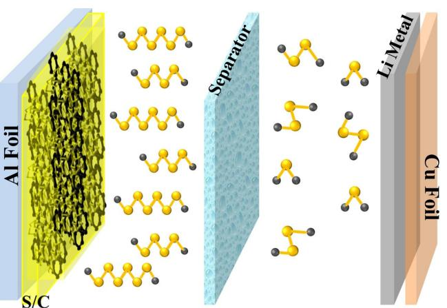

**Figure 1.** Schematic representation of a typical Li S cell with non-aqueous liquid electrolyte.

Although the concept of elemental sulfur as an active material was introduced by Herbert and Ulam almost five decades ago, its technological importance was only recognized in the early 2000s.[22] Sulfur, a non-metallic solid and cyclic yellow molecule composed of eight atoms, so-called S8, is used as an active material for Li S batteries. Sulfur forms more than 30 different allotropes,[12] but the most thermodynamically stable one at room temperature (RT) is orthorhombic alphasulfur (α-S8), with a molecular mass of 32.066 gmol 1 and a density of 2.07 gcm 3 . Sulfur has relatively low melting temperature of 115°C, and can easily be sublimed.[16]

Sulfur composite cathodes can be prepared by mixing elemental sulfur with conductive carbon additives in order to provide an electronic percolation of the whole electrode.[17] Sulfur and carbon particles are held together by polymeric binders which bind all electrode components together, and provide sufficient adhesion to the current collector.[12–16]

Figure 2 illustrates a typical charge-discharge profile of Li S cell with a non-aqueous liquid electrolyte. During discharging, elemental sulfur is reduced to Li2S by accepting Li ions and electrons at the cathode via dissimilation process. During charging, a reversible reaction takes place.[39]

The overall reaction is shown in Equation (1)

$$
S_8 + 16Li^+ + 16e^- \Leftrightarrow 8Li_2S \tag{1}
$$

In order to identify a suitable electrolyte, optimize its composition and to analyse its electrochemical performance, it

Dr. N. Angulakshmi is currently working as a Brain-Pool Research Professor at the Department of Chemical Engineering, Gyeongsang National University, South Korea. She also served as a Scientific Researcher at Wuhan University of Science and Technology, Wuhan, P. R. China with Prof. Yinghe Zhou. She was a visiting researcher (with Prof. Claudio Gerbaldi) at the Department of Materials Science and Engineering, Politechnico de Torino, Italy and Department of Chemistry (with Prof. Edward Bormashenko) Ariel University, Israel. Her areas of interests include lithium sulfur batteries and polymer electrolytes for lithium batteries.

R. Baby Dhanalakshmi graduated her Master of Philosophy in Chemistry from St. Joseph's College, affiliated to Bharadidasan University. She is currently pursuing her research under the guidance of Dr. A. Manuel Stephan at CSIR-Central Electrochemical Research Institute, India. Her current research interests are focused on the development of permselective membranes for lithium sulfur batteries and polymer electrolytes for all-solid-state lithium batteries.

S. Sathya is currently pursuing her Ph.D. at CSIR- Central Electrochemical Research Institute, India. She has been awarded Senior Research Fellowship, in 2019 by CSIR, New Delhi. Her area of research includes development of novel materials for lithium-sulfur and lithium-ion batteries

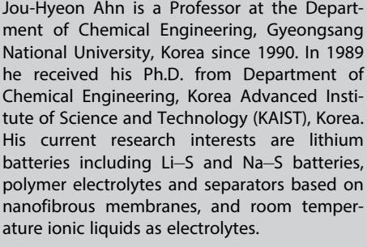

Dr. A. Manuel Stephan is a Senior Principal Scientist of Electrochemical Power Sources Division, CSIR - Central Electrochemical Research Institute (India). He undertook a STA-JSPS fellowship to work with Prof. Yuria Saito at Osaka National Research Institute (Japan) and served as Postdoctoral Fellow at the Department of Chemistry, University of Tulsa (USA) with Prof. Dale-Teeters. He worked at Chonbuk National University (South Korea) as a visiting scientist for two years (with Prof. Kee Suk Nahm) and Politecnico de Torino (Italy) in association with Prof. Roberta Bongiovanni. His current research interests include advanced materials for lithium-sulfur batteries, fast charging of lithium-ion batteries, and polymer electrolytes for all-solid-state lithium polymer batteries.

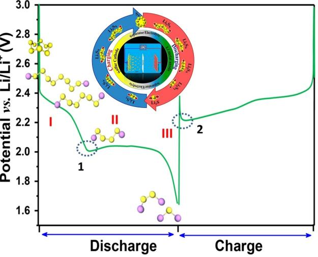

**Figure 2.** Typical charge-discharge profile of a Li S cell with non-aqueous liquid electrolyte.

is essential to understand the overall charge-discharge process of a Li S cell. Generally, the charge-discharge process of a Li S cell can be divided into three regions as described by Yang and co-workers.[40]

The first region which corresponds to 25% of its theoretical capacity (412 mAhg 1 ) in which the solid-state sulfur is dissolved into liquid electrolyte to form liquid-state sulfur and then reduced to S4 2 through a half electron transfer process. The electrochemical process is represented by Nernst equation as follows [Eq. (2)]:[41,42]

$$
E_{u} = E_{u}^{\theta} + \frac{RT}{n_{H}F} \ln \frac{S_{8(l)}^{0}}{[S_{4}^{2-}]^{2}}
$$
 (2)

The concentration of soluble S4 2 species increases with increasing depth of discharge (DOD), while S8 is almost maintained at its saturated concentration. As a result, the voltage in this region is mainly affected by the concentration of S4 2 and constantly decreases until the electrolyte viscosity rises to a certain level hindering Li-ion transport. This is evident from the small reverse peak (circled) in Figure 2. Thus, the rapid voltage drop in region I reflects concentration polarization.

Interestingly, in region II, (which offers 1260 mAhg 1 ) the soluble species S4 2 is further reduced to insoluble Li2S2 or Li2S. The transition from high discharge voltage plateau to low discharge voltage plateau occurs simultaneously with the formation of solid Li2S2 and Li2S.[35,42] This stage contributes to the major portion of the capacity at a voltage (~2.1 V) which is given in the form of Nernst equation [Eq. (3)]:

$$
E_{L} = E_{L}^{\theta} + \frac{RT}{n_{L}F} \ln \frac{[S_{4}^{2-}]}{[S_{2}^{2-}/S^{2-}]^{4}}
$$
(3)

Since both Li2S and Li2S2 have extremely low solubility in liquid electrolytes, the concentrations of S2 2 and S2 are constant. On the other hand, the concentration of S4 2

gradually decreases due to the slow kinetic reactions from soluble S4 2 to insoluble and non-conductive Li2S/Li2S2. Therefore, the discharge curve stays between 2.1 and 2 V for a longer time. Until the cathode is largely covered by the nonconductive Li2S/Li2S2, which greatly increases the cell resistance and blocks charge transfer paths, the voltage drops rapidly, and the reaction is terminated. The last sloping tail corresponds to a solid-to-solid reduction from Li2S2 to Li2S which is represented by region III. The conversion of Li2S2 to Li2S has been considered as a sluggish process owing to the solid-state diffusion into the bulk.

In the charging process, a long, flat, and low plateau is first seen, representing the oxidation of insoluble Li2S2/Li2S to soluble long-chain polysulfide species. The reduced polarization during the charging process caused by the dissolution of solid Li2S2/Li2S is verified by the small peak which is encircled as point 2 (Figure 2). The upper charge plateau indicates the oxidation reactions from the soluble long-chain polysulfide species to solid sulfur.

# **3. Non-Aqueous Liquid Electrolytes**

In a Li S cell with a non-aqueous liquid electrolyte system, sulfur species migrate from the cathode to the anode due to the concentration gradient and chemically react with lithium, leading to loss of active material and subsequently reducing its capacity. On the other hand, the Li+, which can only take place in non-redox reaction due to its highest oxidation state, forms Li2S*x*. This phenomenon is termed as polysulfide (Li2Sx) which dissolves in non-aqueous liquid electrolyte system and leads to unfavourable side reactions and adversely deteriorates the performance of the Li S cells eventually. Therefore, unquestionably, the choice of electrolyte solvent is paramount and should be engineered very carefully against nucleophilic attack of polysulfides.[43] Solvent properties such as viscosity, donor number, dielectric constant, etc. play a crucial role in affecting electrolyte properties irrespective of polysulfide species (solubility, dissociation, mobility) and passivation of lithium metal.[44] The Guttmann donor number (DN) plays an important role in the solubility of intermediate polysulfides. The high solubility of lithium polysulfides with low electrolyte-to-sulfur ratio is essential for achieving high energy density in L S batteries. The intermediate polysulfides are completely soluble in solvents with a high donor number. The molecular structures of conventional organic solvents are depicted in Figure 3.

Although the combination of carbonate solvents such as ethylene carbonate (EC), diethyl carbonate (DEC) and dimethyl carbonate (DMC) with lithium hexafluorophosphate (LiPF6) has been successfully commercialized for lithium-ion batteries, this system is found to be unsuitable for the application of Li S batteries because the carbonates react irreversibly with polysulfides via nucleophilic attack during the first discharge process.[45,46]

Interestingly, the chemical reactions in sulfurized poly (acrylonitrile)- (SPAN) SPAN cathodes differ from those in cyclo-S8- based cathodes.[47] In a ground breaking research Buchme-

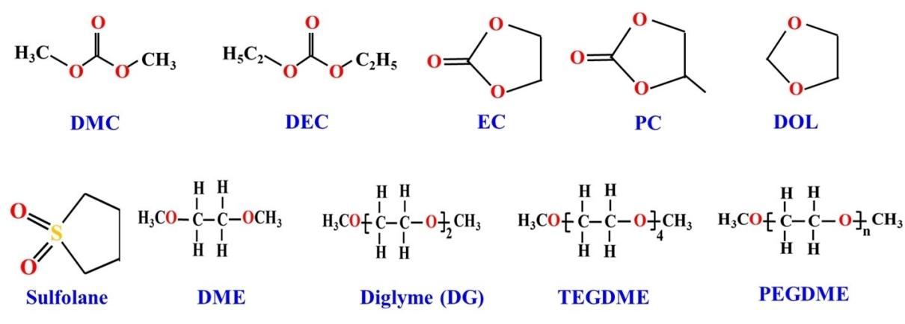

**Figure 3.** The molecular structure of commonly used solvents.

iser and co-workers[48] found that carbonates, which do not dissolve polysulfides, can be used as solvents in electrolytes for SPAN based lithium sulfur systems. In order to understand the influence of structure on the electrochemical properties different carbonate-based electrolytes were analysed for SPAN-based Li S cells. Among the systems examined the Li S cell with DMC-based electrolyte with cyclic fluoroethylene carbonate (FEC) as co-solvent containing 3 M LiTFSI (lithium bis (trifluoromethanesulfonyl)imide) offered a specific capacity of 990 mAhg 1 even after 600 cycles at 0.5 C. The better performance of carbonate based electrolyte was attributed to lower viscosity of carbonate solvents.

In the beginning dimethyl sulfoxide (DMSO) was explored as a possible electrolyte solvent for Li S batteries, but the sulfur could be reduced only to S4 2 with an efficiency of 25%.[45] On the other hand, the corresponding reduction of S2 2 using dimethyl acetamide (DMAc) resulted in 50% efficiency.[49] Tetrahydrofuran (THF), exhibited about 100% efficiency at 50°C, but is thermodynamically unstable with lithium metal anode.[50,51] Pre-requisites of solvents for the applications in Li S batteries are (i) high boiling and flash points, (ii) low viscosity and (iii) strong resistivity against high oxidative potentials. Ether-based electrolytes are commonly used as potential electrolytes for Li S batteries owing to the strong nucleophilic reactivity of polysulfide anions towards carbonate solvents. Although, the oxidative degradation of the ether functionality above 4.0 V vs. Li+/Li hampers this system for the applications in lithium ion batteries, the relatively low potential (*<*3V vs. Li+ /Li) has made ether solvents suitable for Li S batteries. Therefore, both cyclic, linear, short-chain and polymeric ethers such as dimethyl ether,[52] tetrahydrofuran,[53,54] 1,3-dioxolane,[55] tetraethylene glycol dimethyl ether,[56,57] poly(ethylene glycol) dimethyl ether (PEGDME)[58] and diglyme (DGM)[59] are most commonly used. Tetraethylene glycol dimethyl ether (TEGDME) has also been used as an ether solvent due to its moderate viscosity and high thermal stability.[56,57] Currently, 1 M LiTFSI in a binary mixture of tetraethylene glycol dimethyl ether and 1,3 dioxalane (1 :1 v/v) containing LiNO3 as an additive is widely considered as a benchmark to evaluate the performance of Li S batteries.[60] The incorporation of LiNO3 significantly improves the solid electrolyte interface of lithium metal anode.[61–64]

In a pioneering work, Rauh et al.[65] found that electrolytes with high basicity can dissolve large amount of lithium polysulfides. A very high solubility of sulfur can be achieved even up to 10 M in dimethyl sulfoxide or ethers like tetrahydrofuran. Based on the electrochemical and spectroscopic analyses of polysulfides in non-aqueous solutions, the same group[66] concluded that dynamic equilibrium, redox chemistry, and kinetics are strongly influenced by solvent complexation.

It has been suggested that the electrochemical processes in Li S cells were controlled by diffusion at the surface layer of the sulfur electrode at high depth of discharge and by the transport properties of the electrolyte system at moderate degrees of charging. More importantly, the shuttling rate of sulfur is determined by the solubility of lithium polysulfides in the electrolyte, the transport properties of the electrolyte system and the dissolution rate at the electrode. The structure of the positive electrode also plays an important role in the transfer rate.[65,66] Although the shuttling of polysulfides protects the Li S batteries from overcharging, it adversely induces the self-discharge. Moreover, in Li S batteries, the dendritic formation is much lower than in other types of lithium batteries that use metallic lithium.[67,68] Barchasz et al.[69,70] revisited the solvation ability and additives by using different combinations of TEGDME/DOL binary electrolytes. The authors also demonstrated that the lithium salt concentration plays a vital role in the formation of better passivation, facilitating reduction of the shuttle mechanism and capacity loss. The solvation ability is also identified as a key parameter for better electrochemical performance of Li S cells. Using electrochemical and in-situ X-ray absorption spectroscopy, Gao et al.[71] demonstrated the influence of electrolytes on the charge-discharge studies of Li S cells. A discharge capacity of about 1000 mAhg 1 was delivered by the Li S cell when TEGDME and DOL/DME (DOL: 1,3-dioxolane, DME: 1,2-dimethoxyethane) were used as electrolytes. While using PC/EC/DEC and EMS/DEC as electrolytes (PC: propylene carbonate EC: ethylene carbonate, DEC: diethylene carbonate, EMS: ethyl methanesulfonate), the cell delivered little capacity. Based on

electrochemical studies, the combination of solvents DOL/DME and TEGDME have been suggested as the most appropriate and promising solvents for the electrolyte of Li S batteries. Although the discharge products of sulfur in DOL/DME and TEGDME are similar, the authors found a faster self-discharge and a more complete reduction of solution-phase sulfur species during discharge for the combination of electrolytes, DOL/DME. Comparing the effect of lithium salts, LiPF6, LiCF3SO3 (lithium trifluoromethanesulfonate) and LiClO4, a relatively stable capacity is seen for LiClO4. However, poor safety concerns prevent this lithium salt from commercial applications.

The electrochemical performance of LiClO4/DOL/DME as an electrolyte was reported by Wang and co-workers.[72] Impedance analysis revealed that the formation of an impermeable layer on the surface of the cathode considerably increased the interfacial resistance of the battery. The authors also suggested that the combination of electrolytes DME:DOL (2:1 v/v) could provide a discharge capacity of 1200 mAhg 1 at the initial stage and maintain a discharge capacity of 800 mAhg 1 even after 20 cycles. Rhu et al.[73] reported the cycling behaviour of Li/TEGDME/S cells at low temperature. The cell delivered a discharge capacity of 1030 and 357 mAhg 1 at 20 and 10°C, respectively. The addition of 1,3-dioxalane and methyl acetate to TEGDME increased the discharge capacities to 1342 and 994 mAhg 1 , respectively. The improved cell performance was ascribed to the lower viscosity of the electrolyte at low temperatures. The electrochemical properties of ether-based electrolytes were reported by Barchasz and co-workers.[74] In addition, polysulfide (0.1 M Li2S6) was added as co-salt to provide additional capacity and to compensate for the loss of active mass. Unfortunately, it adversely reduced the capacity and cycle life of the cell. On contrary, unlike the above work, Chen and co-workers[75] achieved a dramatic increase in capacity, cyclability and rate capability by optimizing the concentration of polysulfide species and the amount of electrolyte in the cell. As sulfur is a conversion type-cathode material, it does not require Li+-ionic electrolyte and can be discharged even with an ammonium solution. In an unconventional way of thinking, Zhang[76] found that the addition of quaternary ammonium into the liquid electrolyte could effectively suppress the disproportionation of polysulfide intermediates and subsequently increased the capacity retention of Li S cells. Unfortunately, the redox shuttle of polysulfide could not be prevented.

## **3.1. Other Solvents**

Apart from the conventionally used solvents, other solvents such as sulfones,[77–80] N-methyl-2-pyrrollidone (NMP)[81] and DMSO[81] have also been explored. Due to their low cost, improved safety, high dielectric constant and low toxicity, sulfones were used as a single solvent or co-solvent or additive for lithium-ion[82,83] and Li S batteries.[84–88] Both tetramethylene sulfone (TMS or sulfolane)[89–91] and ethyl methanesulfonate (EMS)[92–95] have been widely used. Dominko et al. used 1 M LiTFSI containing TMS as the electrolyte solution to analyse the cycling performance of Li S cells.[86] Additionally, the polysulfides, Li2S*x* (*x>*2), were also synthesized and dissolved at different concentrations in order to improve the cycling performance. While comparing the performance of TMS, Li S cells with EMS offered better electrochemical properties due to low viscosity and high conductivity of the electrolyte solutions. Lee et al.[87] investigated the cycling performance of EMS containing 1 and 1.2 M LiPF6. The performance of EMS based electrolytes was found to be better when LiPF6 was replaced by LiTFSI. Sulfone was also employed as a co-solvent with other solvents such as DOL, DME, THF, DGM and G4 in order to exploit the advantages such as high donor number, low viscosity, and high oxidation potential of sulfones. Yoon and co-workers[89] investigated the physical and electrochemical properties of tetramethylene sulfone (TMS)/1,2-dimethoxyethane (DME) based electrolytes by varying their compositions. The dissolution of S8 was found to be lesser in the combination of TMS/DME electrolyte system than in DME alone. The authors also suggested that the chemical reactivity of the solvent should be considered along with the physical properties of the active materials when designing Li S batteries.

Very recently usage of sparingly solvating electrolytes for Li S batteries has been identified as potential technique to achieve high energy density low E/S ratios.[96] According to Cheng and co-workers[97] the successful operation of Li S chemistry under lean electrolyte conditions requires both sparing solubility of the reactants and protection of the lithium metal. Earlier reports clearly reveal that batteries based on precipitation- dissolution chemistries, even those without a reductive metal anode, require sparingly solvating electrolytes as a means to maintain reactants within the electrode and to control reactant/ product redistribution, preventing shape change over repeated cycling. However the development of sparingly solvating electrolytes for Li/S batteries is in an infant stage. The exact mechanism of sparingly solvating electrolyte at low E/S ratios is yet to be understood, ascertaining the decoupling between electrolyte quantity and reaction. For example, the Li S cell with a sparingly electrolyte composed of solvent-salt complex acetonitrile ((ACN)2)-LiTFSI and hydrofluoroether (HFE) exhibited the decomplexation of solvent from (ACN)2-LiTFSI limited the parasitic disproportionation reactions substantially and minimized the solubility and mobility of the lithium polysulfides in the electrolytes.[98]

#### **3.2. Ternary Mixtures**

There are enormous reports available on the cycling performance of binary mixtures, but few attempts have been devoted on ternary mixtures. The effect of solvent components on ternary mixtures comprising DOL, DME and diglyme (DGM) on the discharge capacity and voltage of Li S cells were reported by Kim and co-workers.[99] At the end of 25 cycles, the authors observed higher discharge capacity values when the content of DOL was less than 20%. Based on the statistical calculations, the electrolyte composition with a ratio of DME: DGM: DOL=

4:4:2 was found to be optimal in terms of voltage and discharge capacity.

## **3.3. Lithium Salts**

The lithium salt which is the source of Li+ of the electrolyte solute for lithium batteries should have the following prerequisites for the applications in lithium batteries; (i) it should be able to completely dissolve and dissociate completely in the non-aqueous media (ii) anion should be stable in the electrolyte and against oxidative decomposition at the cathode (iii) both anion and cation should be compatible with the cell components, separators and packing materials and (iv) thermally stable.[100] While summarizing the common solvents and lithium salts for lithium batteries, Dahn et al.[101] formulated a combination of 150 electrolyte solvents with 27 basic solvents the authors recommended only five salts for lithium batteries. It is worth mentioning in the case of Li S batteries the higher order polysulfides Li2S*n* (*n*�4) are highly reactive in electrolytes components and polymeric binders. According to Zhang and Tran[102] being a very strong nucleophilic agent polysulfides are prone to react with esters, carbonates, and lithium salts such as LiPF6, LiBF4, LiB(C2O4)2 and LiBF2C2O4. [71,103–105] Therefore, the selection of solvents and lithium salts for the application in Li S batteries is very limited. The most commonly used lithium salts for Li S batteries are LiTFSI and LiTF owing to their high thermal stability, good compatibility, and high dissociation ability.[106–108] However, the corrosive nature of these salts above 2.8 V vs. Li prevents from high voltage lithium battery systems.[108] The usage of LiPF6 and LiClO4 are hampered due to the generation of Lewis acids and poor safety issues, respectively.[109–112] Although numerous attempts have been made to increase the electrical conductivity of elemental sulfur and confining polysulfides by modified separators, until now there are only a few reports are available on the role of lithium salt and their charge-discharge properties. The cycling performance of ethyl methysulfone with LiTF salt was also evaluated.[113] While analysing the effect of type of lithium salt on the charge discharge properties of Li S cells Kim et al. observed a significant difference in the rate of fade in capacity and initial cycles after 50 cycles in the following order: LiTFSI*>*LiBETI*>* LiPF6*>*LiTF (LiBETI: lithium bis(pentafluoroethanesulfonyl) imide.[114] The better charge- discharge characteristics for the LiTFSI and LiBETI added electrolytes were attributed to better interfacial properties of lithium metal surface with these salts as observed by Naoi who reported the interfacial properties of different lithium salts.[115] On contrary, Gao and co-workers[71] concluded that the electrochemical performance of Li S cells cannot be altered with the type of salts used. Kolonitsyn et al. compared the influence of LiClO4 and LiTF in terms of concentration, viscosity and ionic conductivity and solubility of polysulfide in TMS solutions.[93] The increase in the viscosity of LiClO4-added solution was ascribed to higher concentration of free Li+ ions available to dynamically cross-link polysulfide chains. The solubility of Li2S6 was found to be less when the concentration was 0.3 M however a maximum conductivity was achieved when the concentration was 0.5 M. In order to reduce the over-charge and to improve the columbic efficiency Shin et al.used high concentrations up to 5 M LiTFSI in DOX: DME (1:1 v/v).[116] The authors also found a reduction in the value of diffusion and were ascribed to less dissolution of polysulfide in the electrolyte solution. Similar to polymer-in-ceramic[117] concept, Suo et al.[118] introduced solvent-in-salt (SIS) where the authors 7 M electrolytes in which LiTFSI has become a dominant component in terms of weight and volume. The authors demonstrated a uniform lithium metal anode plating and stripping with negligible polysulfide dissolution in such a high concentration which was closer to the saturation point. Armand and co-workers[119] introduced a novel designer anion (difluoromethane sulfonyl imide) (trifluoromethane sulfonylimide) [N(SO2CF2H)SO2CF3)] (DFTFSI) for the applications in Li S batteries. The performance of Li S batteries with (DFTFSI) in terms of coulombic efficiency, interfacial stability and discharge capacity was found to be superior to the widely used TFSI anion.

## **3.4. Solvent Additives**

Among beyond lithium-ion battery systems Li S batteries are expected as possibly being the closest to the market in a near future. Based on the theoretical studies Weeks et al. reported that the high theoretical energy density of Li S batteries is comparable to that of trinitrotoluene (TNT) which could lead to serious hazardous and explosions.[120] In a typical Li S battery, the lithium dendrite formed during cycling on the anode is very active and the mixture of conductive carbon and sulfur that exists in the cathode are highly flammable and explosive.[121,122] More importantly, high volatile and flammable carbonates or ethers that present are thermally unstable become explosive when they are exposed to flames.[123,124] Therefore, the safety issues of Li S batteries cannot be ignored. Although, replacement of flammable electrolytes by inherently non-flammable electrolytes such as solid electrolytes, silanes, or ionic liquids[125,126] has been suggested as an alternative way, incorporation of flame-retardant additives is identified as an economically viable method to overcome the safety issues of Li S batteries.[127,128]

In a recent review article, Zhang has emphasized the importance of electrolyte additives, their advantages, and limitations of lithium batteries.[129] According to the author, addition of 5% of either in volume or weight will significantly enhance the electrochemical properties of lithium batteries. Based on their functions the electrolyte additives are classified as (i) solid electrolyte interface improver (ii) cathode protection agent (iii) LiPF6 stabilizer (iv) over-charge protector (v) fire retardant and (vi) lithium deposition improver. The electrolyte additives play a pivotal role also in ionic salvation, against corrosion of aluminium current collector, improving the wetting phenomenon and reducing the viscosity of electrolyte.

However, in the case of Li S batteries the liquid electrolyte additive (i) assists for the formation of the solid-electrolyte interphase (SEI) layer film and protects lithium anode and (ii)

inhibits dissolution of polysulfides. Most commonly nitrate salts, ionized salts and organic sulfides are being explored. Among the additives, LiNO3 has been the most extensively studied system. The added- LiNO3 not only forms a stable SEI layer on lithium metal but also catalyses the transformation of soluble long-chain polysulfides in to elemental sulfur at the end of the charging process.[130,131] Aurbach et al. found that the addition of small amounts of LiNO3 as electrolyte additive in the conventional liquid electrolyte has appreciably improved the charge- discharge characteristics of Li S cells by forming a stable solid electrolyte interface.[132] In a similar study Godoi et al. also observed a long term stability of Li S batteries by incorporating high concentration of LiNO3. [133] The added LiNO3 not only acted for the formation of stable SEI layer but also acted as a co-salt to improve the ionic conductivity of the system. The stabilization of lithium surface by the formation of Li2O was attributed to the strong oxidizing ability of LiNO3. The cell delivered an initial discharge capacity of 1349 mAhg 1 with capacity retention of 90% even after 100 cycles. The binders with oxygen functional groups are found to improve the reduction of LiNO3. While analysing the influence of LiNO3 on the electrochemical properties of Li S cells, Deng et al.[134] observed an initial capacity of more than 1300 mAhg 1 and excellent cycling stability with 809 mAhg 1 even after 300 cycles and was attributed to the suppression of polysulfides migration to the lithium metal anode. The SEI layer component was analyzed and the formation of Li2S2O3, Li2SO4, Li2S, Li2S2 and LiN*x*O*y* were also identified. In addition to formation of stable SEI and mitigation of polysulfide shuttling, Zhang[135] observed that the NO3 radicals were reduced by polysulfide anions (S*n* 2 ) because of the higher potential than the oxidation of the S*n* 2 and the highly soluble polysulfide has been oxidized to elemental sulfur. The surface film formed on lithium metal anode with liquid electrolyte (1M LiTFSI in DIOX/ DME) added-with LiNO3 was thoroughly analyzed by XPS, SEM, and scanning probe microscopy.[136] The reaction between lithium and the electrolytes solution added with LiNO3 forms both organic and inorganic species and was attributed to the strong oxidation of LiNO3 on lithium surface.

According to Sun and co-workers[137] the self-discharge rate can be controlled to 2.07% and 0.53% per day for low and high-loading respectively with 0.5 M LiNO3 -added electrolyte. Further increase in the LiNO3 content adversely reduces the added- LiNO3 on the cathode and increases the viscosity of the electrolyte and large consumption of Li+ etc. The authors also observed a coulombic efficiency of 110% and 100% when the content of LiNO3 was 0.01 and 0.5 M respectively and was attributed to restrained polysulfide shuttling. The self-discharge of Li S cell was prevented successfully and was attributed to the synergistic effect of added-LiNO3 and Al2O3-coated membrane.

Most of the reports focused only on analysing the interfacial properties of LiNO3- added liquid electrolyte. Based on the positive role of nitrate anion on improving the electrode and electrolyte interfaces other nitrate salts such as caesium nitrate (CsNO3) [138] lanthanum nitrate LaNO3 [139] and potassium nitrate (KNO3) [140] were also explored.

Lithium Iodide (LiI) has been identified as a potential electrolyte additive for Li S batteries[141] owing to the formation of Li-ion-permeable protective coatings on both sulfur cathode and lithium negative anode. The added- lithium iodide not only prevented the dissolution of polysulfides on the cathode but also reduction of polysulfides on the anode. Interestingly, it has enhanced the cycling stability, reduced the cell over-potential and voltage hysteresis.

Wu et al.[142] observed an additional sulfur reduction process at ~2.1 V vs. Li/Li+ as a result of biphenyl-4,4'-dithiol (BPD) addition. **In situ** Raman spectroscopy, **in situ** UV-vis spectroscopy, and electrospray ionization mass spectroscopy studies revealed that the observed additional sulfur reduction process was associated with the formation of BPD-short chain polysulfide complexes such as BPD-S*n* anion (1�*n*�4). Organyl disulfides (Ph2S2) was also explored as an additive on the capacity utilization and retention as well as the efficiency in Li S batteries.[143] The catholyte containing 0.4 MPh2S2 as an additive in a conventional electrolyte comprising DOL/DME+ LiTFSI/LiNO3), delivered a stable capacity of 1050 mAhg 1 under galvanostatic cycling at 0.2 C with a Coulombic efficiency of *>*99.5%.

The pyrrole was used as a bi-functional additive when it gets polymerized on the surface of the sulfur cathode.[144] The formed polyprrole on the sulfur cathode, not only acts as an effective electron conduction path but also suppressing the diffusion of polysulfide intermediates efficiently. The results demonstrate that an appropriate amount of pyrrole added into the electrolyte leads to excellent cycling stability and rate capability. In a similar study, Li, and co-workers[145] designed a stable interfacial protective layer in lithium anode by a facile and effective strategy by using thionyl chloride (SOCl2) as electrolyte additive. The decomposition of SOCl2 not only formed a stable protective layer but also facilitated to more amount of active sulfur to offer additional capacity for the cathode in a full cell configuration.

Ahn et al.[146–148] systematically analyzed the influence of toluene in the electrochemical properties of Li S cells by varying amounts (in the range 2.5–10 vol%) of toluene in 1 MLiCF3SO3 in tetra(ethylene glycol) dimethyl ether (TEGDME) at room temperature. Although no changes were observed in the oxidation and reduction peaks electrolytes with toluene exhibited higher redox currents which resulted due to increased ion mobility and ionic conductivity. Further toluene added electrolyte offered 1.8 times higher discharge capacity than the Li S cell with toluene-free electrolyte. The better performance of the cell was attributed to lower interfacial resistance and fast stabilization of electrode and electrolyte interfacial properties which were further supported by a.c. impedance analysis. The addition of FEC has appreciably improved the cycling performance of Li S batteries as reported by Song and co-workers.[149] For the FEC added- electrolyte the authors identified the formation of LiF on the lithium surface in addition to Li*x*PF*y* and Li*x*POF*y* by XPS analysis. In the case of FEC-free electrolytes predominant peaks related to linear alkyl carbonates (ROCO2Li) Li2CO3, Li*x*PF*y* and Li*x*POF*y* have also been observed which indicates the effective mitigation of polysulfide

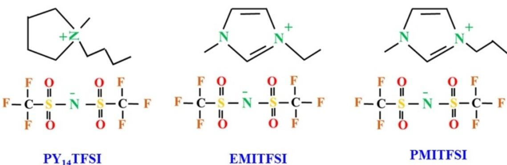

**Figure 4.** The molecular structure of conventional ionic liquids.

shuttling. Wang et al.[150] observed an extremely stable cycling and outstanding rate capability of Li S cells when tris(2,2,2 trifluoroethyl) phosphite (TTFP) was added as an electrolyte additive. The authors also measured the self-extinguishing time as a function of ionic conductivity and TTFP content. Interestingly, the SEI was drastically reduced and the electrolyte becomes non-flammable when the content of TTFP was increased to 60%. The added- TTFP not only served as a fire retardant but also improved the cathode electrolyte interface which increased the Li-ion diffusion co-efficient more than 10 fold. In a different approach Wu et al.[151] analyzed the combinatorial effect of AlCl3 and pyrrole in 1 M LiPF6/EC/DMC on the SEI formation and electrochemical performance of lithium electrode. An extremely low exchange current of 1.588×10 5 A was realized with the lithium electrode treated with 0.1 M pyrrole and 0.1 M AlCl3 containing electrolyte and a very stable lithium electrode/electrolyte interface was obtained.

Lin et al.[152] identified phosphorous pentasulfide as a potential additive for lithium-sulfur batteries. This phosphorous pentasulfide not only forms a stable passivation layer mainly composed of Li3PS4 not only functions as a solid electrolyte interface with a dense morphology but also able to conduct lithium-ions and simultaneously prevents polysulfides to the surface of metallic lithium and thus offered high Coulombic efficiency for battery cycling. Owing to its advantages such as high thermal stability and environmental friendliness lithium bis (oxalate) borate (LiBOB) has been used as a potential salt for lithium ion batteries. Additionally, it also takes part in improving the solid electrolyte interface of lithium -ion batteries.[153,154] Xiong and co-workers[155] used LiBOB with various concentrations as electrolyte additive for lithium sulfur batteries. The authors found 4 wt.% of LiBOB was found to be optimal to prevent the parasitic reaction during the formation of SEI.

# **4. Ionic Liquids**

More than two decades ionic liquids have been extensively explored as a possible electrolyte component not only for batteries,[156,157] but also in supercapacitors[158] and polymer light-emitting electrochemical cells[159–160] owing to their unique properties such as high ionic conductivity, low flammability and negligible vapour pressure, wide electrochemical stability windows and their environmentally benignancy nature.[161]

In the case of Li S batteries the ionic liquids play a vital role in suppressing the polysulfides. The mechanism of inhibition of polysulfide is explained based on hard – soft acids and bases (HSAB) theory where the weak interaction between soft Lewis base anion and Lewis acidic cations of ionic liquids effectively traps polysulfide from diffusion.[162] The most commonly employed cations and anions in ionic electrolytes are depicted in Figure 4.

Unlike organic solvents (ether, carbonate etc.,) the solvent properties of ionic liquids are mainly influenced by the interactions between cations and anions such as Coulombic, van der Waals forces, hydrogen bonding and their chemical nature with lithium salts.[163,164] The working principle of a Li S cell with an ionic liquid was illustrated by Wang and coworkers[165] as given in Figure 5. Generally, ionic liquids exhibit low solvation ability to lithium polysulfides. Most commonly, ILs have been employed in lithium batteries with various formulations as follows: IL Li salt binary mixtures,[166,167] IL Li salt-organic solvent ternary mixtures,[168,169] and IL Li salt-

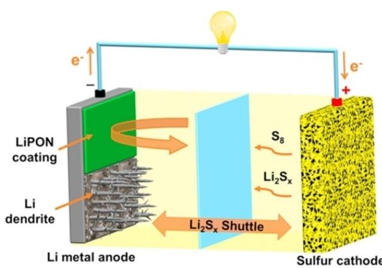

**Figure 5.** Typical Li S cell with ionic liquid as electrolyte. Reproduced from Ref. [165] with permission. Copyright (2018) Elsevier.

polymer gel electrolytes.[170,171] Among the anions TFSI has been widely explored for lithium sulfur batteries however limited cations are used. The most extensively studied cations are 1 butyl-3-methylimidazolium (BMIM), 1-ethyl-3-methylimidazolium (EMIM), 1-butyl-1-methylprrolidinium (PYR14) and 1-butyl-1- methyl piperidinium (PiP14).[172,173]

In a pioneering research Yaun et al.[174] explored the feasibility of employing ionic liquid composed of 1 M LiTFSI in *N*-methyl-*N*-butyl piperidinium-bis(trifluoromethanesulfonyl) amide ([PP14][TFSI]) for Li S batteries where the authors found better cycling performance with appreciable stability and was attributed to the suppression of polysulfide dissolution. While comparing the cycling performance of nitrogen-doped and undoped carbon for Li S cells, Sun, and his co-workers[175] have used ionic liquid electrolyte of 0.5 M LiTFSI in methyl propyl pyrrolidinium bis(trifluoromethanesulfonyl) imide ([MPPY][TF-SI]).

In a similar study, in order to reduce the viscosity and to promote the ionic conductivity of *N*-methyl-*N*-propyl pyrrolidinium bis( trifluoromethanesulfonyl) imide (MPPY-TFSI) Guo et al. have analysed the charge-discharge studies of Li S cells at 50°C.[176] The Li S cell exhibited a single plateau at around 2.3 V during the charging process and was attributed to high ionicity of the ionic liquid. Although the cell delivered lower discharge capacity than the one with organic liquid electrolyte an excellent cycling stability was achieved. In an attempt to avoid the intrinsic safety issues of Li S batteries Yan et al.,[177] utilized ionic liquid as electrolyte in which the Li S cell delivered an initial capacity of 1457 mAhg 1 on its first cycle the cell was capable of delivering 670 mAhg 1 even after 50 cycles. Kim and co-workers[178] have employed imidazoliumlithium salt binary mixture as electrolyte in a Li S cell where the authors found improved utilization and cycling performance of the sulfur cathode. On the contrary, poor rate capability and cycle life of Li S cell was also observed when IL and lithium salt was used as electrolyte. This adverse effect was attributed to the formation of a resistive layer on lithium metal resulting in a high interfacial resistance at the lithium metal anode.[179,180] Tachikawa and co-workers[181] examined the electrochemical properties of Li S cell with a so-called "quasi-IL" [LiG4]TFSI, where the [LiG4]+ cation is an equimolar complex of G4 and Li+ exhibited high coulombic efficiency at a 0.08 C-rate.

While analysing the influence of cations in TFSI-based ILs in the charge discharge properties of Li S batteries Yan et al.[182] observed that the P13 cations with the low ionic conductivity has appreciably inhibited the dissolution of the polysulfides and reduced the shuttling problems. However, the high over potential deteriorated the stability of the cells and was attributed to limited lithium ion diffusion. Seki et al.[183] studied the electrochemical properties of [Li(triglyme)][bis(trifluoro methane sulfonyl) amide] as an ionic electrolyte with a sulfur positive electrode with cyclic voltammograms which revealed that the electrode kinetics for the extraction of Li were relatively slow with a stable charge-discharge properties. In the Li S cell dissolution of Li2S in the electrolyte was effectively suppressed and the electrode kinetics of Li extraction from lithiated sulfur was slower than that of Li insertion into sulfur.

The shuttling of polysulfide was appreciably reduced by the introduction of polyimide separators with ionic liquid-based electrolytes by Wang et al.[184] While comparing the cycling performance of the Li S cells with polypropylene (PP) and polyimide separators the content of sulfur on lithium anode surface was increased up to 63.94% after 100th cycles for the Li S cell with polypropylene separator. The Li S cell with polyimide separator in conjunction with PP14TFSI-based electrolytes increased the wettability and electrochemical performance both at room temperature and high temperature (60°C). The function mechanism between polysulfide and (a) PP, (b) PI separator during cycling process is shown in Figure 6.

# **5. Hybrid Electrolytes**

Nevertheless, the superior physicochemical properties of ionic liquids found an unprecedented place in the development of safe lithium ion batteries, the relatively, high viscosity, and strong complexing between the lithium ion and anion obviously reduces the lithium ion transference number. Generally, designing of liquid electrolyte is an essential art in which all the redox-active species (S8 and Li2S*m*) are poorly soluble without sacrificing the ionic conductivity of originally dissolved lithium salts. In a ground-breaking research work, Lahiri[185] and Kim[186] found that a significant improvement in the lithium ion transport by the addition of

organic electrolytes in to ionic liquids which altered the interaction between lithium ion and anions and thus formed a weaker and more dynamic clusters. Liao et al.[187] systematically analyzed the physical and electrochemical properties of methylisopropylsulfone (MIPS) added- ionic liquids by crystallization behaviour, solubility and diffusion of polysulfide and interfacial resistance. The hybrid electrolyte composition composed of IL/ sulfone (60:40, v/v) was found to be optimal where the low coordination ability of the IL significantly reduced the lithium polysulfide formation, while the added sulfone reduced the viscosity and thereby the impedance of the cell.

The physico-chemical and electrochemical properties of hybrid electrolytes composed of room-temperature ionic liquids of different cations with the bis (trifluoromethanesulfonyl)imide (TFSI) anion and a nonaqueous liquid electrolyte [1 M LiTFSI in tetra ethylene glycol dimethyl ether/1,3-dioxolane 1 :1 (v/v)] were thoroughly investigated by Manuel Stephan et al.[188] The hybrid electrolyte composed of 1 methyl-1-propylpyrrolidinium TFSI exhibited appreciable charge-discharge characteristics, better interfacial properties with the lithium metal anode, and increased ionic conductivity and were attributed to the enhanced ion-pair interaction that present between the 1-methyl-1-propylpyrrolidiniumcation and the TFSI anion in the electrolyte. It was found that the solvent-IL interaction influences the ionic conductivity and the SEI film thickness. Evolution of over-potential curves and over-potential traces of subsequent lithium plating/stripping processes in a symmetrical cell with lithium as working electrode containing an IL-4 hybrid electrolyte at a constant current density is depicted in Figure 7.

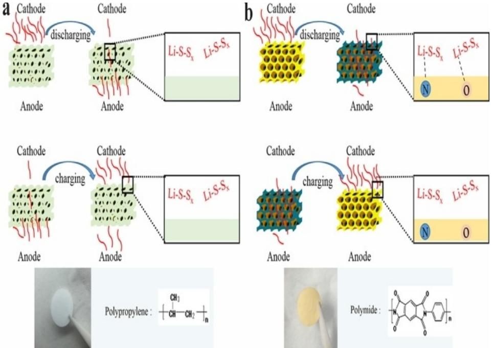

**Figure 6.** Schematic illustration of the function mechanism between polysulfide and a) PP, b) PI separator when discharging and charging. Reproduced from Ref. [184] with permission. Copyright (2017) Elsevier.

Xiang et al.[189] have doubled the rate capability and increased the ionic conductivity and cycling performance of Li S cells by the incorporation of 10% DIOX in to the PYR14 TFSI. The addition of 10% DIOX has not only reduced the viscosity of ion electrolyte but also increased the thermal stability and flash point of the hybrid electrolyte.

Shin and co-workers[190] have combined TEGDME polymer solvent with PYR14TFSI IL–LiTFSI binary mixtures and examined the role of the TEGDME solvent on the physical and electrochemical properties and the compatibility of ternary mixtures and Li metal electrodes. In addition, the charge-discharge capability of Li S cells was also performed at various temperatures. Ueno et al.[191] have introduced polysulfide insoluble electrolytes, such as solvate ionic liquids (ILs), have recently emerged as alternative candidates and shown great potential in suppressing the shuttle effect and improving the cycle stability of Li S batteries. The authors also proposed a dissolution mechanism of lithium polysulfide in ionic liquid for Li S battery. According to the authors the TEGDME has high donor ability than ionic liquids which in turn suppresses the dissolution of polysulfides.

The compatibility studies of solvate ionic liquid composed of tetraglyme (G4) and Li[TFSA] (TFSA: bis (trifluoromethanesulfonyl)amide) with the polymeric binders such as poly(ethylene oxide) (PEO) and poly(vinyl alcohol) were analyzed by Nakazawa et al.[192] The enhanced performance of Li S cell with PVA-x was attributed to the lowering of resistance of lithium polysulfide ion transport in the S composite cathode. It has also been found that the compatibility of an ionic liquid with PVA-x is more than poly ethylene oxide which led to higher discharge capacity of Li S cell.

Yang et al.[193] have analysed the N-methoxy ethyl-N-methyl pyrrolidinium bis(trifluoromethane sulfonyl)imide ionic liquidbased hybrid electrolyte for lithium sulfur batteries and these IL-based electrolytes comprising DOL or DME as co-solvent. The Li S cell with higher content of DME or DOL delivered excellent cycling stability, Coulombic efficiency, and good capacity performance.

A remarkable increase in the reversibility of Li plating/ stripping was observed by Li et al.[194] for the hybrid *N*-propyl-*N*methyl pyrrolidinium bis(trifluoromethane sulfonyl) amide (Py13TFSI) and ether based electrolyte and the increase in reversibility was attributed to synergistic effect between Py13TFSI ionic liquid and Li salt. The hybrid electrolyte enhanced the stability of SEI layer by the in situ passivation process and also the Li dendrite growth and the corrosion of Li metal anode was restrained during cycling by the surface passivation of the optimized hybrid electrolyte.

The electrochemical properties of solvate ionic liquid electrolyte with 1,1,2,2- tetrafluoroethyl 2,2,2-trifluoroethyl ether as a support solvent for advanced lithium-sulfur batteries was studied by Lu et al.[195] where the additive 1,1,2,2-Tetrafluoroethyl 2,2,2-trifluoroethyl ether (TFTFE) was used to a solvate ionic liquid (SIL) based on glyme-lithium salt. The addition of solvent supported for a favourable mobility, low dissolution ability of polysulfide and weak interaction with solvate structure. This fluorinated ether improved the cycling and rate capability of Li S cells. The Li S cell with the fluorinated ether delivered the higher reversible capacity than the un-added one, accompanied by 100% Coulombic efficiency.

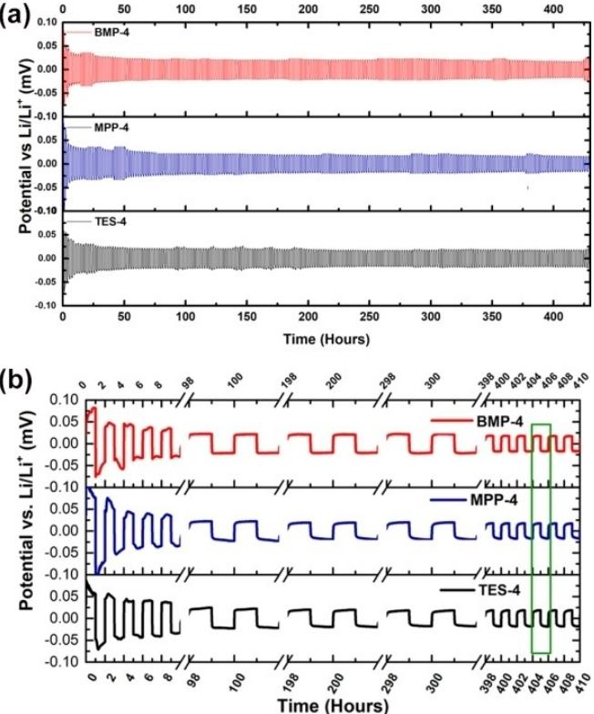

**Figure 7.** a) Evolution of overpotential curves during successive lithium plating/stripping in a Li/Li symmetrical cell with lithium as working electrode containing an IL-4 hybrid electrolyte at a constant current density (*j*=0.1 mAcm 2 ). b) Selected overpotential traces of subsequent lithium plating/stripping processes in a symmetrical cell with lithium as working electrode containing an IL-4 hybrid electrolyte at a constant current density (*j*=0.1 mAcm 2 ). Reproduced from Ref. [188] with permission. Copyright (2019) American Chemical Society.

An enhanced performance of Li S battery was observed with ionic liquid-based electrolyte in which with fluorinated ether 1,1,2,2-Tetrafluoroethyl-2,2,3,3-tetrafluoropropyl ether (TTE) was used as a co-solvent by Lu et al.[196] The incorporated fluorinated ether not only promoted ion conduction in the electrolyte but also modified and stabilized the solid electrolyte interface on Li metal, reduced charge transfer impedance, prevented the dissolution and shuttle of polysulfides and also protected the Li corrosion by polysulfide. The cell in TTEcontained electrolyte exhibited a higher reversible capacity of 505 mAhg 1 after 50 cycles with better rate capability.

Wang et al.[197] have found a pronounced suppression of polysulfide shuttle in N-methyl-N-propyl piperidinium bis (trifluoromethane sulfonyl)imide (PP13TFSI)-based electrolyte. The weakly Lewis acidic/ basic nature of PP13TFSI induces weak coordination ability with a Lewis acidic cation of Li+, and thereby the solubility and mobility of Li2SX was successfully controlled. The self-discharge rate of a full-charged cell with the LiNO3-containing ether-based electrolyte was around 4% /per day while the cell with LiNO3-containing PP13TFSI-based electrolyte exhibited almost no self-discharge.

Markevich et al.[198] used 0.5 MLi bis(fluorosulfonyl)imide (FSI) in methyl propylpyrrolidinium (MPP) FSI ionic-liquid (IL) electrolyte solution to analyse the charge-discharge characteristics of composite sulfur-carbon electrodes were prepared by encapsulating sulfur into the micropores of highly disordered microporous carbon of micrometre-sized particles. The nature of SEI surface films during the initial cycles was governed by the electrolyte solution composition and the discharge cut off voltage. Very recently, the charge-discharge studies of *N*methoxyethyl-*N*-methylpyrrolidinium bis (trifluoromethane sulfonyl)imide (P1201 TFSI) in conjunction with 1,3 dioxalane (DOL) and /or ethyl 1,1,2,2-tetrafluoroethyl ether (ETFE) as solvents for Li S cells were reported by Lu and co-workers.[199] The authors found better electrochemical properties such as ionic conductivity and acceptable polysulfide solubility for the solvents added-hybrid electrolytes than pure ionic liquid. The synergistic role of the two solvents not only enhanced the lithium ion transport and Li+ coordination in the ionic liquids but also but also facilitated for the formation of a stable solid electrolyte interface with low resistance on the surface of lithium anode.

In summary, although numerous attempts have been devoted to identify suitable electrolytes for lithium–sulfur batteries, a combination of DOL and DME of equal volume ratio has been widely studied due to their synergistic effect in terms of chemical stability towards electrodes and polysulfide solubility. However for attaining high energy density Li S batteries new solvents such as carbonates and sulfones have been explored. The reduction of carbonate solvents on lithium significantly facilitates for the formation of a stable SEI later which protects the lithium metal from parasitic reaction and prevents further reduction of electrolytes. Unfortunately, the undesirable reaction between the carbonate solvents and polysulfides deteriorates the performance of lithium sulfur batteries.

On the other hand, sulfone based solvents though have better solubility of polysulfides the high viscosity adversely minimizes the diffusion of polysulfides. Very recently, employment of lean/sparingly solvating electrolytes has been identified as an alternative way to achieve high energy density lithium batteries. In a parallel effort ionic liquids have also been investigated owing to its low polysulfide solubility however the high viscosity and cost of ionic liquids still remain as major issues. The conventional lithium salts which are widely used in lithium -ion batteries such as LiClO4, LiPF6, LiCF3SO3, LiTFSI (lithium bis(trifluoromethanesulfonyl)imide), and LiFSI (lithium bis(fluorosulfonyl)imide) have also been investigated for lithium sulfur batteries. Among these salts, LiTFSI has been extensively studied for lithium sulfur batteries owing to its unique properties such as compatibility with dissolved polysulfides, electrochemical stability and ionic conductivity. Unfortunately, the corrosive nature of lithium salts, LiTFSI, LiFSI and LiCF3SO3 with aluminium foil is a major concern that limits the calendar life of lithium sulfur batteries.

Although LiNO3 has been extensively studied as an electrolyte additive of Li S batteries results revealed that the consumption of LiNO3 while cycling reduces the Coulombic efficiency continuously. Moreover the formation of H2 and CH4 as gaseous products leads poor safety issues and thus better performance of Li S batteries can be achieved only by identifying novel electrolyte components or additives according to the post-cycling analyses.

# **6. Superionic Conductors**

Though the state-of-the-art lithium batteries and supercapacitors are mostly operated by liquid electrolytes,[200,201] the threatening challenges such as leakage of electrolyte and poor safety issues remain unsolved. More importantly, the poor solid/liquid interfacial properties and thermal instability prevent this system to achieve both high energy and power densities for the applications of huge electrochemical storage systems and electric vehicles.[202,203] Therefore, the all-solid-state battery has been projected as potential candidate among various electrochemical energy storage devices for achieving both high energy and high-power densities.[204] In the case of all-solidstate batteries comprising a cathode, anode and electrolyte the properties of the batteries mostly depend on the characteristics of the solid electrolyte.[205] Recently, Li7P3S11[206] and LGPS (Li10GeP2S12),[207] which are ionic conducting materials, were discovered. These materials have a body centred cubic anion sub-lattice structure[208] and exhibit higher ionic conductivity than liquid electrolytes. However, despite the expected advantages of all-solid-state batteries, their power characteristics and energy densities must be improved to allow their application in technologies such as long-range electric vehicles.

The ionic conductivity of sulfide-based solid electrolytes, such as Li10GeP2S12-type compounds,[209–211] Li2S P2S5 glass ceramics[212,213] and argyrodites[214,215] is over 10 3 S cm 1 at ambient temperature, which is comparable to that of nonaqueous liquid electrolytes. On the other hand, oxide solid electrolytes such as perovskite-type[216,217] and garnet-type[218,219] materials have been also found to be promising owing to their high flexibility and stability in air atmosphere.

Despite the appealing advantages of solid electrolytes, the development of all-solid-state batteries is in the infant stage in terms of energy density for the applications in electric vehicles and grid-scale energy storage systems. Owing to its exceptionally high theoretical capacity (3860 mAhg 1 ) and the electronegativity ( 3.04 V vs. standard hydrogen electrode) lithium metal has been identified as an ultimate anode material for allsolid state batteries for integrating the high energy density electrode with solid ionic conductors.

However, the undesirable side reactions of solid electrolytes and poor physical contact with lithium metal result in an increase in interfacial resistance and consequently affects the performance of the batteries.[220–222] In order to conquer these challenges, numerous attempts have been made to identify alternative anode materials such as lithium metal alloys etc.,[223,224] The introduction of buffer layer between the electrode and electrolyte was reported by Suzuki et al.[222] Unfortunately, the higher electronegativity of lithium metal alloys than that of pure lithium metal lowers the cell voltage and thus energy density. Besides, the introduction of buffer layer also increases cell resistance due to their lower conductivity compared to that of solid electrolytes. Hence, identification of a suitable solid electrolyte which is intrinsically stable and compatible with lithium metal to maximize the advantages becomes inevitable.

A hydride based complex lithium superionic conductor, 0.7 Li(CB9H10) 0.3Li(CB11H12) was successfully synthesized and its electrochemical properties was investigated by Kim et al.[225] This hydride superionic conductor exhibited a high conductivity of the order of 6.7×10 3 S cm 1 at 25°C. This complex hydride showed a stable lithium plating/stripping reaction with negligible interfacial resistance (*<*1 Ωcm2 ) at 0.2 mAcm 2 and intrinsic stability with the lithium metal anode provided the facile and stable lithium ion transfer at the interface. The developed closo-type complex hydride is intrinsically stable with the lithium metal anode that enables facile and stable lithium ion transfer at the interface. The superior deformability of 0.7Li(CB9H10)-0.3Li(CB11H12) facilitates the preparation of solid electrolytes with appreciable electrode/electrolyte interface and also opens up a new group of solid electrolytes for practical all-solid-state lithium sulfur batteries capable of delivering 1450 mAhg 1 at 25°C at 0.1 C rate.

Kato et al.[226,227] have achieved a high conductivity of the order of 25 mS cm 1 for Li9.54Si1.74P1.44S11.7Cl0 lithium superionic conductor developed for all-solid-state Li S cell. A stable cycling was demonstrated at a high current density of 18 C with good electrochemical stability. The corresponding chronoamperometric behaviours of the all-solid-state and lithiumion cells are shown in Figure 8.

The authors concluded that the superior performance of Li10Si0.3Sn0.7P2S12 than Li10GeP2S12 was attributed to tetragonal phase. The ionic conductivity of annealed pellets was characterized by electrochemical impedance spectroscopy over broad frequency and temperature ranges. The authors not only measured the total conductivity, but also differentiated grain, grain boundary and electrode impedances as highlighted in Figure 9.

The solid glass-type P2S5-Li2S solid electrolyte was prepared by pellet-pressing and the effect of the applied pressure on the ionic conductivity as well as its temperature dependence was further analyzed by electrochemical impedance spectroscopy. The cycling studies of Li S cell with this solid electrolyte delivered a discharge capacity of 400 mAhg 1 at 2.1 V with a corresponding theoretical energy density of 840 Wh kg 1 . The considering the authors concluded that solid-state, lithium sulfur cell with the Li2S P2S5 electrolyte may be projected as high-energy density battery for safe, low-cost energy storage applications.[228]

To summarize, owing to the low solubility of polysulfides, the ILs have been identified as a potential alternative to nonaqueous liquid electrolytes for lithium sulfur batteries. However the higher viscosity of ionic liquids hampers this system from commercial applications. On the other hand, hybrid electrolytes comprising ionic liquids and non-aqueous liquid electrolytes although offer higher ionic conductivity, reports on the cycling performance of Li S cells with these electrolytes are very scanty.

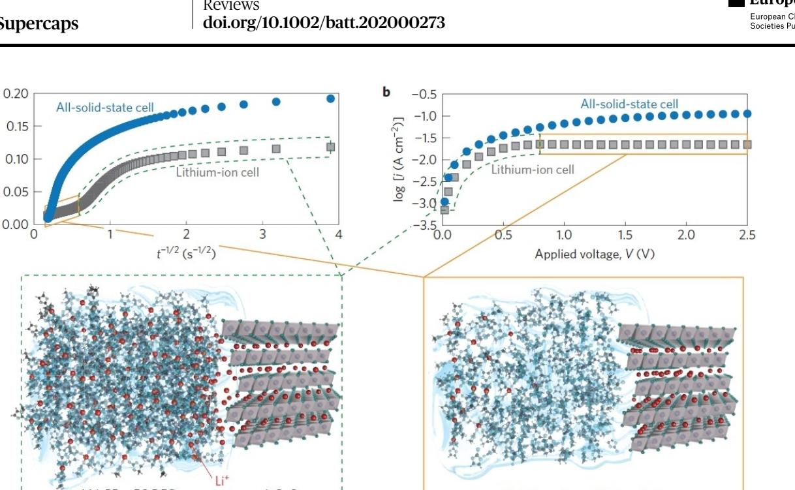

**Figure 8.** Chronoamperometric behaviours of the all-solid-state and lithium-ion cells. a) Cottrell plots of the chronoamperometric curves observed with a voltage step of 1.5 V. b) transient currents after 5 s of voltage step plotted as a function of applied voltage. The current for the lithium-ion cell remains constant for voltage steps larger than 0.8 V, which indicates diffusion limitation only for the lithium-ion cell. Insets show the cation distributions for the lithium-ion cell for non-diffusion limitation (left) and diffusion limitation (right). Almost no lithium is expected at the interface region under the diffusionlimiting conditions. Reproduced from Ref. [226] with permission. Copyright (2016) Springer Nature.

**Figure 9.** The ionic conductivity of superionic conductor with various compounds. Reproduced from Ref. [227] with permission. Copyright (2016) Elsevier.

The lithium polysulfide diffusion and migration are mainly influenced by the physicochemical nature of the electrolytes moreover the type of cation that present in the ionic liquid also influences the electrochemical and physical properties of electrolytes. While analysing the electrochemical properties of hybrid electrolytes with different cations MPP -based hybrid electrolytes offered better electrochemical properties which was further substantiated by spectroscopical and shuttle current measurements.

# **7. Polymer Electrolytes**

Generally, polymer electrolyte can be defined as a membrane which possesses transport properties comparable with that of non-aqueous ionic solutions. Polymer electrolytes find applications not only in lithium batteries but also, in other electrochemical devices such as supercapacitors and electrochromic devices, etc. Owing to their advantages such as no -leakage of electrolyte, high energy density, flexible geometry and noncombustible reaction products at the electrode surface numerous attempts have been made to replace the non-aqueous liquid electrolytes by solid polymer electrolytes.[229,230]

The pre-requisites for a polymer electrolyte for lithium batteries are (i) good ionic conductivity at ambient and subambient temperatures, (ii) reasonable mechanical integrity, (iii) appreciable thermal and electrochemical stabilities, and (v) better interfacial properties with both anode and cathode.[231–233] Although, the polymer electrolyte was invented in 1973 by Fenton et al.,[234] its technological importance was recognized only in early 1980.[235] The polymer electrolytes can be broadly divided in to three categories: (i) dry solid, (ii) gel/

plasticized polymer and (iii) composite polymer electrolytes. Yet composite gel polymer electrolyte (CGPE) is another class of polymer electrolyte in which inert oxide fillers are added to the gel electrolytes in order to improve its mechanical strength.

The dry polymer electrolytes comprising a polymer host and a lithium salt (LiX) offer very low ionic conductivity of the order of 10 8 S cm 1 at 30°C which excludes this system from ambient temperature applications.[236] The poly(ethylene oxide) (PEO) based system has been extensively studied for more than four decades which showed very low ambient temperature conductivities due to its semi-crystalline nature and thus prevents from commercialization.[237] The second category of polymer electrolyte is called ''gel polymer electrolyte'' or ''plasticized polymer electrolyte'' which is neither liquid nor solid or conversely both liquid and solid.[237,238] The gel polymer electrolytes comprise both cohesive properties of solids and the diffusive property of liquids. This unique characteristic makes the gel to find various important applications including polymer electrolytes. Composite polymer electrolyte is a subset of polymer electrolytes whereas high surface area inert fillers such as ZrO2, TiO2, Al2O3 are incorporated in to polymer matrices.[239–244] Generally, high surface area particulate fillers such as hydrophobic fumed silica were incorporated in to the polymer matrices and are called composite polymer electrolytes or nanocomposite polymer electrolytes or composite ceramic electrolytes.[245,246] The incorporation of inert fillers appreciably enhances not only ionic conductivity at low temperature but also improves the interfacial and mechanical properties of electrode/electrolytes.[247–252] The molecular structures of different polymeric hosts widely explored for lithium sulfur batteries are displayed in Figure 10.

## **7.1. Composite Polymer Electrolytes (CPEs)**

In 2017, Judez et al.[253] have studied the solid polymer electrolytes (SPEs) comprising lithium bis(fluorosulfonyl)-imide (Li[N- (SO2F)2], LiFSI) and poly(ethylene oxide) (PEO). The PEO was not only used as host material but also as a binder for an all-solidstate Li S cell. The LiFSI-based cell delivered high specific discharge capacity of 800 mAhg 1 with good rate capability. The cycling performances of Li S polymer cell with LiFSI was found to be better when compared with conventional LiTFSI (Li[N(SO2CF3)2]) salt in the polymeric membrane due to the improved stability of Li/electrolyte interphases formed in the LiFSI-based solid polymer electrolytes. In a similar study the same group[254] has studied the polymer-rich composite electrolytes with lithium bis(fluorosulfonyl)imide/poly(ethylene oxide) (LiFSI/PEO) containing either Li-ion conducting glass ceramic (LiCGC) or inorganic Al2O3 as filler. Although CPE with Al2O3 exhibited better Li/electrolyte interface stability, the Li S cell with a LICGC-based CPE delivered high sulfur utilization and cell areal capacity. Surprisingly, the Li S cell delivered a discharge capacity of 518 mAhg 1 with Coulombic efficiency higher than 99% at the end of 50 cycles at 70°C when these two CPEs were combined.

Tao et al.[255] reported the cycling properties of composite polymer electrolytes composed of Al3 +/Nb5 +co-doped cubic Li7La3Zr2O12 (LLZO) nanoparticles and LLZO nanoparticle decorated with porous carbon foam (LLZO@C) via one step Pechini sol-gel method. The LLZO nanoparticle filled poly(ethylene oxide) electrolyte exhibits high conductivity of 9.5×10 6 and 1.1×10 4 S cm 1 at 20 and 40°C, respectively compared with filler free samples. The polymer electrolyte -laden with LLZO@C could deliver an attractive specific capacity of above 900 mAhg 1 at 37°C and 1210 and 1556 mAhg 1 at 50 and 70°C, respectively. The Li S cell also exhibited high Coulombic efficiency, ion conductivity and low interfacial resistance.

In a different approach Sheng's group[256] have modified oxides by ionic liquids and successfully incorporated in a PEO matrix. The authors have also compared the electrochemical properties of ionic liquid grafted oxide nanoparticles ZrO2, TiO2 and SiO2 (IL@NP) laden composite polymer electrolytes. Among the systems reported based on the electrolyte with IL@ZrO2 showed the highest ionic conductivity of 4.95×10 4 , 2.32× 10 4 S cm 1 at 50°C and 37°C, respectively. Figure 11 illustrates the working principle of a solid-state Li S battery where the PEO was also employed as a binder. At 50°C, the PEO Li Zr battery delivered a stable capacity of 986 mAhg 1 . At 37°C, though discharge capacity was 600 mAhg 1 it remained stable even after 80 cycles.

Wang et al.,[257] compared the electrochemical properties of three different types of fillers dispersed in poly(ethylene) oxide (PEO) matrices. Among the three systems examined the active amorphous Li1.3Al0.3Ti1.7(PO4)3 (LATP) added electrolyte with 10 wt.% of LiClO4 exhibited higher ionic conductivity, glass transition temperatures, cation transport and degrees of crystallinity than the systems containing passive fillers such as TiO2 or fumed silica. The authors estimated the inherent conductivity of the interphase structure to be three to four times higher than the maximum measured value.

Although poly ethylene oxide, poly acrylonitrile, poly propylene carbonate, polyimide and polysiloxane have been widely explored as hosts for the applications in Li S batteries, polysiloxane electrolyte has been proved to be one of the most promising one for Li S batteries. In order to overcome its low ionic conductivity and mechanical integrity at ambient temperatures, Chen, and Fan[258] fabricated a polymer-in-salt polysiloxane solid polymer electrolyte (SPE) with bi-grafted polysiloxane copolymer, lithium bis(trifluoromethanesulfonyl)imide and poly (vinylidene fluoride) as shown in Figure 12. The composite polymer electrolyte exhibited high ionic conductivity of the order of 7.8×10 4 S cm 1 at ambient temperature. Furthermore, the CPE membrane effectively inhibited the growth of lithium dendrites and suppressed the diffusion of polysulfides during repeated charging/discharging cycles. The assembled Li S battery with CPE exhibited good cycling performance at 1 C, which revealed that such polymer-in-salt polysiloxane based composite electrolyte membranes can be employed for ambient temperature all-solid-state Li S batteries.

The increase in ionic conductivity for SPE largely depends on the modification of polyethylene oxide (PEO) electrolyte. Since PEO consists of ether oxygen ( C O C ) functional

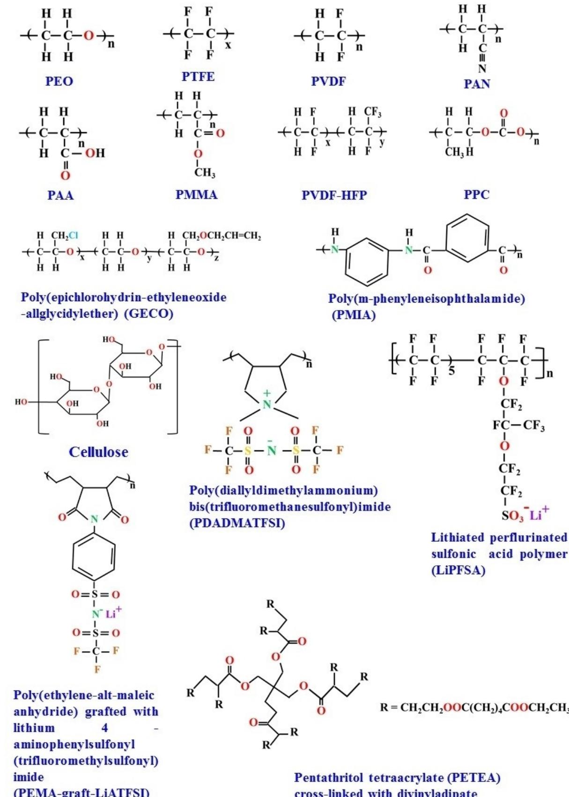

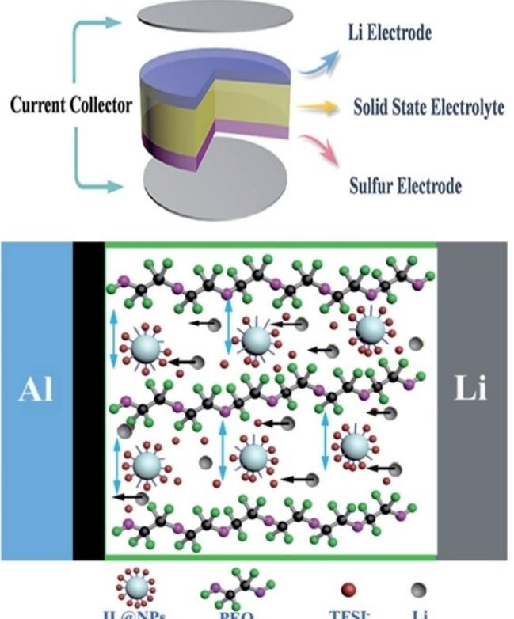

**Figure 11.** Schematic illustration of a solid-state Li S battery. Reproduced from Ref. [256] with permission. Copyright (2017) Royal Society of Chemistry.

groups, which can dissolve lithium salts and provide paths for lithium ion transport. The natural resources with C O C functional groups similar to that of PEO structure, such as polysaccharides, especially starch materials can be utilized as filler for PEO matrices. Lin et al.[259] fabricated a novel SPE film using food grade starch for advanced flexible electrolyte. This electrolyte offered high ionic conductivity of the order of 3.39× 10 4 S cm 1 with appreciable lithium ion transference number of 0.8 at 25°C. The all-solid-state Li S cell delivered an initial discharge capacity of 1442 mAhg 1 with an average discharge capacity of 864�16 mAhg 1 at 0.1 C for 100 cycles, 562� 118 mAhg 1 at 0.5 C for 1000 cycles at room temperature, and 388�138 mAhg 1 for 2000 cycles at 2 C and 45°C. This opens up a new era towards utilizing energy power in green transportation with low cost, safety, and environmentally sustainable battery.

Hu et al.[260] synthesised a graphitic-like carbon nitride (g-C3N4) a metal-free, lightweight, and stacked 2D structure mainly composed of carbon, nitrogen, and a few residual NH2 or NH groups. The g-C3N4 was successfully incorporated by Yang and co-workers[261] in a PEO+LiClO4 matrix as illustrated schematically in Figure 13. The prepared solid composite polymer electrolyte offered high ionic conductivity, electrochemical stable window, lithium ion transference number, discharge capacity and appreciable cycling stability with a capacity retention ratio of 81% after 200 cycles at 1 C at 80°C. The enhanced performance of solid polymer electrolyte was attributed to the intrinsic polarity and semiconductor property of g-C3N4 which modulated the spatial and interface distribution of ionic charge carriers.

Very recently, innovative polymers from a series of poly ether amines (PEAs) named Jeffamine have drawn the attention of many researchers which find wide applications not only as polymeric host but also in other cell components such as polymeric binders, redox active materials, and interfacial layers with enhanced electrochemical properties. The Jeffamine-type PEAs are a type of modified polyethers comprises either ethylene oxide (EO), propylene oxide (PO), or a mixture of EO/ PO.

Aldalur et al.[262] developed a new type of comb polymer material based on polyether amines oligomer side chains (Jeffamine compounds) with good elastomeric properties. Jeffamine based-SPEs exhibited higher ionic conductivity (4.5× 10 5 S cm 1 at room temperature) than those of the conventional SPEs containing LiTFSI and PEO, owing to its amorphous nature. It also offered good electrochemical stability, thermal

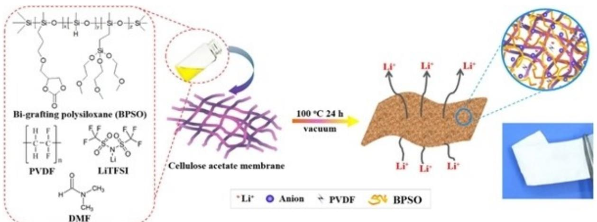

**Figure 12.** Schematic illustration fabricating composite polymer electrolyte membrane by solution-casting technique. Reproduced from Ref. [258] with permission. Copyright (2018) Elsevier.

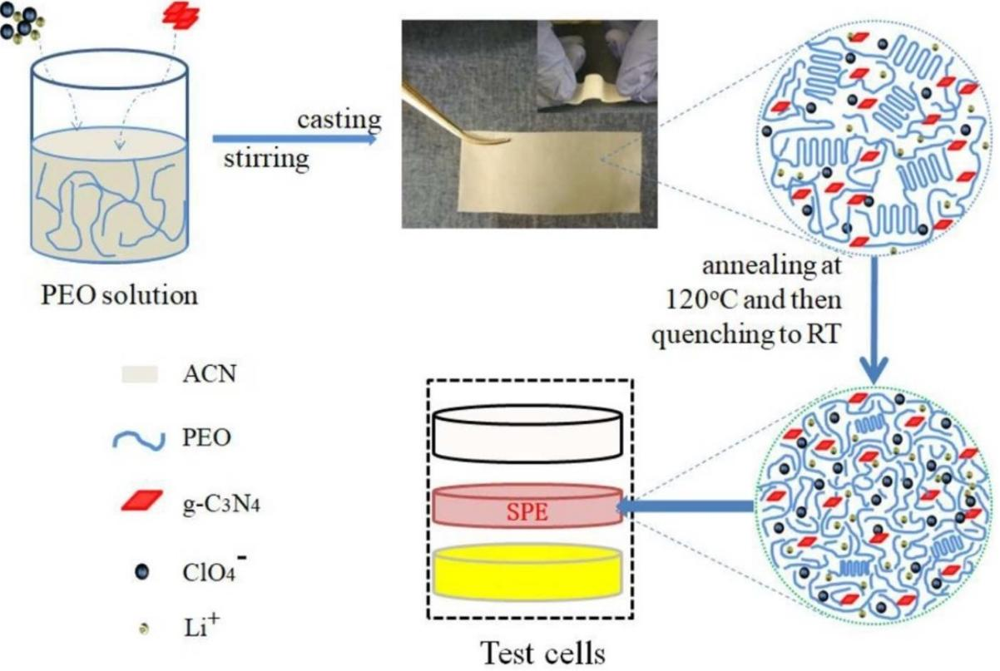

**Figure 13.** The flowchart of the preparation of the PEO-LiClO4-g-C3N4 solid composite polymer electrolyte film Reproduced from Ref. [261] under the terms of the Creative Commons Attribution License (CC-BY). Copyright (2019) The Authors.

stability, efficiency and long cyclability. In addition, Li S cells tested with comb polymer material as binder exhibit better cyclability in a solid-state battery configuration compared to the reference cell due to the restrained polysulfide diffusion. The multifunctional role of Jeffamine has been demonstrated in Figure 14.

Studies also proved that Jeffamine based polymer electrolytes could be promising candidate both as electrolytes and as binders for Li S battery application.

In 2018, Qu et al.[263] fabricated multifunctional sandwichstructured polymer electrolyte to address the shuttle effect of Li S battery. The Li S battery with this sandwich-structured polymer electrolyte delivered superior cycling performance (above 1500 cycles) and excellent rate capability up to 4 C appreciably, Li S battery with this sandwich-structured polymer electrolyte delivered a high initial areal capacity of 5.1 mAhcm 2 when sulfur loading was 4.9 mgcm 2 . The interaction mechanism of polysulfide and composite polymer electrolytes are depicted in Figure 15.

In a different approach, Zhao et al.[264] proposed a flexible anion-immobilized ceramic-polymer composite electrolyte membrane to prevent lithium dendrites and to construct safe and flexible batteries. The anions in the composite electrolyte are immobilized due to the interactions with ceramic fillers and polymer matrix, resulting in dendrite-free lithium deposition. The added ceramic fillers in the polymer electrolyte provides high ionic conductivity of 1.12×10 5 Scm 1 at 25°C, wide electrochemical window of 5.5 V, and excellent specific capacities more than 150 mAhg 1 and stable cycling performance.

In order to mitigate the dissolution of polysulfide nanocomposite polymer electrolytes membrane composed of poly (vinylidene fluoride- hexafluoropropylene) (PVdF-HFP) with different type of nano-layered silicates were prepared and their electrochemical and morphological properties were studied by Jeddi et al.,[265] Among the systems studied the Li S cell with organically modified- silicate nanocomposite (OMMT) electrolyte delivered a higher discharge capacity and better cyclability. The better performance of Li S with organically modified -silicate added nanocomposite electrolyte was attributed to small pore size and uniform pore size distribution of PVdF-HFP/ OMMT membranes which controls the release of electrolyte solution and dissolution of polysulfides and suppression of active mass loss.

Hassoun and Scrosati[266] demonstrated an all-solid-state Li S cell composed of a Li2S/C cathode, lithium metal anode, and a nanocomposite polymer as electrolyte. The cell was capable of delivering a discharge capacity of 300 mAhg 1 at 70°C. The added-ZrO2 filler in PEO-LiCF3SO3 filler significantly promoted the ionic conductivity of the composite polymeric membrane.

Efforts have also been made to replace the highly reactive anode material with alloy anodes with same type of nanocomposite polymer electrolytes.[267] Marmorstein et al.[268] reported the charge-discharge characteristics of Li S cells with

Reviews doi.org/10.1002/batt.202000273

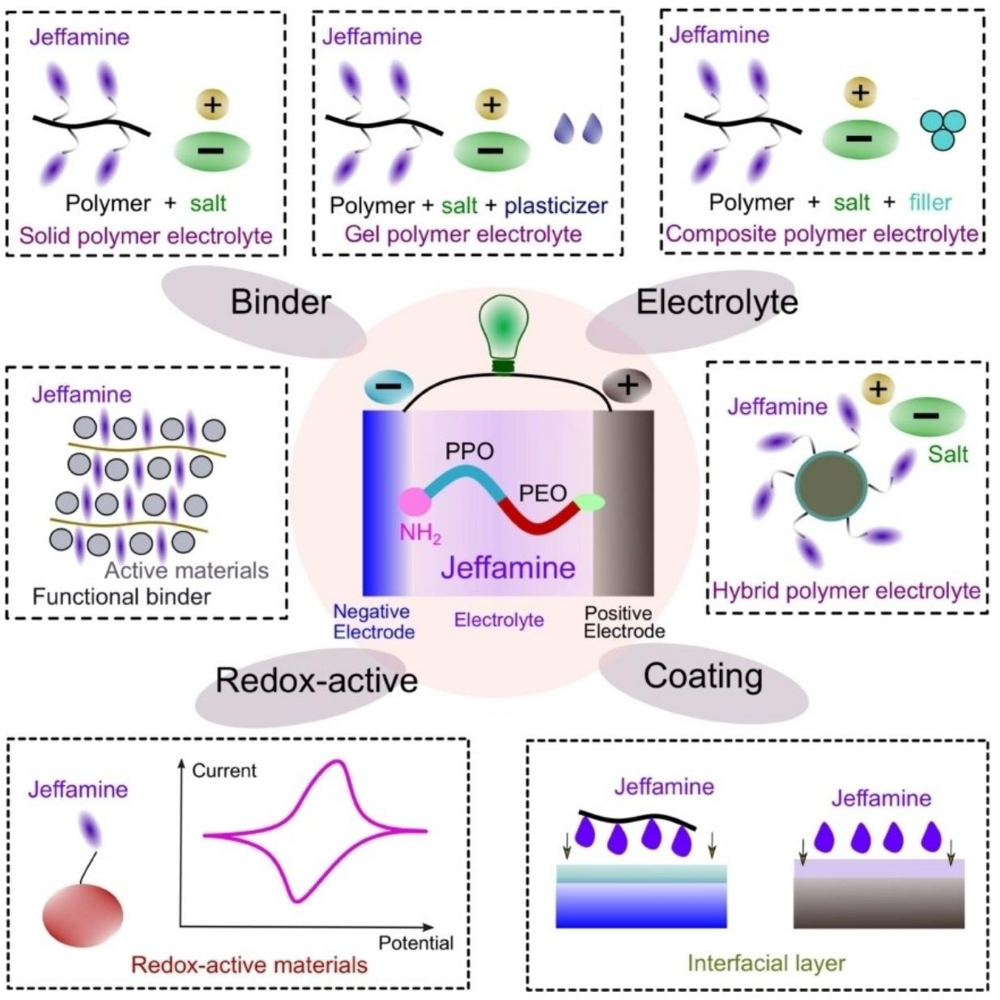

**Figure 14.** Multifunctional role of Jeffamine. Reproduced from Ref. [262] with permission. Copyright (2020) Wiley-VCH.

three different polymer electrolytes at various operating temperatures ranging from ambient temperature to 100 °C. Among the systems studied the cell operated between 90 and 100°C with poly ethylene oxide as electrolyte delivered highest discharge capacity. Unfortunately, these systems suffer from poor rate capability.

## **7.2. Gel Polymer Electrolytes**

Gel polymer electrolytes (GPEs) would be promising candidates for addressing the solubility issue of polysulfides in Li S batteries. Also, it offers additional benefits such as suppressing the formation of dendrite on the surface of lithium metal and improving safety. It is an attractive choice for Li S batteries since it can simultaneously act as a binder and electrolyte due to the presence of polymer material. Generally, polymer Li S batteries suffer from capacity decay and large polarization due to the limited ionic conductivity of GPEs and the large electrode/GPE interfacial resistance. As explained in section 1 the selection of electrolyte materials for Li S batteries is very limited. The fluorine of poly (vinylidene fluoride- hexafluoropropylene) (PVdF-HFP) can be easily replaced by elemental sulfur and polysulfide to form thiols and vulcanize the unsaturated polymers. Therefore for the applications in lithium sulfur batteries poly(ethylene oxide) (PEO) has been considered as an ultimate host material owing its chemical stability. The gel polymer electrolytes (GPE) and composite gel polymer electrolytes (CGPE) for lithium sulfur batteries are prepared generally by solution casting or by phase inversion method.[269] PEO Reviews doi.org/10.1002/batt.202000273

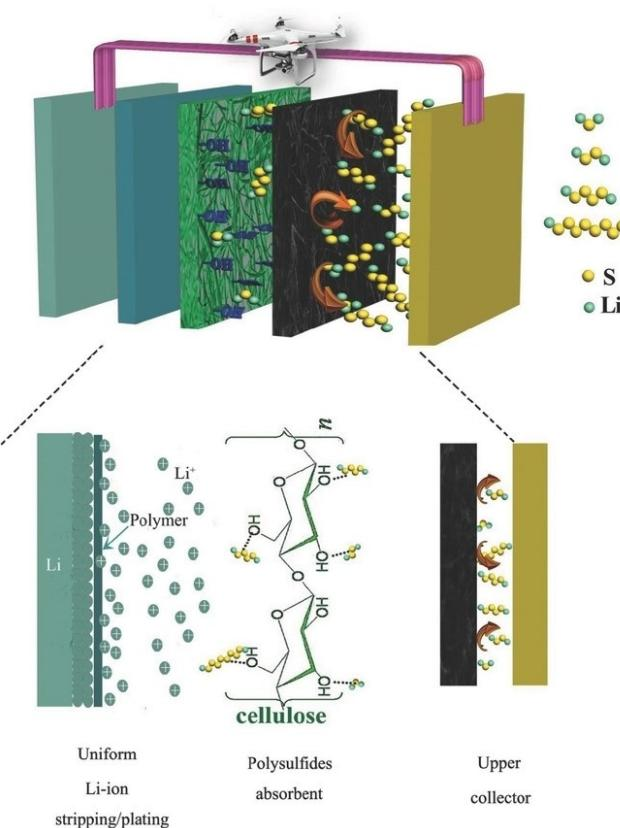

**Figure 15.** Schematic illustration of interaction mechanism between polysulfides and NCP-CPE. Reproduced from Ref. [263] with permission. Copyright (2018) The Authors.

based electrolytes are preferably prepared by solution casting technique as this polymeric host is unsuitable for phase inversion technique due to the difficulties in finding solvents and non-solvents. Therefore PEO-based gel electrolytes are prepared either by solution casting or by melt mixing method. Zhang and Tran[102] reported the electrochemical properties of PEO- based electrolytes comprising SiO2, DOL and DME. The working mechanism of a typical Li S cell with gel polymer electrolyte is depicted in Figure 16.[266]

Liu et al.[270] synthesized pentaerythritol tetraacrylate (PE-TEA)-based GPE which possess extremely high ionic conductivity (1.13×10 2 S cm 1 ), low interfacial resistance, high rate capacity (601.2 mAhg 1 at 1 C) and improved capacity retention (81.9%) after 400 cycles at 0.5 C). Interestingly, the replacement of conventional liquid electrolytes with the novel PETEAbased GPE has successfully prevented the solubility and shuttle issues of polysulfides. The enhanced electrochemical properties were attributed to the strong immobilization of polysulfides by PETEA-based GPE and the formation of stable passivation layer on the sulfur electrode surface induced by the polymer matrix of GPE. By using gel polymer electrolyte, Li et al.[271] mitigated the self-discharge of Li S battery without capacity decay, when the battery is at rest, half-discharged, half-charged or full charged state for 24 hours. The Li S battery with the GPE exhibited a good cycling stability with capacity retention of 72% at current density of 835 mAhg 1 (0.5 C) after 100 cycles,

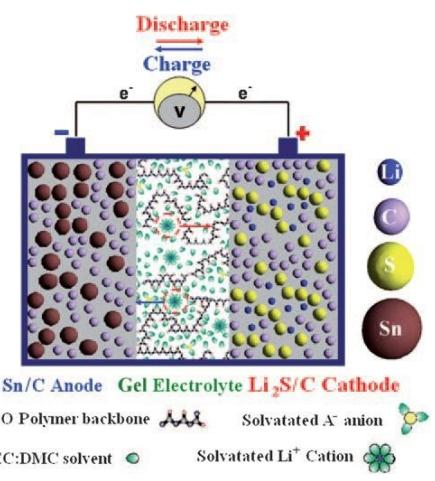

**Figure 16.** Schematic illustration of working mechanism of a typical Li S cell with gel polymer electrolyte. Reproduced from Ref. [266] with permission. Copyright (2010) Wiley-VCH.

which was found to be higher than the commercial separator with liquid electrolyte.

In a pioneering research, Balo and co-workers[272] have enhanced the ionic conductivity by combining with ionic liquids (ionic liquid (IL) EMIMTFSI.) into PEO+LiTFSI matrix. The added ionic liquid acts as plasticizers due its high ionic conductivity, wide electrochemical window, non-volatility, negligible vapour pressure, excellent thermal stability. The complex impedance spectroscopic studies showed that ionic conductivity of the prepared GPEs increases when the amount of IL content is increased. Also the gel polymer electrolytes exhibited a high thermal stability, ionic conductivity (2.08× 10 4 S cm 1 at 30°C), lithium transference number (0.39), electrochemical stability window (4.6 V) and good Coulombic efficiency even after 100 cycles. In a similar study Baloch et al.[273] studies a gel polymer electrolyte (GPE) based on polymer ionic liquid (PIL) is used in a solvent-free configuration of the Li S battery. The GPE-PIL used as an electrolyte and as separator offers high initial capacity and excellent Coulombic efficiency during cycling. The XPS and EIS studied revealed that the observed capacity fade and increased polarization during cycling, was due to the accumulation of polysulfides in the GPE-PIL layer. The authors also concluded that thickness of the gel electrolyte influence the amount of polysulfides trapped during cycling which was confirmed by the internal resistance value. Gel polymer electrolyte composed of a poly (ionic liquid) and lithium salt showed superior rate capability at higher Crates and better cyclic stability at C/2 rate for 500 cycles compared to the ionic liquid electrolyte (ILE). The rapid capacity fading for the first few cycles was observed using an electrochemical impedance spectroscopy (EIS), due to the interfacial resistance growth between the electrodes and the electrolytes. GPE also exhibited high thermal stability (405 °C) and wider stability window (5.2 V vs. Li/Li+).[274]

In order to achieve the high electrochemical stability, low cost, and better solvation of lithium ion, Angulakshmi et al.[275] studied poly (ethylene oxide)-based composite gel polymer

electrolytes (CGPE's) for various concentrations of magnesium aluminate (MgAl2O4) and LiTFSI as salt with a combination of 1,3-dioxolane (DOL) and tetraethylene glycol dimethyl ether (TEGDME) as plasticizer by a simple solution casting technique. The addition 20% plasticizers exhibited highest ionic conductivity of the order of 3.4×10 4 Scm 1 at 30°C. The discharge capacity of 475 mAhg 1 was achieved for the cell composed of S C/CGPE/Li. This is attributed to the better gluing effect of CGPE with both electrodes and also suppression of polysulfide migration by MgAl2O4 particles that present in the gel electrolyte.

Similarly a high ion-conducting composite gel polymer electrolytes(CGPE) with different proportions of poly (ethylene oxide), plasticizers namely DIOX/ TEGDME and a lithium salt (LiTFSI) with the addition of filler chitosan was also explored as a gel electrolyte for Li S batteries.[276]

The heat tolerance capability which arises due to the dissolution of polysulfides gets aggravated at high temperature, and the safety issue becomes inevitable.[277] In order to overcome these drawbacks, Song et al.[278] reported a Li S battery operated gel polymer membrane with carbonate electrolyte at elevated temperatures by using sulfur/polyacrylonitrile (SPAN) composites as positive electrode. The SPAN materials allow the Li S battery operated in safer carbonatecontaining electrolyte at a relatively high temperature and also suppressed the polysulfide migration. Although GPEs showed appreciable electrochemical performances, the low ionic conductivity (*<*3×10 3 S cm 1 ) and the large resistance between electrodes and electrolyte, difficulty in the synthesis of polymers, and high requirements for GPEs preparation instruments, restrict the large-scale practical applications. Therefore, the novel GPE with satisfying performances based on biodegradable polymer, with a simple preparation method is urgently needed. In order to achieve this goal, the most abundant natural biomass lignocellulose (LC) based gel polymer electrolyte (GPE) was prepared for Li S battery. The prepared GPE based on LC fibre shows excellent performance on liquid electrolyte uptake, mechanical property, ionic conductivity (4.52 mScm 1 @RT), lithium ion transference number (0.79), electrochemical stability window (5.3 V), compatibility with lithium electrodes and thermal stability. The assembled lithium sulfur cell with LC based GPE showed high initial discharge specific capacity and electrochemical reversibility, and was attributed to the stable passivation layer on the surface electrodes and hydrogen bond between polysulfide and LC matrix.

Recently PVDF is widely used polymer based GPEs which possesses excellent wettability in organic electrolytes and high chemical resistance. In order to achieve the high liquid electrolyte uptake and lithium ion transfer, high porosity PVDF membrane is designed using phase inversion method. Unfortunately, such porous morphology is unsuitable for a Li S battery because of the polysulfide penetration.[279]

In order to conquer this challenge, Gao and workers[280] investigated poly(vinylidene fluoride)(PVDF)-based gel polymer electrolyte (GPE) with a compact morphology to block polysulfide penetration using a simple solution-casting method and the strategy of incorporating poly(ethyleneoxide) and nano zirconium dioxide to guarantee electrolyte uptake with improved retention ability and lithium ion mobility. Compared to the commercial separator with liquid electrolyte, the additivefree PPZr-GPE exhibits high initial capacity, stable coulombic efficiency, and superior rate performance.

Xia et al.[281] prepared a composite gel polymer electrolyte (CGPE) based on poly (vinylidenefluoride-hexafluoropropylene) (PVDF-HFP) with Li1.5Al0.5Ti1.5(PO4)3 (LATP) nanoparticles into the GPE. The obtained CPE exhibits a high lithium ion transference number, mechanical stability and good electrochemical stability as compared to liquid electrolyte. In addition, the assembled solid-sate Li S battery with the composite gel polymer electrolyte membrane shows improved cycling stability and rate capacity due to the effective suppression of the shuttle effect of polysulfides.

According to Zhang and co-workers[282] lithiophilic materials which possess strong adsorption energy for Li ions, can effectively decrease the lithium nucleation barrier. In order to stabilize the lithium anode morphology, Han et al.[283] designed a gel polymer electrolyte via the self-polymerization of polydopamine (PDA) on the surface of poly vinylidene fluoride (PVDF) gel polymer electrolyte to stabilize the lithium anode in a Li S battery. Such a lithiophilic gel polymer electrolyte maintained a smooth anode surface with a stable solid electrolyte interphase (SEI) during long-term cycling. The cell with PDA-PVDF showed a superior cycle life with low capacity decay with a Coulombic efficiency above 98%. Additionally, the amount of electrolyte used in the quasi-solid-state cell is lower compared with the conventional cell with a liquid electrolyte, which favours an increase in energy density of the battery. The basic function of Li S battery is schematically illustrated in Figure 17.

Yang et al.[284] prepared a novel sandwiched gel polymer electrolyte (GPE) using a facile method for lithium sulfur batteries. The Li S battery with the GPE separator effectively reduced the polarization of the cell and suppressed shuttle effect during charge/discharge process owing to the strong physical shielding and chemical absorption of the GPE. As a result, it delivered a high initial discharge capacity (1711.8 mAhg 1 ), high electrochemical reversibility and enhanced cycling stability.

Yang et al.[285] prepared a composite gel polymer electrolyte consisting of a nonporous supporting layer made by lightly cross-linked PMMA and a coated acetylene black layer. The gelled non-porous PMMA membranes efficiently suppressed the growth of lithium dendrites and promoted the formation of a stable solid electrolyte interphase, while the acetylene black layer could act as a barrier to prevent the diffusion of polysulfides and promoted rapid electron transfer on the cathode. Figure 18 illustrates the uniform stripping /plating of Li+ with CGPE. The synergistic role of these two components facilitated Li S batteries to achieve better cycling performance, rate performance and dendrite-free lithium during cycling.

In 2017, Agostini et al.[286] demonstrated the gel polymer electrolyte based on PVDF effectively stabilize the high loading (70%) sulfur composite cathode, prevents sulfur dissolution

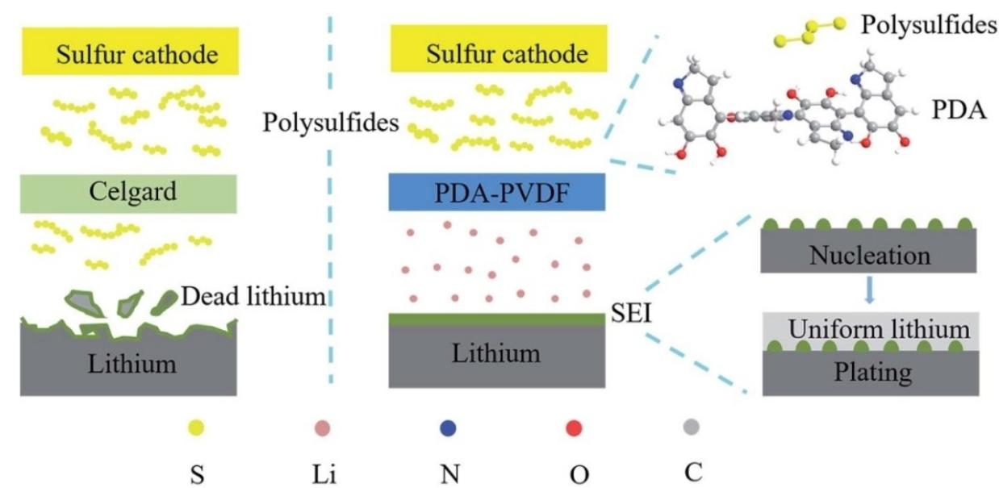

**Figure 17.** The multifunction of PDA-PVDF for quasi-solid-state Li S battery. Reproduced from Ref. [283] with permission. Copyright (2018) Royal Chemical Society.

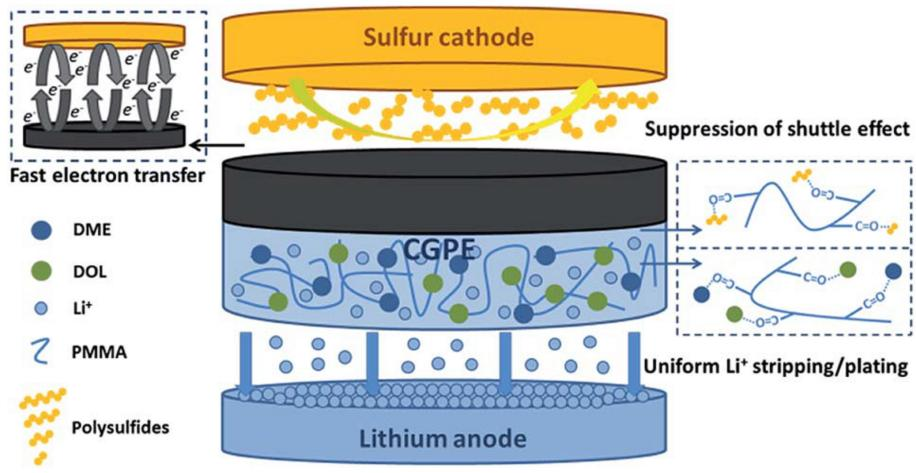

**Figure 18.** A schematic illustration of the operation mechanism of the CGPE in Li S batteries. Reproduced from Ref. [285] with permission. Copyright (2019) Royal Chemical Society.

and reduces migration of polysulfide species to the anode. The GPE based electrolyte, delivered a capacity of 1675 mAhg 1 which was close to the theoretical limit of the Li S battery. Very recently, Hong and co-workers[287] have synthesized amorphous double-comb polysiloxane SPE with different degrees of chemical crosslinking via quaternary ammonium moieties. While the cross-linking enhanced dimensional stability to the SPE the quaternary ammonium moieties facilitated to dissociate Li salt and thus promoted Li-ion conduction. The authors reported that the SPE with 3% cross-linking was found to be optimal to achieve high ionic conductivity with a value of 6.6×10 4 S cm 1 at 30°C. Also the SPE effectively mitigates the self-discharge on the Li metal surface by blocking the lithium polysulfide diffusion from the cathode to anode, leading to capacity retention during a long term test demonstrate excellent performance in Li S battery. The electrochemical studies reveal a high specific capacity value of 1082 mAhg 1 with good capacity retention over several cycles, suggested that cross-linked SPE with quaternary ammonium moieties is the right candidate for next-generation Li S batteries containing Li metal anode.

Very recently, Hao et al.[288] fabricated a GPE composed of poly(vinylidene fluoride-hexafluoropropylene) (PVDF-HFP), pentaerythritol tetrakis-divinyl adipate (PETT-DA) as the polymer matrix and Li6.4La3Zr1.4Ta0.6O12 (LLZTO) as the nanofillers. The PVDF-HFP provide high ionic conductivity, toughness while the 3D network PETT-DA suppress shuttle effect and lithium dendrite. Furthermore, LLZTO nanofiller possess the high ionic conductivity, mechanical, thermal, and electrochemical performances and also it reduced the crystallinity appreciably. The

GPEs with 10 wt% LLZTO exhibited superior ionic conductivity (8.74×10 4 S cm 1 ) and Li+ transference number of 0.69, accompanied with good capacity retention of 88.6% even after 300 cycles at 1 C rate. The assembled LSB with GPEs shows excellent mechanical properties, thermal stability and cycling stability and safety due to its capability to confine the polysulfides shuttling and to suppress the Li dendrite growth.

# **8. Quasi-Solid-State Electrolytes**

Although the all-solid-state-lithium sulfur batteries comprising Li+- conductive solid polymer electrolyte (QSSPE) and inorganic solid-state electrolytes (IQSSE) are expected solve to the most critical issues such as shuttling of polysulfide and poor safety, the poor ionic conductivity and interfacial contact issues especially electrolyte/lithium metal anode still remain as a major challenge. Unlike lithium-ion batteries, for the applications in lithium sulfur batteries new polymer synthesis strategies and innovative structures are required to overcome the issues such as self-discharge and mitigating the shuttling of polysulfides. One of the approaches to circumvent the above mentioned challenges is the introduction of quasi-solid-state electrolytes in lithium sulfur batteries where the addition of minimum amount of liquid electrolytes in the solid electrolytes. In a recent review article, Armand and his group[289] emphasized the importance of quasi-solid-state electrolytes for lithium sulfur batteries. Based on their constituents, quasi-solid-stateelectrolytes are classified as; (i) polymer quasi-solid-state electrolytes and (ii) inorganic quasi-solid-state electrolytes. According to the authors three different strategies have been widely employed for the development of quasi-solid-state polymer electrolytes which includes (i) activation of polymeric membrane in a conventional Li-salt in a combination of solvent solutions (LiTFSI- TEGDME-DOX) (ii) absorbing of low molecular weight polymers and ionic liquids by polymer electrolytes and (iii) introduction of inorganic oxides in order to exploit the advantages of both organic and inorganic materials synergistically. The architecture of lithium-sulfur batteries with liquid, quasi-solid-state and solid electrolytes is given as Figure 19 (a). The state-of-the-art of lithium–sulfur batteries with different electrolytes are illustrated with Radar chart in Figure 19 (b). The basic characteristics of the polymer are mainly influenced by the ratio of the crystalline and amorphous phases. The incorporation of low molecular weight organic solvents or inorganic fillers will modify its crystalline phase of the polymer.[290,291] Thus the modified polymer electrolyte not only provides high ionic conductivity more or less equal to that of liquid electrolyte but also confines polysulfides from shuttling.

The free-standing ability of the membrane separates both electrodes from short-circuiting, minimizes the electrolyte leakage and flammability of the system.[36] On the other hand plasticizers play an important role in the electrochemical properties of QSSLSB's and should have high dielectric constant, thermal stability, low flammability, both chemical and electrochemically inert to both electrode materials for the applications in lithium sulfur batteries. Carbonate esters were believed to minimize the solubility of polysulfide and subse-

**Figure 19.** a) Schematic representation of liquid Li S batteries, solid Li S batteries and QSSLSBs (quasi-solid-state lithium–sulfur batteries). b) Radar chart of the state-of-art Li S batteries using different electrolytes. ISSE and PE correspond to "inorganic solid-state electrolyte" and "polymer electrolyte", respectively. Reproduced from Ref. [289] with permission. Copyright (2019) Elsevier.

quent reduction of the shuttle effect. Unfortunately, the irreversible reaction with polysulfide intermediates lead to a rapid capacity fading and lithium cell failure.[292] In view of this organic plasticizers with high boiling point and lower vapour pressure are being introduced to enhance the safety of QSSLSB such as poly (ethylene glycol) oligomers, with methyl and endcapping groups and ionic liquids.

Liu et al.[293] polymerized PETEA monomer by in-situ polymerization. The synthesized polymer was activated in a nonaqueous liquid electrolyte composed of DOL-DME in 1 M LiTFSI with LiNO3 as additive. The authors have also compared the charge-discharge properties of PETEA with Celgard membrane containing the same electrolyte and found that the QSSLSB with PETEA offered improved stability and rate performance. The enhanced performance of QSSLSB was ascribed to esterrich structure of PETEA which provides interaction between Li2S and the oxygen donor atoms for promoting a strong immobilization of PSs.

The cycling behaviour of electrospun hybrid polymeric membrane comprising PVDF-HFP and SiO2 nanoparticles and activated by 1 M (LiTFSI) /1-propyl-3-methylimidazolium bis (trifluoromethy sulfonyl)imide (PMImTFSI) was reported by Kim.[294] Further, addition of ionic liquid into the polymer membrane reduced the concentration of Li+ -coordinated TFSI as well as the crystallinity of PVDF-HFP by converting it to the α-phase. The IL added-GPE showed a high ionic conductivity (1.1×10 3 S cm 1 at 20°C), oxidation potential (*>*5.0 V vs. Li/ Li+) and low flammability. The ILGPE delivered a high initial discharge capacity of 1029 mAhg 1 and maintained a reversible capacity of 885 mAhg 1 after 30 cycles at 0.1 C-rate. Gerbaldi et al.[295] prepared a green polymer electrolyte composed of methacrylate based polymer matrix and nanoscale microfibrillated cellulose by a thermally induced polymerisation process and used as electrolyte separator in a Li S battery. The polymer electrolyte showed excellent ionic conductivity, thermal stability (*>*200°C) and stable interface towards lithium metal. The Li S cell showed excellent cycling stability, higher specific capacity, superior Coulombic efficiency, and rate capability at ambient temperature comparing with non-aqueous liquid electrolyte. The cycling profiles showed a significant reduction of the migration of polysulfide towards anode by the entrapment of microfibrillated cellulose in the polymer matrix.

Zhao et al.[296] prepared a GPE by immobilizing a nonaqueous solution of LiTFSI in TEGDME electrolyte in a combination of PVDF-HFP and poly(methylmethacrylate) (PMMA) polymer matrix. The GPE exhibited the ionic conductivity of the order of 3.37 mS cm 1 at room temperature. Although Li S cell with GPE delivered a specific capacity of 753.8 mAhg 1 at its initial cycle, a stable reversible cycling and capacity retention with a high coulombic efficiency was achieved when compared with the liquid electrolyte. Appreciably, GPE suppressed the shuttle effect and improved the utilization of sulfur active material.

A dual-layer structural sulfur cathode with a porous poly (acrylic acid) (PAA) membrane coated on the top surface was developed by Zhang and co-workers.[297] Due to the porous nature of PAA membrane, the liquid electrolyte becomes a gel and resulting gel chemically blocks the out-diffusion of PS anions. Furthermore, the PAA gel increased the cycle life of a Li S cell from 100 cycles to 300 cycles and exhibited better capacity retention compared with the cell using the conventional sulfur cathode.

Choudhury et al.[298] developed a stretchable gel polymer electrolyte (GPE) based on polyepichlorohydrin terpolymer (GECO) as a host polymer activated by a combination of 1,3 dioxolane and 1,2-dimethoxyethane as solvents and lithium bis (trifluoromethane)sulfonimide (LiTFSI) as salt. The GPEs were prepared by ethylene thiourea (ETU) and magnesium oxide as cross-linkers. Dynamic mechanical analysis (DMA) studies revealed that the storage modulus of GPE was found to be more than 0.6 MPa at ambient temperature (298 K). The highest ionic conductivity of GPE was obtained as 2.4×10 4 S cm 1 at 298 K. The Li S cell with GPE delivered an initial specific capacity of 700–800 mAhg 1 however, the capacity was found to be reduced slowly upon cycling. The authors concluded that the polyepichlorohydrin terpolymer -based gel electrolytes can open up new avenue to fabricate flexible Li S rechargeable batteries.

The cycling performance of Li S cell with a PETEA-based gel polymer electrolyte (GPE) by integrating with a polymethyl methacrylate (PMMA) based electrospun network was reported by Liu et al.[299] The acrylate-based hierarchical electrolyte (AHE) provided an ester-rich robust structure with high ionic conductivity of 1.02×10 3 S cm 1 due to the strong electrolyte uptake ability. The Li S cell exhibited higher rate capability of 645 mAhg 1 at 3 C, while maintaining excellent retention at both high and low current densities (80.3% after 500 cycles at 0.3 C and 91.9% after 500 cycles at 3 C).

A novel polyethylene (PE) separator supported GPE rich in ester groups by using PETEA cross-linked with divinyl adipate (ester) was synthesized by Du et al.[300] for Li S batteries. The prepared gel polymer electrolyte guaranteed a reliable, high energy density and safe Li S batteries.

Li and co-workers[301] introduced a novel lithium 4-aminophyenyl sulfonyl(trifluoromethyl sulfonyl)imide (LiATFSI) as lithium salt and was subsequently grafted with poly(ethylenealtmaleic anhydride) by the cyclic imide to form a single ion conducting polymer electrolyte (PEMA-graft-LiATFSI). The polymer electrolyte membrane made of PEMA-graft-LiATFSI was capable of withstanding at high current density of �50 mAcm 2 and a stable capacity of 780.8 mAhg 1 even after 1000 cycles at 1 C. Also, the membrane could effectively suppress Li dendrite formation which guaranteed the application of lithium metal as anode for lithium sulfur batteries.

A semi-interpenetrated network solid polymer electrolytes (SPEs) prepared by UV-induced cross-linking of poly(ethylene glycol) diacrylate (PEGDA) and divinylbenzene (DVB) within a poly(ethyleneoxide) (PEO) matrix was reported.[302] The DVB content on the SPE has significantly decreased the crystallinity of the PEO matrix from 34 to 23%, with a corresponding reduction in the melting temperature (*T*m) of the membrane from 50°C to 34°C.

The electrochemical properties of lithium sulfur batteries were appreciably improved by the introduction of free-stand-

ing trimethylolpropane ethoxylate triacrylate GPE by a chemical cross-linking process.[303] Moreover, the cross-linked gel polymer electrolyte exhibited stable geometric size retention of 95% at 130°C. Furthermore, the GPE membrane with carbon nanofibers interlayer could effectively prevent polysulfide dissolution and shuttle effect, leading to high capacity and cycling stability with an enhanced specific capacity of 790 mAhg 1 after 100 cycles.

## **8.1. Inorganic-Based Quasi-Solid-State Electrolytes**

Yu et al.[304] developed a hybrid Li-PS battery system by employing a solid lithium super ionic conductor (LiSICON) membrane. The solid LiSICON lithium-ion conductor maintains stable ionic conductivity during the electrochemical cycling conditions and advantages over the porous Celgard separator for suppressing polysulfide diffusion.

The same group[305] has explored an alternative NASICONtype Li+-ion conductive membrane with a formula of Li1+ *x*Y*x*Zr2 *x*(PO4)3 (LYZP) (*x*=0–0.15) as a solid-electrolyte/ separator to address the polysulfide-crossover issue in Li S batteries. The LYZP membrane with a reasonable Li+-ion conductivity exhibited favourable chemical compatibility with the lithium polysulfide species and good electrochemical stability. The Li S battery with the liquid/LYZP hybrid electrolyte delivers an initial discharge capacity of �1000 mAhg 1 and retains 90% of the initial capacity after 150 cycles at a rate of C/5.

A room temperature hybrid electrolyte using an inorganic solid electrolyte, Li1.5Al0.5Ge1.5(PO4)3 (LAGP), as a separator was reported by Wang et al.[306] The NASICON-type structured LAGP electrolyte has been identified as an attractive candidate for solid electrolytes owing to its chemical stability against lithium and the wide electrochemical window up to 6 V (vs. Li/Li+). The hybrid cell exhibited initial discharge specific capacities of 1528 mAhg 1 , 1386 mAhg 1 and 1341 mAhg 1 , respectively, at C/20, C/5 and C/2 rates and remained at 720 mAhg 1 after 40 cycles at the 0.2 C- rate with excellent Coulombic efficiency (100%).

In the recent years, garnet-type electrolytes have attracted much attention owing to their unique properties such as wide electrochemical stability window, high stability against to lithium metal anode. Fu et al.[307] demonstrated although the cubic garnet-type Li7La3Zr2O12 (LLZO) ceramic electrolytes have superior properties such as high ionic conductivity (10 3 to 10 4 S/cm), good stability their poor contact with Li metal exhibits high resistance at the interface. In order to circumvent this issue, Li7La2.75Ca0.25Zr1.75Nb0.25O12 (LLCZN) was selected as the solid-state electrolyte (SSE) which promotes the wettability of the garnet surface and reduces the interface resistance, polarization, and stabilizes the voltage plateau during Li stripping/ plating. Moreover, the interfacial resistance was significantly reduced from 950 to 75 ohm·cm2 using the Al-coated garnet SSE.

Gu et al. prepared[308] a novel hybrid electrolyte using NASICON-type oxide ceramics and fluorinated electrolytes for semi-solid-state Li S batteries. The FDE-based electrolytes not only provide enough Li+ transport channels between LAGP ceramics and solid electrodes to contribute a low interfacial resistance, but also effectively avoid the loss and redistribution of active sulfur on cathodes. The semi-solid-state Li S batteries exhibited a good cycling stability of over 1200 cycles a wide operating temperature range was attained. More importantly, the FDE electrolytes increased level of safety because of their low volatility and flammability in Li S batteries.

Wang et al.[309] synthesized a gel-ceramic multi-layer electrolyte (GCME) which composes of inorganic NASICON-type lithium ionic conductor Li1.5Al0.5Ge1.5(PO4 )3(LAGP) and poly (ethylene oxide) (PEO)-based GPE used as the separator and electrolyte for Li S battery. The PEO-based GPE avoids the leakage and evaporation of electrolyte and contributes to a relatively low interfacial resistance. As a result, superior cell performance with no self-discharge, high coulombic efficiency and long cycling life is achieved. The cell exhibits an initial specific capacity of 725 mAhg 1 and remains at 700 mA hg 1 after 300 cycles at C/2 rate.

In summary, the flammable and toxic liquid organic electrolytes that present in the Li S batteries react with lithium metal anode and form an unstable solid electrolyte interface layer which subsequently reduces the cycle life of the battery. More importantly the dissolution of lithium polysulfides and its shuttling between the two electrodes deteriorates the cycle life of lithium sulfur batteries rapidly. The solid electrolytes have been widely used to confine the shuttling of polysulfide that exist in the conventional liquid electrolytes by either chemically or/and physically. The all-solid-state lithium–sulfur batteries with a thin Li+-ion conducting solid electrolytes are expected to offer safer lithium sulfur batteries with higher energy density. However Li+-ion conducting solid electrolytes (polymer electrolytes, inorganic conductors, polymer+inorganic conductor composite membranes) are not still producible on a commercial scale due to the challenging issues: small interfacial resistance, high ionic conductivity at ambient and sub-ambient temperatures, good compatibility with electrodes, appreciable electrochemical stability window, strong inhibition to lithium dendrite formation at a high current density, etc. Table 1 summarizes the ionic conductivity, C-rate, Discharge capacity and Coulombic efficiency of different electrolytes for Li S batteries

The ambient temperature of polymer electrolytes can be enhanced by reducing the glass transition temperatures by modifying the structures of the polymeric hosts: incorporating inorganic fillers or superionic conductors, blending of two or more polymer/oligomers, and cross-linking of polymeric matrix by photo-polymerization etc.. The use of ceramic/inorganic fillers not only enhances the mechanical, thermal, and electrochemical properties but also confines the diffusion of lithium polysulfides either physically or chemically and thus stabilizes the lithium metal surface. Numerous attempts have also been made to increase the ionic conductivity of inorganic solid electrolytes by doping the larger atoms into the superionic conductors and optimizing the preparation conditions.

| Table 1. Comparison of Electrochemical performances of different electrolytes for lithium sulfur batteries. |                                                                                                                                                    |                                       |                |                                                           |            |                               |                |  |  |
|-------------------------------------------------------------------------------------------------------------|----------------------------------------------------------------------------------------------------------------------------------------------------|---------------------------------------|----------------|-----------------------------------------------------------|------------|-------------------------------|----------------|--|--|
| Entry                                                                                                       | Electrolyte                                                                                                                                        | Ionic Conductivity [S cm 1 ] | C-rate         | Discharge capacity [mAhg 1 ] 1st Nth Cycle |            | Columbic efficiency [%] | Ref.           |  |  |
|                                                                                                             |                                                                                                                                                    |                                       |                | Cycle                                                     |            |                               |                |  |  |
| 1                                                                                                           | DME-DOL+LiTFSI                                                                                                                                     | NA                                    | NA             | –                                                         | –          | 99.4                          | [81]           |  |  |
| 2                                                                                                           | TEGDME+LiTFSI                                                                                                                                      | NA                                    | 1              | 1125                                                      | 1000       | NA                            | [87]           |  |  |
| 3                                                                                                           | DMSO+LiTFSI                                                                                                                                        | NA                                    | NA             | 900                                                       | NA         | NA                            | [92]           |  |  |
| 4                                                                                                           | NMP+LiTFSI                                                                                                                                         | NA                                    | NA             | 1043                                                      | NA         | 94.8                          | [89]           |  |  |
| 5 6                                                                                                      | Sulfolane+LiTFSI DME-DOL+LiTFSI                                                                                                                 | NA NA                              | NA 1        | 1000 540                                               | NA 380  | NA NA                      | [90] [79]   |  |  |
| 7                                                                                                           | SL-DME+LiTFSI,                                                                                                                                     | NA                                    | NA             | 1320                                                      | 930        | NA                            | [77]           |  |  |
| 8                                                                                                           | SL-DOL+LiTFSI,                                                                                                                                     | NA                                    | 1              | 980                                                       | 750        | NA                            | [75]           |  |  |
| 9                                                                                                           | SL-THF+LiTFSI                                                                                                                                      | NA                                    | 0.2 mAcm 2     | 1227                                                      | 875        | NA                            | [76]           |  |  |
| 10                                                                                                          | TMS-DME+LiTFSI                                                                                                                                     | 9.10×10 3                             | 0.1            | 1100                                                      | 550        | 71.4                          | [69]           |  |  |
| 11                                                                                                          | Sulfolane-glyme+LiTF                                                                                                                               | NA                                    | NA             | NA                                                        | 357        | 100                           | [70]           |  |  |
| 12                                                                                                          | Ethyl methyl sulfone+LiPF6                                                                                                                         | NA                                    | NA             | NA                                                        | NA         | NA                            | [73]           |  |  |
| 13                                                                                                          | TEGDME+LiPF6                                                                                                                                       | NA                                    | 0.3            | 1342                                                      | NA         | 99                            | [64]           |  |  |
| 14                                                                                                          | DOL-DME+LiTFSI+LiNO3                                                                                                                               | 4.5×10 4 2×10 4                    | NA             | –                                                         | 980        | –                             | [156]          |  |  |
| 15 16                                                                                                    | PYR14TFSI-DME-DOL+LiTFSI, TEGDME-DIOX+LiTFSI+LiNO3                                                                                              | 6.0×10 3                              | NA NA       | – –                                                    | – –     | – –                        | [157] [158] |  |  |
| 17                                                                                                          | PEGDME-PC+LiTFSI                                                                                                                                   | NA                                    | NA             | –                                                         | –          | –                             | [159]          |  |  |
| 18                                                                                                          | TEGDME-PC+LiTFSI                                                                                                                                   | NA                                    | NA             | –                                                         | –          | –                             | [160]          |  |  |
| 19                                                                                                          | DME-PC+LiTFSI                                                                                                                                      | NA                                    | NA             | –                                                         | –          | –                             | [161]          |  |  |
| 20                                                                                                          | TEGDME+LiTFSI                                                                                                                                      | 1.6×10 3                              | NA             | –                                                         | –          | –                             | [162]          |  |  |
| 21                                                                                                          | MA-DOXL-TEGDME+LiTFSI                                                                                                                              | 2.0×10 3                              | 1/12           | 1197                                                      | –          | 98                            | [163]          |  |  |
| 22                                                                                                          | DOL-DME+LiTFSI+LiNO3                                                                                                                               | NA                                    | 1              | 980                                                       | 737        | 100                           | [164]          |  |  |
| 23                                                                                                          | N-methyl-N-propylpyrrolidinium bis(trifluoromethanesulfonyl)imide                                                                                  | 4.0×10 4                              | 0.1            | 1055                                                      | 750        | 97%                           | [167]          |  |  |
| 24                                                                                                          | Alkylmethylpyrrolidinium cation and thebis(tri  uoromethanesulfonyl) imide anion                                                                | NA                                    | NA             | –                                                         | 684        | –                             | [173]          |  |  |
| 25                                                                                                          | N-butyl-N-methylpyrrolidinium bis(trifluoromethanesulfonyl)imide (PYR14TFSI)                                                                    | 2.2×10 3                              | 0.1 C          | 1300                                                      | –          | 99%                           | [174]          |  |  |
| 26                                                                                                          | InGaN epilayers                                                                                                                                    | NA                                    | 0.1 C          | 1055                                                      | 550        | 100%                          | [175]          |  |  |
| 27                                                                                                          | Poly[2-methoxy-5-(2'-ethyl-hexyloxy)-1,4-phenylenevinylene] (MEH-PPV)                                                                              | NA                                    | 0.5 C          | 1420                                                      | 750        | 100%                          | [176]          |  |  |
|                                                                                                             | and the ionic liquid tetra-n-butylammonium trifluoromethanesulfonate (TBA-TF)                                                                   |                                       |                |                                                           |            |                               |                |  |  |
| 28                                                                                                          | All ionic liquid (review)                                                                                                                          | NA                                    | 0.05 C         | 1083                                                      | 840        | 97%                           | [177]          |  |  |
| 29                                                                                                          | [Li(G4)][TFSA]                                                                                                                                     | NA                                    | 0.1 C          | 1457                                                      | 630        | 100%                          | [181]          |  |  |
| 30                                                                                                          | N,N-diethyl-N-methyl-N-(2-methoxyethyl) ammonium ([DEME]+), N-meth yl-N-propylpyrrolidinium                                                     | NA                                    | 0.1 C          | 1085                                                      | 670        | 97%                           | [182]          |  |  |
| 31                                                                                                          | N-methyl-N-propylpiperidinium bis(trifluoromethanesulfonyl)imide                                                                                   | NA                                    | 0.1 C          | 1450                                                      | 800        | 100%                          | [183]          |  |  |
| 32                                                                                                          | N,N-diethyl-N-methyl-N-(2methoxyethyl)ammonium bis (trifluoromethylsulfonyl)imide (DEME-TFSI)                                                   | NA                                    | 0.1 C          | 1060                                                      | 750        | 97.5%                         | [184]          |  |  |
| 33                                                                                                          | 1-ethyl-3-methylimidazolium bis(trifluoromethylsulfonyl)imide (EMITFSI)                                                                            | NA                                    | 0.1 C          | 1257                                                      | 600        | 99%                           | [185]          |  |  |
| 34                                                                                                          | N-methyl-N-butyl-piperidinium bis(trifluoromethanesulfonyl) imide (PP14- RTIL)                                                                  | NA                                    | 0.425 C        | 1005                                                      | 800        | 100%                          | [187]          |  |  |
| 35                                                                                                          | Lithium bis- (trifluoromethane sulfonyl)imide (LiTFSI) in meth ylpropylpyrrolidinium bis(trifluoromethane sulfonyl)imide ([MPPY][TFSI])         | NA                                    | 0.1 C          | 1265                                                      | 600        | 100%                          | [188]          |  |  |
| 36                                                                                                          | N-methyl-N-propylpyrrolidiniumbis-(triofluoro methanesulfonyl)imide                                                                                | NA                                    | 0.1 C          | 1364                                                      | 655        | 100%                          | [189]          |  |  |
| 37                                                                                                          | LiTFSI-MPPY·TFSI N-Methyl-N-Allylpyrrolidinium bis(trifluoromethanesulfonyl)imide (RTIL                                                         | 3.9×10 5                              | 0.1 C          | 550                                                       | 398        | 99%                           | [190]          |  |  |
| 38                                                                                                          | P1A3TFSI) N-butyl-N-methyl piperidinium bis (trifluromethanesulfonyl)amide                                                                      | 1.6×10 3                              | 0.5 C          | 887                                                       | 356        | 100%                          | [192]          |  |  |
|                                                                                                             | ([PP14][NTf2])+Li[NTf2].                                                                                                                           |                                       |                |                                                           |            |                               |                |  |  |
| 39 40                                                                                                    | N-methyl-N-propylpyrrolidine cations (P13) [Li(triglyme)][bis(trifluoromethanesulfonyl)amide]                                                   | NA NA                              | 0.1 C 0.1 C | 1100 1069                                              | 248 778 | 100% 99%                   | [193] [195] |  |  |
| 41                                                                                                          | N-methyl-N-butylpiperidinium bis-(trifluoromethylsulfonyl) imide                                                                                   | NA                                    | 0.1 C          | 1100                                                      | 465        | 100%                          | [196]          |  |  |
| 42                                                                                                          | (PP14TFSI) Lithium bis(fluorosulfonyl)amide (LiFSI)-1-butyl-1-methylpyrrolidinium bis                                                           | NA                                    | 0.1 C          | 1010                                                      | 586        | 100%                          | [197]          |  |  |
|                                                                                                             | (fluorosulfonyl)amide ([Py1,4]FSI).                                                                                                                |                                       |                |                                                           |            |                               |                |  |  |
| 43                                                                                                          | N-methyl-N-propylpyrrolidinium bis(trifluoromethylsulfonyl)imide                                                                                   | NA                                    | 0.5 C          | 1350                                                      | 505        | 100%                          | [198]          |  |  |
| 44                                                                                                          | Bis(trifluoromethanesulfonyl)imide(TFSI) anion and a nonaqueous liquid electrolyte [1 M LiTFSI in tetraethylene glycol dimethyl ether/1,3-dioxo | NA                                    | 0.1 C          | 1400                                                      | 610        | 99                            | [199]          |  |  |
|                                                                                                             | lane 1:1 (v/v)]                                                                                                                                    |                                       |                |                                                           |            |                               |                |  |  |
| 45                                                                                                          | N-methyl-(N-butyl)pyrrolidinium bis(trifluoromethylsulfonyl)imide                                                                                  | 1.7×10 2 1.42×10 2                 | 0.2 C          | 850                                                       | 380        | 90%                           | [206]          |  |  |
| 46                                                                                                          | N-methyl-N-butyl pyrrolidinium bis (trifluoromethanesulfonylimide)(PYR14TFSI)                                                                   |                                       | NA             | –                                                         | 567        | –                             | [210]          |  |  |
| 47                                                                                                          | Tetraglyme(G4) and Li[TFSA] (TFSA: bis(trifluoromethanesulfonyl)amide)                                                                             | 1.1×10 3                              | NA             | –                                                         | –          | –                             | [216]          |  |  |
| 48                                                                                                          | N-methoxyethyl-N-methylpyrrolidinium bis(trifluoromethanesulfonyl) imide(Pyr1,2O1TFSI)                                                          | 3.76×10 4                             | 0.1 C          | 1400                                                      | –          | 100%                          | [218]          |  |  |
| 49                                                                                                          | 1,1,2,2-tetrafuoroethyl 2,2,2-trifuoroethylether (TFTFE)                                                                                           | 3. 6×10 4                             | NA             | –                                                         | 400        | –                             | [219]          |  |  |

|       | Table 1. continued                                                                                                                              |                                       |        |                                                  |                |                               |       |  |  |
|-------|-------------------------------------------------------------------------------------------------------------------------------------------------|---------------------------------------|--------|--------------------------------------------------|----------------|-------------------------------|-------|--|--|
| Entry | Electrolyte                                                                                                                                     | Ionic Conductivity [S cm 1 ] | C-rate | Discharge capacity [mAhg 1 1st Cycle | ] Nth Cycle | Columbic efficiency [%] | Ref.  |  |  |
| 50    | 1,1,2,2-tetrafluoroethyl- 2,2,3,3-tetrafluoropropyl ether (TTE) with 1-ethyl 3-methylimidazolium bis(trifluoromethylsulfonyl)imide (EMITFSI) | 2.5×10 6 & 1.0×10 5                | NA     | –                                                | –              | –                             | [220] |  |  |
| 51    | N-methyl-N-propylpiperidinium bis(trifluoromethanesulfonyl)imide                                                                                | 1.0×10 2                              | NA     | –                                                | –              | –                             | [222] |  |  |
| 52    | (PP13TFSI)                                                                                                                                      | 8×10 4                                | 0.5 C  | 1500                                             | –              | 100%                          | [223] |  |  |
| 53    | Bis(fluorosulfonyl)imide (FSI) in methylpropyl pyrrolidinium (MPP) FSI ionic-liquid (IL)                                                     | 6.7×10 3                              | NA     | –                                                | 989            | –                             | [225] |  |  |
| 54    | N-methoxyethyl-N-methylpyrrolidinium bis(trifluoromethanesulfonyl) imide (P1,2O1TFSI)                                                        | 8.0×10 3                              | 0.1 C  | 1533                                             | –              | 100%                          | [227] |  |  |
| 55    | Li2S P2S5 glass-ceramic conductor                                                                                                               | 5.0×10 3                              | 0.5 C  | 1200                                             | 1000           | 100%                          | [228] |  |  |
| 56    | Lithium superionic conductor Li10+δGe1+δP2-δS12 (0�δ�0.35)                                                                                      | 9.0×10 5                              | 0.1    | 800                                              | 400            | 95                            | [253] |  |  |
| 57    | Argyrodite Li6PS5Cl solid electrolyte                                                                                                           | 4.95×10 4                             | 0.1    | 1437                                             | 625(50 cyc)    | 97                            | [256] |  |  |
| 58    | Lithium ionic conductor Li0.17La0.61TiO3                                                                                                        | 1.70×10 4                             | NA     | NA                                               | 975(40 cyc)    | NA                            | [257] |  |  |
| 59    | Li7La3Zr2O12 Superionic conductor                                                                                                               | 4×10 4                                | 1      | 650                                              | NA             | 99                            | [258] |  |  |
| 60    | Li7La3Zr2O12 (LLZO) with a cubic garnet-type of LLZO(001)/GGG(001) and LLZO(111)/GGG(111)                                                    | 3.39×10 4                             | 0.1    | 1442                                             | 480(50 cyc)    | 99                            | [259] |  |  |
| 61    | Li10.05Ge1.05P1.95S12 solid-type electrolyte                                                                                                    | NA                                    | 0.1    | 800                                              | 864(100 cyc)   | 98                            | [260] |  |  |
| 62    | 75Li2S(25-x)P2S5xP2O5 electrolyte                                                                                                               | 1.76×10 5                             | 1      | 161.2                                            | 390(100 cyc)   | 99                            | [261] |  |  |
| 63    | Superionic conductor, 0.7Li(CB9H10)-0.3Li(CB11H12)                                                                                              | 5.3×10 4                              | 0.1    | 440                                              | 145(100 cyc)   | 92                            | [262] |  |  |
| 64    | Li10Si0.3Sn0.7P2S12                                                                                                                             | 1.12×10 5                             | 0.5    | 1200                                             | 500(65 cyc)    | 98                            | [263] |  |  |
| 65    | Li2S P2S5 glass-type electrolyte                                                                                                                | 5–7×10 3                              | 0.2    | 840                                              | 700(300 cyc)   | 97                            | [265] |  |  |
| 66    | LiFSI+PEO                                                                                                                                       | 5×10 3                                | 0.05   | 600                                              | 560(cyc)       | 99                            | [266] |  |  |
| 67    |                                                                                                                                                 | 1.13×10 2                             | 0.1    | 1150                                             | 420(cyc)       | 99                            | [270] |  |  |
|       | PEO+IL@ZrO2                                                                                                                                     | 1.76×10 3                             |        |                                                  |                |                               |       |  |  |
| 68    | PEO+LiClO4+LATP                                                                                                                                 |                                       | 0.1    | 1201                                             | 800(100 cyc)   | 99                            | [271] |  |  |
| 69    | BPSO+LiTFSI+PVDF+CA                                                                                                                             | NA                                    | 0.025  | 1500                                             | NA             | 90                            | [273] |  |  |
| 70    | Starch+KH560+LiTFSI                                                                                                                             | NA 5×10 5                          | 0.5    | 700                                              | 310(30cyc)     | 99                            | [274] |  |  |
| 71    | LiTFSI-DGM-C3N4                                                                                                                                 |                                       | 0.05   | 1000                                             | 220(100cyc)    | 92                            | [275] |  |  |
| 72    | PEO-LiClO4-g-C3N4                                                                                                                               | 6.22×10 3                             | 0.01   | 1050                                             | NA             | NA                            | [278] |  |  |
| 73    | Jeffamine+LiTFSI                                                                                                                                | 5.25×10 4                             | 0.2    | 1400                                             | 400(30cyc)     | 95                            | [280] |  |  |
| 74    | Nanocarbon black/cellulose nonwoven/PEG-PPGPEG                                                                                                  | 3.31×10 4                             | 0.05   | 900                                              | 1000(200cyc)   | 100                           | [281] |  |  |
| 75    | PVdF-HFP+OMMT                                                                                                                                   | NA                                    | 0.1    | 1200                                             | 500(40cyc)     | 98                            | [283] |  |  |
| 76    | PEO/LiCF3SO3+zirconia                                                                                                                           | 1.95×10 3                             | 0.5    | 1200                                             | 1000(200cyc)   | 98                            | [284] |  |  |
| 77    | PETEA+LiTFSI+(DOL/DME)                                                                                                                          | 1.11×10 3                             | 1      | 1000                                             | 600(300cyc)    | 97                            | [285] |  |  |
| 78    | PEO+LiTFSI+(DOL/DME+2%LiNO3)                                                                                                                    | 6.6×10 4                              | 0.1    | 1082                                             | 600(200cyc)    | 82                            | [287] |  |  |
| 79    | Poly (DDA)TFSI+PYR14TFSI+LiTFSI                                                                                                                 | 8.74×10 4                             | 1      | 650                                              | 520(45cyc)     | 98                            | [288] |  |  |
| 80    | PDADMATFSI+LiTFSI+PVDF                                                                                                                          | 1.13×10 2                             | 0.1    | 1100                                             | 580(300cyc)    | 95                            | [293] |  |  |
| 81    | PEO+MgAl2O4+LiTFSI                                                                                                                              | 1.2×10 3                              | 0.1    | 1280                                             | 800(100cyc)    | 97                            | [295] |  |  |
| 82    | +(DOL/TEGDME)                                                                                                                                   | 3.37×10 3                             | 0.06   | 754                                              | NA             | 87                            | [296] |  |  |
| 83    | Lignocellulose (LC) +LiTFSI+(DOL/TEGDME                                                                                                         | 2.4×10 4                              | 0.2    | 700                                              | 620(40cyc)     | 90                            | [298] |  |  |
| 84    | PVDF/PEO/ZrO2 LiTFSI+(DOL/TEGDME)                                                                                                               | 1.02×10 3                             | 0.3    | 988                                              | 400(50cyc)     | 97                            | [299] |  |  |
| 85    | PVDF-HFP+LATP                                                                                                                                   | 2.8×10 4                              | 0.5    | 640                                              | 792(500cyc)    | 98                            | [300] |  |  |
| 86    | PVDF+PDA+LiTFSI+(DOL/TEGDME                                                                                                                     | 2.16×10 4                             | 1      | 1208                                             | 445(300cyc)    | 98                            | [301] |  |  |
| 87    | PVDF+PMMA+LiTFSI+(DOL/TEGDME                                                                                                                    | 1.4×10                                | 0.05   | 375                                              | 781(1000cyc)   | 95                            | [302] |  |  |
| 88    | PMMA+Acetylene black                                                                                                                            | 4.6×10 4                              | 0.5    | 1177                                             | 175(50cyc)     | 97                            | [303] |  |  |
| 89    | BrPMHS+QA+Br                                                                                                                                    | 5×10 4                                | 0.2    | 1100                                             | 770(100cyc)    | 96                            | [304] |  |  |
| 90    | PVDF-HFP+PETT-DA+LLZTO                                                                                                                          | 2.5×10 5                              | 0.2    | 950                                              | 300(300cyc)    | 98                            | [305] |  |  |
| 91    | PETEA+AIBN+LiTFSI                                                                                                                               | 1.77×10 4                             | 0.2    | 1386                                             | 850(150cyc)    | 96                            | [306] |  |  |
| 92    | +DOL/TEGDME                                                                                                                                     | 2.5×10 4                              | 0.1    | 1478                                             | 720(40cyc)     | 98                            | [308] |  |  |
| 93    | BEA+DEAM+LiTFSI                                                                                                                                 | 1.78×10 4                             | 0.5    | 725                                              | 1315(50cyc)    | 99                            | [309] |  |  |
|       |                                                                                                                                                 |                                       |        |                                                  |                |                               |       |  |  |

# **9. Conclusions and Outlook**

Numerous attempts have been made to enhance the cycling performance of sulfur composite cathodes, but less attention has been focused on addressing the issues related to electrolytes and anodes. Irrespective of the type, electrolyte is an inevitable component of Li S batteries. Although 1 M LiTFSI in a combination of solvents such as DOL, TEGDME or DME with LiNO3 (less than 5 wt.%) as additive has been widely employed to study the basic research of Li S batteries, the inevitable formation of polysulfides and their undesirable shuttling between the electrodes still remain as threatening challenge. Studies on ternary electrolytes with organic solvents for Li S batteries are very scanty. Unlike lithium-ion battery electrolytes, the variation in the viscosity of Li S battery electrolytes due to the dissolution of lithium polysulfides during cycling makes the electrolyte systems more complicated. The nature of lithium salt affects the properties of electrolyte and electrolyte/ electrode interfaces of solid Li S batteries. Novel lithium salt anions such as (fluorosulfonyl)(trifluoromethanesulfonyl)imide {[N(SO2F)(SO2CF3)] , FTFSI }], tricyanomethanide [C(CN)3 , TCM ] are found to have excellent compatibility with polysulfide species and to form an appreciable SEI layer on lithium metal anode.

Ionic liquids have been identified as alternatives to conventional organic liquid electrolytes due to their unique character-

istics such as negligible vapour pressure, high electrochemical stability window, non-flammability, etc. However, the high viscosity which reduces the ionic conductivity of the electrolytes hinders this system from practical applications. Recent studies revealed that the theoretical discharge capacity of Li S batteries can be achieved by engineering the carbon matrix and sulfur loading. However, the anion structure of ionic liquids is also a critically important factor in determining the performance of Li S batteries.

In parallel, so called "hybrid electrolytes", in which ionic liquids are partially added to non-aqueous liquid electrolytes, have also been investigated by many researchers. The addition of ionic liquids to non-aqueous liquid electrolytes appreciably improves thermal stability and interfacial properties, but increased viscosity adversely deteriorates the ionic conductivity and the rate capability of Li S batteries. Electrolyte additive has been identified as a simple and economic way to improve the electrochemical properties of lithium ion batteries. Abundant reports are available on the influence of electrolyte additives (either as single or combination) for lithium-ion batteries. However, limited attempts have been made to improve the electrochemical properties of Li S batteries using electrolyte additives. More rooms are available to improve the safety issues of Li S batteries with suitable additives. On the other hand, the safety issues of Li S batteries can be appreciably improved by replacing the liquid electrolyte with a solid polymer electrolyte. In general, solid polymer electrolytes offer very low ionic conductivity at ambient and sub-ambient temperatures. Unfortunately, although gel polymer electrolytes offer excellent ionic conductivity at ambient temperature, their poor mechanical integrity and interfacial properties exclude them from practical applications.

Very recently, solid superionic conductors have drawn the attention of many researchers owing to their high ionic conductivity (almost the same as that of liquid electrolytes) and thermal stability. However, in addition to poor electrolyte/ electrode interfacial characteristics, the expensive raw materials and tedious synthesis process of inorganic superionic conductors lead to high cost. The excellent wettability, high ionic conductivity and electrolyte/electrode interfacial properties of quasi-solid-state-polymer electrolytes are believed to provide better safety to Li S batteries than liquid electrolytes. However, more attention has to be devoted to identify alternative electrolyte solvents with non-flammable, low-vapor pressure plasticizers with high flash point. Both ionic liquids and ethylene glycol oligomers are suggested as alternatives to enhance the safety aspects of QSSLSBs. In order to exploit the theoretical energy density of Li S batteries, in addition to designing the electrolytes for Li S batteries, identification of suitable bi-functional binders, introduction of permselective separators and alternative anode materials (Si, SiO*x* etc) have to be explored. In summary, it can be believed that quasi-solidstate electrolytes with a combination of polymer and /ionic liquids or superionic conductor will be a promising path to fabricate inexpensive, safe, and high gravimetric energy density Li S batteries for futuristic energy storage systems.

# *Acknowledgements*

*This work was supported by the National Research Foundation of Korea (NRF) grant number (2020H1D3A2A01103894).*

# *Conflict of Interest*

The authors declare no conflict of interest.

**Keywords:** lithium-sulfur batteries **·** polysulfides **·** polymer electrolytes **·** charge-discharge studies **·** interfacial properties **·** ionic liquids **·** superionic conductors **·** electrolyte additives.

- [1] J.-M. Tarascon, M. Armand, *Nature* **2001**, *414*, 359–367.
- [2] H. D. Yoo, E. Markevvich, G. Salitra, D. Sharon, D. Aurbach, *Mater. Today* **2010**, *17*,110–121.
- [3] M. S. Whittingham, *Chem. Rev.* **2004**, *104*, 4271–4301.
- [4] J. B. Goodenough, Y. S. Kim, *Chem. Mater.* **2010**, *22*, 587–603.
- [5] B. Dunn, J.-M. Tarascon, *Science* **2011**, *334*,928–935.
- [6] Z. Yang, J. Zhang, M. C. W. K. -Meyer, X. Lu, D. Choi, J. P. Lemmon, J. Liu, *Chem. Rev.* **2011**, *111*, 3577–3613.
- [7] J. Christensen, P. Albertus, R. S. S-Carrera, T. Lohmann, B. Kozinsky, R. Liedtke, A. Kojic, *J. Electrochem. Soc.* **2011**, *159*, R1–R30.
- [8] C. Liu, F. Li, L. P. Ma, H. M. Cheng, *Adv. Mater.* **2010**, *22*, E28–E62.
- [9] A. Manthiram, Y. Fu, S. H. Chung, C. Zu, Y. S. Su, *Chem. Rev.* **2014**, *114*, 11751–11787.
- [10] Y. X. Yin, X. Sin, Y. G. Guo, L. J. Wan, *Angew. Chem. Int. Ed.* **2013**, *52*, 13186–13200; *Angew. Chem.* **2013**, *125*, 13426–13441.
- [11] C. Liang, N. J. Dudney, J. Y. Howe, *Chem. Mater.* **2009**, *21*, 4724–4730.
- [12] Y. Yang, G. Zheng, Y. Cui, *Chem. Soc. Rev.* **2013**, *42*, 3018–3032.
- [13] S. Xin, L. Gu, N.-H. Zhao, Y.-X. Yin, L.-J. Zhou, Y.-G. Guo, L.-J. Wan, *J. Am. Chem. Soc.* **2012**, *134*,18510–18513.
- [14] A. Rosenman, E. Markevich, G. Salintra, D. Aurbach, A. Garsuch, F. F. Chesneau, *Adv. Energy Mater.* **2015**, *5*,1500212.
- [15] X. Ji, L. F. Nazar, *J. Mater. Chem.* **2010**, *20*, 9821–9826.
- [16] J. Yan, X. Liu, B. Li, *Adv. Sci.* **2016**, *3*, 1600101.
- [17] N. A. Canas, K. Hirose, B. Pascucci, N. Wagner, K. A. Friedrich, R. Hiesgen, *Electrochim. Acta* **2013**, *97*, 42–51.
- [18] X. Qiu, Q. Hua, L. Zheng, Z. Dai, *RSC Adv.* **2020**, *10*, 5283–5293.
- [19] N. A. Canas, S. Wolf, N. Wagner, K. A. Friedrich, *J. Power Sources* **2012**, *226*, 313–319.
- [20] L. Xiao, Y. Cao, J. Xiao, B. Schwenzer, M. H. Engelhard, L. V. Saraf, Z. Nie, G. J. Exarhos, J. Liu, *Adv. Mater.* **2012**, *24*, 1176–1181.
- [21] J. Wang, J. Yang, C. Wan, K. Du, J. Xie, N. Xu, *Adv. Funct. Mater.* **2003**, *13*, 487–492.
- [22] D. Hebert, J. Ulam, US patent **1962**, 3,043,896.
- [23] X. Ji, K. T. Lee, L. F. Nazar, *Nat. Mater.* **2009**, *8*, 500–506.
- [24] T. Cleaver, P. Kovacik, M. Marinescu, T. Zhang, G. Offer, *J. Electrochem. Soc.* **2018**, *165*, A6029–A6033.
- [25] Q. Pang, X. Liang, C. Y. Kwok, L. F. Nazar, *J. Electrochem. Soc.* **2015**, *162*, A2567–A2576.
- [26] Y. Xie, Z. Meng, T. Cai, W. Q. Han, *ACS Appl. Mater. Interfaces* **2015**, *7*, 25202–25210.
- [27] Y. Yan, T. Lei, Y. Jiao, C. Wu, J. Xiong, *Electrochim. Acta* **2018**, *264*, 20– 25.
- [28] S. R. Chen, Y.-P. Zhai, G.-L. Xu, Y.-X. Jiang, D.-Y. Zhao, J.-T. Li, L. Huang, S. G. Sun, *Electrochim. Acta* **2011**, *56*, 9549–9555.
- [29] H. Park, D. J. Siegel, *Chem. Mater.* **2017**, *29*, 4932–4939.
- [30] L. N. Wang, Y. Zhao, L. Thomas, H. R. Byon, *Adv. Funct. Mater.* **2014**, *24*, 2248–2252.
- [31] J. Guo, Y. Xu, C. Wang, *Nano Lett.* **2011**, *10*, 4288–4294.
- [32] M. Raja, N. Angulakshmi, A. M. Stephan, *RSC Adv.* **2016**, *6*, 13772– 13779.
- [33] S. Zhang, K. Uneo, K. Dokko, M. Watanebe, *Adv. Energy Mater.* **2015**, 1500117.
- [34] N. Angulakshm, A. Manuel Stephan, *Front. Energy Mate.* **2015**, *3*, 17(1– 8).

- [35] J. Scheers, S. Fantini, P. Johansson, *J. Power Sources* **2014**, *255*, 204– 218.
- [36] F. Lanlan, D. Nanping, Y. Jing, L. Zhenhuan, K. Weimin, C. Bowen, *Chem. Eng. J.* **2019**, *369*, 874–897.
- [37] M. Zhao, B.-Q. Li, H.-J. Peng, H. Yuan, J. Y. Wei, J.-Q. Huang, *Angew. Chem. Int. Ed.* **2020**, *59*, 12636–12652.
- [38] L. Wang, Y. Ye, N. Chen, Y. Huang, L. Li, F. Wu, R. Chen, *Adv. Funct. Mater.* **2018**,*28*,1800919.
- [39] J. Nelson, S. Misra, Y. Yang, A. Jackson, Y. Liu, H. Wang, H. Dai, J. C. Andrews, Y. Cui, M. F. Toney, *J. Am. Chem. Soc.* **2012**, *134*, 6337–6343.
- [40] J. Yang, X. Liu, X. Wang, B. Li, *J. Mater. Chem. A* **2015**, *3*, 10127–10133. [41] Y. V. Mikhaylik, J. R. Akridge, *J. Electrochem. Soc.* **2004**,*151*, A1969–
- A1976. [42] C. Barchasz, F. Molton, C. Duboc, J.-C. Leprêtre, S. Patoux, F. Alloin, *Anal. Chem.* **2012**, *84*, 3973–3980.
- [43] A. Kawase, S. Shirai, Y. Yamoto, R. Arakawa, T. Takata, *Phys. Chem. Chem. Phys.* **2014**, *16*, 9344–9350.
- [44] M. U. Patel, R. D. -Cakan, M. Morcrette, J. M. Tarascon, M. Gaberscek, R. Dominko, *ChemSusChem.* **2013**, *6*, 1177–1182.
- [45] J. Gao, M. A. Lowe, Y. Kiya, H. D. Abruna, *J. Phys. Chem. C* **2011**, *115*, 25132–25137.
- [46] T. Yim, M. S. Park, J. S. Yu, K. J. Kim, K. Y. Im, J. H. Kim, G. Jeong, Y. N. Jo, S. G. Woo, K. S. Kang, I. Lee, Y. J. Kim, *Electrochim. Acta.* **2013**, *107*, 454–460.
- [47] S. Warneke, R. K. Zenn, T. Lebherz, K. Muller, A. Hintennach, U. Starke, R. E. Dinnebier, M. R. Buchmeiser, *Adv. Sustainable Syst.* **2018**, *2*, 1700144.
- [48] S. Warneke, A. Hintennach, M. R. Buchmeiser, *J. Electrochem. Soc.* **2018**, *165*, A2093–A2098.
- [49] T. Yim, M. S. Park, J. S. Yu, K. J. Kim, K. Y. Im, J. H. Kim, G. Jeong, Y. N. Jo, S.-G. Woo, K. S. Kang, *Electrochim. Acta* **2013**, *107*, 454–460.
- [50] S. B. Brummer, R. D. Rauh, J. M. Msrston, F. S. Shuker, (April **1976**). Annu. Prog. Rep., U.S. ERDA Contract No. Ey-76-c-02-2520.
- [51] K. M. Abraham, R. D. Rauh, S. B. Brummer, *Electrochim. Acta* **1978**, *23*, 501–507.
- [52] S. Kim, Y. Jung, H. S. Lim, *Electrochim. Acta* **2004**, *50*, 889–892.
- [53] H. Yamin, E. Peled, *J. Power Sources* **1983**, *9*, 281–287.
- [54] V. R. Kock, J. H. Young, *The Electrochemical Society Fall Meeting*, Atlanta, Georgia, **1977**.
- [55] E. Peled, Y. Sternberg, A. Gorenshtein, Y. Lavi, *J. Electrochem. Soc.* **1989**, *136*, 1621–1625.
- [56] S.-E. Cheon, K.-S. Ko, J.-H. Cho, S.-W. Kim, E.-Y. Chin, H.-T. Kim, *J. Electrochem. Soc.* **2003**, *150*, A796–A799.
- [57] S.-E. Cheon, K.-S. Ko, J.-H. Cho, S.-W. Kim, E.-Y. Chin, H.-T. Kim, *J. Electrochem. Soc.* **2003**, *150*, A800–A805.
- [58] Y.-X. Wang, S.-L. Chou, H.-K. Liu, S.-X. Dou, *J. Power Sources* **2013**, *244*, 240–245.
- [59] Y. Li, I. Wu, H. Zhan, Z. Song, L. Kong, Z. Li, Y. Zhou, *Electrochem. Commun.* **2008**, *10*, 753–756.
- [60] D. Aurbach, E. Pollak, R. Elazari, G. Salitra, C. S. Kelley, J. Affinito, *J. Electrochem. Soc.* **2009**, *156*, A694–A702.
- [61] A. Jozwiuk, B. B. Berkes, T. Wei, H. Sommer, J. Janek, T. Brezesinski, *Energy Environ. Sci.* **2016**, *9*, 2603–2608.
- [62] W. Li, H. Yao, K. Yan, G. Zheng, Z. Liang, Y.-M. Chiang, Y. Cui, *Nat. Commun.* **2015**, *6*, 7436.
- [63] S. S. Zhang, *Electrochim. Acta* **2012**, *70*, 344–348.
- [64] S. S. Zhang, *J. Power Sources* **2016**, *322*, 99–105.
- [65] R. D. Rauh, K. M. Abraham, G. F. Pearson, J. K. Suprenant, S. B. Brummer, *J. Electrochem. Soc.* **1979**, *126*, 523–527.
- [66] R. D. Rauh, F. S. Shuker, J. M. Marston, S. B. Brummer, *J. Inorg. Nucl. Chem.* **1977**, *36*, 1761–1766.
- [67] L. Yuan, L. X. Qiu, L. Chen, W. Zhu, *J. Power Sources* **2009**, *189*, 127– 132.
- [68] J. Shim, K. Striebel, E. J. Cairns, *J. Electrochem. Soc.* **2002**, *149*, A1321– A1325.
- [69] C. Barchasz, J.-C. Lepretre, S. Patoux, F. Alloin, *J. Electrochem. Soc.* **2013**, *160*, A430–A436.
- [70] C. Barchasz, J.-C. Lepretre, S. Patoux, F. Alloin, *Electrochim. Acta* **2013**, *89*, 737–743.
- [71] J. Gao, M. A. Lowe, Y. Kiya, H. D. Abruna, *J. Phys. Chem. C* **2011**, *115*, 25132–25137.
- [72] S. Xiong, M. Regula, D. Wang, J. Song, *Electrochem. Energy Rev.* **2018**, *1*, 380–402.
- [73] H. S. Rhu, H.-J. Ahn, K.-W. Kim, J.-H. Ahn, K. K. Cho, T. H. Nam, J. U. Kim, G. B. Cho, *J. Power Sources* **2006**, *163*, 201–206.
- [74] C. Barchasz, J. C. Leprêtre, F. Alloin, S. Patoux, *J. Power Sources* **2012**, *199*, 322–330.
- [75] S. Chen, F. Dai, M. L. Gordin, D. Wang, *RSC Adv.* **2013**, *3*, 3540–3543.
- [76] S. S. Zhang, *Electrochim. Acta* **2013**, *97*, 226–230.
- [77] X. Ji, K. T. Lee, L. F. Nazar, *Nat. Mater.* **2009**, *8*, 500–506.
- [78] Q. Zou, Y. C. Lu, *J. Phys. Chem. Lett.* **2016**, *7, 8*, 1518–1525.
- [79] X. Ji, S. Evers, R. Black, L. F. Nazar, *Nat. Commun.* **2011**, *2*, 1–7.
- [80] B. Guo, T. Ben, Z. Bi, G. M. Veith, X.-G. Sun, S. Qiu, S. Dai, *Chem. Commun.* **2013**, *49*, 4905–4907.
- [81] X. Yu, A. Manthiram, *Phys. Chem. Chem. Phys.* **2015**, *17*, 2127–2136.
- [82] T. Buxton, J. Caruso, *J. Phys. Chem.* **1973**, *77*, 1882–1884.
- [83] U. Tilstam, *Org. Process Res. Dev.* **2012**, *16*, 1273–1278.
- [84] M. Barghamadi, A. S. Best, A. I. Bhatt, *Electrochim. Acta* **2015**, *180*, 636– 644.
- [85] L. Xue, K. Ueno, S.-Y. Lee, C. A. Angell, *J. Power Sources* **2014**, *262*, 123– 128.
- [86] R. Dominko, R. Demir-Cakan, M. Morcrette, J.-M. Tarascon, *Electrochem. Commun.* **2011**, *13*, 117–120.
- [87] K. T. Lee, R. Black, T. Yim, X. Ji, L. F. Nazar, *Adv. Energy Mater.* **2012**, *2*, 1490–1496.
- [88] V. Kolosnitsyn, E. V. Karaseva, D. Seung, M. Cho, *Russ. J. Electrochem.* **2002**, *38*, 1314–1318.
- [89] S. Yoon, Y.-H. Lee, K.-H. Shin, S. B. Cho, W. J. Chung, *Electrochim. Acta* **2014**, *145*, 170–176.
- [90] V. Kolosnitsyn, E. Karaseva, N. Shakirova, D. Seung, M. Cho, Russ *. J. Electrochem*, **2002**, *38*, 1360–1363.
- [91] R. Demir-cakan, M. Morcretee, A. Gueguen, R. Dedryvere, J.-M. Tarascon, *Energy Environ. Sci.* **2013**, *6*, 176–182.
- [92] R. Demir-Cakan, *J. Power Sources* **2015**, *282*, 437–443.
- [93] V. Kolonitsyn, E. Kuzmina, E. Karaseva, *ECS Trans.* **2009**, *19*, 25.
- [94] K. A. See, Y.-S. Jun, J. A. Gerbec, J. K. Sprafke, F. Wudl, G. D. Stucky, R. Seshadri, *ACS Appl. Mater. Interfaces* **2014**, *6*, 10908–10916.
- [95] K. H. Kim, Y.-S. Jun, J. A. Gerbec, K. A. See, G. D. Stucky, H.-T. Jung, *Carbon* **2014**, *69*, 543–551.
- [96] J. Chen, K. S. Han, W. A. Henderson, K. C. Lau, M. Vijayakumar, T. Dzwiniel, H. Pan, L. A. Curtiss, J. Xiao, K. T. Mueller, Y. Shao, J. Liu, *Adv. Energy Mater.* **2016**, *6*, 1600160.
- [97] L. Cheng, L. A. Curtiss, K. R. Zavadil, A. A. Gewirth, Y. Shao, K. G. Gallagher, *ACS Energy Lett.* **2016**, *1*, 503–509.
- [98] C. W. Lee, Q. Pang, S. Ha, L. Cheng, S. D. Han, K. R. Zavadil, K. G. Gallagher, L. F. Nazar, M. Balasubramanian, *ACS Cent. Sci.* **2017**, *3*, 605.
- [99] S. Kim, Y. Jung, H. S. Lim, *Electrochim. Acta* **2004**, *50*, 889–892.
- [100] K. Xu, S. S. Zhang, *Chem. Rev.* **2004**, *104*, 4303–4417.
- [101] J. T. Dudley, D. P. Wilkinson, G. Thomas, R. Levae, S. Woo, H. Blom, C. Horvath, M. W. Juzkow, B. Denis, P. Juric, P. Aghakian, J. R. Dahn, *J. Power Sources* **1991**, *35*, 59–82.
- [102] S. S. Zhang, D. T. Tran, *Electrochim. Acta* **2013**, *114*, 296–302.
- [103] S. S. Zhang, *J. Power Sources* **2013**, *231*, 153–162.
- [104] J. Gao, M. A. Lowe, Y. Kiya, H. D. Abruna, *J. Phys. Chem. C* **2011**, *115*, 25132–25137.
- [105] T. Yim, M. S. Park, Y. J. Kim, *Electrochim. Acta* **2013**, *107*, 454–460.
- [106] D. J. Lee, M. Agostini, J. W. Park, Y. K. Sun, J. Hassoun, B. Scrosati, *ChemSusChem.* **2013**, *6*, 2245–2248.
- [107] W. A. Henderson, *J. Phys. Chem. B* **2006**, *110*, 13177–13183.
- [108] L. J. Krause, W. Lamanna, J. Summerfield, M. Engle, G. Korba, R. Loch, R. Atanasoski, *J. Power Sources* **1994**, *68*, 320–325.
- [109] J. Foropoulos, D. D. DesMarteau, *Inorg. Com.* **1984**, *2*, 3720–3723.
- [110] K. M. Abraham, Z. Jiang, B. Carroll, *Chem. Mater.* **1997**, *9*, 1978–1988.
- [111] M. Ue, *J. Electrochem. Soc.* **1997**, *144*, 2684.
- [112] M. Armand, *Solid State Ionics* **1994**, *69*, 309–319.
- [113] W. Wang, Y. Wang, Y. Huang, C. Huang, Z. Yu, H. Zhang, A. Wang, K. Yuan, *J. Appl. Electrochem.* **2010**, *40*, 321–325.
- [114] S. Kim, Y. Jung, S.-J. Park, *Electrochim. Acta* **2007**, *52*, 2116–2122.
- [115] K. Naoi, M. Mori, Y. Naruoka, W. M. Lamanna, R. Atanasoski, *J. Electrochem. Soc.* **1999**, *146*, 462–469.
- [116] E. S. Shin, K. Kim, S. H. Oh, W. II. Cho, *Chem. Commun.* **2013**, *49*, 2004– 2006.
- [117] C. A. Angell, C. Liu, E. Sanchez, *Nature* **1993**, *362*, 137–139.
- [118] L. Suo, Y. S. Hu, H. Li, M. Armand, L. Chen, *Nat. Commun.* **2013**, *4*, 1481.
- [119] H. Zhang, U. Oteo, X. judez, G. G. Eshetu, M. M. Ibanez, J. Carrasco, C. Li, M. Armand, *Joule* **2019**, *3*, 1689–1702.
- [120] O. S. Bushuyev, P. Brown, A. Maiti, R. H. Gee, G. R. Peterson, B. L. Weeks, L. J. H. Weeks, *J. Am. Chem. Soc.* **2012**, *134*, 1422–1425.

- [121] Y. X. Yin, S. Xin, Y. G. Guo, L. J. Wan, *Angew. Chem.* **2013**, *125*, 13426– 13441.
- [122] Y. X. Yin, S. Xin, Y. G. Guo, L. J. Wan, *Angew. Chem. Int. Ed.* **2013**, *52*, 13186–13200.
- [123] J. L. Wang, J. Yang, J. Y. XIe, N. X. Xu, *Adv. Mater.* **2002**, *14*, 963–965.
- [124] J. Hassoun, B. Scrosati, *Adv. Mater.* **2010**, *22*, 5198–5201.
- [125] J. Dong, Z. Zhang, Y. Kasachi, K. Amine, *J. Power Sources* **2011**, *196*, 2255–2259.
- [126] K. Xu, S. Zhang, J. L. Allen, T. R. Jow, *J. Electrochem. Soc.* **2002**, *149*, A1079–A1082.
- [127] S. S. Zhang, K. Xu, T. R. Jow, *Electrochem. Solid-State Lett.* **2002**, *5*, A206–A208.
- [128] S. S. Zhang, *J. Power Sources* **2006**, *162*, 1379–1394.
- [129] X. B. Cheng, R. Zhang, C. Z. Zhao, J. Q. Huang, S. T. Yang, Q. Zhang, *Adv. Sci.* **2016**, *28*, 2888–2895.
- [130] M. Ebadi, M. J. Lacey, D. Brandell, C. M. G. Arujo, *J. Phys. Chem. C* **2017**, *121*, 23324–23332.
- [131] C. Yan, X. B. Cheng, C. Z. Zhao, J. Q. Huang, S. T. Yang, Q. Zhang, *J. Power Sources* **2016**, *327*, 212–220.
- [132] D. Aurbach, B. D. Adams, E. V. Carino, J. G. Connell, K. S. Han, R. Cao, J. Chen, J. Zheng, Q. Li, K. T. Mueller, W. A. Henderson, *Nano Energy* **2017**, *40*, 607–617.
- [133] F. C. D. Godoi, D. W. Wang, Q. Zeng, K. H. Wu, I. R. Gentle, *J. Power Sources* **2015**, *288*, 13–19.
- [134] N. Deng, W. Kang, J. Ju, L. Fan, X. Zhuang, X. Ma, H. He, Y. Zhao, B. Cheng, *J. Power Sources* **2017**, *346*, 1–12.
- [135] S. S. Zhang, *J. Power Sources* **2016**, *322*, 99–105.
- [136] S. Xiong, K. Xie, Y. Diao, X. Hong, *Electrochim. Acta* **2012**, *83*, 78–86.
- [137] M. Sun, X. Wang, J. Wang, H. Yang, L. Wang, T. Liu, *ACS Appl. Mater. Interfaces* **2018**, *10*, 35175–35183.
- [138] J. S. Kim, D. J. Yoo, J. Min, R. A. Shakoor, R. Kahraman, J. W. Choi, *Chem. Nano Mater.* **2015**, *1*, 240–245.
- [139] S. Liu, G. R. Li, X. P. Gao, *ACS Appl. Mater. Interfaces* **2016**, *8*, 7783– 7789.
- [140] W. Jia, F. Cong, L. Wang, Q. Wang, M. Zhao, A. Zhou, J. Li, *ACS Appl. Mater. Interfaces* **2016**, *8*, 15399–15405.
- [141] F. Wu, J. T. Lee, N. Nitta, H. Kim, O. Borodin, G. Yushin, *Adv. Mater.* **2015**, *27*, 101–108.
- [142] H. L. Wu, M. Shin, Y. M. Liu, K. A. See, A. A. Gewirth, *Nano Energy* **2017**, *32*, 50–58.
- [143] S. Phadke, E. Coadou, M. Anouti, *J. Phys. Chem. Lett.* **2017**, *8*, 5907– 5914.
- [144] W. Yang, W. Yang, A. Song, L. Gao, G. Sun, G. Shao, *J. Power Sources* **2017**, *348*, 175–182.
- [145] S. Li, H. Dai, Y. Li, C. Lai, J. Wang, F. Huo, C. Wang, *Energy Storage Mater.* **2019**, *18*, 222–228.
- [146] J. W. Choi, J. K. Kim, G. Cheruvally, J. H. Ahn, H. J. Ahn, K. W. Kim, *Electrochim. Acta* **2007**, *52*, 2075–2082.
- [147] J.-W. Choi, G. Cheruvally, D.-S. Kim, J.-H. Ahn, K.-W. Kim, H.-J. Ahn, *J. Power Sources* **2008**, *183*, 441–445.
- [148] H. S. Ryu, H. J. Ahn, K. W. Kim, J. H. Ahn, K. K. Cho, T. H. Nam, J. U. Kim, G. B. Cho, *J. Power Sources* **2006**, *163*, 201–206.
- [149] J.-H. Song, J.-T. Yeon, J.-Y. Jang, J.-G. Han, S.-M. Lee, N.-S. Choi, *J. Electrochem. Soc.* **2013**, *160*, A873–A881.
- [150] J. Wang, F. Lin, H. Jia, J. Yang, C. W. Monroe, Y. N. Li, *Angew. Chem. Int. Ed.* **2014**, *53*, 10099–10104; *Angew. Chem.* **2014**, *126*, 10263–10268.
- [151] M. Wu, Z. Wen, J. Jin, Y. Cui, *Electrochim. Acta* **2013**, *103*, 199–205.
- [152] Z. Lin, Z. Liu, W. Fu, N. J. Dudney, C. Liang, *Adv. Funct. Mater.* **2013**, *23*, 1064–1069.
- [153] H. Kaneko, K. Sekine, T. Takamura, *J. Power Sources* **2005**, *146*, 142– 145.
- [154] K. Xu, S. Zhang, T. R. Jow, *Electrochem. Solid-State Lett.* **2003**, *6*, A117– A119.
- [155] S. Xiong, X. Kai, X. Hong, Y. Diao, *Ionics* **2012**, *18*, 249–254.
- [156] A. Lewandowski, A. Świderska-Mocek, *J. Power Sources* **2010**, *41*, 601– 609.
- [157] D. R. MacFarlane, J. Huang, M. Forsyth, *Nature* (London) 1, 402 (**1999**) 792–794.
- [158] A. Balducci, R. Dugas, P. L. Taberna, P. Simon, D. Plee, M. Mastragostino, S. Passerini, *J. Power Sources* **2007**, *165*, 922–927.
- [159] S. Panozzo, M. Armand, O. Stephan, *Appl. Phys. Lett.* **2002**, *550*, 80.
- [160] J.-H. Shin, S. Xiao, A. Fransson, L. Edman, *Appl. Phys. Lett.* **2005**, *87*, 043506.
- [161] M. Galinski, A. Lewandowski, I. Stępniak, *Electrochim. Acta* **2006**, *51*, 5567–5580.
- [162] S. Zhang, A. Ikoma, Z. Li, K. Uneo, X. Ma, K. Dokko, M. Watanabe, *ACS Appl. Mater. Interfaces* **2016**, *8*, 27803–27813.
- [163] J. W. Park, K. Ueno, N. Tachikawa, K. Dokko, M. Watanabe, *J. Phys. Chem. C* **2013**, *117*, 20531–20541.
- [164] H. Sakaebe, H. Matsumoto, *Electrochem. Commun.* **2003**, *5*, 594–598.
- [165] W. Wang, X. Yue, J. Meng, J. Wang, X. Wang, H. Chen, D. Shi, J. Fu, Y. Zhou, J. Chen, Z. Fu, *Energy Storage Mater.* **2019**,18,414–422.
- [166] S. Seki, Y. Kobayashi, H. Miyashiro, Y. Ohno, A. Usami, Y. Mita, M. Watanabe, N. Terada, *Chem. Commun. (Camb.)* **2006**, *5*, 544–545.
- [167] T. Sato, T. Maruo, S. Marukane, K. Takagi, *J. Power Sources* **2004**, *138*, 253–261.
- [168] A. Chagnes, M. Diaw, P. Willmann, D. Lemordant, *J. Power Sources* **2005**, *145*, 82–88.
- [169] B. Singh, S. S. Sekhon, *J. Phys. Chem. B* **2005**, *109*, 16539–16543.
- [170] T. Sato, S. Marukane, T. Narutomi, T. Akao, *J. Power Sources* **2007**, *164*, 390–396.
- [171] M. A. Klingshirn, S. K. Spear, R. Subramanian, J. D. Holbrey, J. G. Huddleston, R. D. Rogers, *Chem. Mater.* **2004**, *16*, 3091–3097.
- [172] N. S. Manan, I. Aldous, Y. Alias, P. Murray, L. J. Yellowless, M. C. Lagunas, C. Haracre, *J. Phys. Chem. B* **2011**, *115*, 13873–13879.
- [173] J. Wang, Y. S. Chew, Z. W. Zhao, S. Ashraf, D. Wexier, J. Chen, S. H. Ng, S. I. Chou, H. K. Liu, *Carbon* **2011**, *46*, 229–235.
- [174] L. Yuan, J. K. Feng, X. Ai, Y. Cao, S. Chen, H. Yang, *Electrochem. Commun.* **2006**, *8*, 610–614.
- [175] X. G. Sun, X. Wang, R. T. Mayes, S. Dai, *ChemSusChem.* **2012**, *5*, 2079– 2085.
- [176] B. Guo, T. Ben, Z. Bi, G. M. Veith, X. G. Sun, S. Qiu, S. Dai, *Chem. Commun.* **2013**, *49*, 4905–4907.
- [177] Y. Yaun, Y. X. Yin, S. Xin, J. Su, Y. G. Guo, L. J. Wan, *Electrochim. Acta* **2013**, *91*, 58–61.
- [178] S. Kim, Y. Jung, S.-J. Park, *J. Power Sources* **2007**, *52*, 2116–2122.
- [179] Y. Kattayama, T. Morita, M. Yamagata, *T. Miura, Electrochemistry (Tokyo, Jpn.)* **2003**, *71*, 1033–1035.
- [180] P. C. Howlett, N. Brack, F. Hollenkamp, M. Forsyth, D. R. MacFarlane, *J. Electrochem. Soc.* **2006**, *15*, A595–A606.
- [181] N. Tachikawa, K. Yamauchi, E. Takashima, J.-W. Park, K. Dokko, M. Watanabe, *Chem. Commun.* **2011**, *47*, 8157–8163.
- [182] Y. Yan, Y. X. Yin, Y. G. Guo, L. J. Wan, *Sci. China Chem.* **2014**, *57*, 1564– 1569.
- [183] S. Seki, N. Serizawa, K. Takei, Y. Umebayahi, S. Tsuzuki, M. Watanabe, *J. Electrochemistry* **2017**, *85*, 680–682.
- [184] Y. Wang, Z. Zhang, M. Haibara, D. Suna, X. Ma, Y. C. Jina, H. Munakata, K. Kanamura, *Electrochim. Acta* **2017**, *255*, 109–117.
- [185] A. Lahiri, G. Li, M. Olschewski, F. Endres, *ACS Appl. Mater. Interfaces* **2016**, *8*, 34143–34150.
- [186] K. Kim, S. Kim, *J. Ind. Eng. Chem.* **2015**, *26*, 136–142.
- [187] C. Liao, B. Guo, X.-G. Sun, S. Dai, *ChemSusChem.* **2015**, *8*, 353–360.
- [188] S. Shruti, M. Kathiresan, A. M. Stephan, *ACS Omega* **2019**, *4*, 3894– 3903.
- [189] S. Xiong, J. Scheers, L. Aguilera, D. H. Lim, K. Xie, P. Jacobsson, A. Matic, *RSC Adv.* **2014**, *5*, 2122–2128.
- [190] J.-H. Shin, E. J. Cairns, *J. Electrochem. Soc.* **2008**, *155*, 368–373.
- [191] K. Ueno, H. Tokuda, M. Watanabe, *Phys. Chem. Chem. Phys.* **2010**, *12*, 1649–1658.
- [192] T. Nakazawa, A. Ikoma, R. Kido, K. Ueno, K. Dokko, M. Watanabe, *J. Power Sources* **2016**, *307*, 746–752.
- [193] Y. Yang, F. Men, Z. Song, Y. Zhou, H. Zhan, *Electrochim. Acta* **2017**, *256*, 37–43.
- [194] N.-W. Li, Y.-X. Yin, J.-Y. Li, C.-H. Zhang, Y.-G. Guo, *Adv. Sci.* **2017**, *4*, 1600400.
- [195] H. Lu, Y. Yuan, Z. Z. Hou, Y. Lai, K. Zhang, Y. Liu, *RSC Adv.* **2016**, *6*, 18186–18190.
- [196] H. Lu, Z. Chen, H. Du, K. Zhang, J. Wang, Z. Houl, J. Fang, *Ionics* **2019**, 25, 2685–2691.
- [197] L. Wang, J. Liu, S. Yuan, Y. Wang, Y. Xia, *Energy Environ. Sci.* **2016**, *9*, 224–231.
- [198] E. Markevich, G. Salitra, A. Rosenmana, Y. Talyosefa, F. Chesneauband, D. Aurbach, *J. Mater. Chem. A* **2015**, *3*, 19873–19883.
- [199] H. Lu, Y. Zhu, B. Zheng, H. Du, X. Zheng, C. Liu, Y. Yaun, J. Fang, K. Zhang, *New J. Chem.* **2020**, *44*, 361–368.
- [200] J. B. Goodenough, Recha, *J. Solid State Electrochem.* **2012**, *16*, 2019– 2029.
- [201] P. Simon, Y. Gogotsi, *Nat. Mater.* **2008**, *7*, 845–854.
- [202] B. Scrosati, J. Garche, *J. Power Sources* **2010**, *195*, 2419–2430.
- [203] M. Winter, R. J. Brodd, *Chem. Rev.* **2004**, *104*, 4245–4269.

- [204] A. L. Robinson, J. Janek, *MRS Bull.* **2014**, *39*, 1046–1047.
- [205] Y. Kato, S. Hori, T. Saito, K. Suzuki, M. Hirayama, A. Mitsui, M. Yonemura, H. Iba, R. Kanno, *Nat. Energy* **2016**, *1*, 16030.
- [206] Y. Seino, T. Ota, K. Takada, A. Hayashi, M. Tatsumisago, *Energy Environ. Sci.* **2014**, *7*, 627–631.
- [207] N. Kamaya, K. Homma, Y. Yamakawa, M. Hirayama, R. Kanno, M. Yonemura, T. Kamiyama, Y. Kato, S. Hama, K. Kawamoto, A. Mitsui, *Nat. Mater.* **2011**, *10*, 682–686.
- [208] Y. Wang, W. D. Richards, S. P. Ong, L. J. Miara, J. C. Kim, Y. Mo, G. Ceder, *Nat. Mater.* **2014**, *14*, 1026–1031.
- [209] T. Ohtomo, A. Hayashi, M. Tatsumisago, Y. Tsuchida, S. Kama, K. Kawamoto, *J. Power Sources* **2013**, *233*, 231–235.
- [210] O. Kwon, M. Hirayama, K. Suzuki, Y. Kato, T. Saito, M. Yonemura, T. Kamiyama, R. Kanno, *J. Mater. Chem. A* **2015**, *3*, 438–446.
- [211] S. Hori, S. Taminato, K. Suzuki, M. Hirayama, Y. Kato, R. Kanno, *Acta Crystallogr. B Struct. Sci. Cryst. Eng. Mater.* **2015**, *71*, 727–736.
- [212] R. Kanno, M. Murayama, T. Inada, T. Kobayashi, K. Sakamoto, N. Sonoyama, A. Yamada, S. Kondo, *J. Electrochem. Solid-State Lett.* **2004**, *7*, A455–A458.
- [213] Y. Sun, K. Suzuki, S. Hori, M. Hirayama, R. Kanno, *Chem. Mater.* **2017**, *29*, 5858–5864.
- [214] F. Mizuno, A. Hayashi, K. Tadanaga, M. Tatsumisgo, *Adv. Mater.* **2008**, *17*, 918–921.
- [215] H. J. Deiseroth, S. T. Kong, H. Eckert, J. Vannahme, C. Reiner, T. Zaiss, M. Schlosser, *Angew. Chem. Int. Ed.* **2008**, *47*, 755–758; *Angew. Chem.* **2008**, *120*, 767–770.
- [216] C. Yu, Ly. Eijck, S. Ganapathy, M. Wagemaker, *Electrochim. Acta* **2016**, *215*, 93–99.
- [217] Y. Inauma, C. Liquam, M. Itoh, T. Nakamura, T. Uchida, H. Ikuta, M. Wakihara, *Solid State Commun.* **1993**, *86*, 689–693.
- [218] S. Kim, M. Hirayama, W. S. Cho, K. Kim, T. Kobayashi, R. Kaneko, K. Suzuki, R. Kanno, *CrystEngComm* **2014**, *16*, 1044–1049.
- [219] R. Murugan, V. Thangadurai, W. Weppner, *Angew. Chem. Int. Ed.* **2007**, *46*, 7778–7781; *Angew. Chem.* **2007**, *119*, 7925–7928.
- [220] S. Kim, M. Hirayama, S. Taminato, R. Kanno, *Dalton Trans.* **2013**, *42*, 13112–13117.
- [221] G. Oh, M. Hirayama, O. Kwon, K. Suzuki, R. Kanno, *Chm. Mater.* **2016**, *28*, 2634–2640.
- [222] K. Suzuki, N. Mashimo, Y. Ikeda, T. Yokoi, M. Hirayama, R. Kanno, *ACS Appl. Mater. Interfaces* **2018**, *1*, 2373–2377.
- [223] Y. Tao, S. Chen, D. Liu, G. Peng, X. Yao, X. Xu, *J. Electrochem. Soc.* **2015**, *163*, A96-A101.
- [224] Z. Zhang, S. Chen, J. Yang, J. Wang, L. Yao, X. Yao, P. Cui, X. Xu, *ACS Appl. Mater. Interfaces* **2018**, *10*, 2556–2565.
- [225] S. Kim, H. Oguchi, N. Toyamal, T. Saito, S. Takagi, T. Otomo, D. Arunkumar, N. Kuwata, J. Kawamura, S. Orimo, *Nat. Commun.* **2019**, *10*, 1081–1089.
- [226] Y. Kato, S. Hari, T. Saito, K. Suzuki, M. Hirayama, A. Mitsui, M. Yonemura, H. Iba, R. Kanno, *Nat. Energy* **2016**, *1*, 16030.
- [227] P. Bron, S. Dehnen, B. Roling, *J. Power Sources* **2016**, *329*, 530–535.
- [228] M. Agostini, Y. Aihara, T. Yamada, B. Scrosati, J. Hassoun, *Solid State Ionics* **2013**, *244*, 48–51.
- [229] J. Y. Song, Y. Y. Wang, C. C. Wan, *J. Power Sources* **1999**, *77*, 183–197.
- [230] A. M. Stephan, *Eur. Polym. J.* **2006**, *42*, 21–42.
- [231] B. Scrosati, *Springer, Chapman Hall* **1993**.
- [232] F. M. Gray, *Solid polymer electrolytes: Fundamentals and technological Applications*, New York, VCH **1991**.
- [233] P. G. Bruce, *Solid State Electrochemistry*, Cambridge University Press **1995**.
- [234] D. F. Fenton, J. M. Parker, P. V. Wright, *Polymer* **1973**, *14*, 589.
- [235] M. B. Armand, J. M. Chabagno, M. Duclot, *Fast Ion Transport in Solids*, North Holland, Amsterdam, **1979**.
- [236] F. M. Gray, *Royal Society of Chemistry* **1997**, *46*, 78.
- [237] G. B. Appetecchi, F. Croce, B. Scrosati, *Electrochim. Acta* **1995**, *40*, 991– 997.
- [238] F. Croce, G. B. Appetecchi, L. Perci, B. Scrosati, *Nature* **1998**, *394*, 456– 458.
- [239] J. E. Weston, B. C. H. Steele, *Solid State Ionics* **1982**, *7*, 75–79.
- [240] W. Wieczorek, D. Raducha, A. Zalewska, J. R. Stevens, *J. Phys. Chem. B* **1998**, *102*, 8725–8731.
- [241] F. Croce, R. Curini, A. Martinell, L. Persi, F. Ronci, B. Scrosati, R. Caminiti, *J. Phys. Chem. B* **1999**, *103*, 10632–10638.
- [242] D. P. Almond, A. R. West, *Solid State Ionics* **1986**, *18–19*, 1105–1109.
- [243] M. C. Borghini, M. Mastragostino, S. Passerini, B. Scrosati, *J. Electrochem. Soc.* **1995**, *142*, 2118–2121.
- [244] A. M. Stephan, K. S. Nahm, *Polymer* **2006**, *47*, 5952–5964.
- [245] W. Wieczorek, *Solid State Ionics* **1992**, *53–56*, 1064–1070.
- [246] W. Wieczorek, K. Such, H. Wycislik, J. Plocharski, *Solid State Ionics* **1989**, *36*, 255–257.
- [247] M. Salomon, M. Xu, E. M. Eyring, S. Petrucci, *J. Phys. Chem.* **1994**, *98*, 8234–8244.
- [248] F. Capuono, F. Croce, B. Scrosati, *J. Electrochem. Soc.* **1991**, *138*, 1918– 1922.
- [249] G. B. Appetecchi, J. Hassoun, B. Scrosati, F. Croce, F. Cassel, M. Salomon, *J. Power Sources* **2003**, *124*, 246–253.
- [250] G. Jiang, S. Maeda, H. Yang, Y. Saito, S. Tanase, T. Sakai, *J. Power Sources* **2005**, *141*, 143–148.
- [251] L. Persi, F. Croce, B. Scrosati, E. Plichta, M. A. Hendrickson, *J. Electrochem. Soc.* **2002**, *149*, A212–A216.
- [252] S. Panero, D. Satolli, A. D. Epifano, B. Scrosati, *J. Electrochem. Soc.* **2002**, *149*, A414–A417.
- [253] X. Judez, H. Zhang, C. Li, J. A. G. -Marcos, Z. Zhou, M. Armand, L. M. R-Martinez, *J. Phys. Chem. Lett.* **2017**, *8*, 1956–1960.
- [254] X. Judez, H. Zhang, C. Li, G. G. Eshetu, Y. Zhang, J. A. G-Marcos, M. Armand, L. M. R-Martinez, *J. Phys. Chem. Lett.* **2017**, *8*, 3473–3477.
- [255] X. Tao, Y. Liu, W. Liu, G. Zhou, J. Zhao, D. Lin, C. Zu, O. Sheng, W. Zhang, H.-W. Lee, Y. Cui, *Nano Lett.* **2017**, *17*, 2967–2972.
- [256] O. Sheng, C. Jin, J. Luo, H. Yuan, C. Fang, H. Huang, Y. Gan, J. Zhang, Y. Xia, C. Liang, W. Zhang, X. Tao, *J. Mater. Chem. A* **2017**, *5*, 12934– 12942.
- [257] W. Wang, E. Yi, A. J. Fici, R. M. Laine, J. Kieffer, *J. Phys. Chem. C* **2017**, *121*, 2563–2573.
- [258] L. Chen, L.-Z. Fan, *Energy Storage Mater.* **2018**,*15*, 37–45.
- [259] Y. Lin, J. Li, K. Liu, Y. Liu, J. Liu, X. Wang, *Green Chem.* **2016**, *18*, 3796–
- 3803.
- [260] J. Hu, J. Tian, C. Li, *ACS Appl. Mater. Interfaces* **2017**, *9*, 11615–11625.
- [261] J. Yang, X. Wang, G. Zhang, A. Ma, W. Chen, L. Shao, C. Shen, K. Xie, *Frontiers in Chem.* **2019**, *7*, 388–398.
- [262] I. Aldalur, M. Armand, H. Zhang, *Batteries & Supercaps*, **2020**, *3*, 30–46.
- [263] H. Qu, J. Zhang, A. Du, B. Chen, J. Chai, N. Xue, L. Wang, L. Qiao, C. Wang, X. Zang, J. Yang, X. Wang, G. Cui, *Adv. Sci.* **2018**, *5*, 1700503.
- [264] C.-Z. Zhao, X.-Q. Zhang, X.-B. Cheng, R. Zhang, R. Xu, P.-Y. Chen, H.-J. Peng, J.-Q. Huang, Q. Zhang, *PNAS* **2017**, *114*, 11069–11074.
- [265] K. Jeddi, Y. Zhao, Y. Zhang, A. Konarov, P. Chen, *J. Electrochem. Soc.* **2013**, *160*, A1052–A1060.
- [266] J. Hassoun, B. Scrosati, *Angew. Chem. Int. Ed.* **2010**, *49*, 2371–2374.
- [267] S. S. Jeong, Y. T. Lim, Y. J. Choi, G. B. Cho, K. W. Kim, H. J. Ahn, K. K. Cho, *J. Power Sources* **2007**, *174*, 745–750.
- [268] D. Marmorstein, T. H. Yu, K. A. Striebel, F. R. McLarnon, J. Hou, E. J. Cairns, *J. Power Sources* **2000**, *89*, 219–226.
- [269] B. H. Jeon, J. H. Yeon, K. M. Kim, I. J. Chung, *J. Power Sources* **2002**, *109*, 89–97.
- [270] M. Liu, D. Zhou, Y.-B. He, Y. Fu, X. Qin, C. Miao, H. Du, B. Li, Q.-H. Yang, Z. Lin, T. S. Zhao, F. Kang, *Nano Energy* **2016**, *22*, 278–289.
- [271] W. Li, Y. Pang, T. Zhu, Y. Wang, Y. Xia, *Solid State Ionics* **2018**, *318*, 82– 87.
- [272] L. Balo, H. Gupta, V. K. Singh, R. K. Singh, *Electrochim. Acta* **2017**, *230*, 123–131.
- [273] M. Baloch, A. Vizintin, R. K. Chellappan, J. Moskon, D. Shanmukaraj, R. Dedryvere, T. Rojo, R. Dominko, *J. Electrochem. Soc.* **2016**,*163*, A2390– A2398.
- [274] M. Safa, Y. Hao, A. Chamaani, E. Adelowo, N. Chawla, C. Wang, B. E. -Zahab, *Electrochim. Acta* **2017**, *258*, 1284–1292.
- [275] A. Natarajan, A. M. Stephan, C. H. Chan, N. Kalarikkal, S. Thomas, *J. Appl. Polym. Sci.* **2017**, *134*, 44594–44601.
- [276] A. J. Nagajothi, R. Kannan, S. Rajashabala, *Polymer Bulltein* **2017**, *74*, 4887–4897.
- [277] Y. Liu, D. Yang, W. Yan, Q. Huang, Y. Zhu, L. Fu, Y. Wu, *iScience* **2019**, *19*, 316–325.
- [278] A. Song, Y. Huang, X. Zhong, H. Cao, B. Liu, Y. Lin, M. Wang, X. Li, *J. Membr. Sci.* **2018**, *556*, 203–213.
- [279] W. Li, Y. Xing, Y. Wu, J. Wang, L. Chen, G. Yang, B. Tang, *Electrochim. Acta* **2015**, *151*, 289–296.
- [280] S. Gao, K. Wang, R. Wang, M. Jiang, J. Han, T. Gu, S. Cheng, K. Jiang, *J. Mater. Chem. A* **2017**, *5*, 17889–17895.
- [281] Y. Xia, X. Wang, X. Xia, R. Xu, S. Zhang, J. Wu, Y. Liang, C. Gu, J. Tu, *Chem. Eur. J.* **2017**, *23*, 15203–15209.
- [282] R. Zhang, X.-R. Chen, X. Chen, X.-B. Cheng, X.-Q. Zhang, C. Yan, Q. Zhang, *Angew. Chem. Int. Ed.* **2017**, *56*, 7764–7768; *Angew. Chem.* **2017**, *129*, 5653–5656.

- [283] D.-D. Han, S. Liu, Y.-T. Liu, Z. Zhang, G.-R. Li, X.-P. Gao, *J. Mater. Chem. A* **2018**, *6*, 18627–18634.
- [284] W. Yang, W. Yang, J. Feng, Z. Ma, G. Shao, *Electrochim. Acta* **2016**, *210*, 71–78.
- [285] D. Yang, L. He, Y. Liu, W. Yan, S. Liang, Y. Zhu, L. Fu, Y. Chen, Y. Wu, *J. Mater. Chem. A* **2019**, *7*, 13679–13686.
- [286] M. Agostini, D. H. Lim, M. Sadd, C. Fasciani, M. A. Navarra, S. Panero, S. Brutti, A. Matic, B. Scrosati, *ChemSusChem* **2017**, *10*, 3490–3496.
- [287] J.-H. Hong, J. W. Kim, S. Kumar, B. Kim, J. Jang, H.-J. Kim, J. Lee, J.-S. Lee, *J. Power Sources* **2020**, *450*, 227690–227697.
- [288] X. Hao, H. Wenren, X. Wang, X. Xia, J. Tu, *J. Colloid Interface Sci.* **2020**, *558*, 145–154.
- [289] X. Judez, M. M–Ibanez, A. Santiago, M. Armand, H. Zhang, C. Li, *J. Power Sources* **2019**, *438*, 226985–227005.
- [290] S. Abbrent, J. Plestil, D. Hlavata, J. Lindgren, J. Tegenfeldt, A. Wendsjo, *Polymer* **2001**, *42*, 1407–1416.
- [291] G. Kickelbick, *Polymer Science* **2003**, *28*, 83–114.
- [292] T. Yim, M.-S. Park, J.-S. Yu, K. J. Kim, K. Y. Im, J.-H. Kim, G. Jeoung, Y. N. Jo, S.-G. Woo, K. S. Kang, I. Lee, Y.-J. Kim, *Electrochim. Acta* **2013**, *107*, 454–460.
- [293] M. Liu, D. Zhou, Y.-B. He, Y. Fu, X. Qin, C. Miao, H. Du, B. Li, Q.-H. Yang, Z. Lin, T. S. Zhao, F. Kang, *Nano Energy* **2016**, *22*, 278–289.
- [294] J.-K. Kim, *Mater. Lett.* **2017**, *187*, 40–43.
- [295] J. R. Nair, F. Bella, N. Angulakshmi, A. M. Stephan, C. Gerbaldi, *Energy Storage Mater.* **2016**, *3*, 69–76.
- [296] Y. Zhao, Y. Zhang, Z. Bakenov, P. Chen, *Solid State Ionics* **2013**, *234*, 40–45.
- [297] S. S. Zhang, D. T. Tran, Z. Zhang, *J. Mater. Chem. A* **2014**, *2*, 18288– 18292.
- [298] S. Choudhury, T. Saha, K. Naskar, M. Stamm, G. Heinrich, A. Das, *Polymer* **2017**, *112*, 447–456.
- [299] M. Liu, H. R. Jiang, Y. X. Ren, D. Zhou, F. Y. Kang, T. S. Zhao, *Electrochim. Acta* **2016**, *213*, 871–878.
- [300] H. Du, S. Li, H. Qu, B. Lu, X. Wang, J. Chai, H. Zhang, J. Ma, Z. Zhang, G. Cui, *J. Membr. Sci.* **2018**, *550*, 399–406.
- [301] Z. Li, W. Lu, N. Zhang, Q. Pan, Y. Chen, G. Xu, D. Zeng, Y. Zhang, W. Cai, M. Yang, Z. Yang, Y. Sun, H. Ke, H. Cheng, *J. Mater. Chem. A* **2018**, *6*, 14330–14338.
- [302] H. B. Youcef, O. G. -Calvo, N. Lago, S. Devaraj, M. Armand, *Electrochim. Acta* **2016**, *220*, 587–594.
- [303] S. Choi, J. Song, C. Wang, S. Park, G. Wang, *Chem. Asian J.* **2017**, *12*, 1470–1474.
- [304] X. Yu, Z. Bi, F. Zhao, A. Manthiram, *ACS Appl. Mater. Interfaces* **2015**, *7*, 16625–16631.
- [305] X. Yu, Z. Bi, F. Zhao, A. Manthiram, *Adv. Energy Mater.* **2016**, *6*, 1601392–1601399.
- [306] Q. Wang, J. Jin, X. Wu, G. Ma, J. Yang, Z. Wen, *Phys. Chem. Chem. Phys.* **2016**, *16*, 21225–21229.
- [307] K. Fu, Y. Gong, B. Liu, Y. Zhu, S. Xu, Y. Yao, W. Luo, C. Wang, S. D. Lacey, J. Dai, Y. Chen, Y. Mo, E. Wachsman, L. Hu, *Sci. Adv.* **2017**, *3*, 1601659–1601669.
- [308] S. Gu, X. Huang, Q. Wang, J. Jin, Q. Wang, Z. Wen, R. Qian, *J. Mater. Chem. A* **2017**, *5*, 13971–13975.
- [309] Q. Wang, Z. Wen, J. Jin, J. Guo, X. Huang, J. Yang, C. Chen, *Chem. Commun.* **2016**, *52*, 1637–1640.

Manuscript received: November 11, 2020 Revised manuscript received: January 4, 2021 Version of record online: February 24, 2021