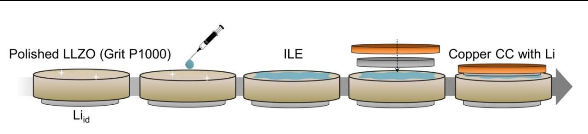
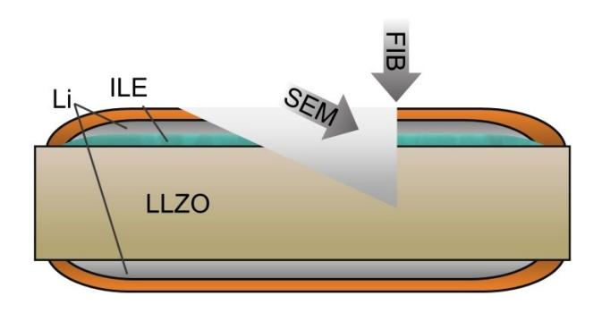
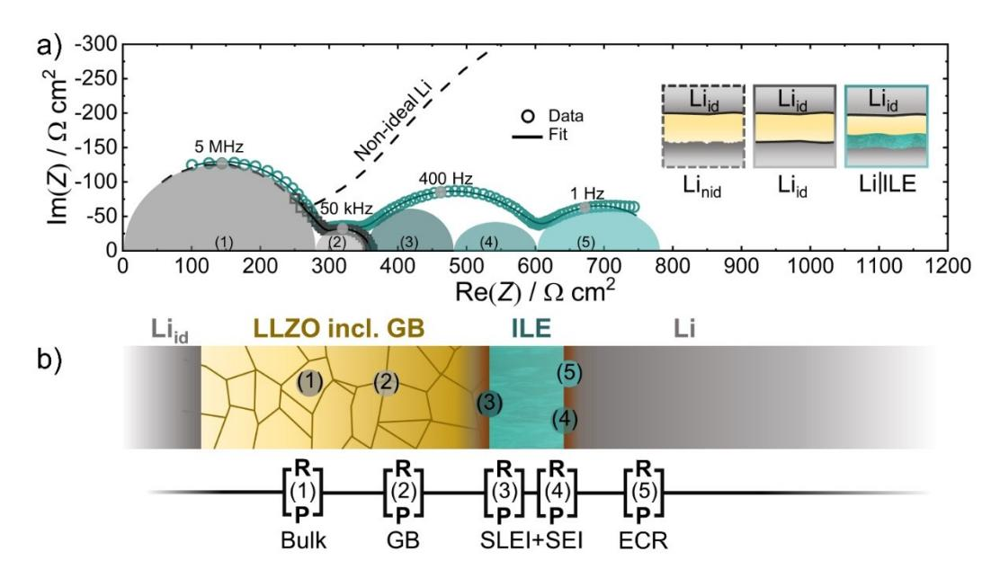
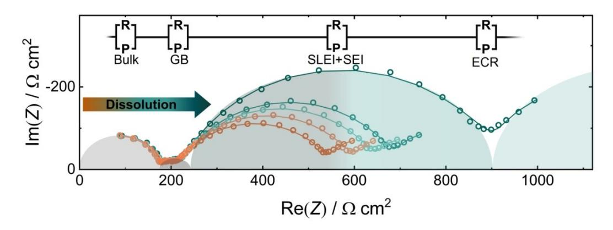
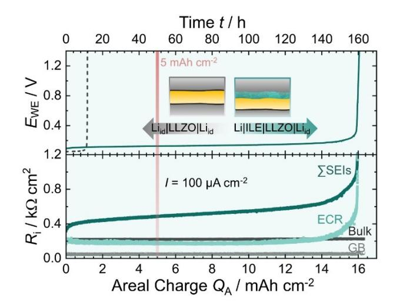
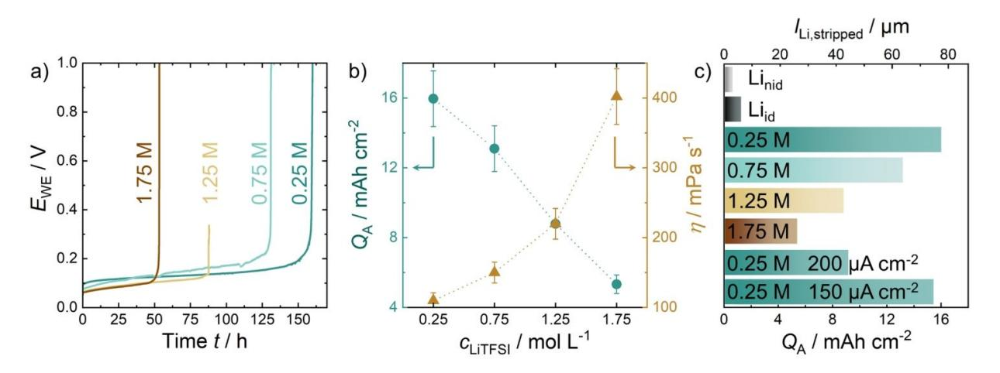
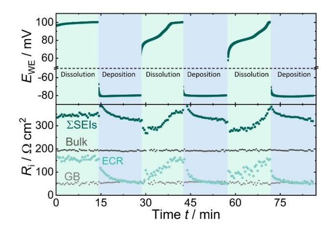
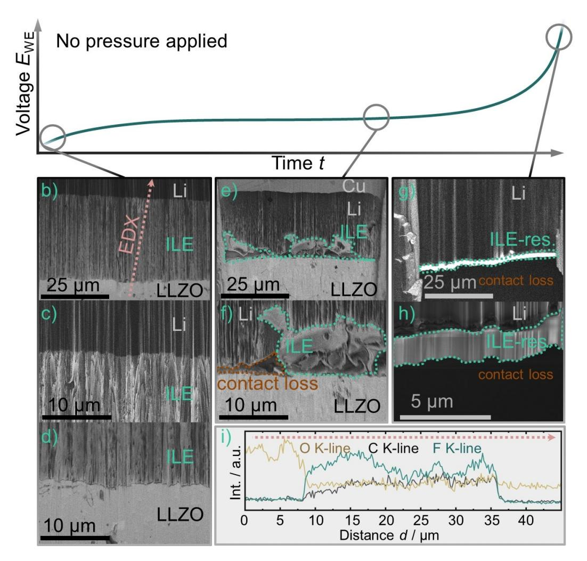
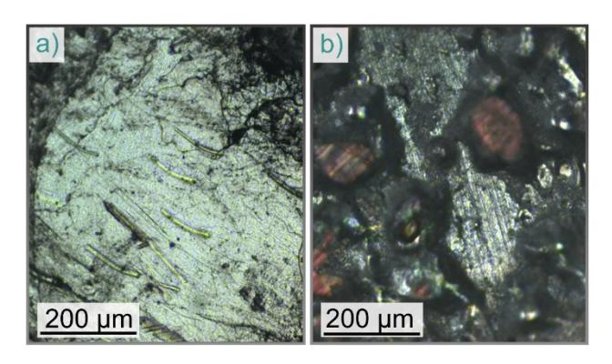
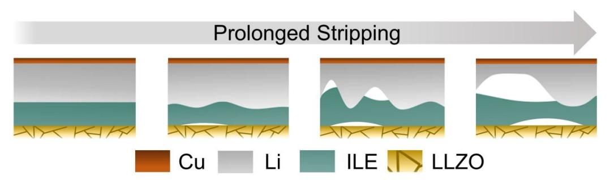

# **Working Principle of an Ionic Liquid Interlayer During Pressureless Lithium Stripping on Li6.25Al0.25La3Zr2O12 (LLZO) Garnet-Type Solid Electrolyte**

Till Fuchs,[a, b] Boris Mogwitz,[a, b] Svenja-Katharina Otto,[a] Stefano Passerini,[c, d] Felix H. Richter,\*[a, b] and [Jürgen](http://orcid.org/0000-0002-9221-4756) Janek\*[a, b]

Solid-state-batteries employing lithium metal anodes promise high theoretical energy and power densities. However, morphological instability occurring at the lithium/solid–electrolyte interface when stripping and plating lithium during cell cycling needs to be mitigated. Vacancy diffusion in lithium metal is not sufficiently fast to prevent pore formation at the interface above a certain current density during stripping. Applied pressure of several MPa can prevent pore formation, but this is not conducive to practical application. This work investigates the concept of ionic liquids as "self-adjusting" interlayers to compensate morphological changes of the lithium anode while avoiding the use of external pressure. A clear improvement of

### **1. Introduction**

Using lithium metal as anode material may significantly increase the gravimetric and volumetric energy densities of battery cells due to its high specific capacity (3861 mAhg 1 , 2062 mAhcm 3 ) as well as low redox potential ( 3.04 V vs. SHE).[1,2] However, chemical degradation as well as morphological issues such as dendrite and pore formation are hindering the application of lithium metal anodes (LMAs) in conventional systems.[3–7] Hybrid battery systems (HBSs) may enable the use of LMAs by attenuating the mentioned issues.[8–10] While liquid electrolytes (LEs) can compensate chemo-mechanical problems

| [a] T. Fuchs, Dr. B. Mogwitz, S.-K. Otto, Dr. F. H. Richter, Prof. J. Janek Institute of Physical Chemistry Justus-Liebig-University Giessen Heinrich-Buff-Ring 17, 35392 Giessen, Germany |
|-----------------------------------------------------------------------------------------------------------------------------------------------------------------------------------------------------|
| E-mail: felix.h.richter@phys.chemie.uni-giessen.de                                                                                                                                                  |
| juergen.janek@phys.chemie.uni-giessen.de                                                                                                                                                            |
| [b] T. Fuchs, Dr. B. Mogwitz, Dr. F. H. Richter, Prof. J. Janek                                                                                                                                     |
| Center for Materials Research (ZfM)                                                                                                                                                                 |
| Justus-Liebig-University Giessen                                                                                                                                                                    |
| Heinrich-Buff-Ring 16, 35392 Giessen, Germany                                                                                                                                                       |
| [c] Prof. S. Passerini                                                                                                                                                                              |
| Helmholtz Institute Ulm                                                                                                                                                                             |
| Helmholtzstraße 11, 89081 Ulm, Germany                                                                                                                                                              |
| [d] Prof. S. Passerini                                                                                                                                                                              |
| Karlsruhe Institute of Technology (KIT)                                                                                                                                                             |
| P.O. Box 3640, 76021 Karlsruhe, Germany                                                                                                                                                             |
| Supporting information for this article is available on the WWW under https://doi.org/10.1002/batt.202100015                                                                                     |
| © 2021 The Authors. Batteries & Supercaps published by Wiley-VCH GmbH. This is an open access article under the terms of the Creative Commons                                                    |

*© 2021 The Authors. Batteries & Supercaps published by Wiley-VCH GmbH. This is an open access article under the terms of the Creative Commons Attribution Non-Commercial NoDerivs License, which permits use and distribution in any medium, provided the original work is properly cited, the use is non-commercial and no modifications or adaptations are made.*

the lithium dissolution process is observed as it is possible to continuously strip more than 70 μm lithium (i. e., 15 mAhcm 2 charge) without the need for external pressure during assembly and electrochemical testing of the system. The impedance of the investigated electrodes is analyzed in detail, and contributions of the different interfaces are evaluated. The conclusions are corroborated with morphology studies using cryo-FIB-SEM and chemical analysis using XPS. This improves the understanding of the impedance response and lithium stripping in electrodes employing liquid interlayers, acting as a steppingstone for future optimization.

of electrode materials common when using inorganic solid electrolytes (ISEs) without the application of pressure,[11–13] ISEs promise better chemical stability, safety and the capability of suppressing dendrite formation.[14–16] While HBSs are promising, there is an additional interface present in the battery when combining different electrolytes, which may lead to the formation of highly resistive interphases.[8,17]

Both Randau et al. and Albertus et al. conclude that a high areal capacity of *>*5 mAhcm 2 is necessary for a cell to be viable for future applications.[18,19] Currently, this goal is not met by ISEs. Only about 1.2 mAhcm 2 were achieved when using a LMA in combination with an ISE for the electro-dissolution (stripping) process at room temperature when using planar oxide ISEs.[20] Employing 3D-anodes in combination with oxide ISEs enables cycling with 3.26 mAhcm 2 . [21] Polymer-based SEs enable the reversible stripping and plating of more than 2 mAhcm 2 with PEO-based cells at 70°C–80°C.[22] Note that all cited examples rely on high pressures in the MPa range either when preparing the anode or during cycling of the cell. Hence, no lithium metal anode based on ISEs as yet fulfils the requirements for competitive cell setups.

One limiting factor in most systems is a high internal cell resistance, which ideally should be as low as possible to enable practical power densities. Krauskopf et al. were already able to show via microelectrode studies that the charge transfer between a garnet ISE (LLZO) and the LMA is inherently fast and not rate-limiting.[23] Interfacial resistances measured in macroscopic cells can rather be interpreted as constriction resistances, as full contact between the LMA and ISE is prevented by pores and surface contaminations.[20,23,24] It was furthermore observed that insufficient vacancy diffusion in lithium itself limits its performance under anodic currents. Pore formation at the LijISE interface leads to increasing resistance due to a loss of contact, thus limiting the available areal capacity.[20] While high stack pressures (35 MPa and above) suppress pore formation by plastic deformation of the LMA, future work should investigate concepts of mitigating this issue without the necessity of high external pressure, as this is deemed unviable for large-scale applications.

Essentially, two mechanisms increase the internal cell resistance: detrimental side reactions between lithium and most common solid as well as liquid electrolytes,[25–27] and current constriction by pore formation when stripping at the LMA.[20,28] While lithium deposition[29–31] and in parts also dissolution[32] are well investigated in classic liquid electrolytes, it is not clear if established concepts can be transferred to HBS. One way to prevent loss of contact during pressureless stripping may be by employing a thin layer of LE between the solid components of a cell as a "self-adjusting" contact mediator, kept at the interface by cohesive and adhesive forces. Not only the morphological instability of the LMA, but also state-of-charge dependent volume changes of electrode materials in general, could be attenuated or compensated without pressure application.

In recent studies by Pervez et al. an ionic liquid electrolyte (ILE, Py14FSI with LiTFSI) was already employed alongside garnet electrolytes in symmetric and full cells.[33,34] It was shown that the interfacial resistance between the separator and both electrodes could be reduced by a factor of 10. The reduced interfacial resistance enabled stable cycling with 0.3 mAcm 2 in symmetrical LijILE jISE jILE j Li cells. In a similar study, cycling of a cell combining an ISE (LLZO-based) and a soft gel electrolyte (GE, PVDF HFP membrane in combination with LiPF6 dissolved in a 1:1 mixture of ethylene carbonate and diethyl carbonate) was performed by Liu et al..[35] The GE was used as a means to increase wetting between the solid materials, which reduced the interfacial resistance to 214 Ωcm2 (LijGE) and to 248 Ωcm2 (GE j cathode) by orders of magnitude. Employing soft/liquid interlayers between garnet SE and LMAs, the authors explain their success by an improved ionic contact between separator and anode, filling gaps with soft material. However, only short plating and stripping cycles were utilized, and neither was the stripping behavior investigated in detail during cycling nor was the morphology of the LMA observed over an extended period of time. Short stripping and plating experiments are essential to get a quick overview of the viability and longevity of cell setups, but understanding possible failure mechanisms requires long-term experiments.

Naturally, the electrolytes, solid as well as liquid, used in a hybrid battery setup must be chosen with care. Chemical compatibility, sufficient Li+-conductivity (*>*0.5 mS cm 1 ) and good wetting are of utmost importance for cell performance. For our study, we chose the ionic liquid electrolyte Py14TFSI, because the extremely low vapor pressure of ILEs[36,37] enables post-mortem cell-analysis by UHV-methods. The viscosity of these ILEs can also be tuned by changing the conducting salt concentration.[33,38] As a model ISE, Li6.25Al0.25La3Zr2O12 (LLZO) was used as it is chemically compatible with LMAs and can be prepared with very low porosities. Therefore, detrimental side reactions can be excluded when ISE comes in contact with lithium, which would not be possible with other common ISE, such as thiophosphates or polymers.[39–41]

This work investigated a hybrid cell concept employing ionic liquid electrolyte Py14TFSI with LiTFSI as an interlayer between inorganic solid electrolyte LLZO and a lithium metal anode. Use of the ionic liquid interlayer enables a pressureless and self-adjusting compensation of pore formation when stripping lithium as shown by electrochemical impedance spectroscopy, cell cycling and morphological studies via electron microscopy of cross-sections prepared by focused ion beam sputtering. Pore formation is compensated to a limited extent, which enables a pressureless and large continuous stripping capacity.

### **Experimental Section**

### **Preparation of Used Electrolytes**

The exact composition of the herein prepared LLZO, based on the used precursors, was Li6.25Al0.25La3Zr2O12. A solid-state synthesis utilizing high temperature sintering in oxygen atmosphere was used.[20] Therefore, the precursors were homogenized first with two ball-milling steps (10 min with 20 min pause at 350 rpm, 24 cycles). Subsequent calcination was carried out in MgO-crucibles under dry oxygen atmosphere. The material was pressed beforehand to secure good contact. The pellets were then heated up in 10 hours to 1000°C, which was held for 4 hours under an oxygen flow of 150 sccm. Every following step was exclusively performed under an argon environment (MBraun glovebox, *<*0.1 ppm H2O, *<*1 ppm O2). First, the material was ball-milled again with the same parameters as above for 40 cycles to obtain small particles for sintering. The sintering was carried out with pellets (isostatically pressed beforehand, 380 MPa) under dry oxygen in MgO-crucibles with mother powder (calcined LLZO powder). Pellets were first heated in 9 hours to 900 °C, which was held for 5 hours. Afterward, the temperature was raised in 2 hours to 1100 °C and again held for 5 hours. Lastly, in 1 hour, the temperature was increased again to 1230°C and held for 4 hours, followed by a slow cooling. The pellets were then freed of the mother powder in the glovebox, measuring a thickness of around 2 mm and a diameter of 8.2 mm.

Ionic liquid electrolytes (ILE) were prepared by adding 0.25, 0.75, 1.25 or 1.75 mol L 1 LiTFSI (Lithium bis(trifluoromethanesulfonyl) imide, Iolitec, 99%) conducting salt under constant stirring with a magnetic stir bar to Py14TFSI (1-Butyl-1-methylpyrrolidinium bis (trifluoromethanesulfonyl)-imide, Iolitec, 99%, *<*150 ppm H2O). LiTFSI was dried beforehand under vacuum at 120 °C for 12 hours. All procedures were carried out in an argon environment (MBraun glovebox, *<*0.1 ppm H2O, *<*0.1 ppm O2).

### **Materials Characterization**

X-ray diffraction of the herein prepared LLZO was performed using a PANalytical Empyrean powder diffractometer in Bragg-Brentano θ-θ geometry with copper Kα radiation (*λ*1=1.5405980 Å; *λ*2= 1.5444260 Å; *I*(*λ*2)/*I*(*λ*1)=0.5). To exclude reactions with ambient atmosphere, samples were sealed air-tight with capton foil. Measurements were carried out in the 2*θ* range between 20° and 100° with a step size of 0.026°. Used Py14TFSI was characterized regarding its water content using the Karl-Fischer-titration method

**Figure 1.** Schematic of the cell assembly process. Starting point is a garnet pellet with one ideally reversible lithium electrode at the bottom and a polished surface at the other side. Ideally reversible lithium electrodes (Liid) were prepared with 380 MPa isostatic pressure.[20]

in a glovebox. Their viscosity was obtained by utilizing the Rheometer R/S *plus* by Brookfield. The distance between sample holder and cone was set to 0.0497 mm, as a C-50 cone was used. Furthermore, confocal microscopy was carried out on LMAs by preparing them airtight inside a glovebox in a home-made setup. Imaging was carried out by a PLu neox 3D optical profiler (Sensofar).

### **Cell Assembly and Electrochemical Characterization**

First, lithium foil was prepared freshly by flattening a small chunk of lithium which was freed of surface layers in a press to obtain a thickness of approximately 100 μm. Symmetric cells with two (ideally) reversible lithium electrodes (Liid) were prepared by isostatically pressing lithium foil on LLZO with 380 MPa, as reported by Krauskopf et al..[20] After confirming negligible interfacial resistance between lithium and LLZO, one lithium electrode was scraped off to be replaced by the LijILE system. Therefore, the garnet pellet was polished with SiC sanding paper (P500 followed by P1000). Afterward, one droplet of ionic liquid was placed into the middle of the prepared pellet. The droplet was generated by submerging a small tip into the ILE and pulling it out, creating the droplet by its surface tension. Less than 1 μL of ILE were used per 0.3 cm2 interface area, which is estimated by evaluating FIB-SEM images (see Results and Discussion). Subsequently, a freshly prepared lithium foil (*d*=6 mm) was placed on top of the ILE and covered with a sheet of copper (*d*=8 mm) as the current collector (CC). The described cell building procedure is schematically depicted in Figure 1.

Electrochemical characterization was carried out using either a VMP300 or SP300 potentiostat by BioLogic in combination with the software EC-Lab (version 11). Temperature dependent measurements were carried out in a climate chamber WKL 64 by WEISS. For electrochemical measurements, pellets were contacted with nickel current collectors and sealed in pouch cells or alternatively measured directly in the glovebox using a home-made setup, as described in a previous publication.[20] As both used setups do not apply pressure, their respective influence should be negligible.

Potentiostatic electrochemical impedance spectroscopy (PEIS) measurements were carried out in the frequency range between 7 MHz and 100 mHz, if not stated differently. Galvanostatic EIS (GEIS) measurements were carried out in a different frequency range, 7 MHz to 1 Hz, as spectra acquisition needs to be faster in this measurement mode to not disturb the DC experiment. Typically, the current amplitude for measuring the impedance was set to 10% of the DC current applied to the cell. This yields a sufficient quality in impedance data while also not disturbing the DC experiment too much. Impedance data interpretation as well as fitting thereof was carried out by RelaxIS 3 by RhD Instruments. As the resistances of the different processes fitted herein differ substantially, a proportional weighing method was used to fit the spectra.

### **FIB-SEM and EDX Measurements**

FIB-SEM imaging was carried out using a XEIA3 GMU SEM/Plasma-FIB (Tescan) in combination with a Leica VCT500 transfer module and liquid nitrogen cooling stage. Corresponding EDX measurements were carried out by an EDAX Octane Elite Super SDD Detector. Samples for FIB-SEM were prepared with a slightly thinner lithium electrode to enable cutting through the whole cell setup into the LLZO. This is necessary to not distort the interfacial arrangement between ILE, lithium and LLZO, as disassembling the cell would destroy morphological properties. Figure 2 displays the described procedure.

### **Surface Analytics Using X-Ray Photoelectron Spectroscopy (XPS)**

As the ILE does not evaporate, any visible ILE residue on the pellet surface was gently wiped off using dust-free paper. Washing with a solvent was avoided as to not influence the interphase composition. XPS measurements were carried out using a PHI5000 Versa Probe II instrument (Physical Electronics GmbH, Germany) equipped with a Specs PHOIBOS 150 hemispherical energy analyzer and a monochromated Al Kα X-ray source. Charge neutralization was carried out for electronically insulating LLZO samples using a low-energy flood gun. The power of the X-ray source was 100 W and the analysis area was 1 mm2 . Survey spectra were measured using a pass energy of 93.9 eV at a resolution of 0.5 eV/step and a total integration time of 50 ms/point. Core-level spectra were measured using a pass energy of 29.35 eV at a resolution of 0.2 eV/step and a total integration time of 50 ms/ point. Spectra were calibrated in relation to the signal of adventitious carbon at 284.8 eV. Depth profiling was carried out using Ar+ ions with energies of 0.5 kV or 1 kV. Data evaluation was

**Figure 2.** Schematic of the geometry how cryo-FIB-SEM measurements were carried out. The thicknesses of the layers were approximately 20 μm, 80 μm, and 20 μm for the copper current collector, LMA and ILE interlayer, respectively. The FIB-crater is not drawn to scale, as it only has a lateral dimension of around 200 μm×150 μm.

done using the software Casa XPS (version 2-3-22PR1.0, Casa Software Ltd).

### **2. Results and Discussion**

### **2.1. Materials Characterization**

The phase purity of the used ISE is especially important in this study, as detrimental side reactions have to be excluded. Therefore, the used LLZO was investigated regarding its crystal structure, density as well as electrical properties and morphology before being employed in this work. From XRD (Figure S1a), it is clear that the prepared LLZO crystallized in the well-conducting cubic polymorph without significant presence of the tetragonal side phase. The cross-section of the prepared pellets is shown in Figure S1b by SEM. The pellet density is geometrically estimated to be 95�1%, which characterizes a well consolidated phase, as also visible in the cross-section SEM image. A high pellet density is necessary to prevent ILE penetration into the LLZO pellet.

Additionally, Figure S2 displays a Nyquist plot of a symmetrical cell employing two ideal lithium electrodes (Liid) on LLZO and an obtained Arrhenius plot. The Nyquist plot displays two processes, corresponding to bulk and grain boundary transport in the material. The absence of a third process confirms that our preparation yields a negligible interface resistance for Liid j LLZO. As seen in Figure S2b, both bulk and grain boundary processes follow an Arrhenius-type temperature dependence. The herein prepared LLZO shows an ionic conductivity of 0.56 mS cm 1 at 25°C as well as an activation energy *E*A,bulk=0.34 eV, which is in accordance with previous published data for aluminum doped garnet ISE.[20,42–44] Likewise, the obtained activation energy *E*A,GB=0.40 eV for grain boundary transport also fits reasonably to literature data.

#### **2.2. Impedance Analysis of the System and its Time Dependency**

To investigate the effect of ILE on interfacial properties, three different types of cells were built and investigated. All cells employ ideal lithium electrodes (Liid, prepared with 380 MPa pressure) as counter-electrode, as its contribution to the overall impedance is negligible.[20] Therefore, changes in resistance can fully be attributed to changes of the working electrode.

First, a cell with a non-ideal lithium working-electrode (Linid) was prepared by attaching lithium with a small uniaxial pressure forming a non-ideal Linid j LLZO interface. The corresponding fit of the Nyquist plot is displayed as a dashed line in Figure 3 as reference. A full spectrum of that cell is shown in Figure S3. Additionally, the Nyquist-plot of a symmetrical cell with two ideal lithium electrodes prepared under high pressures, Liid j LLZOj Liid, and that of a cell employing the ILE as an interlayer between LLZO and Li are shown for means of a direct comparison. For the preparation of such a LijILE j LLZO electrode configuration, no external pressure (beyond atmospheric pressure) is applied (see Figure 1). Used equivalent circuits are depicted in the respective figures. Generally, semicircles were fit using an equivalent circuit composed of a series of parallel circuits of a resistance (*R*) and non-ideal capacitance (*P*).

As the herein built cells all include LLZO as separator, both high frequency processes (HF, 7 MHz–50 kHz) are identical in each case. In accordance with previous publications, these processes represent bulk and grain boundary transport within

**Figure 3.** a) Comparison of Nyquist plots of impedances of Linid j LLZOj Liid (dashed), Liid j LLZOj Liid (grey) and LijILEj LLZOj Liid (green) cells with their respective fits and characteristic peak frequencies. Two additional semicircles appear when the ILE interlayer is added to the cell, which probably represent the interphases between the ILE and the two solids as well as an electrochemical reaction (ECR) at the lithium electrode. Furthermore, b) shows a schematic of the herein investigated LijILE j LLZOj Liid cell alongside the used equivalent circuit used for fitting and the corresponding origins in the cell.

LLZO.[20,28,45] Usually, one would expect to see an additional ohmic drop across the ILE at high frequencies, but its contribution is negligible when the ILE is only present as a very thin interlayer, as in the LijILE j LLZOj Liid cells. All impedance contributions for the analyzed setups are listed with their characteristic frequencies and capacitances in Table S1.

In contrast to the HF processes, the mid frequency processes (MF, 400 Hz) differ significantly between the cell setups. For the Linid j LLZO electrode, a large semicircle is visible, which can be linked to the high interfacial resistance *R*int between LLZO and lithium. Said *R*int becomes negligibly small for ideal lithium electrodes prepared under high pressures (Liid j LLZO) as seen in dark grey. When employing a LijILE electrode pressureless, another process is observed. The additional semicircle in the MF range is severely depressed, which indicates that two transport processes overlap in this frequency range: the transport through interphases with the ILE (ILE j LLZO and LijILE).[45–47] As their interphase compositions and with that, the time constants, are suspected to be similar, they cannot be resolved separately. Hence, only the sum of both is considered in the following as *R*�SEIs.

A further semicircle, located in the low frequency range (LF, 1 Hz), is observed for the LijILE electrode. We interpret this process as electrochemical reaction (ECR) at the LMA, as lithium is plated and stripped at frequencies around 1 Hz.[45,48] Even though the diffusion in the ILE may also explain a contribution in this frequency range,[35] we rule this out by investigating Lij ILE j Li cells with thicker ILE layers (Figure S4).

To further resolve the contributions in the MF range and aging of the LijILE electrode, Table 1 summarizes the MF resistance contributions of the prepared cells. For one, the table compares the MF response of Liid j LLZOj Liid, Linid j LLZOj Liid and LijILE j LLZOj Liid cells as built. For another, the resistance values of the MF semicircle of a LijILE j LLZOj Liid cell are compared as built and after aging for 100 hours. Finally, after aging, parts of the cell were gradually replaced with fresh components, followed by an EIS analysis at each step. First, aged lithium was replaced by a freshly prepared foil. Then, the LLZO surface was polished and both ILE and lithium were renewed, again followed by impedance measurements. All corresponding Nyquist plots are appended in Figure S5.

It is important to note that the interfacial resistance of Lij LLZO electrodes is highly dependent on the applied pressure while attaching lithium during preparation.[20,24] When attaching lithium to a polished interface by hand, an interfacial resistance of *>*1 kΩcm2 is obtained. It was shown that this high value is in fact not intrinsic to the material combination, but can rather be explained by current constriction, which originates from surface inhomogeneities.[23,24] These can either be impurity phases, like Li2CO3, or morphological roughness due to polishing with SiC-paper. By pressing freshly prepared lithium isostatically with 380 MPa onto polished LLZO, the interfacial resistance in Liid j LLZO becomes negligibly small (*<*1 Ωcm2 ) by obtaining optimal contact due to the ductility of lithium metal. However, utilizing high pressures is not optimal for cell preparation, especially when considering the scaling of production. Therefore, if the ILE is employed to enable better contact between LLZO and lithium, an interfacial resistance of only 232 Ωcm2 yields without pressure application.

Aging of the LijILEj LLZOj Liid cell for 100 hours led to a five-fold increase in the MF resistance contribution, which can be linked to a growing ILE j LLZO or LijILE interphase, or actually both. In order to evaluate the individual contributions, we first replaced the aged LMA with a freshly prepared one. This increases the MF resistance marginally, possibly as the ILE has not fully wet the new lithium surface yet, and shows that the LijILE interphase is not the major contributor to MF resistance. Subsequently polishing the LLZO surface and employing fresh ILE and lithium again yields a low resistance comparable to that of the as-built cell. Hence, it can be concluded that the LijILE interphase is fairly stable and passivating if no current is applied, whereas the ILE j LLZO interphase grows with time and is the major contributor to the MF resistance.

Therefore, we analyzed the composition of the ILE j LLZO interphase by XPS depth profiling on fresh LLZO and on pellets which were used in cells in combination with the ILE. Our results (Figure S6) confirm the analysis reported in a previous study by Pervez et al.[33] and highlight the formation of LiF at the interface between LLZO and ILE.

The impedance of LijILEj LLZOj Liid shows quite similar features to that of cells employing GE by Liu et al..[35] The overall impedance of the interphases between ILE/GE with Li and LLZO is in the same range (200 Ωcm2 –300 Ωcm2 ). Like found here for the LLZOjILE j Li electrode, the LijGEj LLZO electrode shows overlapping contributions from the LijGE interphase as well as the GEj LLZO interphases in a similar frequency range. However, in this case the process at around 1 Hz represents a diffusion resistance of the GE, which is found in a much lower frequency range in our case (1 mHz). In our study, we attribute this LF frequency process therefore to an ECR resistance at the LMA. The difference may be explained by different diffusion properties of ILE and GE and cell geometry, specifically the thickness of the soft interlayer.

| Table 1. Summary of mid-frequency resistances (RMF, 400 Hz) and their different origins for herein prepared cell setups.                                                                                                                            |                                          |                                                                                                                                                                                                 |  |
|-----------------------------------------------------------------------------------------------------------------------------------------------------------------------------------------------------------------------------------------------------|------------------------------------------|-------------------------------------------------------------------------------------------------------------------------------------------------------------------------------------------------|--|
| Cell setup                                                                                                                                                                                                                                          | RMF [Ωcm2 ]                           | Contribution MF                                                                                                                                                                                 |  |
| Linid j LLZOj Liid as built Liid j LLZOj Liid as built LijILE j LLZOj Liid as built LijILE j LLZOj Liid aged 100 hours LijILE j LLZOj Liid fresh lithium on aged cell LijILE j LLZOj Liid polished LLZO and fresh ILE and lithium | 1201 <1 232 1112 1469 222 | Linid j LLZO interface Liid j LLZO interface Interphases, process (3) and (4) Interphases, process (3) and (4) Interphases, process (3) and (4) Interphases, process (3) and (4) |  |

*Batteries & Supercaps* **2021**, *4*, 1145–1155 **[www.batteries-supercaps.org](https://doi.org/10.1002/batt.202100015)** 1149 © 2021 The Authors. Batteries & Supercaps published by Wiley-VCH GmbH

Articles doi.org/10.1002/batt.202100015

**Figure 4.** Nyquist plots of impedances measured approximately every 12 hours when stripping with 100 μAcm 2 (the equivalent circuit used for fitting is shown above the data). Note that the SEI at the Lithium electrode and the SLEI between ILE and LLZO cannot be separately resolved due to similar characteristic frequencies.

#### **2.3. Influence on Lithium Stripping**

In the following, we investigate the LijILE j LLZO electrode during current load. At the solidjsolid interface, an anodic current leads to severe morphological issues at the LMA in combination with an ISE.[20,24] Due to a rather slow vacancy diffusion in lithium metal, vacancies accumulate at the interface above a certain current threshold, leading to pore formation and subsequent contact loss. Stripping and plating experiments at the LMA can be analyzed well by galvanostatic EIS (GEIS), where a DC current is superimposed to ongoing EIS measurements.

In order to investigate the influence of the employed ILE on the pore formation during prolonged stripping at the LMA, GEIS measurements were carried out at 100 μAcm 2 until a severe change in the potential was registered for the Li working electrode in the LijILE j LLZOj Liid. Exemplarily, Figure 4 shows the evolution of the obtained Nyquist plot over time. For clarity, only a few representative spectra were selected and shown in this figure. It is evident that – while the bulk and grain boundary contributions stay constant – major changes can be observed in the mid and low frequency region, linked above to the SEIs and ECR.

To better assess the observed resistance evolution, Figure 5 displays the voltage profile as well as the resistance contributions over time, which were obtained by fitting the spectra in Figure 4. The general behavior of Liid j LLZOj Liid (grey)[20] and the herein built LijILE j LLZOj Liid (green) is quite similar. For a major part of the stripping processes, the voltage is quite stable and only increases slightly for both setups. The overall higher cell resistance when employing the hybrid electrode setup also leads to a higher voltage plateau. Subsequently, a sudden steep voltage increase causes cell failure. However, this is delayed by a factor of 10–15 when employing ILE as an interlayer, leading to an areal capacity of around 16 mAhcm 2 , which is about 3 times higher than the required goal 5 mAhcm 2 . [18,19] As no pressure was applied to the cell during stripping, this is a significant result. An equally large stripping capacity can otherwise only be achieved by applying high pressures during the stripping process.[20]

**Figure 5.** The top part of the figure displays the voltage profiles of two different cells over time during pressureless stripping at a current density of 100 μAcm 2 . While having a lower voltage plateau, the Liid j LLZOj Liid (grey)[20] cell setup experiences earlier voltage increase, which is delayed by approximately 15 mAhcm 2 when using an ILE interlayer (green). The bottom part of the Figure displays the corresponding resistance evolution obtained by fitting the GEIS data, indicating that the ECR as well as the SEI resistances are responsible for the voltage increase.

The steep voltage increase for Liid j LLZOj Liid cells is explained by a rising interfacial resistance due to contact loss at the working electrode.[20] While bulk and grain boundary processes are constant over the whole stripping process, the observed SEI and ECR resistance contributions also increase at the end and are responsible for the voltage increase. Consequently, it can be concluded that interfacial issues are still responsible for cell failure, even when employing ILE as an interlayer. While significantly delaying contact loss by employing an ILE interlayer, it will still occur after a large amount of lithium has been stripped. This indicates that contact loss still occurs at the already discussed SLEI between LLZO and ILE or even between ILE and Li when more lithium is stripped than can be compensated by excess ILE present at the interface.

To further investigate the influence of ILE properties on stripping, different cells employing more viscous ILEs were

**Figure 6.** a) Voltage profiles of cells employing 1.75 M, 1.25 M, 0.75 M and 0.25 M LiTFSI. b) Calculated areal capacity *Q*A and measured viscosity of the ILEs versus their LiTFSI concentration. Error bars are estimated according to reproduced experiments and experimental uncertainties. c) Comparison of areal capacities between different cell setups. Measurements were conducted with 100 μAcm 2 unless stated otherwise.

prepared and characterized. As the viscosity can be fine-tuned via the salt concentration *c*LiTFSI, [38] cells with 0.25–1.75 (Δ= 0.5) mol L 1 of LiTFSI in Py14TFSI were subjected to long-term stripping within this work. Nyquist plots of as-built cells are shown in Figure S7. No clear differences can be observed in the cell impedance before stripping.

Figure 6a shows the voltage profiles when stripping lithium in the abovementioned cells. Cell failure occurs earlier when more LiTFSI is dissolved in the ILE. Moreover, Figure 6b shows the calculated available areal charge capacity *Q*A as well as the viscosity *η* as function of the salt concentration *c*LiTFSI. A linear decrease in *Q*A is observed with increasing *c*LiTFSI. As *η* increases with *c*LiTFSI, this indicates that a lower viscosity improves the stripping performance – almost linearly (Figure S8). The obtained viscosity for the 0.25 M ILE is in good agreement with literature data on similar systems, being around 90 mPa s.[49,50]

An overview over the prepared cells employing ILE and bare Lij LLZO electrodes is displayed in Figure 6c, showcasing the improved stripping behavior for all ILEs, even under higher current density. Note that by increasing *c*LiTFSI not only the viscosity is increased, but also the ionic conductivity *σ* is decreased, see Table S2. As the ILE only contributes only to a minor extent to the overall cell resistance, we assume that the differences in stripping behavior are due to changes in *η* instead of *σ.* Clearly, the ILEs with lower viscosity and therefore also lower surface tension[51,52] can follow morphology changes of the interface easier, and therefore, act more efficiently as "contact buffer".

#### **2.4. Reversibility of Li**j**ILE-Electrode Configurations**

As already shown above, the employed ILE interlayer greatly improves the available areal specific capacity under anodic operating conditions, compensating pore formation at the interface without the application of pressure. Naturally, also the behavior under cathodic conditions was investigated here. Figure 7 shows a voltage profile and resistance evolution for stripping and plating with 100 μAcm 2 in an asymmetrical Lij ILE j LLZOj Liid setup. Within the herein cycled areal capacity of lithium (approximately 25 μAhcm 2 or 125 nm per step, if stripped homogeneously), the Liid counter electrode is morphologically stable and does not contribute to the observed changes in resistance.[20] We deliberately chose not to employ two LijILE electrodes, as changes while stripping on one side may overlap with changes while plating on the other.

As the cell setup is not strictly symmetrical, the observed voltage profile is also not completely symmetrical despite using two lithium electrodes, which originates from the fact that Liid was prepared under high pressures and unlike the other electrode does not employ ILE between the ISE and lithium. However, it is striking that the first stripping step has a stable, rather unchanged voltage compared to subsequent stripping steps, showing a step-like voltage profile. We believe that

**Figure 7.** The top of the graph shows the voltage profile during pressureless stripping (green) and plating (blue) at the ILE side of the prepared LijILE j LLZOj Liid cell setup. The bottom part of the graph shows the evolution of the different resistance contributions present in the impedance spectrum obtained via GEIS measurements.

lithium stripping is quite homogenous in the beginning, as morphological inhomogeneities have not formed yet. After reversing the current, plating occurs at the LijILE electrode, which probably leads to inhomogeneous lithium deposition.[53–55]

Understanding this observation is possible by analyzing changes in the different resistance contributions. As expected, bulk and grain boundary resistances are constant during the measurements, as the separator does not change. However, the voltage profile is closely mirrored by the changes in *R*�SEIs and *R*ECR. At first, both contributions are constant during homogeneous stripping. Subsequent morphological changes during plating lead to an increasing surface area of the LMA and therefore to an apparent decrease of the ECR resistance contribution. This is similar to what was observed for Linid j LLZO regarding the interfacial resistance at around 1 kHz.[20] Additionally, similar but attenuated effects are visible for the sum of the interphase resistances in the middle frequency range. Again, by increasing the actual surface area of the LMA during plating, the apparent SEI resistance between ILE and lithium decreases. This also confirms that the SLEI resistance between ILE and LLZO does not depend on changes in the LMA morphology. Despite the SEI resistance only having a small contribution to the sum of both SEI and SLEI, it still impacts the observed total value.

Previous studies employing ILE or GE as interlayers showed a stable cycling performance in symmetrical cells up to around 0.3 mAcm 2 . [34,35] In these examples, small amounts of lithium were transferred in many cycles, which is especially important to assess long-term stability and potential for possible applications of a cell setup. However, the experiments shown here rather focus on the microscopic evolution and changes in cell resistance contributions to better understand the physicochemical behavior of the setup. Still, in the cited studies, a more symmetric voltage profile was obtained for cells with two hybrid electrode configurations when compared to the herein prepared LijILE j LLZOj Liid cell with only one LijILE electrode. This is surprising, but may be explained by different morphology and surface composition of used LMAs as well as the difference in the counter electrode.

#### **2.5. Evaluation of Morphological Changes During Stripping**

As the ILE's viscosity is suspected to play a crucial role in the origin of the voltage increase and speculated contact loss, cryo-FIB-SEM imaging was performed to analyze changes in lithium and ILE morphology. Therefore, the cells to be investigated with FIB-SEM, were frozen with liquid N2 before imaging, to fix the otherwise liquid ILE in place. Then, FIB-cutting was performed through the Cu CC, LMA and ILE into the LLZO (see Figure 2). Subsequently, SEM images of the cross-section were recorded.

Figure 8b–d displays SEM images of the cross section for a cell which was characterized as-built. Similar images for LijILE electrodes, which experienced an anodic current of 100 μAcm 2 without failure, are displayed in Figure 8e–f. Additionally, an electrode which passed the steep voltage increase was characterized and the cross section is displayed in Figure 8g–h. To unequivocally link the imaged layers to the materials used herein, Figure 8i also depicts the results of an EDX-line-scan that was performed on the cross section of the as-built cell, indicated by the dotted line in Figure 8b. Note that due to the inherent morphological changes during the experiments, different cells had to be used to assess the different stages in the stripping process. Hence, layer thicknesses of lithium and ILE are not necessarily identical in the different cells and FIB cuts. However, we assume that the general morphology evolution is comparable nonetheless. Additional images are presented in Figure S9.

First, the as-built cell has a relatively smooth layered structure of Li, ILE and LLZO. From top to bottom, the layers get progressively brighter as visible in the BSE image in Figure 8b, which is plausible as the involved average atomic mass of elements increases in the order of Li*<*ILE*<*LLZO. The very dark appearance of the top layer identifies it as lithium metal. The next layer corresponds to frozen ILE, followed by LLZO ISE. This is confirmed by measuring an EDX line-scan, as depicted in Figure 8i. For the sake of simplicity, only O, F and C K-line signals are selected. Three separate regions are visible in the element distribution. In the first layer, oxygen levels are clearly elevated which fits to the LLZO layer. The next layer has an enrichment of C and F, which are both present in the ILE. The third layer only gives a low O signal, which probably originates from a passivation on the lithium surface. The lithium itself is not visible with the herein used EDX detector.

Another interesting observation for the first cell is that the contact between the different layers is quite good, indicating satisfactory wetting of the ILE on LLZO and lithium. Only between LLZO and ILE there is a very thin gap (~200 nm), which is probably simply caused by different thermal expansion factors and the large temperature change when cooling with liquid N2. Otherwise, some vertical lines are visible. This "curtaining" is known in literature and frequently happens when performing FIB cuts and is therefore not to be attributed to the samples morphology.[56–58]

Moving to the second cell, which experienced anodic current without severe voltage change, a clear change in morphology is visible. The LijILE interface now shows roughness in the μm scale, which fits well to the amount of lithium that was stripped until this point. This observation also indicates that pore formation due to uneven lithium dissolution is not attenuated by the ILE interlayer, but rather compensated. This compensation is very well displayed in Figure 8e, as the ILE is not a homogeneous layer anymore, but fills pores in the lithium metal. A partial contact loss is already visible in Figure 8f, as the available ILE cannot fill the whole pore volume. However, we note that lithium metal is closer to the separator than it was before. This is probably the case due to the mobility of the ILE and the used cell setup, somewhat shifting the lithium. Interestingly, another cut in this sample was prepared and analyzed, which did not show severe morphology changes but a rather thick lithium layer, see Figure S9. This hints at large inhomogeneities in the stripping process.

**Figure 8.** a) Schematic of a typical voltage profile during stripping of lithium in a LijILEj LLZOj Liid cell. Cross-sectional images were obtained via cryo-FIB-SEM to assess the morphology of the interfaces at different stages while stripping. In b–d), SEM images of the ILEj LLZO and LijILE interfaces in an as-built LijILE j LLZOj Liid cell are displayed. The SEM images in e) and f) show the morphology of the ILE j LLZO and LijILE interfaces after stripping was performed and before cell failure has set in. Finally, g) and h) display cross-sectional images of a cell after the steep increase in voltage. To unequivocally link the different layers in the SEM images with the cell components, an EDX-line scan was carried out on the as-built cell and is displayed in i). Note that all FIB and SEM measurements were carried out at around 140 K–150 K, cooled with liquid nitrogen, so the ILE is solid and lithium metal does not melt when cut with the FIB.

The third column displays the full contact loss after the distinct voltage increase under anodic current. Only some ILE residue (res.) is left bound to the lithium metal, but LLZO is not visible anymore, as the FIB-crater unfortunately was not deep enough to also display the separator. Note that these SEM images were selected to showcase the morphology evolution under anodic current although measurements at different spots partially show other morphologies, see Figure S9. This leads to the conclusion, that pore formation/lithium dissolution is quite uneven and has even macroscopic differences under prolonged stripping as already indicated by the previous sample. Macroscopic pores were also visible to the naked eye when disassembling the cells after measurement. This conclusion is further strengthened by the fact that approximately 16 mAhcm 2 could be stripped, which corresponds to about 75 μm of lithium if it were stripped homogeneously. The resulting strong spatial inhomogeneity is also seen in images obtained via confocal microscopy, as displayed in Figure 9.

**Figure 9.** Comparison of confocal microscopy (top view) images of a) freshly prepared lithium foil and b) lithium foil which was stripped until the voltage spike occurred.

Pores spanning several micrometers as well as holes down to the copper current collector are found for the treated LMA. The freshly prepared foil only shows long marks, probably because of pressing the foil in preparation, but no large pores as visible for the treated LMA.

To summarize the morphology evolution during stripping, Figure 10 displays the suggested mechanism and subsequent contact loss when using ILE as an interlayer. Besides that the ILE partially compensates pore formation, the general mechanism of contact loss is surprisingly similar to that already reported for the solidjsolid Lij LLZO interface.[20] This is supported by the decrease in interfacial capacity of the *RQ*elements in the MF and LF range while stripping as seen in Figure S10, which is quite similar to the bare Liid j LLZO interface.

It is an interesting question why the voltage profile shows such a long and stable plateau before increasing steeply instead of a continuous voltage increase. The reason is yet not completely clear but involves effects on both the nm and μm scale. The effect on the nm-scale is the surface diffusion of lithium, which is constantly supplying new lithium to be stripped at the interface as already discussed in the work of Krauskopf et al..[20] On the μm scale, the ILE is compensating freshly forming inhomogeneities first, which then fails when the excess ILE reservoir has been used up to compensate the continuously growing inhomogeneity. Our findings are supported by experiments where a new cell was assembled in combination with an already stripped lithium anode as in Figure 5. In this case, large stripping capacities are observed again, as new ILE is compensating the pores upon building the cell. From this experiment, it can also be concluded, that lithium does not need to be perfectly flat when preparing cells with liquid interlayers to work.

An additional reason for the sudden and drastic increase in cell resistance may be the change of wetting of the ILE on an increasingly rough lithium surface. With increasing viscosity, the surface tension also increases,[51,52] which facilitates the transition from the Wenzel state (wetting on rough surfaces) to the Cassie-Baxter state (dewetting on rough surfaces) at a lower stripping capacity.[59] This sudden dewetting may also be responsible for the observed contact loss.

# **3. Conclusions**

We analyze a hybrid electrode employing lithium metal as the anode, ionic liquid electrolyte (Py14TFSI with LiTFSI) as an interlayer as well as LLZO as a solid electrolyte separator. This electrode configuration is characterized in a LijILE j LLZOj Liid cell setup mainly with (galvanostatic) electrochemical impedance spectroscopy, FIB-SEM and XPS, regarding the stripping and plating behavior, morphology of the layers and their reactivity, respectively. Generally, the cell resistance is lowered by employing the ILE respective to the conventional (non-ideal solidjsolid) LMA preparation. It was additionally found that this cell setup enhances the areal charge capacity for lithium stripping (*>*15 mAhcm 2 ) by a factor of 10 to 15 in comparison to an ideal Liid j LLZO interface (1.2 mAhcm 2 ) without the need of external pressure while preparing or cycling the cell. Cryo-FIB-SEM imaging reveals that pore formation while stripping at the lithium electrode is not entirely prevented with the herein used setup, but contact loss is rather delayed as the mobile ILE fills growing pores to some extent. Furthermore, this work analyzes the concept of self-adjusting liquid interlayers and possible failure mechanisms, which could be prevented in future studies by employing optimized materials, e.g., ILEs with lower viscosities or cell setups with excess ILE.

## *Acknowledgements*

*The authors thank Dr. Simon Burkhardt for measurements with the optical microscope. This work was conducted as part of the US-German joint collaboration on "Interfaces and Interphases in Rechargeable Li-metal based Batteries" supported by the US Department of Energy (DOE) and German Federal Ministry of Education and Research (BMBF). This work has been partly funded by the German Federal Ministry of Education and Research (BMBF) under the project "LiSI", grant identifier 03XP0224E. F.H.R. is grateful for funding under the project "FLiPS", grant identifier 03XP0261. J.J. and S.P. acknowledge fruitful discussions within the BMBF cluster of competence FESTBATT (projects 03XP0176D and 03XP0175B). S.P. acknowledges the basic funding from the Helmholtz Association. Open access funding enabled and organized by Projekt DEAL.*

**Figure 10.** Schematic of morphology changes occurring during prolonged stripping of the investigated LijILE electrode setup. Pores are forming when lithium is stripped and are compensated by the ILE to some extent. When excess ILE has been used up, this compensation is not upheld upon further stripping of lithium. Note that to increase clarity, the formed SEI and SLEI are deliberately omitted in this image.

*Conflict of Interest*

The authors declare no conflict of interest.

**Keywords:** hybrid battery **·** lithium metal anode **·** solid electrolyte **·** ionic liquid **·** pore formation

- [1] C. Niu, H. Lee, S. Chen, Q. Li, J. Du, W. Xu, J. G. Zhang, M. S. Whittingham, J. Xiao, J. Liu, *Nat. Energy* **2019**, *4*, [551–559](https://doi.org/10.1038/s41560-019-0390-6).
- [2] H. Wang, D. Yu, C. Kuang, L. Cheng, W. Li, X. Feng, Z. Zhang, X. Zhang, Y. Zhang, *Chem* **2019**, *5*, [313–338](https://doi.org/10.1016/j.chempr.2018.11.005).
- [3] Y. Takeda, O. Yamamoto, N. Imanishi, *[Electrochemistry](https://doi.org/10.5796/electrochemistry.84.210)* **2016**, *84*, 210– [218.](https://doi.org/10.5796/electrochemistry.84.210)
- [4] K. Xu, *Chem. Rev.* **2004**, *104*, [4303–4417](https://doi.org/10.1021/cr030203g).
- [5] J. M. Tarascon, M. Armand, *Nature* **2001**, *414*, [359–367](https://doi.org/10.1038/35104644).
- [6] K. Nishikawa, T. Mori, T. Nishida, Y. Fukunaka, M. Rosso, T. Homma, *[J.](https://doi.org/10.1149/1.3486468) [Electrochem.](https://doi.org/10.1149/1.3486468) Soc.* **2010**, *157*, A1212.
- [7] H. E. Park, C. H. Hong, W. Y. Yoon, *J. Power Sources* **2008**, *178*, [765–768.](https://doi.org/10.1016/j.jpowsour.2007.12.081) [8] M. Weiss, F. J. Simon, M. R. Busche, T. Nakamura, D. Schröder, F. H.
- Richter, J. Janek, *Electrochem. Energy Rev.* **2020**, *3*, 221-238 . [9] M. R. Busche, T. Drossel, T. Leichtweiss, D. A. Weber, M. Falk, M. Schneider, M. L. Reich, H. Sommer, P. Adelhelm, J. Janek, *Nat. [Chem.](https://doi.org/10.1038/nchem.2470)* **2016**, *8*, [426–434](https://doi.org/10.1038/nchem.2470).
- [10] M. Keller, A. Varzi, S. Passerini, *J. Power Sources* **2018**, *392*, [206–225.](https://doi.org/10.1016/j.jpowsour.2018.04.099)
- [11] R. Ruess, S. Schweidler, H. Hemmelmann, G. Conforto, A. Bielefeld, D. A. Weber, J. Sann, M. T. Elm, J. Janek, *J. [Electrochem.](https://doi.org/10.1149/1945-7111/ab9a2c) Soc.* **2020**, *167*, [100532.](https://doi.org/10.1149/1945-7111/ab9a2c)
- [12] R. Koerver, W. Zhang, L. De Biasi, S. Schweidler, A. O. Kondrakov, S. Kolling, T. Brezesinski, P. Hartmann, W. G. Zeier, J. Janek, *Energy [Environ.](https://doi.org/10.1039/C8EE00907D) Sci.* **2018**, *11*, [2142–2158.](https://doi.org/10.1039/C8EE00907D)
- [13] R. Koerver, I. Aygün, T. Leichtweiß, C. Dietrich, W. Zhang, J. O. Binder, P. Hartmann, W. G. Zeier, J. Janek, *Chem. Mater.* **2017**, *29*, [5574–5582.](https://doi.org/10.1021/acs.chemmater.7b00931)
- [14] J. Janek, W. G. Zeier, *Nat. Energy* **2016**, *1*, 1–4.
- [15] Y. Kato, S. Hori, T. Saito, K. Suzuki, M. Hirayama, A. Mitsui, M. Yonemura, H. Iba, R. Kanno, *Nat. Energy* **2016**, *1*, 1–7.
- [16] C. Monroe, J. Newman, *J. Electrochem. Soc.* **2004**, *151*, 880–886.
- [17] C. Z. Zhao, B. C. Zhao, C. Yan, X. Q. Zhang, J. Q. Huang, Y. Mo, X. Xu, H. Li, Q. Zhang, *Energy [Storage](https://doi.org/10.1016/j.ensm.2019.07.026) Mater.* **2020**, *24*, 75–84.
- [18] S. Randau, D. A. Weber, O. Kötz, R. Koerver, P. Braun, A. Weber, E. Ivers-Tiffée, T. Adermann, J. Kulisch, W. G. Zeier, F. H. Richter, J. Janek, *[Nat.](https://doi.org/10.1038/s41560-020-0565-1) Energy* **2020**, *5*, [259–270.](https://doi.org/10.1038/s41560-020-0565-1)
- [19] P. Albertus, S. Babinec, S. Litzelman, A. Newman, *Nat. [Energy](https://doi.org/10.1038/s41560-017-0047-2)* **2018**, *3*, [16–21.](https://doi.org/10.1038/s41560-017-0047-2)
- [20] T. Krauskopf, H. Hartmann, W. G. Zeier, J. Janek, *ACS Appl. [Mater.](https://doi.org/10.1021/acsami.9b02537) Interfaces* **2019**, *11*, [14463–14477.](https://doi.org/10.1021/acsami.9b02537)
- [21] E. D. Wachsman, L. Hu, Y. Mo, Washington, DC, **2016**.
- [22] P. Hovington, M. Lagacé, A. Guerfi, P. Bouchard, A. Mauger, C. M. Julien, M. Armand, K. Zaghib, *Nano Lett.* **2015**, *15*, [2671–2678](https://doi.org/10.1021/acs.nanolett.5b00326).
- [23] T. Krauskopf, B. Mogwitz, H. Hartmann, D. K. Singh, W. G. Zeier, J. Janek, *Adv. Energy Mater.* **2020**, *2000945*.
- [24] T. Krauskopf, F. H. Richter, W. G. Zeier, J. Janek, *[Chem.](https://doi.org/10.1021/acs.chemrev.0c00431) Rev.* **2020**, *120*, [7745–7794](https://doi.org/10.1021/acs.chemrev.0c00431).
- [25] D. Aurbach, A. Zaban, *J. [Electroanal.](https://doi.org/10.1016/0022-0728(93)80129-6) Chem.* **1993**, *348*, 155–179.
- [26] D. Aurbach, A. Zaban, *J. [Electroanal.](https://doi.org/10.1016/0022-0728(93)02999-X) Chem.* **1994**, *365*, 41–45.
- [27] Y. Zhu, X. He, Y. Mo, *J. Mater. Chem. A* **2016**, *4*, [3253–3266](https://doi.org/10.1039/C5TA08574H).
- [28] T. Krauskopf, R. Dippel, H. Hartmann, K. Peppler, B. Mogwitz, F. H. Richter, W. G. Zeier, J. Janek, *Joule* **2019**, *3*, [2030–2049.](https://doi.org/10.1016/j.joule.2019.06.013)
- [29] K. N. Wood, M. Noked, N. P. Dasgupta, *ACS [Energy](https://doi.org/10.1021/acsenergylett.6b00650) Lett.* **2017**, *2*, 664– [672](https://doi.org/10.1021/acsenergylett.6b00650).
- [30] F. Sun, L. Zielke, H. Markötter, A. Hilger, D. Zhou, R. Moroni, R. Zengerle, S. Thiele, J. Banhart, I. Manke, *ACS Nano* **2016**, *10*, [7990–7997.](https://doi.org/10.1021/acsnano.6b03939)
- [31] K. N. Wood, E. Kazyak, A. F. Chadwick, K. H. Chen, J. G. Zhang, K. Thornton, N. P. Dasgupta, *ACS Cent. Sci.* **2016**, *2*, [790–801.](https://doi.org/10.1021/acscentsci.6b00260)
- [32] D. Aurbach, E. Zinigrad, Y. Cohen, H. Teller, *Solid State [Ionics](https://doi.org/10.1016/S0167-2738(02)00080-2)* **2002**, *148*, [405–416.](https://doi.org/10.1016/S0167-2738(02)00080-2)
- [33] S. A. Pervez, B. P. Vinayan, M. A. Cambaz, G. Melinte, T. Diemant, T. Braun, G. Karkera, R. J. Behm, M. Fichtner, *J. Mater. Chem. A* **2020**, *8*, 16451–16462.
- [34] S. A. Pervez, G. Kim, B. P. Vinayan, M. A. Cambaz, M. Kuenzel, M. Hekmatfar, M. Fichtner, S. Passerini, *Small* **2020**, *16*.
- [35] B. Liu, Y. Gong, K. Fu, X. Han, Y. Yao, G. Pastel, C. Yang, H. Xie, E. D. Wachsman, L. Hu, *ACS Appl. Mater. Interfaces* **2017**, *9*, [18809–18815](https://doi.org/10.1021/acsami.7b03887).
- [36] P. Wasserscheid, T. Welton, Eds., *Ionic Liquids in Synthesis*, Wiley-VCH, Weinheim, **2002**.
- [37] Y. U. Paulechka, D. H. Zaitsau, G. J. Kabo, A. A. Strechan, *[Thermochim.](https://doi.org/10.1016/j.tca.2005.08.035) Acta* **2005**, *439*, [158–160.](https://doi.org/10.1016/j.tca.2005.08.035)
- [38] A. Eftekhari, Y. Liu, P. Chen, *J. Power Sources* **2016**, *334*, [221–239.](https://doi.org/10.1016/j.jpowsour.2016.10.025)
- [39] F. J. Simon, M. Hanauer, A. Henss, F. H. Richter, J. Janek, *ACS Appl. [Mater.](https://doi.org/10.1021/acsami.9b14506) Interfaces* **2019**, *11*, [42186–42196.](https://doi.org/10.1021/acsami.9b14506)
- [40] S. Wenzel, S. J. Sedlmaier, C. Dietrich, W. G. Zeier, J. Janek, *Solid [State](https://doi.org/10.1016/j.ssi.2017.07.005) Ionics* **2018**, *318*, [102–112](https://doi.org/10.1016/j.ssi.2017.07.005).
- [41] S. Wenzel, D. A. Weber, T. Leichtweiss, M. R. Busche, J. Sann, J. Janek, *Solid State Ionics* **2016**, *286*, [24–33](https://doi.org/10.1016/j.ssi.2015.11.034).
- [42] A. Sharafi, C. G. Haslam, R. D. Kerns, J. Wolfenstine, J. Sakamoto, *[J.](https://doi.org/10.1039/C7TA06790A) Mater. Chem. A* **2017**, *5*, [21491–21504](https://doi.org/10.1039/C7TA06790A).
- [43] L. Cheng, W. Chen, M. Kunz, K. Persson, N. Tamura, G. Chen, M. Doeff, *ACS Appl. Mater. Interfaces* **2015**, *7*, [2073–2081](https://doi.org/10.1021/am508111r).
- [44] Y. Matsuki, K. Noi, M. Deguchi, A. Sakuda, A. Hayashi, M. Tatsumisago, *[J.](https://doi.org/10.1149/2.0661903jes) Electrochem. Soc.* **2019**, *166*, [A5470–A5473.](https://doi.org/10.1149/2.0661903jes)
- [45] J. T. S. Irvine, D. C. Sinclair, A. R. West, *Adv. Mater.* **1990**, *2*, [132–138](https://doi.org/10.1002/adma.19900020304).
- [46] J. Zheng, M. Gu, H. Chen, P. Meduri, M. H. Engelhard, J. G. Zhang, J. Liu, J. Xiao, *J. Mater. Chem. A* **2013**, *1*, [8464–8470](https://doi.org/10.1039/c3ta11553d).
- [47] J. Y. Song, H. H. Lee, Y. Y. Wang, C. C. Wan, *J. Power [Sources](https://doi.org/10.1016/S0378-7753(02)00310-5)* **2002**, *111*, [255–267.](https://doi.org/10.1016/S0378-7753(02)00310-5)
- [48] M. J. Wang, R. Choudhury, J. Sakamoto, *Joule* **2019**, *3*, [2165–2178.](https://doi.org/10.1016/j.joule.2019.06.017)
- [49] G. A. Elia, U. Ulissi, S. Jeong, S. Passerini, J. Hassoun, *Energy [Environ.](https://doi.org/10.1039/C6EE01295G) Sci.*
- **2016**, *9*, [3210–3220](https://doi.org/10.1039/C6EE01295G). [50] M. L. P. Le, F. Alloin, P. Strobel, J. C. Leprêtre, L. Cointeaux, C. P. del Valle, *Ionics (Kiel).* **2012**, *18*, 817–827.
- [51] H. Schonhorn, *J. Chem. Eng. Data* **1967**, *12*, [524–525](https://doi.org/10.1021/je60035a016).
- [52] M. Zheng, J. Tian, Á. Mulero, *Fluid Phase Equilib.* **2013**, *360*, [298–304.](https://doi.org/10.1016/j.fluid.2013.09.045)
- [53] C. Monroe, J. Newman, *J. [Electrochem.](https://doi.org/10.1149/1.1606686) Soc.* **2003**, *150*, A1377.
- 
- [54] P. Bai, J. Li, F. R. Brushett, M. Z. Bazant, *Energy [Environ.](https://doi.org/10.1039/C6EE01674J) Sci.* **2016**, *9*, [3221–3229](https://doi.org/10.1039/C6EE01674J).
- [55] W. Xu, J. Wang, F. Ding, X. Chen, E. Nasybulin, Y. Zhang, J. G. Zhang, *Energy Environ. Sci.* **2014**, *7*, [513–537.](https://doi.org/10.1039/C3EE40795K)
- [56] S. Liu, L. Sun, J. Gao, K. Li, *J. [Microsc.](https://doi.org/10.1111/jmi.12723)* **2018**, *272*, 3–11.
- [57] F. Santoro, E. Neumann, G. Panaitov, A. Offenhäusser, *[Microelectron.](https://doi.org/10.1016/j.mee.2014.04.021) Eng.* **2014**, *124*, [17–21](https://doi.org/10.1016/j.mee.2014.04.021).
- [58] T. H. Loeber, B. Laegel, S. Wolff, S. Schuff, F. Balle, T. Beck, D. Eifler, J. H. Fitschen, G. Steidl, *J. Vac. Sci. Technol., B: Nanotechnol. Microelectron.: Mater., Process., Meas., Phenom.* **2017**, *35*, 06GK01.
- [59] H. Yildirim Erbil, C. Elif Cansoy, *Langmuir* **2009**, *25*, [14135–14145](https://doi.org/10.1021/la902098a).

Manuscript received: January 15, 2021 Revised manuscript received: March 14, 2021 Accepted manuscript online: March 15, 2021 Version of record online: March 26, 2021