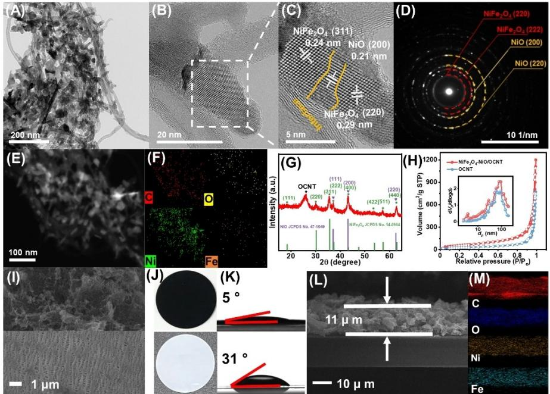
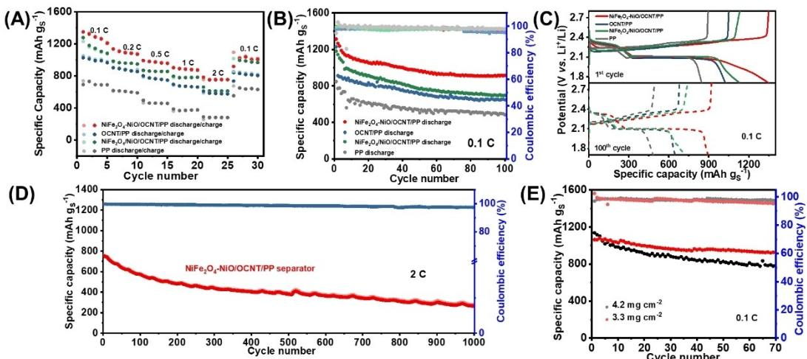
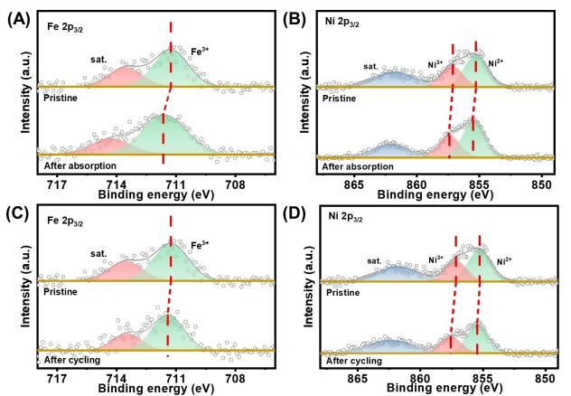
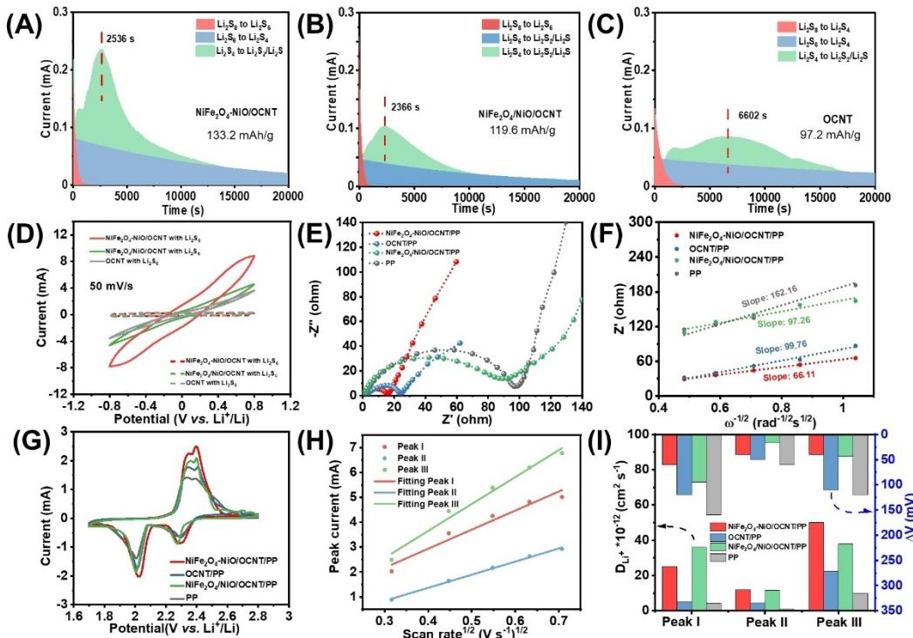
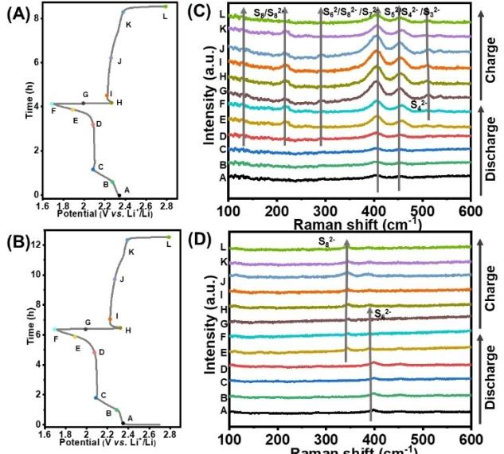

# **Multiphase and Multicomponent Nickel-Iron Oxide Heterostructure as an Efficient Separator Modification Layer for Advanced Lithium Sulfur Batteries**

Qing Liu,[a, b] Xiaotong Han,[a] Qingyun Dou,[a] Peixun Xiong,[a] Yingbo Kang,[a] Seok-Won Kang,[c] Bo-Kyong Kim,\*[b] and Ho Seok Park\*[a, d]

Lithium sulfur batteries (LSBs) have been seen as of considerable potential candidate for lithium-ion batteries (LIBs) to satisfy high energy density demand. However, the application of LSBs until now has been stubbornly dragged by the "shuttle effect" of lithium polysulfides (LiPSs) due to dissolution of LiPSs in electrolyte and reaction with the lithium anode, incurring a severe capacity decay. Herein, the straightforward separator modification method that multiphase and multicomponent nickel-iron oxide heterostructure grown on oxidized carbon

## **1. Introduction**

Lithium sulfur battery (LSB) is considered as the most promising energy storage device to replace existing lithium ion battery owing to high theoretical energy density (2600 Whkg 1 ) and low cost.[1–3] Nevertheless, the practical implementation of LSB is hindered by the technical issues of sulfur cathode, such as the insulating property of S and the shuttle effect of the intermediate lithium polysulfides (LiPSs).[4–6] Different methodologies have been studied to resolve these problems.[7,8] Among them, the chemical design of sulfur hosting materials, such as carbon-based materials[9] and metal oxides/carbides/nitrides/ sulfides,[10–12] has been intensively investigated. Although the cathode design can enhance the sulfur utilization and suppress the LiPSs shuttle effect to the certain extent, the overall energy

| [a] Q. Liu, Dr. X. Han, Dr. Q. Dou, Dr. P. Xiong, Y. Kang, Prof. H. S. Park School of Chemical Engineering Sungkyunkwan University          |
|---------------------------------------------------------------------------------------------------------------------------------------------------|
| 2066, Seoburo, Jangan-gu, Suwon 440-746, Korea                                                                                                    |
| E-mail: phs0727@skku.edu.cn [b] Q. Liu, Dr. B.-K. Kim                                                                                          |
| Smart Electrical & Signaling Division                                                                                                             |
| Korea Railroad Research Institute (KRRI)                                                                                                          |
| 176, Cheoldobangmulgwan-ro, Uiwang-si 16105, Korea                                                                                                |
| E-mail: bkkim@krri.re.kr                                                                                                                          |
| [c] S.-W. Kang Department of Automotive Engineering                                                                                            |
| Yeungnam University                                                                                                                               |
| 280 Daehak-ro, Gyeongsan, Gyeongbuk 38541, Korea                                                                                                  |
| [d] Prof. H. S. Park                                                                                                                              |
| Department of Health Sciences and Technology Samsung Advanced Institute for Health Sciences and Technology (SAIHST) Sungkyunkwan University |
| 2066, Seoburo, Jangan-gu, Suwon 440-746, Korea                                                                                                    |
| Supporting information for this article is available on the WWW under https://doi.org/10.1002/batt.202100156                                   |
| An invited contribution to a Special Collection dedicated to Lithium-Sulfur Batteries                                                          |
|                                                                                                                                                   |

nanotube (NiFe2O4 NiO/OCNT) composites directly coated on the polypropylene (PP) separator, has been implemented, which effectively inhibits the migration of LiPSs, enhances the electron and lithium-ion transfer, and promotes the redox kinetics by virtue of the heterostructure interfaces between NiFe2O4, NiO, and OCNT. In conclusion, the synthesized NiFe2O4 NiO/OCNT/ PP separator delivers good rate capacities and high stability up to 1000 cycles at 2 C with a low-capacity decay rate of approximately 0.065% per cycle.

density is unsatisfactory due to the portion of inactive species and the low density of porous hosting materials.[13–15] Moreover, the complicated fabrication process of cathodes also limits the industrial application.

Another promising strategy is the introduction of multifunctional coating layer onto the pristine separator, which acts as a barrier to withstand the direct penetration of soluble LiPSs. In particular, this separator modification is a facile and straightforward methodology to obstruct the overall shuttling effect in the LSB system and to minimize the addition of inactive species.[16–18] Various functional materials, such as sulfide,[19] oxide,[20] hydroxide,[21,22] carbon material,[23] and polymer,[24] have been employed as the coating layer to develop multifunctional separator. Along with the passivation of LiPS crossover, the conversion reaction of LiPS also needs to be promoted, where the heterostructured materials with multiphase and multicomponent are expected to greatly improve the LiPSs capture and sulfur utilization. It notes that the heterostructured materials possess abundant interfacial active sites and high electrical conductivity, which ensure the smooth trappingdiffusion-conversion of LiPSs and the fast electron transfer.[25–27] In this regard, various of metal compound-based heterostructures, such as nitrides,[28,29] sulfides,[30] and oxides,[31,32] have been extensively exploited as the sulfur hosts, while rarely employed as coating layer for separator modification. Moreover, the heterostructured materials composed of multicomponent and multiphase bimetallic oxides have yet to be explored.

Herein, we demonstrate a multiphase and multicomponent nickel-iron oxide heterostructure tightly attached with oxidized carbon nanotube (NiFe2O4 NiO/OCNT) for the design of multifunctional modified separator. The NiFe2O4 NiO/OCNT-modified functional separator could efficiently adsorb LiPSs and promote the redox kinetics of the conversion reactions as confirmed by spectroscopic, electrochemical, and operando

analyses. Consequently, LSB with NiFe2O4 NiO/OCNT-modified separator could deliver a high specific capacity of 1350.16 mAhg 1 at 0.1 C and a low capacity decay rate of 0.065% per cycle over 1000 cycles at 2 C.

## **2. Results and Discussion**

The NiFe2O4 NiO/OCNT nanocomposites were synthesized via a flexible calcination of NiFe-layered double hydroxide/OCNT (NiFe LDH/OCNT) prepared by single-step hydrothermal method (see Experimental Section). As shown in Figures 1(A) and S1, NiFe2O4 NiO/OCNT nanocomposites presented a reticulation structure incorporated with numerous discrete tiny-slices and grains with the size of 20–40 nm, which was observed through transmission electron microscopy (TEM). The magnified TEM image (Figure 1B) showed clear crystal lattices of NiFe2O4 NiO/ OCNT nanocomposites. Furthermore, the lattice fringes of 0.24, 0.29, and 0.21 nm, corresponding to the (311), (220) planes of NiFe2O4 and (200) plane of NiO, could be seen in the highresolution TEM (HR-TEM) image (Figure 1C), expounding the characteristic crystalline and interfaces of the NiFe2O4 NiO. The interlaced dots and ring patterns, representing the (220), (311), (400) facets of NiFe2O4 and (111), (200) facets of NiO, respectively, were shown in the selected area electron diffraction (SAED) pattern (Figure 1D). Energy dispersive X-ray (EDX) mapping indicated the constituent of NiFe2O4 NiO/OCNT heterostructures, proving a homogenous distribution of C, O, Ni, and Fe elements tightly combined with OCNT walls all over the entire detected area (Figure 1E and F). In contrast, aimed at interphase influence study, the composites prepared by NiFe2O4, NiO (see Supporting Information), and OCNT in a physical blend method showed a non-uniform distribution of NiFe2O4 and NiO particles (Figures S2–S4).

The X-ray diffraction (XRD) pattern analysis further confirmed the crystallographic and microstructure for the NiFe2O4 NiO/OCNT composites. In Figure 1(G), a typical diffraction peak of OCNT was captured at 26.3°. In addition, very strong peaks located at 18.2°, 30.2°, 35.6°, 37.0°, 43.1°, 53.7°, 57.3°, and 62.8°, corresponding to the (111), (200), (311), (222), (400), (422), (511), and (440) lattice planes of NiFe2O4 spinel phase (JCPDS 54-0964), respectively, were observed. Moreover, the peaks were at 37.25°, 43.28°, and 62.88°, ascribed to (111), (200), and (220) plane of cubic phase NiO (JCPDS 47-1049), as verified by the HR-TEM and SAED results. The NiFe2O4 NiO/ OCNT composites featured a large specific surface area of 219.21 m2g 1 with multi-porous adsorption, as analyzed by the N2 sorption/desorption isotherm with a type IV performance (Figure 1H and Table S1). The mesoporous structure, which was attributed to the hysteresis of the isotherm, provided abundant active sites and transporting channels to accelerate the redox kinetics of the LiPSs.

The NiFe2O4 NiO/OCNT composites were well coated onto the PP surface through a vacuum filtration process, forming the modified NiFe2O4 NiO/OCNT/PP separator (Figure S5). Compared with bare PP surface, the modified separator was uniformly and fully coated by NiFe2O4 NiO/OCNT composites, as revealed by the top-view SEM image and optical photographs (Figure 1I and J). It was worth mentioning that the hydrophilicity of PP surface can be improved via the NiFe2O4 NiO/OCNT coating layers (Figure 1K). A thickness of ~11 μm of the homogeneous NiFe2O4 NiO/OCNT composites

**Figure 1.** A, B) TEM images, C) HR-TEM image, D) SAED pattern, E) STEM image and F) EDX mapping images, and G) XRD pattern of NiFe2O4 NiO/OCNT. H) N2 adsorption-desorption curves of NiFe2O4 NiO/OCNT and OCNT. I) SEM images, J) optical photographs, and K) contact angle images of NiFe2O4 NiO/OCNT/PP separator (top) and OCNT/PP separator (down). L) Cross-sectional SEM image and M) EDX mapping images of NiFe2O4 NiO/OCNT/PP separator.

layer was further measured by means of cross-sectional SEM image (Figure 1L). EDX mapping of the cross-sectional NiFe2O4 NiO/OCNT/PP image further proved homogeneous coverage of the modified layer around the PP surface (Figure 1M). Taken together, the features of mesoporous structure and high wettability of NiFe2O4 NiO/OCNT are beneficial for the penetration and transportation of Li ions across the asmodified separator and the contact with active sites during the redox reaction, further improving the electrochemical performance of the LSB cells.

The electrochemical performance of the LSB cells with different separators were evaluated by assembling the 2032 type coin cells with Li foil as anodes and MWCNT/S composites (76 wt% sulfur content, Figure S6) as cathodes. According to different separators involved, the as-assembled coin cells were denoted as NiFe2O4 NiO/OCNT/PP, OCNT/PP, NiFe2O4/NiO/ OCNT/PP, and PP cells, respectively. In view of the rate performance evaluated in Figure 2(A), NiFe2O4 NiO/OCNT/PP cell showed much higher discharging capacities than that of the OCNT/PP and PP cells. NiFe2O4 NiO/OCNT/PP cell delivered the specific discharging capacities of 1350.2, 1136.1, 991.8, 902.6, and 781.7 mAhg 1 at 0.1, 0.2, 0.5, 1.0, and 2.0 C, respectively. In obvious comparison, the specific capacities of the OCNT/PP cell were rapidly dropped from 1026.5 mAhg 1 (0.1 C) to 608.5 mAhg 1 (2.0 C). The NiFe2O4/NiO/OCNT/PP cell was situated between OCNT/PP cell and NiFe2O4 NiO/OCNT/PP cell in electrochemical performance due to interphase absence between NiFe2O4, NiO, and OCNT. Let alone PP cell, the capacities are changed from 691.4 mAhg 1 (0.1 C) to 287.0 mAhg 1 (2.0 C). Notably, the reversible capacity could be retained at 1007.0 mAhg 1 after resting of current density to 0.1 C. The ratios of the low plateau region discharge capacity (*Q*L) and the high plateau region discharge capacity (*Q*H) were further estimated according to the discharge-charge profiles (Figure S7).[33] As displayed in Figure S8, the values of the *Q*L/*Q*H ratios for the NiFe2O4 NiO/OCNT/PP cell were much higher than those of the contrast samples at different C rate from 0.1 to 2.0 C, disclosing the reversible redox kinetics and the limited diffusion of LiPSs with NiFe2O4 NiO/OCNT modified layer. In addition, in Figure 2(B and C), the cycling performance of NiFe2O4 NiO/OCNT/PP cell at 0.1 C showed a higher initial discharge capacity of 1312 mAhg 1 and a better cyclic stability of 915 mAhg 1 after 100 cycles. By contrast, the reference samples of OCNT/PP, NiFe2O4/NiO/OCNT/PP, and PP cells showed relatively inferior specific capacities of 648, 697, and 482 mAhg 1 , respectively. Meanwhile, the lowest overpotential was delivered for NiFe2O4 NiO/OCNT/PP cell and no big difference between initial cycle (200 mV) and 100th cycle (201 mV) with a higher Coulombic efficiency of 97.79%, profiting from good conductivity, fast electron transfer, and facile redox conversion reaction.

The long-term durability test was also carried out to reflect the reversible redox kinetics. As shown in Figure 2(D), NiFe2O4 NiO/OCNT/PP cell delivered initial discharge capacities of 755 mAhg 1 at 2 C and retained 292 mAhg 1 after 1000 cycles with a low capacity fading rate of 0.065% per cycle and a Coulombic efficiency of 99.32%. Notably, to satisfy the practical application, the NiFe2O4 NiO/OCNT/PP cells were further fabricated at higher sulfur loading of 3.3 and 4.2 mg cm 2 with a lean electrolyte of 9.8 μLmg 1 , which still delivered high reversible specific capacities of 935 and 783 mAhg 1 after 70 cycles (Figure 2E). The lean electrolyte for LSB cells was also tested (Figure S9). These results indirectly provided proof for using NiFe2O4 NiO/OCNT heterostructure to highly promote the redox conversion and effectively capture polysulfide in LSB system.

To further explore the absorption ability and principle of NiFe2O4 NiO/OCNT to LiPSs, polysulfide adsorption experiment, UV-vis absorption measurement, and XPS test were carried out under identical conditions. As indicated in Figure S10, the stronger absorptivity of NiFe2O4 NiO/OCNT was apparently observed from the color change (brown yellow to colorless).

**Figure 2.** A) The specific capacities of LSBs with NiFe2O4 NiO/OCNT/PP, OCNT/PP, NiFe2O4/NiO/OCNT/PP, and PP separators at various C-rates. B) Cycling performance and C) charge-discharge curves of LSBs with NiFe2O4 NiO/OCNT/PP, OCNT/PP, NiFe2O4/NiO/OCNT/PP, and PP separators at 0.1 C; D) long cycle performance of LSB with NiFe2O4 NiO/OCNT/PP separator over 1000 cycles at 2 C. E) High sulfur loading LSBs with NiFe2O4 NiO/OCNT/PP separator at 0.1 C.

The UV-vis adsorption experiments revealed that the concentration decay degree of Li2S6 for NiFe2O4 NiO/OCNT was much lower than those of OCNT and NiFe2O4/NiO/OCNT, as demonstrated by a peak intensity change of characteristic peak at 420 nm for S6 2 species,[34,35] suggesting the strong interaction between NiFe2O4 NiO/OCNT and LiPSs. Figure 3(A) showed the Fe 2p3/2 XPS spectra of the pristine and adsorbed NiFe2O4 NiO/ OCNT. The Fe 2p3/2 spectra of the pristine NiFe2O4 NiO/OCNT exhibited the two peaks at 711.27 and 723.62 eV, accorded with characteristic peaks of Fe3+ and shakeup satellites (designed as "sat.").[36–40] After adsorption of Li2S6 for NiFe2O4 NiO/OCNT, the peaks of Fe3+ shifted to 711.56 eV. Figure 3(B) exhibited the Ni 2p3/2 spectra of the pristine NiFe2O4 NiO/OCNT with three peaks at 855.23, 857.12, and 861.81 eV, corresponding to Ni2+, Ni3+ and sat., respectively.[41–43] After adsorption, the peaks of Ni2+ and Ni3+ shifted to 855.44 and 857.39 eV, respectively. To further study the interaction between LiPSs and NiFe2O4 NiO, the separator was checked by XPS disassembled from NiFe2O4 NiO/OCNT/PP cell after 100 cycles at 0.1 C. As shown in Figure 3(C and D), after cycling, the peak of Fe3+ shifted from 711.27 to 711.73 eV, while the Ni2+and Ni3+ peaks shifted from 855.23 and 857.12 eV to 855.44 and 857.56 eV, respectively, which was in good agreement with the XPS results of the adsorbed experiments. The peak location variation of Fe 2p3/2 and Ni 2p3/2 spectra could be ascribed to the electron transfer between Li2S*x* and Fe/Ni atoms, exposing the strong polar-polar interaction between LiPSs and NiFe2O4 NiO/OCNT, thus leading to a high capacity performance of LSB.[30,44]

To further verify the superiority of conversion for LiPSs on the NiFe2O4 NiO/OCNT heterostructure surface, a simple Li2S nucleation and precipitation experiments were conducted via potentiostatic discharge method.[45] In the experiments, Li foil, NiFe2O4 NiO/OCNT pasted on aluminum foil, and Li2S8 were used as anode, cathode, and electrolyte, respectively (see Supporting Information). As shown in Figure 4(A–C), a high Li2S precipitation specific capacity of 133.2 mAhg 1 was obtained for NiFe2O4 NiO/OCNT cell compared to that of OCNT

**Figure 3.** The XPS spectra of NiFe2O4 NiO/OCNT hybrids A, B) with or without Li2S6 addition: A) Fe 2p3/2, B) Ni 2p3/2, and C, D) before or after cycling: C) Fe 2p3/2, D) Ni 2p3/2.

(97.2 mAhg 1 ) and NiFe2O4/NiO/OCNT (119.6 mAhg 1 ) cells. The response time of peak current for NiFe2O4 NiO/OCNT, NiFe2O4/NiO/OCNT, and OCNT reached 2536, 2366, and 6602 sec, respectively. However, the NiFe2O4 NiO/OCNT cell exhibited the highest precipitation current (0.235 mA) compared to NiFe2O4/NiO/OCNT (0.105 mA) and OCNT (0.0859 mA) cells, implying an enhanced conversion kinetics for NiFe2O4 NiO/OCNT heterostructures toward LiPSs.

The symmetric cells were further assembled to confirm the LiPSs conversion on the NiFe2O4 NiO/OCNT surface (see Supporting Information). As shown in Figure 4(D), CV curves of the NiFe2O4 NiO/OCNT symmetric cell evidently harvested a higher current variation than OCNT and NiFe2O4/NiO/OCNT at scan rate of 50 mVs 1 , indicating the boosted redox kinetics of Li2SX conversion towards short-chain LiPSs.

To investigate charge and ion diffusion ability of NiFe2O4 NiO/OCNT/PP in LSB system, Nyquist curves were measured within 106 –10 1 Hz range (see Supporting Information). Apparently, Figure 4(E) exhibited that the NiFe2O4 NiO/ OCNT/PP, OCNT/PP, and NiFe2O4/NiO/OCNT/PP cells possessed suppressed semicircles in contrast with PP cell, indicative of decreased charge transfer impedance and promoted reaction kinetics. It was clear that the smaller equivalent series impedance of the NiFe2O4 NiO/OCNT/PP cell further stated higher electrical conductivity and faster charge transfer over the interface between heterostucture composites and LiPSs. Moreover, Figure 4(F) showed the linear relationship between the real resistance (*Z*') and frequency (*ω* 1/2) for NiFe2O4 NiO/ OCNT/PP, OCNT/PP, NiFe2O4/NiO/OCNT/PP, and PP cells in the low-frequency range. The slope of the NiFe2O4 NiO/OCNT/PP cell profile was smaller than that of OCNT/PP, NiFe2O4/NiO/ OCNT/PP, and PP cells, implying the faster Li+ ions and charge diffusion in the internal electrode,[46] which agreed with the foregoing conclusion. To prove the enhanced effect of redox kinetic with NiFe2O4 NiO/OCNT heterostructures, the CV plots of three kind of LSB cells were investigated under a scan rate of 0.1 mVs 1 . Figure 4(G) displayed CV plots with two cathodic peaks during the discharge process, located at around 2.0 V (denoted as "peak I") and 2.3 V (denoted as "peak II"), assigned to the reduction of S8 into long-chain Li2S4 then to Li2S2/Li2S. In view of charge process, an anodic peak was located at approximately 2.4 V (denoted as "peak III"), indicating the oxidation reaction of final product to S8. [47,48] Notably, the NiFe2O4 NiO/OCNT/PP cell exhibited the highest current density and much narrower peak separation compared with that of the others, disclosing a higher sulfur utilization and better conversion efficiency. In the wake of the following cycles, all the peaks of NiFe2O4 NiO/OCNT/PP cell still were stable (Figure S11).

To further demonstrate the superiority of NiFe2O4 NiO/ OCNT heterostructures, the Li+ ion coefficients (*D*Li +) were calculated via the Randles-Sevick equation (see Supporting Information).[49] As shown in Figure 4(H), the linear relationship between peak current and the square root of the scan rates was displayed, deriving form CV profiles in Figure S12. The *D*Li + of peak I, II, and III for the NiFe2O4 NiO/OCNT/PP cell were 2.52×10 11, 1.19×10 11 cm2 s 1 , and 5.02×10 11 cm2 s 1 , respec-

**Figure 4.** A) Li2S nucleation curves of cells with NiFe2O4 NiO/OCNT/Al cathode, B) NiFe2O4/NiO/OCNT/Al, and C) OCNT/Al cathode, and Li anode. D) CV curves of symmetric cells with OCNT/Al, NiFe2O4/NiO/OCNT/Al, and NiFe2O4 NiO/OCNT/Al electrodes. E) Nyquist plots of the LSB cells with NiFe2O4 NiO/OCNT/PP, OCNT/PP, NiFe2O4/NiO/OCNT/PP, and PP separators. F) Relationship between the real part of impedance and low frequencies. G) CV curves of the LSB cells with NiFe2O4 NiO/OCNT/PP, OCNT/PP, NiFe2O4/NiO/OCNT/PP, and PP separators under scan rate of 0.1 mV/s. H) Relationship between scan rate1/2 to peak current of LSB cell with NiFe2O4 NiO/OCNT/PP separator. I) Li ion diffusion coefficient (black axis) and polarized voltage (blue axis) comparison for the LSB cells with NiFe2O4 NiO/OCNT/PP, OCNT/PP, NiFe2O4/NiO/OCNT/PP, and PP separators.

tively, which relatively outperformed the others (Figures 4I and S13). Moreover, the NiFe2O4 NiO/OCNT/PP cell also possessed relatively lower peak-to-peak separation (Δ*V*) for all peaks than the contrast samples, which were also calculated from the data in Figure S12. All the findings substantiate that NiFe2O4 NiO/ OCNT could facilitate and improve the redox kinetics due to the high conductivity, fast charge and Li+ ion diffusion.

To further demonstrate the blocking effect of the NiFe2O4 NiO/OCNT heterostructures for LiPSs diffusion during the actual work process of the LSB system, in-situ Raman spectroscopy was performed (Figure S14). Raman spectra were obtained from the anode side of separator at different discharge/charge potentials (Figure 5A, B). As shown in Figure 5(C), the spectra of the PP cell exhibited a faint peak at 402.3 (corresponding to S6 2 ) and 451.7 cm 1 (designed at S4 2 ).[50] When the PP cell was discharged to 2.10 V, the S6 2 and S4 2 characteristic peak intensity became stronger, meanwhile the new peaks located at 511.85 (assigned at S4 2 ) and 216.73 cm 1 (assigned at S8 2 ) were observed.[51] The intensity of polysulfides peaks further was enhanced until the discharge process ended. Following with charge process, the intensity of S6 2 , S4 2 , and S8 2 peaks slightly became weaker but these peaks still existed till the ending of all the charge process, demonstrating a serious LiPSs shuttle effect of PP cell. However, the polysulfides characteristic peaks were rarely observed on the NiFe2O4 NiO/OCNT/PP separator surface towards anode

**Figure 5.** Voltage curves of the discharge/charge process of the LSB cells assembled with A) PP and B) NiFe2O4 NiO/OCNT/PP separators. The corresponding in-situ Raman spectra of the cells with C) PP and D) NiFe2O4 NiO/OCNT/PP separators.

side, confirming the good polysulfides adsorption ability of NiFe2O4 NiO/OCNT composites, successfully inhibiting the LiPSs diffusion to anode part (Figure 5D).

## **3. Conclusions**

In summary, the as-prepared multifunctional separator was composed of multiphase and multicomponent NiFe2O4 NiO nanocrystals tightly adhered to OCNT walls to form reticulation and cover the pristine separator. The heterostucture NiFe2O4 NiO/OCNT could effectively suppress the "shuttle effect" of LiPSs, highly promote Li ion diffusion and electron transfer, and improve the conversion kinetics of LiPSs owing to unique heterostructure interfaces and good chemical/physical absorption ability. In virtue of the above structure superiority, the as-synthesized NiFe2O4 NiO/OCNT/PP separator delivered a good rate capacity up to 1350 mAhg 1 at 0.1 C and a very low capacity decay rate of approximately 0.065% per cycle over 1000 cycles at 2 C, which offer a broad field in heterostructure application on separator modification with charming electrochemical performance for LSBs.

## **Experimental Section**

#### **Synthesis of OCNT**

Commercial mulitiwall carbon nanotubes (MWCNTs) of 200 mg were firstly suspended into a glass flask filling with deionized water (100 mL, DI-water) to form a MWCNT dispersion. In succession, the above dispersion was sonicated for 1 h using tip sonication, then the mixture was flowed with continuous O3 gas originated from a PC-57 L model ozone generator and kept for 3 h. Next, the treated dispersion by O3 was sonicated again by means of tip sonication. The above treatment process was repeated again to get the final OCNT dispersion. To get OCNT powder, the final OCNT dispersion was washed till the pH of the filtrate shown 7 via vacuum filtration. Finally, the OCNT dispersion of 20 mL with DI-water was freezedried for 3 days to get OCNT powder.

#### **Synthesis of NiFe LDH/OCNT**

In a typical method, 40 mg of OCNT was added into 20 mL of Nmethyl-2-pyrrolidone (NMP) solvent via sonication for 1 h to form a homogenous dispersion A. Meanwhile, 0.3 mmol of Ni(NO3)2 6H2O, 0.1 mmol of FeSO4 7H2O, and 2 mmol of urea was dissolved into 20 mL of DI-water to form jade-green solution B. Then solution B was poured into dispersion A and stirred for 30 min to form mixture C. Finally, mixture C was transferred into 50-mL Teflon-line and put the line into the autoclave then heat for 6 h at 120 °C. After heating and cooling down, the mixture was washed with DIwater for 5 times by centrifugal machine and lyophilized to get the NiFe LDH/OCNT powder.

#### **Synthesis of NiFe2O4 NiO/OCNT**

The obtained powder of NiFe LDH/OCNT was placed into a railboat and put into the quartz tube then heated to 500 °C with a heating rate of 2°Cmin 1 for 2 h under argon atmosphere. Finally, NiFe2O4 NiO/OCNT powder was achieved.

### **Synthesis of NiFe2O4 NiO/OCNT modified PP separator**

6 mg of NiFe2O4 NiO/OCNT composites were added and dispersed into 15 mL of NMP solvent via a 1-h sonication. Moreover, polyvinylidene fluoride (PVDF) as a binder with a mass ratio of 10% was poured into the above mixture stirring for another 1 h. Next, the as-prepared NiFe2O4 NiO/OCNT suspension was vacuumfiltered and covered over on PP surface (Celgard 2400). After that, the NiFe2O4 NiO/OCNT modified PP separator was dried for 12 h using vacuum oven at room temperature. A diameter of 19 mm of NiFe2O4 NiO/OCNT/PP was punched into disks with a weight loading of ~0.4 mgcm 2 for assembly of LSB cells.

## *Acknowledgements*

*This study was supported by a grant from the R&D Program of the Korea Railroad Research Institute (PK2103E1) and Creative Materials Discovery Program through the National Research Foundation of Korea (NRF) funded by Ministry of Science and ICT (2018 M3D1 A1058744), Republic of Korea.*

## *Conflict of Interest*

The authors declare no conflict of interest.

**Keywords:** bimetal oxide heterostructure **·** interface **·** lithiumsulfur batteries **·** multi-functional separator **·** redox kinetics

- [1] H.-J. Peng, J.-Q. Huang, Q. Zhang, *Chem. Soc. Rev.* **2017**, *46*, [5237–5288.](https://doi.org/10.1039/C7CS00139H)
- [2] S. Yun, S. H. Park, J. S. Yeon, J. Park, M. Jana, J. Suk, H. S. Park, *[Adv.](https://doi.org/10.1002/adfm.201707593) Funct. Mater.* **2018**, *28*, [1707593](https://doi.org/10.1002/adfm.201707593).
- [3] X. Ji, S. Evers, R. Black, L. F. Nazar, *Nat. Commun.* **2011**, *2*, 325.
- [4] S.-H. Chung, A. Manthiram, *Adv. Mater.* **2019**, *31*, [1901125.](https://doi.org/10.1002/adma.201901125)
- [5] M. Jana, R. Xu, X.-B. Cheng, J. S. Yeon, J. M. Park, J.-Q. Huang, Q. Zhang, H. S. Park, *Energy Environ. Sci.* **2020**, *13*, [1049–1075.](https://doi.org/10.1039/C9EE02049G)
- [6] V. Augustyn, J. Come, M. A. Lowe, J. W. Kim, P. L. Taberna, S. H. Tolbert, H. D. Abruña, P. Simon, B. Dunn, *Nat. Mater.* **2013**, *12*, [518–522.](https://doi.org/10.1038/nmat3601)
- [7] M. Zhao, X. Chen, X.-Y. Li, B.-Q. Li, J.-Q. Huang, *Adv. [Mater.](https://doi.org/10.1002/adma.202007298)* **2021**, *33*, [2007298.](https://doi.org/10.1002/adma.202007298)
- [8] M. Zhao, B.-Q. Li, X. Chen, J. Xie, H. Yuan, J.-Q. Huang, *[Chem](https://doi.org/10.1016/j.chempr.2020.09.015)* **2020**, *6*, [3297–3311](https://doi.org/10.1016/j.chempr.2020.09.015).
- [9] G. Zhou, E. Paek, G. S. Hwang, A. Manthiram, *Nat. Commun.* **2015**, *6*, 7760.
- [10] X. Liang, C. Y. Kwok, F. Lodi-Marzano, Q. Pang, M. Cuisinier, H. Huang, C. J. Hart, D. Houtarde, K. Kaup, H. Sommer, T. Brezesinski, J. Janek, L. F. Nazar, *Adv. Energy Mater.* **2016**, *6*, [1501636](https://doi.org/10.1002/aenm.201501636).
- [11] W. Bao, D. Su, W. Zhang, X. Guo, G. Wang, *Adv. Funct. [Mater.](https://doi.org/10.1002/adfm.201603704)* **2016**, *26*, [8746–8756](https://doi.org/10.1002/adfm.201603704).
- [12] Z. Sun, J. Zhang, L. Yin, G. Hu, R. Fang, H.-M. Cheng, F. Li, *Nat. Commun.* **2017**, *8*, 14627.
- [13] T. Lei, W. Chen, J. Huang, C. Yan, H. Sun, C. Wang, W. Zhang, Y. Li, J. Xiong, *Adv. Energy Mater.* **2017**, *7*, 20160184.
- [14] Z. Cheng, Z. Xiao, H. Pan, S. Wang, R. Wang, *Adv. [Energy](https://doi.org/10.1002/aenm.201702337) Mater.* **2018**, *8*, [1702337.](https://doi.org/10.1002/aenm.201702337)
- [15] W. Chen, T. Qian, J. Xiong, N. Xu, X. J. Liu, J. Q. Zhou, X. W. Shen, T. Z. Yang, Y. Chen, C. L. Yan, *Adv. Mater.* **2017**, *29*, [1605160.](https://doi.org/10.1002/adma.201605160)
- [16] Z. Wei, Y. Ren, J. Sokolowski, X. Zhu, G. Wu, *InfoMat.* **2020**, *2*, [483–508.](https://doi.org/10.1002/inf2.12097)
- [17] T. Lei, W. Chen, W. Lv, J. Huang, J. Zhu, J. Chu, C. Yan, C. Wu, Y. Yan, W.
- He, J. Xiong, Y. Li, C. Yan, J. B. Goodenough, X. Duan, *Joule* **[2019](https://doi.org/10.1016/j.joule.2018.12.016)**, *3*, 303. [18] H.-J. Peng, J.-Q. Huang, X.-B. Cheng, Q. Zhang, *Adv. [Energy](https://doi.org/10.1002/aenm.201700260) Mater.* **2017**, *7*, [1700260](https://doi.org/10.1002/aenm.201700260).
- [19] Z. A. Ghazi, X. He, A. M. Khattak, N. A. Khan, B. Liang, A. Iqbal, J. Wang, H. Sin, L. Li, Z. Y. Tang, *Adv. Mater.* **2017**, *29*, [1606817](https://doi.org/10.1002/adma.201606817).

- [20] J. S. Yeon, T. H. Park, Y. H. Ko, P. Sivakumar, J. S. Kim, Y. Kim, H. S. Park, *J. Energy Chem.* **2021**, *55*, [468–475](https://doi.org/10.1016/j.jechem.2020.07.007).
- [21] Q. Liu, X. Han, H. Park, J. Kim, P. Xiong, H. Yuan, J. S. Yeon, Y. Kang, J. M. Park, Q. Dou, B.-K. Kim, H. S. Park, *ACS Appl. Mater. [Interfaces](https://doi.org/10.1021/acsami.1c00974)* **2021**, *13*, [17978–17987.](https://doi.org/10.1021/acsami.1c00974)
- [22] H.-J. Peng, Z.-W. Zhang, J.-Q. Huang, G. Zhang, J. Xie, W.-T. Xu, J.-L. Shi, X. Chen, X.-B. Cheng, Q. Zhang, *Adv. Mater.* **2016**, *28*, [9551–9558.](https://doi.org/10.1002/adma.201603401)
- [23] S.-H. Chung, A. Manthiram, *Adv. Funct. Mater.* **2014**, *24*, [5299–5306.](https://doi.org/10.1002/adfm.201400845)
- [24] H. H. Rana, M. Jana, J. S. Yeon, J. H. Park, L. Qing, H. S. Park, *[ChemSusChem](https://doi.org/10.1002/cssc.201902236)* **2020**, *13*, 2471.
- [25] S. Huang, Z. Wang, Y. V. Lim, Y. Wang, Y. Li, D. Zhang, H. Y. Yang, *[Adv.](https://doi.org/10.1002/aenm.202003689) Energy Mater.* **2021**, *11*, [2003689](https://doi.org/10.1002/aenm.202003689).
- [26] X. Han, Y. Niu, C. Yu, Z. Liu, H. Huang, H. Huang, S. Li, W. Guo, X. Tan, J. Qiu, *Nano Energy* **2020**, *69*, [104367.](https://doi.org/10.1016/j.nanoen.2019.104367)
- [27] X. Han, N. Li, Y. B. Kang, Q. Dou, P. Xun, Q. Liu, J. Y. Lee, L. Dai, H. S. Park, *ACS Energy Lett.* **2021**, *6*, [2460–2468.](https://doi.org/10.1021/acsenergylett.1c00936)
- [28] Y. Song, W. Zhao, L. Kong, L. Zhang, X. Zhu, Y. Shao, F. Ding, Q. Zhang, J. Sun, Z. Liu, *Energy [Environ.](https://doi.org/10.1039/C8EE01402G) Sci.* **2018**, *11*, 2620.
- [29] T. H. Zhou, W. Lv, J. Li, G. Zhou, Y. Zhao, S. Fan, B. Liu, B. Li, F. Kang, Q.- Q. Yang, *Energy Environ. Sci.* **2017**, *10*, [1694–1703](https://doi.org/10.1039/C7EE01430A).
- [30] R. Wang, C. Luo, T. Wang, G. Zhou, Y. Deng, Y. He, Q. Zhang, F. Kang, W. Lv, Q. H. Yang, *Adv. Mater.* **2020**, *32*, [2000315](https://doi.org/10.1002/adma.202000315).
- [31] B. Zhang, C. Luo, Y. Deng, Z. Huang, G. Zhou, W. Lv, Y. B. He, Y. Wan, F. Kang, Q. H. Yang, *Adv. Energy Mater.* **2020**, *10*, [2000091.](https://doi.org/10.1002/aenm.202000091)
- [32] L. Hu, C. Dai, H. Liu, Y. Li, B. Shen, Y. Chen, S. J. Bao, M. Xu, *Adv. [Energy](https://doi.org/10.1002/aenm.201800709) Mater.* **2018**, *8*, [1800709.](https://doi.org/10.1002/aenm.201800709)
- [33] T. An, D. Deng, M. Lei, Q.-H. Wu, Z. Tian, M. Zheng, Q. Dong, *J. [Mater.](https://doi.org/10.1039/C6TA04445J) Chem. A* **2016**, *4*, [12858–12864](https://doi.org/10.1039/C6TA04445J).
- [34] M. U. M. Patel, R. Dominko, *[ChemSusChem](https://doi.org/10.1002/cssc.201402215)* **2014**, *7*, 2167–2175.
- [35] Z. Xiao, Z. Yang, L. Wang, H. Nie, M. Zhong, Q. Lai, X. Xu, L. Zhang, S. Huang, *Adv. [Mater.](https://doi.org/10.1002/adma.201405637)* **2015**, *27*, 2891.
- [36] X. Han, C. Yu, J. Yang, X. Song, C. Zhao, S. Li, Y. Zhang, H. Huang, Z. Liu, H. Huang, X. Tan, J. Qiu, *Small* **2019**, *15*, [1901015.](https://doi.org/10.1002/smll.201901015)
- [37] X. Han, C. Yu, Y. Niu, Z. Wang, Y. Kang, Y. Ren, H. Wang, H. S. Park, J. Qiu, *Small Methods* **2020**, *4*, [2000546.](https://doi.org/10.1002/smtd.202000546)
- [38] E. K. Heidari, B. Zhang, M. H. Sohi, A. Ataie, J. K. Kim, *J. [Mater.](https://doi.org/10.1039/c4ta00507d) Chem. A* **2014**, *2*, [8314–8322](https://doi.org/10.1039/c4ta00507d).
- [39] M. Fu, Q. Z. Jiao, Y. Zhao, *J. Mater. Chem. A* **2013**, *1*, [5577–5586](https://doi.org/10.1039/c3ta10402h).
- [40] S. J. Feng, W. Yang, Z. B. Wang, *Mater. Sci. Eng. B* **2011**, *176*, [1509–1512.](https://doi.org/10.1016/j.mseb.2011.09.007) [41] C. Solís, S. Somacescu, E. Palafox, M. Balaguer, J. M. Serra, *J. Phys. [Chem.](https://doi.org/10.1021/jp506938k)*
- *C* **2014**, *118*, [24266–24273.](https://doi.org/10.1021/jp506938k) [42] A. Sutka, R. Parna, G. Mezinskis, V. Kisand, *Sens. Actuators* B **2014**, *192*,
- 173–180. [43] L. Chen, H. Dai, Y. Shen, J. Bai, *J. Alloys Compd.* **2010**, *491*, [L33–L38.](https://doi.org/10.1016/j.jallcom.2009.11.031)
- [44] M. Zhao, H.-J. Peng, Z.-W. Zhang, B.-Q. Li, X. Chen, J. Xie, X. Chen, J.-Y. Wei, Q. Zhang, J.-Q. Huang, *[Angew.](https://doi.org/10.1002/anie.201812062) Chem. Int. Ed.* **2019**, *58*, 3779.
- [45] F. Y. Fan, W. C. Carter, Y. M. Chiang, *Adv. Mater.* **2015**, *27*, [5203–5209.](https://doi.org/10.1002/adma.201501559)
- [46] H. Kim, J. Lee, H. Ahn, O. Kim, M. J. Park, *Nat. Commun.* **2015**, *6*, 7278.
- [47] M. Wild, L. O'Neill, T. Zhang, R. Purkayastha, G. Minton, M. Marinescu, G. J. Offer, *Energy Environ. Sci.* **2015**, *8*, [3477–3494](https://doi.org/10.1039/C5EE01388G).
- [48] H. J. Peng, G. Zhang, X. Chen, Z. W. Zhang, W. T. Xu, J. Q. Huang, Q. Zhang, *Angew. Chem.* **2016**, *128*, [13184–13189;](https://doi.org/10.1002/ange.201605676) *[Angew.](https://doi.org/10.1002/anie.201605676) Chem. Int. Ed.* **2016**, *55*, [12990–12995.](https://doi.org/10.1002/anie.201605676)
- [49] Z. Wu, L. Wang, S. Chen, X. Zhu, Q. Deng, J. Wang, Z. Zeng, S. Deng, *Chem. Eng. J.* **2021**, *404*, [126579.](https://doi.org/10.1016/j.cej.2020.126579)
- [50] M. Hagen, P. Schiffels, M. Hammer, S. Dörfler, J. Tübke, M. J. Hoffmann, H. Althues, S. Kaskel, *J. Electrochem. Soc.* **2013**, *160*, [A1205–A1214.](https://doi.org/10.1149/2.045308jes)
- [51] J.-J. Chen, R.-M. Yuan, J.-M. Feng, Q. Zhang, J.-X. Huang, G. Fu, M.-S. Zheng, B. Ren, F.-Q. Dong, *Chem. Mater.* **2015**, *27*, [2048–2055](https://doi.org/10.1021/cm5044667).

Manuscript received: July 6, 2021 Revised manuscript received: August 19, 2021 Accepted manuscript online: August 27, 2021 Version of record online: September 12, 2021