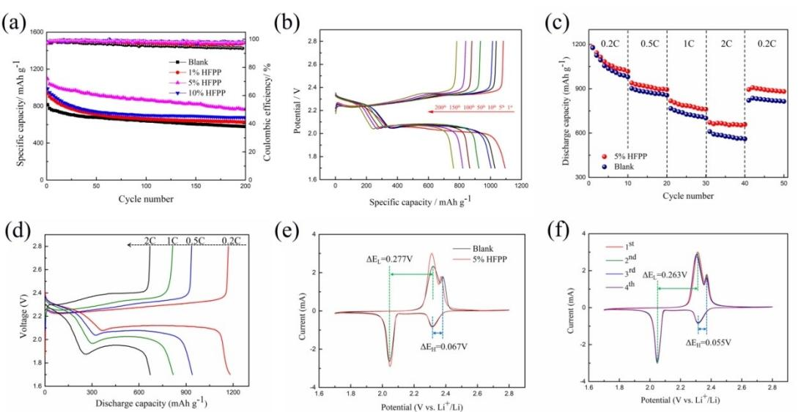
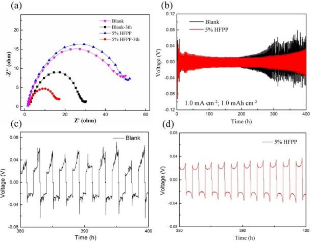
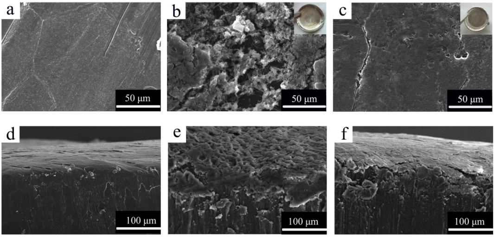
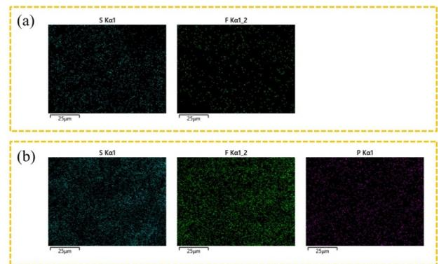
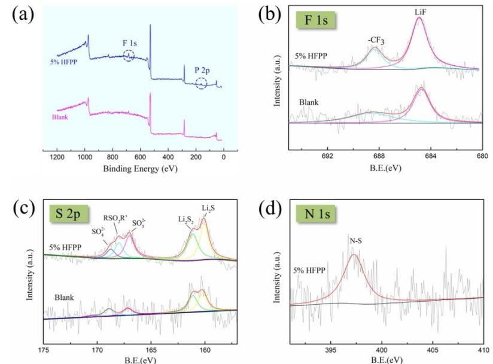
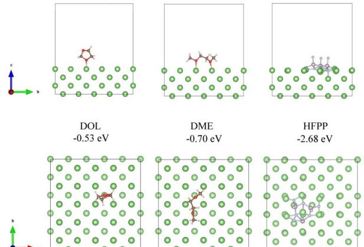

# **A Stable Fluorine-Containing Solid Electrolyte Interface toward Dendrite-Free Lithium-Metal Anode for Lithium-Sulfur Batteries**

Yuchao Chen, Yangyang Mao, Xiaoqian Hao, Yongan Cao, and [Wenju](http://orcid.org/0000-0001-7166-7986) Wang\*[a]

Lithium-sulfur (Li S) batteries are considered to be a representative of the next generation of lithium-ion batteries due to their high theoretical specific capacity (2600 Wh·Kg 1 ), and they have been extensively researched. However, the formation of lithium dendrites during the discharge process continuously consumes the electrolyte and the lithium anode, resulting in an increase in the cell's internal resistance and a capacity loss. Herein, we added an organic-inorganic polymer hexafluorocyclo-triphosphazene (HFPP) to the electrolyte, which showed lower interfacial resistance and more effective lithium-ion

## **1. Introduction**

With the continuous development of modernization and the popularization of mobile phones, electric vehicles and notebook computers, the demand for energy is increasing. In order to meet the demand for chemical power sources, a higher energy density is needed than lithium-ion batteries.[1–5] Li S battery is considered to be one of the most promising battery candidates due to its ultra-high energy density.[6–8] The theoretical specific capacity of lithium is 3861 mAh·g 1 , and the theoretical specific capacity of sulfur has reached 1675 mAh·g 1 . [9–12] Unfortunately, the dissolution and shuttle of polysulfide will seriously affect the utilization of active sulfur and increase the impedance of the lithium anode in cells. In addition, the repeated peeling/ plating of the lithium layer during the cycle will cause the growth of lithium dendrites, leading to the rupture of the SEI.[9,13–16] The exposure of fresh lithium metal to the electrolyte causes the electrolyte to continuously decompose, and both lithium and electrolyte are rapidly lost.[17–19] Therefore, a SEI layer with the high stability and uniformity is essential for long cycle life high, Coulombic efficiency and safety in Li S batteries.

The long-chain lithium polysulfide (Li2Sx, 4�x�8) reacts with lithium on the lithium anode side and is reduced to shortchain lithium polysulfide (Li2Sx, 1�x�3), which will cause the negative effects described above.[20–23] LiNO3 has been widely used as an electrolyte additive to inhibit lithium polysulfide

Supporting information for this article is available on the WWW under <https://doi.org/10.1002/celc.202100062>

deposition. The lone-pair electrons of the nitrogen atoms in HFPP promote the uniform diffusion of lithium ions and its 2D structure also enhances the mechanical stability of the solid electrolyte interphase (SEI) and inhibits the formation of lithium dendrites. Based on the regulating effect, the cells using HFPP as electrolyte additives showed an excellent discharge capacity of 1095 mAh·g 1 at 0.5 C and a reversible capacity of 763 mAh·g 1 after 200 cycles, indicating that HFPP is an effective additive for the protection of the lithium anode and cycling stability of Li S batteries.

shuttles, thereby improving the cycle effect of Li S batteries. Zhang et al. found that LiNO3 can react with the lithium anode to form an insoluble LixNOy surface layer, and can also oxidize polysulfide to form LixSOy. [24] Both of these materials can passivate the surface of the lithium anode and inhibit the reaction between lithium polysulfide and the lithium anode. Li and coworkers proposed under the synergistic effect of LiNO3, Li2S8 was reduced to Li2S/Li2S2 at the anode to participate in the formation of SEI, which can successfully inhibit the growth of lithium dendrites and improve the Coulombic efficiency of the battery.[25] However, adding LiNO3 to the electrolyte alone can't achieve the effects of inhibiting lithium dendrites and improving the Coulombic efficiency, and the SEI film is still easy to crack. Exploring suitable electrolyte additives is a simple way to stabilize the interface between lithium anode and electrolyte. Liu et al. introduced La(NO3)3 as an electrolyte additive into Li S batteries to form a composite passivation film of La/LixSy to stabilize the surface of the lithium anode.[26] However, many inorganic additives have low solubility in the electrolyte, namely 1,3-Dioxolane (DOL)/1,2-Dimethoxyethane (DME), or are consumed quickly during the cycle, which weakens their effect of inhibiting lithium dendrites. In addition to adding effective electrolyte additives, Xu's group built an artificial protective layer with synergistic soft and rigid characteristics on the lithium metal anode to provide excellent interface stability during long-term cycling.[27] Recently, Li et al. used LiF as a separator coating to form an artificial SEI film by interacting with the electrolyte on the surface of the lithium anode.[28] The attenuation was only 0.03% per cycle at 1 C. Therefore, there are many methods on how to form a stable and uniform SEI film, such as electrolyte regulation and membrane modification. Considering the solubility of inorganic additives and the conductivity of organic additives, the lone pair electrons of

[a] *Y. Chen, Dr. Y. Mao, Dr. X. Hao, Dr. Y. Cao, Prof. W. Wang School of Energy and Power Engineering Nanjing University of Science and Technology Nanjing 210094, China E-mail: wangwenju1982@gmail.com wangwenju1982@163.com*

nitrogen in HFPP promote the conductivity of lithium ion, and its two-dimensional structure has organic elasticity.

Herein, by optimizing the chemical composition in the SEI and rationally arranging the spatial structure of the chemical composition, we achieve the purpose of improving the interface lithium ion conductivity and enhancing the mechanical properties. As an electrolyte additive, HFPP benefits from plane symmetrical two-dimensional molecules and peculiar electronic arrangement. It plays an important role in the fields of optoelectronic materials and special rubbers. HFPP can scavenge H\* and \* OH radicals, and can also form a thermal insulation layer between the condensed state and the gas phase.[29–31] In the field of Li S batteries, it and its derivatives are mainly used to enhance the flame retardancy of the electrolyte.[32] Through theoretical analysis and experiments, it is proved that HFPP has a significant effect on inhibiting the formation of lithium dendrites and reducing electrolyte decomposition in Li S batteries.

### **2. Results and Discussion**

To further verify the function of HFPP for protecting lithium metal anodes, the electrochemical performance were investigated on CR2032 coin cells. Figure 1a shows the galvanostatic cycling performances of Li S cells with 0 wt%, 1 wt%, 5 wt% and 10 wt% HFPP in the electrolyte at 0.5 C (1 C= 1675 mA·g 1 ). The conductivity of electrolyte increases with the addition of HFPP,[32] due to the lone pair electrons of the nitrogen atoms in HFPP. However, the conductivity slowly decreases as HFPP content further increases from 5%, which is attributed to the viscosity of HFPP. The cell with 5 wt% HFPP in the electrolyte revealed the highest initial discharge capacity (1095 mAh·g 1 ) and steady cycling performance. After 200 cycles at 0.5 C, the discharge specific capacity of Li S cell is retained at 763 mAh·g 1 , which is equal to 70% of its initial capacity. The capacity retention rate is higher than that of inorganic additive, lanthanum nitrate (64.2%, 100 cycles).[26] Table S1 presents some examples of fluorinated additives, including fluoroether, fluorophosphate and phosphazene.[26,30,33] It is worth noting that many additives have high viscosity or low polarity, resulting in negative effect to the conductivity of the electrolyte. The Coulombic efficiency was calculated as: (N+ 1)th discharge capacity/Nth charge capacity.[33] The Coulombic efficiency of Li S cell using HFPP as electrolyte additives is maintained at about 98% during the 200 cycles at 0.5 C, indicating that HFPP makes a significant contribution to the reversible electrochemical characteristics. When the sulfur loading is 5.5 mg/cm2 , the cell with HFPP-free electrolyte not only has a low specific capacity but also only circulates 34 cycles due to short circuit, as shown in Figure S1. The addition of 5% HFPP to the electrolyte leads to better electrochemical performance, indicating that adding HFPP can reduce the formation of lithium dendrites and better protect the lithium anode.

Figure 1b shows the discharge/charge voltage profiles of Li S cells with 5% HFPP in the electrolyte in the voltage window of 1.7–2.8 V at 0.5 C. The discharge curves presents two obvious discharge platforms and one charge platform, and the specific capacity retention rate of the cell after 100 cycles is 80%, and the retention rate of the last 100 cycles is 88%. Overall, the above test results clearly show that using HFPP as an additive can make Li S cells have a high specific capacity and the capacity retention rate.

Figure 1c shows the rate performances of the cells with HFPP-free and HFPP-containing electrolyte. Figure 1d exhibits

**Figure 1.** (a) Cycling performances of Li S cells with 0 wt%, 1 wt%, 5 wt% and 10 wt% HFPP in the electrolyte at 0.5 C; (b) Voltage profiles of Li S cells with 5% HFPP electrolyte at 0.5 C; (c) Rate performances of the cells with HFPP-free and HFPP-containing electrolyte; (d) Voltage profiles of Li S cells with 5% HFPP electrolyte at 0.2 C, 0.5 C, 1 C and 2 C; (e) CV curves of Li S cells with HFPP-free and HFPP-containing electrolyte at 0.1 mV·s 1 ; (f) CV curves of Li S cells with 5% HFPP electrolyte at 0.1 mV·s 1 .

the discharge/charge performances with 5% HFPP electrolyte at 0.2 C, 0.5 C, 1 C and 2 C. The cell with 5 wt% HFPP-containing electrolyte delivers higher rate performances than the cells with HFPP-free electrolyte, especially when the current density is high. At the current density of 0.2, 0.5, 1.0 and 2.0 C, the discharge capacity of the cell with 5 wt% HFPP is 1181, 939, 818 and 672 mAh·g 1 , respectively. When the current density returns to 0.2 C after 40 cycles, the discharge capacity is as high as 900 mAh·g 1 , confirming the beneficial property of HFPP for adsorbing polysulfide.

The cyclic voltammetry (CV) tests of the Li S cells with HFPP-free and HFPP-containing electrolyte at 0.1 mV·s 1 are presented in Figure 1e and Figure 1d. The Li S cell in HFPNcontaining electrolyte shows a similar peak to HFPN-free electrolyte, with two oxidation peak in the anodic scan and two reduction peaks in the cathodic scan. The reduction peaks are assigned to the reduction conversion of S8 to long chain lithium polysulfide (Li2Sx, 4�x�8) and insoluble Li2S2 and Li2S, respectively.[34–35] While the oxidation peaks derive from the multistep conversion of Li2S2/Li2S to polysulfide and finally to S8. [36] The potential hysteresis (0.263 V) between reduction peaks and oxidation is smaller than the cells with HFPN-free electrolyte (0.277 V), indicating that the introduced HFPP can effectively promote the electrochemical reaction. The battery polarization potential is only 55 mV with HFPP additive, and it is much smaller than that of the cell with HFPN-free electrolyte (67 mV), showing the enhanced redox reaction kinetics of polysulfide because of the addition of HFPP in the electrolyte.[37–38] The intensities of the peaks for the cell with HFPP-containing electrolyte are much higher than those for the cell without HFPP. Moreover, the almost overlapping CV curves during the first 4 charge/discharge cycles show the reversible electrochemical characteristics. The above findings indicate that the addition of HFPP in the electrolyte significantly prolongs the cycle life of battery.

The electrochemical impedance spectroscopies of Li S cells with HFPP-free and HFPP-containing electrolyte before and after the initial lithiation are displayed in Figure 2a. Before cycling, the presence of HFPP in the electrolyte slightly increases the interfacial impedance. However, after three cycles at 0.1 C, the interfacial impedance of the Li S cell with HFPP is significantly lower than that without the addition of HFPP. It shows that HFPP act on the SEI film to improve the lithium-ion conductivity of the lithium anode surface. Figure 2b shows that the changes in interfacial resistance and voltage polarization during long-term galvanostatic cycles of Lij Li symmetric cells. When the lithium symmetrical cell has a current density of 1 mA· cm 2 and a capacity of 1 mAh· cm 2 , the cell with 5% HFPP exhibits a slightly larger polarization voltage than that of the cell with bare Li foils during initial cycles. The additional resistance of HFPP causes polarization voltage to increase. However, the cell without HFPP exhibits rapidly increasing hysteresis after being cycled for 200 h. Moreover, the increasing rate of hysteresis is incremental as cycling. This huge hysteresis means the formation of a high-resistive interfacial layer mainly composed of dead lithium and decomposed electrolyte, and its incremental characteristic further reveals the self-propagation

**Figure 2.** (a) Electrochemical impedance spectra (EIS) of Li S cells with HFPPfree and HFPP-containing electrolyte at initial state and after three cycles; (b) Voltage-time curves of symmetric Lij Li cells (current density: 1.0 mAcm 2 ; capacity: 1.0 mAh· cm 2 ); (c, d) Voltage-time curves of symmetric Lij Li cells with HFPP-free and HFPP-containing electrolyte from 380 h to 400 h.

of electrolyte depletion and dendrite growth.[27] Although the voltage polarization is slightly larger in the initial cycle, the cell with HFPP displays a highly stable voltage profile with negligible increase in hysteresis during 300 h cycling, indicating a more stable interface and optimized Li deposition. These results indicate that HFPP slows down the side reaction between lithium metal and electrolyte by reacting with lithium metal and makes lithium ions tend to be electrodeposited flatly. Figure 2c and Figure 2d show the voltage-time curves after 380 hours of constant current cycling. After 380 h cycling, the Lij Li cell without HFPP shows the overpotential of over 60 mV. In contrast, the Lij Li cell using HFPP shows a stable voltagetime profile with overpotential of below 30 mV.

To better reveal the effect of HFPP on the formation of SEI film on lithium metal anode, scanning electron microscope (SEM) was used to compare the morphology of lithium anode. Figure 3 shows the SEM images of the surface of the lithium anode after 200 cycles at 0.5 C. After 200 discharge/charge cycles, the surface of the lithium metal anode with the HFPPfree electrolyte is rough, with many flake and dendritic structures. Compared with the HFPP-free electrolyte (Figure 3b), the lithium anode with HFPP-containing (Figure 3c) shows a relatively smoother and more uniform surface and the lithium deposition is very dense, with only a few small cracks. We tested the cross-section of the lithium anode as shown in the Figure 3d, Figure 3e and Figure 3f, and Figure 3e indicates that lithium anode has been deeply corroded by polysulfides after repeated discharge/charge cycles. In contrast, Figure 3f exhibits that lithium anode still keeps the original appearance and bulk structure after 200 cycles. When using 5% HFPP as electrolyte additives, the lithium anode becomes smoother and denser, and a sheet-like surface film is found on the anode. Therefore, HFPP as an electrolyte additive can make more obvious inhibition effect of lithium dendrites, and can alleviate the reaction between polysulfide and lithium anode.

**Figure 3.** SEM images of the lithium anode at 0.5 C: surface images of (a) pristine lithium anode before cycling, (b) the cell without HFPP and (c) the cell with 5% HFPP after 200 cycles; cross-sectional images of (d) pristine lithium anode before cycling, (e) the cell without HFPP and (f) the cell with 5% HFPP after 200 cycles

The compositions of SEI layer on Li S cells were investigated by energy dispersive X-ray spectroscopy (EDS), as shown in Figure 4 and Figure S2. The interaction between Li anode and polysulfide not only produces short-chain sulfide, but also generates S-containing by-products deposited on the surface of the electrode, which blocks ion transfer and even causes the failure of electrode structures.[39] The EDS spectra of Figure 4a and Figure S1a reveal that there is a high content of Scontaining substance on the anode with HFPP-free electrolyte. The EDS spectra (Figure 4b and Figure S1b) confirm an element composition of more fluorine and less sulfur using HFPP as an electrolyte additive. The results indicate that HFPP do affect the Li surface and effectively reduce the sulfur content of the SEI layer.

To further understand the chemical compositions of the respective SEIs formed on lithium anodes, X-ray photoelectron spectroscopy (XPS) analysis was performed. The binding energies were calibrated with respect to the C1s peak at 284.8 eV. For the lithium anode after 200 cycles at the current

**Figure 4.** EDS spectrum of the surface of the lithium anode after 200 cycles at 0.5 C (a) without HFPP and (b) with 5 wt% HFPP

density of 1.01 mA· cm 2 , Figure 5 shows the comparison of S2p, N1s, P2p and F1s spectra of the SEI with and without HFPP. The energy spectrum of the electrolyte with 5% HFPP has a P2p peak due to N P=N bond and P F bond, while the blank electrolyte has no P element at all. Figure 5a proves that HFPP is a part of the buffer layer SEI. For the F1s spectra (Figure 5b), 688.4 eV corresponds to the functional group CF3 and 684.8 eV corresponds to the functional group LiF. CF3 mainly exists in Li2NSO2CF3 and LiCF3, which are the products of LITFSI decomposition.[40] As to the S2p spectra (Figure 5c), for both samples, the five peaks at 160.0 eV, 160.9 eV, 167.0 eV, 168.8 eV and 170.3 eV can be assigned to S in Li2S, Li2S2, SO3 2 , RSO2R' and SO4 2 , respectively. The sulfone species in the LITFSI can be oxidized to SO3 2 and SO4 2 . [41] As to the N1s spectra (Figure 5d), the major difference between the two samples is the peak assigned to N in the N S bond. A comparison of the F1s spectra shows the signal intensities of CF3 and LiF in the electrolyte without HFPP are weaker than those in the electrolyte containing HFPP. However, this cannot indicate that the electrolyte lithium salt decomposes more seriously after adding HFPP. From the N1s and S2p energy spectra, it can be seen that the intensity of the N S peak and RSO4R' peak after adding HFPP is stronger than that without HFPP, indicating that CF3 mainly exists in the form of Li2NSO2CF3 after adding HFPP. It shows that the consumption of electrolyte lithium salt has been successfully reduced.

Table 1 describes the thermodynamic properties of solvents and radical cations in the gas phase and solution, and the oxidative decomposition of the solvent can be seen. Because of the positive ΔG between the neutral molecules and their radical cations, DOL, DME and HFPP additives are thermodynamically forbidden.[42] However, the ΔG is much lower in the solution than in the gas phase, indicating the oxidative decomposition of DOL, DME and HFPP appearing in the solution easier than in the gas phase. In addition, the ΔG between HFPP and its

effects.

**Figure 5.** XPS analysis of cycled lithium anode. (a) Atomic full spectrum from Li S cells with HFPP and without HFPP; (b–d) F 1s, S 2p and N 1s spectra of the SEI layer.

| Table 1. The relative energies, enthalpies, and free energies (in kJmol 1 ) of reactions of DOL, DME, HFPP losing one electron in gas and solution. |                                                     |                                                     |                                                     |                                                     |
|-----------------------------------------------------------------------------------------------------------------------------------------------------------|-----------------------------------------------------|-----------------------------------------------------|-----------------------------------------------------|-----------------------------------------------------|
| Reaction                                                                                                                                                  | ΔE                                                  | ΔE+ΔZPE                                             | ΔH                                                  | ΔG                                                  |
| DOL!DOL* + DME!DME* + HFPP!HFPP* + DOL!DOL* + (PCM) DME!DME* +(PCM) HFPP!HFPP* + (PCM)                                                     | 895.5 873.8 1042.8 726.9 735.0 888.5 | 887.2 869.4 1035.1 720.4 724.1 874.9 | 889.9 870.0 1037.3 723.8 729.3 877.4 | 876.0 861.2 1025.4 714.5 719.7 862.2 |
| Polarized continuum model (PCM) used to investigate the role of solvent                                                                                   |                                                     |                                                     |                                                     |                                                     |

oxidative radical cation is much higher than the solvents, suggesting that HFPP is harder to be oxidized than electrolyte solvents. According to molecular orbital theory, the ability of a molecule to lose electrons depends on the energy level of the highest occupied molecular orbital (HOMO), and the ability to absorb electrons depends on the energy level of the lowest unoccupied molecular orbital (LUMO).[43]

As shown in Figure 6, the HOMO energy of DOL, DME and HFPP is 6.15, 6.28 and 8.38 eV, respectively. It shows that the energy consumed by oxidation to lose electrons is in the following order: HFPP*>*DME*>*DOL. This is in line with the above description of thermodynamic properties. On the other hand, the LUMO energy of DOL, DME and HFPP is 1.03, 0.95 and 0.82 eV, respectively, suggesting that HFPP has the lowest LUMO and is the easiest to accept electrons, so HFPP has the thermodynamic characteristics of preferentially reacting with metallic lithium.[44] Therefore, HFPP can be used as the support for the bottom of the SEI to slow down the huge volume expansion of the lithium metal layer, and can guide the uniform deposition of lithium ions.

**Figure 6.** First principles to HFPP research: (a) Molecular structure of DOL, DME and HFPP; (b) Visible HOMO and corresponding energy; (c) Visible LUMO and corresponding energy

The first-principles calculation is employed to calculate the interaction between DOL, DME or HFPP and lithium metal.[45] The most stable structures are shown in Figure 7, which indicates that the adsorption energy of DOL, DME and HFPP is 0.53, 0.70 and 2.68 eV, respectively, suggesting that there is a strong mutual adsorption between HFPP and lithium metal. This is consistent with the results in Table 1, and it confirms that HFPP is easier to combine with metallic lithium to support SEI film.

**Figure 7.** Adsorption structures of DOL, DME and HFPP adsorbed on the surface of lithium metal

# **3. Conclusion**

To summarize, we have demonstrated through electrochemical measurements, SEM, XPS and DFT calculation that HFPP additives have a positive effect on the formation of the SEI layer on the lithium anode, such as reducing the growth of lithium dendrites by controlling the chemical reaction among lithium, polysulfide and LiNO3. Due to the unique molecular structure of HFPP, the supported SEI layer has excellent mechanical properties and lithium ion conductivity, so it can buffer the volume expansion of the lithium anode and guide the uniform deposition of lithium ions. By DFT calculations, HFPP has a stable structure and a relatively strong affinity for lithium metal. HFPP can preferentially react with lithium metal to replace LiNO3, and LiNO3 is easily broken due to its inorganic composition. However, as an organic-inorganic polymer, HFPP not only has high lithium ion conductivity but also has organic elasticity. The cycle life and Coulombic efficiency of Li S cells using HFPP additives are significantly improved, with Coulombic efficiency being maintained at ~98% for over 200 cycles at 0.5 C. In addition, the presence of HFPP can also reduce the flammability of DOL/DME electrolyte and improve the safety of Li S batteries. Our findings indicate that suitable electrolyte additives can improve the cycle performance of lithium metal batteries on the basis of stabilizing the solid electrolyte interface.

## **Experimental Section**

#### **Electrode Preparation**

The CNT/S composite material was manufactured by mixing S and CNT in a weight ratio of 7:3. The mixed powder was then transferred to a tubular furnace and heated at 155°C for 12 h in N2 atmosphere to prepare CNT/S composite cathode. The as-prepared CNT/S composite with S content of 66 wt% and carbon black (SP), LA133 were grinded into slurry at a weight ratio of 80:15:5. The slurry was coated on carbon-coated aluminum foil, and then vacuum dried at 50°C for 6 hours obtain an active material mass load of approximately 1.21 mg/cm2 .

#### **Assembling of the Cell and Electrochemical Measurements**

All the batteries were assembled in a glove box filled with argon (Mikrouna-Super, China). Celgard-3501 film was used as the separator and 1.0 M LiTFSI into the mixture of DOL:DME (1 :1, vol.) including 1.0% LiNO3 was used as the electrolyte. 5.0 wt% HFPP was added to the blank electrolyte as the control group of the experiment. Generally, the anode and cathode surfaces each require the addition of 15 μl electrolyte. The cathode and anode of Lij Li symmetrical cells were two identical Li foils (φ16 mm), and 20 μl two electrolytes were compared. Then the cells were cycled at a current density of 1.0 mAcm 2 and a deposition volume of 1.0 mAhcm 2 in each half cycle.

Galvanostatic discharge/charge measurements were carried out using LAND CT2001A cell test system (LANHE, China) within 1.7– 2.8 V at room temperature of 25°C. Electrochemical impedance spectroscopy (EIS) was measured on an electrochemical working station (CHI600E, CH Instruments Inc., Shanghai, China) from 105 Hz to 0.01 Hz with a sinusoidal excitation voltage of 5 mV. The voltage range and scanning rate of cyclic voltammetry (CV) tests were 1.6– 2.9 V and 0.1 mV·s 1 , respectively.

#### **Material Characterization**

Surface morphology of lithium anode was characterized by using scanning electron microscopy (SEM, COXEM, Korea). Sulfur, phosphorus, fluorine and other elements on the surface of lithium metal were measured by energy dispersive spectroscopy (EDS, Oxford, the UK). Chemical composition of lithium anode interface was carried out using X-ray photoelectron spectroscopy (XPS, PHI QUANTERA II). Thermogravimetric analysis (TGA) was conducted with a heating rate of 5°Cmin 1 from 30°C to 600°C under argon flow to analyse the mass content of sulfur in CNT/S composite.

#### **DFT Computational Study**

The Dmol3 software package was performed to calculate the DFT. The geometries of the DOL, DME and HFPP were optimized at the B3LYP level, followed by their normal frequency analysis.[46–47]

## *Acknowledgements*

*This work is financially supported by the National Natural Science Foundation of China, China (No. 21676148), and the Fundamental Research Funds for the Central Universities, China (No. 30918012202). Our experiment was performed at the Materials Characterization Facility of Nanjing University of Science and Technology.*

## *Conflict of Interest*

The authors declare no conflict of interest.

**Keywords:** Lithium-sulfur battery **·** Lithium metal anode **·** Solid electrolyte interface **·** Electrolyte additive **·** Hexafluoro-cyclotriphosphazene (HFPP)

- [1] F. Lin, D. Nordlund, Y. Li, M. K. Quan, L. Cheng, T.-C. Weng, Y. Liu, H. L. Xin, M. M. Doeff, *Nat. Energy.* **2016**, *1*.
- [2] P. Zhou, H. Meng, Z. Zhang, C. Chen, Y. Lu, J. Cao, F. Cheng, J. Chen, *[J.](https://doi.org/10.1039/C6TA09921A) Mater. Chem. A.* **2017**, *5*, [2724–2731](https://doi.org/10.1039/C6TA09921A).
- [3] C. Liang, F. Kong, R. C. Longo, C. Zhang, Y. Nie, Y. Zheng, K. Cho, *[J.](https://doi.org/10.1039/C7TA08618K) Mater. Chem. A.* **2017**, *5*, [25303–25313](https://doi.org/10.1039/C7TA08618K).
- [4] W. Li, A. Dolocan, P. Oh, H. Celio, S. Park, J. Cho, A. Manthiram, *Nat. Commun.* **2017**, *8*.
- [5] S. Shen, S. Zhang, S. Deng, G. Pan, Y. Wang, Q. Liu, X. Wang, X. Xia, J. Tu, *J. Mater. Chem. A.* **2019**, *7*, [22958–22966](https://doi.org/10.1039/C9TA08899G).
- [6] S. Rehman, K. Khan, Y. Zhao, Y. Hou, *J. [Mater.](https://doi.org/10.1039/C6TA10111A) Chem. A.* **2017**, *5*, 3014– [3038.](https://doi.org/10.1039/C6TA10111A)
- [7] M. Zhao, B.-Q. Li, H.-J. Peng, H. Yuan, J.-Y. Wei, J.-Q. Huang, *Angew. Chem. Int. Ed.* **2020**.
- [8] S. Shen, R. Zhou, Y. Li, B. Liu, G. Pan, Q. Liu, Q. Xiong, X. Wang, X. Xia, J. Tu, *Small Methods.* **2019**, *3*.
- [9] A. Manthiram, Y. Fu, S.-H. Chung, C. Zu, Y.-S. Su, *[Chem.](https://doi.org/10.1021/cr500062v) Rev.* **2014**, *114*, [11751–11787.](https://doi.org/10.1021/cr500062v)
- [10] X. Liu, J.-Q. Huang, Q. Zhang, L. Mai, *Adv. Mater.* **2017**, *29*.
- [11] J.-Q. Huang, Q. Zhang, F. Wei, *Energy Storage Mater.* **2015**, *1*, [127–145.](https://doi.org/10.1016/j.ensm.2015.09.008)
- [12] B. Papandrea, X. Xu, Y. Xu, C.-Y. Chen, Z. Lin, G. Wang, Y. Luo, M. Liu, Y. Huang, L. Mai, X. Duan, *Nano Res.* **2016**, *9*, [240–248.](https://doi.org/10.1007/s12274-016-1005-1)
- [13] Y. Yang, G. Zheng, Y. Cui, *Chem. Soc. Rev.* **2013**, *42*, [3018–3032.](https://doi.org/10.1039/c2cs35256g)
- [14] H. Kim, G. Jeong, Y.-U. Kim, J.-H. Kim, C.-M. Park, H.-J. Sohn, *[Chem.](https://doi.org/10.1039/c3cs60177c) Soc. Rev.* **2013**, *42*, [9011–9034.](https://doi.org/10.1039/c3cs60177c)
- [15] L. Gireaud, S. Grugeon, S. Laruelle, B. Yrieix, J. M. Tarascon, *[Electrochem.](https://doi.org/10.1016/j.elecom.2006.07.037) Commun.* **2006**, *8*, [1639–1649.](https://doi.org/10.1016/j.elecom.2006.07.037)
- [16] M. Zhao, H.-J. Peng, J.-Y. Wei, J.-Q. Huang, B.-Q. Li, H. Yuan, Q. Zhang, *Small Methods.* **2020**, *4*.
- [17] T. Jaumann, J. Balach, M. Klose, S. Oswald, J. Eckert, L. Giebeler, *[J.](https://doi.org/10.1149/2.1011603jes) [Electrochem.](https://doi.org/10.1149/2.1011603jes) Soc.* **2016**, *163*, A557-A564.
- [18] S. S. Zhang, *[Electrochim.](https://doi.org/10.1016/j.electacta.2012.03.081) Acta.* **2012**, *70*, 344–348.
- [19] X. Yang, J. Luo, X. Sun, *Chem. Soc. Rev.* **2020**, *49*, [2140–2195](https://doi.org/10.1039/C9CS00635D).
- [20] A. Manthiram, Y. Fu, Y.-S. Su, *Acc. Chem. Res.* **2013**, *46*, [1125–1134.](https://doi.org/10.1021/ar300179v)
- [21] S. Evers, L. F. Nazar, *Acc. Chem. Res.* **2013**, *46*, [1135–1143.](https://doi.org/10.1021/ar3001348)
- [22] L. Wang, Y. Zhao, M. L. Thomas, H. R. Byon, *Adv. Funct. [Mater.](https://doi.org/10.1002/adfm.201302915)* **2014**, *24*, [2248–2252](https://doi.org/10.1002/adfm.201302915).
- [23] X. Wang, Y. Qian, L. Wang, H. Yang, H. Li, Y. Zhao, T. Liu, *Adv. Funct. Mater.* **2019**, *29*.
- [24] L. Zhang, M. Ling, J. Feng, L. Mai, G. Liu, J. Guo, *Energy [Storage](https://doi.org/10.1016/j.ensm.2017.09.001) Mater.* **2018**, *11*, [24–29](https://doi.org/10.1016/j.ensm.2017.09.001).
- [25] W. Li, H. Yao, K. Yan, G. Zheng, Z. Liang, Y.-M. Chiang, Y. Cui, *Nat. Commun.* **2015**, *6*.
- [26] S. Liu, G.-R. Li, X.-P. Gao, *ACS Appl. Mater. Interfaces* **2016**, *8*, [7783–7789.](https://doi.org/10.1021/acsami.5b12231)
- [27] R. Xu, X.-Q. Zhang, X.-B. Cheng, H.-J. Peng, C.-Z. Zhao, C. Yan, J.-Q.
- Huang, *Adv. Funct. Mater.* **2018**, *28*.
- [28] L. Rui, X. Sun, J. Zou, H. Qiang, *Colloids Surf. A* **2020**, *598*. [29] P. Shi, H. Zheng, X. Liang, Y. Sun, S. Cheng, C. Chen, H. Xiang, *[Chem.](https://doi.org/10.1039/C8CC00994E) Commun.* **2018**, *54*, [4453–4456](https://doi.org/10.1039/C8CC00994E).
- [30] J. Wang, F. Lin, H. Jia, J. Yang, C. W. Monroe, Y. NuLi, *[Angew.](https://doi.org/10.1002/anie.201405157) Chem. Int. Ed.* **2014**, *53*, [10099–10104](https://doi.org/10.1002/anie.201405157); *Angew. Chem.* **2014**, *126*, [10263–10268](https://doi.org/10.1002/ange.201405157).
- [31] C. Li, G. Wei, J. Chen, Y. Zhao, Y.-N. Zhang, L. Su, W. Qin, *[Environ.](https://doi.org/10.1021/acs.est.7b05429) Sci. Technol.* **2018**, *52*, [2790–2799.](https://doi.org/10.1021/acs.est.7b05429)
- [32] H. Fei, Y. An, J. Feng, L. Ci, S. Xiong, *RSC Adv.* **2016**, *6*, [53560–53565](https://doi.org/10.1039/C6RA08552K).
- [33] H. Lu, Y. Yuan, K. Zhang, F. Qin, Y. Lai, Y. Liu, *J. Electrochem. Soc.* **2015**, *162*, A1460-A1465.
- [34] S. Feng, H. Zhong, J. Song, C. Zhu, P. Dong, Q. Shi, D. Liu, J. Li, Y.-C. Chang, S. P. Beckman, M.-k. Song, D. Du, Y. Lin, *ACS Appl. Mater. Interfaces* **2018**, *1*, 7014–7021.
- [35] J. Pu, Z. Shen, J. Zheng, W. Wu, C. Zhu, Q. Zhou, H. Zhang, F. Pan, *[Nano](https://doi.org/10.1016/j.nanoen.2017.05.009) [Energy.](https://doi.org/10.1016/j.nanoen.2017.05.009)* **2017**, *37*, 7–14.
- [36] Z. Chang, Y. He, H. Deng, X. Li, S. Wu, Y. Qiao, P. Wang, H. Zhou, *Adv. Funct. Mater.* **2018**, *28*.
- [37] J. Xu, I. Amorim, Y. Li, J. Li, Z. Yu, B. Zhang, A. Araujo, N. Zhang, L. Liu, *Carbon Energy.* **2020**, *2*, [646–655.](https://doi.org/10.1002/cey2.56)
- [38] M. Chen, X. Zhao, Y. Li, P. Zeng, H. Liu, H. Yu, M. Wu, Z. Li, D. Shao, C. Miao, G. Chen, H. Shu, Y. Pei, X. Wang, *Chem. Eng. J.* **2020**, *385*.
- [39] J.-Q. Huang, Q. Zhang, H.-J. Peng, X.-Y. Liu, W.-Z. Qian, F. Wei, *[Energy](https://doi.org/10.1039/C3EE42223B) Environ. Sci.* **2014**, *7*, [347–353.](https://doi.org/10.1039/C3EE42223B)
- [40] D. Aurbach, E. Pollak, R. Elazari, G. Salitra, C. S. Kelley, J. Affinito, *[J.](https://doi.org/10.1149/1.3148721) [Electrochem.](https://doi.org/10.1149/1.3148721) Soc.* **2009**, *156*, A694-A702.
- [41] Y. Diao, K. Xie, S. Xiong, X. Hong, *J. Power Sources.* **2013**, *235*, [181–186.](https://doi.org/10.1016/j.jpowsour.2013.01.132)
- [42] Y. X. Wang, S. Nakamura, K. Tasaki, P. B. Balbuena, *J. Am. [Chem.](https://doi.org/10.1021/ja017073i) Soc.* **2002**, *124*, [4408–4421](https://doi.org/10.1021/ja017073i).
- [43] H. Yoshitake, K. Abe, T. Kitakura, J. B. Gong, Y. S. Lee, H. Nakamura, M. Yoshio, *Chem. Lett.* **2003**, *32*, [134–135.](https://doi.org/10.1246/cl.2003.134)
- [44] M. Xu, Y. Liang, B. Li, L. Xing, Y. Wang, W. Li, *Mater. [Chem.](https://doi.org/10.1016/j.matchemphys.2013.11.003) Phys.* **2014**, *143*, [1048–1054.](https://doi.org/10.1016/j.matchemphys.2013.11.003)
- [45] Z. Qu, K. Wu, E. Jiao, W. Chen, Z. Hu, C. Xu, J. Shi, S. Wang, Z. Tan, *Chem. Eng. J.* **2020**, *382*.
- [46] M. Sogawa, Y. M. Todorov, D. Hirayama, H. Mimura, N. Yoshimoto, M. Morita, K. Fujii, *J. Phys. Chem. C.* **2017**, *121*, [19112–19119](https://doi.org/10.1021/acs.jpcc.7b06910).
- [47] W. J. Wang, L. L. Fan, G. P. Wang, Y. H. Li, *Appl. Surf. Sci.* **[2017](https://doi.org/10.1016/j.apsusc.2017.07.158)**, *425*, 972– [977.](https://doi.org/10.1016/j.apsusc.2017.07.158)

Manuscript received: January 15, 2021 Revised manuscript received: March 21, 2021