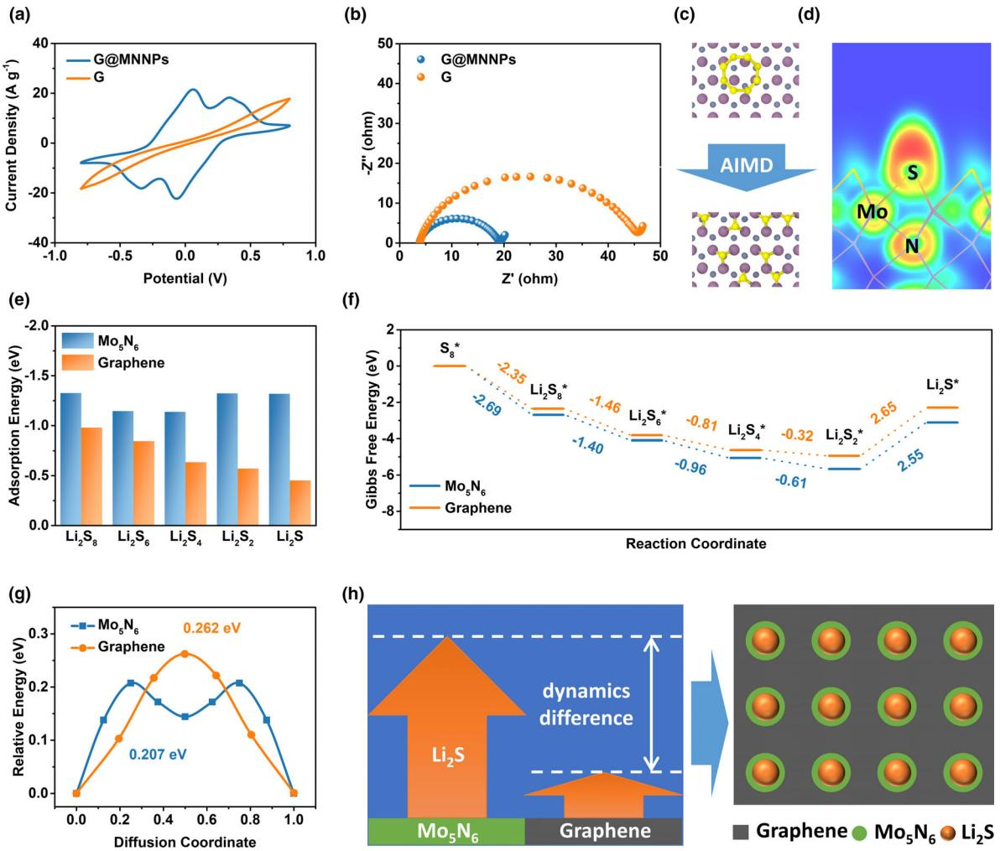
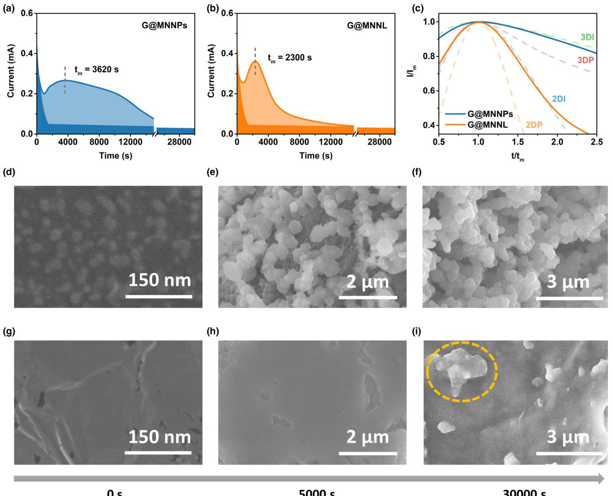
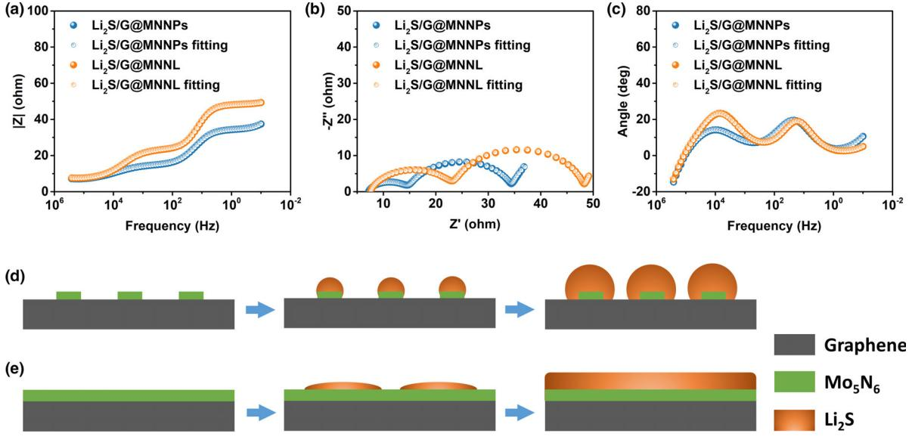
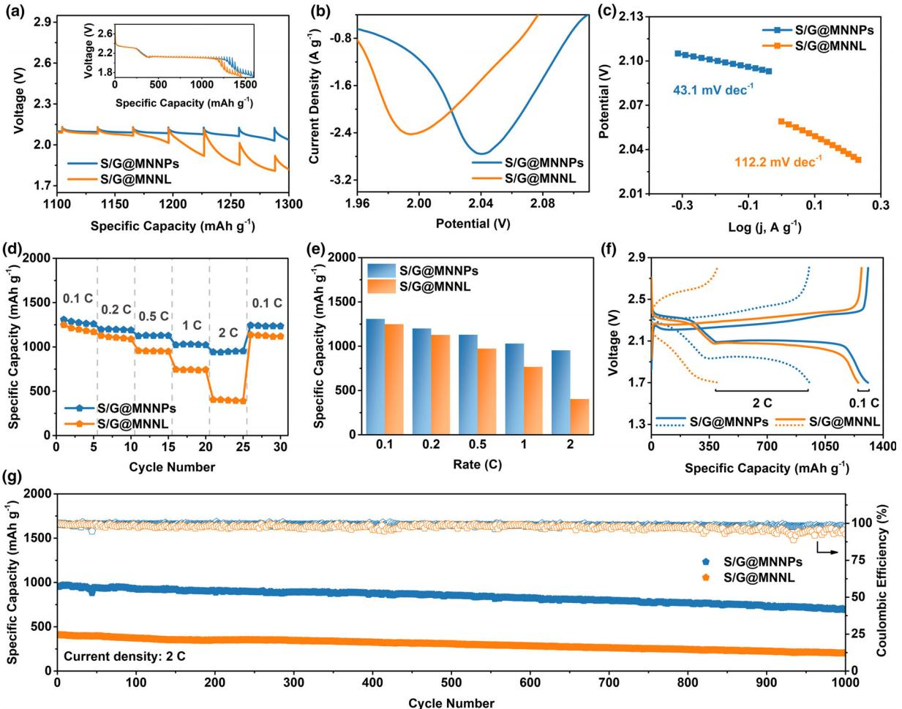

Lithium–Sulfur Batteries

# Heterogeneous Mediator Enabling Three-Dimensional Growth of Lithium Sulfide for High-Performance Lithium–Sulfur Batteries

Da Tian, Xueqin Song, Yue Qiu, Xun Sun, Bo Jiang, Chenghao Zhao, Yu Zhang, Xianzhu Xu, Lishuang Fan, and Naiqing Zhang\*

Two-dimensional (2D) deposition regime of insulating lithium sulfide (Li2S) is a major obstacle to achieve high reversible capacity in the conventional glyme-based lithium–sulfur (Li–S) batteries as it leads to rapid loss of active electrode surface and low sulfur utilization. Achieving three-dimensional (3D) growth of Li2S is therefore considered to be necessary, but the available strategies are mainly based on the electrolyte manipulations, which inevitably lead to added complexity of the electrode–electrolyte compatibility and, in particular, instability of the lithium anode. In this work, we have developed a heterogeneous polysulfide mediator composed of discrete Mo5N6 anchored on graphene, which functions on the cathode side, to regulate the deposition mode of Li2S. Mo5N6 can efficiently boost the formation of Li2S as demonstrated by a series of experimental and computational results. More importantly, the discrete distribution of Mo5N6 nucleants on graphene postpones the merging of adjacent Li2S nuclei to promote their isotropic growth. Thus, 3D deposits of Li2S is guided by the heterogeneous mediator. Benefiting from these unique superiorities, Li–S cells with high rate capability of 954 mAh g1 at 2 C and long cycle life exceeding 1000 cycles are realized without advanced lithium anode protection.

#### 1. Introduction

Lithium–sulfur (Li-S) batteries are considered to be one of the most promising next-generation energy storage devices beyond Li-ion battery due to their exceptional theoretical [cap](#page-7-0)acity (1675 mAh g1 ) and high energy density (2600 Wh kg1 ).[\[1](#page-7-0)–4] However, the commercialization of lithium–sulfur batteries is hindered by the sophisticated solid–liquid–solid phase transformations.[\[5](#page-7-0)–[12](#page-7-0)] In particular, the

Academy of Fundamental and Interdisciplinary Sciences, Harbin Institute of Technology, Harbin 150001, China

Prof. N. Zhang

State Keys Laboratory of Urban Water Resource and Environment, Harbin Institute of Technology, Harbin 150001, China

E-mail: znqmww@163.com

The ORCID identification number(s) for the author(s) of this article can be found under<https://doi.org/10.1002/eem2.12236>.

#### DOI: 10.1002/eem2.12236

deposition mode of the solid discharge product (Li2S) is a key factor in [determ](#page-7-0)ining the electrochemical performance.[\[13](#page-7-0)–19] Unfortunately, Li2S deposition in the conventional glymebased solution follows a two-dimensional (2D) growth model.[[17](#page-7-0)–19] The lateral growth of insulating Li2S covering the cathode leads to premature electrode passivation and impedes the mass/charge transfer across the cathode/electrolyte interface. This results in insufficient sulfur utilization, low rate capability, and gradual capacity loss during cycling of Li-S batteries.

Therefore, it is desirable to achieve threedimensional (3D) Li2S growth to tackle these issues. A few works have been reported either by introducing additives into the electrolyte or by replacing solvents/lithium salts.[\[13](#page-7-0)–16] Although some progress has been made, the adoption of these electrolyte-based methods can lead to multiple side effects. For example, the incorporation of soluble redox mediators aggravates internal shuttling and causes anode corrosion, and the utilization of high-donor number

solvents/salts results in increased solubility of lithium polysulfides (LiPSs) and poor stability of lithium anode. As a result, the cycle life is limited (<200 cycles). There is thereby an urgent need to develop an alternative approach that neither exacerbates the shuttle effect nor impairs the lithium metal anode.

Herein, we propose a novel strategy to achieve 3D Li2S growth which together boosts the sulfur redox kinetics, suppresses the polysulfide shuttling, and does not require advanced lithium anode protection. In detail, a composite of discrete Mo5N6 nanoparticles anchored on graphene (denoted as G@MNNPs) is developed as a heterogeneous polysulfide mediator to tailor the Li-S electrochemistry. Our experimental and computational results reveal that Mo5N6 is an efficient Li2S formation catalyst. Moreover, the spatially discrete distribution of Mo5N6 nucleants on graphene can slow down the impingement of neighboring Li2S nuclei to prolong their isotropic growth. Thus, 3D precipitation of Li2S is guided by G@MNNPs. In addition, the heterogeneous (solid) nature of G@MNNPs keeps it from exacerbating the shuttle effect and affecting the lithium anode. By virtue of these unique properties, Li-S cells with G@MNNPs delivers high rate capability of 954 mAh g1 at 2 C and an excellent cycle life over 1000 cycles

D. Tian, X. Song, Y. Qiu, X. Sun, B. Jiang, C. Zhao, Y. Zhang, Prof. X. Xu School of Chemistry and Chemical Engineering, Harbin Institute of Technology, Harbin 150001, China

Prof. L. Fan, Prof. N. Zhang

with a low capacity fade rate of 0.028% per cycle without the use of advanced lithium metal protection technology.

#### 2. Results and Discussion

It is well-established that conductive polar materials can simultaneously realize adsorption and conversion of LiPSs.[\[20](#page-7-0)–24] Herein, we choose Mo5N6, which is a conductive transition metal nitride with a Pt-like electronic structure,[[25](#page-7-0)] to construct the desired mediator. The calculated energy band structure of Mo5N6 of the first Brillouin zone is plotted in Figure S1a, revealing that Mo5N6 exhibits metallic nature with no band gap. Figure S1b shows the density of states (DOS) of Mo5N6. Mo5N6 has DOS across the Fermi level (Ef), which confirms its metallic property.

A simple solvothermal approach followed by post-annealing under NH3 flow was employed to construct the G@MNNP composite, as illustrated in Figure [1](#page-2-0)a. X-ray diffraction (XRD) and X-ray photoelectron spectroscopy (XPS) measurements have been utilized to investigate the structure of the synthesized G@MNNPs composite. Figure [1b](#page-2-0) shows the XRD pattern of the G@MNNPs composite, which matches well with that of the Mo5N6 phase (ICDD-051-1326) and that of graphene. Figure S2 shows the XPS spectra of the G@MNNPs composite. Mo 3d, N 1s, and C 1s peaks are observed in the wide-scan spectrum, confirming the fact that Mo, N, and C elements form the sample. In the Mo 3d region, the peaks at 232.8 and 229.6 eV are assigned to the binding energies of Mo 3d3/2 and Mo 3d5/2, respectively, with a spin– orbit splitting of 3.2 eV. Meanwhile, the N 1s peak locates at 397.9 eV, and the Mo 3p3/2 peak locates at 395.4 eV. These results are highly consistent with those for Mo5N6. [\[25,26](#page-7-0)]

To study the morphology of the as-prepared G@MNNP composite, scanning electron microscopy (SEM) and transmission electron microscopy (TEM) observations were carried out. Figure [1c](#page-2-0) shows a typical sheet-like structure of graphene, and Mo5N6 nanoparticles are uniformly dispersed on it. At higher magnification (Figure [1d\)](#page-2-0), one can clearly see that MNNPs are homogeneously distributed on graphene sheets without any bulk particles. Figures [1e,f](#page-2-0) show the bright-field TEM images of G@MNNPs. Given the high transparency of graphene, MNNPs are discernable with strong contrast, and these MNNPs are spatially discrete on graphene.

In high-resolution transmission electron microscopy (HRTEM) image shown in Figure [1g](#page-2-0), the lattice fringes with interplane spacing of 0.245 nm correspond to the (110) plane of Mo5N6. Figure S3 shows the well-defined hexagonal diffraction spots. The observed structure is highly consistent with Mo5N6 (Figure [1h\)](#page-2-0). The energy-dispersive X-ray spectroscopy (EDS) elemental mapping images (Figure [1i-k](#page-2-0)) confirm that these nanoparticles are discrete. Uniform distribution of molybdenum, nitrogen, and carbon in G@MNNPs can be observed in Figure S4. These results match well with the microscopy observations.

To reveal the catalytic effect of Mo5N6 on the polysulfide redox reaction, cyclic voltammetry (CV) measurements of the symmetric cells in the Li2S6 electrolyte were first carried out. Figure [2](#page-3-0)a shows the CV curves of the symmetric cells obtained between 0.8 and 0.8 V. Four distinct peaks are observed at 0.06, 0.34, 0.06, and 0.34 V from the symmetric G@MNNPs cell. These two pairs of reversible redox current peaks are derived from the reduction of Li2S6 to Li2S on the working electrode and oxidization of Li2S6 to S8 on the counter electrode in the cathodic scan, and their reverse redox reactions in the anodic scan.[[27,28\]](#page-7-0) In contrast, no redox peaks appear between 0.8 and 0.8 V

for the symmetric G cell, demonstrating that Mo5N6 can dramatically accelerate the electrochemical reaction of LiPSs. Electrochemical impedance spectroscopy (EIS) measurements were also carried out to evaluate the charge transfer in these cells. Figure [2b](#page-3-0) shows that the symmetric G cell exhibits a large charge transfer resistance compared with the symmetric G@MNNP cell, demonstrating that Mo5N6 can reduce the reaction barrier of polysulfide conversion.

Theoretical calculations based on the density functional theory (DFT) were performed to study the mechanism of action of Mo5N6 in lithium–sulfur batteries. The adsorption configuration of single S atom on the Mo5N6 surface was first calculated. Figure S6 shows that there are two stable adsorption sites of S adatoms including hcp and fcc sites. The energy difference between the two adsorption sites is relatively small (hcp: 6.97 eV; fcc: 6.50 eV). Such high binding energies might cause breakage of S-S bonds. To explore this, ab initio molecular dynamics (AIMD) simulations were carried out with a S8 molecule being placed near the surface at a distance of ~3.5 A as the initial configuration. Figure [2c](#page-3-0) and Figure S7 clearly reveal that S8 collapses into atomic S when approaching Mo5N6. In the final configuration, 3/4 of the S atoms are located at the most stable hcp site of Mo5N6, and 1/4 of the S atoms are at the substable fcc site. Figure [2d](#page-3-0) shows the ELF plot of the Mo-S bonds. The continuous electron density between neighboring Mo and S atoms confirms their covalent bonding nature. Such sulfurization phenomenon was further confirmed by the XPS result that a new 2p3/2 peak representative of Mo-S bond at 161.4 eV appears after interacting with sulfur (Figure S8). Note that the formation of molybdenum sulfides can been ruled out as they typically show typical characteristic resonance of 2p3/2 located at ca. 162.4 eV.[[29,30\]](#page-7-0) This was further confirmed by the fact that no new phase was detected in the XRD pattern of the sulfurized G@MNNPs (Figure S9). Similarly, Li2S8 can also sulfurize Mo5N6 as shown in Figure S10. Actually, such phenomenon has been reported by others as well, which shows that the S8 molecule or polysulfide anions can lead to surface sulfurization.[\[31](#page-7-0)–34] Similarly to these works, to better describe the interaction between sulfur species and Mo5N6, a sulfurized model was rationally constructed by placing a monolayer of S atoms in the hcp sites, as shown in Figure S11.

The adsorption of LiPSs is a prerequisite for redox reactions to occur on the catalyst. Figure S12 shows the calculated adsorption configuration of Li2S8, Li2S6, Li2S4, Li2S2, and Li2S on Mo5N6, and the binding energies of these S species on Mo5N6 are 1.33, 1.15, 1.14, 1.32, and 1.32 eV, respectively, as shown in Figure [2e](#page-3-0). In contrast, the binding energy values of these S species on graphene are lower than those on Mo5N6. This indicates that Mo5N6 is a better polysulfide adsorbent than graphene, which is favorable for inhibiting LiPSs shuttling and promoting subsequent conversion. The theoretical result is further confirmed by visual LiPS adsorption and glass cell tests, which reveal that G@MNNPs has much stronger LiPS adsorption ability than G (Figure S13).

To further understand the superiority of Mo5N6 for catalyzing sulfur species conversion, the Gibbs free energy change (DG) of each lithiation step was calculated at room temperature (298.15 K). As shown in Figure [2f](#page-3-0) and Figure S14, almost all the steps are more energetically favorable on Mo5N6 than those on graphene because of the more negative DG values. Beside thermodynamics, the dynamic barrier of the reaction should also be considered. The diffusion mechanism of Li+ on Mo5N6 and graphene was calculated for comparison. The Li+ diffusion pathway is shown in Figure S15. From the transition-state calculation, the diffusion energy barrier on Mo5N6 between two stable sites is

Figure 1. a) Schematic illustration of the synthesis process of G@MNNPs. b) XRD pattern of G@MNNPs. # denotes graphene. c, d) SEM images of G@MNNPs. e, f) TEM images of G@MNNPs. g) HRTEM image of G@MNNPs. h) Crystal structure of Mo5N6 (top view). i) STEM image of G@MNNPs, and the corresponding elemental mapping images of j) Mo-K and k) Mo-L.

0.207 eV, which is much lower than that on graphene (0.262 eV), as shown in Figure [2g](#page-3-0). Therefore, the redox reaction between Li+ and sulfur species can rapidly proceed on Mo5N6. As a result, the significant catalytic activity difference between Mo5N6 and graphene is expected to make Mo5N6 to be the preferred location for Li2S nucleation, as illustrated in Figure [2h.](#page-3-0)

To identify the superiority of 3D deposition of Li2S, Mo5N6 nanolayer-coated graphene (G@MNNL) was synthesized and was included as a control sample. Li2S precipitation experiments were carried out by applying the potentiostatic discharge process on various surfaces to investigate the growth behavior of Li2S. Note that the samples with the same surface area were used to exclude the influence of specific surface area. The nitrogen adsorption measurements and the BET specific surface areas of different samples are shown in Figure S16. To understand the deposition process of Li2S on different surfaces, the current variation was monitored. Consistent with previous reports,[\[24,28,35,36](#page-7-0)] the current signal shows a peaking behavior as a function of time, as shown in Figure [3](#page-4-0)a,b. The initial current drop can be attributed to the reduction of long-chain polysulfides to mid-chain polysulfides. After that, the current begins to increase as the nucleation of Li2S occurs, and the large succeeding current flow corresponds to the growth of the existing nuclei. Next, the current decays with time due to the overlap of the adjacent nuclei or their diffusion zones.[\[37\]](#page-7-0) The time (tm) at which the maximum current (Im) appears highlights the moment when the adjacent Li2S nuclei or their diffusional hemispheres are encountered.[[19](#page-7-0)] Therefore, small tm values indicate faster surface coverage, and thus, by comparing tm values, we can assess the relative speed of electrode passivation.[[13,14\]](#page-7-0) The tm value for the G@MNNL electrode is 2300 s, which is smaller than that for G@MNNPs (3620 s), suggesting that G@MNNPs has an slower passivation speed than G@MNNL. The electrode passivation can severely hinder the subsequent precipitation, and consequently, an inferior precipitation capacity was obtained for G@MNNL compared with G@MNNPs (Figure S17).

The dimensionless current (I/Im) and time (t/tm) responses are obtained from the potentiostatic discharge results and superimposed to

Figure 2. a) CV curves and b) Nyquist plots of the symmetrical cells. c) Schematic for the AIMD simulation of sulfurization process on Mo5N6. d) ELF plot of S adsorbed on Mo5N6. e) Adsorption energies of LiPS on the sulfurized Mo5N6 and graphene. f) Energy profiles for the reduction of sulfur species on the sulfurized Mo5N6 and graphene. g) Li+ diffusion profiles on the sulfurized Mo5N6 and graphene. h) Schematic illustration of the Li2S nucleation behavior on G@MNNPs.

four classical models of electrodeposition: the Bewick, Fleischmann, and Thirsk models for 2D instantaneous (2DI) and 2D progressive (2DP) nucleation and growth,[\[38\]](#page-7-0) and the Scharifker and Hills models for 3D instantaneous (3DI) and 3D progressive (3DP) nucleation and growth.[\[37\]](#page-7-0) Figure [3c](#page-4-0) shows that the Li2S deposition mode on G@MNNL follows the 2DI model, which is the accepted pattern in glyme-based electrolyte.[[17](#page-7-0)–19] In this case, the underneath conductive surface is prematurely blocked to lose functionality. In contrast, the Li2S deposition mode on G@MNNPs follows the 3DI model. This is not surprising. On the one hand, Li2S can precipitate on the surface once produced because of its low solubility in glyme. Thus, Li2S deposition on both G@MNNPs and G@MNNL follows the instantaneous model. On the other hand, the discrete distribution of Mo5N6 nucleants on G@MNNPs allows for a small nucleation density, as suggested by the large tm value. In this case, the Li2S nuclei undergo prolonged isotropic growth, which leads to retarded surface passivation.

To obtain an intuitive perspective of the morphology evolution of solid Li2S products, the cells were disassembled after potentiostatically discharging for a certain period of time, and the discharged electrodes were characterized by SEM. Figure [3d,](#page-4-0)g are SEM images of G@MNNPs and G@MNNL before potentiostatic discharge, respectively. Distinctly, G@MNNPs have a rougher surface in comparison with G@MNNL, where Mo5N6 covers almost the entire surface of graphene. Figure [3e](#page-4-0) shows that the solid deposits on G@MNNPs consist of isolated Li2S at the intermediate stage of Li2S growth (t = 5000 s), suggesting the discrete nucleation and isotropic growth regime of Li2S. At this moment, a large amount of naked conductive surface is still observed. In contrast, the overall morphology of the solid products on G@MNNL is smooth, and Li2S has almost completely covered the surface after potentiostatically discharging for the same time (Figure [3h\)](#page-4-0). The difference in surface coverage of Li2S is consistent with the fact that G@MNNPs have a larger tm than G@MNNL. After prolonged discharging (t = 30 000 s), both surfaces were fully covered by Li2S, whereas the morphologies at the intermediate growth stage were largely preserved (Figure [3f,i](#page-4-0)). EDS mappings of the discharged electrode confirm that the solid deposits are Li2S (Figure S19). Large Li2S agglomerates can be observed for G@MNNL, revealing some contribution of solvent-mediated nucleation of Li2S due to the large electrochemical polarization.[\[21,39\]](#page-7-0)

Figure 3. Potentiostatic discharge profiles with a) G@MNNPs and b) G@MNNL, and c) the corresponding dimensionless current (I/Im)–time (t/tm) response profiles. d–f) SEM images of G@MNNPs after potentiostatic discharge of d) 0 s, e) 5000 s, and f) 30 000 s. g–i) SEM images of G@MNNL after potentiostatic discharge of g) 0 s, h) 5000 s, and i) 30 000 s.

To further explore the structural characteristics of the solid products on various electrodes, the fully discharged G@MNNPs and G@MNNL electrodes (denoted as Li2S/G@MNNPs and Li2S/G@MNNL, respectively) after potentiostatic measurements were characterized by EIS. To eliminate the interfering factors such as the solid–electrolyte interphase (SEI) on lithium anode, the lithium foils were replaced by fresh ones, and the electrolyte was replaced by DME/DOL (v/v = 1:1) with 1 M LiTFSI. Figure [4](#page-5-0)a shows that the impedance data for Li2S/G@MNNPs and Li2S/G@MNNL is almost identical in the highest frequency range (105 –106 ), which is related to the inductance of the wiring and the ohmic resistance of the cells. However, the impedance of Li2S/ G@MNNPs is remarkably smaller than that of Li2S/G@MNNL in other frequency ranges, indicating faster reaction dynamics of the Li2S/ G@MNNPs electrode. Figure [4b](#page-5-0) shows the Nyquist plots, where two distinct contributions in the form of semicircles are clearly observed. The semicircle at high-frequency (HF) regions refers to the charge transfer dynamics, and the second semicircle in middle frequency range (MF) accounts for the precipitate phase contributions (Figure S20).[\[40\]](#page-7-0) The RHF value of the Li2S/G@MNNPs electrode is calculated to be about 8.49 Ω through EIS fitting, which is much smaller than the RHF value of the Li2S/G@MNNL electrode (16.69 Ω), indicating that more active surfaces are remained on Li2S/G@MNNPs benefiting from the suppression of electrode passivation (Figure S21). The Li2S/G@MNNP electrode also presents a smaller RMF (19.62 Ω) than the Li2S/G@MNNL electrode (24.29 Ω), confirming the formation of more favorable Li2S deposits. Figure [4c](#page-5-0) shows the frequency–angle plot, where two peaks can be observed, reflecting the two time constant characteristics of the EIS spectra, which is consistent with the Nyquist plots. Distinctly, a larger phase angle is observed for Li2S/G@MNNL in the high-frequency range compared to G@MNNPs, suggesting that a Li2S coating with higher degree of coverage, namely, a dense film, was formed on G@MNNL, causing severe electrode passivation.[\[41](#page-7-0)]

Figures [4d,](#page-5-0)e illustrate the different Li2S growth modes on G@MNNPs and on G@MNNL. G@MNNL, whose surface has

Figure 4. a) Bode magnitude plots, b) Nyquist plots, and c) Bode phase plots of the electrodes after potentiostatic discharge. Schematic illustration of the Li2S precipitation process on d) G@MNNPs and e) G@MNNL.

contiguous Mo5N6 nucleants, tends to guide the formation of dense nuclei which easily merge with each other and laterally grow to passivate the conductive surface. In comparison, the Mo5N6 nucleants on G@MNNPs are spatially discrete. The isotropic growth of Li2S on G@MNNPs allows for slow nuclei impingement and thus mitigated surface passivation. Hence, reduced electrode polarization and higher discharge capacity are obtained on G@MNNPs.

To validate the superiority of 3D Li2S deposition, galvanostatic intermittent titration technique (GITT) experiments of sulfur cathodes integrated with G@MNNPs or G@MNNL were carried out. Figure [5](#page-6-0)a shows that the discharge profiles exhibit two reduction plateaus. The discharge plateaus around 2.3 and 2.1 V can be attributed to the conversion of sulfur to polysulfides and polysulfides to Li2S, respectively. The first plateau is closely related to the solid–liquid conversion, and the formation of solid Li2S in the second plateau brings up the cell resistance. No obvious difference of the first plateau is observed for the two electrodes. As for the second plateau, however, G@MNNPs exhibit constantly smaller potential gaps between the operating and equilibration states than those for S/G@MNNL, demonstrating the alleviated polarization and dynamic limitation in G@MNNPs. This difference becomes more pronounced in the later stages of the discharge. Remarkably, the polarization increase of the S/G@MNNP electrode is much later than that of the S/G@MNNL electrode, implying that a favorable Li2S deposition process occurs in the cathode with the help of G@MNNPs, which retards the electrode polarization to avoid the premature termination of the discharge process. Linear sweep voltammetry (LSV) curves were also measured to compare the Li2S formation dynamics of the electrodes. As shown in Figure [5b,](#page-6-0) both electrodes show a current hump at about 2.0 V, corresponding to the formation of Li2S. A positive position of the reduction peak of S/G@MNNPs compared with S/G@MNNL can be observed, indicating a smaller reaction barrier. To further analyze the dynamics behaviors, Tafel slopes were taken from the linear regions (Figure [5c](#page-6-0)). The slope values clearly confirm the small electrochemical

polarization of S/G@MNNPs (43.1 mV dec1 ) in contrast of 112.2 mV dec1 over S/G@MNNL.

Figure [5d](#page-6-0) shows the rate performance of the two cathodes. The S/ G@MNNP cell can deliver reversible capacity of 1309, 1200, 1130, 1030, and 954 mAh g1 at current densities of 0.1, 0.2, 0.5, 1, and 2 C, respectively (Figure [5e](#page-6-0)). As we expect, S/G@MNNPs present much better rate capability than S/G@MNNL, and the difference is more pronounced when a higher current density is used. Figure [5f](#page-6-0) shows that S/G@MNNL exhibits a huge overpotential at high current density, and the second discharge plateau almost disappears when the current density reaches 2 C. The large polarization results in premature termination of the discharge process and thus inefficient sulfur utilization. The ratio of lower plateau discharge capacity (QL) to upper plateau discharge capacity (QH) reflects the liquid–solid conversion efficiency. The significantly higher QL/QH ratio of S/G@MNNPs than S/G@MNNL suggests that G@MNNPs can effectively reduce the concentration of LiPSs in the electrolyte, thus mitigating the shuttle effect (Figure S23). This is especially important at high current densities where the Li anode undergoes pronounced structural changes.[\[42,43](#page-7-0)] In such cases, the presence of LiPSs can significantly exacerbate the anode failure. The QL/QH ratio of S/G@MNNPs at 2 C is almost triple that of S/G@MNNL, implying that the use of G@MNNPs greatly extends the life of Li-S batteries at high rates.

The S/G@MNNPs cathode also presented excellent cycle performance. Figure S24 shows that S/G@MNNPs display a high capacity retention of 993 mAh g1 after cycling at 1 C. In contrast, the S/G@MNNL and S/G cathodes deliver capacities of 576 and 235 mAh g1 , respectively, after 100 cycles. The average Coulombic efficiency for S/G@MNNPs is as high as 99.4%, suggesting the diminished shuttling effect benefiting from the high LiPS conversion efficiency (Figure S25). Figure [5g](#page-6-0) shows that the S/G@MNNP cathode can achieve favorable cycling stability even at a higher current density of 2 C. After extensive cycling for 1000 cycles, a high capacity of 691 mAh g1 can still be retained. Moreover, the Coulombic efficiency of the S/G@MNNP

Figure 5. a) GITT voltage profiles, b) LSV profiles, c) Tafel plots, d, e) rate capability, f) charge–discharge profiles, and g) long-term cycle performance of the S/G@MNNP and S/G@MNNL cathodes.

electrode almost keeps above 98% during cycling. The performance is impressive when considering the relatively low concentration of LiNO3 (1 wt%) in the electrolyte. The S/G@MNNP electrode with higher sulfur loadings were further evaluated. Figure S26 shows that even with the S loading of 5.8 mg cm2 in cathode, the cell can also reveal a high reversible capacity of 4.6 mAh cm2 after 100 cycles.

The postmortem analysis was conducted to study the Li anodes disassembled from the cycled cells. Figure S27 shows that the S/ G@MNNP cell exhibits a less rough anode than others, indicating the minor corrosion. These results demonstrate that the use of G@MNNPs can not only realize 3D Li2S deposition but also inhibit LiPS shuttling; hence, the Li anode is simultaneously protected to a certain extent. This is crucial for long-life Li-S batteries as the deformation of Li metal anode is another important factor causing battery failure.[[44](#page-7-0)–47]

#### 3. Conclusion

In summary, we have developed a heterogeneous polysulfide mediator composed of discrete Mo5N6 supported on graphene (G@MNNPs). Our experimental and computational results reveal that Mo5N6 can efficiently boost the intrinsic kinetics of sulfur redox reaction to serve as an excellent Li2S formation catalyst. More importantly, the discrete distribution of Mo5N6 nucleants on graphene allows for postponed impingement of adjacent Li2S nuclei, and thus, their isotropic growth is prolonged. This leads to the evolution of favorable 3D Li2S deposits, which avoids the rapid loss of active electrode surface and reduces the electrode polarization. The efficient conversion of polysulfides not only improves the sulfur utilization but also minimizes the shuttling of polysulfides in the electrolyte and mitigates the corrosion of lithium metal anode by polysulfides. Consequently, the incorporation of G@MNNPs endows Li-S cells with high rate capability of 954 mAh g1 at 2 C, excellent cycle life over 1000 cycles with a low capacity fade rate of 0.028% per cycle, and a stable operation of high sulfur loading electrode (5.8 mg cm2 ) without using an advanced lithium metal protection strategy. This work demonstrates an effective strategy to achieve 3D Li2S deposition and inspires advanced material design for analogous electrochemical systems based on the dissolution–precipitation mechanism.

#### 4. Experimental Section

The experimental details are available in the Supporting Information.

#### Acknowledgements

This work was supported by the National Natural Science Foundation of China (22078078).

## Conflict of Interest

The authors declare no conflict of interest.

#### Supporting Information

Supporting Information is available from the Wiley Online Library or from the author.

### Keywords

electrocatalysis, lithium sulfide nucleation, lithium–sulfur batteries, polysulfide redox reaction, shuttle effect

Received: April 1, 2021

Revised: June 1, 2021 Published online: June 18, 2021

- [1] Z. W. Seh, Y. Sun, Q. Zhang, Y. Cui, Chem. Soc. Rev. 2016, 45, 5605.
- [2] X. Ji, K. T. Lee, L. F. Nazar, Nat. Mater. 2009, 8, 500.
- [3] C.-X. Zu, H. Li, Energy Environ. Sci. 2011, 4, 2614.
- [4] B. Dunn, H. Kamath, J. M. Tarascon, Science 2011, 334, 928.
- [5] Y. Yang, G. Zheng, Y. Cui, Chem. Soc. Rev. 2013, 42, 3018.
- [6] A. Manthiram, S. H. Chung, C. Zu, Adv. Mater. 1980, 2015, 27.
- [7] H. J. Peng, J. Q. Huang, X. B. Cheng, Q. Zhang, Adv. Energy Mater. 2017, 7, 1700260.
- [8] Y. X. Yin, S. Xin, Y. G. Guo, L. J. Wan, Angew Chem. Int. Ed. Engl 2013, 52, 13186.
- [9] Z. W. Zhang, H. J. Peng, M. Zhao, J. Q. Huang, Adv. Funct. Mater. 2018, 28, 1707536.
- [10] A. Bhargav, J. R. He, A. Gupta, A. Manthiram, Joule 2020, 4, 285.
- [11] J. Park, S. H. Yu, Y. E. Sung, Nano Today 2018, 18, 35.
- [12] Q. Pang, X. Liang, C. Y. Kwok, L. F. Nazar, Nat. Energy 2016, 1, 16132.
- [13] H. Chu, J. Jung, H. Noh, S. Yuk, J. Lee, J. H. Lee, J. Baek, Y. Roh, H. Kwon, D. Choi, K. Sohn, Y. Kim, H. T. Kim, Adv. Energy Mater. 2020, 10, 2000493.
- [14] L. C. Gerber, P. D. Frischmann, F. Y. Fan, S. E. Doris, X. Qu, A. M. Scheuermann, K. Persson, Y. M. Chiang, B. A. Helms, Nano Lett. 2016, 16, 549.
- [15] H. Chu, H. Noh, Y. J. Kim, S. Yuk, J. H. Lee, J. Lee, H. Kwack, Y. Kim, D. K. Yang, H. T. Kim, Nat. Commun. 2019, 10, 188.
- [16] M. Zhao, H. J. Peng, J. Y. Wei, J. Q. Huang, B. Q. Li, H. Yuan, Q. Zhang, Small Methods 2020, 4, 1900344.
- [17] H. L. Pan, J. Z. Chen, R. G. Cao, V. Murugesan, N. N. Rajput, K. S. Han, K. Persson, L. Estevez, M. H. Engelhard, J. G. Zhang, K. T. Mueller, Y. Cui, Y. Y. Shao, J. Liu, Nat. Energy 2017, 2, 813.
- [18] Z. J. Li, Y. C. Zhou, Y. Wang, Y. C. Lu, Adv. Energy Mater. 2019, 9, 1802207.
- [19] F. Y. Fan, W. C. Carter, Y. M. Chiang, Adv. Mater. 2015, 27, 5203.
- [20] H. Yao, G. Zheng, P.-C. Hsu, D. Kong, J. J. Cha, W. Li, Z. W. Seh, M. T. McDowell, K. Yan, Z. Liang, V. K. Narasimhan, Y. Cui, Nat. Commun. 2014, 5, 3943.
- [21] Q. Pang, D. Kundu, M. Cuisinier, L. F. Nazar, Nat. Commun. 2014, 5, 4759.
- [22] X. Tao, J. Wang, C. Liu, H. Wang, H. Yao, G. Zheng, Z. W. Seh, Q. Cai, W. Li, G. Zhou, C. Zu, Y. Cui, Nat. Commun. 2016, 7, 11203.
- [23] Z. Yuan, H. J. Peng, T. Z. Hou, J. Q. Huang, C. M. Chen, D. W. Wang, X. B. Cheng, F. Wei, Q. Zhang, Nano Lett. 2016, 16, 519.
- [24] H. J. Peng, G. Zhang, X. Chen, Z. W. Zhang, W. T. Xu, J. Q. Huang, Q. Zhang, Angew Chem. Int. Ed. Engl 2016, 55, 12990.
- [25] H. Jin, X. Liu, A. Vasileff, Y. Jiao, Y. Zhao, Y. Zheng, S. Z. Qiao, ACS Nano 2018, 12, 12761.
- [26] J. Cao, T. Li, H. Gao, Y. Lin, X. Wang, H. Wang, T. Palacios, X. Ling, Sci. Adv. 2020, 6, eaax8784.
- [27] H. B. Lin, L. Q. Yang, X. Jiang, G. C. Li, T. R. Zhang, Q. F. Yao, G. W. Zheng, J. Y. Lee, Energy Environ. Sci. 2017, 10, 1476.
- [28] H. Lin, S. Zhang, T. Zhang, H. Ye, Q. Yao, G. W. Zheng, J. Y. Lee, Adv. Energy Mater. 2019, 9, 1902096.
- [29] Z. J. Zhang, H. L. Zhao, Y. Q. Teng, X. W. Chang, Q. Xia, Z. L. Li, J. J. Fang, Z. H. Du, K. Swierczek, Adv. Energy Mater. 2018, 8, 1700174.
- [30] H. Su, L. Chen, Y. Chen, R. Si, Y. Wu, X. Wu, Z. Geng, W. Zhang, J. Zeng, Angew Chem. Int. Ed. Engl 2020, 59, 20411.
- [31] T.-G. Jeong, D. S. Choi, H. Song, J. Choi, S.-A. Park, S. H. Oh, H. Kim, Y. Jung, Y.-T. Kim, ACS Energy Lett. 2017, 2, 327.
- [32] C. C. Li, X. B. Liu, L. Zhu, R. Z. Huang, M. W. Zhao, L. Q. Xu, Y. T. Qian, Chem. Mater. 2018, 30, 6969.
- [33] X. C. Liu, S. P. Zhou, M. Liu, G. L. Xu, X. D. Zhou, L. Huang, S. G. Sun, K. Amine, F. S. Ke, Nano Energy 2018, 50, 685.
- [34] M. Z. Sun, Z. Wang, X. Li, H. B. Li, H. S. Jia, X. X. Xue, M. Jin, J. Q. Li, Y. Xie, M. Feng, J. Mater. Chem. A 2020, 8, 11818.
- [35] D. Tian, X. Song, M. Wang, X. Wu, Y. Qiu, B. Guan, X. Xu, L. Fan, N. Zhang, K. Sun, Adv. Energy Mater. 2019, 9, 1901940.
- [36] H. Yuan, H. J. Peng, B. Q. Li, J. Xie, L. Kong, M. Zhao, X. Chen, J. Q. Huang, Q. Zhang, Adv. Energy Mater. 2019, 9, 1802768.
- [37] B. Scharifker, G. Hills, Electrochim. Acta 1983, 28, 879.
- [38] A. Bewick, M. Fleischmann, H. R. Thirsk, Trans. Faraday Soc. 1962, 58, 2200.
- [39] Q. Pang, C. Y. Kwok, D. Kundu, X. Liang, L. F. Nazar, Joule 2019, 3, 136.
- [40] N. A. Canas, K. Hirose, B. Pascucci, N. Wagner, K. A. Friedrich, R. Hies- ~ gen, Electrochim. Acta 2013, 97, 42.
- [41] Z. B. Wang, H. X. Hu, C. B. Liu, Y. G. Zheng, Electrochim. Acta 2014, 135, 526.
- [42] Z. Y. Lu, W. T. Li, Y. Long, J. C. Liang, Q. H. Liang, S. C. Wu, Y. Tao, Z. Weng, W. Lv, Q. H. Yang, Adv. Funct. Mater. 2020, 30, 1907343.
- [43] L. Kong, Q. Jin, X. T. Zhang, B. Q. Li, J. X. Chen, W. C. Zhu, J. Q. Huang, Q. Zhang, J. Energy Chem. 2019, 39, 17.
- [44] J. Y. Wei, X. Q. Zhang, L. P. Hou, P. Shi, B. Q. Li, Y. Xiao, C. Yan, H. Yuan, J. Q. Huang, Adv. Mater. 2020, 32, 2003012.
- [45] C. Yan, X. Q. Zhang, J. Q. Huang, Q. B. Liu, Q. Zhang, Trends Chem. 2019, 1, 693.
- [46] R. Xu, X. B. Cheng, C. Yan, X. Q. Zhang, Y. Xiao, C. Z. Zhao, J. Q. Huang, Q. Zhang, Matter 2019, 1, 317.
- [47] J. G. Zhang, W. Xu, J. Xiao, X. Cao, J. Liu, Chem. Rev. 2020, 120, 13312.