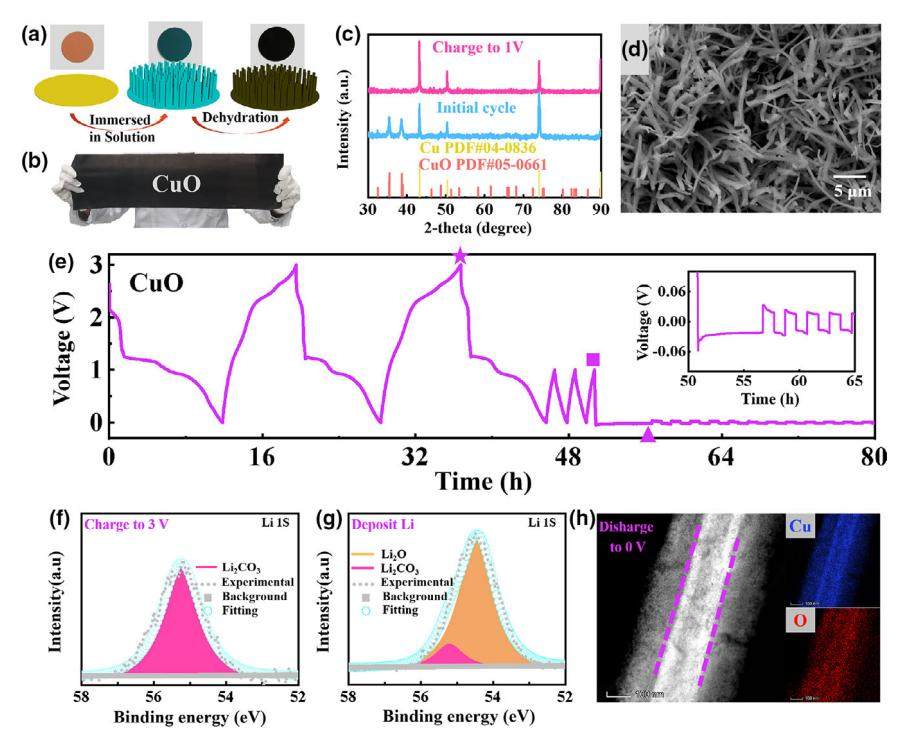
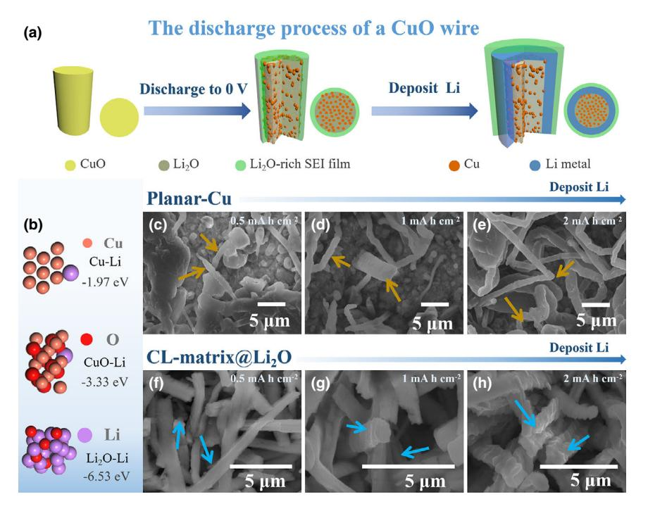
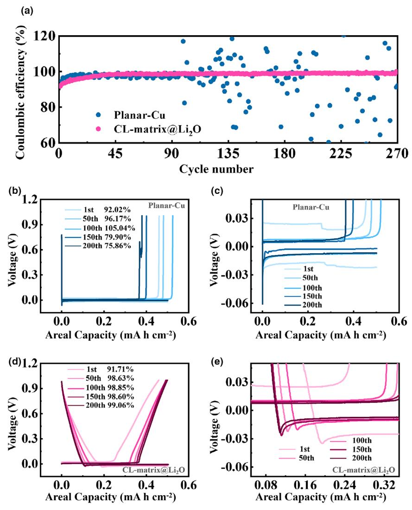
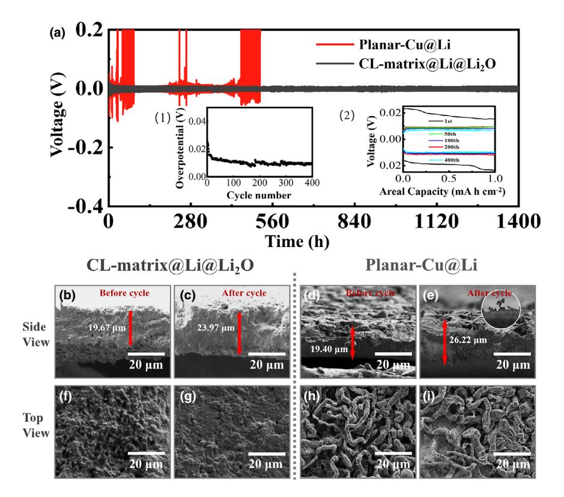
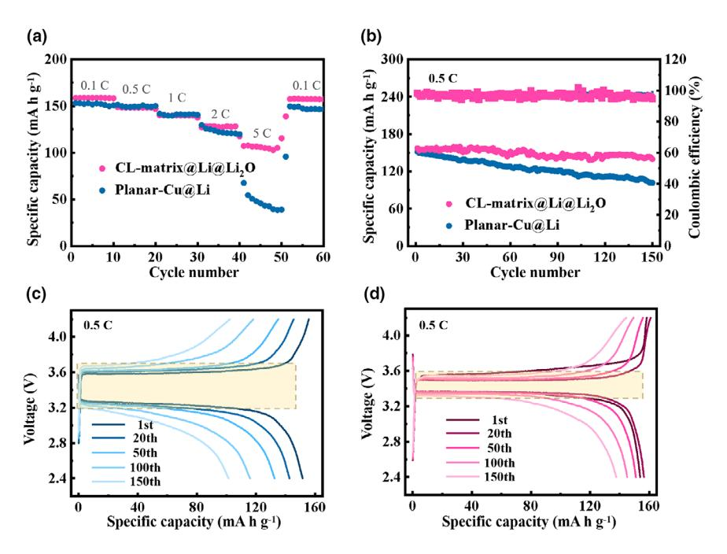

# Lithiophilic Cu-Li2O matrix on a Cu Collector to Stabilize Lithium Deposition for Lithium Metal Batteries

Zhe Gong, Cheng Lian, Pengfei Wang, Kai Huang, Kai Zhu\*, Ke Ye, Jun Yan, Guiling Wang, and Dianxue Cao $*$ 

Lithium metal anode is the most ideal candidate for next-generation energy storage system. However, the uncontrolled dendrite growth, infinite volume expansion, and undesired side reactions lead to serious safety issues and hinder their potential application. Herein, a pre-lithiation strategy is proposed to construct a high-lithiophilic Cu-Li2O matrix on commercial Cu foil. The in situ-generated Li2O promises adequate nucleation sites and strengthens solid electrolyte interphase and lateral lithium deposition. Meanwhile, the existence of 3D matrix reduces the local current density. The synergy effect of Li2O and Cu suppresses the growth of lithium dendrites. As a result, Cu-Li2O matrix reveals an enhanced lithium plating/stripping behavior with Coulombic efficiency of 98.46% after 270 cycles. The symmetrical cell assembled by Li-plated electrodes displays a prolonged lifespan of 1400 h. The work demonstrates a scalable and effective approach for modified current collectors toward stable Li metal anode.

#### 1. Introduction

High-performance lithium-ion batteries attract widespread attentions due to the rapid development of portable electronic equipment and electric vehicles. With research and development of high-capacity cathode materials such as Li-rich metal oxides and sulfur, the commercial graphite anode material (theoretical capacity: 374 mA h  $g^{-1}$ ) is difficult to well match with these cathode materials. Lithium metal anode can provide a high specific capacity (3860 mA h  $g^{-1}$ ) and the lowest reduction potential  $(-3.04 \text{ V} \text{ vs. standard hydrogen electrode})$ .[1-3] Thus, it is considered to be an ideal anode electrode for the nextgeneration high energy density batteries. But its practical application is hindered by rapid capacity decay and potential explosion risk,[4] which is caused by i) the uncontrollable dendrite growth during lithium deposition; ii) large volume expansion of lithium metal; and iii) the

E-mail: caodianxue@hrbeu.edu.cn

State Key Laboratory of Chemical Engineering, School of Chemical Engineering, East China University of Science and Technology, Shanghai 200237. China

 $\bigcirc$  The ORCID identification number(s) for the author(s) of this article can be found under https://doi.org/10.1002/eem2.12243.

DOI: 10.1002/eem2.12243

side reactions between lithium metal and the electrolyte. By adding electrolyte additives and/ or adjusting organic electrolyte, side reaction between electrode and electrolyte could be reduced and the generated solid electrolyte interphase (SEI) is more stable, which could suppress the dendrites growth.[5-9] For example, Sun etc. proposed the trimethylsilyl azide (TSA) as an additive which not only yielded a stable SEI layer but also created a smooth and dendrite-free Li morphology.[10] Modified separator could also guide the uniform deposition of lithium metal.  $[11,12]$  Li etc. developed a functional porous bilayer compose separator combined the lithiophilic hairy polyacrylamide chains and the graphene oxide nanosheets, leading to a reduced the lithium-ion flux on the electrode surface.[13] In addition, designing and constructing suitable lithium metal electrode

can improve the Li ions deposition behavior and kinetics directly, prevent the dendrites growth and reduce the volume change effectively.

To date, considerable strategies are proposed to fabricate a highperformance lithium metal electrode. Introducing an artificial protection layer on lithium anode is an effective approach to suppress the growth of dendrite.[14-16] Unlike the friable original SEI film, artificial protection layer is more stable during the recurrent lithium plating process.[17] Such protection layer is usually ionic conductor, which could be in favor of ion transport and uniform Li ions deposition.[18] However, volume changes of lithium metal lead to internal stress fluctuation and protection layer fell out from the lithium metal anode during continuous lithium plating/striping process. Thus, a further lithium metal design is necessary to solve above issues. Recently, three-dimensional (3D) conductive frameworks are employed as host/current collector for metal anodes.[19-21] The 3D structure relieves the volume change issues, and the conductive skeleton is helpful to regulate uniform Li plating.[22] In addition, the high surface area of 3D host reduces the local current density, which suppresses the growth of lithium dendrites.[23-25] Thus, various of 3D frameworks such as graphene,[26] MXene,  $[27-29]$  and Ni foam[30-32] are applied as host for lithium metal electrode. For example, Wu et al. used nickel foam as the skeleton to construct a lithiophilic structure with multiple scales, which solved the problem of volume expansion of lithium metal.[33] Cu-based current collectors, as the most successful anode current collectors, have the advantages of excellent conductivity, good flexibility, and stability.[34] Sun etc. constructed a 3D Cu nanowire structure that can enable molten lithium infusion into it, and the symmetrical cell could stable run 200 cycles at 10 mA cm $-2$ .[35] However, the inherent lithiophobic

Dr. Zhe Gong, Dr. P. Wang, Prof. K. Zhu, Prof. K. Ye, Prof. J. Yan, Prof. G. Wang, Prof. D. Cao

Key Laboratory of Superlight Materials and Surface Technology of Ministry of Education, College of Materials Science and Chemical Engineering, Harbin Engineering University, Harbin 150001, China

E-mail: kzhu@hrbeu.edu.cn

C. Lian, K. Huang

properties of Cu make it hard to form a strong interaction between Cu and Li. It would result in non-uniform Li ion flux and Li deposition during the long-term cycling. Therefore, a Cu and lithiophilic material composite would be an ideal matrix for high-performance lithium metal anode

CuO is widely known as an anode electrode material for lithium-ion batteries.  $[36-41]$  Here, we use CuO to report a pre-lithiation strategy to construct a matrix of Li2O and Cu. The lithium metal anode is further prepared by plating lithium on the matrix. After electrochemical prelithiation, the 3D-CuO nanowires array is transformed into a Cu-Li2O matrix covered with a Li2O-rich SEI film (CL-matrix@Li2O). The in situ-generated Li2O-rich SEI film mitigates the undesirable reactions of lithium. Meanwhile, the 3D Cu-Li2O matrix greatly reduces the nucleation overpotential of lithium metal, which is beneficial to the subsequent lithium metal deposition process. As a result, in the CLmatrix@Li2OllLi half-cell test, an average coulombic efficiency of 98.46% is achieved. The symmetrical cell using Li-plated CLmatrix@Li2O electrode (CL-matrix@Li@Li2O) presents a remarkable stability for  $1400 \text{ h}$  at  $1 \text{ mA cm}^{-2}$ . In addition, assembled with LiFePO4 (LFP), the CL-matrix@Li@Li2OllLFP full cell displays an enhanced cycle stability and rate performance, indicating the potential application of the CL-matrix@Li@Li2O anode.

#### 2. Results and Discussion

The 3D-CuO nanowires array on commercial Cu foil could be massproduced via a facile wet chemical method as shown in **Figure 1a**, b.[42] After immersing commercial Cu foil in the mixture of ammonium persulfate and sodium hydroxide, copper hydroxide nanowires are self-grown on Cu foil. 3D-CuO nanowires arrays are obtained via a heating and dehydration process. The dehydration process of Cu(OH)2 collector was studied by thermogravimetric analysis (Figure S1). The weight of the sample (the pink curve) decreased rapidly at 150 °C, which proved that the Cu(OH)2 began to dehydrate. For complete dehydration, the temperature was increased to 180 °C. When the sample weight no longer changes, the weight reduction value is 3.4%, which is equivalent to the weight of the removed H2O. The chemical reaction of the collector preparation process is as follows:

$$Cu + 4NaOH + (NH4)2S2O8 \rightarrow Cu(OH)2 + 2Na2SO4 +2NH3\uparrow + 2H2O$$
 (1)

$$Cu(OH)2 \rightarrow CuO + H2O$$
 (2)

It should be noticed that the mass of the CuO current collector is lower than that of the traditional Cu current collector due to the dissolution of Cu in the reaction. The composition of the prepared CuO current collector was characterized by X-ray diffraction (XRD) (blue curve). The XRD shows characteristic peaks of Cu and CuO, corresponding to the Cu foil at the bottom and the CuO line at the upper layer, respectively (Figure 1c). The diffraction peaks of monoclinic CuO appear at 35.6° and 38.7°, and the other three high diffraction peaks all point to the copper foil, indicating that the synthesis of impurity-free CuO is successful. Figure 1d displays a top-view SEM image of CuO wires on Cu foil, revealing a high density of wires with diameters in the range of 0.2–1.2  $\mu$ m. The contact angle pictures between the electrolyte with the 3D-CuO current collector and the Planar-Cu current collector are shown in Figure S2. At 100 ms, the contact angle between 3D-CuO and electrolyte is 18.1°, which is much smaller than that of Plane-Cu (49.5°). This result proves that the 3D structure has better wettability to the electrolyte and ensures uniform ion distribution during lithium deposition.

To investigate the electrochemical formation mechanism of CLmatrix@Li2O electrode, a series of charge-discharge test was performed. Figure 1e shows the charging and discharging curves of CuO wires current collector. After charging and discharging three cycles between 0 and 3 V, the collector is cycled between 0 and 1 V. Then, lithium metal is deposited on the collector, and galvanostatic chargedischarge test is carried out at  $1 \text{ mA cm}^{-2}$ . In the initial cycles (0-3 V), a highly reversible conversion reaction occurs as the formula (3- $5)^{[43]}$ 

$$CuO + xLi^{+} + xe^{-} \rightarrow Cu_{1-x}^{II} Cu_{x}^{I} O_{1-x/2} + x/2 Li_{2}O$$
 (3)

$$Cu_{1-x}^{II}Cu_{x}^{I}O_{1-x/2} + (1-x)Li^{+} + (1-x)e^{-} → (1-x)/2Li_{2}O + 1/2Cu_{2}O$$
(4)

$$1/2Cu2O + Li+ + e- \rightarrow Cu + 1/2Li2O$$
 (5)

And CV test was carried out on 3D-CuO (Figure S3). Three pairs of reversible redox reactions can be observed by the CV curve. The reduction peaks  $R_1$ ,  $R_2$ , and  $R_3$  correspond to the formula (3), (4), and (5), respectively. The oxidation peaks  $O_1$ ,  $O_2$ , and  $O_3$  correspond to the reversible reaction of the reduction peaks. The CV curve proves that the mutual conversion of 3D-CuO and Cu-Li2O matrix has good reversibility and stability, thereby ensuring the subsequent deposition of lithium metal. When CuO is discharged to 0 V, it is completely converted into Li2O and Cu. After such a prelithiation process, the Li2O-rich SEI film formed. Then, lithium metal continues to deposit on the Cu wires and lithium metal layer is formed. The nucleation overpotential is the potential difference between the abrupt potential when the current is just applied and the stable potential for further lithium deposition later. The nucleation overpotential is related to the degree of lithium affinity of the electrode and the local current density.[44] The nucleation overpotential of lithium metal on the 3D current collector is 30 mV (the partial enlarged view of Figure 1e). In the subsequent lithium metals plating and stripping process, CL-matrix@Li@Li2O shows smooth profiles without spikes. The gradually decreased overpotential of CLmatrix@Li@Li2O electrode is attributed to the self-regulating effect, and the surface of the electrode is gradually stabilized with the cycling. In contrast, no redox reaction occurs on the Planar-Cu (Figure S4) and the nucleation overpotential on the planar-Cu is 87 mV (the partial enlarged view of Figure S4). Besides, Planar-Cu@Li presents a fluctuation in the subsequent charge-discharge curves. Compared with planar-Cu, the stable curve of the 3D current collector indicates the stability of its surface.

XPS (Figure 1f,g, and Figure S5) was employed to further confirm the surface chemical components of the electrodes at some state in Figure 1e. When charged to 3.0 V (the pentagonal mark in Figure 1e), the peak of Li 1s at 55.2 eV belongs to  $\text{Li}_2\text{CO}_3$ .[45–48] In the Cu 2p, the copper element mainly exists in the form of atomic and divalent copper (Figure S5a). When the cell charged to 1 V (the square mark of Figure 1e), the component was characterized by XRD (the pink curve of Figure 1c). The XRD curve shows that the peak of CuO on the original

Figure 1. a) The preparation process of the CuO wires current collector. b) Optical photograph of largescale CuO current collector. c) XRD pattern of CuO current collector at different cycle state. d) SEM image of CuO wires current collector. e) Voltage-time curves of CuO current collector. The XPS curves of f) charging to 3 V at the pentagram mark and g) depositing Li at the triangle mark of Figure 1e. h) The high multiple SEM and mapping of a Cu wire at the square mark of Figure 1e.

collector disappears due to the conversion reaction from CuO to Cu and Li2O. Mapping is carried out after Cu wires are discharged to 0 V, and Figure 1h shows the element distribution results of Cu and O. Element Cu mainly exists in the core part, and O is evenly distributed on the all shell part due to the uniform formation of SEI film on the surface of the Cu-Li2O matrix. In addition, the surface chemical composition of the 3D current collector after lithium depositing (the triangle mark of Figure 1e) was also characterized by XPS. The Li element in the figure mainly exists in the form of  $Li_2CO_3$  and  $Li_2O$ , which indicates the form of Li2O-rich SEI film (Figure 1g). Such a SEI film could play a surface protection role in the process of plating and stripping of lithium metal, which reduces lithium bulk expansion and inhibits the direct contact of lithium with electrolyte.

A schematic diagram of the discharge process of a CuO wire is shown in **Figure 2a**. The CuO crystal particles of a CuO wire are tightly bound in the initial state. As the degree of discharge deepens to  $0\ \mbox{V,}$  $\mathrm{Li}_2\mathrm{O}$  and a large number of Cu particles are formed under electrochemical driving.  $^{[49-51]}$  The Cu-Li $_{2}\mathrm{O}$  matrix is prepared and a Li $_{2}\mathrm{O}$ -rich SEI film is formed on the surface. Although Li2O in the SEI film is electronically insulating, the SEI film has ion conductivity. Then, the Cu particles rich in the matrix provide the electron transfer path. After passing through the SEI film, Li+ can be converted into Li by contacting with the conductive matrix. In order to understand lithium deposition behavior on different substances, theoretical calculations are carried out (Figure 2b). The calculation results demonstrate that the adsorption energy of CuO to Li  $(-3.33 \text{ eV})$  before deposition is greater than that of Cu to Li  $(-1.97 \text{ eV})$ . After the CuO is reduced to Cu, the formed  $Li_2O$  has greater adsorption energy (-6.53 eV) for lithium than that of CuO. The result suggests that Li2O can tightly absorb lithium and it is beneficial to uniform deposition of lithium.

Scanning electron microscope was employed to characterize the deposition morphology of Planar-Cu and CL-matrix@Li2O current collectors with different lithium deposition capacities (Figure  $2c-h$ ). When the deposition capacity is 0.5 mA h cm $-2$ , the surface of Planar-Cu is mainly mossy-like lithium metal deposition (Figure 2c). The planar-Cu surface before the cycle is flat and has poor wettability to the electrolyte, which is not conducive to the uniform deposition of the initial lithium metal, thus forming moss-like lithium. With the deposition capacity increases to  $2 \text{ mA h cm}^{-2}$ , it is observed that a large number of lithium dendrites appear on the surface of Planar-Cu (Figure  $2d,e$ ). It is due to the continuous growth of metallic lithium on the surface of the mossy lithium, which cause safety hazards. In contrast, a thin film of lithium on the surface of the Cu wire where  $0.5 \text{ mA h cm}^{-2}$ lithium is deposited (Figure 2f). Then, the lithium deposition capacity increases from 1 mA h cm $-2$  (Figure 2g) to 2 mA h cm $-2$  (Figure 2h) and the copper wires gradually thickens, and a ridge structure of metallic lithium forms which is easily distinguished from the smooth lithium dendrites. For CL $matrix(\hat{a})$ Li2O, the presence of nanowires

increases the wettability with the electrolyte to ensure the uniform distribution of ions, which is beneficial to the nucleation of lithium metal

Figure S6 shows the 3D current collector morphology changes in a large area and capacity. When the deposition capacity of lithium metal is 0.5 mA h  $\rm{cm}^{-2}$ , there are a lot of unfilled voids in CL-matrix@Li2O "forest" (Figure S6a). The voids decrease as the capacity of lithium deposition increases to 2 mA h  $\text{cm}^{-2}$  (Figure S6b). Then, the lithium metal is deposited to 4 mA h  $\text{cm}^{-2}$  and stripped to 3.5 mA h  $\text{cm}^{-2}$ , and some hill-like lithium gradually appears on its surface (Figure S6c). Subsequently, the lithium on the electrode surface is stripped to 2 mA h cm-2, and its surface was substantially horizontal (Figure S6d). The SEM result suggests that the surface of CLmatrix@Li@Li2O gradually self-regulates to flat during the process of lithium metal plating and stripping.

To evaluate lithium metal plating and stripping ability of Planar-Cu and CL-matrix@Li2O current collectors, coulombic efficiency (CE) was tested.[52–55] CL-matrix@Li2O shows a high CE of 98.46% at 0.25 mA cm $-2$  (**Figure 3a**). Even at high current densities of 1 and  $5 \text{ mA cm}^{-2}$  (Figures S9, S10), the coulombic efficiency of CLmatrix@Li2O can still reach 97.77% and 95.96%, respectively. The CE of the 3D current collector gradually rises, corresponding to the gradual homogeneity of the electrode. As shown in Figure 3a, the Coulomb efficiency of Planar-Cu is relatively stable for the first several cycles, and in the subsequent cycles, it has an efficiency much greater or less than 100%. The impedance of the two current collectors at the initial stage was tested (Figure S11), and the equivalent circuit diagram is

**Figure 2.** a) Schematic of Li depositing on a CuO wire. b) Schematic diagram of adsorption energy calculation. SEM images of Planar-Cu and CL-matrix@Li2O with a lithium deposition capacity of c, f) 0.5 mA h cm-2, d, g) 1 mA h cm-2, and e, h) 2 mA h cm-2.

shown in Figure S12. Rs in the equivalent circuit diagram is the solution resistance, and it remains basically unchanged when the number of cycles is small, and Rct is the charge transfer resistance. The values of  $R_{\varsigma}$ and Rct are listed in Table S1. The Rct corresponding to CL-matrix@Li2O was 145.7  $\Omega$  after the first cycle and decreases to 77.0  $\Omega$  and 56.9  $\Omega$  after the 5th and 20th cycles, respectively. In contrast, the impedance of Planar-Cu increases significantly after the 20th cycle. It is related to dead lithium and by-products produced during repeated lithium plating/stripping processes on the Planar-Cu surface.

In order to better observe the plating and stripping ability of the two current collectors, voltage-areal capacity profiles of Planar-Cu and CLmatrix@Li2O are showed in Figure 3b–e. Five different cycle number corresponding to the two current collectors are selected respectively. In Figure 3, it was showed that the voltage curves corresponding to plating/stripping half cycles are prominently diverse in the cases of Planar-Cu and CL-matrix@Li2O. For Planar-Cu, it has no reversible redox capacity, and the plating process of lithium metal is the direct Li ion plating. Thus, the voltage drops sharply at the beginning of discharge, leading to a perpendicular curve (Figure 3b). When the lithium metal is subsequently plated, the voltage is maintained. At the beginning of charging, the Li ions are stripped from the electrode, and the voltage remains unchanged. When the striping process finishes, the voltage would suddenly increase. In contrast, for CL-matrix@Li2O, the voltage would decrease gradually at the beginning of the plating process and increase gradually at the end of the stripping process due to the reversible conversion reaction of CL-matrix@Li2O (Figure 3d). The efficiency of Planar-Cu is greater than 100% at the 100th cycle. It is due to the reconnection of the "dead" lithium that was previously disconnected from the copper foil, and the "dead" lithium was reused. The efficiencies of the subsequent 150th and 200th cycles of planar copper are

both less than 80%, which is due to some irreversible lithium consumption caused by the generation of lithium dendrites and the side reaction of the electrolyte with lithium. The degree of lithiophility of the current collector is negatively correlated with the magnitude of the nucleation overpotential measured in the experiment. The good lithiophility would lead to small nucleation overpotential. The average nucleation overpotential of planar copper is about 50 mV (Figure 3c). The loose bond between lithium and Planar-Cu causes the dead lithium to be often disconnected from the copper foil. Therefore, the leakage of copper will increase the conductivity, and the deposition overpotential is not fixed. It is observed that the efficiency of CLmatrix@Li2O is basically stable and close to 100% after 50 cycles, which proves that side reactions rarely occur in the process of lithium plating/stripping, and there is no additional lithium loss. The average nucleation overpotential of CL-matrix@Li2O is about 10 mV and its deposition overpotential is basically stable at 9 mV, which indicates the stability of its surface and electrode structure (Figure 3e). The CLmatrix@Li2O displays a small nucleation overpotential due to its good lithiophility.

To observe the cycling stability of electrodes, symmetrical cells were assembled. As shown in the voltage-time curves (Figure 4a), CLmatrix@Li@Li2O has cycled stably for 1400 h without a large overpotential at 1 mA cm-2. The overpotential of CL-matrix@Li@Li2O symmetrical cell is basically stable at 10 mV (Figure 4a1,a2). Similar phenomenon can also be observed at 3 mA  $\text{cm}^{-2}$  (Figure S13) and  $5 \text{ mA cm}^{-2}$  (Figure S14). The symmetrical cells can cycle stably for 1100 h at 3 mA  $\rm cm^{-2}$  and 560 h at 5 mA  $\rm cm^{-2}.$  However, voltage protection appears due to excessive overpotential after Planar-Cu@Li cycled for 520 h at 1 mA cm-2. In addition, according to previous reports, the Li2O layer will form on the surface of lithium during cycling at high temperatures and protect the electrode.[56,57] Inspired by it, we conducted charge and discharge tests of two kinds of symmetrical cells at high temperature (Figure S15). At high temperature, the Planar-Cu@Li@Li2O structure was formed on planar-Cu. It has better cycle stability than that at room temperature, which proves that the amount of Li2O in the SEI film is beneficial to the stable operation of the battery.

To investigate the regulation effect of the electrode on metal anode electrode, SEM was carried to characterize the electrode morphology before and after the cycle. From the side views, the CLmatrix@Li@Li2O (Figure 4b) shows a similar thickness (19.67  $\mu$ m) with Planar-Cu@Li (Figure 4d, 19.40 µm) before cycling. After 200 cycles, the thickness of (Figure 4c, 23.97  $\mu$ m) is smaller than that of Planar-Cu@Li (Figure 4e, 26.22 µm) due to more loose dendrites and dead lithium generation on planar structure. From the top view, the convex structure of Cu wires can be discovered on CLmatrix@Li@Li2O electrode before cycles and the top view is flat after 200 cycles (Figure 4f,g), which is related to the self-regulating effect on the electrode surface. The top views of Planar-Cu@Li are shown in Figure 4h, and it can be seen that the initial state of lithium metal

**Figure 3.** a) CE of Planar-Cu and CL-matrix@Li2O at 0.25 mA cm-2. Voltage-areal capacity profiles of b, c) Planar-Cu and d, e) CL-matrix@Li2O at 0.25 mA cm-2.

deposition is a zigzag and fluffy structure. Due to the uneven deposition and stripping of lithium metal, Planar-Cu is exposed (Figure 4i) and more dendritic lithium (the insert map of Figure 4e) appears in some areas after 200 cycles. The difference morphologies between the two kinds of electrodes due to the presence of 3D-Cu uniform the electric field distribution and reduce the local current density. In addition, the large adsorption energy of Li2O on Li makes lithium nucleation easier. The synergy of the Li2O and the 3D structure enable the anode to achieve surface self-regulation during repeated charging and discharging.

To confirm the potential application CL-matrix@Li@Li2O as anode for lithium metal batteries, LFP was employed as cathode. CLmatrix@Li@Li2OllLFP full cells were assembled, and the Planar-Cu@Li electrodes were used to assemble full cells control samples. Figure 5a shows rate performance of the Planar-Cu@LillLFP full cell and the CLmatrix@Li@Li2OllLFP full cell. The CL-matrix@Li@Li2OllLFP full cell presents a specific capacity of 159, 149, 139, 128, and 105 mA h g-1 at 0.1, 0.5, 1, 2, and 5 C, respectively. In contrast, the Planar-Cu@Lill

LFP full cell shows a capacity of 153, 150, 139, 122, and 43 mA h  $g^{-1}$  at 0.1, 0.5, 1, 2, and 5 C, respectively. The charge and discharge curves of different anodes are shown in Figures S16, S17. When charging and discharging under a current from  $0.1$  C to  $5$  C, the voltage gap of the CL-matrix@Li@Li2OllLFP cell increases from  $0.05$  to  $0.5$  V. However, in the same process, the voltage gap of the Planar-Cu@LillLFP cell increases from 0.1 to 1.3 V. It demonstrates that the CL-matrix@Li@Li2O electrode can effectively reduce the voltage gap, especially under the high current density. Cycle performance of the CLmatrix@Li@Li2OllLFP and the Planar-Cu@Lill LFP cells is revealed in Figure 5b. The CLmatrix@Li@Li2OllLFP cell shows an average CE of 98.3% and a capacity retention rate of 90.0% after 150 cycles, which are 96.7% and 66.9% for Planar-Cu@LillLFP cell, respectively. Compared with the latter, the former has better cycle performance. At the same time, it can be observed that the polarization of CLmatrix@Li@Li2OllLFP cells is lighter than that of **0.6** Planar-Cu@LillLFP cells, and the capacity attenuation is slower (Figure 5c,d). In order to test the self-discharge behavior, the Planar-Cu@LillLFP cell and the CL-matrix@Li@Li2OllLFP cell were assembled. And the cells were first charged to  $4.2\ \mathrm{V}$  at  $0.5\ \mathrm{mA\ cm}^{-2}$  and discharged to  $2.4\ \mathrm{V}$ at 0.5 mA cm $-2$  after standing for 24 h in an open circuit. The capacity loss of the CLmatrix@Li@Li2OllLFP cell and the Planar-Cu@LillLFP cell after standing for 24 h is 6.35% and 18.4%, respectively (Figure S18). The smaller capacity loss suggests that the CLmatrix@Li@Li2O anode can reduce the selfdischarge. For the planar-Cu current collector, the exposed Cu surface would result in fast Li corrosion and self-discharge. Meanwhile, the fluffy deposited Li on the Cu current collector results in a large contact area between Li and

electrolyte and aggravates self-discharge.[58-60] In contrast, the generation of Li2O-rich SEI film of CL-matrix@Li2O current collector would protect the Cu surface and lead to reduced self-discharge.[61] Meanwhile, the dense and smooth deposited Li on CL-matrix@Li2O current collector displays a smaller contact area between Li and electrolyte than that of bare Cu current collector, weakening the self-discharge behavior. Thus, the CL-matrix@Li@Li2OllLFP cells display a weaker selfdischarge behavior than that of Planar-Cu@LillLFP cells. Besides, the Planar-Cu@LillLFP cell and the CL-matrix@Li@Li2OllLFP cell before and after aging for five days were tested with a current density of 0.34 mA  $mg^{-1}$ (2 C). As shown in Figure S19, the CLmatrix@Li@Li2OllLFP cell is still stable after aging, and the capacity retention rate is 98.4% after 100 cycles. The cyclic stability of Planar-Cu@LillLFP after aging is greatly reduced, its capacity decays rapidly after 40 cycles, and the capacity retention rate is 30.7% after 100 cycles. The result proves that the CL-matrix@Li@Li2O still has good stability after aging, and the dissolution of lithium metal causes the capacity retention rate of the Planar-Cu@Li to decrease sharply after aging. In

**Figure 4.** a) Voltage–time curves at 1 mA cm $-2$  (a1. Cycle number-overpotential profile. a2. Voltage profiles at different cycle numbers.). b, c) Side view and f, g) top view of CL-matrix@Li@Li2O before and after two hundred cycles. d, e) Side view and h, i) top view of Planar-Cu@Li before and after two hundred cycles. (The insert map of Figure 4e shows the lithium dendrite observed on the Planar-Cu@Li.).

**Figure 5.** a) Rate performance of Planar-Cu@LillLFP cell and CL-matrix@Li@Li2OllLFP cell. b) Cycle performance of Planar-Cu@LillLFP cell and CL-matrix@Li@Li2OllLFP cell at 0.5 C. c, d) Voltage curves of Planar-Cu@LillLFP cell and CL-matrix@Li@Li2OllLFP cell cycled in different cycle numbers at 0.5 C.

addition, full cells were assembled using LFP cathodes  $\quad\text{with}\quad$ larger capacity  $(2.1 \text{ mAh cm}^{-2})$ , and the cycle performance was tested. As shown in Figure S20, the CLmatrix@Li@Li2OllLFP cell remains stable during 100 cycles, but the capacity of the Planar-Cu@LillLFP cell decays rapidly after 80 cycles. The voltage gap under large capacity has also been studied. Comparing the charge and discharge voltage curves of the two cells in the 100th cycle, the voltage gaps of CLmatrix@Li@Li2O and Planar-Cu@Li are 0.48 and  $0.6$  V, respectively (Figure S21). This result further confirms that the CLmatrix@Li@Li2O electrode can still effectively polarization. Therefore,  $s$ unnress  $\mathsf{CI}$ matrix@Li@Li2OllLFP full cells have better electrochemical performance than that of Planar-Cu@LillLFP full cells, proving its practical application potential.

## 3. Conclusion

In summary, this work demonstrated a prelithiation strategy to prepare the 3D current collector with lithiophilic Cu-Li2O matrix. The CL-matrix@Li@Li2O symmetrical cells show lower overpotential and longer lifespan stability than that of Planar-Cu@Li due to prevent dead lithium generation on the surface. The 3D Cu-Li2O matrix homogenizes lithium-ion flux, ensuring excellent conductivity. Li2O promises adequate nucleation sites and enhances the stability of SEI film, leading to uniform deposition of lithium and lateral lithium growth. In addition, the CLmatrix@Li@Li2O structure can accomplish a self-regulated smooth surface during alternating lithium plating/stripping process. Moreover, CL-matrix@Li@Li2OllLFP full cell present enhanced cycling performance and good rate ability, demonstrating a potential application of CL-matrix $@Li@Li_2O$  as lithium metal anode

## 4. Experimental Section

Synthesis of CL-matrix@Li2O current collector: Firstly, the Cu foil was ultrasonic treated with acetone for 3 min to remove the surface impurity. Then, it was treated with 0.5 M hydrochloric acid to remove the oxide film on the copper surface. After rinsing with deionized water, the hydrochloric acid was removed. Subsequently, 5 M sodium hydroxide solution and 0.1 M ammonium persulfate solution were mixed with volume ratio of one to one. The treated copper foil was soaked in solution and took out after 2 h and washed several times with deionized water. A 3D-CuO current collector was prepared by heating in an oven for 3 h at 180  $^{\circ}$  to dehydrate. The 3D-CuO as a cathode was assembled with lithium metal anode and then was prepared by discharge. CLmatrix@Li2O was continued deposited lithium metal, which was named CLmatrix@Li@Li2O. And the Cu foil electrode after depositing lithium metal was named Planar-Cu@Li.

Characterization: The thermogravimetric (TG) analyzer was used to determine the change of sample mass with temperature in the atmosphere. The temperature of TG analysis was increased from room temperature to 180 °C at 10  $\textdegree$ C min-1 and kept at 180  $\textdegree$ C to 75 min. The crystal form of the current collectors was characterized by X-ray diffractometer (XRD) with acceleration current 150 mA and Cu target  $K\alpha$  ray under acceleration voltage 40 kV. The morphology of the current collectors was observed by scanning electron microscope (SEM). The surface chemical components of the electrodes were tested by X-ray photoelectron spectroscopy (XPS).

*Electrochemical measurements:* The efficiency and galvanostatic cycling were carried out at room temperature with NEWARE system. The CR2032-type coin cells were assembled in the glove box filled with argon. The Celgard diaphragms were used to isolate anodes and cathodes. The counter/reference electrode was lithium foil. The electrolyte was 1 M lithium bis(trifluoromethanesulfonyl) imide (LiTFSI) in 1,3-dioxolane (DOL)/ 1,2-dimethoxyethane (DME) (1:1 by volume) with 1% LiNO3 additive. EC laboratory was used to test cyclic voltammetric (CV) and impedance. The sweep speed of the CV test was 1 mV  $s^{-1}$ , and the voltage range was 0–3 V. The amplitude of impedance test was 5 mV, and the frequency ranges from 10 mHz to 100 kHz. Before all tests, cells were charged and discharged at 0-1 V for five times at 0.05 mA to stabilize SEI and remove surface impurities. For coulombic efficiency test, the cutoff voltage was 1 V, and the discharge capacity and current were changeless. 3 mA h  $\text{cm}^{-2}$  lithium was predeposited and then galvanostatic cycling test was carried out for the symmetrical cell. To assemble full cells, LiFePO4 was cast on an Al foil as cathode. The mass ratio of Super P, PVDF, and LFP is 1: 1: 8, and the cathode was dried at 80  $\,^{\circ}$  under vacuum for 10 h. The cathodes with the capacity of 0.85 and 2.1 mA h  $cm^{-2}$ were used for the full cell assembling. 3 mA h  $\rm cm^{-2}$  lithium was deposited on a current collector as anode. Full cells were charged and discharged from 2.4 to 4.2 V, and they were tested under 0.1 C, 0.5 C, 1 C, 2 C, and 5 C to rate performance (1 C = 170 mA  $g^{-1}$ ).

Theoretical Calculation: We cleaved and established 7.7  $\mathring{A} \times 10.2 \mathring{A}$ , 8.3 Å  $\times$  11.8 Å, and 6.0 Å  $\times$  7.9 Å periodic slabs for Cu (111), CuO (111), and  $Li_2O$  (111) crystal planes, respectively. The vacuum layer of slab is 20 Å in the zaxis. The Cu (111), CuO (111), and Li2O (111) are used with a  $4 \times 3 \times 3$ ,  $4 \times 4 \times 2$ , and  $5 \times 2 \times 3$  atom slab, respectively. The structures of the face center cubic Cu, monoclinic CuO, and face center cubic Li2O are generated from the standard structures in the Material Studio software. The thickness of CuO (111),  $Li_2O$  (111), and Cu (111) surface is 3.08, 3.37, and 4.17 Å respectively. We chose the cutoff energy at 400 eV with  $1\times2\times1$  k-point mesh for CuO (111) and  $2 \times 2 \times 1$  k-point mesh for Cu (111) and Li2O (111). The lattice constants are obtained from the structure library provided with Material Studio software. The PBE method with polarized spin is used to establish exchange correlation functionals. Energy tolerances are calculated as the energy change per atom. The selfconsistent iteration is considered to converge when the change in energy is lower than  $1\times10^{-5}$  eV. We choose reciprocal space representations of the ultrasoft pseudopotentials. The minimization is considered to be in equilibrium when the change of energy, maximum force, and maximum displacement are lower than  $1\times10^{-5}$  eV, 0.03 eV  $\mathring{A}^{-1}$ , and 0.001 Å, respectively. The adsorption energy (Ea) of one lithium atom is given by:

$$E_a = E_{total} - E_{surf} - E_{Li}$$
 (5)

where  $E_{total}$  is the energy of the system when a lithium atom is adsorbed,  $E_{surf}$  is the energy of Cu (111), CuO (111), and Li2O (111), and  $E_{Li}$  is the energy of a lithium atom.

#### Acknowledgements

This work was supported by the Heilongjiang Province Marine New Energy and Protective Materials Engineering Technology Research Center (002100130630D), Natural Science Foundation of Heilongjiang (LC2018004), China Postdoctoral Science Foundation (2018M630340 and 2019T120254), and the Fundamental Research Funds for the Central University.

### **Conflict of Interest**

The authors declare no conflict of interest.

## **Supporting Information**

Supporting Information is available from the Wiley Online Library or from the author.

#### **Keywords**

Cu-Li2O matrix, current collectors, Li metal anodes, SEI film

Received: April 7, 2021 Revised: June 25, 2021 Published online: June 29, 2021

- [1] J. Ding, R. Xu, N. Yao, X. Chen, Y. Xiao, Y. Yao, C. Yan, J. Xie, J. Huang, Angew. Chem. Int. Ed. Engl. 2021, 60, 11442–11447.
- [2] R. Hu, Y. Fang, X. Liu, K. Zhu, D. Cao, J. Yi, G. Wang, Chem. Res. Chin. Univ. 2021, 37, 311-317.
- [3] Z. Cao, Y. Zhang, Y. Cui, J. Gu, Z. Du, Y. Shi, K. Shen, H. Chen, B. Li, S. Yang, Energy Environ. Mater. 2021. https://doi.org/10.1002/eem2.12165
- [4] R. M. Kasse, N. R. Geise, J. S. Ko, J. Nelson Weker, H. Steinrück, M. F. Toney, J. Mater. Chem. A **2020**, 8, 16960–16972.
- [5] C. Yan, H. Yuan, H. Park, J. Huang, J. Energy Chem. **2020**, 47, 217–220.
- [6] H. Chen, D. Lin, J. Xie, A. Yang, J. Xu, K. Lin, J. Wang, H. Wang, F. Shi, D. Boyle, Y. Cui, Adv. Energy Mater. 2019, 9, 19700080.
- [7] D. Chen, L. Zhong, S. Wang, M. Xiao, D. Han, Y. Meng, Adv. Funct. Mater. 2019, 30, 1907717.
- [8] C. Yan, H. R. Li, X. Chen, X. Q. Zhang, X. B. Cheng, R. Xu, J. Q. Huang, Q. Zhang, J. Am. Chem. Soc. **2019**, 141, 9422–9429.
- [9] R. Xu, C. Yan, J. Huang, Trends Chem. 2021, 3, 5–14.
- [10] S. J. Park, J. Y. Hwang, Y. K. Sun, J. Mater. Chem. A 2019, 7, 13441–13448
- [11] Y. Li, X. Li, Y. Pan, M. Wang, J. Chen, H. Xu, Y. Huang, L. Lau, A. Shan, J. Zheng, D. Mitlin, J. Mater. Chem. A 2019, 7, 21349-21361.
- [12] Y. Liu, J. Wang, X. Jiao, S. Li, C. Zhang, Z. Song, J. Song, Energy Storage Mater. 2018, 19, 24-30.
- [13] C. Li, S. Liu, C. Shi, G. Liang, Z. Lu, R. Fu, D. Wu, *Nat. Commun.* **2019**, *10*, 1363.
- [14] G. Wang, C. Chen, Y. Chen, X. Kang, C. Yang, F. Wang, Y. Liu, X. Xiong, Angew. Chem. Int. Ed. Engl. 2020, 59, 2055–2060.
- [15] R. Xu, X. Shen, X. Ma, C. Yan, X. Zhang, X. Chen, J. Ding, J. Huang, Angew. Chem. Int. Ed. Engl. 2021, 60, 4215–4220.
- [16] K. Li, Z. Zhu, R. Zhao, H. Du, X. Qi, X. Xu, L. Qie, *Energy Environ. Mater.* 2021. https://doi.org/10.1002/eem2.12181
- [17] Y. Zhang, G. Wang, L. Tang, J. Wu, B. Guo, M. Zhu, C. Wu, S. Dou, M. Wu, J. Mater. Chem. A **2019**, *7*, 25369–25376.
- [18] J. M. Zheng, M. Gu, H. Chen, P. Meduri, M. H. Engelhard, J. G. Zhang, J. Liu, J. Xiao, J. Mater. Chem. A **2013**, 1, 8464–8470.
- [19] P. Zhai, Y. Wei, J. Xiao, W. Liu, J. Zuo, X. Gu, W. Yang, S. Cui, B. Li, S. Yang, Y. Gong, Adv. Energy Mater. 2020, 10, 1903339.
- [20] S. Dong, Y. Song, Y. Fang, K. Zhu, K. Ye, Y. Gao, J. Yan, G. Wang, D. Cao, Carbon 2021, 178, 1-9.
- [21] X. Liu, Y. Fang, P. Liang, J. Xu, B. Xing, K. Zhu, Y. Liu, J. Zhang, J. Yi, Chinese Chem. Lett. 2021. https://doi.org/10.1016/j.cclet.2021.02.055
- [22] P. Wang, Z. Gong, K. Ye, Y. Gao, K. Zhu, J. Yan, G. Wang, D. Cao, Electrochim. Acta 2020, 356, 136824.

- [23] X. Gao, X. Yang, K. Adair, X. Li, J. Liang, Q. Sun, Y. Zhao, R. Li, T. Sham, X. Sun, Adv. Energy Mater. 2020, 10, 1903753.
- [24] M. Li, X. Liu, Q. Li, Z. Jin, W. Wang, A. Wang, Y. Huang, Y. Yang, J. Energy Chem. 2020, 41, 27–33.
- [25] B. Liu, G. Pan, C. Ai, S. Deng, S. Liu, Q. Liu, X. Wang, X. Xia, J. Tu, J. Mater. Chem. A 2019, 7, 21794–21801.
- [26] H. Y. Yu, X. Song, W. Wang, Z. Hou, X. Zhao, K. Deng, H. Ju, Y. Su, Y. Zhao, Y. Lu, Z. Quan, Electrochim. Acta 2018, 194, 413–422.
- [27] W. C. Xiong, X. Peng, Y. Guo, S. Xu, T. S. Zhao, J. Mater. Chem. A 2020, 8, 14114–14125.
- [28] Y. Fang, Y. Zhang, K. Zhu, R. Lian, Y. Gao, J. Yin, K. Ye, K. Cheng, J. Yan, G. Wang, Y. Wei, D. Cao, ACS Nano 2019, 13, 14319–14328.
- [29] J. Gu, Q. Zhu, Y. Shi, H. Chen, D. Zhang, Z. Du, S. Yang, ACS Nano 2020, 14, 891–898.
- [30] F. Zhao, W. Denga, Z. Liu, Nano Energy 2019, 62, 55–63.
- [31] Z. Wen, Y. Peng, J. Cong, H. Hua, Y. Lin, J. Xiong, J. Zeng, J. Zhao, Nano Research 2019, 12, 2535–2542.
- [32] H. Kang, S. Woo, J. Kim, S. Lee, D. Lee, J. Yu, J. Power Sources 2019, 413, 467–475.
- [33] K. Wu, C. Yang, Q. Wang, W. Liu, H. Zhou, J. Energy Chem. 2019, 43, 16–23.
- [34] W. Zhang, H. Jin, C. Xu, S. Zhao, J. Zhang, J. Power Sources 2019, 440, 227142.
- [35] K. R. Adair, M. Iqbal, C. Wang, Y. Zhao, M. Banis, R. Li, L. Zhang, R. Yang, S. Lu, X. Sun, Nano Energy 2018, 54, 375–382.
- [36] Z. L. Zhang, H. Chen, X. L. She, J. Sun, J. Teo, F. B. Su, J. Power Sources 2012, 217, 336–344.
- [37] P. Wang, X. Gou, S. Xin, F. F. Cao, New J. Chem. 2019, 43, 6535–6539.
- [38] J. C. Park, J. Kim, H. Kwon, H. Song, Adv. Mater. 2009, 21, 803–807.
- [39] K. F. Chen, S. Y. Song, D. F. Xue, Cryst. Eng. Comm. 2013, 15, 144–151.
- [40] H. Park, S. Lee, M. Jo, S. Park, K. Kwon, M. K. Shobana, H. Choe, J. Ko. Ceram. Soc. 2017, 54, 438–442.
- [41] A. Li, H. H. Song, W. B. Wan, J. S. Zhou, X. H. Chen, Electrochim. Acta 2014, 132, 42–48.
- [42] B. C. Chen, Y. Y. Dong, S. Y. Li, Z. H. Jiang, Y. J. Wang, L. F. Jiao, H. T. Yuan, J. Power Sources 2016, 320, 20–27.

- [43] S. Jia, Y. Wang, X. Liu, S. Zhao, W. Zhao, Y. Huang, Z. Li, Z. Lin, Nano Energy 2019, 59, 229–236.
- [44] C. Wei, H. Fei, Y. An, Y. Tao, J. Feng, Y. Qian, J. Mater. Chem. A 2019, 7, 18861–18870.
- [45] C. Zhang, W. Lv, G. Zhou, Z. Huang, Y. Zhang, R. Lyu, H. Wu, Q. Yun, F. Kang, Q. H. Yang, Adv. Energy Mater. 2018, 8, 1703404.
- [46] X. Wang, Y. Liu, Y. Wang, L. Jiao, Small 2016, 12, 4865–4872.
- [47] R. Dang, X. Jia, X. Liu, H. Ma, H. Gao, G. Wang, Nano Energy 2017, 33, 427–435.
- [48] J. Luan, Q. Zhang, H. Yuan, D. Sun, Z. Peng, Y. Tang, X. Ji, H. Wang, Adv. Sci. 2019, 6, 1901433.
- [49] S. Cho, J. W. Jung, C. Kim, D. Kim, Sci. Rep. 2017, 7, 45105–45114.
- [50] P. Balaya, H. Li, L. Kienle, J. Maier, Adv. Funct. Mater. 2020, 13, 621–625.
- [51] H. Kim, W. Choi, J. Yoon, J. Um, W. Lee, J. Kim, J. Cabana, W. S. Yoon, Chem. Rev. 2020, 14, 6934–6976.
- [52] H. Yuan, J. Nai, H. Tian, Z. Ju, W. Zhang, Y. Liu, X. Tao, X. W. Lou, Sci. Adv. 2020, 6, eaaz3112.
- [53] H. Gan, J. Wu, H. Chena, R. Li, H. Liu, J. Mater. Chem. A 2020, 8, 13480–13489.
- [54] L. Xiao, Z. Zeng, X. Liu, Y. Fang, X. Jiang, Y. Shao, L. Zhuang, X. Ai, H. Yang, Y. Cao, J. Liu, ACS Energy Lett. 2019, 4, 483–488.
- [55] H. Yuan, J. W. Nai, Y. J. Fang, G. Lu, X. Tao, X. W. Lou, Angew. Chem. Int. Ed. 2020, 59, 15839–15843.
- [56] K. Yan, J. Wang, S. Zhao, D. Zhou, B. Sun, Y. Cui, G. Wang, Angew. Chem. Int. Ed. Engl. 2019, 58, 11364–11368.
- [57] Y. Xu, H. Wu, Y. He, Q. Chen, J. G. Zhang, W. Xu, C. Wang, Nano Lett. 2020, 20, 418–425.
- [58] Y. Gao, T. Rojas, K. Wang, S. Liu, D. Wang, T. Chen, H. Wang, A. T. Ngo, D. Wang, Nat. Energy 2020, 5, 534–554.
- [59] A. Kolesnikov, M. Kolek, J. F. Dohmann, F. Horsthemke, M. Borner, ¨ P. Bieker, M. Winter, M. C. Stan, Adv. Energy Mater. 2020, 10, 2000017.
- [60] R. Schmuch, R. Wagner, G. Horpel, T. Placke, M. Winter, ¨ Nat. Energy 2018, 3, 267–278.
- [61] D. Lin, Y. Liu, Y. Li, Y. Li, A. Pei, J. Xie, W. Huang, Y. Cui, Nat. Chem. 2019, 11, 382–389.