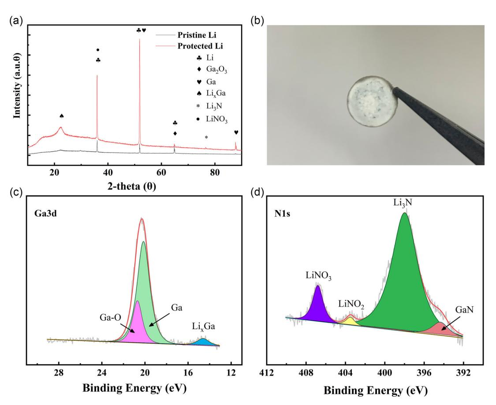
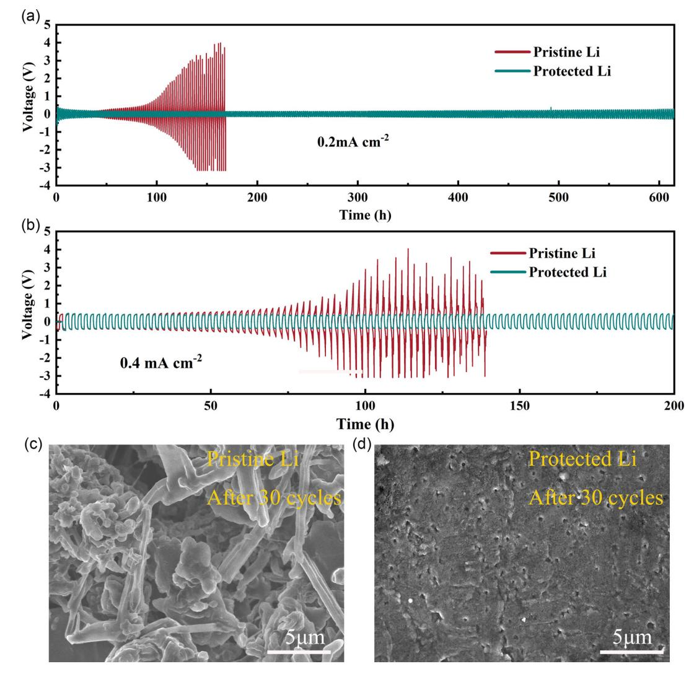
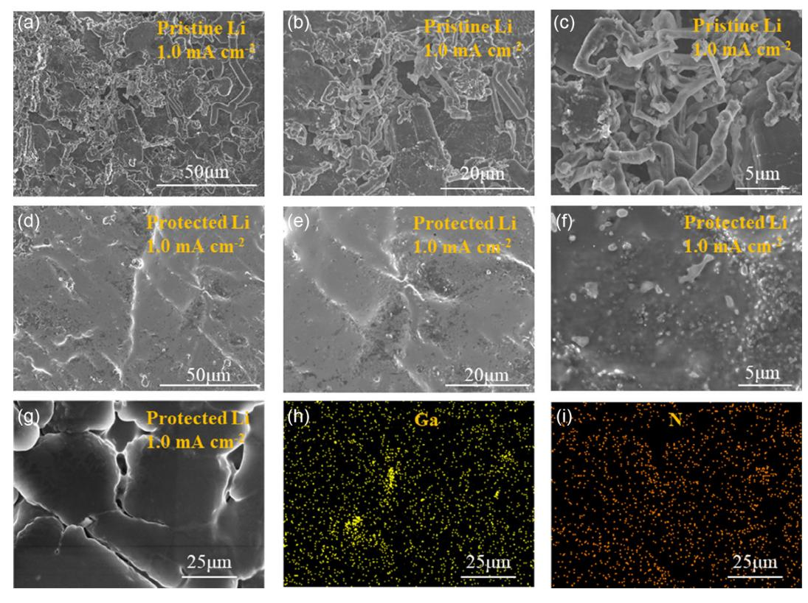
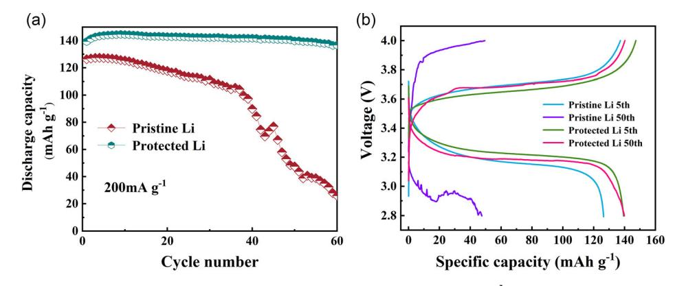

# In Situ-Formed Dual-Conductive Protecting Layer for Dendrite-Free Li Metal Anodes in All-Solid-State Batteries

Yang Wu, Yuchan Zhang, Yongpeng Liu, and Jinkui Feng\*

Lithium metal anode is regarded as one of the most promising electrode materials for high energy-rechargeable batteries. Nevertheless, the utilization of lithium metal anode suffers from the detrimental lithium dendrite growth caused by uneven lithium deposition. Herein, a dual-conductive protecting layer is formed in situ on a lithium metal surface as an artificial solid electrolyte interface, which is composed of electronic-conductive lithiophilic lithium–gallium alloy and lithium-ion-conductive lithium nitride. The protective layer can not only ensure uniform lithium-ion diffusion but also act as a nuclear agent to lower the deposition overpotential. With this artificial solid-electrolyte interface, the dendrite growth of lithium is significantly suppressed. Symmetric half cells and full cells with a modified lithium metal anode exhibit significantly improved electrochemical performance compared with the bare lithium metal anode.

## 1. Introduction

With the advantages of high voltage, high capacity, no memory effect, and low self-discharge rate,[1,2] Li-ion batteries (LIBs) have occupied the largest market share of energy-storage devices. In recent years, due to the development of electric vehicles and portable electronic devices, higher requirements have been put forward for the performance and safety characters of batteries. The current LIBs' performance cannot meet the requirements of future electric vehicles and electronic devices. The commercial graphite anode has a theoretical specific capacity of only 372 mAh  $g^{-1}$ , which limits the development of LIBs. Therefore, searching for higher-specific-capacity anode materials is demanding. As a promising anode material, Li metal anode has attracted much attention in recent years. With a high theoretical specific capacity of  $3860 \text{ mAh g}^{-1}$  and a lowest work potential of  $-3.04 \text{ V}$ ,[3-7] it has become the most eye-catching negative electrode material.

Since the promotion of electric vehicles, safety of LIBs remains a key problem with the accidents of combustion and explosion. In LIBs, electrolyte is an important part of the battery, which is responsible for the ion transfer between the anode and

#### DOI: 10.1002/ente.202100087

the cathode in the battery. It has a vital influence on the capacity, operating temperature, cycling performance, and safety performance of the battery. In contrast to traditional liquid electrolyte, solid-state electrolyte (SSE) has high safety and no leakage risk. $[8-10]$  In recent years, researchers have found several promising ceramic Li-ion conductors such as  $Li_7La_3Zr_2O_{12}$  $(LLZO)$ ,  $\text{Li}_{1.4}\text{Al}_{0.4}\text{Ti}_{1.6}$  $(LATP)$ ,  $\text{Li}_{10}\text{GeP}_2\text{S}_{12}$  (LGPS), etc.[11–13] Compared with these ceramic SSEs, polymer electrolyte such as PEO has better mechanical properties and satisfactory ionic conductivity at higher temperature.[14] The solid polymer electrolyte does not contain any flammable organic solvent, which greatly improves the safety performance.

Moreover, the polymer electrolyte has good flexibility and machinability, which can alleviate the volume change of the electrodes in the cycling process and significantly improve the life and safety performance.

Unfortunately, there are many problems in the practical application of Li metal batteries (LMBs), the most challenging one is the formation of Li dendrites.[15] With the uneven deposition of the lithium, lithium dendrites will form and grow, and eventually pierce the separator of the LMB, causing short circuit and breakdown of the battery.[16] Therefore, it is vital to develop dendritefree Li metal anode for a high-energy and long-cycling LMB. Several solutions have been proposed, such as electrolyte additives,[17,18] high-concentration electrolyte,[19,20] artificial solidelectrolyte interface (SEI) film,[21–25] lithiophilic coating on solid electrolyte surface,  $[26-28]$  a 3D nanoframework to solve this problem,[29-31] and separator modification.[32,33] For example, our group has constructed a lithiophilic Li-based alloy surface layer by coating liquid metal on a Li metal anode.[34] Guo's group developed an artificial SEI layer that could effectively restrain the Li anode from growth of dendrites, which is composed of in situ-generated Li3PO4 from polyphosphoric acid and Li metal.[35] These modification schemes provide new concepts to modify Li metal anodes, and the combination of fast Li+ conductor modification layer and alloy modification layer may show advantages to suppress Li dendrites.[36-39] As previous reported, electronic or Li+ conductors were chosen as artificial SEI for lithium anode, such as Li–Al,[40] Li–Pb,[41] Li–Sn,[42] Li–Zn,[43]  $\text{Li}_2\text{S}$ ,  $^{[44,45]}$   $\text{Li}_3\text{PS}_4$ , and  $^{[46]}$   $\text{Li}_3\text{N}$ .  $^{[47-50]}$  Recently, a novel artificial SEI modification method has been developed with dual-conductive artificial layer for lithium anode, such as LiF/Al-Li,[51] LiF/ Cu,[52,53] Li3N/Li–Mg,[54] Cu/Li3N,[55] and LiCl/Li–In/Li–Zn/ Li–Bi/Li–As.[56] For example, Yan[57] achieved remarkable results

Dr. Y. Wu, Dr. Y. Zhang, Dr. Y. Liu, Prof. J. Feng School of Materials Science and Engineering **Shandong University** Jingshi Road No.17923, Jinan, Shandong, P. R. China E-mail: jinkui@sdu.edu.cn

The ORCID identification number(s) for the author(s) of this article ð can be found under https://doi.org/10.1002/ente.202100087.

in inhibiting lithium dendrite with LiNO3 as the ionic-conductive additive. Our group[58] found that Ga-modified Li could also suppress the dendrite growth of lithium anode.

In this work, a mixed ionic-conductive and electronicconductive film is in situ fabricated on a pristine Li metal anode by the reaction of Li metal with  $Ga(NO_3)$ . The thin film is composed of rigid ionic conductors (the reduction products such as  $\text{LiN}_x\text{O}_v$  and  $\text{Li}_3\text{N}$ ) and an electronic conductor (Li gallium alloy), which formed on Li metal anode. In addition, Ga can lower the lithium deposition overpotential by forming Li-Ga alloys.[59] It is found that the protection film can efficiently regulate the homogeneous distribution of lithium ion and suppress the dendrite growth.

#### 2. Results and Discussion

The mechanism and effect of Ga(NO3)3 treated on lithium metal anode is shown in Figure 1. As shown in Figure 1a, the dual-conductive protecting layer (DCPL) on the surface of lithium metal consists of the in situ-formed electronic conductor (Ga and Li–Ga alloy) and the ionic-conductive components ( $Li_3N$ ) and  $\text{LiN}_{x}\text{O}_{y}$ .[57] It is proposed that the DCPL layer can regulate the deposition of Li and hinder the formation of dendrite. Therefore, the formation of dendrite on Li metal anode (Figure 1b) is suppressed. In contrast, flourishing dendrites due to the uneven distribution of Li metal and the unstable SEI film are observed on the bare Li anode (Figure 1c). The uniform Li+-conductive layer can effectively avoid the formation of Li dendrite between SSE and anode. In addition, the thin ionic conductor can facilitate the rapid transfer of Li+ between the modified layers. Compared with the pristing Li anode, the anode coated with the DCPL may significantly improve cycling performance in the full cell with PEO-LiTFSI SSE and LFP cathode.

The structure of pristine Li and protected Li was characterized by an X-ray diffraction (XRD) test, and the composition of the artificial SEI layer was also studied. Figure 2a shows the XRD pattern of Li anode treated by  $Ga(NO_3)$ 3. From the XRD pattern, we can see that the characteristic peak of Li appeared at  $\approx$ 36°, 52°, and 65°. Characteristic peaks of the beneficial components in the artificial SEI layer also appear: Li–Ga alloy ( $Li_xGa$ ),  $Li_3N$ , and LixNOy. The wide diffraction peak of  $\approx$ 22.2° corresponds to LixGa, on account of liquid alloy. The peak value at ≈76.5° corresponds to Li3N. The peak value at  $\approx$ 35.9° may correspond to LiNO3. X-ray photoelectron spectroscopy (XPS) was used to further explore the chemical composition of the DCPL-coated lithium anode. As shown in Figure 2c, three peaks ascribed to the Ga  $3d$  are observed: 14.6, 20.1, and 20.7 eV, corresponding to Li-Ga alloy, Ga and Ga-O, and Ga and Li-Ga alloy, which can act as the nucleation site of Li and reduce the nucleation barrier to improve the deposition of Li metal. Four peaks ascribed to the N 1s of the modified Li anode are shown in Figure 2d, which are located at 394.3, 397.9, 403.5, and 406.8 eV, corresponding to GaN, Li3N, LiNO2, and LiNO3, respectively. The presence of  $Li_3N$ ,  $LiNO2$  and  $LiNO3$  in the modification layer may enhance the ionic conductivity, improve the stability of SEI film, and ensure the uniform and rapid deposition of Li ions. According to previous reports on Li–M ( $\dot{M} = Ga$ , Al,[40,51] In,[21] B,[60] Sn,[61] Bi, and Zn), the liquid Ga alloy can act as a nuclear agent to reduce the overpotential and relieve the dendrite growth. In addition, the low-melting-point Ga alloy may further introduce self-healing effect.

The interfacial stability of bare and DCPL-modified lithium metal anode was explored by stripping/plating Li under constant current. **Figure 3a,b** shows the voltage–time diagram of Li stripping/plating at the rate of 0.2 and 0.4 mA  $\text{cm}^{-2}$  for the symmetrical Li/Li battery assembled with bare and DCPL-treated Li foil, respectively. The discharge/charge capacity is 0.2 and

**Figure 1.** Schematic diagram of the dual-conductive film formation on Li metal anode through  $Ga(NO_3)_3$ . a) The ionic conductor film and electronic conductor film are achieved on the Li surface by spontaneous reactions bet during cycling.

**Figure 2.** a) XRD spectrum of bare Li metal and Li metal treated with  $Ga(NO_3)_3$ . b) Photo of DCPL. XPS spectrum of the DCPL on the Li metal. Spectrum of c) Ga  $3d$  and d)N 1s.

 $0.4 \text{ mAh cm}^{-2}$ . The cut-off voltage of symmetric cells is located between  $\pm 0.5$  V. From the figure, we can see that the cycling of cells with DCPL-modified anode was significantly improved than the cells with pristing Li. During the cycle, due to the formation and growth of unstable SEI and Li dendrites, the operation potential of bare Li increased continuously. The cells with bare Li were short-cut quickly after about 140 h and 80 h at the current densities of 0.2 and 0.4 mA  $\text{cm}^{-2}$ , respectively. On the contrary, the cell with DCPL-modified lithium shows good stability and stable voltage distribution even after 600 h. The significant enhancement may be ascribed to the following reasons: 1) Ga can act as the nucleation agent to regulate lithium deposition[62] and 2) Li3N and LiNxOy can further ensure uniform Li+ transport and suppress the growth of lithium dendrites. As a result,  $Ga(NO_3)$ 3-modified Li/Li cells can steadily cycle over 600 h  $(0.2 \text{ mA cm}^{-2})$  and 200 h  $(0.4 \text{ mA cm}^{-2})$ . To further verify the mechanism, Figure 3c,d shows the scanning electron microscope (SEM) images of lithium metal anode after 30 cycles with a current density of  $0.4 \text{ mA cm}^{-2}$ . From the figure, we can see that there were a lot of Li dendrites on the surface of pristine Li, whereas no obvious dendrites were observed on the surface of Li with the DCPL.

The evolution of Li deposition on bare Li and Li with the DCPL was systematic studied by scanning electron microscopy.

**Figure 4a–f** shows the SEM images of pristing Li and protected Li with a current density of  $1 \text{ mA cm}^{-2}$  for 20 h. From the figure we can see that the surface turns rough in pristine Li (Figure 4a–c), and dendritic and fibrous lithium are formed, indicating uneven distribution of Li and serious Li dendrite growth. Li dendrites can pierce the SSE and cause safety issues. In consequence, premature cell breakdown is inevitable. For lithium metal anode modified by  $Ga(NO_3)$ , there was no visible dendrite found on the surface. In addition, the deposited lithium layer is dense, indicating a homogenous plating process.[31] Under the current density of 20 mAh  $\text{cm}^{-2}$ , Li is still uniformly distributed on the surface, showing a spherical structure, which effectively inhibits the formation of Li dendrite. The results further proved the effective protective film with Ga,  $Li_xNO_y$ , which can ensure uniform and smooth lithium deposition.[16,40,63-66] The energy-dispersive spectroscopy (EDS) element mapping is used to characterize the distribution of elements present in the DCPL. It can be seen from the EDS element mapping that Ga and N are evenly distributed on DCPL (Figure 4h,i), which plays a key role in the homogeneous deposition of Li and the suppression of Li dendrite growth.

To evaluate the application and feasibility of the Li anode with DCPL modification in a full all-solid-state battery (ASSB), a cell with LFP as cathode and PEO-based SSE was assembled. Figure 5a shows the cycling performance diagram of the full cell

www.entechnol.de

**Figure 3.** The voltage profiles of symmetrical cells with bare Li and DCPL-Li at a current density of a) 0.2 and b) 0.4 mA cm-2 to achieve a capacity of 0.2 and 0.4 mAh cm-2, respectively. c,d) SEM image of bare Li and DCPL-Li symmetrical cells after 30 cycles at 0.4 mA cm-2.

with bare Li and Li with the DCPL as the anode at the rate of  $200 \text{ mA g}^{-1}$ . The specific capacity of DCPL-Li/LFP cell is 143.85 and 139.85 mAh  $g^{-1}$  after 5 and 50 cycles, respectively, with a capacity retention of 97.22%. On the contrary, after 5 and 50  $\frac{1}{2}$ cycles, the specific capacity of DCPL-Li/LFP cell is 126.39 and 47.49 mAh  $g^{-1}$ , respectively, with capacity retention of only 37.57%. The outstanding capacity retention indicates that treatment of Li by  $Ga(NO_3)_3$  is an effective way to protect lithium metal. The voltage profile (Figure 5b) shows that the curve of the 5th cycle of DCPL-Li anode overlaps with the curve of the 50th cycle, indicating the cycle stability of DCPL-Li anode. The polarization values of cells with bare Li and cells with DCPL-Li were similar in the beginning of cycling. However, after 50 cycles, the voltage polarization of cells with bare Li increases sharply compared with DCPL-modified lithium, which may be ascribed to the high resistance of unstable SEI films.

#### 3. Conclusion

An artificial dual-conductive SEI consisting of ionic-conductive  $LiN_xO_y$ ,  $Li_3N$ , and lithiophilic Li–Ga alloy was constructed by treating Li anode with  $Ga(NO_3)$ 3. Results proved that the DCPL can regulate the Li deposition to inhibit the Li dendrite growth and ensure rapid transport of  $Li^+$ . The electrochemical performance of both Li//Li symmetric and full solid-state Li metal cells with modified lithium metal anode was significantly enhanced. The result may be useful for developing stable lithium metal anodes as well as other metal anodes, such as Na, K, Zn, et al.

#### 4. Experimental Section

Chemicals and Materials: Li foils (99.9% metals basis, battery grade) with a thickness of 200  $\mu$ m and diameter of 10 mm, 1,2-dimethoxyethane (DME), and gallium (III) nitrate hydrate (99.99% metals basis) were

www.entechnol.de

**Figure 4.** SEM images of a–c) pristing Li and d–f) protected Li after plating 20 mAh Li at 1.0 mA cm-2. SEM images of g) protected Li after plating 20 mAh Li at 1.0 mA cm $-2$ . h,i) The corresponding elemental mapping of the aforementioned area.

**Figure 5.** a) Cycle performance and Coulombic efficiency of batteries at a current density of 200 mA  $g^{-1}$ . b) Charge/discharge voltage profiles of batteries at a current density of 200 mA  $g^{-1}$  at 60°.

purchased from Shanghai Aladdin Reagent Co., Ltd., China. LiFePO4 (LFP) cathode materials were purchased from Zibo Keyuan New Material Co., Ltd., China. To remove crystal water from gallium nitrate hydrate, it was dried in a vacuum oven at 40 $^{\circ}$  C for 48 h.

Preparation of DCPL:  $Ga(NO_3)_3$  was dissolved in a DME solution and then dropped onto a Li sheet according to a previous report.[52,67] After the DME evaporated, a modified Li with a lithiophilic dual-conductive artificial laver was obtained.

Sample Characterization: XRD was recorded on a MiniFlex 600 X-Ray diffractometer (Japan) with Cu K $\alpha$  radiation. X-ray photoelectron spectroscopy was Thermo Scientific from ThermoFisher. SEM (JSM-7610F, Japan) and transmission electron microscopy (TEM, JEM-2100, Japan) were used to observe the morphology and microstructure of the samples. Energy-dispersive spectroscopy (EDS) mapping was tested by an energy-dispersive spectrometer (X-max, England).

Electrochemical Measurements: To evaluate the electrochemical performance, 2032-type coin cells were assembled in a glove box (full of Ar, water, and oxygen less than 0.01 ppm). The counterelectrode of symmetrical cells and full cells was Li foil with a diameter of 10 mm. The SSE used PEO with bis(trifluoromethane)sulfonimide lithium salt (LiTFSI) with a ratio of 1:10 and the conductivity of the polymer electrolyte was about  $2.4 \times 10^{-4}$  S cm-1, as shown in Figure S1, Supporting Information. The polyethylene (PE) was then fully immersed in the solution and dried in a vacuum oven at  $60\,^{\circ}\text{C}$  for  $16\,\text{h.}^{[68]}$  Around  $90\,\mu\text{m-thick}$ 

PEO─LiTFSI SSE was obtained (Figure S2 and S3, Supporting Information). A battery tester (CT-4008) was used to conduct the charge/discharge performance of cells. Electrochemical impedance spectroscopy (EIS) measurements were carried out from 10 mHz to 1000 kHz using an electrochemical workstation (CHI660E). To test the constant current cycle performance of symmetric cells, two groups of cells were charged and discharged with different current densities, 0.2 and 0.4 mA cm2 , respectively.

To test the cycle performance of full cells, the cells were assembled with the PEO, Li anode with the DCPL, and LFP cathode. The cathode was prepared by mixing LFP, super-P Li, and polyvinylidene fluoride (PVDF) at the mass ratio of 8:1:1 with N-methy-2-pyrrolidone (NMP) as solvent. Then, the electrode was dried in a vacuum oven at 100 C overnight to remove the solvent. The cathode electrode was cut into a disk with a diameter of 10 mm. The loading capacity of cathode material in this electrode was 1.3–1.5 mg cm2 . It is worth noting that this ratio has a lot of space to change. The cells were charged and discharged at constant current at a voltage of 2.8–4.0 V and PEO was used as the SSE at 60.

#### Supporting Information

Supporting Information is available from the Wiley Online Library or from the author.

### Acknowledgements

Y.W. and Z.Y. contributed equally to this work. This work was supported by the National Natural Science Foundation of China (no. 51972198), Taishan Scholars Program of Shandong Province (nos. tsqn201812002 and ts20190908), the Young Scholars Program of Shandong University (no. 2016WLJH03), the State Key Program of National Natural Science of China (no. 61633015), the Project of the Taishan Scholar (no. ts201511004), Shenzhen Fundamental Research Program (no. JCYJ20190807093405503), and the Natural Science Foundation of Shandong Province (ZR2020JQ19).

# Conflict of Interest

The authors declare no conflict of interest.

# Data Availability Statement

Research data are not shared.

# Keywords

all-solid-state batteries, anodes, lithium dendrites, lithium metal

Received: February 8, 2021 Revised: June 3, 2021

Published online: July 1, 2021

- [1] A. Gurung, Q. Q. Qiao, Joule 2018, 2, 1217.
- [2] Z. P. Zhou, H. Zhang, Y. Zhou, H. Qiao, A. Gurung, R. Naderi, H. Elbohy, A. L. Smirnova, H. T. Lu, S. L. Chen, Q. Q. Qiao, Sci. Rep.-Uk 2017, 7, 1440.
- [3] P. G. Bruce, S. A. Freunberger, L. J. Hardwick, J. M. Tarascon, Nat Mater 2012, 11, 19.
- [4] X. B. Cheng, R. Zhang, C. Z. Zhao, Q. Zhang, Chem. Rev. 2017, 117, 10403.

- [5] C. C. Fang, J. X. Li, M. H. Zhang, Y. H. Zhang, F. Yang, J. Z. Lee, M. H. Lee, J. Alvarado, M. A. Schroeder, Y. Y. C. Yang, B. Y. Lu, N. Williams, M. Ceja, L. Yang, M. Cai, J. Gu, K. Xu, X. F. Wang, Y. S. Meng, Nature 2019, 572, 511.
- [6] J. Liu, Z. N. Bao, Y. Cui, E. J. Dufek, J. B. Goodenough, P. Khalifah, Q. Y. Li, B. Y. Liaw, P. Liu, A. Manthiram, Y. S. Meng, V. R. Subramanian, M. F. Toney, V. V. Viswanathan, M. S. Whittingham, J. Xiao, W. Xu, J. H. Yang, X. Q. Yang, J. G. Zhang, Nat. Energy 2019, 4, 180.
- [7] Y. M. Chen, Z. Q. Wang, X. Y. Li, X. H. Yao, C. Wang, Y. T. Li, W. J. Xue, D. W. Yu, S. Y. Kim, F. Yang, A. Kushima, G. G. Zhang, H. T. Huang, N. Wu, Y. W. Mai, J. B. Goodenough, J. Li, Nature 2020, 578, 251.
- [8] Y.-G. Lee, S. Fujiki, C. Jung, N. Suzuki, N. Yashiro, R. Omoda, D.-S. Ko, T. Shiratsuchi, T. Sugimoto, S. Ryu, J. H. Ku, T. Watanabe, Y. Park, Y. Aihara, D. Im, I. T. Han, Nat. Energy 2020, 5, 299.
- [9] M. Wang, Z. Peng, W. Luo, Q. Zhang, Z. Li, Y. Zhu, H. Lin, L. Cai, X. Yao, C. Ouyang, D. Wang, Adv. Sci. 2020, 7, 2000237.
- [10] S. Randau, D. A. Weber, O. Kotz, R. Koerver, P. Braun, A. Weber, E. Ivers-Tiffee, T. Adermann, J. Kulisch, W. G. Zeier, F. H. Richter, J. Janek, Nat. Energy 2020, 5, 259.
- [11] D. N. Lei, K. Shi, H. Ye, Z. P. Wan, Y. Y. Wang, L. Shen, B. H. Li, Q. H. Yang, F. Y. Kang, Y. B. He, Adv. Funct. Mater. 2018, 28, 1707570.
- [12] X. Huang, C. Liu, Y. Lu, T. P. Xiu, J. Jin, M. E. Badding, Z. Y. Wen, J. Power Sources 2018, 382, 190.
- [13] J. J. Zhang, X. Zang, H. J. Wen, T. T. Dong, J. C. Chai, Y. Li, B. B. Chen, J. W. Zhao, S. M. Dong, J. Ma, L. P. Yue, Z. H. Liu, X. X. Guo, G. L. Cui, L. Q. Chen, J. Mater. Chem. A 2017, 5, 4940.
- [14] J. Y. Wan, J. Xie, X. Kong, Z. Liu, K. Liu, F. F. Shi, A. Pei, H. Chen, W. Chen, J. Chen, X. K. Zhang, L. Q. Zong, J. Y. Wang, L. Q. Chen, J. Qin, Y. Cui, Nat. Nanotechnol. 2019, 14, 705.
- [15] P. Albertus, S. Babinec, S. Litzelman, A. Newman, Nat. Energy 2018, 3, 16.
- [16] C. Yan, X. B. Cheng, Y. Tian, X. Chen, X. Q. Zhang, W. J. Li, J. Q. Huang, Q. Zhang, Adv. Mater. 2018, 30, e1707629.
- [17] J. Bae, Y. M. Qian, Y. T. Li, X. Y. Zhou, J. B. Goodenough, G. H. Yu, Energy Environ. Sci. 2019, 12, 3319.
- [18] X. B. Cheng, M. Q. Zhao, C. Chen, A. Pentecost, K. Maleski, T. Mathis, X. Q. Zhang, Q. Zhang, J. J. Jiang, Y. Gogotsi, Nat. Commun. 2017, 8, 336.
- [19] C. L. Wei, Y. Tao, Y. L. An, Y. Tian, Y. C. Zhang, J. K. Feng, Y. T. Qian, Adv. Funct. Mater. 2020, 30.
- [20] J. M. Zheng, M. H. Engelhard, D. H. Mei, S. H. Jiao, B. J. Polzin, J. G. Zhang, W. Xu, Nat. Energy 2017, 2, 17012.
- [21] X. Liang, Q. Pang, I. R. Kochetkov, M. S. Sempere, H. Huang, X. Q. Sun, L. F. Nazar, Nat. Energy 2017, 2, 17119.
- [22] X. Q. Zhang, X. B. Cheng, X. Chen, C. Yan, Q. Zhang, Adv. Funct. Mater. 2017, 27, 1605989.
- [23] S. Y. Huang, L. Tang, H. S. Najafabadi, S. Chen, Z. F. Ren, Nano Energy 2017, 38, 504.
- [24] S. H. Wang, Y. X. Yin, T. T. Zuo, W. Dong, J. Y. Li, J. L. Shi, C. H. Zhang, N. W. Li, C. J. Li, Y. G. Guo, Adv. Mater. 2017, 29, 1703729.
- [25] F. Ding, W. Xu, G. L. Graff, J. Zhang, M. L. Sushko, X. L. Chen, Y. Y. Shao, M. H. Engelhard, Z. M. Nie, J. Xiao, X. J. Liu, P. V. Sushko, J. Liu, J. G. Zhang, J. Am. Chem. Soc. 2013, 135, 4450.
- [26] M. Q. Zhu, B. Li, S. M. Li, Z. G. Du, Y. J. Gong, S. B. Yang, Adv. Energy Mater. 2018, 8, 1703505.
- [27] J. Y. Wang, H. S. Wang, J. Xie, A. K. Yang, A. Pei, C. L. Wu, F. F. Shi, Y. Y. Liu, D. C. Lin, Y. J. Gong, Y. Cui, Energy Storage Mater. 2018, 14, 345.
- [28] X. Z. Guan, A. X. Wang, S. Liu, G. J. Li, F. Liang, Y. W. Yang, X. J. Liu, J. Y. Luo, Small 2018, 14, 1801423.

[www.advancedsciencenews.com](http://www.advancedsciencenews.com) [www.entechnol.de](http://www.entechnol.de)

- [29] X. B. Cheng, C. Z. Zhao, Y. X. Yao, H. Liu, Q. Zhang, Chem-Us 2019, 5, 74.
- [30] Y. Y. Liu, Y. K. Tzeng, D. C. Lin, A. Pei, H. Y. Lu, N. A. Melosh, Z. X. Shen, S. Chu, Y. Cui, Joule 2018, 2, 1595.
- [31] Y. Zhang, Y. Shi, X. C. Hu, W. P. Wang, R. Wen, S. Xin, Y. G. Guo, Adv. Energy Mater. 2020, 10, 1903325.
- [32] L. W. Tan, Z. X. Li, R. Shi, F. Y. Quan, B. B. Wang, X. M. Ma, Q. Ji, X. Tian, Y. Z. Xia, ACS Appl. Mater. Interfaces 2020, 12, 38175.
- [33] L. W. Tan, Y. Sun, C. L. Wei, Y. Tao, Y. Tian, Y. L. An, Y. C. Zhang, S. L. Xiong, J. K. Feng, Small 2021, 17, 2007717.
- [34] C. L. Wei, L. W. Tan, Y. Tao, Y. L. An, Y. Tian, H. Y. Jiang, J. K. Feng, Y. T. Qian, Energy Storage Mater. 2021, 34, 12.
- [35] N. W. Li, Y. X. Yin, C. P. Yang, Y. G. Guo, Adv. Mater. 2016, 28, 1853.
- [36] D. C. Lin, P. Y. Yuen, Y. Y. Liu, W. Liu, N. Liu, R. H. Dauskardt, Y. Cui, Adv. Mater. 2018, 30, 1802661.
- [37] X. G. Han, Y. H. Gong, K. Fu, X. F. He, G. T. Hitz, J. Q. Dai, A. Pearse, B. Y. Liu, H. Wang, G. Rublo, Y. F. Mo, V. Thangadurai, E. D. Wachsman, L. B. Hu, Nat. Mater. 2017, 16, 572.
- [38] Y. L. An, Y. Tian, Y. C. Zhang, C. L. Wei, L. W. Tan, C. H. Zhang, N. X. Cui, S. L. Xiong, J. K. Feng, Y. T. Qian, ACS Nano 2020, 14, 17574.
- [39] Y. Tian, Y. L. An, C. L. Wei, Y. Tao, Y. C. Zhang, H. Y. Jiang, L. Tan, J. Feng, Y. T. Qian, Chem. Eng. J. 2021, 406, 126836.
- [40] L. Ma, M. S. Kim, L. A. Archer, Chem. Mater. 2017, 29, 4181.
- [41] Z. Hu, F. Liu, J. Gao, W. Zhou, H. Huo, J. Zhou, L. Li, Adv. Funct. Mater. 2020, 30, 1907020.
- [42] Z. P. Jiang, L. Jin, Z. L. Han, W. Hu, Z. Q. Zeng, Y. L. Sun, J. Xie, Angew. Chem., Int. Ed. 2019, 58, 11374.
- [43] S. Liu, X. Zhang, R. Li, L. Gao, J. Luo, Energy Storage Mater. 2018, 14, 143.
- [44] P. Zhai, Y. Wei, J. Xiao, W. Liu, J. Zuo, X. Gu, W. Yang, S. Cui, B. Li, S. Yang, Y. Gong, Adv. Energy Mater. 2020, 10, 1903339.
- [45] H. Chen, A. Pei, D. Lin, J. Xie, A. Yang, J. Xu, K. Lin, J. Wang, H. Wang, F. Shi, D. Boyle, Y. Cui, Adv. Energy Mater. 2019, 9, 1900858.
- [46] F. Song, X. Yang, S. Zhang, L.-L. Zhang, Z. Wen, Ceram. Int. 2018, 44, 18509.
- [47] K. Chen, R. Pathak, A. Gurung, E. A. Adhamash, B. Bahrami, Q. He, H. Qiao, A. L. Smirnova, J. J. Wu, Q. Qiao, Y. Zhou, Energy Storage Mater. 2019, 18, 389.
- [48] Y. Li, Y. Sun, A. Pei, K. Chen, A. Vailionis, Y. Li, G. Zheng, J. Sun, Y. Cui, ACS Central Sci. 2018, 4, 97.

- [49] C. Guo, J. Mao, D. Wang, RSC Adv. 2014, 4, 35717.
- [50] M. Wu, Z. Wen, Y. Liu, X. Wang, L. Huang, J. Power Sources 2011, 196, 8091.
- [51] L. L. Wang, S. Y. Fu, T. Zhao, J. Qian, N. Chen, L. Li, F. Wu, R. J. Chen, J. Mater. Chem. A 2020, 8, 1247.
- [52] C. Yan, X. B. Cheng, Y. X. Yao, X. Shen, B. Q. Li, W. J. Li, R. Zhang, J. Q. Huang, H. Li, Q. Zhang, Adv. Mater. 2018, 30, 1707629.
- [53] Y. Y. Feng, C. F. Zhang, B. Li, S. Z. Xiong, J. X. Song, J. Mater. Chem. A 2019, 7, 6090.
- [54] M. Yan, J. Y. Liang, T. T. Zuo, Y. X. Yin, S. Xin, S. J. Tan, Y. G. Guo, L. J. Wan, Adv. Funct. Mater. 2020, 30, 1908047.
- [55] H. Huo, Y. Chen, R. Li, N. Zhao, J. Luo, J. G. Pereira Da Silva, R. Mücke, P. Kaghazchi, X. Guo, X. Sun, Energy Environ. Sci. 2020, 13, 127.
- [56] X. Liang, Q. Pang, I. R. Kochetkov, M. S. Sempere, H. Huang, X. Sun, L. F. Nazar, Nature Energy 2017, 2, 17119.
- [57] C. Yan, Y. X. Yao, X. Chen, X. B. Cheng, X. Q. Zhang, J. Q. Huang, Q. Zhang, Angew. Chem., Int. Ed. Engl. 2018, 57, 14055.
- [58] C. L. Wei, H. F. Fei, Y. L. An, Y. Tao, J. K. Feng, Y. T. Qian, J. Mater. Chem. A 2019, 7, 18861.
- [59] S. Liu, Q. Zhao, X. Zhang, J. Liu, L. Dai, L. Wang, J. Luo, J. Mater. Chem. A 2020, 8, 17415.
- [60] Q. Liu, S. S. Zhou, C. Tang, Q. L. Zhai, X. G. Zhang, R. Wang, Energies 2018, 11, 2512.
- [61] Z. Y. Tu, S. Choudhury, M. J. Zachman, S. Y. Wei, K. H. Zhang, L. F. Kourkoutis, L. A. Archer, Nat. Energy 2018, 3, 310.
- [62] S. Liu, Q. Q. Zhao, X. Y. Zhang, J. Y. Liu, L. Dai, L. Wang, J. Y. Luo, J. Mater. Chem. A 2020, 8, 17415.
- [63] R. Pathak, K. Chen, A. Gurung, K. M. Reza, B. Bahrami, J. Pokharel, A. Baniya, W. He, F. Wu, Y. Zhou, K. Xu, Q. Qiao, Nat. Commun. 2020, 11.
- [64] S. Choudhury, L. A. Archer, Adv. Electron. Mater. 2016, 2.
- [65] Y. Y. Lu, Z. Y. Tu, L. A. Archer, Nat. Mater. 2014, 13, 961.
- [66] Y. X. Yuan, F. Wu, Y. Bai, Y. Li, G. H. Chen, Z. H. Wang, C. Wu, Energy Storage Mater. 2020, 29, 386.
- [67] H. Jiang, X. Lin, C. Wei, Y. Tian, Y. An, J. Feng, X. Tian, Chem. Eng. J. 2021, 414, 128928.
- [68] J. Y. Wu, Z. X. Rao, Z. X. Cheng, L. X. Yuan, Z. Li, Y. H. Huang, Adv. Energy Mater. 2019, 9, 1902767.
- [69] C. Yan, X. B. Cheng, Y. Tian, X. Chen, X. Q. Zhang, W. J. Li, J. Q. Huang, Q. Zhang, Adv. Mater. 2018, 30.