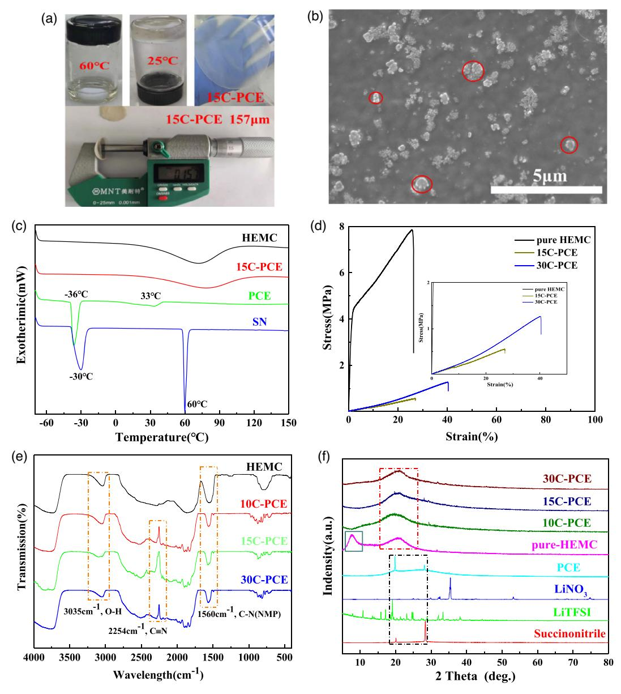
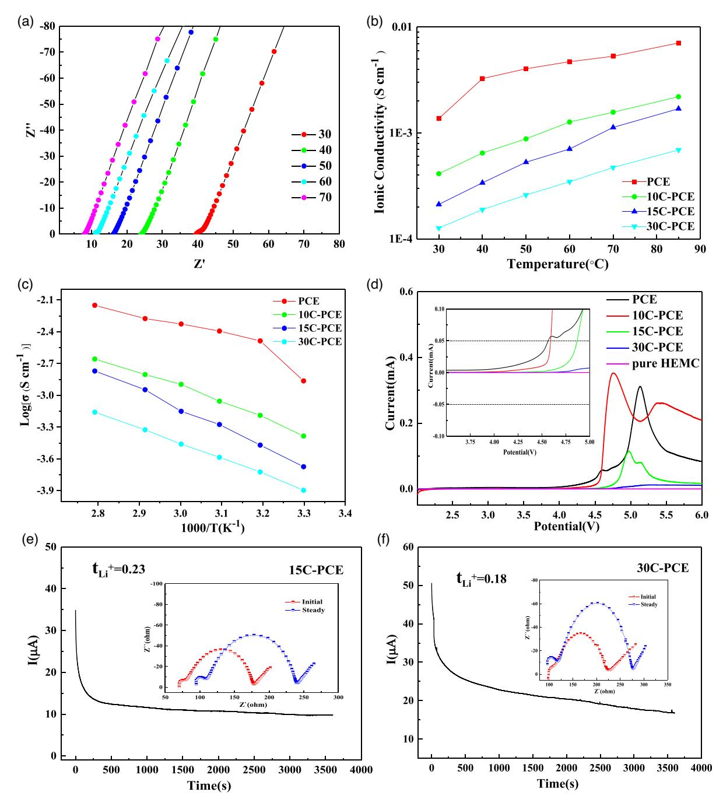
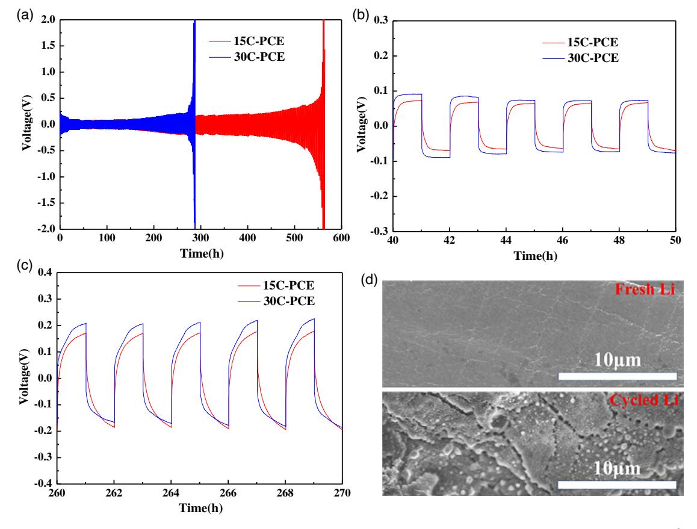
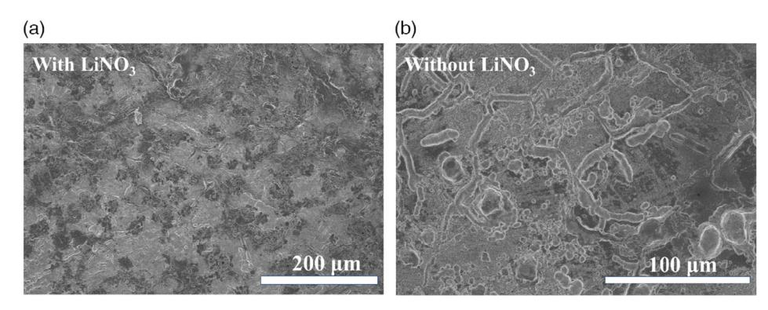
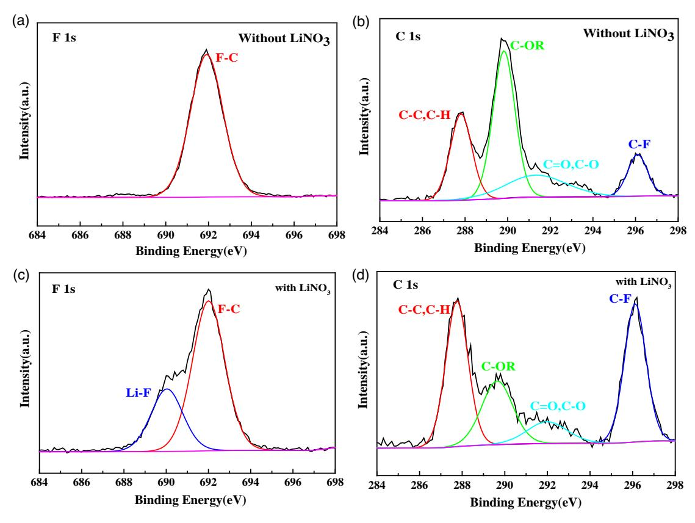
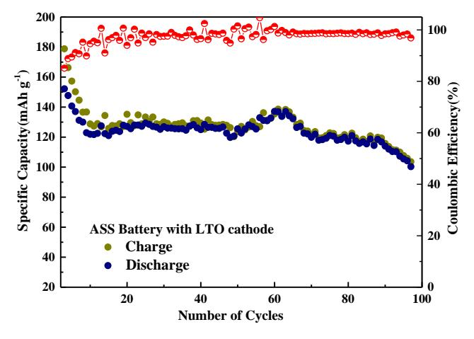
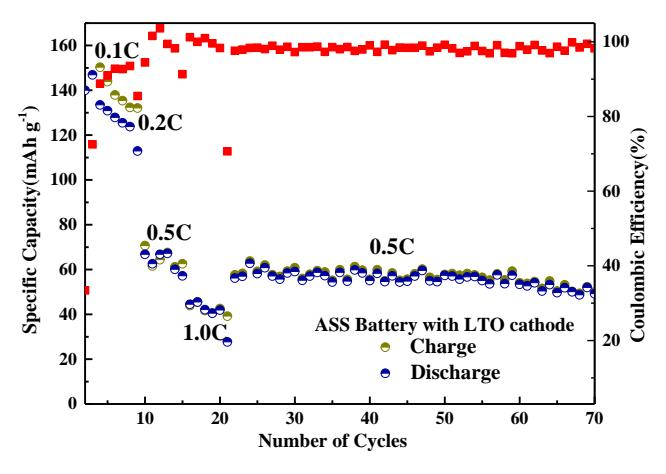

# **Cellulose-Based Plastic Crystal Electrolyte Membranes with Enhanced Interface for Solid-State Lithium Batteries**

Baiging Zhao, Maoxia Yang, Jianying Li, Shaomin Li, Gen Zhang, Shigi Liu, Yanhua Cui. and Hao Liu\*

Fabricating robust succinonitrile-based plastic crystal electrolyte (PCE) membranes with abundant and sustainable polymer skeleton and reinforcing the stability of the PCE-lithium anode interface are essential for adopting PCE in allsolid-state lithium metal batteries (ASSLMBs). Herein, renewable and low-cost cellulose is utilized as the mechanical support framework to prepare the selfstanding cellulose-based PCE (C-PCE) through the facile tape-casting method. The cellulose matrix provides excellent robustness to the hybrid C-PCE system. The fabricated C-PCE shows an ionic conductivity of about  $2.1 \times 10^{-4}$  S cm-1 and a tensile strength of over 0.5 MPa at room temperature. Solid-state lithium batteries assembled with the Li4Ti5O12 cathode, lithium metal anode, and the prepared electrolyte films exhibit an initial capacity surpassing 155 mAh  $g^{-1}$  at 0.2 C and room temperature. This work presents a new attempt to use low-cost cellulose and common additives to prepare high-performance PCE membranes for lithium-battery applications.

# 1. Introduction

With the growing demand for mobile electronic devices and large-scale stationary energy storage/conversion systems, conventional lithium-ion batteries with graphitic anodes and liquid organic electrolytes are confronted with bottlenecks in increasing the energy storage capacity.[1,2] All-solid-state lithium metal batteries (ASSLMBs) are considered promising candidates for future rechargeable batteries.[3] In the past few decades, various superior solid-state electrolytes (SSEs), including inorganic solid electrolytes (ISEs) and solid polymer electrolytes (SPEs), were explored for ASSLMBs.[4] However, due to the rigorous preparation conditions and expensive raw materials of ISEs and the low  $_{\rm ionic}$ conductivity room-temperature of  $SPEs$ , the

China Academy of Engineering Physics Mianyang, Sichuan 621000, P. R. China

DOI: 10.1002/ente.202100114

commercialization of high energy density solid-state batteries has been severely hindered.[5]

Succinonitrile (SN; N=C-CH2-CH2- $C\equiv N$ ) is a typical plastic crystal organic molecule with a high polarity that enables it to dissolve various types of salts.[6] The SN-based solid-state plastic crystal electrolyte (PCE) showed good ionic conductivity when mixed with lithium bis-trifluoromethanesulphonimide  $\mathbf{I}$  $[CF3SO2)2N]$  (LiTFSI). PCE with 5 mol% LiTFSI showed a high conductivity over  $10^{-3}$  S cm-1 at room temperature.[7,8] PCE also has excellent thermal stability and non-flammability compared with conventional organic carbonate-based liquid electrolytes.[9] Therefore, PCE has been adopted as a solid plasticizer in hybrid solid electrolytes (HSEs) or an interlayer to stabi-

lize the sulfide electrolyte interface against lithium.[10-12] However, the paste-like PCE is inferior in mechanical strength and difficult to be fabricated into films. Robust skeleton materials were adopted to enhance the mechanical toughness and filmforming properties of PCE.

Common polymer materials, such as poly(ethylene oxide) (PEO) and poly(vinylidene fluoride-hexafluoropropylene) (PVDF-HFP), have been reported to enhance the mechanical properties of PCE.[13,14] Although a higher polymer substrate content could increase the mechanical strength of PCE, the ionic conductivity is lowered inevitably. A polymer electrolyte membrane (PEM) composed of a densely PEO crosslinked polystyrene (PS) mechanical framework and a PCE ionic conducting phase was synthesized to enhance Young's modulus of PCE-based electrolyte films and diminish the ionic conductivity loss.[15] The hybrid PEM showed an outstanding conductivity  $(0.35 \text{ mS cm}^{-1})$  and mechanical robustness (modulus  $E' \approx 0.3$  GPa) at 30 °C. A few novel polymer matrices were also introduced to improve the tenacity of PCE. A self-standing plastic crystal composite electrolyte membrane was prepared by fixing PCE in ethoxylated trimethylolpropane triacrylate (ETPTA) networks via UV curing.[16] The prepared electrolyte membrane showed improved stability against lithium and high ionic conductivity at room temperature. The semi-interpenetrating polymer network (semi-IPN) was fabricated with UV-crosslinked ETPTA/PVDF-HFP to balance the mechanical strength and ionic conductivity of PCE membranes.[17] The resultant semi-IPN achieved good mechanical robustness and bendability, along

B. Zhao, M. Yang, J. Li, S. Li, G. Zhang, S. Liu, Dr. H. Liu Chengdu Science & Technology Developing Center China Academy of Engineering Physics Chengdu, Sichuan 610207, P. R. China E-mail: liuh0001@yinhe596.cn Dr. Y. Cui Institute of Electronic Engineering

The ORCID identification number(s) for the author(s) of this article ð can be found under https://doi.org/10.1002/ente.202100114.

with acceptably high ionic conductivity. Subsequently, PCE was directly fabricated inside the polyethylene terephthalate (PET) nonwoven skeleton via in situ UV crosslinking of the ETPTA monomer.[18] The assembled deformable pouch cells exhibited extremely stable electrochemical performance even when severely deformed. A mechanically robust PCE was recently prepared by infiltrating liquid SN electrolyte into the UV-cured highly crosslinked polyurethane acrylate (PUA) skeleton.[19] The prepared electrolyte films exhibited superior tensile strength (6.5 MPa). However, the polymer matrix and preparation processes were costly and complex. In this regard, it is necessary to fabricate PCE membranes with robust skeleton through simple preparation methods and boost the stability of the PCE-lithium metal anodes interface.[20,21]

Cellulose is the most abundant renewable natural organic polymer material.[22] Due to high mechanical strength, cellulose and its derivatives have been fabricated into copious new energy storage materials, such as robust separators and flexible electrodes.  $[23-25]$  Adding cellulose and its derivatives enhanced the mechanical properties of polymers.[26,27] Micro-fibrillated cellulose (MFC) particles were incorporated into a methacrylic-based polymer matrix to produce reinforced polymeric networks.[28] The MFC-modified polymeric network could be an outstanding candidate for flexible batteries because of its good mechanical properties. Zhang et al. presented a novel renewable cellulosebased lithium-ion battery separator. The carboxymethyl cellulose (CMC)/PVDF-HFP composite separator showed desirable thermal stability, excellent electrochemical stability, and good rate capability.[29] Another robust cellulose material, methyl 2-hydroxyethyl cellulose (HEMC), as a reinforced structure and functional filler, was introduced into PEO-based SPEs. The HEMC-reinforced composite polymer electrolyte significantly boosted the mechanical strength and electrochemical stability of SPEs.[30]

In this article, the low-cost cellulose was used as a reinforcing substrate to improve the mechanical and film-forming properties of PCE. The HEMC-based PCE membranes were fabricated through simple tape-casting methods. The electrolyte films showed a high ionic conductivity and good tenacity at room temperature. In addition, lithium nitrate (LiNO3) was used to alleviate the dendrite growth and suppress the side reactions by stabilizing the interface of PCE-lithium metal anodes.[31,32] ASSLMBs assembled with  $\text{Li}_4\text{Ti}_5\text{O}_{12}$  cathode and the prepared electrolyte films exhibited a high initial capacity and excellent cycle performance.

# 2. Experimental Section

# 2.1. Materials

HEMC was purchased from Aldrich Chemistry. SN (99%), lithium nitrate (LiNO3, 99.9%), and lithium bis(trifluoromethane sulfonimide) (LiTFSI, 99%) were purchased from Aladdin (Shanghai, China). LiTFSI and LiNO3 were vacuum-dried at 120 °C for 24 h and then stored in the glove box (H2O and  $O_2$  < 0.1 ppm) before use. *N*-methyl pyrrolidone (NMP; 99.0%) was purchased from Macklin reagent. Lithium titanate ( $\text{Li}_4\text{Ti}_5\text{O}_{12}$ ) and carbon black (conductive agent) were purchased from Hefei Kejing Materials Technology Co. Ltd. PVDF binder was acquired from Alfa Aesar. All the experiments were conducted in a glove box under an inert atmosphere of argon. Glass fiber (GF/A, Whatman), purchased from Alfa Aesar, was used to soak PCE and produce a solid-state PCE film of about  $160 \mu m$  thick.

# 2.2. Fabrication of the Polymer Electrolyte Films

PCE was prepared by dissolving 0.43 g LiTFSI and 0.058 g  $LiNO3$ into 2.28 g melted SN at 65  $^{\circ}$ C. Subsequently, the tape-casting method was used to fabricate cellulose films and cellulose-based plastic crystal polymer electrolyte films. Different proportions of HEMC and NMP were added to PCE to get a mixture solution. The solution was stirred overnight to form the casting slurry. Then, the slurry was poured into a polytetrafluoroethylene (PTFE) mold. After removing the solvent by forced air drying at 70 °C and subsequent vacuum evaporation, the paste-like PCE was finally fixed in the cellulose skeleton, and the self-standing cellulose-based PCE (C-PCE) films were successfully prepared with the thicknesses ranging from 100 to 200 µm. In detail, we, respectively, added 0.28, 0.42, and 0.84 g HEMC into PCE to prepare the 10C-PCE, 15C-PCE, and 30C-PCE electrolyte films in terms of mass ratio of HEMC and PCE. In addition, pure cellulose film, denoted as pure-HEMC, was made by solving HEMC in NMP and removing solvent without adding SN or lithium salts.

# 2.3. Material Characterization

The mechanical properties of the electrolyte films were tested on an MTS Systems Corporation (MTS) universal testing machine with a tensile rate of  $1 \text{ mm} \text{ min}^{-1}$  at room temperature. The size of the film samples was  $75.0 \times 4.0$  mm2. X-ray diffraction (XRD; Bruker D8 Advance, Germany) was used to characterize the structure of the samples at the range of  $5^{\circ}$ –85° and identify the phase information and lithium salt species in the materials. Differential scanning calorimetry (DSC; Mettler Toledo DSC3+, Switzerland) was scanned from  $-70$  to 150 °C to evaluate the phase transition of plastic crystal materials. The heating rate of DSC was  $10\,^{\circ}\text{C}\,\text{min}^{-1}$ , and the flow rate of  $N_2$  was  $50\,\text{mL}\,\text{min}^{-1}.$  The chemical compositions and the structures of prepared films were measured through Fourier transform IR (FTIR) spectroscopy (Nicolet-iS10, Thermo Fisher Company, USA) from 4000 to 400 cm-1. Surface morphology of fresh Li metal anode and cycled Li metal in Li/electrolyte/Li symmetric cells was characterized by scanning electron microscope (SEM; L-30-ESEM-FEG, FEI, Holland). The surface condition of HEMC membranes and C-PCE films can be analyzed by SEM. X-ray photoelectron spectroscopy (XPS; ESCALAB XI X, Thermo Fisher Company, USA) was used to analyze the surface components of cycled Li metal anode in Li symmetric cells.

# 2.4. Electrochemical Measurements

Electrochemical impedance spectroscopy (EIS) was performed on Solartron impedance/gain-phase analyzer (SI 1260) at different temperatures with the frequency ranging from 1 MHz to

**SCIENCE NEWS** www.advancedsciencenews.com

**4DVANCED** 

0.1 Hz at 5 mV amplitude under the open-circuit voltage of stainless steel (SS) symmetric 2032-coin cell. The ionic conductivity ( $\sigma$ ) of PCE and C-PCE electrolyte films can be calculated with the following formula

$$\sigma = \frac{d}{R_{\rm b}A} \tag{1}$$

where  $d$  is the thickness of the films,  $R_b$  is the bulk impedance measured with EIS, and  $A$  is the actual area of the electrolyte films.

Linear sweep voltammetry (LSV) with a potential ranging from 2.0 to 6.0 V and a scan rate of  $1 \text{ mV s}^{-1}$  at room temperature was applied to evaluate the electrochemical stability windows of the electrolyte films. The lithium-ion transference number  $(t_{\text{Li}}^+)$  of PCE and C-PCE electrolyte films was measured using Li/ electrolyte/Li cells through direct current (DC) polarization combined with the EIS at room temperature. Lithium-ion transference number ( $t_{Li}^+$ ) was calculated with the following formula

$$t_{\text{Li+}} = \frac{I_{\text{s}}(\Delta V - R_0 I_0)}{I_0(\Delta V - R_{\text{s}} I_{\text{s}})}$$
(2)

where  $I_0$  and  $R_0$  are the initial current and initial interface resistance before DC polarization, respectively, and  $I_s$  and  $R_s$  are the steady-state current and steady-state interface resistance after DC polarization, respectively.  $\Delta V$  is the applied DC voltage (10 mV), and the polarization time is  $2h$ .

The galvanostatic lithium plating/striping test was conducted on a Land battery test system (LAND CT2001A, Wuhan Jinnuo Electronics) at 25 °C with the lithium symmetric cell configuration of Li/electrolyte/Li to assess the cycle life of electrolyte films and the stability of the electrolyte-lithium interface.

The performance of the ASSLMBs was evaluated through commonly reported methods with Li4Ti5O12/electrolyte/Li cell configuration. The Li4Ti5O12-based cathode was prepared by mixing the active material powder, carbon black(super-P), and PVDF binder at a weight ratio of 8:1:1 and coated onto Al foil. ASSLMBs containing prepared electrolyte films were tested on a LAND system from  $1.0$  to  $2.5$  V at room temperature.

#### 3. Results and Discussion

#### 3.1. Characterization of the Composition and Physical **Properties**

Figure 1a shows that PCE is a liquid-like solution at 60 °C and changes into a paste-like solid at room temperature. The prepared electrolyte films are uniform and transparent, and the thickness of 15C-PCE is 157 µm. The pictures of 10C-PCE and 30C-PCE are shown in Figure S1, Supporting Information. The thickness of the electrolyte films increases with the increase in HEMC content. As shown in Figure S2, Supporting Information, the HEMC film presents a rough and anomalous surface morphology with plenty of pore structure on its surface. Figure 1b displays the SEM of 15C-PCE film, the pore structure disappeared after filling PCE in cellulose skeleton. Small particles attached to the surface indicate the trace amount of undissolved lithium salt in PCE. SN has a plastic crystal behavior between -40 and 60 °C, but adding lithium salt influences the structure of SN and decreases the melting point of PCE.[33] Plenty of studies have discussed the plastic crystal performance of SN with various polymer and salts additives. The DSC test can effectively detect the phase transformation of plastic crystal materials. As shown in Figure 1c, SN shows a plastic crystal phase at the temperature range from  $-30$  to 60 °C; after adding lithium salt in SN, the melting point of PCE decreases to 33 °C. Mixing cellulose in PCE will obviously change the plastic crystal behavior of HEMC and 15C-PCE. The mechanical performance of the SSE films is critical for the long-term cycle stability of lithium batteries. Figure 1d shows the strain-stress curves of pure HEMC membranes, 15C-PCE films, and 30C-PCE films, because 10C-PCE films are too weak to hold on the testing machine. The pure-HEMC films have a tensile strength of over 7 MPa and a breaking elongation rate reaching 25%, and its Young's modulus is calculated to be 0.5 GPa. The rigid cellulose molecules endow the cellulose materials with excellent mechanical strength. The rigidity of cellulose molecules originates from: 1) the high polarity of the cellulose molecule; 2) the irrotational hexatomic ring structure; and 3) the intermolecular/intramolecular hydrogen bond force.[34] After mixing in the cellulose matrix, the mechanical strength of PCE improves significantly. The 15C-PCE film shows a tensile strength of 0.55 MPa with the breaking elongation rate over 25%, and the calculated modulus is about 2.2 MPa. When the mass ratio of HEMC/SN reaches 30%, the 30C-PCE film shows a tensile strength over 1 MPa and a breaking elongation rate of about 40%. In general, the mechanical strength and the film forming property of PCE increase with the increase in cellulose mass ratio. The functional groups of SN and HEMC in the prepared films are identified through FTIR. As revealed in Figure 1e, all the fabricated C-PCE films contain the typical peak of C $\equiv$ N at 2254 cm-1, attributing to the stretching of SN molecular. A peak at 1560  $\text{cm}^{-1}$  is detected, which belongs to the C–N stretch of NMP molecular complexed in cellulose skeleton. As the solvent, NMP is critical to maintain the structural stability of cellulose skeleton and enhance ionic conductivity of the C-PCE membranes acting as plasticizer.[35,36] XRD was then performed to detect the lithium salt solutes and crystal structure changes of PCE. Figure 1f shows the XRD patterns of SN, lithium salt, PCE, pure-HEMC, and various mass ratio C-PCE films. The broaden peak ranges from 3° to 7° in HEMC originating from the scattering of pore structure in the HEMC films, and this conclusion is matching with the SEM of HEMC membranes in Figure S2, Supporting Information. Two sharp peaks at 20° and 28° indicate their long-range ordered structure of SN molecular. With the addition of lithium salt, the crystal structure of SN will be destroyed, which will lead to the decrease of the diffraction peak intensity in PCE. The pattern of LiTFSI shows characteristic peaks at  $10.5^{\circ}$ ,  $15.5^{\circ}$ ,  $17.0^{\circ}$ ,  $19.0^{\circ}$ ,  $23.0^{\circ}$ , 24.5°, and 33.5°. The pattern of LiNO3 shows the characteristic peaks at 35.0°. Although SEM shows extremely small amount of undissolved lithium attaching on the surface of C-PCE films, the peaks of LiNO3 and LiTFSI disappear in PCE and C-PCE, which implies the excellent solubility of lithium salts in SN.[37] The broad and weak peaks at  $2\theta \approx 20^{\circ}$  of pure-HEMC and C-PCE attribute to the amorphous scattering of polymer films.

www.entechnol.de

**Figure 1.** Characterization of physical and chemical prosperities. a) Digital photographs of PCEs at different temperatures and photographs of 15C-PCE films. b) SEM image of 15C-PCE film. c) DSC profiles of SN, PCE, HEMC, and 15C-PCE films. d) Stress-strain curves of pure-HEMC films, and 15C-PCE and 30C-PCE films. e) FTIR spectra for membranes of HEMC, 10C-PCE, 15C-PCE, and 30C-PCE. f) XRD patterns of SN, LiNO3, LiTFSI, PCE, pure-HEMC film, 10C-PCE, 15C-PCE, and 30C-PCE films.

#### 3.2. Electrochemical Performance

High room temperature ionic conductivity of SSE is an important prerequisite for its practical application in ASSLMBs. **Figure 2a** shows the EIS of 15C-PCE at different temperatures. The EIS of PCE, 10C-PCE, and 30C-PCE is shown in Figure S3, Supporting Information. The bulk resistance  $(Rb)$  of electrolyte films can be observed from EIS. The result shows that the bulk resistant decreases, as the temperature increases. The ionic conductivity can be calculated with formula (1). The calculated results are presented in Figure 2b. The ionic conductivity of PCE and C-PCE films increases with the increase in temperature and decreases with the cellulose content. The ionic conductivities of PCE, 10C-PCE, 15C-PCE, and 30C-PCE are  $1.4 \times 10^{-3}$ ,  $4.1 \times 10^{-4}$ ,  $2.1 \times 10^{-4}$ , and  $1.3 \times 10^{-4}$  S cm-1 at 30 °C. Adding salt affects the plastic behavior and reduces the plastic crystal transition temperature of SN.[38] Cellulose is a supporting skeleton for PCE but not a good lithium-ion conductor. Cellulose added in PCE occupies the ionic transition channels, resulting in the inevitable loss of ion transmission paths. The ionic mobility decreases with more cellulose added in PCE. Similar phenomena were also observed with PEO or PVDF-based PCE.[7,14,39]

As another critical parameter for the SSE, the electrochemical stability window is evaluated by the LSV test with Li/electrolyte/SS

www.advancedsciencenews.com

4DVA NCFD

SC

**Energy Technology** 

www.entechnol.de

Figure 2. Electrochemical characterization. a) EIS Spectra of 15C-PCE at different temperatures. b) Temperature-dependent ionic conductivity of PCE, 10C-PCE, 15C-PCE, and 30C-PCE films. c) Arrhenius plots of PCE, 10C-PCE, 15C-PCE, and 30C-PCE films. d) Linear scan voltammetry of PCE, pure-HEMC, 10C-PCE, 15C-PCE, and 30C-PCE films at a scanning rate of 1 mV s-1 at 25 °C. e) The Li/15C-PCE/Li and f) Li/30C-PCE/Li cells under a DC voltage of 10 mV. Insets show the EIS of the symmetric cells before and after DC polarization.

cells. As shown in Figure 2d and the embedded chart, the pure HEMC films are highly stable with the voltage range from 2.0 to 6.0 V. The PCE starts to decompose at 4.0 V, and the electrolyte window of PCE is lower than that of C-PCE films. With the increase in HEMC content, the decomposition voltage of the fabricated films increases continuously. No distinctive decomposition takes place below  $4.5 \text{ V}$  versus Li+/Li for 15C-PCE. Two oxidation peaks can be observed at 4.5 and 5.2 V, which are assigned to the decomposition of LiTFSI and  $LiNO_3$ , respectively, because  $NO_3^-$  possesses a higher electron affinity than  $\text{TFSI}^{\dot{-}}.^{\text{[40]}}$ 

Lithium-ion transference number  $(t_{Li}^{+})$  is important for battery performance. As shown in Figure 2e,f,  $t_{Li}$ + of 15C-PCE is 0.23, which is much higher than  $t_{Li}^+$  of 30C-PCE ( $t_{Li}^+$  = 0.18). The non-ionic conductive rigidity HEMC cellulose molecular blocks the lithium migration, decreasing the lithium-ion transference number. The lithium-ion transference number of PCE  $(t_{\text{I,i}}^+ = 0.50)$  and 10C-PCE  $(t_{\text{I,i}}^+ = 0.31)$  can be found in Figure S4, Supporting Information. Increasing the proportion of HEMC in PCE reduces  $t_{Li}$ + of C-PCE films.

The dynamic interface stability of electrolyte against lithium metal anode could be validated with a galvanostatic Li plating/ stripping experiment with the symmetrical cells' configuration. Figure 3a shows that 15C-PCE exhibits long-term electrochemical stability against lithium metal anode over 550 h at a chargedischarge current density of  $0.12 \text{ mA cm}^{-2}$ . In contrast, the cell with 30C-PCE presents lower stability (about 280 h) and a higher polarization voltage during the cycle test. The sudden voltage increase marked in Figure 3a indicates that the lithium dendrite pierces the electrolyte films, and the inner short-circuit rapidly damages the batteries. Figure 3b,c shows the polarization voltage profiles of 15C-PCE and 30C-PCE at different test times. At 40-50 h, cells with 15C-PCE and 30C-PCE exhibit a constant voltage polarization of 160 and 200 mV. The lower polarization voltage of 15C-PCE cells indicates the less block of charge carrier through the electrolyte-electrode interface. However, the polarization voltage increases from 260 to 270 h, and the charge-discharge profiles of C-PCE become sharper, which indicates the deteriorating interface between lithium metal anode and SN.[41] The increasing overpotential during the long-term test of the fabricated C-PCE cells indicates the side reaction between SN and

lithium metal. The life span of Li/Li cell was affected by many factors. The lithium-ion transference number  $(t_{I,i}^+)$  of 15C-PCE is 0.23, but  $t_{\text{Li}}^+$  of 30C-PCE is 0.18, which indicates the higher polarization of Li symmetric cells with 30C-PCE films. The lower lithium-ion transference number of 30C-PCE increases the concentration polarization of symmetrical cell during charge and discharge, causing aggravation of uneven lithium deposition and interface side reaction, reducing the Li platting/stripping life of Li/30C-PCE/Li batteries.[42] Under the same test conditions, the symmetrical Li|15C-PCE|Li cells show much better cycle performance. Figure 3d displays the SEM of fresh Li metal and cycled Li metal anode in Li|15C-PCE|Li cells. The surface morphology of fresh Li is smooth, but the cycled Li metal anode presents a "moss-like" rough surface. The crack on the surface of cycled Li causes deteriorating cell performance.[43]

#### 3.3. Effect of LiNO3 in PCE

To understand the effect of  $LiNO3$  in PCE, we designed two groups experiment to evaluate how the LiNO3 influences the solid electrolyte interphase (SEI) component and surface morphology of Li metal anode. We fabricated 15C-PCE films with or without adding LiNO3 in PCE and tested the XPS and SEM of cycled lithium metal anode in Li|15C-PCE|Li cells with the same Li platting/stripping condition.

**Figure 3.** a) Li+ platting/stripping behavior of Li symmetrical cells with 15C-PCE and 30C-PCE under a current density of 0.12 mA cm-2. b,c)Voltage polarization profile comparison of 15C-PCE and 30C-PCE from 40 to 50 h and from 260 to 270 h. d) SEM of fresh Li metal and cycled Li metal anode in Li|15C-PCE|Li cells.

As shown in **Figure 4**, the surface of Li metal with  $LiNO3$ has no obvious lithium dendrite, but in the 15C-PCE without LiNO3, lithium dendrites are clearly present on the Li metal surface.  $NO_3^-$  in PCE can induce the spherical growth of Li and suppress Li dendrite growth.[44] XPS was used to identify the SEI component of Li metal anode. In Figure 5, the XPS profiles of F 1s with 15C-PCE containing  $LiNO3$  exist obviously and stronger LiF signal. The  $NO_3$ - in the Li+ solvation sheath of SEI can promote TFSI- decomposition and forming more LiF in SEI structure. As an excellent inorganic-SSE, LiF can effectively enhance interface stability of Li metal anode. $[40,45]$ 

All the electrochemical results indicate that the prepared 15C-PCE films could be a potential candidate for solid-state lithium-ion batteries. For this reason, 15C-PCE films are chosen as the electrolyte to assemble a full solid-state lithium battery with  $\text{Li}_4\text{Ti}_5\text{O}_{12}$  cathode and Li anode to evaluate the cell performance with 15C-PCE films.

### 3.4. ASSLMBs Performance

The cycle and rate performance of ASSLMBs was evaluated at room temperature (25  $\degree$ C) without adding any liquid electrolyte. **Figure 6** shows the charge–discharge capacity and the columbic

Figure 4. SEM characterization of cycled Li metal anode of Li/15C-PCE/Li cell a) with or b) without LiNO3 after Li platting/stripping test.

**Figure 5.** XPS profiles of cycled lithium metal anode of Li/15C-PCE/Li cell with or without LiNO3 after Li platting/stripping test. a) F 1s without LiNO3; b) C 1s without  $LiNO_3$ ; c) F 1s with  $LiNO_3$ ; d) C 1s with  $LiNO_3$ .

Figure 6. Cycling performance of LTO/Li cells with 15C-PCE electrolyte membranes under 0.2 C at room temperature.

Figure 7. The rate capability of LTO/Li cells with 15C-PCE electrolyte membranes at room temperature.

efficiencies of  $\text{Li}_4\text{Ti}_5\text{O}_{12}$  (LTO)/15C-PCE/Li at a 0.2 C rate. The cycle duration number of 15C-PCE is about 100th, and the capacity starts to drop quickly after the 90th cycle, which could be attributed to the worsened interface contact and the accumulation of inert ingredients.

**Figure 7** shows the rate capabilities of cells recorded from  $0.1$ to 1 C and then back to  $0.5$  C at room temperature. The average residual specific capacities of the cells are 65 and 40 mAh  $g^{-1}$  at the rate of 0.5 and 1.0 C. The lower ionic conductivity of the SSEs restricts the quick charge and discharge performance of the lithium-ion batteries at room temperature, which is the common failure of solid-state batteries. Importantly, cells can return to  $0.5\,\mathrm{C}$  capacity after high current density operations, and the retention capacity of the assembled batteries presents over  $60 \text{ mAh g}^{-1}$  with cycle numbers sustaining over 70.

## 4. Conclusion

In summary, a simple fabrication method is reported to prepare C-PCE membranes, which exhibit high ionic conductivity at room temperature and robust mechanical strength. The rigid cellulose framework capacitates the hybrid electrolyte membranes' excellent mechanical performance. The  $NO_3^-$  in PCE inducing lithium salt transforms to inorganic-rich solid electrolyte interphase, which promotes the cycle life of Li symmetrical cell and Li4Ti5O12/Li cell. The ASSLMBs assembled with 15C-PCE electrolyte membranes show a discharge capacity retention of 67% after 100 cycles at 25 °C. The strategies to enhance the mechanical strength and the film-forming properties of PCE using low-cost materials and simple preparation processes to boost the electrolyte-lithium metal anode interface stability hold great promise for the next-generation high-energy ASSLMBs.

# **Supporting Information**

Supporting Information is available from the Wiley Online Library or from the author.

# **Acknowledgements**

This work was financially supported by the Sichuan Science and Technology Program (Grant No. 2020YFG0418, 2019JDJQ0046), joint fund of the National Natural Science Foundation Committee of China Academy of Engineering Physics (NSAF) (Grant No. U1930208), and the Laboratory of Precision Manufacturing Technology foundation (Grant No. ZM18002), China Academy of Engineering Physics (CAEP) foundation (Grant No. CX20200009).

# **Conflict of Interest**

The authors declare no conflict of interest.

# **Data Availability Statement**

The data that support the findings of this study are available from the corresponding author upon reasonable request.

# Keywords

cellulose, lithium metal anodes, plastic crystal electrolytes, solid-state batteries, succinonitrile

> Received: February 16, 2021 Revised: April 24, 2021 Published online: May 16, 2021

- [1] M. Armand, J. M. Tarascon, *Nature* **2008**, *451*, 652.
- [2] J. W. Choi, D. Aurbach, Nat. Rev. Mater. 2016, 1, 1.
- [3] A. Manthiram, X. Yu, S. Wang, Nat. Rev. Mater. 2017, 2, 1.
- [4] L. Fan, S. Wei, S. Li, Q. Li, Y. Lu, Adv. Energy Mater. 2018, 8, 1702657.
- [5] C. Zhao, L. Liu, X. Qi, Y. Lu, F. Wu, J. Zhao, Y. Yu, Y. S. Hu, L. Chen, Adv. Energy Mater. 2018, 8, 1703012.
- [6] P. J. Alarco, Y. Abu-Lebdeh, A. Abouimrane, M. Armand, Nat. Mater. 2004, 3, 476.
- [7] L. Z. Fan, Y. S. Hu, A. J. Bhattacharyya, J. Maier, Adv. Funct. Mater. 2007. 17. 2800.
- [8] D. Lin, P. Y. Yuen, Y. Liu, W. Liu, N. Liu, R. H. Dauskardt, Y. Cui, Adv. Mater. 2018, 30, 1802661.

[www.advancedsciencenews.com](http://www.advancedsciencenews.com) [www.entechnol.de](http://www.entechnol.de)

- [9] S. Chen, J. Zhang, L. Nie, X. Hu, Y. Huang, Y. Yu, W. Liu, Adv. Mater. 2021, 33, 2002325.
- [10] C. Wang, K. R. Adair, J. Liang, X. Li, Y. Sun, X. Li, J. Wang, Q. Sun, F. Zhao, X. Lin, Adv. Funct. Mater. 2019, 29, 1900392.
- [11] M. Liu, Z. Cheng, S. Ganapathy, C. Wang, L. A. Haverkate, M. Tułodziecki, S. Unnikrishnan, M. Wagemaker, ACS Energy Lett. 2019, 4, 2336.
- [12] J. Peng, L. N. Wu, J. X. Lin, C. G. Shi, J. J. Fan, L. B. Chen, P. Dai, L. Huang, J. T. Li, S. G. Sun, J. Mater. Chem. A 2019, 7, 19565.
- [13] R. Yang, S. Zhang, L. Zhang, W. Liu, Int. J. Electrochem. Sci. 2013, 8, 10163.
- [14] L. Z. Fan, J. Maier, Electrochem. Commun. 2006, 8, 1753.
- [15] S. A. Chopade, J. G. Au, Z. Li, P. W. Schmidt, M. A. Hillmyer, T. P. Lodge, ACS Appl. Mater. Interfaces 2017, 9, 14561.
- [16] H. J. Ha, E. H. Kil, Y. H. Kwon, J. Y. Kim, C. K. Lee, S. Y. Lee, Energy Environ. Sci. 2012, 5, 6491.
- [17] H. J. Ha, Y. H. Kwon, J. Y. Kim, S. Y. Lee, Electrochim. Acta 2011, 57, 40.
- [18] K. H. Choi, S. J. Cho, S. H. Kim, Y. H. Kwon, J. Y. Kim, S. Y. Lee, Adv. Funct. Mater. 2014, 24, 44.
- [19] P. Lv, Y. Li, Y. Wu, G. Liu, H. Liu, S. Li, C. Tang, J. Mei, Y. Li, ACS Appl. Mater. Interfaces 2018, 10, 25384.
- [20] S. Das, A. J. Bhattacharyya, Solid State Ionics 2010, 181, 1732.
- [21] P. Hu, J. Chai, Y. Duan, Z. Liu, G. Cui, L. Chen, J. Mater. Chem. A 2016, 4, 10070.
- [22] D. Klemm, B. Heublein, H. P. Fink, A. Bohn, Angew. Chem., Int. Ed. 2005, 44, 3358.
- [23] W. Chen, H. Yu, S. Y. Lee, T. Wei, J. Li, Z. Fan, Chem. Soc. Rev. 2018, 47, 2837.
- [24] Z. Yang, J. Zhang, M. C. Kintner-Meyer, X. Lu, D. Choi, J. P. Lemmon, J. Liu, Chem. Rev. 2011, 111, 3577.
- [25] H. Wang, J. Wu, J. Qiu, K. Zhang, J. Shao, L. Yan, Sustainable Energy Fuels 2019, 3, 3109.
- [26] L. Jabbour, R. Bongiovanni, D. Chaussy, C. Gerbaldi, D. Beneventi, Cellulose 2013, 20, 1523.

- [27] T. W. Zhang, T. Tian, B. Shen, Y. H. Song, H. B. Yao, Composites Commun. 2019, 14, 7.
- [28] A. Chiappone, J. R. Nair, C. Gerbaldi, L. Jabbour, R. Bongiovanni, E. Zeno, D. Beneventi, N. Penazzi, J. Power Sources 2011, 196, 10280.
- [29] J. Zhang, Z. Liu, Q. Kong, C. Zhang, S. Pang, L. Yue, X. Wang, J. Yao, G. Cui, ACS Appl. Mater. Interfaces 2013, 5, 128.
- [30] H. Wu, J. Wang, Y. Zhao, X. Zhang, L. Xu, H. Liu, Y. Cui, Y. Cui, C. Li, Sustainable Energy Fuels 2019, 3, 2642.
- [31] Q. Shi, Y. Zhong, M. Wu, H. Wang, H. Wang, Proc. Natl. Acad. Sci. 2018, 115, 5676.
- [32] X. Liang, Z. Wen, Y. Liu, M. Wu, J. Jin, H. Zhang, X. Wu, J. Power Sources 2011, 196, 9839.
- [33] S. Das, S. J. Prathapa, P. V. Menezes, T. N. G. Row, A. J. Bhattacharyya, J. Phys. Chem. B 2009, 113, 5025.
- [34] J. Sheng, S. Tong, Z. He, R. Yang, Cellulose 2017, 24, 4103.
- [35] S. G. Rao, T. M. Mohan, T. V. Krishna, K. Narendra, B. S. Rao, J. Mol. Liquids 2015, 211, 1009.
- [36] X. Zhang, S. Wang, C. Xue, C. Xin, Y. Lin, Y. Shen, L. Li, C. W. Nan, Adv. Mater. 2020, 32, 2000026.
- [37] W. Wang, E. Yi, A. J. Fici, R. M. Laine, J. Kieffer, J. Phys. Chem. C 2017, 121, 2563.
- [38] Q. Wang, H. Fan, L. Z. Fan, Q. Shi, Electrochim. Acta 2013, 114, 720.
- [39] A. Abouimrane, P. Whitfield, S. Niketic, I. Davidson, J. Power Sources 2007, 174, 883.
- [40] J. Fu, X. Ji, J. Chen, L. Chen, X. Fan, D. Mu, C. Wang, Angew. Chem. 2020, 132, 22378.
- [41] L. Z. Fan, X. L. Wang, F. Long, J. Power Sources 2009, 189, 775.
- [42] N. Meng, H. Zhang, S. Lianli, F. Lian, J. Memb. Sci. 2020, 597, 117768.
- [43] N. D. Trinh, D. Lepage, D. Aymé-Perrot, A. Badia, M. Dollé, D. Rochefort, Angew. Chem., Int. Ed. 2018, 57, 5072.
- [44] C. Yan, H.-R. Li, X. Chen, X.-Q. Zhang, X.-B. Cheng, R. Xu, J.-Q. Huang, Q. Zhang, J. Am. Chem. Soc. 2019, 141, 9422.
- [45] S. Liu, X. Ji, N. Piao, J. Chen, N. Eidson, J. Xu, P. Wang, L. Chen, J. Zhang, T. Deng, Angew. Chem., Int. Ed. 2021, 60, 3661.