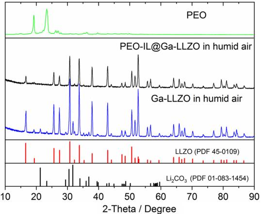
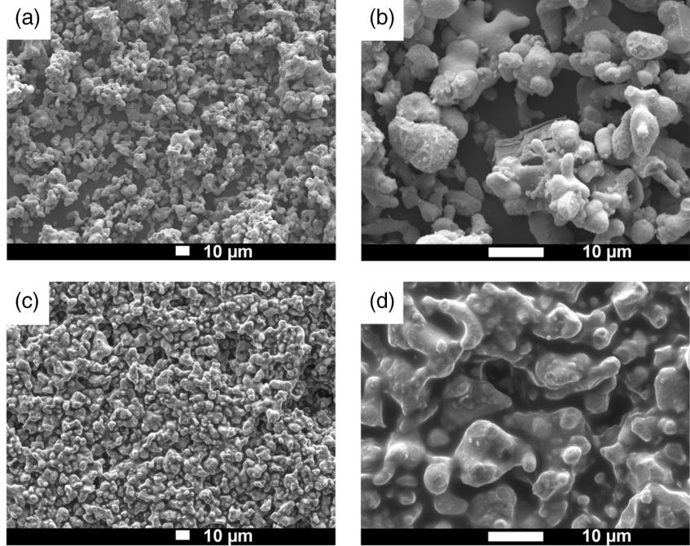
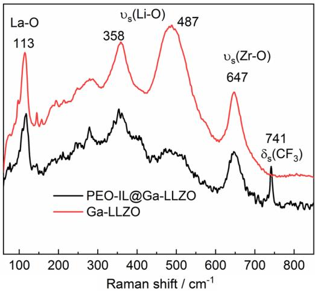
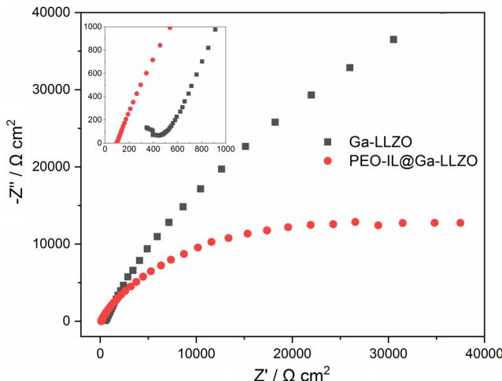
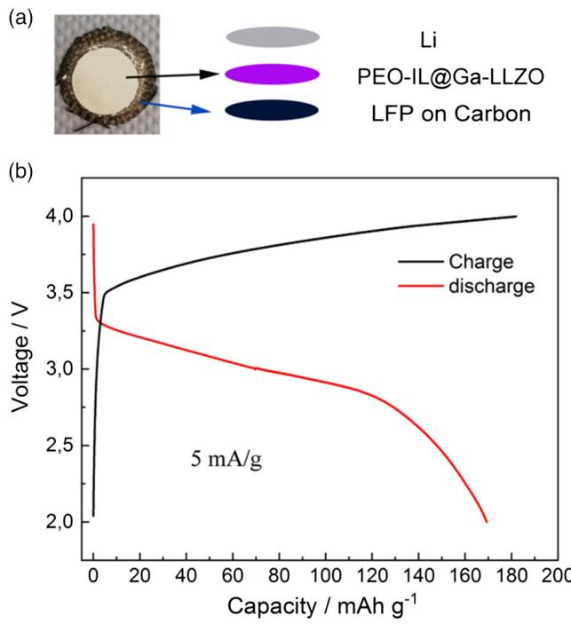
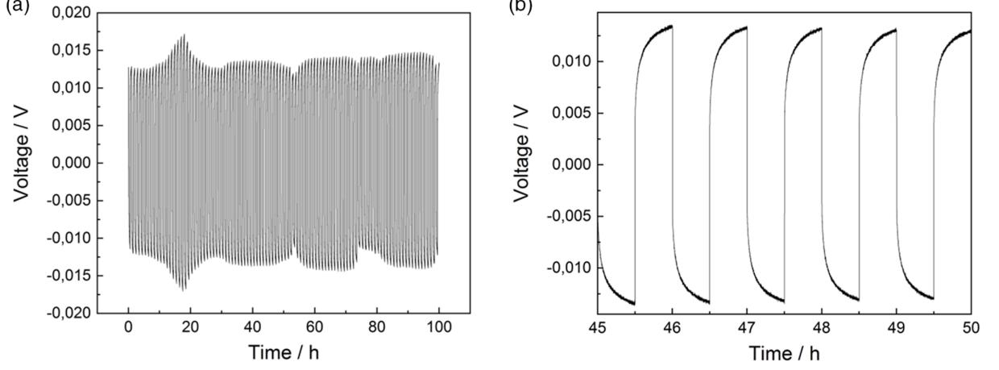
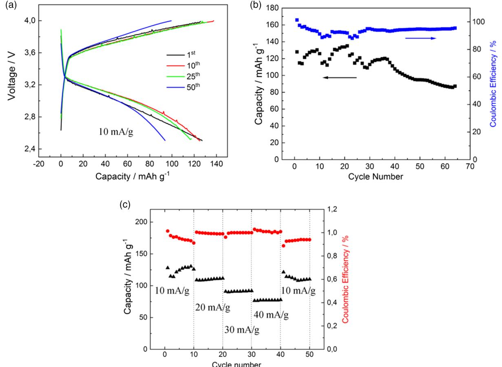
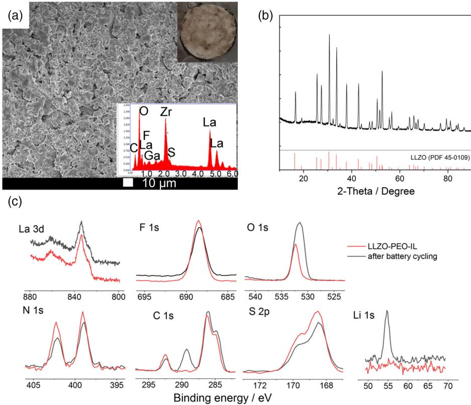

[www.entechnol.de](http://www.entechnol.de)

# Ionic Liquid and Polymer Coated Garnet Solid Electrolytes for High-Energy Solid-State Lithium Metal Batteries

Zhen Liu,\* Andriy Borodin, and Frank Endres\*

Garnet solid-state electrolytes are promising for lithium metal batteries in terms of safety and stability. However, their rigid and brittle nature under humid air increase the interfacial resistance at the electrode/electrolyte interfaces. Herein, the ionic liquid (IL) 1-butyl-1-methylpyrrolidinium bis(trifluoromethylsulfonyl) amide ([Py1,4]TFSI) is employed to dissolve poly(ethylene oxide) (PEO) polymer microstructures that facilitate ion transport through an amorphous rather than a crystalline polymer matrix. The PEO-IL coatings on Ga doped garnet (LLZO) solid-state electrolyte can effectively suppress the formation of Li2CO3 passivation layers on the garnet surface. Electrochemical impedance spectroscopy results show that the interfacial resistance of PEO-IL coated Ga-LLZO is much lower than that of uncoated Ga-LLZO. In addition, the surface of PEO-IL@Ga-LLZO is flatter and it has a better contact with the Li anode than uncoated Ga-LLZO. A symmetric cell of Li/PEO-IL coated solid electrolyte/Li exhibits flat voltage profiles with overpotentials of less than 15 mV and shows a stable lithium plating/stripping process. A solid-state battery based on PEO-IL@Ga-LLZO solid electrolyte combined with lithium metal anode and LiFePO4 (LFP) cathode delivers a specific capacity of 120 mAh g1 with a Coulombic efficiency greater than 96% at 10 mA g(LFP)1 .

#### 1. Introduction

Current rechargeable Li-ion batteries (LIBs) employ liquid or polymer electrolytes, which are potentially toxic, flammable, and corrosive, and could result in significant safety issues.[1–3] Recent solid-state batteries are promising in overcoming these problems and solid-state batteries can provide high energy densities, which are comparable with traditional LIBs.[4,5] The development of an affordable solid electrolyte, which possesses high ion conductivity and good electrochemical stability, is of great

Institute of Electrochemistry

Clausthal University of Technology

Arnold-Sommerfeld-Strasse 6, 38678 Clausthal-Zellerfeld, Germany E-mail: [zhen.liu@tu-clausthal.de](mailto:zhen.liu@tu-clausthal.de); [frank.endres@tu-clausthal.de](mailto:frank.endres@tu-clausthal.de)

#### DOI: 10.1002/ente.202100907

importance. Inorganic type solid electrolytes, such as garnet, have demonstrated good ionic conductivities (104 S cm1 at room temperature) and good mechanical strength.[6,7] However, due to their rigid and brittle nature, these ceramic solid electrolytes often have poor contact with the electrodes, which results in high resistance at the electrolyteelectrode interfaces.[8,9] In addition, uneven Li/solid electrolyte contact leads to Li dendrites growth during charging. To mitigate the shortcomings of ceramic electrolytes, several strategies have been employed, such as coating the solid electrolytes with a metallic layer including Au, Ge, or Al[10–12] and introducing ion conducting layers at the interfaces (polymer, gels, or liquids).[13–15] The aim is to fill the voids at the interface ensuring intimate electrode–electrolyte contact. However, on the one hand, Li anode can interact with them forming thick solid electrolyte interphase (SEI) layers. On the other hand, the properties in the bulk layers of the solid electrolytes are not changed. During charge/dis-

charge, the lithium could go beyond these layers and still form dendrites in the bulk layer.

Previous results have shown that the integration of metal oxides, such as Al2O3, SiO2, and garnet into a polymer matrix increases the conductivity dramatically compared with that of pure polymer electrolytes.[16–18] The metal oxides reduce crystallization of the polymer, which is believed to promote fast Li-ion transportation. The incorporation of ionic liquids (ILs) into polymers, such as poly(ethylene oxide) (PEO) forms an amorphous polymer electrolyte, which also leads to significant increases in conductivity of the resulting hybrid electrolyte.[19–21] Furthermore, ILs have high ionic conductivity, high thermal, and electrochemical stability, which makes them good candidates for hybrid electrolyte materials.[22,23]

Inspired by these results, in this work, we introduce an ionic liquid to the PEO polymer electrolyte, which can reduce the crystallization of the PEO and enhance the mobility of lithium ions. The PEO-IL mixture was coated on the Ga-doped LLZO solidstate electrolyte. In such a design, the PEO-IL coating improves the electrode-solid electrolyte contact, significantly reducing the interfacial resistance at both electrodes by filling the voids not only at the electrode–electrolyte interfaces but also in the bulk of the material. Their brittle and stiff natures were modified by the PEO-IL coating. This coating can increase the stability of LLZO solid electrolyte under humid air, where Li2CO3 forms

Z. Liu, A. Borodin, F. Endres

The ORCID identification number(s) for the author(s) of this article can be found under<https://doi.org/10.1002/ente.202100907>.

© 2021 The Authors. Energy Technology published by Wiley-VCH GmbH. This is an open access article under the terms of the [Creative Commons](http://creativecommons.org/licenses/by-nc-nd/4.0/) [Attribution-NonCommercial-NoDerivs](http://creativecommons.org/licenses/by-nc-nd/4.0/) License, which permits use and distribution in any medium, provided the original work is properly cited, the use is non-commercial and no modifications or adaptations are made.

decreasing ionic conductivity.[24–26] Furthermore, both the cation and the anion of the IL can be decomposed by Li.[27] Pervez et al. have reported the modification of the solid-solid interface with an ionic liquid interlayer in a solid-state battery. By modification of the IL with PEO polymer, the reactivity of the IL with Li is reduced.

# 2. Results and Discussion

Figure 1 blue curve shows the X-ray diffraction (XRD) pattern of the synthesized Ga-doped LLZO with the composition of Li6.4Ga0.2La3Zr2O12 after exposure to humid air (humidity

which would result in good Li ion mobility. Figure 1. XRD patterns of the Ga-LLZO pellets and PEO-IL@Ga-LLZO after 36 h exposure to humid air.

80%, at 25 C) for 36 h. As seen, except for the peaks from a cubic garnet structure (PDF: 45–0109), there are also peaks in the XRD pattern at 21.4, 23.4, 29.5, and 31.8, which can be ascribed to Li2CO3 (PDF: 01–083–0109). The reaction mechanism has been reported by Xia et al.[24] Water is first adsorbed on the surface of the garnet, subsequently a layer of LiOH-H2O is formed. Then, a reaction between LiOH-H2O and CO2 takes place forming a layer of Li2CO3. It was reported by Xia et al. that the aging time, air humidity, and the porosity of the pellets has an influence on the depth of Li2CO3 layer.[24] The crystal structure of PEO-IL@Ga-LLZO solid electrolyte with 90 wt% LLZO after exposure in humid air for 36 h has also been examined by XRD. As seen in Figure 1, black curve, the XRD pattern shows all the diffraction peaks for the cubic LLZO phase while no other diffraction peaks appear, indicating that the PEO-IL coating can effectively suppress garnet decomposition. The PEO-IL coating process does not change the crystal structure of Ga-LLZO. At the same time, the PEO-IL coated solid electrolyte shows almost no diffractions of PEO, indicating that the IL prevents the crystallization of PEO chains. The amorphous PEO chains with the IL composite coating facilitate Li-ions transport at the surface of the garnet.

Figure 2 shows the morphologies of the Ga-LLZO and the PEO-IL@Ga-LLZO solid-state electrolytes. It can be seen that the Ga-LLZO particles are not uniformly distributed on the surface (Figure 2a,b). The grain size varies from 2 to 10 μm in diameter with some aggregations. The PEO-IL@Ga-LLZO shows more compact and smoother surfaces. The particles are well distributed and well connected with each other. With the PEO-IL coating, the garnet pellet can sufficiently contact with lithium,

Figure 2. SEM images of the Ga-LLZO solid-state electrolyte and of PEO-IL@Ga-LLZO solid electrolyte a) Ga-LLZO, b) Ga-LLZO at high magnification, c) PEO-IL@Ga-LLZO, and d) PEO-IL@Ga-LLZO at higher magnification.

Figure 3. Raman spectra of the Ga-LLZO and PEO-IL@Ga-LLZO.

Figure 4. Impedance spectra of Cu/Ga-LLZO/Cu and Cu/PEO-IL@Ga-LLZO/Cu cells at room temperature.

Figure 6. a) Scheme of the Li/PEO-IL@Ga-LLZO/LFP cell; b) Chargedischarge profiles of the Li/PEO-IL@Ga-LLZO/LFP cell at 5 mA g(LFP)1 in a potential window of 2.0–4 V at 25 C.

Furthermore, the Ga-LLZO and PEO-IL coated Ga-LLZO solid electrolytes were analyzed by Raman spectroscopy (Figure 3). The Raman spectra for both the samples show bands at 113 cm1 , between 300 and 550 cm1 and at 647 cm1 , which can be assigned to the La cation vibrations, Li–O bond stretching and Zr–O vibrational stretching modes, respectively.[28,29] After coating with PEO-IL, these peaks reveal no shift in the energy bands. A new peak at 741 cm1 was attributed to vibrations of –CF3 group of the ionic liquid anion. However, the

Figure 5. Cycling performance of the symmetric Li/PEO-IL@Ga-LLZO/Li cell at a current density of 0.1 mA cm2 at 25 C. a) 100 cycles, each cycle for 1 h and b) the cycles between the 45th and 50th cycles.

[www.advancedsciencenews.com](http://www.advancedsciencenews.com) [www.entechnol.de](http://www.entechnol.de)

relative intensity of the Li–O stretching band between 300 and 550 cm1 is obviously reduced showing broadening of the bands in this region, which can be attributed to the disorder caused by the migration of highly mobile Liþ ions along the Liþ diffusion pathways.[30,31]

Electrochemical impedance spectroscopy (EIS) studies were carried out on the solid-state electrolytes using a symmetrical cell between two copper sheets at room temperature (25 C) in the frequency range from 0.1 Hz to 1 MHz. The Nyquist plots (Figure 4) consist of an incomplete semicircle and an approximately linear region in the high and low frequency ranges, respectively. The semicircle at high frequency corresponds to the bulk and grain-boundary impedance of the solid electrolyte, whereas the linear relationship at lower frequencies relates to the interface charge transfer.[32] The conductivities of the samples are calculated according to

$$
\sigma = L/RA \tag{1}
$$

where R represents the resistance, L is the thickness of the sample, and A is the electrode area.

The ionic conductivity of the Ga-LLZO is 1.8 104 S cm1 , in agreement with literature values ranging from 104 to

103 S cm1 . [33,34] Lithium salt-stuffed PEO has an ionic conductivity in the order of 106 S cm1 at room temperature.[35,36] However, by mixing with IL, the conductivity can be largely increased. Karmaker et al. reported the ionic conductivity for a PEO-LiCF3SO3 electrolyte containing 30 wt% of 1-ethyl-3-methylimidazolium trifluoromethanesulfonate is 1.9 103 S cm1 at 303 K which is 3 orders in magnitude higher than that of the PEO-LiCF3SO3 electrolyte.[37] The PEO-IL coated Ga-LLZO garnet exhibits an ionic conductivity of 5.7 104 S cm1 at room temperature.

As seen earlier, the PEO-IL@Ga-LLZO solid electrolyte has several advantages over the uncoated Ga-LLZO in terms of morphology, stability, and conductivity. Therefore, a better battery performance is expected with PEO on the garnet. To demonstrate the interfacial stability of the PEO-IL@Ga-LLZO electrolyte with Li metal, stripping and plating of lithium metal with the PEO-IL@Ga-LLZO solid electrolyte was performed using symmetrical Li cell. The cell is cycled at a current density of 0.1 mA cm2 for a total of 100 cycles (each cycle for 1 h) at room temperature. The voltage profiles are shown in Figure 5. The symmetric cell exhibits flat voltage profiles with quite a low overpotential of 15 mV throughout the 100 h cycling, demonstrating an excellent stability of the PEO-IL coated solid

Figure 7. a) Charge-discharge profiles of the Li/PEO-IL@Ga-LLZO/LFP cell at 10 mA g(LFP)1 in a potential window of 2.5–4 V at 25, b) specific capacity and Coulombic efficiency versus cycle number of the cell at 25 C, and c) galvanostatic cycling of the cell at varying current densities (10–40 mA g(LFP)1 ), followed by constant current cycling at 10 mA g(LFP)1 .

electrolyte and interfacial stability between solid electrolyte and lithium metal.

Subsequently, a Li/PEO-IL@Ga-LLZO/LFP cell was assembled, as indicated in Figure 6a. The energy density and Coulombic efficiency at various current densities were investigated. Figure 6b shows the first galvanostatic charge/ discharge voltage profiles at a current density of 5 mA g(LFP)1 between the 2.0 and 4.0 V at 25 C. The cell shows a high initial capacity of 170 mAh g(LFP)1 with an initial Coulombic efficiency of 95%.

To assess the cycling stability and rate capability of the PEO/ IL@Ga-LLZO solid electrolyte, the Li/PEO-IL@Ga-LLZO/LFP cell is cycled at 10 mA g(LFP)1 between 2.5 and 4.0 V for 65 cycles and at different current densities of 10, 20, 30 and 40 mA g(LFP)1 for a total of 50 cycles. The charge and discharge profiles of the cell cycled at a current density of 10 mA g(LFP)1 are shown in Figure 7a. The cell delivered an initial discharge capacity of 125 mAh g1 , with a 98% Coulombic efficiency. With further cycling, the capacities remain relatively stable (120 mAh g1 over 25 cycles). However, the discharge capacity reduces to 90 mAh g1 after 50 cycles. As shown in Figure 7b, the Coulombic efficiency of the cell is around 96% in the first 5 cycles and fluctuates at 91 2% in the following 25 cycles. Finally, the Coulombic efficiency stabilizes at 95% in the next 40 cycles. The corresponding cell capacity (Figure 7b, black points) shows

that the specific capacity exhibits a fluctuation between 120 and 10 mAh g1 during the first 30 cycles and gradually decreases to 90 mAh g1 after 65 cycles. The fluctuation of Coulombic efficiency and the capacity can be attributed to the formation of an unstable SEI layer at the Li/hybrid solid-state electrolyte interface. Such fluctuations are also observed in the Li/LiFePO4 cell using a hybrid PEO polymer electrolyte.[13,38] The C-rates performance of the cell is shown in Figure 7c. The cell delivers discharge capacities of 126, 108, 91, and 78 mAh g1 , respectively, at a current density of 10, 20, 30, and 40 mA g(LFP)1 . When the current density switched back to 10 mA g(LFP)1 , the cell demonstrates a specific capacity exceeding 110 mAh g1 , that is, almost 88% capacity retention after 50 cycles. The reversible capacity after cycling at higher rates is an indication that the electrolyte can handle higher current without evidence of degradation. These results are, despite a slightly different system, in accordance with ref. [15], where another IL was used. In addition, the introduction of PEO polymer improves the interfaces, cohesion, and mechanical properties of the cell as a whole.

To conclude on aging mechanisms, the cell was disassembled after 50 charge/discharge cycles at a current density of 10 mA g(LFP)1 between 2.5 and 4 V, and the solid electrolyte facing the Li anode was analyzed by SEM, XRD, and XPS. The SEM image in Figure 8a shows no obvious particle cracks and the particle surface is still covered by PEO/IL as indicated by EDX. The

Figure 8. a) Post-mortem SEM-EDX (Inset picture: the solid electrolyte with a diameter of 12 mm after cycling) and b) XRD of the cycled PEO-IL@Ga-LLZO hybrid solid electrolyte; c) XPS in the La 3d, F 1s, O 1s, N 1s, C1 s, and S 2p binding energy regions of the freshly prepared and cycled PEO-IL@Ga-LLZO solid electrolytes.

XRD shows that the crystal structure is also not changed, consistent with a cubic garnet structure. X-ray photoelectron spectroscopy (XPS) spectra of the hybrid electrolyte are shown in Figure 8c. For the freshly prepared PEO-IL@Ga-LLZO sample, the La 3d peak is found at 833.7 eV. The F 1s peak, which is located at 688.5 eV, can be attributed to the –CF3 species originating from the TFSI anion. Two N 1s peaks at 402.2 and 399.1 eV are attributed to [Py1,4] þ cation and TFSI anion. The S 2p peaks at 168.5 and 169.5 eV originate from TFSI anion. The C 1s peak (red curve) can be deconvoluted into three peaks corresponding to C–C (284.8 eV), C–N (286.1 eV), and –CF3 (292.4 eV) species. These peaks do not shift their positions after battery cycling test. However, after battery cycling, the O 1s peak shifts to a lower binding energy of 531.5 eV with higher intensity. The O 1s of the freshly prepared PEO-IL@Ga-LLZO sample is located at 532.3 eV. In addition, a new peak appears at 289.4 eV in the C 1s region, which can be attributed to O─C ═ O. In addition, an obvious Li 1s peak is observed after battery cycling. These results indicate that few nano-meter thick inorganic lithium compounds such as Li2CO3, LiOH, and Li2O are formed at the surface of the solid electrolyte. We have previously investigated the interaction of the IL with Li and we found that the TFSI anion can be easily decomposed and an additional F 1s peak is formed.[39] By interacting with PEO, the stability of the TFSI anion toward Li increases as only one F 1s peak is observed.

### 3. Conclusion

We have demonstrated that the coating of PEO/IL is an effective strategy in stabilizing the Ga-LLZO from decomposition in humid air, improving the physical contact with Li anode and reducing the resistance at the electrode/PEO-IL@Ga-LLZO interface, which is evidenced by XRD, SEM, Raman, and EIS characterizations. Furthermore, the symmetric cell Li/PEO-IL@Ga-LLZO/Li exhibits flat voltage profiles with a low overpotential of 15 mV over 100 cycles at a current density of 0.1 mA cm2 , which demonstrates the excellent stability of the hybrid solid-state electrolyte with lithium metal. The employed Li/PEO-IL@Ga-LLZO/LFP cell delivers a capacity of 120 mAh g(LFP)1 at a current density of 10 mA g(LFP)1 and the Coulombic efficiency exceeds 90%. The cell shows a 88% capacity retention after 50 cycles at different current densities of 10, 20, 30, and 40 mA g(LFP)1 (each for 10 cycles and switched back to 10 mA g(LFP)1 ). The post-mortem results show that the solid-state electrolyte particles have no cracks and the surface is flat after 50 charge/discharge cycles at a current density of 10 mA g(LFP)1 between 2.5 and 4 V. A thin layer of inorganic lithium compounds such as Li2CO3, LiOH, and Li2O is formed at the surface of the solid electrolyte after battery cycling.

#### 4. Experimental Section

Synthesis of Ga Doped LLZO Powders: Ga-LLZO with nominal composition Li6.4Ga0.2La3Zr2O12 was synthesized by the solid-state reaction method. In a typical synthesis, stoichiometric amounts of La2O3 (Sigma, 99.9%,), Ga2O3, ZrO2, (Sigma, 99%) and Li2O (Sigma, 97%, 10 wt% extra to make up for the Li loss during high-temperature sintering), were dispersed in ethanol and stirred at 60 C for 2 h. The dried powders were pressed into pellets with a thickness of 0.5 mm at load of 8 tons (10 T Hydraulic Workshop Press, OldFe, China). The pellets were put into a crucible (Coors high alumina combustion boat, Sigma) and were sintered at 600 C for 2 h with a heating rate of 10 C min1 and finally sintered at 1100 C for 12 h.

Preparation of PEO-IL Coated Solid Electrolyte: PEO (Sigma, 99%, Mv ¼ 4 000 000) and LiTFSI (Sigma, 99%) with a molar ratio of [EO] to Li ¼ 18:1 was dissolved in acetonitrile (4 wt%). The ionic liquid, 1-butyl-1-methylpyrrolidinium bis(trifluoromethylsulfonyl)amide ([Py1,4]TFSI, Iolitec, Germany, 99%), was then added with 30 wt% mass ratio into the solution. Subsequently, the solution was mixed with Ga-LLZO powder and the weight ratio of Ga-LLZO was 90 wt% of the total weight. The hybrid solid electrolyte was then dried in vacuum for 24 h at 60 C.

The cathode was prepared by mixing of 80 wt% LiFePO4 (LFP, Sigma, battery grade, 97%), 10 wt% carbon black (C-Nergy Super C65, Imery, Belgium Ltd.), 2 wt% graphite (Timrex SFG 6, Imery, Switzerland Ltd.) and 8 wt% polyvinylidene fluoride (PVDF, Sigma-Aldrich) in N-methylpyrrolidone (NMP, Sigma-Aldrich). The suspension was stirred overnight at room temperature to form a homogeneous paste.

Assembly of the Cell and Electrochemical Test: The cathode slurry was cast on carbon cloth (SGL Carbon) with a weight of 95 g m2 with a thickness of 0.15 mm. After drying in an oven at 60 C for 2 h, the resulting cathode was stored at room temperature overnight. The electrodes had an average active material loading of 5 mg cm2 . Disc electrodes were punched (diameter: 12 mm). The cathode and the PEO-IL coated solid electrolyte were pressed at 5 tons for 10 min (10 T Hydraulic Workshop Press). The solid electrolyte has a thickness of 0.5 mm. Li sheet was used as an anode. A sandwich cell was assembled in a glove-box for the electrochemical test. Galvanostatic cycling tests were carried out in the voltage range from 2.5 to 4.0 V at various current densities with a VersaStat 3F (Princeton Applied Research) potentiostat. For each experiment, we assembled at least 3 cells. The battery testing was performed by repeating the selected test profile at least 2 times. The repeatability of these parameters is better than 95%.

Material Characterization: The morphologies of the prepared Ga-LLZO and PEO-IL@Ga-LLZO solid electrolytes were investigated using scanning electron microscopy (JSM 7610F, JEOL). XRD patterns were recorded using a PANalytical Empyrean diffractometer with Cu Kα radiation. X-ray photoelectron spectroscopy (XPS) measurements were performed with a Specs Phoibos 150 hemispherical analyzer using a Specs XR50 M monochromatic Al Kα source (1486.74 eV) with a base pressure of below 5 1010 bar. Raman spectra were carried out using a Raman module FRA 106 (Nd:YAG 1064 nm) attached to a Bruker IFS 66v interferometer.

# Acknowledgements

We would like to thank a joint project funded by National Natural Science Foundation of China (NSFC) and Deutsche Forschungsgemeinschaft (DFG) (EN 370/28-1).

Open access funding enabled and organized by Projekt DEAL.

# Conflict of Interest

The authors declare no conflict of interest.

# Data Availability Statement

Research data are not shared.

#### Keywords

garnet, ionic liquids, lithium-ion batteries, polymers, solid-state electrolytes

[www.advancedsciencenews.com](http://www.advancedsciencenews.com) [www.entechnol.de](http://www.entechnol.de)

- Received: October 13, 2021
- Revised: October 29, 2021
- Published online: November 14, 2021
- [1] J. M. Tarascon, M. Armand, Nature 2001, 414, 359.
- [2] J. B. Goodenough, Y. Kim, Chem. Mater. 2010, 22, 587.
- [3] B. Dunn, H. Kamath, J.-M. Tarascon, Science 2011, 334, 928.
- [4] V. Thangadurai, S. Narayanan, D. Pinzaru, Chem. Soc. Rev. 2014, 43, 4714.
- [5] E. Quartarone, P. Mustarelli, Chem. Soc. Rev. 2011, 40, 2525.
- [6] T. Zhang, W. He, W. Zhang, T. Wang, P. Li, Z. Sun, X. Yu, Chem. Sci. 2020, 11, 8686.
- [7] P.-J. Lian, B.-S. Zhao, L.-Q. Zhang, N. Xu, M.-T. Wu, X.-P. Gao, J. Mater. Chem. 2019, 7, 20540.
- [8] S. Yu, R. D. Schmidt, R. Garcia-Mendez, E. Herbert, N. J. Dudney, J. B. Wolfenstine, J. Sakamoto, D. J. Siegel, Chem. Mater. 2016, 28, 197.
- [9] X. Han, Y. Gong, K. Fu, X. He, G. T. Hitz, J. Dai, A. Pearse, B. Liu, H. Wang, G. Rubloff, Y. Mo, V. Thangadurai, E. D. Wachsman, L. Hu, Nat. Mater. 2017, 16, 572.
- [10] C.-L. Tsai, V. Roddatis, C. V. Chandran, Q. Ma, S. Uhlenbruck, M. Bram, P. Heitjans, O. Guillon, ACS Appl. Mater. Interfaces 2016, 8, 10617.
- [11] W. Luo, Y. Gong, Y. Zhu, Y. Li, Y. Yao, Y. Zhang, K. Fu, G. Pastel, C.-F. Lin, Y. Mo, E. D. Wachsman, L. Hu, Adv. Mater. 2017, 29, 1606042.
- [12] K. Fu, Y. Gong, B. Liu, Y. Zhu, S. Xu, Y. Yao, W. Luo, C. Wang, S. D. Lacey, J. Dai, Y. Chen, Y. Mo, E. Wachsman, L. Hu, Sci. Adv. 2017, 3, e1601659.
- [13] W. Zhou, S. Wang, Y. Li, S. Xin, A. Manthiram, J. B. Goodenough, J. Am. Chem. Soc. 2016, 138, 9385.
- [14] S. A. Pervez, P. Ganjeh-Anzabi, U. Farooq, M. Trifkovic, E. P. L. Roberts, V. Thangadurai, Adv. Mater. Interfaces 2019, 6, 1900186.
- [15] S. A. Pervez, G. Kim, B. P. Vinayan, M. A. Cambaz, M. Kuenzel, M. Hekmatfar, M. Fichtner, S. Passerini, Small 2020, 16, 2070078.
- [16] F. Croce, L. Persi, B. Scrosati, F. Serraino-Fiory, E. Plichta, M. A. Hendrickson, Electrochim. Acta 2001, 46, 2457.
- [17] S. Song, Y. Wu, W. Tang, F. Deng, J. Yao, Z. Liu, R. Hu, Z. Alamusi, Wen, L. Lu, N. Hu, ACS Sustainable Chem. Eng. 2019, 7, 7163.
- [18] J. Li, K. Zhu, Z. Yao, G. Qian, J. Zhang, K. Yan, J. Wang, Ionics 2020, 26, 1101.
- [19] M. D. Widstrom, K. B. Ludwig, J. E. Matthews, A. Jarry, M. Erdi, A. V. Cresce, G. Rubloff, P. Kofinas, Electrochim. Acta 2020, 345, 136156.
- [20] Z. Xie, Z. Wu, X. An, A. Yoshida, Z. Wang, X. Hao, A. Abudula, G. Guan, J. Membr. Sci. 2019, 586, 122.
- [21] J. Tan, X. Ao, A. Dai, Y. Yuan, H. Zhuo, H. Lu, L. Zhuang, Y. Ke, C. Su, X. Peng, B. Tian, J. Lu, Energy Storage Mater. 2020, 33, 173.
- [22] D. R. MacFarlane, N. Tachikawa, M. Forsyth, J. M. Pringle, P. C. Howlett, G. D. Elliott, J. H. Davis, M. Watanabe, P. Simon, C. A. Angell, Energy Environ. Sci. 2014, 7, 232.
- [23] M. Armand, F. Endres, D. R. MacFarlane, H. Ohno, B. Scrosati, Nat. Mater. 2009, 8, 621.
- [24] W. Xia, B. Xu, H. Duan, X. Tang, Y. Guo, H. Kang, H. Li, H. Liu, J. Am. Ceram. Soc. 2017, 100, 2832.
- [25] A. Sharafi, S. Yu, M. Naguib, M. Lee, C. Ma, H. M. Meyer, J. Nanda, M. Chi, D. J. Siegel, J. Sakamoto, J. Mater. Chem. 2017, 5, 13475.
- [26] L. Cheng, E. J. Crumlin, W. Chen, R. Qiao, H. Hou, S. Franz Lux, V. Zorba, R. Russo, R. Kostecki, Z. Liu, K. Persson, W. Yang, J. Cabana, T. Richardson, G. Chen, M. Doeff, Phys. Chem. Chem. Phys. 2014, 16, 18294.
- [27] Z. Liu, G. Li, A. Borodin, X. Liu, Y. Li, F. Endres, J. Phys. Chem. C 2019, 123, 10325.
- [28] G. Larraz, A. Orera, M. L. Sanjuán, J. Mater. Chem. 2013, 1, 11419.
- [29] S. Mukhopadhyay, T. Thompson, J. Sakamoto, A. Huq, J. Wolfenstine, J. L. Allen, N. Bernstein, D. A. Stewart, M. D. Johannes, Chem. Mater. 2015, 27, 3658.
- [30] R. Wagner, D. Rettenwander, G. J. Redhammer, G. Tippelt, G. Sabathi, M. E. Musso, B. Stanje, M. Wilkening, E. Suard, G. Amthauer, Inorg. Chem. 2016, 55, 12211.
- [31] F. Tietz, T. Wegener, M. T. Gerhards, M. Giarola, G. Mariotto, Solid State Ionics 2013, 230, 77.
- [32] K. Fu, Y. Gong, J. Dai, A. Gong, X. Han, Y. Yao, C. Wang, Y. Wang, Y. Chen, C. Yan, Y. Li, E. D. Wachsman, L. Hu, Proc. Natl. Acad. Sci. 2016, 113, 7094.
- [33] C. Shao, H. Liu, Z. Yu, Z. Zheng, N. Sun, C. Diao, Solid State Ionics 2016, 287, 13.
- [34] S. Smetaczek, A. Wachter-Welzl, R. Wagner, D. Rettenwander, G. Amthauer, L. Andrejs, S. Taibl, A. Limbeck, J. Fleig, J. Mater. Chem. 2019, 7, 6818.
- [35] W. Liu, N. Liu, J. Sun, P.-C. Hsu, Y. Li, H.-W. Lee, Y. Cui, Nano Lett. 2015, 15, 2740.
- [36] W.-S. Young, J. N. L. Albert, A. B. Schantz, T. H. Epps, Macromolecules 2011, 44, 8116.
- [37] A. Karmakar, A. Ghosh, AIP Adv. 2014, 4, 087112.
- [38] C. Gerbaldi, J. R. Nair, M. A. Kulandainathan, R. S. Kumar, C. Ferrara, P. Mustarelli, A. M. Stephan, J. Mater. Chem. 2014, 2, 9948.
- [39] Z. Liu, G. Li, A. Borodin, X. Liu, Y. Li, F. Endres, J. Phys. Chem. Lett. 2018, 9, 4673.