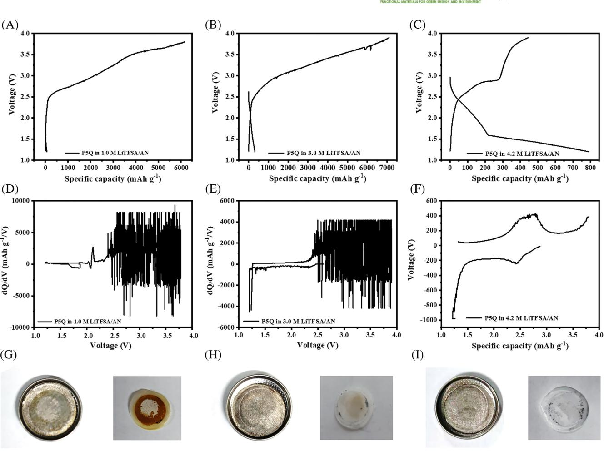
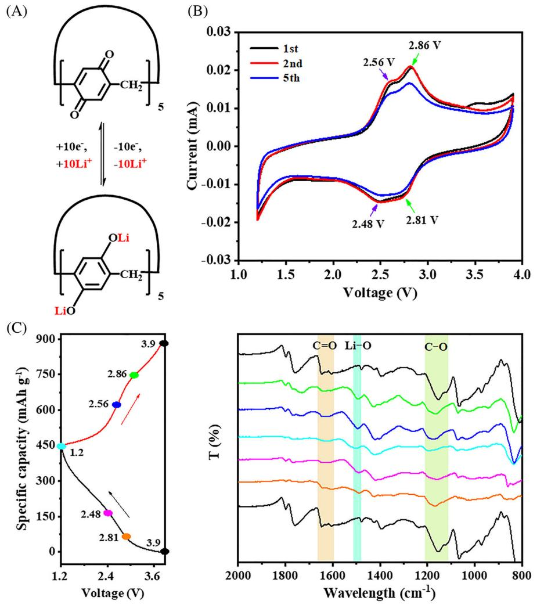
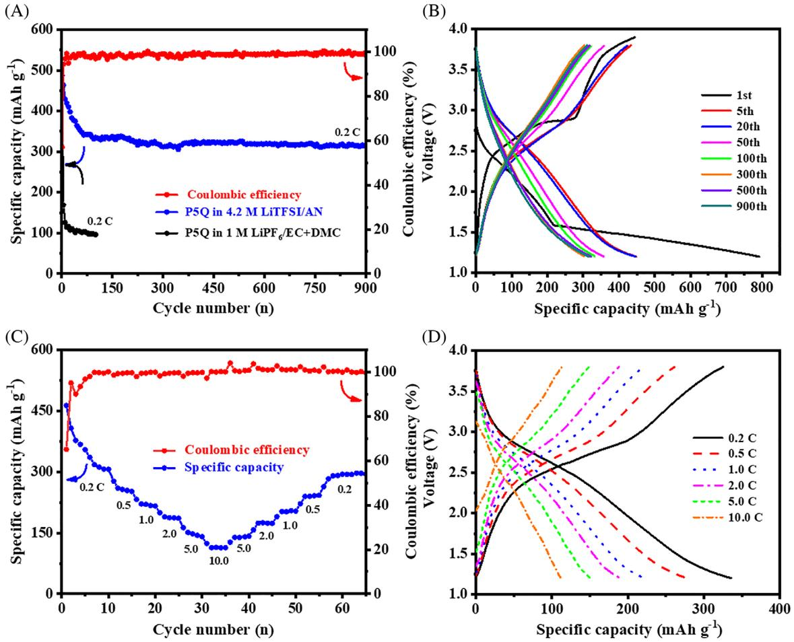
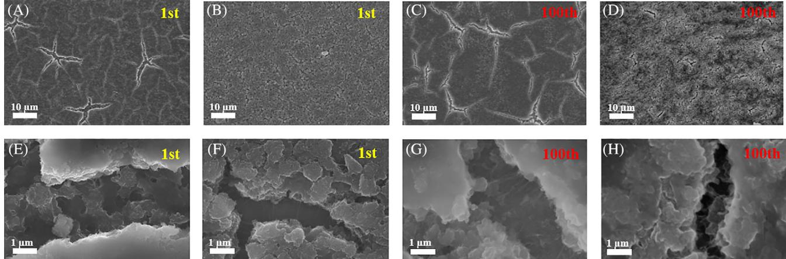
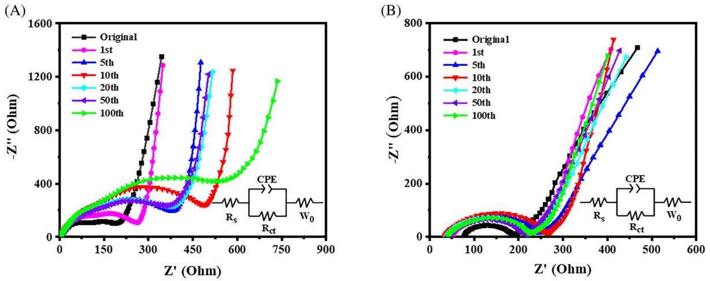
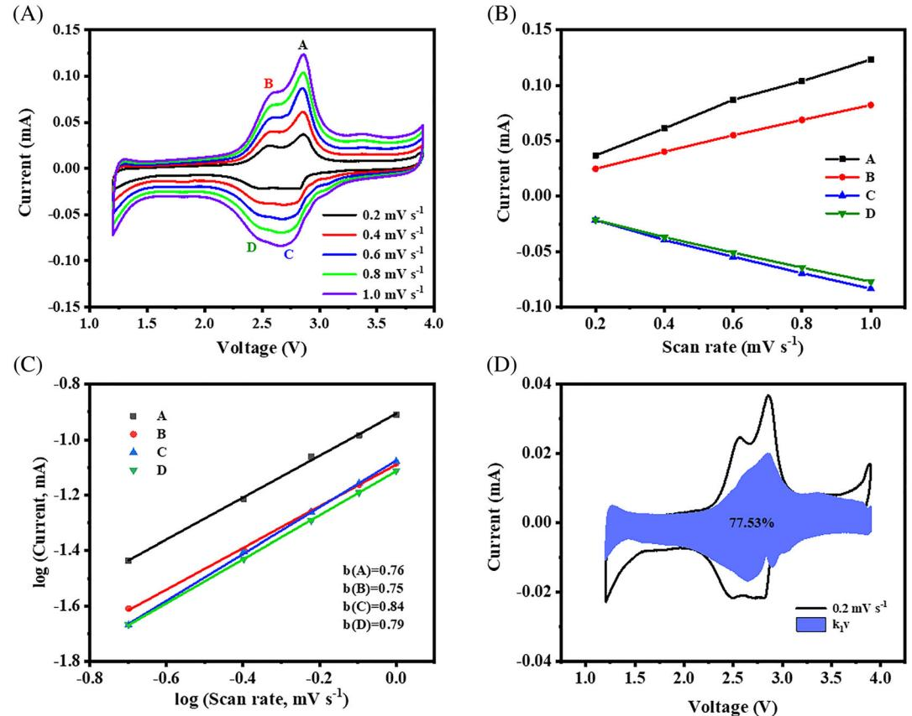

DOI: 10.1002/eom2.12128

#### RESEARCH ARTICLE

# Double-effect of highly concentrated acetonitrile-based electrolyte in organic lithium-ion battery

Weisheng Zhang1 | Huimin Sun1 | Pandeng Hu1 | Weiwei Huang1 | Qichun Zhang2,3

1 School of Environmental and Chemical Engineering, Yanshan University, Qinhuangdao, China

2 Department of Materials Science and Engineering, City University of Hong Kong, Hong Kong, China

3 Center of Super-Diamond and Advanced Films (COSDAF), City University of Hong Kong, Hong Kong, China

#### Correspondence

Weiwei Huang, School of Environmental and Chemical Engineering, Yanshan University, Qinhuangdao, Hebei 066004, China.

Email: [huangweiwei@ysu.edu.cn](mailto:huangweiwei@ysu.edu.cn)

Qichun Zhang, Department of Materials Science and Engineering, City University of Hong Kong, Hong Kong 999077, China. Email: [qiczhang@cityu.edu.hk](mailto:qiczhang@cityu.edu.hk)

#### Funding information

Natural Science Foundation of Hebei Province, Grant/Award Number: B2019203487; National Natural Science Foundation of China, Grant/Award Numbers: 21403187, 21875206

## Abstract

Organic electrode materials have become a hot research field in lithium-ion batteries. However, the dissolution issue of organic materials (especially small molecules) in traditional electrolytes has become one of the important reasons to limit their application. The usage of highly concentrated electrolyte (HCE, >3 M) has been demonstrated to solve this problem, where the electrochemical performance of Pillar[5]quinone (P5Q) in 4.2 M LiTFSA/AN electrolyte was investigated. The HCE can avoid the reaction between acetonitrile molecules and lithium metal anode, reduce the dissolution of organic materials, and display excellent battery performance. At a current density of 0.2 C, a high specific capacity of 310 mAh g1 (Ctheo = 446 mAh g1 ) was maintained after 900 cycles, and the reversible capacity is higher than 113 mAh g1 even at 10 C, indicating a good rate capability. This research would expand the new application of acetonitrile-based electrolyte in organic secondary battery.

#### KEYWORDS

highly concentrated electrolyte, lithium-ion batteries, organic electrode materials

# 1 | INTRODUCTION

Till now, lithium-ion batteries (LIBs) still occupy a dominant position in the portable device market due to their superior energy storage capacity.1–5 Especially, LIBs as large-scale energy storage equipment have been widely applied in new energy vehicles and smart grid storage systems.6,7 For ideal LIBs, high capacity, outstanding cycle stability and reliable safety are three key factors. However, in practical, rechargeable battery capacity is mainly limited by cathode.8–10 The practical capacity of lithium-containing inorganic cathode is less than 200 mAh g1 , which cannot match the practical specific capacity (above 330 mAh g1 ) provided by graphite anodes.11 Although organic materials have high theoretical specific capacity with several advantages including strong designability and good flexibility, their solubility in traditional electrolytes strongly limit their applications.12–14 Thus, improving the properties of material itself as well as the optimization of the electrolyte become important research directions. Especially for electrolytes, plastic crystal electrolytes, and ionic liquid electrolytes have been demonstrated to show outstanding performance.15–20

This is an open access article under the terms of the [Creative Commons Attribution](http://creativecommons.org/licenses/by/4.0/) License, which permits use, distribution and reproduction in any medium, provided the original work is properly cited.

© 2021 The Authors. EcoMat published by The Hong Kong Polytechnic University and John Wiley & Sons Australia, Ltd.

Continuing on the electrolyte research, the highly concentrated electrolyte (the lithium salt concentration exceeds 3 M, even close to the saturation) recently receive widespread attention again due to its excellent physical and chemical stability.21–24 In some non-aqueous electrolytes, when the concentration of lithium salt come up to a certain value, the properties of the bulk and interface will undergo benign changes, such as increased stability, decreased volatility, promoted ion mobility, and inhibition of aluminum current collector corrosion.25,26

As one of promising organic solvents used in nonaqueous electrolytes, acetonitrile (AN) has several advantages including strong oxygen resistance, high dielectric constant, and fast ion transport ability.27,28 However, AN is not suitable as a traditional electrolyte solvent in LIBs with lithium metal as an anode because it can react with lithium metal.29 Interestingly, in 2014, Yamada et al.30 found that increasing the concentration of lithium bis(trifluoromethanesulfonyl)amide (LiTFSA) would change the inherent low reduction stability of the AN solvent, making Li+ and TFSA with Li+-solvating AN solvents form a unique network structure (aggregates, AGGs, TFSA coordinating to two or more Li+ cations), which facilitated the application of AN in electrolytes. It is well known that this behavior of increasing the electrolyte concentration is conducive to form solvated molecules and reduce the free solvent, so as to avoid the dissolution of organic electrode materials.31 Based on the above discussion, in this research, we firstly applied 4.2 M LiTFSA/AN electrolyte to organic secondary batteries, where Pillar[5] quinone (P5Q) with a theoretical specific capacity of up to 446 mAh g1 was employed as organic cathodes. We found that the as-combined organic battery displayed a splendid rate performance up to 10 C with a reversible capacity of 113 mAh g1 . Moreover, a high specific capacity was maintained of 310 mAh g1 after 900 cycles at 0.2 C. We detailedly investigated the influence of 4.2 M LiTFSA/AN electrolyte on the lithium-ion storage with P5Q, and the result showed that the highly concentrated LiTFSA/AN electrolyte promoted the performance of organic electrode materials and is expected to be widely used in organic secondary batteries.

# 2 | RESULTS AND DISCUSSION

# 2.1 | Adaptation of material and electrolyte

The narrow energy gap (Eg) value is very important to facilitate the rapid transmission of electrons in electrodes. Previous calculation indicated that the Eg of P5Q was 3.43 eV by the density functional theory method, which is suitable as cathodes in LIBs.32 In this research, the experimental value of P5Q was calculated to be 3.75 eV through the combination of UV–Vis differential spectra analysis technology and the Tauc plot method (Figure S1).33–35 Note that this value is still lower than those of some organic materials (i.e., quinoxaline (4.65 eV).36

The P5Q-Li half-cells were assembled with 1, 3, and 4.2 M LiTFSA/AN electrolytes to discover the chemical reaction changes during the process of charging and discharging by dQ/dV curve. As shown in Figure 1(A–F), the reaction severely happened during the charging in 1 M and 3 M electrolytes. In contrast, the 4.2 M electrolyte showed normal redox characteristics. At the same time, we disassembled the battery to view the changes in the lithium negative electrode and the separator in Figure 1(- G–I). The first two lithium metals produced yellow stains and the separator also turned yellow, while the 4.2 M electrolyte had no obvious change. These results are consistent with those reported in the literature.30 Because the dissolution problem in traditional electrolyte seriously restricts the application of organic materials, we compared the absorption of P5Q cathode in 1.0 M LiPF6/EC-DMC (v: v = 1:1) and 4.2 M LiTFSA/AN, analyzing the different absorption of UV–Vis spectra in Figure S2. In 1.0 M LiPF6/EC-DMC (v:v = 1:1) electrolyte, the P5Q absorption peak was not initially detected, however over time, the absorption intensity gradually increased. In 4.2 M LiTFSA/AN electrolyte, no change was observed. These results indicate that 4.2 M LiTFSA/AN has a dissolving inhibitory influence on organic materials.

# 2.2 | Lithium storage mechanism of P5Q

The lithium storage mechanism of P5Q contributes from the enolization reaction of C═O, and its redox process was examined by the cyclic voltammogram (CV) curve in Figure 2(A,B). The CV curves of P5Q-based cells in 4.2 M LiTFSA/AN within a potential window of 1.2–3.9 V at a scan rate of 0.2 mV s1 . There were two reduction peaks stabilized at 2.48 V/2.76 V, respectively, whereas the two corresponding oxidation peaks located at 2.59 V/2.82 V. To further understand the responsible redox reactions between carbonyl and Li-ions, the changes in bonding state of P5Q was investigated and discussed for the first time through the characterization of Fourier transform infrared spectroscopy (FTIR). Figure 2(C) shows the different selected charge and discharge states for the ex-situ characterization, where three main peaks including C═O, Li O, and C O were detected, corresponding to the wavelength of 1650, 1493, and 1158 cm1 , respectively.37,38 During the discharge process, the transmission of the C═O peak decreased, the Li O peak increased and the C O peak changed slightly, suggesting that the

FIGURE 1 The first cycle charge and discharge curve P5Q half-cell (A) 1 M, (B) 3 M, (C) 4.2 M LiTFSA/AN. The dQ/dV curve (D) 1 M, (E) 3 M, (F) 4.2 M LiTFSA/AN. The lithium negative electrode and separator after the first charge and discharge: (G) 1.0 M, (H) 3.0 M, (I) 4.2 M LiTFSA/AN, respectively

oxygen atoms coordinated with Li-ions when the reduction reaction happened. On the contrary, the peak changes were reversed during charging.

# 2.3 | Electrochemical performance of P5Q in 4.2 M LiTFSA/AN

The cycle stability and rate performance profiles of P5Q in 4.2 M LiTFSA/AN electrolyte were presented in Figure 3(A–D). The P5Q cathode exhibited excellent cycle stability with an initial capacity of 791 mAh g1 (higher than the theoretical capacity of 446 mAh g1 and the initial coulomb efficiency of only 56%, which may be caused by the solid electrolyte interphase [SEI]39) and maintained 310 mAh g1 after 900 cycles at 0.2 C. Indeed, when the current density increased to 2 and 10 C, the batteries delivered 185 and 113 mAh g1 of considerable capacity, respectively. By comparing with the reported performance of P5Q (Table S1), the results in this work are more prominent.

In the powder XRD patterns (Figure S4), the pure P5Q have strong peaks, indicating high crystallinity. However, when the electrode was fabricated, no peaks were observed due to the influence of Ketjenblack, suggesting amorphous states. Also, there was no significant change in full discharge (1.2 V) and full charge (3.9 V), indicating the amorphous state was kept during electrochemical processing. Furthermore, the scanning electron microscopy (SEM) images of the P5Q electrode after fully discharged and charged were provided and compared in Figure 4(A–H). In the state of full discharge, the P5Q electrode formed a compact layered connection due to the intercalation of Li-ions, however, the cracks may be caused by the uneven coating of the material or the material accumulation and uplifting during the insertion of lithium. In the full discharge process, relativelyuniform voids were formed, caused by the deintercalation

FIGURE 2 (A) P5Q lithium storage mechanism, (B) 0.2 mV s1 cyclic voltammogram curve, (C) FTIR spectra of the electrolytes for different states intervals of cathode

of Li-ions. At the same time, the internal active material was confirmed to participate in the charging and discharging process. What's more, even after 100 cycles, the morphology under the charge and discharge state did not show significant change, which provided a strong evidence for the excellent cycle performance.

In order to study the electrochemical kinetic, the electrochemical impedance spectroscopy (EIS) of the system was tested and compared with the 1 M LiPF6-EC/DMC electrolyte in Figure 5(A,B). The change of resistance has experienced a process of gradual increasement from small to large and then to small again. The decreased impedance may be due to the improved contact between the active material and the viscous electrolyte during the cycle, or the formation of ion-channel-like with repeated charge and discharge, accelerating charge exchange. The increase may contribute from the deterioration of the contact between the active material and the conductive carbon during the repeated dissolution-redeposition process.31,40 The impedance change of 4.2 M LiTFSA/AN system is smaller than that of 1 M LiPF6-EC/DMC within 100 cycles, which might be attributed to the improvement of the dissolution-redeposition process in the high concentration system, leading to the more outstanding performance.

Moreover, the CV curves of variable-scan have been conducted to investigate the rapid Li-ion-transporting behavior of P5Q in Figure 6. The conductivity contribution rate of the capacitive-like reaction and the b value were analyzed through log i = b log v + log a. 37,41,42 In the range of 0.2–1.0 mV s1 at different scan rates, the pseudocapacitance characters of P5Q is 77.53% at 0.2 mV s1 , suggesting that this is a surface-controlled electrochemical behavior. Therefore, the diffusion distance of Li-ions is effectively shortened and the oxidation–reduction reaction is accelerated.

# 3 | CONCLUSION

In summary, the electrochemical performance of P5Q-4.2 M LiTFSA/AN system have been investigated and

FIGURE 3 (A) 0.2 C long cycle, (B) 0.2 C charge–discharge, (C) rate performance, (D) rate charge–discharge curve of P5Q in 4.2 M LiTFSA/AN electrolyte

FIGURE 4 Scanning electron microscopy images of (A) 1.2 V discharged (10 μm), (E) 1.2 V discharged (1 μm), (B) 3.9 V charged (10 μm), (F) 3.9 V charged (1 μm) at 1 cycle. (C) 1.2 V discharged (10 μm), (G) 1.2 V discharged (1 μm), (D) 3.9 V charged (10 μm), (H) 3.9 V charged (1 μm) at 100 cycle of cathode

discussed. The P5Q cathode possessed a long cycle life of 310 mAh g1 for 900 cycles at 0.2 C, and the splendid rate performance of 113 mAh g1 at 10 C. Through different characterization methods, the stability of P5Q under the system is explained as well. Moreover, the dual function of AN electrolyte system was realized, which 6 of 8 ZHANG ET AL.

FIGURE 5 The electrochemical impedance spectroscopy tests of (A) P5Q-1 M LiPF6-EC/DMC, (B) P5Q-4.2 M LiTFSA/AN

FIGURE 6 (A) Cyclic voltammogram curves of P5Q at various scan rates. (B) Linear relationship between the peak current and scan rate. (C) Determination of b-value using the relationship between the peak current and scan rate. (D) Capacitive-controlled contribution to charge storage of P5Q scan rate of 0.2 mV s1

could solve the material dissolution problem by stopping the reaction with lithium metal. These suggest that the dual function of AN electrolyte should have a great potential to improve the performance of organic electrode materials in the future.

# 4 | EXPERIMENTAL SECTION

P5Q was synthesized by a multi-step process according to the reported literatures.32,43,44 1H NMR (Figure S6), ESI-MS (Figure S7), and FTIR (Figure S8) of the as-prepared P5Q were provided in supporting information. The working electrode was prepared by mixing P5Q: Ketjenblack: polyvinylidene fluoride with a weight ratio of 3:6:1 binder in 1-methyl-2-pyrrolidone, and then, the slurry was pasted on aluminum foil and vacuum-dried at 80 C for 12 h. The CR2032 coin cell was assembled in an argonfilled glove box with lithium foil as the anode, 4.2 M LiTFSA/AN (molar ratio 1:1.9) as the electrolyte, and glass microfiber filter (0.7 μm) as the separator. FTIR spectra were performed on a FT-IR650, and the morphologies of the samples were observed on SEM (JSM7500F). On the battery test system (LAND CT2001 A), coin cells were charged/discharged with the voltage range of 1.2– 3.9 V, and the contribution of Ketjenblack (Figure S3) has been subtracted from the measured values. The cyclic voltammetry (CV) curve (1.2–3.9 V, 0.2 mV s1 ) was recorded on the CHI660E. EIS measurements were performed at 2.9 V with the frequency range of 105 to 102 Hz. All electrochemical tests were carried out at room temperature.

### ACKNOWLEDGMENTS

The authors acknowledge the financial support of the National Natural Science Foundation of China (No. 21875206, 21403187), and the Natural Science Foundation of Hebei Province (No. B2019203487). Qichun Zhang thanks the support of starting funds from City University of Hong Kong.

#### CONFLICT OF INTEREST

The authors declare no conflict of interest.

#### ORCID

Weisheng Zhang <https://orcid.org/0000-0001-8712-4740> Huimin Sun <https://orcid.org/0000-0003-4992-9200> Pandeng Hu <https://orcid.org/0000-0002-5030-4868> Weiwei Huang <https://orcid.org/0000-0002-6970-6525> Qichun Zhang <https://orcid.org/0000-0003-1854-8659>

#### REFERENCES

- 1. Zhang X, Ju Z, Zhu Y, et al. Multiscale understanding and architecture Design of High Energy/power lithium-ion battery electrodes. Adv Energy Mater. 2020;11:2000808.
- 2. Patel P. Improving the lithium-ion battery. ACS Cent Sci. 2015; 1:161-162.
- 3. Chen J, Wang S, Tao Z. Organic conjugated carbonyl compounds as electrode materials for lithium-ion batteries. Chin Sci Bull. 2013;58:3132-3139.
- 4. Li Y, Du YF, Sun GH, et al. Self-standing hard carbon anode derived from hyper-linked nanocellulose with high cycling stability for lithium-ion batteries. EcoMat. 2021;3:e12091.
- 5. Zhou W, Zhang M, Kong X, Huang W, Zhang Q. Recent advance in ionic-liquid-based electrolytes for rechargeable

metal-ion batteries. Adv Sci. 2021;8:2004490. [https://doi.org/10.](https://doi.org/10.1002/advs.202004490) [1002/advs.202004490](https://doi.org/10.1002/advs.202004490)

- 6. Zhao Q, Wang J, Lu Y, Li Y, Liang G, Chen J. Oxocarbon salts for fast rechargeable batteries. Angew Chem Int Ed. 2016;55: 12528-12532.
- 7. Li C, Zhang C, Xie J, Wang K, Li J, Zhang Q. Ferrocene-based metal-organic framework as a promising cathode in lithiumion battery. Chem Eng J. 2021;404:126463.
- 8. Guan P, Zhou L, Yu Z, et al. Recent progress of surface coating on cathode materials for high-performance lithium-ion batteries. J Energy Chem. 2020;43:220-235.
- 9. Lu Y, Hou X, Miao L, et al. Cyclohexanehexone with ultrahigh capacity as cathode materials for lithium-ion batteries. Angew Chem Int Ed. 2019;58:7020-7024.
- 10. Zhang W, Huang W, Zhang Q. Organic materials as electrodes in potassium-ion batteries. Chem A Eur J. 2021;27:6131-6144.
- 11. Libich J, Maca J, Vondrak J, Čech O, Sedlaříkova M. Irreversible capacity and rate-capability properties of lithium-ion negative electrode based on natural graphite. J Energy Storage. 2017; 14:383-390.
- 12. Huang W, Zhang M, Cui H, Yan B, Liu Y, Zhang Q. Costeffective biomass carbon/calix[4]Quinone composites for lithium ion batteries. Chem Asian J. 2019;14:4164-4168.
- 13. Xie J, Gu P, Zhang Q. Nanostructured conjugated polymers: toward high-performance organic electrodes for rechargeable batteries. ACS Energy Lett. 2017;2:1985-1996.
- 14. Long R, Wang GL, Hu ZL, Sun PF, Zhang L. Gradually activated lithium uptake in sodium citrate toward high-capacity organic anode for lithium-ion batteries. Rare Met. 2020;40: 1366-1372.
- 15. Zheng S, Hu J, Huang W. An inorganic-organic nanocomposite calix[4]quinone (C4Q)/CMK-3 as a cathode material for highcapacity sodium batteries. Inorg Chem Front. 2017;4:1806-1812.
- 16. Yan B, Wang L, Huang W, Zheng S, Hu P, Du Y. High-capacity organic sodium ion batteries using a sustainable C4Q/CMK-3/SWCNT electrode. Inorg Chem Front. 2019;6:1977-1985.
- 17. Huang W, Zhang X, Zheng S, et al. Calix[6]quinone as highperformance cathode for lithium-ion battery. Sci China Mater. 2019;63:339-346.
- 18. Sun JK, Sobolev YI, Zhang W, Zhuang Q, Grzybowski BA. Enhancing crystal growth using polyelectrolyte solutions and shear flow. Nature. 2020;579:73-79.
- 19. Huang W, Zhu Z, Wang L, et al. Quasi-solid-state rechargeable lithium-ion batteries with a calix[4]quinone cathode and gel polymer electrolyte. Angew Chem Int Ed. 2013;52:9162-9166.
- 20. Zheng S, Sun H, Yan B, Hu J, Huang W. High-capacity organic electrode material calix[4] quinone/CMK-3 nanocomposite for lithium batteries. Sci China Mater. 2018;61:1285-1290.
- 21. Das S. Highly concentrated nitrile functionalized disiloxane-LiFSI based non-flammable electrolyte for high energy density Li metal battery. J Electroanal Chem. 2020;879:114794.
- 22. Ren X, Zou L, Jiao S, et al. High-concentration ether electrolytes for stable high-voltage lithium metal batteries. ACS Energy Lett. 2019;4:896-902.
- 23. Nilsson V, Younesi R, Brandell D, Edström K, Johansson P. Critical evaluation of the stability of highly concentrated LiTFSI-acetonitrile electrolytes vs. graphite, lithium metal and LiFePO4 electrodes. J Power Sources. 2018;384:334-341.

# 8 of 8 ZHANG ET AL.

- 24. Robertson A, Li Z, Cao Y, et al. Observation of microheterogeneity in highly concentrated nonaqueous electrolyte solutions. J Am Chem Soc. 2019;141:8041-8046.
- 25. McOwen D, Seo D, Borodin O, Vatamanu J, Boyle P, Henderson W. Concentrated electrolytes: decrypting electrolyte properties and reassessing Al corrosion mechanisms. Energ Environ Sci. 2014;7:416-426.
- 26. Nilsson V, Kotronia A, Lacey M, Edström K, Johansson P. Highly concentrated LiTFSI-EC electrolytes for lithium metal batteries. ACS Appl Energy Mater. 2019;3:200-207.
- 27. Trinh ND, Lepage D, Ayme-Perrot D, Badia A, Dolle M, Rochefort D. An artificial lithium protective layer that enables the use of acetonitrile-based electrolytes in lithium metal batteries. Angew Chem Int Ed. 2018;57:5072-5075.
- 28. Shin M, Wu L, Narayanan B, et al. Effect of the Hydrofluoroether Cosolvent structure in acetonitrile-based solvate electrolytes on the Li(+) solvation structure and Li-S battery performance. ACS Appl Mater Interfaces. 2017;9: 39357-39370.
- 29. Suarez-Herrera F, Costa-Figueiredo M, Feliu M. Voltammetry of basal plane platinum electrodes in acetonitrile electrolytes: effect of the presence of water. Langmuir. 2012;28:5286-5294.
- 30. Yamada Y, Furukawa K, Sodeyama K, et al. Unusual stability of acetonitrile-based superconcentrated electrolytes for fastcharging lithium-ion batteries. J Am Chem Soc. 2014;136:5039- 5046.
- 31. Cai T, Han Y, Lan Q, et al. Stable cycling of small molecular organic electrode materials enabled by high concentration electrolytes. Energy Storage Mater. 2020;31:318-327.
- 32. Xiong W, Huang W, Zhang M, Hu P, Cui H, Zhang Q. Pillar[5] quinone-carbon Nanocomposites as high-capacity cathodes for sodium-ion batteries. Chem Mat. 2019;31:8069-8075.
- 33. Shen Z, Liu B, Pareek V, et al. Sustainable synthesis of highly efficient sunlight-driven Ag embedded AgCl photocatalysts. RSC Adv. 2015;5:80488-80495.
- 34. Bystrov S, Piccirillo C, Tobaldi M, et al. Oxygen vacancies, the optical band gap (Eg) and photocatalysis of hydroxyapatite: comparing modelling with measured data. Appl Catal B. 2016; 196:100-107.
- 35. Zheng J, Wang S, Gao L, Ma Z, Wang F, Wang J. Theoretical and experimental studies of Ba2SmTaO6 on crystal structure, electronic structure and optical properties. J Mater Chem C. 2018;6:1806-1814.
- 36. Huang W, Zheng S, Zhang X, Zhou W, Xiong W, Chen J. Synthesis and application of calix[6]quinone as a high-capacity organic cathode for plastic crystal electrolyte-based lithium-ion batteries. Energy Storage Mater. 2020;26:465-471.
- 37. Zhang C, Xu Y, He K, et al. Polyimide@Ketjenblack composite: a porous organic cathode for fast rechargeable potassium-ion batteries. Small. 2020;16:e2002953.
- 38. Luo Z, Liu L, Zhao Q, Li F, Chen J. An insoluble benzoquinonebased organic cathode for use in rechargeable lithium-ion batteries. Angew Chem Int Ed. 2017;56:12561-12565.
- 39. Dhattarwal HS, Chen Y-W, Kuo J-L, Kashyap HK. Mechanistic insight on the formation of a solid electrolyte interphase (SEI) by an acetonitrile-based Superconcentrated [Li][TFSI] electrolyte near lithium metal. J Phys Chem C. 2020;124:27495-27502.
- 40. Tsao Y, Lee M, Miller EC, et al. Designing a Quinone-based redox mediator to facilitate Li2S oxidation in Li-S batteries. Joule. 2019;3:872-884.
- 41. Hu Y, Tang W, Yu Q, et al. Novel insoluble organic cathodes for advanced organic K-ion batteries. Adv Funct Mater. 2020; 30:2000675.
- 42. Cai ZL, Peng ZL, Wang MQ, Wu JY, Fan HS, Zhang YF. Highpseudocapacitance of porous and square NiO@NC nanosheets for high-performance lithium-ion batteries. Rare Met. 2021;40: 1451-1458.
- 43. Zhang M, Zhang Y, Huang W, Zhang Q. Recent Progress in calix [n]quinone (n=4, 6) and pillar[5]quinone electrodes for secondary rechargeable batteries. Batteries Supercaps. 2020;3:476-487.
- 44. Zhu Z, Hong M, Guo D, Shi J, Tao Z, Chen J. All-solid-state lithium organic battery with composite polymer electrolyte and pillar[5]quinone cathode. J Am Chem Soc. 2014;136:16461-16464.

### SUPPORTING INFORMATION

Additional supporting information may be found online in the Supporting Information section at the end of this article.

How to cite this article: Zhang W, Sun H, Hu P, Huang W, Zhang Q. Double-effect of highly concentrated acetonitrile-based electrolyte in organic lithium-ion battery. EcoMat. 2021;3(5): e12128. <https://doi.org/10.1002/eom2.12128>