#### REVIEW ARTICLE

# Strategies to anode protection in lithium metal battery: A review

Jiawei Li1,2 | Zhao Kong1,2 | Xiaoxi Liu1,3 | Bocong Zheng4 | Qi Hua Fan5,6 | Elias Garratt4,6 | Thomas Schuelke4 | Keliang Wang4 | Hui Xu1,2 | Hong Jin1,2

1 Xi'an Jiaotong University, Suzhou Academy, Suzhou, China

2 Nano Science and Technology Institute, University of Science and Technology of China, Suzhou, China

3 College of Materials Science and Engineering, Huaqiao University, Xiamen, China

4 Fraunhofer USA, Inc. Center Midwest, Michigan State University, East Lansing, Michigan, USA

5 Department of Electrical Engineering and Computer Engineering, Michigan State University East Lansing, Michigan, USA

6 Department of Chemical Engineering and Materials Science, Michigan State University East Lansing, Michigan, USA

#### Correspondence

Hui Xu and Hong Jin, Xi'an Jiaotong University, Suzhou Academy, Suzhou, China. Email: [xhxuhui@xjtu.edu.cn](mailto:xhxuhui@xjtu.edu.cn) and [jhjinhong@mail.xjtu.edu.cn](mailto:jhjinhong@mail.xjtu.edu.cn)

Keliang Wang, Fraunhofer USA, Inc. Center Midwest, Michigan State University, East Lansing, MI. Email: [klwang@msu.edu](mailto:klwang@msu.edu)

#### Funding information

National Science Foundation, Grant/ Award Numbers: 1700785, 1724941, 1917577; China Postdoctoral Science Foundation, Grant/Award Number: 2020M671606; National Natural Science Foundation of China, Grant/Award Numbers: 21805221, 21905221; Natural Science Foundation of Jiangsu Province, Grant/Award Number: BK20191190

#### Abstract

Lithium metal batteries (LMBs) are considered the most promising energy storage devices for applications such as electrical vehicles owing to its tremendous theoretical capacity (3860 mAh g−1 ). However, the serious safety issues and poor cycling performance caused by the dendritic crystal growth during deposition are concerned for any rechargeable batteries with a lithium metal anode. To make widespread adoption a possibility, considerable efforts have been devoted to suppressing lithium (Li) dendrite growth. In this review, the recent strategies to developing dendrite free Li anode, including constructing an artificial solid electrolyte interface, current collector modification, separator film improvement, and electrolyte additive, are summarized. The merits and shortcomings for different strategies are reviewed and a general summary and perspective on the next generation rechargeable batteries are presented.

#### KEYWORDS

dendrite, Li metal batteries, solid electrolyte interface

## 1 | INTRODUCTION

Sustainable energy such as water and solar power1,2 are drawing intensive attention because of the increasing energy demands of a global economy and the terrible impacts of fossil fuels. Further, the distributed network of local power generating sources envisioned in the "Smart Grid" will be at least partially made up of "intermittent energy sources", that is, wind or solar power. To fully utilize the intermittent energy sources, efficient and

Jiawei Li and Zhao Kong contributed equally to this work.

This is an open access article under the terms of the [Creative Commons Attribution](http://creativecommons.org/licenses/by/4.0/) License, which permits use, distribution and reproduction in any medium, provided the original work is properly cited.

© 2021 The Authors. InfoMat published by UESTC and John Wiley & Sons Australia, Ltd.

economical electrical energy storage (EES) systems are required. Rechargeable batteries are the most suitable option for EES, which enables the energy storage and release flexibly on demand to maintain daily activities.3-7Li-ion batteries (LIBs) have been widely investigated due to the light weight and high energy density8-10 and successfully implemented in most portable electronic devices, such as mobile phones, electronic watches, and digital cameras with more than 11 billion dollar market in 2011.11Although the application of LIBs has expanded into larger domain, such as electrical vehicles (EVs), hybrid EVs, robots, and so on, the high energy storage densities (high gravimetric and volumetric energy density) for these applications remain a strong engineering challenge. To improve the performance of energy storage systems, researchers have been looking for new solutions beyond the conventional LIBs.12,13

Among varieties of alternatives, Li metal is recognized as a promising anode material due to its ultra-high theoretical specific capacity (3860 mAh g−1 ) and most negative electrochemical potential (−3.04 V vs. standard hydrogen electrode).14,15 Differing from the intercalationtype interactions in layered graphite anode, the Li metal anode is simply converted between Li metal and Li ions. Typically, electrons are lost for Li metal and being oxidized into Li ion during the discharge process, while electrons are gained for Li ions and reduced into metallic Li where deposited on the Li metal anode when charging. In the perspective of energy density, the Li metal batteries with metallic Li anode, such as Li-air batteries (5210 Wh kg−1 ), Li-sulfur (Li-S) batteries (2600 Wh kg−1 ),16-18 exhibits huge advantages compared to commercial LIBs (250 Wh kg−1 ) with a graphite anode. To date, considerable efforts have been devoted to developing ultra-high energy density Li-S and Li-air batteries.19-22 However, the safety issues caused by random growth of Li dendrites during Li deposition and low Coulombic efficiency (CE) induced by the formation of an unstable solid electrolyte interface (SEI) severely hinder its practical application.23,24 However, the superior ultra-high energy density positions the Li metal-based batteries for wide-spread commercialization if dendritic growth challenges are overcome.

The uncontrollable growth of Li dendrites is induced by the inhomogeneity and vulnerability of SEI formed on the metallic Li anode during the plating process. The dendrite may keep growing and consequently penetrate the separator film which will lead to short circuit of the cell and even catastrophic fires.25-27 Further, the growing Li dendrites may puncture the unstable SEI and then fresh Li metal is exposed, which would react with electrolyte, leading to continuous consumption of electrolyte and consequently deviling a high overpotential and low CE.28-31 In response to these issues, a number of approaches have been developed to restrain the formation of Li dendrites, including artificial SEI layer construction (inorganic or organic SEI layer),32-37 separator modification,38-42 current collector modification,43-48 additives of electrolyte,49-53 solid-state electrolyte, and so on.54-60

In this review, a variety of strategies aimed at suppressing the dendrite growth for metallic Li anode are reviewed. The first section focuses on the intrinsic Li metal dendrite-formation, growth mechanism, and SEI formation. In the following section, recently proposed protection strategies are systematically summarized from the perspective of components of a cell, such as electrode, electrolyte, current collector, and separator. Finally, a general summary and outlook are discussed for the future battery development.

## 2 | UNDERSTANDING DENDRITIC LI GROWTH

The dendritic growth of Li metal has been known since the 1960s, but the underlying mechanism was not yet understood.61 In recent years, the phenomenon has been comprehensively explained with the assistance of more advanced technologies, and its industrial application becomes more promising. Three main theories about why Li dendrites grow are proposed. First, the heterogeneous charge distribution on the uneven electrode surface leads to localized "hot spots" where Li preferentially nucleates.62 The continuous deposition and growth of Li on the electrode results in subsurface disturbance, causing a localized fracture in the SEI and consequently consumes amount of Li. Second, because of the high activity of Li, the electrode surface forms insoluble SEI layer by newly deposited Li reacting with the electrode. The SEI layer is not mechanically steady enough, so it is easily cracked during the Li stripping/plating process.63 The cracks in the SEI layer expose fresh Li metal and locally enhance the Li ion flux, which further aggravates the growth of uneven Li filaments and dendrites.64 Finally, unregulated reactions at the Li surface create spatial variations in interfacial resistance, which prompt dendrite formation.65 Figure 1 shows the typical dendritic Li plating and stripping at a current density of 5 mA cm−2 in a cell with cycling.66

## 3 | STRATEGIES

## 3.1 | Artificial SEI layer

SEI plays a crucial role in stabilizing the Li-electrolyte interface,61 which would prevent Li dendrites from

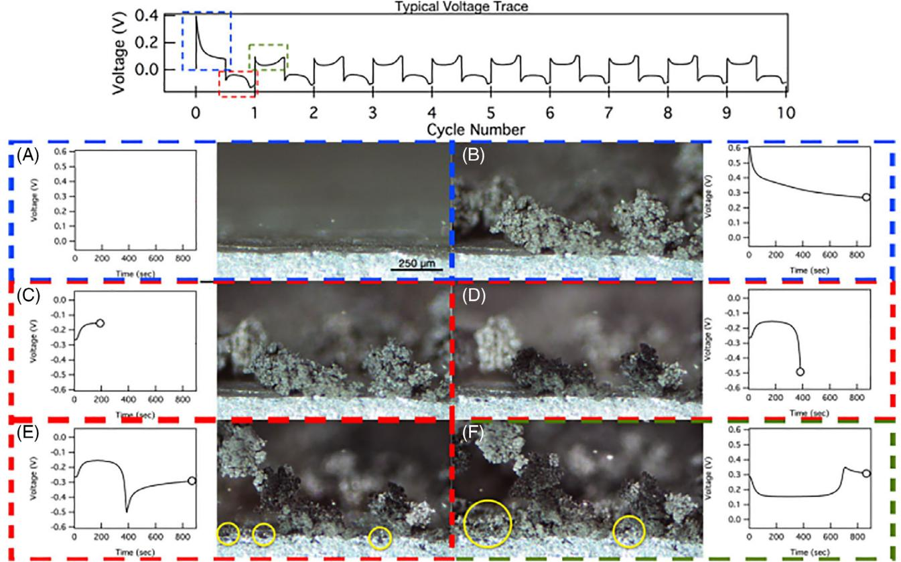

FIGURE 1 Morphology of electrodes at different stages. Li dendrites usually form dendritic structures through heterogeneous deposition of Li+ on the surface of the anode. (A) Before cycling. (B) After first half-cycle. (C) At cell polarization minimum. (D) At cell polarization maximum. (E) At end of half-cycle. (F) At end of third half-cycle.66 Reproduced with permission: Copyright 2016, American Chemical Society

puncturing the separator leading to battery failure through short-circuit or even fire. The composition and structure of the in situ formed SEI film is multifarious and uncontrollable, therefore not effective in restricting dendritic growth in the metallic Li anode. To address this issue, researchers have focused on designing varieties artificial SEI layer with high mechanical strength and Li ionic conductivity that are stable and compatible with different electrolytes for a long life cycling.62,67 Artificial SEI films are designed to possess the following properties: suppression of electrolyte decomposition and dendrite formation, ability to orient the changes in electrode volume, and promotion of uniform Li-ion transport throughout the whole electrode surface.68,69 These films can be classified into two major categories: inorganic (e.g., nitride, sulfide, fluoride, oxide) and organic SEI.

## 3.1.1 | Inorganic SEI layer

The synthesis of inorganic artificial SEI has been widely investigated due to its high mechanical strength and conductivity. Up to now, different materials, such as oxides, nitrides, and so on, have been applied as artificial SEI layer.70

#### Nitride

Nitrated SEI has been used to improve the cycling performance of Li metal anode. Liu et al. proposed the design of an artificial SEI layer composed of Cu3N nanoparticles bonded by styrene butadiene rubber (SBR) (Figure 2 (A)).71 SBR synchronously possesses highly good flexibility, mechanical strength, and indispensably high Li-ion conductivity for an ideal SEI. The CE can achieve up to 97.4% at a current density of 1 mA cm−2 on copper (Cu) current collector and the coating promoted a 40% increase in cycle life when paired with Li Titanate (LTO). Chen et al. adopted a nitrogen plasma-based growth technique to form a Li3N SEI on the Li metal chips-creating a protective layer after a few minutes treatment (Figure 2 (B)).72 The obtained Li3N SEI featured a pure [001] plane orientation possessing a high ionic conductivity and high Young's modulus. The cycling life of the cell was dramatically enhanced with such a stable Li3N layer. The

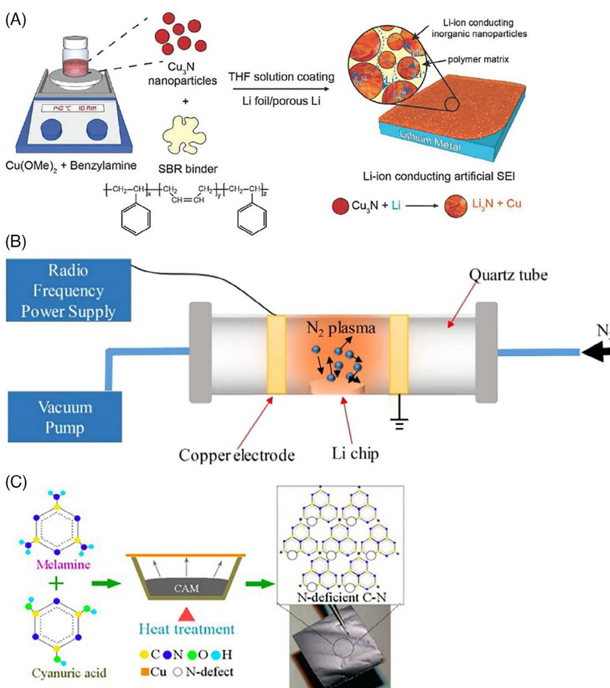

FIGURE 2 (A) Schematic illustration of the fabrication of the Cu3N + SBR composite artificial solid electrolyte interface (SEI).71 Reproduced with permission from Reference 71. Copyright 2017, John Wiley and Sons. (B) Plasma treatment experimental setup.72 Reproduced with permission from Reference 72. Copyright 2019, Elsevier. (C) Schematic illustration of the growth process of a N-deficient C N thin film on copper foil.73 Reproduced with permission from Reference 73. Copyright 2020, American Chemical Society

experiment demonstrates that LijjLiCoO2 cell with Li3N film possesses a lower overpotential and superior rate capability compared to bare Li anode. Most astonishing is its excellent capacity retention during cycling-a performance increase of more than 96% after 100 cycles. Though a strict vacuum condition is required for plasma ignition, this approach is fast and efficient method to modify the Li anode battery. Yang et al. deposited a Ndeficient C N thin film on Cu foil by reactive thermal evaporation which enhanced the conductivity of Li anode (Figure 2(C)).73 The film effectively inhibits severe dendrite extrusion and electric disconnect, gives LijjCu cells an extended cycling reversibility over 400 cycles, and a highly stable CE of 99% at a current density of 3 mA cm−2 .

#### Fluoride

Fluorides have gained enormous attention because of their excellent electrochemical stability over a wide potential window and tunability of the surface tension. Yuan et al. prepared a thin, porous layer (TPL) rich in LiF via an in-situ reaction between a small amount of ammonium hydrogen difluoride and Li metal (Figure 3 (A)).74 A flat and well-proportioned Li metal anode surface is obtained after deposited a LiF layer. Symmetrical cells consisting of a TPL Li anode show remarkably stable cycling performance for over 100 cycles at a high current density of 6 mA cm−2 . The TPL LijjLiFePO4 cells maintain a capacity retention rate of more than 99% after 100 cycles at a high rate of 2 C. Wang et al. also used a composite layer consisting of a PVDF-HFP polymer and

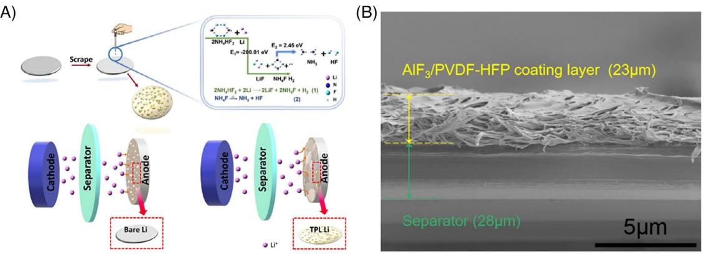

FIGURE 3 (A) Schematic of the fabrication procedure of TPL Li.74 Reproduced with permission from Reference 74. Copyright 2019, Elsevier. (B) SEM image revealing the thickness of the AlF3/PVDF-HFP coating and blank separator.75 Reproduced with permission from Reference 75. Copyright 2020, Royal Society of Chemistry

AlF3 particles as a coating on separator to regulate even Li deposition.75 Figure 3(B) shows the cross-sectional view of the AlF3/PVDF-HFP layer. This LiF-rich SEI layer effectively suppresses dendritic Li growth with a reduced interfacial impedance. A symmetric battery with modified electrodes show lower overpotentials and much longer cycling life (600 h) in comparison with pure LijjLi battery (45 h), while the LijjLiFePO4 battery with composite separator has a high capacity retention of 78.3% after 300 cycles at a high rate of 3 C. Xu et al. constructed an artificial LiF-rich SEI layer at molecular-level using one-step photopolymerization of hexafluorobutyl acrylate-based solution.76 The layer not only suppresses the dendritic growth but also blocks side reactions between the electrolyte and Li metal. With the LiF stabilized anode and NCM622 cathode, the fabricated full cell presents superior stable cycling performance at 1 mA cm−2 for over 500 h without failure.

#### Sulfide

Sulfurizing treatment for metal Li anode to form a sulfide SEI has been widely investigated due to the high ionic conductivity. Liu et al. constructed a Li-ion conductive Li2S/Li2Se (LSSe) protection layer by a facile and inexpensive gas–solid reaction (Figure 4(A)).77 The artificial SEI can prevent nonuniform ion flux and Li deposition structures. The LSSe@LijjLiFePO4 full cell displays a better cycle performance and stable CE compared with the bare Li metal anode based full cell, delivering a highcapacity retention rate of 91.5% at the current density of 160 mA g−1 at the rate of 1 C after 450 cycles. Moreover, the LSSe artificial SEI can also significantly alleviate the suffering polysulfide reduction with metallic Li for Li-S battery. Meyerson et al. developed a sulfur-rich molybdenum sulfide film coated on the anode, which enables a long cycle life and high CE of Li metal battery (Figure 4 (B)).78 The MoSx layer results in less exposed Li and dead Li compared to Li deposited on bare Cu. It is worth noting that the average CE for the first 100 cycles of MoSxjjCu cells reaches up to 98.3% at a current density of 0.5 mA cm−2 with a life cycle of 500 cycles. Zhai et al. proposed a facile method to preparing a highperformance current collector by in-situ construction of an electric passivation Li sulfide (Li2S) layer with high ionic conductivity on 3D porous Cu foam (Figure 4(C)).79 The Li2S protective layer can effectively restrain dendritic Li growth and, as a result, the modified current collector exhibits long-term cycling of 500 cycles at 1 mA cm−2 and stable electrodeposition capabilities of 4 mAh cm−2 at an ultrahigh current density of 4 mA cm−2 . Besides, full cells with LiFePO4 cathode paired with this designed 3D anode only require 200% extra Li versus 3000% extra Li for pure Li foil-based cells, which shows superior stability and rate performance.

#### Oxide

Oxides are widely used as protection layers owing to their high chemical stability resistant to corrosion from the electrolyte. Wu et al. coated m-SiO2/PVDF film (10 wt% SiO2) on Li foil by a simple doctor-blading method.80 Figure 5(A) illustrates the working mechanism of a hybrid artificial SEI layer composed of a PVDF polymer and mesoporous SiO2. The inorganic SiO2 filler effectively adjusts ionic movement and enhances mechanical stiffness for symmetrical cells. The artificial SEI maintains a stable cycling performance for 1000 h at a high capacity of 5 mAh cm−2 , which remarkably enhances the life span under specified conditions in combination with different commercial cathodes. Zhang et al. exploited a Li-free electrode with ultrathin Al2O3 coated on reduced graphene oxide (rGO) membrane which covers a Cu foil current collector.81 Figure 5(B) shows the principle of Li

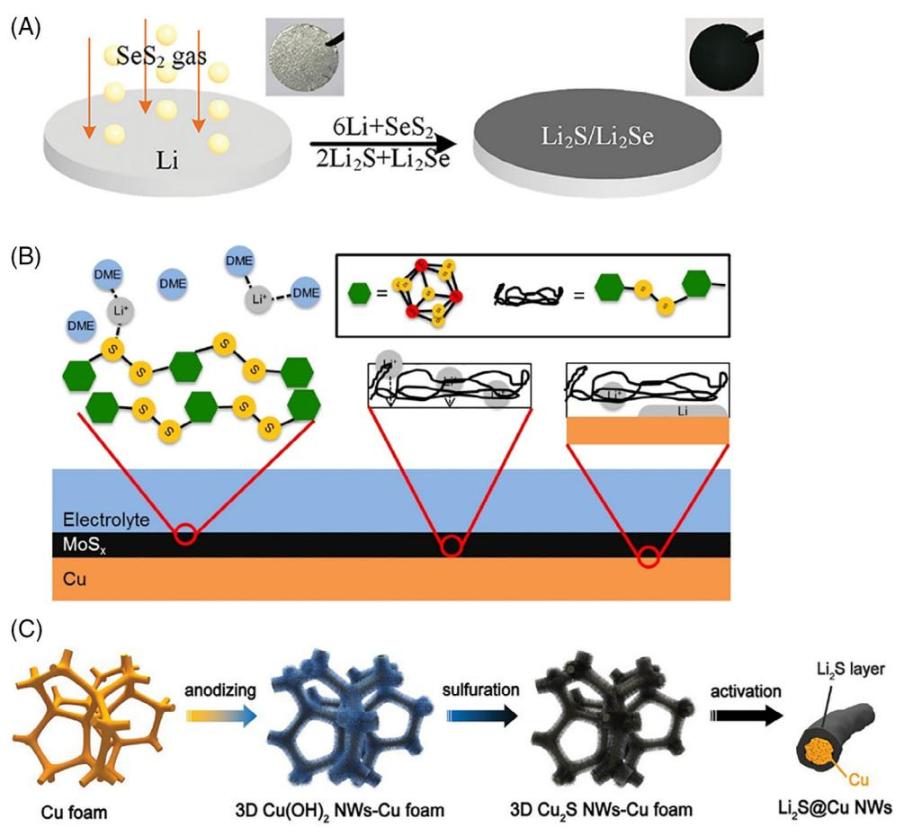

FIGURE 4 (A) Schematic illustration of fabrication process of LSSe@Li anode.77 Reproduced with permission from Reference 77. Copyright 2020, John Wiley and Sons. (B) Schematic of Li+ desolvation and transport through the MoSx film.78 Reproduced with permission from Reference 78. Copyright 2020, John Wiley and Sons. (C) Schematic of the 3D Cu2S NWs-Cu foam fabrication process.79 Reproduced with permission from Reference 79. Copyright 2020, John Wiley and Sons

plating behavior on rGO-coated Cu and ALD-Al2O3@rGO-coated Cu current collector. The composite electrode possesses excellent interfacial protection that can inhibit the penetration of Li dendrite. The electrochemical results indicate >90% CE over 100 cycles at the current density of 0.5 and 1.0 mA cm−2 with a deposition capacity of 1 mAh cm−2 . Further, this superior electrochemical performance is sustained even at a high deposition capacity of 2 mAh cm−2 .

## 3.1.2 | Organic SEI layer

The application of artificial organic SEI layer for Li anode has attracted extensive attention on account of its high strength, outstanding adhesion to the Li anode, and tolerance to dilatation and contraction stresses.

Zhong et al. fabricated a Li alginate-based artificial SEI (ASEI) layer, which is chemically steady and allows smooth Li ion transport on the surface of Li metal anode (Figure 6(A)).82 The Li anode with ASEI layer shows more effective suppression of dendrite growth and stable Li insertion/removal behavior compared with the bare LMAs. The symmetric LijjLi cells with the ASEI layer can steadily cycle for 850 and 350 h at current densities of 0.5 and 1 mA cm−2 , respectively. In the full cell with LiFePO4 cathode and ASEI layer-modified metallic Li anode, an ultrahigh capacity retention of 94.0% and a CE of 99.6% after 1000 cycles at the rate of 4 C are reported. Kang et al. exploited a Li alkoxides protection layer for Li anode by using a spin coating method.35 Figure 6(B) shows the evolution of morphology of SEI formed in different ways. With the assistance of organic alkoxide layer, the reaction between the electrolyte and Li is effectively suppressed, and both the interfacial resistance and Li deposition overpotential are significantly reduced. More importantly, Li anode layer modified with organic alkoxide demonstrates a more stable cycling performance with less volume expansion, 10%, compared to that of bare Li anodes (30%). Feng et al. constructed a

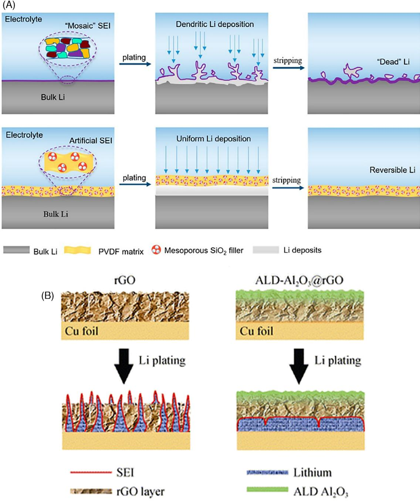

FIGURE 5 (A) Schematic illustrations of the working mechanism of a hybrid artificial solid electrolyte interface (SEI) layer composed of a PVDF polymer and mesoporous SiO2. 80 Reproduced with permission from Reference 80. Copyright 2020, American Chemical Society. (B) Schematics of Li plating behavior on rGO-coated Cu and ALD-Al2O3@rGO-coated Cu current collector (rGO-coated Cu leads to growth of dendritic Li, while ALD-Al2O3@rGO coating leads to a uniform plating of Li).81 Reproduced with permission from Reference 81. Copyright 2018, Springer

stable artificial SEI layer by directly coating PAA layer on the surface of a 3D Li framework (Figure 6(C)).83 The in situ formed high-ion conductive LiPAA effectively restrains Li dendrites by facilitating Li+ transmission rather than deposition. As a result, PAA@Li matrix exhibits near-zero volume change upon the cycling and intensive battery performance with excellent cycling stability for 350 h at both high areal capacity (5 mAh cm−2 ) and high current density (5 mA cm−2 ). Additionally, the LiCoO2jjPAA@Li matrix full cell demonstrates outstanding long-term stability of 81% retention after 1000 cycles. The novel capped 3D framework may open up a new horizon to achieve highly stable Li anode with zero volume change.

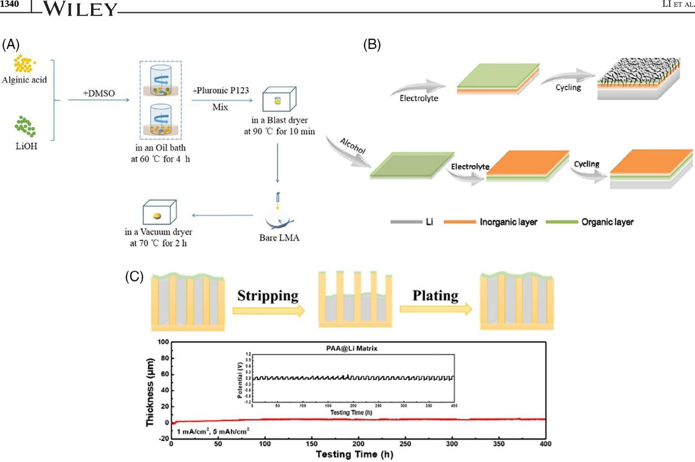

FIGURE 6 (A) Scheme of fabrication procedure for the ASEI layer-protected LMA.82 Reproduced with permission from Reference 82. Copyright 2019, American Chemical Society. (B) The morphology evolution of natural-formed solid electrolyte interface (SEI) and rearranged SEI with alcohol pretreating process.35 Reproduced with permission from Reference 35. Copyright 2020, Elsevier. (C) Schematic illustration of the fabrication process of PAA-capped Li matrix.83 Reproduced with permission from Reference 83. Copyright 2020, Elsevier

The severe dendritic growth problem of Li metal significantly impacts its performance as a rechargeable battery. Coating of artificial SEI layers on Li metal is remarkable in its ability to suppress dendritic growth and improve the electrochemical performance of the battery. However, research into artificial SEI layers is still at the preliminary stage so there is much of underlying mechanisms, which remains unknown. Additional research needed to understand SEI layers include: (i) develop advanced in situ characterization technology to provide deep understanding about the regularity and mechanism of artificial SEI formation, (ii) develop cheaper and simpler methods of preparation, and (iii) combine the artificial SEI layer approach with other methods to further improve the performance of Li metal batteries to bring unexpected effects.

## 3.2 | 3D current collector

To be an ideal current collector for the anode in Li metal battery, excellent chemical stability, high electrical conductivity, and excellent mechanical stability are required to avoid any reaction with electrolyte. In this regard, carbon, metal, and lithiophilic current collector are emerging and being investigated. Novel 3D porous current collector scaffolds for Li-based battery technology in particular are receiving considerable attention due to its low impact on battery performance and matching requirements to other battery components. The skeleton of a 3D current collector inhibits the dendritic Li growth in two main ways: (i) large surface-to-volume ratio increases interaction time of Li ions with collector thereby consuming Li ions which may form dendrites and (ii) normalizes Li ion flux through the collector thereby improving uniformity of Li plating or stripping on lithophilic sites.15,84-86 In addition, the 3D porous current collector is acts as a stable Li host material. Its excellent mechanical strength ensures the high structural stability of Li anode during fast and repeated Li plating and stripping. As a result, the 3D Current collector can effectively avoid issues such as the uneven Li deposition, severe volume change, and safety risks of Li metal battery.85

## 3.2.1 | Carbon-based 3D current collector

A carbon-based 3D current collector is easy to manufacture and modify. The intrinsic properties of high conductivity, flexibility, and light weight for carbon greatly strengthen performance when incorporated into an Li anode.87

Zhang et al. proposed a Al2O3-coated 3D carbon nanotube sponge (CNTS) as a Li deposition host by using atomic layer deposition (ALD) technology (Figure 7(A)).88 The high specific surface area of the CNTS enables homogenous charge distribution for Li nucleation and minimizes the effective current density to overcome dendrite growth.

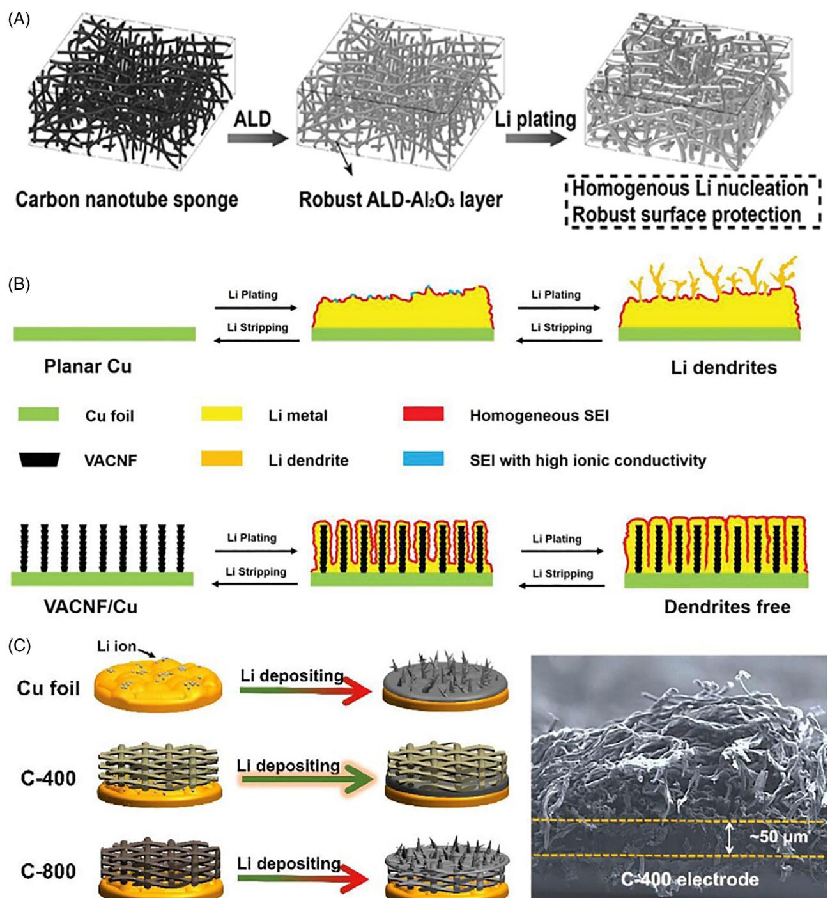

FIGURE 7 (A) Schematic illustration of the Li deposition process on 3D ALD-CNTS substrates.88 Reproduced with permission from Reference 88. Copyright 2017, Springer. (B) Schematic processes of Li plating and stripping in the planar Cu electrode and the electrically conductive 3D VACNF/Cu host.89 Reproduced with permission from Reference 89. Copyright 2019, John Wiley and Sons. (C) Schematic diagrams of Li deposition on the bare Cu foil, C-400 electrode and C-800 electrode.90 Reproduced with permission from Reference 90. Copyright 2020, Elsevier

Through this restriction, Li@ALD-CNTS electrodes have exhibited stable voltage profiles with a small overpotential ranging from 16 to 30 mV over 100 h of cycling at 1.0 mA cm−2 is exhibited. Moreover, the electrode presents an excellent electrochemical stability with a CE of 92.4% over 80 cycles at 1.0 mA cm−2 . These results provide guidance on how to design a current collector with stable Li metal anodes. Chen et al. employed a vertically aligned carbon nanofiber (VACNF) array with unique conically stacked graphitic structure directly grown on a planar Cu current collector (VACNF/Cu) as a high-porosity 3D host to suppress dendrite growth from the Li anode.89 Figure 7 (B) shows the process of Li plating and stripping in the planar Cu electrode and the electrically conductive 3D VACNF/Cu host. The excellent electrical conductivity and highly active lithiophilic graphitic edge sites facilitate homogenous coaxial Li plating/stripping around each VACNF and result in a uniform solid electrolyte interphase. The high specific surface area and open nanoscale vertical 3D structure lower the local current density and accommodate volume change, leading to the suppression of dendrite growth. Consequently, the Li-S battery using a Li plated VACNF/Cu anode presents outstanding rate performance at a high capacity of 2 mAh cm−2 and supernal cycling stability with no fade in capacity over 600 cycles-better performance than that of bare Cu current collector. Meng et al. also prepared light weight 3D carbon cloth (C-400) via a simple pyrolysis of cotton, a process which results in a large amount of polar functional groups.90 Figure 7(C) shows Li deposition on the bare Cu foil (a), C-400 electrode (b), and C-800 electrode. The polar functional groups play crucial roles in normalizing Li plating/stripping behavior and increasing the lithiophilicity of carbon cloth. As a result, the C-400 electrode can achieve a lofty areal capacity over 10 mAh cm−2 without the formation of Li dendrites. Additionally, the C-400@LijjLiNi0.8Co0.15Al0.05O2 full cell displays better voltage polarization, rate performance than that of bare Li anode. Benefiting from the environmentally friendly and abundant resource of the precursor of electrode, this method gives a broad prospect for high energy density Li batteries.

## 3.2.2 | Metal-based 3D current collectors

The metal-based 3D current collector has better electron transfer and mechanical properties compared to carbonbased or 3D framework alone due to its unique physical properties (Figure 8(A,B)).15 Chen et al. fabricated a dynamic intelligent Cu (DICu) current collector with a granular piling structure via solution casting of commercial Cu microparticles onto Cu foils demonstrating excellent performance.91 Collection and interaction among the Cu MPs before and after Li plating are illustrated in Figure 8(B). The fabricated current collector can adapt to volume change through alteration of the packing density of assembled particles. As a consequence, the Li/DICu electrode achieves a CE above 99.6% even after 800 cycles and the symmetrical cell retains excellent cycling stability over a high current density of 10 mA cm−2 . Wang et al. fabricated a vertically aligned Cu micro-channel using a laser micro-processing system.92 Figure 8(C) shows distinct differences of Li deposition between planar Cu and porous Cu. These micro-channel structures visibly suppressed the formation of dendritic Li through a combination of Cu pore size, shape, and surface-to-volume ratio. The proper combination was found to effectively control the current density distribution, thereby controlling dendrite formation. This resulted in an average CE of 98.5% within 200 cycles, additionally, the LiFePO4jjLi full battery shows excellent rate capability and stable cycling performance. This method provides simple and reliable conceptual framework to formulate a new generation of Li-ion batteries. Lim et al. developed a low-cost, simple method to construct a firm Cu porous framework by extrusion 3D-printing (Figure 8(D)).93 The 3D-printed Cu framework (3DP-Cu) can hold constructed microchannels between filaments even over supernal compressive pressure of 1.4 MPa, which would effectively restrain Li dendrite growth and alleviate volume changes. The cell with 3DP-Cu based Li anode reaches an exceptional areal capacity of 20 mA h cm−2 with over 1 mA cm−2 , and steady Li plating/stripping behavior even at a high current density of 10 mA cm−2 . The work provides a novel and promising approach for fabricating copperbased electrodes or materials using 3D-printing for advanced battery applications and beyond.

## 3.2.3 | Lithiophilic 3D current collector

The concept of "lithiophilicity", proposed by Cui et al., is based on previous studies related to the wetting behavior of Li between the molten Li and network surface.86 From this concept, lithiophilic 3D current collector are expected to effectively regulate the concentration of Li ions in the electrolyte and electrolyte/Li interface, sequentially restrain the Li dendrites, and ultimately achieve superb cycling stability.

A typical method to achieve lithiophilicity is to decorate the current collector with uniform lithiophilic functional groups. Kong et al. exploited porphyrin-derived graphene-based nanosheets (PNG) by pyrolyzing a conformal and thin layer of 2D porphyrin organic framework on graphene (Figure 9(A)).94 The structure possesses ample lithiophilic functional groups, such as pyridinic,

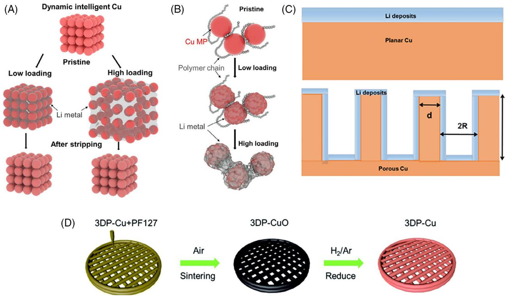

FIGURE 8 (A) Illustration of the Li plating and stripping process on the DICu current collector.91 Reproduced with permission from Reference 91. Copyright 2020, American Chemical Society. (B) Schematic of the interaction among the Cu MPs varied before and after Li plating.91 Reproduced with permission from Reference 91. Copyright 2020, American Chemical Society. (C) Li deposition of planar Cu and porous Cu.92 Reproduced with permission from Reference 92. Copyright 2017, John Wiley and Sons. (D) Schematic illustration of the fabrication process of 3DP-Cu.93 Reproduced with permission from Reference 93. Copyright 2020, Royal Society of Chemistry

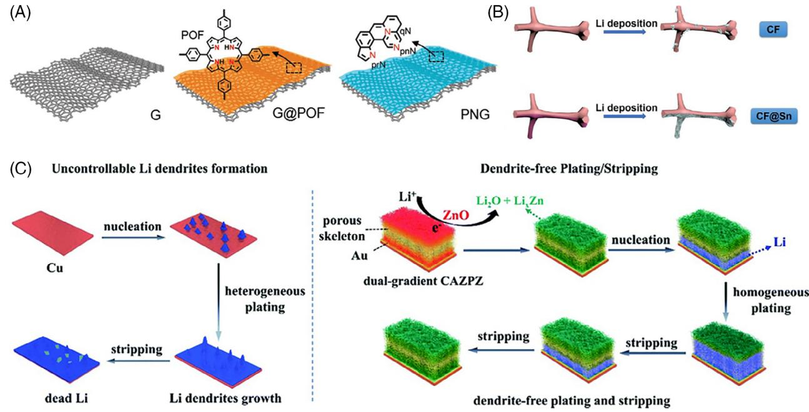

FIGURE 9 (A) fabrication process of PNG.94 Reproduced with permission from Reference 94. Copyright 2018, John Wiley and Sons. (B) Schematic illustration of the Li deposition process on bare CF and composite CF@Sn current collector.95 Reproduced with permission from Reference 95. Copyright 2020, John Wiley and Sons. (C) Li plating/stripping behavior on Cu and Cu Au ZnO PAN ZnO current collectors.96 Reproduced with permission from Reference 96. Copyright 2020, Royal Society of Chemistry

pyrrolic, and quaternary nitrogen atoms. These functional groups have a strong affinity for Li ions, as a result, the Li anode with PNG current collector presents an excellent electrochemical stability with Coulombic efficiency of 98% after 200 cycles at 1.0 mA cm−2 . Lithiophilicity can be achieved via other methods, such as letting Li react with metal, metal oxide, or other substances to form a lithophilitic compound. Liu et al. constructed a 3D copper foam by depositing a thin lithiophilic tin (Sn) layer on the copper foam (CF) surface, which was accomplished using physical vapor deposition (PVD).95 Figure 9(B) shows the Li deposition process on bare CF and composite CF@Sn current collector. In the modified current collector, the Li ions tend to deposit on the Sn layer to form the Li-Sn alloy, which can restrain Li dendritic growth. Ultimately, the composite matrix leads to a high CE (98.5%) over 400 cycles for the symmetric cell at 1 mA cm−2 . For the full cell with CF@Sn@Li and LiFePO4 cathode, excellent rate performance and discharging capacity of 140 mAh g−1 with high capacity retention of 95.2% after 300 cycles at 0.5 C are presented. By reasonably utilizing the lithiophilic/lithiophobic materials, it is also possible to accommodate even Li deposition.15 Zheng et al. used combined electrostatic spinning and magnetron sputtering to produce a 3D porous dual-gradient (philicphobic-philic) Cu-Au-ZnO-PAN-ZnO (CAZPZ) current collector. Figure 9(C) shows the Li plating/stripping process on Cu and Cu-Au-ZnO-PAN-ZnO current collectors. The Li metal battery can effectively decrease nucleation overpotential and even accommodate Li deposition by combining lithiophilic Au and dual-gradient ZnO. Consequently, the symmetric cell shows a long cycle capacity for 1200 h at 0.5 mA cm−2 . Additionally, the CAZPZ current collector greatly enhance the electrochemical performance of full cell systems matched with LTO, LFP and MNC-411 cathode materials.

Although good results have been obtained in the laboratory, 3D current collectors are still far from actual production. Further research is needed in order to realize full utilization and commercial adoption of the 3D current collector, including: (i) development of carbon nanostructures structures to change surface-to-volume ratios and consequently boost the CE of battery, (ii) increase specific energy while decreasing mass density of the metal collector, (iii) address the problem of mass gain in the anode due to the presence of increased voids in 3D scaffolds.

## 3.3 | Separator film modification

The separator plays an important role in improving electrochemical performance of the battery by avoiding direct interaction between positive and negative electrodes and granting the ions transportation. Nowadays, researchers focus on the modification of Li metal anode and designing artificial SEI to inhibit the dendritic Li growth to enhance Li battery performance. However, separators also play an important role in terms of prohibiting the direct interaction between positive and negative electrodes and granting ion transport. Therefore, it is necessary to discuss the role of separators in order to comprehensively ameliorate the performance of Li metal batteries.38,97 Recently, some researchers have tried to exploit novel separators by upgrading the ion conductivity and wettability.98 Hasanpoor et al. studied the dependence of the electrochemical performance on the property of separators.99 The results demonstrate that a high-quality separator can facilitate the formation of relatively stable SEI, which inhibits the emergence and accumulation of inactive substances and reduces the continuous electrolyte consumption, subsequently, improving the cycling stability of Li metal batteries. Thus, it is of great significance for the development of separators for Li metal batteries.

The most widely used commercially available separator in Li secondary batteries is the microporous polyolefin. Due to their performance97,100 such as good chemical stability, uniform pore structure and distribution, and low cost,101,102 polyethylene (PE), polypropylene (PP) and their hybrids are becoming the most representative separator materials in this field. However, there are plenty of factors that limit their extensive development—their poor wettability and absorbability in liquid electrolytes, causing low conductivity and high impedance of Li ions in liquid electrolyte. In addition, the polyolefin separator has poor thermal stability, which will cause short circuiting and even explosion of the battery, a significant safety hazard.103-105 In order to overcome the deficiencies of traditional polyolefin multiple approaches have been suggested including novel membrane design, the introduction of a multilayer functional membrane, or modification of the microporous polyolefin membrane.

## 3.3.1 | Modify the microporous polyolefin membrane

Polyolefin separators have been commercially used in batteries; however, the mechanical stability, ion conductivity, and wettability of the electrolyte are relatively poor. In order to improve its properties, nanostructured materials, such as porous carbon or silicon nanowires are used to coat on the surface of the films.

Han et al. were first in researching activated carbon nanofibers (ACNF) coated on a traditional commercial

PP septum. Their results show the flexible and robust ACNF filter-coated separator with adjustable micropores can effectively improve cycle stability of Li-based battery.106 Kannan et al. modified a conventional PE membrane by coating nitrogen and sulfur on graphene (NSG), which effectively inhibit the growth of Li dendrites (Figure 11(A))107 by enhancing the interfacial interactions between the NSG-coated separator and the Li electrode. These designs not only effectively improve the ion conductivity of the separator but also greatly increase the thermal stability and safe operation of the separator.

The addition of silicon nanomaterials also enhances the properties of polymer membranes. For example, Li et al. were first to report silicon nanowires (SNFs) grown on the surface of the PE membrane (Celgard 2400) leading to the fabrication of superlephilic/superhydrobic separators (Figure 11(B)).100 In such a design, the wettability, Li ion conductivity and thermal stability of the membrane are significantly improved due to the addition of the SNFs. Therefore, it provides an advanced idea for the further development of Li metal batteries.

In addition to the exploration of membrane coating materials, researchers have also been exploring different coating methods to achieve effective results. Ma et al. developed a simple, binder less coating method called Langmuir–Blodgett Scoping (LBS).108 This simple coating method can rapidly prepare polyaniline (PANI), multiwalled carbon nanotube (MWCNT) and other multifunctional materials onto the porous and nonporous solid scaffolds by using self-assembly of air/water interface and Marangoni stress.

## 3.3.2 | Design novel separators

Modification of the traditional polyolefin membrane has been well developed and studied; however, these modifications can come at a cost. According to Yang et al., there are defects can arise due to the modification of the polyolefin membrane, such as; blocking the ion transport channels and increasing thickness, and reducing Li+ conductivity shown to increase the impedance of the batteries.100,109,110 As can be clearly shown in Figure 10, modifying the surface of polyolefin membrane, leads to thickening of the membrane. Meanwhile, a dense coating layer would partially block the structure of porous polyolefin membrane, making the ion transport path longer in the solid phase and thus reducing the rate performance of the battery. Further, the modified layer is weak, so it is likely to become dislodged or break during charge and discharge process. To date, no methods have been shown to effectively solve the poor mechanical properties and high-temperature resistance of polyolefin films. Attention has therefore turned to polymer separator, due to their unparalleled electrolyte absorption, ion transfer performance and high-temperature resistance. These polymer membranes are generally electrospun polymer nanofiber materials, commonly including poly-vinylidene fluoride (PVDF), poly-acrylonitrile (PAN), and others. They exhibit high specific surface area and porosity, making them ideal materials to improve channels or pathways for Li ion transportation and the electrolyte uptake.98

#### Poly-vinylidene fluoride

Yang et al. developed a novel nano Li ion transport channel interlayer for Li battery applications (Figure 11 (C)).112 This kind of intermediate layer is formed by swelling the dense PVDF membrane electrolyte and isolating the polysulfide component through a size repulsion effect. In this way, the polysulfide component cannot transport to the surface of Li anode, reducing the consumption rate of the Li anode during operation. This strategy provides insight toward developing highperformance membranes for Li batteries.

#### Poly-acrylonitrile

PAN is considered as a suitable polymer for battery separator application, due to its remarkable oxidation resistance, easy processing characteristics, and excellent thermal stability.104 Hu et al. designed an ammoniated polyacrylonitrile nanofiber separator (APANF) to effectively inhibit the formation of Li dendrites and the shuttle effect of polysulfide. PAN was further decorated by using PEI to functionalize the surface.98 The cross-linked nanofiber structure and high density of polar groups attached to the surface produce uniformly distributed Li ions, leading to a spherical Li deposition pattern. As a result, APANF enables Li-S batteries to achieve better cycle stability and longer life span.

#### Others

Researchers have explored other types of separators materials, which greatly contribute to expansion of this field. For example, Yanilmaz et al. designed a glass fiber (GF) membrane as a separator for Li-S batteries.114 GF membranes, with high porosity structure, good thermal stability, and high liquid electrolyte absorption, effectively suppress side reactions between polysulfides and the Li metal. This increases the current density by 42% (after 100 cycles at 0.2 C) over Li-S batteries using a conventional commercial PP membrane. Therefore, GF membrane can be considered a promising high performance separator material for Li batteries. Gong et al. designed a reduced graphene oxide fibers attached to aramid separator.113 Figure 11(D) shows that in the

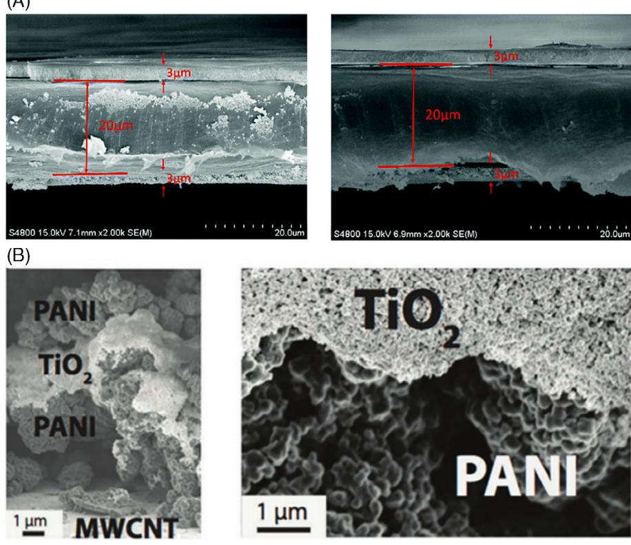

FIGURE 10 (A) SEM images of the surface and cross-section of the PE-SiO2 separator(left) and the PE-SiO2@PDA separator(right).111 Reproduced with permission from Reference 111. Copyright 2016, The Royal Society of Chemistry. (B) SEM images of the surface and crosssection of coatings of multiwalled carbon nanotube (MWCNT), polyaniline (PANI), titania nanoparticles (titania NPs) on Celgard polypropylene separators.108 Reproduced with permission from Reference 108. Copyright 2016, John Wiley and Sons

electrolyte, F− chemically reacts with C C on rGOF surface to form C F bond or semi-ionic C F bond equivalent to F doping. When the F-doped rGOF surface encounters Li+ ions, it forms a stable SEI layer during the Li+ ion plating process. Therefore, the rGOF-A functional separator ensures cyclic stability of the Li metal anode with high current density and high areal capacity, and as such the Li metal anode operates stably at high current of 20 mA cm−2 and high capacity of 20 mAh cm−2 . Finally, Park et al., following a membrane design originally intended for skin care, successfully demonstrated the suppression of dendritic Li growth.115

## 3.3.3 | Introduce multilayer functional membrane

The most used separators for Li metal batteries are comprised of a single monolayer. Although they have a microporous structure allowing the rapid transmission of Li ions, there also contain many defects. For example, in Li-S batteries, polysulfide can easily pass through the microporous structure, resulting in a shuttlecock effect for ion transport, which will cause a severe side effect to the metallic anode. Therefore, in order to further solve the problem for both positive and negative electrodes, some researchers have adopted the multilayer film, which can effectively inhibit the growth of Li dendrites and improve the electrochemical properties of the positive electrode. He et al. designed and prepared a doublelayered MOF-PAN/rGO-PAN nanofiber membrane for Li-S battery to replace the traditional commercial polyolefin membrane (Figure 12(A)).103 The PAN-based membrane has excellent properties, such as thermal stability, superior resistance to oxidative degradation, and high electrolyte uptake.104,118 The MOF particles (closely attached to the surfaces of nanofibers) absorb the polysulfides during operation leading to a reduction of polysulfide interaction with the anode surface. Using this multilayer separator, Li-S batteries show a high initial capacity and perfect cycle stability, with a capacity decay rate of only 0.03% per cycle over 600 cycles at a high rate of 5 C. In another example, Rao et al. fabricated a double functional separator for Li-S batteries (Figure 12(B)).104 One layer, based on the 0-D CeO2 nanocrystals surrounded by carbon nanofiber, acts as an electrocatalyst to

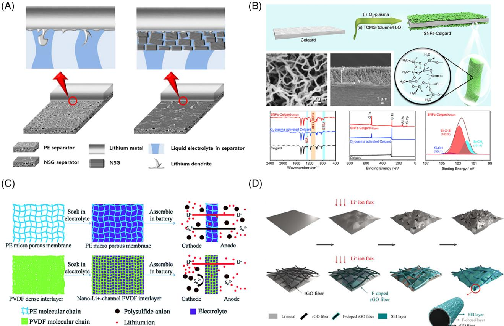

FIGURE 11 (A) Dendrite growth on Li metal anode using PE membrane (left) and NSG-coated PE separator (right).107 Reproduced with permission from Reference 107. Copyright 2016, American Chemical Society.(B) Preparation process and performance of SNFs.100 Reproduced with permission from Reference 100. Copyright 2019, Cell Press. (C) Comparison of nano Li ion channels between PVDF membrane and microporous PE membrane.112 Reproduced with permission from Reference 112. Copyright 2015, Royal Society of Chemistry. (D) Schematic diagram of Li metal anode mechanism of different separator.113 Reproduced with permission from Reference 113. Copyright 2020, John Wiley and Sons

accelerate polysulfide reduction reaction. Another layer as a support layer, maintaining the integrity of the separator and ensuring the safety of Li-based batteries. Consequently, such bilayer separator cells present good initial specific capacity, high-rate capability, and excellent cycle stability with a capacity decay rate of 0.04% per cycle at 0.5 C over 300 cycles. Other researchers have explored the use of biomass as a multilayer separator material, which can more effectively inhibit the Li dendritic growth problem and improve performance of the battery. For example, Chen et al. designed and fabricated a dual functional separator by combining two kinds of functional nanofabrication cloth.116 One is gelatin nanofabric (Figure 12(C)) is used to inhibit the growth of Li dendrites. It has excellent wettability and a high Li ion transference value. The other is a gelatin-coated conductive nanofabric used to absorb polysulfide. From the two functional layers of the Janus nanofabric, the resulting Li metal batteries show remarkable capacity, rate performance and cycling stability. This design shows exceptional initial discharge capacity of 890 mA h g−1 with a decay rate of 0.117% up to 300 cycles at 0.5 A g−1 .

In the above examples, the electrochemical performance of the battery was improved by using the design scheme of double-layer separator. However, in general, they focused more on the role of catalytic polysulfide in the charge discharge cycle of Li-S battery and ignored the problems existing in the Li anode. Addressing the problems of the Li anode, Yuan et al. proposed a new battery structure in which CNT films were inserted on both sides of the Li battery separator (Figure 12(D)).117 This schema proposed the CNT film on the cathode side will inhibit the "shuttlecock effect" while the CNT film on the anode side shields from the growth of Li dendrites.

From the initial motivation to suppress dendritic growth of Li using a separator, research led to many additional benefits. Modification of the traditional polyolefin membrane, addition of new types of separator materials, and design of multilayer film structure has led to improvement of the mechanical properties of the Li

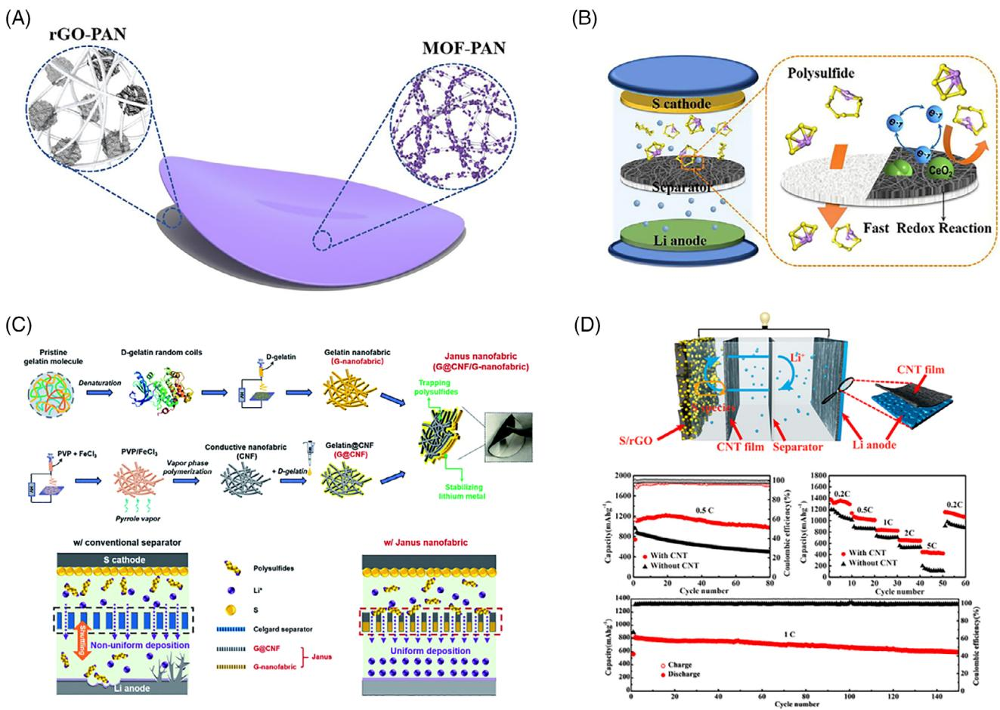

FIGURE 12 (A) Schematic diagram and characterization of multifunctional MOF PAN/RGO PAN separator for Li-S battery.103 Reproduced with permission from Reference 103. Copyright 2020, Elsevier. (B) Schematic diagram of PAN/CNF-CeO2 separator for Li-S battery and comparison of cycle performance of PP and PAN/CNF-CeO2 separator Li-S battery with current density of 0.5 C.104 Reproduced with permission from Reference 104. Copyright 2020, Elsevier. (C) Janus nano fabric production process diagram.116 Reproduced with permission from Reference 116. Copyright 2020, Royal Society of Chemistry. (D) Structure and electrochemical performance of a novel Li-S battery.117 Reproduced with permission from Reference 117. Copyright 2017, American Chemical Society

metal battery, its ion transport performance, interface stability and conductivity of the membrane. However, from this work, it is clear it is not enough to improve the thermal and mechanical properties of the separator to achieve practical application. Therefore, new material systems should be sought to fully suppress dendritic growth of the metal anode during operation.

Further, other negative side effects need to be dealt with such as cost, environmental impact form material choice or operation, design simplification, and more. These problems cannot be ignored if Li metal batteries are to be adopted by the industry. In the long run, more efficient processes are also needed for separator fabrication, keeping in mind a Li metal battery and ionic liquid electrolyte need to operate with high safety and stability. From polymer separator to gel electrolyte, to all solidstate electrolyte, this is a clear trend, with great challenges to overcome. But it is worth affirming that the development of battery separator system will a tremendous benefit to the field.

## 3.4 | Additives for liquid electrolytes

It is well known that the growth of Li dendrites on the surface of Li metal during charging and discharging is closely related to the chemical composition of the electrolyte in Li metal batteries. Li metal readily interacts with the electrolyte at low voltage. Side reactions lead to the formation of unevenly distributed surface and electric field, which cause the growth of Li dendrites and the reduction of CE. Therefore, additives in electrolyte designed to guide Li deposition and react with Li anode to give birth to a stable and dense interphase layer will improve the electrochemical performance of Li metal batteries.

So far, the inorganic and organic additives such as halogenated salt, trace-amount of H2O, tris (2, 2, 2 trifluoroethyl) borate, Cs+, polymers, fluoroethylene carbonate (FEC), pyrrole, and so on have been studied and present obvious effects on improving the stability and uniformity of the SEI layer.119,120

## 3.4.1 | Inorganic additives

The inorganic additives are extensively studied due to their regulation effect on the components of SEI membrane. They are conducive, strengthen, and stabilize the SEI film. These functional additives contribute to the rapid transport of Li ions in the SEI films and improve the mechanical strength to effectively withstand the internal stress caused by the volume change during the cycle.

### Halogenated salt additives

The introduction of Li iodide (LiI) can form uniform and stable SEI layer in-situ on the surface of Li metal anode. This inhibits the accumulation of dead Li and reduces side reactions by reducing the direct contact of Li and electrolyte. In addition, LiI can also improve the ion conductivity of SEI layer, effectively promoting the migration of Li ions and inhibiting the formation of Li dendrites. For example, Xiong et al. designed a simple and effective method using LiI as an additive to a traditional ester electrolyte-inducing the polymerization of organic solution into flexible oligomers, which forms the ion-conducting SEI layer inhibiting the growth of Li dendrites.121 The results demonstrate that LiI can effectively improve the cycling stability of Li metal batteries.

### Trace-amount of H2O additives

Water is traditionally believed harmful in Li-based battery systems due to its reactivity with LiPF6 salt and other battery modules during charging and discharging. Recently, Togasaki et al. systematically studied the effects of water in Li metal battery.122 Interestingly, a trace amount of water in electrolyte was shown to enhance the cycle performance of Li metal anode. Compared with the original electrolyte, the cycle performance of the wateradded electrolyte improved by 34.5%. Xu et al. studied the effect of trace amounts of water as well,123 finding that controlling trace amounts of water can lead to Lifree dendritic growth. They explained that a small amount of HF produced by the decomposition reaction of LiPF6 with H2O electrochemically reduced to form a homogeneous and dense LiF rich SEI layer on the surface of Li metal. This LiF rich SEI can further enhance the electrochemical performance of the battery. By controlling trace amount of H2O (25–50 ppm) as an effective electrolyte additive, dendrite free Li metal deposition was realized in LiPF6 based electrolyte without harmful effect. Simultaneously, due to the consumption of HF during the formation of LiF, the adverse effects of HF on other battery components are also reduced.

#### Nitrate and polysulfide additives

In 2008, Mikhaylik first proposed Li nitrate (LiNO3) can be used as an effective electrolyte for Li metal batteries. Since then, it has been widely studied for improving the performance of novel battery systems.124 At present, it is generally understood that the reaction of LiNO3 with metal Li forms insoluble LixNOy products. The solid surface layer on the Li anode can protect the Li anode from reactions with chemicals in the electrolyte. However, the intrinsic mechanism of the addition of LiNO3 for both the anode and cathode is still not fully understood. Therefore, researchers are still working on this field and trying to enhance the overall performance of Li metal batteries. Li et al. comprehensively studied the effect of LiNO3 additive by using Li-S batteries.125 The results demonstrate that the additive cannot only form a stable passivation layer on the Li metal, but it can also inhibit the continuous shuttle effects between LiNO3 and other substances. In addition, as long as Li nitrate is still in the electrolyte, these reactions will improve CE. It is believed that the mechanism of Li nitrate in electrolyte will be well explained in the near future.

Further studies show that a stable and dense SEI layer may be obtained by the synergistic reaction of polysulfide and LiNO3. Zhang et al. demonstrated that LiNO3 and polysulfide are equally important to form a SEI film, which is effective in suppressing the shuttle effects.126 They further proved that a small amount of Li2S5 can help to construct Li2S5-LiNO3-LiTFSI ternary salt electrolyte, effectively inhibiting dendrite growth of the Li metal anode. Thus, the batteries present excellent cycle performance and high efficiency (Figure 13(A)).

Some researchers have been exploring other new multifunctional additives. For example, Ma et al. used tris-(2,2,2-trifluoroethyl) borate (TTFEB) as a bifunctional electrolyte additive to improve the performance of Li metal anode (Figure 13(B)),127 which is conducive to the surface chemistry of anode and the performance of electrolyte.

#### Transition metal cation additives

Generally speaking, transition metal cation additives can enhance the stability of SEI membrane, inhibit the growth of Li dendrites, and become an effective barrier to prevent the interaction between Li metal and electrolyte.

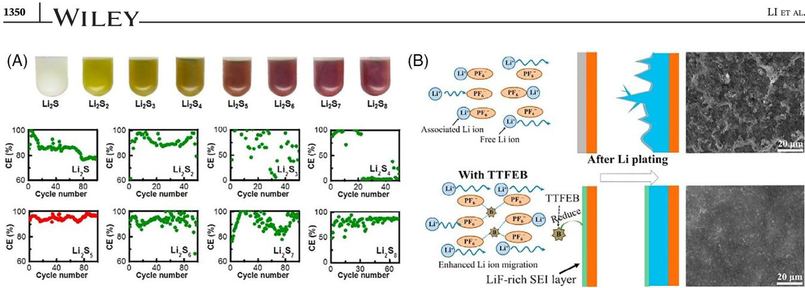

FIGURE 13 (A) Pictures of different ternary salt electrolytes and the CE and current density of ternary salt electrolyte batteries with different LiPSs are 0.5 mA cm−2 . 126 Reproduced with permission from Reference 126. Copyright 2016, Elsevier. (B) Comparison of structural changes of Li metal anodes in electrolyte containing tris-(2,2,2-trifluoroethyl) borate (TTFEB) and without TTFEB.127 Reproduced with permission from Reference 127. Copyright 2018, Elsevier

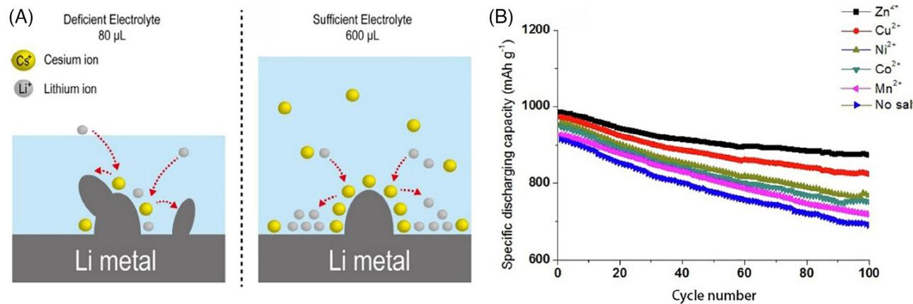

FIGURE 14 (A) In 80 μl and 600 μl electrolyte, the amount of Cs+ ions required to stabilize Li metal surface was compared with that required by she mechanism.128 Reproduced with permission from Reference 128. Copyright 2019, American Chemical Society. (B) Cycle performance of transition metal cation and no salt batteries at 0.2 C.107 Reproduced with permission from Reference 107. Copyright 2016, American Chemical Society

Particularly, in Li-S batteries, the protective layer formed with the assistance of transition metal sulfide also hinders the diffusion of polysulfide to Li metal, thus further alleviating the shuttle reaction of polysulfides, and preventing the loss of active substances and self-discharge. Yoon et al. used cesium hexafluorophosphate (CsPF6) as an electrolyte additive to modify the surface of Li metal anode (Figure 14(A)),128 which can efficiently improve the electrochemical performance such as cycle number and rate capability of the battery. These enhancements are due to the self-healing electrostatic shielding mechanism of Cs+ ions, which depends on the concentration of Cs+. Meanwhile, Manthiram introduced a simple method by adding copper acetate to the electrolyte as a surface stabilizer for Li metal in a polysulfiderich environment of Li-S battery.129 This additive effectively inhibits the formation of Li dendrites and improves the electrochemical performance by controlling Li deposition and improving the surface chemical activity. The primary mechanism is the strong intermolecular interaction between copper and Li sulfide, which destroys the growth sequence of Li sulfide crystals. This attracts Li ions deposition associated with the deposition of copper sulfide. From this study, Zeng et al. used a facile method to explore the protective effect of different transition metal cation additives to forming an in situ passivation film for Li metals (Figure 14(B)).130 The overall result shows that, by adding the above transition metal cations, the batteries present a higher stability, higher rate capability, and better redox kinetics over cycles. Therefore, it can be concluded that the low-cost application of transition metal cation as electrolyte additives is one of the promising strategies for the development of Li metal batteries.

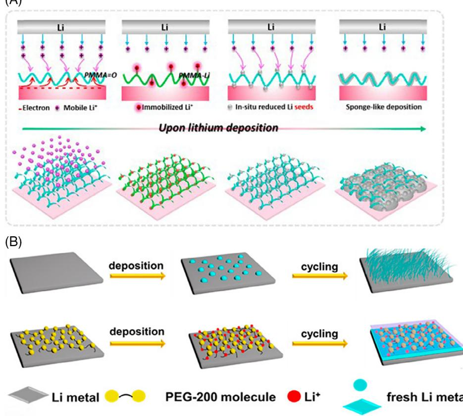

FIGURE 15 (A) Schematic diagram of mechanism of spongy Li deposition.131 Reproduced with permission: Copyright 2019, Elsevier. (B) Comparison of Li deposition process with or without PEG additive.132 Reproduced with permission from Reference 132. Copyright 2019, American Chemical Society

## 3.4.2 | Organic additives

Compared with inorganic additives, organic additives have some unique properties, such as more flexible Li surface and higher interface stability.

#### Polymers additives

Polymer additives are widely studied because they are more efficient in protecting Li metal anodes than inorganic ions. Among them, Guo et al. successfully prepared a three-dimensional continuous, sponge-like Li structure by adding electrochemical active polymethyl methacrylate (PMMA) into the electrolyte,131 which can inhibit the growth of Li dendrites (Figure 15(A)). During the discharge process, Li ions react with PMMA and are immobilized. These trapped Li ions are in situ reduced to the initial Li, and the surrounding Li ions are further deposited to form a three-dimensional PMMA molecular chain model. This morphology not only provides a fast electron transport path to eliminate the formation of dead Li, but also reduces the current density on the surface of Li metal, which is a good protection for Li metal. Moreover, Wang et al. introduced polyethylene glycol (PEG) as an additive in traditional liquid electrolyte (Figure 15(B)).132 PEG molecules dispersed on the surface of Li metal were found to interact effectively with Li ions, fundamentally inhibiting the growth of Li dendrites, thus improving the cycling stability of the Li metal battery.

#### Organic molecule additives

Although the additives in the electrolyte have achieved good results, it is difficult to achieve the desired passivation effect at the interface of Li metal anode and electrolyte over a long cycle. Therefore, researchers have developed more effective electrolyte additives to solve the problems encountered in practical application. For example, Fu et al. reported that a stable SEI could be formed in situ on the surface of a Li metal anode by adding appropriate amounts of sulfuryl chloride to a conventional ester electrolyte solution.133 The SEI layer rich in Li chloride can inhibit the growth of Li dendrites and accelerate the migration of Li ions, thus improving the performance of Li metal batteries. Chu et al. have designed a series of metal–organic framework particles as a new type of solid additive.134 These additives have porosity, multifunctional groups, and flexibility, which play an important role in achieving smooth Li plating behavior.

In summary, in order to make the electrolyte of Li metal battery respond to modern demands of efficiency, environmental friendliness, and more, a feasible approach is to optimize the performance of electrolyte is to using additives. Researchers are actively exploring and developing functional additives to obtain uniform and stable SEI films and improve battery life. Based on the above description, it is generally believed that strong SEI films with good combination of soft and hard ingredients can be developed by optimizing the content of reagents, additives, and Li salts. It is known that SEI films need good ionic conductivity to reduce the diffusion resistance of Li ions through the SEI layer. Therefore, the utilization of functional additives and electrolyte components needs further efforts to achieve success in LMBs. Finally, multifunctional additives not only play a good role in Li metal anode but also optimize the electrolyte itself and even the surface of separator and cathode. Given the strong research push in this direction, novel effective electrolyte additives are expected to be realized soon.

## 3.4.3 | High-concentration electrolyte

In general, ionic conductivity and viscosity will rise sharply with the increasing concentration of electrolyte, which is not conducive to the rate performance of the electrolyte and will lead to the performance decline of lithium metal battery.135 However, an increase in electrolyte concentration greatly reduces the number of free solvent molecules and the probability of their interaction with lithium metal, and also significantly changes the chemical properties of lithium metal surface. This prompted the researchers to explore and study the high electrolyte concentration.136

Fan et al. verified that the lithium metal anode had good cycling performance in carbonate electrolyte after increasing Li bis (fluorosulfonimide) imide (LIFSI) concentration to 10 M.137 The existence of FSI−1 makes the interface of lithium metal anode and nickel-manganesecobalt (NMC) cathode rich with F content (Figure 16(A)). The F-rich interface effectively inhibits the formation of Li dendrites. Under high charging voltage of 4.6 V and high load of 2.5 mAh cm−2 , the NMC622kLi battery still maintains 86% of its original capacity after 100 cycles. This electrolyte optimization method presents a unique conceptual framework for continued improvement of Li metal batteries. In addition, Qian et al. reported that a high concentration electrolyte composed of ether solvent and Li bis (fluorosulfonyl) imide salt can realize high-rate cycling of Li metal anode without dendrite growth.138 Due to the low reactivity of these electrolytes, the probability of side reactions decreases, thus showing high Coulomb efficiency. For the dilute electrolyte, the solvent reacts with the Li metal to a greater extent, thus reducing the CE of Li plating/stripping. Moreover, the SEI layer is highly dense, preventing further corrosion of Li metal anode and imparting strong electrode stability in high concentration LIFSI-DME electrolyte (Figure 16(B,C)). The results show that in 4 M LIFSI-DME electrolyte, the CukLi battery can cycle more than 1000 times at 4 mA cm−2 , and the CE is as high as 98.4%. With further optimization of the electrolyte, it is possible for this Li metal battery to move towards practical application. Amine et al. have demonstrated that a new type of concentrated siloxane electrolyte has excellent performance, especially for stabilizing sulfur cathode and Li metal anode and reducing flammability.139 They point out siloxane solvents can effectively regulate the interaction of cations/anions (such as Li+, TFSI− and S2−) with solvents in high concentration electrolyte (Figure 16(D)). Therefore, this battery design can realize reversible lithium plating/stripping and solid–solid electrolyte interphase chemical reaction. Moreover, they emphasize the solution ion exchange process in high concentration electrolyte is a key factor in understanding and designing electrolyte for other high-energy Li metal batteries.

## 3.4.4 | Localized high-concentration electrolyte

Although the high concentration electrolyte has achieved good results, there are still some critical shortcomings such as the increase in electrolyte concentration leading to the increase of viscosity, which leads to the decrease of ionic conductivity. As a result, the performance of the battery at low temperature is poor, the manufacturing process of the battery is difficult, the wettability to the diaphragm and electrode is poor, and the cost is increased.140-142 Especially for sulfone-based electrolyte, because of its high viscosity and melting point, the above problems become more and more egregious with increasing the concentration. In recent years, some researchers have overcome these shortcomings by choosing the cosolvent of high-concentration electrolyte. For example, Doi et al. studied different kinds of fluoroalkyl ethers as diluents to reduce the high viscosity of high concentration LiBF4/PC electrolyte solutions.143 It was found 1,1,2,2-tetrafluoroethyl-2,2,3,3-tetrafluoropropane ether (HFE) is the most suitable diluent, and the interaction between HFE, Li+ cation, and BF4 − anion is very weak. It was also shown that the LiBF4/PC system with high concentration can be diluted with HFE without losing high

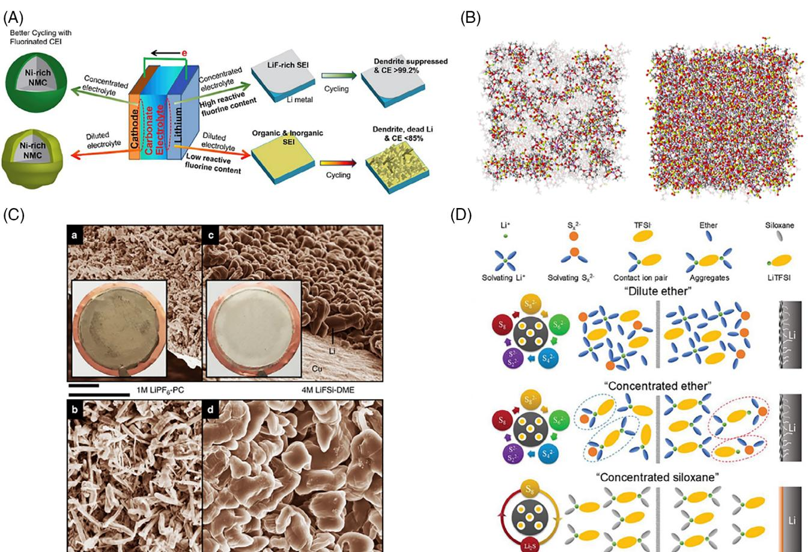

FIGURE 16 (A) Schematic diagram of influence of active fluorine content in concentrated electrolyte on battery poles.137 Reproduced with permission from Reference 137. Copyright 2018, Elsevier. (B) Snapshots of the MD simulation boxes (1-M and 4-M LiFSI-DME electrolyte).138 Reproduced with permission from Reference 138. Copyright 2015, Springer Nature. (C) SEM images of the morphologies of Li metal after plating on Cu substrates in different electrolytes.138 Reproduced with permission from Reference 138. Copyright 2015, Springer Nature. (D) Schematic illustration of internal chemical reaction diagram of lithium sulfur battery in different electrolytes.139 Reproduced with permission from Reference 139. Copyright 2020, John Wiley and Sons

antioxidant stability. Moon et al. analyzed the solvation structure of Li+ and the formation of ion pairs in an electrolyte composed of triglyme (G3) and a hydrofluoroether (HFE) containing 1 M Li [TFSA] (TFSA: bis(trifluoromethanesulfonyl) amine).144 The results show when the molar ratio of G3 to Li [TFSA] is close to 1, the activity of G3 in the electrolyte decreases significantly. This shows the oxidation stability of electrolyte is enhanced and the corrosion rate of positive aluminum collector decreases, improving the stability of Li metal battery. From this study, the activity of the solvent in the electrolyte of Li metal battery is the key factor to improve the electrochemical reaction of lithium metal battery.

## 3.5 | Other types of electrolyte

Due to the intrinsic problems, such as Li dendrite growth, depleting the electrolyte, safety hazards, and more, widespread industrialization of liquid electrolytes has been hampered. Solid or gel electrolyte minimizing Li dendrite growth has been developed to tackle the drawbacks of liquid electrolytes. Yamada et al. designed a new type of all solid-state Li battery, which demonstrates a comprehensively high performance.145 Its capacity is close to the theoretical value and the CE of the initial charge/discharge cycle is close to 99%. In addition, the activation energy of the charge transfer process is much smaller than that of the corresponding liquid electrolyte battery and its transference number of Li in solid electrolyte is close to 1. This makes the deposition of Li metal uniform and inhibits the formation of Li dendrites.146,147 Moreover, it can improve the mechanical strength and service life of the battery. However, compared with traditional liquid electrolyte, solid state electrolytes (SSEs) possess very poor ionic conductivity. Therefore, researchers have focused on improving the ionic conductivity of SSEs.

## 3.5.1 | All-solid electrolyte

#### Inorganic-based SSEs

The inorganic solid electrolytes are structurally nonporous and high strength, which are necessary to prevent the penetration of Li dendrites and improve the reliability of Li metal batteries. Recently, sulfides, oxides, and phosphates have been extensively studied due to their unique properties as SSEs.85

#### Sulfide-based SSEs

Due to the high ionic conductivity, it is beneficial to design a high conductive SSE at room temperature using sulfides. Therefore, in recent years, sulfides have been widely investigated in solid Li batteries.148 Yamada et al. developed and tested solid-state Li batteries by using Li3PS4 as electrolyte.145 The batteries show a good circulation retention capacity, which demonstrates that Li3PS4 is effective on promoting the battery performance. However, the stability of sulfides is generally poor in ambient, because sulfides are hygroscopic and form toxic H2S when exposed to moisture.149

#### Oxide-based SSEs

Compared with sulfides, oxides are highly chemical stable and easy treat. To the best of our knowledge, the most promising Li ion conducting oxide is garnet Li7La3Zr2O12 (LLZO). Murugan et al. found that LLZO demonstrate high conductivity and electrochemical stability.150 Schmidt et al. used various experimental and computational methods to study the mechanical strength of high conductivity LLZO based on Al and Ta doping.151 Data show the Al/Ta-doped LLZO maintains a high hardness during operation, which moves the needle on Li battery development. Novel oxides are also in development, for example, Zheng et al. prepared amorphous lanthanum titanate (LLTO) powder by sol–gel method, and studied the compatibility between the oxide and Li metal.152 The results show that the amorphous LLTO maintains ionic conductivity after direct contact with Li, demonstrating compatibility between these two.

#### Polymer-based SSEs

The soft polymer electrolyte forms a stable interface with the electrode during charging and discharging, as well as good mechanical stability. Liu et al. designed a nonporous, polymer electrolyte, and the battery presented a good performance.153 The polymer electrolyte not only inhibits the Li dendritic growth under high current density but also adapts to the volume change of Li metal by elastically deforming. However, low ionic conductivity at room temperature and instability at high-temperature limit its application.

In response to this deficiency, composite electrolytes of polymer and other materials are being studied LMBs. They are expected to meet modern demands placed on LMBs by combining the advantages of inorganic and polymer mixed electrolytes.154 For example, Wu et al. have prepared a novel polyethylene oxide (PEO) composite polymer electrolyte using nickel phosphate (VSB-5) nanorods as fillers (Figure 17(A)).155 At 30C, the ionic conductivity of the solid polymer electrolyte is as high as 4.83 × 10−5 s cm−1 , and the electrochemical stability is about 4.13 V. In addition, it has good compatibility with Li metal anode and exhibits effective suppression on of Li dendrite growth. Zagorski et al. designed a composite electrolyte using ion-conducting garnet LLZO microparticles into a PEO polymer electrolyte (Figure 17 (B)),156 which resulted in significantly improved interface stability with Li metals during the electrochemical cycle. This work provides a new strategy for suppressing Li dendrite formation in solid-state batteries. At the same time, it was also pointed out the elastic and shear moduli of the electrolyte do not play a key role in uniform Li electrodeposition. This role is determined by the interface composition and local Li+ dynamics. This work provides interesting clues towards optimum the design of other solid composite electrolyte system.

#### MOFs and COFs based-SSEs

The solid electrolyte mentioned above has distinguishing performance in the suppression of Li dendrite for Li anode, but its ionic conductivity is low and the interface resistance between electrolyte and active electrode is high.157,158 Therefore, there is an urgent need for solid electrolyte with excellent Li ion transport kinetics internally and at the interface. Crystalline porous materials, including MOFs and COFs, have attracted much attention in the field of batteries due to their ordered porous structure providing fast ion transport channels.159 Due to its large number of narrow pores, large specific surface area and high stability, it is considered a promising candidate material for Li metal battery solid electrolyte. Long et al. reported was first to report MOF derived solid ion conductors consisting of Mg2(dobdc) (dobdc4− = 1,4-dioxido-2,5-benzenedicarboxylate) and Li-containing hybrids have high ionic conductivity (Figure 18(A)).157 It was shown that when the anions in the hybrid react with Mg2 + cations, Li ions migrate in Mg2(dobdc), and the ionic conductivity reaches 0.31 mS cm−1 at room temperature. These results provide a new method and reference for the preparation of solid lithium electrolyte materials. In 2019, Wu et al. designed a new nanostructured MOF-derived solid electrolyte.158 Due to the abundant nano-porous structures in UIO-66, the nanostructured MOF of UIO-66([Zr6O4 (OH)4(BDC)6]) (BDC2− = 1,4-benzoic acid radical) was used (Figure 18 (B)). The Zr4+ metal ions of MOFs are difficult reduce, so side reactions can be avoided when contacting with metal Li. In addition, UIO/Li-IL SSE also demonstrated excellent electrochemical stability at high potential. At the same time, the nanostructure lowers the interface resistance between the electrode and electrolyte, so the solidstate lithium battery shows excellent performance.

Applications of COFs in ionic conductive materials has been widely studied, showing great potential in SSEs fabrication. Vazquez-Molina et al. demonstrated that COF becomes highly oriented during mechanical pressing (Figure 18(C)), increasing ionic conductivity and enhancing the kinetic properties of COF.160 In addition, the particles prepared by impregnating COF powder with LiClO4 show a high conductivity of 0.26 mS cm−1 and excellent electrochemical stability at room temperature. These results indicate it is possible to use COFs as solid electrolyte in the Li metal battery. Meanwhile, Zhang et al. designed a flexible, bulky, glassy PEO partially covalently meshed to form a rigid two-dimensional COF structure (Figure 18(D)).161 In this system, Li + reaches 1.33 × 10−3 s cm−1 at 200C. Further, the robustness of the structure enables long periods of high for a given temperature. The COF electrolyte was first used in all solid-state Li battery at 100C. Therefore, these novel solid electrolytes as described show great potential in inhibiting the growth of Li dendrites in Li metal batteries.

Thus, all solid-state Li battery featuring with metrics of good safety and wide potential window, among others, are peerless in combination with liquid electrolyte. This combination inhibits the growth of Li dendrite and resolves operational problems such as the shuttle effect of Li sulfur battery.162 As such, consensus places the solidstate Li metal battery as the most promising battery in the new generation of energy storage systems. However, compared with liquid electrolytes, solid electrolytes have low ionic conductivity, high interface resistance with electrode and, in some cases, show sensitivity to operation in air,147,162 hindering its commercialization. In review, studies have demonstrated all solid electrolytes have undergone significant development, but their mechanism of operation and breakdown are not well explained yet. Therefore, there is still a long way to go for the development of all solid electrolyte.

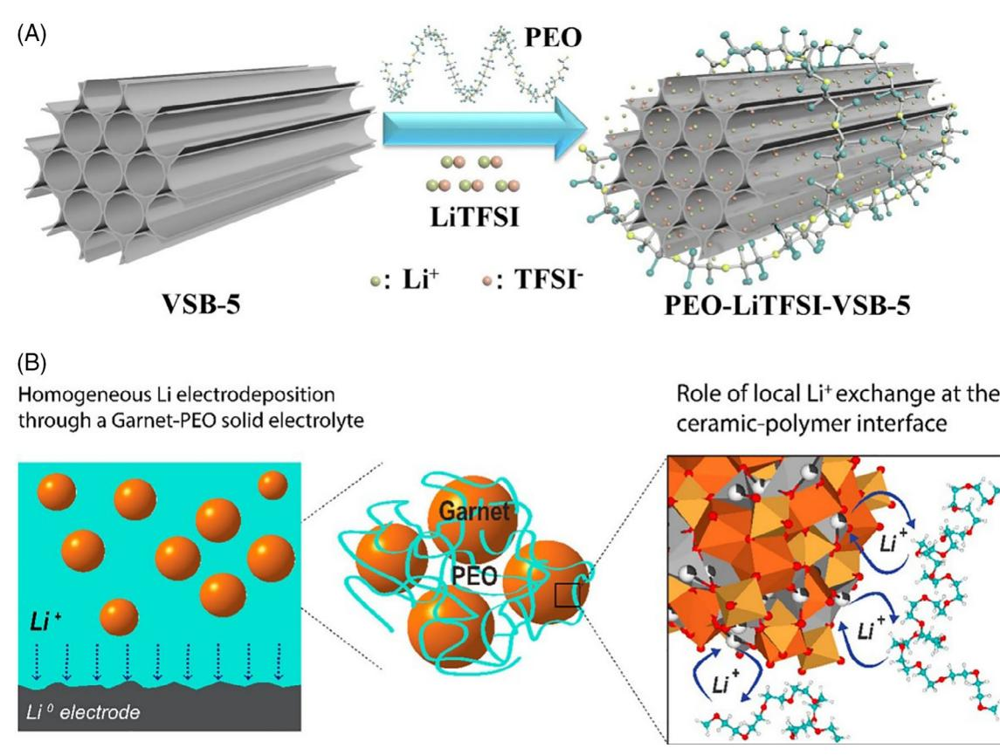

FIGURE 17 (A) Schematic diagram of Li+ migration in SPE reinforced by VSB-5.155 Reproduced with permission from Reference 155. Copyright 2020, Elsevier. (B) The schematic diagram of Li+ exchange between LLZO particles and PEO (LiTFSI) interface.156 Reproduced with permission from Reference 156. Copyright 2019, American Chemical Society

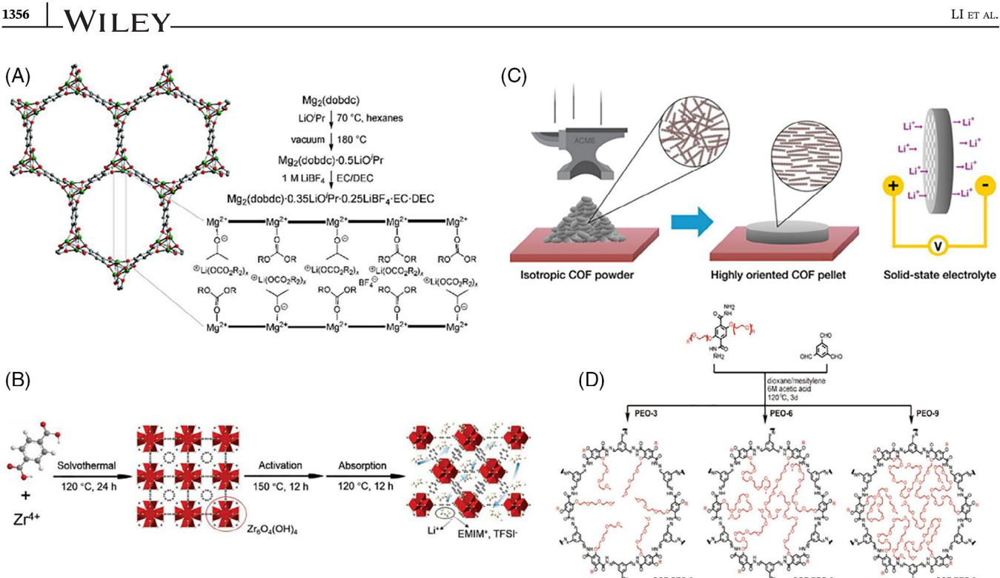

FIGURE 18 (A) The structure of Mg2(dobdc) and the schematic diagram of its solid electrolyte formation.157 Reproduced with permission from Reference 157. Copyright 2011, American Chemical Society. (B) Schematic of preparation of UIO/Li-IL SSE.158 Reproduced with permission from Reference 158. Copyright 2019, John Wiley and Sons. (C) Preparation of highly oriented COF and its application in solid electrolyte of lithium battery.160 Reproduced with permission from Reference 160. Copyright 2016, American Chemical Society. (D) Synthesis of COF-PEO-x (x = 3, 6, 9).161 Reproduced with permission from Reference 161. Copyright 2019, American Chemical Society

## 3.5.2 | Gel-polymer electrolyte

Although solid electrolyte effectively improves the safety performance of Li metal batteries, the high impedance and low ionic conductivity between the electrolyte and the electrode remain an issue. In response, solutions are being developed for the polymer gel electrolyte to improve its ionic conduction and contact adhesion with electrodes. This strategy might be a good choice for the development of LMBs.163-165

The mechanical properties of GPEs are poor because the polymer becomes very soft after expansion. Therefore, further modification of GPEs is critical. Fu et al. demonstrated that the use of ZrO2/KH570/PU/P123 layer coating on a PE separator can effectively counteract the negative effects of the PE-supported gel polymer electrolyte (Figure 19(A)).163 The modified GPE electrolyte can simultaneously possess a considerable ion transport performance, the high stability of interface with Li metal and enhanced mechanical property.

In recent years, researchers have developed a number of other electrolytes with improved results. For example, Hu et al. were first to devise a slurry-like electrolyte using polymeric graphitic carbon nitride (g-C3N4) as filler (Figure 19(C)).167 Carbon nitride possesses both high mechanical strength and multistage pore structure, which effectively suppresses the growth of Li dendrites and improves the electrochemical performance of Li metal batteries. In addition, to solve the problem of poor interface contact and Li dendrite growth, Wen et al. reported a new biomimetic quasi solid electrolyte, which is injected into the Al2O3 framework by in situ sol–gel method (Figure 19(B)).166 The results show this structure can effectively improve the poor interface contact and protect the Li metal anode. The above strategy to modifying the interface of solid-state Li metal via coated bionic foliar electrolyte with Li aluminum conductive layer offers a distinctive perspective to metallic Li anode protection and an alternative way for practical application of LMBs.

Despite of the rapid development of solid-state electrolyte, there are still obstacles to remove. The ceramic electrolytes are brittle and not easy to plate evenly on top of the electrode, leading to a high interfacial resistance and poor mechanical property. Polymer electrolytes are poor in conductivity. They cannot endure a high current density, making them incompatible with commercialization demands. Therefore, ameliorating the interface between ceramic electrolytes and the electrodes or modifying the ion conductivity of polymer electrolytes are of

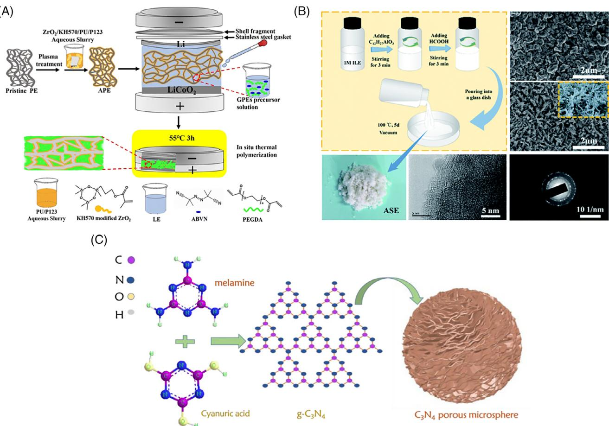

FIGURE 19 (A) Schematic diagram of preparation process of GPEs.163 Reproduced with permission from Reference 163. Copyright 2019, Springer Nature. (B) The flow chart of ASE preparation was shown.166 Reproduced with permission from Reference 166. Copyright 2020, Royal Society of Chemistry. (C) Schematic diagram of preparation of g-C3N4 porous microspheres.167 Reproduced with permission from Reference 167. Copyright 2017, American Chemical Society

great importance in promoting the industrialization of Li metal batteries.149

## 4 | CONCLUSION AND PERSPECTIVE

Rechargeable Li metal batteries with high energy density are recognized as an emerging next generation of energy storage system. In order to realize Li metal anode adoption in commercial markets, researchers have made great efforts to overcome the shortcomings of Li dendrite growth, volume fluctuation, low mechanical strength, and high interface resistance between electrolyte and electrode. These efforts primarily manifest in artificial SEI layer construction, current collector modification, separator modification, electrolyte additive, and solidstate electrolyte development. This review gives a detailed overview of the strategies which used to overcome the existing problems. Since the research on Li metal batteries is still in the initial stage, and there remains numerous pathways to optimize performance of these batteries, multiple approaches were proposed in this review according to the research results.

Coating an artificial SEI layer remarkably improves the performance of Li metal battery. It is likely these artificial SEI layer can effectively suppress Li dendritic growth dramatically improving electrochemical performance. This research is still at the primary stage, and fundamental mechanisms resulting in performance gains are poorly understood. Further efforts are envisioned to: (i) develop advanced in situ characterization technology to investigate the mechanism of artificial SEI formation, (ii) develop cheaper and simpler methods of preparation, and (iii) combine the artificial layer strategy with other methods to further improve the performance of Li metal batteries, different combinations may bring unexpected effects.

3D current collector can effectively suppress dendritic Li growth and is highly compatible with other battery

components. Although good results have been obtained in the laboratory, it is still far from actual production. Further effort towards developing a 3D current collector for commercial application must solve at least three major issues: (i) improve CE of battery using, for example, nanostructured carbon materials; (ii) solve the problem of low specific energy density caused by high mass density of metal collector; and (iii) address mass increase due to void filling of the 3D collector.

The actual separator plays an important role in improving the electrochemical performance of the battery by removing direct interaction between positive and negative electrodes and enabling the ion transport. Approaches to separator optimization, including modification of polyolefin membrane using nanoparticles, developing multilayer films. Both approaches offer unique solutions to facilitating ion transport and increasing mechanical strength while suppressing Li dendrite growth and the shuttle effect from polysulfide interaction.

Additives in electrolyte are designed to guide Li deposition, react with Li anode to nucleate, and grow a stable dense interphase layer to improve the electrochemical performance of Li metal batteries. In laboratory, researchers actively explore and develop functional additives to obtain uniform and stable SEI film and improve battery life. Researchers surmise strong SEI films comprised of organic and inorganic components will lead to optimal Li metal battery function. Research is pursuing efforts to ascertain the appropriate combination of organic and inorganic SEI film components to optimize layer conductivity. These components include multifunctional additives to optimize the performance and properties of not only the electrolyte additives but also cathode and separator surfaces. Different electrolyte types have been found to convey advantages and disadvantages: solid or gel electrolyte minimize dendrite growth because they rarely react with Li metal electrodes-research is on-going to address their drawbacks. Ceramic electrolytes are normally brittle and are not easy to plate evenly on top of the electrode, leading to a high interfacial resistance and poor mechanical property. Polymer electrolytes are poor in conductivity and cannot endure a high current density but are highly desirable viable for commercial if this issue can be addressed. Ameliorating the interface between ceramic electrolytes and the electrodes or modifying the ion conductivity of polymer electrolytes are of great importance in promoting the industrialization of Li metal batteries. Concentrated effort in each of these areas of LMB research is expected to lead to make Li metal anode a commercial-viable reality.

The eventual commercial realization of LMBs is in the hands of the community. The potential of LMBs is to become a staple device in the storage of energy for a vast array of applications, including EVs, portable devices, flexible electronics, and so on. Through continual focused scientific exploration of the remaining challenges such as, the mechanism of deposition and stripping of Lithium, the adoption of this technology can become a reality soon. LIMs with high power and energy density, long life span are expected in coming years with more advanced Li anode for their applications in practice.

#### ACKNOWLEDGMENTS

This work is supported by the Collaborative Innovation Center of Suzhou Nano Science and Technology, National Natural Science Foundation of China (No. 21805221, 21905221), the National Science Foundation (1700785, 1724941, and 1917577), China Postdoctoral Science Foundation (2020M671606 and 2020M681737) and Natural Science Foundation of Jiangsu Province (BK20191190 and BX2020032).

#### CONFLICT OF INTEREST

The authors declare no conflict of interest.

#### ORCID

Elias Garratt <https://orcid.org/0000-0002-0331-3876> Keliang Wang <https://orcid.org/0000-0002-3273-9075>

#### REFERENCES

- 1. Seh ZW, Sun Y, Zhang Q, Cui Y. Designing high-energy lithium-sulfur batteries. Chem Soc Rev. 2016;45:5605-5634.
- 2. Turner JA. Sustainable hydrogen production. Science. 2004; 305:972-974.
- 3. Armand M, Tarascon JM. Building better batteries. Nature. 2008;451:652-657.
- 4. Dunn B, Kamath H, Tarascon JM. Electrical energy storage for the grid: a battery of choices. Science. 2011;334:928-935.
- 5. Goodenough JB, Kim Y. Challenges for rechargeable Li batteries. Chem Mater. 2010;22:587-603.
- 6. Manthiram A, Chung SH, Zu C. Lithium-sulfur batteries: progress and prospects. Adv Mater. 2015;27:1980-2006.
- 7. Wu H, Cui Y. Designing nanostructured Si anodes for high energy lithium ion batteries. Nano Today. 2012;7: 414-429.
- 8. Cheng XB, Zhang R, Zhao CZ, Wei F, Zhang JG, Zhang Q. A review of solid electrolyte interphases on lithium metal anode. Adv Sci. 2016;3:1500213.
- 9. Grande L, Paillard E, Hassoun J, et al. The lithium/air battery: still an emerging system or a practical reality? Adv Mater. 2015;27:784-800.
- 10. Hendrickson KE, Ma L, Cohn G, Lu YY, Archer LA. Model membrane-free Li-S batteries for enhanced performance and cycle life. Adv Sci. 2015;2:1500068.
- 11. Kim H, Jeong G, Kim YU, Kim JH, Park CM, Sohn HJ. Metallic anodes for next generation secondary batteries. Chem Soc Rev. 2013;42:9011-9034.
- 12. Choi NS, Chen ZH, Freunberger SA, et al. Challenges facing lithium batteries and electrical double-layer capacitors. Angew Chem Int Edit. 2012;51:9994-10024.
- 13. Jeong G, Kim YU, Kim H, Kim YJ, Sohn HJ. Prospective materials and applications for Li secondary batteries. Energ Environ Sci. 2011;4:1986-2002.
- 14. Xu W, Wang JL, Ding F, et al. Lithium metal anodes for rechargeable batteries. Energ Environ Sci. 2014;7:513-537.
- 15. Ni SY, Tan SS, An QY, Mai LQ. Three dimensional porous frameworks for lithium dendrite suppression. J Energy Chem. 2020;44:73-89.
- 16. Bruce PG, Freunberger SA, Hardwick LJ, Tarascon J-M. Li-O2 and Li-S batteries with high energy storage. Nat Mater. 2012; 11:19-29.
- 17. Cheng X-B, Zhao C-Z, Yao Y-X, Liu H, Zhang Q. Recent advances in energy chemistry between solid-state electrolyte and safe lithium-metal anodes. Chem. 2019;5:74-96.
- 18. Xia C, Kwok C, Nazar L. A high-energy-density lithiumoxygen battery based on a reversible four-electron conversion to lithium oxide. Science. 2018;361:777-781.
- 19. Wang HL, Yang Y, Liang YY, et al. Graphene-wrapped sulfur particles as a rechargeable lithium-sulfur battery cathode material with high capacity and cycling stability. Nano Lett. 2011;11:2644-2647.
- 20. Ji L, Jia YF, Wang X, et al. Strong adsorption, catalysis and lithiophilic modulation of carbon nitride for lithium/sulfur battery. Nanotechnology. 2021;32:192002.
- 21. Yuan CZ, Wu HB, Xie Y, Lou XW. Mixed transition-metal oxides: design, synthesis, and energy-related applications. Angew Chem Int Ed. 2014;53:1488-1504.
- 22. Lu YC, Xu ZC, Gasteiger HA, Chen S, Hamad-Schifferli K, Shao-Horn Y. Platinum-gold nanoparticles: a highly active bifunctional electrocatalyst for rechargeable lithium-air batteries. J Am Chem Soc. 2010;132:12170-12171.
- 23. Yang CP, Yin YX, Zhang SF, Li NW, Guo YG. Accommodating lithium into 3D current collectors with a submicron skeleton towards long-life lithium metal anodes. Nat Commun. 2015;6:8058.
- 24. Han XG, Gong YH, Fu K, et al. Negating interfacial impedance in garnet-based solid-state Li metal batteries. Nat Mater. 2017;16:572-579.
- 25. Hou Z, Zhang JL, Wang WH, Chen QW, Li BH, Li CL. Towards high-performance lithium metal anodes via the modification of solid electrolyte interphases. J Energy Chem. 2020; 45:7-17.
- 26. Shen K, Wang Z, Bi XX, et al. Magnetic field-suppressed lithium dendrite growth for stable lithium-metal batteries. Adv Energy Mater. 2019;9:1900260.
- 27. Pu J, Li JC, Zhang K, et al. Conductivity and lithiophilicity gradients guide lithium deposition to mitigate short circuits. Nat Commun. 2019;10:1896.
- 28. Sun YP, Zhao Y, Wang JW, et al. A novel organic "polyurea" thin film for ultralong-life lithium-metal anodes via molecular-layer deposition. Adv Mater. 2019;31:1806541.
- 29. Hou Z, Yu YK, Wang WH, et al. Lithiophilic Ag nanoparticle layer on cu current collector toward stable Li metal anode. ACS Appl Mater Interfaces. 2019;11:8148-8154.
- 30. Yu YK, Huang W, Song X, et al. Thermally reduced graphene paper with fast Li ion diffusion for stable Li metal anode. Electrochim Acta. 2019;294:413-422.
- 31. Lin DC, Liu YY, Cui Y. Reviving the lithium metal anode for high-energy batteries. Nat Nanotechnol. 2017;12:194-206.
- 32. Bai M, Xie K, Hong B, et al. An artificial Li3PO4 solid electrolyte interphase layer to achieve petal-shaped deposition of lithium. Solid State Ion. 2019;333:101-104.
- 33. Chen S, Xiang Y, Zheng G, et al. High-efficiency lithium metal anode enabled by a concentrated/fluorinated ester electrolyte. ACS Appl Mater Interfaces. 2020;12:27794-27802.
- 34. Jeong SK, Choi HK, Kim YS. Structural properties of solid electrolyte interphase on lithium metal. J Nanosci Nanotechnol. 2015;15:8803-8807.
- 35. Kang D, Hart N, Koh J, et al. Rearrange SEI with artificial organic layer for stable lithium metal anode. Energy Storage Mater. 2020;24:618-625.
- 36. Yan C, Cheng XB, Tian Y, et al. Dual-layered film protected lithium metal anode to enable dendrite-free lithium deposition. Adv Mater. 2018;30:1707629.
- 37. Young J, Kulick PM, Juran TR, Smeu M. Comparative study of ethylene carbonate-based electrolyte decomposition at Li, Ca, and Al anode interfaces. Acs Appl Energ Mater. 2019;2: 1676-1684.
- 38. Cao J, Zhang DD, Zhang XY, Sawangphruk M, Qin JQ, Liu RP. A universal and facile approach to suppress dendrite formation for a Zn and Li metal anode. J Mater Chem A. 2020; 8:9331-9344.
- 39. Hu YX, Zhu XB, Wang LZ. Two-dimensional materialfunctionalized separators for high-energy-density metal-sulfur and metal-based batteries. ChemSusChem. 2020;13:1366-1378.
- 40. Natarajan S, Subramanyan K, Dhanalakshmi RB, Stephan AM, Aravindan V. Regeneration of polyolefin separators from spent Li-ion battery for second life. Batteries Supercaps. 2020;3:581-586.
- 41. Zhang T, Yang J, Xu ZX, et al. Suppressing dendrite growth of a lithium metal anode by modifying conventional polypropylene separators with a composite layer. Acs Appl Energ Mater. 2020;3:506-513.
- 42. Zhou ML, Zhang Z, Xu J, Wei JC, Yu J, Yang ZY. PDA modified commercial paper separator engineering with excellent lithiophilicity and mechanical strength for lithium metal batteries. J Electroanal Chem. 2020;868:114195.
- 43. Chen KH, Sanchez AJ, Kazyak E, Davis AL, Dasgupta NP. Synergistic effect of 3D current collectors and ALD surface modification for high coulombic efficiency lithium metal anodes. Adv Energy Mater. 2019;9:12.
- 44. Duan H, Zhang J, Chen X, et al. Uniform nucleation of lithium in 3D current collectors via bromide intermediates for stable cycling lithium metal batteries. J Am Chem Soc. 2018; 140:18051-18057.
- 45. Hong B, Fan HL, Cheng XB, et al. Spatially uniform deposition of lithium metal in 3D janus hosts. Energy Storage Mater. 2019;16:259-266.
- 46. Pei F, Fu A, Ye WB, et al. Robust lithium metal anodes realized by lithiophilic 3D porous current collectors for constructing high-energy lithium-sulfur batteries. ACS Nano. 2019;13:8337-8346.
- 47. Xiang JW, Zhao Y, Yuan LX, et al. A strategy of selective and dendrite-free lithium deposition for lithium batteries. Nano Energy. 2017;42:262-268.
- 48. Zhang XY, Wang AX, Lv RJ, Luo JY. A corrosion-resistant current collector for lithium metal anodes. Energy Storage Mater. 2019;18:199-204.

- 49. Chen HW, Shen YB, Wang CH, et al. Review-from nano size effect to in situ wrapping: rational design of cathode structure for high performance lithium-sulfur batteries. J Electrochem Soc. 2018;165:A6034-A6042.
- 50. Shangguan XH, Xu GJ, Cui ZL, et al. Additive-assisted novel dual-salt electrolyte addresses wide temperature operation of lithium-metal batteries. Small. 2019;15:1900269.
- 51. Wang C, Nakamura H, Noguchi H, Yoshio M. Improvement of cycling performance of a lithium anode by the addition of dipyridyl derivatives. Denki Kagaku. 1997;65:941-948.
- 52. Wu LN, Peng J, Sun YK, et al. High-energy density Li metal dual-ion battery with a lithium nitrate-modified carbonatebased electrolyte. ACS Appl Mater Interfaces. 2019;11:18504- 18510.
- 53. Yang YYC, Davies DM, Yin YJ, et al. High-efficiency lithiummetal anode enabled by liquefied gas electrolytes. Joule. 2019; 3:1986-2000.
- 54. Ding XW, Yang S, Zhou SY, et al. Biomimetic molecule catalysts to promote the conversion of polysulfides for advanced lithium-sulfur batteries. Adv Funct Mater. 2020;30:2003354.
- 55. Famprikis T, Canepa P, Dawson JA, Islam MS, Masquelier C. Fundamentals of inorganic solid-state electrolytes for batteries. Nat Mater. 2019;18:1278-1291.
- 56. Li LJ, Zhao XS, Manthiram A. A dual-electrolyte rechargeable Li-air battery with phosphate buffer catholyte. Electrochem Commun. 2012;14:78-81.
- 57. Wang LL, Chen BB, Ma J, Cui GL, Chen LQ. Reviving lithium cobalt oxide-based lithium secondary batteries-toward a higher energy density. Chem Soc Rev. 2018;47:6505-6602.
- 58. Wu BB, Wang SY, Lochala J, et al. The role of the solid electrolyte interphase layer in preventing Li dendrite growth in solid-state batteries. Energy Environ Sci. 2018;11:1803-1810.
- 59. Yang HJ, Guo C, Naveed A, et al. Recent progress and perspective on lithium metal anode protection. Energy Storage Mater. 2018;14:199-221.
- 60. Zhang C, Lin Y, Liu J. Sulfur double locked by a macrostructural cathode and a solid polymer electrolyte for lithiumsulfur batteries. J Mater Chem A. 2015;3(20):10760-10766.
- 61. Cheng X-B, Zhang Q. Dendrite-free lithium metal anodes: stable solid electrolyte interphases for high-efficiency batteries. J Mater Chem A. 2015;3:7207-7209.
- 62. Qi L, Wu Z, Zhao B, et al. Advances in artificial layers for stable lithium metal anodes. Chemistry. 2020;26:4193-4203.
- 63. Na W, Lee AS, Lee JH, et al. Lithium dendrite suppression with UV-curable polysilsesquioxane separator binders. ACS Appl Mater Inter. 2016;8:12852-12858.
- 64. Wood SM, Pham CH, Rodriguez R, et al. K+ reduces lithium dendrite growth by forming a thin, less-resistive solid electrolyte interphase. Acs Energy Lett. 2016;1:414-419.
- 65. Tikekar MD, Choudhury S, Tu Z, Archer LA. Design principles for electrolytes and interfaces for stable lithium-metal batteries. Nat Energy. 2016;1:1-7.
- 66. Wood KN, Kazyak E, Chadwick AF, et al. Dendrites and pits: untangling the complex behavior of lithium metal anodes through operando video microscopy. ACS Cent Sci. 2016;2: 790-801.
- 67. Zhu B, Jin Y, Hu XZ, et al. Poly(dimethylsiloxane) thin film as a stable interfacial layer for high-performance lithiummetal battery anodes. Adv Mater. 2017;29:1603755.
- 68. Wang M, Zhang F, Lee CS, Tang YB. Low-cost metallic anode materials for high performance rechargeable batteries. Adv Energy Mater. 2017;7:1700536.
- 69. Hou GM, Ma XX, Sun QD, et al. Lithium dendrite suppression and enhanced interfacial compatibility enabled by an ex situ SEI on Li anode for LAGP-based all-solid-state batteries. ACS Appl Mater Inter. 2018;10:18610-18618.
- 70. Wang HT, Tang YB. Artificial solid electrolyte interphase acting as "armor" to protect the anode materials for high-performance lithium-ion battery. Chem Res Chinese U. 2020;36: 402-409.
- 71. Liu YY, Lin DC, Yuen PY, et al. An artificial solid electrolyte interphase with high Li-ion conductivity, mechanical strength, and flexibility for stable lithium metal anodes. Adv Mater. 2017;29:1605531.
- 72. Chen K, Pathak R, Gurung A, et al. Flower-shaped lithium nitride as a protective layer via facile plasma activation for stable lithium metal anodes. Energy Storage Mater. 2019;18: 389-396.
- 73. Yang QF, Cui MN, Hu JL, et al. Ultrathin defective C-N coating to enable nanostructured Li plating for Li metal batteries. ACS Nano. 2020;14:1866-1878.
- 74. Yuan YX, Wu F, Chen GH, Bai Y, Wu C. Porous LiF layer fabricated by a facile chemical method toward dendrite-free lithium metal anode. J Energy Chem. 2019;37:197-203.
- 75. Wang LL, Fu SY, Zhao T, et al. In situ formation of a LiF and Li-Al alloy anode protected layer on a Li metal anode with enhanced cycle life. J Mater Chem A. 2020;8:1247- 1253.
- 76. Xu SM, Duan H, Shi JL, et al. In situ fluorinated solid electrolyte interphase towards long-life lithium metal anodes. Nano Res. 2020;13:430-436.
- 77. Liu FF, Wang LF, Zhang ZW, et al. A mixed lithium-ion conductive Li2S/Li2Se protection layer for stable lithium metal anode. Adv Funct Mater. 2020;30:2001607.
- 78. Meyerson ML, Pandit AH, Weeks JA, et al. Sulfur-rich molybdenum sulfide as an anode coating to improve performance of lithium metal batteries. ChemElectroChem. 2020;7:222-228.
- 79. Zhai PB, Wei Y, Xiao J, et al. In situ generation of artificial solid-electrolyte interphases on 3D conducting scaffolds for high-performance lithium-metal anodes. Adv Energy Mater. 2020;10:1903339.
- 80. Wu C, Guo FH, Zhuang L, et al. Mesoporous silica reinforced hybrid polymer artificial layer for high-energy and longcycling lithium metal batteries. Acs Energy Lett. 2020;5:1644- 1652.
- 81. Zhang F, Shen F, Fan ZY, et al. Ultrathin Al2O3-coated reduced graphene oxide membrane for stable lithium metal anode. Rare Metals. 2018;37:510-519.
- 82. Zhong YC, Chen YM, Cheng YF, et al. Li alginate-based artificial SEI layer for stable lithium metal anodes. ACS Appl Mater Inter. 2019;11:37726-37731.
- 83. Feng YY, Zhang CF, Jiao XX, Zhou ZX, Song JX. Highly stable lithium metal anode with near-zero volume change enabled by capped 3D lithophilic framework. Energy Storage Mater. 2020;25:172-179.
- 84. Shi P, Zhang XQ, Shen X, Zhang R, Liu H, Zhang Q. A review of composite lithium metal anode for practical applications. Adv Mater Technol-US. 2020;5:1900806.
- 85. Xiong XS, Yan WQ, You CL, et al. Methods to improve lithium metal anode for Li-S batteries. Front Chem. 2019; 7:827.
- 86. Liang Z, Lin DC, Zhao J, et al. Composite lithium metal anode by melt infusion of lithium into a 3D conducting scaffold with lithiophilic coating. Proc Natl Acad Sci USA. 2016; 113:2862-2867.
- 87. Liu Y, Li XF, Fan LL, Li SF, Sari HMK, Qin J. A review of carbon-based materials for safe lithium metal anodes. Front Chem. 2019;7:721.
- 88. Zhang Y, Liu BY, Hitz E, et al. A carbon-based 3D current collector with surface protection for Li metal anode. Nano Res. 2017;10:1356-1365.
- 89. Chen YZ, Elangovan A, Zeng DL, et al. Vertically aligned carbon nanofibers on cu foil as a 3D current collector for reversible Li plating/stripping toward high-performance Li-S batteries. Adv Funct Mater. 2020;30:1906444.
- 90. Meng JK, Wang WW, Yue XY, et al. Cotton-derived carbon cloth enabling dendrite-free Li deposition for lithium metal batteries. J Power Sources. 2020;465:228291.
- 91. Chen JY, Zhao J, Lei LN, et al. Dynamic intelligent cu current collectors for ultrastable lithium metal anodes. Nano Lett. 2020;20:3403-3410.
- 92. Wang SH, Yin YX, Zuo TT, et al. Stable Li metal anodes via regulating lithium plating/stripping in vertically aligned microchannels. Adv Mater. 2017;29:1703729.
- 93. Lim GJH, Lyu ZY, Zhang X, et al. Robust pure copper framework by extrusion 3D printing for advanced lithium metal anodes. J Mater Chem A. 2020;8:9058-9067.
- 94. Kong L, Li B-Q, Peng H-J, et al. Porphyrin-derived graphenebased nanosheets enabling strong polysulfide chemisorption and rapid kinetics in lithium-sulfur batteries. Adv Energy Mater. 2018;8:1800849.
- 95. Liu TC, Chen XD, Zhan CC, Cao XH, Wang YW, Liu JH. Selective lithium deposition on 3D porous heterogeneous lithiophilic skeleton for ultrastable lithium metal anodes. Chem. 2020;6:1200-1207.
- 96. Zheng HF, Zhang QF, Chen QL, et al. 3D lithiophilic-lithiophobic-lithiophilic dual-gradient porous skeleton for highly stable lithium metal anode. J Mater Chem A. 2020;8: 313-322.
- 97. Zhang WD, Tu ZY, Qian JW, Choudhury S, Archer LA, Lu YY. Design principles of functional polymer separators for high-energy, metal-based batteries. Small. 2018;14:1703001.
- 98. Hu MF, Ma QY, Yuan Y, et al. Grafting polyethyleneimine on electrospun nanofiber separator to stabilize lithium metal anode for lithium sulfur batteries. Chem Eng J. 2020;388: 124258.
- 99. Eftekharnia M, Hasanpoor M, Forsyth M, Kerr R, Howlett PC. Toward practical Li metal batteries: importance of separator compatibility using ionic liquid electrolytes. Acs Appl Energ Mater. 2019;2:6655-6663.
- 100. Yang YF, Li BC, Li LX, Seeger S, Zhang JP. A superlephilic/superhydrophobic and thermostable separator based on silicone nanofilaments for Li metal batteries. Iscience. 2019;16:420-432.
- 101. Peng K, Wang B, Li YM, Ji CC. Magnetron sputtering deposition of TiO2 particles on polypropylene separators for lithiumion batteries. RSC Adv. 2015;5:81468-81473.
- 102. Lu WJ, Yuan ZZ, Zhao YY, Zhang HZ, Zhang HM, Li XF. Porous membranes in secondary battery technologies. Chem Soc Rev. 2017;46:2199-2236.
- 103. Zhou C, He Q, Li ZH, et al. A robust electrospun separator modified with in situ grown metal-organic frameworks for lithium-sulfur batteries. Chem Eng J. 2020;395:124979.
- 104. Zhang JW, Rao QQ, Jin BY, et al. Cerium oxide embedded bilayer separator enabling fast polysulfide conversion for high-performance lithium-sulfur batteries. Chem Eng J. 2020; 388:124120.
- 105. Kong L, Fu X, Fan X, et al. A Janus nanofiber-based separator for trapping polysulfides and facilitating ion-transport in lithium-sulfur batteries. Nanoscale. 2019;11:18090-18098.
- 106. Chung SH, Han P, Singhal R, Kalra V, Manthiram A. Electrochemically stable rechargeable lithium-sulfur batteries with a microporous carbon nanofiber filter for polysulfide. Adv Energy Mater. 2015;5:1500738.
- 107. Shin WK, Kannan AG, Kim DW. Effective suppression of dendritic lithium growth using an ultrathin coating of nitrogen and sulfur codoped graphene nanosheets on polymer separator for lithium metal batteries. ACS Appl Mater Inter. 2015;7: 23700-23707.
- 108. Kim MS, Ma L, Choudhury S, Archer LA. Multifunctional separator coatings for high-performance lithium-sulfur batteries. Adv Mater Interfaces. 2016;3:1600450.
- 109. Zhu JD, Chen C, Lu Y, et al. Highly porous polyacrylonitrile/graphene oxide membrane separator exhibiting excellent anti-self-discharge feature for high-performance lithium-sulfur batteries. Carbon. 2016;101:272-280.
- 110. Lee H, Yanilmaz M, Toprakci O, Fu K, Zhang XW. A review of recent developments in membrane separators for rechargeable lithium-ion batteries. Energy Environ Sci. 2014;7:3857-3886.
- 111. Dai J, Shi C, Li C, et al. A rational design of separator with substantially enhanced thermal features for lithium-ion batteries by the polydopamine–ceramic composite modification of polyolefin membranes. Energ Environ Sci. 2016;9:3252-3261.
- 112. Yan N, Yang XF, Zhou W, Zhang HZ, Li XF, Zhang HM. Fabrication of a nano-Li+-channel interlayer for high performance Li-S battery application. RSC Adv. 2015;5:26273-26280.
- 113. Gong YJ, Heo JW, Lee H, et al. Nonwoven rGO fiber-aramid separator for high-speed charging and discharging of Li metal anode. Adv Energy Mater. 2020;10:2001479.
- 114. Zhu JD, Yanilmaz M, Fu K, et al. Understanding glass fiber membrane used as a novel separator for lithium-sulfur batteries. J Membr Sci. 2016;504:89-96.
- 115. Yu BC, Park K, Jang JH, Goodenough JB. Cellulose-based porous membrane for suppressing Li dendrite formation in lithium-sulfur battery. Acs Energy Lett. 2016;1:633-637.
- 116. Chen M, Chen ZP, Fu XW, Zhong WH. A janus protein-based nanofabric for trapping polysulfides and stabilizing lithium metal in lithium-sulfur batteries. J Mater Chem A. 2020;8: 7377-7389.
- 117. Xie K, Yuan K, Zhang K, et al. Dual functionalities of carbon nanotube films for dendrite-free and high energy-high power lithium-sulfur batteries. ACS Appl Mater Interfaces. 2017;9: 4605-4613.
- 118. Gopalan AI, Santhosh P, Manesh KM, et al. Development of electrospun PVdF-PAN membrane-based polymer electrolytes for lithium batteries. J Membr Sci. 2008;325:683-690.

- 119. Cheng XB, Hou TZ, Zhang R, et al. Dendrite-free lithium deposition induced by uniformly distributed lithium ions for efficient lithium metal batteries. Adv Mater. 2016;28:2888- 2895.
- 120. Yasin G, Arif M, Mehtab T, et al. Understanding and suppression strategies toward stable Li metal anode for safe lithium batteries. Energy Storage Mater. 2020;25:644-678.
- 121. Wang G, Xiong XH, Xie D, et al. Suppressing dendrite growth by a functional electrolyte additive for robust Li metal anodes. Energy Storage Mater. 2019;23:701-706.
- 122. Togasaki N, Momma T, Osaka T. Enhancement effect of trace H2O on the charge discharge cycling performance of a Li metal anode. J Power Sources. 2014;261:23-27.
- 123. Qian JF, Xu W, Bhattacharya P, et al. Dendrite-free Li deposition using trace-amounts of water as an electrolyte additive. Nano Energy. 2015;15:135-144.
- 124. Zhang SS. A new finding on the role of LiNO3 in lithiumsulfur battery. J Power Sources. 2016;322:99-105.
- 125. Xu R, Li JCM, Lu J, Amine K, Belharouak I. Demonstration of highly efficient lithium-sulfur batteries. J Mater Chem A. 2015;3:4170-4179.
- 126. Zhao CZ, Cheng XB, Zhang R, et al. Li2S5-based ternary-salt electrolyte for robust lithium metal anode. Energy Storage Mater. 2016;3:77-84.
- 127. Ma YL, Zhou ZX, Li CJ, et al. Enabling reliable lithium metal batteries by a bifunctional anionic electrolyte additive. Energy Storage Mater. 2018;11:197-204.
- 128. Yoon B, Kim S, Lee YM, Ryou MH. Effect of the quantity of liquid electrolyte on self-healing electrostatic shield mechanism of CsPF6 additive for Li metal anodes. Acs Omega. 2019; 4:11724-11727.
- 129. Zu CX, Manthiram A. Stabilized lithium-metal surface in a polysulfide-rich environment of lithium-sulfur batteries. J Phys Chem Lett. 2014;5:2522-2527.
- 130. Zeng WD, Cheng MMC, Ng SKY. Effects of transition metal cation additives on the passivation of lithium metal anode in Li-S batteries. Electrochim Acta. 2019;319:511-517.
- 131. Guo YP, Ouyang Y, Li D, Wei YQ, Zhai TY, Li HQ. PMMAassisted Li deposition towards 3D continuous dendrite-free lithium anode. Energy Storage Mater. 2019;16:203-211.
- 132. Wang Q, Yang CK, Zhang YF, et al. Surface-based Li+ complex enables uniform lithium deposition for stable lithium metal anodes. Acs Appl Energy Mater. 2019;2:4602-4608.
- 133. Fu XX, Wang G, Dang D, Liu QB, Xiong XH, Wu CD. Sulfuryl chloride as a functional additive towards dendrite-free and long-life Li metal anodes. J Mater Chem A. 2019;7:25003- 25009.
- 134. Chu FL, Hu JL, Wu CL, et al. Metal-organic frameworks as electrolyte additives to enable ultrastable plating/stripping of Li anode with dendrite inhibition. ACS Appl Mater Inter. 2019;11:3869-3879.
- 135. Yamada Y, Yamada A. Review-superconcentrated electrolytes for lithium batteries. J Electrochem Soc. 2015;162:A2406- A2423.
- 136. Ren XD, Chen SR, Lee H, et al. Localized high-concentration sulfone electrolytes for high-efficiency lithium-metal batteries. Chem. 2018;4:1877-1892.
- 137. Fan XL, Chen L, Ji X, et al. Highly fluorinated interphases enable high-voltage Li-metal batteries. Chem. 2018;4:174-185.
- 138. Qian JF, Henderson WA, Xu W, et al. High rate and stable cycling of lithium metal anode. Nat Commun. 2015;6:6362.
- 139. Amine R, Liu JZ, Acznik I, et al. Regulating the hidden solvation-ion-exchange in concentrated electrolytes for stable and safe lithium metal batteries. Adv Energy Mater. 2020;10:2000901.
- 140. Ding MS, von Cresce A, Xu K. Conductivity, viscosity, and their correlation of a super concentrated aqueous electrolyte. J Phys Chem C. 2017;121:2149-2153.
- 141. Lin SS, Hua HM, Li ZS, Zhao JB. Functional localized highconcentration ether-based electrolyte for stabilizing highvoltage lithium-metal battery. ACS Appl Mater Inter. 2020;12: 33710-33718.
- 142. Chen SR, Zheng JM, Mei DH, et al. High-voltage lithiummetal batteries enabled by localized high-concentration electrolytes. Adv Mater. 2018;30:1706102.
- 143. Doi T, Shimizu Y, Hashinokuchi M, Inaba M. Dilution of highly concentrated LiBF4/propylene carbonate electrolyte solution with fluoroalkyl ethers for 5-V LiNi0.5Mn1.5O4 positive electrodes. J Electrochem Soc. 2017;164:A6412- A6416.
- 144. Moon H, Mandai T, Tatara R, et al. Solvent activity in electrolyte solutions controls electrochemical reactions in Li-ion and Li-sulfur batteries. J Phys Chem C. 2015;119:3957-3970.
- 145. Yamada T, Ito S, Omoda R, et al. All solid-state lithiumsulfur battery using a glass-type P2S5-Li2S electrolyte: benefits on anode kinetics. J Electrochem Soc. 2015;162:A646- A651.
- 146. Yuan H, Nan HX, Zhao CZ, et al. Slurry-coated sulfur/sulfide cathode with Li metal anode for all-solid-state lithium-sulfur pouch cells. Batteries Supercaps. 2020;3:596-603.
- 147. Sun YZ, Huang JQ, Zhao CZ, Zhang Q. A review of solid electrolytes for safe lithium-sulfur batteries. Sci China Chem. 2017;60:1508-1526.
- 148. Machida N, Kashiwagi J, Naito M, Shigematsu T. Electrochemical properties of all-solid-state batteries with ZrO2 coated LiNi1/3Mn1/3Co1/3O2 as cathode materials. Solid State Ion. 2012;225:354-358.
- 149. Wen JY, Huang Y, Duan J, et al. Highly adhesive Li-BN nanosheet composite anode with excellent interfacial compatibility for solid-state Li metal batteries. ACS Nano. 2019;13: 14549-14556.
- 150. Murugan R, Thangadurai V, Weppner W. Fast lithium ion conduction in garnet-type Li7La3Zr2O12. Angew Chem Int Ed. 2007;46:7778-7781.
- 151. Yu S, Schmidt RD, Garcia-Mendez R, et al. Elastic properties of the solid electrolyte Li7La3Zr2O12 (LLZO). Chem Mater. 2016;28:197-206.
- 152. Zheng ZF, Fang HZ, Liu ZK, Wang Y. A fundamental stability study for amorphous LiLaTiO3 solid electrolyte. J Electrochem Soc. 2015;162:A244-A248.
- 153. Liu K, Bai P, Bazant MZ, Wang CA, Li J. A soft non-porous separator and its effectiveness in stabilizing Li metal anodes cycling at 10 mA cm−2 observed in situ in a capillary cell. J Mater Chem A. 2017;5:4300-4307.
- 154. Hu ZL, Li JY, Zhang XJ, Zhu YR. Strategies to improve the performance of Li metal anode for rechargeable batteries. Front Chem. 2020;8:409.
- 155. Wu ZJ, Xie ZK, Yoshida A, et al. Nickel phosphate nanorodenhanced polyethylene oxide-based composite polymer

electrolytes for solid-state lithium batteries. J Colloid Interface Sci. 2020;565:110-118.

- 156. Zagorski J, del Amo JML, Cordill MJ, Aguesse F, Buannic L, Llordes A. Garnet-polymer composite electrolytes: new insights on local Li-ion dynamics and electrodeposition stability with Li metal anodes. Acs Appl Energy Mater. 2019;2:1734- 1746.
- 157. Wiers BM, Foo ML, Balsara NP, Long JR. A solid lithium electrolyte via addition of lithium isopropoxide to a metal-organic framework with open metal sites. J Am Chem Soc. 2011;133: 14522-14525.
- 158. Wu JF, Guo X. Nanostructured metal-organic framework (MOF)-derived solid electrolytes realizing fast lithium ion transportation kinetics in solid-state batteries. Small. 2019;15: 1902429.
- 159. Li C, Liu L, Kang JL, et al. Pristine MOF and COF materials for advanced batteries. Energy Storage Mater. 2020;31:115-134.
- 160. Vazquez-Molina DA, Mohammad-Pour GS, Lee C, et al. Mechanically shaped two-dimensional covalent organic frameworks reveal crystallographic alignment and fast Li-ion conductivity. J Am Chem Soc. 2016;138:9767-9770.
- 161. Zhang G, Hong Y, Nishiyama Y, Bai SY, Kitagawa S, Horike S. Accumulation of glassy poly(ethylene oxide) anchored in a covalent organic framework as a solid-state Li+ electrolyte. J Am Chem Soc. 2019;141:1227-1234.
- 162. Jung SY, Rajagopal R, Ryu KS. Synthesis and electrochemical performance of (100-x)Li7P3S11-xLi2OHBr composite solid electrolyte for all-solid-state lithium batteries. J Energy Chem. 2020;47:307-316.
- 163. Fu LX, Shi LY, Wang ZY, Zhu JF, Zhao Y, Yuan S. Nanocoating inside porous PE separator enables enhanced ionic transport of GPE and stable cycling of Li-metal anode. Res Chem Intermediat. 2019;45:4959-4973.
- 164. Xue ZG, He D, Xie XL. Poly(ethylene oxide)-based electrolytes for lithium-ion batteries. J Mater Chem A. 2015;3:19218- 19253.
- 165. Chen RJ, Qu WJ, Guo X, Li L, Wu F. The pursuit of solid-state electrolytes for lithium batteries: from comprehensive insight to emerging horizons. Mater Horiz. 2016;3:487-516.
- 166. Wen ZY, Li YJ, Zhao ZK, et al. A leaf-like Al2O3-based quasi-solid electrolyte with a fast Li+ conductive interface for stable lithium metal anodes. J Mater Chem A. 2020;8: 7280-7287.
- 167. Hu JL, Tian J, Li CL. Nanostructured carbon nitride polymerreinforced electrolyte to enable dendrite-suppressed lithium metal batteries. ACS Appl Mater Inter. 2017;9:11615-11625.

#### AUTHOR BIOGRAPHIES

Jiawei Li was born in Henan, China. He obtained his bachelor's degree in material forming and control engineering at Shengyang University of Technology. He is currently a master student in Nano Science and Technology Institute at Univer-

sity of Science and Technology of China. His research focuses on preparation of high efficiency binder for silicon anode of Li-ion batteries.

Keliang Wang is currently a Scientist in Fraunhofer USA Inc., Center for Midwest since 2018. He received his PhD degree from South Dakota State University in 2017 and then worked as a postdoctoral research fellow for half a year in Michigan State

University. His research interest focuses on plasma processing, energy storage and water treatment.

Hui Xu is an associate research fellow in Xi'an Jiaotong University Suzhou Academy. She received her PhD degree on Materials Science from the University of Manchester (2006–2010). She has worked as a R&D engineer at Saint-Gobain

Research Shanghai and a postdoctoral researcher at Chinese Academy of Sciences. Her research interests include advanced inorganic materials and composites for energy storage (Batteries & Supercapacitors).

How to cite this article: Li J, Kong Z, Liu X, et al. Strategies to anode protection in lithium metal battery: A review. InfoMat. 2021;3(12): 1333-1363. <https://doi.org/10.1002/inf2.12189>