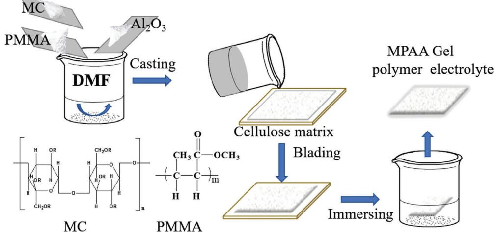
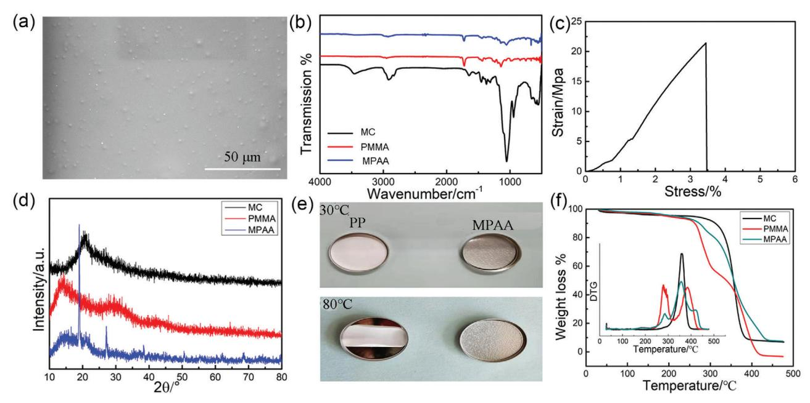
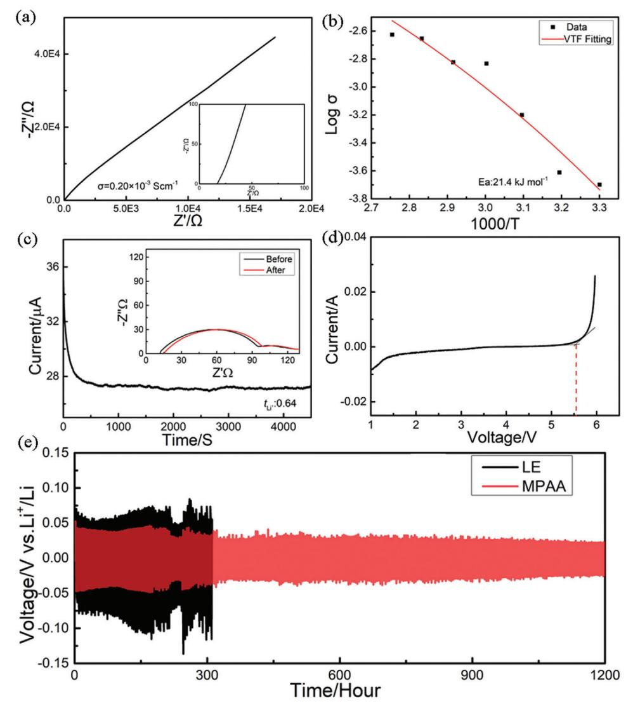
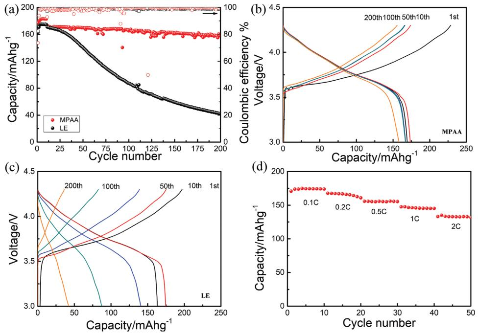
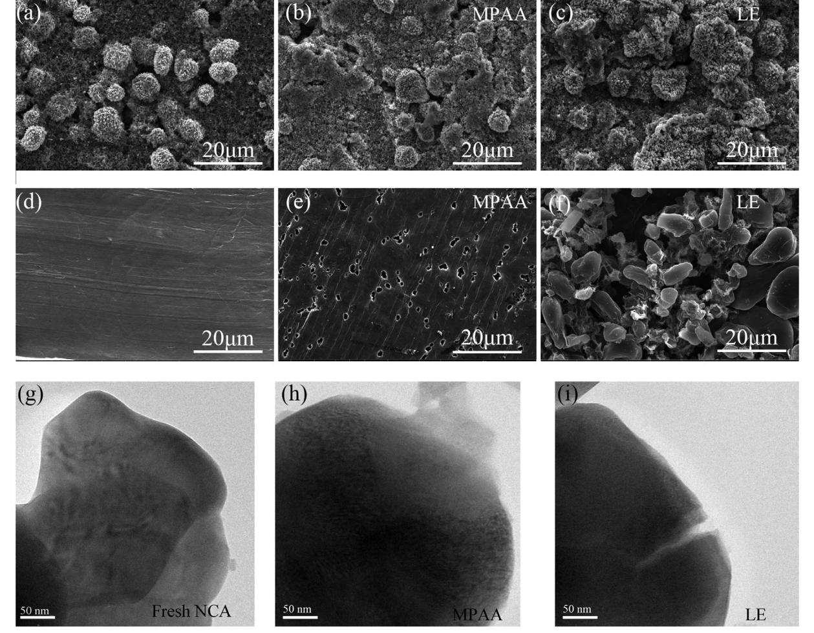
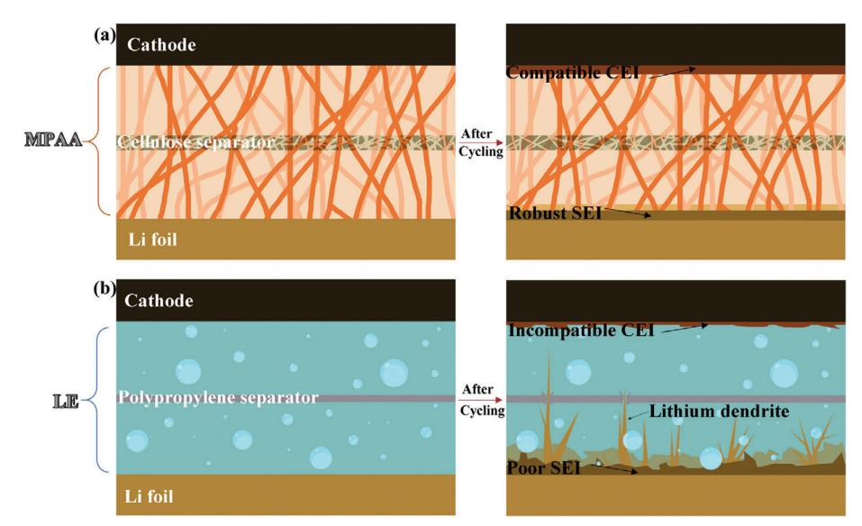

# **Methylcellulose/Polymethyl Methacrylate/Al2O3 Composite Polymer Matrix towards Ni-Rich Cathode/Lithium Metal Battery**

*Xun Zhang, Yiming Sun, Xiuping Yin, Yue Ma,\* Lianqi Zhang,\* and Defa Wang*

**Gel polymer electrolyte (GPE) has attracted extensive interest due to superior interfacial compatibility, excellent plasticity, and improved electrochemical stability. Polymer matrix is of great importance to the performance of lithium metal battery, especially for Ni-rich cathode system with high working potential. Herein, a rigid-flexible composite polymer matrix comprising methylcellulose (MC), polymethyl methacrylate (PMMA), and Al2O3 is prepared. After saturated with the liquid electrolyte of 1 M LiDFOB in EC/DMC (1:1, v:v), the obtained GPE exhibits a high ionic conductivity of 0.20 × 10−3 S cm−1 and a wide electrochemical stable window up to 5.6 V. The synergistic effect of inorganic fillers and the ester groups on polymer matrix are conducive to the uniform deposition of Li-ion and advantageous to the formation of smooth and robust interfacial passivation layer. After assembled with Ni-rich cathode LiNi0.8Co0.15Al0.05O2 (NCA), a capacity of 158.1 mAh g−1 is maintained after 200 cycles at 0.1 C, while a high value of 133.1 mAh g−1 is delivered at 2 C. These results indicate that the as-prepared MC-PMMA-Al2O3 GPE (abbreviated as MPAA) is favorable for the interfacial compatibility of lithium metal batteries and shows superior electrochemical stability at high working voltage.**

#### **1. Introduction**

Lithium metal battery (LMB) is a promising energy storage tank with high energy density and power density.[1] Nirich layered oxide cathode (e.g., LiNi1−*x*−*y*Co*x*Al*y*O2 (NCA) or LiNi1−*x*−*y*Mn*x*Co*y*O2(NCM)) is regarded as a promising nextgeneration material due to the high reversible capacity up to

X. Zhang, Y. Sun, D. Wang School of Materials Science and Engineering Tianjin University Tianjin 300350, China X. Yin Xuecheng Branch Bureau Zaozhuang Ecological Environment Agency Zaozhuang 277000, China Y. Ma, L. Zhang School of Materials Science and Engineering Tianjin University of Technology Tianjin 300384, China E-mail: MY18002118645@163.com; zhanghz@email.tjut.edu.cn

The ORCID identification number(s) for the author(s) of this article can be found under https://doi.org/10.1002/macp.202100234

**DOI: 10.1002/macp.202100234**

200 mAh g−1 and the high energy densities as well as the superior rate performance. Stable cycling of battery with Ni-rich layered oxide cathode and Li anode is of great importance to meet the increasing demand of electrical devices. However, the electrochemical instability of conventional used liquid electrolytes (LEs) and the degradation of delithiated materials related to the interfacial adverse reactions impede the development of presently LMBs assembled with Nirich cathodes.[2]

As a promising alternative candidate, polymer electrolyte offers several advantages including high ionic conductivity, high mechanical modulus, and high stability, and is conducive to address the adverse reactions and safety issues of LE.[3] Trapping LE in polymer matrix, gel polymer electrolyte (GPE) can keep the merits of LE and polymer matrix, therefore, excellent electrochemical stability, improved safety, and ionic conductivity are presented in GPE system.[4] The favorable interfacial property, mechanical strength, and thermal stability

can be further developed by the modification of polymer matrix or LE. Inorganic fillers doping,[5] additive self-sacrifice strategy,[6] and composite polymer electrolyte construction[7] are verified to be feasible and effective to improve the performance of LMBs assembled with GPEs.

In situ polymerization has been widely proposed to prepare intimate interface between cathode and electrolyte. The novel GPEs prepared by thermal polymerization always presents superior electrochemical performances than those of ex situ counterparts.[8] The interfacial resistance also can be reduced after one-step UV-polymerization.[9] To avoid the introduction of impurities and the generation of heterogeneous polymer, the blending of different polymers and inorganic fillers is suggested to be a promising method to enhance the ionic conductivity and stability of GPE.[10] In consideration of the transition metal immobilizing capability, sodium alginate is incorporated into poly(vinylidene fluoride-co-hexafluoropropylene) cellulose acetate (PHC) to fabricate a metaophilic GPE to enhance the compatibility and stability of cathode/electrolyte interface.[11] Functionalized SiO2 nanoparticles are advantageous to the favorable interfacial characteristics of electrodes, therefore, the composite polymer electrolyte comprising functionalized SiO2 and

**Figure 1.** Schematic illustration of the procedure for the preparation of MPAA polymer matrix.

cross-linked fibrous polyacrylonitrile (PAN) improves the cycling performance of lithium battery significantly.[12] In our previous work, montmorillonite is introduced into polyvinylidene fluoride (PVDF)/polyvinyl alcohol (PVA) polymer matrix, benefiting from the intercalation structure of montmorillonite, the transportation channel of Li-ion is broadened and the cycling stability of LMBs is improved.[13]

Methylcellulose (MC) presents the characteristics of excellent wettability and water retention capability, which is conducive to the formation of intimate electrode/electrolyte interface and advantageous to the rapid transfer of Li-ion. Polymethyl methacrylate (PMMA) shows great film-forming property and excellent interfacial property with anode. Herein, MC and PMMA are blended to prepare a composite polymer matrix. Ceramic fillers are doped to further improve the high voltage-resistant of polymer electrolyte through the Lewis acid-base interactions between polymer chains and ceramic fillers, and therefore, the related oxidation decomposition of electrolyte is suppressed.[14] Nanosized fillers present strong surface effect and are facile to aggregate, leading to the destruction of ion-conducting path. Therefore, Al2O3 ceramic with micrometer diameter is adopted to improve the electrochemical stability and repress the lithium dendrite growth as a physical barrier.[15] To further strengthen the mechanical property of GPE, a cellulose separator is introduced as a reinforcement. In consideration of the excellent interface construction capability of LiDFOB, the LE composed of 1M LiDFOB in EC/DMC (1:1, v:v) is adopted for the preparation of MC-PMMA-Al2O3 GPE (abbreviated as MPAA). High ionic conductivity of 0.20 × 10−3 S cm−1 for MPAA is obtained. Then the interfacial stability with Li anode is conducted using Li–Li symmetrical cell and a low polarization of 0.4 mV is displayed after plating/striping for 1200 h. After assembled with LiNi0.8Co0.15Al0.05O2 (NCA) cathode and Li anode, a capacity of 158.1 mAh g−1 is maintained after 200 cycles at 0.1 C. The results indicate that the composite GPE prepared by blending strategy can be applied in a high voltage LMBs and exhibits superior cycling performance.

# **2. Results and Discussion**

#### **2.1. Physical Properties of MC-PMMA-Al2O3 (MPAA) Polymer Matrix**

MPAA polymer matrix with multi-advantages of individual polymers and inorganic filler is prepared using casting method. The preparation procedure is depicted in **Figure 1**. A typical scanning electron microscope (SEM) image of "ceramic in polymer" is displayed in **Figure 2**a for MPAA, from which a uniform and flat surface can be observed, while the Al2O3 ceramics are embedded in the MPAA matrix uniformly. Fourier transform infrared spectrometer (FT-IR) spectra of MC is shown in Figure 2b, the bands at 3459 and 2918 cm−1 assign to the stretching vibration –OH and C-H, strong band at 1047 cm−1 corresponds to the stretching vibration of C–OH, the peaks at 1453 and 1377 cm−1 assign to the bending vibration of C–H and the stretching vibration of C–O. As for PMMA, the strong absorbing bands at 1724 and 2953 cm−1 correspond to C═O and C–H, respectively. Peak at 1438 cm−1 assigns to the antisymmetric bending vibration of CH3, the absorbing bands at 1136 cm−1 belong to symmetric stretching vibration of –COOCH3. The existence of ester groups in PMMA and MC makes the composite polymer membrane ideal host for LEs. After blending, the respective characteristic peaks of MC and PMMA can be observed in FT-IR spectra of MPAA.

The tensile strength is tested and shown in Figure 2c, a high value of 22 MPa with an elongation-at-break value of 34.9% is obtained, which demonstrates a high plastic deformability of MPAA. X-ray diffraction (XRD) patterns of MC, PMMA, and MPAA are shown in Figure 2d, Strong and sharp characteristic peaks at 20° are exhibited for MC, indicating a comparable high crystallization tendency. PMMA presents characteristic peaks at 13° and 30°. In the XRD pattern of MPAA, the new sharp peaks located at about 20° and 28° are corresponded to the characteristic peak of Al2O3 (Figure S1, Supporting Information), while the characteristic peaks of MC and PMMA present decreased intensity after blending, indicating that the addition of Al2O3 ceramic **www.advancedsciencenews.com www.mcp-journal.de**

**Figure 2.** a) Typical SEM image of MPAA composite polymer matrix. b) FT-IR spectra of MPAA composite polymer matrix. c) Stress–strain curve of MPAA. d) X-ray diffraction (XRD) patterns of MC, PMMA, and MPAA. e) Thermal shrinkage test of PP and MPAA composite polymer matrix. f) Thermogravimetric analysis (TG) profiles of MC, PMMA, and MPAA polymers.

is conducive to decrease the crystallinity of polymer matrix by interrupting the regularity of molecular segment. Therefore, the segmental motion of polymer chain is significantly improved.[16]

The shrinkage property is conducted to evaluate the thermal stability of MPAA and conventional polypropylene (PP) separators. PP undergoes shrinkage after heating at 80 °C whereas MPAA presents an integral appearance after heating for 24 h (Figure 2e). Furthermore, the detailed information of MC and PMMA are displayed in Figure 2f. In PMMA, there are two degradation stages can be observed at 279 and 386 °C, corresponding to the chain breakage induced by double bond at the end of chain and the irregular chain breakage in main chain, respectively. Two endothermic peaks with similar area can be observed in the Differential thermogravimetric analysis (DTG) profile displayed in the illustration, corresponding to the two weightlessness stages. As for MC, a degradation stage at 362 °C is presented, corresponding to the endothermic decomposition of main chain. After blending, the weight loss temperatures reach up to 283, 359, and 420 °C for MPAA, indicating the significant improvement of thermal stability and may be closely related to the addition of Al2O3 filler. These results suggest that MPAA can be used as a safe and promising electrolyte at wide working temperature.

#### **2.2. Electrochemical Properties of MPAA**

The ionic conductivity of MPAA is tested using electrochemical impedance spectra and the related Nyquist plot is illustrated in **Figure 3**a. A high value of 0.20 × 10−3 S cm−1 is obtained at room temperature, which may be ascribed to the synergistic effect of liquid ingredient and flexible polymer segment (the ionic conductivity of LE is displayed in Figure S2, Supporting Information). Moreover, the temperature-dependent ionic conductivities from 30 to 90 °C is tested, a superior activation energy (*E*a) of 21.4 kJ mol−1 is obtained via Vogel–Tamman–Fulcher (VTF) empirical equation (Figure 3b), which is higher than that of LE (Figure S3, Supporting Information) but lower than that of the conventional solid electrolyte (40 kJ mol−1) reported in previous work.[17] Furthermore, the lithium-ion transport number (*t*Li +) is tested using time–current profile with Li/MPAA/Li symmetric cell following a 0.01 V direct current polarization (Figure 3c). The current decreases from 36 to 26 μA after 5000 s polarization, while the impedance increases from 82 to 85 Ω. Then a high *t*Li + value of 0.64 is achieved owing to the Lewis acid-base interaction between C═O in electrolyte (Lewis base groups) and lithium ions (Lewis acid), which exceeds that of 0.23 for LE counterpart (Figure S4, Supporting Information) and suggests the superior ion-conducting behavior of MPAA.[18] Electrochemical stability is also critical for electrolyte and the electrochemical stability window of MPAA is tested using Linear sweep voltammetry (LSV) (Figure 3d). The onset decomposition potential of MPAA is 5.6 V versus Li+/Li, which is higher than that of LE (4.3 V, Figure S5, Supporting Information) and may be originated from the addition of Al2O3 and suggests the application feasibility of MPAA for high voltage batteries.

The interfacial stability between electrolyte and Li anode is further investigated by galvanostatic cycling at current density of 0.1 mA cm−2 (0.5 h in each half cycle) (Figure 3e). It can be seen that a stable voltage without any internal short circuit during 1200 h is presented except the slightly larger voltage polarization in the initial cycles, indicating the formation of stable interfacial passivation layer and the optimized deposition/dissolution behaviors of lithium ions. For comparison, a comparable larger polarization voltage is displayed in Li/LE/Li cell, which may be induced by the formation of highly resistive interfacial layer comprising dead Li and decomposed electrolyte.[19] The interfacial **www.advancedsciencenews.com www.mcp-journal.de**

**Figure 3.** a) Electrochemical impedance spectra of SS/MPAA/SS symmetrical cell. b) Ionic conductivity dependence with temperature of MPAA from 30 to 90 °C. c) Current-time profile following a DC polarization of 10 mV of the Li/MPAA/Li cell (inset is the AC impedance spectra before and after polarization). d) LSV profile of the MPAA electrolyte. e) Chronopotentiometry profiles of Li/MPAA/Li and Li/LE/Li symmetric cells.

compatibility between electrolyte and Li anode is further investigated by monitoring impedance variation of Li/MPAA/Li symmetric cell (Figure S6, Supporting Information). It can be observed that the interfacial impedance stabilizes at about 40 Ω after presenting a slight decrease, which may be corresponded to the generation of compatible interface and indicate excellent interfacial compatibility between MPAA and Li foil.

#### **2.3. Electrochemical Performance of NCA/MPAA/Li Battery**

To further investigate the electrochemical performance of MPAA, the cycling performance of NCA/MPAA/Li battery is tested at 0.1 C and displayed in **Figure 4**a, NCA/LE/Li battery is taken as a fair comparison. An activation process is shown in the initial cycles with lower capacity. After 200 cycles, a discharge capacity of 158.1 mAh g−1 with an overall Coulombic efficiency of 94.3% is maintained and a capacity retention of 89.2% is approached for NCA/MPAA/Li battery. As a stark contrast, a discharge capacity of 42.3 mAh g−1 and an extremely low capacity retention of 25.9% remained for NCA/LE/Li battery after 200 cycles. In the galvanostatic charge/discharge curves exhibited in Figure 4b,c, NCA/MPAA/Li battery presents a minor polarization voltage and higher discharge platform during cycling while a serious capacity decay and an obvious polarization increase can be observed in NCA/LE/Li battery (Figure 4c). Moreover, the rate performance of NCA/MPAA/Li battery is tested and shown in Figure 4d. Discharge capacities of 174.8, 167.7, 155.7, 147.6, 133.1 mAh g−1 are exhibited at 0.1, 0.2, 0.5, 1, and 2 C, reconfirming the rapid transportation of Li ions in NCA/MPAA/Li battery. Capacity decay is closely related to the interfacial adverse reactions and the impedance variation of cycled batteries is compared in Figure S7, Supporting Information. The impedance of NCA/MPAA/Li battery increases from 48 to 152 Ω, lower than that of 75 to 215 Ω for

**Figure 4.** a) Cycle performance of NCA/MPAA/Li and NCA/LE/Li batteries at 0.1 C. b–c) Charge/discharge profiles of NCA/MPAA/Li and NCA/LE/Li batteries. d) Rate performance of NCA/MPAA/Li battery from 0.1 to 2 C.

NCA/LE/Li battery, indicating the suppressed parasitic reactions with the application of MPAA electrolyte and the generation of favorable interface in NCA/MPAA/Li battery.

#### **2.4. Interfacial Properties of NCA/MPAA/Li Battery**

Electrochemical performance is closely related to the interfacial chemistry of battery, therefore, the morphology of cycled electrodes are characterized by SEM. A flat smooth surface with representative pristine NCA secondary spheres with the diameter of about 5–10 μm is shown in **Figure 5**a. After cycling, the morphology of NCA cathode assembled with MPAA remains constant and the integrity of cathode structure is presented (Figure 5b). By a sharp contrast, serious particle breakage can be observed on the surface of NCA cathode assembled with LE (Figure 5c), which will lower the efficiency of electrons conduction and Li-ion migration during cycling. What's worse, the active material loss and the parasitic reactions will deteriorate along the cracks and the structural degradation, as well as the continuous reconstruction of passivation layer, will be caused and accelerated.[20]

In the typical SEM images of pristine Li foil shown in Figure 5d, a smooth and flat surface morphology can be observed. After cycling, a compact and homogeneous surface is displayed on Li foil assembled with MPAA (Figure 5e), which may be ascribed to the positive effect of Al2O3 and ester groups on the deposition of Li-ion. As for the Li foil assembled with LE, a rough surface with massive mossy-like accumulations and cracks is exhibited (Figure 5f), which may be caused by the decomposition reaction of LE and comprises dead Li and lithium carbonate/alkyl lithium carbonate species.[21] The obtained high resistive interfacial layer will impede the transfer of Li-ion and deteriorate the electrochemical performance of battery, consisting with the cycling results shown in Figure 4a. Transmission electron microscope (TEM) is further applied to investigate the morphology of NCA cathode assembled with different electrolytes (Figure 5g– i). The structure of NCA particle assembled with MPAA maintains integrity after cycling (Figure 5h), as a sharp contrast, obvious crack is observed on NCA particle assembled with LE (Figure 5i), indicating the positive effect of MPAA in maintaining the structural integrity of cathode material.

The influence of MPAA on the electrochemical performance of NCA-based LMBs is illustrated in **Figure 6**. With the application of MPAA, a more intimate interface and a more flexible Li-ion transfer pathway is achieved. More importantly, the introduction of Al2O3 and the ester groups on polymer chain are conducive to the deposition of Li-ion and therefore advantageous to the formation of robust interfacial passivation layers. While in NCA/LE/Li battery, the adverse interfacial reactions and the growth of Li dendrite seriously damage the stability of electrode/electrolyte interface, therefore lead to inferior electrochemical performance.

#### **3. Conclusion**

In this work, a composite polymer matrix with excellent filmforming property and favorable interfacial chemistry is prepared. The as-obtained MC-PMMA-Al2O3 (MPAA) GPE presents improved mechanical and electrochemical properties after saturating LE. After assembled with NCA, a discharge capacity of 158.1 mAh g−1 with a Coulombic efficiency of 94.3% is delivered after 200 cycles at 0.1 C. The superior electrochemical performances are extensively investigated and are attributed to the following aspects: 1) The addition of Al2O3 is conducive to the improvement of high voltage resistance and repress the growth of Li dendrites.

**Figure 5.** Typical SEM images of NCA cathodes at pristine state a) and cycled state disassembled from of b) NCA/MPAA/Li and c) NCA/LE/Li batteries. SEM images of Li anodes at pristine state d) and cycled state unpacked from e) NCA/MPAA/Li and f) NCA/LE/Li batteries. Typical TEM images of NCA cathodes at pristine state g) and cycled state disassembled from h) NCA/MPAA/Li and i) NCA/LE/Li batteries.

**Figure 6.** Schematic illustration of stable interface formation based on different electrolytes. a) MPAA and b) LE.

2) The methylcellulose and ester groups on polymer matrix exhibit great liquid absorption capability and are advantageous to the transfer of Li-ion. 3) MPAA not only helps to maintain the integrity of cathode structure by suppressing interfacial adverse reactions, but also is instrumental in the regulation of Li-ion deposition and Li dendrites growth. This study provides a strategy of constructing rigid-flexible polymer matrix for developing the compatibility between electrolyte and electrodes, therefore, the electrochemical performance of Ni-rich cathode-based LMBs will be improved.

#### **4. Experimental Section**

*Materials*: Methylcellulose (weight-average molecular weight: 400) was purchased from Kelong chemical reagent factory in Chengdu. Polymethyl methacrylate (weight-average molecular weight of 120 000) was purchased from Aladdin and placed in a cool dry place. Al2O3 with diameter of 4–6 μm was purchased from Aladdin. Li foil (China Energy Lithium Co., Ltd) and LE (Duoduo Chem. Co., Ltd) were transferred to the glove box for further use. LiNi0.8Co0.15Al0.05O2 (self-prepared) and acetylene black (Sigma-Aldrich Inc.) were dried in the oven at 120 °C for 12 h, PVDF binder (5130) were dried in the oven at 60 °C for 24 h before use.

*Preparation of MPAA Polymer Matrix and LMBs*: First, Methylcellulose and polymethyl methacrylate were mixed in the ratio of 3:7 (wt.%) and dissolved in *N*,*N*-dimethylformamide and stirred for 6 h. Then Al2O3 was dispersed into the obtained mixture by sonication to achieve a uniform slurry. Cellulose membrane was used as the reinforcement to prevent the battery short circuit. The obtained slurry was poured on cellulose membrane, after heating at 60 °C for 24 h in air-circulating oven and 60 °C for 24 h in vacuum oven, colorless methylcellulose-polymethyl methacrylate-Al2O3 polymer electrolyte (abbreviated as MPAA) matrix was obtained. The thickness of MPAA used for ionic conductivity test was about 70 μm.

LiNi0.8Co0.05Al0.15 (NCA) powder was mixed with conductive agent Super P in the weight ratio of 8:1, after grinding in agate mortar for 0.5 h, the powder mixture was added into the 6 wt.% polyvinylidene fluoride (PVDF) solution. After stirring for 12 h, the uniform dispersed black slurry was obtained. After casting on Al foil and drying in vacuum oven for 72 h, the cathode composed of 80 wt.% NCA, 10 wt.% Super P, 10 wt.% PVDF with the areal density of ≈2 mg cm−2 was prepared. Li foil was taken as anode. 60 uL LE containing 1 M LiDFOB in EC/DMC (1:1, v:v) was injected into 2032-type coin cell after the placement of MPAA, the standstill time no less than 12 h before the electrochemical tests.

*Characterizations*: The molecular structure of MPAA was tested using Fourier Transform infrared spectrometers (FT-IR, Frontier Mid-IR FTIR). The morphology of MPAA electrolyte was investigated by Scanning electron microscopy (SEM, Quanta FEG 250). SEM was also used to compare the morphology variation of NCA cathode and Li anode during cycling. TEM was further used to characterize the structural variation of NCA materials. XRD (Ultima IV) was conducted to evaluate the crystallinity degree of MPAA. Thermogravimetric analysis (TG) test was conducted using STA449F5. The thermal shrinkage test was conducted to explore the thermal stability of MPAA. The tension test was performed to test the mechanical properties of MPAA.

*Electrochemical tests*: The ionic conductivity () of MPAA assembled in block stainless steel (SS)/MPAA/SS symmetrical cell configuration was measured by electrochemical impedance spectroscopy (EIS) according to the following equation:

= *d*∕*RS*

Where *d* (cm) is the thickness of MPAA, *S* (cm−2) belongs to the effective area of MPAA, while *R* represents the bulk resistance of MPAA. EIS was performed in the frequency range from 1 MHz to 100 mHz through multi-channel electrochemical workstation (PARSTAT).

The active energy of MPAA was further calculated using following VTF empirical equation after testing the ionic conductivities from 30 to 90 °C.

$$
\sigma = A T^{1/2} \exp\left[\frac{-Ea}{R(T - T_0)}\right]
$$

where *A* is the pre-exponential factor, *E*a is the activation energy, *R* is the ideal gas constant, and *T*0 is a parameter related to the glass transition temperature.

The electrochemical stability windows of MPAA was measured using Li/MPAA/SS unsymmetrical cell by LSV from 0 to 6 V versus Li+/Li. The lithium-ion transfer number (*t*Li+) of MPAA was tested using Li/MPAA/Li symmetrical cell via a conventional electrochemical method and the result can be calculated according to the following equation:

$$
t_{Li}^+=I_s(\Delta V-I_0R_s)/I_0(\Delta V-I_sR_0)
$$

Where *I*0 and *I*s stand for the current value of initial and steady-state in DC polarization, while *R*0 and *R*s represent the resistance at initial and steady-state in AC impedance test. Δ*V* is the potential amplitude of 10 mV. The cycling performance and rate performance of NCA/MPAA/Li batteries were investigated in the potential range of 3–4.3 V using LAND testing system (Wuhan LAND electronics Co., Ltd.), respectively. The C rates in all the electrochemical measurements were defined based on 1 C = 200 mA g−1. The battery was assembled in an argon-filled glove box with oxygen content ≤0.1 ppm and H2O content ≤0.1 ppm.

# **Supporting Information**

Supporting Information is available from the Wiley Online Library or from the author.

## **Acknowledgements**

This work was financially supported partly by National Nature Science Foundation of China (22005217), China Postdoctoral Science Foundation (2020M670665), National Nature Science Foundation of Tianjin (20JC-QNJC00440).

# **Conflict of Interest**

The authors declare no conflict of interest.

#### **Data Availability Statement**

Research data are not shared.

### **Keywords**

composite gel polymer electrolyte, electrochemical performance, inorganic filler, LiNi0.8Co0.15Al0.05O2 cathode, polymethyl methacrylate

> Received: June 23, 2021 Revised: August 3, 2021 Published online: August 19, 2021

[1] a) B. Dunn, H. Kamath, J.-M. Tarascon, *Science* **2021**, *334*, 928; b) M. Armand, J.-M. Tarascon, *Nature* **2008**, *451*, 652; c) M. M. Thackeray, C. Wolverton, E. D. Isaacs, *Energy Environ. Sci.* **2012**, *5*, 7854; d) J.-M. Tarascon, M. Armand, *Nature* **2021**, *414*, 359.

- **www.advancedsciencenews.com www.mcp-journal.de**
- [2] a) K. S. Ngai, S. Ramesh, K. Ramesh, J. C. Juan, *Ionics* **2016**, *22*, 1259; b) R. C. Agrawal, G. P. Pandey, *J. Phys. D: Appl. Phys.* **2008**, *41*, 223001; c) X. Cheng, J. Pan, Y. Zhao, M. Liao, H. Peng, *Adv. Energy Mater.* **2018**, *8*, 1702184.
- [3] Q. Wang, Y. Yu, J. Ma, N. Zhang, J. Zhang, Z. Liu, G. Cui, *J. Power Sources* **2016**, *327*, 196.
- [4] J. Shi, H. Xiong, Y. Yang, H. Shao, *Solid State Ionics* **2018**, *326*, 136.
- [5] a) S. Srivastava, J. L. Schaefer, Z. Yang, Z. Tu, L. A. Archer, *Adv. Mater.* **2014**, *26*, 201; b) C.-C. Yang, Z.-Y. Lian, S. J. Lin, J.-Y. Shih, W.-H. Chen, *Electrochim. Acta* **2014**, *134*, 258; c) S. K. Das, S. S. Mandal, A. J. Bhattacharyya, *Energy Environ. Sci.* **2011**, *4*, 1391; d) J. Cao, L. Wang, X. He, M. Fang, J. Gao, J. Li, L. Deng, H. Chen, G. Tian, J. Wang, S. Fan, *J. Mater. Chem. A* **2013**, *1*, 5955; e) B. Kumar, *J. Power Sources* **2008**, *179*, 401; f) F. Croce, G. B. Appetecchi, L. Persi, B. Scrosati, *Nature* **1998**, *394*, 456; g) M. E. Mackay, *Science* **2006**, *311*, 1740; h) Y. Shan, L. Li, X. Yang, *ACS Appl. Energy Mater.* **2021**, *4*, 5101.
- [6] L. Liu, C. Du, S. Wang, S. Chen, *Chinese Chem. Lett.* **2018**, *29*, 1781.
- [7] a) T. Ma, Z. Cui, Y. Wu, S. Qin, H. Wang, F. Yan, N. Han, J. Li, *J. Membr. Sci.* **2013**, *444*, 213; b) L. Zhou, N. Wu, Q. Cao, B. Jing, X. Wang, Q. Wang, H. Kuang, *Solid State Ionics* **2013**, *249–250*, 93; c) J.-A. Choi, Y. Kang, H. Shim, D. W. Kim, E. Cha, D.-W. Kim, *J. Power Sources* **2010**, *195*, 6177.
- [8] Y. Ma, J. Ma, J. Chai, Z. Liu, G. Ding, G. Xu, H. Liu, B. Chen, X. Zhou, G. Cui, L. Chen, *ACS Appl. Mater. Interfaces* **2017**, *9*, 41462.
- [9] Z. Wei, Z. Zhang, S. Chen, Z. Wang, X. Yao, Y. Deng, X. Xu, *Energy Storage Mater.* **2019**, *22*, 337.
- [10] J. Shi, Y. Yang, H. Shao, *J. Membr. Sci.* **2018**, *547*, 1.
- [11] Y.-Y. Sun, Y.-Y. Wang, G.-R. Li, S. Liu, X.-P. Gao, *ACS Appl. Mater. Interfaces* **2019**, *11*, 14830.
- [12] W.-K. Shin, J. Cho, A. G. Kannan, Y.-S. Lee, D.-W. Kim, *Sci. Rep.* **2016**, *6*, 26332.
- [13] Y. Ma, L. B. Li, G. X. Gao, X. Y. Yang, Y. You, *Electrochim. Acta* **2016**, *187*, 535.
- [14] a) F. Wu, K. Zhang, Y. Liu, H. Gao, Y. Bai, X. Wang, C. Wu, *Energy Storage Mater.* **2020**, *33*, 26; b) S. Li, S.-Q. Zhang, L. Shen, Q. Liu, J.-B. Ma, W. Lv, Y.-B. He, Q.-H. Yang, *Adv. Sci.* **2020**, *7*, 1903088; c) P. Fan, H. Liu, V. Marosz, N. T. Samuels, S. L. Suib, L. Sun, L. Liao, *Adv. Funct. Mater.* **2021**, *31*, 2101380.
- [15] a) J. Shim, H. J. Kim, B. G. Kim, Y. S. Kim, D.-G. Kim, J.-C. Lee, *Energy Environ. Sci.* **2017**, *10*, 1911; b) Z. Xu, L. Li, F. Wu, S. Tan, Z. Zhang, *J. Membr. Sci.* **2005**, *255*, 125.
- [16] a) B. Kumar, S. J. Rodrigues, *J. Electrochem. Soc.* **2001**, *148*, A1336; b) B. J. Ash, L. S. Schadler, R. W. Siegel, *Mater. Lett.* **2002**, *55*, 83.
- [17] L.-Y. Yang, D.-X. Wei, M. Xu, Y.-F. Yao, Q. Chen, *Angew. Chem.* **2014**, *126*, 3705.
- [18] F. Ye, X. Zhang, K. Liao, Q. Lu, X. Zou, R. Ran, W. Zhou, Y. Zhong, Z. Shao, *J. Mater. Chem. A* **2020**, *8*, 9733.
- [19] R. Xu, X.-Q. Zhang, X.-B. Cheng, H.-J. Peng, C.-Z. Zhao, C. Yan, J.-Q. Huang, *Adv. Funct. Mater.* **2018**, *28*, 1705838.
- [20] a) D. Golodnitsky, E. Strauss, E. Peled, S. Greenbaum, *J. Electrochem. Soc.* **2015**, *162*, A2551; b) J. Zhang, C. Zheng, L. Li, Y. Xia, H. Huang, Y. Gan, C. Liang, X. He, X. Tao, W. Zhang, *Adv. Energy Mater.* **2020**, *10*, 1903311.
- [21] S. Li, Y.-M. Chen, W. Liang, Y. Shao, K. Liu, Z. Nikolov, Y. Zhu, *Joule* **2018**, *2*, 1838.