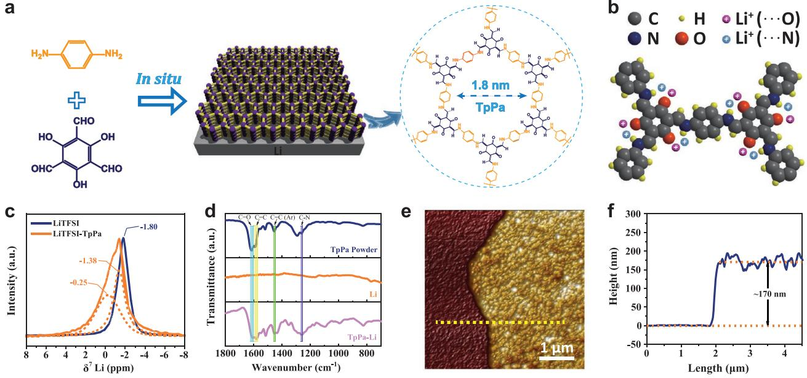
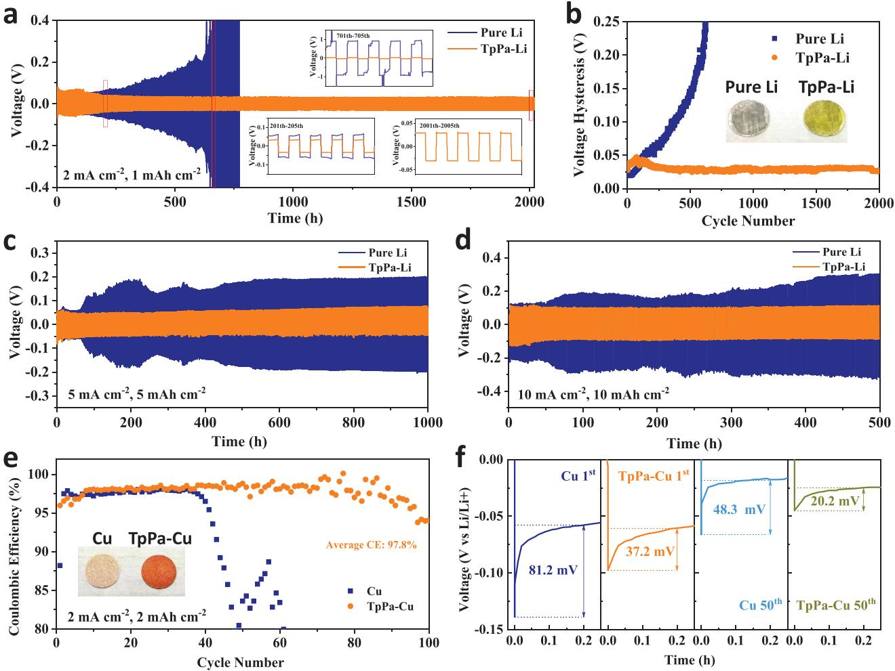
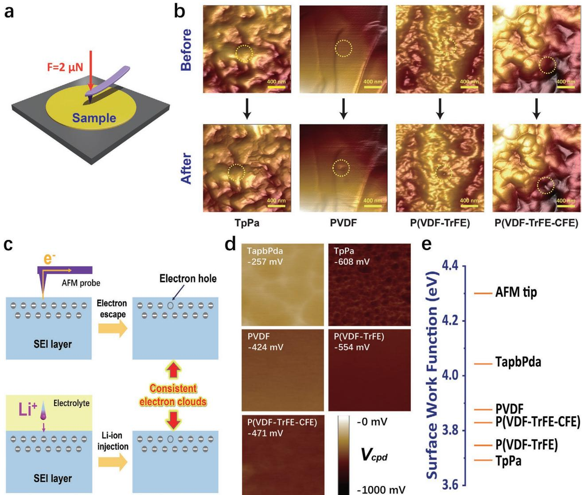
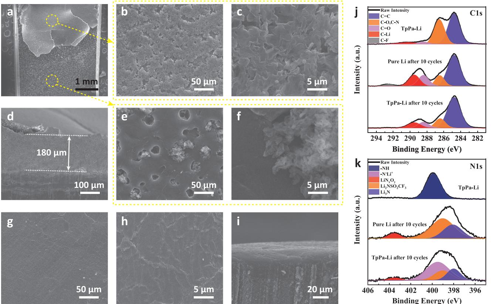
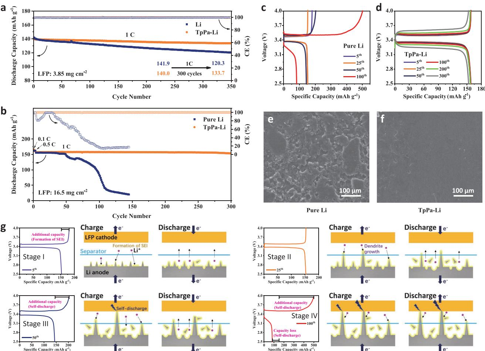

# **Covalent Organic Frameworks with Low Surface Work Function Enabled Stable Lithium Anode**

*Dongdong Chen, Peng Liu, Lei Zhong, Shuanjin Wang, Min Xiao, Dongmei Han, Sheng Huang,\* and Yuezhong Meng\**

**Uniform deposition and distribution of lithium ion (Li+) on the surface of lithium metal anode is crucial for long-life and high-safety lithium metal batteries. However, the preparation of stable solid–electrolyte interphase (SEI) is mostly based on trial and error in the absence of guideline. Herein, covalent organic framework (COF) with high Young's modulus and low surface work function is in situ synthesized on Li anode to stabilize Li**|**electrolyte interface. Notably, Young's modulus, mechanical index for Li dendrite resistance, and surface work function, electrical index for Li+ distribution, can be regarded as macroscopically detectable indicators to evaluate the artificial SEI before battery assembly. The COFTpPa modified Li metal anodes delivered stable cycling over 1000 (2000) h at high current density of 5 (2) mA cm−2 in the ether-based electrolyte, and the full cells with commercial LiFePO4 electrode (mass loading of 16.5 mg cm−2 ) demonstrate remarkably enhanced cycling performance with a high reversible capacity of 152.3 mAh g−1 (retention of 96.8%) after 300 cycles.**

### **1. Introduction**

The target of carbon-neutral is greatly stimulating the population of electrical vehicles, but the endurance of electro-mobiles is meanwhile disturbing the car owner. The endurance-related energy density of lithium-ion batteries based on intercalation chemistry has reached the bottle-neck, but the metallic lithium (Li) with high packing density of Li atoms affords an ultrahigh theoretical specific capacity of 3861 mAh g−1 . The demand for higher-energy-density battery has renewed the interest in metallic Li-based batteries (LMBs), such as Li–LiFePO4,

D. Chen, P. Liu, Dr. L. Zhong, Prof. S. Wang, Prof. M. Xiao, Prof. S. Huang, Prof. Y. Meng The Key Laboratory of Low-Carbon Chemistry & Energy Conservation of Guangdong Province/State Key Laboratory of Optoelectronic Materials and Technologies School of Materials Science and Engineering Sun Yat-sen University Guangzhou 510275, P. R. China E-mail: huangsh47@mail.sysu.edu.cn; mengyzh@mail.sysu.edu.cn Prof. D. Han School of Chemical Engineering and Technology Sun Yat-sen University Zhuhai 519082, P. R. China The ORCID identification number(s) for the author(s) of this article can be found under https://doi.org/10.1002/smll.202101496.

#### **DOI: 10.1002/smll.202101496**

Li–sulfur, Li–air, Li–CO2 batteries.[1] However, the growth of Li dendrites and the formation of inactive ("dead") Li is highly favorable during electrochemical plating/ stripping reactions, resulting in low coulombic efficiency (CE), short cycle lifetime, and high safety risks.[2]

Up to now, various strategies have been proposed to tackle these problems. First, 3D current collector with high surface area and large inner space can effectively decrease the current density and buffer the volume changes, although the advantages of specific mass/volume capacity are weakened.[3] Second, thicker and stronger native solid electrolyte interphase (SEI) are formed by optimizing the composition of solvents, Li salts, and electrolyte additives, at the expense of capacity loss from SEI formation.[4] Third, artificial SEI engineering derived from various substances

including inorganics (e.g., Li alloys,[5] Li compound[6] ), organics (e.g., polar groups contained polymer,[7] polymer electrolyte film[8] ), and their hybrid components,[9] have been attempted to construct the lithiophilic layer with high mechanical strength.

Mechanical strength of the artificial SEI were quantitatively studied in our previous work,[10] showing that the artificial SEI with higher Young's modulus were better in resisting the puncture of lithium dendrite that could be simulated by the probe of the atom force microscopy (AFM). On the other hand, the evaluation of lithiophilicity relies on nuclear magnetic resonance (NMR) spectra of 7 Li or binding energy from density functional theory (DFT) calculation, both of which are localized analysis, based on the dipole between two atoms or even the electronegativity of single atom. So, a macroscopic and experimental indicator is required to characterize the overall lithiophilicity of artificial SEI.

Lewis acidic Li ions tend to interact with the electronegative sites as Lewis base. In other words, a more negative charged site is thus supposed to induce a stronger interaction toward Li ions.[11] While interacting with a Li ion, the negative site may lose an electron for bonding. Correspondingly, the minimum energy needed to remove an electron from a solid to a point immediately outside the solid surface, or energy needed to move an electron from the Fermi level into vacuum, is defined as work function. So, the overall lithiophilicity of artificial SEI can be evaluated by work function. Lower work function, that less energy is needed to remove an electron or to inject a hole (Li ion), means more lithiophilic.

Covalent organic frameworks (COF) with good mechanical strength as artificial SEI are new stars in LMBs.[10,12] By adjusting the types and arrangement of functional groups of monomer molecules, diverse COF with different structure and properties can be obtained,[13] including high Young's modulus (based on covalent frameworks and crystallinity) and low work function (based on the long-range conjugation beyond the light element).

In this contribution, we in situ fabricated a COFTpPa (denoted as TpPa) layer as an artificial SEI on Li metal anode. The TpPa protective layer with high Young's modulus of 7.25 GPa is powerfully shield to repress the dendrite formation and exposure. Meanwhile, the regular arrayed electronegative groups in TpPa provide a series of lithiophilic sites (O, N) which constitutes high-speed channels for Li+ flow; and the delocalized electron band (–NH-conjugated with benzene ring) equalize the energy of each group and thus actually increase the Fermi level of the entire TpPa layer. So, smooth, uniform, and reversible Li plating/stripping processes can be achieved, yielding superior Li metal anode with dendrite-free surface morphology and longstanding lifespan. Most importantly, a full cell assembled with commercial LiFePO4 (LFP) electrode with a high mass loading of 16.5 mg cm−2 and Li anode protected by TpPa, showed a stable cycling performance and delivered a high reversible capacity of about 152.3 mAh g−1 (96.8% of the initial capacity) after 300 cycles.

## **2. Results and Discussion**

**www.advancedsciencenews.com**

**Figure 1**a exhibits the in situ reaction of TpPa at room temperature between 2,4,6-triformylphloroglucinol (Tp) and *p*-phenylenediamine (Pa). TpPa can molecularly self-assemble into a 2D polygon framework with high porosity, layered *π*-stacking structure, good solvent and electrochemical stability.[12a,b] As the artificial SEI of Li metal anode, the Li-ion flux can be effectively regulated due to uniform and orderly arranged lithiophilic sites (O, N) in TpPa (Figure 1b). Thus, long-term homogeneous Li+ deposition on Li metal anode can be achieved (Figure S1, Supporting Information). As shown in Figure 1c, 7 Li solid state NMR spectroscopy was used to detect Li+ chemical environments of lithium bis(trifluoromethanesulphonyl)imide (LiTFSI) in TpPa (LiTFSI-TpPa). The signal of Li+ shifted from −1.80 ppm of the pure LiTFSI salt to −1.38 and −0.25 ppm, corresponding to the interaction between Li+ and the lithiophilic sites (O and N, respectively) in TpPa.

To understand the basic properties of TpPa, TpPa powder were prepared in tetraethylene glycol (TEGDME). SEM results show that the diameter of TpPa powder is about several microns and has a large number of pores (Figure S2, Supporting Information). The X-ray diffraction (XRD) pattern confirms the crystal structure of TpPa (Figure S3, Supporting Information), which matches well with the early disclosed results.[14] The measured Brunauer–Emmet–Teller (BET) surface area of TpPa powder is 34.5 m2 g−1 , with a major pore size of 1.36 nm (Figure S4, Supporting Information). The smaller major pore size than theoretical value (1.8 nm) may be caused by imperfectly planar hexagonal sheet (wavy 2D stack structure).[15]

TpPa thin film was in situ prepared on the surface of lithium foil (denoted as TpPa-Li) similar with our previous work except for the monomers.[10] Two monomers were successively added onto the surface of pure Li, and after 12 h of reaction, uniform yellow TpPa layer was formed on the surface of pure Li (Figure S5, Supporting Information). TpPa powder, pure Li and TpPa-Li were further characterized by Fourier transform infrared (FTIR) and Raman. For FTIR spectrum, the bands of CC and CN stretching at 1579 and 1260 cm−1 in the spectrum of TpPa powder demonstrated the successful synthesis

**Figure 1.** a) Reaction scheme of TpPa from Tp and Pa; b) lithiophilic sites (N and O) in TpPa; c) 7 Li solid state NMR spectra of LiTFSI and LiTFSI-TpPa; d) FTIR of TpPa powder, pure Li, and TpPa-Li; e) AFM image of TpPa layer prepared on Si; f) height curve of the yellow line in (e).

TpPa (Figure 1d).[14] The same characteristic absorption peaks are also observed in the spectrum of TpPa-Li, while pure Li displays no infrared absorption in this area, indicating the presence of TpPa layer on TpPa-Li. This result is also supported by the Raman spectra of TpPa powder and TpPa-Li (Figure S6, Supporting Information). The intensity of Raman scattering of TpPa-Li is relatively weak because of the thin TpPa layer. In order to measure the thickness of TpPa layer, it was prepared on silicon wafer under the same condition with TpPa-Li. A scratch was drawn in the center of the TpPa film with a forceps (Figure 1e), and the thickness is about 170 nm detected by AFM, as showed in Figure 1f.

Symmetric cell tests were used to investigate the influence of TpPa layer as artificial SEI during Li plating/stripping processes. In order to stabilize the interface, all symmetric cells were activated at a low current density of 0.25 mA cm−2 before cycling at higher current density. As shown in **Figure 2**a, the pure Li or TpPa-Li symmetric cells were cycled at 2 mA cm−2 with a capacity limit of 2 mAh cm−2 . The overpotentials of pure Li symmetric cell kept increasing during the cycling process, from initial ≈20 to ≈200 mV after 600 cycles (Figure 2b). On the contrary, the TpPa-Li symmetrical cell showed stable Li plating/stripping for more than 2000 cycles without obvious increase in voltage hysteresis. Similar comparison is shown in symmetric cells cycled at 3 mA cm−2 . The TpPa-Li symmetrical cell maintains stable stripping/plating profiles for more than 1500 h, which is much better than the cell assembled with pure Li (Figure S7, Supporting Information). When the current density increases to 5 mA cm−2 , the voltage polarization of pure Li symmetrical cell increases subsequently after 60 h, while TpPa-Li symmetrical cell can run smoothly for 1000 h (Figure 2c). Even at an ultrahigh current density of 10 mA cm−2 , the TpPa-Li symmetrical cell could operate stable for 500 h, while pure Li symmetrical cell shows an asymmetric voltage hysteresis at the beginning (Figure 2d). Notably, self-heating of Li dendrite induced surface diffusion heals the dendrites and smoothens the Li metal surface at high current density.[16] The overpotentials of pure Li would not experience the sharp increase although it is clearly

**Figure 2.** Characterization of the effects of the TpPa layer toward stabilizing the surface of Li metal electrodes in symmetric cells and Li/Cu half cells. a) Galvanostatic cycling of symmetric cells based on TpPa-Li and pure Li anodes with a current density of 2 mA cm−2 at a stripping/plating capacity of 1 mAh cm−2 . b) Corresponding voltage hysteresis variation with cycle number in (a). Symmetric cell tests of the TpPa-Li and pure Li anodes at the current densities of c) 5 mA cm−2 and d) 10 mA cm−2 for 1 h in both the Li-stripping and Li-plating processes of each cycle. e) Coulombic efficiency of Li|Cu, Li|TpPa-Cu cells and f) corresponding Li nucleation overpotentials at the first or 50th cycles in (e).

**www.small-journal.com**

inferior to TpPa-Li. To further confirm the exclusive outstanding performance of TpPa layer in stabilizing Li anode, symmetric cells were assembled using electrolyte without 1,3-dioxolane (DOL) which was believed to have prominent effect on stabilizing the SEI.[17] Pure Li symmetrical cell deteriorated rapidly after 100 h, while the voltage of TpPa-Li symmetrical cell remain stable over 400 h (Figure S8, Supporting Information). CE of Li|Cu cells is another crucial parameter to evaluate the sustainability of Li anode. TpPa layer was prepared on Cu foam (defined as TpPa-Cu) through similar process like TpPa-Li, and the SEM images showed the TpPa layer distributed uniform on Cu foam (Figure S9, Supporting Information). With the capacity limit of 2 mAh cm−2 at current density of 2 mA cm−2 , the cells containing TpPa layer deliver an enhanced average CE of 97.8% over 100 cycles, while the Li plating/stripping CE on Cu foam substrate decreases rapidly after 40 cycles (Figure 2e). Meanwhile, the overpotential of the TpPa-Cu was 37.2 and 20.2 mV for the 1st and 50th cycle, much lower than that of the Cu foam (81.2 and 48.3 mV), indicating a much smaller Li deposition barrier on TpPa-Cu (Figure 2f). It can be ascribed to the in situ formed TpPa layer with lower work function has a smaller energy barrier of Li ion injection while Cu has a much higher work function of 4.65 eV.

In-depth analysis was performed to understand the excellent performance of TpPa layer. The mechanical properties of TpPa layer were explored by digital pulsed force mode equipped in AFM (**Figure 3**a). The Young's modulus of TpPa layer is determined as 7.25 GPa, which is considered tough enough to repress the dendrite formation and ensure battery safety (Figure S10, Supporting Information).[10,18] For comparison, poly(vinylidene

**Figure 3.** Mechanical strength and surface work function of different polymer layers. a) Diagram of mechanical test by AFM; b) AFM images before and after puncture by the probe tip with loading force of 2 µN for TapbPda, TpPa, PVDF, P(VDF-TrFE), and P(VDF-TrFE-CFE) films; c) schematic diagram of the relationship between surface work function and lithium ion permeation; d) contact potential difference between polymers and AFM tip; e) surface work function for different polymers.

fluoride) (PVDF), poly(vinylidene fluoride-trifluoroethylene) (P(VDF-TrFE)), and poly(vinylidene fluoride-trifluoroethylenechlorofluoroethylene) (P(VDF-TrFE-CFE)) were selected as reference materials, whose Young's modulus were determined as 1.46, 1.35, 1.35 GPa, respectively. To simulate the puncture process of lithium dendrite, a hard AFM probe was loaded onto these films with 2 µN force. As shown in Figure 3b, the TpPa film kept intact after puncture, indicating the excellent puncture resisting capability. On the contrary, sunk holes can be clearly seen at the position punctured by the probe tip for the other samples, which means irreversible deformation and potential risk of short-circuit in real battery. These results exhibit that TpPa layer is prominent artificial SEI of Li anode in terms of mechanical properties.

In this work, we found surface work function (SWF) is another important parameter to evaluate the artificial SEI. It represents the minimum energy needed to remove an electron from a solid to a point immediately outside the solid surface. A lower SWF means the electron is more likely to overflow, which is often equivalent to that positively charged Li+ is more likely to penetrate, so the SWF can be used as a parameter to macroscopically measure the Li+ affinity of the SEI (Figure 3c). Different from the binding energy of Li+ calculated theoretically, the surface work function is a directly measurable parameter of real solid, which is more practical for researchers. The Kelvin probe force microscopy (KPFM), affiliated in AFM, is considered as a practical tool to measure the surface work potential, and the contact potential difference (*V*cpd) is defined by the work function difference between the sample (*W*sample) and the tip (*W*tip) [19]

$$
V_{\rm cpd} = \frac{W_{\rm sample} - W_{\rm tip}}{e} \tag{1}
$$

where *e* is the elementary charge. TapbPda (Figure S11, Supporting Information), TpPa, PVDF, P(VDF-TrFE) and P(VDF-TrFE-CFE) films were prepared on conductive silicon, and the average *V*cpd of these films were studied by KPFM, as showed in Figure 3d. The probe specification for the KPFM test is shown in Table S1 in the Supporting Information, with a calibrated work function value of 4.3 V. The SWF of TpPa (≈3.7 V) is distinctly smaller than TapbPda (≈4.0 V) (Figure 3e), and when they were both used as the artificial SEI of Li metal anode, the stabilization effect of TpPa on Li anode was much better than TapbPda, although they own similar strength that could resist puncture of Li dendrite.[10] In order to further determine the influence of the SWF of polymers when they work as the artificial SEI of Li anode, Li symmetric cells were assembled with PVDF, P(VDF-TrFE), or P(VDF-TrFE-CFE) as the coating layer (Figure S12, Supporting Information). By comparing the SWF of the three similar kinds of polymers and the corresponding battery cycling performance, we realized that more stable symmetrical battery corresponded to the polymer with lower SWF. Therefore, the surface work function can be an important indicator to screen the artificial SEI of Li anode. TpPa owns a lower surface work function, so Li+ deposited more easily and uniformly on TaPa-Li anode.

The electrochemical impedance spectra (EIS) were also compared to further understand resistance evolution of the pure Li and TpPa-Li symmetric cells, as shown in (Figure S13, Supporting Information). The interface resistance of TpPa-Li symmetric cell reduces from 213 to 12.3 Ω during the activation process (Table S2, Supporting Information), corresponds to the step of Li+ permeating evenly in artificial SEI layer. The phenomenon of impedance reduction (from 49.0 to 6.04 Ω) is also present in pure Li symmetric cell during the activation process, because the formed SEI is more ion-conductive than the initial interface. These cells were further cycled at 2 mA cm−2 with a capacity of 2 mAh cm−2 . As expected, the interface resistance of pure Li symmetric cell increased from 0.71 to 43.3 Ω (from 20th to 500th cycles), which indicates the accumulation of SEI layers and formation of porous structure due to dendrite growth. However, the interface resistance of TpPa-Li symmetric cell changes little in the same process (from 7.25 to 4.51 Ω), proving the stable SEI layer in TpPa-Li symmetric cell. These comparisons remarkably demonstrate that the existence of COF is beneficial to maintain the stability of Li|electrolyte interface.

In order to visually evaluate the stabilizing effect of the TpPa protective layer, the morphology changes of pure Li and TpPa-Li anodes were systematically studied by SEM characterization. As shown in Figure S14 in the Supporting Information, both of pure Li and TpPa-Li anodes are dense and flat at the initial state. However, mossy-like dendrites appeared on pure Li anode during the activation process at the current density of 0.25 mA cm−2 (Figure S15, Supporting Information), and the surface become coarser when the current density is increased to 2 mA cm−2 (Figure S16, Supporting Information). A loose and fragile layer was formed by "dead Li" stacking and consecutive breakage/repair of electrolyte regulated SEI,[20] the thickness of which increase from ≈30 µm (5th cycle) to ≈180 µm (20th cycle) (**Figure 4**a–d). In addition, multitudinous holes with diameters between 10 and 50 µm formed in the Li depletion layer, further reducing the density of Li anode (Figure 4e,f). These formative loose structures will lead to huge volume expansion and electrolyte consumption, which may further cause serious and tremendous internal stress and increased polarization.[4a,7a] Contrarily, the TpPa-Li anode exhibits a smooth and dense surface after 20 cycles (Figure 4g–i), and the surface remain flat even after 100 cycles (Figure S17, Supporting Information), indicating reduced "dead Li" formation during the stripping/plating process. The surface information of pure Li and TpPa-Li anodes after cycling at 10 mA cm−2 with a capacity of 10 mAh cm−2 are also studied by SEM (Figure S18, Supporting Information). After ten cycles of stripping/plating process, the surface of pure Li electrode is a structurally unstable Li deposition layer which tends to detach, while the surface of TpPa-Li is still flat after 20 cycles. Furthermore, no distinct gap appears between TpPa layer and Li metal in the cross-section SEM images, confirming the excellent compatibility between TpPa layer and Li anode, which is necessary for stable long-time cycle. To reveal the composition changes during the Li plating/stripping cycles, X-ray photoelectron spectroscopy (XPS) was employed on pure Li and TpPa-Li (Figure S19, Supporting Information). The fitted C1s XPS spectrum is shown in Figure 4j. Compared with the cycled TpPa-Li, the peak of C–F in cycled pure Li is more distinct, indicating more decomposed products of LiTFSI on the surface of pure Li. The –NH in TpPa transformed into –N−Li+ after cycling, so the position of the corresponding peak moved from 399.9 to 399.4 eV, as showed in Figure 4k. These phenomena

**Figure 4.** Surface information for pure Li and TpPa-Li anodes. a–c) top-view, d) cross-sectional images, and e,f) inner depletion layer images for pure Li after 20 cycles of stripping/plating; g,h) top-view and i) cross-sectional images for TpPa-Li after 20 cycles of stripping/plating; High-resolution XPS spectra for j) C1s and k) N1s, of initial TpPa-Li (top), pure Li after ten cycles (middle) and TpPa-Li after ten cycles (bottom). All the cells were cycled at 2 mA cm−2 with a capacity of 1 mAh cm−2.

indicated that this TpPa coating is stable, providing a sustained protection on the Li metal electrode.

To highlight the practical application of TpPa-Li anodes, full cells were assembled by pairing LFP cathodes with different mass loading. Both Li|LFP and TpPa-Li|LFP cells could run smoothly at 1C when the loading of LFP is about 3.9 mg cm−2 (**Figure 5**a). However, the discharge capacity of Li|LFP cell fell more quickly, from 141.9 to 120.3 mAh g−1 after 350 cycles, showing low capacity retention of 84.8%. Inversely, the capacity loss of TpPa-Li|LFP cell was only 6.3 mAh g−1 after the same cycling process, corresponding higher capacity retention of 95.5%, demonstrating the significant anode improvement by TpPa. The commercial LFP electrode was then used in the cell with a LFP loading of 16.5 mg cm−2 (Figure 5b). The discharge capacity of the pure Li|LFP cell is only 84.1 mAh g−1 after 100 cycles (Figure 5c). In contrast, the TpPa-Li|LFP cell works stable and still delivers a high reversible capacity of about 152.3 mAh g−1 (96.8% of the initial capacity) after 300 cycles (Figure 5d), indicating TpPa-Li with stable interface can be used in the practical Li metal batteries. Furthermore, morphology evolution of the anodes in LFP full cells was performed. The surface of the pure Li anode after cycling was uneven (Figure 5e), while the surface of the TpPa-Li anode after cycling was very smooth (Figure 5f). More importantly, the dense Li deposited layer on TpPa-Li anode can be clearly seen from the cross-sectional image, as showed in Figure S20 in the Supporting Information. The other failed examples of pure Li|LFP cells are showed in Figure S21 in the Supporting Information. In general, the failure process can be divided into four stages (Figure 5g). Low coulombic efficiency at the beginning corresponds to the formation of SEI (4th–17th cycles, stage I). Afterward, the cell could run smoothly for a period of time (18th–29th cycles, stage II). Then, the charge capacity of the battery increases gradually, but the discharge capacity remains stable (29th–49th cycles, stage III). The cell was microshort circuited transiently in the charging process when Li+ deposited on the tip of lithium dendrite, where the additional charge capacity is compensated for the microshort circuit induced selfdischarge. Finally, the cell failed rapidly (stage IV). The decrease of discharge capacity and further increase of charge capacity is due to self-discharge, which are the results of the lasting growth of lithium dendrites. The above results demonstrate that the TpPa layer can effectively inhibits Li dendrite growth and stabilizes Li plating/stripping in practical full cells.

### **3. Conclusions**

In summary, we demonstrated TpPa-based Li-ion redistributor as artificial SEI for high-performance Li metal anodes. The **www.advancedsciencenews.com**

**Figure 5.** Electrochemical performance of Li/LFP cells using pure Li and TpPa-Li anode: a) 3.85 mg cm−2 at 1C, b) 16.5 mg cm−2 at 1C. Galvanostatic charge/discharge voltage profiles on different cycles in (b) for c) pure Li/LFP cell and d) TpPa-Li/LFP cell. Top-view images of e) pure Li and f) TpPa-Li electrodes in LFP full cells (LFP loading: 16.5 mg cm−2 ) after ten cycles at 1C. g) Diagram for the failure process of Li/LFP cell using pure Li as anode.

ultrarigid TpPa layer is a strong shield to inhibit the growth and puncture of lithium dendrites. Meanwhile, the long range conjugated and regular arrayed electronegative sites in TpPa results to a low work function for efficient Li+ (hole) injection to Li anode, Li+ conduction in TpPa and Li+ flux regulation at the interface. As results, the TpPa-Li symmetric cells experience stable cycle for 2000 and 500 h at high current density of 2 and 10 mA cm−2 , respectively. Most importantly, higher reversible capacity and longer stable cycling can be achieved in full cells assembled with commercial LFP electrode and TpPa-Li anode, demonstrating its capability of practical use. This work not only provides a more comprehensive index system, Young's modulus and surface work function, to evaluate the artificial SEI, but also successfully prepares the artificial SEI with high Young's modulus and low surface work function for Li anode protection, which give a plain guideline and paradigm for Li metal batteries.

### **Supporting Information**

Supporting Information is available from the Wiley Online Library or from the author.

# **Acknowledgements**

This work was supported by the National Key Research and Development Program (2019YFA0705701); Link Project of the National Natural Science Foundation of China and Guangdong Province (Grant No. U1601211); National Natural Science Foundation of China (22075329, 22008267, 51573215, 21506260, 21706294 and 21978332); Guangdong Basic and Applied Basic Research Foundation (Grant No. 2017B090901003, 2019A1515010803, 2020A1515011445); Guangzhou Scientific and Technological Planning Project (Grant No. 201707010424, 201804020025, 201904010271); the Fundamental Research Funds for the Central Universities (Grant No.18lgpy32, 19lgpy07, 20lgpy11).

#### **Conflict of Interest**

The authors declare no conflict of interest.

#### **Data Availability Statement**

Research data are not shared.

**www.small-journal.com**

#### **Keywords**

artificial solid electrolyte interphase, covalent organic frameworks, Li metal anodes, work function

> Received: March 14, 2021 Revised: April 3, 2021 Published online: June 17, 2021

- [1] a) H. Zhang, G. G. Eshetu, X. Judez, C. Li, L. M. Rodriguez-Martinez, M. Armand, *Angew. Chem., Int. Ed.* **2018**, *57*, 15002; b) W. J. Chen, B. Q. Li, C. X. Zhao, M. Zhao, T. Q. Yuan, R. C. Sun, J. Q. Huang, Q. Zhang, *Angew. Chem., Int. Ed.* **2020**, *59*, 10732; c) S. Huang, R. Guan, S. Wang, M. Xiao, D. Han, L. Sun, Y. Meng, *Prog. Polym. Sci.* **2019**, *89*, 19.
- [2] a) F. Sun, R. Moroni, K. Dong, H. Markötter, D. Zhou, A. Hilger, L. Zielke, R. Zengerle, S. Thiele, J. Banhart, I. Manke, *ACS Energy Lett.* **2017**, *2*, 94; b) X. Huang, J. Xue, M. Xiao, S. Wang, Y. Li, S. Zhang, Y. Meng, *Energy Storage Mater.* **2020**, *30*, 87.
- [3] a) S. Park, H. J. Jin, Y. S. Yun, *Adv. Mater.* **2020**, *32*, 2002193; b) H. Chen, A. Pei, J. Wan, D. Lin, R. Vilá, H. Wang, D. Mackanic, H.-G. Steinrück, W. Huang, Y. Li, A. Yang, J. Xie, Y. Wu, H. Wang, Y. Cui, *Joule* **2020**, *4*, 938.
- [4] a) P. Zhai, L. Liu, X. Gu, T. Wang, Y. Gong, *Adv. Energy Mater.* **2020**, *10*, 2001257; b) S. Li, W. Zhang, Q. Wu, L. Fan, X. Wang, X. Wang, Z. Shen, Y. He, Y. Lu, *Angew. Chem.* **2020**, *132*, 15045.
- [5] a) G. He, Q. Li, Y. Shen, Y. Ding, *Angew. Chem., Int. Ed.* **2019**, *58*, 18466; b) T. Xu, P. Gao, P. Li, K. Xia, N. Han, J. Deng, Y. Li, J. Lu, *Adv. Energy Mater.* **2020**, *10*, 1902343.
- [6] a) H. Chen, A. Pei, D. Lin, J. Xie, A. Yang, J. Xu, K. Lin, J. Wang, H. Wang, F. Shi, D. Boyle, Y. Cui, *Adv. Energy Mater.* **2019**, *9*, 1900858; b) K. Chen, R. Pathak, A. Gurung, E. A. Adhamash, B. Bahrami, Q. He, H. Qiao, A. L. Smirnova, J. J. Wu, Q. Qiao, Y. Zhou, *Energy Storage Mater.* **2019**, *18*, 389; c) Y. Yu, G. Huang, J. Z. Wang, K. Li, J. L. Ma, X. B. Zhang, *Adv. Mater.* **2020**, *32*, 2004157.
- [7] a) Y. Sun, Y. Zhao, J. Wang, J. Liang, C. Wang, Q. Sun, X. Lin, K. R. Adair, J. Luo, D. Wang, R. Li, M. Cai, T. K. Sham, X. Sun, *Adv. Mater.* **2019**, *31*, 1806541; b) X. Wang, Z. Pan, J. Zhuang, G. Li, X. Ding, M. Liu, Q. Zhang, Y. Liao, Y. Zhang, W. Li, *ACS Appl. Mater.*

*Interfaces* **2019**, *11*, 5159; c) N. W. Li, Y. Shi, Y. X. Yin, X. X. Zeng, J. Y. Li, C. J. Li, L. J. Wan, R. Wen, Y. G. Guo, *Angew. Chem., Int. Ed.* **2018**, *57*, 1505.

- [8] a) K. Deng, D. Han, S. Ren, S. Wang, M. Xiao, Y. Meng, *J. Mater. Chem. A* **2019**, *7*, 13113; b) K. Li, Y. Wang, W. Jia, S. Qu, Z. Yao, R. Cui, W. Zou, F. Zhou, J. Li, *ACS Appl. Mater. Interfaces* **2020**, *12*, 2285; c) K. Deng, J. Qin, S. Wang, S. Ren, D. Han, M. Xiao, Y. Meng, *Small* **2018**, *14*, 1801420.
- [9] a) Z. Jiang, L. Jin, Z. Han, W. Hu, Z. Zeng, Y. Sun, J. Xie, *Angew. Chem., Int. Ed.* **2019**, *58*, 11374; b) J. Yang, C. Hu, Y. Jia, Y. Pang, L. Wang, W. Liu, X. Sun, *ACS Appl. Mater. Interfaces* **2019**, *11*, 8717; c) S. Li, L. Fan, Y. Lu, *Energy Storage Mater.* **2019**, *18*, 205.
- [10] D. D. Chen, S. Huang, L. Zhong, S. J. Wang, M. Xiao, D. M. Han, Y. Z. Meng, *Adv. Funct. Mater.* **2020**, *30*, 1907717.
- [11] X. Chen, X. R. Chen, T. Z. Hou, B. Q. Li, X. B. Cheng, R. Zhang, Q. Zhang, *Sci. Adv.* **2019**, *5*, eaau7728.
- [12] a) Z. Zhao, W. Chen, S. Impeng, M. Li, R. Wang, Y. Liu, L. Zhang, L. Dong, J. Unruangsri, C. Peng, C. Wang, S. Namuangruk, S.-Y. Lee, Y. Wang, H. Lu, J. Guo, *J. Mater. Chem. A* **2020**, *8*, 3459; b) Q. Ai, Q. Fang, J. Liang, X. Xu, T. Zhai, G. Gao, H. Guo, G. Han, L. Ci, J. Lou, *Nano Energy* **2020**, *72*, 104657; c) T. Sun, J. Xie, W. Guo, D. S. Li, Q. Zhang, *Adv. Energy Mater.* **2020**, *10*, 1904199.
- [13] a) Z.-Q. Lin, J. Xie, B.-W. Zhang, J.-W. Li, J. Weng, R.-B. Song, X. Huang, H. Zhang, H. Li, Y. Liu, Z. J. Xu, W. Huang, Q. Zhang, *Nano Energy* **2017**, *41*, 117; b) C. J. Yao, Z. Wu, J. Xie, F. Yu, W. Guo, Z. J. Xu, D. S. Li, S. Zhang, Q. Zhang, *ChemSusChem* **2020**, *13*, 2457.
- [14] R. Wang, X. Shi, A. Xiao, W. Zhou, Y. Wang, *J. Membr. Sci.* **2018**, *566*, 197.
- [15] S. Haldar, K. Roy, S. Nandi, D. Chakraborty, D. Puthusseri, Y. Gawli, S. Ogale, R. Vaidhyanathan, *Adv. Energy Mater.* **2018**, *8*, 1702170.
- [16] L. Li, S. Basu, Y. Wang, Z. Chen, P. Hundekar, B. Wang, J. Shi, Y. Shi, S. Narayanan, N. Koratkar, *Science* **2018**, *359*, 1513.
- [17] C. Qu, Y. Chen, X. Yang, H. Zhang, X. Li, H. Zhang, *Nano Energy* **2017**, *39*, 262.
- [18] C. Monroe, J. Newman, *J. Electrochem. Soc.* **2005**, *152*, A396.
- [19] a) H. Xie, H. Zhang, D. Hussain, X. Meng, J. Song, L. Sun, *Langmuir* **2017**, *33*, 2725; b) Y. Shen, B. Shan, H. Cai, Y. Qin, A. Agarwal, D. B. Trivedi, B. Chen, L. Liu, H. Zhuang, B. Mu, S. Tongay, *Adv. Mater.* **2018**, *30*, 1802497.
- [20] N. Wu, Y. R. Shi, T. Jia, X. N. Du, Y. X. Yin, S. Xin, Y. G. Guo, *ACS Appl. Mater. Interfaces* **2019**, *11*, 43200.