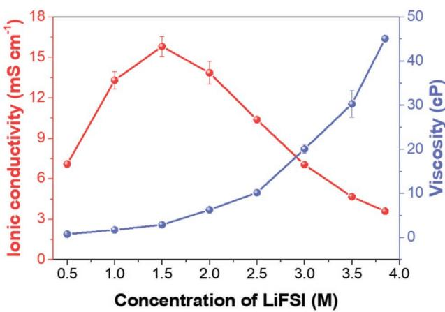
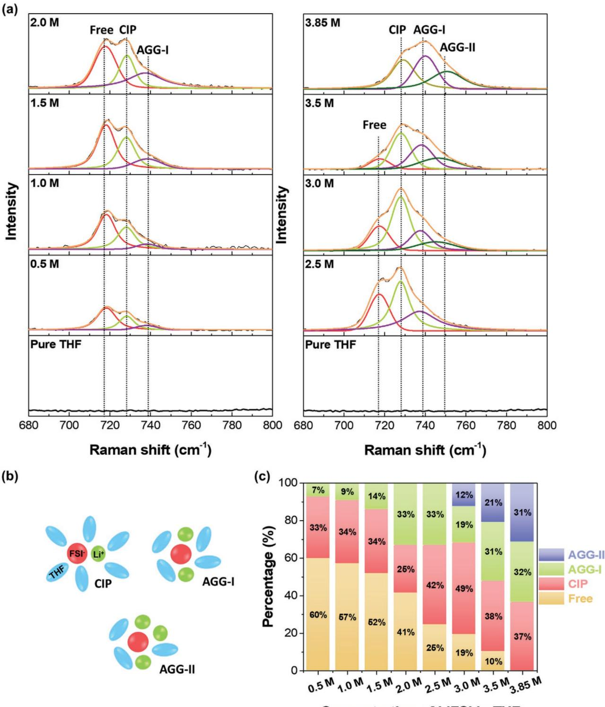
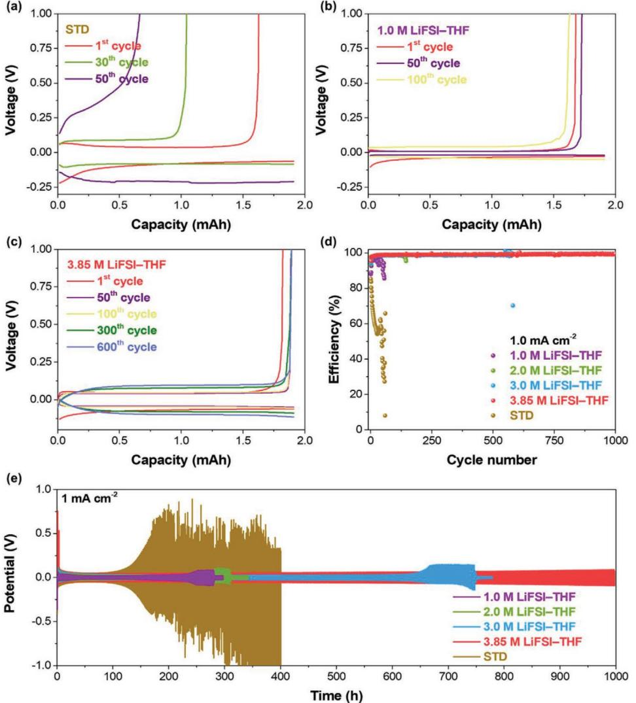
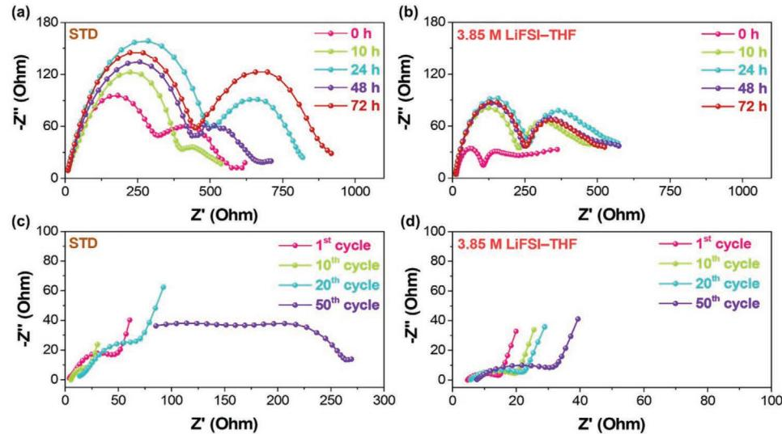
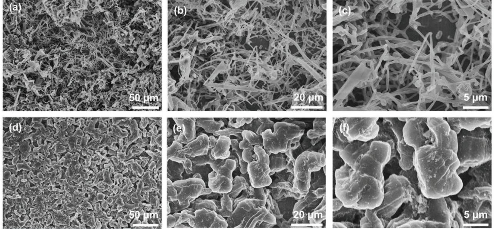
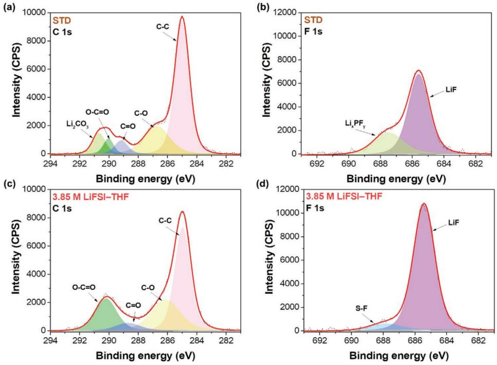
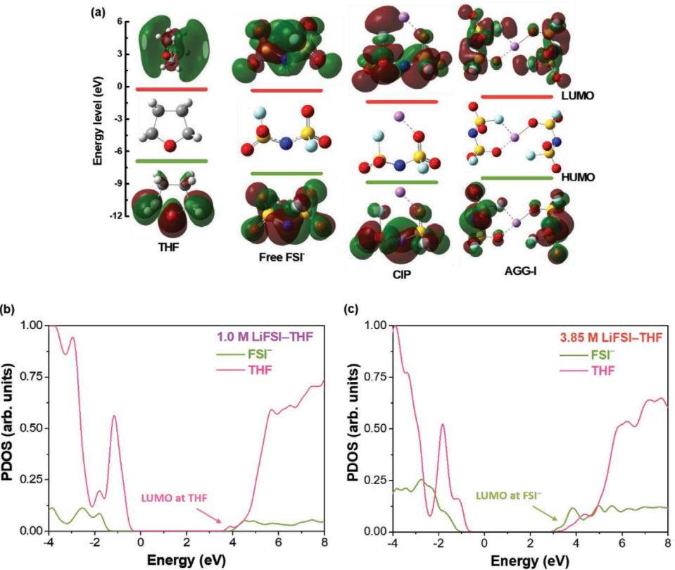
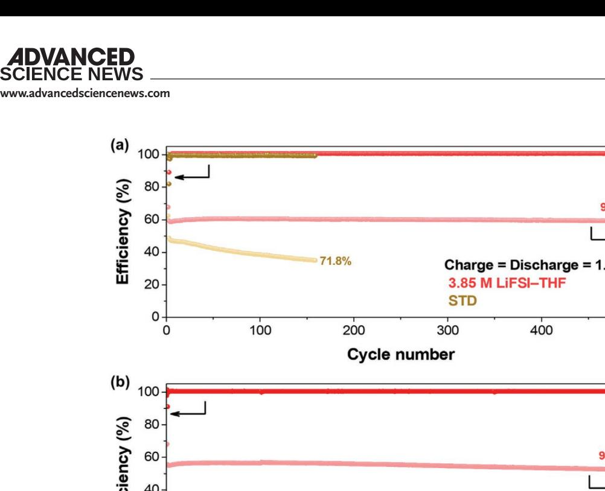

# **Design of a LiF-Rich Solid Electrolyte Interphase Layer through Highly Concentrated LiFSI–THF Electrolyte for Stable Lithium Metal Batteries**

*Thuy Duong Pham, Abdullah Bin Faheem, and Kyung-Koo Lee\**

**Lithium metal is a promising anode material for lithium metal batteries (LMBs). However, dendrite growth and limited Coulombic efficiency (CE) during cycling have prevented its practical application in rechargeable batteries. Herein, a highly concentrated electrolyte composed of an ether solvent and lithium bis(fluorosulfonyl)imide (LiFSI) salt is introduced, which enables the cycling of a lithium metal anode at a high CE (up to ≈99%) without dendrite growth, even at high current densities. Using 3.85 m LiFSI in tetrahydrofuran (THF) as the electrolyte, a Li||Li symmetric cell can be cycled at 1.0 mA cm−2 for more than 1000 h with stable polarization of ≈0.1 V, and Li||LFP cells can be cycled at 2 C (1 C = 170 mA g−1 ) for more than 1000 cycles with a capacity retention of 94.5%. These excellent performances are observed to be attributed to the increased cation–anion associated complexes, such as contact ion pairs and aggregate in the highly concentrated electrolyte; revealed by Raman spectroscopy and theoretical calculations. These results demonstrate the benefits of a high-concentration LiFSI–THF electrolyte system, generating new possibilities for high-energy-density rechargeable LMBs.**

# **1. Introduction**

Since the commercialization of lithium-ion batteries (LIBs) by Sony in the early 1990s, LIBs have dominated the portable electronic and electric vehicles (EVs) markets for decades. However, with the rapid development of wireless devices and EVs, LIBs can no longer meet the demand for high-energy storage applications.[1,2] Among the potential candidates for replacing LIBs, rechargeable lithium metal batteries (LMBs) have recently regained tremendous attention after the silence from the public view for several decades. Li metal is considered the "Holy Grail" of battery anodes owing to its high specific capacity of up to 3860 mAh g−1 and the lowest anodic potential of −3.040 V versus the standard hydrogen electrode.[3–6] However, the practical applications of LMBs have been hindered by the uncontrollable growth of irregular Li dendrites during the

T. D. Pham, A. Bin Faheem, K.-K. Lee Department of Chemistry Kunsan National University Gunsan, Jeonbuk 54150, Republic of Korea E-mail: kklee@kunsan.ac.kr

The ORCID identification number(s) for the author(s) of this article can be found under https://doi.org/10.1002/smll.202103375.

**DOI: 10.1002/smll.202103375**

depositing/stripping process because of the unstable solid electrolyte interphase (SEI) layer,[2,3,6,7] leading to low Coulombic efficiency (CE), short life span, and in the worst cases, explosion.[8,9] To avoid this scenario, a high-quality SEI layer is essential.

In recent reports, various strategies have been employed to enable LMB performance. Substantial attempts have been made to form a stable SEI layer on the Li anode, such as adding additives,[10–14] using a high-concentration electrolyte (HCE) and localized high concentration,[3,6,15–18] combining multiple lithium salts,[1,15,19,20] and employing new organic solvents or lithium salts.[21–24] Recently, HCEs have been regarded as advanced LMB electrolytes. In HCEs, salt anions enter the solvation sheath to form associated states such as contact ion pairs (CIPs) and aggregates (AGGs) because of the scar-

city of solvent molecules; hence, a stable and conductive SEI layer is mainly derived from the decomposition of Li salts.[6,25] The high concentration (10.0 m) lithium bis(fluorosulfonyl) imide (LiFSI) in dimethyl carbonate (DMC) enables interphases with high fluorine (F) content on both the Li metal anode and LiNi0.6Mn0.2Co0.2O2 (NMC622) cathode surfaces.[3] Consequently, the 10.0 m LiFSI–DMC electrolyte exhibits a high Li CE of 99.3%, effectively suppressing the Li dendrite formation and stabilizing the carbonate molecules against oxidation at high cut-off voltages of 4.6 V on the surface of NMC622. A new class of "solvent-in-salt" was developed containing a high concentration of lithium bis(trifluoromethanesulfonyl) imide (LiTFSI) (>7.0 mol per liter of solvent) in 1,3-dioxolane (DOL)/1,2-dimethoxyethane (DME) (1:1 by volume) that inhibits the dissolution of polysulfide in Li–S batteries and also protects the Li metal anode by preventing the growth of Li dendrites.[18] Yu et al. proposed a concentrated electrolyte with lithium difluoro(oxalate)borate (LiODFB) in DME, which enables good cycling of Li metal anode at high CEs (up to 98.1%) without dendrite growth.[26] Jiao et al. developed an ether-based electrolyte system composed of concentrated dual lithium salts (LiTFSI and LiODFB) and DME, which forms a stable SEI layer on both the Li metal anode and the LiNi1/3Mn1/3Co1/3O2 cathode, resulting in a capacity retention of 90% after 300 cycles (at a high voltage of 4.3 V).[1] Our group developed an ether-based electrolyte system composed of concentrated bisalt lithium difluorophosphate (LiDFP) and LiTFSI in DME, modulating the ion solvation structure in the electrolyte.[15] Hence, 2.2 m LiDFP + 1.23 m LiTFSI in DME electrolyte systems can enhance the physical properties (*σ* = 6.57 mS cm−1 and *η* = 4.98 cP), electrochemical properties (average Li CE = 98.3%), and suppress the Li dendrite growth in LMBs.

Solvents are important components in liquid electrolytes for lithium batteries, including LIBs and LMBs. Compared to other organic solvents such as carbonate solvents, ether solvents possess better compatibility with Li metal because of their intrinsic good cathodic stability (low reduction potential).[1,21,27] Hitherto, ether solvents such as DME, 1,2-diethoxyethane (DEE), DOL, and 1,4-dioxane (DX) have been studied, and impressive achievements have been made. For example, Qian et al. reported an ether-based electrolyte system consisting of 4.0 m LiFSI and DME, which provides stable cycling of the Li metal anode at high current densities with high CE (up to 99.1%) and a dendrite-free Li anode.[6] Our group recently proposed a DEEbased electrolyte as a new weakly solvating electrolyte (WSE) for LMBs.[22] WSE theoretically permits more anions to coordinate with Li+; consequently, WSE can generate abundant CIPs and AGGs under moderate salt concentrations (1.0 m LiFSI–DEE). Stable SEI and CEI layers were formed in 1.0 m LiFSI–DEE, resulting in a high CE (98.0%) in Li||Cu cells and outstanding performance in the Li||LiFePO4 (LFP) cells, with a capacity retention of 93.5% after 200 cycles. An ether-based electrolyte, consisting of 1.0 m LiFSI in DX/DME (1:2 by volume), exhibits a wide electrochemical stability window of up to ≈4.87 V vs. Li/ Li+ and a capacity retention of 93% after 50 cycles with Li||LFP cells.[21] Tetrahydrofuran (THF) is a cyclic ether solvent, which has an abundance of physical and chemical properties that favor its use in secondary lithium batteries. THF possesses a wide liquid range (boiling point = 65 °C and melting point = −108.44 °C) and low viscosity (0.456 cP at 25 °C).[28] Chen et al. provided an electrolyte with 2.0 m lithium hexafluorophosphate (LiPF6) in a mixture of THF and 2-methyltetrahydrofuran (1:1 by volume, mixTHF) for LIBs with Si, Al, or Bi microsized (>10 µm) particle anodes (SiMPs, AlMPs, or BiMPs, respectively).[29] Such a LiF-organic bilayer SEI on microsized alloying anodes was formed in 2.0 m LiPF6–mixTHF, allowing SiMPs, AlMPs, and BiMPs to undergo elastic and plastic deformation within the SEI shell. SiMPs in the electrolyte exhibited a cycling CE of >99.9% over 400 cycles with a high capacity of 2800 mAh g−1 . The CE of the SiMP||LiFePO4 (LFP) full cell reached ≈100% at a practical capacity of >2.0 mAh cm−2 . Electrolytes containing THF and lithium salts are expected to show a low chemical reactivity of THF in a reducing environment. This is of critical importance for Li metal anodes.[30] However, very few studies have reported the application of THF in LMBs. In 1978, Koch et al. studied the rate of Li/electrolyte reactivity and aging time at a high temperature for THF-based electrolytes with different lithium salts, such as lithium hexafluoroarsenate (LiAsF6), lithium tetrafluoroborate (LiBF4), and lithium perchlorate (LiClO4). Unfortunately, the results described in this study include only basic electrochemical properties owing to the lack of state-of-the-art characterization methods.

Here, we introduce an ether-based electrolyte composed of THF as the solvent and LiFSI as the lithium salt to enhance the performance of the LMBs. Among the various concentrations of LiFSI in THF, 3.85 m LiFSI–THF exhibited the best performance with a high Li plating/stripping CE and formed smooth dendrite-free Li deposits. Furthermore, when coupled with an LFP cathode, the cells with 3.85 m LiFSI–THF delivered long, stable cycling and high capacity retention. Raman spectroscopy was performed to understand the solvation structures in the electrolyte at different concentrations. From density functional theory (DFT) and first-principles molecular dynamics (FPMD) simulations, it was revealed that at high salt concentrations, anions existing in associated states are preferably reduced, resulting in a stable and dense FSI-derived SEI layer. The morphologies and components of the SEI layer were analyzed using modern methods such as scanning electron microscopy (SEM) and X-ray photoelectron spectroscopy (XPS).

# **2. Results and Discussion**

#### **2.1. Physical Properties and Solvation Structure of Investigated Electrolytes**

Among the common ether solvents, THF is a promising candidate for LMB applications owing to its remarkable physical properties. A brief comparison of the physical properties of THF and various ether solvents is presented in Table S1, Supporting Information. THF possesses a low melting point (−108.4 °C), low viscosity (0.456 cP), high dielectric constant (7.52), and strong ability to dissolve lithium salts. It is important to note that a solvent with a high dielectric constant and low viscosity can increase the ionic conductivity by promoting salt dissociation and enhancing ion mobility by decreasing the solution viscosity.[31,32] Notably, THF exhibits a high donor number (DN) of 20.0, similar to the DN of DME and higher than that of the other solvents tabulated in Table S1, Supporting Information. It is well known that a solvent with a high DN can more promptly solvate Li+ ions than solvents with a lower DN.[33] Indeed, the solubility of LiFSI in THF at room temperature was 3.85 m, which is sufficient to allow control over the solvation structures by changing the salt concentration.

An electrolyte system with high solubility generally allows tuning of the physical or electrochemical properties by changing the concentration of the electrolyte system. Hence, the physicochemical properties, such as ionic conductivity, shear viscosity, and the Li-ion transference number (t+) of LiFSI in THF electrolyte systems with different salt concentrations were measured and are illustrated in **Figure 1** and Figure S1, Supporting Information. As the concentration of LiFSI increases, the ionic conductivity increases and then decreases after reaching its maximum, which is a well-known behavior in non-aqueous electrolytes.[6,18,34] The maximum ionic conductivity of LiFSI in THF was 15.8 mS cm−1 at 1.5 m, comparable with reported electrolyte systems. For example, for ether-based electrolyte systems, 1.0 mol LiTFSI per liter of DOL:DME (1:1 by volume) had an ionic conductivity of 15.0 mS cm−1 . [18] The ionic conductivity of LiFSI in DME at 1.0 m is 16.9 mS cm−1 . [6] All the electrolytes investigated in this study exhibited ionic conductivities higher than 3.5 mS cm−1 , which meet the requirements for an LMB electrolyte. The ionic conductivity deteriorated significantly at high concentrations. It is well known that high concentration

**Figure 1.** Shear viscosity and ion conductivity of LiFSI in THF at 25 °C as a function of the salt concentration.

electrolytes generally possess low ionic conductivity and extremely high viscosity, which renders this class of electrolyte less favorable for the high-rate cycling of the Li metal electrode and inhibits ion diffusion. However, LiFSI in THF at the saturated concentration (3.85 m) possessed an ionic conductivity of 3.6 mS cm−1 , which is high in comparison to the previously studied highly concentrated electrolytes (see Table S2, Supporting Information) such as 3.57 m LiTFSI in DME (2.01 mS cm−1 ) and 5.0 m LiFSI in DME (1.7 mS cm−1 ). With increasing salt concentrations, an increasing number of cation–solvent and cation–anion complex pairs form, owing to the scarcity of solvent molecules; hence, the viscosity gradually increases. Although the viscosity of 3.85 m LiFSI–THF was ≈45 cP, it is still low compared to previously reported concentrated electrolytes systems; for example, 3.57 m LiTFSI in DME and 7 mol LiTFSI per liter of DOL + DME were 64.84 and 72 cP, respectively (Table S2, Supporting Information). With an increase in the salt concentration, the number of charge carriers might increase, and the diffusion coefficients of cations and anions become lower because of the higher viscosity. At the molecular level, the dissolved cations and anions in the solution can exist in the free form, solvent shared contact ion pair, CIP, or AGG. With increasing salt concentration, the number of free ions, which have been considered as effective charge carriers, can be limited. The number of free ions and viscosity along the salt concentration can induce the characteristic conductivity trend, in which the ionic conductivity increases and then decreases after reaching the maximum point at a specific concentration. High ionic conductivity generally results in low viscosity, but this was not the case in this study. This suggests that the ionic conductivity of electrolytes is predominantly influenced by the number of charge carriers, rather than by the solution viscosity. As displayed in Figure S1, Supporting Information, the lithiumion transference number gradually increases with increasing salt concentration and exhibits a high value at 3.85 m (*t*+ = 0.62), which is much higher than that of traditional values (*t*+ = 0.3–0.5).[35]

The solvation structures of the different concentrations of LiFSI in THF electrolyte systems were studied using Raman vibrational spectroscopy in the frequency range of 680–800 cm−1 , where the S–N–S symmetric stretching vibration mode of the FSI− anion can be observed (**Figure 2**a). The black and orange solid lines represent the original spectra and the fitting results, respectively. The spectra were deconvoluted into four different Gaussian–Lorentz (Voigt) functions. The bands at ≈718 cm−1 (red solid line), ≈728 cm−1 (green solid line), ≈738 cm−1 (purple solid line), and ≈750 cm−1 (dark green solid line) are attributed to free anions, CIP (FSI− coordinating to one Li+), AGG-I (FSI− coordinating to two Li+), and AGG-II (FSI− coordinating to more than two Li+), respectively.[36] The reference Raman spectra of free anion, CIP, and AGG-I were also predicted by DFT calculations and are presented in Table S3, Supporting Information. All DFT calculated peak positions were uniformly scaled with a scaling factor of 0.9742 for the BLYP/6-311G++ functional.[37] The frequency increased in the following order: free anions < CIP < AGG-I. The trends in the theoretically estimated results were similar to those in the experimentally observed frequency. Representative Li+ cation solvate species (CIP, AGG-I, and AGG-II) in the investigated electrolytes are shown in Figure 2b. Based on the fitting results, the distribution of Li+ solvates as a function of LiFSI concentration in THF electrolytes from the Raman spectra is shown in Figure 2c. The percentage of ionic speciation was determined by dividing the area of the specific peak by the total area of the four peaks. The solvation structure was dominated by the free anion in the electrolyte system at a salt concentration of less than 2.0 m (60% at 0.5 m, 57% at 1.0 m, 52% at 1.5 m, and 41% at 2.0 m). It is widely accepted that Li+ is mainly solvated and shielded by solvents, and the FSI− anion exists as free anions in the dilute electrolyte. In other words, there are abundant free solvent molecules between solvated Li+ and free FSI− anions, which generates a weak cation–anion interaction. The high contents of free Li+ and free FSI− are the main reasons for the high ionic conductivity. As the LiFSI concentration increases further, anions exist as associated states such as CIP because of the gradually increasing salt to solvent ratio (42% at 2.5 m and 49% at 3.0 m). Furthermore, owing to the lack of sufficient THF molecules to separate Li+ cations and FSI− anions, the charge shielding effect of Li solvation weakens, and the cation–anion interaction becomes stronger, resulting in aggregated ion pairs possibly formed by more than two cations coordinating with one anion (AGG-II). In HCEs, the associate complexes consisting of the same number of cations and anions, which are effectively neutral, can no longer contribute to the ionic conductivity as the charge carrier. This trend results in a decrease in the ionic conductivity (refer to Figure 1). Moreover, AGG-II appeared at 3.0 m with 12% and significantly increased at 3.5 and 3.85 m with 21% and 31%, respectively. The highly aggregated ionic structure complex at 3.85 m probably causes the high t+ value presented in Figure S1, Supporting Information.[38] Furthermore, each Li+ cation might coordinate to more than one FSI− anion, and each FSI− might coordinate to more than one Li+ cation in high-concentration LiFSI–THF electrolytes; hence, FSI− anions should connect through the intensive association with Li+. This connection leads to a reinforced 3D network, which is different from a dilute electrolyte wherein free solvents divide the electrolyte structure into relatively small-sized parts.[36] As can be seen in Table S2, Supporting Information, the percentage of AGG in 3.85 m LiFSI–THF is lower than that of other HCEs.

**www.small-journal.com**

**www.small-journal.com**

**www.advancedsciencenews.com**

**Figure 2.** Raman analysis of LiFSI–THF electrolytes. a) Raman spectra of LiFSI–THF electrolytes in the region from 680 to 800 cm−1 (S–N−S symmetric stretching mode of the FSI− anion). Black solid line and orange solid lines represent the original spectra and the fitting results, respectively. The bands at ≈718 cm−1 (red solid line), ≈728 cm−1 (green solid line), ≈738 cm−1 (purple solid line), and ≈750 cm−1 (dark green solid line) are attributed to free anions, CIP, AGG-I, and AGG-II, respectively. Curve fitting was performed with Gaussian–Lorentz functions. Shaded region corresponds to the fitted peak profile. b) Representative Li+ cation solvate species (CIP, AGG-I, and AGG-II) in investigated electrolytes. c) Distribution of the Li+ solvates for different concentrations of LiFSI in THF electrolytes from Raman spectra.

Nevertheless, in the 3.85 m LiFSI–THF, the difference in the lowest unoccupied molecular orbital (LUMO) energy of CIP and AGG is not pronounced (further discussed using DFT calculations), suggesting that CIP and AGG can decomposition at the same time and form the SEI layer.

#### **2.2. Intrinsic Electrochemical Stability of Investigated Electrolytes**

Linear sweep voltammetry (LSV) measurements were used to evaluate the intrinsic electrochemical stability window of different concentrations of LiFSI in THF, where a Pt disk and Li metal were used as the working electrode and the reference (counter) electrode, respectively. The LSV data were obtained with fresh electrodes and electrolytes for each measurement, as shown in Figure S2, Supporting Information. Reduction/oxidation reactions can occur when the voltage of the electrochemical cell reaches the reduction/oxidation potential of the electrolyte. The reduction/oxidation potential was determined when an obvious cathodic/anodic current increase was observed. The oxidation and reduction potentials determined using a tangent function are tabulated in Table S4, Supporting Information. All the electrolyte systems exhibited wide potential windows and good electrochemical stability. It is well known that ether solvents with low reduction potential can prevent unwanted side reactions of the electrolyte at the Li metal anode and support preferential fluorinated salt decomposition.[1,21,29] Notably, the reduction potential of 3.85 m LiFSI–THF (≈−0.05 V) was the lowest as compared to the other concentrations (≈0.05, 0.02, and −0.04 V for 1.0 m, 2.0 m, and 3.0 m, respectively), implying that chemical reactions between components in this electrolyte and Li metal can be suppressed. Moreover, as presented in Table S4, Supporting Information, the oxidation potential tends to increase with increasing LiFSI concentration. It is noteworthy that 3.85 m LiFSI–THF presents an oxidation potential of ≈4.65 V, indicating that these electrolytes are comparable to the commonly reported electrolytes and can be used with a wide range of cathode materials.[39,40] These results reveal that 3.85 m LiFSI–THF can be a promising electrolyte system to obtain stable cycling of Li metal in this electrolyte system.

#### **2.3. Lithium Metal Anode Cycling Performance**

Coin-type Li||Cu cells with different electrolytes were used to investigate the cycling stability of Li plating/stripping in this study. The CEs of Li metal were obtained by testing Li||Cu cells using the modified method 1 reported by Adams et al.[41] The CE of Li depositing/stripping can be calculated from the ratio of Li removed from the Cu substrate to that deposited during the same cycle (represented by the amount of charge passed in the external circuit for each process). The voltage profiles were employed to determine the kinetic behavior during Li depositing/stripping in different electrolytes and are compared in **Figure 3**a–c. For the cell with standard electrolyte (1.0 m LiPF6 in EC:DMC:EMC, hereafter denoted as STD) (Figure 3a), a large and unstable polarization, which was caused by continuous Li dendrite growth, was observed. These Li dendrites led to a high resistance layer with SEI entangled with inactive Li, which increased the ion and electron diffusion resistance within the anode matrix; hence, the polarization increased dramatically after 50 cycles.[42] Furthermore, less Li could be stripped from the Cu electrode as the number of cycles increased. This result implies that a significant amount of Li deposited on the Cu substrate reacted with the electrolyte and could not be recovered during the stripping process. Although the polarization of the cell with 1.0 m LiFSI–THF was almost identical until the 100th cycle (Figure 3b), the amount of Li stripped from the Cu electrode gradually decreased as the cycle number increased. In contrast, the voltage profile of the Li||Cu cell with the highly concentrated 3.85 m LiFSI–THF electrolyte was highly stable and duplicated for over 600 cycles (Figure 3c). This indicates a less unexpected reaction between Li deposited on the Cu substrate and the electrolyte. The polarization of the cell in 3.85 m LiFSI–THF was slightly larger than that in 1.0 m LiFSI–THF due to the lower ionic conductivity of 3.85 m LiFSI– THF. The cycling performances of Li||Cu cells with STD and different concentrations of LiFSI in THF at a current density of 1.0 mA cm−2 for a fixed areal capacity of 1.0 mAh cm−2 are shown in Figure 3d. The Li CE was used to explain the Li utilization factor during the Li depositing/stripping cycles. The Li CE of Li||Cu with STD started at ≈85% and continuously faded during the cycling test. After 60 cycles, the CE was less than 8%, indicating that a thick and fragile SEI layer was formed on the surface of the electrodes. As shown in Figure 3d, the CEs of Li plating/stripping obtained in 1.0 m and 2.0 m significantly dropped after ≈25 cycles and ≈145 cycles, respectively. However, the CE reached ≈99% and remained stable for 500 cycles at 3.0 m. A significantly high CE of ≈99% for more than 1000 cycles was achieved in 3.85 m, indicating that a stable SEI layer was formed on the electrode surface. Remarkably, the Li||Cu cell with 3.85 m could be stably cycled at a high current density of 2.0 mA cm−2 for more than 600 cycles with a stable CE of ≈98.5%, as shown in Figure S3, Supporting Information. Even at a very high current density of 4.0 mA cm−2 , a stable CE of ≈98% was maintained for more than 400 cycles. The high CEs suggest low reactivity of electrolytes and very limited side reactions between the electrolytes and electrodes. Even though the ionic conductivity decreased with increasing salt concentration, the cycling behavior of highly concentrated LiFSI–THF electrolyte systems improved, especially at high current densities.

Symmetric Li||Li cells were used to further study the stability of the Li metal anode in the investigated electrolyte systems. Figure 3e shows the long-term cycling stability of symmetric Li||Li cells with STD and LiFSI–THF electrolyte systems at a current density of 1.0 mA cm−2 and a capacity of 1.0 mAh cm−2. The cycling stability of the Li||Li cell in the STD was much lesser than that obtained in the LiFSI–THF electrolytes. The overpotential of a symmetric cell with STD started to increase after ≈110 h of cycling. Then, the voltage hysteresis increased up to 1.02 V at the 125th cycle and the cell succumbs to short circuits, observed as a sudden potential fluctuation.[43,44] The LiFSI–THF electrolytes improved the cycling performance to different extents. The voltage hysteresis in the LiFSI–THF electrolyte was lower than that in the STD. The local voltage-time profiles of the 125th cycle of symmetric Li||Li cells in STD and different LiFSI concentrations are shown in

**www.small-journal.com**

**Figure 3.** Electrochemical performance of Li metal depositing/stripping on a Cu substrate. Voltage profiles for the cell cycled in a) STD, b) 1.0 m LiFSI– THF, and c) 3.85 m LiFSI–THF. d) Li CE from Li||Cu cells with STD and different concentrations of LiFSI in THF at a current density of 1.0 mA cm−2. e) Cycling stability of Li||Li symmetric cells in STD and the electrolytes with various concentrations of LiFSI in THF at 1.0 mA cm−2

Figure S4, Supporting Information. The polarization increased with increasing salt concentration from 1.0 m to 3.0 m (0.131, 0.062, and 0.052 V at 1.0, 2.0, and 3.0 m, respectively). However, a cell of 1.0 m LiFSI–THF suffered from short circuits after ≈280 h, as evidenced by the drastic drop in polarization.[45,46] Similar short circuits are observed in a cell with 2.0 m and 3.0 m LiFSI in THF after cycling for ≈310 h and ≈750 h, respectively. The higher concentration of LiFSI in THF extended the stabilization of cells to a greater extent than at lower concentrations. Although the voltage hysteresis in the cell with 3.85 m LiFSI–THF (0.09 V at 125th cycle) was slightly larger than that of the other LiFSI–THF electrolytes, the cell with 3.85 m LiFSI exhibited a cycling life of over 1000 h with no short circuit, which was approximately nine times greater than that of the STD. The results demonstrate that 3.85 m LiFSI–THF can enhance the cycling stability of the cell because of the quick formation of a robust SEI layer, which protects the Li electrodes. The 3.85 m LiFSI–THF electrolyte was further evaluated under high current densities of 2.0 and 4.0 mA cm−2 (Figure S5, Supporting Information). A high current density of 2.0 mA cm−2 was used, and the cell was cycled for over 600 h without signals from the short circuit, which corresponds to 600 charging/ discharging cycles (cycling capacity of 1.0 mAh cm−2 for both charging and discharging processes). Although the voltage hysteresis gradually increased at an extremely high current density of 4.0 mA cm−2, the voltage profile as a function of time shows that the lifetime of the cell exceeded 200 h before the short circuit. These results further demonstrate the exceptional cycling stability of the highly concentrated 3.85 m LiFSI–THF electrolyte, which enables the reversible depositing/stripping of Li metal in a Li||Li cell at high current densities for long cycling. Based on these results of the Li||Cu and Li||Li cells, the highly concentrated 3.85 m LiFSI–THF electrolyte was chosen for further experiments.

**Figure 4.** Nyquist plots of Li||Li cells with a) STD and b) 3.85 m LiFSI–THF upon standing time. Nyquist plots of a Li||Cu cell with c) STD and d) 3.85 m LiFSI–THF after different cycles.

Electrochemical impedance spectroscopy (EIS) of Li||Li symmetric cells was carried out to further clarify the stability and compatibility of STD and 3.85 m LiFSI–THF. The resistances of the symmetric cells were measured after standing for 10, 48, and 72 h, as illustrated in **Figures 4**a,b, and Figure S6, Supporting Information. The intercept along the *x*–axis in the highfrequency zone was ascribed to the ohmic resistance (*R*e), which represented the resistance of the electrolyte. The semicircle from high to medium frequency represents the SEI layer resistance (*R*SEI), while the second semicircle at medium frequency denotes the charge transfer resistance (*R*ct).[47,48] The evolution of EIS upon standing time reveals the chemical stability of the Li-electrolyte interface. After 24 h, the cell with 3.85 m LiFSI–THF showed an *R*SEI two times lower than that of the cell with STD (≈250 and ≈500 Ω, respectively), as determined by the diameter of the first semicircle in the Nyquist plot. This result indicates that the spontaneous formation of the passive layer suppresses electrolyte decomposition. Although the *R*SEI of the STD decreased over 48 h, it continuously increased over 72 h, whereas that of the cell with 3.85 m LiFSI–THF did not change significantly, indicating the high chemical stability of the interfaces. This result confirms that the chemical stability of Li metal in 3.85 m LiFSI–THF electrolyte is higher than that in STD. To understand the electrochemical performance of the Li||Cu cells of the STD and 3.85 m LiFSI–THF electrolyte, EIS measurements were performed after the indicated cycles at a current density of 1.0 mA cm−2 . Figures 4c,d display Nyquist plots of EIS data for STD and 3.85 m LiFSI–THF electrolyte, respectively. Both spectra began with the resistance of the electrolytes. Then, one asymmetrical semicircle was observed in the high to medium frequency range, corresponding to the resistance of the SEI film and charge transfer (*R*SEI + *R*ct).[12,49] The linear portion was mainly the diffusion resistance (Warburg resistance) of the lithium ions. In STD, during the depositing/stripping processes, the resistance (*R*SEI + *R*ct) after 10 cycles was lower than that after the first cycle; then, it was clear that (*R*SEI + *R*ct) significantly increased with an increasing cycle number. This result could be due to the continuous cracking/ regeneration of the SEI layer during the continuous plating/ stripping of lithium metal. Remarkably, after 50 cycles, the Li||Cu cell in the STD exhibited an extremely high impedance and, consequently, poor charge transfer capability, responsible for the low CE data and the large cell polarization observed in Figure 3a. The resistance (*R*SEI + *R*ct) in the Li||Cu cell with 3.85 m LiFSI–THF slightly increased as the cycle number increased; however, the difference was substantially small. This behavior is similar to that reported for electrolyte systems.[49,50] Moreover, the resistance (*R*SEI + *R*ct) in 3.85 m LiFSI–THF was ≈23 Ω after 50 cycles, which was approximately eight times lesser than that in STD (≈178 Ω). These results further confirmed that the high concentration of LiFSI in THF inhibited the growth of lithium dendrites and promoted electrochemical kinetics. Consequently, the outstanding stable SEI layer formed by 3.85 m LiFSI–THF made a significant contribution to the superior CE and more outstanding stability (refer to Figure 3).

#### **2.4. Characterization of the SEI Layer**

The Li plating behaviors in STD and 3.85 m LiFSI–THF were further evaluated using SEM. After the deposition at a current density of 0.5 mA cm−2 for 1 h, the Li||Cu coin cells were disassembled to collect the Cu foils covered by Li deposition for SEM analysis. The surface morphologies of the Li films deposited in STD (a typical carbonate-based solvent) are presented in **Figure 5**a–c. Heterogeneous and extensive dendritic Li deposition was observed in the STD, which agrees with previous reports on LMBs in carbonate-based electrolytes.[6,51,52] The typical Li deposition in the carbonate-based electrolyte has an extremely small needle-like structure with a width of a few micrometers (≈1.0 µm, see Figure 5c), which can effectively penetrate the separator, resulting in short circuit and safety issues. This phenomenon occurred because the SEI layer was not strong enough to accommodate the morphological

**Figure 5.** Morphological evolutions of deposited Li on a Cu substrate at 0.5 mA cm−2 for 1 h in a–c) STD and d–f) 3.85 m LiFSI in THF electrolytes.

evolution of the lithium surface, which was consistent with the low CEs and large polarization reported in Figure 3. In sharp contrast, the Li deposited in 3.85 m LiFSI–THF exhibited a homogeneous and extraordinarily dense surface with a nodule-like structure (Figure 5d–f). The dimensions of the nodule-like Li particles with round-shaped edges were ≈20 µm, which restricts their ability to penetrate the porous separators. The larger dimension of the nodule-like structure in the THFbased electrolyte compared to the needle-like structure in the carbonate-based electrolyte might reduce the surface area of the deposited films, resulting in less unexpected reactions between the deposited Li and THF-based electrolyte.[6] This structure leads to a high CE and small polarization during the Li deposition/stripping processes (refer to Figure 3). The cross-sections of the deposited Li on the Cu substrate in the cell with STD and 3.85 m LiFSI–THF were also determined and are presented in Figure S7, Supporting Information. As can be seen in Figure S7a,b, Supporting Information, the cross-section of the deposited Li on the Cu substrate in STD was porous and rough. Furthermore, a significant space between the deposited layer and the Cu substrate was observed, suggesting that the Li film can easily detach from the Cu substrate. The deposited layer thickness also varied from one location to another (from ≈15 to ≈31 µm), indicating considerable inhomogeneities in the areal current density distribution (Figure S7b, Supporting Information). In contrast, for 3.85 m LiFSI–THF, the porosity of the deposited Li was diminished, with a uniform thickness (≈23 µm), and no observable space between deposited film and Cu foil. This suggests that 3.85 m LiFSI–THF can enhance the deposition behavior. Photographs of Li deposition on Cu substrates with STD and 3.85 m LiFSI–THF are shown in Figure S8, Supporting Information. A dark-gray and inhomogeneous film, also known as Elton's Gray Layer, was observed on the surface of the Cu substrate in the STD (Figure S8a, Supporting Information), suggesting that STD is highly reactive with Li deposited, forming a thick SEI layer.[53] Conversely, the Li deposited on the Cu substrate in the 3.85 m LiFSI–THF electrolyte (see Figure S8b, Supporting Information) had a light gray, shiny, and highly uniform layer close to that of pristine Li metal (see Figure S8c, Supporting Information), implying that the unwanted reactions between the deposited Li and 3.85 m LiFSI–THF electrolyte were controlled.

To further investigate the Li plating behavior, the Li deposited on Cu substrates in STD and 3.85 m LiFSI–THF were analyzed by XPS. The spectra of C 1s and F 1s and the deconvoluted peaks that reflect the composition of the respective SEIs formed on the electrodes are illustrated in **Figures 6**. The hydrocarbon C 1s peak (285.0 eV) was used as a reference for the final adjustment of the energy scale in the spectra. The C 1s spectra shown in Figure 6a,b demonstrated that the peak intensity of the sp3 CC atom (285.0 eV) in STD was higher than that in the THF-based electrolyte, indicating that the STD has a higher tendency to form an SEI layer rich in organic components relative to the 3.85 m LiFSI–THF electrolyte. Organic species are easily dissolved in the electrolyte, and the SEI layer is easily ruptured, leading to the exposure of electrodes to the electrolyte. Consequently, new SEI layers are continuously generated, inhibiting high CEs. Moreover, the appearance of Li2CO3 in the C 1s spectrum, which is usually due to reduction reactions between the carbonate-based solvents and the Li anode during the Li deposition process, results in a low conductive and fragile SEI layer and a lack of adhesion with the underlying metal surface.[12,30] Figure 6c,d show a comparison between the F 1s spectra of the SEI layer for STD and 3.85 m LiFSI–THF. A significant amount of Li*x*PF*y* (687.5 eV) was observed in the F 1s spectrum of STD, revealing the incomplete decomposition of PF6 −. In addition, the SEI layer formed in the STD is mainly derived from the decomposition of electrolyte solvents, which was confirmed by the abundance of organic species in the C 1s spectra. This effect induced a much lower relative amount of LiF on the SEI layer in the STD. Although 3.85 m LiFSI–THF was a concentrated electrolyte, the appearance

**Figure 6.** a,b) C 1s and c,d) F1s of XPS spectra for the SEI layers formed in a,c) STD and 3.85 m LiFSI in b,d) THF.

of OCO, CO, and CO suggest that THF was probably involved in the SEI layer formation process.[21,27,54] When Li was deposited on Cu substrates, the overpotential was applied; therefore, the THF solvent could be decomposed. Furthermore, as displayed in Figure 2, the CIPs and AGGs were dominant in 3.85 m LiFSI–THF, which can give rise to an anion-derived, inorganic-rich SEI layer on the anode surface. Undoubtedly, the very weak intensity of the S−F peak at 687.8 eV in the LiFSI– THF electrolyte confirmed the complete decomposition of FSI− in the 3.85 m LiFSI–THF, yielding more LiF in the SEI layer. It is widely known that LiF is a critical component of the SEI layer to improve the mechanical strength and chemical stability of the SEI layer, which can suppress the lithium dendrite and enhance the electrochemical performance of LMBs.[12,55] Additionally, the LiF-rich SEI layer possesses a high Li-ion diffusivity, which improves cell kinetics.[20,56] The mechanical strength of the SEI layer can be estimated by the Young's modulus of the main components of the SEI layer.[57] In a previous study by Shin et al., the Young's modulus of polymeric, organic, and inorganic species has been calculated by density functional theory.[58] The modulus follows the order: PEO (2.4 GPa) < LiEC (7.3 GPa) < LiMC (10.5 GPa) < Li2EDC (21.6 GPa) < Li2CO3 (36.2 GPa) < LiF (58.1 GPa). Consequently, the Young's modulus of the inorganic species-rich (such as LiF) SEI layer is significantly stronger than that of the organic species-rich SEI layer. Accordingly, the formation of LiF-rich layers in 3.85 m LiFSI–THF can be considered as a key factor in achieving high CEs and suppressing Li dendrites (Figures 3 and 5).

To clarify the reason for the aforementioned hypothesis, the highest occupied molecular orbital (HOMO) and LUMO levels of the free THF solvent, free FSI− anion, and associated complexes (Li+ ··· FSI−) were examined by performing quantum calculations. Solvation effects were considered using an implicit solvent model via the polarized continuum model. The results of the DFT calculations are presented in **Figure 7** and Table S5, Supporting Information. From a thermodynamic point of view, the LUMO is the lowest energy level which a additional electron can occupy. Thus, the lower the LUMO level, the earlier is the reduction. As indicated in Table S5, Supporting Information, the associated complexes [CIP (≈1.40 eV) and AGG-I (≈0.94 eV)] exhibited lower LUMO energy levels than those of free FSI− anion (≈0.35 eV) and free THF solvent (≈0.24 eV) and were thus preferentially reduced to form an SEI layer during the cycling process. In other words, the associated complexes rather than free FSI− anion and free solvent decomposed first as the dominant reduction reaction, forming a robust FSI-derived SEI layer (rich in conductive inorganic compounds such as LiF, according to the XPS results presented in Figure 6). The LUMO energy levels of the free FSI− anion and free solvent were similar, suggesting that they decomposed at the same time. Indeed, as displayed in Figure 2c, the solvation structure of 3.85 m LiFSI–THF existed in only associated states, such as CIP, AGG-I, and AGG-II, which leads to interfacial chemistry dominated by the reduction of FSI−.

The preferential reduction of FSI− at high salt concentrations is also apparent from the calculated projected density of states (PDOS) of the low (1.0 m LiFSI–THF) and high (3.85 m LiFSI–THF) concentration electrolyte systems. Figures 7b,c show the PDOS of snapshots obtained from FPMD simulations (see Supporting Information). Generally speaking, the conduction bands or the unoccupied orbitals dictate which species is involved in the reduction reactions. In the dilute system (1.0 m LiFSI–THF), which is dominated by free anions, the energy levels of the THF molecules are lower than those of FSI− at

**Figure 7.** a) Energetic diagram for the HOMOs and LUMOs of free THF solvent, free FSI− anions, CIP, and AGG-I obtained by DFT calculations. Colors: oxygen, red; hydrogen, white; carbon, gray; lithium, purple; sulfur, yellow; nitrogen, blue; and fluorine, cyan. Projected density of states (PDOS) obtained from FPMD simulations of b) 1.0 m LiFSI–THF and c) 3.85 m LiFSI–THF electrolyte systems.

the lowest levels of the conduction band. This implies that the LUMO orbitals are located on the THF solvents and thus solvent molecules will be primarily reduced in the dilute electrolyte. On the other hand, in the PDOS profile of the concentrated electrolyte (3.85 m LiFSI–THF) (Figure 7c), FSI− anions provide new unoccupied states at the lowest energy of the conduction band, and the LUMO energies of the FSI− are lower than that of THF, meaning that the FSI−, rather than the THF solvents, are preferably reduced to form a stable FSI-derived SEI layer. At high salt concentrations, Li+ cations interact with FSI− anions to form associated states like CIPs and AGGs, as observed from the Raman spectra. As the LUMO levels of cation-anion associated states is lower than that of free THF or FSI− (Figure 7a), the formation of CIPs and AGGs in the electrolyte shift the unoccupied state from the THF to the FSI−.

#### **2.5. Lithium Metal Anode Paired with LFP Cathode**

LFP cathode material, which has an ordered olivine structure, has attracted intensive research attention because of its thermal stability, non-toxicity, safety, and low cost.[59,60] Hence, to verify the effectiveness of the STD and LiFSI–THF electrolyte systems for LMBs, coin cells with a lithium metal anode and LFP cathode were examined for cycling tests. Two formation cycles were operated at 0.1 C to ensure the formation of stable passivation layers on the electrodes. Subsequent cycles were carried out at higher charge/discharge current densities (1.0 C/1.0 C or 2.0 C/1.0 C). The performance (efficiency and discharge capacity) of Li||LFP coin cells with STD and different LiFSI concentrations in THF electrolytes at a current density of 1.0 C (≈170 mA g−1 ) is shown in **Figure 8**a and Figure S10, Supporting Information. As shown in Figures 8a and Figure S10, Supporting Information, the difference in efficiencies in STD and different concentrations of LiFSI in THF were negligible (>98%); however, a pronounced disparity was found between the discharge capacities of all the electrolytes. After the formation cycles, the STD exhibited an initial capacity of ≈120 mAh g−1 ; the capacities rapidly faded over time. The capacity retention of the Li||LFP cell with STD was 71.8% after 160 cycles. The unwanted reactions of the lithium metal electrode with the electrolyte were probably the main reason for the substantial loss in capacity. In other words, a brittle SEI layer formed in the STD might not protect the Li electrodes in long cycling tests, resulting in poor electrochemical performance. Conversely, most THF-based electrolytes exhibited better electrochemical performance, as shown in Figure S10, Supporting Information.

Among them, Li||LFP cells with 3.85 m LiFSI–THF showed the best performance, displaying stable discharge capacities of ≈143 mAh g−1 over 500 cycles. Surprisingly, an exceptionally high capacity retention of 99.7% was obtained after 500 cycles. These results further demonstrate the exceptional cycling stability of the highly concentrated 3.85 m LiFSI–THF. This

**Figure 8.** Electrochemical performances of the Li||LFP cells in STD and 3.85 m LiFSI in THF electrolytes at charge/discharge current density of a) 1.0 C/1.0 C and b) 2.0 C/1.0 C.

result indicates that the stable SEI layer can prevent Li from reacting with the electrolyte and enhancing electrochemical performance. It is common knowledge that the electrochemical performance and deposition/growth of Li at the anode are highly sensitive to the charging current density.[61,62] Hence, the effect of the charge current density on the performance of Li metal anodes in Li||LFP cells in 3.85 m LiFSI–THF was investigated. A higher charge current density of 2.0 C was applied, while the discharge current density was maintained at 1.0 C. The long-term cycling performance of Li||LFP cells with 3.85 m LiFSI–THF is shown in Figure 8b. A charging process at a higher current density generally results in a more rapid capacity fading and a shorter cycle life. Nevertheless, the cell with 3.85 m LiFSI–THF demonstrated superior cycling stability and was still able to deliver a discharge capacity of ≈125 mAh g−1 after 1000 cycles, corresponding to a high capacity retention of 94.5%. This result suggests that the degradation of the electrode/electrolyte interface was curbed because of the formation of a very strong SEI layer even at high current densities.

The charge/discharge performances at different C-rates were studied to study the rate capability of Li||LFP cells in STD and THF-based electrolytes. Here, the effect of C-rate was examined by increasing charge/discharge current densities from 0.1 C to 5.0 C. The specific capacities of the electrolytes mentioned above at various current densities are compared and illustrated in Figure S11, Supporting Information. It was found that the highest specific capacities were obtained in 3.85 m LiFSI–THF under every high current density applied in this study owing to the SEI layer with low impedances. The specific capacities decreased with decreasing LiFSI concentrations; however, the differences were not pronounced. The Li||LFP cell in the STD exhibited a significant change in the rate capability when the charge current density was increased. The specific capacities dropped to ≈56 and ≈11 mAh g−1 at 4.0 C and 5.0 C, respectively. The cell with STD exhibited inadequate performance due to an unstable SEI layer rich in organic species. Considering these results, the cell with LiFSI–THF electrolytes exhibited better performance than commercialized carbonate-based electrolytes because of the formation of a sound SEI layer, as discussed previously.

## **3. Conclusion**

In summary, we introduced THF as the electrolytic solvent in LMBs and studied in detail the effect of LiFSI concentration on improving the cycling stability of Li metal anodes. Remarkably, the control of LiFSI concentrations significantly altered the physical properties, ion species, and electrochemical performance. An optimal concentration of 3.85 m LiFSI in THF possessed a lower reduction potential (−0.05 V vs. Li/Li+) and a higher oxidation potential (4.65 V vs. Li/Li+) relative to other concentrations, which leads to a wide electrochemical stability window (4.7 V). Raman spectra revealed that the abundance of the associated complexes such as CIPs and AGGs were dominant in the solvation structure of 3.85 m LiFSI–THF, which are essential components for the presence of a stable and LiF-rich SEI layer on the Li metal anode. This resulted in high CEs (≈99%) over 1000 cycles

**www.small-journal.com**

**www.small-journal.com**

in the Li||Cu cells, low polarization in Li||Li cells over 1000 h, and superior capacity retention of 99.7% after 500 cycles with Li||LFP cells. The enhanced reductive stability of the 3.85 m LiFSI–THF system was also investigated by DFT and FPMD calculations. At high salt concentrations, the strong interactions between the Li+ and the anions lower the energy of the unoccupied orbitals of anions in associated states. As a result, the FSI− anions are preferably reduced to form a stable and dense FSI-derived SEI layer. The remarkable results obtained in this study indicate that 3.85 m LiFSI–THF is a promising candidate for next-generation LMBs with long battery life.

#### **4. Experimental Section**

*Preparation of Electrolytes*: Battery-grade lithium bis(fluorosulfonyl)imide (LiFSI) was obtained from Chunbo Co., Ltd. and used as received. THF was ordered from Sigma Aldrich and dried over 4 Å molecular sieves (Sigma Aldrich) before preparing the electrolytes. The solubility of LiFSI in THF was measured at room temperature. LiFSI was dissolved in an exact volume of THF solvent, followed by the addition of incremental amounts to the point of saturation. The saturated solution concentration can then be determined from the volume of the solution and the mass of the salt in the solution. The electrolytes with low and moderate concentrations of LiFSI were obtained by dilution from the saturated concentration. A standard electrolyte consisting of 1.0 m lithium LiPF6 in a mixture of ethylene carbonate (EC), DMC, and ethyl methyl carbonate (EMC) (1:1:1 by volume ratio) was ordered from PANAX ETEC Co., Ltd. All electrolytes were prepared and stored in an Ar-filled glove box (O2 and H2O levels < 1.0 ppm).

*Preparation of Electrodes*: Copper (Cu) electrodes were punched to a diameter of 19 mm from Cu foil (Wellcos Corporation). Li metal anodes (diameter: 15.6 mm, thickness: 250 µm) were purchased from MTI Corporation. The cathodes were prepared according to the following procedure: LiFePO4 (LFP, MTI Corporation), super-P (Alfa Aesar), and poly(vinylidene difluoride) (Sigma Aldrich) were uniformly dispersed in N-methyl-2-pyrrolidone (Sigma Aldrich) in a weight ratio of 80:10:10. The well-mixed slurry was cast onto an aluminum foil (MTI Corporation) using the doctor blade technique. Then, the electrodes were dried at 80 °C for 12 h, pressed, and punched into 15 mm disks. The LFP disks were further dried at 80 °C under vacuum for 24 h. All electrodes were kept in an Ar-filled glove box before the coin cells were made.

*Measurement of Physical Properties*: Ionic conductivity measurements were performed using a conductivity bench meter (S30, Mettler Toledo) and a Cond Probe Inlab710 (Mettler Toledo). The system was calibrated before each measurement using an aqueous 0.1 m KCl solution. Shear viscosity measurements were conducted using a Brookfield rheometer DV3T. The viscometer was calibrated with deionized water. All the measurements were performed at 25 °C.

*Characterization of Solvation Structure*: Laser Raman spectroscopy was performed at room temperature using a RamanTouch system (Nanophoton) with a laser wavelength of 532 nm. During the measurements, the samples were sealed in a capillary tube. The intensity was normalized with respect to the Raman band at 1400–1500 cm−1 (assigned to CH2 bending/scissoring mode and CH3 bending mode). The spectra were deconvoluted using a Gaussian–Lorentzian function spectroscopic analysis.

*Electrochemical Measurements*: The lithium transference number (t+) was measured using a combination of direct-current (DC) polarization and AC impedance in a symmetrical lithium cell. t+ can be calculated using Equation (1):[63,64]

$$
t_{+} = \frac{I_{ss}(\Delta V - I_0 R_0)}{I_0(\Delta V - I_{ss} R_{ss})}
$$
 (1)

where ∆*V* is the applied voltage (10 mV), and *I*0 and *I*ss are the initial current and steady current, respectively, in the DC polarization process. *R*0 and *R*ss are the initial charge-transfer resistance and steady chargetransfer resistance, respectively, during the DC polarization process. LSV was performed to determine the electrochemical stability windows of the investigated electrolytes. A three-electrode cell system was employed with a platinum (Pt) disk as the working electrode and Li metal as both the counter and reference electrodes. LSV measurements were performed at a scan rate of 2 mV s−1 . EIS in the frequency range of 10 mHz to 1.0 MHz with an amplitude of 10 mV was used to evaluate the electrolyte stability and resistance of the cell systems. The Li||Li symmetric cells were measured by EIS after 10, 24, 48, and 72 h. Transference number, LSV, and EIS were performed using a Bio-logic VMP3 instrument at room temperature.

Galvanostatic experiments were carried out using CR2032-type coin cells on a WBCS3000L battery cycler system (Wonatech, Korea) at a constant temperature of 25 °C. The CE of the lithium electrode was examined using Li||Cu cells with polypropylene film (PP, Wellcos Corporation) as a separator, and Cu served as the substrate for Li metal deposition. The current density for the Li metal plating/stripping was set from 1.0 to 4.0 mA cm−2 . During each cycle, 1.0 mAh cm−2 of Li metal was deposited on the Cu substrate at various current densities and then stripped until the potential reached 1.0 V versus Li/Li+. Li||Li symmetric cells were employed for the galvanostatic cycling. The current densities from 1.0 to 4.0 mA cm−2 were applied with a capacity of 1.0 mAh cm−2 for each cycle. The Li||LFP coin cells were monitored in galvanostatic mode within a voltage range of 2.5–4.0 V versus Li/Li+. The Li||LFP cells were first cycled at 0.1 C for two cycles and then cycled at 1.0 C or 2.0 C (1.0 C ≈ 170 mA g−1 based on LFP cathode materials). Each coin cell was filled with 70 µL of the electrolyte. The tested coin cells were assembled in an Ar-filled glove box.

*Characterization of Electrodes*: The morphology and surface components were investigated by SEM and XPS. Before analysis, Cu substrates with Li deposited were immersed in pure THF solvent for 24 h, followed by washing with pure THF several times to remove the salt residue, and then dried in the vacuum chamber of an Ar-filled glove box for 24 h. A cross-section of the deposited Li on the Cu foil was prepared by vertically cutting with a razor blade. SEM images were taken using a Hitachi S4800 instrument at an accelerating voltage of 5 kV and an absorbed current of 10 µA. XPS measurements were conducted to characterize the chemical species using a K-alpha X-ray photoelectron spectrometer (Thermo Fisher) with a monochromatic Al K*α* source (1486.7 eV) for excitation. All spectra were referenced using the C 1s line at 285.0 V for comparison. All samples were prepared in a glove box and transported to SEM and XPS instruments in a glass container filled with Ar gas.

*Calculations*: The optimized structure, HOMO, and LUMO energies of the free THF solvent, free FSI−, and associated complexes (Li+ ··· FSI−) were obtained using DFT (B3LYP) methods in the Gaussian 16 package, with the 6–311++g\*\* basis set.[65] Among the various optimized conformations, the structure with the lowest electronic energy was used. PDOS analyses were also conducted and are described in further detail in the Supporting Information.

# **Supporting Information**

Supporting Information is available from the Wiley Online Library or from the author.

## **Acknowledgements**

This research was supported by the mid- and long-term nuclear research and development program through the National Research Foundation of Korea (NRF-2017M2A8A5014716) funded by the Korean Ministry of Science and ICT and the National Research Foundation of Korea (NRF) grant funded by the Korea government (MSIT) (NRF-2019R1A4A102980111 and NRF-2020R1I1A3066503).

# **Conflict of Interest**

The authors declare no conflict of interest.

### **Data Availability Statement**

The data that support the findings of this study are available from the corresponding author upon reasonable request.

#### **Keywords**

concentrated electrolytes, high capacity retention, LiF-rich solid electrolyte interphase layer, lithium metal batteries, tetrahydrofuran

> Received: June 9, 2021 Revised: July 30, 2021

Published online: October 11, 2021

- [1] S. Jiao, X. Ren, R. Cao, M. H. Engelhard, Y. Liu, D. Hu, D. Mei, J. Zheng, W. Zhao, Q. Li, N. Liu, B. D. Adams, C. Ma, J. Liu, J. G. Zhang, W. Xu, *Nat. Energy* **2018**, *3*, 739.
- [2] Z. A. Ghazi, Z. Sun, C. Sun, F. Qi, B. An, F. Li, H. M. Cheng, *Small* **2019**, *15*, 1900687.
- [3] X. Fan, L. Chen, X. Ji, T. Deng, S. Hou, J. Chen, J. Zheng, F. Wang, J. Jiang, K. Xu, C. Wang, *Chem* **2018**, *4*, 174.
- [4] H. Wang, D. Yu, C. Kuang, L. Cheng, W. Li, X. Feng, Z. Zhang, X. Zhang, Y. Zhang, *Chem* **2019**, *5*, 313.
- [5] K. Xu, *Chem. Rev.* **2004**, *104*, 4303.
- [6] J. Qian, W. A. Henderson, W. Xu, P. Bhattacharya, M. Engelhard, O. Borodin, J.-G. Zhang, *Nat. Commun.* **2015**, *6*, 6362.
- [7] D. Xiao, Q. Li, D. Luo, G. Li, H. Liu, L. Shui, S. Gourley, G. Zhou, X. Wang, Z. Chen, *Small* **2020**, *16*, 2004688.
- [8] W. Xu, J. Wang, F. Ding, X. Chen, E. Nasybulin, Y. Zhang, J.-G. Zhang, *Energy Environ. Sci.* **2014**, *7*, 513.
- [9] L. N. Wu, J. Peng, F. M. Han, Y. K. Sun, T. Sheng, Y. Y. Li, Y. Zhou, L. Huang, J. T. Li, S. G. Sun, *J. Mater. Chem. A* **2020**, *8*, 4300.
- [10] X. Shangguan, G. Xu, Z. Cui, Q. Wang, X. Du, K. Chen, S. Huang, G. Jia, F. Li, X. Wang, D. Lu, S. Dong, G. Cui, *Small* **2019**, *15*, 1900269.
- [11] B. Yang, H. Zhang, L. Yu, W. Z. Fan, D. Huang, *Electrochim. Acta* **2016**, *221*, 107.
- [12] G. Zheng, Y. Xiang, S. Chen, S. Ganapathy, T. W. Verhallen, M. Liu, G. Zhong, J. Zhu, X. Han, W. Wang, W. Zhao, M. Wagemaker, Y. Yang, *Energy Storage Mater.* **2020**, *29*, 377.
- [13] J. Zheng, M. H. Engelhard, D. Mei, S. Jiao, B. J. Polzin, J.-G. G. Zhang, W. Xu, *Nat. Energy* **2017**, *2*, 17012.
- [14] S. Li, W. Zhang, Q. Wu, L. Fan, X. Wang, X. Wang, Z. Shen, Y. He, Y. Lu, *Angew. Chem., Int. Ed.* **2020**, *59*, 14935.
- [15] T. D. Pham, A. Bin Faheem, S. Y. Chun, J. Rho, K. Kwak, K. Lee, *Adv. Energy Mater.* **2021**, *11*, 2003520.
- [16] X. Ren, S. Chen, H. Lee, D. Mei, M. H. Engelhard, S. D. Burton, W. Zhao, J. Zheng, Q. Li, M. S. Ding, M. Schroeder, J. Alvarado, K. Xu, Y. S. Meng, J. Liu, J. G. Zhang, W. Xu, *Chem* **2018**, *4*, 1877.
- [17] X. Ren, L. Zou, X. Cao, M. H. Engelhard, W. Liu, S. D. Burton, H. Lee, C. Niu, B. E. Matthews, Z. Zhu, C. Wang, B. W. Arey, J. Xiao, J. Liu, J. G. Zhang, W. Xu, *Joule* **2019**, *3*, 1662.
- [18] L. Suo, Y.-S. Hu, H. Li, M. Armand, L. Chen, *Nat. Commun.* **2013**, *4*, 1481.
- [19] R. Miao, J. Yang, X. Feng, H. Jia, J. Wang, Y. Nuli, *J. Power Sources* **2014**, *271*, 291.

- [20] F. Qiu, X. Li, H. Deng, D. Wang, X. Mu, P. He, H. Zhou, *Adv. Energy Mater.* **2019**, *9*, 1803372.
- [21] R. Miao, J. Yang, Z. Xu, J. Wang, Y. Nuli, L. Sun, *Sci. Rep.* **2016**, *6*, 21771.
- [22] T. D. Pham, K.-K. Lee, *Small* **2021**, *17*, 2100133.
- [23] Z. Yu, H. Wang, X. Kong, W. Huang, Y. Tsao, D. G. Mackanic, K. Wang, X. Wang, W. Huang, S. Choudhury, Y. Zheng, C. V Amanchukwu, S. T. Hung, Y. Ma, E. G. Lomeli, *Nat. Energy* **2020**, *5*, 526.
- [24] H. Ma, D. Hwang, Y. J. Ahn, M. Y. Lee, S. Kim, Y. Lee, S. M. Lee, S. K. Kwak, N. S. Choi, *ACS Appl. Mater. Interfaces* **2020**, *12*, 29365.
- [25] J. Zheng, J. A. Lochala, A. Kwok, Z. D. Deng, J. Xiao, *Adv. Sci.* **2017**, *4*, 1700032.
- [26] J. Yu, N. Gao, J. Peng, N. Ma, X. Liu, C. Shen, K. Xie, Z. Fang, *Front. Chem.* **2019**, *7*, 1.
- [27] X. Ren, L. Zou, S. Jiao, D. Mei, M. H. Engelhard, Q. Li, H. Lee, C. Niu, B. D. Adams, C. Wang, J. Liu, J. G. Zhang, W. Xu, *ACS Energy Lett.* **2019**, *4*, 896.
- [28] D. R. Lide, *CRC Handbook of Chemistry and Physics*, Internet Version 2006, [http://www.hbcpnetbase.com,](http://www.hbcpnetbase.com) (Eds: G. Baysinger, L. I. Berger, R. N. Goldberg, H. V. Kehiaian, K. Kuchitsu, G. Rosenblatt, D. L. Roth, D. Zwillinger), Taylor and Francis, Boca Raton, FL **2006**, pp. 15–21.
- [29] J. Chen, X. Fan, Q. Li, H. Yang, M. R. Khoshi, Y. Xu, S. Hwang, L. Chen, X. Ji, C. Yang, H. He, C. Wang, E. Garfunkel, D. Su, O. Borodin, C. Wang, *Nat. Energy* **2020**, *5*, 386.
- [30] V. R. Koch, J. H. Young, *J. Electrochem. Soc.* **1978**, *125*, 1371.
- [31] M. Hughes, N. A. Hampson, S. A. G. R. Karunathilaka, *J. Power Sources* **1984**, *12*, 83.
- [32] M. Z. Kufian, S. R. Majid, *Ionics* **2010**, *16*, 409.
- [33] Y. Jie, X. Liu, Z. Lei, S. Wang, Y. Chen, F. Huang, R. Cao, G. Zhang, S. Jiao, *Angew. Chem., Int. Ed.* **2020**, *59*, 3505.
- [34] Y. Yamada, J. Wang, S. Ko, E. Watanabe, A. Yamada, *Nat. Energy* **2019**, *4*, 269.
- [35] S. Hwang, D. H. Kim, J. H. Shin, J. E. Jang, K. H. Ahn, C. Lee, H. Lee, *J. Phys. Chem. C* **2018**, *122*, 19438.
- [36] J. Wang, Y. Yamada, K. Sodeyama, C. H. Chiang, Y. Tateyama, A. Yamada, *Nat. Commun.* **2016**, *7*, 12032.
- [37] M. P. Andersson, P. Uvdal, *J. Phys. Chem. A* **2005**, *109*, 2937.
- [38] K. Kimura, J. Motomatsu, Y. Tominaga, *J. Phys. Chem. C* **2016**, *120*, 12385.
- [39] C. Wang, X. Zuo, M. Zhao, X. Xiao, L. Yu, J. Nan, *J. Power Sources* **2016**, *307*, 772.
- [40] L. Liu, W. Gao, Y. Cui, S. Chen, *J. Alloys Compd.* **2020**, *820*, 153069.
- [41] B. D. Adams, J. Zheng, X. Ren, W. Xu, J. G. Zhang, *Adv. Energy Mater.* **2018**, *8*, 1702097.
- [42] X. Q. Zhang, X. B. Cheng, X. Chen, C. Yan, Q. Zhang, *Adv. Funct. Mater.* **2017**, *27*, 1605989.
- [43] J. Zhuang, X. Wang, M. Xu, Z. Chen, M. Liu, X. Cheng, W. Li, *J. Mater. Chem. A* **2019**, *7*, 26002.
- [44] Q. Pang, X. Liang, I. R. Kochetkov, P. Hartmann, L. F. Nazar, *Angew. Chem., Int. Ed.* **2018**, *57*, 9795.
- [45] S. Choudhury, L. A. Archer, *Adv. Electron. Mater.* **2016**, *2*, 1500246.
- [46] Y. Lu, Z. Tu, L. A. Archer, *Nat. Mater.* **2014**, *13*, 961.
- [47] J. Zheng, M. Gu, H. Chen, P. Meduri, M. H. Engelhard, J. G. Zhang, J. Liu, J. Xiao, *J. Mater. Chem. A* **2013**, *1*, 8464.
- [48] N. Byrne, P. C. Howlett, D. R. MacFarlane, M. Forsyth, *Adv. Mater.* **2005**, *17*, 2497.
- [49] S. Li, S. Fang, H. Dou, X. Zhang, *ACS Appl. Mater. Interfaces* **2019**, *11*, 20804.
- [50] G. Xu, X. Shangguan, S. Dong, X. Zhou, G. Cui, *Angew. Chem., Int. Ed.* **2020**, *59*, 3400.
- [51] F. Ding, W. Xu, X. Chen, J. Zhang, M. H. Engelhard, Y. Zhang, B. R. Johnson, J. V. Crum, T. A. Blake, X. Liu, J.-G. Zhang, *J. Electrochem. Soc.* **2013**, *160*, A1894.
- [52] J. Jeong, J. N. Lee, J. K. Park, M. H. Ryou, Y. M. Lee, *Electrochim. Acta* **2015**, *170*, 353.

- [53] J. Qian, W. A. Henderson, W. Xu, P. Bhattacharya, M. Engelhard, O. Borodin, J.-G Zhang, *Nat. Commun.* **2015**, *6*, 6362.
- [54] M. Wang, L. Huai, G. Hu, S. Yang, F. Ren, S. Wang, Z. Zhang, Z. Chen, Z. Peng, C. Shen, D. Wang, *J. Phys. Chem. C* **2018**, *122*, 9825.
- [55] E. Peled, S. Menkin, *J. Electrochem. Soc.* **2017**, *164*, A1703.
- [56] J. Lang, Y. Long, J. Qu, X. Luo, H. Wei, K. Huang, H. Zhang, L. Qi, Q. Zhang, Z. Li, H. Wu, *Energy Storage Mater.* **2019**, *16*, 85.
- [57] P. Zhai, L. Liu, X. Gu, T. Wang, Y. Gong, *Adv. Energy Mater.* **2020**, *10*, 2001257.
- [58] H. Shin, J. Park, S. Han, A. M. Sastry, W. Lu, *J. Power Sources* **2015**, *277*, 169.
- [59] L. Suo, F. Han, X. Fan, H. Liu, K. Xu, C. Wang, *J. Mater. Chem. A* **2016**, *4*, 6639.
- [60] X. L. Wu, L. Y. Jiang, F. F. Cao, Y. G. Guo, L. J. Wan, *Adv. Mater.* **2009**, *21*, 2710.
- [61] S. Jiao, J. Zheng, Q. Li, X. Li, M. H. Engelhard, R. Cao, J. G. Zhang, W. Xu, *Joule* **2018**, *2*, 110.
- [62] D. Lu, Y. Shao, T. Lozano, W. D. Bennett, G. L. Graff, B. Polzin, J. Zhang, M. H. Engelhard, N. T. Saenz, W. A. Henderson, P. Bhattacharya, J. Liu, J. Xiao, *Adv. Energy Mater.* **2015**, *5*, 1400993.
- [63] J. Evans, C. A. Vincent, P. G. Bruce, *Polymer* **1987**, *28*, 2324.
- [64] S. Zugmann, M. Fleischmann, M. Amereller, R. M. Gschwind, H. D. Wiemhöfer, H. J. Gores, *Electrochim. Acta* **2011**, *56*, 3926.
- [65] Gaussian 16, Revision A.03, M. J. Frisch, G. W. Trucks, H. B. Schlegel, G. E. Scuseria, M. A. Robb, J. R. Cheeseman, G. Scalmani, V. Barone, G. A. Petersson, H. Nakatsuji, X. Li, M. Caricato, A. V. Marenich, J. Bloino, B. G. Janesko, R. Gomperts, B. Mennucci, H. P. Hratchian, J. V. Ortiz, A. F. Izmaylov, J. L. Sonnenberg, D. Williams-Young, F. Ding, F. Lipparini, F. Egidi, J. Goings, B. Peng, A. Petrone, T. Henderson, D. Ranasinghe, V. G. Zakrzewski, J. Gao, N. Rega, G. Zheng, W. Liang, M. Hada, M. Ehara, K. Toyota, R. Fukuda, J. Hasegawa, M. Ishida, T. Nakajima, Y. Honda, O. Kitao, H. Nakai, T. Vreven, K. Throssell, J. A. Montgomery Jr., J. E. Peralta, F. Ogliaro, M. J. Bearpark, J. J. Heyd, E. N. Brothers, K. N. Kudin, V. N. Staroverov, T. A. Keith, R. Kobayashi, J. Normand, K. Raghavachari, A. P. Rendell, J. C. Burant, S. S. Iyengar, J. Tomasi, M. Cossi, J. M. Millam, M. Klene, C. Adamo, R. Cammi, J. W. Ochterski, R. L. Martin, K. Morokuma, O. Farkas, J. B. Foresman, D. J. Fox, Gaussian, Inc., Wallingford CT **2016**.