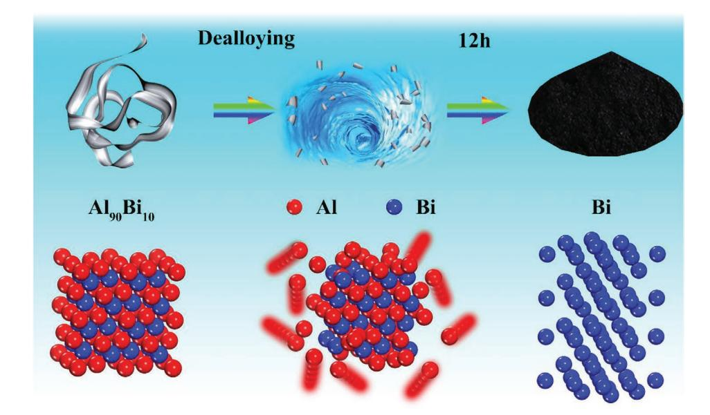
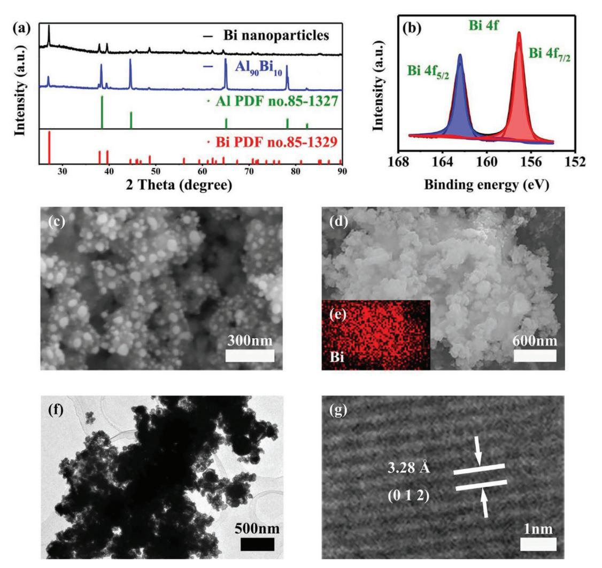
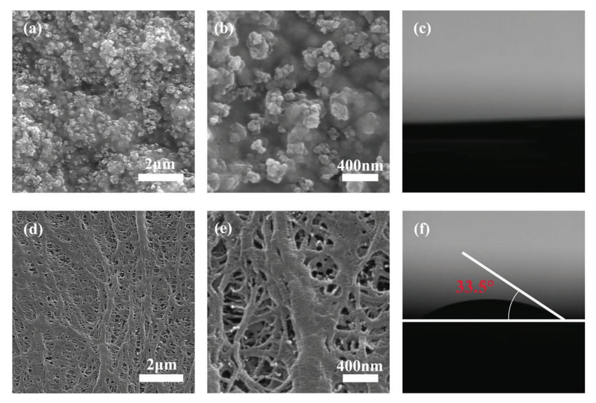
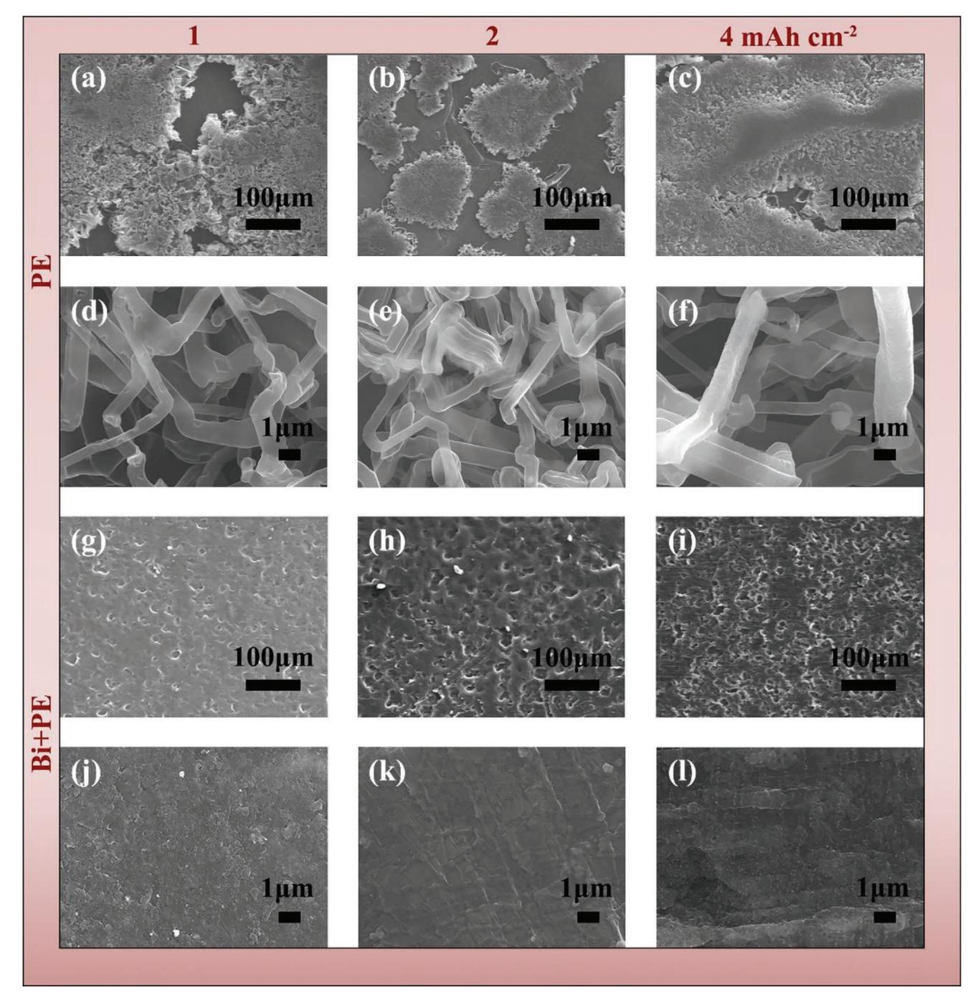
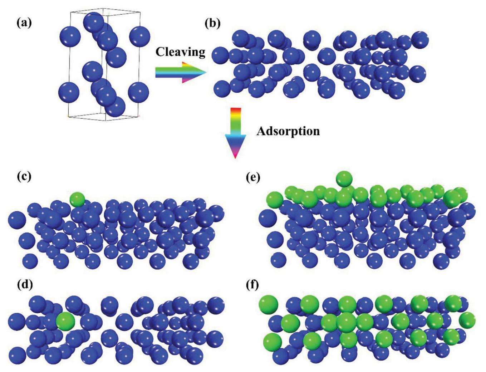
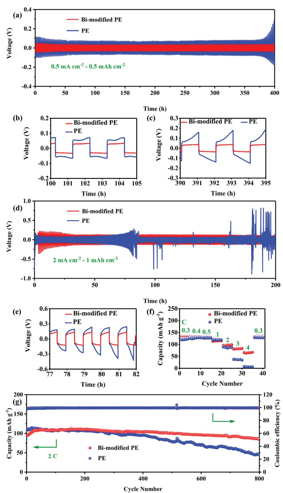
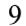
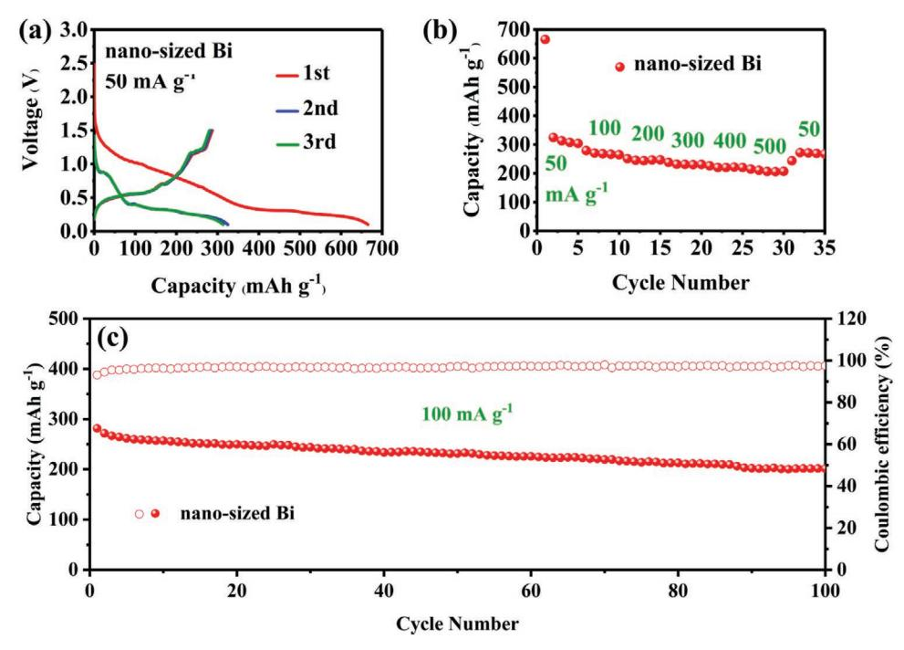

# **Scalable Synthesis of Nano-Sized Bi for Separator Modifying in 5V-Class Lithium Metal Batteries and Potassium Ion Batteries Anodes**

*Huiyu Jiang, Xiaohang Lin, Chuanliang Wei, Jinkui Feng,\* and Xuelei Tian\**

**With the advantages of high theoretical-specific capacity and lowest working potential, lithium metal anode is considered as the most promising anode for next-generation batteries. Here, a scalable dealloying method is developed to prepare nano-sized bismuth (Bi). It is found that the Bi-modification can not only enhance the wettability of the commercial polyethylene separator but also suppresses the lithium dendrite growth. With the nano-sized Bi modified separator, 5V-class lithium metal batteries with commercial carbonate-based electrolyte show a 91% capacity retention ratio after 800 cycles. First-principle calculations prove that lithium atoms tend to deposit smoothly on the Bi surface. Moreover, for potassium ion batteries, nano-sized Bi shows a stable cycling performance and high capacity. The results may be useful for the development of high-energy and high-safety batteries.**

# **1. Introduction**

Nowadays with the rapid development of lithium ion batteries (LIBs), more and more of their products have been widely used in everyday life.[1–4] LIBs have been considered as an essential component of global electrochemical energy storage, which has a lot of advantages, such as higher energy efficiency, matured process techniques, and more environmentally friendly.[5,6] However, in order to pursue the higher energy density of batteries, with the further development in electrochemical energy storage technology, lithium metal batteries (LMBs) have attracted great attention.[7–9] When lithium metal was used as the anode material in place of graphite, the energy density was able to increase 40–50%,[10,11] with the advantages of high theoretical-specific capacity (3860 mAh g−1 ) and lowest working potential.[12–17]

For LMBs, the key restriction for realizing industrialization was the formation of lithium dendrite.[18,19] The lithium dendrite may pierce the separator and cause the events involve fire and explosion.[20,21] To mitigate and ameliorate the problems of lithium dendrite, many solutions are proposed, such as modifying the surface

H. Jiang, X. Lin, C. Wei, J. Feng, X. Tian Key Laboratory for Liquid-Solid Structural Evolution & Processing of Materials (Ministry of Education) School of Materials Science and Engineering Shandong University Jinan 250061, P. R. China E-mail: jinkui@sdu.edu.cn; tianxuelei@sdu.edu.cn

The ORCID identification number(s) for the author(s) of this article can be found under https://doi.org/10.1002/smll.202104264.

#### **DOI: 10.1002/smll.202104264**

of lithium metal anode,[22–24] optimizing electrolyte,[25–28] and decorating the current collector,[29–33] and so on. However, the study on the modifying separator in LMBs is rare.[34,35] As an important component of batteries, the separators are able to remain stable in the air.[35] Therefore, modifying the separator is a relatively cheap and conventional way in favor of mass production.[36] In our previous report,[35] a lithiated SiO microparticles and polyacrylic acid were coated on the polyethylene separators. The batteries with the modified separators not only have the suppression of dendrite, but also have superior electrochemical performance.

The main principle of designing separators is that the modified separator has

the effect of suppression of lithium dendrite without sacrificing the normal function. In the previous report,[37] bismuth (Bi) can alloy with lithium to reduce the deposition overpotential and reduce the dendrite growth. Moreover, Bi as anode material has attracted great attention in aqueous energy storage, LIBs and sodium-ion batteries with low-cost, high volumetric capacity density, and safety.[38,39] To the best of our knowledge, there is no report on Bi for separator modifying.

In this work, a low cost, high efficiency, and scalable dealloying method was developed to synthesize nano-sized Bi by chemical etching the Al90Bi10 alloy. The synthesized nano-sized Bi was used as the modifying material of the polyethylene (PE) separator for the lithium metal batteries and the anode materials for the potassium ion batteries (KIBs). For LMBs, the Bi-modified PE separator had the good wettability of electrolyte and the effect of suppression of lithium dendrite by the experiment and the first-principle calculations. On the contrary, the nano-sized Bi showed a good electrochemical performance for KIBs.

# **2. Results and Discussion**

The synthesis process of nano-sized Bi is displayed in **Figure 1**. The Al90Bi10 alloy was converted ribbon by melt spinning machine. Then the alloy ribbons were dealloyed with sodium hydroxide (NaOH) solution as the etching system. The aluminum (Al) atoms were gradually etched away. During the process of dealloying, bubbles were observed. After 12 h, the Al atoms were completely etched and the nano-sized Bi power was gained.

**Figure 2**a was the XRD results of the Al90Bi10 alloy ribbon (Figure S3, Supporting Information) etched in the NaOH

**Figure 1.** A schematic diagram of the fabrication process of nano-sized Bi.

**Figure 2.** a) XRD patterns of nano-sized Bi and Al90Bi10 alloy. b) XPS survey spectra of nano-sized Bi. c) The SEM image of nano-sized Bi. d,e) The element mapping (Bi). f,g) TEM images of nano-sized Bi.

**Figure 3.** a) The SEM image of Bi-modified PE. b) The enlarged image of Bi-modified PE. c) Contact angle image of the electrolyte on Bi-modified PE. d–f) Corresponding respectively to (a–c) the PE.

solution (20 wt%) for 12 h. From the figure we can see that the alloy ribbon was composed of Al and Bi elements. After etching for 12 h, there were no bubbles appeared in the etching solution. And then the sample was washed several times and dried in a vacuum oven. The XRD result (Figure 2a) proved pure Bi material was obtained. This result suggested that the Al element can almost be completely etched away during the process of dealloying with the EDS mapping (Figure S4, Supporting Information). In Figure 2b, the results of XPS survey spectra verified that the as-obtained Bi was pure. In order to probe the morphology of the as-prepared Bi, SEM was performed (Figure 2c). The as-prepared Bi was nano-sized with a primary diameter of 20–30 nm. In Figure 2d,e, the EDS results confirmed that this nano-sized sample was composited of Bi element. Moreover, TEM (Figure 2f,g) demonstrates a lattice fringe of 0.328 nm, which was corresponding to the typical (0 1 2) plane of Bi.

The modified separator was prepared by coating the nanosized Bi on the commercial PE separator (**Figure 3**d,e) with the polyvinylidene fluoride (PVDF) binder. The morphology of the Bi-modified separator was presented in Figure 3a,b. The images indicated that the nano-sized Bi was uniformly distributed on the surface of the commercial PE separator. The wettability test (Figure 3c,f) shows that Bi modification can significantly lower the contact angle between separator and electrolyte, which may lower the resistance and increase the lithium (Li) ion transport to ensure good electrochemical performance.[40]

The dendrite suppressing test was performed with the Li/ Li cell with blank and modified separator under the same current density (0.2 mA cm−2) and Li deposition amount. The morphology of lithium metal after depositing was presented in **Figure 4**a–f for the blank PE separator and Figure 4g–l for the Bi-modified PE in the same deposition amount of lithium.

From Figure 4a, d for the blank PE separator, we can see that dendrites were formed on the surface of lithium metal anode with an irregular shape, which was sharper with the increasing amount of lithium deposition, as shown in the Figure 4b,c,e,f. In contrast, for the Bi-modified PE separator (displayed in Figure 4g,j), there was no obvious dendrite formed on the lithium metal surface even the amount of lithium deposition was increased to twice and four times, as shown in Figure 4h,i,k,l. The reason can be ascribed to the lithiophilic character of Bi, which can lower the lithium deposition overpotential to ensure uniform lithium deposition.[36]

First-principle calculations were also performed to probe the lithium dendrite suppressing mechanism. For the Bi crystalline (**Figure 5**a), the calculated lattice parameter was *a* = 4.59 Å, *b* = 4.59 Å, and *c* = 12.09 Å. This result of calculation was close to

**www.advancedsciencenews.com**

**Figure 4.** a–c) Top-view SEM images after depositing of Li on the bare lithium foil at 0.2 mA cm−2 (PE). d–f) High-magnification of (a–c). g–l) Corresponding respectively to (a–f) the Bi-modified PE.

the experimental value (*a* = 4.55 Å, *b* = 4.55 Å, and *c* = 11.86 Å).[41] And then this structure of Bi bulk was cleaved to form the surface of Bi (0 1 2) (displayed in Figure 5b) corresponding to the results of our XRD and TEM. When one lithium atom was absorbed on this surface (Figure 5c,d), the absorption energy was –1.98 eV. However, after absorbing a layer of lithium atoms on this surface (Figure 5e,f), one lithium atom was absorbed on this surface and the absorption energy of this atom was –1.09 eV. The result indicated that the lithium atom was more likely to be absorbed on the Bi surface instead of coming together with other lithium atoms. Therefore, the Bi powders on the separator were able to be lithiated and then to form the lithiophilic alloy layer. And the lithium atoms were smoothly deposited on the Bi surface without the formation of lithium dendrite.

The electrochemical performances of the Bi-modified PE separator and blank PE for half and commercial carbonatebased 5V-class LNMO LMBs were displayed in **Figure 6**. It can **www.advancedsciencenews.com**

**Figure 5.** a) The structure of Bi bulk. b) The surface of Bi (0 1 2). c) One lithium atom was absorbed on the surface of Bi (0 1 2). d) The top views of (c). e) After absorbing a layer of lithium atoms, one lithium atom was absorbed on the surface of Bi (0 1 2). f) The top views of (e). The blue ball is Bi atom and the green ball is Li atom.

be clearly seen that the Bi-modified batteries showed better cycling stability (Figure 6a). Moreover, the enlarged curves (Figure 6b,c) show that the voltage hysteresis of the cell with a Bi-modified separator was more stable than the cell with a blank separator. When the current density was increased to 2 mA cm−2 with the capacity of 1 mAh cm−2 , the voltage fluctuation appeared in the blank cells (displayed in Figure 6d), which may be ascribed to the lithium dendrite formation. The voltage hysteresis of the cells with blank PE separator was also larger than the Bi-modified PE separator (Figure 6e). The SEM images and the impedance spectra after cycling were displayed in Figure S5 in Supporting Information after cycling and confirmed that the dendrite formation and the higher resistance due to the formation of dendrite.

For the 5V-class LNMO full cells, the rate capability was displayed in Figure 6f. The discharge capacity of Bi-modified cells was higher than the blank cells even at a higher current density of 2 C, 3 C, and 4 C. These results indicated that the Bi-modified cells had a superior rate capability than the blank cells. Moreover, the cycling performance of Bi-modified and blank full cells was shown in Figure 6g. From the figure we can see that for the Bi-modified cells, more than 90% of the capacity retention ratio is obtained even after 800 cycles, indicating a stable cycling performance. In contrast, the capacity of blank cells was only 45.63 mA h g−1 after long cycling.

The electrochemical performances of nano-sized Bi for KIBs were shown in **Figure 7**. The initial three discharge–charge curves of nano-sized Bi are presented. The shapes are typical for Bi in potassium ion batteries and almost overlapped from the first cycles (Figure 7a), the plateau is due to the reversible formation of K*x*Bi alloy.[39] The low coulombic efficiency was well-known owing to the formation of SEI film. The rate performance of Bi was also probed in the current density of 50, 100, 200, 300, 400, and 500 mAh g−1 . A stable cycling performance was obtained even at the rate of 500 mA g−1 for nano-sized Bi (Figure 7b). The capacity of nano-sized Bi was able to be recovered when the rate turns back. Furthermore, a long cycling test was performed at the rate of 100 mA g−1 (Figure 7c). A 72% capacity retention of nano-sized Bi was obtained even after 100 cycles.

**Figure 6.** The electrochemical performances of Bi-modified PE separator and blank PE for the lithium metal batteries. a) Voltage-time curves of symmetric cells at 0.5 mA cm−2 . b,c) The enlarged images corresponding to (a). d) at 2 mA cm−2. e) The enlarged image for the (d). f) The rate capability of 5V-class LNMO full cells. g) Cycling performance of 5V-class LNMO full cells at 2 C.

**Figure 7.** The electrochemical performances of nano-sized Bi for potassium ion batteries. a) The discharge–charge curves corresponding to nano-sized Bi. b) The rate capability of nano-sized Bi. c) Cycling performance of nano-sized Bi at 100 mA g−1 .

#### **3. Conclusion**

Nano-sized Bi was prepared by scalable dealloying method and used as both separator modification in LMBs and anode in KIBs. The Bi-modified separator shows improved wettability and effect of dendrite suppressing. LMBs with a Bi-modified separator demonstrate superior electrochemical performances in half and 5V-class carbonate-based full cells. Lithium dendrite can be avoided even at the 4 mAh cm−2 with the Bi-modified cells. Firstprinciple calculation proved that on the Bi surface, lithium atom can deposit more smoothly. Moreover, good cycling stability and rate capability can be obtained with the as-prepared nano-sized Bi for KIBs. The results may be useful for the scalable synthesis of nano-sized Bi and the development of LMBs and KIBs.

#### **4. Experimental Section**

*Material Synthesis*: The nano-sized Bi was synthesized by dealloying method. The Al90Bi10 alloy ribbon (selected to realize convenient, large scale, and low cost for the production of nano-size materials) was fabricated by a melt spinning machine. The etching solution was 20 wt% sodium hydroxide and the etching temperature was 60 °C.[42] The alloy ribbon was gradually added to the etching solution with vigorous stirring. Then the reaction was kept in a water bath at 12 h. The sample was obtained by filtering and drying.

*Sample Characterization*: To detect the element valence state of nano-size Bi, XPS (Thermo Fisher ESCALAB Xi+) was employed. SEM (Zeiss SUPRA 55) could be used to observe the morphology and size distribution of the sample. TEM (JEOL JEM-1011) with an accelerating voltage of 200 kV was employed to show the crystallinity of nano-size Bi. XRD (Rigaku Dmax-rc, Japan) was applied to detect the structure of prepared nano-sized Bi with the 25−85° and check whether or not it contains impurities with employing Cu-K*α* radiation (*λ* = 0.154 18 nm).

*Electrochemical Measurements*: All the batteries were assembled in the glovebox in an argon atmosphere. For LMBs, the selected electrolyte was 1M LiPF6, ethylene carbonate/diethylcarbonate (EC/DEC, their volume ratio is 1:1) with 10% FEC. The cathode electrodes were made up of LiNi0.5Mn1.5O4 (LNMO) (about 1.67 mg, 147 mAh g−1 in theory), Super P carbon, and 3 wt % PVDF (8: 1: 1 in weight ratio). After coating the mixture on the Al foil and within 24 h in a vacuum oven at 80 °C, the cathode electrode was gained with a radius of 0.5 cm for each electrode. The modified separators were prepared by coating the Bi and PVDF (2:1 in weight ratio) on the blank PE separators (about 0.6 mg cm−2).

For the potassium ion battery, the electrolyte was the 5 M KFSI in dimethyl ether. The anode electrode was able to be gained by coating the Bi (about 0.2 mg), Super P carbon and carboxymethyl cellulose binder (70:15:15 in weight ratio) on the Cu foil (a radius of 0.5 cm) with a theoretical capacity of 385 mAh g−1 . And then this foil was moved into the vacuum oven at 80 °C overnight. The above foil as the working electrode with the above electrolyte and the K foil as the counter electrode was used to assemble the potassium ion battery in the glovebox (the content of water/oxygen is far smaller than 0.1 ppm).

*Computational Method*: DFT calculations[43,44] were performed by the Vienna Ab initio Simulation Package. In order to account for the exchange-correlation effects, a generalized gradient approximation was performed by employing the functional of Perdew–Burke–Ernzerhof.[45] For all optimizing calculations, the atomic forces were smaller than 0.01 eV/Å. The cut-off energy of 300 eV was selected for the Bi bulk with the 9 × 9 × 9 k-point by tests (Figures S1 and S2, Supporting Information). For the surface of Bi (0 1 2), the six-layers slab was used with the top two relaxed layers.

### **Supporting Information**

Supporting Information is available from the Wiley Online Library or from the author.

**www.advancedsciencenews.com**

#### **Acknowledgements**

This work was supported by the National Natural Science Foundation of China (No. 51972198), Shenzhen Fundamental Research Program (No. JCYJ20190807093405503), the Young Scholars Program of Shandong University (No. 2016WLJH03), the Project of the Taishan Scholar (No. ts201511004), Taishan Scholars Program of Shandong Province (No. tsqn201812002, ts20190908), and the State Key Program of National Natural Science of China (Nos.61633015).

# **Conflict of Interest**

The authors declare no conflict of interest.

# **Data Availability Statement**

Research data are not shared.

# **Keywords**

5V-class, lithium metal batteries, modified separators, nano-sized Bi, potassium ion batteries

Received: July 19, 2021

Revised: October 21, 2021

Published online: November 28, 2021

- [1] J. Betz, G. Bieker, P. Meister, T. Placke, M. Winter, R. Schmuch, *Adv. Energy Mater.* **2018**, *9*, 1803170.
- [2] S. Fang, D. Bresser, S. Passerini, *Adv. Energy Mater.* **2019**, *10*, 1902485.
- [3] G. Harper, R. Sommerville, E. Kendrick, L. Driscoll, P. Slater, R. Stolkin, A. Walton, P. Christensen, O. Heidrich, S. Lambert, A. Abbott, K. Ryder, L. Gaines, P. Anderson, *Nature* **2019**, *575*, 75.
- [4] Y. Wang, N. An, L. Wen, L. Wang, X. Jiang, F. Hou, Y. Yin, J. Liang, *J. Energy Chem.* **2021**, *55*, 391.
- [5] E. Fan, L. Li, Z. Wang, J. Lin, Y. Huang, Y. Yao, R. Chen, F. Wu, *Chem. Rev.* **2020**, *120*, 7020.
- [6] F. Wu, J. Maier, Y. Yu, *Chem. Soc. Rev.* **2020**, *49*, 1569.
- [7] Z. Yu, H. Wang, X. Kong, W. Huang, Y. Tsao, D. G. Mackanic, K. Wang, X. Wang, W. Huang, S. Choudhury, Y. Zheng, C. V. Amanchukwu, S. T. Hung, Y. Ma, E. G. Lomeli, J. Qin, Y. Cui, Z. Bao, *Nat. Energy* **2020**, *5*, 526.
- [8] S. Qi, H. Wang, J. He, J. Liu, C. Cui, M. Wu, F. Li, Y. Feng, J. Ma, *Sci. Bull.* **2021**, *66*, 685.
- [9] D. Campanella, D. Belanger, A. Paolella, *J. Power Sources* **2021**, *482*, 228949.
- [10] T. Li, X.-Q. Zhang, P. Shi, Q. Zhang, *Joule* **2019**, *3*, 2647.
- [11] P. Albertus, S. Babinec, S. Litzelman, A. Newman, *Nat. Energy* **2017**, *3*, 16.
- [12] K. Yan, Z. Lu, H.-W. Lee, F. Xiong, P.-C. Hsu, Y. Li, J. Zhao, S. Chu, Y. Cui, *Nat. Energy* **2016**, *1*, 16010.
- [13] G. Huang, J. Han, F. Zhang, Z. Wang, H. Kashani, K. Watanabe, M. Chen, *Adv. Mater.* **2019**, *31*, 1805334.
- [14] X. Zhang, S. Wang, C. Xue, C. Xin, Y. Lin, Y. Shen, L. Li, C. Nan, *Adv. Mater.* **2019**, *31*, 1806082.

- [15] X. Shen, H. Liu, X.-B. Cheng, C. Yan, J.-Q. Huang, *Energy Storage Mater.* **2018**, *12*, 161.
- [16] S. Kim, H. Oguchi, N. Toyama, T. Sato, S. Takagi, T. Otomo, D. Arunkumar, N. Kuwata, J. Kawamura, S. Orimo, *Nat. Commun.* **2019**, *10*, 1081.
- [17] Q. Yang, W. Li, C. Dong, Y. Ma, Y. Yin, Q. Wu, Z. Xu, W. Ma, C. Fan, K. Sun, *J. Energy Chem.* **2020**, *42*, 83.
- [18] H. Liu, X.-B. Cheng, J.-Q. Huang, H. Yuan, Y. Lu, C. Yan, G.-L. Zhu, R. Xu, C.-Z. Zhao, L.-P. Hou, C. He, S. Kaskel, Q. Zhang, *ACS Energy Lett.* **2020**, *5*, 833.
- [19] L. Ma, J. Cui, S. Yao, X. Liu, Y. Luo, X. Shen, J.-K. Kim, *Energy Storage Mater.* **2020**, *27*, 522.
- [20] X. Zhang, Y. Yang, Z. Zhou, *Chem. Soc. Rev.* **2020**, *49*, 3040.
- [21] G. Yasin, M. Arif, T. Mehtab, X. Lu, D. Yu, N. Muhammad, M. T. Nazir, H. Song, *Energy Storage Mater.* **2020**, *25*, 644.
- [22] H. Jiang, X. Lin, C. Wei, Y. Tian, Y. An, J. Feng, X. Tian, *Chem. Eng. J.* **2021**, *414*, 128928.
- [23] B. Xu, Z. Liu, J. Li, X. Huang, B. Qie, T. Gong, L. Tan, X. Yang, D. Paley, M. Dontigny, K. Zaghib, X. Liao, Q. Cheng, H. Zhai, X. Chen, L.-Q. Chen, C.-W. Nan, Y.-H. Lin, Y. Yang, *Nano Energy* **2020**, *67*, 104242.
- [24] Y. Lin, Z. Wen, C. Yang, P. Zhang, J. Zhao, *Electrochem. Commun.* **2019**, *108*, 106565.
- [25] F. Chu, J. Hu, J. Tian, X. Zhou, Z. Li, C. Li, *ACS Appl. Mater. Interfaces* **2018**, *10*, 12678.
- [26] J. Zheng, M. H. Engelhard, D. Mei, S. Jiao, B. J. Polzin, J.-G. Zhang, W. Xu, *Nat. Energy* **2017**, *2*, 17012.
- [27] X.-B. Cheng, M.-Q. Zhao, C. Chen, A. Pentecost, K. Maleski, T. Mathis, X.-Q. Zhang, Q. Zhang, J. Jiang, Y. Gogotsi, *Nat. Commun.* **2017**, *8*, 336.
- [28] R. Weber, M. Genovese, A. J. Louli, S. Hames, C. Martin, I. G. Hill, J. R. Dahn, *Nat. Energy* **2019**, *4*, 683.
- [29] D. Zhang, A. Dai, M. Wu, K. Shen, T. Xiao, G. Hou, J. Lu, Y. Tang, *ACS Energy Lett.* **2019**, *5*, 180.
- [30] L.-L. Lu, J. Ge, J.-N. Yang, S.-M. Chen, H.-B. Yao, F. Zhou, S.-H. Yu, *Nano Lett.* **2016**, *16*, 4431.
- [31] Y. An, H. Fei, G. Zeng, X. Xu, L. Ci, B. Xi, S. Xiong, J. Feng, Y. Qian, *Nano Energy* **2018**, *47*, 503.
- [32] B. N. Choi, J. Y. Seo, B. Kim, Y. S. Kim, C.-H. Chung, *Appl. Surf. Sci.* **2020**, *506*, 144884.
- [33] L. Shi, Z. Hu, Y. Hong, *RSC Adv.* **2020**, *10*, 20915.
- [34] Y. Ma, L. Wang, S. Fu, R. Luo, W. Qu, X. Hu, R. Chen, F. Wu, L. Li, *J. Mater. Chem. A* **2020**, *8*, 23574.
- [35] L. Tan, Y. Sun, C. Wei, Y. Tao, Y. Tian, Y. An, Y. Zhang, S. Xiong, J. Feng, *Small* **2021**, *17*, 2007717.
- [36] C. Li, S. Liu, C. Shi, G. Liang, Z. Lu, R. Fu, D. Wu, *Nat. Commun.* **2019**, *10*, 1363.
- [37] T. Chen, F. Meng, Z. Zhang, J. Liang, Y. Hu, W. Kong, X. L. Zhang, Z. Jin, *Nano Energy* **2020**, *76*, 105068.
- [38] Y. Yu, H. Zhang, F. Yang, Y. Zeng, X. Liu, X. Lu, *Energy Storage Mater.* **2021**, *41*, 623.
- [39] M. Wu, B. Xu, Y. Zhang, S. Qi, W. Ni, J. Hu, J. Ma, *Chem. Eng. J.* **2020**, *381*, 122558.
- [40] C. Wei, L. Tan, Y. Tao, Y. An, Y. Tian, H. Jiang, J. Feng, Y. Qian, *Energy Storage Mater.* **2021**, *34*, 12.
- [41] P. Cucka, C. S. Barrett, *Acta Cryst* **1962**, *15*, 865.
- [42] S. Liu, J. Feng, X. Bian, J. Liu, H. Xu, *J. Mater. Chem. A* **2016**, *4*, 10098.
- [43] G. Kresse, J. Furthmüller, *Phys. Rev. B* **1996**, *54*, 11169.
- [44] W. Kohn, L. J. Sham, *Phys. Rev.* **1965**, *140*, A1133.
- [45] K. Burke, M. Ernzerhof, J. P. Perdew, *Chem. Phys. Lett.* **1997**, *265*, 115.