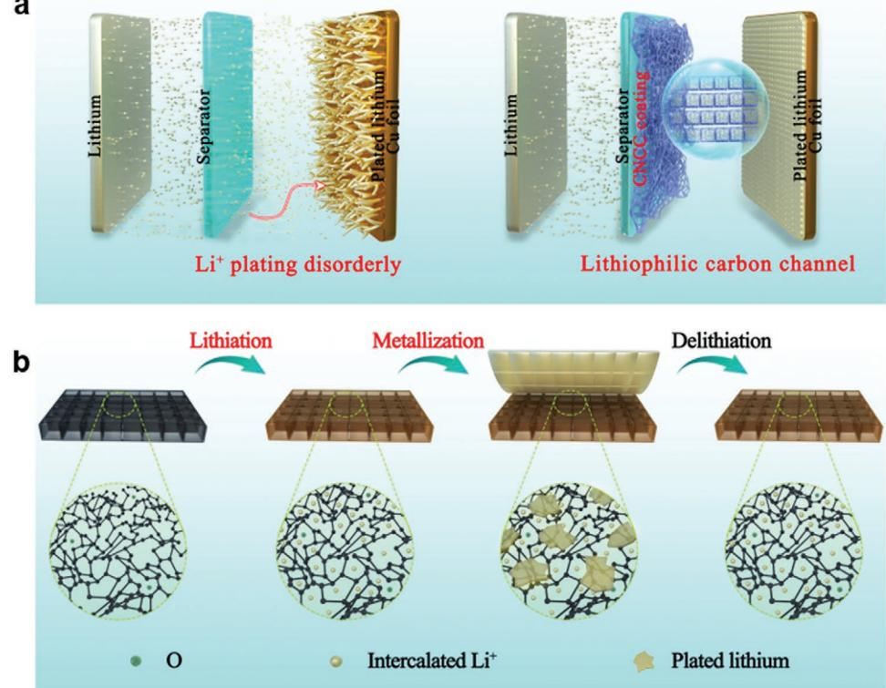
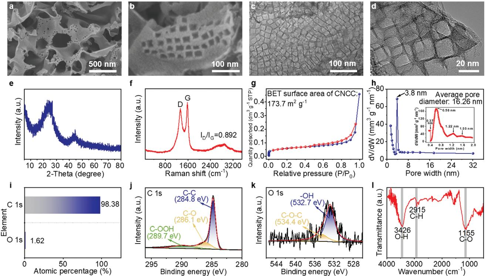
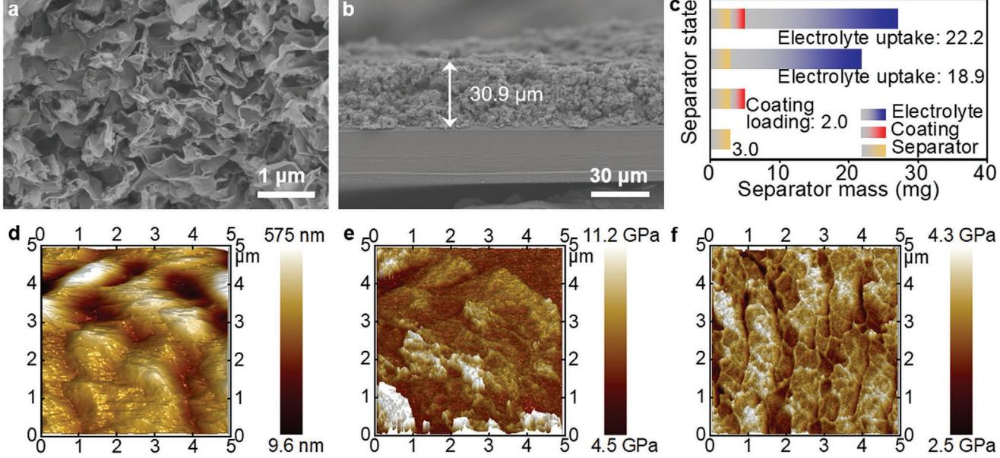
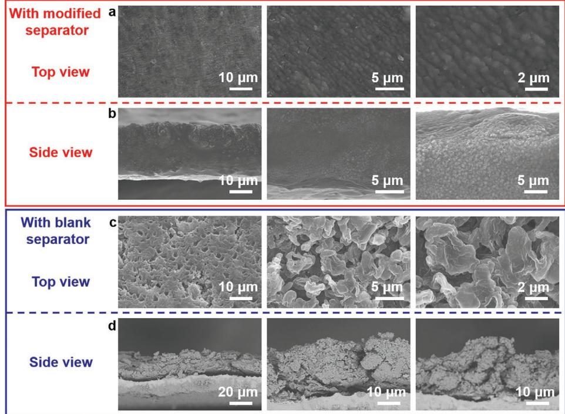
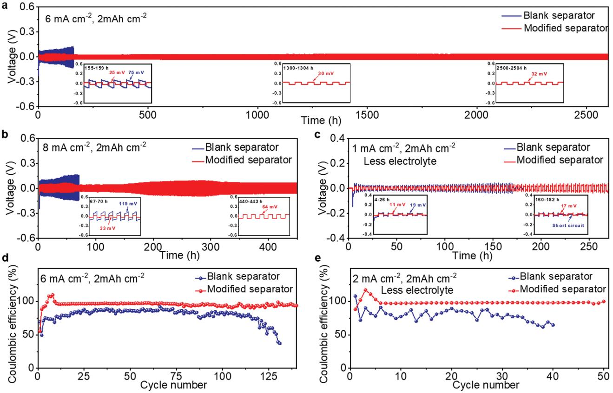

# **A Designed Lithiophilic Carbon Channel on Separator to Regulate Lithium Deposition Behavior**

*Sainan Xu, Teng Zhao,\* Yusheng Ye, Tianyu Yang, Rui Luo, Li Li, Feng Wu, and Renjie Chen\**

**Issues with unstable SEI formation and uncontrollable lithium dendrite growth impede the practical use of lithium anode in high-energy batteries. Herein, a lithiophilic carbon channel on separator is designed to regulate lithium deposition behavior. The designed channel is formed by carbon nanosheet with cubic cavity (CNCC) prepared by hard template method. The CNCC with a large specific surface area and good electrolyte wettability can effectively reduce the local current density. Besides, the CNCC coated separator with high Young's modulus can mechanically inhibit the growth of lithium dendrites. Notably, CNCC coating can become lithiophilic during lithium plating/striping process, which is beneficial for homogeneous lithium deposition and low lithium nucleation overpotential. As a result, based on the CNCC coated separator, the symmetric Li**|**Li cell cycle over 2600h at 6 mA cm−2 for 2 mAh cm−2 , while the Li**|**Cu cell reaches average Coulombic efficiency of 98.5% at 2 mA cm−2 for 2 mAh cm−2.**

# **1. Introduction**

Lithium (Li) metal is an attractive anode for next-generation high-energy density batteries because it has ultrahigh theoretical specific capacity of 3860 mAh g−1 and the most negative redox potential of (-3.04 V vs the standard hydrogen potential electrode).[1,2] However, issues with unstable SEI formation and uncontrollable Li dendrite growth impede the practical application of Li metal batteries. Specifically, Li metal is highly reactive and reacts with electrolyte to form SEI film on its surface. During Li plating/stripping, SEI film can break and give rise to inhomogeneous Li+ flux, leading to growth of Li dendrites.[3] A great deal of efforts have been put forward to address these problems by in situ or artificial interfacial modification of Li

S. Xu, T. Zhao, Y. Ye, T. Yang, R. Luo, L. Li, F. Wu, R. Chen Beijing Key Laboratory of Environmental Science and Engineering School of Material Science & Engineering Beijing Institute of Technology Beijing 100081, China E-mail: tz270@bit.edu.cn; chenrj@bit.edu.cn

T. Zhao, L. Li, F. Wu, R. Chen Institute of Advanced Technology Beijing Institute of Technology Jinan, Shandong 250300, China

L. Li, F. Wu, R. Chen

Collaborative Innovation Center of Electric Vehicles in Beijing Beijing 100081, China

The ORCID identification number(s) for the author(s) of this article can be found under https://doi.org/10.1002/smll.202104390.

#### **DOI: 10.1002/smll.202104390**

metal anode.[4] Tailoring electrolyte composition is an effective approach to in situ form SEI,[5,6] including additives,[7–9] cosolvents,[10] and concentration of Li salt.[11,12] However, it is difficult to obtain the SEI film with ideal composition and morphology considering the compatibility between the additives and original electrolyte components. Artificial SEI film is generated onto Li metal surface before battery assembled and has similar composition of the in situ SEI film.[13,14] Generally, it is obtained through chemical reaction of Li metal by solution method, chemical vapor deposition, and magnetron sputtering. It has been found that the inorganic constituent with higher Young's modulus can inhibit the growth of Li dendrites mechanically, and the inorganic particles break the

long-range order to further improve the ionic conductivity of the optimized SEI film. On the other hand, the organic constituent enhanced the flexibility and mechanical stability of modified SEI film. Nevertheless, few researches have been focusing on SEI film structure to guide Li deposition.

Inspired by the design strategy of porous Li anode hosts,[15–22] we construct a lithiophilic carbon channel on separator to regulate Li deposition behavior, as shown in **Figure 1**a. The designed channel is formed by carbon nanosheet with cubic cavity (CNCC) prepared by hard template method. CNCC benefits from the following features: 1) linked cubic cavity can homogenize Li+ distribution; 2) high specific surface area and good wettability can effectively reduce the local current density, enabling compact Li deposition; 3) high Young's modulus mechanically inhibit the growth of Li dendrites; 4) lithiation of CNCC can lower the activation energy for Li adsorption and guide uniform Li deposition (Figure 1b). As a result, CNCC acts like an artificial SEI film, which completely eliminates Li nucleation overpotential and decreases the interface impedance. The cell with CNCC coated separator exhibited extra-stable cycle life and high Coulombic efficiency (CE) under higher rate or less electrolyte.

#### **2. Results and Discussion**

The preparation process of CNCC was described detailed in experimental section.[23] **Figure 2**a,b shows the SEM images of CNCC, from which it can be seen that CNCC has a 2D nanosheet structure with cubic cavities. TEM image in Figure 2c,d further displayed the uniform and linked cubic cavity with the edge length of around 20 nm. The linked

**Figure 1.** a) Schematics of Li+ plating process in the battery with a blank separator or CNCC coated separator. b) Schematics of lithiation of CNCC during Li plating/stripping process.

**Figure 2.** Characterization of CNCC. a,b) SEM image. c,d) TEM image. e) XRD patterns. f) Raman spectra. g) Nitrogen adsorption–desorption isotherm. h) Pore size distribution. i) Elemental contents. j,k) Deconvoluted XPS spectra of C 1s and O 1s. l) FTIR spectra.

**Figure 3.** a,b) Top-view and cross-section SEM image of CNCC modified separator. c) Coating loading and electrolyte uptake ability of blank separator and CNCC modified separator. d) AFM topography image of CNCC modified separator. e,f) The distribution of Young's modulus of CNCC modified separator and blank separator.

nanoscale pores can act as channel to guide electrolyte penetration, resulting in a homogeneous distribution of Li+. The structure of CNCC was also investigated by XRD and Raman. XRD patterns with two broad peaks around 26° and 44° (Figure 2e) confirms the typical amorphous feature of CNCC. Raman spectrum (Figure 2f) shows characteristic peaks at 1336 cm−1 (D band) and 1582 cm−1 (G band). The intensity ratio of *I*D/*I*G is around 0.892, indicating that CNCC has good electrical conductivity and moderate defects. The graphite structure of CNCC could alter the electric field while moderate defects could enhance the affinity to Li+ and decrease the activation energy for Li adsorption.[24,25] Figure 2g shows the nitrogen adsorptiondesorption isotherm of CNCC, which exhibits type-IV uptake at *P*/*P*0 >0.4 and type-H4 hysteresis loops with *P*/*P*0 ranging from 0.45 to 0.95. Accordingly, CNCC had a specific surface area of 173.7 m2 g−1 contributed by micropores and mesopores. Density functional theory (DFT) calculations indicate an average pore diameter of 16 nm (Figure 2h). The small pores have enhanced adsorption ability to electrolyte. More importantly, the large specific surface area provides interactive sites to electrolyte in the carbon channel. XPS analysis (Figure S1, Supporting Information) determined the presence of carbon and oxygen in CNCC, corresponding to the observed peaks at 284 and 532 eV. The doping content of oxygen was appropriate 1.62% as shown in Figure 2i. The high-resolution XPS of C 1s and O 1s are shown in Figure 2j,k. The main peaks centered at 284.8, 286.1, 289.7, 532.7, and 534.4 eV were ascribed to the state of carbon in CC, CO, COOH and oxygen in OH, COC, respectively. Moreover, FT-IR analysis (Figure 2l) reveals the CH stretching vibration in alkyl group (2915 cm−1 ), CO stretching vibration (1155 cm−1 ) and intermolecular OH stretching vibration (3426 cm−1 ). The doping of oxygen in CNCC can not only increase disorders of the intrinsic carbon, but also improve the lithiophilic feature of CNCC due to its large electronegativity.

The prepared CNCC was simply coated onto the blank separator by doctor blade (Figure S2, Supporting Information). From the SEM image of the modified separator shown in **Figure 3**a, it can be clearly observed that the voids on the blank separator (Figure S3, Supporting Information) were effectively covered and the flaky structure of CNCC was still intact. The thickness of the coating layer was around 30.9 µm measured from cross-section SEM image in Figure 3b, and the mass loading was about 2.0 mg, making up 40% in the total modified separator (Figure 3c). The modified coating definitely added extra weight to the whole cell, nevertheless, it certainly improved the performance of Li metal battery. Under normal conditions, the mass of the blank separator accounts for no more than 6% of the total weight of the pouch cell, so the coating accounts for 3.85% of the pouch cell using modified separator at most after conversion. If the electrochemical performance is increased by more than 0.04%, the modified coating is beneficial to the energy density of Li metal battery. Then both the blank separator and modified separator were steeped into the electrolyte adequately for a while. From the results in Figure 3c, the blank separator adsorbed more than six times its own weight of electrolyte, whereas the CNCC coating adsorbed only 1.65 times, which is favor for increasing energy density of batteries. To explore the chemical stability of CNCC coated separator, it was soaked in electrolyte for 7 d. As shown in Figure S4 (Supporting Information), the electrolyte remained clear and transparent without any suspended solids exfoliated from the separator. Atomic force microscope (AFM) topography image of CNCC modified separator (Figure 3d) displayed uniform morphology with few bulges. Besides, Young's modulus of CNCC modified separator was ranged from 4.5 to 11.2 GPa (Figure 3e). In contrast, the largest Young's modulus of the blank separator was only 4.3 GPa (Figure 3f). The high Young's modulus of CNCC enabled mechanical inhibition for dendrite growth.[26]

**www.advancedsciencenews.com**

**Figure 4.** a) The change of contact angles of electrolyte on blank separator and CNCC modified separator. b,c) EIS of symmetric Li|Li cells with blank separator and CNCC modified separator before cycling and corresponding fitted curves of Li+ diffusion coefficient. d) The computational simulation of Li+ concentration distribution throughout cross-section of blank separator (left) and CNCC modified separator (right). e,f) Cyclic voltammogram for Li|Li cells with blank separator and CNCC modified separator scanned at 0.1mVs−1 for the first cycle and their corresponding Tafel plots. g) In situ XRD patterns of the cell with CNCC modified separator. h) Voltage profile of Li|Cu cell in the first cycle at 2 mA cm−2 for 2 mAh cm−2 with CNCC modified separator.

The effect of CNCC coating on the electrolyte wettability was investigated by adding the same amount of electrolyte uprightly onto the blank separator and CNCC modified separator (Figure S5, Supporting Information), and a contact angle test was also carried out (**Figure 4**a). The blank separator showed a large contact angle of 43.1°. In contrast, the contact angle on the modified separator was only 6.7°. After 3 s, a trace amount of electrolyte was passively dispersed on the blank separator with the contact angle of 37.3°, while there was no obvious electrolyte suspension on CNCC modified separator. Even after 15 s, the contact angle on the blank separator did not change significantly. Therefore, CNCC coating enabled better electrolyte wettability. EIS test of symmetric Li|Li cells with and without CNCC coated separator was conducted. Nyquist curve shown in Figure 4b was composed of a semicircle at high frequency and an oblique line at low frequency. Gained from artificial circuit and simulation results of every part shown in Figure 4b and Table S1 (Supporting Information), the cells with CNCC coated separator showed lower *R*S of 1.58 Ω and *R*ct of 4.38 Ω than those of the cells with blank separator. Based on the fitted lines of EIS data in Figure 4c, Li+ diffusion coefficient could be exported using Equation (1):

$$
D = \frac{R^2 T^2}{2A^2 n^4 F^4 C^2 \sigma^2}
$$
 (1)

where *R* and *F* were the gas constant and Faraday constant, *T* and *C* were the temperature in experimental environment and Li+ concentration in electrolyte environment, *A* was the surface area of the working electrode depending on the electrode diameter, *n* was assigned the value of 1 because Li+ carried one positive charge, and *σ* was the slope of the fitted line Z'∼*ω*−1/2. [27,28] CNCC coating on separator improved the Li+ diffusion coefficient from 1.47 × 10−9 to 2.98 × 10−9 cm2 s−1 , supporting the rapid Li+ migration. Based on Equation (2) of Sand's time:

$$
\tau = \frac{\pi e D C_0 \left( \mu_a + \mu_{Li^+} \right)^2}{2 J \mu_a}
$$
 (2)

The large diffusion coefficient (*D*) can prolong Sand's time (*τ*), resulting in extending cycle life of Li metal anode.[29] Moreover, the distribution of Li+ concentration throughout cross-section of the blank separator and CNCC modified separator were simulated through the FEM method. Figure S6 (Supporting Information) showed 2D plane simulation diagram of blank separator and modified separator, and the connected blocks were used to emulate linked cubic carbon channel. As exhibited in Figure 4d, the computational simulation of Li+ concentration distribution throughout cross-section of the CNCC coating was more uniform than that of the

**www.small-journal.com**

blank separator. By taking advantage of high ion conductivity and carbon channel structure of CNCC coating, Li+ migration rate was increased and the migration direction was normalized, resulting in uniform and fast concentration distribution throughout the modified layer.

**www.advancedsciencenews.com**

The cyclic voltammogram (Figure 4e) further compared current density of Li|Li cells with and without CNCC coated separator. The cell with CNCC modified separator showed a steeper slope.[30] From the fitted Tafel plots (log(|current|)–overpotential curves) (Figure 4f), the cell with a modified separator had a higher exchange current density (3.26 mA cm−2 ) than the blank separator (1.60 mA cm−2 ), further confirming a high Li+ migration rate based on CNCC coating.

The voltage profiles of Li|Cu cells with CNCC modified separator are shown in Figure 4h. During the discharge process, Li+ was preferentially inserted into the carbon layers of CNCC before the voltage of the cell dropped off to 0 V, which was the lithiation reaction process. After CNCC thoroughly lithiated, metallization reaction on the copper foil came into being with the voltage of the cell maintaining in a horizontal steady state below 0 V, and the nucleation overpotential at the beginning of this process was completely eliminated by the imitative SEI of lithiated CNCC coating.[31–34] By contrast, the voltage of Li|Cu cell with blank separator directly went into metallization reaction with nucleation overpotential of 66 mV. The uneven deposition of Li metal in the battery based on the blank separator gave rise to the increased interfacial area between Li anode and electrolyte, and thus reduced interfacial resistance. So the voltage hysteresis of the curve based on the blank separator exhibited smaller. As observed in Figure S7 (Supporting Information), lithiation reaction brought some capacity loss during the first few cycles, leading to CE of 47.24%in the first cycle. The lithiation reaction only took place in the first few weeks, and the consumed Li source of this part could be reserved in the practical application. Then the cell with CNCC modified separator stabilized average CE of 98.5% from the 30th to the 100th cycle, and its voltage curves of the 50th and the 100th cycle were almost overlap (Figure S8, Supporting Information). Comparatively, the cell with blank separator showed a gradual decline of CE and stripping capacity.

In situ XRD of the cell with CNCC modified separator was conducted to investigate the phase of Li+ intercalated carbon and deposited Li metal in real time during the whole discharge/ charge process (Figure 4g). First, the main peak at around 25° showed up in the lithiation reaction stage, corresponding to lithium carbide (LiC*x*). Then, the intensity of the peak decreased because the subsequent deposition of Li metal had a covering effect, and did not get stronger again at the end of the charge process due to some irreversible factors.

To reveal the effect of CNCC coating on deposition behavior of Li metal, Li|Cu cells were disassembled under fully discharged state after 100 cycle at 2 mA cm−2 for 2 mAh cm−2 . As shown in **Figure 5**a, the deposited Li metal in the cell with CNCC modified separator had flat surface with microscopic granular morphology. From magnified SEM images of Figure 5b,c, the symmetrical pomegranate-shape deposition morphology was clearly observed and the diameter of one pomegranate seed was around 0.6 µm, which was caused by the inevitable agglomeration between Li metal deposited from adjacent cubic carbon channels. The cross-section SEM images of plated Li metal exhibited the same morphology as the surface and it contacted tightly with copper current collector

**Figure 5.** SEM images of plated Li metal on copper foil in Li|Cu cells after 100 cycles at 2 mA cm−2 for 2 mAh cm−2 . a,b) With CNCC modified separator. c,d) With blank separator.

**www.advancedsciencenews.com**

**Figure 6.** Galvanostatic cycling of cells with blank separator and CNCC modified separator. a) Symmetric Li|Li cells at 6 mA cm−2 for 2 mAh cm−2. b) Symmetric Li|Li cells at 8 mA cm−2 for 2 mAh cm−2 . c) Symmetric Li|Li cells at 1 mA cm−2 for 2 mAh cm−2 with halved electrolyte. d) Li|Cu cells at 6 mA cm−2 for 2 mAh cm−2. e) Li|Cu cells at 2 mA cm−2 for 2 mAh cm−2 with halved electrolyte.

(Figure 5b). By contrast, the deposited Li metal in the cell with blank separator was loose and porous (Figure 5c). And the magnified SEM images distinctly displayed Li dendrites. As observed in the cross-section SEM images (Figure 5d), there was clear separation between plated Li metal and copper foil. Therefore, homogeneous deposition of Li metal was achieved by CNCC coating on the separator.

Electrochemical tests for symmetric Li|Li cells with CNCC coated separator were performed at different current densities and amount of electrolyte. At a current density of 6 mA cm−2 for 2 mAh cm−2 (**Figure 6**a), the symmetric Li|Li cell with CNCC modified separator exhibited voltage profile with stable overpotential of 32 mV over 2500 h. In contrast, the symmetric Li|Li cell with blank separator showed much higher overpotential at the start-up stage, which gradually increased to 75 mV only after 155 h. The modified separator can effectively reduce nucleation overpotential, rendering an extraordinarily flat voltage profile as shown in inset in Figure 6a. Even at the current density of 8 mA cm−2 , the symmetric Li|Li cell with CNCC modified separator still had a flat voltage profile with overpotential of 64 mV after 440 h (Figure 6b). By comparison, the overpotential of the cell with blank separator added up to 119 mV merely after 67 h and the nucleation overpotential was visibly larger than that under 6 mA cm−2 . The rate performance of the symmetric Li|Li cell was tested at 2, 4, 6, 8, 6, 4, and 2 mA cm−2 for 2 mAh cm−2 , as shown in Figure S11 (Supporting Information). The cell with the blank separator showed larger overpotential at various current densities. Worse still, the overvoltage could not decrease along with the tapering current density, indicating the irreversible polarization caused by uneven deposition of Li metal. In contrast, symmetric Li|Li cell with modified separator exhibited lower overpotential of 14, 27, 38, 48, 43, 36, and 16 mV at 2, 4, 6, 8, 6, 4, and 2 mA cm−2 , respectively. CNCC coating homogenized Li+ distribution and favored Li plating/stripping behavior. When the amount of the added electrolyte was reduced from 60 µL to 30 µL, the symmetric Li|Li cell with CNCC coated separator exhibited stable cycle life (Figure 6c). At the current density of 1 mA cm−2 for 2 mAh cm−2 , the cell with CNCC modified separator was able to cycle steadily for more than 260 h with the overpotential of only 17 mV afterward, whereas the cell with blank separator showed larger overpotential of 19 mV at the initialization phase and failed in short circuit after just 160 h. Electrolyte loading is a pivotal condition on cycling stability of Li metal battery, on the other hand, the prevention of electrolyte consumption is significant to prolong the cycling life of Li metal battery.[35]

Coulombic efficiency tests for Li|Cu cells under different current densities and amount of electrolyte were also conducted. In initial cycles, the stripping of Li metal and the deintercalation of Li+ were incomplete, so the CE might reach

over 100% in the subsequent cycles. At the current density of 6 mA cm−2 for 2 mAh cm−2, the cell with CNCC modified separator showed CE over 96% for 75 cycles (Figure 6d) and had small change in the charge capacity (Figure S9, Supporting Information). The cell with blank separator exhibited CE no more than 87% in most instances and presented marked decline just after 100 cycles (Figure 6d), arising from the irreversible formation of "dead" Li. Worse still, the charge capacity in the first cycle was greatly reduced at 6 mA cm−2 compared with that of the cell at 2 mA cm−2. The Coulombic efficiency under less electrolyte condition was the key basis to judge whether CNCC coating consumed extra electrolyte. Prospectively, after the similar overcharge process, the CE of the cell with CNCC modified separator was stable above 97% for 50 cycles (Figure 6e). And the nucleation overpotential completely disappeared as shown in Figure S10 (Supporting Information). By contrast, the CE of the cell with blank separator was dreadful and the nucleation overpotential increased to 84 mV under scarce electrolyte. The irregular deposition of Li metal caused more side reactions between Li anode and electrolyte, consuming scanty electrolyte and ultimately leading to cell failure. Li–S battery with the blank separator exhibited initial discharge specific capacity of 607.1 mAh g−1 at the rate of 0.5 C (Figure S12, Supporting Information). In contrast, the battery with CNCC modified separator showed 1147.4 mAh g−1 in the first cycle, which was beneficial from the restriction to polysulfides and improvement of Li+ transmission kinetics by modified coating. Under higher rate, the kinetics of electrochemical reaction was controlled by sulfur cathode, so the advantage of separator modification was not obvious. However, homogeneous Li deposition realized in the battery with CNCC modified separator was prerequisite in long cycle with limited Li source.

#### **3. Conclusion**

In summary, carbon nanosheet with cubic cavity was coated on separator for stable Li metal battery. CNCC coating acted like artificial SEI and provided linked cubic carbon channel to regulate Li deposition behavior. Additionally, CNCC had good wettability and high Young's modulus, which could increase the affinity to the electrolyte, and mechanically inhibit Li dendrites. More importantly, the lithiation reaction during the plating process and the doping of oxygen improved lithiophilic feature of CNCC, decreasing activation energy for Li adsorption and completely eliminating nucleation overpotential for Li deposition. As a result, based on the CNCC coated separator, the symmetric Li|Li cell cycled over 2600h at 6 mA cm−2 for 2 mAh cm−2 , while the Li|Cu cell reached average Coulombic efficiency of 98.5% at 2 mA cm−2 for 2 mAh cm−2 . Noticeable performance even at higher rate or with less electrolyte was obtained. These results herald a new approach to stable Li metal batteries through designed carbon channel on separator.

#### **Supporting Information**

Supporting Information is available from the Wiley Online Library or from the author.

# **Acknowledgements**

This work was supported by the National Natural Science Foundation of China (51772030, 51972030), Beijing Institute of Technology Research Fund Program for Young Scholars and Beijing Outstanding Young Scientists Program (BJJWZYJH01201910007023).

# **Conflict of Interest**

The authors declare no conflict of interest.

#### **Data Availability Statement**

The data that support the findings of this study are available from the corresponding author upon reasonable request.

#### **Keywords**

carbon channel, dendrite free, linked cubic-cavity structure, lithium anode, separator coating

> Received: July 25, 2021 Revised: September 13, 2021 Published online: November 6, 2021

- [1] J. Liu, Z. Bao, Y. Cui, E. J. Dufek, J. B. Goodenough, P. Khalifah, Q. Li, B. Y. Liaw, P. Liu, A. Manthiram, Y. S. Meng, V. R. Subramanian, M. F. Toney, V. V. Viswanathan, M. S. Whittingham, J. Xiao, W. Xu, J. Yang, X. Yang, J. Zhang, *Nat. Energy* **2019**, *4*, 180.
- [2] D. Lin, Y. Liu, Y. Cui, *Nat. Nanotechnol.* **2017**, *12*, 194.
- [3] N. Fierer, *Science* **2019**, *366*, 425.
- [4] Z. Yu, Y. Cui, Z. Bao, *Cell Rep. Phys. Sci.* **2020**, *1*, 100119.
- [5] J. Zheng, M. S. Kim, Z. Tu, S. Choudhury, T. Tang, L. A. Archer, *Chem. Soc. Rev.* **2020**, *49*, 2701.
- [6] S. Jurng, Z. L. Brown, J. Kim, B. L. Lucht, *Energy Environ. Sci.* **2018**, *11*, 2600.
- [7] G. Zheng, Y. Xiang, S. Chen, S. Ganapathy, T. W. Verhallen, M. Liu, G. Zhong, J. Zhu, X. Han, W. Wang, W. Zhao, M. Wagemaker, Y. Yang, *Energy Storage Mater.* **2020**, *29*, 377.
- [8] X. Zhang, X. Cheng, X. Chen, C. Yan, Q. Zhang, *Adv. Funct. Mater.* **2017**, *27*, 1605989.
- [9] J. Zheng, M. H. Engelhard, D. Mei, S. Jiao, B. J. Polzin, J. Zhang, W. Xu, *Nat. Energy* **2017**, *2*, 17012.
- [10] L. Yu, S. Chen, H. Lee, L. Zhang, M. H. Engelhard, Q. Li, S. Jiao, J. Liu, W. Xu, J. Zhang, *ACS Energy Lett.* **2018**, *3*, 2059.
- [11] R. Younesi, G. M. Veith, P. Johansson, K. Edström, T. Vegge, *Energy Environ. Sci.* **2015**, *8*, 1905.
- [12] Z. Zeng, V. Murugesan, K. S. Han, X. Jiang, Y. Cao, L. Xiao, X. Ai, H. Yang, J. Zhang, M. L. Sushko, J. Liu, *Nat. Energy* **2018**, *3*, 674.
- [13] P. Zhai, Y. Wei, J. Xiao, W. Liu, J. Zuo, X. Gu, W. Yang, S. Cui, B. Li, S. Yang, Y. Gong, *Adv. Energy Mater.* **2020**, *10*, 1903339.
- [14] N. Li, Y. Yin, C. Yang, Y. Guo, *Adv. Mater.* **2016**, *28*, 1853.
- [15] Z. Wang, D. Cheng, H. He, K. Zhou, *ACS Sustainable Chem. Eng.* **2019**, *8*, 102.
- [16] X. Chen, X. R. Chen, T. Z. Hou, B. Q. Li, X. B. Cheng, R. Zhang, Q. Zhang, *Sci. Adv.* **2019**, *5*, eaau7728.
- [17] G. Huang, P. Guo, J. Wang, S. Chen, J. Liang, R. Tao, S. Tang, X. Zhang, S. Cheng, Y. Cao, S. Dai, *Chem. Eng. J.* **2020**, *384*, 123313.
- [18] B. Yu, T. Tao, S. Mateti, S. Lu, Y. Chen, *Adv. Funct. Mater.* **2018**, *28*, 1803023.

**www.advancedsciencenews.com**

- [19] Z. Cao, Q. Zhu, S. Wang, D. Zhang, H. Chen, Z. Du, B. Li, S. Yang, *Adv. Funct. Mater.* **2019**, *30*, 1908075.
- [20] Q. Zhang, J. Luan, D. Sun, Y. Tang, H. Wang, *Chem. Commun.* **2019**, *55*, 6551.
- [21] H. Liu, X. Chen, X. B. Cheng, B. Q. Li, R. Zhang, B. Wang, X. Chen, Q. Zhang, *Small Methods* **2019**, *3*, 1800354.
- [22] W. Ye, L. Wang, Y. Yin, X. Fan, Y. Cheng, H. Gao, H. Zhang, Q. Zhang, G. Luo, M. Wang, *ACS Energy Lett.* **2021**, *6*, 2145.
- [23] S. Yu, D. J. Lee, M. Park, S. G. Kwon, H. S. Lee, A. Jin, K. Lee, J. E. Lee, M. H. Oh, K. Kang, Y. Sung, T. Hyeon, *J. Am. Chem. Soc.* **2015**, *137*, 11954.
- [24] C. Chen, J. Guan, N. W. Li, Y. Lu, D. Luan, C. H. Zhang, G. Cheng, L. Yu, X. W. D. Lou, *Adv. Mater.* **2021**, *33*, 2100608.
- [25] Y. Liu, X. Wu, C. Niu, W. Xu, X. Cao, J. Zhang, X. Jiang, J. Xiao, J. Yang, M. S. Whittingham, J. Liu, *ACS Energy Lett.* **2021**, *6*, 1550.
- [26] C. Yan, X. B. Cheng, Y. Tian, X. Chen, X. Q. Zhang, W. J. Li, J. Q. Huang, Q. Zhang, *Adv. Mater.* **2018**, *30*, 1707629.
- [27] X. Wang, H. Hao, J. Liu, T. Huang, A. Yu, *Electrochim. Acta* **2011**, *56*, 4065.
- [28] T. Yang, L. Li, F. Wu, R. Chen, *Adv. Funct. Mater.* **2020**, *30*, 2002013.
- [29] R. Zhang, X. Cheng, C. Zhao, H. Peng, J. Shi, J. Huang, J. Wang, F. Wei, Q. Zhang, *Adv. Mater.* **2016**, *28*, 2155.
- [30] Z. Tu, S. Choudhury, M. J. Zachman, S. Wei, K. Zhang, L. F. Kourkoutis, L. A. Archer, *Nat. Energy* **2018**, *3*, 310.
- [31] J. Kim, J. Lee, J. Yun, S. H. Choi, S. A. Han, J. Moon, J. H. Kim, J. W. Lee, M. S. Park, *Adv. Funct. Mater.* **2020**, *30*, 1910538.
- [32] T. Le, C. Yang, Q. Liang, X. Huang, F. Kang, Y. Yang, *Small* **2021**, *17*, 2007231.
- [33] W. Y. Diao, D. Xie, Y. F. Li, R. Jiang, F. Y. Tao, H. Z. Sun, X. L. Wu, X. Y. Zhang, J. P. Zhang, *Chem. - Eur. J.* **2021**, *27*, 8168.
- [34] T. Chen, S. Jianjian, J. Xing, Y. Liu, Z. Wang, J. Xiao, H. Liu, Y. Chen, X. Sun, J. Li, *ACS Appl. Energy Mater.* **2021**, *4*, 4879.
- [35] H. Li, D. Chao, B. Chen, X. Chen, C. Chuah, Y. Tang, Y. Jiao, M. Jaroniec, S. Z. Qiao, *J. Am. Chem. Soc.* **2020**, *142*, 2012.