#### **REVIEW ARTICLE**

## **Mechanism understanding for stripping electrochemistry of Li metal anode**

**Feng-Ni Jiang1,2 Shi-Jie Yang3 He Liu3 Xin-Bing Cheng2 Lei Liu1 Rong Xiang4 Qiang Zhang2 Stefan Kaskel5 Jia-Qi Huang3**

1 College of Chemistry and Chemical Engineering, Taiyuan University of Technology, Taiyuan, Shanxi, P. R. China

2 Beijing Key Laboratory of Green Chemical Reaction Engineering and Technology, Department of Chemical Engineering, Tsinghua University, Beijing, P. R. China

3 Advanced Research Institute of Multidisciplinary Science, Beijing Institute of Technology, Beijing, P. R. China

4 Department of Mechanical Engineering, University of Tokyo, Tokyo, Japan

5 Department Chemical Surface and Reaction Technology, Technische Universität Dresden, Dresden, Germany

#### **Correspondence**

Xin-Bing Cheng, Beijing Key Laboratory of Green Chemical Reaction Engineering and Technology, Department of Chemical Engineering, Tsinghua University, Beijing 100084, P. R. China.

Email: [cxb12@mails.tsinghua.edu.cn](mailto:cxb12@mails.tsinghua.edu.cn) Lei Liu, College of Chemistry and Chemical Engineering, Taiyuan University of Technology, Taiyuan 030024, Shanxi, P. R. China.

#### Email: [liulei@tyut.edu.cn](mailto:liulei@tyut.edu.cn)

Jia-Qi Huang, Advanced Research Institute of Multidisciplinary Science, Beijing Institute of Technology, Beijing 100081, P. R. China.

Email: [jqhuang@bit.edu.cn](mailto:jqhuang@bit.edu.cn)

#### **Funding information**

Beijing Natural Science Foundation, Grant/Award Number: JQ20004; National Natural Science Foundation of China, Grant/Award Numbers: 22179070, U1801257, U1910202; Tsinghua-Toyota Joint Research Fund, Grant/Award Number: 20213930025

#### **Abstract**

The pursuit of sustainable energy has a great request for advanced energy storage devices. Lithium metal batteries are regarded as a potential electrochemical storage system because of the extremely high capacity and the most negative electrochemical potential of lithium metal anode. Dead lithium formed in the stripping process significantly contributes to the low efficiency and short lifespan of rechargeable lithium metal batteries. This review displays a critical review on the current research status about the stripping electrochemistry of lithium metal anode. The significance of stripping process to a robust lithium metal anode is emphasized. The stripping models in different electrochemical scenarios are discussed. Specific attention is paid to the understanding for the electrochemical principles of atom diffusion, electrochemical reaction, ion diffusion in solid electrolyte interphase (SEI), and electron transfer with the purpose to strengthen the insights into the behavior of lithium electrode stripping. The factors affecting stripping processes and corresponding solutions are summarized and categorized as follows: surface physics, SEI, operational and external factors. This review affords fresh insights to explore the lithium anode and design robust lithium metal batteries based on the comprehensive understanding of the stripping electrochemistry.

#### **KEYWORDS**

dead lithium, dendrite, lithium metal batteries, solid electrolyte interphase, stripping models

This is an open access article under the terms of the [Creative Commons Attribution](http://creativecommons.org/licenses/by/4.0/) License, which permits use, distribution and reproduction in any medium, provided the original work is properly cited.

© 2021 The Authors. *SusMat* published by Sichuan University and John Wiley & Sons Australia, Ltd.

## **1 INTRODUCTION**

Energy storage systems are regarded as an important medium for the pursuit of cheaper, cleaner, and more sustainable energies, including wind, tidal, and solar power, instead of fossil fuels. Since 1990s, rechargeable lithium (Li) ion batteries (LIBs) have been widely used in the energy storage systems[.1–4](#page-21-0) However, LIBs with graphite anodes are unable to meet the demand of applications in longer-range electric vehicles and high-end portable electronics, though their theoretical energy densities have almost been reached[.5–7](#page-21-0) Beyond LIBs, advanced electrode materials are critically required. Li metal anodes with the ultrahigh theoretical capacity (3860 mAh/g vs. 372 mAh/g for graphite anode) and the most negative electrochemical potential (−3.040 V vs. standard hydrogen electrode) are strongly considered as potential anodes of next-generation batteries[.8–15](#page-21-0) Nevertheless, Li metal anodes have not come into practical applications even though they were proposed 20 years earlier than the graphite anode of commercial LIBs[.16–19](#page-22-0)

There are following several significant hurdles impeding the practical applications of Li metal anodes in rechargeable Li metal batteries (LMBs[\)20–28:](#page-22-0) (1) The uncontrolled Li dendrites have the tendency to pierce the separator and contact the cathode, leading to the short-circuit and even catastrophic issues. (2) The high reactivity of metallic Li results in irreversible and continuous reactions between Li metal and electrolyte, forming solid electrolyte interphase (SEI) and negatively impacting the Columbic efficiency of batteries. (3) Unlike these intercalated anodes, that is, graphite and silicon anodes[,29–32](#page-22-0) the virtually infinite volumetric change of Li metal anode leads to deadly destruction to the electrode structure during repeated plating and stripping processes. (4) Li dendrites out of connection to current collector and wrapped by the insulating SEI are electrochemically inactive and named as "dead Li" during repeated Li plating/stripping processes, resulting in a dominant capacity loss of LMBs. Even worse, the above four issues are strongly coupled together rather than mutually independent, which incurs more serious challenges regarding the use of the Li anode[.33](#page-22-0) As a result, the practical application of Li metal anode in rechargeable batteries remains elusive yet.

Numerous methods have been proposed to address these problems including electrolyte additives,[34–45](#page-22-0) artificial SEI,[46–56](#page-23-0) superconcentrated electrolyte,[57–70](#page-23-0) solid-state electrolyte (SSE)[,71–80](#page-23-0) functional membrane,[81–89](#page-24-0) and structured host,[90–98](#page-24-0) etc. Several important reviews have been released in the scope of the mechanism of dendrite growth and strategies to suppress dendrite growth[.99–104](#page-24-0) Based on these ideas, significant advances have been achieved for Li metal anode in Coulombic efficiency

JIANG et al. **507**

and lifespan. For example, the available Coulombic efficiency has been improved to 99 ± 0.5%[.105](#page-24-0) However, these two indicators are still not high enough for practical applications (99.9% and 500 cycles). To further boost the electrochemical cycling performance of Li metal anode, innovative research paradigm is of vital importance.

In the past 40 years, researchers devote themselves to regulate the plating process and obtain a dendrite-free Li metal anode, while the researches and understandings on stripping process are less conducted. According to the statistics from 1983 to 2021, the number of literature focused on plating or deposition process is 58 442 which is about nine times larger than that of stripping or dissolution process (Figure [1A\)](#page-2-0). In addition, the slow increase in publication number on stripping process makes a striking contrast to that of plating process as well (Figure [1B\)](#page-2-0). Many reviews about LMBs are related to three-dimensional (3D) porous matrix, artificial SEI, and functional polymer electrolyte, etc[.100–103](#page-24-0) while the reviews concerning about the stripping process are much scarce. Therefore, greater effort is needed on the investigations of stripping process. In addition, this review presents a comprehensive overview of the stripping process from a fundamental perspective including basic electrochemical principles, visual stripping models, etc. It plays a great promotion role in the field of stripping electrochemistry and is beneficial to improve the Coulombic efficiency and lifespan of batteries from the innovative research perspective. During discharging or stripping of Li metal anodes, electrically insulating Li metal, usually identified as dead Li, can form due to the heterogeneous dissolution of Li metal anode[.106–108](#page-24-0) The forming mechanism of dead Li is varied with the cell systems including electrode and electrolyte features, and cycling parameters. Even dendrite-free Li metal anode can lead to dead Li in the stripping process, which will be clearly discussed in the following sections.[109](#page-24-0) The formation of dead Li during plating/stripping process has hindered the practical applications of Li metal in rechargeable batteries based on the following reason[s110–115:](#page-24-0) (1) Since dead Li is electrochemically inactive during further reaction, it directly leads to the rapid capacity degradation and lowers the Coulombic efficiency of batteries. (2) The dead Li accumulation at Li anodes introduces a tortuous diffusion pathway and an exponential increase of resistance for Li ions and electrons inevitably[.116](#page-25-0) Therefore, a large polarization occurs, which leads to an unsatisfactory energy efficiency. (3) Dead Li formed in the stripping processes will definitely have a significant influence on the plating process and further decrease the electrochemical performance. Based on these considerations, more efforts are required to comprehensively understand the electrochemical principles in stripping process and realize a full life-cycle regulation for Li metal anode. Fortunately,

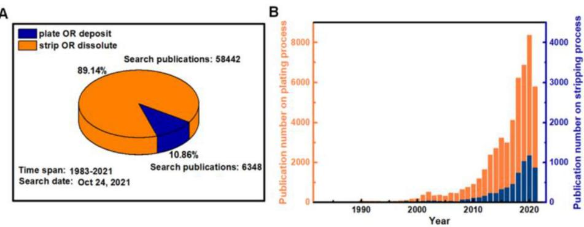

**FIGURE 1** Profiles of researches on Li metal anode. (A) Literature distribution in the plating versus stripping processes. (B) The evolution of literature number in plating versus stripping process in the last 39 years. The stripping process and plating process were surveyed by the topic of "Lithium deposit OR Lithium plate & Lithium battery" and "Lithium strip OR Lithium dissolute & Lithium battery," respectively in Web of Science. All databases were last updated in September 2021

the researches on stripping process are increased gradually (Figure 1B), which can provide more insightful suggestions for the regulation of the stripping process.

Galvanic corrosion as an electrochemical reaction is another challenge for the long lifespan of LMBs. The corrosion rate is proportional to the distance from the junction point of the galvanic couple; therefore, galvanic corrosion is an important origin for the generation of dead Li[.117,118](#page-25-0) Exposing different metals with an electric contact to electrolyte at the same time is the necessary condition for galvanic corrosion[.119–121](#page-25-0) For Li metal battery, galvanic corrosion can occur at Li| Cu interface as long as the Cu current collector together with Li anode are exposed in electrolyte at the same time. Then, the oxidation occurs at Li electrode due to its lowest negative potential while the reduction of electrolyte happens on Cu electrode. As a result, the contact between these two metal losses and a great number of dead Li is generated. In fact, galvanic corrosion is a local effect of electrode. It happens in the certain scenarios involving a galvanic couple and electrolyte. Therefore, it can be excluded as long as the contact between electrolyte and current collector disappears. In contrast, it is common to produce dead Li during stripping process and it is difficult to inhibit the generation of dead Li during the dissolution process. Therefore, the electrochemical stripping of Li electrode with the electron participation from external circuit is the emphasis in this contribution.

In this review, we present an overview of the current research status about the stripping electrochemistry of Li metal anode (Figure [2\)](#page-3-0). The necessity of researches on the stripping process in Li-metal anode is first illustrated (Section 2). Then, three models for dendrite stripping process are categorized, that is, the tip-, base-, and tip-/basestripping models which clarify the influence of the transfer and reaction behaviors of Li ions and electrons on the generation of dead Li (Section [3\)](#page-4-0). Specific attention is paid to the understanding for the electrochemical principles of atom diffusion, electrochemical reaction, ion diffusion in SEI, and electron transfer with the purpose to strengthen the insights into the behavior of Li electrode stripping (Section [4\)](#page-6-0). The factors affecting stripping processes and corresponding solutions are summarized and discussed subsequently to enhance the understanding of the stripping behaviors (Section [5\)](#page-10-0). Finally, in Section [6,](#page-19-0) our perspectives on the further development of LMBs are presented.

## **2 IMPORTANCE OF STRIPPING PROCESS**

As the plating/stripping process is preceded alternatively during the charging/discharging cycles, stripping process exhibits an inevitable influence on the subsequent plating process and cycling performance of batteries inevitably, that is, the dendrite nucleation location and the critical current for plating[.122–125](#page-25-0) Liu et al[.109](#page-24-0) found that the Li dendrites and dead Li were generated on the initially flatted areas of Li electrodes (Figure [3A\)](#page-3-0). However, the nucleation locations of dendrite were changed after the Li electrodes stripping process when many pits were formed during this stage (Figure [3B and C\)](#page-3-0). This was because the pits not only had a higher local current density than the surface of the unreacted Li anodes but also were activated during the previous dissolution process. Therefore, these pits were more electrochemically active and facilitated nucleation cites for the dendrites.

Dendritic growth during the plating process is regarded as the most serious obstacle for the practical applications of LMBs[.126–130](#page-25-0) Therefore, a comprehensive understanding of the mechanism of Li dendrite nucleation and growth is necessary. Researchers have put great efforts into these problems and remarkable progress has been

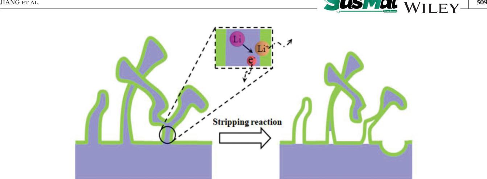

**FIGURE 2** Schematic diagram of Li dendrite stripping. Li atoms are taken out off the Li dendrite where it has been enlarged within the black circle. Li dendrites stripping including the three classical processes, that is, Li atoms self-diffusion, Li ion diffusion in SEI, and electron transfer

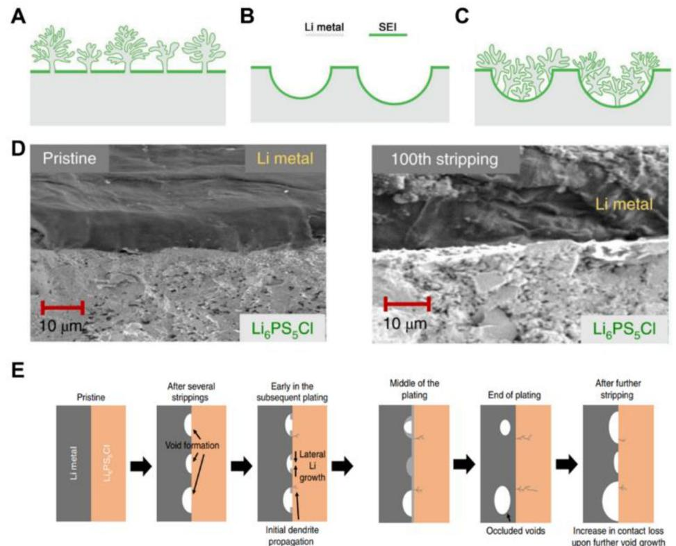

**FIGURE 3** Schematic diagrams of the surface morphology of (A) Li plated on the pristine Li electrode, (B) stripped Li electrode, and (C) Li plated on electrode after stripping. Reprinted from Liu et al.[,109](#page-24-0) with permission. Copyright 2019, Wiley-VCH. (D) Cross-sectional SEM images of the pristine Li /Li6PS5Cl and after 100th stripped at 1.0 mA/cm2 and 7 MPa. (E) Schematic diagrams of Li/Li6PS5Cl interface cycled at an overall current density above the critical current for stripping. Reprinted from Kasemchainan et al.,[141](#page-25-0) with permission. Copyright 2019, Nature Publishing Group

achieved until now. Several meaningful and fundamental models to explain Li depositing behavior are presented in the last 40 years, that is, heterogeneous nucleation model,[131,132](#page-25-0) SEI-induced nucleating mode,[133,134](#page-25-0) and "Sand's time" model[,135–137](#page-25-0) etc. According to "Sand's time" model[,48](#page-23-0) an applied current density leading to the ionic concentration gradient at the negative electrode is critical for the formation of dendrites. During Li deposition at high charge rate, the concentration of Li cation in the vicinity of electrode is expected to drop rapidly and reaches to zero at a time *τ*s (Equation 1). As a result, a strong negative electronic field is produced, leading to the nucleation and unavoidable growth of Li dendrites. Contrarily, low current density results in a minimal and stable ionic concentration gradient close to the negative electrode; therefore, Li dendrites are not expected to form under this condition. The boundary between the two regimes described above is the limiting current density, *J*\* (Equation 2), at which an electrochemical system is theoretically able to sustain indefinitely.

$$
\tau_s = \pi D \left( \frac{C_0 e z_c}{J} \right)^2 \left( \frac{\mu_a + \mu_c}{\mu_a} \right)^2, \tag{1}
$$

$$
J^* = \frac{2eC_oD(\mu_a + \mu_c)}{\mu_a L},\tag{2}
$$

where *D* is the ambipolar diffusion coefficient, *Co* is the initial Li salt concentration, *zc* is the cationic charge number, *J* is current density, *μa* and *μc* are anionic and cationic mobilities, respectively, and *L* is the distance between two electrodes.

However, some observations clearly indicate that dendrites form even at a current density below *J*\*[.138–140](#page-25-0) Kasemchainan et al[.141](#page-25-0) found that the dendrites can form though the overall current density (1 mA/cm2) of the Li/Li6PS5Cl/Li cell was below the limiting current density of 2 mA/cm2 obtained from the experimental observations. This was because sizable voids could be formed at the interface between the anode and solid electrolyte when Li was removed faster than it was replenished during the heterogeneous stripping process of Li electrode (Figure [3D\)](#page-3-0). In addition, these voids were only partially filled on subsequent deposition, and they grew with cycling, reducing the contact area, and increasing the local current density at the interface. As a result, dendrites formed below the limiting current density (Figure [3E\)](#page-3-0).

Besides the intrinsical link between the plating process and stripping process, dead Li is the dominant driving force to investigate the stripping process. For some instances, dead Li debris was reported to generate during the deposition process for the corrosion of electrolyte to Li electrode[.142](#page-25-0) However, much more dead Li is formed during the dissolution process. The formation of dead Li is frequently observed during the dissolution while the effect of stripping on the plating is affected by various factors, that is, the order of dissolution and deposition and the existence state of electrolyte.

During the electrochemical dissolution process of Li metal, the inhomogeneous stripping of Li dendrites induces "dead Li," which leads to the capacity loss and shortens the cycling life of LMBs. It is generally believed that low Coulombic efficiency results from the irreversibility of deposited Li, including Li+ compounds consumed in the SEI formation and metallic Li0 isolated from current collector though it is still chemically active[.143–145](#page-25-0) However, it is difficult to quantitatively distinguish the contribution of these two factors for the low Coulombic efficiency of LMBs separately.

Optical microscopy,[146–148](#page-25-0) transmission electron microscopy,[149–151](#page-25-0) atomic force microscope[,152](#page-26-0) scanning electron microscope[,153–155](#page-26-0) and transmission X‑ray Microscopy[156](#page-26-0) have been widely used in characterizing the morphological features of dead Li within a mixture of Li-containing compounds qualitatively. Furthermore, X-ray photoelectron spectroscopy[,157,158](#page-26-0) cryogenic transmission electron microscopy[,159,160](#page-26-0) scanning electron microscope[161](#page-26-0) (with a controlled X-ray beam irradiation intensity), and operando electron paramagnetic resonances pectroscop[y162](#page-26-0) were reported to distinguish between Li species in the SEI and dead Li. Recently, titration gas chromatography (TGC) was introduced by Fang et al[.144](#page-25-0) to quantitatively analyze the contribution of dead Li to the all inactive Li generated during the charge and discharge cycles. The quantitative measurement of dead Li was dependent on its different chemical reactivity with SEI Li+ compounds. Metallic Li0 could react with H2O and generate hydrogen gas which was detected by gas chromatography to quantify the content of metallic Li0 (Equation 3). The electrochemical inert metallic Li0 strongly influenced by the types of electrolytes was found as the dominant source of inactive Li during the first cycle with a Coulombic efficiency below 95%, whereas Li+ compounds contained in the SEI remained at a relatively low level all the time (Figure [4\)](#page-5-0).

$$
2Li + 2H_2O \rightarrow 2LiOH + H_2 \uparrow.
$$
 (3)

Based on the above discussions, the stripping behavior of Li anode is of vital significance for a robust LMB, while it is relatively unexplored. Therefore, more efforts are required in this direction and enhance mechanism understanding on the stripping electrochemistry.

## **3 STRIPPING MODEL**

Li metal in rechargeable batteries is plated and stripped from the substrate repeatedly. Several models of Li dendrite formation and growth have been proposed with the aim to understand the deposition process and mitigate or further eliminate the growth of dendrites. In contrast, the models describing the stripping processes are still not established yet.

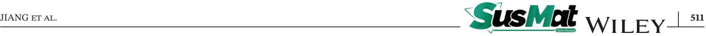

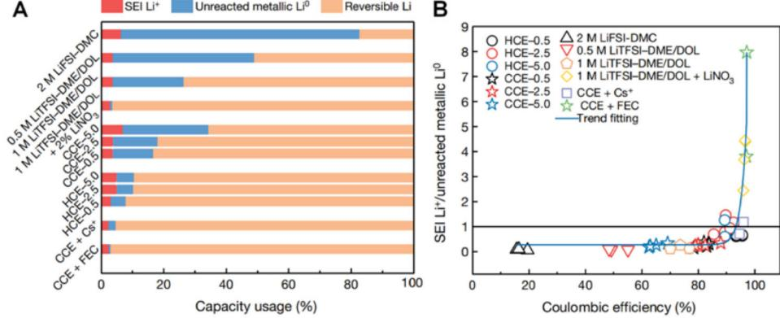

**FIGURE 4** Quantification results of dead Li and SEI Li+ compounds through titration gas chromatography (TGC) method. (A) Capacity assignment of reversible and irreversible (dead Li and SEI Li+) Li testing through the TGC method. (B) The ratio between SEI Li+ and unreacted metallic Li0 under various electrolytes. Reprinted from Fang et al.,[144](#page-25-0) with permission. Copyright 2019, Nature Publishing Group

Li metal is a conversion-pattern anode and Li atoms, Li ions, and electrons participate in the electrochemical reaction (Equation 4). During stripping, Li metal is electrochemically oxidized to Li ions, which will get away from the anodes and then migrate through the SEI to bulk electrolyte. Therefore, the rate of Li atom self-diffusion inside anode, electrochemical reaction rate at the Li electrode-electrolyte interface, and ionic diffusion rates through the SEI are three important factors that should be taken into consideration when regulating the stripping process (Figure 5)[.163](#page-26-0)

$$
Li - e^- \leftrightarrow Li^+.
$$
 (4)

The stripping electrochemistry is discussed based on three dissolution sites including the tip, base, and the combined tip/base.

- 1. For tip-stripping model (Figure [6A\)](#page-6-0), stripping processes occur from the top to bottom of dendrites. Li dendrite can keep a tight contact with the substrate during the stripping process and dissolve mostly. As a consequence, dead Li will not form in this condition, which is the most desirable situation for dendrites stripping.
- 2. Base-stripping model is a general phenomenon because the dendrite roots always exhibit a higher current density compared with that of the tip, easily leading to more Li dissolution from the base and the formation of dead Li (Figure [6B\)](#page-6-0). To avoid this detrimental result, Li stripping rate from the roots must be slower than that of Li replenished from other sites of dendrites. Therefore, electrochemical oxidation reaction and Li ion diffusion rates around the roots should slow down, while the self-diffusion rate of Li atoms must speed up. However, at the same temperature, the self-diffusion rate is several orders of magnitude lower than the electrochemi-

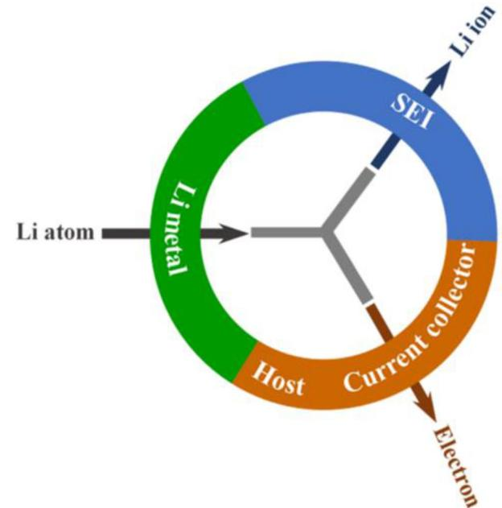

**FIGURE 5** Schematic of electrochemical stripping. During the stripping process, four fundamental processes occur: self-diffusion of Li atom inside Li deposits, the oxidation reaction at the interface between electrolyte and electrode, Li ion diffusion through the SEI, and electron transfer

cal oxidation reaction (Figure [6B1\)](#page-6-0). Increasing the number of vacancies in Li anode and the Li atomic vibration energy can potentially increase the self-diffusion rate of Li atoms and decrease the generation of dead Li (Figure [6B2\)](#page-6-0).

3. The tip-/base-stripping model indicates that the tip and base of dendrite are both considered as the active cites for dendrite dissolution (Figure [6C\)](#page-6-0). A faster stripping rate at the tip than that at the base is preferred to reduce the amount of dead Li by designing the heterostructure

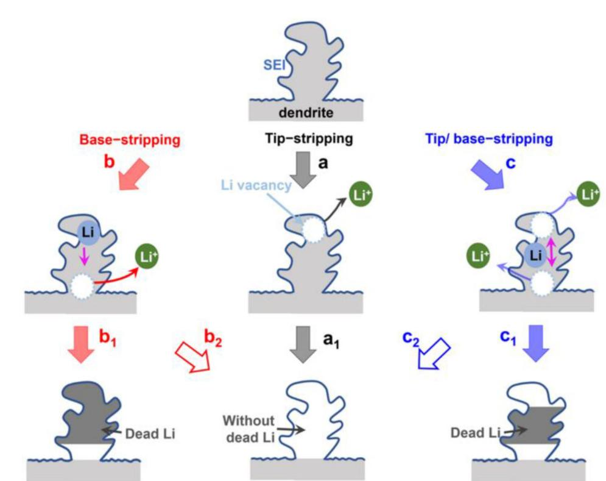

**FIGURE 6** Schematic diagram of three Li dendrite stripping models: tip-stripping model (A), base-stripping model (B), and tip-/base-stripping model (C). The dead Li will not form in tip-stripping model (A1). For base-stripping model, Li dissolves from the base forming dead Li (B1). This situation can be avoided if the Li stripping rate from the roots can be controlled slower than that of Li replenished from other sites of dendrites (B2). When the tip and base of dendrite are both the active sites for stripping, dead Li can be formed (C1). By controlling a faster stripping rate at the tip than that at the base, the opposite situation occurs (C2)

in SEI and electron transfer, etc. The gradient in electronic conductivity and the design in components and thickness of SEI at different zones are more likely to regulate the stripping behaviors at tip and base.

To sum up, the accelerated stripping at the tip is preferred, while the factors affecting this behavior and strategies to achieve this goal is rather lacking. In the next sections, we will describe the electrochemical principles of atom diffusion, electrochemical reaction, ion diffusion in SEI, and electron transfer to afford the physical/chemical foundation for the stripping.

#### **4 ELECTROCHEMICAL PRINCIPLES**

#### **4.1 Atom diffusion**

According to the above discussions, it is necessary to accelerate the Li atoms diffusion in Li electrodes with the aim to avoid the heterogeneous dissolution of Li dendrite. Alternatively, Hao et al[.164](#page-26-0) demonstrated that the small Li surface self-diffusion barrier was beneficial to the homogeneous Li deposition, resulting in the dense Li film rather than needle-like Li or fractal Li. Jäckle et al[.165](#page-26-0) considered that the high surface self-diffusion barrier of Li was one of the reasons to explain the higher probability toward the generation of dendrite compared to Mg. Therefore, it is critically important to comprehensively understand Li atom diffusion mechanisms in solids including the vacancy mechanism, interstitial mechanism, and exchange mechanism[.166](#page-26-0) Furthermore, to facilitate the atom diffusion, it is essential to know the relationship between the atom diffusion and various effects such as temperature, crystal structure, and defects. In this section, basic atom diffusion mechanisms, the correlation between the atom diffusion and various affecting factors are discussed.

#### 4.1.1 Diffusion mechanism

It is widely accepted that vacancies are inevitable atomic defects in metal crystals above absolute zero. Vacancy diffusion avoids the generation of large lattice distortions of metal and requires less energy. Therefore, it is regarded

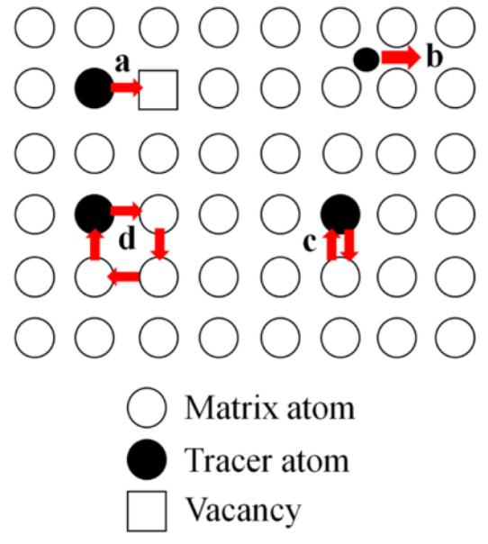

**FIGURE 7** Diffusion mechanisms of atoms in Li metals or alloys: (A) vacancy diffusion mechanism; (B) interstitial diffusion mechanism; (C) direct exchange mechanism, and (D) cyclic exchange mechanism

as the dominant and common mechanism for the diffusion of matrix atoms in metals. An atom is easy to jump into its neighboring vacancies and change its original position into a fresh vacancy. Each atom undergoes a series of exchanges with vacancies from time to time and this continuous exchange is donated as the vacancy diffusion (Figure 7A).

Li-rich composite alloys have attracted great attention as a novel electrode because they can present a matrix to promote the uniform plating/stripping behaviors of Li.[167–170](#page-26-0) The diffusion of Li atoms in alloys involves another diffusion mechanism. Li atoms are much smaller than the matrix atoms and distributed in the lattice gaps of the matrix. As a result, an interstitial solid solution with Li and matrix atom can be formed. An interstitial mechanism works for the diffusion of the Li atoms in the interstitial solid solution. As shown in Figure 7B, the interstitial Li can diffuse from one interstitial site to another nearby by the interstitial mechanism.

Exchange mechanism includes two patterns: direct exchange mechanism and cyclic exchange mechanism. If two neighboring atoms move simultaneously and exchange their positions directly, they are considered to diffuse by the direct exchange mechanism (Figure 7C). In fact, this process results in the severe lattice distortion and is energetically unfavorable. Consequently, direct exchange mechanism is difficult to realize in practice. As shown in Figure 7D, cyclic exchange mechanism corresponds to a simultaneous rotation of *n* atoms (*n* > 2) by one atom distance. Compared with the direct exchange mechanism, the activation energy of cyclic exchange mechanism is lower but it requires several atoms in the crystal to move

regularly at the same time, therefore, this exchange mechanism is difficult to implement as well. The self-diffusivity of Li atom in electrode can be deduced by various methods including the radioisotope tracer method, nuclear magnetic resonance, and calculational method based on a thermodynamical model[.171–174](#page-26-0) The self-diffusion coefficient of metal Li at room temperature was reported to be 5.6×10–11 cm2/s, which is about two orders of magnitude lower than the diffusion coefficient of Li+ in SEI (1 × 10–9 cm2/s)[.175](#page-26-0) Therefore, to regulate the atom diffusion rate, we will analyze the effects of various

factors on the atom self-diffusion in the following part.

## 4.1.2 Affecting factors

The factors affecting atom diffusion include temperature, defects, and crystal structure. Diffusion in solids generally depends largely on temperature. The relationship between diffusion coefficient and temperature is found to obey the Arrhenius formula (Equation 5). Therefore, it can be concluded that the diffusion coefficient increases with the rise of the temperature. It was reported that the self-diffusion coefficient of Li at 350 and 195 K were 2.13 × 10–9 and 1.35 × 10–15 cm2/s, respectively[.176](#page-26-0) In addition, internal factors, including the defects and crystal structure, have an impact on the frequency factor *D*0 and activation enthalpy *Q*, therefore, influencing the atom diffusion obviously. Grain boundaries, dislocations, and free surfaces of metal are beneficial for the atom diffusion and they have been defined as the high-diffusivity paths or diffusion short circuits as well. Many metallic elements reveal different crystal structures due to the allotropic transformations at different temperature ranges. The dense crystal structure results in the great diffusion activation energy. Therefore, the atom diffusion of metal with densely packed structures is slower than the less dense packing metal.

$$
D = D_0 \exp\left(-\frac{Q}{kT}\right),\tag{5}
$$

where *D0* is the frequency factor, *Q* is the activation enthalpy of diffusion, *T* is the absolute temperature, and *k* is the Boltzmann constant.

#### **4.2 Electrochemical reaction**

The electrochemical reaction of Li metal anode during the stripping process is shown in Equation [4.](#page-5-0) As discussed above, electrochemical reaction rate (C-rate) regulates the

formation of dead Li. Consequently, the understanding of interfacial reaction mechanism of Li electrode is beneficial to restrain or eliminate the formation of dead Li. As we all know, the current density is proportional to the corresponding electrochemical reaction rate, therefore, the redox reaction rate of Li electrode can be described by Butler-Volmer equation (Equation 6)[.177](#page-26-0)

$$
j = j_0 \left[ \exp\left(\frac{\beta F \eta}{RT}\right) - \exp\left(-\frac{\alpha F \eta}{RT}\right) \right],\tag{6}
$$

where *j* is the current density, *j0* is the exchange current density, *α* and *β* are charge transfer coefficients for the anodic and cathodic reactions respectively, and *α* + *β* = 1, *F* is the Faraday's constant, *η* is the overpotential, *R* is the ideal gas constant, and *T* is the temperature.

According to the Butler-Volmer equation, it can be concluded that the redox reaction rate of Li electrode is related to the exchange current density and the overpotential. When the electrode is at equilibrium, the net current density which is composed of the anodic current density and cathodic current density equals to zero. And the exchange current density is that current in the absence of net electrolysis. The exchange current density shows a characteristic value for the electron transfer process and the mass transfer process at the interface of electrode. It can be adjusted through the electrode materials and the concentration of reactants. Tao et al[.178](#page-26-0) reported that the formation of Li dendrite was controlled by the value of *j0* which was a critical charge transfer parameter for the electrolytes. They confirmed a strong relationship between solvent and exchange current density while the Li salts species have slight effect on the kinetic parameter (*j0*).

The overpotential is the potential difference between the equilibrium potential () and the actual potential () at which the oxidation and reduction reactions occur (Equation 7). Akolkar et al[.179](#page-26-0) considered that the net overpotential at the flat Li electrode surface was different from that at the dendrite tip. The total overpotential of the Li plate electrode was the sum of the activation overpotential and the concentration overpotential. However, the net overpotential at the tip of the dendrite included not only the activation overpotential and the concentration overpotential but also the overpotential caused by the surface energy of the curved dendrite tip. The equilibrium potential of battery is described by Nernst equation (Equation 8). Therefore, it is obvious that the overpotential of an electrode critically depends on various factors, that is, the temperature, Li ion concentration at the electrode interface, and the surface area of electrode. For example, the galvanostatic voltage response provides critical evidences for the evolution of Li dendrite structures (needle and mossy) during the cycling process.[21,156](#page-22-0) The influence of overpotential on the Li dendrite growth has been widely investigated while the opposite is true for the stripping process of Li dendrite.[180–182](#page-26-0) Pei et al[.131,180](#page-25-0) found that the nuclei size of Li decreased with the increasing of the overpotential while the number density of Li nuclei was proportional to the overpotential during the deposition process. Therefore, much more effort should be devoted to explore the relationship between the overpotential and the dissolution process.

$$
\eta = \varphi - \varphi_e,\tag{7}
$$

$$
\varphi_e = \varphi^\theta - \frac{RT}{zF} \ln \frac{\alpha_O}{\alpha_R},\tag{8}
$$

where is the standard oxidation electrode potential, *R* is the ideal gas constant, *T* is the temperature, *z* is the number of charges involved in the oxidation reaction, *F* is the Faraday's constant, and are the activity of the product and the reactant of oxidation reaction, respectively.

#### **4.3 Ion diffusion in SEI**

#### 4.3.1 SEI features

After immerged into the electrolyte, Li metal with high reactivity will react spontaneously with the electrolyte (including solvents, salts, and additives) and a new film named SEI forms, which was firstly proposed by Peled in 1979.[183–186](#page-26-0) Both Li metal and electrolyte are consumed during this process. However, SEI stops growing when it is thick enough to block electron transferring into the interface between SEI and electrolyte and prevents Li metal electrodes from further corrosion.

The following features are required for an ideal SEI of LMBs with high safety and long cycle life: electrical insulation, adequate thickness and density, high Li ionic conductivity, structural and composition uniformity, and extraordinary mechanical strength to bear the volume change during repeated Li plating and stripping[.106,187,188](#page-24-0) Unfortunately, a practical SEI cannot have the whole characteristics. Therefore, the inhomogeneous coverage of SEI results in the uneven deposition and dissolution of Li electrode[.50,189,190](#page-23-0) It is realized that an SEI is the key to the stripping process of Li electrode, because it serves as the conductor of Li+ which is the oxidation product of Li metal during the stripping process. The concentration of Li ion at the interface depends both on the oxidation rate of Li and the Li ionic diffusion rate. Therefore, the fundamental of SEI must be fully understood. In this section, we will give a basic overview of SEI from the following aspects: structure, component, and diffusion mechanism.

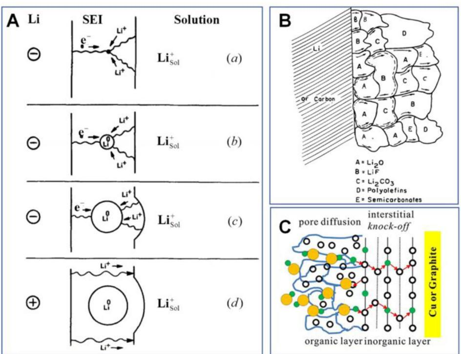

**FIGURE 8** Models of solid electrolyte interphase (SEI) on Li electrode: (A) "2D" model. Reprinted from Peled et al.[,183](#page-26-0) with permission. Copyright 1979, Electrochemical Society, Inc.; (B) Mosaic model. Reprinted from Peled et al.[,194](#page-27-0) with permission. Copyright 1997, The Electrochemical Society, Inc.; (c) Dual-layer structure model. Reprinted from with permission. Copyright 2012, American Chemical Society

The film formed by the reaction between Li metal and electrolyte was first discovered by Dey in 1970[.191](#page-27-0) Then in 1979, Peled named it as SEI and proposed the earliest model to describe it[.183](#page-26-0) The SEI with "2D model" was induced instantly by the contact of Li metal with electrolyte and it was about 15–25 Å thick, determined by the electron tunneling range (Figure 8A). Several other models have been proposed for the SEI. "Mosaic mode[l192–195"](#page-27-0) where insoluble multiphase products were deposited on Li anode randomly was defined by Peled and was used to modify his previous "2D model" (Figure 8B). Apart from the "mosaic model," another widely accepted description of SEI is "dual-layer structure model,", which has been confirmed by several experimental and theoretical investigations.[196](#page-27-0) In most cases, the layer close to Li metal is composed of the lower oxidation states which are derived from the reaction between salt and solvents, while the outer layer contains the higher oxidation constituents and is porous and nonunifor[m197–201](#page-27-0) (Figure 8C).

The components of the SEI layer strongly depend on the electrolyte constituents, including the Li salts, solvents and additives, which can heavily influence Li ion diffusion in SEI[.202–204](#page-27-0) It is reported that the organic Li salts in SEI layers are derived from the solvent while the inorganic composites are obtained from the reduction of anions in Li salts[.205](#page-27-0) In this regard, the dependence of SEI on the component of electrolytes has been widely reported. Fluorinated electrolyte has been extensively studied due to the outstanding performance of SEI with rich LiF. It was reported that the grain boundaries among LiF facilitated the uniform diffusion of Li ions and regulated the uniform Li deposition[.206–208](#page-27-0) Recently, many theoretical and experimental observations investigate the effect of the thickness and composition of the native inorganic layers on modulating the thermodynamics and kinetics of reduction processes of the electrolyte as well[.209](#page-27-0) Meyerson et al[.210](#page-27-0) found that the initial surface chemical composition of Li anode influenced the uniformity of SEI. The native Li surface with rich organic component grew as an SEI which was abundant in LiF. Therefore, these organic-rich areas were preferential sites for the inhomogeneous dendrite nucleation.

#### 4.3.2 Diffusion through SEI

SEI is an essential route for Li ions to diffuse into electrolyte during the stripping process. Li-ion concentration on the surface of the Li electrode is strongly influenced by the SEI. Therefore, it has a significant impact on the stripping process of the Li metal electrode. To eliminate the formation of dead Li and guarantee the uniform stripping

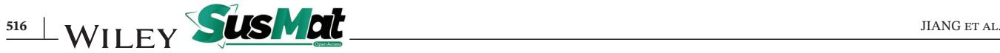

**FIGURE 9** Schematic diagram of Li ion diffusion through the SEI from the anode to the bulk electrolyte

of flat Li metal electrode, it is valuable to investigate the diffusion mechanism of Li ion through SEI.

Li ions pass through the SEI in three steps (Figure 9): (1) Li metal loses an electron to the current collector and changes into a Li ion; (2) Li ion diffuses through the SEI by relaying itself in Schottky vacancies; (3) Li ion detaches from the Schottky vacancies and is immediately solvated by the available solvent molecules. However, compared with the SEI obtained in Li ion battery, the SEI of Li metal battery is generally unstable and is not well understood until now[.211](#page-27-0) Therefore, much more effort must be devoted to understand the SEI formed in the Li metal battery.

#### **4.4 Electron transport**

The relationship between the numbers of reactant molecules and the charges (electrons) flowing in the circuit is described by the Faraday' law (Equation 9). It is clear that the quantities of different substances involved in the redox reaction are proportional to the amount of charges which have been consumed at the electrode. Therefore, the electronic conductivity is an index to judge the performance of electrodes.

Fortunately, the electron transport during the stripping process of Li electrode mainly occurs in the Li metal, the conductive host, and the current collector with a fast electron transfer. It is reported that Li metal has been an effective additive to improve the electronic properties of electron transport layer (ETL) employed in perovskite solar cells[.212,213](#page-27-0) Additionally, it is critical to promote the uniform electron transfer on the Li metal, the conductive host as well as the current collector with the aim to avoid the formation of dead Li.

$$
Q = nF,\t\t(9)
$$

where *Q* is the amount of charge, *n* is the number of reactants, and *F* is the Faraday's constant.

Li metal, conductive host, and the current collector are conductor with free electric charges (electrons). These free charges always migrate directionally in an applied electric field, resulting in an electric current. Therefore, it can be concluded that electric field distribution which is related to the structure of conductive surface is particularly important for electron transfer. 3D substrates, including current collectors and conductive hosts, are not only beneficial to improve the electroactive surface area of Li anode, but also facilitate the uniformity of the electric field[.214,215](#page-27-0) Therefore, the rational design of 3D substrates is important for developing Li anodes with a long lifespan.

In summary, the relative speed of the electrochemical reactions and Li atom diffusion is of vital importance for the formation of dead Li. Li atom diffusion rate is expected to be higher than the electrochemical oxidation reaction rate with the aim to suppress the generation of dead Li.

## **5 AFFECTING FACTORS AND SOLUTIONS**

## **5.1 Surface physics**

For the Li-free cathodes, Li stripping can first occur for Li metal anode and even the "seemingly" uniform Li plates can lead to heterogeneous stripping, which also

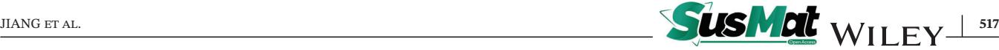

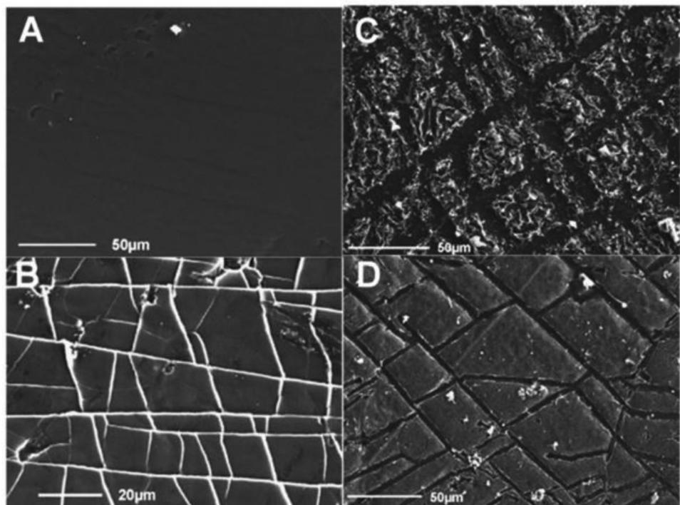

**FIGURE 10** SEM of Li surface texture (A) before the "Sellotape" treatment and (B) after the "Sellotape" procedure. Different surface morphologies of stripped Li at a current density of 50 mA/cm2 in (C) 1 M LiPF6 −EC/dimethyl carbonate (DMC) and (D) 1 M LiPF6 −EC. Reprinted from Gireaud et al.,[222](#page-28-0) with permission. Copyright by 2006, Elsevier B.V

demonstrates that Li stripping is worth being investigated even though the electrode is without dendrites. The commercial Li plate has numerous geometrical domains, corresponding to surface defects, and ideal Li plates without any surface defects at micro scale cannot be obtained in practice. The metallurgical factors, that is, grain boundaries and slip lines can possibly impact the Li stripping process. These heterogeneous features on the Li anodes can influence the formation barrier of pits and then lead to the preferential stripping at energetically favorable sites such as low-index surfaces or step sites[.216](#page-27-0)

#### 5.1.1 Slip lines

In metallurgical field, slip lines exist as a result of dislocation displacements through the crystal which are induced by the shear stress, depending on the manufacturing process.[217–220](#page-27-0) Even through the rolling of electrodes, the slip lines cannot be eliminated due to the irreversible plastic strain[.221](#page-27-0) Gireaud et al[.222](#page-28-0) utilized the "Sellotape'' procedure to visualize the slip lines which were originated from the dislocations displacements through the crystal induced by the mechanical stress (Figure 10A and B). They found that the dissolution process initially occurred on the slip lines. This was attributed to the high interfacial energy of slip lines where the passivating layers were unstable and preferentially broken down (Figure 10C and D). In addition, the slip lines were abundant of the steps and kinks. As a result, they were hot spots for Li dissolution compared to other areas on the surface of anode.[223](#page-28-0)

## 5.1.2 Grain boundaries

Li metal has a polycrystalline structure and its grain boundaries have a strong influence on the dissolution process of electrode. It is well known that the atoms at the grain boundaries, deviating from equilibrium, involve a higher interfacial energy[221,224](#page-27-0) and defects, such as caves, impurities, are abundant in the grain boundaries. Therefore, atomic diffusion at the grain boundaries is faster than lattice diffusion. The self-diffusion coefficient of metallic Li was reported to be 5.6 × 10–11 cm2/s[.175,200,225](#page-26-0) Furthermore, Shi et al[.223](#page-28-0) considered that solvent molecules were able to diffuse into the grain boundaries and formed SEI (Li2CO3) with a high Li ion diffusion rate (1.1 × 10–7 cm2/s). Therefore, grain boundaries with an in compact structure were beneficial to the diffusion for both Li atoms and Li ions and helpful for the fast dissolution of Li atoms. A string of voids along the grain boundaries during the dissolution process were discovered (Figure [11A and B\)](#page-12-0), illustrating that grain boundaries had an obvious impact on the uniformity of the stripping process.

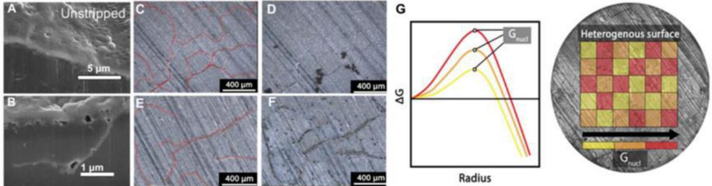

**FIGURE 11** (A) Cross-section SEM photograph of Li foil before cycling. (B) SEM graph of stripped Li foil with grain boundary in 1 M LiPF6−EC/DEC at a current density of 0.5 mA/cm2. Reprinted from Shi et al.[,223](#page-28-0) with permission. Copyright 2018, National Academy of Sciences of the United States of America. Surface morphology of the pristine Li surface before plating (C) with grain boundaries marked by red line and (D) after plating at current density of 0.01 mAh/cm2. Surface morphology of the pristine Li surface before stripping (E) with grain boundaries marked by red line and (F) after stripping at a current density of 0.2 mAh/cm2. (G) Distribution of Gibbs energy for nucleation (*G*nucl) on the heterogeneous Li surface. Reprinted from Sanchez et al.,[20](#page-22-0) with permission. Copyright by 2020, American Chemical Society

Optical microscope was used by Sanchez et al[.20](#page-22-0) to observe the relationship between the grain boundaries on the electrodes and the location of dendrite and pit formation. Pits and dendrites are preferentially formed near the surface grain boundaries of Li electrode, because the Gibbs energy for nucleation varied on the heterogeneous Li surface and the grain boundaries had smaller activation barriers for nucleation compared with the other regions on the electrode surface. In addition, pits showed a higher nucleation density than dendrites along grain boundaries which was attributed to the different effects of heterogenous nature of the Li electrode on the local activation barrier for nucleation of dendrites and pits (Figure 11C–G).

As discussed above, both metallurgical factors, that is, slip lines and grain boundaries have a great influence on the stripping of the Li metal anode. The surface defects of Li anode largely aggravate the nonuniformity of stripping on the Li surface and result in a continuous decline in discharging capacity of Li-metal battery. Therefore, Li electrodes with better metallurgical uniformity are desired.

#### **5.2 SEI film**

#### 5.2.1 The composition of SEI

Due to the complexity of SEI, Li microstructures (dendrites and fibers) grow uncontrollably and their role in the plating process has been investigated for decades.[226–229](#page-28-0) However, the impacts of SEI on the stripping process which are critically important for the performance of batteries are relatively less involved. Sun et al[.186](#page-26-0) found that the battery performance was sensitive to the Li ionic conductivity and mechanical strength of SEI. (1) The deposition morphology of Li was affected by the composition of the SEI. A dense and thick Li deposition morphology was observed for SEI with higher transference numbers, because SEI delayed the dendrite nucleation time. Contrarily, when the SEI had a low ionic conductivity, the deposited Li structures were uneven, loosely packed, and consisted of thin wires. Compared to the dense Li dendrites, the Li deposition with loose structure showed more tendencies to produce dead Li during the stripping process. (2) The chemical composition of the SEI influenced its structural modulus and the formation of dead Li as well. The SEI lacking LiF and Li2CO3 was mechanically weak and the deposited Li was easier to fracture at weak points to leave behind electrically disconnected dead Li (Figure [12A and B\)](#page-13-0).

#### 5.2.2 The structure of SEI

During dissolution, the SEI formed at the stage of deposition has an obvious influence on the stripping process of Li anode. Steiger et al[.230](#page-28-0) found that the thinning process of dendrites during the electrochemically stripping process started at its tip where the corresponding SEI mainly consisted of metal oxides or Li salt (Figure [13\)](#page-13-0). Similarly, Li et al[.122](#page-25-0) mentioned that inhomogeneous dissolution of Li with dendrite/mossy/granular morphology and hole-like structures were related to inhomogeneous coverage of the SEI rather than the homogeneity of the electronic or ionic conductivity of the Li electrode. Sun et al.[231](#page-28-0) utilized inline phase-contrast X-ray tomography to observe the Li stripping from the negative electrode. The results showed that differently sized cavities stemming from the unevenly formed SEI appeared in the partially dissolved Li anode.

The relationship between the SEI nanostructure and stripping behavior of dendrites was established by Li

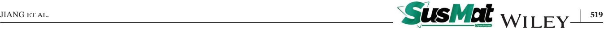

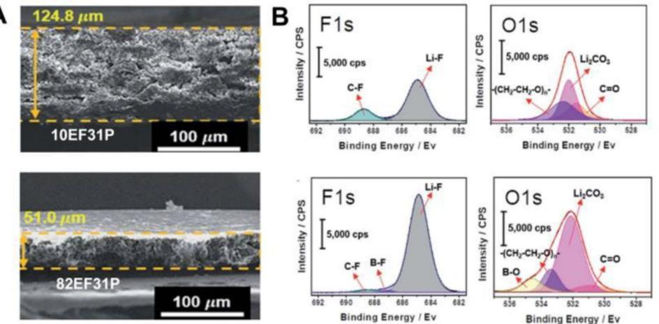

**FIGURE 12** Effects of SEI on stripping behaviors of Li metal anode. (A) Cross-section views of dead Li layer in Li||Cu cells with different electrolytes after 50 cycles. (B) XPS spectra of F1s and O1s of the SEI layer after first deposition in Li||Cu cells with different electrolytes. Reprinted from Sun et al.,[186](#page-26-0) with permission. Copyright 2019, The Royal Society of Chemistry

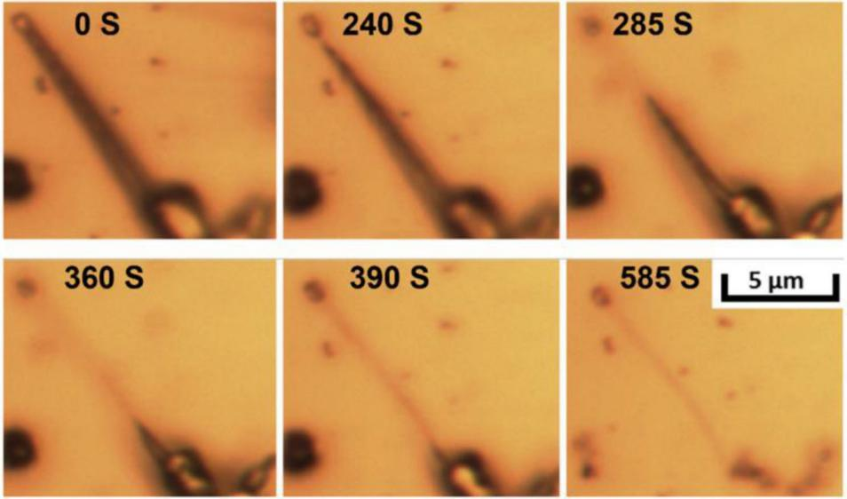

**FIGURE 13** Observations of electrodissolution process of a Li needle through in situ light microscopy. Reprinted from Steiger et al.,[230](#page-28-0) with permission. Copyright 2014, Elsevier BV

et al[.196](#page-27-0) The atomic structural and crystallography of SEI were revealed by cryoelectron microscopy (Cryo-EM) without destroying the samples.[232–235](#page-28-0) It was observed that the distribution of crystalline grains within the two models of SEI (mosaic and multilayer) were significantly different. The mosaic model was characterized with microphases of both crystalline and amorphous heterogeneous distributed organic and inorganic decomposition components of the electrolytes. Instead, an ordered and layered structure was formed with uniformly distributed decomposition products in the multilayer model. For the Li metal anode surrounded by mosaic SEI, notches were observed on the surface of the stripped dendrites, where the SEI contained mostly crystalline nanograins. Subsequently, these notches changed into cracks during the nonuniform stripping process, leading to the formation of dead Li. On the contrary, crystalline grains were more uniformly arranged in the multilayered SEI which was beneficial to uniform Li transport until the fully stripping of Li dendrites (Figure [14\)](#page-14-0). More drastic chemical reactions occurred along the boundary of the SEI and the size of a single SEI grain was small, leading to the homogeneous dispersion of pits macroscopically. Besides, based on the molecular dynamics simulation, Li stripping occurred at the defects of SEI was

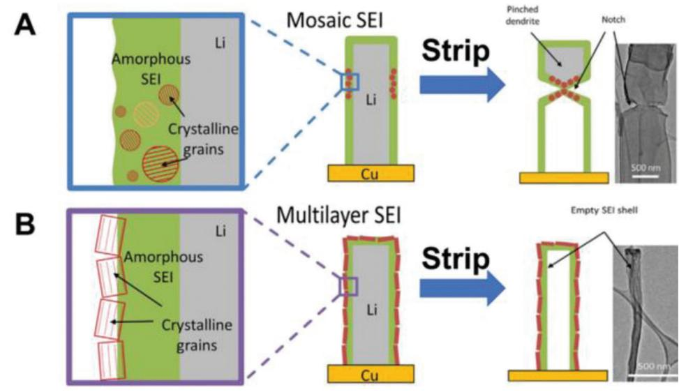

**FIGURE 14** Cryo-EM image and schematic of a typical Li metal dendrite with different SEI films. Mosaic SEI formed in EC/DEC electrolyte leads to Li partly stripped during the dissolution process, while multilayer SEI in EC/DEC electrolyte with 10 vol.% fluoroethylene carbonate (FEC) additive renders Li completely stripped during the dissolution process. Reprinted from Li et al.[,196](#page-27-0) with permission. Copyright 2018, Elsevier Inc.

confirmed by Zhang et al.[,236](#page-28-0) agreeing well with experimental results.

In summary, the properties of SEI, including the Li ionic conductivity, chemical homogeneity, and mechanical strength, etc., are not only related to the formation of Li dendrite but also influence the homogeneous stripping process of Li electrodes. However, the clear relationship between SEI feature and design principles, and stripping electrochemistry are still not known.

#### **5.3 Operational factors**

#### 5.3.1 Current density

It has been widely accepted that dendrite growth is strongly affected by the charging current density and it forms easily at high current densities or C-rates during the charging process according to the Sand's time model[.237–240](#page-28-0) Similarly, current density can affect the distributions of electrons on the anode surface and finally the stripping processes. During the plating and stripping process, electrons are reactants and products, respectively. However, it is essential to be noted that the electrons are not transferred between the electrodes and electrolyte directly, otherwise it may result in the fast self-discharge and the poor battery performance. In fact, the passivating SEI produced by the reduction of electrolytes acts as an interface between the electrodes and electrolyte and exhibits the property with high electronic resistivity[.241,242](#page-28-0)

Sagane et al[.243](#page-28-0) observed the morphology variations of Li dendrites during electrochemical stripping reactions by in-situ scanning electron microscopy at a relatively small current and discovered that the formation of dead Li was strongly dependent on the relationship between the self-diffusion rate of Li atoms and Li stripping rate. When the precipitated Li with 5 *μ*m length was stripped at 50 *μ*A/cm2, it stripped mostly and left an inert husk of Li precipitates before losing its contact with current collector. One-dimensional diffusion length (4.5 *μ*m) of Li atoms at room temperature for the stripping process was nearly the same as the length of Li precipitates (5 *μ*m) according to the relationship among the diffusion distance (*x*), self-diffusion coefficient (*D*), and diffusion time (*t*) (Equation 10). In contrast, when the stripping current density was increased to 500 *μ*A/cm2, the Li around the root of precipitates was stripped while the others remained unchanged. In this case, the diffusion length was about 1.6 *μ*m, which was much shorter than the length of Li precipitates. Therefore, dead Li was formed and the Columbic efficiency was reduced a lot (Figure [15A](#page-15-0) and [B\)](#page-15-0).

$$
x = \sqrt{Dt}.\tag{10}
$$

Similar to the stripping of dendrites, the magnitude of current density has a significant influence on the dissolution of Li plate. Shi et al[.223](#page-28-0) investigated the formation of pits caused by the high current density (beyond 1 mA/cm2) on the Li plates in 1 M LiPF6−EC/DEC electrolyte. A string of voids was formed between SEI and Li anode during

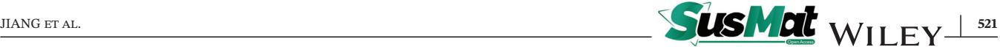

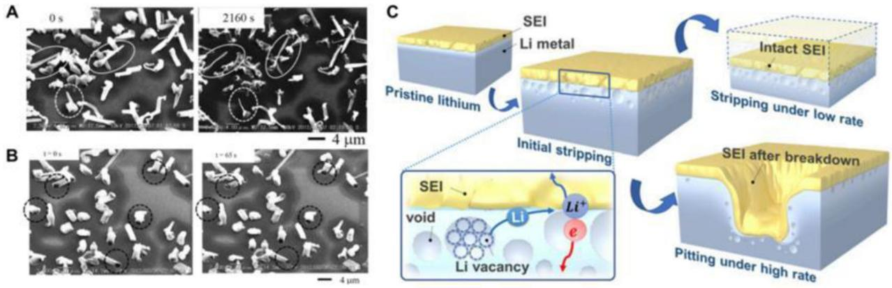

**FIGURE 15** The captured in-situ SEM observations during Li stripping process at a current density of (A) 50 *μ*A/cm2 and (B) 500 *μ*A/cm2, respectively. Reprinted from Sagane et al.[,243](#page-28-0) with permission. Copyright 2013, Elsevier Inc. (C) Schematic diagram: Li stripping process of electrode under different current densities. Reprinted from Shi et al.,[223](#page-28-0) with permission. Copyright 2018, National Academy of Sciences of the United States of America

the stripping process with a low current density, while the voids became larger as the stripping current density increased to 1 mA/cm2. A local collapse of SEI occurred with the vigorous growth of voids, leading to the heterogeneous stripping of Li anodes and the formation of pits (Figure 15C).

As mentioned above, the discharge current density is limited to avoid the formation of dead Li and voids on the surface of Li electrode, while a harsh operating condition (current density > 3 mA/cm2, areal capacity > 3 mAh/cm2) is necessary for the practical application of rechargeable LMBs. Fortunately, Zheng et al[.244](#page-28-0) probed the impact of discharge current density on the performance of Li metal battery. It was found that increasing the Li stripping rate was conducive to stabilize the Coulombic efficiency and enhance the long cycle life of Li|| LiNixMnyCo1-x-yO2 cells. This finding challenges the conventional belief that high stripping rate of Li-metal battery results in the rapid decrease of Coulomb efficiency because of the formation of inactive Li. The high concentrated Li ions formed during high C-rate discharge process were immediately solvated by the adjacent solvent molecules. Therefore, they could protect fresh Li electrode from serious corrosion with electrolyte components, that is, solvent and salt anions. In addition, the formation of a relatively stable and flexible SEI with mixed organic and inorganic components integrated in a poly (ethylene carbonate) framework was facilitated by the transient layer of highly concentrated electrolyte (Figure [16\)](#page-16-0). As a result, the side-reactions between Li metal and electrolyte were considerably suppressed, thereby improving the performance of the Li-metal battery.

As discussed above, both the stripping of dendrites and Li plates are sensitive to the current density. Therefore, an appropriate operating current density is essential for LMBs with a high cycling efficiency and long lifespan.

#### 5.3.2 Stripping capacity

The amount of Li deposited/stripped during the charge/discharge cycle varies with the cycling capacity. There is a general belief that the lifespan of battery is shortened by increasing capacity. This could be verified by the amount of dead Li and morphology characteristics of LMBs (Li||LiNi1/3Mn1/3Co1/3O2) at different capacities after cycles[.245](#page-28-0) The wider cracks were clearly observed on bulk Li with the increase of the cycling capacity. The degradation layer was easier to separate from the bulk Li, resulting in the obvious decrease in the amount of active Li.

Based on above descriptions, the direct relationship between the stripping capacity and the battery performance is still indistinct. Shi et al[.237](#page-28-0) independently studied the deposition and stripping behaviors of Li metal anode at different capacities with a constant current density. The length and diameter of platted Li was found to be significantly dependent on plating capacity. However, the comparable stripping process of Li metal anode could be observed at different capacities, as shown in Figure [17.](#page-16-0) The effect of stripping capacity on the dissolution process was not as obvious as plating process. A similar phenomenon is also observed in the resultant Li anode based on a periodically conductive/dielectric host[.246](#page-28-0)

In conclusion, the effort on the stripping capacity which impacts directly the dissolution process of Li electrode is still less involved. In fact, more evidences are needed to clarify the above statement.

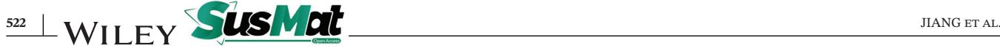

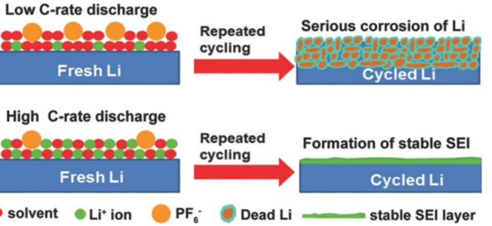

**FIGURE 16** Schematic illustrations describing the function of different SEI during the discharge and charge cycles. Reprinted from Zheng et al[.244](#page-28-0) with permission. Copyright by 2016, Wiley-VCH

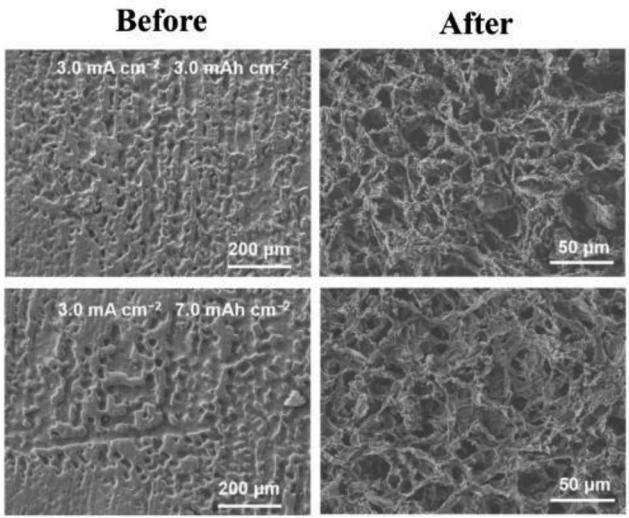

**FIGURE 17** Stripping behaviors of Li metal anode at different capacities. (A) SEM images (surface view) of stripping morphology before and after Li-stripping with different capacities with an identical current density. Reprinted from Shi et al.[,237](#page-28-0) with permission. Copyright 2019 Wiley-VCH Verlag GmbH & Co. KGaA, Weinheim

## **5.4 External factors**

### 5.4.1 Temperature

Temperature is an important influencing factor for the battery performance. Many processes, that is, the formation of dendrites, the irreversible side reactions between Li metal and electrolyte are impacted by the temperature[.247–250](#page-28-0) In addition, as discussed in Section [2,](#page-2-0) the temperature can generate significant effects on the transfer rates of Li atoms, Li ions, and the electrochemical reaction rates, which will lead to the change in the stripping behavior of Li metal anode. Tewari et al[.163](#page-26-0) explored the effect of temperature on the formation of dead Li during the dissolution by the mesoscale model and experimental researches. The amount of dead Li was positively correlated to the temperature. This was because the mobility of Li ions at the interface was higher with the increasing temperature, rendering the stripping reactions faster (Figure [18A–D\)](#page-17-0). To gain a deeper understanding on the consideration, the following scenario can be assumed. As indicated by Monroe et al.,[251](#page-28-0) the concentration of Li+ was high at the interface during stripping. If a low temperature was applied, the ionic diffusion at the interface was limited and the accumulation of Li ions could be regarded as a passivating layer which prevented the next Li layer from further oxidation. Instead, the Li+ was easy to move into the bulk electrolyte when a higher operating temperature was conducted during the stripping process. Then more Li atoms in the next layer could be oxidized into Li+, resulting in the formation of dead Li.

LMBs with SSEs receive extensive attention for the excellent properties, that is, suppressing Li dendrite formation, preventing electrolyte decomposition on the Li surface, and high security[.252–255](#page-28-0) Yonemoto et al[.256](#page-28-0) investigated the cycling stability of LMB with SSEs under various temperatures (25, 60, and 100oC). The higher temperature was found to significantly improve the cycling stability of Li plating/stripping. There were two points: diffusion of Li atoms and mechanical deformation of Li electrode were all related to temperature. First, some small voids (1–2 *μ*m) could be observed near the interface after stripping at 25oC while these voids totally disappeared as the temperature reached 100oC (Figure [18E and F\)](#page-17-0). This was mainly because the voids could be removed by the frequent occurrence of lattice diffusions in Li at high temperature. At low temperature, the remaining voids at interface might cause the decrease in contact area of Li/SSEs. Then, the local current density increased, leading to the growth

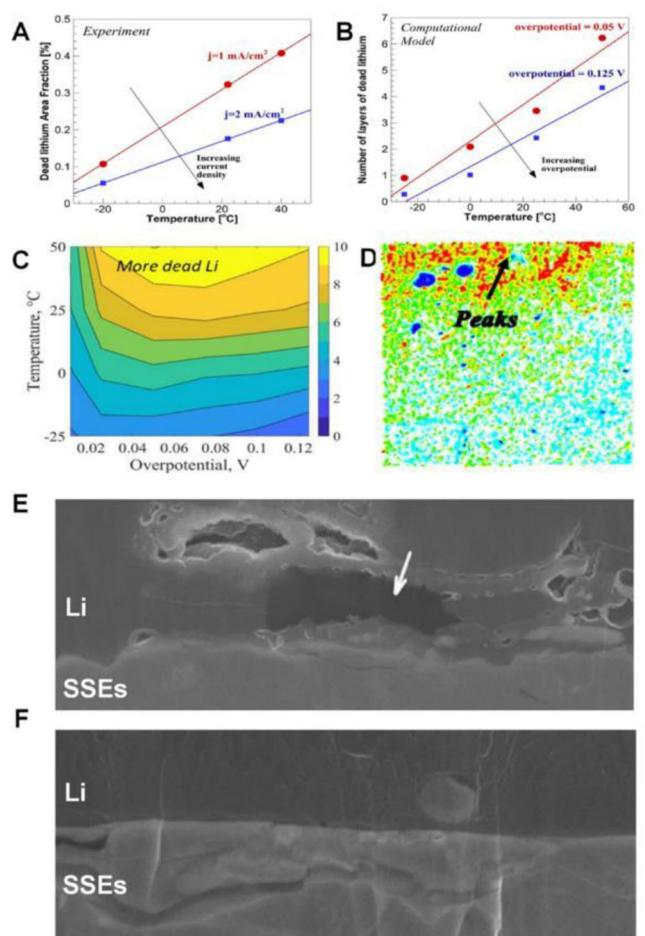

**FIGURE 18** Effects of temperature on (A) the dead Li area fraction and (B) the number of layers of dead Li. (C) The contour lines of the amount of dead Li. (D) Surface topography (top view) of the stripped Li electrode at a current density of 1 mA/cm2 and temperature of 40◦C. Reprinted from Tewari et al.,[163](#page-26-0) with permission. Copyright by 2020, American Chemical Society. Cross-sectional SEM images of Li/SSEs interface after stripping at temperature of (E) 25 and (F) 100◦C. Reprinted from Yonemoto et al.[,256](#page-28-0) with permission. Copyright by 2017, Elsevier B.V.

of Li dendrites. On the other hand, for LMB with SSEs, the electrodes and electrolyte always packaged together under a certain level of pressure. This meant the "soft" Li electrode was chronically pressured and the external load drove the continuous deformation (creep) of Li electrode especially under a high temperature[.257,258](#page-29-0) The accelerated creep deformation by high temperature was also beneficial to remove the voids near the interface. Furthermore, that the texture of Li film pretreated at high temperature was conducive to the cycling stability of LMB even though the operating temperature was not high enough[.256](#page-28-0)

Therefore, diffusion dynamics is the main approach, through which temperature affects the battery performance during the stripping process. However, direct observation of diffusion process is almost impossible in experi-

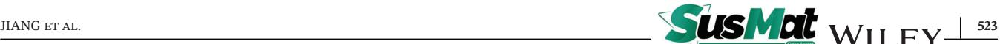

ments. Therefore, simulation methods at different dimensions should be introduced to investigate the physical mechanism of temperature effects.

#### 5.4.2 Pressure

Due to the malleable nature of Li, stress constraints, including SSE and SEI, with high mechanical strength can be utilized to restrain the growth of Li dendrite[.259–261](#page-29-0) However, mechanical stress generated from the volume change during charging/discharging induces the growth of dendrite and continuous cracking of SEI and solid electrolyte[,262–267](#page-29-0) thus, resulting in the recession of battery performance. It is reported that an overpotential of –0.135 V during the Li deposition can theoretically generate GPalevel hydrostatic pressure[.268,269](#page-29-0) Therefore, it is significant to achieve a comprehensive understanding of the role of stress formed during the plating and stripping process.

Using an in-situ transmission electron microscopy, Chen et al[.270](#page-29-0) investigated the plating and stripping process of alkali metals (Li or Na) in the hollow tubules with good conductivity of electrons and ions. They correlated the relationship between the stress and creep, finding that Coble creep forced the growth and contraction of Li or Na along the interface between these alkali metals and tubules. Hydrostatic and deviatoric stress were relived mainly through the interfacial-diffusional Coble creep rather than dislocation creep and the bulk diffusional Nabarro–Herring creep (Figure [19\)](#page-18-0). Dislocation creep was demonstrated not to be the dominant creep mechanism for Li or Na during the electrochemical reaction because the voids generated during discharge could not prevent the Li from being further stripped. In addition, the bulk diffusional Nabarro–Herring creep was excluded as a major kinetic mechanism through theoretical calculations. Therefore, the release of internal stress formed during the discharge and charge cycle is closely related to the creep.

Similarly, creep deformations, including the dislocation power-law creep, grain boundary sliding creep, and diffusional creep, are favored at high external pressure as well[.258](#page-29-0) The external high pressure is conducive to the contact between dendrites and current collector[.271](#page-29-0) Therefore, an external press has a significant influence on the stripping process. It is not only beneficial to effectively reduce the generation of dead Li but also eliminate interfacial resistance (*R*int) between Li electrodes and SE through the creep deformation.

Due to the excellent plasticity of Li metal, mechanical pressure can generate an obvious influence on the morphological characteristics and cycling life of LMBs. Yin et al[.272](#page-29-0) investigated the plating and stripping

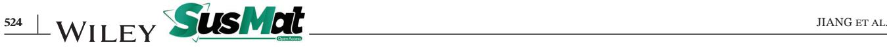

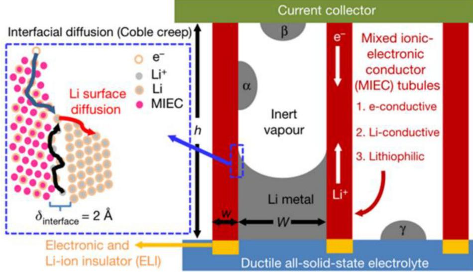

**FIGURE 19** Schematic diagram describing the Li dissolution/deposition process in a mixed ionic-electronic conductor (MIEC) through the Coble creep along the MIEC/Libcc incoherent interface. Reprinted from Chen et al[.270](#page-29-0) with permission. Copyright 2020, Nature Publishing Group

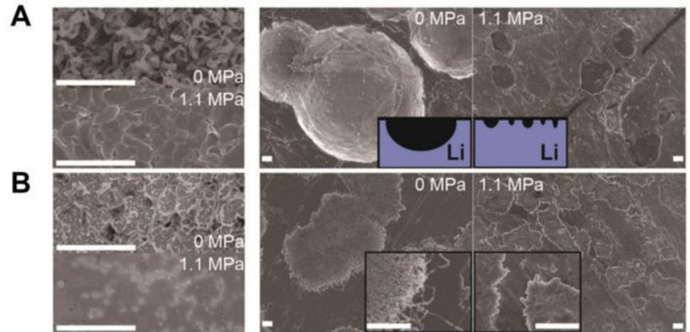

**FIGURE 20** SEM images of the surface of Cu foil with a pressure of 0 and 1.1 MPa for (A) first deposition on Cu and (B) first stripping from Cu. Scale bar: 10 *μ*m. Reprinted from Yin et al.,[272](#page-29-0) with permission. Copyright 2018, Elsevier B.V

process on the Li||Cu battery under different pressures and found that Li dissolution under high pressure led to less inactive Li, which was beneficial to the higher Coulombic efficiency (∼90%) and longer cycling life. Pits formed with pressure on the Li electrode in first plating process were smaller and more uniform than those without pressure (Figure 20A). During the following stripping process, more Li metal stripped from the Cu electrode and transferred back to electrolytes (Figure 20B). This was because the deposited Li layer was closely stacked on the surface of electrode in the battery with pressure during the dissolution, which was beneficial to the complete Li stripping and rendered less Li residual and a higher Columbic efficiency.

During cell assembly, in the whole cell, it was very difficult to maintain the same pressure everywhere. Electrode edge effects induced by the different local pressure distribution were investigated by Lee et al[.161](#page-26-0) Generally, the cell was highly compressed in the center part and was less or not pressurized for the boundary area. The energy dispersive X-ray beam exposure was utilized to analyze the formation of localized dead Li. The SEI was sensitive to the Xray beam while the dead Li could maintain its morphology even under a long irradiation time. The high pressure facilitated the electrical contact between Li deposition and Cu electrode and was conductive to the complete stripping of Li dendrites. The results indicated that the sediment in the center area could be fully decomposed (500 s) and the only

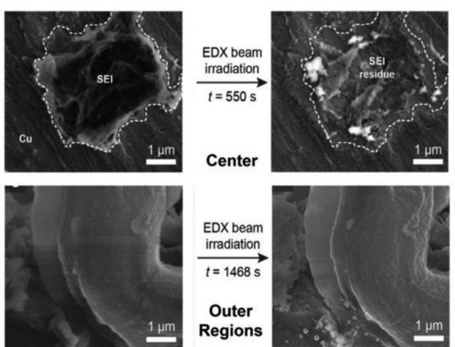

**FIGURE 21** SEM images of center and outer regions of the Li-stripped Cu electrode before and after EDX beam irradiation, respectively. Reprinted from Lee et al[.161](#page-26-0) with permission. Copyright 2018, Wiley-VCH

residual was the inorganic components of the SEI, meaning that Li metal can fully be stripped. However, the morphology of the substance in the outer part remained the same (1468 s), revealing the generation of dead Li in this area (Figure 21).

The replacement of liquid electrolyte with SSE has been regarded as an efficient method to solve the existing problems of liquid batteries such as electrolyte leakage, short circuit, and fires[.273,274](#page-29-0) As the dynamic changes of the interface between Li-metal and SSE have an obvious influence on the battery performance, a deep understanding of the interface is required. The voids formed at the interface during the stripping process lead to the increase in cell resistance and shorten the battery lifespan. Therefore, it is important to eliminate or reduce them. Beyond controlling the temperature to avoid the formation of voids which had been discussed in the last section, an alternative schedule is to increase the stack pressure. Wang et al[.125](#page-25-0) investigated the relationship among stack pressure, current density, and cell resistance and found that voids caused by Li stripping had a significant influence on the total resistance of the cell. Cells with a three-electrode configuration were cycled at a constant current density of 0.2 mA/cm2 and the potential difference between the working electrode and counter electrode was nearly flat at higher stack pressures while it increased dramatically with the pressure below 1.2 MPa. This was attributed to the flux of Li that was pushed by the low stack pressure through the creep deformation and was insufficient to replenish the voids caused by the dissolution of Li electrode. As a result, the resistance at interface increased, which was harmful for the performance of the battery (Figure [22\)](#page-20-0).

JIANG et al. **525**

Additionally, another challenge for the Li metal battery with solid electrolyte at high current densities and high areal capacities is the Li dendrite penetration via defects, that is, grain boundaries and voids during the plating process. It induces short circuit of Li metal battery and gives rise to safety hazards during the deposition process. However, a distinct opposing requirement for the external pressure of Li deposition and Li dissolution was elucidated by Wang et al[.275](#page-29-0) They found that high external pressure exacerbated the penetration of Li dendrite through the solid electrolyte. As shown in Figure [23,](#page-20-0) the critical current density of dendrite penetration at 10.2 MPa was below 0.1 mA/cm2 while it was about 0.6 mA/cm2 at 2.8 MPa. The penetration of Li dendrite was caused by the accumulation of internal stress formed during Li deposition. The Li metal preferred to creep into the crakes, that is, the voids of the solid electrolyte in Li metal battery with high external pressure for releasing the internal stress.

In summary, the plating and stripping process exhibit a distinctly different dependency on the external pressure. Therefore, refining external pressure regulation during the cycling process can be expected to be an effective way to further improve the performances of LMBs.

Recent experimental investigations about stripping behaviors of Li metal anode mostly focus on the correlation between one certain operating condition (surface physics, SEI, operational factors, and external factors) and the phenomenological stripping results (generation of dead Li and the homogeneousness of stripping Li). However, the physical essence of the influence of operating condition on the dissolution process is still uncertain. Specifically, more information about the relationship between microscopic mechanisms, that is, atom/ion diffusion, electron migration, and macroscopical operating factors is needed in the further investigations for a more comprehensive understanding of stripping behaviors of Li metal anode.

#### **6 CONCLUSIONS AND PERSPECTIVE**

Plating and stripping process are two sides of practical Li metal anode, both of which are critically significant for the safe, high-energy density, and long-lifespan LMBs. Previously, the Li plating process that strongly influences the formation of Li dendrites has been investigated extensively. In contrast, stripping process is previously regarded as dependent on the plating process and has not attracted a great deal of attention in the past few years. Actually, stripping itself can generate significant effects on the robust cycling of LMBs. A dendrite-free Li metal anode, without a uniform Li stripping behavior, even the pristine Li plate can still lead to dead Li formation. Comprehensively understanding the stripping process of Li electrode is

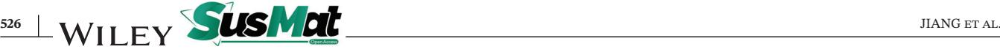

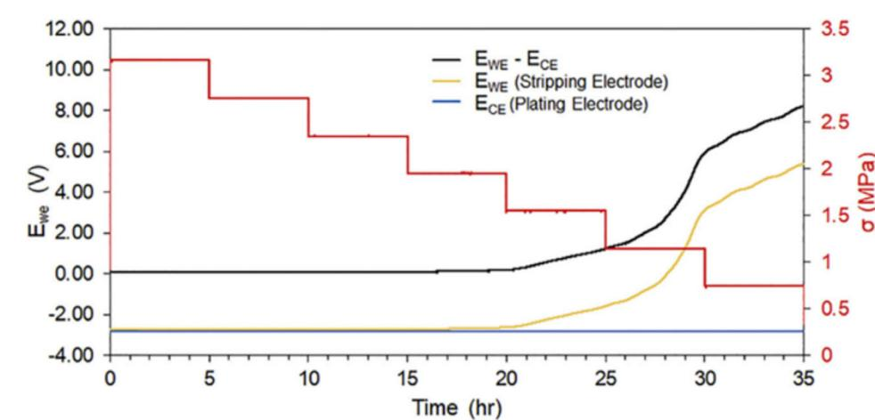

**FIGURE 22** The potential responses to a constant current density (0.2 mA/cm2) under different pressures. Reprinted from Wang et al.[,125](#page-25-0) with permission. Copyright 2019, Elsevier Inc.

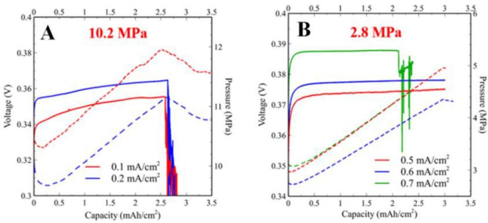

**FIGURE 23** Voltage response of the Li1.5In/ Li cells at different external pressures and corresponding pressure changes induced by the volume change of the battery during the deposition process. The dashed and solid lines are for pressure and voltage, respectively. Reprinted from Wang et al.[,275](#page-29-0) with permission. Copyright 2020, American Chemical Society

critically significant for LMBs with a high Coulombic efficiency and long lifespan that is not only helpful to restrain the formation of dead Li but for the following plating process. In this review, we summarize a range of factors that affect the stripping process clearly including surface defects of Li plates, the SEI, current density, temperature, and pressure. Working principles and regulation examples are presented to deeply understand the stripping behaviors induced by these factors.

Compared to the extensive researches on regulating the plating process, the researches on stripping processes are still less involved. Several aspects can be considered in the future researches.

1. Surface defects (grain boundaries and slip lines) which are related to the preparation technology of Li anode can strongly affect the uniformity of the dissolution process. Further investigations of preparation technologies (rolling speed and temperature) of Li metal electrodes for refining grains and diminishing the generation of slip lines are requested. Other advanced manufacturing technologies to obtain Li metal electrodes with smooth textures, such as evaporation and electrodeposition, etc., and their effects on the stripping processes can also be conducted.

2. Structural and composition uniformity of SEI are favorable for the uniform stripping of Li metal anode. However, the understanding of the formation process of SEI is limited since the SEI with nanostructure is significantly sensitive to air and easily injured by the high energy electron beam necessary for high-resolution imaging[.276](#page-29-0) Current characterization methods of SEI mainly focus on the chemical composition analyzation, such as time-of-flight secondary ion mass spectrometry[,277–279](#page-29-0) X-ray photoelectron spectroscopy (XPS)[,280–282](#page-29-0) nuclear magnetic resonance , [283,284](#page-29-0) and Fourier-transform infrared spectroscopy[,285](#page-29-0) while their structure at the nanoscale and crystallography have not been explored clearly. Therefore, it is difficult to control the generation of SEI with uniform structure and composition without the comprehensive understanding of the surface film. In the past, many theoretical and experimental observations primarily investigated the effect of the electrolyte composition on the SEI[,286–290](#page-29-0) and recently the effect of the initial surface chemistry of the Li anode on the SEI has been investigated as well.[209,210](#page-27-0) Anyway, the ultimate objective is to obtain the SEI with the homogeneous compositions and structures.

- 3. Except for the nature of battery itself, operating conditions (current density, stripping capacity, temperature, and pressure) influence the stripping of Li electrode as well. However, the apparent external conditions, such as rapid discharge at low temperature, are decided by the customs and cannot be changed, while the local conditions can be regulated to render uniform stripping behaviors by battery management systems. Proper current density, stripping capacity, temperature, and pressure are required to be elaborately designed to reduce the formation of dead Li.
- 4. Advanced characterization techniques with real-time visualization of the dendrite during the stripping process can be extremely useful toward understanding the formation of dead Li and are beneficial to develop the potential solutions for the failure modes induced by the dead Li[.291](#page-30-0) Therefore, further development of in situ characterization techniques especially the threedimensional (3D) operando imaging[292](#page-30-0) and their combinations which focus on morphological variation of the Li electrode-electrolyte interface, the formation process and relative quantification of dead Li during stripping process are needed.
- 5. Due to the difficulty in detecting the evolution of morphology and surface chemistry, the experimental progress in understanding the electrochemical mechanisms is relatively slow. Therefore, investigations by simulation methods can be more conducted, such as quantum chemical calculations, molecular dynamics simulations, and finite element method[.202,293–297](#page-27-0)

Li metal anode is regarded as the "Holy Grail" electrode due to its high gravimetric capacity and the most negative potential, which has received extensive research attention. However, relative to extensive investigation on understanding the plating process, the researches on stripping

JIANG et al. **527**

process are less involved though it has an obvious influence on the electrochemical performance of batteries. This review affords fresh insights to gradually acknowledge the mystery of Li metal anode by bridging the gap of Li stripping processes. Comprehensively understanding the stripping process of Li metal anode is not only helpful to design robust Li metal-based batteries, but also enhancing the understanding of nonaqueous electrochemistry.

#### **ACKNOWLEDGMENTS**

This work was supported by Beijing Natural Science Foundation (JQ20004), National Natural Science Foundation of China (22179070, U1801257, U1910202), and Tsinghua-Toyota Joint Research Fund (20213930025).

#### **CONFLICT OF INTEREST**

The authors declare no conflict of interest.

#### **ORCID**

*Qiang Zhang* <https://orcid.org/0000-0002-3929-1541> *Jia-Qi Huang* <https://orcid.org/0000-0001-7394-9186>

#### **REFERENCES**

- 1. Wang J, Ma L, Xu J, Xu Y, Sun K, Peng Z. Oxygen electrochemistry in Li-O2 batteries probed by in situ surface-enhanced raman spectroscopy. *SusMat*. 2021;1(3):345–358.
- 2. Jin T, Wang Y, Hui Z, et al. Nonflammable, low-cost, and fluorine-free solvent for liquid electrolyte of rechargeable lithium metal batteries. *ACS Appl Mater Inter*. 2019;11(19):17333-17340.
- 3. Dong Y, Lu P, Ding Y, Shi H, Feng X, Wu ZS. Advanced design of cathodes and interlayers for high-performance lithiumselenium batteries. *SusMat*. 2021;1(3):393–412.
- 4. Cheng XB, Liu H, Yuan H, et al. A perspective on sustainable energy materials for lithium batteries. *SusMat*. 2021;1(1): 38–50.
- 5. Cai W, Yan C, Yao YX, et al. Rapid lithium diffusion in order@disorder pathways for fast-charging graphite anodes. *Small Struct*. 2020;1(1):2000010.
- 6. Liu B, Zhang J-G, Xu W. Advancing lithium metal batteries. *Joule*. 2018;2(5):833-845.
- 7. Kong L, Tang C, Peng HJ, et al. Advanced energy materials for flexible batteries in energy storage: a review. *SmartMat*. 2020;1:e1007.
- 8. Boyle DT, Kong X, Pei A, et al. Transient voltammetry with ultramicroelectrodes reveals the electron transfer kinetics of lithium metal anodes. *ACS Energy Lett*. 2020;5(3):701-709.
- 9. Chen XR, Yao YX, Yan C, Zhang R, Cheng XB, Zhang Q. A diffusion-reaction competition mechanism to tailor lithium deposition for lithium-metal batteries. *Angew Chem Int Ed*. 2020;59(20):7743–7747.
- 10. Jin S, Ye Y, Niu Y, et al. Solid-solution-based metal alloy phase for highly reversible lithium metal anode. *J Am Chem Soc*. 2020;142(19):8818-8826.
- 11. Shen X, Zhang XQ, Ding F, et al. Advanced electrode materials in lithium batteries: retrospect and prospect. *Energy Mater Adv*. 2021;2021:1205324.

# **528** JIANG et al.

- 12. Lin X, Yu J, Effat MB, et al. Ultrathin and non-flammable dualsalt polymer electrolyte for high-energy-density lithium-metal battery. *Adv Funct Mater*. 2021;31(17):2010261.
- 13. Xu X-Q, Xu R, Cheng X-B, et al. A two-dimension laminar composite protective layer for dendrite-free lithium metal anode. *J Energy Chem*. 2021;56:391-394.
- 14. Chen X-R, Yan C, Ding J-F, Peng H-J, Zhang Q. New insights into "dead lithium" during stripping in lithium metal batteries. *J Energy Chem*. 2021;62:289-294.
- 15. Liang Y, Xiao Y, Yan C, et al. A bifunctional ethylene-vinyl acetate copolymer protective layer for dendrites-free lithium metal anodes. *J Energy Chem*. 2020;48:203-207.
- 16. Whittingham MS. Electrical energy storage and intercalation chemistry. *Science*. 1976;192(4244):1126-1129.
- 17. Chen S, Niu C, Lee H, et al. Critical parameters for evaluating coin cells and pouch cells of rechargeable Li-metal batteries. *Joule*. 2019;3(4):1094-1105.
- 18. Lee JI, Song G, Cho S, Han DY, Park S. Lithium metal interface modification for high-energy batteries: approaches and characterization. *Batter Supercap*. 2020;3:828–859.
- 19. Fang C, Lu B, Pawar G, et al. Pressure-tailored lithium deposition and dissolution in lithium metal batteries. *Nat Energ*. 2021;6:987–994.
- 20. Sanchez AJ, Kazyak E, Chen Y, Chen K-H, Pattison ER, Dasgupta NP. Plan-view operando video microscopy of Li metal anodes: identifying the coupled relationships among nucleation, morphology, and reversibility. *ACS Energy Lett*. 2020;5(3):994–1004.
- 21. Wood KN, Noked M, Dasgupta NP. Lithium metal anodes: toward an improved understanding of coupled morphological, electrochemical, and mechanical behavior. *ACS Energy Lett*. 2017;2(3):664-672.
- 22. Liu J, Yuan H, Tao X, et al. Recent progress on biomass-derived ecomaterials toward advanced rechargeable lithium batteries. *EcoMat*. 2020;2(1):e12019.
- 23. Li H, Yamaguchi T, Matsumoto S, et al. Circumventing huge volume strain in alloy anodes of lithium batteries. *Nat Commun*. 2020;11(1):1584-1593.
- 24. Gao RM, Yang H, Wang CY, Ye H, Cao FF, Guo Z. Fatigueresistant interfacial layer for safe lithium metal batteries. *Angew Chem Int Ed*. 2021;60:25508–25513.
- 25. Qiao Y, Li Q, Cheng XB, et al. Three-dimensional superlithiophilic interphase for dendrite-free lithium metal anodes. *ACS Appl Mater Interfaces*. 2020;12(5):5767–5774.
- 26. Mao H, Yu W, Cai Z, et al. Current-density regulating lithium metal directional deposition for long cycle-life Li metal batteries. *Angew Chem Int Ed*. 2021;60(35):19306–19313.
- 27. Xu R, Shen X, Ma XX, et al. Identifying the critical anioncation coordination to regulate the electric double layer for an efficient lithium-metal anode interface. *Angew Chem Int Ed*. 2021;60(8):4215–4220.
- 28. Meng X, Xu Y, Cao H, et al. Internal failure of anode materials for lithium batteries—a critical review.*Green EnergEnviron*. 2020;5(1):22–36.
- 29. Yi R, Gordin ML, Wang D. Integrating Si nanoscale building blocks into micro-sized materials to enable practical applications in lithium-ion batteries. *Nanoscale*. 2016;8(4):1834– 1848.
- 30. Wang L, Menakath A, Han F, et al. Identifying the components of the solid-electrolyte interphase in Li-ion batteries. *Nat Chem*. 2019;11(9):789–796.
- 31. Cao Z, Zheng X, Huang W, Wang Y, Qu Q, Zheng H. Dynamic bonded supramolecular binder enables high-performance silicon anodes in lithium-ion batteries. *J Power Sources*. 2020;463:228208.
- 32. Zhang L, Peng S, Ding Y, et al. A graphite intercalation compound associated with liquid Na–K towards ultra-stable and high-capacity alkali metal anodes. *Energy Environ Sci*. 2019;12(6):1989-1998.
- 33. Wang D, Liu Y, Li G, Qin C, Huang L, Wu Y. Liquid metal welding to suppress Li dendrite by equalized heat distribution. *Adv Funct Mater*. 2021;31:2106740.
- 34. Huang J, Liu J, He J, et al. Optimizing electrode/electrolyte interphases and Li-ion flux/solvation for lithium-metal batteries with qua-functional heptafluorobutyric anhydride. *Angew Chem Int Ed*. 2021;60(38):20717—20722.
- 35. Ma Q, Sun X, Liu P, Xia Y, Liu X, Luo J. Bio-inspired stable lithium-metal anodes by co-depositing lithium with a 2D vermiculite shuttle. *Angew Chem Int Ed*. 2019;58(19): 6200–6206.
- 36. Suo L, Xue W, Gobet M, et al. Fluorine-donating electrolytes enable highly reversible 5-V-class Li metal batteries. *Proc Natl Acad Sci USA*. 2018;115(6):1156–1161.
- 37. Wahyudi W, Ladelta V, Tsetseris L, et al. Lithium-ion desolvation induced by nitrate additives reveals new insights into high performance lithium batteries. *Adv Funct Mater*. 2021;31(23):2101593.
- 38. Zheng J, Engelhard MH, Mei D, et al. Electrolyte additive enabled fast charging and stable cycling lithium metal batteries. *Nat Energy*. 2017;2(3):17012.
- 39. Choudhury S, Stalin S, Deng Y, Archer LA. Soft colloidal glasses as solid-state electrolytes. *Chem Mater*. 2018;30(17):5996-6004.
- 40. Zhou J, Lian X, Shi Q, et al. Dual-salt electrolyte additives enabled stable lithium metal anode/lithium–manganese-rich cathode batteries. *Adv Energy Sustainability Res*. 2021. [https:](https://doi.org/10.1002/aesr.202100140) [//doi.org/10.1002/aesr.202100140.](https://doi.org/10.1002/aesr.202100140)
- 41. Peng Z, Cao X, Gao P, et al. High-power lithium metal batteries enabled by high-concentration acetonitrile-based electrolytes with vinylene carbonate additive. *Adv Funct Mater*. 2020;30:2001285.
- 42. Zeng Z, Liu G, Jiang Z, Peng L, Xie J. Zinc bis(2– ethylhexanoate), a homogeneous and bifunctional additive, to improve conductivity and lithium deposition for poly (ethylene oxide) based all-solid-state lithium metal battery. *J Power Sources*. 2020;451:227730.
- 43. Zhang X, Wu Q, Guan X, Cao F, Li C, Xu J. Lithium dendritefree and fast-charging for high voltage nickel-rich lithium metal batteries enabled by bifunctional sulfone-containing electrolyte additives. *J Power Sources*. 2020;452:227833.
- 44. Zheng Q, Yamada Y, Shang R, et al. A cyclic phosphate-based battery electrolyte for high voltage and safe operation. *Nat Energy*. 2020;5(4):291-298.
- 45. Xu R, Yan C, Huang J-Q. Competitive solid-electrolyte interphase formation on working lithium anodes. *Trend Chemistr*. 2021;3(1):5-14.
- 46. Li NW, Shi Y, Yin YX, et al. A flexible solid electrolyte interphase layer for long-life lithium metal anodes. *Angew Chem Int Ed*. 2018;57(6):1505-1509.
- 47. Li NW, Yin YX, Yang CP, Guo YG. An artificial solid electrolyte interphase layer for stable lithium metal anodes. *Adv Mater*. 2016;28(9):1853–1858.
- 48. Pang Q, Liang X, Shyamsunder A, Nazar LF. An in vivo formed solid electrolyte surface layer enables stable plating of Li metal. *Joule*. 2017;1(4):871-886.
- 49. Chen C, Liang Q, Wang G, Liu D, Xiong X. Grain-boundaryrich artificial SEI layer for high-rate lithium metal anodes. *Adv Funct Mater*. 2021:2107249.
- 50. Ding J-F, Xu R, Yan C, Li B-Q, Yuan H, Huang J-Q. A review on the failure and regulation of solid electrolyte interphase in lithium batteries. *J Energy Chem*. 2021;59:306-319.
- 51. Liang X, Pang Q, Kochetkov IR, et al. A facile surface chemistry route to a stabilized lithium metal anode. *Nat Energy*. 2017;2(9):17119.
- 52. Chen D, Huang S, Zhong L, et al. In situ preparation of thin and rigid COF film on Li anode as artificial solid electrolyte interphase layer resisting Li dendrite puncture. *Adv Funct Mater*. 2019;30(7):1907717.
- 53. Wang Z, Wang Y, Zhang Z, et al. Building artificial solidelectrolyte interphase with uniform intermolecular ionic bonds toward dendrite-free lithium metal anodes. *Adv Funct Mater*. 2020;30:2002214.
- 54. Liu P, Zhang J, Zhong L, et al. Interphase building of organicinorganic hybrid polymer solid electrolyte with uniform intermolecular Li+ path for stable lithium metal batteries. *Small*. 2021;17(41):2102454-2102465.
- 55. Zhai P, Wang T, Jiang H, et al. 3D artificial solid-electrolyte interphase for lithium metal anodes enabled by insulatormetal-insulator layered heterostructures. *Adv Mater*. 2021;33(13):2006247.
- 56. Xu S-M, Duan H, Shi J-L, et al. In situ fluorinated solid electrolyte interphase towards long-life lithium metal anodes. *Nano Res*. 2020;13(2):430-436.
- 57. Chen S, Zheng J, Mei D, et al. High-voltage lithium-metal batteries enabled by localized high-concentration electrolytes.*Adv Mater*. 2018;30(21):1706102.
- 58. Xiang H, Shi P, Bhattacharya P, et al. Enhanced charging capability of lithium metal batteries based on lithium bis(trifluoromethanesulfonyl)imide-lithium bis(oxalato)borate dual-salt electrolytes. *J Power Sources*. 2016;318:170-177.
- 59. Jiao S, Ren X, Cao R, et al. Stable cycling of high-voltage lithium metal batteries in ether electrolytes. *Nat Energy*. 2018;3(9):739- 746.
- 60. Yoo DJ, Yang S, Kim KJ, Choi JW. Fluorinated aromatic diluent for high-performance lithium metal batteries. *Angew Chem Int Ed*. 2020;59:14869.
- 61. Lin S, Hua H, Lai P, Zhao J. A multifunctional dual-salt localized high-concentration electrolyte for fast dynamic highvoltage lithium battery in wide temperature range. *Adv Energy Mater*. 2021;11(36):2101775.
- 62. Yamada Y, Wang J, Ko S, Watanabe E, Yamada A. Advances and issues in developing salt-concentrated battery electrolytes. *Nat Energy*. 2019;4(4):269-280.
- 63. Yamada Y, Yamada A. Superconcentrated electrolytes to create new interfacial chemistry in non-aqueous and aqueous rechargeable batteries. *Chem Lett*. 2017;46(8):1056-1064.
- 64. Pham TD, Bin Faheem A, Lee KK. Design of a LiF-rich solid electrolyte interphase layer through highly concentrated LiTFSI-THF electrolyte for stable lithium metal batteries. *Small*. 2021:2103375.
- 65. Yoo E, Zhou H. LiF protective layer on a Li anode: toward improving the performance of Li-O2 batteries with a redox mediator. *ACS Appl Mater Interfaces*. 2020;12(16):18490- 18495.
- 66. Nilsson V, Kotronia A, Lacey M, Edström K, Johansson P. Highly concentrated LiTFSI–EC electrolytes for lithium metal batteries. *ACS Appl Energy Mater*. 2019;3(1):200-207.
- 67. Zheng Y, Soto FA, Ponce V, et al. Localized high concentration electrolyte behavior near a lithium–metal anode surface. *J Mater Chem A*. 2019;7(43):25047-25055.
- 68. Wang W, Zhang J, Yang Q, Wang S, Wang W, Li B. Stable cycling of high-voltage lithium-metal batteries enabled by high-concentration fec-based electrolyte. *ACS Appl Mater Interfaces*. 2020;12(20):22901-22909.
- 69. Wang Z, Zhang F, Sun Y, et al. Intrinsically nonflammable ionic liquid-based localized highly concentrated electrolytes enable high-performance Li-metal batteries. *Adv Energy Mater*. 2021;11(17):2003752.
- 70. Yang Y, Yan C, Huang J. Research progress of solid electrolyte interphase in lithium batteries. *Acta Phys-chim Sin*. 2021;37(11):2010076.
- 71. Zhang L, Yang T, Du C, et al. Lithium whisker growth and stress generation in an in situ atomic force microscopeenvironmental transmission electron microscope set-up. *Nat Nanotechnol*. 2020;15(2):94-98.
- 72. Liu H, Cheng X-B, Huang J-Q, et al. Controlling dendrite growth in solid-state electrolytes. *ACS Energy Lett*. 2020;5(3):833-843.
- 73. Fu C, Venturi V, Kim J, et al. Universal chemomechanical design rules for solid-ion conductors to prevent dendrite formation in lithium metal batteries. *Nat Mater*. 2020;19:758-766.
- 74. Stegmaier S, Schierholz R, Povstugar I, et al. Nano-scale complexions facilitate Li dendrite-free operation in LATP solidstate electrolyte. *Adv Energy Mater*. 2021;11(26):2100707.
- 75. Huo H, Chen Y, Luo J, Yang X, Guo X, Sun X. Rational design of hierarchical "ceramic-in-polymer" and "polymer-in-ceramic" electrolytes for dendrite-free solid-state batteries. *Adv Energy Mater*. 2019;9(17):1804004.
- 76. Xu R, Liu F, Ye Y, et al. A morphologically stable Li/electrolyte interface for all-solid-state batteries enabled by 3D-micropatterned garnet. *Adv Mater*. 2021;9:2104009.
- 77. Kaup K, Bazak JD, Vajargah SH, et al. A lithium oxythioborosilicate solid electrolyte glass with superionic conductivity. *Adv Energy Mater*. 2020;10(8):1902783.
- 78. Li M, Frerichs JE, Kolek M, et al. Solid-state lithium–sulfur battery enabled by Thio-LiSICON /polymer composite electrolyte and sulfurized polyacrylonitrile cathode. *Adv Funct Mater*. 2020;30(14):1910123.
- 79. Yang Z, He G. In situ electrolyte gelation to prevent chemical crossover in Li metal batteries. *Adv Mater Interfaces*. 2021;8(6):2002152.

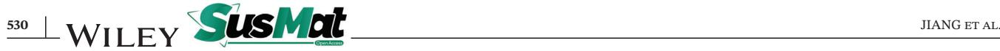

- 80. Yang S, Xu X, Cheng X, et al. Columnar lithium metal deposits: the role of non-aqueous electrolyte additive. *Acta Phys-Chim Sin*. 2021;37(1):2007058.
- 81. Li C, Liu S, Shi C, et al. Two-dimensional molecular brushfunctionalized porous bilayer composite separators toward ultrastable high-current density lithium metal anodes. *Nat Commun*. 2019;10(1):1363.
- 82. Hao Z, Wu Y, Zhao Q, et al. Functional separators regulating ion transport enabled by metal-organic frameworks for dendrite-free lithium metal anodes. *Adv Funct Mater*. 2021;31(33):2102938.
- 83. Tang Z, Li S, Li Y, et al. Lithium metal electrode protected by stiff and tough self-compacting separator. *Nano Energy*. 2020;69:104399.
- 84. Li P, Lv H, Li Z, et al. The electrostatic attraction and catalytic effect enabled by ionic-covalent organic nanosheets on mxene for separator modification of lithium-sulfur batteries. *Adv Mater*. 2021;33(17):2007803.
- 85. Du Y, Liu C, Liu Y, Han Q, Chi X, Liu Y. Carbon fiber micron film guided uniform plating/stripping of metals: a universal approach for highly stable metal batteries. *Electrochim Acta*. 2020;339:135867.
- 86. Xiao J, Zhai P, Wei Y, et al. In-situ formed protecting layer from organic/inorganic concrete for dendrite-free lithium metal anodes. *Nano Lett*. 2020;20(5):3911-3917.
- 87. Liu Q, Han X, Dou Q, et al. Multiphase and multicomponent nickel-iron oxide heterostructure as an efficient separator modification layer for advanced lithium sulfur batteries. *Batter Supercap*. 2021;4:1-8.
- 88. Becking J, Gröbmeyer A, Kolek M, et al. Lithium-metal foil surface modification: an effective method to improve the cycling performance of lithium-metal batteries. *Adv Mater Interfaces*. 2017;4(16):1700166.
- 89. Zhen S, Huang J, Peng L, et al. A pitaya-like Co-800@kj nanocomposite as separator coating for high-performance lithium–sulfur battery. *Energy Technol*. 2021;9(7):2001017.
- 90. Liu S, Xia X, Zhong Y, et al. 3D TiC/C core/shell nanowire skeleton for dendrite-free and long-life lithium metal anode. *Adv Energy Mater*. 2018;8(8):1702322.
- 91. Chen K-H, Sanchez AJ, Kazyak E, Davis AL, Dasgupta NP. Synergistic effect of 3D current collectors and ald surface modification for high coulombic efficiency lithium metal anodes. *Adv Energy Mater*. 2019;9(4):1802534.
- 92. Fu A, Wang C, Peng J, et al. Lithiophilic and antioxidative copper current collectors for highly stable lithium metal batteries. *Adv Funct Mater*. 2021;31(15):2009805.
- 93. Xu B, Zhai H, Liao X, et al. Porous insulating matrix for lithium metal anode with long cycling stability and high power. *Energy Storage Mater*. 2019;17:31-37.
- 94. Zhang T, Lu H, Yang J, et al. Stable lithium metal anode enabled by a lithiophilic and electron/ion conductive framework. *ACS Nano*. 2020;14(5):5618-5627.
- 95. Luo L, Li J, Yaghoobnejad Asl H, Manthiram A. A 3D lithiophilic Mo2N-modified carbon nanofiber architecture for dendrite-free lithium-metal anodes in a full cell. *Adv Mater*. 2019;31(48):1904537.
- 96. Li G, Xu S, Li B, et al. In-plane defect engineering enabling ultra-stable graphene paper-based hosts for lithium metal anodes. *ChemElectroChem*. 2021;8(17):3273-3281.
- 97. Bray JM, Doswell CL, Pavlovskaya GE, et al. Operando visualisation of battery chemistry in a sodium-ion battery by 23Na magnetic resonance imaging. *Nat Commun*. 2020;11(1):2083.
- 98. Yingxin Z, Peng S, Xueqiang Z, Junyu W, Qiankui Z, Jiaqi H. Recent progress of lithiophilic host for lithium metal anode. *Chem J Chinese U*. 2021;42(5):1569-1580.
- 99. Zhang X, Wang A, Liu X, Luo J. Dendrites in lithium metal anodes: suppression, regulation, and elimination. *Acc Chem Res*. 2019;52(11):3223-3232.
- 100. Xu X, Wang S, Wang H, et al. Recent progresses in the suppression method based on the growth mechanism of lithium dendrite. *J Energy Chem*. 2018;27(2):513-527.
- 101. Zhang X, Yang Y, Zhou Z. Towards practical lithium-metal anodes. *Chem Soc Rev*. 2020;49(10):3040-3071.
- 102. Boateng B, Zhang X, Zhen C, et al. Recent advances in separator engineering for effective dendrite suppression of Li-metal anodes. *Nano Select*. 2021;2(6):993-1010.
- 103. Zhao CZ, Chen PY, Zhang R, et al. An ion redistributor for dendrite-free lithium metal anodes. *Sci Adv*. 2018;4(11):eaat3446.
- 104. Li J, Kong Z, Liu X, et al. Strategies to anode protection in lithium metal battery: a review. *InfoMat*. 2021:1-31.
- 105. Zheng J, Kim MS, Tu Z, Choudhury S, Tang T, Archer LA. Regulating electrodeposition morphology of lithium: towards commercially relevant secondary Li metal batteries. *Chem Soc Rev*. 2020;49(9):2701-2750.
- 106. Shen X, Zhang R, Chen X, Cheng XB, Li X, Zhang Q. The failure of solid electrolyte interphase on Li metal anode: structural uniformity or mechanical strength? *Adv Energy Mater*. 2020;10(10):1903645.
- 107. Tang W, Yin X, Kang S, et al. Lithium silicide surface enrichment: a solution to lithium metal battery. *Adv Mater*. 2018;30(34):1801745.
- 108. Yuan S, Kong T, Zhang Y, et al. Advanced electrolyte design for high-energy-density Li-metal batteries under practical conditions. *Angew Chem Int Ed*. 2021;133:2-17.
- 109. Liu H, Cheng XB, Xu R, et al. Plating/stripping behavior of actual lithium metal anode. *Adv Energy Mater*. 2019;9(44):1902254.
- 110. Chen K-H, Wood KN, Kazyak E, et al. Dead lithium: mass transport effects on voltage, capacity, and failure of lithium metal anodes. *J Mater Chem A*. 2017;5(23):11671-11681.
- 111. Xu S, Chen K-H, Dasgupta NP, Siegel JB, Stefanopoulou AG. Evolution of dead lithium growth in lithium metal batteries: experimentally validated model of the apparent capacity loss. *J Electrochem Soc*. 2019;166(14):A3456-A3463.
- 112. Jiang Y, Wang Z, Xu C, et al. Atomic layer deposition for improved lithiophilicity and solid electrolyte interface stability during lithium plating. *Energy Storage Mater*. 2020;28:17- 26.
- 113. Liu Y, Xu X, Sadd M, et al. Insight into the critical role of exchange current density on electrodeposition behavior of lithium metal. *Adv Sci*. 2021;8(5):2003301.
- 114. Zhang M, Gui AL, Sun W, et al. High capacity utilization of Li metal anodes by application of celgard separatorreinforced ternary polymer electrolyte. *J Electrochem Soc*. 2019;166(10):A2142-A2150.
- 115. Tan L, Sun Y, Wei C, et al. Design of robust, lithiophilic, and flexible inorganic-polymer protective layer by

separator engineering enables dendrite-free lithium metal batteries with LiNi0.8Mn0.1Co0.1O2 cathode. *Small*. 2021;17(13): 2007717.

- 116. Ren XD, Niu CJ, Yu Lu, et al. Suppressing lithium dendrite growth by metallic coating on a separator. *Adv Funct Mater*. 2017;45(27):1704391.
- 117. Kolesnikov A, Kolek M, Dohmann JF, et al. Galvanic corrosion of lithium-powder-based electrodes. *Adv Energy Mater*. 2020;10(15):2000017.
- 118. Lin D, Liu Y, Li Y, et al. Fast galvanic lithium corrosion involving a kirkendall-type mechanism. *Nat Chem*. 2019;11(4):382- 389.
- 119. Anaman SY, Cho H-H, Das H, Baik S-I, Hong S-T, Lee J-S. Galvanic corrosion assessment of friction stir butt welded joint of aluminum and steel alloys. *Int J Pr Eng Man-GT* 2020;7:905-911.
- 120. Dohmann JF, Horsthemke F, Küpers V, et al. Galvanic couples in ionic liquid-based electrolyte systems for lithium metal batteries—an overlooked cause of galvanic corrosion? *Adv Energy Mater*. 2021;11(24):2101021.
- 121. Li Q, Wang Y, Mo F, et al. Calendar life of Zn batteries based on Zn anode with Zn powder/current collector structure. *Adv Energy Mater*. 2021;11(14):2003931.
- 122. Li W, Zheng H, Chu G, et al. Effect of electrochemical dissolution and deposition order on lithium dendrite formation: a top view investigation. *Faraday Discuss*. 2014;176:109-124.
- 123. Koo D, Kwon B, Lee J, Lee KT. Asymmetric behaviour of Li/Li symmetric cells for Li metal batteries. *Chem Commun*. 2019;55(65):9637-9640.
- 124. Spencer Jolly D, Ning Z, Darnbrough JE, et al. Sodium/Na *β*'' alumina interface: effect of pressure on voids. *ACS Appl Mater Interfaces*. 2020;12(1):678-685.
- 125. Wang MJ, Choudhury R, Sakamoto J. Characterizing the Lisolid-electrolyte interface dynamics as a function of stack pressure and current density. *Joule*. 2019;3(9):2165-2178.
- 126. He Y, Fan W, Zhang Y, et al. Understanding the relationships between morphology, solid electrolyte interphase composition, and coulombic efficiency of lithium metal. *ACS Appl Mater Interfaces*. 2020;12(19):22268-22277.
- 127. Wang H, Liu M, Wang X, et al. Self-smoothing Li-metal anode enabled via a hybrid interface film. *J Mater Chem A*. 2020;8:12045–12054.
- 128. Hwang J, Okada H, Haraguchi R, Tawa S, Matsumoto K, Hagiwara R. Ionic liquid electrolyte for room to intermediate temperature operating Li metal batteries: dendrite suppression and improved performance. *J Power Sources*. 2020;453:227911.
- 129. Gao LT, Guo Z-S. Effects of optimized electrode surface roughness and solid electrolyte interphase on lithium dendrite growth. *Energy Technol*. 2021;9(7):2000968.
- 130. Li X, Tian Y, Shen L, et al. Electrolyte interphase built from anionic covalent organic frameworks for lithium dendrite suppression. *Adv Funct Mater*. 2021;31(22):2009718.
- 131. Pei A, Zheng G, Shi F, Li Y, Cui Y. Nanoscale nucleation and growth of electrodeposited lithium metal. *Nano Lett*. 2017;17(2):1132-1139.
- 132. Zhang L, Zhu C, Yu S, Ge D, Zhou H. Status and challenges facing representative anode materials for rechargeable lithium batteries. *J Energy Chem*. 2022;66:260-294.
- 133. Kushima A, So KP, Su C, et al. Liquid cell transmission electron microscopy observation of lithium metal growth and dis-

solution: root growth, dead lithium and lithium flotsams. *Nano energy*. 2017;32:271-279.

- 134. Sacci RL, Dudney NJ, More KL, et al. Direct visualization of initial SEI morphology and growth kinetics during lithium deposition by in situ electrochemical transmission electron microscopy. *Chem Commun*. 2014;50(17):2104-2017.
- 135. Chang HJ, Ilott AJ, Trease NM, Mohammadi M, Jerschow A, Grey CP. Correlating microstructural lithium metal growth with electrolyte salt depletion in lithium batteries using7Li MRI. *J Am Chem Soc*. 2015;137(48):15209.
- 136. Li S, Jiang M, Xie Y, Xu H, Jia J, Li J. Developing highperformance lithium metal anode in liquid electrolytes: challenges and progress. *Adv Mater*. 2018;30(17):1706375.
- 137. Chazalviel J. Electrochemical aspects of the generation of ramified metallic electrodeposits. *Phys Rev A*. 1990;42(12):7355-7367.
- 138. Brissot C, Rosso M, Chazalviel J, Lascaudb S. In situ concentration cartography in the neighborhood of dendrites growing in lithium/polymer-electrolyte/lithium cells. *J Electrochem Soc*. 1999;142(12):4393–4400.
- 139. Brissot C, Rosso M, Chazalviel JN, Lascaud S. Concentration measurements in lithium/polymer–electrolyte/lithium cells during cycling. *J Power Sources*. 2001;94(2):212-218.
- 140. Su Y, Ye L, Fitzhugh W, et al. A more stable lithium anode by mechanical constriction for solid state batteries. *Energy Environ Sci*. 2020;13(3):908-916.
- 141. Kasemchainan J, Zekoll S, Spencer Jolly D, et al. Critical stripping current leads to dendrite formation on plating in lithium anode solid electrolyte cells. *Nat Mater*. 2019;18(10):1105-1111.
- 142. Rong G, Zhang X, Zhao W, et al. Liquid-phase electrochemical scanning electron microscopy for in situ investigation of lithium dendrite growth and dissolution. *Adv Mater*. 2017;29(13):1606187.
- 143. Niu S, Zhang S-W, Li D, et al. Sandwiched Li plating between lithiophilic-lithiophobic gradient silver@fullerene interphase layer for ultrastable lithium metal anodes. *Chem Eng J*. 2022;429:132156.
- 144. Fang C, Li J, Zhang M, et al. Quantifying inactive lithium in lithium metal batteries. *Nature*. 2019;572(7770):511-515.
- 145. Wang M, Wang J, Si J, Chen F, Cao K, Chen C. Bifunctional composite separator with redistributor and anion absorber for dendrites-free and fast-charging lithium metal batteries. *Chem Eng J*. 2022;430:132971.
- 146. Jo H, Song D, Jeong Y-C, Lee YM, Ryou M-H. Study on dead-Li suppression mechanism of Li-hosting vapor-grown-carbonnanofiber-based protective layer for Li metal anodes. *J Power Sources*. 2019;409:132-138.
- 147. Ma Y, Qi P, Ma J, et al. Wax-transferred hydrophobic CVD graphene enables water-resistant and dendrite-free lithium anode toward long cycle Li-air battery. *Adv Sci*. 2021;8(16):2100488.
- 148. Shen X, Zhang R, Wang S, et al. The dynamic evolution of aggregated lithium dendrites in lithium metal batteries. *Chinese J Chem Eng*. 2021;37:137–143.
- 149. Bai P, Li J, Brushett FR, Bazant MZ. Transition of lithium growth mechanisms in liquid electrolytes. *Energy Environ Sci*. 2016;9(10):3221-3229.
- 150. Mehdi BL, Qian J, Nasybulin E, et al. Observation and quantification of nanoscale processes in lithium batteries by operando electrochemical (S)TEM. *Nano Lett*. 2015;15(3):2168.

# **532** JIANG et al.

- 151. Gong C, Pu SD, Gao X, et al. Revealing the role of fluoride-rich battery electrode interphases by operando transmission electron microscopy. *Adv Energy Mater*. 2021;11(10):2003118.
- 152. Cohen YS, Cohen Y, Aurbach D. Micromorphological studies of lithium electrodes in alkyl carbonate solutions using in situ atomic force microscopy. *J Phys Chem B*. 2000;104(51):12282- 12291.
- 153. Xu P, Lin X, Hu X, et al. High reversible Li plating and stripping by in-situ construction a multifunctional lithium-pinned array. *Energy Storage Mater*. 2020;28:188-195.
- 154. Li K, Zhu Z, Zhao R, et al. A stretchable ionic conductive elastomer for high-areal-capacity lithium-metal batteries. *Energy Environ. Mater.* 2021:1-7. <https://doi.org/10.1002/eem2.12181>
- 155. Li T, Zhang XQ, Yao N, et al. Stable anion-derived solid electrolyte interphase in lithium metal batteries. *Angew Chem Int Ed*. 2021;60(42):22683-22687.
- 156. Cheng J-H, Assegie AA, Huang C-J, et al. Visualization of lithium plating and stripping via in operando transmission Xray microscopy. *J Phys Chem C*. 2017;121(14):7761-7766.
- 157. Xu C, Sun B, Gustafsson T, Edström K, Brandell D, Hahlin M. Interface layer formation in solid polymer electrolyte lithium batteries: an XPS study. *J Mater Chem A*. 2014;2(20):7256-7264.
- 158. Li H, Du Y, Wu X, Xie J, Lian F. Developing "polymerin-salt" high voltage electrolyte based on composite lithium salts for solid-state Li metal batteries. *Adv Funct Mater*. 2021;31(41):2103049.
- 159. Wang X, Zhang M, Alvarado J, et al. New insights on the structure of electrochemically deposited lithium metal and its solid electrolyte interphases via Cryogenic TEM. *Nano Lett* 2017;17(12):7606-7612.
- 160. Chen M, Zheng J, Liu Y, et al. Marrying ester group with lithium salt: cellulose-acetate-enabled LiF-enriched interface for stable lithium metal anodes. *Adv Funct Mater*. 2021;31(36):2102228.
- 161. Lee H, Chen S, Ren X, et al. Electrode edge effects and the failure mechanism of lithium-metal batteries. *ChemSusChem*. 2018;11(21):3821-3828.
- 162. Wandt J, Jakes P, Granwehr J, Eichel R-A, Gasteiger HA. Quantitative and time-resolved detection of lithium plating on graphite anodes in lithium ion batteries. *Mater Today*. 2018;21(3):231-240.
- 163. Tewari D, Rangarajan SP, Balbuena PB, Barsukov Y, Mukherjee PP. Mesoscale anatomy of dead lithium formation.*J Phys Chem C*. 2020;124(12):6502-6511.
- 164. Hao F, Verma A, Mukherjee PP. Mesoscale complexations in lithium electrodeposition. *ACS Appl Mater Interfaces*. 2018;10(31):26320-26327.
- 165. Jackle M, Gross A. Microscopic properties of lithium, sodium, and magnesium battery anode materials related to possible dendrite growth. *J Chem Phys*. 2014;141(17):174710.
- 166. Mehrer H. *Diffusion in solids, fundamentals, methods, materials, diffusion-controlled processes*. Springer-Verlag; 2007.
- 167. Wu C, Huang H, Lu W, et al. Mg doped Li-LiB alloy with in situ formed lithiophilic LiB skeleton for lithium metal batteries. *Adv Sci*. 2020;7(6):1902643.
- 168. Ye H, Zheng ZJ, Yao HR, et al. Guiding uniform Li plating/stripping through lithium-aluminum alloying medium for long-life Li metal batteries. *Angew Chem Int Ed*. 2019;58(4):1094-1099.
- 169. Gao J, Chen C, Dong Q, et al. Stamping flexible Li alloy anodes. *Adv Mater*. 2021;33(11):2005305.
- 170. Gao P, Wu H, Zhang X, et al. Optimization of magnesiumdoped lithium metal anode for high performance lithium metal batteries through modeling and experiment. *Angew Chem Int Ed*. 2021;60(30):16506-16513.
- 171. Wieland O, Carstanjen HD. Measurement of the lowtemperature self-diffusivity of lithium by elastic recoil detection analysis. *Defect Diffus Forum*. 2001;194:35- 42.
- 172. Lodding A, Mundy JN, Ott A. Isotope inter-diffusion and selfdiffusion in solid lithium metal. *Phys Status Solidi*. 1970;38:559– 569.
- 173. Messer R, Noack F. Nuclear magnetic relaxationby selfdiffusion in solid lithium T1-frequency dependence. *Appl Phys*. 1975;6:79–88.
- 174. Dologlou E. Self-diffusion in solid lithium. *Glass Phys Chem*+. 2010;36(5):570-574.
- 175. Wang M, Wolfenstine JB, Sakamoto J. Temperature dependent flux balance of the Li/Li7La3Zr2O12 interface. *Electrochim Acta*. 2019;296:842-847.
- 176. Eftaxias K, Grammatikakis J, Varotsos P. Correlation between the self-diffusion coefficient of lithium and the equation of state. *Phys Rev B Condens Matter*. 1985;32(8):5462-5463.
- 177. Bard AJ. *Electrochemical methods: fundamentals and applications*. John Wiley & Sons; 2001.
- 178. Tao R, Bi X, Li S, et al. Kinetics tuning the electrochemistry of lithium dendrites formation in lithium batteries through electrolytes. *ACS Appl Mater Interfaces*. 2017;9(8):7003-7008.
- 179. Akolkar R. Mathematical model of the dendritic growth during lithium electrodeposition. *J Power Sources*. 2013;232:23-28.
- 180. Sun Y, Zhou J, Ji H, Liu J, Qian T, Yan C. Single-atom iron as lithiophilic site to minimize lithium nucleation overpotential for stable lithium metal full battery. *ACS Appl Mater Interfaces*. 2019;11(35):32008-32014.
- 181. Li XL, Huang S, Yan D, et al. Tuning lithiophilicity and stability of 3D conductive scaffold via covalent Ag-S bond for highperformance lithium metal anode. *Energy Environ. Mater.* 2021. [https://doi.org/10.1002/eem2.12274.](https://doi.org/10.1002/eem2.12274)
- 182. Yuan C, Lu W, Xu J. Unlocking the electrochemical– mechanical coupling behaviors of dendrite growth and crack propagation in all-solid-state batteries. *Adv Energy Mater*. 2021;11(36):2101807.
- 183. Peled E. The electrochemical behavior of alkali and alkaline earth metals in nonaqueous battery systems-the solid electrolyte interphase model. *J Electrochem Soc*. 1979;126(12):2047- 2051.
- 184. Cheng X-B, Yan C, Zhang X-Q, Liu H, Zhang Q. Electronic and ionic channels in working interfaces of lithium metal anodes. *ACS Energy Lett*. 2018;3(7):1564-1570.
- 185. Huang Z, Ren J, Zhang W, et al. Protecting the Li-metal anode in a Li-O2 battery by using boric acid as an SEI-forming additive. *Adv Mater*. 2018;30(39):1803270.
- 186. Sun HH, Dolocan A, Weeks JA., Rodriguez R, Heller A, C. Mullins B. In situ formation of a multicomponent inorganicrich SEI layer provides a fast charging and high specific energy Li-metal batter. *J Mater Chem A*. 2019;7:17782-17789.
- 187. Xu R, Cheng X-B, Yan C, et al. Artificial interphases for highly stable lithium metal anode. *Matter*. 2019;1(2):317-344.
- 188. Chen Y, Mao Y, Hao X, Cao Y, Wang W. A stable fluorinecontaining solid electrolyte interface toward dendrite-free lithium-metal anode for lithium-sulfur batteries. *ChemElectroChem*. 2021;8(8):1500-1506.
- 189. Lee D, Sun S, Kim C, et al. Highly reversible cycling with dendrite-free lithium deposition enabled by robust SEI layer with low charge transfer activation energy. *Appl Surf Sci*. 2022;572:151439.
- 190. Ding JF, Xu R, Yao N, et al. Non-solvating and low-dielectricity cosolvent for anion-derived solid electrolyte interphases in lithium metal batteries. *Angew Chem Int Ed*. 2021;60(20):11442- 11447.
- 191. Dey A. Film formation on lithium anode in propylene carbonate. *J Electrochem Soc*. 1970;117:C248.
- 192. Xu R, Yan C, Xiao Y, Zhao M, Yuan H, Huang J-Q. The reduction of interfacial transfer barrier of Li ions enabled by inorganics-rich solid-electrolyte interphase. *Energy Storage Mater*. 2020;28:401-406.
- 193. Efaw CM, Lu B, Lin Y, et al. A closed-host bi-layer dense/porous solid electrolyte interphase for enhanced lithium-metal anode stability. *Mater Today*. 2021;49:48–58. [https://doi.org/10.1016/j.mattod.2021.04.018.](https://doi.org/10.1016/j.mattod.2021.04.018)
- 194. Peled E, Golodnitsky D, Ardel G. Advanced model for solid electrolyte interphase electrodes in liquid and polymer electrolytes. *J Electrochem Soc*. 1997;144(8):L208-L210.
- 195. Yan C, Yuan H, Park HS, Huang J-Q. Perspective on the critical role of interface for advanced batteries. *J Energy Chem*. 2020;47:217-220.
- 196. Li Y, Huang W, Li Y, Pei A, Boyle DT, Cui Y. Correlating structure and function of battery interphases at atomic resolution using cryoelectron microscopy. *Joule*. 2018;2(10):2167- 2177.
- 197. Harris OC, Lin Y, Qi Y, Leung K, Tang MH. How transition metals enable electron transfer through the SEI: part I. Experiments and Butler-Volmer modeling. *J Electrochem Soc*. 2019;167(1):013502.
- 198. Mozhzhukhina N, Flores E, Lundstrom R, et al. Direct operando observation of double layer charging and early solid electrolyte interphase formation in Li-ion battery electrolytes. *J Phys Chem Lett*. 2020;11(10):4119-4123.
- 199. Zhou Y, Su M, Yu X, et al. Real-time mass spectrometric characterization of the solid-electrolyte interphase of a lithium-ion battery. *Nat Nanotechnol*. 2020;15(3):224-230.
- 200. Shi S, Lu P, Liu Z, et al. Direct calculation of li-ion transport in the solid electrolyte interphase. *J Am Chem Soc*. 2012;134(37):15476-15487.
- 201. Yan C, Xu R, Xiao Y, et al. Toward critical electrode/electrolyte interfaces in rechargeable batteries. *Adv Funct Mater*. 2020;30(23):1909887.
- 202. Camacho-Forero LE, Balbuena PB. Exploring interfacial stability of solid-state electrolytes at the lithium-metal anode surface. *J Power Sources*. 2018;396:782-790.
- 203. Liu H, Li T, Xu X, et al. Stable interfaces constructed by concentrated ether electrolytes to render robust lithium metal batteries. *Chinese J Chem Eng*. 2021;37:152–158.
- 204. Yang T, Li S, Wang W, et al. Nonflammable functional electrolytes with all-fluorinated solvents matching rechargeable high-voltage Li-metal batteries with Ni-rich ternary cathode. *J Power Sources*. 2021;505:230055.
- 205. Xu W, Wang J, Ding F, et al. Lithium metal anodes for rechargeable batteries. *Energy Environ Sci*. 2014;7(2):513-537.
- 206. Li T, Zhang X-Q, Shi P, Zhang Q. Fluorinated solid-electrolyte interphase in high-voltage lithium metal batteries. *Joule*. 2019;3(11):2647-2661.
- 207. Liu S, Ma Y, Wang J, et al. Regulating Li deposition by constructing homogeneous LiF protective layer for highperformance Li metal anode. *Chem Eng J*. 2022;427:131625.
- 208. Zhao K, Jin Q, Zhang L, Li L, Wu L, Zhang X. Achieving dendrite-free lithium deposition on the anode of lithium– sulfur battery by LiF-rich regulation layer. *Electrochim Acta*. 2021;393:138981.
- 209. Kamphaus EP, Angarita-Gomez S, Qin X, et al. Role of inorganic surface layer on solid electrolyte interphase evolution at Li-metal anodes. *ACS Appl Mater Interfaces*. 2019;11(34):31467- 31476.
- 210. Meyerson Melissa L, Sheavly JK, Dolocan A, et al. The effect of local lithium surface chemistry and topography on solid electrolyte interphase composition and dendrite nucleation. *J Mater Chem A*. 2019;7(24):14882-14894.
- 211. Cheng XB, Zhang R, Zhao CZ, Wei F, Zhang JG, Zhang Q. A review of solid electrolyte interphases on lithium metal anode. *Adv Sci*. 2016;3(3):1500213.
- 212. Peter Amalathas A, Landová L, Conrad B, Holovský J. Concentration-dependent impact of alkali Li metal doped mesoporous TiO2 electron transport layer on the performance of CH3NH3PBI3 perovskite solar cells. *J Phys Chem C*. 2019;123(32):19376-19384.
- 213. Park M, Kim J-Y, Son HJ, Lee C-H, Jang SS, Ko MJ. Lowtemperature solution-processed Li-doped SnO2 as an effective electron transporting layer for high-performance flexible and wearable perovskite solar cells. *Nano Energy*. 2016;26: 208-215.
- 214. Yang CP, Yin YX, Zhang SF, Li NW, Guo YG. Accommodating lithium into 3D current collectors with a submicron skeleton towards long-life lithium metal anodes. *Nat Commun*. 2015;6:8058.
- 215. Song H, He T, Liu J, et al. Conformal coating of lithiumzinc alloy on 3D conducting scaffold for high areal capacity dendrite-free lithium metal batteries. *Carbon*. 2021;181:99-106.
- 216. Hoffman DW, Cahn JW. A vector thermodynamics for anisotropic surfaces. *Surf Sci*. 1972;31:368-388.
- 217. Nakafuji K, Koyama M, Tsuzaki K. In-situ electron channeling contrast imaging under tensile loading: residual stress, dislocation motion, and slip line formation. *Sci Rep*. 2020;10(1):2622.
- 218. Xiong G-J, Chen J-J, Wang J-H, Li M-G. New axisymmetric slipline theory for metal and its application in indentation problem. *J Eng Mech*. 2019;145(12):04019099.
- 219. Wang J, Zhao Y, Zhou W, Zhao Q, Huang S, Zeng W. Insitu investigation on tensile deformation and fracture behaviors of a new metastable *β* titanium alloy. *Mater Sci Eng: A*. 2021;799:140187.
- 220. Wang J, Zhao Y, Zhou W, Zhao Q, Lei C, Zeng W. In-situ study on tensile deformation and damage evolution of metastable *β* titanium alloy with lamellar microstructure. *Mater Sci Eng: A*. 2021;824:141790.
- 221. Vuillemin B, Philippe X, Oltra R, et al. SVEN, AFM and AES study of pitting corrosion initiated on MnS inclusions by microinjection. *Corros Sci*. 2003;45(6):1143-1159.

## **534** JIANG et al.

- 222. Gireaud L, Grugeon S, Laruelle S, Yrieix B, Tarascon JM. Lithium metal stripping/plating mechanisms studies: a metallurgical approach. *Electrochem Commun*. 2006;8(10):1639-1649.
- 223. Shi F, Pei A, Boyle DT, et al. Lithium metal stripping beneath the solid electrolyte interphase. *Proc Natl Acad Sci USA*. 2018;115(34):8529-8534.
- 224. Varshney P, Chhangani S, Prasad MJNV, Pati S, Gollapudi S. Effect of grain boundary relaxation on the corrosion behaviour of nanocrystalline Ni-P alloy. *J Alloy Compd*. 2020;830:154616.
- 225. Lodding A, Mundy JN, Ott A. Isotope inter-diffusion and self-diffusion in solid lithium metal. *Phys Status Solidi B*. 1970;38(2):559-569.
- 226. Parekh MN, Rahn CD, Archer LA. Controlling dendrite growth in lithium metal batteries through forced advection. *J Power Sources*. 2020;452:227760.
- 227. Geng D, Ding N, Hor TSA, et al. From lithium-oxygen to lithium-air batteries: challenges and opportunities. *Adv Energy Mater*. 2016;6(9):1502164.
- 228. Lin D, Liu Y, Chen W, et al. Conformal lithium fluoride protection layer on three-dimensional lithium by nonhazardous gaseous reagent freon. *Nano Lett* 2017;17(6):3731-3737.
- 229. Zhao J, Liao L, Shi F, et al. Surface fluorination of reactive battery anode materials for enhanced stability. *J Am Chem Soc*. 2017;139(33):11550-11558.
- 230. Steiger J, Kramer D, Mönig R. Mechanisms of dendritic growth investigated by in situ light microscopy during electrodeposition and dissolution of lithium. *J Power Sources*. 2014;261:112- 119.
- 231. Sun F, Zielke L, Markotter H, et al. Morphological evolution of electrochemically plated/stripped lithium microstructures investigated by synchrotron X-ray phase contrast tomography. *ACS Nano*. 2016;10(8):7990-7.
- 232. Huang W, Wang H, Boyle DT, Li Y, Cui Y. Resolving nanoscopic and mesoscopic heterogeneity of fluorinated species in battery solid-electrolyte interphases by cryogenic electron microscopy. *ACS Energy Lett*. 2020;5(4):1128-1135.
- 233. Li S, Zhang W, Wu Q, et al. Synergistic dual-additives electrolyte enables practical lithium metal batteries. *Angew Chem Int Ed*. 2020;59:14935–14941.
- 234. Han B, Li X, Bai S, et al. Conformal three-dimensional interphase of Li metal anode revealed by low-dose cryoelectron microscopy. *Matter*. 2021;4:1-12.
- 235. Vilá RA, Huang W, Cui Y. Nickel impurities in the solidelectrolyte interphase of lithium-metal anodes revealed by cryogenic electron microscopy. *Cell Reports Physical Science*. 2020;1(9):100188.
- 236. Zhang Y, Heim FM, Song N, Bartlett JL, Li X. New insights into mossy Li induced anode degradation and its formation mechanism in Li–S batteries. *ACS Energy Lett*. 2017;2(12):2696-2705.
- 237. Shi P, Cheng X B, Li T, et al. Electrochemical diagram of an ultrathin lithium metal anode in pouch cells. *Adv. Mater.* 2019, 31, 1902785.
- 238. Maslyn JA, Loo WS, McEntush KD, et al. Growth of lithium dendrites and globules through a solid block copolymer electrolyte as a function of current density. *J Phys Chem C*. 2018;122(47):26797-26804.
- 239. Aslam MK, Niu Y, Hussain T, et al. How to avoid dendrite formation in metal batteries: innovative strategies for dendrite suppression. *Nano energy*. 2021;86:106142.
- 240. Wang Y, Huang K, Zhang P, Li H, Mi H. PVDF-HFP based polymer electrolytes with high Li+ transference number enhancing the cycling performance and rate capability of lithium metal batteries. *Appl Surf Sci*. 2021;574:151593.
- 241. Wu MS, Xu B, Luo WW, Sun BZ, Ouyang CY. Interfacial properties and Li-ion dynamics between Li3OCl solid electrolyte and Li metal anode for all solid state Li metal batteries from first principles study. *Electrochim Acta*. 2020;334:135622.
- 242. Liu Q, Cresce A, Schroeder M, et al. Insight on lithium metal anode interphasial chemistry: reduction mechanism of cyclic ether solvent and SEI film formation. *Energy Storage Mater*. 2019;17:366-373.
- 243. Sagane F, Shimokawa R, Sano H, Sakaebe H, Iriyama Y. In-situ scanning electron microscopy observations of Li plating and stripping reactions at the lithium phosphorus oxynitride glass electrolyte/Cu interface. *J Power Sources*. 2013;225:245-250.
- 244. Zheng J, Yan P, Mei D, et al. Highly stable operation of lithium metal batteries enabled by the formation of a transient high-concentration electrolyte layer. *Adv Energy Mater*. 2016;6(8):1502151.
- 245. Jiao S, Zheng J, Li Q, et al. Behavior of lithium metal anodes under various capacity utilization and high current density in lithium metal batteries. *Joule*. 2018;2(1):110-124.
- 246. Zou P, Chiang SW, Zhan H, et al. A periodic "self-correction" scheme for synchronizing lithium plating/stripping at ultrahigh cycling capacity. *Adv Funct Mater*. 2020;30(21):1910532.
- 247. Maraschky A, Akolkar R. Temperature dependence of dendritic lithium electrodeposition: a mechanistic study of the role of transport limitations within the SEI. *J Electrochem Soc*. 2020;167(6):062503.
- 248. Sano H, Kitta M, Shikano M, Matsumoto H. Effect of temperature on Li electrodeposition behavior in room-temperature ionic liquids comprising quaternary ammonium cation. *J Electrochem Soc*. 2019;166(13):A2973-A2979.
- 249. Yu J, Liu J, Lin X, et al. A solid-like dual-salt polymer electrolyte for Li-metal batteries capable of stable operation over an extended temperature range. *Energy Storage Mater*. 2021;37:609-618.
- 250. Zheng T, Xiong J, Shi X, et al. Cocktail therapy towards high temperature/high voltage lithium metal battery via solvation sheath structure tuning. *Energy Storage Mater*. 2021;38:599-608.
- 251. Monroe C, Newman J. Dendrite growth in lithium/polymer systems. *J Electrochem Soc*. 2003;150(10):A1377-A1384.
- 252. Kato Y, Hori S, Saito T, et al. High-power all-solid-state batteries using sulfide superionic conductors. *Nat Energy*. 2016;1(4):16030.
- 253. Gao J, Shao Q, Chen J. Lithiated Nafion-garnet ceramic composite electrolyte membrane for solid-state lithium metal battery. *J Energy Chem*. 2020;46:237-247.
- 254. Gao L, Luo S, Li J, Cheng B, Kang W, Deng N. Coreshell structure nanofibers-ceramic nanowires based composite electrolytes with high Li transference number for highperformance all-solid-state lithium metal batteries. *Energy Storage Mater*. 2021;43:266-274.
- 255. Wang R, Dong Q, Wang C, et al. High-temperature ultrafast sintering: exploiting a new kinetic region to fabricate porous solidstate electrolyte scaffolds. *Adv Mater*. 2021;33(34):2100726.
- 256. Yonemoto F, Nishimura A, Motoyama M, Tsuchimine N, Kobayashi S, Iriyama Y. Temperature effects on cycling

stability of Li plating/stripping on Ta-doped Li7La3Zr2O12. *J Power Sources*. 2017;343:207-215.

- 257. Genovese M, Louli AJ, Weber R, Martin C, Taskovic T, Dahn JR. Hot formation for improved low temperature cycling of anode-free lithium metal batteries. *J Electrochem Soc*. 2019;166(14):A3342-A3347.
- 258. LePage WS, Chen Y, Kazyak E, et al. Lithium mechanics: roles of strain rate and temperature and implications for lithium metal batteries. *J Electrochem Soc*. 2019;166(2):A89-A97.
- 259. Golozar M, Hovington P, Paolella A, et al. In situ scanning electron microscopy detection of carbide nature of dendrites in Lipolymer batteries. *Nano Lett*. 2018;18(12):7583-7589.
- 260. Hu R, Qiu H, Zhang H, et al. A polymer-reinforced SEI layer induced by a cyclic carbonate-based polymer electrolyte boosting 4.45 V LiCoO2/Li metal batteries. *Small*. 2020;16(13):1907163.
- 261. Guo W, Shen F, Liu J, et al. In-situ optical observation of Li growth in garnet-type solid state electrolyte. *Energy Storage Mater*. 2021;41:791-797.
- 262. Charles Monroe JN. The impact of elastic deformation on deposition kinetics at lithium polymer interfaces.*J Electrochem Soc*. 2005;152(2):A396-A404
- 263. Ahmad Z, Viswanathan V. Stability of electrodeposition at solid-solid interfaces and implications for metal anodes. *Phys Rev Lett*. 2017;119(5):056003.
- 264. Wang X, Zeng W, Hong L, et al. Stress-driven lithium dendrite growth mechanism and dendrite mitigation by electroplating on soft substrates. *Nat Energy*. 2018;3(3):227-235.
- 265. Jana A, Woo SI, Vikrant KSN, García RE. Electrochemomechanics of lithium dendrite growth. *Energy Environ Sci*. 2019;12(12):3595-3607.
- 266. Tang C-Y, Dillon SJ. In situ scanning electron microscopy characterization of the mechanism for Li dendrite growth. *J Electrochem Soc*. 2016;163(8):A1660-A1665.
- 267. Qi L, Shang L, Wu K, et al. An interfacial layer based on polymers of intrinsic microporosity to suppress dendrite growth on Li metal anodes. *Chem Eur J*. 2019;25(52):12052-12057.
- 268. R. D. Armstrong TD, J. Turner. The breakdown of *β*-alumina ceramic electrolyte. *Electrochim Acta*. 1974;19:187-192.
- 269. Kim S, Choi SJ, Zhao K, et al. Electrochemically driven mechanical energy harvesting. *Nat Commun*. 2016;7:10146.
- 270. Chen Y, Wang Z, Li X, et al. Li metal deposition and stripping in a solid-state battery via coble creep. *Nature*. 2020;578(7794):251- 255.
- 271. Wang Y, Dang D, Xiao X, Cheng Y-T. Structure and mechanical properties of electroplated mossy lithium: effects of current density and electrolyte. *Energy Storage Mater*. 2020;26: 276-282.
- 272. Yin X, Tang W, Jung ID, et al. Insights into morphological evolution and cycling behaviour of lithium metal anode under mechanical pressure. *Nano Energy*. 2018;50:659-664.
- 273. Gao L, Li J, Ju J, et al. Designing of root-soil-like polyethylene oxide-based composite electrolyte for dendrite-free and long-cycling all-solid-state lithium metal batteries. *Chem Eng J*. 2020;389:124478.
- 274. Zhang Q-K, Zhang X-Q, Yuan H, Huang J-Q. Thermally stable and nonflammable electrolytes for lithium metal batteries: progress and perspectives. *Small Science*. 2021;1(10):2100058.
- 275. Wang Y, Liu T, Kumar J. Effect of pressure on lithium metal deposition and stripping against sulfide-based solid electrolytes. *ACS Appl Mater Interfaces*. 2020;12(31):34771–34776
- 276. Egerton RF, Li P, Malac M. Radiation damage in the tem and sem. *Micron*. 2004;35(6):399-409.
- 277. Simon FJ, Hanauer M, Henss A, Richter FH, Janek J. Properties of the interphase formed between argyrodite-type Li6PS5Cl and polymer-based PEO10:LiTFSI. *ACS Appl Mater Interfaces*. 2019;11(45):42186-42196.
- 278. Bintang HM, Lee S, Shin S, et al. Stabilization effect of solidelectrolyte interphase by electrolyte engineering for advanced Li-ion batteries. *Chem Eng J*. 2021;424:130524.
- 279. Huang Z, Meng J, Zhang W, Shen Y, Huang Y. 1,3-dimethyl-2-imidazolidinone: an ideal electrolyte solvent for highperformance Li–O2 battery with pretreated Li anode. *Sci Bull*. 2021. [https://doi.org/10.1016/j.scib.2021.09.015.](https://doi.org/10.1016/j.scib.2021.09.015)
- 280. Qiu F, Ren S, Mu X, et al. Towards a stable Li–CO2 battery: the effects of CO2 to the Li metal anode. *Energy Storage Mater*. 2020;26:443-447.
- 281. Hwang J-Y, Park S-J, Yoon CS, Sun Y-K. Customizing a Li–metal battery that survives practical operating conditions for electric vehicle applications. *Energy Environ Sci*. 2019;12(7):2174-2184.
- 282. Deng T, Cao L, He X, et al. In situ formation of polymerinorganic solid-electrolyte interphase for stable polymeric solid-state lithium-metal batteries. *Chem*. 2021;7:3052–3068.
- 283. Hope MA, Rinkel BLD, Gunnarsdottir AB, et al. Selective nmr observation of the SEI-metal interface by dynamic nuclear polarisation from lithium metal. *Nat Commun*. 2020;11(1): 2224.
- 284. Schweikert N, Hofmann A, Schulz M, et al. Suppressed lithium dendrite growth in lithium batteries using ionic liquid electrolytes: investigation by electrochemical impedance spectroscopy, scanning electron microscopy, and in situ 7Li nuclear magnetic resonance spectroscopy. *J Power Sources*. 2013;228:237-243.
- 285. Kang D, Hart N, Koh J, et al. Rearrange SEI with artificial organic layer for stable lithium metal anode. *Energy Storage Mater*. 2020;24:618-625.
- 286. Jurng S, Brown ZL, Kim J, Lucht BL. Effect of electrolyte on the nanostructure of the solid electrolyte interphase (SEI) and performance of lithium metal anodes. *Energy Environ Sci*. 2018;11(9):2600-2608.
- 287. Zhang Y, Krishnamurthy D, Viswanathan V. Engineering solid electrolyte interphase composition by assessing decomposition pathways of fluorinated organic solvents in lithium metal batteries. *J Electrochem Soc*. 2020;167(7):070554.
- 288. Hekmatfar M, Hasa I, Eghbal R, Carvalho DV, Moretti A, Passerini S. Effect of electrolyte additives on the LiNi0.5Mn0.3Co0.2O2surface film formation with lithium and graphite negative electrodes. *Adv Mater Interfaces*. 2019;7(1):1901500.
- 289. Xu W, Liao X, Xu W, et al. Gradient SEI layer induced by liquid alloy electrolyte additive for high rate lithium metal battery. *Nano Energy*. 2021;88:106237.
- 290. Zhao R, Li X, Si Y, Tang S, Guo W, Fu Y. Cu(NO3)2 as efficient electrolyte additive for 4 V class Li metal batteries with ultrahigh stability. *Energy Storage Mater*. 2021;37:1-7.

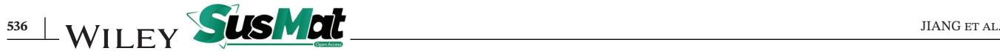

- 291. Zachman MJ, Tu Z, Choudhury S, Archer LA, Kourkoutis LF. Cryo-stem mapping of solid-liquid interfaces and dendrites in lithium-metal batteries. *Nature*. 2018;560(7718):345-349.
- 292. Kimura Y, Tomura A, Fakkao M, et al. 3D operando imaging and quantification of inhomogeneous electrochemical reactions in composite battery electrodes. *J Phys Chem Lett*. 2020;11(9):3629-3636.
- 293. Hou TZ, Xu WT, Chen X, Peng HJ, Huang JQ, Zhang Q. Lithium bond chemistry in lithium-sulfur batteries. *Angew Chem Int Ed*. 2017;56(28):8178-8182.
- 294. Yoon G, Moon S, Ceder G, Kang K. Deposition and stripping behavior of lithium metal in electrochemical system: continuum mechanics study. *Chem Mater*. 2018;30(19):6769-6776.
- 295. Chen X, Bai YK, Zhao CZ, Shen X, Zhang Q. Lithium bonds in lithium batteries. *Angew Chem Int Ed*. 2020;59:2-6.
- 296. Yang W, Xiao J, Ma Y, et al. Tin intercalated ultrathin MoO3 nanoribbons for advanced lithium-sulfur batteries. *Adv Energy Mater*. 2019;9(7):1803137.
- 297. Zhang Y, Wang R, Tang W, et al. Efficient polysulfide barrier of a graphene aerogel–carbon nanofibers–Ni network for highenergy-density lithium–sulfur batteries with ultrahigh sulfur content. *J Mater Chem A*. 2018;6(42):20926-20938.

#### **AUTHOR BIOGRAPH IES**

**Fengni Jiang** is studying for her doctor's degree in Taiyuan University of technology. Currently, she is a visiting student in Prof. Qiang Zhang's team at Tsinghua University. Her research focuses on the safety problems of Lithium metal

batteries, including their causes and the solutions.

**Xin-Bing Cheng** received his BEng from Tianjin University in 2012 and PhD from Tsinghua University in 2017 under the guidance of Prof. Qiang Zhang. In 2016, he was a visiting student in Prof. Yury Gogotsi's team at Drexel University. He worked as a postdoctor from 2017 to 2020 and research assistant professor from 2020 to 2021 at Tsinghua University. He is currently a Full Professor at Southeast University. His current research interests are mainly focused on energy storage materials and devices, including nanocarbon materials, LiS batteries, and dendrite suppression of Li metal anode.

**Lei Liu** graduated from University of Science and Technology Liaoning in 2001, and received his Ph.D. degree in Chemical Engineering and Technology from Taiyuan University of Technology (TYUT) in 2010. He currently serves as a professor at College of Chemistry and

Chemical Engineering of TYUT. His current interests focus on the synthesis of advanced materials and application, and the catalytic conversion of biomass and coal-based molecules towards high-valued chemicals.

**Jia-Qi Huang** received his B.E. (2007) and Ph.D. (2012) degrees in Chemical Engineering from Tsinghua University, China. He is currently a professor at Advanced Research Institute of Multidisciplinary Science (ARIMS), Beijing Institute of Technology. His

research interests focus on the chemistry in advanced energy storage/conversion materials, including LiS batteries, Li-metal anodes, etc.

**How to cite this article:** Jiang F-N, Yang S-J, Liu H, et al. Mechanism understanding for stripping electrochemistry of Li metal anode. *SusMat*. 2021;1:506–536. <https://doi.org/10.1002/sus2.37>