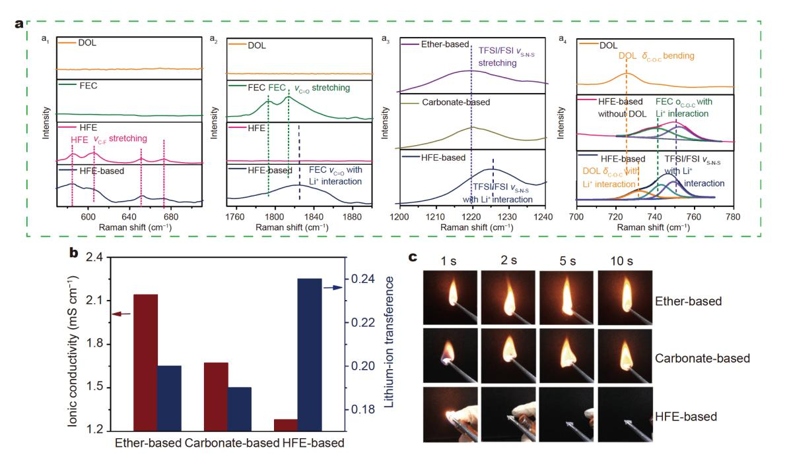
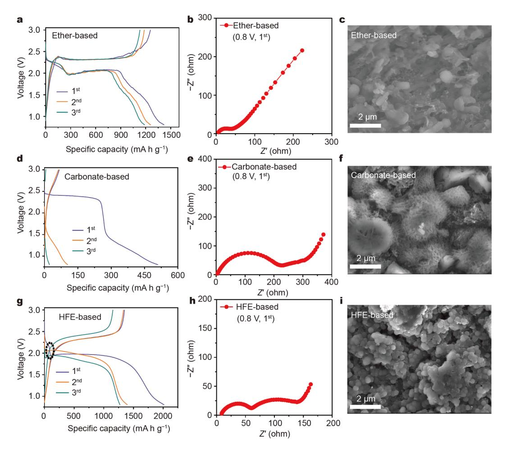
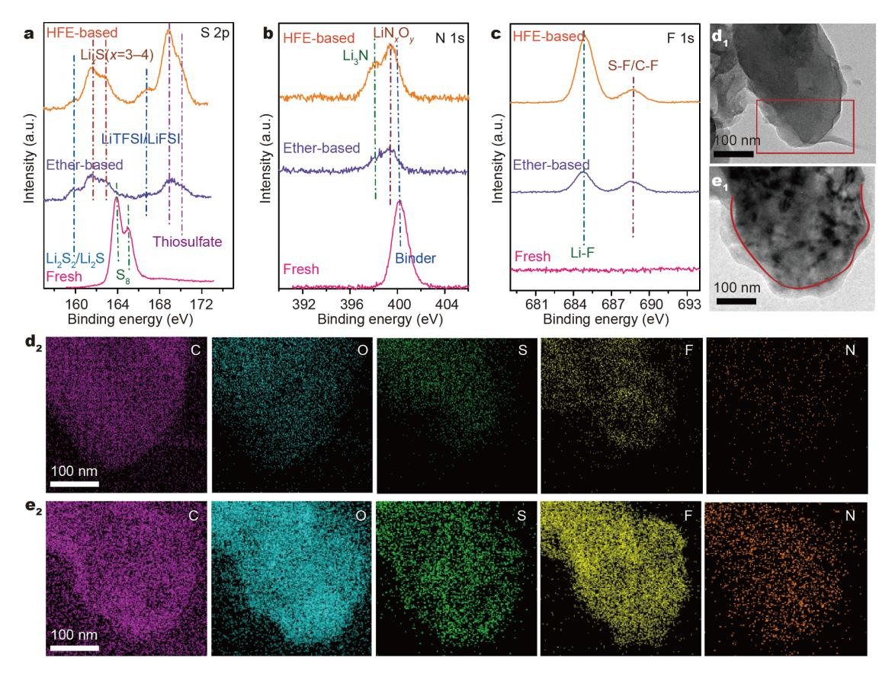
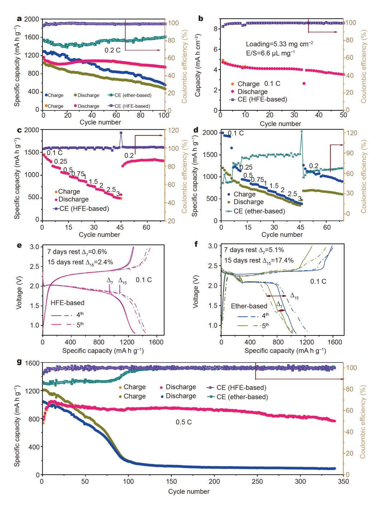
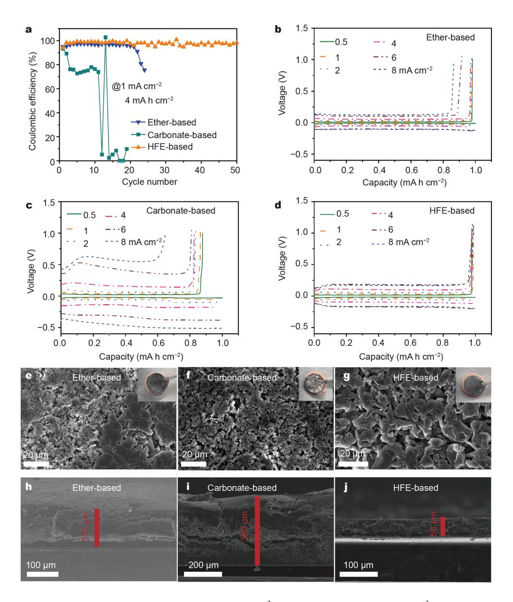

**[mater.scichina.com](http://mater.scichina.com) [link.springer.com](http://link.springer.com)** Published online 31 March 2021 | <https://doi.org/10.1007/s40843-020-1621-8> *Sci China Mater* 2[021,](http://crossmark.crossref.org/dialog/?doi=10.1007/s40843-020-1621-8&domain=pdf&date_stamp=2021-03-17) [64\(9\):](http://crossmark.crossref.org/dialog/?doi=10.1007/s40843-020-1621-8&domain=pdf&date_stamp=2021-03-17) [2127–2138](http://crossmark.crossref.org/dialog/?doi=10.1007/s40843-020-1621-8&domain=pdf&date_stamp=2021-03-17)

# *In situ* **protection of a sulfur cathode and a lithium anode** *via* **adopting a fluorinated electrolyte for stable lithium−sulfur batteries**

Xue Chen, Haijin Ji, Weilun Chen, Jingyi Wu, Fei Hu, Lixia Yuan, Zhen Li[\\*](#page-0-0) and Yunhui Huang[\\*](#page-0-0)

**ABSTRACT Lithium−sulfur (Li−S) batteries are regarded as one of the most promising next-generation energy storage systems due to their high theoretical energy density and low material cost. However, the conventional ether-based electrolytes of Li−S batteries are extremely flammable and have high solubility of lithium polysulfides (LiPS), resulting in a high safety risk and a poor life cycle. Herein, we report an ether/carbonate co-solvent fluorinated electrolyte with a special solvation sheath of Li**+ **, which can prevent the formation of dissoluble long-chain LiPS of the sulfur cathode, restrict Li dendrite growth at the anode side, and show fire resistance in combustion experiments. As a result, the proposed Li−S batteries with 70 wt% sulfur content in its cathode deliver stable life cycle, low self-discharge ratio, and intrinsic safety. Therefore, the unique passivation characteristics of the designed fluorinated electrolyte break several critical limitations of the traditional "liquid phase"-based Li−S batteries, offering a facile and promising way to develop long-life and high-safety Li−S batteries.**

**Keywords:** Li−S batteries, multifunctional electrolyte, solidphase sulfur conversion, Li metal anode

### **INTRODUCTION**

Lithium−sulfur (Li−S) batteries are regarded as a promising alternative candidate for next-generation energy storage systems due to their high theoretical energy density and low material cost [[1](#page-9-0),[2](#page-9-1)]. However, there are some formidable challenges that hinder the practical application of Li−S batteries. First, intermediate lithium polysulfides (LiPS; Li2S*x*, 4 ≤ *x* ≤ 8) have a high solubility in conventional ether-based electrolytes, leading to rapid loss of active sulfur species, low coulombic efficiency (CE) and corrosion of the lithium metal anode. Second, the uneven growth of lithium dendrites not only continuously consumes electrolytes, but also imperils the safety of the batteries. Third, the widely used solvents of Li−S batteries are 1,3-dioxolane (DOL) and 1,2-dimethoxyethane (DME), which are flammable and explosive due to their low flash points (DOL: 1°C; DME: −2°C) [3−5]. What is more, the lithiation process of sulfur is based on the "dissolution−deposition" reaction mechanism, which usually needs high volume of liquid electrolyte for dissolving the intermediate products and promoting the sluggish reaction kinetics of the dissolved polysulfides. Thus, the actual overall energy density of Li −S batteries might be greatly reduced due to the high electrolyte/sulfur (E/S) ratio [\[6\].](#page-9-2)

Extensive efforts have been made to restrain the dissolution of LiPS, such as combining sulfur with various host materials, such as carbon matrices [\[7](#page-9-3),[8](#page-9-4)], conductive polymers [[9,](#page-9-5)[10](#page-9-6)] and metal oxides/chalcogenides [\[11](#page-9-7)[,12\]](#page-9-8), in order to enhance the cycling stability. As for the protection of Li anodes, some approaches, such as surface modification of Li metal [13−15] and the construction of three-dimensional anodic current collectors, were applied to slow down Li dendrite growth [16−18]. Although the dissolution of LiPS and dendritic lithium growth of Li−S batteries can be suppressed through the abovementioned strategies, the relatively complex material synthesis methods make most strategies unsuitable for mass production and commercial application.

The rational design and majorization of electrolytes might be a more straightforward way for practical applications, because electrolytes can be more easily scaled up and directly transferred into practical battery models. Solid-state electrolytes or nonflammable ionic liquids are regarded as proper options for Li−S batteries, but they

State Key Laboratory of Material Processing and Die and Mold Technology, School of Materials Science and Engineering, Huazhong University of Science and Technology, Wuhan 430074, China

\* Corresponding authors (emails: li\_zhen@hust.edu.cn (Li Z); huangyh@hust.edu.cn (Huang Y))

suffer from either poor electrode/electrolyte interfacial stability or poor ionic conductivity [19,20]. Recently, a new concept of high-concentration electrolytes has been developed for batteries, in which the solvent molecules and lithium salt anions are coordinated with Li+. When applied in Li-S batteries, the dissolution of LiPS can be suppressed in high-concentration electrolytes [21,22]. However, such highly concentrated electrolytes must use a large amount of expensive lithium bis(trifluoromethane sulfonyl) imide (LiTFSI), and suffer poor wettability and high viscosity [23]. In order to settle these problems without changing the special features of such electrolytes, a new kind of pseudo-concentrated electrolyte has been proposed by using a rational non-solvent liquid in the superconcentrated electrolyte system  $[24-26]$ . As a good diluent, fluorinated ethers are not involved in the solvation of  $\text{Li}^+$ , nor do they dissolve LiPS. Zheng *et al.* [3,27] reported electrolytes with 1.0 mol  $L^{-1}$  LiFSI in fluorinated 1,1,2,2-tetrafluoroethyl-2,2,3,3-tetrafluoropropyl ether ether (HFE)/DME (96/4,  $v/v$ ) and 1.0 mol L-1 lithium bis (fluorosulphonyl)imide (LiFSI) in 1H,1H,5H-octafluoropentyl-1,1,2,2-tetrafluoroethyl ether (OFE)/DME (95/5,  $v/v$ ), which effectively suppressed the growth of lithium dendrite and reduced the dissolution of LiPS. It has been noticed that the degree of fluorination may obviously affect solid electrolyte interface (SEI) formation and electrolyte flammability. By rationally designing the structure of electrolytes, the cycling stability and safety of Li-S batteries can be significantly improved [28,29].

In this work, we report a multifunctional electrolyte for simultaneously solving the three key issues of Li-S batteries. By using an electrolyte of  $0.6 \text{ mol L}^{-1}$  LiTFSI  $-0.4$  mol L-1 LiFSI in a mixture of fluoroethylene carbonate (FEC)/DOL/HFE (4/5/11,  $v/v/v$ ; noted as HFE-based electrolyte), LiPS shuttling and dendrite Li growth can be effectively mitigated at the same time. As a result, the proposed Li-S battery can achieve prolonged life and excellent safety. What is more, since the reaction mechanism of sulfur transforms into a solid-state conversion instead of the traditional dissolution-precipitation process, the E/S ratio can be successfully reduced to 6.6  $\mu$ L mg-1.

### **EXPERIMENTAL SECTION**

#### Preparation of CMK-3/S cathode

First, 70 mg of sulfur (Sigma-Aldrich) and 30 mg of CMK-3 (Nanjing XF-nano, China) were mixed by grinding, and the mixture was transferred into a sealed glass bottle and heated at 165°C under vacuum for 12 h. The obtained CMK-3/S hybrid, super-P, and LA133 were dispersed in deionized water in a weight ratio of 8:1:1. The slurry was coated on carbon paper (Shanghai Hesen Electric Co., LTD, China) and dried at 70°C under vacuum for 12 h. Then, the electrode was cut into a disc with a diameter of 8 mm. The areal loading weight of sulfur is normally  $1.2-1.5$  mg cm-2. A high loading electrode film with areal sulfur of  $>5$  mg cm-2 was prepared in the same way but with a thicker slurry coating (diameter: 10 mm).

#### **Preparation of electrolytes**

All electrolytes were prepared and used in an argon-filled glovebox with a controlled moisture level and an oxygen level  $<1$  ppm. In this work, three electrolytes were prepared as follows: 0.6 mol  $L^{-1}$  LiTFSI (Sigma-Aldrich)- $0.4$  mol L-1 LiFSI (Suzhou Fluolyte Co, Ltd, China) were dissolved in a mixed solvent of DOL/DME (1/1,  $v/v$ ) (denoted as ether-based electrolyte).  $0.6 \text{ mol L}^{-1}$  LiTFSI  $-0.4$  mol L-1 LiFSI were dissolved in a mixed solvent of ethylene carbonate/diethyl carbonate/ethyl methyl carbonate (EC/DEC/DMC;  $1/1/1$ ,  $v/v/v$ ) (denoted as a carbonate-based electrolyte) and FEC/DOL/HFE (4/5/11, v/  $v/v$ ) (denoted as HFE-based electrolyte), respectively.

#### **Characterizations**

X-ray diffraction (XRD) patterns were measured on a PANalytical X'pert PRO-DY2198 diffractometer with a Cu K $\alpha$  radiation ( $\lambda = 0.15406$  nm). Nitrogen adsorption/ desorption isotherms were determined at -196°C on a Micromeritics ASAP 2010 analyzer. The surface area and pore size distribution were calculated by the Brunauer-Emmett-Teller (BET) and Barrett-Joyner-Halenda (BJH) methods, respectively. Thermogravimetric analysis (TGA) was performed using a Pyrisl TGA (PerkinElmer Instruments) under nitrogen atmosphere with a heating rate of 10°C min-1. The morphologies of the sulfur cathode and the cycled anode were observed by scanning electron microscopy (SEM) (FEI, Sirion 200). The structure of the sulfur cathode was obtained via transmission electron microscopy (TEM) (JEM-2100). The electron energy loss spectroscopy (EELS) elemental mappings of the sulfur cathode were measured on a Nova NanoSEM 450 (FEI, Holland). Raman spectra of electrolytes were collected by a LabRAM HR800 (Horiba Jobin Yvon). Xray photoelectron spectroscopy (XPS) was performed by a Kratos Analytical Spectrometer (AXIS ULTRA DLD-600W) with an Al Ka (1486.6 eV) X-ray source and the binding energy values were calibrated using the C 1s peak at 285.0 eV. For the preparation of cycled samples, which

were soaked in pure DME for 2 h and then washed with fresh anhydrous DME three times to remove residual electrolytes before drying under vacuum. The ignition and combustion experiments for the electrolytes were recorded with a high-speed digital camera; a small piece of glass fiber membrane was soaked in electrolyte and stabilized by tweezers, followed by immediate ignition with a lighter.

#### Coin cell assembly and electrochemical measurements

The coin-type CR2032 cells were assembled with the prepared CMK-3/S as the working electrode, Celgard 2400 as the separator, and pure Li metal foil as the counter-electrode in an argon-filled glovebox. The galvanostatic discharge/charge measurements were carried out on a Land Battery Measurement System (Land, China) at the desired current densities with a cycling cut-off voltage of  $0.8-3.0 \text{ V}$  vs. Li/Li+ (or pre-discharged at  $0.01 \text{ V}$  and then cycled two times within  $0.01-1.0 \text{ V}$  for formation) at room temperature. Electrochemical impedance spectroscopy (EIS) was measured on a Chenhua CHI-760 electrochemical workstation within a frequency range from 0.01 Hz to 100 kHz at a voltage amplitude of 5 mV. The cycled (after formation in ether-/carbonate-/ HFE-based electrolytes) sulfur cathodes were soaked in pure DME ( $\sim$ 1.5 mL) for 2 h. The supernatant was measured using a UV-2550 spectrophotometer (SHIMADZU), and pure DME solvent was used as the reference. The coulombic efficiencies (CEs) of the Li plating and stripping in various electrolytes were tested using Li||Cu coin cells with Cu foil as the working electrode and lithium foil (diameter: 14 mm) as the counterelectrode, and the electrolyte volume was 45  $\mu$ L. Different current densities for the Li metal plating/stripping process were set under the same deposition capacity of  $1.0 \text{ mA h cm}^{-2}$  for the Li metal on Cu foil, with a stripping voltage of up to 1.0 V vs. Li| $\vert$ Li+. The polarization of Li plating and stripping in various electrolytes was tested using Li||Li coin cells with different electrolytes (45  $\mu$ L). The ion conductivity of the electrolyte was tested using a stainless steel electrode  $(SS)$ ||electrolyte||SS cells. The Li+ transference number was measured by combining the alternating current (AC) impedance and the direct current (DC) polarization measurements using a symmetric  $Li||$ electrolyte $||$ Li cell.

## **RESULTS AND DISCUSSION**

LiTFSI is the most generally used lithium salt for Li-S batteries. LiFSI and LiTFSI are analogous in a molecular structure. LiFSI not only provides high conductivity, but also dominates interfacial behavior to form a compact and robust SEI layer, while LiTFSI can improve the stability of LiFSI in an electrolyte. In general, the joint action of LiFSI and LiTFSI is conducive to forming a more stable interface and improving the cycle stability of a battery [30,31]. In this work, mesoporous carbon CMK-3 was applied as a carbon host combined with 70 wt% of sulfur as the cathode material (Fig. S1). As for the electrolytes, the same lithium salt (0.6 mol  $L^{-1}$  LiTFSI-0.4 mol  $L^{-1}$ LiFSI) was dissolved within three kinds of mixed solvents: DME/DOL (1/1,  $v/v$ , noted as ether-based electrolyte), EC/DEC/DMC (1/1/1,  $v/v/v$ , noted as carbonate-based electrolyte) and FEC/DOL/HFE (4/5/11,  $v/v/v$ , noted as HFE-based electrolyte). Raman spectra were used to identify the structures of the different electrolytes  $[32,33]$ . The Raman spectra of the 1.0 mol  $L^{-1}$  ether- and carbonate-based electrolytes are shown in Fig. S2. Compared with the pure solvents, the peak positions of the solvents in the 1.0 mol  $L^{-1}$  ether- and carbonate-based electrolytes did not change. These results are consistent with the characteristics of conventional diluted electrolytes, in which the solvents are in a freely moving state. In Fig.  $1a_1$ , the DOL and FEC do not show any signal in the Raman shift region of  $570-710$  cm-1. The bands at 585 and 606 cm-1 are assigned to the stretching vibrations ( $v_{C-F}$ ) of HFE [33], and there are no obvious differences in the HFE-based electrolyte, which may infer that there is no Li+-HFE coordination in the HFE-based electrolyte. In Fig. 1a2 (1750–1900 cm-1), the 1792 and 1812 cm-1 bands are assigned to the stretching vibrations ( $v_{C=0}$ ) of FEC [34]. However, there is only a band for  $Li^{\dagger}$  solvating FEC molecules  $(1825 \text{ cm}^{-1})$  in the HFE-based electrolyte, indicating that all of the FEC molecules coordinate to Li+. In Fig. 1a3, the Raman spectra of the ether- and carbonate-based electrolytes exhibit a prominent band at 1219 cm $-1$ , which was previously assigned to the S-N-S stretching mode ( $v_{S-N-S}$ ) [35]. However, the peak of S-N-S can be seen to gradually shift to a high wavenumber (1226  $\text{cm}^{-1}$ ) in the HFE-based electrolyte, which implies the interaction between the cations and anions strengthened to form the  $Li^{\dagger}$ -TFSI $\overline{\phantom{a}}$ /FSI $\overline{\phantom{a}}$  complexes. The pure DOL solvent and HFE-based electrolyte (without DOL) were adopted to confirm the state of DOL in the HFE-based electrolyte. In Fig. 1a4 (700–780 cm-1), the bands at 741 and 751 cm-1 are assigned to FEC ( $\bigcirc_{O-C-O}$ )  $-Li^+$  and TFSI-/FSI-( $v_{S-N-S}$ )–Li+, respectively [34,36]. The bands at 726 and 731  $\text{cm}^{-1}$  are assigned as the bending modes of DOL ( $\delta_{C-O-C}$ ) and Li+-DOL ( $\delta_{C-O-C}$ ), respectively [37]. These results imply that the DOL in the HFEbased electrolyte was solvated by Li+. Therefore, this

**Figure 1** (a) Raman spectrum of the electrolytes and solvents (the Greek symbols denote the corresponding vibrational modes for v, stretching;  $\delta$ , bending;  $\bigcirc$ , ring breathing). (b) Ionic conductivity and Li+ transference number *versus* different electrolytes at room temperature. (c) The ignition experiments of different electrolytes.

suggests that the lithium salt anions (TFSI-/FSI-), DOL, and FEC in the HFE-based electrolyte successfully formed a network-like structure with  $Li^+$ , and that the cosolvent dilution HFE was free to move in the system. A similar electrolyte system was reported by Chen *et al.* [38], which was named localized high-concentration electrolyte. In such an electrolyte system, the interest is the unique  $Li^{+}$ conducting passivation film formed on the electrode surface, which originates from unusual Li+-coordinated anions  $[26]$ .

Li+ conductance is one of the most important parameters for electrolytes, and it can be expressed by multiplying the  $Li^+$  transference number and the ionic conductivity [3]. The ionic conductivity and  $Li^{\dagger}$  transference number of the ether-, carbonate-, and HFE-based electrolytes are shown in Fig. 1b. The ionic conductivity of the conventional ether- and carbonate-based electrolytes were 2.14 and 1.67 mS  $\text{cm}^{-1}$ , respectively, which are consistent with previous results [39,40]. For the HFEbased electrolyte, its ionic conductivity reduced to 1.28 mS  $\text{cm}^{-1}$  due to the presence of the inert solvent HFE. In the mixture of FEC, DOL, and HFE, FEC and DOL tended to coordinate with  $Li^{\dagger}$  to form complexes, and the inert solvent HFE was scarcely involved in the  $Li$ + -solvent complex. Therefore, when compared with traditional ether-/carbonate-based electrolytes, the dissociation of lithium salt and the number of charge carriers are lower in the HFE-based electrolyte. Contrary to the ionic conductivity, the  $Li^+$  transference number increased with the existence of HFE (the  $Li$  $+$  transference number for ether-/carbonate-/HFE-based electrolytes was 0.2, 0.19, and 0.24, respectively). This kind of behavior regarding a high Li+ transference number existed in the HFE-based electrolyte, similar to the high-concentration electrolytes. In the ether- and carbonate-based electrolytes,  $Li^{\dagger}$  are coordinated by the solvents (DOL/DEM or EC/DEC/DMC) to form a large solvation shell compared with the anions (TFSI-/FSI-), leading to a relatively slower diffusion of the cations  $(Li^+)$  compared with the anions. Meanwhile, in the HFE-based electrolyte, the number of Li+ cation significantly increases compared with solvent molecules; thus, the number of solvent molecules within the first shell decreases. In this case,  $\text{Li}^{\dagger}$ may not be encapsulated by the solvent molecules, resulting in a high Li+ transference number compared with the heavier anions  $[21,41]$ . Viscosity is another important parameter for electrolytes. As shown in Fig. S3, the viscosity of the HFE-based electrolyte (9.04 mPa s) was lower than that of the ether- (17.69 mPa s) and carbonate-based (11.69 mPa s) electrolytes. The low viscosity of the HFE-based electrolyte might be beneficial for the electrode wetting.

Conventional ether and carbonate solvents are known for their high flammability, which bring high safety risk to Li−S batteries [\[42\]](#page-10-16). The ignition and combustion tests of the three electrolytes are illustrated in [Fig. 1](#page-3-0)c. Different from flammable ether-/carbonate-based electrolytes (Videos S1 and S2), the HFE-based electrolyte was nonflammable when removing the heat source from the objective (Video S3), showing excellent flame resistance. The electrochemical performances of the Li−S batteries with different electrolytes were investigated by galvanostatic charge/discharge measurements. In terms of the conventional ether-based electrolyte [\(Fig. 2a](#page-4-0)), it showed two typical discharge plateaus, indicating that the sulfur cathode underwent a dissolution−deposition process [\[2\].](#page-9-1) The capacity attenuation was caused by the dissolution and shuttle effect of LiPS. The CMK-3/S cathode did not work in the carbonate-based electrolyte at all because of

the nucleophilic reaction between the dissolved LiPS and the carbonate solvents ([Fig. 2d](#page-4-0)) [\[43\]](#page-10-17). In contrast, the charge/discharge curves of the CMK-3/S cathode in the HFE-based electrolyte were enormously different from that in the ether-based electrolyte ([Fig. 2g](#page-4-0)). The first discharge profile at 2.1 V (marked in [Fig. 2](#page-4-0)g) may be ascribed to the reaction between very few dissolved LiPS and FEC, and the reaction product might be part of the SEI on the CMK-3/S cathode [\[44\].](#page-10-18) The charge/discharge curves became a single plateau in the subsequent cycling, which implies that there was no dissolution of LiPS. EIS was used to detect the interfacial changes of the electrode. [Fig. 2](#page-4-0)b, e, h show the EIS plots of the different cells after discharging to 0.8 V. The cell with the HFE-based electrolyte shows two depressed semicircles, in contrast to the control groups. The twin-semicircle may be ascribed to the formation of the SEI film on the cathode electrode.

**[Figure 2](#page-4-0)** (a, d, g) Charge−discharge curves (0.05 C, 1 C = 1675 mA per gram of sulfur) of the CMK-3/S cathode in the ether-, carbonate-, and HFEbased electrolytes, respectively. (b, e, h) EIS spectra and (c, f, i) SEM images of the CMK-3/S cathode discharged at 0.8 V (1st) in the ether-, carbonate-, and HFE-based electrolytes, respectively.

SEM images of the CMK-3/S cathode discharged to 0.8 V further demonstrate the generation of SEI. The CMK-3/S cathode at  $0.8 \text{ V}$  in the ether-based electrolyte (Fig. 2c) still maintained a similar morphology to the fresh one (Fig. S1b), and no SEI formed on the surface of the CMK-3/S particles. Meanwhile, in the carbonate-based electrolyte (Fig. 2f), a spheroid-like substance appeared on the surface of the electrode, which may be the reaction product of LiPS and the carbonate solvents. It is worth noting that, with the HFE-based electrolyte, the surface of the CMK-3/S cathode was uniformly covered by a flocculent layer (Fig. 2i), which could be regarded as the as-formed SEI film.

Although the as-formed SEI on CMK-3/S could prevent the contact between the electrolyte solvent and sulfur species, it was found that the cell's specific capacity continuously decreased, while the polarization gradually increased (Fig. S4). This is most probably because the interface was not robust enough  $[45]$ . Therefore, to obtain a stable and robust SEI film, the cells were discharged at  $0.01 \text{ V}$  and then cycled two times within  $0.01-1.0 \text{ V}$  for formation. After disassembling the cells with formation, it was found that the color of the HFE-based electrolyte did not change. In contrast, the color of the ether-based electrolyte turned yellow (Fig. S5a). The ultravioletvisible (UV-vis) spectra of the different cathodes soaked in the DME solution showed that there was no signal detected after the cathode cycled (after formation) in the HFE-based electrolyte (Fig. S5b). In contrast, the signals of  $S_6^{2-}/S_4^{2-}$  (peak located at 240 nm) and  $S_6^{2-}/S_4^{2-}$  (peak located at 300 nm) [46] were detected after being cycled (after formation) in the ether-based electrolyte.

XPS of the cycled cathodes (after formation) was employed to compare the surface ingredients derived from different electrolytes (Fig. 3a-c). As shown in the S 2p spectra (Fig. 3a), compared with the ether-based electrolyte, the HFE-based electrolyte rendered a much higher number  $\mathbf{of}$ anion-originated products  $(166.7-172 \text{ eV})$  [47], which are the main decomposition products of lithium salt anions. The N 1s (Fig. 3b) and F 1s (Fig. 3c) spectra demonstrate that the contents of the inorganic components (Li3N:  $\sim$ 398.2 eV, LiNxOy:

Figure 3 XPS spectra of the CMK-3/S cathode in a fresh state and after formation (discharged at 0.01 V and then cycled two times within  $0.01-1.0$  V for formation) in the ether- and HFE-based electrolytes: (a) S 2p, (b) N 1s and (c) F 1s. TEM images of the CMK-3/S cathode after formation in ether- $(d_1)$  and HFE-based  $(e_1)$  electrolytes.  $(d_2, e_2)$  The corresponding EELS elemental mappings of  $d_1$  and  $e_1$ , respectively.

 $\sim$ 399.4 eV, and Li-F:  $\sim$ 685 eV) [48] were also significantly higher in the HFE-based electrolyte than in the etherbased electrolyte. A similar phenomenon was also observed in the Li 1s spectra (Fig. S6a). The abundant  $\text{LiN}_{x}\text{O}_{y}$  and LiF in SEI are beneficial for rapid Li+ transport [48]. The above results were caused by the lower lowest unoccupied molecular orbital (LUMO) of the HFE-based electrolyte, which made it much easier to be reduced to form an SEI layer [23].

More evidence of SEI can be further obtained by the TEM characterization. Compared with fresh CMK-3/S (Fig. S6b), the SEI layers can be clearly observed on the cycled CMK-3/S particles (Fig.  $3d_1$  and  $3e_1$ ). The corresponding EELS elemental mappings in Fig.  $3d_2$  and  $3e_2$ show that the contents of O, N, S, and F were higher in the HFE-based sample. The lower content of S in the ether-based CMK-3/S cathode may be caused by the dissolution of polysulfides from the carbon host into the electrolyte. The elemental N was mainly derived from the decomposition of the lithium salt anions, such as  $\text{LiN}_{x}\text{O}_{y}$ and Li3N. From the above, it can be concluded that the HFE-based electrolyte is more beneficial for forming a dense and compact SEI layer on the cathode electrode than the ether-based electrolyte.

The electrochemical performances of the Li-S batteries with different electrolytes are shown in Fig. 4. The capacity of the ether-based cells decayed more quickly, dropping to 470 mA h  $g^{-1}$  from the initial 1040 mA h  $g^{-1}$ after 100 cycles (Fig. 4a). At the same time, because of the serious shuttle effect of LiPS, the average CE of the etherbased cells was only ~80%. Regarding the carbonatebased electrolyte, the cells could not be recharged at all due to the nucleophilic reaction between the newly generated LiPS and the freely moving carbonate solvents (EC/DEC/DMC) (Fig. S7). Regarding the HFE-based electrolyte, the cells retained a capacity of 949 mA h  $g^{-1}$ from its initial capacity (1162 mA h  $g^{-1}$ ) after 100 cycles. Importantly, the CE of the HFE-based cells was able to reach nearly 100%, illustrating that the LiPS dissolution issue was well restrained. When the sulfur loading was 5.33 mg cm-2 and the E/S ratio was 6.6  $\mu$ L mg-1, the HFEbased cells could deliver an areal capacity of  $4.7 \text{ mA h cm}^{-2}$  and maintain  $3.5 \text{ mA h cm}^{-2}$  after 50 cycles with a high CE (Fig.  $4b$ ).

When cycled at 0.1, 0.5, 1.0, 2.0, and 3.0 C, the cell with the HFE-based electrolyte delivered discharge capacities of 1389, 1033, 863, 672, and 495 mA h  $g^{-1}$ , respectively, which recovered to  $1310 \text{ mA h g}^{-1}$  when the current density switched back to 0.2 C (Fig. 4c and Fig. S8a). In contrast, the discharge capacity of the ether-based cells

faded dramatically from 1247 to 421 mA h  $g^{-1}$  when the current density increased from 0.1 to 3.0 C, and it only restored to 732 mA h  $g^{-1}$  when the rate reverted back to 0.2 C (Fig. 4d and Fig. S8b). The shuttle effect of LiPS was the main reason for the self-discharge issue of the Li-S batteries. After resting for 7 and 15 days, the cells with the HFE-based electrolyte showed ultralow self-discharge rates of only 0.6% and 2.4%, respectively (Fig. 4e), revealing that the shuttle effect was well restricted. As a comparison, the cells with the ether-based electrolyte suffered unfavorable self-discharge rates of 5.1% and 17.4% after 7 and 15 days of rest, respectively (Fig. 4f). As for the long-term cycling performance, the cells with the HFE-based electrolyte maintained a reversible discharge capacity of 764 mA h  $g^{-1}$  after 340 cycles at 0.5 C, accompanied by a high average CE of up to ~100% (Fig. 4g). By contrast, the cells with the ether-based electrolyte underwent rapid failure after 100 cycles with an obviously lower CE of ~87%.

The Li metal cycling stability in these electrolytes was investigated via Li||Cu half-cells (Fig. 5a-d). Clearly, the HFE-based electrolyte significantly enhanced the CE and cycling stability of the Li metal plating/stripping on the Cu current collector. At a current density of 1.0 mA cm-2 and an areal capacity of 1.0 mA h  $\text{cm}^{-2}$ , the CE of the HFE-based Li||Cu cells was approximately 98.3% over 400  $\frac{1}{2}$ cycles. Under the same current density and capacity, the CE of the ether-based Li||Cu cells gradually faded from 98% to ~70% after 250 cycles, and the CE of the carbonate-based cells decreased rapidly after only 75 cycles (Fig. S9a). When the areal capacity was enlarged to 4.0 mA h cm-2, the average CE of the Li||Cu cells in the HFE-based electrolyte was 97.8%. In comparison, the CE of the Li||Cu cells in the ether-based electrolyte decreased after 20 cycles and dropped to approximately 70% after 25 cycles. The CE of the carbonate-based cells was lower than 80% after only three cycles (Fig. 5a). The voltage profiles of the Li metal plating/stripping in the different electrolytes were compared. In the ether-based electrolyte (Fig. 5b), the CE decreased from 97% to  $\sim$ 90% when the current density switched from 0.5, 1, 2,  $4 \text{ mA cm}^{-2}$  to 6, 8 mA cm $-2$ . The CE of the carbonate-based Li||Cu cells was even worse (Fig. 5c), only reaching ~33.6% at  $8 \text{ mA cm}^{-2}$ , and the polarization rapidly increased alongside with the current density. On the contrary, in the HFE-based cells (Fig. 5d), the CE remained at ~98.2% even at a high current density of 8 mA  $\text{cm}^{-2}$ , indicating an excellent reversibility of the Li plating/stripping. Fig. S9b shows the voltage-time profiles of the symmetric Li||Li cells in different electrolytes at  $2 \text{ mA cm}^{-2}$  with a total

Figure 4 The electrochemical performance of the CMK-3/S cathode with formation (discharged at 0.01 V and then cycled two times within 0.01-1.0 V for formation, starting from the 4th). (a) Cycle performance and CE at 0.2 C. (b) Capacity of the CMK-3/S cathode with an E/S ratio of 6.6 under sulfur loading of 5.33 mg cm-2 at 0.1 C. (c, d) The discharge capacities vs. various rates of the CMK-3/S cathode in the HFE- and ether-based electrolytes, respectively. (e, f) Self-discharge of the CMK-3/S cathode in the HFE- and ether-based electrolytes, respectively (0.1 C). (g) Cycle performance and CE at 0.5 C.

capacity of  $4 \text{ mA h cm}^{-2}$ . The polarization of the symmetric Li||Li cells in the ether- and carbonate-based electrolytes gradually increased after 100 and 50 h, respectively. However, in the HFE-based electrolyte, the overpotential of the symmetric Li||Li cells maintained a favorable stability up to 250 h, demonstrating an exceptional cycling reversibility for the Li depositing/stripping in this electrolyte. The top view and cross-sectional SEM

**Figure 5** (a) Li plating/stripping CEs in different electrolytes at 1.0 mA cm-2 with an areal capacity of 4 mA h cm-2. (b-d) Volatge profiles of the Li+ plating/stripping on Cu current collector in different electrolytes at various current densities from 0.5 to 8 mA cm-2 with an areal capacity of 1.0 mA h cm-2. (e-g) Top view and (h-j) cross-sectional SEM images of the Li plating on Cu substrate after the  $20^{th}$  cycle in the Li||Cu cells (current density = 1.0 mA cm-2, areal capacity = 4.0 mA h cm-2) with different electrolytes: (e, h) ether-based; (f, i) carbonate-based; (g, j) HFE-based.

images of the Li plating on Cu substrate after the 5th and  $20th$  cycles in the different electrolytes further prove the above results (Fig. S10 and Fig.  $5e-j$ ). In the ether-based electrolyte, the surface morphology of the Li plating on Cu substrate changed with the cycling. A relatively uniform deposition was observed from the surface of the Li plating on Cu after five cycles (Fig. S10a). However, dendritic Li deposition was observed after 25 cycles (Fig. 5e). This result indicates that the SEI formed in the ether-based electrolyte was unstable. In the carbonatebased electrolyte (Fig. S10b and Fig. 5f), due to the incompatibility between the carbonate solvents and the Li metal, fibrous and needle-like Li dendrites appeared on the surface of the plating Li metal throughout the cycle. The cross-sectional thickness of the plating Li metal changed from 50  $\mu$ m after the 5th cycle to 380  $\mu$ m after the  $20th$  cycle, also demonstrating that the SEI that formed in the carbonate-based electrolyte was unsatisfactory

(Fig. S10e and [Fig. 5i](#page-8-0)). In contrast, from the 5th to the 20th cycles, the Li deposited in the HFE-based electrolyte always exhibited a nodule-like structure with round-shaped edges. The nodule-like Li particles were able to restrict their abilities to penetrate the porous separators and reduce the surface area for reaction with electrolytes (Fig. S10c and [Fig. 5g](#page-8-0)). The changes in the cross-sectional thickness also proves that the deposition of the Li metal in the HFE-based electrolyte was denser (Fig. S10f and [Fig. 5](#page-8-0)j). The evident difference in the surface morphology and the cross-sectional thickness of the plating Li metal can be attributed to the special Li+ −solvent complex of the HFE-based electrolyte, which could have helped to form a more effective SEI on the Li metal and then to reduce the side reaction between the electrolytes and Li metal. As a result, an excellent cycling stability and high CE of Li metal could be achieved *via* the HFE-based electrolyte.

# **CONCLUSIONS**

In summary, an HFE-based electrolyte with a special solvation sheath of Li+ was designed for safe and stable Li −S batteries. The proposed electrolyte could simultaneously solve three critical issues of current Li−S batteries: (1) on the cathode side, the robust SEI was able to change the reaction process of sulfur to solid-phase conversion. Thus, the dissolution and shuttle effect of LiPS could be effectively solved, and the electrolyte consumption was greatly reduced. (2) On the anode side, benefitting from the dense SEI on the anode, the dendrite growth and low CE issues of Li metal were successfully solved. (3) The HFE-based electrolyte was completely safe and non-flammable, which greatly reduced the safety risk of the Li−S batteries. In combination with the abovementioned advantages of the HFE-based electrolyte, the assembled Li−S battery achieved excellent performance. Our findings provide an alternative avenue to the highsalt-concentration approach for the design of new electrolyte systems for promoting the practical application of Li−S batteries.

#### **Received 20 October 2020; accepted 20 January 2021; published online 31 March 2021**

- 1 Bruce PG, Freunberger SA, Hardwick LJ, *et al.* Li–O2 and Li–S batteries with high energy storage. [Nat Mater,](https://doi.org/10.1038/nmat3191) 2012, 11: 19–29
- 2 Zhang K, Hu Z, Tao Z, *et al.* Inorganic & organic materials for rechargeable Li batteries with multi-electron reaction. [Sci China](https://doi.org/10.1007/s40843-014-0006-0) [Mater,](https://doi.org/10.1007/s40843-014-0006-0) 2014, 57: 42–58
- 3 Zheng J, Fan X, Ji G, *et al.* Manipulating electrolyte and solid electrolyte interphase to enable safe and efficient Li-S batteries. [Nano Energy,](https://doi.org/10.1016/j.nanoen.2018.05.065) 2018, 50: 431–440
- 4 Manthiram A, Fu Y, Su YS. Challenges and prospects of lithium–

sulfur batteries. [Acc Chem Res](https://doi.org/10.1021/ar300179v), 2013, 46: 1125–1134

- 5 Xu W, Wang J, Ding F, *et al.* Lithium metal anodes for rechargeable batteries. [Energy Environ Sci,](https://doi.org/10.1039/C3EE40795K) 2014, 7: 513–537
- 6 Chung SH, Manthiram A. Rational design of statically and dynamically stable lithium-sulfur batteries with high sulfur loading and low electrolyte/sulfur ratio. [Adv Mater](https://doi.org/10.1002/adma.201705951), 2018, 30: 1705951
- 7 Hou PX, Song M, Li JC, *et al.* Synthesis of high quality nitrogendoped single-wall carbon nanotubes. [Sci China Mater](https://doi.org/10.1007/s40843-015-0074-x), 2015, 58: 603–610
- 8 Zhou G, Li L, Ma C, *et al.* A graphene foam electrode with high sulfur loading for flexible and high energy Li-S batteries. [Nano](https://doi.org/10.1016/j.nanoen.2014.11.025) [Energy,](https://doi.org/10.1016/j.nanoen.2014.11.025) 2015, 11: 356–365
- 9 Yang Y, Yu G, Cha JJ, *et al.* Improving the performance of lithium–sulfur batteries by conductive polymer coating. [ACS Nano,](https://doi.org/10.1021/nn203436j) 2011, 5: 9187–9193
- 10 Li X, Yuan L, Liu D, *et al.* High sulfur-containing organosulfur polymer composite cathode embedded by monoclinic S for lithium sulfur batteries. [Energy Storage Mater](https://doi.org/10.1016/j.ensm.2019.11.030), 2020, 26: 570–576
- 11 Hu J, Wang Z, Fu Y, *et al. In situ* assembly of MnO2 nanosheets on sulfur-embedded multichannel carbon nanofiber composites as cathodes for lithium-sulfur batteries. [Sci China Mater](https://doi.org/10.1007/s40843-019-1238-2), 2020, 63: 728–738
- 12 Tang T, Zhang T, Zhao L, *et al.* Multifunctional V3S4-nanowire/ graphene composites for high performance Li-S batteries. [Sci](https://doi.org/10.1007/s40843-020-1313-6) [China Mater,](https://doi.org/10.1007/s40843-020-1313-6) 2020, 63: 1910–1919
- 13 Tang W, Yin X, Chen Z, *et al.* Chemically polished lithium metal anode for high energy lithium metal batteries. [Energy Storage](https://doi.org/10.1016/j.ensm.2018.05.009) [Mater](https://doi.org/10.1016/j.ensm.2018.05.009), 2018, 14: 289–296
- 14 Li Q, Zeng FL, Guan YP, *et al.* Poly(dimethylsiloxane) modified lithium anode for enhanced performance of lithium-sulfur batteries. [Energy Storage Mater,](https://doi.org/10.1016/j.ensm.2018.01.002) 2018, 13: 151–159
- 15 Lang J, Qi L, Luo Y, *et al.* High performance lithium metal anode: Progress and prospects. [Energy Storage Mater,](https://doi.org/10.1016/j.ensm.2017.01.006) 2017, 7: 115–129
- 16 Wu H, Zhang Y, Deng Y, *et al.* A lightweight carbon nanofiberbased 3D structured matrix with high nitrogen-doping level for lithium metal anodes. [Sci China Mater](https://doi.org/10.1007/s40843-018-9298-x), 2019, 62: 87–94
- 17 Liu H, Yue X, Xing X, *et al.* A scalable 3D lithium metal anode. [Energy Storage Mater](https://doi.org/10.1016/j.ensm.2018.09.021), 2019, 16: 505–511
- 18 Wang H, Lin D, Xie J, *et al.* An interconnected channel-like framework as host for lithium metal composite anodes. [Adv Energy](https://doi.org/10.1002/aenm.201802720) [Mater](https://doi.org/10.1002/aenm.201802720), 2019, 9: 1802720
- 19 Lu Y, Gu S, Hong X, *et al.* Pre-modified Li3PS4 based interphase for lithium anode towards high-performance Li-S battery. [Energy](https://doi.org/10.1016/j.ensm.2017.09.007) [Storage Mater,](https://doi.org/10.1016/j.ensm.2017.09.007) 2018, 11: 16–23
- 20 Park JW, Ueno K, Tachikawa N, *et al.* Ionic liquid electrolytes for lithium–sulfur batteries. [J Phys Chem C,](https://doi.org/10.1021/jp408037e) 2013, 117: 20531–20541
- 21 Suo L, Hu YS, Li H, *et al.* A new class of solvent-in-salt electrolyte for high-energy rechargeable metallic lithium batteries. [Nat](https://doi.org/10.1038/ncomms2513) [Commun](https://doi.org/10.1038/ncomms2513), 2013, 4: 1481
- 22 Huang F, Gao L, Zou Y, *et al.* Akin solid–solid biphasic conversion of a Li–S battery achieved by coordinated carbonate electrolytes. [J](https://doi.org/10.1039/C9TA02877C) [Mater Chem A,](https://doi.org/10.1039/C9TA02877C) 2019, 7: 12498–12506
- 23 Yamada Y, Yamada A. Superconcentrated electrolytes to create new interfacial chemistry in non-aqueous and aqueous rechargeable batteries. [Chem Lett,](https://doi.org/10.1246/cl.170284) 2017, 46: 1056–1064
- 24 Dokko K, Tachikawa N, Yamauchi K, *et al.* Solvate ionic liquid electrolyte for Li–S batteries. [J Electrochem Soc](https://doi.org/10.1149/2.111308jes), 2013, 160: A1304– A1310
- 25 Pang Q, Shyamsunder A, Narayanan B, *et al.* Tuning the electrolyte network structure to invoke quasi-solid state sulfur conversion and

suppress lithium dendrite formation in Li–S batteries. [Nat Energy](https://doi.org/10.1038/s41560-018-0214-0), 2018, 3: 783–791

- 26 Ren X, Zou L, Cao X, *et al.* Enabling high-voltage lithium-metal batteries under practical conditions. [Joule](https://doi.org/10.1016/j.joule.2019.05.006), 2019, 3: 1662–1676
- 27 Zheng J, Ji G, Fan X, *et al.* High-fluorinated electrolytes for Li-S batteries. [Adv Energy Mater,](https://doi.org/10.1002/aenm.201803774) 2019, 9: 1803774
- 28 Yamada Y, Yamada A. Review—superconcentrated electrolytes for lithium batteries. [J Electrochem Soc,](https://doi.org/10.1149/2.0041514jes) 2015, 162: A2406–A2423
- 29 Weller C, Thieme S, Härtel P, *et al.* Intrinsic shuttle suppression in lithium-sulfur batteries for pouch cell application. [J Electrochem](https://doi.org/10.1149/2.0981714jes) [Soc,](https://doi.org/10.1149/2.0981714jes) 2017, 164: A3766–A3771
- 30 Miao R, Yang J, Feng X, *et al.* Novel dual-salts electrolyte solution for dendrite-free lithium-metal based rechargeable batteries with high cycle reversibility. [J Power Sources](https://doi.org/10.1016/j.jpowsour.2014.08.011), 2014, 271: 291–297
- 31 Cheng XB, Zhang R, Zhao CZ, *et al.* A review of solid electrolyte interphases on lithium metal anode. [Adv Sci,](https://doi.org/10.1002/advs.201500213) 2016, 3: 1500213
- 32 Jeong SK, Seo HY, Kim DH, *et al.* Suppression of dendritic lithium formation by using concentrated electrolyte solutions. [Electrochem](https://doi.org/10.1016/j.elecom.2008.02.006) [Commun](https://doi.org/10.1016/j.elecom.2008.02.006), 2008, 10: 635–638
- 33 Xia L, Lee S, Jiang Y, *et al.* Physicochemical and electrochemical properties of 1,1,2,2-tetrafluoroethyl-2,2,3,3-tetrafluoropropyl ether as a co-solvent for high-voltage lithium-ion electrolytes. [ChemElectroChem](https://doi.org/10.1002/celc.201900729), 2019, 6: 3747–3755
- 34 Yang G, Ivanov IN, Ruther RE, *et al.* Electrolyte solvation structure at solid–liquid interface probed by nanogap surface-enhanced Raman spectroscopy. [ACS Nano](https://doi.org/10.1021/acsnano.8b05038), 2018, 12: 10159–10170
- 35 Wang J, Yamada Y, Sodeyama K, *et al.* Fire-extinguishing organic electrolytes for safe batteries. [Nat Energy,](https://doi.org/10.1038/s41560-017-0033-8) 2018, 3: 22–29
- 36 Marzantowicz M, Dygas JR, Krok F, *et al.* Phase segregation phenomena in poly(ethylene oxide):LiN(CF3SO2)2 electrolyte studied by local Raman spectroscopy. [Electrochim Acta,](https://doi.org/10.1016/j.electacta.2010.04.043) 2010, 55: 5446–5452
- 37 Mohaček-Grošev V, Furić K, Ivanković H. Observed bands in Raman and infrared spectra of 1,3-dioxolane and their assignments. [Vibal Spectr,](https://doi.org/10.1016/j.vibspec.2012.11.007) 2013, 64: 101–107
- 38 Chen S, Zheng J, Mei D, *et al.* High-voltage lithium-metal batteries enabled by localized high-concentration electrolytes. [Adv Mater](https://doi.org/10.1002/adma.201706102), 2018, 30: 1706102
- 39 Zhang S, Ueno K, Dokko K, *et al.* Recent advances in electrolytes for lithium-sulfur batteries. [Adv Energy Mater,](https://doi.org/10.1002/aenm.201500117) 2015, 5: 1500117
- 40 Zhang C, Shen L, Shen J, *et al.* Anion-sorbent composite separators for high-rate lithium-ion batteries. [Adv Mater](https://doi.org/10.1002/adma.201808338), 2019, 31: 1808338
- 41 Ravikumar B, Mynam M, Rai B. Effect of salt concentration on properties of lithium ion battery electrolytes: A molecular dynamics study. [J Phys Chem C,](https://doi.org/10.1021/acs.jpcc.8b02072) 2018, 122: 8173–8181
- 42 Yin YX, Xin S, Guo YG, *et al.* Lithium-sulfur batteries: Electrochemistry, materials, and prospects. [Angew Chem Int Ed,](https://doi.org/10.1002/anie.201304762) 2013, 52: 13186–13200
- 43 Gao J, Lowe MA, Kiya Y, *et al.* Effects of liquid electrolytes on the charge–discharge performance of rechargeable lithium/sulfur batteries: electrochemical and *in-situ* X-ray absorption spectroscopic studies. [J Phys Chem C,](https://doi.org/10.1021/jp207714c) 2011, 115: 25132–25137
- 44 He F, Wu X, Qian J, *et al.* Building a cycle-stable sulphur cathode by tailoring its redox reaction into a solid-phase conversion mechanism. [J Mater Chem A,](https://doi.org/10.1039/C8TA08159J) 2018, 6: 23396–23407
- 45 Chen X, Yuan L, Li Z, *et al.* Realizing an applicable "solid → solid" cathode process *via* a transplantable solid electrolyte interface for lithium-sulfur batteries. [ACS Appl Mater Interfaces,](https://doi.org/10.1021/acsami.9b07787) 2019, 11: 29830–29837
- 46 Chen T, Zhang Z, Cheng B, *et al.* Self-templated formation of

interlaced carbon nanotubes threaded hollow Co3S4 nanoboxes for high-rate and heat-resistant lithium–sulfur batteries. [J Am Chem](https://doi.org/10.1021/jacs.7b06973) [Soc](https://doi.org/10.1021/jacs.7b06973), 2017, 139: 12710–12715

- 47 Kim H, Wu F, Lee JT, *et al. In situ* formation of protective coatings on sulfur cathodes in lithium batteries with LiFSI-based organic electrolytes. [Adv Energy Mater](https://doi.org/10.1002/aenm.201401792), 2015, 5: 1401792
- 48 Zhang XQ, Chen X, Cheng XB, *et al.* Highly stable lithium metal batteries enabled by regulating the solvation of lithium ions in nonaqueous electrolytes. [Angew Chem Int Ed,](https://doi.org/10.1002/anie.201801513) 2018, 57: 5301–5305

**Acknowledgements** The work was financially supported by the National Key R&D Program of China (2018YFB0905400) and the National Natural Science Foundation of China (51972131 and 51632001). The authors thank the Analytical and Testing Center of HUST for the XRD, XPS, FESEM, and TEM measurements, and the State Key Laboratory of Materials Processing and Die and Mould Technology of HUST for TGA and BET measurements.

**Author contributions** Li Z, Yuan L, and Chen X conceived the project; Chen X designed and engineered the samples; Ji H, Chen W, Wu J, and Hu F helped with the characterization. Chen X wrote the paper with support from Li Z and Huang Y. All authors contributed to the general discussion.

**Conflict of interest** The authors declare no conflicts of interest.

**Supplementary information** Supporting data are available in the online version of this paper.

**Xue Chen** received her BS degree from the College of Chemistry and Chemical Engineering of Guizhou University (Guiyang). She is currently a PhD candidate at the School of Materials Science and Engineering, Huazhong University of Science and Technology (HUST). Her research interest mainly focuses on lithium-sulfur batteries and the electrolytes.

**Zhen Li** received his PhD at HUST in 2014. He worked as a R&D engineer at Amperex Technology Limited (ATL) from 2009 to 2011, and worked as postdoctoral researcher at Nanyang Technological University (NTU) from 2015 to 2018. In 2018, he became a professor of materials science at HUST. His research interests are lithium-ion batteries, lithium-sulfur batteries, and solid-state batteries.

**Yunhui Huang** received his BS, MS and PhD from Peking University. From 2002 to 2004, he worked as an associate professor at Fudan University. He then worked with Prof. John B. Goodenough at the University of Texas at Austin from 2004 to 2008. In 2008, he became a chair professor of materials science at HUST. His research group works on the rechargeable batteries and electrode materials.

# 采用氟化电解液对硫正极和锂负极进行原位保护 构筑稳定的锂硫电池

陈雪, 纪海锦, 陈伟伦, 吴敬一, 胡飞, 袁利霞, 李真\* , [黄云辉](#page-0-0)\*

摘要 锂硫(Li−S)电池因其高的理论能量密度和低廉的材料成本 而被认为是最有前途的下一代储能系统之一. 然而, Li−S电池常规 使用的醚类电解液极易燃烧, 且对多硫化锂具有高的溶解度, 导致 电池安全风险高、循环寿命差. 基于此, 我们设计了一种具有独特 Li+ 溶剂化结构、醚酯共溶的氟化电解液, 它可以阻止正极侧形成 溶解性长链多硫化锂并抑制负极侧锂枝晶生长, 同时在燃烧实验 中还表现出了不可燃性. 当Li−S电池中正极的硫含量高达70 wt% 时, 仍具有稳定的循环寿命、低的自放电率以及高的安全性. 这种 设计的氟化电解液所具有的独特钝化特征突破了传统液相Li−S电 池的几个关键限制, 为开发长寿命、高安全性Li−S电池提供了一 种简便且有前景的方法.