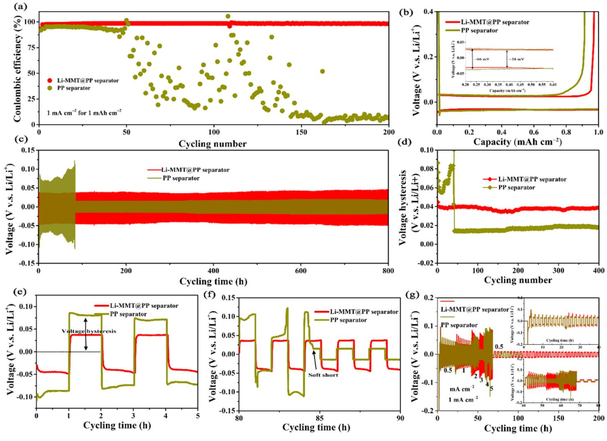
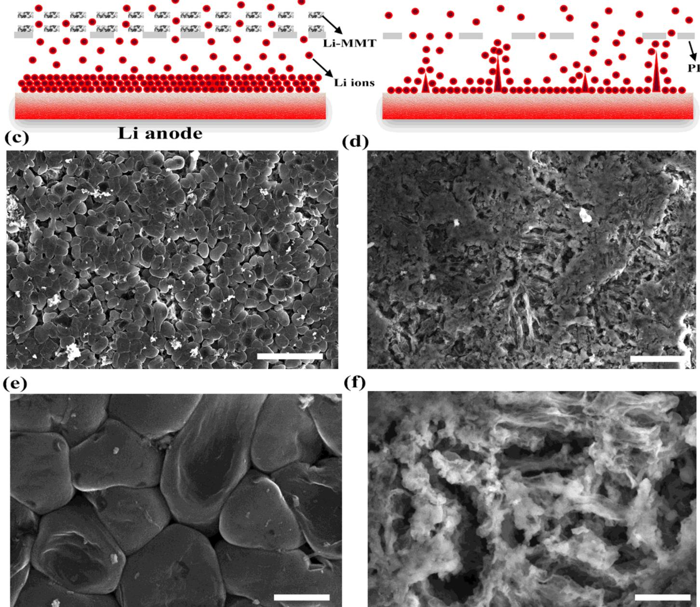
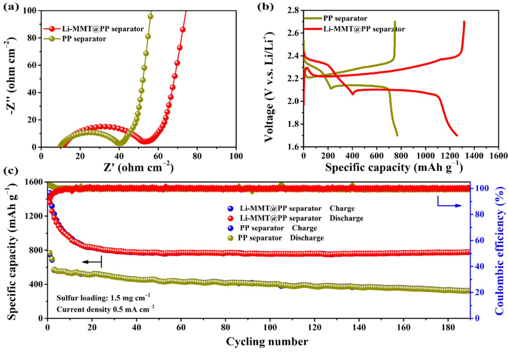

# Improving Cyclability of Lithium Metal Anode via Constructing Atomic Interlamellar Ion Channel for Lithium Sulfur Battery

### Mao Yang

University of Electronic Science and Technology of China

### Nan Jue

University of Electronic Science and Technology of China

### Yuanfu Chen

University of Electronic Science and Technology of China

### Yong Wang ( [ywang@uestc.edu.cn](mailto:ywang@uestc.edu.cn) )

University of Electronic Science and Technology of China

### Research Article

Keywords: Lithium sulfur batteries, Lithium dendrites, Interlamellar ion channel, Layered silicate clay, Nano composites

Posted Date: March 4th, 2021

DOI: <https://doi.org/10.21203/rs.3.rs-279787/v1>

License: This work is licensed under a Creative Commons Attribution 4.0 International License. Read Full [License](https://creativecommons.org/licenses/by/4.0/)

Version of Record: A version of this preprint was published on March 23rd, 2021. See the published version at [https://doi.org/10.1186/s11671-021-03508-z.](https://doi.org/10.1186/s11671-021-03508-z)

# Abstract

The lithium (Li) ions uniform through the region between separator and lithium anode deliver the critical feature for the achievement of even Li deposition, which is very important for the safe operation of lithium metal batteries, especially for the Li-sulfur (Li-S) battery. The commercial separators such as polypropylene (PP) or polyethylene (PE) prepared by a wet or dry processes, however, allow the generation of plentiful porosities, resulting in the uneven Li ion stripping/platting and finally the formation of Li dendrites. Thence, we construct an atomic interlamellar ion channel by introducing the layered montmorillonite (MMT) on the surface of separator to guide the Li ion flux and achieve the stable Li deposition. The atomic interlamellar ion channel with a spacing of 1.4 nm has strong absorption capacity to the electrolyte and reserve capacity for the Li ions, thus promoting rapidly transfer of Li ions and making an even deposition of Li ions at the anode. As a result, when assembled with the proposed separator, the Coulombic efficiency (CE) of Li||Cu batteries archives 98.2 % after 200 cycles and the Li||Li symmetric batteries actualize their stable platting/stripping even after 800 h. Importantly, the proposed separator allows 140 % specific capacity increase after 190 cycles as employing the Li-S batteries.

# Introduction

With the continuous requirement of high-performance electronic applications such as electric vehicles, portable devices, the development of energy storage devices with high energy density and long cycle life has received the extensive attention [1−3]. Lithium-metal batteries (LMBs) such as lithium sulfur (Li-S) batteries deliver the important storage technologies to meet the rapid electronic requirements duo to their high energy storage density [4−6]. However, as employed the most promising anode of Li metal which has high theoretical storage capacity (~ 3860 mAh g −1 ), low standard potential (−3.04 V v.s. the standard hydrogen electrode) and light weight density (0.53 g cm−3 ) as anode materials, the promiscuous and irregular pores of commercial separator allow the existence of irregular lithium deposition, causing the uncontrolled dendritic formation and the increased consumption of lithium metal and electrolyte during the repeated plating/stripping [7, 8].

The formation of Li dendrites leads to two disastrous problems when actual applications: one is that the Li dendrites are easy to break away from the conductive collector to form the "dead" Li metal, resulting in the low Coulomb efficiency (CE) and irreversible capacity loss [9, 10]. The other is the potential risk of Li dendrites to pierce the separator and lure the short circuit of LMBs, leading to the thermal runaway, fire and possible explosion of rechargeable battery [11, 12]. As a result, the actual application of LMBs in rechargeable batteries has been limited in the past 20 years. Therefore, preventing the formation of lithium dendrite is an important academic discussion for the practical application of LMBs [13]. At present, in order to solve these problems related to Li dendrites, researchers have proposed various methods, such as optimizing the electrolyte composition [5, 14], constructing the artificial solid electrolyte interphase (SEI) layer on Li metal anode [15], developing the three-dimensional composite Li anode [16], and modifying the collector [17, 18]. Although those strategies have been designed to stabilize the SEI layer and/or reduce the effective applied current density of lithium metals, these strategies have focused

primarily on lithium metals and electrolytes, and to date, few works have been done to address or mitigate the dendrite problems by modifying the separator [19]. Thus, it is a novel and feasible method to inhibit the formation of lithium dendrite by regulating the separator.

Among the components of LMBs, separator not only plays the key role in LMBs to segment the anode and cathode electrodes apart for avoiding the short circuit, but also directly affects the performance of battery via authorizing the Li ion migratory [9, 20, 21]. Thence, some studies, recently, have shown that simple modification of the separator using semi-solid polymer electrolyte interlayer [22], graphene [23] or high modulus surface coating [24] can effectively prevent the formation of dendrites and improve the performance of LMBs. Among those strategies, however, the barrier layers developed in the previous works usually have very high thickness (> 10 µm) and high mass loading (several milligrams), which inevitably impede the rapid diffusion of Li ions and reduce the energy density of LIBs. In addition, most LMBs using those functional separators can only cycle at low current densities, usually less than 2 mA cm−2 . Although the addition of inorganic particles within the separator to improve the porous structure and increase the critical current density is another effective method to improve the critical current density of LMBs, the uneven pores in the separator generally lead to the disordered diffusion of Li ions in the plating/strip process, leading to the uneven deposition of Li ions and the formation of Li dendrites [7]. Therefore, the microstructure of separator with uniform lithium transfer channel is greatly beneficial to eliminate the problem of dendrite in the charge/discharge processes.

In this work, aiming to guide the migratory of Li ions even through the separator, a Li-based montmorillonite (Li-MMT) modified composite separator is fabricated via constructing atomic interlamellar ion channel on the PP separator. The as-prepared separator embedded with interlamellar spacing (~ 1.4 nm) provides abundant active sites for Li ion diffusion and electrolyte wetting [25]. Thus, the modified separator is allowed to uniform deposit of Li ions on the Li anode by unifying the direction of Li flows, which can effective eliminate the Li dendrite issues in the charge/discharge processes. As a result, the Li-MMT separator enables the Li||Cu batteries with 98.2 % CE even after 200 cycles and ensures the Li||Li symmetric batteries actualizing stable platting/stripping over 800 h at 1 mA cm−2 with a capacity of 1 mA cm−2 . Moreover, after eliminating the Li dendrites, the batteries with Li-MMT@PP separator deliver superior cycle stability with 140 % specific capacity increase as compared with PP separator after 190 cycles at 0.5 mA cm−2 with sulfur loading of 1.5 mg cm−2 .

# Experimental Methods

### Materials and preparations

Montmorillonite (MMT), polyvinylidene fluoride (PVDF), and lithium hydroxide (LiOH) were purchased from Aladdin. The N-methyl pyrrolidone (NMP) and sulfuric acid (H2SO3 ) were obtained from Sinopharm Chemical Reagent Co., Ltd. Sulfur powder (S) and acetylene black (denoted as C powder) were purchased from Alfa Aesar. Celgard 2500 was used as separator. The Li-MMT powder was prepared via cation exchange. Typically, 0.2 M H2SO3 solution was used to covert the cations within the interlayer of MMT to

H ions and then LiOH solution was used to make the solution at PH=7 as well as covert the H ions to the Li ions. Freeze-drying technology was used to collect the Li-MMT powder.

### Characterization

X-ray diffraction (XRD) spectrum using a UltimaIV diffractometer with CuKα1 radiation (λ = 1.4506 Å) was employed to investigate the crystal structure of Li-MMT powder. High-resolution transmission electron microscope (HRTEM) was used to observe the interlayer of Li-MMT and the scanning electron microscope (SEM, FEI NANOSEI 450) was used to analyze the surface morphologies.

### Electrochemical measurements

For the Li||Cu and Li||Li battery tests, typically, the Cu foils were firstly washed with deionized water and ethanol three times to remove the possible impurities. Then, the lithium foil was cut into circles with area of 1 cm-2 to use as the Li sources. The electrolyte was 1 M bistrifluoromethanesulfonimide lithium salt (LiTFSI)in a mixture of 1, 3-dioxacyclopentane (DOL) and 1, 2-dimethoxyethane (DME) (1:1 v/v) with 2 wt% lithium nitrate (LiNO3 ) as additive. For the Li-S battery tests, the S cathode was prepared via our previous method that The C and S powder were mixed and heated at 155 ℃ for 24 hours with a mass ratio of 8:2 [26]. And then the powders of C/S composites, C and PVDF with mass ratio of 8:1:1 were uniformly dispersed in the NMP solution to prepare the sulfur electrode. The average sulfur loading is 1.5 mg cm-2 which was coated on the carbon coated aluminum foil. The batteries were assembled via stainless steel coin battery (CR2025) in an argon-filled glove box. Li foil was used as anode. 20 uL electrolyte was used to wet the lithium anode and additional 20 uL was used to wet the separator and cathode. Before testing, the assembled Li-S batteries was rest 12 h and then 0.2 mA cm-2 with 5 cycles was used to active the battery performance. The electrochemical test system was CT2001A battery test system (LAND Electronic Co., China). The cut-off voltage was 1.7–2.7 V. Electrochemical impedance spectroscopy (EIS) was tested by Electrochemical workstation (CHI660E, Chenhua Instruments Co., China).

### Results And Discussion

To illustrate the lithium ion flux across the commercial PP separator, the design concepts have been shown in Figs. 1a, b, in which ~ 5 mm Li-MMT layer was uniform coated on the PP separator to guiding the flux of Li ions. It is well known that the commercial PP separator is typically prepared by the dry or wet processes and then stretched the separator to generate plentiful voids to allow the pass of Li ions. These features, however, enable the commercial PP separator with higgledy-piggledy paths and arbitrarily stacked pores (Fig. 1a), thus failing to allow the uniform migratory of Li ions when through the separator and finally resulting in the Li dendrites. Therefore, atomic ion channel Li-MMT was employed as the modulator to guide the even flow of Li ions (Fig. 1b) and achieve the uniform Li deposition. The crystal structure of MMT typically consists negatively charged layers (MCLs) separated by interlayer space (>1 nm), which hosts the exchangeable cation ions, such as Li + , Na + , Mg 2+ , Ca 2+ , etc. Therefore, cation

exchange method is necessary to covert the host cations to Li ions [25]. The basic structure of MCLs is a typical T-O-T layer, where "T" stands for the tetrahedral sheet and "O" is for the octahedral sheet [25]. With the unique interlayer structure of Li-MMT, the electrolyte can effectively penetrate into the Li-MMT layer, resulting in the unimpeded transport of Li ions, thus achieving the efficient diffusion of ions [7, 25]. The morphology of Li-MMT is shown in Figs. 1c, d that clearly shows typical 3D nanosheet structure with closely and arbitrarily stacked architecture. According to the HRTEM, the layered structure of Li-MMT can be observed and shows an interlayer space of ~1.39 nm.

The precise measurement of interlayer space of Li-MMT is shown in Fig. 1e. Raw MMT with the indeterminate cations in its interlayer presents a peak around 6.04°. A peak at 6.92°, after ion exchange, confirms the change of indeterminate cations to the Li ions because the cations within raw MMT are highly variable in size and distribution and the Li ions are smaller size than other cations [25], thus causing the interlayer distance decreases gradually. According to the Bragg's law, the interlayer spacing of Li-MMT is about 1.4 nm, which can provide a wide channel for Li ion transport and electrolyte wetting. The porous morphology of PP separator is presented in Fig. 1f. After coating the Li-MMT layer, it can be found the porosity of Li-MMT@PP separator has been significantly decreased (Fig. 1g), which benefits for the regular ion movement. In addition, in this work, the Li-MMT slurry was coated via coating machine, which shows greatly potential for large area production. And the coated thickness is only 5 mm (Fig. 1h) with negligible mass increase.

Benefiting from the aforementioned unique atomic interlamellar ion channel, the Li-MMT@PP separator is promising for regulating the Li deposition and suppressing the Li dendrite growth at an atomic scale via guiding the Li ion flux. As shown in Fig. 2a, the Li||Cu battery was employed as investigating object to study the CE that shows the Li-MMT@PP separator can deliver the Li||Cu battery with high CE and excellent stability even over 200 cycles at the current density of 1 mA cm−2 with a capacity of 1 mAh cm−2 . During the tests, it can be found that all of the CE present an upward trend in the first 5 cycles, causing by the surface passivation of Li deposition. However, higher average CE in the first 5 cycles of Li-MMT@PP separator highlights the advantages that the deposited Li metal suffers lower side reaction with the liquid electrolyte as coupled with Li-MMT@PP separator. With the reduplicative platting/stripping, the shortcoming of PP separator is gradually exposed that the assembled Li||Cu battery only endures ~50 cycles and its CE decreases sharply to 60 % and almost to zero after 150 cycles. On the contrary, the CE of Li||Cu battery assembled with Li-MMT@PP separator still delivers stable cycles with lower over-potential (Fig. 2b) and the battery still maintains 98.2% CE after 200 cycles, indicating the deposited Li metal is more uniform and no lithium dendrite is produced after the regulation of Li-MMT layer.

To further investigate the advantage of the Li-MMT@PP separator in the cycling stability of Li metal anodes, symmetric Li||Li batteries with various separators are also fabricated. As shown in Fig. 2c, when the cycling capacity is 1 mAh cm−2 at a current density of 1 mA cm−2 , the battery with the Li-MMT@PP separator delivers an excellent cycling stability with stable voltage plateaus over 400 cycles (900 h) (Fig. 2d). In sharp contrast, the battery with the PP separator exhibits strong voltage hysteresis in the initial

stages. The overpotential is almost two times than that of Li-MMT@PP separator (Fig. 2e). After Li platting/stripping over 84 h, a sudden voltage drop is observed for the battery with the PP separator (Fig. 2f), which can be ascribed to the electrical connection between the electrodes, resulting in the "soft short". Therefore, the rate performances of Li symmetrical battery were further used to assess the current density in suppressing the Li dendrites. As shown in Fig. 2g, the Li-MMT@PP separator under the current density even as high as 5 mA cm−2 still exhibits normal plating/striping behavers. The PP separator, however, appears significant voltage fluctuations as the current density closing to 3 mA cm−2 . Especially when the current density is raised to 5 mA cm−2 , the voltage becomes extremely unstable, indicating the Li anode surface suffers serious Li dendrites.

The correlation of Li ions across the separator before and after coating the Li-MMT layer is proposed in Fig. 3a. After cation exchange, the interlayer of Li-MMT provides the active site for Li. The interlayer spacing of 1.4 nm serves as a unique Li ion channel to allow the regular flux of Li ions during the plating/stripping processes. However, for the PP separator, the higgledy-piggledy paths (Fig. 3b) and arbitrarily stacked pores will fail to allow the uniform migratory of Li ions as across the separator, leading to the heterogeneous deposition of Li ions in the electrochemical processes, and causing the formation of lithium dendrites. Thus, the morphologies of Li metal anodes after 20 cycles are investigated to further clarify the effect of Li-MMT@PP separator on the suppression of Li dendrites. As shown in Figs. 3c, e, after coating the Li-MMT layer, uniform and dense Li deposition is realized and no formation of Li dendrite is observed on the anode surface even after 20 cycles. Importantly, the Li metal anode still retains a relatively dense and compact structure with dendrite-free surface, highlighting the advantages of Li-MMT layer for favorable dendrite-free Li plating/stripping behavior. However, for the cell with PP separator, the Li metal anode displays obvious wire-shaped Li dendrites after cycles (Fig. 3d), and loosely stacks mossy Li with a highly porous structure (Fig. 3f).

To demonstrate the potential of Li-MMT@PP separator in the practical application of Li metal batteries, the S cathode with S loading of 1.5 mg cm-2 was employed as the electrode. The electrochemical interface assembled with different separators was investigated by the electrochemical impedance spectroscopy (EIS) measurement. As shown in Fig. 4a, typically, all of the separators display depressed semicircles at high frequencies, which are correspond to the interfacial charge transfer resistance. Although we can see that the charge transfer resistance of the battery assembled with Li-MMT@PP separator is slightly greater than that of PP separator, the battery's performance was not affected after low current density activation, which has been claimed in the experimental section. During the low frequency regions, the sloping lines present the lithium ion diffusion within the active materials. Fig. 4b shows the voltage plateaus of C/S composite cathode assembled with Li-MMT@PP or PP separators between 1.7 and 2.8 V (V.S. Li/Li + ). According to the reaction mechanisms of S cathode, the Li-S battery exhibits two typically plateaus during the charging/discharging processes. In the first stage before the knee point, the Li-MMT@PP separator delivers a high discharge capacity of ~ 400 mAh g -1 with negligible voltage hysteresis. However, for the PP separator, only ~210 mAh g -1 capacity is observed, indicating that partially released long-chain polysulfides (especially for the Li2S8 ) are not involved in the subsequent

redox reaction to contribute the capacity. The higher discharge capacity during the first plateau implies the Li-MMT layer can effective avoid the shuttle of soluble long-chain polysulfides to the Li anode surface. At the second conversion steps, obviously, for the PP separator, small amounts of short-chain polysulfides are formed due to the existence of shuttle effect within the ether-based electrolyte, which has been confirmed by our previously work [26]. In contrast, the Li-MMT@PP separator is rational designed that the Li-MMT surface has strong anchoring ability for polysulfides to avoid the shuttle of polysulfides [25]. The excellent adsorption properties ensure that the polysulfides are prevented to spread the Li anode surface and passivate the Li surface, thus allowing Li-S battery assembled with Li-MMT@PP separator has a high discharge capacity of 1283 mAh g −1 . Long-term cycles with good stability are the primary goals for the commercial batteries. The long-term cyclability of Li-MMT@PP separators is shown in Fig. 4c. In the early 20 cycles, it can be observed that the capacities of Li-MMT@PP and PP separator show a typical decreasing trend. This is because, in the early discharge process, plentiful polysulfides would precipitate from the inner of C/S cathode material and deposit on the surface of the cathode material [26], resulting in the loss of capacity. However, after stabilizing the lithium metal anode, the benefits of Li-MMT@PP separator are emerged that the retention of discharge capacity maintains 100 % during the subsequent cycles and the CE is also 100%.

# Conclusions

In summary, interatomic ion channel (Li-MMT) was constructed on the porous PP separator to modulate the Li ion flux and then guide the Li ion even deposition on the Li anode during the electroplating/stripping. Due to the wide interlayer space (~ 1.4 nm) of Li-MMT, the Li-MMT@PP separator greatly ensures the cyclability of Li metal anode by unifying the flow direction of lithium ions, resulting in the uniform deposition of Li ions on the anode surface, thus forming a dendritic free lithium anode. As coupling the Li-MMT@PP separator, The Li-S battery exhibits a remarkable reversible capacity of 776 mAh g −1 (almost 1.4 times than PP separator) with a 100 % CE after 190 cycles at the current density of 0.5 mA cm−2 with the sulfur loading of 1.5 mg cm−2 .

# Abbreviations

Li: Lithium; Li-S: Lithium sulfur; PP: Polypropylene; PE: Polyethylene; MMT: Montmorillonite; CE: Coulombic efficiency; LMBs: Lithium-metal batteries; SEI: Solid electrolyte interphase; Li-MMT: Li-based montmorillonite; PVDF: Polyvinylidene fluoride; LiOH: Lithium hydroxide; NMP: N-methyl pyrrolidone; H2SO3 : Sulfuric acid; C: Acetylene black; XRD: X-ray diffraction; HRTEM: High-resolution transmission electron microscope; LiTFSI: Bistrifluoromethanesulfonimide lithium salt; DOL: 1, 3-dioxacyclopentane; DME: 1, 2-dimethoxyethane; LiNO3 : Lithium nitrate; EIS: Electrochemical impedance spectroscopy; MCLs: Negatively charged layers;

# Declarations

### Acknowledgements

Not applicable

### Authors' contributions

M. Yang drafts the manuscript. M. Yang, Y. F. Chen and Y. Wang make contribution on directing the experiments and data analysis. N. Jue and Y. Wang have taken part in the acquisition and interpretation of the data. Y. Wang formulates the idea of investigation and is the corresponding author of the work. All authors have read and approved the final manuscript.

### Authors' Information

Not applicable

### Funding

The present work was supported financially by the National Natural Science Foundation of China (Grant No. 21773024, 52002254), National High Technology Research and Development Program of China (Grant No. 2015AA034202), and Sichuan Science and Technology Program (Grant No. 2020YJ0324, 2020YJ0262).

### Availability of data and materials

All data are fully available without restriction.

### Competing interests

The authors declare no competing interests.

### References

- 1. Fan X, Liu X, Hu W, et al (2019) Advances in the development of power supplies for the internet of everything. InfoMat 1(2): 130-139. https://doi.org/10.1002/inf2.12016
- 2. Bonnick P, Muldoon J (2020) The Dr Jekyll and Mr Hyde of lithium sulfur batteries. Energy Environ Sci 13:4808-4833. https://doi.org/10.1039/d0ee02797a
- 3. Chung SH, Chang CH, Manthiram A (2018) Progress on the critical parameters for lithium-sulfur batteries to be practically viable. Adv Funct Mater 28(28):1801188. https://doi.org/10.1002/adfm.201801188
- 4. Zhao J, Zhou G, Yan K, et al (2017) Air-stable and freestanding lithium alloy/graphene foil as an alternative to lithium metal anodes. Nat Nanotechnol 12: 993-999. https://doi.org/10.1038/nnano.2017.129
- 5. Chen W, Hu Y, Lv W, et al (2019) Lithiophilic montmorillonite serves as lithium ion reservoir to facilitate uniform lithium deposition. Nat Commun 10:4973. https://doi.org/10.1038/s41467-019- 12952-6
- 6. Zhang SS (2019) Identifying rate limitation and a guide to design of fast‐charging Li‐ion battery. InfoMat 2(5): 942-949. https://doi.org/10.1002/inf2.12058
- 7. Zhao J, Chen D, Boateng B, et al (2020) Atomic interlamellar ion path in polymeric separator enables long-life and dendrite-free anode in lithium ion batteries. J Power Sources 451(1):227773. https://doi.org/10.1016/j.jpowsour.2020.227773
- 8. Ghazi ZA, He X, Khattak AM, et al (2017) MoS2 /Celgard separator as efficient polysulfide barrier for long-life lithium-sulfur batteries. Adv Mater 29(12): 1606817. https://doi.org/10.1002/adma.201606817
- 9. Wei Z, Ren Y, Sokolowski J, et al (2020) Mechanistic understanding of the role separators playing in advanced lithium‐sulfur batteries. InfoMat 2(3):483–508. https://doi.org/10.1002/inf2.12097
- 10. Yu Z, Cui Y, Bao Z (2020) Design principles of artificial solid electrolyte interphases for lithium-metal anodes. Cell Reports Phys Sci 1(7): 100119. https://doi.org/10.1016/j.xcrp.2020.100119
- 11. Dai C, Sun G, Hu L, et al (2019) Recent progress in graphene‐based electrodes for flexible batteries. InfoMat 2(3):509–526. https://doi.org/10.1002/inf2.12039
- 12. Zhang L, Yang T, Du C, et al (2020) Lithium whisker growth and stress generation in an in situ atomic force microscope–environmental transmission electron microscope set-up. Nat Nanotechnol 15: 94– 98. https://doi.org/10.1038/s41565-019-0604-x
- 13. Chen W, Lei T, Wu C, et al (2018) Designing safe electrolyte systems for a high-stability lithium-sulfur battery. Adv Energy Mater 8(10):1702348. https://doi.org/10.1002/aenm.201702348
- 14. Zhang W, Zhang S, Fan L, et al (2019) Tuning the LUMO energy of an organic interphase to stabilize lithium metal batteries. ACS Energy Lett 4(3): 644–650. https://doi.org/10.1021/acsenergylett.8b02483
- 15. Li NW, Yin YX, Yang CP, Guo YG (2016) An artificial solid electrolyte interphase layer for stable lithium metal anodes. Adv Mater 28(9):1853–1858. https://doi.org/10.1002/adma.201504526
- 16. Dai H, Gu X, Dong J, et al (2020) Stabilizing lithium metal anode by octaphenyl polyoxyethylenelithium complexation. Nat Commun 11: 643. https://doi.org/10.1038/s41467-020-14505-8
- 17. Li G, Liu Z, Huang Q, et al (2018) Stable metal battery anodes enabled by polyethylenimine sponge hosts by way of electrokinetic effects. Nat Energy 3:1076–1083. https://doi.org/10.1038/s41560- 018-0276-z
- 18. Yun Q, He YB, Lv W, et al (2016) Chemical dealloying derived 3D porous current collector for Li metal anodes. Adv Mater 28(32): 6932–6939. https://doi.org/10.1002/adma.201601409
- 19. Xiao J (2019) How lithium dendrites form in liquid batteries. Science 366(6464): 426–427. https://doi.org/10.1126/science.aay8672
- 20. Lei T, Chen W, Lv W, et al (2018) Inhibiting polysulfide shuttling with a graphene composite separator for highly robust lithium-sulfur batteries. Joule 2(10): 2091–2104. https://doi.org/10.1016/j.joule.2018.07.022
- 21. Chen D, Feng C, Han Y, et al (2020) Origin of extra capacity in the solid electrolyte interphase near high-capacity iron carbide anodes for Li ion batteries. Energy Environ Sci 13: 2924-2937. https://doi.org/10.1039/c9ee04062e
- 22. Huang Z, Choudhury S, Gong H, et al (2020) A cation-tethered flowable polymeric interface for enabling stable deposition of metallic lithium. J Am Chem Soc 142(51) : 21393-21403. https://doi.org/10.1021/jacs.0c09649
- 23. Li C, Liu S, Shi C, et al (2019) Two-dimensional molecular brush-functionalized porous bilayer composite separators toward ultrastable high-current density lithium metal anodes. Nat Commun 10:1363. https://doi.org/10.1038/s41467-019-09211-z
- 24. Zhang H, Liao X, Guan Y, et al (2018) Lithiophilic-lithiophobic gradient interfacial layer for a highly stable lithium metal anode. Nat Commun 9:3729. https://doi.org/10.1038/s41467-018-06126-z
- 25. Chen W, Lei T, Lv W, et al (2018) Atomic interlamellar ion path in high sulfur content lithiummontmorillonite host enables high-rate and stable lithium-sulfur battery. Adv Mater 30(40):1804084. https://doi.org/10.1002/adma.201804084
- 26. Yang M, Li ZH, Chen W, et al (2020) Carbon-intercalated montmorillonite as efficient polysulfide mediator for enhancing the performance of lithium-sulfur batteries. Energy & Fuels 34(7): 8947– 8955. https://doi.org/10.1021/acs.energyfuels.0c01198

Preparation and characterizations of Li-MMT powders and Li-MMT@PP separator. (a, b) Schematics of design concepts with different separators. (c) SEM image of Li-MMT. (d) HRTEM image of Li-MMT. (e) XRD spectrum. (f) SEM image of PP separator, the inserted optical image is PP separator. (g) SEM image of Li-MMT@PP separator and (h) corresponding cross profile, the inserted optical image in Fig. 1g is Li-MMT@PP separator. Scar bar: (c), 1.5 μm. (d) 5 nm. (f) 2.5 μm. (g) 25 μm. (h) 5 μm.

Electrochemical performances of Li||Cu and Li||Li symmetric batteries. (a) CE curves and (b) corresponding voltage curves. (c) Voltage-time profiles of the Li||Li symmetric batteries using Li-MMT@PP or PP separator at 1 mA cm2 with a capacity of 1 mAh cm2. (d) Voltage hysteresis of Li||Li symmetric batteries. (e, f) The partial enlargement profiles of Fig. 2c. (g) The rate performances of Li||Li symmetric batteries.

SEM images of Li anode coupled with Li-MMT@PP or PP separator after 20 cycles at 1 mA cm-2 with a capacity of 1 mAh cm-2. (a, b) Mechanism illustration of Li-MMT@PP or PP separators. (c, e) Li-MMT@PP separator. (d, f) PP separator. Scale bars: (c) 25 μm, (d) 10 μm, (e, f) 2.5 μm.

Electrochemical performance of Li-S batteries with different separator. (a) EIS results. (b) The charge/discharge plateaus with Li-MMT@PP or PP separator. (c) Long-term cycling performance at 0.5 mA cm-2 with sulfur loading of 1.5 mg cm-2.