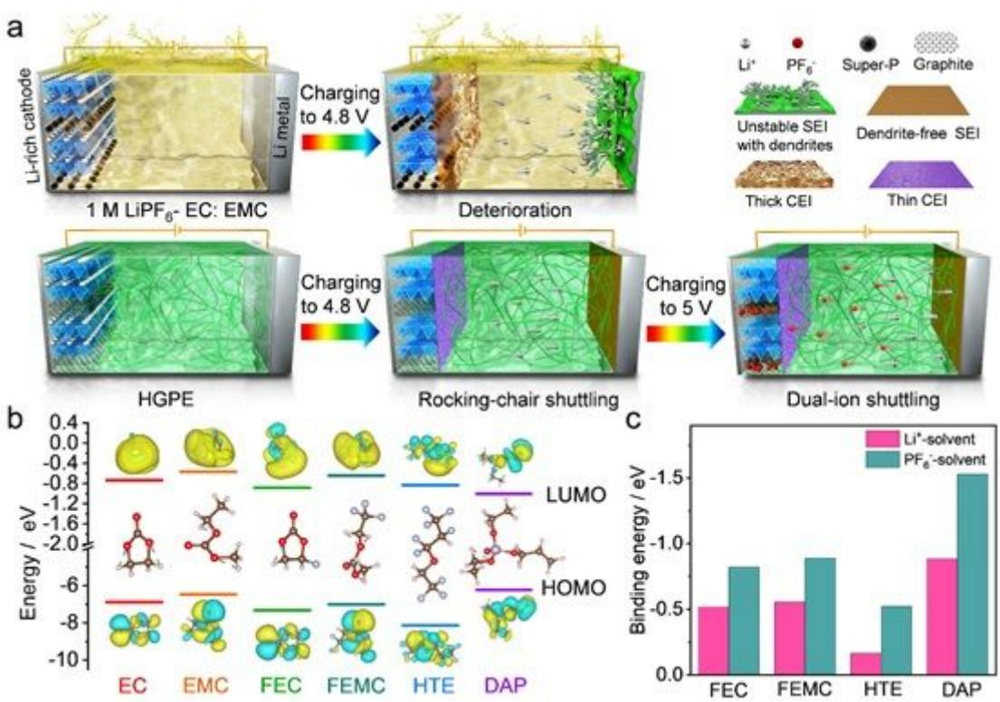
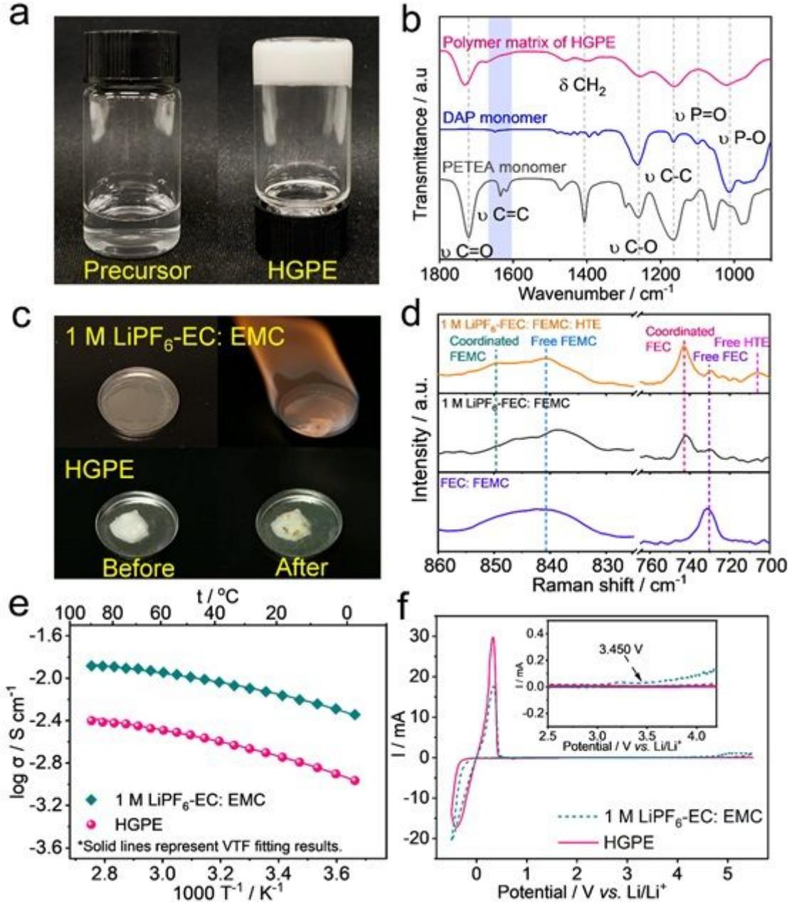
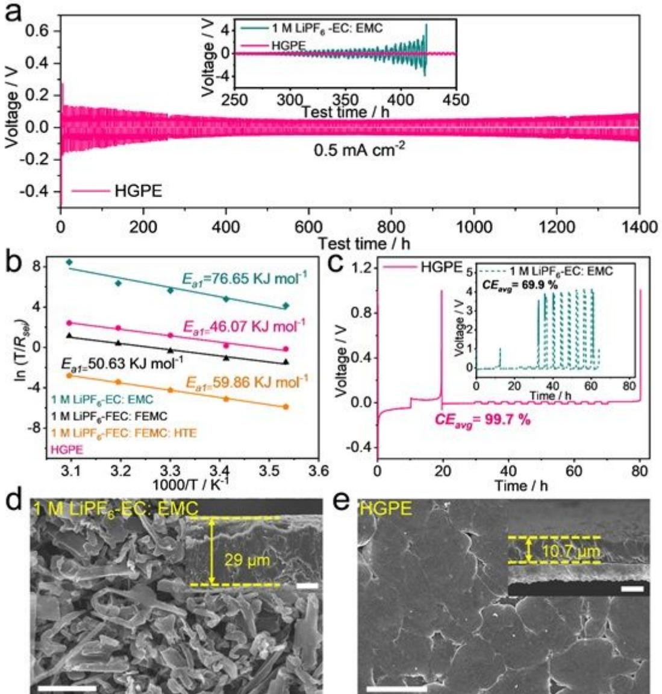
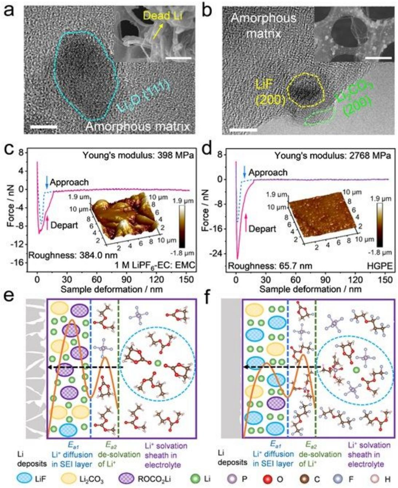
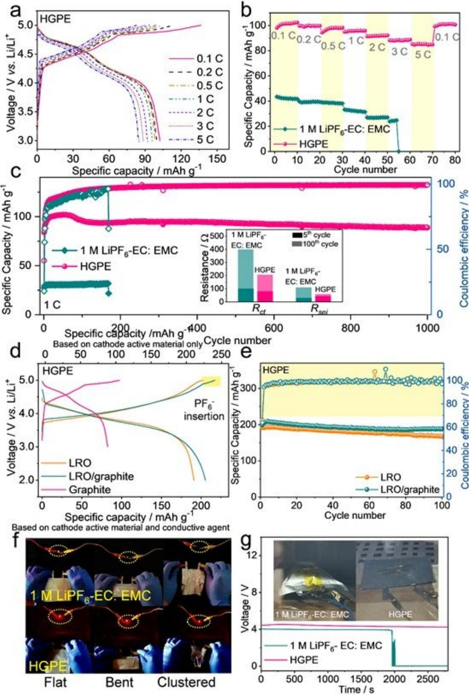
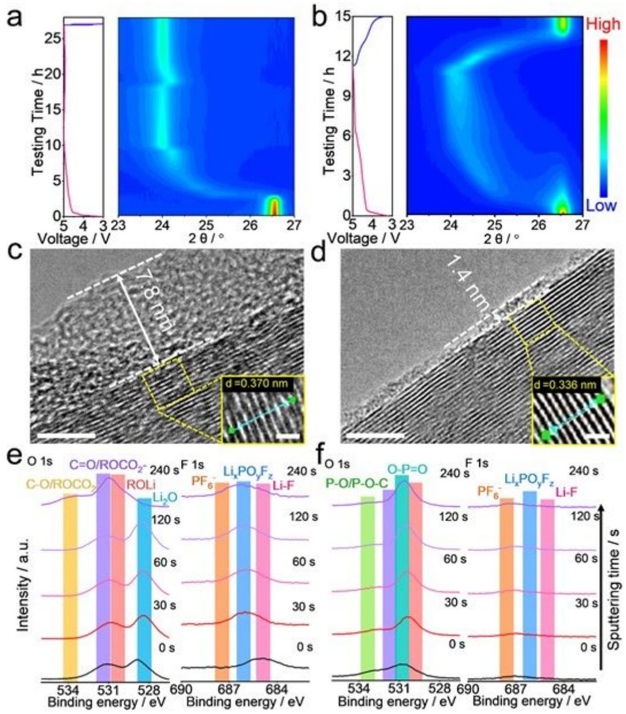

# A "shuttle-relay" lithium metal battery enabled by heteroatom-based gel polymer electrolyte

Junru Wu

Tsinghua University

#### Shanmukaraj Devaraj

CIC Energigune <https://orcid.org/0000-0001-8315-2699>

#### Xianshu Wang

Tsinghua University

#### Qi Liu

Tsinghua University

#### Shuwei Wang

Tsinghua University

## Dong Zhou

School of Mathematical and Physical Sciences, University of Technology Sydney <https://orcid.org/0000-0002-2578-7124>

## Feiyu Kang

Tsinghua University

## Teófilo Rojo

CIC EnergiGUNE, Alava Technology Park. C/Albert Einstein 48, 01510 Miñano, Álava

## Michel Armand

CIC energigune <https://orcid.org/0000-0002-1303-9233>

## Baohua Li

Tsinghua Shenzhen International Graduate School

## Guoxiu Wang ( [Guoxiu.Wang@uts.edu.au](mailto:Guoxiu.Wang@uts.edu.au) )

University of Technology Sydney <https://orcid.org/0000-0003-4295-8578>

## Article

Keywords: Lithium metal battery, Shuttle-relay chemistry, Heteroatom-based gel polymer electrolyte, Solid electrolyte interphase, Safety

Posted Date: May 20th, 2021

DOI: <https://doi.org/10.21203/rs.3.rs-488625/v1>

Version of Record: A version of this preprint was published at Nature Communications on September 30th, 2021. See the published version at <https://doi.org/10.1038/s41467-021-26073-6>.

## Abstract

Employing high-energy electrode couples and releasing the capacity of anions in the electrolyte are promising avenues to increase the energy density of existing lithium (Li)-based batteries. Herein, we develop a "shuttle-relay" Li metal battery (SRLMB) based on a hybrid Li-rich oxide cathode with graphite as conductive agent and a heteroatom-based gel polymer electrolyte (HGPE). The HGPE was facilely prepared by polymerizing diethyl allyl phosphate (DAP) monomer in-situ in an all-fluorinated electrolyte, which features high ionic conductivity, high oxidation stability up to 5.5 V vs. Li/Li + , high safety, and superior compatibility with Li metal (a plating/striping Coulombic efficiency of 99.7 %). When applied to SRLMBs, this quasi-solid-state electrolyte enables a reversible insertion of hexafluorophosphate (PF6 − ) anions into the conductive graphite after the stripping of Li ions from Li-rich oxide, thus improving the overall energy density of batteries. Our findings provide new insights into the upgrading of Li-based battery technology.

## Introduction

Lithium (Li)-based batteries, particularly Li-ion batteries, have dominated the market of portable energy storage devices for decades 1 . However, the energy density of Li-ion batteries is approaching their theoretical limit (300 Wh kg − 1 ), making it difficult to satisfy the requirement for long-distance driving with a single charging of electric vehicles 2 .

To further increase the energy density of Li-based batteries, the upgrading of electrode and electrolyte materials is urgently desired. As for anode materials, Li metal has been regarded as the ideal candidate due to its ultrahigh specific capacity (3860 mAh g − 1 ) and the lowest redox potential (-3.04 V versus standard hydrogen electrode) 3 . However, its real-world application has been severely hampered by uncontrollable Li dendrite growth during cycling 4 . It is well-recognized that the highly reactive Li metal is prone to react with the electrolytes and form a passivated solid electrolyte interphase (SEI) layer on the surface 5 . Nevertheless, the strength of such a SEI layer generally cannot withstand the repeated volume changes during Li deposition and striping, which results in surface defects and subsequent dendrite growth from these defects 6 . The resulting Li dendrites can not only pierce through the separator and trigger catastrophic safety hazards, but also constantly consume both active Li and electrolyte, giving rise to low Coulombic efficiency and degraded cycle life 7 .

On the cathode side, layered transition metal oxides, e. g. nickel-rich oxides (LiNi1 − xMxO2 , M = Co, Mn and Al) and Li-rich oxides (Li1 + xM1−xO2 , M = Mn, Ni, Co), are desirable for high-energy Li-based batteries considering their combined merits in specific capacity, working potential and cycling performance 8 . However, for the layered transition metal oxide-based batteries, only the Li ions in the electrolyte participate in the electrochemical reactions based on a "rocking-chair" chemistry, while no extra capacity contribution is made by the anions in electrolytes. Therefore, unlocking the additional potential of anions in the electrolyte is a promising approach to further enhance battery energy density. Recently, dual-ion

batteries (DIBs) based on graphitic cathode materials have attracted extensive attentions, in which anions (e.g. hexafluorophosphate (PF6 − ) 9 , bis(trifluoromethanesulfonyl) imide (TFSI − ) 10or bis(fluorosulfonyl)imide (FSI − ) 11 ) reversibly intercalate into/deintercalated from graphite interlayers within the cathode during charge/discharge processes 12 . The operating voltage of these DIBs generally is about 5 V vs. Li/Li + , which is favorable for energy density improvement 13 . However, such a high intercalation voltage of graphite leads to severe oxidative decomposition of the electrolytes, and tends to construct a high-resistance cathode electrolyte interface (CEI) on the cathode surface 14 . This seriously impedes anion insertion, resulting in inferior reversibility and poor cycling stability 15 . Furthermore, the cointercalation of the solvent molecules into graphite cathode causes an exfoliation of graphite layers and the subsequent irreversible loss of active materials during cycling 16 . As for the electrolytes, the highly flammable solvents (e. g. organic carbonates and ethers) widely applied in Li-based batteries trigger serious safety concerns including fire, explosion, and leakage of toxic electrolyte components 17 . All these drawbacks have brought great challenges for the development of high-energy Li-based batteries.

Here, for the first time, we demonstrate that a reversible insertion/extraction of PF6 −anions between graphite interlayers can be achieved in a heteroatom-based gel polymer electrolyte (HGPE), which was synthesized via in-situ co-polymerization of diethyl allyl phosphate (DAP) monomer and pentaerythritol tetraacrylate (PETEA) crosslinker in the presence of an all-fluorinated electrolyte. This HGPE exhibited high safety (i. e. non-flammability and non-leakage), high ionic conductivity (3.7×10 − 3 S cm− 1 at 25 oC), wide electrochemical window (up to 5.5 V vs. Li/Li + ), and excellent compatibility with both Li metal anode (a Li deposition/striping Coulombic efficiency of 99.7 %) and graphite cathode (93 % capacity retention after 1000 cycles). On this basis, we developed a "shuttle-relay" Li metal battery (SRLMB) consisting of a hybrid cathode with Li-rich oxide (LRO) as active material and KS6 graphite as conductive agent, a Li metal anode, and the HGPE as electrolyte. During the charge process, a reversible insertion of PF6- anions into the KS6 graphite occurs after the stripping of Li ions from the LRO, in which anions contributes 7.1 % extra areal energy density of the battery. The as-developed SRLMB exhibited high capacity and superior cycling stability, ascribed to the stable electrode|HGPE interfaces. This work sheds light on developing "shuttle-relay" Li batteries with -ultrahigh energy density.

## Results And Discussion

Mechanism of "shuttle-relay" Li metal battery. Fig. 1a illustrates the working mechanism of the quasisolid-state SRLMB, which is realized by the well-designed HGPE. Currently, Li-ion batteries extensively apply organic electrolytes containing cyclic carbonate solvents (e.g. ethylene carbonate (EC)) with high dielectric constant to dissolve lithium hexafluorophosphate (LiPF6 ) salt, and linear carbonate solvents (e.g. ethylmethyl carbonate (EMC)) to reduce the electrolyte viscosity 11 . However, such carbonate-based electrolytes generally show poor compatibility with both Li metal anode and 5 V-class cathodes (e. g. LRO for "rocking-chair" chemistry and graphitic carbon for "dual-ion" chemistry). On the anode side, the electrolyte solvents cannot form stable SEI layer on the Li metal surface, leading to Li dendrite growth

and low Columbic efficiency 18 . On the cathode side, the insufficient oxidation resistance of carbonate solvents triggers severe electrolyte decomposition and constructs a thick CEI with high-resistance, which dramatically degrades the battery performance (Fig. 1a, upper panels). The interfacial issues are even more severe for graphite cathodes, since the carbonate molecules tend to co-intercalate into graphite interlayers, giving rise to low reversible anions insertion/extraction capacity accompanying structural deterioration 16 .

To address these issues, we developed an all-fluorinated electrolyte for high-voltage Li metal batteries, which contains 1 M LiPF6 dissolved in a mixture of fluoroethylene carbonate (FEC): 2,2,2 trifluoroethylmethyl carbonate (FEMC): 1,1,2,3,3,3-hexafluoropropyl-2,2,2-trifluoroethylether (HTE) with a volume ratio of 1: 6: 3. In this liquid electrolyte, FEC is beneficial for improving the compatibility with Li anodes, meanwhile FEMC ensures a reversible insertion/extraction of PF6 into graphite (Supplementary Fig. 1). Moreover, as a novel electrolyte component, the HTE not only functionsas a diluent to reduce the electrolyte viscosity, but also optimizes the localized solvation structure of cation/anion aggregates, thus further stabilizing the Li|electrolyte interfaces. On this basis, 3 wt% DAP monomer and 1.5 wt% PETEA crosslinker were in-situ polymerized in this fluorinated electrolyte to form a HGPE, in which the threedimensional polymer matrix effectively improves the electrolyte safety by preventing liquid leakage (Supplementary Fig. 2). To verify the effect of each electrolyte component, we performed density functional theory (DFT) calculation on the highest occupied molecular orbital (HOMO) and lowest unoccupied molecular orbital (LUMO) energies of the solvent molecules. Based on molecular orbital theory, the HOMO energy correlates to the oxidative decomposition potential, while the LUMO energy is associated with the reductive decomposition potential 19 . As shown in Fig. 1b, the HOMO energy of fluorinated solvents (i. e. FEC: -7.3278 eV, FEMC: -7.001 eV and HTE: -8.1353 eV) is much lower than those of EC (-6.8853 eV) and EMC (-6.4791 eV), demonstrating the superior oxidation resistance of fluorine solvents owing to the strong electron-withdrawing effect of fluorine atoms on the core of solvent molecules 20 . Meanwhile, DAP monomer presents the highest HOMO value (-6.2292 eV). As a result, the residual DAP monomer after polymerization acts as a CEI-forming additive in the HGPE to further inhibit the electrolyte oxidation and the co-intercalation of solvent molecules into graphite. Moreover, FEC and DAP exhibit the lowest LUMO energies of -0.8835 eV and -1.0021 eV, respectively. Consequently, FEC and the residual DAP monomer will be preferentially reduced on the Li anode to form a protective LiF-rich and phosphorus-containing SEI inhibiting dendrites growth. To evaluate the effect of HTE, we calculated the binding energy of electrolyte components with Li + cation and PF6 - anion (Fig. 1c). It is seen that the HTE shows the lowest absolute values of binding energy with both Li + and PF6 - , indicating a weak interaction between HTE and ions. This is consistent with the lower solubility of LiPF6 salt in HTE compared with other solvents (Supplementary Fig. 3). Therefore, the introduction of HTE enables formation of a highly concentrated electrolyte in local regions by increasing the ratio of ion: fluorinated carbonate in the solvation structures. Such a unique solvation structure can minimize the excessive side reactions between electrolyte solvents and electrodes, thus improving the battery performance 21 .

When applied in SRLMBs with LRO as active materials and KS6 graphite as conductive agents, the welldesigned HGPE endows a novel "shuttle-relay" battery chemistry. As shown in the lower panels of Fig. 1a, Li ions are stripped from the LRO cathode in the voltage range of 2.0-4.8 V, followed by an insertion of the PF6 anions into the conductive graphite at 4.8-5.0 V. In the HGPE, the synergistic effect of liquid-state electrolyte components constructs robust SEI/CEI to improve the electrode|electrolyte compatibility; meanwhile, the polymer matrix efficiently retards the migration of Li + /PF6 ions to SEI/CEI surface defects through strong interaction (see the high binding energy absolute values between DAP and Li + /PF6 - , Fig. 1c), thereby favoring a uniform Li + /PF6 ion flux to promote uniform Li plating and anions intercalation into graphite 7 .

Characterization of the HGPE. As seen from Fig. 2a, the as-synthesized HGPE appeared as non-flowing white gel. The conversion degree of the monomer and crosslinker to form HGPE was calculated to be around 71 % (Supplementary Note 1). Fig. 2b exhibits the Fourier transform infrared spectra (FTIR) of DAP monomer, PETEA crosslinker and HGPE polymer matrix. The characteristic peaks at around 1013 cm-1 (P-O stretching), 1099 cm-1 (P=O stretching), 1260 cm-1 (C-O antisymmetric stretching), 1470 cm-1 and 1406 cm-1 (CH2 bending), and 1720 cm-1 (C=O stretching) presented in the FTIR spectra of DAP and PETEA 22,23 . Upon polymerization, the absorption peak at about 1630 cm-1 correlated to the stretching vibration of C=C bond nearly disappeared in the polymer matrix, indicating a high-degree polymerization of monomer and crosslinker in the HGPE. Fig. 2c demonstrates the combustion tests of 1 M LiPF6 -EC: EMC electrolyte and the HGPE. It is seen that the traditional liquid electrolyte easily caught fire on ignition, and kept on burning even after removing the torch with a self-extinguishing time (SET) of ≈92 s g -1 (Supplementary Video 1). This significantly differs from the HGPE which exhibited zero SET after removal of the torch, indicating its excellent non-flammability (Supplementary Video 2). This is attributed to facts that the substitution of hydrogen atoms by fluorine atoms in fluorinated solvents significantly reduces the generation of hydrogen radicals, which hence diminishes combustion hazard (Supplementary Fig. 4 and Supplementary Video 3 and Video 4), and the thermal decomposition products of DAP at high temperature can further capture the radicals and prevent the unwanted combustion chain reactions 24 . Moreover, it is worth noticing that the polymer matrix in the HGPE effectively immobilizes the solvents and decreases their volatility, thus preventing the risk of liquid leakage (Supplementary Fig. 5) 25 . Such high safety of the HGPE is a critical asset for the practical application of high-energy Li metal batteries.

Raman spectra was measured to characterize the coordination environment in the electrolyte. It is seen that in the mixture of FEC: FEMC (1: 6 by volume), peaks at around 730cm-1 were recorded (assigned to free FEC) and one at about 840 cm-1 corresponding to the free FEMC molecule (Fig. 2d and Supplementary Fig. 6). After dissolving 1 M LiPF6 into the mixture, the peak intensity of free solvent molecules diminished accompanying the appearance of new bands at about 849 cm-1 (Li + -coordinated FEMC), 921 and 745 cm-1 (Li + -coordinated FEC) 26 . With the addition of HTE, an extra peak of free HTE molecules was observed at approximately 706 cm-1 in the spectrum of LiPF6 -FEC: FEMC: HTE electrolyte, meanwhile the peak intensity of Li + -coordinated carbonates increased, which verifies that more

fluorinated carbonate molecules are coordinated with Li ions in the solvation sheaths 27 . This is wellconsistent with the binding energy calculation results in Fig. 1c, which efficiently alleviates the excessive side reactions between free solvent molecules and Li metal.

Ionic conductivity is considered as an important property of electrolytes. Fig. 2e and Supplementary Fig. 7 show the temperature dependences of ionic conductivities for 1 M LiPF6 -EC: EMC (1:6 by volume), 1 M LiPF6 -FEC: FEMC (1:6 by volume), 1 M LiPF6 -FEC: FEMC: HTE (1:6:3 by volume) and HGPE electrolytes within the temperature range 0 °C to 90 °C. The plot of log σ versus T -1 for electrolytes presents a nonlinear relationship that can be well fitted by the following empirical Vogel-Tamman-Fulcher (VTF) formula 28 :

$$
\sigma = \sigma_o T^{\frac{1}{2}} \exp\left(-\frac{E_a}{R(T - T_o)}\right) \tag{2}
$$

where σo is the pre-exponential coefficient, Ea is the pseudo-activation energy, To is the parameter related to the ideal glass transition temperature, and R is the gas constant. The fitted parameters and ionic conductivity values are presented in Supplementary Table 1. It is seen that the 1 M LiPF6 in FEC: FEMC and 1 M LiPF6 in FEC: FEMC: HTE electrolytes showed a slight decrease in ionic conductivity at 25 oC due to the high viscosity of the fluorinated solvents. After the in-situ gelation, the ionic conductivity of HGPE maintained 1.99 ×10 -3 S cm-1 at 25 oC. Meanwhile, the Ea value (1.00×10 -2 eV) was very close to that of the 1 M LiPF6 in FEC: FEMC: HTE liquid electrolyte (9.30×10 -3 eV). This indicates that the hindrance of the gel matrix for wanted ion transport is negligible. Such a high ionic conductivity value of the HGPE enables excellent operation of batteries at high current densities.

The electrochemical stability window of the electrolytes was investigated by cyclic voltammetry (CV). As shown in Fig. 2f, the strong current appeared from around -0.43 V vs. Li/Li + in the negative scan was related to the plating of Li on the stainless steel; while a peak of Li stripping occurred at about 0.32 V in the subsequent reverse scan 29 . Apart from in the plating-striping range of -0.5 to 0.5 V, no noticeable peaks or oxidation currents peaks were observed in the CV curve of the cell using the HGPE. This demonstrates the HGPE remained stable in the testing range (up to 5.5 V vs. Li/Li + ). In sharp contrast, the irreversible oxidation voltages of 1 M LiPF6 -EC: EMC, 1 M LiPF6 -FEC: FEMC and 1 M LiPF6 -FEC: FEMC: HTE were around 3.5 V, 4.2 V and 4.9 V vs. Li/Li + (inset of Fig. 2f and Supplementary Fig. 8). respectively. The high electrochemical stability of HGPE mainly originates from the fluorination of the electrolyte solvent and the robust CEI formed by the oxidation of DAP at about 3.3 V (Supplementary Fig. 8), which enables its application in 5 V-class Li metal batteries. Furthermore, the PETEA-DAP polymer framework can restrict the movement of anions, resulting in an increased Li ion transfer number (tLi + ) for the HGPE (i. e. 0.43) compared with the 1 M LiPF6 -FEC: FEMC: HTE electrolyte (0.37, Supplementary Fig. 9) 9 . Such increased tLi + is close to 0.5, which facilitates the balance of the active ions in the DIBs 30 .

Li metal morphology and interfacial chemistry. To investigate the stability of Li metal anodes in different electrolytes, the voltage variation of symmetric Li||Li cells was assessed during galvanostatic cycling at a constant current of 0.5 mA cm-2 . As shown in the inset of Fig. 3a, the Li|Li symmetric cell using 1 M LiPF6 -EC: EMC electrolyte exhibited a dramatically increased overpotential with cycling time (≈5 V at 420 h), mainly due to the thickening of SEI layer and continuous Li dendrite growth 18 . The overpotential of Li|1 M LiPF6 -FEC: FEMC|Li cells and Li|1 M LiPFF6 -FEC: FEMC: HTE|Li cells were ≈120 mV and ≈150 mV, and the cells failed at 600 h and 800 h, respectively (Supplementary Fig. 10). Meanwhile, the Li|HGPE|Li cell delivered a stable voltage hysteresis of ≈100 mV with no obvious oscillation throughout a 1400 h cycling (the general decrease in overpotential in the initial cycles is related to the activation of Li anode with a pristine oxide layer on the surface 31 ), indicating a dendrite-free Li deposition when use HGPE. The temperature-dependent electrochemical impedance spectroscopies (EISs) of the Li||Li cells after 20 cycles were performed to further evaluate the activation energies during Li deposition/stripping. The activation energies derived from the SEI (Rsei ) and ion transfer resistance (Rct ) are denoted as Ea1 and Ea2 , corresponding to the energy barriers for Li ions transport across the SEI layer and their desolvation from Li + solvation shells, respectively (Supplementary Note 3) 32 . The Ea1 for HGPE (46.07 kJ mol -1 ) is significantly lower than those for the 1 M LiPF6 -EC: EMC (76.65 kJ mol -1 ), 1 M LiPF6 -FEC: FEMC (50.63 kJ mol -1 ) and 1 M LiPF6 -FEC: FEMC: HTE (59.86 kJ mol -1 ) electrolytes (Fig 3b and Supplementary Fig. 12). This implies that the structure and composition of the SEI layer formed in the presence of HGPE endows a fast Li ion transport kinetics. Moreover, although the Ea2 value for HGPE (58.28 kJ mol -1 ) is slightly higher than that for 1 M LiPF6 -EC: EMC electrolyte (51.13 kJ mol -1 ) due to the stronger interaction between PF6 - -EC than that between PF6 - -fluorinated carbonate that facilitates Li + desolvation from the ion pairs and aggregates 33,34 , the Ea2 for HGPE is still lower than that for 1 M LiPF6 -FEC: FEMC electrolyte (62.52 kJ mol -1 ) and 1 M LiPF6 -FEC: FEMC: HTE electrolyte (69.67 kJ mol -1 , Supplementary Fig. 11). This could be attributed to the fact that DAP-based polymer matrix can promote the dissociation of Li ions from the solvation sheath 35 . The low Ea1 and Ea2 of the HGPE-based cell promote a low-resistance Li|HGPE interface with fast ion diffusion and conversion.

The average Li plating/striping Coulombic efficiency (CEavg ) measurement was further conducted in Li||Cu cells in various electrolytes (Supplementary Note 4) 36 . The cells using the HGPE exhibited a CEavg of 99.7 %, which is one of the best values for state-of-the-art electrolytes 6,37,38 and much higher than those using 1 M LiPF6 -EC: EMC (69.9 %), 1 M LiPF6 -FEC: FEMC (98.4 %) and 1 M LiPF6 -FEC: FEMC: HTE electrolyte (98.6 %, Fig. 3c and Supplementary Fig. 13). The plating morphologies of Li on Cu substrates were examined by field emission scanning electron microscope (FE-SEM). As shown in Fig. 3d, the Li|1 M LiPF6 -EC: EMC|Cu cell present a highly loose and mossy deposition structure with a thickness of ≈29.0 μm, far exceeding the theoretical value (≈9.7 μm). After fluorinating the carbonate solvents and introducing the HTE diluent, the surfaces of deposited Li gradually became smoother and denser, and the thicknesses of Li deposition decreased to around 21.4 and 16.1 μm, respectively (Supplementary Fig. 14). In the Li|Cu cell employing the HGPE, for comparison, the plating Li showed a compact morphology as

aggregated large particles, and the plated thickness (≈10.7 μm) was very close to the theoretical value (Fig. 3e). Such a dense Li deposition with a smaller surface/volume ratio effectively minimizes the parasitic reaction between metallic Li and electrolyte, and thus enables the high CEavg of Li|HGPE|Cu cells.

To analyze the microstructure of the SEI, 1 mAh cm-2 Li was repeatedly plated on and stripped off a Cu grid for 10 cycles at 0.2 mA cm-2 to obtain a vacant SEI shell for transmission electron microscopy (TEM) characterization. It is seen that a large amount of "dead Li" residues appeared on the Cu grid cycled in 1 M LiPF6 -EC: EMC electrolyte, indicating an irreversibility of Li plating/striping (Fig. 4a, inset). The SEI was mainly composed of Li2O particles distributed in an amorphous matrix (Fig. 4a), and the composition was further identified as organic compounds (e. g. ROCO2Li, where "R" represents functional groups) originating from the decompositions of carbonate solvents 32 , and LixPOyFz/Li2O as the decomposition products of LiPF6 salt, respectively (see the in-depth X-ray photoelectron spectroscopy (XPS) results in Supplementary Fig. 15-18) 39 . The Young's modulus of this SEI layer was as low as 398 MPa (Fig. 4c). For comparison, the amount of residual inactive Li obviously decreased on the Cu substrates in fluorinated electrolytes (Supplementary Fig. 18, insets). Meanwhile, the proportion of LiF, mainly originating from the reduction of fluorinated solvents, greatly increased in the SEI (Supplementary Fig. 15-18). It is well-known that LiF with high mechanical strength (i. e. a shear modulus of 55.1 GPa, almost 11 times higher than that of Li metal (4.9 GPa)) can significantly enhance the robustness and interfacial energy of SEI layers, thus blocking Li dendrite growth 24 . As expected, the mechanical strength of SEIs in 1 M LiPF6 -FEC: FEMC and 1 M LiPF6 -FEC: FEMC: HTE electrolytes increased to 911 MPa and 1426 MPa, respectively (Supplementary Fig. 20-21). In the Cu grid retrieved from the cell employing the HGPE,a high Young's modulus up to 2768 MPa (Fig. 4d) has been achieved, owing to the co-existence of LiF and phosphorouscontaining compounds (i. e. P-O-C and P=O) derived from the residual DAP monomer in the SEI (Fig. 4b and Supplementary Fig. 15-18). The robust SEI can efficiently suppresses the formation of Li dendrite and dead Li (Fig. 4b, inset) and leads to a smooth surface morphology of the cycled Cu grid (Fig. 4d, inset). The above results are well-consistent with the electrochemical behavior in traditional Li metal batteries.

The stabilization effect of HGPE on the Li|electrolyte interface can be elucidated as follows. It is known that the ion transfer kinetics and Li deposition behavior are mainly determined by the composition and morphology of the SEI 32 . As shown in Fig. 4e, in the traditional 1 M LiPF6 -EC: EMC electrolyte, the Li + solvation shell consists of large amounts of carbonate solvent molecules but with negligible PF6 - anions solvation 40 . Upon electrochemical reaction, EC and EMC molecules in the solvation shell will be reduced and constitute the main component of SEI. Such an organic component (e. g. ROCO2Li)-rich SEI is of insufficient strength to inhibit the dendrite growth, and repeatedly breaks down/reconstructs during the cycling, which causes raised thickness and resistance. This gives rise to a large energy barrier (Ea1 ) for Li ions to transport through the SEI, triggers inhomogeneous charge distribution and aggravated polarization, further promoting dendrite formation 4 . In contrast, in HGPE, although the activation energy

for dissociating the Li ions from the solvation sheath (Ea2 ) is similar to that for the traditional liquid electrolyte, the Ea1 is significantly reduced to facilitate Li ion diffusion through the SEI. This is because the addition of HTE as diluent leads to a formation of localized highly concentrated regions in the electrolyte, in which fluorinated carbonates and Li + -anion ion pairs participate in the solvation shell 32 . This solvation shell structure and residual DAP monomer in the HGPE endow a formation of an inorganic component (e. g. LiF-rich) SEI on the Li metal surface, which is highly robust to suppress dendrite formation and maintains low resistance throughout cycling (Fig. 4f). Additionally, the crosslinked DAP-PETEA matrix not only generates a relatively homogeneous Li + flux, but also effectively eases the volume changes upon Li deposition, thus inhibiting any incipient dendrite growth 7 . Such a stable Li|HGPE interface with low Li + diffusion energy barrier contributes to the superior performance of HGPE in Li metal batteries.

Electrochemical performances evaluation. Fig. 5a and b show the charge-discharge profiles and rate performances of the Li|HGPE|KS6 graphite (sheet size of 4 μm, Supplementary Fig. 22) cell, respectively. During the charging process of Li|HGPE|KS6 graphite cells, three slopes at 4.21-4.50 V (stage III), 4.50- 4.85 V (stage II) and 4.85-4.95 V (stage I) corresponded to the staged phase transition of graphite during anion insertion 9,41 . Subsequently, three plateaus associated with anions deintercalation from the graphite appeared in the discharge curves with potentials downshifted to 4.95-4.79 V, 4.79-4.40 V and 4.40-4.0 V, respectively. This is in agreement with the CV curves in Supplementary Fig. 23 and the dQ/dV plot in Supplementary Fig. 24. The Li|HGPE|KS6 graphite cells delivered specific discharge capacities of 101.5, 99.8, 98.2, 95.8, 92.0, 88.3 and 81.0 mAh g -1 at 0.1, 0.2, 0.5, 1, 2, 3 and 5 C (1 C=100 mAh g -1 based on the mass of graphite), respectively (Fig. 5b). These are much higher than those of cells using 1 M LiPF6 -FEC: FEMC and 1 M LiPF6 -FEC: FEMC: HTE electrolytes (Supplementary Fig. 25). When the current density was switched back to 0.1 C, the capacity retention of the HGPE-based cell was 98.2 % of the initial value, demonstrating that this battery system is highly robust and stable. In contrast, the capacity of Li||KS6 graphite cell with 1 M LiPF6 -EC: EMC rapidly decreases to ≈0 at a current density of 3 C, indicating a sluggish Li ions diffusion kinetics at the graphite|electrolyte interface.

Fig. 5c shows the long-term cycling performance of Li|KS6 graphite DIBs employing various electrolytes at 1 C. The Li|1 M LiPF6 -EC: EMC|KS6 graphite cell exhibited an initial discharge capacity of 29.4 mAh g -1 , and the capacity suddenly droped to 21.7 mAh g -1 at the 169 th cycle. This is probably caused by serious structure exfoliation and destruction of graphite originating from the co-intercalation of solvent molecules into the graphite interlayers, as well as the thickening of the CEI induced by the severe electrolyte oxidation 42 . The lifespan and reversible capacity of DIBs significantly increased with the adoption of fluorinated solvents (Supplementary Fig. 26). The Li||KS6 graphite cell using the HGPE demonstrateda high initial discharge capacity of 89.8 mAh g -1 with a capacity retention of ≈93 % after 1000 cycles, and the Coulombic efficiency was maintained at ≈98.9 % except for the activation process in the first 10 cycles (Fig. 5c). The above results were further corroborated by the small interfacial resistances (Rsei and Rct ) of the HGPE-based cells, and the interfacial resistance changes were much

smaller than in the cells using other electrolytes during cycling (inset of Fig. 5c, Supplementary Fig. 27 and Supplementary Note 6). This superior cycling stability is mainly because the HGPE effectively suppresses solvent co-intercalation and protects the structural integrity of graphite, thus allowing a highly reversible and durable insertion/extraction of anions into/from the KS6 graphite.

SRLMBs have been further developed by applying KS6 graphite as conductive agent in the cathode of the LRO|HGPE|Li cells. As shown in Fig. 5d, during the charging of LRO|HGPE|Li and Li|HGPE|LRO/graphite cells, a sloping potential below 4.5 V corresponded to Li ion extraction from LRO cathode 44 . For the hybrid LRO/KS6 graphite cathode an extra plateau at 4.9 V appears, which is ascribed to a "relay" intercalation step of PF6 into the graphite. Supplementary Fig. 28 further validated that KS6 contributed ≈ 6.2 % of the areal capacity and ≈ 7.1 % of the areal energy density (Supplementary Note 7). Such a "shuttle relay" process was highly reversible in the subsequent discharging. The SRLMB delivered a discharge capacity of 205.3 mAh g -1 , based on the total mass of the cathode active material and conductive agent, which was higher than that of the Li|HGPE|LRO cell with Super P as the cathode conductive agent (191.1 mAh g -1 , Fig.5e). The cell can maintain a capacity of 188.0 mAh g -1 after 100 cycles at 0.2 C (1 C=250 mAh g -1 based on the mass of LRO) with a high capacity retention of 91.6 %. This indicates that the PF6 intercalation/deintercalation after Li extraction/insertion can increase the battery capacity without sacrificing its cycling stability. In addition, the Li||LRO/graphite cell applying traditional 1 M LiPF6 -EC: EMC electrolyte suffered from a quick capacity fading during cycling, demonstrating a poor electrode|electrolyte compatibility (Supplementary Fig. 29).

Single-layer SRLMB pouch cells with 50 μm-thick Li foil as anodes were assembled to further evaluate the battery performance under abuse conditions (Supplementary Fig. 30a). The Li|HGPE|LRO/graphite pouch cell not only showed excellent cycling performance (Supplementary Fig. 31), but also exhibited superior flexibility (i. e. consistently powering a red light-emitting diode (LED) under flatted, bent, or even clustered states (Fig. 5f, lower panels and Supplementary Video 5). Whereas the cell using traditional liquid electrolyte losing power supply ability in bent or clustered states (Fig. 5f, upper panels and Supplementary Video 6). This verifies that the electrode|HGPE interfaces can maintain tight adhesion under significant shape deformations. Moreover, when aging the fully charged cells at 130 oC, an Li||LRO/graphite pouch cell with 1 M LiPF6 -EC: EMC liquid electrolyte suffered from severe swelling and bulging due to the sever volatilization and thermal decomposition of the liquid electrolyte (Fig. 5g, inset), and the open circuit potential suddenly dropped to ≈0 V at 1964 s, illustrating a contact failure inside the cell (Fig. 5g). In sharp contrast, owing to the high thermal stability of fluorinated solvents and leakagefree property of the gel, the shape and open circuit voltage of Li||LRO/graphite pouch cell with HGPE did undergo not change at the 130 oC test (Fig. 5g). Meanwhile, the temperature excursion of a fully charged Li|HGPE|LRO/graphite pouch cell was lower than that of a Li|1 M LiPF6 -EC: EMC|LRO/graphite pouch cell during the nail penetration safety tests (Supplementary Fig. 30b). All these enable a highly safe operation of SRLMBs in practical applications.

#### Electrochemical mechanism of PF6 intercalation/deintercalation in the HGPE. In-situ X-ray diffraction

(XRD) tests were conducted to further investigate the operation mechanism of PF6 intercalation/deintercalation in the presence of different electrolytes at 0.05 C. The in-situ XRD patterns and charge/discharge curves during the initial cycle are shown in Supplementary Fig. 32, and the corresponding intensity contour maps are presented in Fig. 6a and b, respectively. In the Li||KS6 graphite cells using traditional 1 M LiPF6 -EC: EMC liquid electrolyte, the graphite (002) diffraction peak gradually shifted from 26.6° to 24.1° during the charging process. The corresponding interlayer spacing (d) values of graphite can be calculated from the XRD pattern according to the Bragg equation 43 :

where θ is the diffraction angle between the incident X-rays and the corresponding crystal plane, and λ is the X-ray wavelength (i.e., 0.15406 nm). The increase of graphite d(002) interplanar spacing from 0.335 nm at 3.0 V to 0.370 nm at 5.0 V is consistent with the intercalation of the PF6 - anions into the graphite interlayer (Supplementary Fig. 33). In the subsequent discharge process, however, no distinct position change of the graphite (002) peak was observed, indicating a constant graphite d(002) spacing caused by the blocked PF6 - anion stripping from the graphite host (Fig. 6a). This has been further confirmed by the TEM image of the graphite cathode after cycling, in which the lattice spacing from XRD (0.370 nm) is well consistent with the calculated value from the TEM (Fig. 6c, inset). The thickness of the CEI derived from the oxidative decomposition of carbonate solvents is as high as 7.8 nm in 1 M LiPF6 -EC: EMC liquid electrolyte, which strongly hinders the PF6 - stripping and causes the irreversibility during cycling (Fig. 6c). In sharp contrast, in the Li|HGPE|graphite cell, the graphite (002) diffraction peak gradually shifted to 24.1°(i. e. interlayer spacing of 0.370 nm) during the charge process, and reversibly reverted to 26.50° (i. e. interlayer spacing of 0.336 nm) when discharged back to 3.0 V (Fig. 6b). The TEM image of the cycled graphite cathode exhibited lattice stripes with a spacing of 0.336 nm (Fig. 6d, inset), which is in accordance with the in-situ XRD results and almost the same as that of the pristine graphite powder (0.335 nm, Supplementary Fig. 34). This validates a highly reversible PF6 intercalation into/deintercalation from the graphite without structural deterioration. Moreover, the thickness of the CEI formed in the HGPE is only 1.4 nm, indicating a suppressed electrolyte oxidation with reduced interfacial resistance.

In-depth XPS measurements were performed on graphite cathodes cycled in various electrolytes to further analyze the components of CEI layers. For the Li|1 M LiPF6 -EC: EMC|graphite cell, peaks at approximately 532 eV (C=O), 530 eV (ROCO2 -) and 528 eV (Li2O) in O 1s spectrum and 687.5 eV (PF6 - ), 686 eV (LixPOyFz ) and 685 eV (LiF) in F 1s spectrum appeared on the cycled cathode surface (a sputtering time of 0 s, Fig. 6d) 9,20,32 , which is in agreement with Li 1s spectrum in Supplementary Fig. 35. In addition, the peaks at about 136 eV, 134 eV and 131 eV in the P 2p spectrum are related to PF6 - , LixPOyFzand P-C/P-O-C 44 , respectively (Supplementary Fig. 36). These results suggest that in 1 M LiPF6 -EC: EMC liquid

electrolyte, the CEI on the graphite cathode is mainly composed of abundant alkyl carbonate (e. g. ROLi) and polycarbonate as oxidation products of carbonate solvents (as further verified in the C 1s spectrum in Supplementary Fig. 37, and LixPOyFz and LiF originated from the decomposition of LiPF6 . More importantly, a large amount of intercalated PF6 - anions remained in the graphite interlayers, and the intensity of ROCO2 - from carbonates abruptly increased at a depth of 20 nm (i. e. a sputtering time of 240 s). These demonstrate the inhibited stripping of PF6 - anions from the graphite host and the cointercalation of solvent molecules, which causes the irreversibility of batteries at 0.05 C.

In contrast, for the surface of the graphite cathode from the cycled HGPE-based cell, two new O 1s peaks at about 533 eV and 531 eV are assigned to P-O-C and O-P=O as oxidative decomposition products of DAP 45,46 , which is consistent with the P 2p spectra in Supplementary Fig. 36. Additionally, the peak intensities of PF6 - , LixPOyFz and LiF in F1s spectrum and the ROCO2 - from the C 1s spectrum significantly decreased. The above results suggest that phosphorus-containing substances in the CEI (i.e., P-O-C and O-P=O) can suppress the decomposition of electrolytes and form a thin CEI to ensure a reversible PF6 - deintercalation (Fig. 5d and 6d). Considering allyl groups can easily undergo polymerization 45 , such a CEI film may originate from polyphosphoesters generated by the electropolymerization of residual DAP monomer on the carbon-oxygen rich graphite surface (Supplementary Fig. 39). Moreover, in the XPS depth profiles of the Li|HGPE|graphite cell, no noticeable peaks were observed from the carbonate solvents or their decomposition products. This confirms that solvent molecule co-intercalation can be effectively inhibited by such protective CEI, which preserves the cathode against structure destruction and facilitates the superior electrochemical performance of the HGPE-based DIBs and SRLMBs.

## Conclusion

In conclusion, for the first time, we showcased a heteroatom-based gel polymer electrolyte facilitating highly reversible insertion/extraction of PF6 - anion into/from graphite interlayers. The HGPE prepared via a facile in-situ thermally initiated polymerization possesses high ionic conductivity (3.7 ×10 -3 S cm-1 ) and safety (i. e. non-flammable and free of liquid leakage). The synergistic effect of fluorinated solvents, polymer matrix and the residual DAP monomer in the HGPE contributes to highly stable electrode|HGPE interfaces, thus endowing superior oxidative stability up to 5.5 V vs. Li/Li + , high Li deposition/stripping Coulombic efficiency of 99.7 % and excellent cycling stability of graphite cathodes with 93% capacity retention after 1000 cycles. Utilizing this HGPE, as a proof-of-concept, we developed a quasi-solid-state "shuttle-relay" Li metal battery with a hybrid LRO cathode by applying KS6 graphite as the conductive agent, in which a reversible insertion of PF6 - anions into the graphite occurred after the stripping of Li ions from the LRO. By unlocking the anion capacity contribution and elaborately modifying interfacial compatibility, this hybrid design exhibits significant merits in terms of overall energy density and outstanding cycling stability, which can be extended to other conventional cathode materials. This work provides new insights into pathways for the upgrading of current Li-ion battery technology.

## Methods

Preparation of the HGPE. LiPF6 (CAPCHEM, 99.99 %), DAP (Macklin, 96.0 %), PETEA (98%, Sigma-Aldrich) and 2,2'-Azobis(2-methylpropionitrile) (AIBN, Aladdin, 99 %) were sealed and stored at -20 oC before use to protect them from deterioration. EC (DoDoChem, 99.98 %), EMC (DoDoChem, 99.9 %), FEC (DoDoChem, 99.95 %), FEMC (DoDoChem, 99.95 %), HTE (J&K Scientific Ltd, China) were used without further purification. To prepare the HGPE, 3 wt.% DAP monomer, 1.5 wt.% PETEA crosslinker and 0.1 wt.% AIBN initiator were co-dissolved in a liquid electrolyte consisting of 1 M LiPF6 in a non-aqueous mixture of FEC: FEMC: HTE (1: 6: 3 by volume) to form a precursor solution. The precursor solution was then polymerized in-situ at 70 oC for half an hour to obtain translucent HGPE films. The polymer matrix of HGPEs was separated and purified for further characterisation. The detailed procedure is provided in Supplementary Note 1.

Characterization of HGPE. The FTIR spectra of the DAP monomer, PETEA crosslinker and the polymer matrix of HGPE were measured with a Bruker Vertex70 instrument. Raman spectroscopy was conducted by Micro-laser confocal Raman spectrometer (Horiba LabRAM HR800, France) at room temperature with a 532 nm laser. In the combustion test, 1 g electrolyte samples were poured into a dish, and then optical photographs and videos were recorded after the samples were ignited. The weight loss of electrolyte samples as a function of aging time was measured in an open environment at 60 oC. The ionic conductivities of the electrolyte samples were measured by EIS with a frequency range of 10 5 Hz to 1 Hz with an alternating current amplitude of 5 mV on a VMP3 multichannel electrochemical station (Bio Logic Science Instruments, France). The test cells were assembled by immersing two stainless steel blocking electrodes into electrolyte samples. Before the conductivity measurements, the test cells were maintained at each test temperature (from 0 to 90 °C) for at least 30 min to reach thermal equilibrium. The Li ion transference number (tLi + ) of the electrolyte samples was tested using the method described by Abraham et al. (details are illustrated in Supplementary Note 2) 47 . The electrochemical stabilities of the electrolytes were studied by CV tests in a three-electrode system. Stainless steel blocking electrodes were used as the working electrode, while Li foils were used as the counter and the reference electrodes in this system. The CV curves were recorded from -0.5 to 5.5 V at a scanning rate of 0.5 mV s -1 using the VMP3 electrochemical station. To evaluate the compatibility of electrolytes with Li metal, galvanostatic cycling measurements consisting of repeated 2 h charge-2 h discharge cycles were carried out in symmetrical Li||Li cells at 0.5 mA cm-2 . The EIS spectra were recorded with an alternating current amplitude of 5 mV on the VMP3 multichannel electrochemical station (details are illustrated in Supplementary Note 3). The Coulombic efficiencies of Li depositing/stripping in different electrolytes were investigated in Li||Cu coin cells, using the method reported by Zhang et al. with a cycled charge of 1 mAh cm−2 at 0.5 mA cm-2 (details are illustrated in Supplementary Note 4) 36 . The Cu substrates were harvested from dissembled Li||Cu cells after deposition of 1 mAh cm-2 Li at 0.2 mA cm-2 for further FE-SEM (SU8010) characterization. The Cu substrate after plating-stripping 1 mAh cm-2 Li for 10 cycles at 0.2 mA cm-2 were subjected to TEM (Tecnai G 2 F30), in-depth XPS (PHI 5000 VersaProbe II, in which the thickness values in

the XPS depth profiles were estimated from the calibrated sputtering of SiO2 ) and AFM (Bruker Dimension Icon) characterizations.

Battery assembly and characterization. The graphite cathode, LRO cathode and LRO/graphite hybrid electrode were prepared by a slurry-coating method. To obtain KS6 graphite electrode, a slurry mixture consisting of 70 wt% conductive graphite (KS6, Canrd Co. Ltd.), 20 wt% carbon nanotubes (CNT) as conductive agent and 10 wt% polyvinylidene fluoride (PVDF, Macklin, AR 90%) as binder in anhydrous Nmethyl-2-pyrrolidone (NMP, Sigma-Aldrich) was cast onto a carbon-coated aluminum (Al) foil and then dried at 120 °C overnight under vacuum. The LRO-based electrodes were prepared following similar methods with a LRO: Super-P: PVDF weight ratio of 80:10:10 and LRO: KS6: CNT (applying to enhance the electrode electronic conductivity): PVDF weight ratio of 80: 8: 2:10, respectively. The mass loadings of the active materials on each electrode were ≈1.0 mg cm-2 . CR2032 coin cells were assembled in an Ar filled glove box using Celgard 2400 separator and Li metal anodes. Precursor solution containing 3 wt% DAP, 1.5 wt% PETEA and 0.1 wt% AIBN dissolved in 1 M LiPF6 -FEC: FEMC: HTE (1: 6: 3 by volume) electrolyte was injected into the separator and filled into the cells. The electrolyte/graphite ratio in each cell was uniformly set at ≈60 μL mg -1 . Then the assembled cells were aged for 2 h to ensure the precursor solution wetted the electrodes sufficiently. Subsequently, the cells were heated at 70 oC for 1 h in a vacuum oven to ensure an in-situ co-polymerization of DAP monomer and PETEA crosslinker to get the HGPE-based cells. Li|HGPE|LRO/graphite hybrid pouch cells were assembled following a similar method (Supplementary Note 8).

The as-developed Li||graphite cells were charged-discharged between 3.0 and 5.0 V and Li||LRO cells were charged-discharged in a voltage range of 2.0 to 5.0 V on a Land 2001 A battery testing system at 25 °C. After designated cycling tests, the cells were dissembled in an Ar-filled glove box and repeatedly rinsed with DMC before post-mortem analysis. The air-sensitive electrode samples were rapidly transferred into the vacuum chambers for in-depth XPS and TEM before subsequent tests. dQ/dV curves were calculated from the discharge/charge profiles with a set voltage interval of 10 mV. CVs of the assembled DIBs were tested using the VMP3 electrochemical working station at a scanning rate of 0.5 mV s -1 , while EISs were examined in a frequency of 10 -2 to 10 5 Hz by applying a disturbance amplitude of 5 mV. For the in-situ XRD experiments, Li||graphite cells were assembled applying beryllium foils as both cathode current collector and X-ray window. The graphite cathodes herein were composed of 90 wt% KS6 graphite and 10 wt% PVDF to exclude the effect of conductive agent in XRD patterns. The in-situ XRD patterns were characterized on a Rigaku D max 2500 diffractometer with Cu Kα radiation (λ = 1.5418 Å).

Theoretical Calculations. All the spin-polarized calculations were performed using a Vienna ab initio simulation package (VASP), which was a plane-wave density functional code. The electron-electron exchange and correlation interactions were described by using the generalized gradient approximation (GGA) with the Perdew-Burke-Ernzerhof (PBE) functional form. The projector augmented-wave (PAW) method was employed to describe the interaction between the core and valence electrons. To better

describe the interactions between molecules, van der Waals (vdw) interactions were included by the DFT-D3 method of Grimme.

## Declarations

Data availability. The data that support the findings of this study are available from the corresponding author upon reasonable request.

## Acknowledgements

Prof. B. Li would like to acknowledge the support funded by the National Nature Science Foundation of China (No. 51872157), Shenzhen Key Laboratory (ZDSYS201707271615073), and Guangdong Technical Plan Project (No. 2017B090907005). Prof. G. Wang would like to acknowledge the support from Australian Research Council (ARC) Discovery Projects (DP200101249 and DP210101389). We would like to thank Prof. Atsuo Yamada from The University of Tokyo for giving valuable advice on this work.

## Author contributions

D.Z, M. A., B.L and G.W. conceived and designed this work. D.Z. and J.W. performed the experiments and wrote the manuscript. S.W. conducted the AFM characterizations. D.S., X.W., Q.L., F.K. and T.R. discussed the results and participated in the preparation of the paper.

## Competing Interests

The authors declare no competing interests.

## Additional information

Supplementary information accompanies this paper at http://

Competing financial interests: The authors declare no competing interests.

## References

1 Dunn, B., Kamath, H. & Tarascon, J.-M. Electrical Energy Storage for the Grid: A Battery of Choices. Science 334, 928, doi:10.1126/science.1212741 (2011).

2 Choi, J. W. & Aurbach, D. Promise and reality of post-lithium-ion batteries with high energy densities. Nature Reviews Materials 1, 16013, doi:10.1038/natrevmats.2016.13 (2016).

3 Lin, D., Liu, Y. & Cui, Y. Reviving the lithium metal anode for high-energy batteries. Nature Nanotechnology 12, 194-206, doi:10.1038/nnano.2017.16 (2017).

4 Xiao, J. How lithium dendrites form in liquid batteries. Science 366 (2019).

5 Jaumaux, P. et al. Deep‐Eutectic‐Solvent‐Based Self‐Healing Polymer Electrolyte for Safe and Long‐Life Lithium‐Metal Batteries. Angewandte Chemie International Edition 59, 9134-9142 (2020).

6 Fan, X. et al. Non-flammable electrolyte enables Li-metal batteries with aggressive cathode chemistries. Nature Nanotechnology 13, 715-722, doi:10.1038/s41565-018-0183-2 (2018).

7 Zhou, D. et al. Stable Conversion Chemistry‐Based Lithium Metal Batteries Enabled by Hierarchical Multifunctional Polymer Electrolytes with Near‐Single Ion Conduction. Angewandte Chemie International Edition (2019).

8 Li, W., Song, B. & Manthiram, A. High-voltage positive electrode materials for lithium-ion batteries. Chemical Society Reviews 46, 3006-3059, doi:10.1039/C6CS00875E (2017).

9 Xu, X. et al. Quasi-Solid-State Dual-Ion Sodium Metal Batteries for Low-Cost Energy Storage. Chem 6, 902-918, doi[:https://doi.org/10.1016/j.chempr.2020.01.008](https://doi.org/10.1016/j.chempr.2020.01.008) (2020).

10 Heckmann, A. et al. Towards high-performance dual-graphite batteries using highly concentrated organic electrolytes. Electrochimica Acta 260, 514-525, doi:<https://doi.org/10.1016/j.electacta.2017.12.099> (2018).

11 Xiang, L. et al. Highly Concentrated Electrolyte towards Enhanced Energy Density and Cycling Life of Dual-Ion Battery. Angewandte Chemie International Edition 59, 17924-17930, doi:<https://doi.org/10.1002/anie.202006595> (2020).

12 Liu, Q. et al. Rechargeable anion-shuttle batteries for low-cost energy storage. Chem, doi:<https://doi.org/10.1016/j.chempr.2021.02.004> (2021).

13 Li, W.-H. et al. Highly Improved Cycling Stability of Anion De-/Intercalation in the Graphite Cathode for Dual-Ion Batteries. Advanced Materials 31, 1804766, doi:<https://doi.org/10.1002/adma.201804766> (2019).

14 Li, M., Wang, C., Chen, Z., Xu, K. & Lu, J. New Concepts in Electrolytes. Chemical Reviews, doi:10.1021/acs.chemrev.9b00531 (2020).

15 Read, J. A., Cresce, A. V., Ervin, M. H. & Xu, K. Dual-graphite chemistry enabled by a high voltage electrolyte. Energy & Environmental Science 7, 617-620, doi:10.1039/C3EE43333A (2014).

16 Wang, M. & Tang, Y. A Review on the Features and Progress of Dual-Ion Batteries. Advanced Energy Materials 8, 1703320, doi:<https://doi.org/10.1002/aenm.201703320> (2018).

17 Zhou, D., Shanmukaraj, D., Tkacheva, A., Armand, M. & Wang, G. Polymer Electrolytes for Lithium-Based Batteries: Advances and Prospects. Chem (2019).

18 Zhang, J.-G., Xu, W., Xiao, J., Cao, X. & Liu, J. Lithium Metal Anodes with Nonaqueous Electrolytes. Chemical Reviews, doi:10.1021/acs.chemrev.0c00275 (2020).

19 Xu, G. et al. Prescribing Functional Additives for Treating the Poor Performances of High-Voltage (5 V-class) LiNi0.5Mn1.5O4/MCMB Li-Ion Batteries. Advanced Energy Materials 8, 1701398, doi:10.1002/aenm.201701398 (2018).

20 He, M. et al. High Voltage LiNi0.5Mn0.3Co0.2O2/Graphite Cell Cycled at 4.6 V with a FEC/HFDEC-Based Electrolyte. Advanced Energy Materials 7, 1700109, doi:<https://doi.org/10.1002/aenm.201700109> (2017).

21 Yamada, Y., Wang, J., Ko, S., Watanabe, E. & Yamada, A. Advances and issues in developing saltconcentrated battery electrolytes. Nature Energy 4, 269-280, doi:10.1038/s41560-019-0336-z (2019).

22 Liu, M. et al. Novel gel polymer electrolyte for high-performance lithium–sulfur batteries. Nano Energy 22, 278-289, doi[:https://doi.org/10.1016/j.nanoen.2016.02.008](https://doi.org/10.1016/j.nanoen.2016.02.008) (2016).

23 Moreno-Fernández, G. et al. Understanding enhanced charge storage of phosphorusfunctionalized graphene in aqueous acidic electrolytes. Electrochimica Acta 361, 136985, doi:<https://doi.org/10.1016/j.electacta.2020.136985> (2020).

24 Jaumaux, P. et al. Non-Flammable Liquid and Quasi-Solid Electrolytes toward Highly-Safe Alkali Metal-Based Batteries. Advanced Functional Materials n/a, 2008644, doi:<https://doi.org/10.1002/adfm.202008644> (2020).

25 Xu, D. et al. In Situ Generated Fireproof Gel Polymer Electrolyte with Li6.4Ga0.2La3Zr2O12 As Initiator and Ion-Conductive Filler. Advanced Energy Materials 9, 1900611, doi:10.1002/aenm.201900611 (2019).

26 Fan, X. et al. All-temperature batteries enabled by fluorinated electrolytes with non-polar solvents. Nature Energy 4, 882-890, doi:10.1038/s41560-019-0474-3 (2019).

27 Chen, S. et al. High-Voltage Lithium-Metal Batteries Enabled by Localized High-Concentration Electrolytes. Advanced Materials 30, 1706102, doi:10.1002/adma.201706102 (2018).

28 Xu, X. et al. A room-temperature sodium–sulfur battery with high capacity and stable cycling performance. Nature Communications 9, 3870, doi:10.1038/s41467-018-06443-3 (2018).

29 Zhou, D. et al. In situ synthesis of hierarchical poly(ionic liquid)-based solid electrolytes for highsafety lithium-ion and sodium-ion batteries. Nano Energy 33, 45-54, doi:<https://doi.org/10.1016/j.nanoen.2017.01.027> (2017).

30 Placke, T. et al. Perspective on Performance, Cost, and Technical Challenges for Practical Dual-Ion Batteries. Joule 2, 2528-2550, doi:<https://doi.org/10.1016/j.joule.2018.09.003> (2018).

31 Hafez, A. M. et al. Stable Metal Anode enabled by Porous Lithium Foam with Superior Ion Accessibility. Advanced Materials 30, 1802156, doi:10.1002/adma.201802156 (2018).

32 Wang, Z. et al. An Anion-Tuned Solid Electrolyte Interphase with Fast Ion Transfer Kinetics for Stable Lithium Anodes. Advanced Energy Materials 10, 1903843, doi:10.1002/aenm.201903843 (2020).

33 Chen, X. & Zhang, Q. Atomic Insights into the Fundamental Interactions in Lithium Battery Electrolytes. Acc Chem Res 53, 1992-2002, doi:10.1021/acs.accounts.0c00412 (2020).

34 Yao, Y.-X. et al. Regulating Interfacial Chemistry in Lithium-Ion Batteries by a Weakly-Solvating Electrolyte. Angewandte Chemie International Edition n/a, doi:[https://doi.org/10.1002/anie.202011482.](https://doi.org/10.1002/anie.202011482)

35 Zhou, D., Shanmukaraj, D., Tkacheva, A., Armand, M. & Wang, G. Polymer Electrolytes for Lithium-Based Batteries: Advances and Prospects. Chem 5, 2326-2352, doi:10.1016/j.chempr.2019.05.009 (2019).

36 Adams, B. D., Zheng, J., Ren, X., Xu, W. & Zhang, J.-G. Accurate Determination of Coulombic Efficiency for Lithium Metal Anodes and Lithium Metal Batteries. Advanced Energy Materials 8, 1702097, doi:10.1002/aenm.201702097 (2018).

37 Cao, X. et al. Monolithic solid–electrolyte interphases formed in fluorinated orthoformate-based electrolytes minimize Li depletion and pulverization. Nature Energy 4, 796-805, doi:10.1038/s41560-019- 0464-5 (2019).

38 Yu, Z. et al. Molecular design for electrolyte solvents enabling energy-dense and long-cycling lithium metal batteries. Nature Energy, doi:10.1038/s41560-020-0634-5 (2020).

39 Gao, Y. et al. Low-temperature and high-rate-charging lithium metal batteries enabled by an electrochemically active monolayer-regulated interface. Nature Energy 5, 534-542, doi:10.1038/s41560- 020-0640-7 (2020).

40 Li, Q. et al. Unraveling the New Role of an Ethylene Carbonate Solvation Shell in Rechargeable Metal Ion Batteries. ACS Energy Letters, 69-78, doi:10.1021/acsenergylett.0c02140 (2020).

41 Wang, G. et al. Self-Activating, Capacitive Anion Intercalation Enables High-Power Graphite Cathodes. Advanced Materials 30, 1800533, doi[:https://doi.org/10.1002/adma.201800533](https://doi.org/10.1002/adma.201800533) (2018).

42 von Wald Cresce, A. et al. Anion Solvation in Carbonate-Based Electrolytes. The Journal of Physical Chemistry C 119, 27255-27264, doi:10.1021/acs.jpcc.5b08895 (2015).

43 Tan, X., Chen, C., Yu, S. & Wang, X. Sorption of Ni2+ on Na-rectorite studied by batch and spectroscopy methods. Applied Geochemistry 23, 2767-2777, doi:<https://doi.org/10.1016/j.apgeochem.2008.07.008> (2008).

44 Li, Y. et al. A Novel Electrolyte Salt Additive for Lithium-Ion Batteries with Voltages Greater than 4.7 V. Advanced Energy Materials 7, 1601397, doi[:https://doi.org/10.1002/aenm.201601397](https://doi.org/10.1002/aenm.201601397) (2017).

45 Xia, J. et al. Study of triallyl phosphate as an electrolyte additive for high voltage lithium-ion cells. Journal of Power Sources 295, 203-211, doi:<https://doi.org/10.1016/j.jpowsour.2015.06.151> (2015).

46 Zhu, X. et al. Black Phosphorus Revisited: A Missing Metal-Free Elemental Photocatalyst for Visible Light Hydrogen Evolution. Advanced Materials 29, 1605776, doi:<https://doi.org/10.1002/adma.201605776> (2017).

47 Abraham, K. M., Jiang, Z. & Carroll, B. Highly Conductive PEO-like Polymer Electrolytes. Chemistry of Materials 9, 1978-1988, doi:10.1021/cm970075a (1997).

## Figures

## Figure 1

a Schematic illustration of the mechanisms of a Li|1 M LiPF6- EC: EMC|LRO "rocking-chair" battery (upper panels) and a "shuttle-relay" battery with a hybrid LRO cathode using graphite as conductive agent, a Li metal anode, and a HGPE (lower panels). b The LUMO and HOMO energy values of the solvent molecules. The molecular structures and corresponding visual LUMO and HOMO geometry structures are shown as insets. Brown, white, red, purple, and blue balls represent carbon, hydrogen, oxygen, phosphorus, and fluorine atoms, respectively. c Binding energies of FEC, FEMC, HTE and DAP for a Li+ cation and a PF6- anion.

Characterization of the HGPE. a Optical images of the precursor solution (left) and the corresponding HGPE (right) after co-polymerization; b The FTIR spectra of the DAP, PETEA and the polymer matrix of HGPE; c Combustion tests of 1 M LiPF6- EC: EMC electrolyte and HGPE; d Raman spectra of FEC: FEMC mixture, 1 M LiPF6- FEC: FEMC and 1 M LiPF6- FEC: FEMC: HTE electrolytes; f The ionic conductivities for 1 M LiPF6-EC: EMC electrolyte and HGPE at various temperatures from 0-90 °C. The plots represent the experimental data while the solid lines represent VTF fitting results. e The CV curves of 1 M LiPF6-EC: EMC electrolyte and HGPE at a scan rate of 0.5 mV s-1, using stainless steel as the working electrode and Li foil as the counter and reference electrodes.

Li deposition behaviors in various electrolytes. a Voltage profiles of Li||Li symmetric cells using 1 M LiPF6-EC: EMC electrolyte (shown in inset) and HGPE at 0.5 mA cm-2 with a cut-off capacity of 1 mAh cm-2; b The activation energies of Rsei derived from Nyquist plots; c CEavg tests of Li plating-stripping in Li|1 M LiPF6-EC: EMC|Cu (shown in inset) and Li|HGPE|Cu cells at 0.5 mA cm-2 with capacity of 1 mAh cm-2; d, e Top and cross-sectional (shown in inset) FE-SEM images of the Li deposition obtained by plating 1 mAh cm-2 Li on Cu substrate at 0.2 mA cm-2 in Li||Cu cells using d 1 M LiPF6 -EC: EMC electrolyte and e HGPE. Scale bars: 5 μm in Fig. 3d, e; 10 μm in the inset of Fig. 3d, e.

SEI characterizations. a, b TEM image of the SEI shell formed by repeatedly plating/stripping Li on Cu grids in a 1 M LiPF6-EC: EMC electrolyte and b HGPE. c, d Force-displacement plots of c 1 M LiPF6 EC: EMC derived SEI and d HGPE derived SEI. Corresponding three-dimensional atomic force microscope (3D-AFM) scanning images of SEI layers are shown in insets. e, f Schematics of the Li+ deposition process in e 1 M LiPF6 EC: EMC electrolyte and f HGPE. The aggregates in the light-blue dotted ovals represent the Li+ solvation sheath in the bulk electrolyte. The curves correspond to the activation energies of Ea1 and Ea2. Scale bars: 5 nm in Fig. 4a, b; 2 μm in the insets of Fig. 4a, b.

Electrochemical performance of the SRLMB. a The charge-discharge voltage profiles and b rate performances of a Li|HGPE|KS6 graphite cells employing 1 M LiPF6-EC: EMC and HGPE under different current densities. c Long-term cycling performance Li||KS6 graphite cells at 1 C (1 C=100 mA g-1 based on the mass of graphite). The corresponding Rsei/Rct changes during cycling are shown in the inset. d Charge-discharge curves of the Li|HGPE|KS6 graphite, Li|HGPE|LRO, and Li|HGPE|LRO/graphite hybrid

cells at 0.2 C. e Cyclic performances of Li|HGPE|LRO and Li|HGPE|LRO/graphite hybrid cells at 0.2 C. f Optical images of red LEDs powered by Li|1 M LiPF6-EC: EMC |LRO/graphite and Li|HGPE|LRO/graphite pouch cells. g Open circuit voltage changes of fully charged Li|1 M LiPF6-EC: EMC|LRO/graphite and Li|HGPE|LRO/graphite pouch cells at 130 oC during aging time. Optical images of the pouch cells after aging at 130 oC for half an hour are shown in inset.

## Figure 6

Electrochemical mechanism of PF6- intercalation/deintercalation. a, b Intensity contour maps obtained from the in-situ XRD patterns of a Li|1 M LiPF6-EC: EMC|graphite and b Li|HGPE|graphite cells at 0.05 C. c, d TEM images of the KS6 graphite cathodes from c Li|1 M LiPF6-EC: EMC|KS6 graphite and d Li|HGPE|KS6 graphite cells after one cycle at 0.05 C. e, f O 1s and F 1s XPS in-depth spectra of the KS6 graphite cathodes obtained from e Li|1 M LiPF6-EC: EMC|KS6 graphite and f Li|HGPE|KS6 graphite cells after one cycle at 0.05 C. Scale bars: 5 nm in Fig. 6c, d; 1 nm in the inset of Fig. 6c, d.

## Supplementary Files

This is a list of supplementary files associated with this preprint. Click to download.

- [SupplementaryVideo1Combustiontestof1MLiPF6ECEMC.mp4](https://assets.researchsquare.com/files/rs-488625/v1/a554df1878bd3eaca62b8b74.mp4)
- [SupplementaryVideo2CombustiontestofHGPE.mp4](https://assets.researchsquare.com/files/rs-488625/v1/0f5612ebc5c31456168038d2.mp4)
- [SupplementaryVideo3Combustiontestof1MLiPF6FECFEMC.mp4](https://assets.researchsquare.com/files/rs-488625/v1/6c3943b4bd26accf030f57f7.mp4)
- [SupplementaryVideo4Combustiontestof1MLiPF6FECFEMCHTE.mp4](https://assets.researchsquare.com/files/rs-488625/v1/2ea02036523165168a34b47c.mp4)
- [SupplementaryVideo5Flexibletestofpouchcellwith1MLiPF6ECEMC.mp4](https://assets.researchsquare.com/files/rs-488625/v1/ebe918554fe8bc9ca79293ce.mp4)
- [SupplementaryVideo6FlexibletestofpouchcellwithHGPE.mp4](https://assets.researchsquare.com/files/rs-488625/v1/ced0df51ee3bf85f1cf53c8a.mp4)
- [SupplementaryInformation.docx](https://assets.researchsquare.com/files/rs-488625/v1/23dbd1da0c6edb034b78374a.docx)