#### **Interphase control in lithium metal batteries through electrolyte design**

*Urbi Pal 1 , Dmitrii Rakov 1,2, Bingyu Lu 4 , Baharak Sayahpour 4 , Fangfang Chen 1,2, Binayak Roy 5 , Douglas R. MacFarlane 2,5, Michel Armand 1,6, Patrick C. Howlett 1,2, Ying Shirley Meng 3,4, Maria Forsyth 1,2\**

1 Institute for Frontier Materials (IFM), Deakin University, Burwood, Victoria 3125, Australia.

2 ARC Centre of Excellence for Electromaterials Science (ACES), Deakin University, Burwood, Victoria 3125, Australia.

3 Materials Science and Engineering Program, University of California San Diego, La Jolla, CA, USA.

4 Department of NanoEngineering, University of California San Diego, La Jolla, CA, USA.

5 School of Chemistry, Monash University, Clayton 3800, Victoria, Australia.

6 CIC EnergiGUNE, Basque Research and Technology Alliance (BRTA), Alava Technology Park, Albert Einstein 48, 01510 Vitoria-Gasteiz, Spain.

\* e-mail: maria.forsyth@deakin.edu.au

## **Abstract**

Future rechargeable Li metal batteries (LMBs) require a rational electrolyte design to stabilize the interfaces between the electrolyte and both the lithium metal anode and the high voltage cathode. This remains the greatest challenge in achieving high cycling performance in LMBs. We report an ether-aided ionic liquid electrolyte which offers superior Li metal deposition, high voltage (5 V) stability and non-flammability. High performance cycling of LiNi0.8Mn0.1Co0.1O2 (4.4 V) and LiNi0.6Mn0.2Co0.2O2 (4.3 V) cells is demonstrated with high coulombic efficiency (>99.5%) at room temperature and elevated temperatures, even at high practical areal capacity for the latter of 3.8 mAh/cm2 and with a capacity retention of 91% after 100 cycles. The ether-ionic liquid chemistry enables desirable plated Li microstructures with high packing density, minimal 'dead' or inactive lithium formation and dendrite-free long-term cycling. Along with XPS studies of cycled electrode surfaces, we use molecular dynamics simulations to demonstrate that changes to the electrolyte interfacial chemistry upon addition of DME plays a decisive role in the formation of a compact stable SEI.

#### **Main text**

Higher energy density lithium metal batteries (LMBs) require stable, dendrite-free and high efficiency Li metal cycling 1 . However, the -3.04V (vs SHE) reductive electrode potential for Li makes it highly reactive resulting in a thermodynamic instability for current organic electrolytes2 , 3 . This issue must be addressed if LMBs are to become a high volume commercial reality. Surface engineering of the Li anode, alloying of Li with another metal to reduce the reactivity, and creation of an artificial passivation layer have been suggested as possible solutions4-7 . A more feasible cost- and energy- efficient method to stabilise Li metal cycling, however, is through the design of an electrolyte formulation which is itself intrinsically more stable, as well as offering a chemistry that can tailor a homogenous, conductive solid electrolyte interphase (SEI). In this way the designed high safety electrolyte may protect the lithium metal through an *in-situ* formation of a protective barrier, whilst at the same time offering a wide stability window that makes it compatible with a high voltage cathode.

Traditional carbonate electrolytes have been optimised for graphite based lithium-ion batteries (LIBs) 4 , however the SEI formed on Li metal is non-protective which leads an ongoing consumption of electrolyte during cycling and ultimately cell failure 2 . Organic ethers have been considered as replacement solvents in LMBs; however, their poor oxidative stability (< 4 V) and flammability limits their use in battery applications. Such electrolytes are also not reliable for high voltage Ni-rich cathode chemistries 8-10. Despite their low intrinsic stability, ethers and carbonates have been explored in high voltage Li devices by exploiting high salt concentrated electrolytes (HCEs) 11-14 and highly fluorinated co-solvent electrolytes 10,15. These systems still suffer from mass transport limitations and high internal impedances in addition to the intrinsic high flammability of the organic solvent 10,11,15.

Ionic liquids solvents, composed entirely of ionic species, can offer higher chemical and electrochemical stability as well as a negligible vapour pressure and ultra-high thermal stability (>250 ˚C) 16. The interfacial structuring of IL-based electrolytes at a charged electrode allows the participation of both the cation and anion in forming a protective SEI layer at the interface 17, and potentially this interfacial chemistry could be tuned to control the SEI 17,18. In our previous work, we demonstrated that the addition of an ether solvent, *1,2* dimethoxyethane (DME), to a high Li salt concentration electrolyte based on *N*-methyl,*N*-propylpyrrolidinium bis(fluorosulfonyl)imide (C3mpyrFSI), offered enhanced ion-dynamics through a change in the coordination environment of the lithium solvation shell. We found that 20 wt% DME in the IL electrolyte gave the best improvement in ionic conductivity, lithium diffusivity and lithium plating/stripping kinetics, resulting in a stable high-rate cycling for a Li metal/LFP (3.5 V class) battery 19. In this new work, we demonstrate this promising electrolyte system in the long-term cycling of next generation high energy density, high voltage Nickel-Manganese-Cobalt oxide based cathodes (NMC811, 4.4 V class and NMC622, 4.3 V class), to utilise its high electrochemical stability. Cryogenic Focused Ion Beam SEM (Cryo-FIB/SEM) images and quantification of inactive Li and SEI formation determined by titration gas chromatography (TGC) method 20 show that DME addition reduces capacity loss from inactive Li formation by more than half. Finally, the interfacial chemistry at the Li electrode was studied by molecular dynamics (MD) simulation and correlated with XPS results to explain the exceptional performance of the LMB in this work.

#### **High voltage stability and NMC|Li cycling at a practical level**

Both the 100IL electrolyte (3.2 mol/kg LiFSI in C3mpyrFSI IL) and ether-aided IL, 80IL20DME electrolyte (3.2 mol/kg LiFSI in C3mpyrFSI:DME 80:20 wt:wt ) have excellent oxidative stability, as seen in Fig. 1a, reflecting their applicability in high voltage battery electrochemistry. The 100IL has an oxidative stability of up to 5.8 V vs. Li on a glassy carbon

electrode. Although DME itself has a low stability (< 4 V vs. Li), the ether-aided hybrid IL system, 80IL20DME, still maintains an excellent oxidative stability up to 5.1 V vs. Li (Fig. 1a). Our previous MD simulations showed that all DME molecules in 80IL20DME electrolyte are coordinated with Li, leaving no 'free' uncoordinated DME, which can account for the high oxidative stability of this hybrid electrolyte 19. Despite the ether component being highly flammable, the hybrid 80IL20DME (Supplementary Fig.1, iii and iv) is non-flammable, just as the neat IL (Supplementary Fig.1, i and ii) which is one of the key factors towards its application to achieve safe high voltage batteries.

NMC cathodes are categorised under 'solid-solution' cathodes and considered as one of the most aggressive cathodes amongst the high voltage redox chemistries. For example, cycling of an NMC811|Li cell with commercial 1 M LiPF6 in EC/DMC electrolyte shows poor capacity retention (< 20%) after 200 cycles 10. In contrast, our proposed ether-modified IL, 80IL20DME electrolyte exhibits an excellent long-term stability of NMC811|Li cell at room temperature with an average coulombic efficiency ~99.8% and capacity retention of 81% after 300 cycles, as shown in Fig. 1b. Even at elevated temperature (~50 o C) we obtained excellent capacity retention, as shown in Supplementary Fig. 2. A comparable result was recently reported by Cao et al., and a similar ~80% capacity retention at room temperature after 300 cycles has been achieved for the NMC811 system when a fluorinated orthoformate based electrolyte (TFEO) was used to stabilise the lithium metal 21.

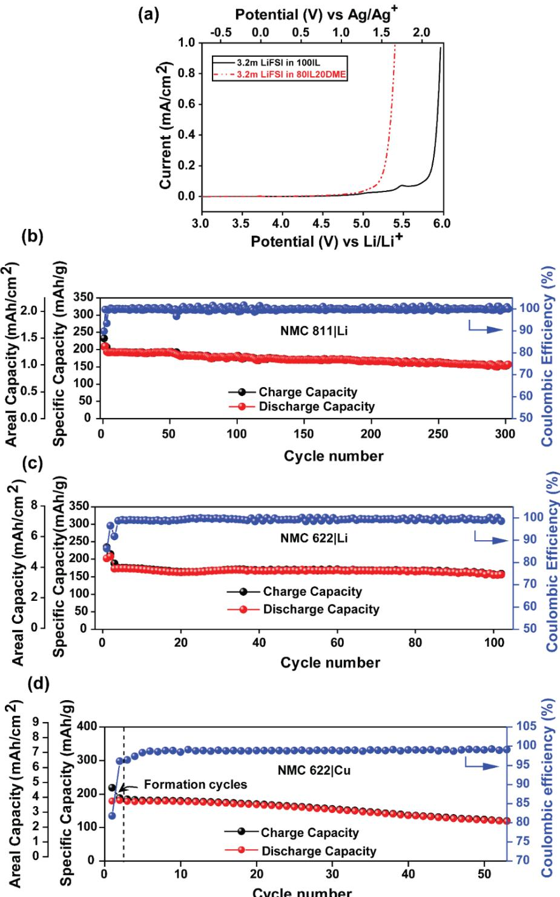

**Fig. 1| Electrochemical properties and cycling performances of electrolytes.** a) Electrochemical stability window of 100IL and 80IL20DME electrolytes; Room temperature cycling performances of 80IL20DME electrolyte in b) NMC811|Li cell within the potential range between 2.8 V and 4.4 V at 0.5 mA/cm2 current density after two formation cycles at 0.1 mA/cm2 current density, using a thin Li foil (50 μm), c) NMC622|Li (22.4 mg/cm2 cathode loading) cell within the potential range between 2.8 V and 4.3 V at a current density of 0.875 mA/cm2 after two formation cycles at 0.35 mA/cm2 current density using a thin Li foil (100 μm), d) anode-free cell cycling of NMC622 (22 mg/cm2 cathode loading) vs Cu within the potential window between 3 V and 4.3 V at a current density of 0.5 mA/cm2 for both plating and stripping steps.

Further, to increase the cell level energy density, a higher cathode loading of NMC622 (active material ~22.4 mg/cm2 ) vs Li cell with applied current density of 0.875 mA/cm2 was also demonstrated in Fig. 1c (the voltage profile is shown in Supplementary Fig. 4). This gives as high as 3.8 mAh/cm2 areal capacity for over 100 cycles with an average coulombic efficiency of ~ 99.23% when a thin lithium source (100 μm) and limited electrolyte amount (40 μl) was used. Longer term cycling of NMC622|Li (an areal capacity ~1 mAh/cm2 ) is also presented in Supplementary Fig. 3, which shows outstanding cycling over 200 cycles with an average coulombic efficiency of 99.5% and an excellent capacity retention of ~97% at room temperature (the high temperature 50 o C performance is also shown in Supplementary Fig. 3). Previously, Jiao et al. demonstrated the similar cycling uing a dual salt (2 M LiTFSI+ 2 M LiDFOB in DME) in ether solvent, DME at room temperature where they achieved 90.5% capacity retention after 300 cycles with an average coulombic efficiency of 94.6% 13.

A recent perspective article 22 suggests the key factors influencing the cycling ability of high energy lithium batteries are the cathode loading, electrolyte amount and the thickness of the Li foil. These parameters all have a critical impact on the cycle life of LMB cells with performance being challenged when using realistic, commercially viable loadings of these materials. As described above, the proposed ether-IL electrolyte shows excellent performance when utilising such high areal loadings, without cell failure when compared to the state-of-the-art electrolytes 22. Rate capability testing was also performed using a variety of charge-discharge current density protocols, i.e. varying the discharge current density (Supplementary Fig. 5a) and the charge current density (Supplementary Fig. 5b), respectively indicating good capacity retention even at 1C.

Owing to its impressive stability, a zero-excess Li metal cell against NMC622, or so called "anode-free" NMC|Cu cell (NMC622 mass loading ~ 22.4 mg/cm2 ), was also assembled and cycled (Fig. 1d). This represents the highest loadings for such an anode -free configuration for a liquid electrolyte system reported thus far. Fig. 1d shows this cell is capable of a 68% capacity retention after 50 cycles at room temperature in a non optimised cell (the voltage profile is shown in Supplementary Fig. 6). Previously, Dahn and co-workers reported the highest capacity retention (~80%) after 90 cycles with NMC|Cu cell cycled in a pouch cell configuration where they have used a dual salt electrolyte (LiDFOB+LiBF4 in FEC/DMC) at 40 ˚C with optimised cell pressure (NMC622 mass loading 16 mg/cm2 ) 23. Recent literature suggests a more unified way to compare performance from different experiments and different electrolyte systems. They suggested reporting the lithium inventory retention rate (LIRR) of the anode-free cells and compared this across all reported systems within the period of 2016- 2020 24. Under this analysis, the ether-IL electrolyte used here achieved a LIRR of 99.2% which lies among the highest values reported thus far for the liquid electrolyte systems, alongside that reported by Dahn and co-workers 23,25.

Efficient Li plating and stripping with a minimal amount of 'electrochemically inactive' Li formation during cycling is required to achieve high-capacity retention in an anode-free cell. The quantification and characterisation of Li metal cycling efficiency on Cu in different electrolyte systems is usually undertaken using a Li-Cu half-cell. Thus, in the following section, we have electrochemically measured the unreacted 'dead' or inactive Li at the Cuinterface in our ether-modified IL electrolyte.

#### **Electrochemically inactive lithium measurement in Li-Cu cell**

Conventionally, the irreversible capacity loss in a high energy density Li metal battery is assigned to the formation of 'dead' or inactive lithium which can be due to the formation of Li+ compounds in the SEI and/or so-called inactive lithium formation which becomes electronically isolated by the SEI components during cycling 26. The quantification of these two processes i.e. 'dead' or inactive lithium (Li0 inactive) and Li+ compound consumption in the SEI (Li+ SEI), has been very difficult until Fang et al. recently showed a new method which can detect their individual influences and quantify them 20. In their work, the first cycle coulombic efficiency loss in a Li-Cu cell was measured. The remaining residue at the Cu electrode surface after the stripping process (which should be residue from the combination of both Li+ SEI and Li0 inactive) was differentiated by their chemical reactivity towards water and the released H2 gas was correlated to Li0 inactive by a simple titration technique using gas chromatography 20. In the current work, the first cycle coulombic efficiency loss is 15% and 8% for the neat IL (100IL) and the ether-aided IL electrolyte (80IL20DME), respectively (Fig. 2a). Following the quantification method developed by Fang et al., 11% of the loss in the 100IL electrolyte was identified to be due to the SEI formation and nearly 89% was attributed to the formation of Li0 inactive (Fig. 2b). Given that there is a higher chance to accumulate the inactive lithium in consecutives cycles, this neat IL electrolyte would lead to faster cell decay and likely cell failure due to short circuit 26. Whereas for the ether-modified IL, the capacity losses due to the formation of SEI and inactive lithium were 43% and 57%, respectively. Furthermore Fig. 2c shows that there is relatively more SEI formation and less inactive lithium contribution in the presence of 80IL20DME. This suggests that the ether-aided IL is capable of forming a comparatively more uniform, and potentially slightly thicker, protective SEI compared with the neat IL.

Cryo-FIB/SEM was performed to interrogate the microstructure of lithium electrochemically plated onto a Cu substrate at a current density of 1 mA/cm2 for 1 hour. Different morphologies are observed for the two electrolytes where the neat IL appears to form thinner rod- or whiskerlike lithium deposits and the ether IL shows relatively larger grains or column-like lithium deposits on the Cu substrate, as seen both from the cross-section and top view (Fig. 2d-g). The deposit morphology is a crucial factor to maintain the electronic connection in the deposits as literature suggests the thinner whisker-like deposits are more likely to become disconnected and electronically isolated during repeated cycling due to their higher aspect ratio, leading to inactive lithium formation (Li0 inactive) 12,20. This is indeed consistent with the inactive lithium quantification presented above. We correlate these results with full cell cycling, shown in Supplementary Fig. 7, where these two electrolytes were subjected to cycling at high current rate in a NMC622|Li battery. Under identical conditions, the cell based on the 100IL electrolyte had a rapid capacity fade after only 40 cycles, whereas the ether-aided IL showed very stable cycling behaviour with 99.8% coulombic efficiency over the measurement duration. This supports the inactive lithium quantification process and its practical use in screening the best performing electrolytes for future battery applications. We clearly see here that, the ether-aided IL has the potential to perform well at a high current density (1.75 mAh/cm2 ) and for longer term cycling compared to the neat IL electrolyte shown here as well as the other state-of-theart electrolytes discussed above 13,21.

Poor high capacity cycling of high voltage cathodes in Li metal cells has often been correlated to dendrite growth and inactive Li formation at the Li metal interface. Better understanding of the influence of electrolyte chemistry on the stability of the Li metal interface will also contribute to the study of other high-voltage cathode systems. To that end, in the next section, we undertook an extensive study of the Li|Li symmetrical cell electrode surfaces to have a better understanding of the morphological evolution and SEI formation.

**Fig. 2| Quantitative analysis of Li0 inactive and Li+ SEI** a) Li metal plating-stripping profile on a Cu working electrode cycled in 100IL and 80IL20DME electrolyte at a current density of 0.5 mA/cm2 , capacity 4 mAh/cm2 , the coulombic efficiency (CE) is mentioned respectively b) Analysis of SEI% and inactive Li% by TGC quantification method. Three cells were tested to obtain better statistics, the error bar is also represented, c) the SEI contribution and inactive lithium contribution in terms of coulombic efficiency loss, d-g) Top view and cross section of Li surface of 100IL and 80IL20DME respectively after plating a total capacity of 1 mAh/cm2 for 1 hour, obtained by Cryo-FIB/SEM.

#### **Li metal anode cycling, morphology and SEI analysis**

Applying a high current density enables fast charge/discharge, but is generally very challenging for most organic electrolytes, due to the faster metal ion depletion accompanied by the formation of high cation (Li+) concentration gradients, leading to dendrite formation and internal short-circuits 4 . Herein, we demonstrate in Fig. 3 that a very stable performance of the proposed ether-aided IL electrolyte can be achieved in a Li|Li symmetrical cell where a relatively high current density of 1 mA/cm2 was applied and the total capacity was 1 mAh/cm2 for each charging and discharging process for up to 200 hours.

In Fig. 3a, the voltage profile of the symmetrical cell for both the electrolytes suggests a consistent Li plating and stripping behaviour throughout the experiment. Notably an overpotential of 50 mV, with a slight increase towards the end of the polarisation step indicating mass transport limitations, was observed in case of 100 IL (inset Fig. 3a). Furthermore, this can be rationalised if we consider that the 100IL has a slightly higher bulk ionic conductivity (Supplementary Table 1), and the greater proportion of 'dead' or inactive lithium (indicated above in Fig. 2) would lead to a more tortuous Li-ion diffusion. On the other hand, very stable cycling is observed for the 80IL20DME system with a lower over-potential. The EIS data (Supplementary Fig. 8) indicates that the ether containing electrolyte has a slightly higher, albeit more stable SEI resistance compared with the 100IL, resulting in improved transport properties as well as less inactive lithium, which appears to reflect in smoother cycling profile with the lower potential.

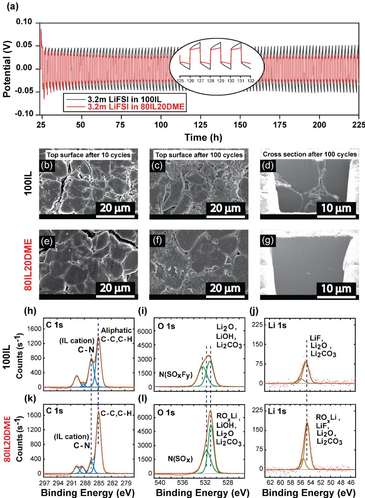

**Fig. 3| Morphology and SEI analysis after extended Li metal cycling.** a) Li|Li cell cycling carried out at a current density of 1 mA/cm2 and an areal capacity of 1 mAh/cm2 for each plating and stripping step for 200 hours (100 cycles) at elevated temperature (50o C). Morphology of b) Top surface after 10 cycles, c) after 100 cycles and d) cross-section by Cryo-FIB after 100 cycles in 100IL electrolyte, e) Top surface after 10 cycles, f) after 100 cycles and g) cross-section by Cryo-FIB after 100 cycles in 80IL20DME electrolyte, XPS analysis on plated Li metal electrode after 100 cycles (h,i,j) for 100IL and (k,l,m) for 80IL20DME electrolyte.

Here, we demonstrate a dendrite free interface morphology through a *post mortem* analysis where the cross-section morphology is also captured by using a Cryo-FIB/SEM technique, which can avoid any beam damage at the metal surface 27. The top surfaces of the plated lithium using the 80IL20DME electrolyte after 10 and 100 cycles are presented in Fig. 3e & 3f and are compared with their counterparts using the 100IL electrolyte in Fig. 3b & 3c. This shows the formation of a grainy or particulate structure after 10 cycles in the 100IL system, conversely, the particle sizes appear to be overall larger and more closely packed in the presence of DME. After 100 cycles with the 100IL electrolyte, the surface morphology looks uneven with a combination of large, as well as smaller particles evident (Fig. 3c). However, in the case of the 80IL20DME electrolyte after 100 cycles (Fig. 3f), the grains are larger and a dense deposit is maintained with non-dendritic Li mounds. The cross-section morphology shows a non-porous packing of deposited lithium for 100IL (Fig. 3d) with some small particles at the grain boundaries. In contrast, 80IL20DME forms connected, smooth and larger grained deposits maintaining a robust structure after 100 cycles (Fig. 3g). Therefore, it can be concluded here that sustained lithium cycling leads to a stable, homogenous and columnar structure on the metal surface with the use of ether-aided IL-based electrolytes, and this structure is more homogeneous than that of the 100IL electrolyte. The addition of the ether clearly optimizes the interface morphology and plays a significant role in the stabilisation of the Li metal.

The composition of the SEI formed on the Li anode surface was analysed by XPS for two electrolyte systems and compared in Fig. 3h-3m. Comparing the C 1s spectra between the 100IL and the 80IL20DME in Fig. 3h & 3k, a prominent C-N peak intensity at 286.5 eV appears in the 100 IL system, which is likely related to the decomposition of the organic cation, although we cannot rule out the possibility that IL ions remain entrapped at the surface or within the SEI 18. Interestingly, this peak is remarkably supressed in the 80IL20DME, instead presenting organic aliphatic C-H/C-C intensity at ~285 eV. This indicates that DME breakdown is more prevalent at the Li anode interphase for 80IL20DME electrolyte. The O1s peak between 530 and 532 eV in Fig. 3i & 3l suggests the formation of mostly LiOH, Li2O and Li2CO3 in case of 100IL 28. The presence of Li2CO3 can be due to a minor contamination of CO2 which reacts with Li2O 29. The intensity of this peak in the 80IL20DME system increases with a narrower FWHM, suggesting a higher selectivity in the breakdown products in the DME-aided IL; probably the formation of an oligomeric product, ROXLi, due to DME breakdown, resulting in a more oxide rich SEI formation 29. Aurbach et al. reported that this oligomeric reduced species mostly forms at the outer layer and induces good flexibility in the SEI with strong binding affinity towards the Li surface 29. The S 2p and N 1s spectra typically represents the contribution from the inorganic species, e.g. FSI, which is present in salt (Li-FSI) as well as in the IL (C3mpyr-FSI). The strong intensity of these peaks for 100IL (Supplementary Fig. 9 a and b) indicates that the FSI anion was preferentially decomposed and contributed to formation of the SEI. The decreased intensity of the anion breakdown peaks (Supplementary Fig. 9 d and e) along with the decrease in the C-N peak (Fig. 3k) discussed above confirms that less IL is present in the SEI layer of the 80IL20DME system. The diminished peak intensity also suggests the FSI decomposition mechanism is modified in the presence of DME since, N 1s shows an additional peak at 399.2 eV for 100IL corresponding to the N(SOxFy) formation, also present in F 1s the spectra 14, whereas a less intense peak at 398 eV corresponds to the formation of N(SOx) 14 (Supplementary Fig. 9 b and e). However, the overall Li 1s peak intensity is increased in the 80IL20DME electrolyte (Fig. 3m), suggesting a more Li rich interphase resulting in a more homogeneous flux of lithium ions and more uniform deposition morphology during high current density cell cycling. The F1s spectra (Supplementary Fig. 9 c and f) shows the formation of LiF-rich species for the electrolytes as well. In addition to the analysis of the Li anode surface from the symmetric cell cycling, both anode and cathode surfaces were analysed from the NMC622|Li cell which was cycled at even higher current density of 1.75 mA/cm2 , (Supplementary Fig. 7). Due to the higher current cycling, we noticed a comparatively higher participation of FSI anion breakdown products followed by modified decomposition mechanism with the ether-IL electrolyte as seen in Supplementary Fig. 10 i-n. In parallel, DME is also decomposed to form ROLi species (Supplementary Fig.10 e and f) as observed similarly in the comparatively lower current density cycling in the Li|Li symmetric cell above. A very exciting finding here is the complete lack of any traces of transition metal oxide dissolution (Mn 2p and Ni 3p) at the anode surface, even after high current density cycling for the ether-aided IL electrolyte (Supplementary Fig. 11). This shows that the 80IL20DME electrolyte not only stabilises the Li metal surface but also is effective in suppressing dissolution of the NMC cathodes, an observation that needs further research in the future.

## **Electrolyte interfacial chemistry analysis via molecular dynamics simulation**

In order to understand the different electrochemical behaviours of the two systems at the molecular level, we conducted MD simulations to clarify the effect of DME on the interfacial chemistry and structure of the salt-concentrated IL electrolyte near a Li (100) electrode surface, to understand their difference in the formation of the SEI (the computational methods and details are described in Methods and Supplementary Information). The number densities of different ion species in both 100IL (left) and 80IL20DME (right) systems were calculated first to investigate the effect of DME on the layered structure of the IL interface usually formed near an electrode surface 30,31. The number of ion layers are represented by the multiple peaks in the number density profiles, as shown in Fig. 4a. which are not significantly affected by adding 20 wt% of DME. Previous studies have shown that the Li salt concentration substantially affects the formation of interfacial layering, and the high salt concentration adopted in this work significantly reduces the number of ion layers present in neat ILs or lowsalt concentration ILs 17,32.

**Fig. 4| Electrolyte interface analysis through MD simulations. a**, Number density profiles of C3mpyr+ (blue), FSI−(red), Li+(grey) and DME(green) for 100IL (left column) and 80IL20DME (right column) Li(100) electrode surface with different applied surface charge densities. The vertical dashed line represents the position of the electrode top surface. **b**, the snapshot of innermost electrolyte layer in 100 IL and 80IL20DME systems with different applied surface charge densities. **c**, interaction energy between cations/DME and different charged lithium metal surfaces, taken from MD simulations.

Fig. 4a also suggests that the electrolyte composition of the innermost layer (that is, the first ion layer within a distance of 0.6 nm to the Li(100) surface) changes with the surface charge and the presence or absence of DME, which consequently affects the next-step of electrolyte reduction to form the SEI during cell polarisation. The innermost layer of the 100 IL is composed of C3mpyr+, Li+, and FSI−. The concentration of Li+ changes dramatically in this layer with the applied surface charge. The lowest Li+ concentration appears at the lower negative surface charge density of -6.0 µC/cm2 , whereas the highest Li+ concentration is seen at the -14.4 µC/cm2 surface charge density. FSI− exists in this layer through coordinating with Li+ to form Li-FSI ion pairs (commonly seen at low Li+ concentration) and Lix(FSI)y molten salt-like ion aggregates (dominated at high Li+ concentration with the high negative surface charge) (Fig. 4b). The formation of the molten salt-like structure and its uniform coverage on the anode are considered to be the critical reason for the stable cycling of alkali metal anodes such as Na an Li in the super-concentrated electrolytes, as suggested in our previous works 17,18,28. This is because such a chemical composition can generate favourable and uniform SEI products from the FSI– reduction reaction. This understanding also helps to explain the stable cycling of the lithium anode here.

In the 80IL20DME, the presence of DME in the innermost layer is observed regardless of the applied surface charges. The DME alters the composition of the inner electrolyte layers differently, dependent upon the applied surface charge, as reflected from the change of the first peak in the number density profile (Fig 4a, right column). Near the uncharged electrode surface (0 µC/cm2 ), the intensity of the first number density peak of Li+ and FSI– is lower than the corresponding peak in the 100IL system, which indicates that the presence of DME is more likely to exclude Li+ and FSI– ions rather than C3mpyr+ cations. This can be explained by the difference in their interaction energy with the lithium surface in Fig 4c. DME interacts with the uncharged lithium metal surface more strongly than Li+, but not as strongly as the C3mpyr+, thus accounting for the higher C3mpyr+ concentration relative to Li+ (18.2 vs. 15.5, Supplementary Table 2). However, when a low negative surface charge density of -6.0 µC/cm2 is applied, the increase number of DME molecules obviously helps to suppress the relative increase in the number of C3mpyr+ that is observed in the 100IL system. This likely explains the decrease of the cation components and the increase of the DME reduction products on the cycled Li metal anode measured from XPS in the 80IL20DME, i.e., a decrease in the relative C-N peak intensity (Fig. 3h and3k) and an increase in the O 1s peak (Fig 3i & 3l) observed in the XPS analysis above.

The effect of high applied current density in the experiment was studied by simulating a higher negative surface charge density of -14.4 µC/cm2 . Similar to the 100 IL system, in case of the 80IL20DME, the higher negative surface charge attracts more Li+ and FSI– to the innermost layer, simultaneously excluding DME and C3mpyr+, which is in contrast to the case of -6.0 µC/cm2 . This is due to the significant increase in the interaction energy between Li+ and the lithium metal surface at the higher negative charge density of -14.4 µC/cm2 (Fig. 4c), which exceeds either the C3mpyr+-Li (100) or DME- Li (100) interactions (Fig. 4c). Additionally, considering the larger size of C3mpyr+, the smaller Li+ can accumulate more readily at interface to more effectively shield the higher surface charge of -14.4 μC/cm2 . However, compared to the 100IL, the amount of Li+ and FSI– is still less at the higher surface charge in the presence of DME. Furthermore, the diffusion of DME was shown to be faster than that of Li+ and FSI– in the bulk electrolyte 19, and we would anticipate this to also be true at the interface. On average, we would expect the overall mass transport in the cell to result in a higher DME concentration near the interface during cycling of the 80IL20DME electrolyte, and thus we rationalise the observation of an increase in LiF, ROxLi and Li2O content on the electrode surface after 100 cycles. The formation of the more homogeneous interface morphology in the 80IL10DME can be also assisted by faster ion motion at the interface compared with 100 IL, as indicated from the bulk phase simulation 19.

Future work will investigate detailed FSI decomposition mechanisms through the *ab initio* MD simulations, however, with the current MD simulation studies, we can still analyse the potential impact on the formation of the SEI from the change in interface chemistry. Compared with 100IL (where Li+ is only coordinated with 2-3 FSI– ), in 80IL20DME, Li+ also has a hybrid coordination structure with 1 DME and 1-2 FSI, as suggested by the Li-FSI and Li-DME radial distribution functions (RDFs) (Supplementary Fig. 12). The participation of DME in Li+ coordination also changes Li-FSI coordination geometry. Compared with the mono-dentate (A3) Li-FSI geometry that dominates in 100 IL at the highest surface charge density, the bidentate (A2) Li-FSI geometry still slightly dominates in 80IL20DME (Supplementary Fig. 12 a & c). Different Li-FSI coordination geometries will affect the binding energy and reductive stability of the Li+ coordinating clusters, as indicated by density functional theory (DFT) calculations on a number of properties of the optimized Li(FSI)3 and Li(FSI)2(DME)1 clusters (Supplementary Fig. 13). Generally, Li-FSI mono-dentate coordination has lower LUMO orbital energy than bi-dentate coordination, and Li(FSI)2(DME)1 has lower LUMO orbital than Li(FSI)3, implying a change in electron acceptance and thus reductive stability and this could affect the FSI decomposition mechanism as implied from the XPS study.

#### **Conclusion**

We propose a non-flammable ether-aided ionic liquid electrolyte to stabilise the high voltage NMC811 and NMC622 battery chemistries in a high specific energy Li metal battery configuration. Key barriers to the commercialisation of high energy density practical LMB are dead or inactive lithium formation and dendrite short circuits that are shown to be substantially diminished in the new electrolyte. A quantitative measurement of relative inactive Li and SEI components on Li anodes is perfectly correlated from a Li|Cu cell study, where less inactive lithium and increased SEI product formation correlates with a homogeneously plated Li surface during long term cycling in the ether-aided ionic liquid. The Li anode SEI layer is rich in fluoride and oxide based inorganic species, and contributes to facile cycling without any lithium dendrite growth. High voltage NMC cathodes were cycled against a 100µm Li anode in an LMB under high current density (1.75 mA/cm2 ) as well as high voltage (4.4 V). The high electrochemical stability of the proposed ether-ionic liquid electrolyte indicates that the application of this electrolyte is not limited to only NMC cathodes, but also other high voltage battery chemistries as well. This work hereby introduces a safer electrolyte technology, suitable to be used in the practical application of next generation LMBs.

## **Methods**

**Materials:** All the chemicals reported here, were of analytical grade. The N-propyl-Nmethylpyrrolidinium bis(fluorosulfonyl)imide (C3mpyrFSI) ionic liquid and lithium bis(fluorosulfonyl)imide (LiFSI) salt were purchased from Solvoinic (purity 99.5%). The ionic liquid (IL) was dried under vacuum in Schlenk-line at 50˚C for ~ 48 hours until the moisture content was < 20 ppm as measured by the Karl-Fischer analysis. 1,2 dimethoxyethane (DME) was purchased from Sigma-Aldrich with 99.9% purity. All materials were stored in an argon filled glove box for further preparation of electrolyte, where the moisture and oxygen content were maintained at < 1 ppm. NMC811 and NMC622 cathodes with two different active mass loadings (further details on mass loading and areal capacity discussed below) were purchased from CustomCells. All the cathode materials were dried in a vacuum oven prior to their transfer in an argon filled glove box for further preparation of coin cells.

**Electrolyte preparation:** In this study two electrolytes were explored. The 100IL electrolyte was prepared by making a 3.2 mol/kg LiFSI solution in neat C3mpyrFSI IL at 50 ˚C. In a similar way, the 80IL20DME electrolyte was prepared by dissolving LiFSI in a mixture of IL/DME 80:20 (w:w) solution at a concentration of 3.2 mol/kg. Both the electrolyte solutions were stirred until complete dissolution and then kept in a screw capped vial for further use. All preparations were carried out inside the argon filled glovebox.

**Electrochemical measurements:** The electrochemical stability window was measured by linear sweep voltammetry (LSV) from OCV to 6 V vs Li/Li+ at a scan rate of 10 mV/sec on a Biologic SP200 potentiostat in a three-electrode configuration with glassy carbon (ALS Co.) platinum wire (APS, 99.95%) and silver as the working, counter and reference electrodes, respectively. The silver reference electrode was prepared in-house by immersing a silver wire in a solution of C3mpyrFSI ionic liquid containing 5 mM silver triflate (AgOTf) separated by a glass frit. The Ag/Ag+ redox potential was calibrated to the ferrocene (Fc/Fc+) redox potential after the experiment and converted against Li/Li+ redox potential.

Coin cell testing of NMC811 cathode foil with ~ 6 mg/cm2 mass loading (an areal capacity about 1 mAh/cm2 ) was used for the long-term studies within the potential range of 4.4 V and 2.8 V vs Li/Li+. NMC 622 cathode foil with 5.82 mg/cm2 mass loading (an areal capacity about 1 mAh/cm2 ) was used for the long-term studies within the potential range between 4.3 V and 2.8 V vs Li/Li+. Cycling studies have been carried out at room temperature as well as elevated temperature (50 ˚C) and mentioned in the manuscript where necessary. All the cathodes were cut into 8 mm diameter discs using an EL-Cell precision hand-held electrode cutter and dried before use. A lithium metal foil of 50 μm thickness (Gelon) was used as the anode (and current collector) for the battery measurements. A higher capacity NMC622 cathode foil with a mass loading of 22.4 mg/cm2 (an areal capacity about ~ 3.5 mAh/cm2 ) was also used to test the cycling stability within the potential range between 4.3 V and 2.8 V where a 100 μm thick Li metal foil was used as anode for the cycling. The rate performance was tested in two modes, by fixing either a constant charge rate of 0.5 mA/cm2 (~ C/7) or a discharge rate of 0.5 mA/cm2

(~ C/7) and varying the discharge or charge rates, respectively, from C/7 to C/5, C/2, 1C and C/7 for five cycles each (where 1C is considered ~ 3.5 mA/cm2 ). CR2032 coin cells were procured from Hohsen Corp and used in this study with Celgard 3501 separator. The separator was pre-soaked by the electrolytes (~20 μl) in each case to improve wetting followed by the electrodes wetting (20 μl); hence a total amount of 40 μl electrolyte was used in each cell.

Anode-free NMC622|Cu cell was prepared by assembling NMC622 electrode (mass loading of 22.4 mg/cm2 , 8 mm diameter), a copper (Cu) electrode (10 mm diameter) and a Celgard 3501 separator with 40 μl of electrolyte for the measurement. The preparation of Cu electrode was adopted from our previous work 19.

Inactive lithium quantification studies were carried out in a Li|Cu cell by plating Li on to the Cu surface at a current density of 0.5 mA/cm2 for a total capacity of 4 mAh/cm2 and stripping to 1 V. Only the first cycle was considered. After the stripping process, the cells were collected and stored under Ar atmosphere for the TGC measurement as previously reported by Fang et al.20. Further, plating of Li on Cu substrate at a current density of 0.5 mA/cm2 for a total capacity of 1 mAh/cm2 was carried out to study the different deposition morphologies for the two electrolyte systems.

The cycling performance and subsequent impedance analysis of the symmetrical Li||Li cells with 100IL and 80IL20DME electrolytes were evaluated by reversible plating/stripping of Li equivalent to 1 mAh/cm2 capacity at a current density of 1 mA/cm2 at 50 ˚C, with one hour of polarization in each direction for 100 cycles. 100 μm Li with 8 mm diameter discs were used in symmetrical cell analysis. The plated surface after 100 cycles was retrieved for surface characterizations and stored in the argon filled glove box.

**Molecular Dynamics Simulations:** The all-atom molecular dynamic simulations were conducted using GROMACS software package 33. The OPLS force field functional form developed by Prof. William L. Jorgensen was used to describe the ionic systems here. The force field parameters for C3mpyrFSI and Li salt were taken from the Canongia Lopes-Padua (CL&P) force field 34 based on the same OPLS functional. The parameters for DME are generated using LigParGen OPLS parameter generator 35. The total ion net charge of all cations and anions was scaled down to ± 0.7 in order to account for ion-ion and ion-dipole interactions. The atomic charges on the DME molecule are not scaled. The Lennard-Jones parameters of box-centred cubic Li metal were used for accurate simulation electrode/IL electrolyte interface 36. The detailed simulation details are described in supplementary file. The simulated densities of the bulk phase (Table 3, supplementary) are in good consistent with experimental results given in Table 1, supplementary. The errors are 0.77% and 2.11% for 100IL and 80IL20DME, respectively, at 298 K.

**Characterizations:** FEI Scios DualBeam system was used to conduct the Cryo-FIB/SEM characterization. All samples were transferred from glovebox to the FIB/SEM chamber with an Air-tight transfer holder to minimize air exposure. Liquid Nitrogen was used to cool down the samples to -180 ℃ using the built-in cooling pipeline to minimize the beam damage to the sample. Gallium ion beam with a voltage of 30kV, current of 7 nA and dwell time of 100 ns was used to roughly mill down the cross-section of the deposited lithium followed by a cleaning process with ion beam at 1 nA. The SEM images of the cross-section were taken using Everhart-Thornley Detector (ETD) at 5 kV and 0.1 nA.

The Li deposited Cu foils together with the separator were recovered from the Li|Cu cell and then were put into a 30mL bottle without washing. The bottle was then sealed with rubber stopper and metal wires to prevent leaking. The internal pressure of the bottle was then adjusted to 1 atm by connecting the bottle and glovebox environment, whose internal pressure has been adjusted to 1atm, with an open-ended syringe needle. After taking out the bottle from the glovebox, deionized (DI) water (0.5 ml) was injected into the bottle and the residual inactive metallic lithium reacts with the DI water to form H2 gas. The as-generated gas was then well mixed by shaking and a gas-tight syringe was used to quickly take 30µL of the gas from the sealed bottle. The gas was then injected into a Nexis GC-2030 Gas Chromatograph (Shimadzu) for H2 measurement. A pre-established H2 calibration curve was used to calculate the mass of inactive metallic lithium from the measured H2 peak area.

X-ray photoelectron spectroscopy (XPS) was performed using an AXIS Supra by Kratos Analytica. The samples were prepared in an argon-filled glovebox (H2O < 0.1ppm). The XPS was operated using an Al anode source at 15 kV, scanning with 100 ms dwell time and a step size of 0.1 eV. The XPS data were analysed using the CASA XPS software (v. 2.3.22PR1.0) to identify the chemical composition on the surface of the electrodes. The spectra were calibrated based on C-C peak at 284.8 eV.

#### **Acknowledgements**

This work is financially supported by the Australia-India Strategic Research Fund (AISRF, grant agreement no. 48515). Professors Maria Forsyth and Douglas MacFarlane thank the ARC for their respective Australian Laureate Fellowship (FL110100013 and FL120100019). The authors acknowledge the Australian Research Council (ARC) for funding via the Australian Centre for Electromaterials Science, grant CE140100012. Dr Fangfang Chen acknowledges the assistance of computational resources provided at the NCI National Facility systems at the Australian National University through the National Computational Merit Allocation Scheme supported by the Australian Government. Dr. Y. Shirley Meng acknowledges the partial funding support from Zable Endowed Chair Fund for the work performed at UC San Diego. Cryo-FIB/SEM was performed at the San Diego Nanotechnology Infrastructure (SDNI), a member of the National Nanotechnology Coordinated Infrastructure, which is supported by the National Science Foundation (grant ECCS1542148) (USA). XPS work was performed at the UC Irvine Materials Research Institute (IMRI) using instrumentation funded in part by the National Science Foundation Major Research Instrumentation Program under grant no. CHE1338173 (USA).

## **Author contributions**

U.P, M.F, P.H proposed the research and designed the experiments. U.P conducted the electrochemical measurements. D.R conducted the MD and DFT simulations supervised by F.C. D.R and F.C analysed the data and wrote the simulation part. U.P, B.L were supervised by Y.S.M to design the inactive lithium quantification experiments. B.L performed the TGC method and carried out the Cryo-FIB/SEM. B.S performed the XPS experiment. All authors contributed to interpretation of the results and drafting of the manuscript.

#### **Competing interests**

The authors declare no competing interest.

# **Additional information**

Supplementary information is available for this paper.

#### **Data availability**

The datasets generated during and/or analysed during the current study are available from the corresponding author upon reasonable request.

# **References**

- 1 Tarascon, J. M. & Armand, M. Issues and challenges facing rechargeable lithium batteries. *Nature* **414**, 359-367, doi:10.1038/35104644 (2001).
- 2 Erickson, E. M. *et al.* Review—Development of Advanced Rechargeable Batteries: A Continuous Challenge in the Choice of Suitable Electrolyte Solutions. *Journal of The Electrochemical Society* **162**, A2424-A2438, doi:10.1149/2.0051514jes (2015).
- 3 Aurbach, D., Zinigrad, E., Cohen, Y. & Teller, H. A short review of failure mechanisms of lithium metal and lithiated graphite anodes in liquid electrolyte solutions. *Solid State Ionics* **148**, 405-416, doi:https://doi.org/10.1016/S0167-2738(02)00080-2 (2002).
- 4 Lin, D., Liu, Y. & Cui, Y. Reviving the lithium metal anode for high-energy batteries. *Nature Nanotechnology* **12**, 194-206, doi:10.1038/nnano.2017.16 (2017).
- 5 Wan, M. *et al.* Mechanical rolling formation of interpenetrated lithium metal/lithium tin alloy foil for ultrahigh-rate battery anode. *Nat Commun* **11**, 829, doi:10.1038/s41467-020-14550-3 (2020).
- 6 Yan, K. *et al.* Selective deposition and stable encapsulation of lithium through heterogeneous seeded growth. *Nature Energy* **1**, 16010, doi:10.1038/nenergy.2016.10 (2016).
- 7 Tu, Z. *et al.* Fast ion transport at solid–solid interfaces in hybrid battery anodes. *Nature Energy* **3**, 310-316, doi:10.1038/s41560-018-0096-1 (2018).
- 8 Xu, K. Electrolytes and Interphases in Li-Ion Batteries and Beyond. *Chemical Reviews* **114**, 11503-11618, doi:10.1021/cr500003w (2014).
- 9 Park, M. S. *et al.* A Highly Reversible Lithium Metal Anode. *Scientific Reports* **4**, 3815, doi:10.1038/srep03815 (2014).
- 10 Fan, X. *et al.* Non-flammable electrolyte enables Li-metal batteries with aggressive cathode chemistries. *Nature Nanotechnology* **13**, 715-722, doi:10.1038/s41565-018-0183-2 (2018).
- 11 Yamada, Y. & Yamada, A. Review—Superconcentrated Electrolytes for Lithium Batteries. *Journal of The Electrochemical Society* **162**, A2406-A2423, doi:10.1149/2.0041514jes (2015).
- 12 Qian, J. *et al.* High rate and stable cycling of lithium metal anode. *Nat Commun* **6**, 6362, doi:10.1038/ncomms7362 (2015).
- 13 Jiao, S. *et al.* Stable cycling of high-voltage lithium metal batteries in ether electrolytes. *Nature Energy* **3**, 739-746, doi:10.1038/s41560-018-0199-8 (2018).
- 14 Alvarado, J. *et al.* Bisalt ether electrolytes: a pathway towards lithium metal batteries with Nirich cathodes. *Energy & Environmental Science* **12**, 780-794, doi:10.1039/C8EE02601G (2019).
- 15 Zhang, Z. *et al.* Fluorinated electrolytes for 5 V lithium-ion battery chemistry. *Energy & Environmental Science* **6**, 1806-1810, doi:10.1039/C3EE24414H (2013).
- 16 Armand, M., Endres, F., MacFarlane, D. R., Ohno, H. & Scrosati, B. Ionic-liquid materials for the electrochemical challenges of the future. *Nature Materials* **8**, 621-629, doi:10.1038/nmat2448 (2009).
- 17 Rakov, D. A. *et al.* Engineering high-energy-density sodium battery anodes for improved cycling with superconcentrated ionic-liquid electrolytes. *Nature Materials* **19**, 1096-1101, doi:10.1038/s41563-020-0673-0 (2020).
- 18 Periyapperuma, K. *et al.* High Current Cycling in a Superconcentrated Ionic Liquid Electrolyte to Promote Uniform Li Morphology and a Uniform LiF-Rich Solid Electrolyte Interphase. *ACS Applied Materials & Interfaces* **12**, 42236-42247, doi:10.1021/acsami.0c09074 (2020).
- 19 Pal, U. *et al.* Enhanced ion transport in an ether aided super concentrated ionic liquid electrolyte for long-life practical lithium metal battery applications. *Journal of Materials Chemistry A* **8**, 18826-18839, doi:10.1039/D0TA06344D (2020).
- 20 Fang, C. *et al.* Quantifying inactive lithium in lithium metal batteries. *Nature* **572**, 511-515, doi:10.1038/s41586-019-1481-z (2019).
- 21 Cao, X. *et al.* Monolithic solid–electrolyte interphases formed in fluorinated orthoformatebased electrolytes minimize Li depletion and pulverization. *Nature Energy* **4**, 796-805, doi:10.1038/s41560-019-0464-5 (2019).
- 22 Liu, J. *et al.* Pathways for practical high-energy long-cycling lithium metal batteries. *Nature Energy* **4**, 180-186, doi:10.1038/s41560-019-0338-x (2019).
- 23 Weber, R. *et al.* Long cycle life and dendrite-free lithium morphology in anode-free lithium pouch cells enabled by a dual-salt liquid electrolyte. *Nature Energy* **4**, 683-689, doi:10.1038/s41560-019-0428-9 (2019).
- 24 Nanda, S., Gupta, A. & Manthiram, A. Anode-Free Full Cells: A Pathway to High-Energy Density Lithium-Metal Batteries. *Advanced Energy Materials* **n/a**, 2000804, doi:10.1002/aenm.202000804 (2020).
- 25 Genovese, M. *et al.* Hot Formation for Improved Low Temperature Cycling of Anode-Free Lithium Metal Batteries. *Journal of The Electrochemical Society* **166**, A3342-A3347, doi:10.1149/2.0661914jes (2019).
- 26 Lu, D. *et al.* Failure Mechanism for Fast-Charged Lithium Metal Batteries with Liquid Electrolytes. *Advanced Energy Materials* **5**, doi:10.1002/aenm.201400993 (2015).
- 27 Lee, J. Z. *et al.* Cryogenic Focused Ion Beam Characterization of Lithium Metal Anodes. *ACS Energy Letters* **4**, 489-493, doi:10.1021/acsenergylett.8b02381 (2019).
- 28 Girard, G. M. A. *et al.* Spectroscopic Characterization of the SEI Layer Formed on Lithium Metal Electrodes in Phosphonium Bis(fluorosulfonyl)imide Ionic Liquid Electrolytes. *ACS Applied Materials & Interfaces* **10**, 6719-6729, doi:10.1021/acsami.7b18183 (2018).
- 29 Aurbach, D. *et al.* Recent studies of the lithium-liquid electrolyte interface Electrochemical, morphological and spectral studies of a few important systems. *Journal of Power Sources* **54**, 76-84, doi:https://doi.org/10.1016/0378-7753(94)02044-4 (1995).
- 30 Lahiri, A., Carstens, T., Atkin, R., Borisenko, N. & Endres, F. In Situ Atomic Force Microscopic Studies of the Interfacial Multilayer Nanostructure of LiTFSI–[Py1, 4]TFSI on Au(111): Influence of Li+ Ion Concentration on the Au(111)/IL Interface. *The Journal of Physical Chemistry C* **119**, 16734-16742, doi:10.1021/acs.jpcc.5b04562 (2015).
- 31 Fedorov, M. V. & Kornyshev, A. A. Ionic Liquids at Electrified Interfaces. *Chemical Reviews* **114**, 2978-3036, doi:10.1021/cr400374x (2014).
- 32 Atkin, R. *et al.* AFM and STM Studies on the Surface Interaction of [BMP]TFSA and [EMIm]TFSA Ionic Liquids with Au(111). *The Journal of Physical Chemistry C* **113**, 13266- 13272, doi:10.1021/jp9026755 (2009).
- 33 Lindahl, E., Hess, B. & van der Spoel, D. GROMACS 3.0: a package for molecular simulation and trajectory analysis. *Molecular modeling annual* **7**, 306-317, doi:10.1007/s008940100045 (2001).
- 34 Canongia Lopes, J. N. & Pádua, A. A. H. CL&P: A generic and systematic force field for ionic liquids modeling. *Theoretical Chemistry Accounts* **131**, 1129, doi:10.1007/s00214-012-1129-7 (2012).
- 35 Dodda, L. S., Cabeza de Vaca, I., Tirado-Rives, J. & Jorgensen, W. L. LigParGen web server: an automatic OPLS-AA parameter generator for organic ligands. *Nucleic Acids Research* **45**, W331-W336, doi:10.1093/nar/gkx312 (2017).
- 36 Ebadi, M., Costa, L. T., Araujo, C. M. & Brandell, D. Modelling the Polymer Electrolyte/Li-Metal Interface by Molecular Dynamics simulations. *Electrochimica Acta* **234**, 43-51, doi:https://doi.org/10.1016/j.electacta.2017.03.030 (2017).

# Supplementary information

## **Interphase control in lithium metal batteries through electrolyte design**

*Urbi Pal 1 , Dmitrii Rakov 1,2, Bingyu Lu 4 , Baharak Sayahpour 4 , Fangfang Chen 1,2, Binayak Roy 5 , Douglas R. MacFarlane 2,5, Michel Armand 1,6, Patrick C. Howlett 1,2, Ying Shirley Meng 3,4, Maria Forsyth 1,2\**

1 Institute for Frontier Materials (IFM), Deakin University, Burwood, Victoria 3125, Australia.

2 ARC Centre of Excellence for Electromaterials Science (ACES), Deakin University,

Burwood, Victoria 3125, Australia.

3 Materials Science and Engineering Program, University of California San Diego, La Jolla, CA, USA.

4 Department of NanoEngineering, University of California San Diego, La Jolla, CA, USA.

5 School of Chemistry, Monash University, Clayton 3800, Victoria, Australia.

6 CIC EnergiGUNE, Basque Research and Technology Alliance (BRTA), Alava Technology Park, Albert Einstein 48, 01510 Vitoria-Gasteiz, Spain.

\* e-mail: maria.forsyth@deakin.edu.au

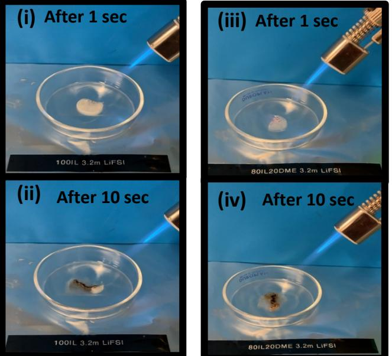

**Supplementary Fig.1**: Flammability test conducted by soaking the separator with electrolytes and holding the fire source for 10 secs. (i) 100IL electrolyte after 1sec ignition, (ii) after 10 secs of ignition, (iii) 80IL20DME electrolyte after 1sec ignition, (iv) after 10 secs of ignition. In all the cases, the electrolytes did not catch fire which proves their nonflammability.

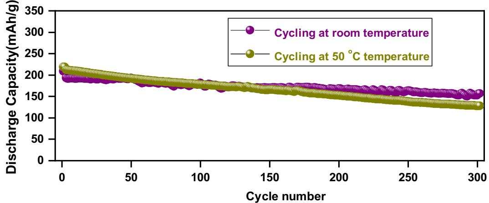

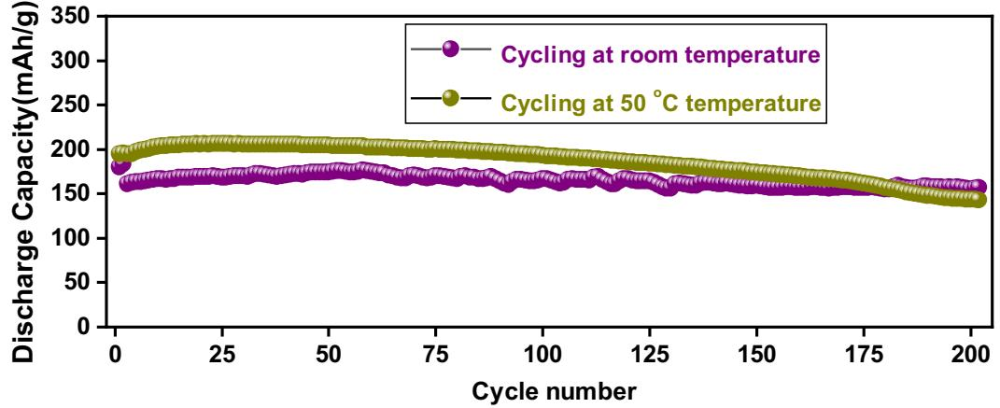

**Supplementary Fig. 3:** Comparison of NMC622|Li cell cycling using 80IL20DME electrolyte at room temperature and 50 o C within the potential range 2.8 V- 4.3 V at a current density of 0.5 mA/cm2 after two formation cycles at 0.1 mA/cm2 . NMC622 has an areal loading ~5.86 mg/cm2 and a thin Li source (50 μm) was used to study these cells cycling.

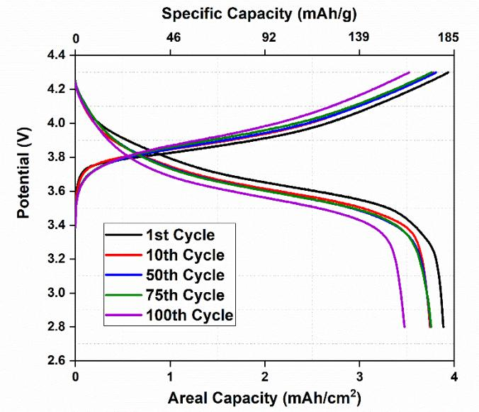

**Supplementary Fig. 4:** Voltage profile of NMC622 (mass loading ~ 22.4 mg/cm2 ) vs Li using 80IL20DME electrolyte at room temperature.

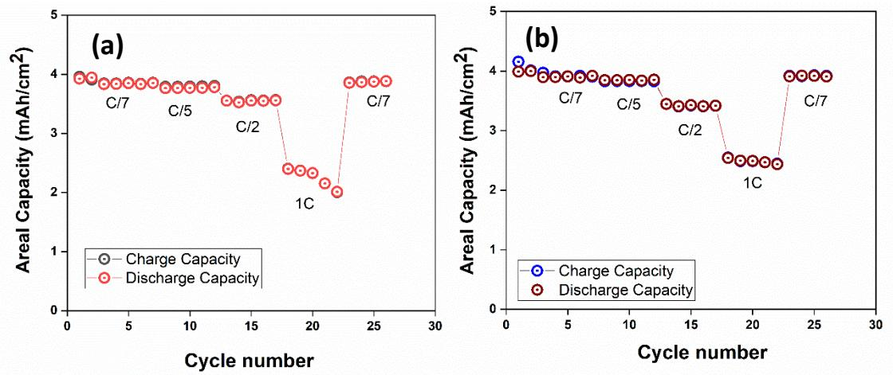

**Supplementary Fig. 5:** (a) Rate performance of NMC622 (cathode areal loading ~22.4 mg/cm2 ) vs Li (thickness 100μm) cell cycling at room temperature at a constant charge rate 0.5 mA/cm2 with different discharge rates, (b) Constant discharge rate of 0.5mA/cm2 with

different charge rates.

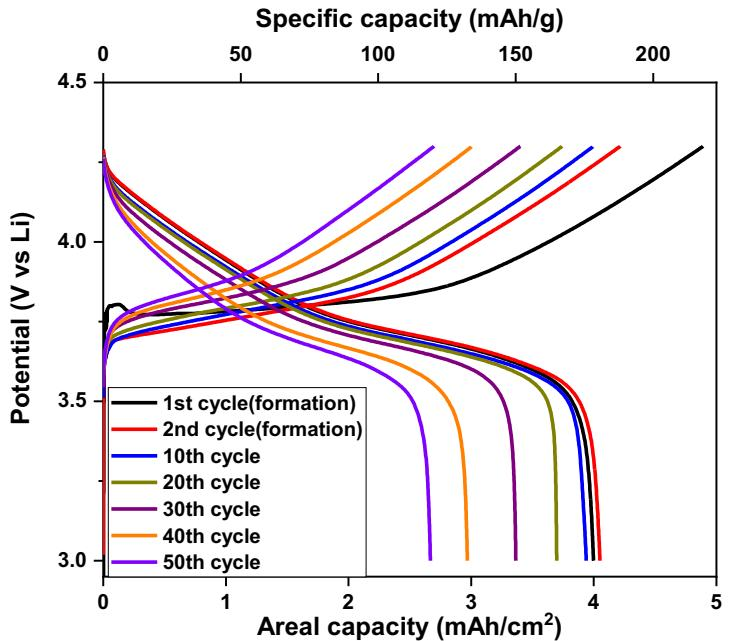

**Supplementary Fig. 6:** Voltage profile of NMC622 (mass loading ~ 22.4 mg/cm2 ) vs Cu using 80IL20DME electrolyte at room temperature.

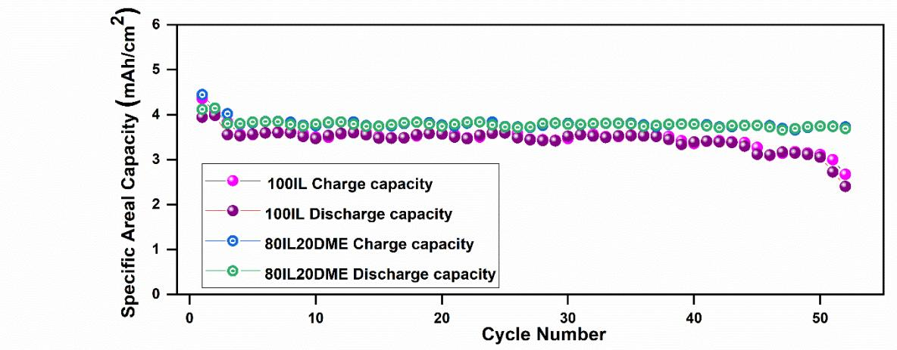

**Supplementary Fig. 7:** NMC622 (mass loading ~ 22.4 mg/cm2 ) vs Li cell cycling using 100IL and 80IL20DME electrolytes at a high current density of 1.75 mA/cm2 at elevated temperature 50 ˚C. The cycling were carried out after two formation cycles at 0.35 mAh/cm2 current density. Elevated temperature was chosen to facilitate the neat IL (100IL) electrolytes' cycling since it is very viscous at room temperature (see the table below for other physical properties).

| Chemical Composition                             | Electrolyte Name | Bulk ionic conductivity (mS/cm) | Ionic conductivity with separator (mS/cm) | Viscosity (mPa.S) | Density (g/cc) | 7 Li Diffusivity (m2 /s) |
|-----------------------------------------------------|---------------------|---------------------------------------|-------------------------------------------------------|----------------------|-------------------|--------------------------------------|
| 3.2m LiFSI in C3mpyrFSI IL                       | 100IL               | 0.66                                  | 0.07                                                  | 450                  | 1.55              | 2.7E-12                              |
| 3.2m LiFSI in C3mpyrFSI IL/DME 80/20 (wt%) | 80IL20DME           | 2.37                                  | 0.76                                                  | 92                   | 1.43              | 1.22E-11                             |

**Supplementary Table 1.** Physical properties of ionic liquid electrolytes at 20 ˚C 1

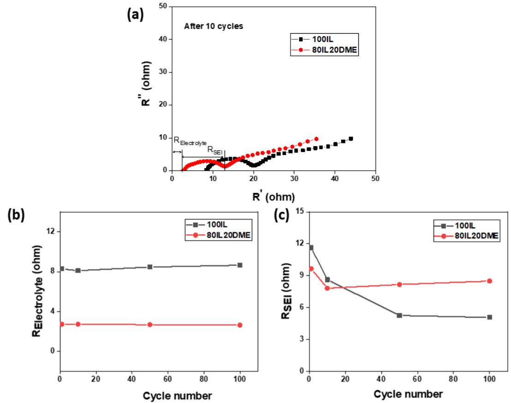

**Supplementary Fig. 8:** a) EIS plot after 10 cycles in Li|Li symmetrical cell, b) Relectrolyte vs cycle number, c) RSEI vs cycle number using 100IL (black) and 80Il20DME (red) electrolytes

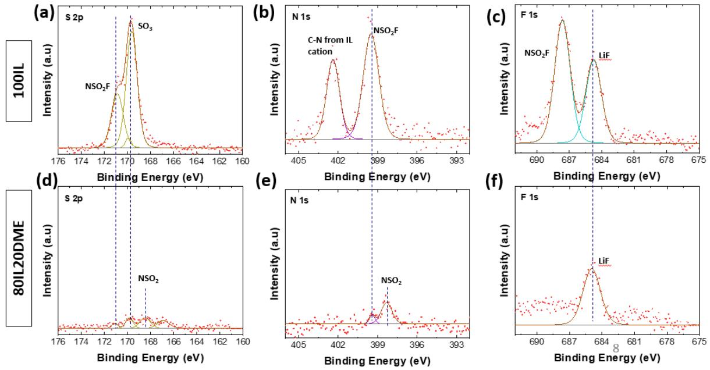

**Supplementary Fig. 9:** Comparison of XPS spectra of S 2p, N 1s and F 1s of post cycling Li|Li symmetrical cell after 100 cycles by using 100IL and 80IL20DME electrolytes.

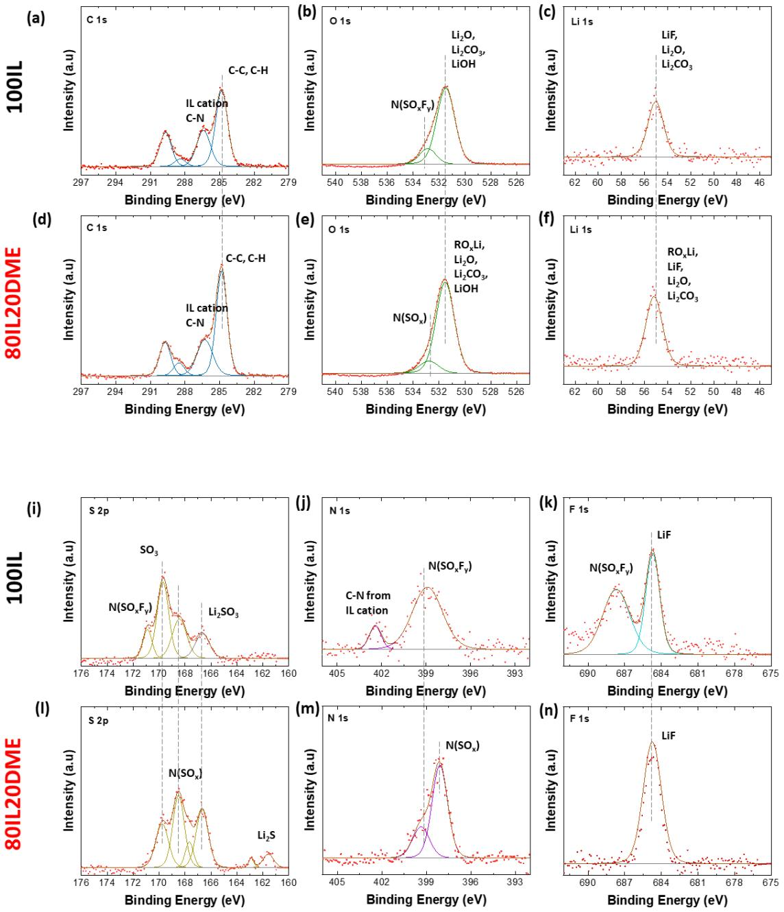

**Supplementary Fig. 10:** Comparison of XPS spectra of C 1s, O 1s, Li 1s, S 2p, N 1s and F 1s on Li metal anode after 50 cycles of NMC622 vs Li cell by using 100IL and 80IL20DME electrolytes at a current density of 1.75 mA/cm2 .

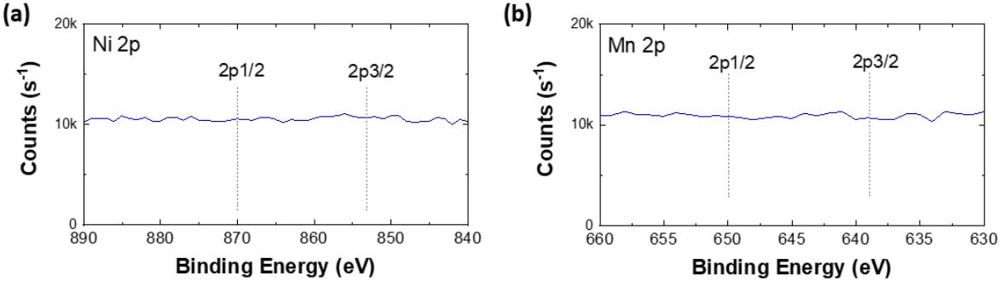

**Supplementary Fig. 11:** XPS spectra of Ni 2p and Mn 2p after 50 cycles at 1.75 mA/cm2 current density using 80IL20DME electrolyte.

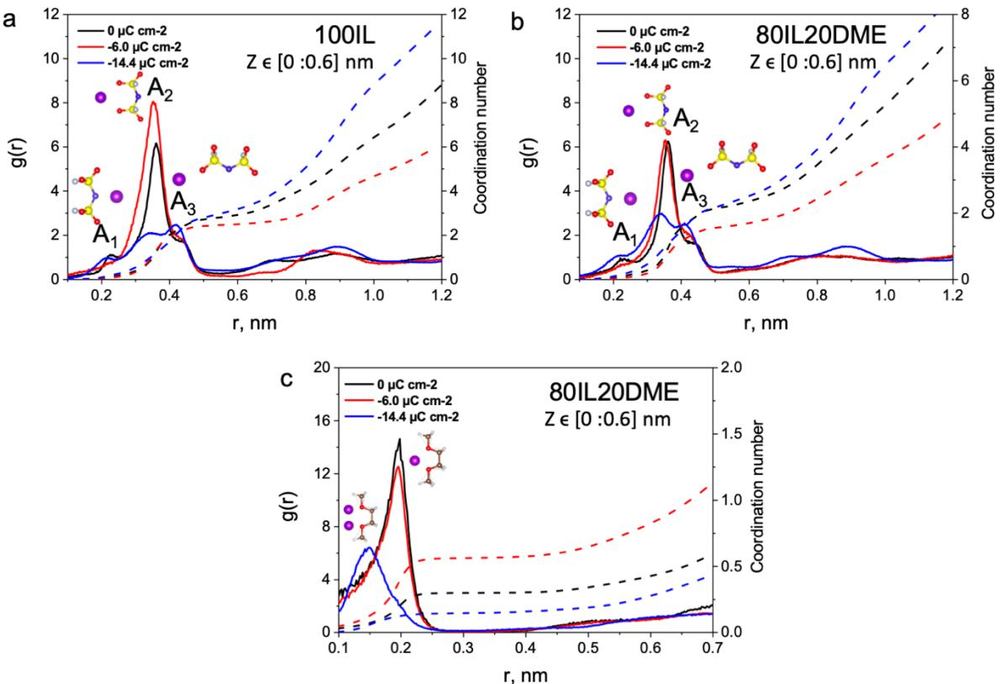

**Supplementary Fig. 12:** Radial distribution function (RDF) and coordination number calculated between selected Li+ and FSI (NFSI) or Li+ and DME (ODME) in different Z intervals of [0.0 : 0.6] nm from the Li electrode surface. **a**, Li-NFSI RDFs for 100 IL. **b**, Li-NFSI RDFs for 80IL20DME. **c**, Li-ODME RDFs for 80IL20DME.

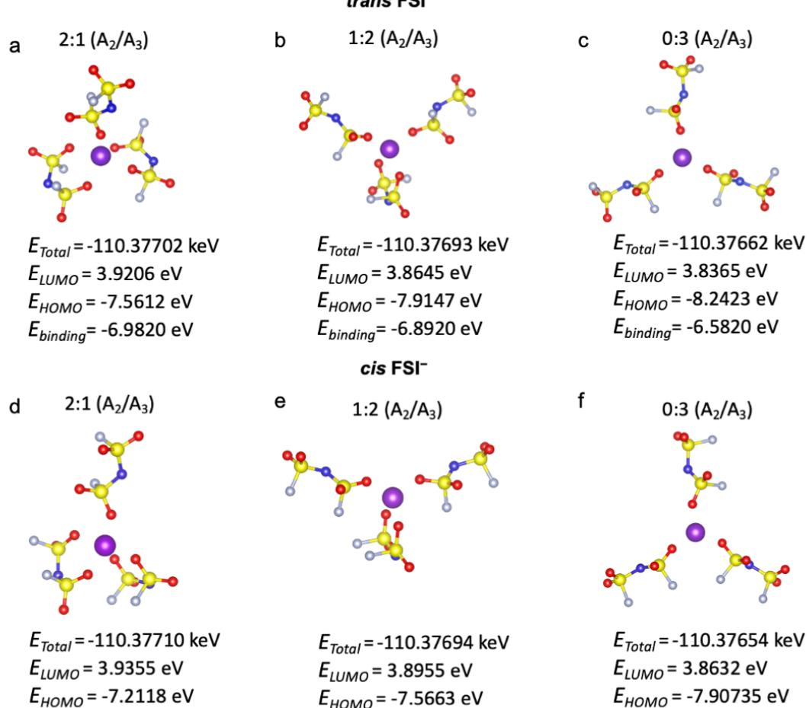

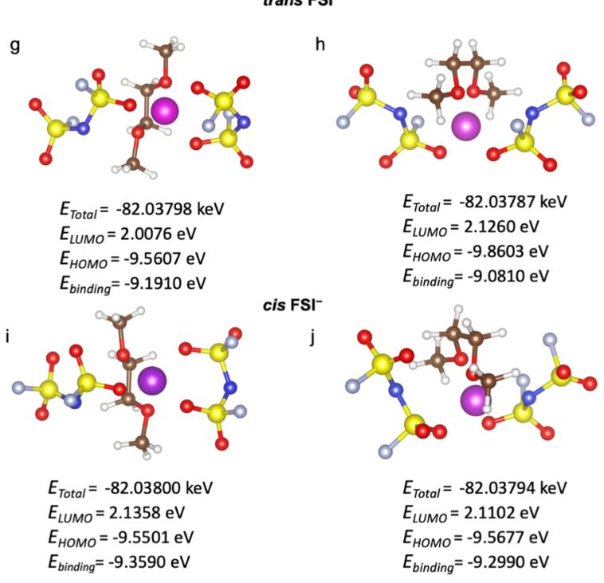

**Supplementary Fig. 13.** Optimized geometries, energies of molecular orbitals, and calculated biding energy at MP2/6-311++G(d,p) level for (a-b) *trans* and (d-f) *cis* conformation [Li(FSI)3] -2 complexes with 2:1, 1:2, and 0:3 coordination A2/A3 ratio found in the innermost layer of 100IL and 80IL20DME systems. The color codes of atoms are as follows: lithium (violet), nitrogen (dark blue), sulfur (yellow), oxygen (red), fluorine (light blue). Optimized geometries, energies of molecular orbitals, and calculated biding energy at MP2/6- 311++G(d,p) level for (g, h) *trans* and (i, j) *cis* conformation [Li(DME)(FSI)2] -1 complexes 1:1, and 0:2 coordination A2/A3 ratio for FSI− anions. The color codes of atoms are as follows: lithium (violet), nitrogen (dark blue), sulfur (yellow), oxygen (red), fluorine (light blue), carbon (brown), white (hydrogen). Quantum calculation were carried out with the Gaussian (G09) package using density functional theory (DFT) 2 . The geometrical structures and vibrational modes of all single ions and molecules were calculated at Møller-Plesset second order perturbation theory level (MP2) with a 6-31+G(d,p) basis set in a gas phase, whereas less computationally expensive M05-2X/6-31+G(d,p) method was applied for large clusters 3 . Total energies of clusters and their frontier orbitals were obtained via single point calculations with polarizable basis set MP2/6-311++G(d,p) 4,5 . The cluster binding energy of [Li(FSI)3] -2 and [Li(DME)(FSI)2] -1 was calculated as !"#\$"#% = &'&() ([Li(FSI)+]] ,-) − &'&()(.) − 3 ∗ &'&()() and !"#\$"#% = &'&() ([Li(DME)(FSI)-]] ,/) − &'&()(.) − &'&()() − 2 ∗ &'&()(), respectively.

**Supplementary Table 2.** The composition of the innermost layer of 100IL and 80IL20DME within 0.60 nm from the Li(100) top surface. The number of each species was averaged from the whole 40 ns of MD trajectory.

| Electrolyte type | Composition      | Interface Interface |                | Interface        |  |
|------------------|------------------|------------------------|----------------|------------------|--|
|                  | (Ions/Molecules) | composition at         | composition at | composition at - |  |
|                  |                  | 0 μC/cm2               | -6.0 μC/cm2    | 14.4 μC/cm2      |  |
|                  |                  |                        |                |                  |  |
|                  | C3mpyr+          | 17.65                  | 24.0           | 6.73             |  |
| 100IL            | FSI−             | 34.59                  | 23.61          | 46.72            |  |
|                  | Li+              | 19.53                  | 12.06          | 57.85            |  |
|                  |                  |                        |                |                  |  |
|                  | C3mpyr+          | 18.20                  | 17.05          | 14.0             |  |
| 80IL20DME        | FSI−             | 29.33                  | 20.04          | 32.23            |  |
|                  | Li+              | 15.50                  | 19.0           | 43.0             |  |
|                  | DME              | 5.19                   | 14.01          | 5.65             |  |

**Supplementary Table 3.** Simulated and experimental mass density (g/cm3 ) for 100IL and 80IL20DME at 298, 323, and 393 K. The error of density is calculated based on (DMD-Dexp)/Dexp ´ 100%.

| Temperature, K | 100IL  |        | 80IL20DME |        |        |        |
|----------------|--------|--------|-----------|--------|--------|--------|
|                | MD,    | Exp,   | Error, %  | MD,    | Exp,   | Error, |
|                | g cm-3 | g cm-3 |           | g cm-3 | g cm-3 | %      |
| 298            | 1.552  | 1.54   | 0.77      | 1.448  | 1.418  | 2.11   |
| 323            | 1.53   | 1.52   | 0.65      | 1.442  | 1.399  | 3.07   |
| 393            | 1.462  | −      | −         | 1.353  | −      | −      |

#### **Molecular Dynamics Simulation Details**

Initially, the bulk phase of 100IL and 80IL20DME was analysed based on 216 ion pairs randomly packed in cubic simulation box using Packmol code 6 . All electrolytes were equilibrated firstly at 293, 323 and 393 K for more than 10 ns using the NPT ensemble and the Nose-Hoover and Parrinello-Rahman methods for temperature and pressure coupling. The densities were calculated through additional 7 ns MD trajectory. The pressure is 1 bar. The electrostatic interactions were computed using PME methods. A FTT grid spacing of 0.1 nm and cubic interpolation for charge distribution were used to compute electrostatic interaction in reciprocal space. The cut-off distance of 1.2 nm was adopted for electrostatics and Van der Waals interactions. The LINCS algorithm was used to constrain the C-H bond. The Velocity Verlet integrator was adopted with a time step of 1 fs.

For the interface simulation, 600 ion pairs were used in the simulation box. The x and y dimensions of simulation box were fixed at 4.21 nm, while z dimension of the electrolytes were decided based on bulk phase densities calculated at 393 K. The extra vacuum space of two electrodes separation distance was adopted to compensate for image charge effect resulting from simulation in slab geometry 7 (Figure 8, supplementary). The electrodes charging was assigned by uniform distribution of elementary charges within the top layer of Li (100) surface (where, ±16.0 μC/cm2 = ±1.0 e/nm2 ). The initial annealing procedure of 12 ns was applied by gradually changing the temperature from 393 K to 700 K and back to 393 K in order to provide sufficient dynamic and reasonable interfacial structure 8 . Then, the 40 ns NVT production run was conducted at 393 K. The short-range ion-surface interactions were calculated by PPE summation method with FFT grid spacing of 1.2 nm 9 . Trajectory was written every 2 ps and analysed with MDAnalysis code whenever particular tool was unavailable in GROMACS package 10.

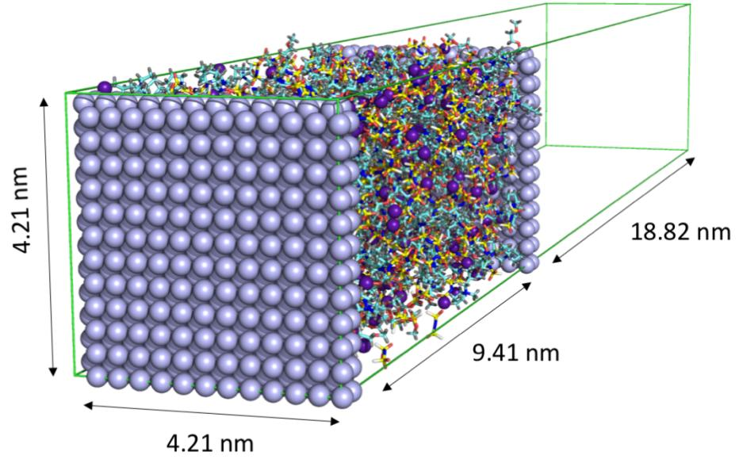

**Supplementary Fig. 14.** Simulation box representation for Li (100) I 80IL20DME |Li (100) at 393 K.

# **References**

- 1 Pal, U. *et al.* Enhanced ion transport in an ether aided super concentrated ionic liquid electrolyte for long-life practical lithium metal battery applications. *Journal of Materials Chemistry A* **8**, 18826-18839, doi:10.1039/D0TA06344D (2020).
- 2 Gaussian 16 Rev. C.01 (Wallingford, CT, 2016).
- 3 Han, S.-D., Borodin, O., Seo, D. M., Zhou, Z.-B. & Henderson, W. A. Electrolyte Solvation and Ionic Association. *Journal of The Electrochemical Society* **161**, A2042-A2053, doi:10.1149/2.0101414jes (2014).
- 4 Chen, X., Li, H. R., Shen, X. & Zhang, Q. The Origin of the Reduced Reductive Stability of Ion-Solvent Complexes on Alkali and Alkaline Earth Metal Anodes. *Angew Chem Int Ed Engl* **57**, 16643-16647, doi:10.1002/anie.201809203 (2018).
- 5 Kazemiabnavi, S., Zhang, Z., Thornton, K. & Banerjee, S. Electrochemical Stability Window of Imidazolium-Based Ionic Liquids as Electrolytes for Lithium Batteries. *The Journal of Physical Chemistry B* **120**, 5691-5702, doi:10.1021/acs.jpcb.6b03433 (2016).
- 6 Martínez, L., Andrade, R., Birgin, E. G. & Martínez, J. M. PACKMOL: A package for building initial configurations for molecular dynamics simulations. *Journal of Computational Chemistry* **30**, 2157-2164, doi:https://doi.org/10.1002/jcc.21224 (2009).
- 7 Yeh, I.-C. & Berkowitz, M. L. Ewald summation for systems with slab geometry. *The Journal of Chemical Physics* **111**, 3155-3162, doi:10.1063/1.479595 (1999).
- 8 Black, J. M. *et al.* Fundamental aspects of electric double layer force-distance measurements at liquid-solid interfaces using atomic force microscopy. *Scientific Reports* **6**, 32389, doi:10.1038/srep32389 (2016).
- 9 Darden, T., York, D. & Pedersen, L. Particle mesh Ewald: An N⋅log(N) method for Ewald sums in large systems. *The Journal of Chemical Physics* **98**, 10089-10092, doi:10.1063/1.464397 (1993).
- 10 Michaud-Agrawal, N., Denning, E. J., Woolf, T. B. & Beckstein, O. MDAnalysis: A toolkit for the analysis of molecular dynamics simulations. *Journal of Computational Chemistry* **32**, 2319-2327, doi:https://doi.org/10.1002/jcc.21787 (2011).