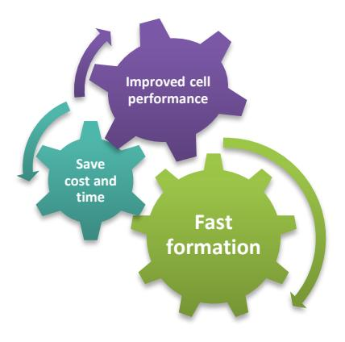
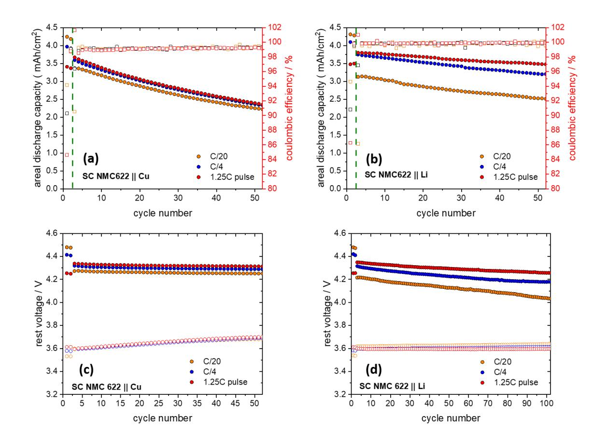
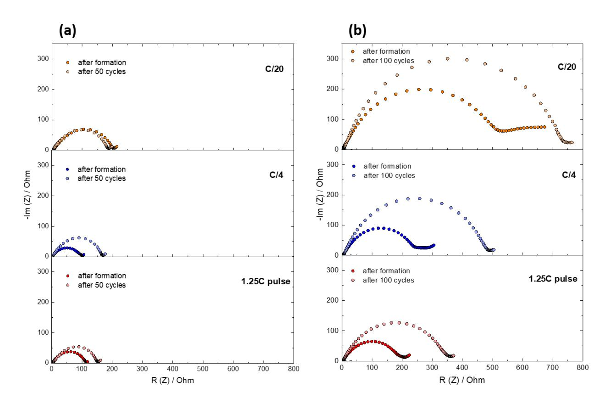
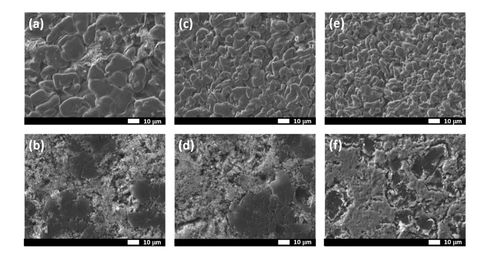
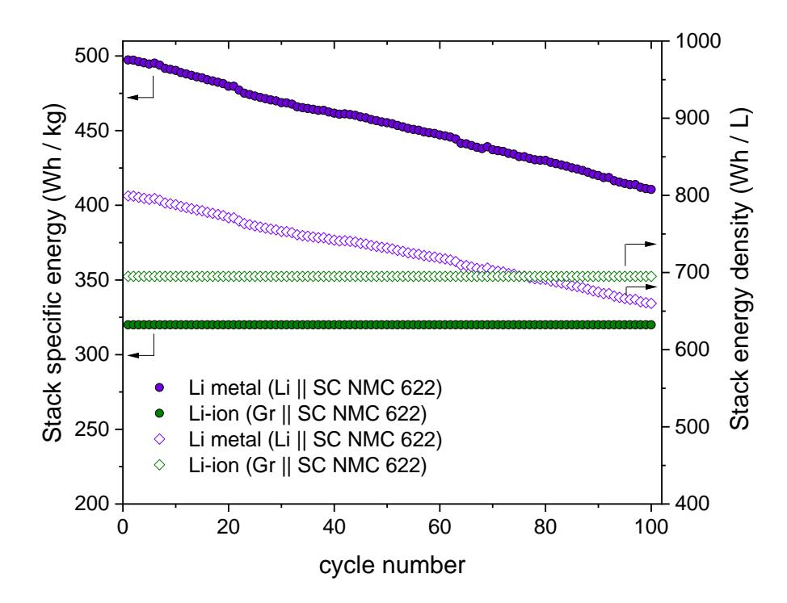
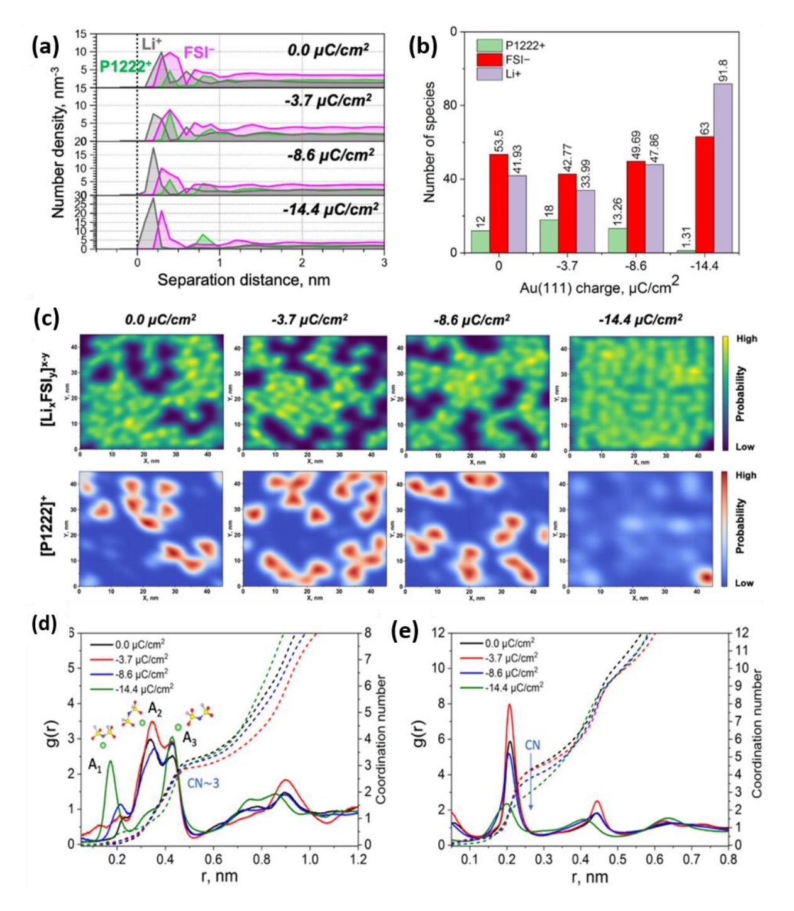
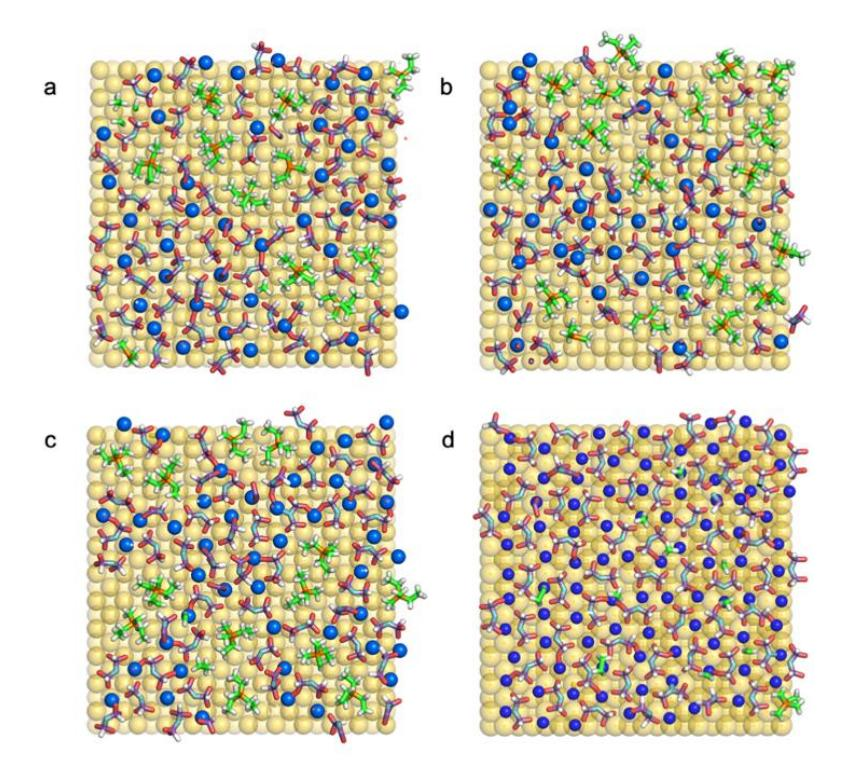
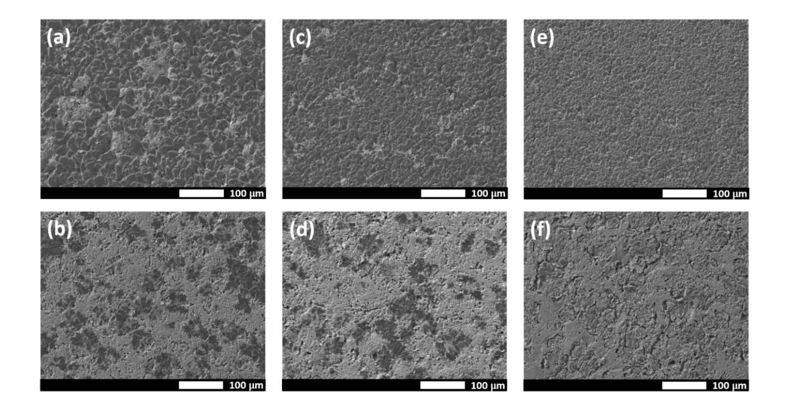
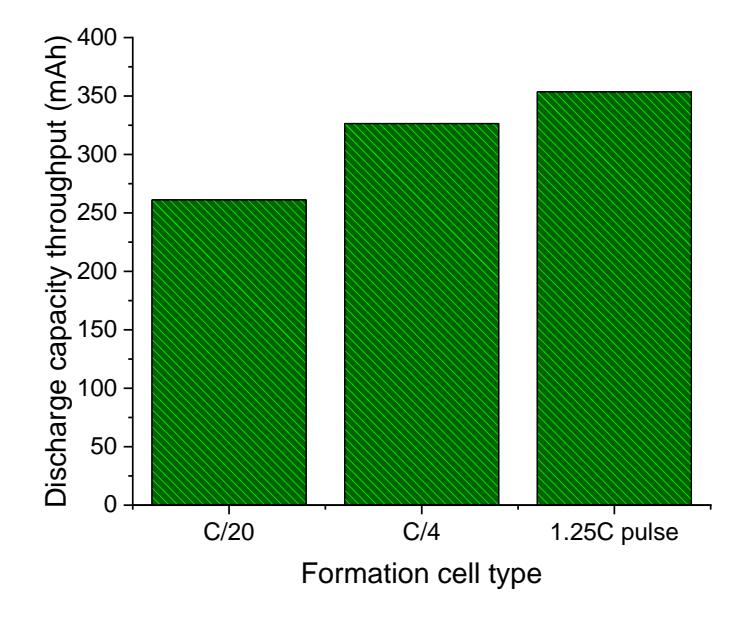

# Improving cycle life through fast formation using a super-concentrated phosphonium based ionic liquid electrolyte for anode-free and lithium metal batteries

*Thushan Pathirana, Dmitrii A. Rakov, Fangfang Chen, Maria Forsyth, Robert Kerr and Patrick C. Howlett*

Deakin University, Institute for Frontier Materials (IFM), 221 Burwood Highway, Burwood,

Victoria, 3125, Australia

# AUTHOR INFORMATION

# **Corresponding Author**

\* Corresponding author: patrick.howlett@deakin.edu.au

# ABSTRACT

Cell formation of lithium-ion cells impacts the evolution of the solid electrolyte interphase (SEI) and the cell cycle stability. Lithium metal anodes are an important step in the development of high energy density batteries owing to the high theoretical specific capacity of lithium metal. However, most lithium metal battery research has used a conventional lithium-ion formation protocol; this is time consuming, costly and does not account for the different properties of the lithium metal electrode. Here, we have used a recently reported promising phosphonium bis(fluorosulfonyl)imide ionic liquid electrolyte coupled with an NMC622 high areal capacity cathode (>3.5 mAh/cm2 ) to investigate the effect of cell formation rates. A faster formation protocol comprised of a pulsed 1.25C current decreased the formation time by 56 % and gave a 38 % greater capacity retention after 50 cycles when compared to formation at C/20. Electrochemical impedance spectroscopy measurements showed that the fast formation gave rise to a lowerresistance SEI. Column-like lithium deposits with reduced porous lithium domains between the particles were observed using scanning electron microscope imaging. To underline the excellent performance of these high energy-density cells, a 56 % greater stack specific energy was achieved compared to the analogous graphite-based lithium-ion cell chemistries.

# **TOC GRAPHICS**

The global demand for high energy rechargeable batteries has grown exponentially over the past decade[1]. Li-ion batteries play a major role in electric vehicles due to their attractive energy density and specific energy. However, the cost of a lithium-ion battery pack in electric vehicles accounts for ~40 % of the total cost of the vehicle[2]. In fact, one of the costliest processes in battery manufacturing is the formation step and typically this process can take between 3-7 days for Li-ion batteries[3]. During the formation step the electrolyte and the anode reacts to form a protective layer known as solid electrolyte interphase (SEI)[4]. The SEI protects both electrolyte and the anode from further decomposition. A good SEI is electronically insulating and ionically conducting. The stability and properties of the SEI affect the long-term cycling performance of the cell[5].

Lithium metal batteries could potentially increase the energy density by more than 50% above the current-state-of-the-art lithium-ion batteries (at the cell level)[6]. However, lithium metal is thermodynamically unstable in the presence of traditional organic electrolytes. This leads to a poor SEI, where lithium can deposit non-homogeneously. This could either lead to cell short-circuiting which poses a safety hazard or, due to the high-volume expansion of lithium, the SEI could rupture and freshly exposed lithium surfaces could continue to react with electrolyte and lead to cell death via electrolyte depletion. During the discharging process, deposited lithium can detach and form electrochemically inactive lithium and this leads to poor cycling performance[7]. Many strategies are proposed to overcome these barriers and to yield a better SEI which could deposit lithium homogeneously with a low surface area. Most of the proposed methods such as 3D current collector engineering[8–10], ex-situ protective coatings on lithium surface[11,12] and advanced separator engineering[13–15] will increase the cost due to complexity in manufacturing process compared to Li-ion batteries. On the other hand, adopting similar strategies as those in use for Liion battery optimisation, such as electrolyte formulation and formation cycling protocols, may be a more cost-effective way to advance Lithium metal batteries (LMBs).

Different electrolyte formulations have been widely investigated for LMBs, with ether-based systems being amongst the more popular solvents. Their intrinsic instability against high voltage cathodes (> 4V) and volatile nature at low concentrations is mitigated by super-concentrated electrolytes[16–19]. Ionic liquid electrolytes (ILEs) are well studied with lithium metal and offer good properties such as non-flammability, electrochemical stability at high voltages, thermal stability at high temperatures and near-zero volatility [20]. Super-concentrated ionic liquid electrolytes have also shown improved transport properties, such as higher lithium transference numbers up to 0.4[21,22]. In order to improve properties such as low viscosity, high conductivity and wettability to support high C-rate cycling in super-concentrated electrolytes, incorporation of diluents or additives into these electrolytes has also been investigated[23–26]. In all of these cases so far, a formation step at either C/20 or C/10 was used similar to Li-ion batteries. Li-ion batteries are vulnerable at high C rate formation due to lithium plating on the graphite anode which could deposit in dendritic form causing short-circuits and inducing thermal runaway in the cell. Alternatively, deposited lithium could react with the electrolyte, resulting in loss of electrochemically active lithium and leading to a rapid fading of cell capacity[27].

Only a few studies have explored different avenues to improve the formation step in lithium metal batteries by means of electrochemistry. Wang et al., used a cyclic voltammetry premodulation technique to improve lithium electrodeposition kinetics on Li metal in Li || Li and Li || Cu cells using a diluted solvate ionic liquid electrolyte [28]. Aleshin et al., applied high voltage pulses to rapidly oxidize and reduce the Lithium metal in Li || Li symmetric cell studies using organic electrolyte [29]. The increased surface reactivity on the lithium surface eliminates

heterogeneous reaction pathways and improves lithium morphology. In our previous study, we used high current density pulses to improve lithium morphology as a result of an inorganic rich SEI formation during pre-condition cycles[30]. The Li || Li symmetric cell was able to retain its compact structure while maintaining low cell impedance in long term cycling.

In this study we compared the effect of high current density pulses (4.38 mA/cm2 , 1.25C) with medium (0.88 mA/cm2 , C/4) and low (0.18 mA/cm2 , C/20) current densities during formation in long -term cycling under an industrially applicable current density (1.75 mA/cm2 , C/2), in both anode-free cells as well as lithium metal cells, by coupling a high voltage single crystal NMC 622 cathodes (3.5 mAh/cm2 ) with an upper cut-off voltage of 4.5 V. The cells with fast formation were able to deliver significantly higher capacity retention compared with those that underwent a slow formation. This is shown by improving cell impedance and supporting a favourable lithium morphology after formation.

Anode-free cells offer rapid feedback on cell performance due to limited lithium inventory in the cell [35]. However, the deposition on a copper substrate is sensitive to the surface preparation and may not accurately reflect Li cycling on a lithium metal substrate. As such, both anode-free cells (SC NMC 622 || Cu) and Li metal full cells (SC NMC 622 || Li) were prepared in order to gain a more complete picture regarding the effect of formation conditions (and to some extent the role of lithium inventory) on the long-term cycle performance. Table 1 summarizes the key electrochemical parameters of these cells when subjected to two formation cycles carried out at selected current profiles (C/20, C/4 and pulsed-1.25C). 1.25C was chosen for the pulsed-current formation regime as rate limitations at the cathode are encountered at higher C-rates that effectively reduce the capacity achieved during charge. This effect is still observed, to a lesser extent, for the pulsed 1.25C charge whereby only 4.03 mAh/cm2 is obtained upon the first formation cycle charge step. This is compared to 4.50 mAh/cm2 when charged at C/20. In our previous report, we also showed that the pulsed-charge approach is able to effectively mitigate the tendency for dendrite-induced short-circuit when cycled at high rates in Li|Li symmetric cells [30]. The improved performance here was found to be a result of the fluorine rich SEI with improved Li diffusion kinetics through the SEI, leading to large-grained and columnar lithium metal deposits.

During the first formation cycle, the NMC || Li cells experience an irreversible capacity loss of 0.24, 0.41, and 0.55 mAh/cm2 for the C/20, C/4, and pulsed 1.25C cells, respectively. Given that the amount of charge that is consumed during SEI is recovered upon the subsequent discharge due to the over-supply of Li in the underlying substrate, the majority of the capacity loss is assigned to the kinetics of Li+ insertion into the NMC cathode when operating at a discharge cut-off of 2.8 V. It has been shown that a deep discharge down to 1.5 V versus Li+ |Li is required in order to achieve full lithium-ion insertion into the NMC structure[36]. Comparing the first formation cycle Coulombic Efficiency (CE) with the Cu cells, shows that there is only a minor difference in CE of around 0.5-2% across the various formation rates.

At the beginning of long-term cycling at C/2, a significant drop in discharge capacity occurs for the cells formed at C/20 and C/4; for the pulsed-current cell the discharge capacity actually increases (Figure 1a and 1b). Further, the cumulative discharged capacity over the 100 cycles is significantly higher (35 %) for the 1.25 C pulsed-current formation cells than for the C/20 cells (see Figure S4). It is interesting to note that the pulsed-current cells cycle the lowest capacities during formation but achieve the highest discharge capacities from the outset of long-term cycling. The 1.25C pulsed-current formation had the largest irreversible capacity loss during formation (0.66 mAh/cm2 and 0.56 mAh/cm2 for SC NMC622 || Cu and SC NMC622 || Li, respectively), indicating that its superior C/2 discharge capacity is not related to the loss of lithium inventory during formation. The consistent trends observed between both anode-free cells and lithium metal full cells is evidence of the fact that the formation cycling conditions are primarily responsible for differences in long term cycling performance, rather than the presence of an excess lithium reservoir at the anode. The superior discharge capacity and retention of the pulsed-current 1.25C formation step is thus attributed to the composition and morphology of the deposit that is established during the formation cycles.

**Table 1**. Summary of electrochemical performance during C/2 cycling of SC NMC 622 || Cu and SC NMC 622 || Li cells with various formation rates.

| Cell formation | st formation cycle 1             |                                        |                         |                                                                              | Long-term C/2 cycling                                   |                                           |                               |  |  |
|-------------------|-------------------------------------|----------------------------------------|-------------------------|------------------------------------------------------------------------------|---------------------------------------------------------|-------------------------------------------|-------------------------------|--|--|
|                   | Charge capacity (mAh/cm2 ) | Discharge capacity (mAh/cm2 ) | Coulombic Efficiency | Irreversible capacity loss; st 1 cycle/total (mAh/cm2 ) | st cycle 1 discharge capacity (mAh/cm2 ) | Capacity retention (after 50 cy) | Average CE (1-50 cy) |  |  |
| SC NMC 622    Cu  |                                     |                                        |                         |                                                                              |                                                         |                                           |                               |  |  |
| C/20              | 4.50                                | 4.24                                   | 94.18 %                 | 0.26/0.32                                                                    | 3.37                                                    | 52.4 %                                    | 99.03 %                       |  |  |
| C/4               | 4.40                                | 3.97                                   | 90.30 %                 | 0.43/0.46                                                                    | 3.59                                                    | 54.9 %                                    | 99.11 %                       |  |  |
| 1.25C pulse       | 4.03                                | 3.41                                   | 84.64 %                 | 0.62/0.66                                                                    | 3.67                                                    | 55.5 %                                    | 99.15 %                       |  |  |
| SC NMC 622    Li  |                                     |                                        |                         |                                                                              |                                                         |                                           |                               |  |  |
| C/20              | 4.55                                | 4.31                                   | 94.64 %                 | 0.24/0.27                                                                    | 3.10                                                    | 58.2 %                                    | 99.52 %                       |  |  |
| C/4               | 4.51                                | 4.10                                   | 90.84 %                 | 0.41/0.43                                                                    | 3.75                                                    | 74.3 %                                    | 99.79 %                       |  |  |
| 1.25C pulse       | 4.03                                | 3.48                                   | 86.27 %                 | 0.55/0.56                                                                    | 3.80                                                    | 80.6 %                                    | 99.91 %                       |  |  |

**Figure 1**. Areal discharge capacity and coulombic efficiency for (a) SC NMC 622 || Cu and (b) SC NMC 622 || Li cells at 50 °C. Cells were cycled 2 formation cycles at C/20 (orange), C/4 (blue) and 1.25C pulse (red) followed by 50 cycles at C/2; rest voltage after charge (closed circles) and after discharge (open circles) for (c) SC NMC 622 || Cu and (d) SC NMC 622 || Li cells

Recently Gao et al. introduced a technique to evaluate the major failure mechanisms for metalbased batteries[38]. This technique evaluates the failure mechanism based on rest voltage, which reflects the state of charge of the cell. Based on this technique we evaluate the major failure mechanism responsible for the anode-free cells and lithium metal based full cells. Figure 1c indicates that, in anode-free cells, the rest voltage after discharge (Vd) slowly increases and the rest voltage after charge (Vc) is stable throughout its cycle life. The Vd increase is due to lithium inventory loss, owing to limited lithium inventory in these cells. Figure 1d indicates for lithium metal based full cells, Vd is stable and Vc decreases with cycle number. This indicates the major failure mechanism is due to increase in cell impedance. Vd is stable due to excess of lithium present in the cell, therefore the cathode is able to re-lithiate completely after the discharge process. However, Vc decreases due to build-up of SEI and dead lithium in these cells. In anode-free cells the amount of dead lithium build-up is less due to limited amount of lithium present therefore the impedance increase is slower than in lithium based full cells. By closely monitoring Figure 1d, we observed the rate of voltage decay in Vc for C/20 formation cells is higher than the cells with C/4 or 1.25C pulse formation cells. This indicates that either dead lithium or SEI build-up (or both) are much higher for C/20 formation cells compared to the other cells. This could be arising from a less stable SEI formed during the formation stage in these cells and/or from differences in the initial deposit morphology and hence electrode surface area.

To probe the cell resistance of the cycled cells, PEIS spectra were acquired at open circuit voltage (OCV) after the cells were completely charged. Figure 2a compares the PEIS spectra of SC NMC 622 || Cu cells and Figure 2b compares the PEIS spectra of SC NMC 622 || Li cells. Both cells clearly show that the formation process has a significant impact on the initial and long-term cell impedance. The cells with C/20 formation yield the highest cell impedance and the cells with 1.25C pulse formation yield the lowest cell impedance. This data is in agreement with our previous study using the same super-concentrated phosphonium IL electrolyte, where Li symmetrical cells showed lower impedance at higher current densities after pulse formation, compared to cells cycled at low current densities with constant current formation[30]. For the anode-free cells, the cell impedance increased after 50 cycles for C/4 and 1.25C formation cells. However, for C/20 formation the cell impedance slightly decreased. This cell impedance is still higher than the C/4

and 1.25C cell impedance after 50 cycles. For the lithium metal-based cells, the cell impedance increased for all the cells after 100 cycles. Given that these cells were cycled for twice the number of cycles, the increase in cell impedance is comparable. However, the cell impedance after formation for the Li-metal based full cells is higher than the anode-free cells. Due to the excess lithium present in these cells, inactive lithium continued to accumulate throughout the cycling process, forming a more resistive SEI and thus increasing the cell impedance after long-term cycling. For the 1.25C pulse formed cells, the cell impedance after cycling is still lower compared to the C/20 formed cells. This implies that during cycling the SEI in the pulsed formed cells was stable and led to less inactive lithium formation and accumulation during cycling. This data agrees with the previous data in Figure 1b by retaining high-capacity retention and Figure 1d by maintaining a relatively stable Vc during the cell rest stage.

**Figure 2**. PEIS spectra taken at OCV at top of charge for (a) SC NMC 622 || Cu, (b) SC NMC 622 || Li coin cells after 2 formation cycles and after long-term cycling at C/2.

Figure 3 shows the lithium morphology after formation and after 50 cycles for the anode-free cells at 100 % state of charge (SOC). After C/20 formation (Figure 3a), most of the lithium particles were uniform, column-like compact structures with an average particle size of around 16 μm. However, there are porous lithium domains in-between these particles. For the C/4 formation lithium surfaces (Figure 3c), similar column-like particles with an average particle size of around 9 μm are obtained and there were less porous domains in between the column-like particles, compared with the C/20 formation cells. The 1.25C pulse formed cells (Figure 3e) had the smallest column-like particles with an average diameter of around 7 μm and there were no porous domains in between the particles. This data agrees with previous studies, where the number density of nuclei was shown to increase and the particle size decrease with increased current density[39][40]. After 50 cycles, both C/20 and C/4 lithium surfaces (Figure 3b and 3d) were dominated by porous lithium domains and few column-like particles. For the 1.25C pulsed cells after 50 cycles (Figure 3f), porous lithium domains were also evident. However, they were less porous than the other cells (Figure 3b and 3d). We can postulate that the highly porous lithium may be inactive lithium that resulted from continuous lithium metal consumption during cycling due to a less stable, more resistive SEI being formed at the grain boundary of the particles. More comparisons of the porous lithium network and column-like structures are shown in Figure S3.

**Figure 3**. SEM images after 2 formation cycles (a) C/20, (c) C/4, (e) 1.25C pulse followed by 50 cycles at C/2 (b) after C/20, (d) after C/4, (f) after 1.25C in SC NMC 622 || Cu cells. Images were taken at the charged state.

Stack energy density is an important metric to compare across different battery technologies without the interference of different cell types or cell factor. In the presence of excess lithium relative to the cathode (N/P > 5), the energy density can be lower than lithium-ion batteries[41]. A stack is comprised of two layers of cathode, anode, separator and a single layer of cathode and anode current collector. The mass of electrolyte was not included to allow comparison with literature reports. The cell parameters used for the calculation are given in Table S2. Both stack specific energy and stack energy density was calculated and compared against a Li-ion analogue of the lithium metal cell cycled after 1.25C formation (Figure 4). The lithium metal cell offers ~56 % increase in specific energy and 14 % increase in energy density compared to its Li-ion analogue cell. This advantage in specific energy was maintained throughout 100 cycles and the advantage in energy density persisted for around 75 cycles. Therefore, in terms of stack energy density it is

important to improve the coulombic efficiency of these cells to above 99.9 % while maintaining an Negative electrode capacity to Positive electrode capacity ratio ( $N/P < 3$ ) for this technology to become competitive against Li-ion for applications such as mobile devices, drones and electric vehicles[42,43]. If the lithium electrode was thicker than 80  $\mu$ m (N/P > 4), then the energy density will be below that of its Li-ion analogue. The increase in specific energy for lithium metal cells is highly appealing for electric vertical take-off and landing (eVTOL) aircraft and drone applications[44,45]. This advantage could be further enhanced by using anode-free cells.

**Figure 4.** Comparison of stack specific energy and stack energy density for Li metal and Li-ion cells based on a SC NMC 622 cathode.

Molecular level understanding of the electrode/electrolyte region under applied potential bias was obtained by means of molecular dynamic (MD) simulations. The theoretical model consisted of 50 mol% LiFSI in P1222FSI confined between two flat Au (111) electrodes (Figure S1), as previously reported for metal anode interface structural analysis [33][46].

The Au (111)|50 mol% LiFSI in P1222FSI interface was examined without applied bias and at - 3.7, -8.6, and -14.4 μC/cm2 . As shown in Figure 5a, the overall number of interfacial layers detected for the examined system was found to be around 2-3 regardless of the surface charge, similar to observations for super-concentrated NaFSI and LiFSI in pyrrolidinium FSI IL systems[46,47]. The innermost layer was defined within a distance of 0.61 nm from the Au (111) surface and the corresponding chemical compositions were examined in more detail. It was found that electrode polarization has a clear impact on the electrolyte composition in the innermost layer (Figure 5a and 5b). Specifically, the application of a negative electrode polarization of -3.7 μC/cm2 noticeably increased the number of [P1222] + cations compared to the uncharged system, while the fraction of other ion species was reduced by up to 20%. However, further negative polarization of -8.6 μC/cm2 drove the [P1222] + cations from the innermost layer towards values similar to those found at 0.0 μC/cm2 , while the [FSI]– and [Li]+ content simultaneously increased, resulting in a [Li]+ concentration 12% higher than that at 0.0 μC/cm2 . Further applied bias of -14.4 μC/cm2 reinforced this trend by dragging more [LixFSIy] x-y molten-salt-like clusters to the Au(111) surface and forced the [P1222] + cations to stay in the outer-layer, near the bulk electrolyte phase. This is again consistent with our previous observations for Na and Li salt in pyrrolidinium FSI ILs, confirming that molten-salt-like-clusters replace the IL cation species under a negative bias in super-concentrated IL electrolytes [46,47].

As shown in Figure 5c, the large interfacial coverage of [P1222] + at low negative surface charge might lead to parasitic decomposition of [P1222] + on the Li anode surface or simply blockage of sites that allow more uniform Li plating. Meanwhile, the use of higher negative polarization can eliminate these issues and bring more [LixFSIy] x-y aggregates to the surface, leading to the formation of a more favourable solid electrolyte interphase (SEI) and/or resulting in homogeneous Li deposition morphology[46].

**Figure 5.** (a) Ion number densities for Au (111) | 50 mol% LiFSI in P1222FSI obtained at 0.0 (top), -3.7, -8.6, and -14.4 μC/cm2(bottom). Dashed line represents the Au(111) surface position. (b)

The number ions ([P1222] + , [FSI]– , [Li]+ ) in the innermost layer within 0.61 nm from Au(111) surface at different applied surface charging. (c) 2D Kernel densities for the innermost layer near Au (111) surface representing Lix(FSI)y aggregates (top) and [P1222] + (bottom) coverage at different electrode charging; Radial distribution function g(r) calculated and coordination number (CN) for (d) Li-FSI pair (through Nitrogen atom) and for (e) Li-OFSI (all oxygens of FSI to Li-ion) at the innermost layer within 0.61 nm from Au(111) under different applied bias.

The nature of Li-FSI coordination within the innermost layer was also examined through calculating their radial distribution function (RDF) in order to better understand the effect of electrode charging (Figure 5d and 5e). In Figure 5d, the RDFs for Li-FSI (through the Nitrogen atom) show three obvious peaks before 0.5 nm, corresponding to A1 (Li+ coordinates to the N atom), A2 (bi-dentate, Li+ coordinates to the oxygen atoms on both sides of the N atom), and A3 (mono-dentate, Li+ coordinates to oxygen atoms on one side of the N atom) types of coordination that were previously found for other FSI and TFSI anion based electrolytes [48,49]. It is shown that the negative charge can affect the Li-FSI coordination structures, and that the mono-dentate A3 coordination becomes dominant at the highest negative surface charge, along with an increase in A1 coordination, whereas the A2 is still the most remarkable peak at the other three surface polarization charges, and this should be related to changes in the number of Li+ , FSI– and their ratio in the innermost layer. For the three relatively low surface charge densities (from 0.0 to -8.6 μC/cm2 ), this FSI/Li ratio is 1.285, 1.26 and 1.03, respectively, but it significantly decreases to 0.69 at -14.4 μC/cm2 . The number of anions coordinating with one Li+ is barely affected, whereas that of OFSI shows a decrease from ~ 4.5 to ~ 3.0 (Figure 5e), which also consistently responds to the change in the FSI/Li ratio. These observations were also found for LiFSI and NaFSI systems in pyrrolidinium FSI electrolytes, which implies that the trend in Li(Na)-FSI coordination changes upon applied bias, under the conditions given here for a Au metallic substrate, is more affected by salt concentration and additives than by the nature of the IL cation [46,47]. Molecular orbital energy analysis showed that these Li-FSI coordination changes affect both HOMO and LUMO levels [46], which suggests that the [Li(FSI)3] -2 unit is reductively unstable upon charging to -14.4 μC/cm2 , and this is important for active formation of an homogeneous inorganic rich-SEI layer[46].

We have shown that the electrochemical cell formation conditions strongly influence the cycling stability of anode-free and lithium metal based full cells when using a phosphonium based superconcentrated ionic liquid electrolyte. When a 1.25C pulsed formation step was applied, a better, less resistive SEI was generated compared to a C/20 constant current formation step. Rest voltage analysis showed that anode-free cells lost capacity due to a loss of lithium inventory whereas, lithium metal full cells lost capacity due to increased cell impedance resulting from inactive lithium build-up. The 1.25C pulsed formation step formed a SEI that was able to retain its favourable properties throughout long-term cycling by minimising the accumulation of inactive lithium and SEI thickening. PEIS spectra for 1.25C pulsed formed cells had the lowest impedance, whereas C/20 cells had the highest impedance after cell formation and long-term cycling. The size of columnar-like packed lithium particles and the amount of porous lithium domains decreased with increasing current density after formation. However, the amount of porous-lithium domains grew after long-term cycling. MD simulations showed that the formation of molten-salt like Li-FSI aggregates near the electrode at higher electrostatic potential is accompanied by the exclusion of [P1222] + cations. RDF analysis near the electrode surface showed that the nature of Li-FSI coordination changes with applied electrode potential, and high negative polarization increased

the amount of A3 mono-dentate Li-FSI coordination with low oxygen bonding. This in turn increased electron withdrawal leading to easier reduction of the FSI anion and therefore, superconcentrated electrolytes are able to form a favourable SEI during high current pulse formation cycling. The lithium metal cell with a N/P ratio < 3 offers ~500 Wh/kg stack specific energy and ~800 Wh/L stack energy density, compared to its lithium-ion analogue which had ~320 Wh/kg and ~700 Wh/L respectively. Nevertheless, it is important to develop not only new electrolyte formulations but new formation protocols for next generation lithium metal battery commercialization.

# ASSOCIATED CONTENT

**Supporting Information**. Experimental, material preparation and cell assembly, cell cycling and cell disassembly, molecular dynamics simulations, Tables S1 - S2, Figures S1 - S4

# AUTHOR INFORMATION

# **Corresponding Author**

\* Corresponding author: patrick.howlett@deakin.edu.au

# **Notes**

The authors declare no competing financial interest.

# ACKNOWLEDGMENT

The authors acknowledge Deakin University postgraduate research scholarship (T.P)

#### REFERENCES

[1] E. Fan, L. Li, Z. Wang, J. Lin, Y. Huang, Y. Yao, R. Chen, F. Wu, Sustainable Recycling Technology for Li-Ion Batteries and Beyond: Challenges and Future Prospects, Chem. Rev. (2020). doi:10.1021/acs.chemrev.9b00535.

[2] H.H. Heimes, C. Offermanns, A. Mohsseni, H. Laufen, U. Westerhoff, L. Hoffmann, P. Niehoff, M. Kurrat, M. Winter, A. Kampker, The Effects of Mechanical and Thermal Loads during Lithium-Ion Pouch Cell Formation and Their Impacts on Process Time, Energy Technol. 8 (2020) 1–12. doi:10.1002/ente.201900118.

[3] D.L. Wood, J. Li, S.J. An, Formation Challenges of Lithium-Ion Battery Manufacturing, Joule. 3 (2019) 2884–2888. doi:10.1016/j.joule.2019.11.002.

[4] E. Peled, Advanced Model for Solid Electrolyte Interphase Electrodes in Liquid and Polymer Electrolytes, J. Electrochem. Soc. 144 (1997) L208. doi:10.1149/1.1837858.

[5] X.B. Cheng, R. Zhang, C.Z. Zhao, F. Wei, J.G. Zhang, Q. Zhang, A review of solid electrolyte interphases on lithium metal anode, Adv. Sci. 3 (2015) 1–20. doi:10.1002/advs.201500213.

[6] P. Albertus, S. Babinec, S. Litzelman, A. Newman, Status and challenges in enabling the lithium metal electrode for high-energy and low-cost rechargeable batteries, Nat. Energy. (2017) 1–6. doi:10.1038/s41560-017-0047-2.

[7] D. Lin, Y. Liu, Y. Cui, Reviving the lithium metal anode for high-energy batteries, Nat. Nanotechnol. 12 (2017) 194–206. doi:10.1038/nnano.2017.16.

[8] Y. Zhao, S. Hao, L. Su, Z. Ma, G. Shao, Hierarchical Cu fibers induced Li uniform nucleation for dendrite-free lithium metal anode, Chem. Eng. J. (2019). doi:10.1016/j.cej.2019.123691.

[9] J. Xiang, Y. Zhao, L. Yuan, C. Chen, Y. Shen, F. Hu, Z. Hao, J. Liu, B. Xu, Y. Huang, A strategy of selective and dendrite-free lithium deposition for lithium batteries, Nano Energy. 42 (2017) 262–268. doi:10.1016/j.nanoen.2017.10.065.

[10] J. Pu, J. Li, K. Zhang, T. Zhang, C. Li, H. Ma, J. Zhu, P. V. Braun, J. Lu, H. Zhang, Conductivity and lithiophilicity gradients guide lithium deposition to mitigate short circuits, Nat. Commun. 10 (2019) 1896. doi:10.1038/s41467-019-09932-1.

[11] E. Kazyak, K.N. Wood, N.P. Dasgupta, Improved Cycle Life and Stability of Lithium Metal Anodes through Ultrathin Atomic Layer Deposition Surface Treatments, Chem. Mater. 27 (2015) 6457–6462. doi:10.1021/acs.chemmater.5b02789.

[12] J. Bobnar, M. Lozinšek, G. Kapun, C. Njel, R. Dedryvère, B. Genorio, R. Dominko, Fluorinated reduced graphene oxide as a protective layer on the metallic lithium for application in the high energy batteries, (2018) 1–10. doi:10.1038/s41598-018-23991-2.

[13] W.K. Shin, A.G. Kannan, D.W. Kim, Effective Suppression of Dendritic Lithium Growth Using an Ultrathin Coating of Nitrogen and Sulfur Codoped Graphene Nanosheets on Polymer Separator for Lithium Metal Batteries, ACS Appl. Mater. Interfaces. 7 (2015) 23700–23707. doi:10.1021/acsami.5b07730.

[14] M. Zhang, A.L. Gui, W. Sun, J. Becking, O. Riedel, X. He, D. Berghus, V. Siozios, D. Zhou, T. Placke, M. Winter, P. Bieker, High capacity utilization of Li metal anodes by application of Celgard separator-reinforced ternary polymer electrolyte, J. Electrochem. Soc. 166 (2019) A2142–A2150. doi:10.1149/2.1131910jes.

[15] P.J. Kim, V.G. Pol, High Performance Lithium Metal Batteries Enabled by Surface Tailoring of Polypropylene Separator with a Polydopamine / Graphene Layer, 1802665 (2018) 1– 8. doi:10.1002/aenm.201802665.

[16] X. Liu, C. Shen, N. Gao, Q. Hou, F. Song, X. Tian, Y. He, J. Huang, Z. Fang, K. Xie, Concentrated electrolytes based on dual salts of LiFSI and LiODFB for lithium-metal battery, Electrochim. Acta. 289 (2018) 422–427. doi:10.1016/j.electacta.2018.09.085.

[17] J. Qian, W.A. Henderson, W. Xu, P. Bhattacharya, M. Engelhard, O. Borodin, J.-G. Zhang, High rate and stable cycling of lithium metal anode, Nat. Commun. 6 (2015) 6362. doi:10.1038/ncomms7362.

[18] J. Qian, B.D. Adams, J. Zheng, W. Xu, W.A. Henderson, J. Wang, M.E. Bowden, S. Xu, J. Hu, J.G. Zhang, Anode-Free Rechargeable Lithium Metal Batteries, Adv. Funct. Mater. 26 (2016) 7094–7102. doi:10.1002/adfm.201602353.

[19] Y. Yamada, A. Yamada, Review—Superconcentrated Electrolytes for Lithium Batteries, J. Electrochem. Soc. 162 (2015) A2406–A2423. doi:10.1149/2.0041514jes.

[20] D.R. MacFarlane, N. Tachikawa, M. Forsyth, J.M. Pringle, P.C. Howlett, G.D. Elliott, J.H. Davis, M. Watanabe, P. Simon, C.A. Angell, Energy applications of ionic liquids, Energy Environ. Sci. 7 (2014) 232–250. doi:10.1039/C3EE42099J.

[21] M. Forsyth, G.M.A. Girard, A. Basile, M. Hilder, D.R. MacFarlane, F. Chen, P.C. Howlett, Inorganic-Organic Ionic Liquid Electrolytes Enabling High Energy-Density Metal Electrodes for Energy Storage, Electrochim. Acta. 220 (2016) 609–617. doi:10.1016/j.electacta.2016.10.134.

[22] M. Eftekharnia, M. Hasanpoor, M. Forsyth, R. Kerr, P.C. Howlett, Toward Practical Li Metal Batteries: Importance of Separator Compatibility Using Ionic Liquid Electrolytes, ACS Appl. Energy Mater. 2 (2019) 6655–6663. doi:10.1021/acsaem.9b01175.

[23] M. Rosso, C. Brissot, A. Teyssot, M. Dollé, L. Sannier, J.M. Tarascon, R. Bouchet, S. Lascaud, Dendrite short-circuit and fuse effect on Li/polymer/Li cells, Electrochim. Acta. 51 (2006) 5334–5340. doi:10.1016/j.electacta.2006.02.004.

[24] M. Gauthier, T.J. Carney, A. Grimaud, L. Giordano, N. Pour, H.-H. Chang, D.P. Fenning, S.F. Lux, O. Paschos, C. Bauer, F. Maglia, S. Lupart, P. Lamp, Y. Shao-Horn, The Electrode-Electrolyte Interface in Li-ion Batteries: Current Understanding and New Insights, J. Phys. Chem. Lett. (2015) acs.jpclett.5b01727. doi:10.1021/acs.jpclett.5b01727.

[25] E. Kobayashi, L.S. Plashnitsa, T. Doi, S. Okada, J.I. Yamaki, Electrochemical properties of Li symmetric solid-state cell with NASICON-type solid electrolyte and electrodes, Electrochem. Commun. 12 (2010) 894–896. doi:10.1016/j.elecom.2010.04.014.

[26] U. Pal, F. Chen, D. Gyabang, T. Pathirana, B. Roy, R. Kerr, D.R. MacFarlane, M. Armand, P.C. Howlett, M. Forsyth, Enhanced ion transport in an ether aided super concentrated ionic liquid electrolyte for long-life practical lithium metal battery applications, J. Mater. Chem. A. 8 (2020) 18826–18839. doi:10.1039/d0ta06344d.

[27] P. Münster, M. Diehl, J.E. Frerichs, M. Börner, M.R. Hansen, M. Winter, P. Niehoff, Effect of Li plating during formation of lithium ion batteries on their cycling performance and thermal safety, J. Power Sources. 484 (2021) 0–7. doi:10.1016/j.jpowsour.2020.229306.

[28] X. Shang, H. Wang, Y. Takeda, M. Matsui, Y. Matsuda, N. Imanishi, H. Sonoki, O. Yamamoto, H. Kuwata, A reversible dendrite-free high-areal-capacity lithium metal electrode, Nat. Commun. 8 (2017) 15106. doi:10.1038/ncomms15106.

[29] A. Aleshin, S. Bravo, K. Redquest, K.N. Wood, Rapid oxidation and reduction of lithium for improved cycling performance and increased homogeneity, ACS Appl. Mater. Interfaces. 13 (2021) 2654–2661. doi:10.1021/acsami.0c19269.

[30] T. Pathirana, R. Kerr, M. Forsyth, P.C. Howlett, Electrochemical Formation in Super-Concentrated Phosphonium Based Ionic Liquid Electrolyte Using Symmetric Li-Metal Coin Cells, (2020). doi:10.1149/1945-7111/abaf9e.

[31] E. Lindahl, B. Hess, D. van der Spoel, GROMACS 3.0: a package for molecular simulation and trajectory analysis, Mol. Model. Annu. 7 (2001) 306–317. doi:10.1007/s008940100045.

[32] F. Chen, R. Kerr, M. Forsyth, Cation effect on small phosphonium based ionic liquid electrolytes with high concentrations of lithium salt, J. Chem. Phys. 148 (2018). doi:10.1063/1.5016460.

[33] R. Wang, S. Bi, V. Presser, G. Feng, Systematic comparison of force fields for molecular dynamic simulation of Au(111)/Ionic liquid interfaces, Fluid Phase Equilib. 463 (2018) 106–113. doi:10.1016/j.fluid.2018.01.024.

[34] L. Martínez, R. Andrade, E.G. Birgin, J.M. Martínez, PACKMOL: A package for building initial configurations for molecular dynamics simulations, J. Comput. Chem. 30 (2009) 2157– 2164. doi:10.1002/jcc.21224.

[35] T.T. Hagos, W.N. Su, C.J. Huang, B. Thirumalraj, S.F. Chiu, L.H. Abrha, T.M. Hagos, H.K. Bezabh, G.B. Berhe, W.A. Tegegne, J.Y. Cherng, Y.W. Yang, B.J. Hwang, Developing highvoltage carbonate-ether mixed electrolyte via anode-free cell configuration, J. Power Sources. 461 (2020) 228053. doi:10.1016/j.jpowsour.2020.228053.

[36] A.J. Louli, M. Coon, M. Genovese, A. Eldesoky, J.R. Dahn, Optimizing Cycling Conditions for Anode-Free Lithium Metal Cells, J. Electrochem. Soc. (2021). doi:10.1149/1945- 7111/abe089.

[37] S. Jiao, J. Zheng, Q. Li, X. Li, M.H. Engelhard, R. Cao, J.G. Zhang, W. Xu, Behavior of Lithium Metal Anodes under Various Capacity Utilization and High Current Density in Lithium Metal Batteries, Joule. 2 (2018) 110–124. doi:10.1016/j.joule.2017.10.007.

[38] N. Gao, A.W. Abboud, G.S. Mattei, Z. Li, A.A. Corrao, C. Fang, B. Liaw, Y.S. Meng, P.G. Khalifah, E.J. Dufek, B. Li, Fast Diagnosis of Failure Mechanisms and Lifetime Prediction of Li Metal Batteries, Small Methods. 2000807 (2020) 2000807. doi:10.1002/smtd.202000807.

[39] H. Sano, H. Sakaebe, H. Senoh, H. Matsumoto, Effect of Current Density on Morphology of Lithium Electrodeposited in Ionic Liquid-Based Electrolytes, J. Electrochem. Soc. 161 (2014) A1236–A1240. doi:10.1149/2.0331409jes.

[40] A. Pei, G. Zheng, F. Shi, Y. Li, Y. Cui, Nanoscale Nucleation and Growth of Electrodeposited Lithium Metal, Nano Lett. 17 (2017) 1132–1139. doi:10.1021/acs.nanolett.6b04755.

[41] A.J. Louli, A. Eldesoky, R. Weber, M. Genovese, M. Coon, J. deGooyer, Z. Deng, R.T. White, J. Lee, T. Rodgers, R. Petibon, S. Hy, S.J.H. Cheng, J.R. Dahn, Diagnosing and correcting anode-free cell failure via electrolyte and morphological analysis, Nat. Energy. (2020). doi:10.1038/s41560-020-0668-8.

[42] S. Chen, C. Niu, H. Lee, Q. Li, L. Yu, W. Xu, J.G. Zhang, E.J. Dufek, M.S. Whittingham, S. Meng, J. Xiao, J. Liu, Critical Parameters for Evaluating Coin Cells and Pouch Cells of Rechargeable Li-Metal Batteries, Joule. 3 (2019) 1094–1105. doi:10.1016/j.joule.2019.02.004.

[43] J. Liu, Z. Bao, Y. Cui, E.J. Dufek, J.B. Goodenough, P. Khalifah, Q. Li, B.Y. Liaw, P. Liu, A. Manthiram, Y.S. Meng, V.R. Subramanian, M.F. Toney, V. V. Viswanathan, M.S. Whittingham, J. Xiao, W. Xu, J. Yang, X.Q. Yang, J.G. Zhang, Pathways for practical high-energy long-cycling lithium metal batteries, Nat. Energy. 4 (2019). doi:10.1038/s41560-019-0338-x.

[44] S.P. Melo, F. Cerdas, A. Barke, C. Thies, T.S. Spengler, C. Herrmann, Life cycle engineering of future aircraft systems: The case of eVTOL vehicles, Procedia CIRP. 90 (2020) 297–302. doi:10.1016/j.procir.2020.01.060.

[45] A. Bills, S. Sripad, W.L. Fredericks, M. Singh, V. Viswanathan, Performance Metrics Required of Next-Generation Batteries to Electrify Commercial Aircraft, ACS Energy Lett. (2020) 663–668. doi:10.1021/acsenergylett.9b02574.

[46] D.A. Rakov, F. Chen, S.A. Ferdousi, H. Li, T. Pathirana, A.N. Simonov, P.C. Howlett, R. Atkin, M. Forsyth, Engineering high-energy-density sodium battery anodes for improved cycling with superconcentrated ionic-liquid electrolytes, Nat. Mater. 19 (2020) 1096–1101. doi:10.1038/s41563-020-0673-0.

[47] U. Pal, D. Rakov, B. Lu, B. Sayahpour, F. Chen, B. Roy, D.R. MacFarlane, M. Armand, P.C. Howlett, Y.S. Meng, M. Forsyth, Interphase control in lithium metal batteries through electrolyte design, ChemRxiv. (2021). https://doi.org/10.26434/chemrxiv.14254109.v1.

[48] J. Tong, S. Wu, N. von Solms, X. Liang, F. Huo, Q. Zhou, H. He, S. Zhang, The Effect of Concentration of Lithium Salt on the Structural and Transport Properties of Ionic Liquid-Based Electrolytes, Front. Chem. 7 (2020) 1–10. doi:10.3389/fchem.2019.00945.

[49] K. Fujii, H. Hamano, H. Doi, X. Song, S. Tsuzuki, K. Hayamizu, S. Seki, Y. Kameda, K. Dokko, M. Watanabe, Y. Umebayashi, Unusual Li + ion solvation structure in bis(fluorosulfonyl)amide based ionic liquid, J. Phys. Chem. C. 117 (2013) 19314–19324. doi:10.1021/jp4053264.

# **Supplementary Information**

#### **Experimental**

## *Material Preparation and cell assembly*

Triethylmethylphosphonium bis(fluorosulfonyl)imide [P1222][FSI] (Boron Molecular) ionic liquid and LiFSI (>99.5%, Nippon Shokubai) salt were vacuum-dried at 50 °C for 48 hours on a Schlenk line. The water content was measured using Karl-Fischer titration (831 Karl Fisher Coulometer, Metrohm) and it remained <50 ppm. Ionic liquid electrolyte was prepared inside a glovebox (Korea Kiyon, O2 and H2O < 5 ppm) by mixing ionic liquid: salt in 1:1 (mol:mol). The copper electrodes (10 mm diameter) were punched and washed with 1M HCl solution for 2 minutes followed by washing with DI water for 2 minutes and finally with acetone for 2 minutes. The electrodes were

vacuum dried for 24 hours at 100 °C and transferred into the glovebox. Single crystal NMC 622 (SC NMC 622) (Li-FUN technology Co., LTD) electrodes (8 mm diameter) were used as cathodes. 50 μm thick Li foil (Gelon LIB Co., Ltd) was brushed using a soft-bristled toothbrush and punched into 10 mm diameter Li discs using a steel punch for SC NMC 622 || Li coin cells. A single 16 mm diameter; 25 μm thick polypropylene was used as the separator (3501 Celgard Inc.) and 45 μl of electrolyte was used to assemble each CR2032 type coin cell (Hohsen).

## *Cell cycling and cell disassembly*

All cells were galvanostatic cycled between 4.5 V – 2.8 V using a Neware BTS4000 battery tester. First 2 formation cycles were carried out at either at C/20 (0.175 mA/cm2 ), C/4 (0.88 mA/cm2 ) or 1.25C pulse (4.38 mA/cm2 , 15 s/120 s on/off) and then at C/2 (1.75 mA/cm2 ) for 50 cycles in the case of the anode-free cells and 100 cycles for lithium metal full cells. All cells included a 15 min rest step after each charge and discharge step and were rested for 24 hours prior to cycling at 50 °C. Potentiostatic Electrochemical Impedance Spectroscopy (PEIS) measurements were taken at Open Circuit Voltage (OCV) after charge step (after 30 mins rest) with an amplitude of 10 mV from 1 MHz to 100 mHz at the end of formation and long-term cycling using a Bio-logic VMP3 multipotentiostat. C-rates applied in this study are based on the nominal capacity (3.5 mAh/cm2 ) of the electrode, as given by the manufacturer for 4.3 V vs Li+ /Li

The coin cells were disassembled using a coin cell disassembly unit (Hohsen) inside an Ar glovebox (O2, H2O < 5 ppm). The working electrode was immersed in dimethyl carbonate (DMC, Sigma Aldrich 99%) for 1 minute to remove the residual electrolyte. Samples were transferred via an air-sensitive holder to the Scanning Electron Microscope (SEM, JEOL JSM-IT300, 5 kV) for secondary electron imaging.

#### *Molecular dynamic simulations*

The all-atom classic molecular dynamic simulations were conducted with customized GROMACS software package[31]. The Canongia Lopes-Padua (CL&P) force field parameters were used in this work for P1222FSI ionic liquids, which we also adopted previously for bulk phase investigation of the same IL[32]. The Lennard-Jones potential parameters (ε=22.1333 kJ/mol and σ=0.2629 nm) for the Au electrode were adopted from literature, which were previously validated for IL/Au(111) interface structure analysis[33]. The bulk

phase densities of all systems based on 216 ion pairs (Supplementary Table 1) were calculated first. The initial configuration was created using Packmol code[34]. The system was equilibrated firstly at 298, 323, and 393 K for more than 10 ns using the NPT ensemble and the Nose-Hoover and Parrinello-Rahman methods for temperature and pressure coupling. The extra 7 ns MD trajectory was used for density calculation. The pressure is set at 1 bar. The electrostatic interactions were computed using PME methods. The cut-off distance of 1.2 nm was adopted for electrostatics and Van der Waals interactions. The LINCS algorithm was used to constrain the C-H bond. The Velocity Verlet integrator was adopted with a time step of 1 fs. The simulated bulk phase densities are given in Supplementary Table 1 and are compared with available experimental data, and the errors are within 1.6% for 50 mol % LiFSI in P1222FSI, which confirms consistency between the simulation and experimental results. The interface model was constructed with the IL electrolyte confined between two Au (111) electrodes (Supplementary Figure 1).

The simulation box consisting of electrodes and electrolyte has the x and y dimensions equal to the size of the gold electrode, and the z-electrode separation length was calculated based on the IL bulk density. An extra vacuum space twice the length of separation distance was also introduced outside of cell in order to eliminate the artefact images resulting from simulation in a slab geometry. The surface charging was introduced on the top surface layer of the gold electrode by ascribing the excess of elementary charge. An annealing process wassimulated at first by changing the temperature from 393 K to 700 K and to 393 K again before a long equilibration calculation at 393 K for a total of 12 ns using an NVT ensemble and the Nose-Hoover thermostat. The annealing process allows the system to gain sufficient dynamics to obtain a reasonable initial structure for equilibration calculation. Both energies and pressures were checked to determine whether the system reaches the equilibrium. An additional 50 ns production run was performed at 393 K for structural and dynamics analysis. The trajectory file was written every 2 ps.

**Table S1:** MD and experimental density for 216 ion pairs calculated and different temperature and pressure of 1 bar. The charge scaling factor is 0.7. The error of density is given in = (DMD-Dexp)/Dexp 100%.

| Temperature, K | MD density, kg m-3 | Experimental density, kg m-3 | △, % | MD box volume, nm3 |
|----------------|--------------------|------------------------------|------|--------------------|
| 393            | 1443.31            | —                            |      | 62.17              |
| 323            | 1519.50            | 1495.33                      | 1.61 | 59.05              |
| 298            | 1542.52            | 1522.59                      | 1.30 | 58.17              |

**Figure S1:** Visual representation of simulation cell for Au (111) |50 mol% LiFSI in P1222FSI|Au (111) at 393 K.

**Figure S2:** Interlayer snapshot (within 0.61 nm from Au (111)) taken only for 1 frame (*not averaged within whole trajectory*) at (a) without applied bias and at (b) -3.7, (c) -8.6, and (d) -14.4 μC/cm2 of electrode charging

**Figure S3:** SEM images after 2 formation cycles (a)  $C/20$ , (c)  $C/4$ , (e) 1.25C pulse followed by 50 cycles at C/2 after (b) C/20, (d) C/4, (f) 1.25C in SC NMC 622 || Cu cells. Images were taken at charged state. The porous regions appear in lighter colour and the dense packed, column-like structure appears in dark colour.

**Figure S4:** Discharge capacity throughput for Li || SC NMC 622 at different formation C-rates for  $100$  cycles

**Table S2:** Stack energy cell parameters for Li-ion (Graphite  $\parallel$  SC NMC 622) and Li metal (Li  $\parallel$ SC NMC 622) used in this study. A cell stack is comprised as both side coated SC NMC 622 on Al current collector | separator | both side coated graphite electrode | separator. For lithium metal cell the coated graphite electrode was substituted by a pure lithium metal. The extra lithium from the cathode plated on the lithium electrode was taken into calculation. However, upon cycling the lithium metal electrode will undergo expansion and this was not taken into stack thickness calculation.

|                               | Li-ion | Li metal |
|-------------------------------|--------|----------|
| Stack mass (mg/cm2 )       | 79     | 55       |
| Stack thickness (μm)          | 362    | 345      |
| Average voltage               | 3.7    | 3.63     |
| Stack specific energy (Wh/kg) | 319    | 498      |
| Stack energy density (Wh/L)   | 695    | 800      |