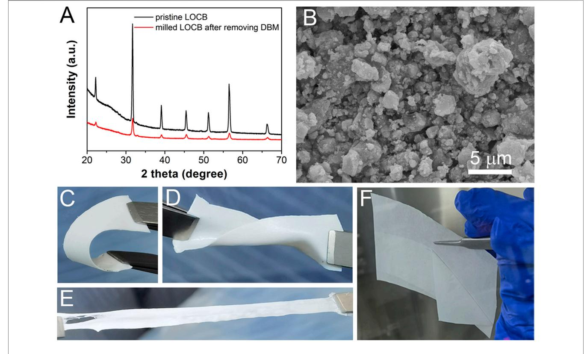
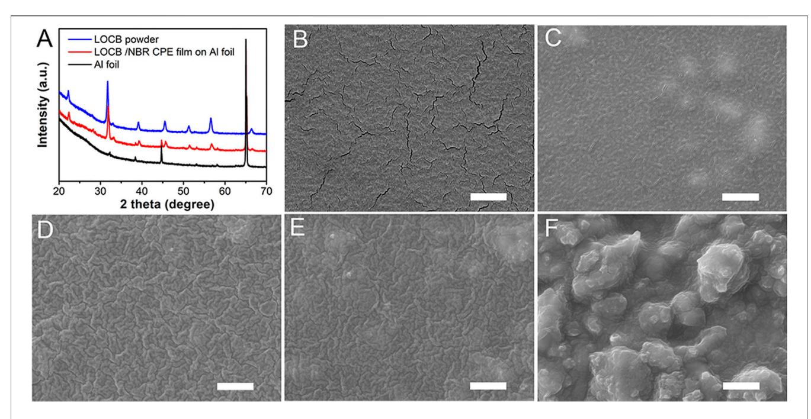
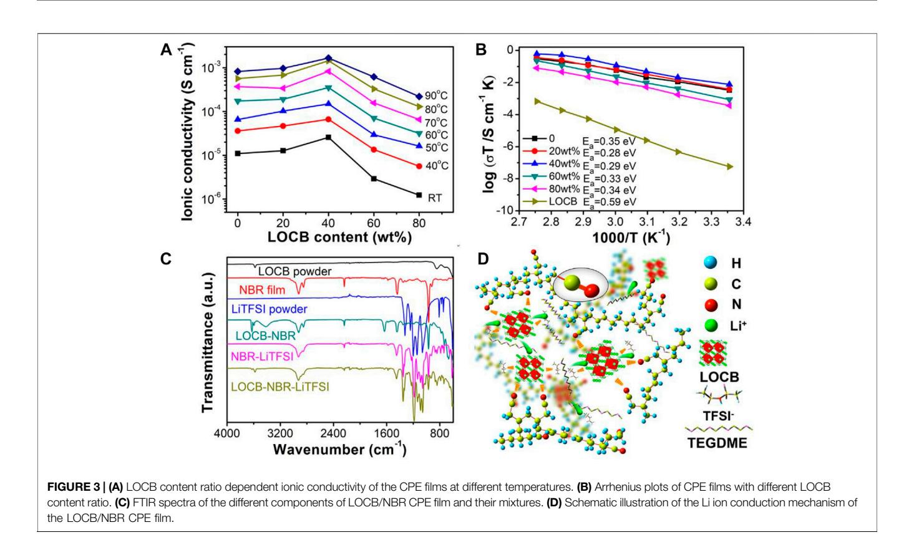
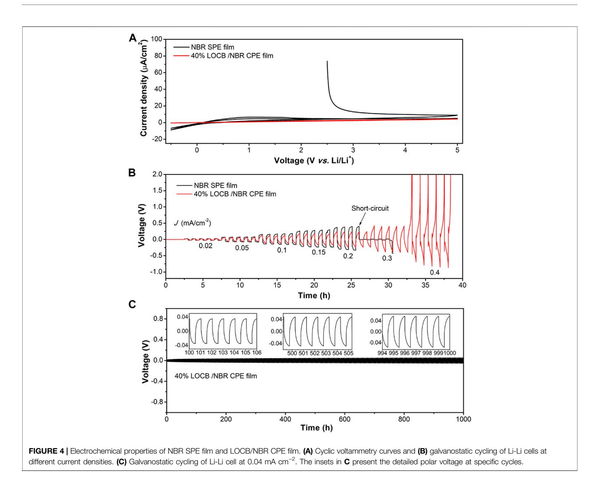
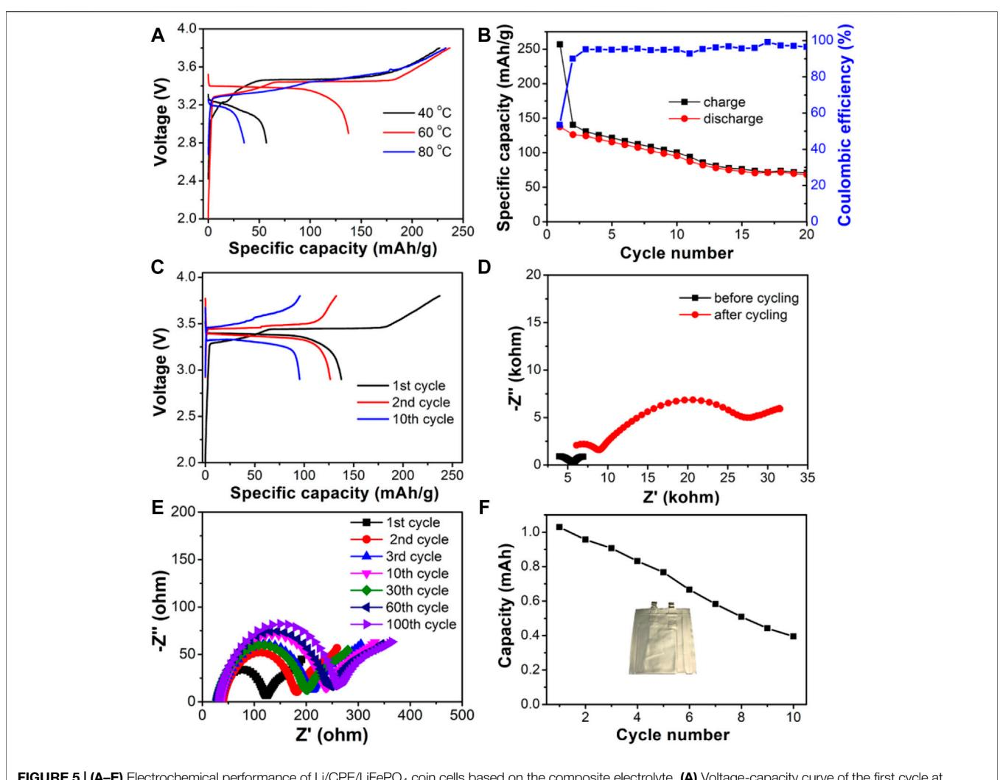

# [Li-Rich Antiperovskite/Nitrile](https://www.frontiersin.org/articles/10.3389/fchem.2021.744417/full) [Butadiene Rubber Composite](https://www.frontiersin.org/articles/10.3389/fchem.2021.744417/full) [Electrolyte for Sheet-Type Solid-State](https://www.frontiersin.org/articles/10.3389/fchem.2021.744417/full) [Lithium Metal Battery](https://www.frontiersin.org/articles/10.3389/fchem.2021.744417/full)

Juncao Bian1,2,3 \*, Huimin Yuan4 , Muqing Li 4 , Sifan Ling5 , Bei Deng5 , Wen Luo4 , Xuedan Chen1,2,3,5 , Lihong Yin1,2,3,5 , Shuai Li 1,2,3,5 , Long Kong1,2,3 , Ruo Zhao1,2,3 , Haibin Lin1,2,3 , Wei Xia1,2,3 , Yusheng Zhao1,2,3,5 \* and Zhouguang Lu4 \*

1 Shenzhen Key Laboratory of Solid State Batteries, Academy for Advanced Interdisciplinary Studies, Southern University of Science and Technology (SUSTech), Shenzhen, China, 2 Guangdong Provincial Key Laboratory of Energy Materials for Electric Power, Academy for Advanced Interdisciplinary Studies, SUSTech, Shenzhen, China, 3 Guangdong-Hong Kong-Macao Joint Laboratory for Photonic-Thermal-Electrical Energy Materials and Devices, Academy for Advanced Interdisciplinary Studies, SUSTech, Shenzhen, China, 4 Department of Materials Science and Engineering, SUSTech, Shenzhen, China, 5 Department of Physics, SUSTech, Shenzhen, China

#### Edited by:

Xiaopeng Han, Tianjin University, China

#### Reviewed by:

Wei Luo, Tongji University, China Jelena Popovic-Neuber, Max Planck Institute for Solid State Research, Germany

#### \*Correspondence:

Juncao Bian [bianjuncao@163.com](mailto:bianjuncao@163.com) Yusheng Zhao [zhaoys@sustech.edu.cn](mailto:zhaoys@sustech.edu.cn) Zhouguang Lu [luzg@sustech.edu.cn](mailto:luzg@sustech.edu.cn)

#### Specialty section:

This article was submitted to Electrochemistry, a section of the journal Frontiers in Chemistry

Received: 20 July 2021 Accepted: 11 October 2021 Published: 15 November 2021

#### Citation:

Bian J, Yuan H, Li M, Ling S, Deng B, Luo W, Chen X, Yin L, Li S, Kong L, Zhao R, Lin H, Xia W, Zhao Y and Lu Z (2021) Li-Rich Antiperovskite/Nitrile Butadiene Rubber Composite Electrolyte for Sheet-Type Solid-State Lithium Metal Battery. Front. Chem. 9:744417. doi: [10.3389/fchem.2021.744417](https://doi.org/10.3389/fchem.2021.744417) Lithium-rich antiperovskites (LiRAPs) hold great promise to be the choice of solid-state electrolytes (SSEs) owing to their high ionic conductivity, low activation energy, and low cost. However, processing sheet-type solid-state Li metal batteries (SSLiB) with LiRAPs remains challenging due to the lack of robust techniques for battery processing. Herein, we propose a scalable slurry-based procedure to prepare a flexible composite electrolyte (CPE), in which LiRAP (e.g., Li2OHCl0.5Br0.5, LOCB) and nitrile butadiene rubber (NBR) serve as an active filler and as a polymer scaffold, respectively. The low-polar solvent helps to stabilize the LiRAP phase during slurry processing. It is found that the addition of LOCB into the NBR polymer enhances the Li ion conductivity for 2.3 times at 60°C and reduces the activation energy (max. 0.07 eV). The as-prepared LOCB/NBR CPE film exhibits an improved critical current of 0.4 mA cm−2 and can stably cycle for over 1000 h at 0.04 mA cm−2 under 60°C. In the SSLiB with the sheet-type configuration of LiFePO4(LFP)||LOCB/ NBR CPE||Li, LFP exhibits a capacity of 137 mAh/g under 60 at 0.1°C. This work delivers an effective strategy for fabrication of LiRAP-based CPE film, advancing the LiRAP-family SSEs toward practical applications.

Keywords: solid-state batteries, anti-perovskite, solid-state electrolyte, composite electrolyte, sheet-type

# INTRODUCTION

Li ion batteries play critical roles in wide applications of consuming electronic devices, electric vehicles, and large-scale energy storage stations [\(Scrosati et al., 2011;](#page-8-0) [Cheng et al., 2017](#page-8-1); [Manthiram,](#page-8-2) [2017\)](#page-8-2). Solid state batteries have been believed to be one of the most important next-generation battery technologies due to their large energy density and outstanding safety ([Janek and Zeier, 2016;](#page-8-3) [Manthiram et al., 2017;](#page-8-4) [Xin et al., 2017;](#page-8-5) [Xia et al., 2019](#page-8-6)). Using solid electrolyte to replace the flammable liquid electrolyte can largely relieve the thermal runaway risk of the conventional Li ion batteries ([Janek and Zeier, 2016;](#page-8-3) [Xia et al., 2019;](#page-8-6) [Chen et al., 2020a](#page-8-7); [Gao et al., 2020\)](#page-8-8). Currently, solidstate electrolytes (SSEs) include argyrodite (e.g., Li6PS5Cl) [\(Deiseroth et al., 2008](#page-8-9)), sulfides (e.g.,

Li9.54Si1.74P1.44S11.7Cl0.3) [\(Kato et al., 2016](#page-8-10); [Xiao et al., 2021\)](#page-8-11), LISICON (e.g., Li2+xZn1-xGeO4) [\(Adachi et al., 1996](#page-8-12)), NASICON (e.g., Li1.3Al0.3Ti1.7(PO4)3) ([Deng et al., 2015](#page-8-13)), garnet (e.g., Li7La3Zr2O12) ([Murugan et al., 2007](#page-8-14); [Huang et al., 2020](#page-8-15); [Huo](#page-8-16) [et al., 2020](#page-8-16)), perovskite (e.g., Li0.5La0.5TiO3) [\(Conductor et al.,](#page-8-17) [2000](#page-8-17)), and Li rich anti-perovskite (LiRAP, e.g., Li3OCl0.5Br0.5) ([Zhao and Daemen, 2012](#page-9-0); [Emly et al., 2013;](#page-8-18) [Li et al., 2016a](#page-8-19); [Hood](#page-8-20) [et al., 2016;](#page-8-20) [Zhu et al., 2016;](#page-9-1) [Xu et al., 2019;](#page-8-21) [Yin et al., 2020](#page-9-2)) have been widely investigated. Their Li ion conductivities are in the levels of 10–6 ∼ 10–2 S cm−1 with the activation energy being in the range of 0.2–0.6 eV. Considering the Li ion conductivity of the commercial liquid electrolyte (∼10–2 S cm−2 ), only the sulfidebased SSEs can reach that level. For example, Li9.54Si1.74P1.44S11.7Cl0.3 [\(Kato et al., 2016\)](#page-8-10) and Li7P3S11 [\(Seino](#page-8-22) [et al., 2014](#page-8-22)) have the ionic conductivities of 2.5 × 10–2 S cm−2 and 1.7 × 10–2 S cm−2 , respectively. However, the sulfide-based SSEs have poor electrochemical stability, poor air stability, and are facing great challenges in large-scale production and commercialization ([Janek and Zeier, 2016;](#page-8-3) [Chen et al., 2020b](#page-8-23); [Zhao et al., 2020\)](#page-9-3).

As an alternative, LiRAP superionic conductors, e.g., Li3OCl and Li3OCl0.5Br0.5, represent a new family of SSEs. It contains Li+ up to 60 at.%. The Li ion conductivity can be up to 1.94 × 10−3 S cm−1 with the activation energy of 0.2–0.3 eV [\(Zhao and Daemen,](#page-9-0) [2012](#page-9-0)). More favorably, synthesis of LiRAPs can be easily realized by mixing LiCl, Li2O (or LiOH) and LiBr and heating the mixtures up to 300–600° C ([Zhao and Daemen, 2012](#page-9-0); [Emly](#page-8-18) [et al., 2013;](#page-8-18) [Li et al., 2016b](#page-8-24); [Hood et al., 2016](#page-8-20)), which makes LiRAPs very cost-effective and the production be easily scaled up. These properties ensure LiRAPs competitive candidates for the applicable solid electrolytes. Currently, all-powder-based SSLiBs face a great challenge to form two-dimensional contacts between the active electrode materials and the SSEs ([Han et al., 2018;](#page-8-25) [Shao](#page-8-26) [et al., 2018;](#page-8-26) [Feng et al., 2019](#page-8-27)). A sintering procedure is needed to reduce the grain boundary induced resistance and enhance the wettability of the SSE with electrode materials [\(Lu et al., 2018](#page-8-28); [Duan et al., 2019](#page-8-29)). Moreover, the contact losses among the battery components due to the volume changes of active materials upon cycling is one of the crucial failure mechanisms [\(Yao et al., 2019](#page-8-30); [Zhang et al., 2020a](#page-9-4); [Popovic et al., 2021\)](#page-8-31). Recently, SSE/polymer composites, namely composite electrolytes (CPEs), have emerged as attractive techniques as they combine the advantages of inorganic SSEs (high ionic conductivity and mechanical strength) and solid polymer electrolyte (SPE, good interfacial properties and flexibility) [\(Chai et al., 2018](#page-8-32); [Oh et al., 2019;](#page-8-33) [Yao](#page-8-30) [et al., 2019](#page-8-30); [Zhang et al., 2020a](#page-9-4); [Zhang et al., 2020b;](#page-9-5) [Fan et al.,](#page-8-34) [2020](#page-8-34); [Chen et al., 2021;](#page-8-35) [Popovic et al., 2021](#page-8-31)). Preparation of CPE film relates to slurry-based methodology, which can be easily scaled up. This technique is desirable for advancing the practical applications of LiRAP SSEs, but is still yet to be explored.

To fill this technique gap, a slurry-based procedure for preparation of CPE with LiRAP SSEs, e.g., Li2OHCl0.5Br0.5 (LOCB) as an active filler and nitrile butadiene rubber (NBR) as a polymer scaffold, is developed in this work. Addition of LOCB into the polymer electrolyte enhances the Li ion conductivity and reduces the activation energy. The asprepared LiRAP/NBR CPE film shows good chemical stability, thermal stability, flexibility, and mechanical property. It is electrochemically stable in the range of 0∼5 V vs. Li/Li+ . The Li symmetric cell with the CPE as separator can work for more than 1000 cycles with minor polar voltage changes. This work provides a new approach to fabricate LiRAP based sheet-type SSLiBs and advances the LiRAP SSEs toward practical applications.

#### EXPERIMENTAL

#### Preparation of LOCB Powder

All the chemicals were purchased from Aladdin without additional statement. The LOCB SSE was prepared as referred to in the previous report [\(Zhao and Daemen, 2012](#page-9-0); [Hood et al.,](#page-8-20) [2016](#page-8-20)). Briefly speaking, LOCB was synthesized by solid-state reaction of the mixture of LiCl (99.9%), LiBr (99.99%), and LiOH (99.9%). The molar ratio of LiCl, LiBr, and LiOH is 1:1:2.4. The mixture was carefully ground by hand for 0.5 h. Then it was pelletized and put into a Ni crucible. They were placed into a furnace positioned inside an Ar filled glovebox and heated at 500° C for 10 h. Next, the product was cooled with the furnace to room temperature (RT). The product was hand-milled at first and then ball-milled with the addition of dibromomethane (DBM) at 400 rpm/min for 5 h.

#### Preparation of LOCB/NBR CPE Film

NBR (M.W, ∼3800, acrylonitrile 37–39 weight ratio, wt.%, Sigma Aldrich) was dried under vacuum at 80° C for 12 h and then stored in the glove box. In a typical preparation, 0.5 g of NBR bulks was added into 9.5 g of DBM. Then the mixture was stirred at 1000 rpm and 60° C for overnight. Finally, a viscous NBR gel was obtained. Equal weight of LOCB and LiTFSI [3M in triethylene glycol dimethyl ether (TEGDME, 99%)] was added into the NBR gel and stirred at 2000 rpm for 10 min by planetary centrifugal paste mixer (Thinky SR-500). The wt.% of LOCB in all solid components is tuned from 0 to 80% with an interval of 20%. DBM can be added to tune the viscosity of the slurry to facilitate the coating. The slurry was coated on silicone paper by the doctor-blade method and dried at 60° C for 6 h. Except for the mixing procedure on the planetary centrifugal paste mixer, all the procedures were conducted in the Ar filled glove box (<0.1 ppm O2, <0.1 ppm H2O). The chemical stabilities of different organic solvents including ethanol (99%), N-methyl pyrrolidone (NMP, 99%), DBM (99%), acetonitrile (AN, 99%), and tetrahydrofuran (THF, 99%) with LOCB were also investigated.

#### Materials Characterization

Surface/cross-sectional morphologies of the samples were measured on a scanning electron microscope (SEM, FEI Nova NanoSEM 50). X-Ray Diffraction (XRD) patterns were recorded on a Smartlab X-ray diffractometer (Cu Kα, λ - 1.5406 Å, Rigaku, Japan). The samples were placed onto the silicon sample holder and sealed by polyimide film. Thermogravimetric (TG) curves were measured on a TG analyzer (NETZSCH, STA449F3 Jupiter). Compositions of the samples were investigated by FTIR spectroscopy (Perkin Elmer).

#### Preparation of the SSLiB With Sheet-Type Electrode

Wet slurry consisted of LiFePO4 (LFP, 78 wt%), super P (5 wt%), carbon nanotube (3–5 μm in length, 5 wt%), NBR (10 wt%), lithium bis(trifluoromethane)sulfon imide (LiTFSI, 2 wt%), and DBM was coated on Al foil and dried at 60° C for 6 h. The LFP electrode (areal capacity: 0.9 mAh cm−2 ) and the Li foil were placed on each side of the CPE film. The coin-type SSLiBs were sealed at 50 MPa at RT. For the pouch cell assembling, Ni and Al conductors were welded with Cu and Al foils, respectively, by ultrasonic spot welder. Cu foil was attached to the surface of Li foil at the other side. The sealing procedure was carried out on a vacuum sealing machine. Except for the slurry mixing procedure on the planetary centrifugal paste mixer, all the procedures were conducted in the Ar filled glove box (<0.1 ppm O2, <0.1 ppm H2O).

#### Electrochemical Characterization

Stainless steel (SS)||CPE film||SS symmetric cells were assembled for the EIS test. The EIS plots were measured under an amplitude voltage of 20 mV and the frequency range from 0.1 Hz to 1 MHz using a Solartron electrochemical workstation (1470E). The ionic conductivity (σ) is calculated by the equation:

$$
\sigma = \frac{d}{AR}
$$

where d is the thickness of the film, A is the area, and R is the bulk resistance of the film. Pt||CPE film||Li cells were assembled for the Cyclic Voltammetry (CV) test. The CV scans started from 2 toward 5 V and scanned in the range of 0–5 V vs. Li/Li+ for two cycles. Galvanostatic charge–discharge cycling of the Li||CPE||Li cells was performed at 60°C on the NEWARE battery test system. The diameter of the Li foil is 8 mm. The thickness of the CPE film is 310 μm. Galvanostatic charge–discharge cycling of the SSLiBs was conducted at 60° C between 2.8 and 3.8 V (vs. Li/Li+ ) on the LAND battery test system. Direct current polarization curves were measured at 0.5 V for 1,800 s to measure electric conductivity of CPE film in the SS||CPE||SS cells.

#### RESULTS AND DISCUSSION

To develop a slurry-based procedure to fabricate LiRAP based composite electrolyte, the organic solvent should be carefully chosen to avoid the side reactions. It is well known that when exposing it in the air, LiRAP will rapidly decompose, producing Li2CO3 and lithium halide [\(Hanghofer et al., 2018\)](#page-8-36). However, the stability of LiRAP with organic solvent is rarely investigated. Strong Lewis-basic or highly polar solvents with highly electronegative elements (e.g., as O and N) have lone-pair electrons, which may easily react with the electrophilic species of LiRAP (e.g., -OH) ([Oh et al., 2019](#page-8-33)). To test this, we mixed

FIGURE 1 | (A) XRD patterns of LOCB, (B) SEM image of the milled LOCB powders. (C–E) Bending, distorting, and stretching of the LOCB/NBR CPE films. (F) Detaching of the CPE film from silicone paper.

FIGURE 2 | (A) XRD pattern of the pure Li2OHCl0.5Br0.5, Li2OHCl0.5Br0.5/NBR CPE film, and Al foil. (B–F) SEM images of the NBR SPE and Li2OHCl0.5Br0.5/NBR CPE films with different LiRAP ratios. (B) 0, (C) 20, (D) 40, (E) 60, and (F) 80%. The scale bars are 2 µm.

LOCB powder with some frequently used organic solvents including ethanol, NMP, DBM, AN, and THF. After storing the mixtures in the Ar filled glove box for 7 days at RT, obvious color change of AN and THF are observed ([Supplementary](#page-7-0) [Figure S1](#page-7-0)), indicating their side reactions with LOCB. XRD patterns of the LOCB powders dried from ethanol, NMP, AN, and THF reveal a lot of new peaks originated from the reaction products ([Supplementary Figure S2](#page-7-0)). Only DBM is stable with LOCB as the diffraction peaks of LOCB are identical before and after mixing with DBM, as shown in [Figure 1A](#page-2-0). By referring the polarity of these solvents, it is found that DBM has the lowest polarity (p - 3.8, [Supplementary Table S1](#page-7-0)). Therefore, we infer that the polarity of the organic solvent should be less than 4 to ensure the compatibility of the solvent with LiRAP. To confirm this, we mixed p-xylene (p - 2.5) with LOCB powder for 7 days. No additional diffraction peak is found ([Supplementary Figure](#page-7-0) [S3](#page-7-0)), demonstrating that polarity is a key factor for the choice of the organic solvent. In this work, DBM is chosen as the solvent as it is miscible with TEGDME based electrolyte ([Supplementary](#page-7-0) [Figure S4](#page-7-0)).

Before coating the CPE film, it is desirable to decrease the size of the solid electrolyte, which is beneficial for the uniformity and Li ion conductivity of the CPE film ([Zhang et al., 2016\)](#page-9-6). DBM is added when milling the LOCB powders to prevent the agglomeration of the LOCB particles ([Supplem](#page-2-0)[entary Figure](#page-7-0) [S5](#page-7-0)). It is found from the SEM image (Figure 1B) that the size of the milled LOCB particles ranges from tens of nanometers to several microns. NBR is selected as the polymer scaffold with the following considerations. First, it can be easily dissolved in low polar solvent ([Nam et al., 2018;](#page-8-37) [Oh et al., 2019](#page-8-33)). Second, it contains nitrile groups, which enables its high dielectric constant, high anodic oxidization potential, and favorable interaction with Li+ [\(Hu et al., 2016\)](#page-8-38). Moreover, it has good viscidity, which enables it a strong scaffold when mixing it with inorganic materials. The transparent NBR film ([Supplementary Figure S6](#page-7-0)) turns to be white ([Figures 1C](#page-2-0)–[F](#page-2-0)) after the addition of white LOCB particles. The LOCB/NBR CPE films exhibit good flexibility. It can be bended, distorted, and stretched, as presented in [Figures 1C](#page-2-0)–[E](#page-2-0). Moreover, the as-prepared films are detachable from silicon paper ([Figure 1F](#page-2-0)). These properties ensure that the LOCB based CPE films can be utilized in sheet-type pouch SSLiBs. The TG curves ([Supplementary Figure S7](#page-7-0)) confirm the improved thermal stability of the LOCB/NBR based CPE film compared with the pure NBR film.

The XRD pattern of the LOCB/NBR CPE film, as illustrated in [Figure 2A](#page-3-0), is identical to that of the pristine LOCB powder. It demonstrates no chemical change of the LOCB during slurry preparation and film coating procedures, indicating good chemical compatibility of LOCB with DBM, liquid electrolyte, and NBR. Differences in the surface morphology of the CPE film can be observed when tuning the ratio of the LOCB, as shown in [Figures 2B](#page-3-0)–[F](#page-3-0). For NBR SPE film without the addition of LOCB, there are a lot of cracks on the surface, as is shown in [Figure 2B](#page-3-0), which is attributed to the shrinkage stress during the drying procedure. With an increase in the LOCB ratio, the number of the cracks gradually decreases. The cracks disappear when the ratio is 40% ([Figure 2D](#page-3-0)). This can be ascribed to the incorporation of LOCB particles, which enhances the mechanical strength of the composite. One can also find in [Figures 2C](#page-3-0)–[E](#page-3-0) that there are some blurry islands on the surface, which originates from the LOCB

microparticles. Further increasing the content of LOCB to 80wt.% results in a very rough surface. It means that such kind of film cannot contact intimately with the electrode layers, which will bring about large interface resistance.

The ionic conductivity of the LOCB powder is cal. 2.6 × 10–6 S cm−1 at RT. [Figure 3A](#page-4-0) shows the LOCB wt.% (from 0 to 80wt.%) dependent ionic conductivities of the LOCB-NBR CPE films measured from RT to 90°C. With an increase of the LOCB content, the CPE film undergoes a "ceramic-in-polymer" to "polymer-in-ceramic" change. The ionic conductivity of the CPE film initially increases and reaches the maximum at the LOCB content of 40wt.% in all tested temperatures ranging from RT to 90° C, which is consistent with the reported CPE films with other SEs ([Zhang et al., 2017](#page-9-7); [Chen et al., 2018\)](#page-8-39). At RT, the ionic conductivity of the NBR SPE film is 1.1 × 10–5 S cm−1 , while it is 2.6 × 10–5 S cm−1 for 40wt.% LOCB/NBR CPE film. The ionic conductivity of 40wt.% LOCB/NBR CPE film reaches 1.4 × 10–3 S cm−1 at 80°C. Further increasing the LOCB content to 60 and 80wt.% reduces the ionic conductivity, even less than that of the NBR SPE. This phenomenon is due to the destruction of the NBR ion transport paths. In such a case, LOCB particles turn to the dominant components of the CPE, which will aggregate in the film. The ion conduction among the LOCB particles is much slower than in the bulk of LOCB. When the LOBC content is 80wt.%, the surface of the CPE becomes very rough ([Figure 2F](#page-3-0)). Hence, the film cannot intimately contact with the steel, which further reduces the ion conductivity.

[Figure 3B](#page-4-0) presents the Arrhenius plots of the CPE films with different LOCB contents. The activation energy (Ea) was calculated according to the Arrhenius equation σT -Aexp(−Ea/kT) [\(Zhao and Daemen, 2012](#page-9-0)), where k is the Boltzmann constant, σ is the ionic conductivity of SSEs, and T is the absolute temperature. The Ea of NBR SPE is 0.35 eV. The addition of LOCB obviously decreases Ea (0.28 eV for 20wt.% LOCB and 0.29 eV for 40wt.% LOCB), which is ascribed to the interaction between LOCB and NBR. Further increasing the LOCB contents, Ea gradually increases due to the larger Ea of LOCB (0.59 eV).

To further investigate the ionic conduction mechanism of the LOCB/NBR CPE film, FTIR spectra are measured to explore the interactions of the different components of the CPE film. As is shown in [Figure 3C](#page-4-0), for NBR film, the vibration peak at 2236 cm−1 is assigned to the stretching mode of -C≡N groups. A weak peak at 2262 cm−1 appears in LOCB-NBR, NBR-LiTFSI, and LOCB-NBR-LiTFSI compared with pure NBR film ([Supplementary Figure S8](#page-7-0)), which originates from the interactions between -C≡N group of NBR and Li+ from LOCB and LiTFSI ([Verdier et al., 2020](#page-8-40)). Moreover, the vibration peaks of LiTFSI in the range of 1400∼500 cm−1 shows red or blue shift when compared with those of NBR-LiTFSI ([Supplementary](#page-7-0) [Figure S9](#page-7-0)). However, the characteristic peaks of LiTFSI in the FTIR spectra of NBR-LiTFSI and LOCB-NBR-LiTFSI are identical, indicating that TFSI− groups only interact with NBR. The vibration peak of LOCB powder at 3576 cm−1 is assigned to -OH ([Li et al., 2016b](#page-8-24)). This peak disappears while new peaks at 3628, 3600, 3413, 1632, 730, 665, and 594 cm−1 appear, indicating strong interactions between LOCB and NBR. The above interactions largely facilitate the segmental motion of NBR

chains, which enhances the Li+ conductivity of the NBR SPE film. Moreover, without the addition of Li salt electrolyte, the NBR/ LOBC mixture film exhibits ionic conductivity of less than 10−9 S cm−1 ([Supplementary Figure S10](#page-7-0)). As confirmed by the TG curve shown in Supplementary Figure S7, there is residue TEGDME inside the CPE films. The dissolved LiTFSI in the TEGMDE forms important paths for Li+ transport.

According to the above analysis, a possible CPE microstructure and Li transport pathways are proposed, as illustrated in [Figure 3D](#page-4-0). Under the effect of an electric field, the Li+ tends to hop from one coordinating site to another. This hopping is facilitated by the dissolved LiTFSI in the TEGMDE, segmental motions of nitrile groups in the NBR chains or an C≡N-Li+ cluster-assisting function. The segmental motion of the NBR chains offers free spaces for Li+ migration [\(Chen et al., 2016](#page-8-41); [Zhao et al., 2018](#page-9-8)). After the addition of LOCB into the NBR SPE, the -OH groups in LOCB will destroy the balance of -C≡N-Li+ clusters. They will attract the C≡N- and TFSI− groups, resulting in the decreased attracting force of C≡N- and TFSI− groups to Li+ . Therefore, after the addition of LOCB, the Ea values decrease. We speculate that LOCB can affect the motion of the NBR chains due to the existence of the polar -OH groups, which may provide more space for Li+ transport.

Taken the ionic conductivity, mechanical strength, and the surface roughness into account, we chose the CPE film with 40wt.% LOBC for further investigation. To investigate the electrochemical stability of the NBR SPE film and LOCB/ NBR CPE film, CV curves were conducted, as shown in [Figure 4A](#page-5-0). It is found that the reduction and oxidation current of NBR SPE film are −8.75 μA cm−2 at 5 V vs Li/Li+ and 8.9 μA cm−2 at 0 V vs. Li/Li+ , much larger than that of the LOCB/NBR CPE film (0.4 μA cm−2 at 0 V vs. Li/Li+ and 4.2 μA cm−2 at 5 V vs. Li/Li+ ), demonstrate an improved electrochemical stability of the CPE film. The improved stability is because LOCB particles enhance the dielectric property of the NBR film, which block the electron transport and suppress the oxidation/reduction reactions. The calculated electric conductivity of the NBR SPE film and the CPE film are 1.7 × 10–9 and 2.1 × 10–10 S cm−1 , respectively ([Supplementary](#page-7-0) [Figure S11](#page-7-0)). In the second scan cycle, the currents decrease as

FIGURE 5 | (A–E) Electrochemical performance of Li/CPE/LiFePO4 coin cells based on the composite electrolyte. (A) Voltage-capacity curve of the first cycle at different temperatures. (B) Cycling performance at 60°C. (C) Voltage-capacity curve of different cycles at 60°C. (D) EIS plots of the SSLiB before and after cycling measured at 60°C. (E) EIS plots of the Li-Li symmetric cell running for different cycles. (F) Pouch cell performance.

the surface reaction products passivate the surface, relieving the surface reactions.

The Li dendrite endurance ability of the CPE film was evaluated by galvanostatic cycling of the Li-Li symmetric cells at step-increased current densities at 60° C. [Figure 4B](#page-5-0) presents the voltage-time profiles of the 40wt.% LOCB/NBR CPE film and the NBR SPE film. The voltages increase with the currents for both due to the polarity. When the current density reaches 0.2 mA cm−2 , a voltage drop is observed for NBR SPE film, which results from the penetration of the Li dendrites across the film. It is because the Li dendrites can penetrate the film very easily through the cracks, as is shown in [Figure 2B](#page-3-0). In contrast, the voltage drop does not appear even at 0.4 mA cm−2 for the CPE film. Instead, the polar voltage surpasses 5 V at 0.5 mA cm−2 , indicating an elevated critical current density. This phenomenon demonstrates that the CPE film has a strong ability for preventing the Li dendrite penetration. The interface stability of 40wt.% LOCB/NBR CPE film with Li metal anode was further assessed by galvanostatic cycling procedure in Li-Li symmetric cell, which was charged and discharged at the current density of 0.04 mA cm−2 for 0.5 h, respectively, at 60° C. The voltage change vs. time is presented in [Figure 4C](#page-5-0). After 1000 cycles, the voltage change is only 0.03 V, indicating a relatively stable interface between the CPE film and Li anode.

The formation processes of the batteries under different temperatures were investigated to optimize the running conditions of the LOCB/NBR CPE film based SSLiB. The discharged capacity at the first cycle augments when the temperature increases from 40 to 60°C, as shown in [Figure 5A](#page-6-0). Further elevating the temperature to 80° C reduces the discharge capacity. The first cycle discharge capacities at 40, 60, and 80° C are 57, 137, and 35 mAh/g, respectively, with the corresponding coulombic efficiencies (CEs) of 25.2, 53.3, and 15.0%. The low CEs are ascribed to the oxidation/reduction reactions at the electrode surface, as is detected in the CV curves shown in [Figure 4A](#page-5-0). Herein, the enhanced discharge capacity from 40 to 60°C is mainly attributed to the improved Li ion conductivity, as shown in [Figure 3A](#page-4-0). When the temperature is further increased to Bian et al. Li-Rich Antiperovskite Solid Electrolyte Battery

80°C, although the Li ion conductivity is raised, the side reactions at the electrode material/CPE interface are also intensified, which lead to the degraded capacity. According to the above results, 60° C is chosen as the running temperature. [Figure 5B](#page-6-0) presents that after cycling for 20 times, the discharged capacity retains 49.5% of that at the first cycle. The voltage-capacity curves of different cycles depicted in [Figure 5C](#page-6-0) show that the polar voltage constantly increases with the charge/discharge process. EIS plots, as are shown in [Figure 5D](#page-6-0), deliver that the impedance, especially the interface resistance (the semicircle at low frequency), largely increases, which leads to the degraded capacity. After disassembling the battery, it is found that the intimate contact between Li and CPE is still maintained ([Supplmentary Figure S12](#page-7-0)). However, the cathode becomes more loosened (Supplmentary Figure S13), which is possibly due to the destruction of the sticky group of NBR from the cathode oxidation. The EIS plots of the Li/CPE/Li symmetric cells after running for different cycles show that the Li-CPE interface impedance (corresponding to the semicircle at low frequency) becomes stable after three cycles, as is shown in [Figure 5E](#page-6-0) and [Supplmentary Figure S14](#page-7-0). It demonstrates that the reaction products of Li-CPE film can serve as stable solid electrolyte interphase (SEI) layer and block the further reaction of CPE film with Li foil. The slight increase of the bulk resistance at high frequency is due to the sluggish reaction of LiRAP particles with the TEGDME molecules, which decreases the ionic conductivity of the CPE film. Hence, destruction of cathode is the principal reason leading to the failure of the SSLiB. The cathode binder can be replaced by PVDF to alleviate the oxidation induced failure of NBR and enhance the cell performance. Currently, optimization of the cell performance is still in our progress. The cycling performance of the pouch cell run under 60°C is presented in [Figure 5F](#page-6-0). After 10 cycles, the capacity remains at 38.4% of the first cycle, and this demonstrates that our technique is reliable for the fabrication of a pouch type SSLiB.

Currently, the critical current density of the LiRAP-NBR CPE system is 0.5 V, which can be further improved. That is because, on one hand, the room-temperature Li ion conductivity of the LiRAP-NBR CPE system is still not high enough. On the other hand, the mechanical strength of NBR still needs further improvement. Consideration of the practical application of the CPE film in SSLiB, the RT ionic conductivity of CPE film should be higher than 10–3 S cm−1 . The CPE film should be mechanically robust to adapt to the process of SSLiB and tolerance to Li dendrites. Introduction of the conjugated polymer such as succinonitrile and polyvinyl chloride into NBR can be explored to enhance the Li ion conductivity and the mechanical strength of the CPE film. Surface coating of cathode with ionic conductor, e.g., LiNbO3, can be done to enhance the interface stability between cathode and NBR. Optimization of the electrochemical and mechanical properties of CPE films as well as the electrochemical performance of the SSLiBs are still in our progress.

#### CONCLUSION

In summary, we have successfully developed a robust slurrybased procedure to prepare LOCB based flexible CPE film for sheet-type SSLiB. With low-polarity solvent, LOCB can be well stabilized during the slurry processing. As prepared LOCB/NBR CPE film exhibit good flexibility, improved electrochemical stability, enhanced thermal stability, and increased critical current compared with the NBR based SPE film. Sheet-type pouch cells with Li foil anode, LOCB/NBR CPE film, and LFP cathode have been successfully achieved. The LFP cathode exhibited a high capacity of 137 mAh/g. This work develops a scalable route for processing LiRAP based CPE film and opens the door for preparation of LiRAP based sheet-type SSLiB toward practical applications.

## DATA AVAILABILITY STATEMENT

The original contributions presented in the study are included in the article/[Supplementary Material](#page-7-0), further inquiries can be directed to the corresponding authors.

## AUTHOR CONTRIBUTIONS

JB, ZL, and YZ conceived the ideas and constructed the whole manuscript. JB, HY, ML, SFL, BD, WL, XC, and LY did the experiment and the measurements as well as the data process. JB wrote the manuscript. SHL, LK, RZ, HL, and WX contributed to the discussion, and revision of the manuscript..

# FUNDING

This work was supported by the Basic Research Project of Science and Technology Innovation Commission of Shenzhen (No.: JSGG20191129111001820 and No.: JCYJ20200109141640095), Guangdong Basic and Applied Basic Research Foundation (No.: 2021A1515012403), Key Program of the National Natural Science Foundation of China (No.: 51732005), the Shenzhen Key Laboratory of Solid State Batteries (No.: ZDSYS20180208184346531), Guangdong Provincial Key Laboratory of Energy Materials for Electric Power (No.: 2018B030322001), Guangdong-Hong Kong-Macao Joint Laboratory for Photonic-Thermal-Electrical Energy Materials and Devices (No.: 2019B121205001), National Natural Science Foundation of China (No.: 12004214) and Shenzhen Science and Technology Program (No.: KQTD20200820113047086). This work was also partially supported by the Shenzhen Development and Reform Commission Foundation for Shenzhen Engineering Research Center for Frontier Materials Synthesis at High Pressure and the Research Platform for Crystal Growth&Thin-Film Preparation at SUSTech.

# SUPPLEMENTARY MATERIAL

The Supplementary Material for this article can be found online at: [https://www.frontiersin.org/articles/10.3389/fchem.2021.744417/](https://www.frontiersin.org/articles/10.3389/fchem.2021.744417/full#supplementary-material) [full#supplementary-material](https://www.frontiersin.org/articles/10.3389/fchem.2021.744417/full#supplementary-material)

#### REFERENCES

- Adachi, G.-y., Imanaka, N., and Aono, H. (1996). Fast Li⊕ Conducting Ceramic Electrolytes. Adv. Mater. 8, 127–135. doi:[10.1002/adma.19960080205](https://doi.org/10.1002/adma.19960080205)
- Chai, J., Chen, B., Xian, F., Wang, P., Du, H., Zhang, J., et al. (2018). Dendrite-Free Lithium Deposition via Flexible-Rigid Coupling Composite Network for LiNi0.5Mn1.5O4/Li Metal Batteries. Small 14, 1. doi[:10.1002/smll.201802244](https://doi.org/10.1002/smll.201802244)
- Chen, L., Li, Y., Li, S.-P., Fan, L.-Z., Nan, C.-W., and Goodenough, J. B. (2018). PEO/garnet Composite Electrolytes for Solid-State Lithium Batteries: From "Ceramic-In-Polymer" to "Polymer-In-Ceramic". Nano Energy 46, 176–184. doi:[10.1016/j.nanoen.2017.12.037](https://doi.org/10.1016/j.nanoen.2017.12.037)
- Chen, L., Qiu, X., Bai, Z., and Fan, L.-Z. (2021). Enhancing Interfacial Stability in Solid-State Lithium Batteries with Polymer/garnet Solid Electrolyte and Composite Cathode Framework. J. Energ. Chem. 52, 210–217. doi:[10.1016/](https://doi.org/10.1016/j.jechem.2020.03.052) [j.jechem.2020.03.052](https://doi.org/10.1016/j.jechem.2020.03.052)
- Chen, R., Li, Q., Yu, X., Chen, L., and Li, H. (2020). Approaching Practically Accessible Solid-State Batteries: Stability Issues Related to Solid Electrolytes and Interfaces. Chem. Rev. 120, 6820–6877. doi:[10.1021/acs.chemrev.9b00268](https://doi.org/10.1021/acs.chemrev.9b00268)
- Chen, R., Nolan, A. M., Lu, J., Wang, J., Yu, X., Mo, Y., et al. (2020). The Thermal Stability of Lithium Solid Electrolytes with Metallic Lithium. Joule 4, 812–821. doi:[10.1016/j.joule.2020.03.012](https://doi.org/10.1016/j.joule.2020.03.012)
- Chen, R., Qu, W., Guo, X., Li, L., and Wu, F. (2016). The Pursuit of Solid-State Electrolytes for Lithium Batteries: from Comprehensive Insight to Emerging Horizons. Mater. Horiz. 3, 487–516. doi[:10.1039/c6mh00218h](https://doi.org/10.1039/c6mh00218h)
- Cheng, X.-B., Zhang, R., Zhao, C.-Z., and Zhang, Q. (2017). Toward Safe Lithium Metal Anode in Rechargeable Batteries: A Review. Chem. Rev. 117, 10403–10473. doi[:10.1021/acs.chemrev.7b00115](https://doi.org/10.1021/acs.chemrev.7b00115)
- Conductor, C., Li, L., Perovskite, T., Alonso, Â. A., Sanz, J., Santamaría, J., et al. (2000). 4,5-Bis(diphenylphosphinoyl)-1,2,3-triazole: A Powerful New Ligand That Uses Two Different Modes of Chelation. Angew.Chem. Int. Ed. 39, 619. doi:[10.1002/1521-3773\(20000915\)39:18](https://doi.org/10.1002/1521-3773(20000915)39:18<>1.0.co;2-l)<>1.0.co;2-l
- Deiseroth, H.-J., Kong, S.-T., Eckert, H., Vannahme, J., Reiner, C., Zaiß, T., et al. (2008). Li6PS5X: A Class of Crystalline Li-Rich Solids with an Unusually High Li+ Mobility. Angew. Chem. Int. Ed. 47, 755–758. doi:[10.1002/anie.200703900](https://doi.org/10.1002/anie.200703900)
- Deng, Y.-F., Zhao, S.-X., Xu, Y.-H., and Nan, C.-W. (2015). Effect of Temperature of Li2O-Al2O3-TiO2-P2O5 Solid-State Electrolyte Coating Process on the Performance of LiNi0.5Mn1.5O4 Cathode Materials. J. Power Sourc. 296, 261–267. doi:[10.1016/j.jpowsour.2015.07.017](https://doi.org/10.1016/j.jpowsour.2015.07.017)
- Duan, J., Wu, W., Nolan, A. M., Wang, T., Wen, J., Hu, C., et al. (2019). Lithium-Graphite Paste: An Interface Compatible Anode for Solid-State Batteries. Adv. Mater. 31, 1807243. doi[:10.1002/adma.201807243](https://doi.org/10.1002/adma.201807243)
- Emly, A., Kioupakis, E., and Van Der Ven, A. (2013). Phase Stability and Transport Mechanisms in Antiperovskite Li3OCl and Li3OBr Superionic Conductors. Chem. Mater. 25, 4663–4670. doi[:10.1021/cm4016222](https://doi.org/10.1021/cm4016222)
- Fan, R., Liu, C., He, K., Ho-Sum Cheng, S., Chen, D., Liao, C., et al. (2020). Versatile Strategy for Realizing Flexible Room-Temperature All-Solid-State Battery through a Synergistic Combination of Salt Affluent PEO and Li6.75La3Zr1.75Ta0.25O12 Nanofibers. ACS Appl. Mater. Inter. 12, 7222–7231. doi:[10.1021/acsami.9b20104](https://doi.org/10.1021/acsami.9b20104)
- Feng, W., Dong, X., Lai, Z., Zhang, X., Wang, Y., Wang, C., et al. (2019). Building an Interfacial Framework: Li/Garnet Interface Stabilization through a Cu6Sn5 Layer. ACS Energ. Lett. 4, 1725–1731. doi:[10.1021/acsenergylett.9b01158](https://doi.org/10.1021/acsenergylett.9b01158)
- Gao, Y., Nolan, A. M., Du, P., Wu, Y., Yang, C., Chen, Q., et al. (2020). Classical and Emerging Characterization Techniques for Investigation of Ion Transport Mechanisms in Crystalline Fast Ionic Conductors. Chem. Rev. 120, 5954–6008. doi[:10.1021/acs.chemrev.9b00747](https://doi.org/10.1021/acs.chemrev.9b00747)
- Han, F., Yue, J., Chen, C., Zhao, N., Fan, X., Ma, Z., et al. (2018). Interphase Engineering Enabled All-Ceramic Lithium Battery. Joule 2, 497–508. doi:[10.1016/j.joule.2018.02.007](https://doi.org/10.1016/j.joule.2018.02.007)
- Hanghofer, I., Redhammer, G. J., Rohde, S., Hanzu, I., Senyshyn, A., Wilkening, H. M. R., et al. (2018). Untangling the Structure and Dynamics of Lithium-Rich Anti-Perovskites Envisaged as Solid Electrolytes for Batteries. Chem. Mater. 30, 8134–8144. doi[:10.1021/acs.chemmater.8b02568](https://doi.org/10.1021/acs.chemmater.8b02568)
- Hood, Z. D., Wang, H., Samuthira Pandian, A., Keum, J. K., and Liang, C. (2016). Li2OHCl Crystalline Electrolyte for Stable Metallic Lithium Anodes. J. Am. Chem. Soc. 138, 1768–1771. doi[:10.1021/jacs.5b11851](https://doi.org/10.1021/jacs.5b11851)
- Hu, P., Chai, J., Duan, Y., Liu, Z., Cui, G., and Chen, L. (2016). Progress in Nitrile-Based Polymer Electrolytes for High Performance Lithium Batteries. J. Mater. Chem. A. 4, 10070–10083. doi[:10.1039/c6ta02907h](https://doi.org/10.1039/c6ta02907h)
- Huang, W. L., Zhao, N., Bi, Z. J., Shi, C., Guo, X. X., Fan, L.-Z., et al. (2020). Can We Find Solution to Eliminate Li Penetration through Solid Garnet Electrolytes? Mater. Today Nano 10, 100075. doi:[10.1016/j.mtnano.2020.100075](https://doi.org/10.1016/j.mtnano.2020.100075)
- Huo, H., Li, X., Sun, Y., Lin, X., Doyle-Davis, K., Liang, J., et al. (2020). Li2CO3 Effects: New Insights into Polymer/garnet Electrolytes for Dendrite-free Solid Lithium Batteries. Nano Energy 73, 104836. doi[:10.1016/j.nanoen.2020.104836](https://doi.org/10.1016/j.nanoen.2020.104836)
- Janek, J., and Zeier, W. G. (2016). A solid future for battery development. Nat.Energy 1, 1. doi[:10.1038/nenergy.2016.141](https://doi.org/10.1038/nenergy.2016.141)
- Kato, Y., Hori, S., Saito, T., Suzuki, K., Hirayama, M., Mitsui, A., et al. (2016). High-Power All-Solid-State Batteries Using Sulfide Superionic Conductors. Nat. Energ. 1, 1. doi:[10.1038/nenergy.2016.30](https://doi.org/10.1038/nenergy.2016.30)
- Li, S., Zhu, J., Wang, Y., Howard, J. W., Lü, X., Li, Y., et al. (2016). Reaction Mechanism Studies towards Effective Fabrication of Lithium-Rich Anti-perovskites Li3OX (X-Cl, Br). Solid State Ionics 284, 14–19. doi:[10.1016/j.ssi.2015.11.027](https://doi.org/10.1016/j.ssi.2015.11.027)
- Li, Y., Zhou, W., Xin, S., Li, S., Zhu, J., Lü, X., et al. (2016). Fluorine-Doped Antiperovskite Electrolyte for All-Solid-State Lithium-Ion Batteries. Angew. Chem. Int. Ed. 55, 9965–9968. doi:[10.1002/anie.201604554](https://doi.org/10.1002/anie.201604554)
- Lu, Y., Huang, X., Song, Z., Rui, K., Wang, Q., Gu, S., et al. (2018). Highly Stable Garnet Solid Electrolyte Based Li-S Battery with Modified Anodic and Cathodic Interfaces. Energ. Storage Mater. 15, 282–290. doi:[10.1016/j.ensm.2018.05.018](https://doi.org/10.1016/j.ensm.2018.05.018)
- Manthiram, A. (2017). An Outlook on Lithium Ion Battery Technology. ACS Cent. Sci. 11, 3216. doi:[10.1021/acscentsci.7b00288](https://doi.org/10.1021/acscentsci.7b00288)
- Manthiram, A., Yu, X., and Wang, S. (2017). Lithium Battery Chemistries Enabled by Solid-State Electrolytes. Nat. Rev. Mater. 2, 1. doi:[10.1038/natrevmats.2016.103](https://doi.org/10.1038/natrevmats.2016.103)
- Murugan, R., Thangadurai, V., and Weppner, W. (2007). Fast Lithium Ion Conduction in Garnet-Type Li7La3Zr2O12. Angew. Chem. Int. Ed. 46, 7778–7781. doi:[10.1002/anie.200701144](https://doi.org/10.1002/anie.200701144)
- Nam, Y. J., Oh, D. Y., Jung, S. H., and Jung, Y. S. (2018). Toward Practical All-Solid-State Lithium-Ion Batteries with High Energy Density and Safety: Comparative Study for Electrodes Fabricated by Dry- and Slurry-Mixing Processes. J. Power Sourc. 375, 93–101. doi:[10.1016/j.jpowsour.2017.11.031](https://doi.org/10.1016/j.jpowsour.2017.11.031)
- Oh, D. Y., Nam, Y. J., Park, K. H., Jung, S. H., Kim, K. T., Ha, A. R., et al. (2019). Slurry-Fabricable Li+ -Conductive Polymeric Binders for Practical All-Solid-State Lithium-Ion Batteries Enabled by Solvate Ionic Liquids. Adv. Energ. Mater. 9, 1802927. doi:[10.1002/aenm.201802927](https://doi.org/10.1002/aenm.201802927)
- Popovic, J., Brandell, D., Ohno, S., Hatzell, K. B., Zheng, J., and Hu, Y.-Y. (2021). Polymer-based Hybrid Battery Electrolytes: Theoretical Insights, Recent Advances and Challenges. J. Mater. Chem. A. 9, 6050–6069. doi[:10.1039/d0ta11679c](https://doi.org/10.1039/d0ta11679c)
- Scrosati, B., Hassoun, J., and Sun, Y.-K. (2011). Lithium-ion Batteries. A Look into the Future. Energy Environ. Sci. 4, 3287. doi[:10.1039/c1ee01388b](https://doi.org/10.1039/c1ee01388b)
- Seino, Y., Ota, T., Takada, K., Hayashi, A., and Tatsumisago, M. (2014). A Sulphide Lithium Super Ion Conductor Is superior to Liquid Ion Conductors for Use in Rechargeable Batteries. Energ. Environ. Sci. 7, 627–631. doi:[10.1039/c3ee41655k](https://doi.org/10.1039/c3ee41655k)
- Shao, Y., Wang, H., Gong, Z., Wang, D., Zheng, B., Zhu, J., et al. (2018). Drawing a Soft Interface: An Effective Interfacial Modification Strategy for Garnet-Type Solid-State Li Batteries. ACS Energ. Lett. 3, 1212–1218. doi[:10.1021/](https://doi.org/10.1021/acsenergylett.8b00453) [acsenergylett.8b00453](https://doi.org/10.1021/acsenergylett.8b00453)
- Verdier, N., Lepage, D., Zidani, R., Prébé, A., Aymé-Perrot, D., Pellerin, C., et al. (2020). Cross-Linked Polyacrylonitrile-Based Elastomer Used as Gel Polymer Electrolyte in Li-Ion Battery. ACS Appl. Energ. Mater. 3, 1099–1110. doi[:10.1021/acsaem.9b02129](https://doi.org/10.1021/acsaem.9b02129)
- Xia, S., Wu, X., Zhang, Z., Cui, Y., and Liu, W. (2019). Practical Challenges and Future Perspectives of All-Solid-State Lithium-Metal Batteries. Chem 5, 1. doi[:10.1016/j.chempr.2018.11.013](https://doi.org/10.1016/j.chempr.2018.11.013)
- Xiao, W., Xu, H., Xuan, M., Wu, Z., Zhang, Y., Zhang, X., et al. (2021). Stable All-Solid-State Battery Enabled with Li6.25PS5.25Cl0.75 as Fast Ion-Conducting Electrolyte. J. Energ. Chem. 53, 147–154. doi[:10.1016/j.jechem.2020.04.062](https://doi.org/10.1016/j.jechem.2020.04.062)
- Xin, S., You, Y., Wang, S., Gao, H.-C., Yin, Y.-X., and Guo, Y.-G. (2017). Solid-State Lithium Metal Batteries Promoted by Nanotechnology: Progress and Prospects. ACS Energ. Lett. 2, 1385–1394. doi:[10.1021/acsenergylett.7b00175](https://doi.org/10.1021/acsenergylett.7b00175)
- Xu, H., Xuan, M., Xiao, W., Shen, Y., Li, Z., Wang, Z., et al. (2019). Lithium Ion Conductivity in Double Antiperovskite Li6.5OS1.5I1.5: Alloying and Boundary Effects. ACS Appl. Energ. Mater. 2, 6288–6294. doi:[10.1021/acsaem.9b00861](https://doi.org/10.1021/acsaem.9b00861)
- Yao, P., Yu, H., Ding, Z., Liu, Y., Lu, J., Lavorgna, M., et al. (2019). Review on Polymer-Based Composite Electrolytes for Lithium Batteries. Front. Chem. 7, 522. doi[:10.3389/fchem.2019.00522](https://doi.org/10.3389/fchem.2019.00522)
- Yin, L., Yuan, H., Kong, L., Lu, Z., and Zhao, Y. (2020). Engineering Frenkel Defects of Anti-perovskite Solid-State Electrolytes and Their Applications in All-Solid-State Lithium-Ion Batteries. Chem. Commun. 56, 1251–1254. doi:[10.1039/](https://doi.org/10.1039/c9cc08382k) [c9cc08382k](https://doi.org/10.1039/c9cc08382k)
- Zhang, D., Xu, X., Qin, Y., Ji, S., Huo, Y., Wang, Z., et al. (2020). Recent Progress in Organic-Inorganic Composite Solid Electrolytes for All-Solid-State Lithium Batteries. Chem. Eur. J. 26, 1720–1736. doi[:10.1002/chem.201904461](https://doi.org/10.1002/chem.201904461)
- Zhang, J., Zhao, N., Zhang, M., Li, Y., Chu, P. K., Guo, X., et al. (2016). Flexible and Ion-Conducting Membrane Electrolytes for Solid-State Lithium Batteries: Dispersion of Garnet Nanoparticles in Insulating Polyethylene Oxide. Nano Energy 28, 447–454. doi:[10.1016/j.nanoen.2016.09.002](https://doi.org/10.1016/j.nanoen.2016.09.002)
- Zhang, X., Liu, T., Zhang, S., Huang, X., Xu, B., Lin, Y., et al. (2017). Synergistic Coupling between Li6.75La3Zr1.75Ta0.25O12 and Poly(vinylidene Fluoride) Induces High Ionic Conductivity, Mechanical Strength, and Thermal Stability of Solid Composite Electrolytes. J. Am. Chem. Soc. 139, 13779–13785. doi[:10.1021/jacs.7b06364](https://doi.org/10.1021/jacs.7b06364)
- Zhang, Y., Chen, R., Wang, S., Liu, T., Xu, B., Zhang, X., et al. (2020). Free-standing Sulfide/polymer Composite Solid Electrolyte Membranes with High Conductance for All-Solid-State Lithium Batteries. Energ. Storage Mater. 25, 145–153. doi:[10.1016/j.ensm.2019.10.020](https://doi.org/10.1016/j.ensm.2019.10.020)
- Zhao, C., Liu, L., Qi, X., Lu, Y., Wu, F., Zhao, J., et al. (2018). Solid-State Sodium Batteries. Adv. Energ. Mater. 8, 14. doi[:10.1002/aenm.201703012](https://doi.org/10.1002/aenm.201703012)
- Zhao, Q., Stalin, S., Zhao, C.-Z., and Archer, L. A. (2020). Designing Solid-State Electrolytes for Safe, Energy-Dense Batteries. Nat. Rev. Mater. 5, 229–252. doi:[10.1038/s41578-019-0165-5](https://doi.org/10.1038/s41578-019-0165-5)
- Zhao, Y., and Daemen, L. L. (2012). Superionic Conductivity in Lithium-Rich Anti-Perovskites. J. Am. Chem. Soc. 134, 15042–15047. doi:[10.1021/ja305709z](https://doi.org/10.1021/ja305709z)
- Zhu, J., Li, S., Zhang, Y., Howard, J. W., Lü, X., Li, Y., et al. (2016). Enhanced Ionic Conductivity with Li7O2Br3 Phase in Li3OBr Anti-perovskite Solid Electrolyte. Appl. Phys. Lett. 109, 101904. doi[:10.1063/1.4962437](https://doi.org/10.1063/1.4962437)

Conflict of Interest: The authors declare that the research was conducted in the absence of any commercial or financial relationships that could be construed as a potential conflict of interest.

The handling Editor declared a past co-authorship with the authors LK and ZL.

Publisher's Note: All claims expressed in this article are solely those of the authors and do not necessarily represent those of their affiliated organizations, or those of the publisher, the editors, and the reviewers. Any product that may be evaluated in this article, or claim that may be made by its manufacturer, is not guaranteed or endorsed by the publisher.

Copyright © 2021 Bian, Yuan, Li, Ling, Deng, Luo, Chen, Yin, Li, Kong, Zhao, Lin, Xia, Zhao and Lu. This is an open-access article distributed under the terms of the [Creative Commons Attribution License \(CC BY\)](https://creativecommons.org/licenses/by/4.0/). The use, distribution or reproduction in other forums is permitted, provided the original author(s) and the copyright owner(s) are credited and that the original publication in this journal is cited, in accordance with accepted academic practice. No use, distribution or reproduction is permitted which does not comply with these terms.