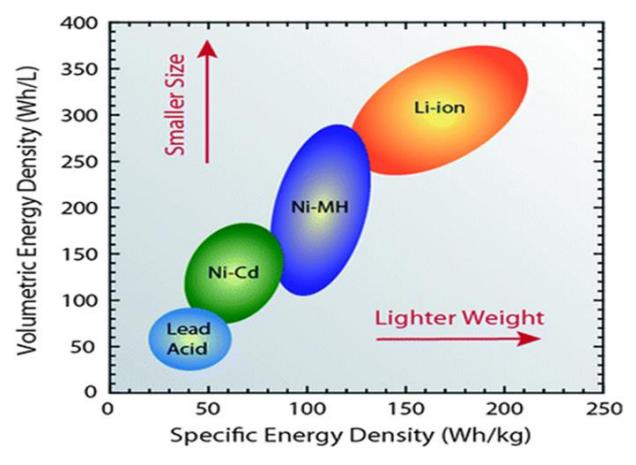
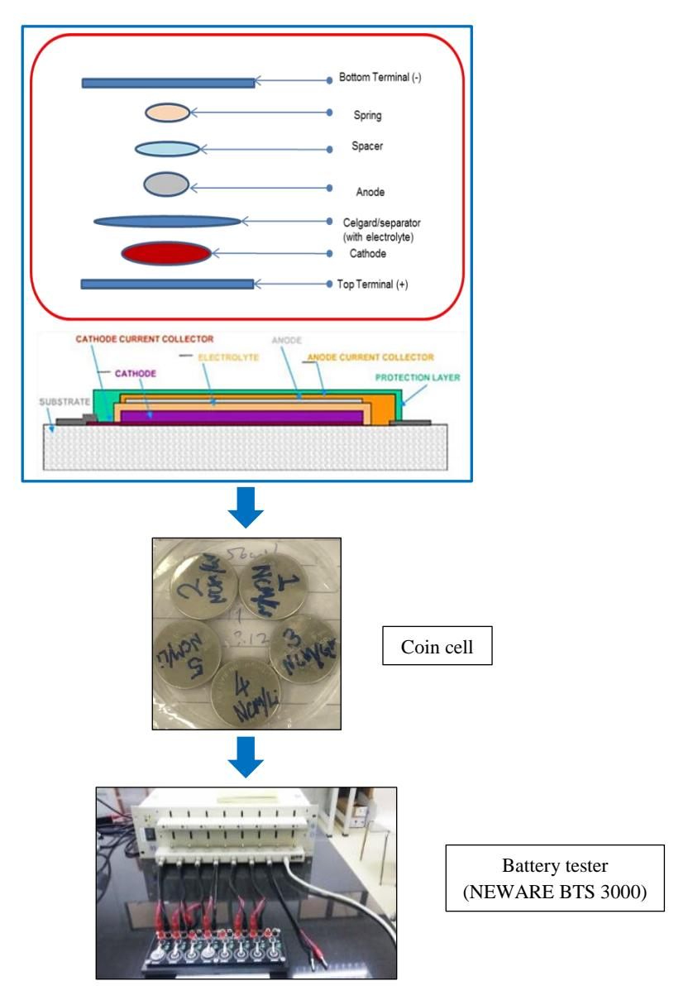
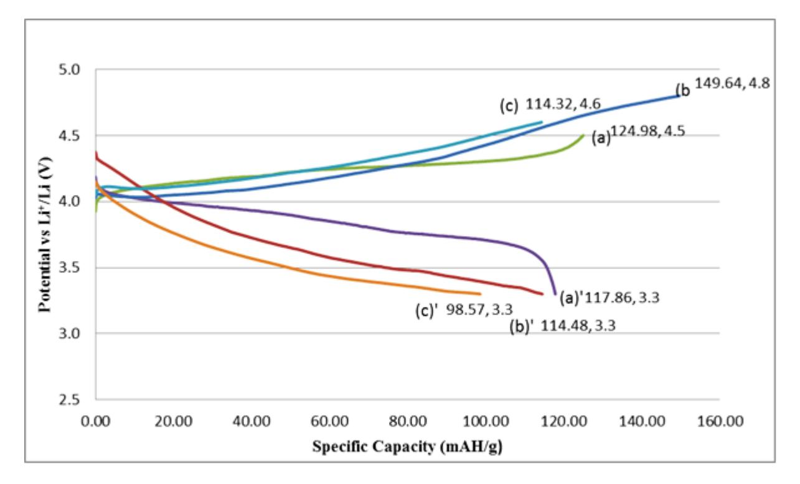
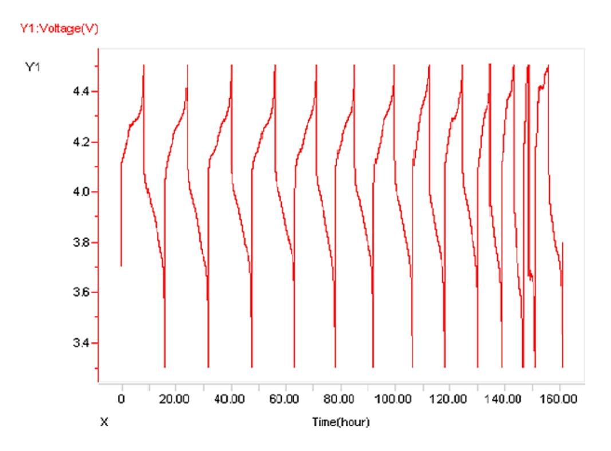
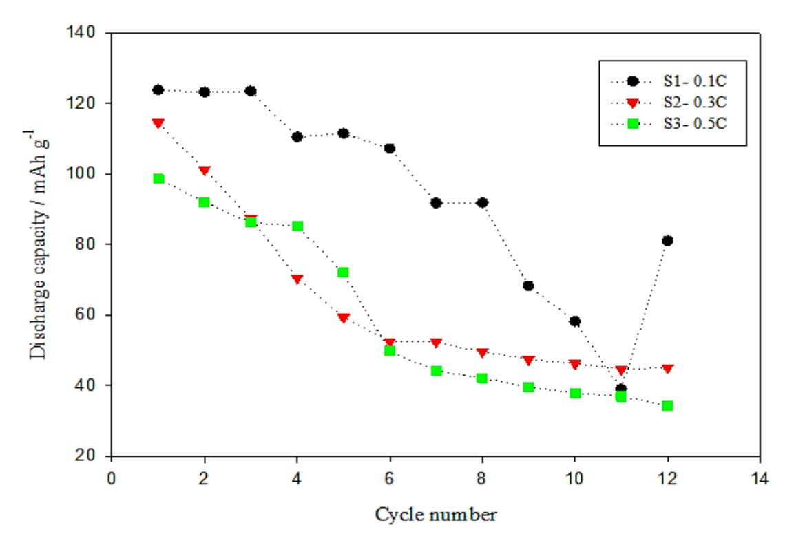

# **Evaluation of Charge-Discharge Characteristic of Lithium Cobalt Nickel Manganese Oxide for High– Energy Density Lithium-Ion Batteries**

P. M.W. Salehen1 , H. Razali1 , K. Sopian1,2 , T. K. Lee3 and M. S. Su'ait\*1

1Solar Energy Research Institute (SERI), Universiti Kebangsaan Malaysia, 43600 Bangi, Selangor, Malaysia

2Department of Mechanical Engineering, Faculty of Engineering and Built Environment, Universiti Kebangsaan Malaysia, 43600 Bangi, Selangor, Malaysia 3Fuel Cell Institute, Universiti Kebangsaan Malaysia, 43600 Bangi, Selangor, Malaysia

\**Corresponding author: mohdsukor@ukm.edu.my*

| Article History:                            | Abstract – The development of suitable cathode materials of lithium ion                                                                                                                                                                                                                                                                                                                                                                                         |
|---------------------------------------------|--------------------------------------------------------------------------------------------------------------------------------------------------------------------------------------------------------------------------------------------------------------------------------------------------------------------------------------------------------------------------------------------------------------------------------------------------------------------------|
|                                             | batteries (LIBs) for energy storage towards improving the performance of                                                                                                                                                                                                                                                                                                                                                                                                 |
| Received                                    | LIBs in order to meet the increasing demand globally is one of the                                                                                                                                                                                                                                                                                                                                                                                                       |
| 16 Apr 2017                                 | challenges. This paper investigates the charge-discharge characteristic for                                                                                                                                                                                                                                                                                                                                                                                              |
| Received in revised form 23 June 2017 | lithium ion batteries developed focusing on cathode materials of LiNiCoMnO2 (NCM) – layered structured material with lithium anode. It also discusses the characteristic features of charge-discharge profile, optimized charge-end voltage as well as discharged limit voltage with a                                                                                                                                                                 |
| Accepted 25 Aug 2017                     | constant current C-rate with 0.1C, 0.3C and 0.5C. The coin cells were fabricated in a glove box full of argon gas using those cathode and anode with separator and organic electrolyte (1M LiPF6, EC: DEC 1:1). The                                                                                                                                                                                                                                                |
| Available online 1 Sep 2017              | performance of charge-discharge test was conducted with NEWARE tester equipment BTS 3000. This includes obtaining experimental data charge discharge and power capacity to improve the performance of battery. Thus it is reported that charge-discharge characteristic of LNCM material is important to be analysed for LIBs. The parameter attained is vital and necessary enhancement work for the resolution of optimization BMS simulation. |
|                                             | Keywords: Battery, Lithium-ion, LiNiCoMnO2, charging-discharging, power                                                                                                                                                                                                                                                                                                                                                                                                  |

capacity

*Copyright © 2017 Society of Automotive Engineers Malaysia - All rights reserved. Journal homepage: www.journal.saemalaysia.org.my* 

# **1.0 INTRODUCTION**

Lithium-ion batteries (LIBs) have been extensively utilized for high technology applications and developed since the past three decades for mobile phones, laptops and many other electronic devices as well as for vehicles. Nowadays, LIBs commercial development arises globally used for hybrid electric vehicles (HEVs) and fully electric vehicles (EVs). These LIBs

become the best choices for researcher and industries due to higher energy density, lower selfdischarge and longer life cycle performance compare to conventional batteries such as Lead Acid, Nickel Cadmium (NiCd) and Nickel Metal Hydride (NiMH). This is because the mentioned conventional batteries is less capacity for performance, bulky and three times lower cell voltage compare to LIBs (Rohan et al., 2014). Therefore, LIBs comes into the picture as a new performance material. The Commercial of battery evolution history to higher density is shows in Figure 1.

**Figure 1**: Commercialization of battery evolution to higher density (Rohan et al., 2014)

Furthermore, with tremendous technology of LIBs since 1980s, researcher extensively proposed the structure layered compound such as LiCoO2 (LCO), LiMn2O4 (LMO) – spinel's structure and LiFePO4 (LFP) – olivine structure (Julien et al., 2014). Swiftly, all these LIBs compound materials are extensively used for study towards having excellent long-life cycle with high rate capacity performance and safety. As an example, LCO was no more familiar due to costing and toxicity despite of its high rate capacity, LMO shortens life cycle even with higher voltage, LFP so far determined as safe and reliable but with lower voltage and capacity (Armstrong & Bruce, 1996; Fergus, 2010; Nitta et al., 2015). Nevertheless, extensive research continues in order to find alternative and the best choices of LIBs which can accommodate the demand from the industries and environmental friendly. In LIBs technology, all these compounds were determined as positive electrode material (cathode) and must have properties characteristic such as large rechargeable capacity, high operating voltage and high-energy densities in order to have optimized LIBs.

Thus it is reported that the new development material which is LiNiCoMnO2 (layered) has become an alternative reliable compound of LIBs innovated from the LCO for high power performance application of energy storage. It also discusses the characteristic features of charge-discharge profile, optimized charge-end voltage as well as discharge limit voltage for three samples with a constant current C-rate of 0.1C, 0.3C and 0.5C.

#### **2.0 EXPERIMENTAL**

# **2.1 Materials**

The commercial grade of electrode materials used are LiNiCoMnO2 and lithium anode, celgard with thickness of 25*µ*m (porous polypropylene membrane) as a battery separator, coin cells CR2032 casing with stainless steel spacer (0.5mm) and spring, also anode material (Lithium

metal) obtained from KGC Resources Sdn. Bhd., Selangor Malaysia. The conventional organic electrolyte for battery (1M LiPF6, EC: DEC 1:1) - impurities <15ppm H2O, 50ppm HF with colour APHA <50, density 1.26g/mL was purchased from Sigma Aldrich Japan, whereas all materials used without further purification except electrode and celgard were dried at 80°C for 24 hours.

## **2.2 Fabrication**

This half-cell battery was constructed in a glove box with full of dry argon gas atmosphere (1.0 ppm O2 and <0.01ppm H2O). The coin cells were fabricated using lithium electrode as anode (diameter 1.6cm), LiNiCoMnO2 electrode (diameter 1.25cm) as cathode, Celgard 2300 (diameter 1.9cm) as separator and electrolyte used was organic electrolyte (1M LiPF6, EC: DEC 1:1). All experiments were carried out at room temperature (25°C). Figure 2 shows the schematic architecture of coin cells fabricated as mentioned above.

**Figure 2:** Schematic architecture for the fabrication of coin cell LiNiCoMnO2/Li in glovebox full of dry argon gas atmosphere, to humidity (<0.01) and O2 (1) ppm content and the fabricated coin cell were further tested using BTS

#### **2.3 Characterization**

Before the battery testing, the coin cell batteries were rested for at least 12 hours overnight to allow the potential stabilization. The long open-circuit relaxation time was used to ensure an equilibrium open-circuit potential. Then the OCV was determined prior to that testing which can only proceed for battery characterization when OCV is above 2.7V indicated by its typical multimeter. All described experiments were accomplished on measuring computer software NEWARE for monitoring, controlling and recording of the whole measuring process. Charging-discharging of the cell were realized by setting the voltage range of the electrode materials respectively. The charge-discharge profile of commercial electrode monitored the voltage (V), current (mA) and specific capacity (mAH/g).

All potentials given are versus the Li/Li+ reference electrode in the experimental electrolyte, which was 1.0M lithium hexafluorophosphate (LiPF6) in a 1:1 by volume ethylene carbonate (EC): diethyl carbonate (DEC) mixture (High Purity Lithium Battery Grade, Mitsubishi Chemical Company). Charge (lithium intercalation) and discharge (lithium extraction) characteristics were measured between +0.0 and +4.8V at a constant current with determined C-rate between 0.1 and 0.5C.

The performance of charge and discharge test was conducted with battery tester equipment (NEWARE BTS 3000) at room temperature as demonstrated in Figure 2. The performance of charge and discharge test were carried out with different voltage range limitation as tabulated in Table 1. Charge-discharge curve of LiNiCoMnO2/Li cells were operated in voltages ranging of (a) S1 - 4.5/3.3V, *I* =0.35mA (0.1C), (b) S2 - 4.8/3.3V, *I*=0.824mA (0.3C), and (c) S3 - 4.6/3.3V, *I*=1.426mA (0.5C) for initial 12 cycles respectively.

| Samples  | Weight (g) | OCV (V) | I (mA), C-rate | Charge Discharge (CD) | Average voltage (V) | Specific capacity (mAh/g) | Coulombic efficiency (%) |
|----------|---------------|------------|----------------------|-----------------------------|---------------------------|---------------------------------|--------------------------------|
| S1(a-a') | 0.0226        | 3.0        | 0.35                 | 4.5-3.3V                    | 4.0                       | 118.0                           | 94.3                           |
|          |               |            | (0.1C)               |                             |                           |                                 |                                |
| S2(b-b') | 0.0177        | 3.0        | 0.82                 | 4.8-3.3V                    | 4.0                       | 114.5                           | 76.3                           |
|          |               |            | (0.3C)               |                             |                           |                                 |                                |
| S3(c-c') | 0.0184        | 2.8        | 1.43                 | 4.6-3.3V                    | 3.4                       | 98.6                            | 86.2                           |
|          |               |            | (0.5C)               |                             |                           |                                 |                                |

| Table 1: LiNiCoMnO2 / LiPF6 (1M), EC: DEC 1:1/ Lithium |
|-----------------------------------------------------------------|
|-----------------------------------------------------------------|

# **3.0 RESULTS AND DISCUSSION**

As shown in Figure 3, the charge and discharge curve of LiNiCoMnO2/Li cells operated at constant current rate at room temperature (25°C). Open-circuit voltages of freshly fabricated cells are about 3.0V. The charge and discharge curves obtained were for three cells, each cell was charged to a different depth of charge and then discharged to 3.3V.

**Figure 3:** The galvanostatic charge-discharge curve of LiNiCoMnO2/Li cells operated in voltages range of (a) 4.5/3.3V, *I*=0.35mA (0.1C), (b) 4.8/3.3V, *I*=0.824mA (0.3C), (c) 4.6/3.3V, *I*=1.426mA (0.5C) for initial 12 cycles respectively. All the cells used 1 mol LiPF6 in EC: DEC (1:1) as electrolyte. The specific capacity is in mAh per gram of the positive electrode element LiNiCoMnO2 respectively

Charge and discharge curves of half-cell indicated as sample S1 of LiNiCoMnO2/Li coin cell as shown in Figure 3 operated at a constant current rate of 0.35mA (0.1C) at room temperature. Open circuit voltage of freshly fabricated cells is 3.0V. S1 charge and discharge curves obtained with the setting of charge-end voltage of 4.5V and discharge limit voltage of 3.3V. As for sample S1 seen in Figure 3, with a start at voltage of 4.1V, the profile discharge curve shows well proper presented with practical capacity of 118mAH/g. Moreover, the charging curve indicated practical capacity of 125mAH/g out of 155mAH/g based on theoretical capacity of manufacturer (KGC Resources Sdn. Bhd.). Despite the report by (Yabuuchi et al., 2007), the setting voltage range of battery for charge-discharge curves was able to go between 2.5V and charge end voltage of 5V. The charge-discharge profile curve looks perfect with the average nominal voltage achieved about 4V.

Hence, from previous research discovered average nominal voltage as 4.12V by Yabuuchi et al. (2007), 3.85V by Yoshizawa and Ohzuku (2007), and 3.7V by Nitta et al. (2015). It is shown that sample S1 was also cycled at a constant current of 0.3503mA (0.1C), and the potential limits between 3.3 and 4.5V. Therefore, with this result the setting potential limits between 3.3 and 4.5V at rate of 0.1C was determined acceptable and able to become a benchmark for better performance of the electrochemistry in the cell of LiNiCoMnO2 as a cathode. Additionally, it is also known that the SOC is 0% and 100% in the cases of empty and full charge states respectively. Thus, previous study found by Yabuuchi et al. (2007) shows varied cells operated in voltages of 2.5 to 4.2, 4.3, 4.4, 4.5, 4.6, or 4.7V of charge-end voltage at 30°C but not with the range of low voltage 3.3/4.5V charge-end voltage. Capacity fades when charge-end voltage is at 4.7V but the exact C-rate was not mentioned.

Figure 3 also shows sample of S2 ((b)-(b)') with the specific capacity variations of two electrodes and voltage during charge-interval-discharge sequence of 12 cycles. For this S2 sample, the absolute value of charge/discharge current was increased to 0.824mA (0.3C). The open circuit voltage of freshly fabricated cells is also 3V. Then, the setting voltage was applied with 3.3V to 4.8V during charge for 3.3 hr, and decreased from 4.8 to 3.3V during discharge. Thus, when the C-rate is increased to 0.3C, charging curve (b) profile indicated unfinished, and NCM potential seems capable of going higher than 4.8V compared to S1, C-rate 0.1C is well enough for setting charge-discharge voltage of 4.5/3.3V. Theoretically, it is determined by Julien et al. (2014) and Scrosati and Garche (2010) with the presence of Ni and addition of Co and Mn during charging in which average composition of NCM for each particles consists of bulk material surrounded by a concentration-gradient outer layer. Therefore, LiNiCoMnO2 is determined as a significant material currently due to embedding performance, layered structure featuring, and great advantage for high specific capacity. The higher Li extraction capacity actually happens with the presence of Ni, while the substituted of Mn and Co (become NMC) is for enhanced cycle life and safety of the battery.

As can be seen clearly in Figure 3, the result of S3 ((c)-(c)'), is not doing well compared to S1 and S2. When the charge end voltage increment by 0.1 became 4.6V, the charging specific capacity S3 (c) decreased to 114mAh/g at the C-rate 0.5C with a constant current 1.42mA, compared to 125mAh/g of sample S1 (0.1C). Supposedly, the discharge capacity should increase when higher charge-end voltage was applied to the cells, already determined by (Yabuuchi et al., 2007). Therefore, the result of sample S3 shows that rechargeable capacity is not a function of charge-end voltage, despite of the charge-discharge curve profile does not perform well. A big gap was predicted that may cause low valence transition for metal cations (Ni+ ) and low strain, low concentration which causes low rechargeable capacity in layered cathodes even at higher rate of 0.5C compared to S1 and S2. Nevertheless many possibilities can cause fading cells due to electrochemistry of the cell.

Besides, some cycling data are presented in Figure 4 and 5 for S1. The cell was cycled at a constant current of 0.35mA (0.1C) between potential limits of 3.3 and 4.5V, and indicated the most stable amongst other samples. In depth, is better illustrated in Figure 5, in which three of the sample cells with different symbols indicated 12 data points of discharge capacities. As seen in this figure, the discharge capacity reduces with cycle performance. S3 faded fastest at initial cycle from 99 to 35mAh g-1 as charge end voltage increases from 4.5 to 4.6V. Whilst S1 rechargeable capacity only reduced from 125 to 86mAh g-1 as charge end voltage 4.5V. As a result, S1 has been found to be the most reliable amongst other samples at a constant current of 0.35mA (0.1C) between potential limits of 3.3 and 4.5V. Thus, this report finding is only based on the lab study resulted in the collection of lab work data for charge/discharge of mentioned samples. Continuous effort is still being held to monitor the developmental change of the trend situation. Nevertheless, the working potential limits of 3.3 and 4.5V is very significant to be taken as one of parameter attained for the needs of optimization BMS simulation of future research input.

**Figure 4:** Cycling of the LiNiCoMnO2/Li cells operated in voltages range of (a) S1 - 4.5/3.3V, *I*=0.35mA (0.1C)

**Figure 5:** Capacity vs Cycling performance, discharge capacity as a function of cycle number of LiNiCoMnO2/Li cells operated in voltages range of (a) 4.5/3.3V, *I*=0.35mA (0.1C), (b) 4.8/3.3V, *I*=0.824mA (0.3C), (c) 4.6/3.3V, *I*=1.426mA (0.5C) for initial 12 cycles respectively

# **4.0 CONCLUSION**

In conclusion, the improvement of cathode materials development is a challenge for the current and future requirement of energy storage. Thus, this study discovered the best voltage range has been enhanced at 4.5-3.3V and includes voltage plateau at 4V with specific capacity of 118mAh/g as shown in S1. Theoretically, high voltages and good capacities can be delivered by numerous transition metals established by cathode materials. These parameter obtained is vital in order to satisfy the optimization of BMS simulation for future research. The right technique fabrication process also is very significant despite of advanced development in cathode materials, and further enhancement are still desired in the future.

# **ACKNOWLEDGEMENTS**

This research work was financially supported by the Research University Grant, TD-2015-08 and GUP-2016-087. The authors would also like to extend their gratitude towards Universiti Kebangsaan Malaysia (UKM) for allowing this research to be carried out. Additionally, heartiest gratitude is given to our support scholar organization, namely of Public Service Department, Government of Malaysia.

# **REFERENCES**

- Armstrong, A.R., & Bruce, P.G. (1996). Synthesis of layered LiMnO2 as an electrode for rechargeable lithium batteries. *Nature*, *381*, 499-500.
- Fergus, J. W. (2010). Recent developments in cathode materials for lithium ion batteries. *Journal of Power Sources*, *195*(4), 939-954.
- Julien, C. M., Mauger, A., Zaghib, K., & Groult, H. (2014). Comparative issues of cathode materials for Li-ion batteries. *Inorganics*, *2*, 132-154.
- Nitta, N., Wu, F., Lee, J. T., & Yushin, G. (2015). Li-ion battery materials: Present and future. *Materials Today*, *18*(5), 252-264.
- Rohan, J. F., Hasan, M., Patil, S., Casey, D. P., & Clancy, T. (2014). Energy storage : Battery materials and architectures at the nanoscale. In G. Fargas, L. Gammaitoni, D. Paul & G.A. Berini (Eds.), *ICT - Energy - Concepts towards zero-power information and communication technology* (pp. 107-138). Rijeka, Croatia: InTech.
- Scrosati, B., & Garche, J. (2010). Lithium batteries: Status, prospects and future. *Journal of Power Sources*, 195(9), 2419-2430.
- Yabuuchi, N., Makimura, Y., & Ohzuku, T. (2007). Solid-state chemistry and electrochemistry of LiCo1∕3Ni1∕3Mn1∕3O2 for advanced Lithium-ion batteries: III. Rechargeable capacity and cycleability. *Journal of The Electrochemical Society*, *154*(4), A314-A321.
- Yoshizawa, H., & Ohzuku, T. (2007). An application of lithium cobalt nickel manganese oxide to highpower and high-energy density Lithium-ion batteries. *Journal of Power Sources*, *174*(2), 813- 817.