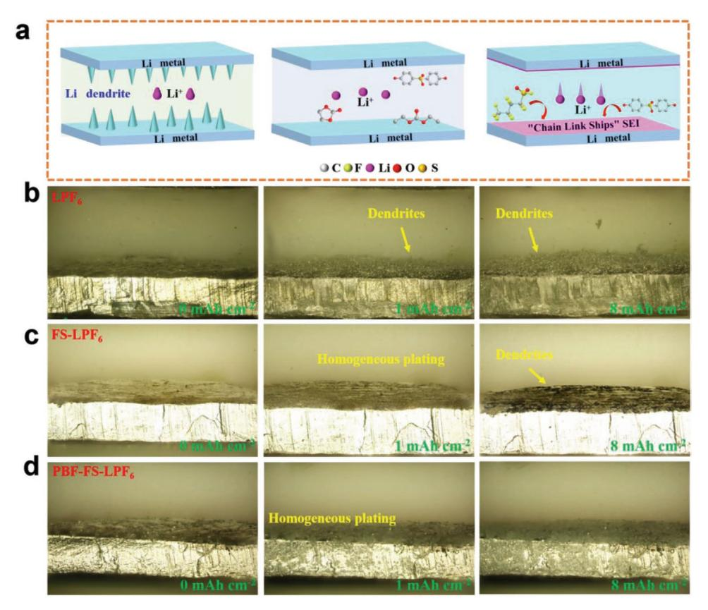
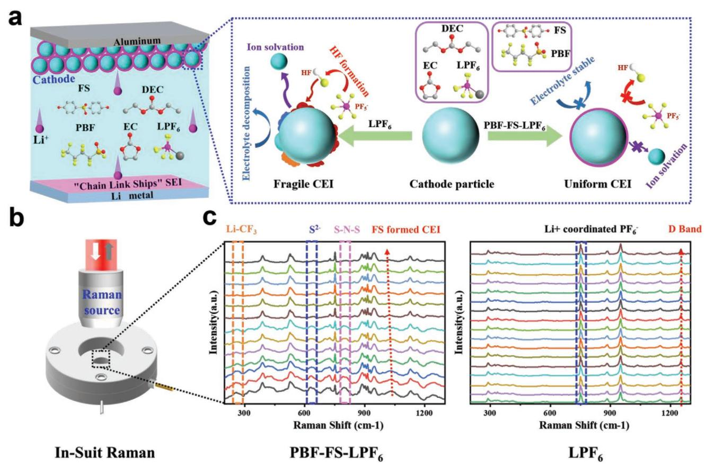
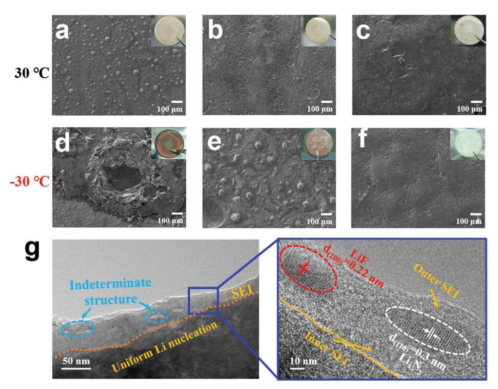
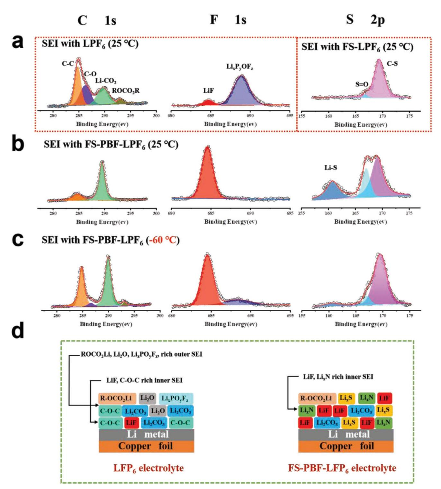
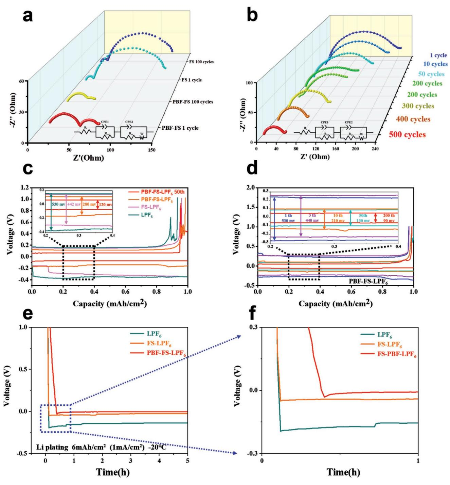
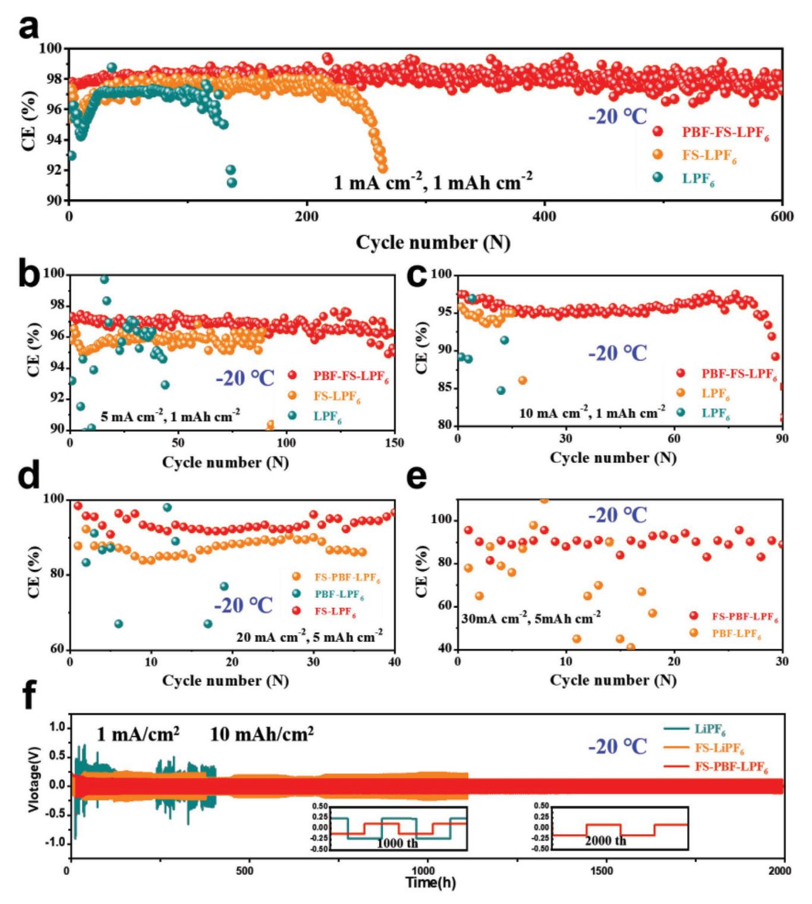
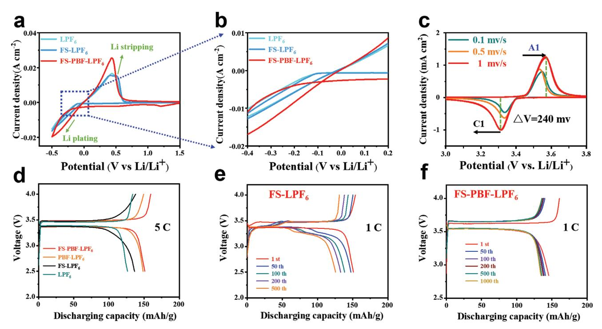
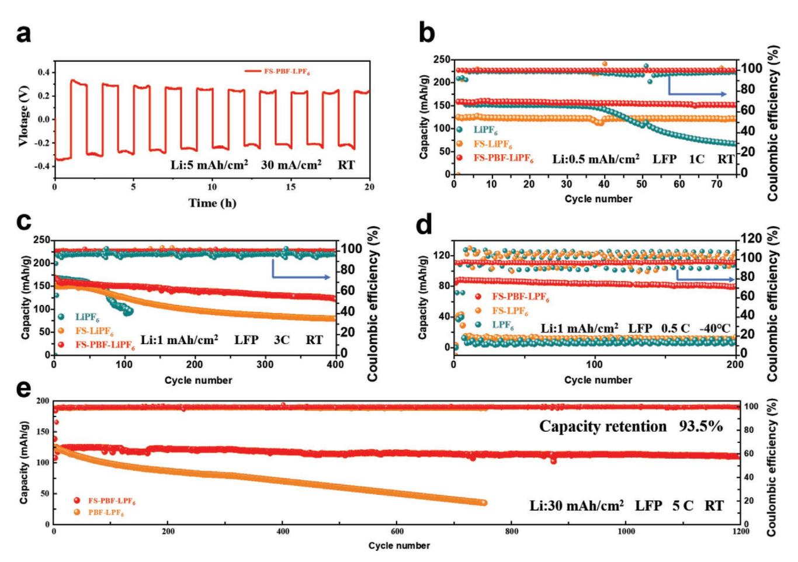
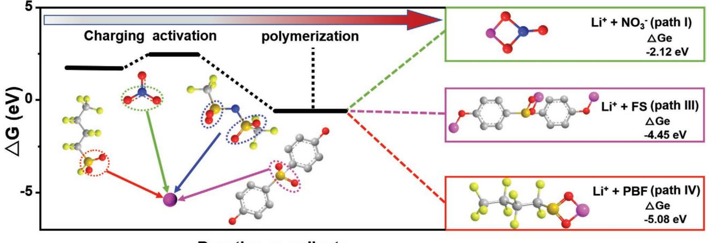

# **The Fluorine-Rich Electrolyte as an Interface Modifier to Stabilize Lithium Metal Battery at Ultra-Low Temperature**

*Da Zhang, DaWei Zhu, WenYao Guo, ChenWei Deng, QunJie Xu, HeXing Li,\* and YuLin Min\**

**Lithium (Li) metal batteries (LMBs) are still limited by lithium dendrite growth and solvated structure at low temperatures. A stable solid electrolyte interface (SEI) and solvent sheath structure are the future directions of liquid metal battery development. However, most artificial SEIs and electrolytes cannot meet the original objective of high conductivity and low nucleation potential multifunctional design. To address this challenge, an electrolyte with excellent high current density and low-temperature performance is reported here. In this electrolyte environment, the thickness and microstructure of the "Chain Link Ships" SEI are formed. Moreover, the additives improve the desolvation ability of Li+ in the ester electrolytes. Under the harsh environment (−30 °C), the average coulombic efficiency (CE) of the Li**||**copper (Cu) battery reaches 98% after 200 cycles. Even at −40 °C, the Li**||**LiFePO4 (LFP) battery shows 90% capacity retention after 100 cycles at the cathode-limited areal capacity (5 mAh cm−2). Furthermore, at 30 °C, the Li**||**LFP battery can cycle stably for 1200 cycles at 5 C, and the capacity retention reaches 93.5%. This addition strategy provides insights into the commercial application of new solvated structure electrolytes and a new approach for commercial low-temperature LMBs.**

# **1. Introduction**

Lithium (Li) metal battery plays an essential role in contemporary energy conversion technology, such as new energy vehicles (NEVs) and micro-electronic equipment, which puts forward

D. Zhang, D. Zhu, W. Guo, Q. Xu, H. Li, Y. Min Shanghai Key Laboratory of Materials Protection and Advanced Materials Electric Power Shanghai Engineering Research Center of Energy-Saving in Heat Exchange Systems Shanghai University of Electric Power Shanghai 200090, P. R. China E-mail: hexing-li@shnu.edu.cn; ahaqmylin@126.com C. Deng State Key Laboratory of Space Power-sources Technology Shanghai Institute of Space Power-Sources 2965# Dongchuan Road, Shanghai 200245, P. R. China Q. Xu, H. Li, Y. Min College of Environmental and Chemical Engineering Shanghai Institute of Pollution Control and Ecological Security Shanghai 200092, P. R. China

The ORCID identification number(s) for the author(s) of this article can be found under https://doi.org/10.1002/adfm.202112764.

**DOI: 10.1002/adfm.202112764**

higher requirements for high energy density, environment friendly, long cycle life, and high safety.[1] Benefiting from the ultra-high specific capacity (3860 mAh g−1 ) and the lowest chemical potential (−3.04 V vs standard hydrogen electrode), Li metal anodes have become the "Holy Grail" of batteries.[2] However, low coulombic efficiency (CE) and dendritic growth of Li anodes in commercial carbonate electrolytes hinder the high performance of lithium metal batteries (LMBs); this problem was more obvious at low temperature (below 0 °C).[3] Therefore, by constructing stable solid electrolyte interphase (SEI) and solvent sheath structure at low temperatures by adjusting the composition of the electrolyte have been considered the most effective and economical strategies.[4]

About the specific application of LMBs in low-temperature environments, it is urgent to inhibit the Li dendrite growth in low-temperature carbonate electrolytes.[5]

Generally, the auxiliary heating systems can effectively avoid the problem that the battery equipment cannot be charged under harsh environments.[6] However, both the start-up time of the auxiliary heating system and the source of high current for initial activation are non-negligible factors. Furthermore, many devices cannot be equipped with auxiliary heating systems, such as high-altitude drones. For these reasons, the normal charging and discharging performance of batteries in harsh environments has become the research focus of current electrolyte systems.[7]

Herein, we have designed a novel carbonate electrolyte. The solvent sheath structure of the carbonate electrolyte was changed by adding 4,4ʹ-sulfonyldiphenol (FS) and perfluoro *n*-butylsulfonyl fluoride (PBF), and a fluorine-rich (LiF) SEI interface layer was derived (the modified electrolyte is called PBF-FS-LPF6). As a highly efficient Lewis base (FS), the stability of LiPF6 was highly enhanced, thus avoiding the formation of HF. Moreover, the novel carbonate electrolyte can be improving the electrochemical stability and ionic conductivity of the electrolyte at low temperature and avoiding interface fracture due to the strong bonding between lithium and SEI. Therefore, a high CE with superior cycling stability of the Li metal anode can be achieved in the PBF-FS-LPF6 electrolyte, and its performance is better than commercial carbonate electrolyte and electrolyte with

**Figure 1.** The modified electrolyte as an interface modifier to stabilize lithium metal anode. a) Chemical diagram between Li plate and electrolyte interface. In Li symmetrical battery, the morphology of lithium changes after plating with different electrolytes (scale bars were 200 µm). b) LPF6. c) FS-LPF6. d) PBF-FS-LPF6.

only FS or PBF added. Furthermore, the Li||copper (Cu) cell can cycle stably for nearly 30 cycles at 30 mA cm−2 with 5 mAh cm−2 lithium capacity. And under the harsh environment of −30 °C, the average CE of the Li||Cu cell over 200 cycles reached 98%. Even at −40 °C, the Li||LiFePO4 (LFP) full battery showed 90% capacity retention at the cathode-limited areal capacity (5 mAh cm−2) after 100 cycles. Moreover, at 30 °C, the Li||LFP battery can cycle stably for 1200 cycles at 5 C, and the capacity retention rate reaches 93.5%.

### **2. Results and Discussion**

#### **2.1. Defect-Free SEI at the Current Collector**

We choose a commercial carbonate electrolyte as the benchmark and regulate the functionality of the electrolyte through the addition of the FS and PBF. To test the low-temperature performance of the modified electrolyte, the electrolyte was placed in a low-temperature (−65 °C) test box (Figure S1, Supporting Information). Figure S2, Supporting Information illustrates the solvent structure and Li+ transport mechanism in three electrolytes (LiPF6, FS-LiPF6, and PBF-FS-LiPF6) at low temperature. For LiPF6, it decomposes in trace water to form HF, which will cause serious corrosion to the electrode materials. Moreover, the solvation leads to slow Li+ transport and uneven lithium deposition, resulting in the formation of "dead lithium." Therefore, the addition of FS reduces the Li+ solvation of the electrolyte, and PBF enhances the lithium-ion transmission, thereby building SEI with a good mechanical structure and controlling lithium dendrites. The formed flexible interface layer is called "Chain Link Ships" SEI (**Figure 1**a). This flexible SEI effectively depresses the growth of lithium dendrites, adapts to the volume changes in the process of lithium deposition, and reduces the ion transfer barrier in the Li plating/stripping process.

The lithium deposition in three electrolyte systems was compared by in situ polarizing microscope. In Figure 1b–d, the LPF6 electrolytes cannot effectively solve the problem of uneven lithium deposition, but fortunately, the addition of FS and PBF can reduce the generation of lithium dendrite and improve the efficiency of lithium deposition. And for PBF-FS-LPF6 electrolyte, lithium deposition has obvious advantages. Even if the Li charge capacity reaches 8 mAh cm−2 , no obvious lithium dendrite appeared. The in situ experimental results show that the addition of the FS and PBF effectively stabilizes the lithium anode electrolyte interface. On the other hand, the mechanism of the FS stabilizing the cathode as an efficient Lewis base was shown in **Figure 2**a. Meanwhile, the thermal stability of LiPF6 was highly enhanced, thus avoiding the formation of HF. HF corrodes the cathode electrolyte interface (CEI) and LFP cathodes, leading to CEI fracture and transition metal ion dissolution. Inhibiting the production of HF maintains the stability

www.advancedsciencenews.com

**FUNCTIONAL** www.afm-iournal.de

Figure 2. The modified electrolyte as an interface modifier to stabilize LFP cathode and in situ Raman spectra between LFP cathode and electrolyte interface. a) Chemical diagram between LFP cathode and electrolyte. b) In situ Raman installation diagram. c) PBF-FS-LPF6 and LPF6.

of the CEI and cathode and suppresses the increase in impedance and capacity loss during subsequent electrochemical processes. Therefore, the interface effect of modified electrolyte (PBF-FS-LPF) on cathode LFP was measured by in situ Raman spectroscopy. As shown in Figure 2b, a coin cell model is used to assemble the in situ Raman device. The in situ Raman measurements in a coin cell mode is shown in Figure S9, Supporting Information. In Figure 2c, the combination of Li+ and  $-CF3$  accelerates the lithium ions transport velocity at low temperature,[8] and the corresponding peak position is 282 cm-1. Moreover, the appearance of sulfur  $(S)$  and S-nitrogen  $(N)-S$ with high electronegativity can well inhibit the formation of HF and protect the CEI.[9]

To evaluate the Li+ transmission speed of the electrolytes, the lithium deposition was tested at room temperature (30  $^{\circ}$ C) and low temperatures ( $-30$ ,  $-60$ , and  $-70$  °C). In **Figure 3**a, for  $LPF_6$ , although lithium ions can be deposited on the Cu foil, the field emission scanning electron microscopy (FESEM) image shows that the Li deposition on the copper foil surface was not uniform. After adding FS, the stable conjugate structure  $(\pi-\pi)$  weakens the solvation in the commercial electrolyte (LPF6), and the deposited Cu foil surface was more uniform without obvious dendrites. The pores and cracks were changed in the volume of the Li-SEI contact interface, which was caused by unstable SEI layer (Figure 3b). However, with PBF, the lithium deposition was more uniform. As shown in Figure 3c, the Li deposited on the copper foil was uniform and complete, which shows the transmission of lithium ion in the FS electrolyte has been promoted. Similarly, when the deposition temperature was reduced to  $-30$  °C, the same result can still be obtained (Figure 3d-f). Even at extremely harsh temperatures ( $-60$  and  $-70$  °C), the PBF-FS-LPF6 electrolyte can still achieved stable deposition (Figures S3 and S4, Supporting Information). Stable deposition ensures the battery cycle, and the highly conductive SEI improves the kinetics of lithium ions transmission and ensures the efficiency of lithium deposition at low temperatures.

To investigate the thickness and microstructure of the "Chain Link Ships" SEI,[10] we performed transmission electron microscopy (TEM) analysis. Lithium deposition was performed under a  $-30$  °C environment, and the deposition of different electrolyte systems was observed. In Figure 3g, the thickness of the "Chain" Link Ships" SEI on Cu foil (21.6 nm) was approximately one third that of LPF6 (≈60 nm, Figure S5a, Supporting Information), verifying that SEI formation by electrolyte decomposition was suppressed in the PBF-FS-LPF6 electrolyte. In sharp contrast, lithium deposition began to grow directionally at  $-30$  °C, which also means the growth of dendrites (Figure S5b, Supporting Information). In addition, by carefully observing the SEI structure formed by the PBF-FS-LPF6 electrolyte at low temperatures, LiF and  $\mbox{Li}_xN_y$  can be obviously observed. For FS-LPF6, only Li2CO3 was observed (Figure S6, Supporting

**Figure 3.** SEM and TEM images of lithium deposition morphology at room temperature (the inset is an optical picture after deposition): a) LPF6, b) FS-LPF6, c) PBF-FS-LPF6. SEM images of lithium deposition morphology at −30 °C (the inset is an optical picture after deposition): d) LiPF6, e) FS-LiPF6, f) PBF-FS-LiPF6. g) TEM images of lithium deposition at −30 °C.

Information). In addition, a large number of mosaic structures show that there are a large number of decomposed organics in the SEI structure formed by the LPF6 electrolyte at low temperatures,[11] so it shows random deposition at different potentials. The high uniformity of the SEI in the FS electrolyte can facilitate a uniform lithium flux and diminish focused Li nucleation, which are requirements for uniform lithium nucleation and growth.

#### **2.2. Components of the Low-Temperature SEI**

The structures of the SEI formed on the LiPF6, PBF-FS-LiPF6, and PBF-FS-LiPF6 were analyzed through depth-profiling XPS. The composition of SEI was obtained after depositing lithium with a rated capacity (10 mAh cm−2 ) and cycling for 10 h. The inner composition of SEI was analyzed by argon ion sputtering at the same depth (100 nm). As shown in **Figure 4**a, the SEI that formed on the copper foil at 25 °C exhibited a high concentration of carbon (C)–C and carbon (C)–oxygen (O) (peaks at 284.6 and 286.3 eV in the C 1 s spectrum), which was consistent with previous research results.[5a,6,12] For the F 1s spectrum, the LiF content was lower than that of the Li*x*PO*y*F*z*, which indicated that there was less flux component of high ions in the inner SEI. In sharp contrast, for the SEI of the PBF-FS-LiPF6 electrolyte, the C–C content decreased sharply when the depth reached 100 nm, and the C–O content was almost negligible. It shows that at the same depth of the PBF-FS-LiPF6 electrolyte, there were fewer organic components and more inorganic components (highly conductive) in the SEI components (Figure 4b). The key substance in inorganic components (LiF) also increased significantly. Of note, the Li–S appeared in the SEI of the PBF-FS-LiPF6 electrolyte (peaks at 160.8 eV in the S 2 p spectrum). Also, FS was an important source of the Li–S component.

When the temperature drops to −60 °C, the components of the SEI (PBF-FS-LiPF6) on the copper current collector changes markedly (compared to LPF6; Figure S7, Supporting Information). As shown in Figure 4c, the proportion of ROCO2R derived from ethylene carbonate (EC) and dimethyl carbonate (DMC) dropped to 5.2%, which is lower than the 8.7% value at 25 °C. Furthermore, the LiF content did not decrease significantly, which was the main factor affecting battery performance in low-temperature environments. The X-ray photoelectron spectroscopy (XPS) analysis reveals the structures of SEI on LiPF6 (left) and PBF-FS-LiPF6 (right), as illustrated in Figure 4d. It is encouraging that the addition of FS and PBF changed the composition of SEI under a low-temperature environment, increased the proportion of inorganic components (LiF, Li*x*N, and Li*x*S), and enhanced the conductivity of SEI.

#### **2.3. Electrochemical Performance of Lithium Anode**

In order to clarify the promoting effect of modified electrolyte on Li+ deposition, the copper foil substrate was used as the deposition current collector to deposit a certain capacity of lithium. In **Figure 5**a, the charge transfer process is corresponded by the semicircle in the high frequency region. And

**Figure 4.** SEI formation on the copper current collector. Depth profile XPS by sputtering for different lengths of time of a) SEI formed on Cu at 25 °C with LiPF6 and FS-LiPF6, b) SEI formed on Cu at −15 with PBF-FS-LiPF6, c) SEI formed on Cu at −60 °C with LiPF6. d) Suggested SEI composition on LiPF6 (left) and PBF-FS-LiPF6 (right).

the electrochemical impedance spectroscopy (EIS) clearly exhibits two semicircles, which correspond to the impedance value of the Li||Cu interface and the Li–SEI interface. Of note, the interface impedance of the FS electrolyte is decreasing after 100 cycles. As a comparison (FS electrolyte), there was no significant change, indicating that the lithium deposition did not improve as the number of cycles increased. Similarly, the deposited lithium and LFP were assembled as a full battery for in situ EIS testing (Figure 5b). After 500 cycles, the resistance value decreases from 200 to 40 Ω of the first cycle. Furthermore, the Li

DVANCED www.advancedsciencenews.com

www.afm-journal.de

Figure 5. The interfacial electrochemical impedance spectroscopy (EIS) and Li plating/stripping profiles on copper foil. a) EIS of Cu-Li-SEI in the PBF-FS-LPF6 and FS-LPF6 electrolyte. b) EIS of Li-LFP after cycling in the PBF-FS-LPF6 electrolyte. Plating/stripping profiles of c) four electrolytes, d) different cycles of the PBF-FS-LPF6 electrolyte. e) The Li plating/stripping profiles on copper foil substrate at  $-20$  °C. f) Local amplification of the Li||Cu plating/stripping profiles.

plating/stripping profiles on copper foil can also show the advantages of the FS electrolyte. In Figure 5c, we compared the deposition potential of the three electrolytes (LPF6, FS-LPF6, PBF-FS-LPF6) in the Li||Cu cells. The Li capacity was 1.0 mAh cm-2 and the deposition current density was 0.5 mA cm $-2$ . For LPF6, the overpotential of the Li||Cu cell reduces to 530 mv. For com-

parison, the electrolytes of FS-LPF6 and PBF-FS-LPF6 were 442 and 280 mv. Similarly, as shown in Figure 5d, for the FS electrolyte, the deposition overpotential of the Li||Cu cell was decreasing with the increase in cycling. The overpotential of the first cycle deposition is 530 mv, while after 200 cycles of stable deposition, the overpotential decreases to 90 mv. The

deposition current density was 1 mA cm−2 and the capacity was 1.0 mAh cm−2 . When we study the deposition curves of Li||Cu cell, we can obviously observe the lithium deposition advantage of PBF-FS-LPF6 electrolyte. As shown in Figure 5e,f, the change of deposition voltage of BF-FS-LPF6 electrolyte is better than that of FS-LPF6 and LPF6 electrolytes at −20 °C, and the deposition curve is consistent with the previous research conclusions.

#### **2.4. Li**||**Cu and Li symmetric Cell Performance at Low Temperature**

After identifying the SEI structure and deposition tests, we studied the low-temperature performance of LMBs. The addition of FS and PBF changed the composition of SEI under a low-temperature environment and enhanced the conductivity of SEI. This was evidenced by the Li||Cu deposition coulombic efficiency. In **Figure 6**a, we studied the efficiency of the Li||Cu cell with three electrolytes under low-current (1 mA cm−2), lowcapacity (1 mAh cm−2), and low-temperature (−20 °C) conditions. The average efficiency after 600 cycles reached 99.3%. Similarly, the advantages of the PBF-FS-LPF6 electrolyte can still be shown when the current density was expanded to higher (5 and 10 mA cm−2 ). This was in sharp contrast to the other two electrolytes (LPF6, FS-LPF6), which was more obvious at current densities of 5 and 10 mA cm−2. Under low-capacity (1 mAh cm−2) conditions, the PBF-FS-LPF6 electrolytes had better low-temperature battery performance (Figure 6b,c). Furthermore, we also considered the efficiency test in the case of 10 mAh cm−2 capacity. As shown in Figure 6d, for PBF-FS-LPF6 electrolytes at a high current density (20 mA cm−2 ), stable lithium deposition can be maintained. Also, after 40 cycles, the efficiency of the PBF-FS-LPF6 electrolytes reached 93.34%. Of note, even under a high current density (30 mA cm−2 ), the efficiency of the PBF-FS-LPF6 electrolytes also reached 88.76% (Figure 6e). This was due to the low-temperature performance of LiF and the desolvation effect of FS. Furthermore, we also carried out the long cycle test of the lithium symmetrical battery at a low temperature. Figure 6f shows the low-temperature stability of the PBF-FS-LPF6 electrolyte, which can maintain a uniform lithium deposition for 2000 h. The enlarged illustration of the cycle also shows that there was no short circuit inside the battery. The SEM image of the Li on copper foil after cycling is shown in Figure S8, Supporting Information. Compared with the cycling results of the LPF6 and FS-LPF6, the advantage of the PBF-FS-LPF6 electrolyte was obvious. Experiments show that under a high lithium capacity (10 mAh cm−2 ), the addition of FS and PBF can improve the lithium deposition at low temperature and realize the charge and discharge performance under a harsh environment.

To further assess the modified electrolyte, we carried out a series of electrochemical tests. As shown in **Figure 7**a, the Li||LPF6||Cu and Li||PBF-FS-LPF6||Cu cells were subjected to cyclic voltammetry (CV) at a scanning rate of 0.1 mV S−1 between −0.5 and 1.5 V to study the stability of the Li plating/ stripping behavior. And the CV curve of the Li||LPF6||Cu showed typical characteristics of Li plating (−0.1 V) and stripping (0.15 V). Compared with Li||LPF6||Cu and Li|| FS-LPF6||Cu, Li||PBF-FS-LPF6||Cu has a lower lithium plating potential and a higher deposition current density. In Figure 7b, the Li||LPF6||Cu and Li|| FS-LPF6||Cu cells showed the same lithium plating potential (–0.05 V) and a lower deposition current density (17 mA cm−2 ). And the CV curves suggest that the addition of FS and PBF enhanced electrochemical reactivity and more efficient charge transport while improving Li-ion transport efficiency. Of note, the Li||FS-LPF6||Cu cell showed a flat CV curve, except the typical Li plating/stripping peaks, there is no obvious region of Li intercalation. The CV results showed that the addition of FS and PBF did not cause irreversible side reaction with the Li metal anode, and the cycle life of the batteries was ensured.

In Figure 7c, to prove the applicability of the electrolyte at a high scan rate (1 mV s−1 ), the CV test was carried out with a fast sweep speed. The typical cathode/anode CV peaks of Li and LFP are called C1 and A1, and the CV profiles of the Li|| FS-LPF6||LFP cell with different scan rates showed a smaller voltage separation between the C1 and A1 peaks (about 240 mV). For the Li||FS-LPF6||LFP cell, the voltage interval between the C1 and A1 peaks was about 1000 mV (Figure S12, Supporting Information). The CV results show that the Li||PBF-FS-LPF6||LFP has excellent structural stability, lower polarization, and stable electrochemical reactivity. Moreover, the first cycle discharge capacity was an important sign to measure the performance of the electrolytes. Figure 7d shows the charge–discharge profiles at a high rate (5 C) with four electrolytes (LPF6, FS-LPF6, PBF-LPF6, PBF-FS-LPF6). According to the charge–discharge curve, the PBF-FS-LPF6 electrolyte can be over 150 mAh g−1 in the first cycle discharge. By comparison, the capacity of LPF6, FS-LPF6, and PBF-LPF6 were 125, 131 , and 147 mAh g–1 in the first cycle discharge. The first cycle of the high-rate (5 C) charge and discharge performance proves that the PBF-FS-LPF6 electrolyte has a higher capacity and faster Li+ transfer rate. Of note, the stability of the long cycle is still one of the most significant issues for advanced energy materials. As shown in Figure 7e,f, the long-cycle charge–discharge curves of the FS-LPF6 and PBF-FS-LPF6 electrolytes were compared under a 1 C rate. From the test results, we can see that the first discharge capacity of the two electrolytes is almost the same. But as the number of cycles increases, the advantages of the PBF-FS-LPF6 electrolytes are observed. For the FS-LPF6 electrolyte, the cell capacity reduced to 124 mAh g−1 after 500 cycles and the capacity retention rate was 80%. In contrast, after 1000 cycles, the Li||PBF-FS-LPF6||LFP cell capacity can still reach 137 mAh g−1 . And the capacity retention rate was 95.7%. These results showed that the electrolyte with FS and PBF successfully reflects the excellent capacity at a high current density and improves the dynamics of the anode/electrolyte interface, which were consistent with the Li symmetrical battery test.

On the other hand, to show the excellent performance of the modified electrolyte and ensure the battery cycle in harsh environments, we have upgraded the test conditions to an ultra-high current density (30 mA cm−2 ), an ultra-low capacity (0.5 mAh cm−2 ), or a low temperature (–40 °C). In **Figure 8**a, the Li symmetrical battery can cycle over 20 h under the ultrahigh current density of 30 mA cm−2. From the lithium deposition stripping curve, it can also be observed that there was no short circuit in the symmetrical battery. The Li||PBF-FS-LPF6||LFP cell can cycle over 70 cycles at an ultra-low Li capacity

**www.advancedsciencenews.com www.afm-journal.de**

**Figure 6.** Li||Cu deposition coulombic efficiency and Li symmetric battery performance test at −20 °C. The CE performance of the Li||Cu cell with different current density: a) 1 mA cm−2 , b) 5 mA cm−2 , c) 10 mA cm−2 . The CE performance under extreme condition (high current density): d) 20 mA cm−2 , e) 30 mA cm−2 . f) Li symmetric battery performance test with 10 mAh cm−2 lithium capacity at 1 mA cm−2 current density.

(0.5 mAh cm−2 ). The LPF6 electrolyte showed a significant capacity decay after 40 cycles (Figure 8b). The same test results can also be found in Figure 8c. The Li||PBF-FS-LPF6||LFP cell can cycle stably over 400 cycles at 3 C with a 1 mAh cm−2 Li capacity. The capacity retention rate was 79.2%. In contrast, the capacity of LPF6 and FS-LPF6 was 0 and 81 mAh g−1 after 400 cycles. Of note, the battery performance at a low temperature is the focus of our research. Especially for LFP batteries, the

**Figure 7.** The Li-deposited CV and charge–discharge profiles. a) The CV profiles of Li||Cu cells at scan speed of 0.1 mV s–1 in three electrolytes. b) Enlargement of the cyclic voltammetry curve. c) The CV profiles of the Li||LFP full battery using the PBF-FS-LPF6 electrolyte. d) The charge– discharge profiles with three electrolytes in the first cycle. The charge–discharge profiles of Li||LFP cells during different cycles using e) FS-LPF6 and f) PBF-FS-LiPF6.

current capacity of commercial batteries was low and cannot meet basic usage. Therefore, we carried out the low-temperature (−40 °C) test of the LFP battery. At −40 °C, the Li||PBF-FS-LPF6||LFP cell can stably cycle for 200 cycles, and the capacity was over 80 mAh g−1 . The capacity retention rate was 89.4%. This result surpasses most current research reports. For comparison, the capacities of Li||FS-LPF6||LFP and Li||LPF6||LFP are only 20 and 10 mAh g−1 , respectively, and the coulombic efficiency was unstable (Figure 8d). In addition, for high rate and long cycle of the LFP battery in Figure 8e, with Li capacity of 30 mAh cm−2 at room temperature, the battery can circulate 1200 cycles at 5 C. Also, it showed excellent stability in a long cycle of 1200 cycles. The capacity retention rate was 93.5%. Therefore, through the LFP test in a harsh environment, it can be confirmed that the addition of the FS and PF can greatly promote the electrolyte system. According to the results, FS and PBF additives have a good potential in the development of commercial LMBs in the future.

To illustrate that lithium ions were separated from the initial solvated structure, we analyzed the thermodynamic calculations of the additives through the first-principles analysis in the electrolyte system. As shown in **Figure 9**, FS and PBF were added to the ester electrolyte (EC/DMC containing LiPF6) system. After activation, through molecular simulation, the binding energy of the NO3 –1 and Li+ is –2.12 eV. In contrast, the combination of FS and PBF to Li+ is stronger, respectively, –4.45 and –5.08 eV. The results showed that the binding of lithium ion to NO3 −1 was not the dominant binding product in PBF electrolyte. Therefore, the solvation structure of Li+ in commercial ester electrolytes is changed at low temperature, which accelerates the transmission of Li+. The results constructed by the density functional theory (DFT) calculation clarified the chemical bonding between PBF and Li+ is the strongest. Therefore, we believe that that the addition of the FS and PBF promoted Li+ desolvation.

# **3. Conclusion**

Herein, we have designed a novel carbonate electrolyte. The solvent sheath structure of the carbonate electrolyte was changed by adding FS and PBF, and the SEI interface layer with LiF rich was derived. The electrochemical stability and ionic conductivity of the electrolyte at low temperature was improved, and the interface fracture due to the strong bonding between lithium and SEI was avoided. As an electrolyte additive with a stable and excellent electrochemical performance, the synergy of FS and PBF gives commercial electrolytes (LPF6) broader use in many different scenarios, especially in harsh environments. Due to the strong affinity toward Li+, the Li transference number and Li+ diffusion coefficient were outstanding. Therefore, the symmetrical battery using the PBF-FS-LPF6 electrolyte shows stable lithium stripping/plating even under ultra-high current density, with a lower overpotential and higher areal capacity. Combining the above advantages, the Li||LFP battery using the PBF-FS-LPF6 electrolyte provided an excellent rate capability and long-term cycle capability. At a high rate (5 C), the capacity decay per cycle was only 0.0054% for 1200 cycles. Even at –40 °C, the Li||LFP battery shows 90% capacity retention after 100 cycles

**Figure 8.** The Li symmetrical battery and Li-LFP full battery performance in harsh environments. a) Li symmetric battery performance test with 5 mAh cm−2 capacity at 30 mA cm−2 . Li-LFP full batteries of b) 0.5 mAh cm−2 at room temperature (RT). c) The lithium battery with a capacity of 1 mAh cm−2 at RT circulates 400 cycles at a 3 C rate. d) The lithium battery with a capacity of 1 mAh cm−2 at −40 °C circulates 200 cycles at 0.5 C. e) The lithium battery with a capacity of 30 mAh cm−2 at RT circulates 1200 cycles at 5 C.

at the cathode-limited areal capacity (5 mAh cm−2). Considering the excellent performance and simple preparation process of the additives, this study provides a new opportunity for the development of the next generation low-temperature LMBs with a lithium fluoride-rich interface and solvent sheath structure.

**Figure 9.** The first-principles calculations. The implicit solvation model of common inorganic salts (NO3 −, TFSI−). FS and PBF combined with Li was calculated.

#### **4. Experimental Section**

*Procedure Preparation of PBF-FS-LPF*6 *Electrolyte*: Before preparing the PBF-FS-LPF6 electrolyte, first prepare the carbonate electrolyte. The traditional carbonate electrolyte used EC/DMC solution (v/v = 1:1) and 0.2% LiNO3 containing 1 m LiPF6. The PBF-FS-LPF6 electrolyte was prepared by adding 2 wt% FS and 5% PBF in traditional carbonate electrolyte, and stirring for 24 h. The FS and PBF were purchased from Aldrich-Shanghai.

*Procedure Preparation of FS-LPF*6 *Electrolyte*: The FS-LPF6 electrolyte was prepared by adding 2 wt% FS and 5% PBF to traditional carbonate electrolyte and stirring for 24 h.

*Electrochemical Measurements*: In the test of Li symmetrical battery, both anode and cathode were quantified by deposition. Assemble lithium anode, polypropylene diaphragm, and electrolyte in a glove box filled with Ar2. The concentration of water and oxygen in the glove box was lower than 0.1 ppm. And the amount of electrolyte for each battery was about 20 µL. Leave the assembled battery in the constant temperature battery test chamber for about 12 h. Land ct-2001a battery circulator was used to conduct a constant current discharge/charging experiment on the battery. The EIS test system was carried out in the frequency range of 0.1 Hz to 100 kHz.

*Density Functional Theory Calculations*: The DFT calculation were carried out by Gauss 16 quantum chemistry software. All the molecules were pre-optimized at B3LYP/6-31G\* level. Then, the configurations of the complex were searched using the Molclus program. The DFT-D3 van der Waals (vdW) correction proposed by grimme was used to obtain the optimized geometry. During the correction process, all atoms were allowed to relax until the atomic force on each atom was less than 0.005 eV Å−1 and the energy was less than 1.0 × 10−6 eV. A total of 200 original configurations were generated, and each configuration was optimized based on B3LYP/3-21G\* level46. Finally, the configuration of the lowest energy was further optimized to the level of B3LYP/6-311G(d). Intermolecular interactions were described using grimme's d3bj dispersion. The binding energy was calculated according to the following equation.

Binding energy = Ecomplex – (Efragment + Efragment ) 1 2 [13] (1)

*Material Characterization*: The low-temperature test box was provided by Zhejiang Jiesheng, and the test temperature range was (≈−20 to 70 °C). XPS equipment manufacturer: Thermo Fisher. Model: Thermo Scientific K-Alpha+. X-ray source: monochromatic AlKa source (Mono AlKa). The state of the sample was analyzed by FESEM (JEM-7800F).

# **Supporting Information**

Supporting Information is available from the Wiley Online Library or from the author.

# **Acknowledgements**

This work was supported by the National Natural Science Foundation of China (22075174,21671133), Technology Commission of Shanghai Municipality (18020500800, 18JC1412900, 19DZ2271100 and 19160712900), and International Joint Laboratory on Resource Chemistry. The authors would like to thank Han nan nan from Shiyanjia Lab for the XPS analysis.

# **Conflict of Interest**

The authors declare no conflict of interest.

# **Data Availability Statement**

The data that support the findings of this study are available on request from the corresponding author. The data are not publicly available due to privacy or ethical restrictions.

# **Keywords**

electrochemistry, lithium metal batteries, low temperatures, solid electrolyte interphases, solvent sheath structures

> Received: December 13, 2021 Revised: February 4, 2022 Published online: March 4, 2022

- [1] a) G. Zhou, F. Li, H.-M. Cheng, *Energy Environ. Sci.* **2014**, *7*, 1307; b) M. Asadi, B. Sayahpour, P. Abbasi, A. T. Ngo, K. Karis, J. R. Jokisaari, C. Liu, B. Narayanan, M. Gerard, P. Yasaei, X. Hu, A. Mukherjee, K. C. Lau, R. S. Assary, F. Khalili-Araghi, R. F. Klie, L. A. Curtiss, A. Salehi-Khojin, *Nature* **2018**, *555*, 502; c) A. Barai, K. Uddin, M. Dubarry, L. Somerville, A. McGordon, P. Jennings, I. Bloom, *Prog. Energy Combust. Sci.* **2019**, *72*, 1; d) P. G. Bruce, S. A. Freunberger, L. J. Hardwick, J.-M. Tarascon, *Nat. Mater.* **2012**, *11*, 19; e) K.-H. Chen, V. Goel, M. J. Namkoong, M. Wied, S. Muller, V. Wood, J. Sakamoto, K. Thornton, N. P. Dasgupta, *Adv. Energy Mater.* **2021**, *11*, 2003336; f) R. Chen, Q. Li, X. Yu, L. Chen, H. Li, *Chem. Rev.* **2020**, *120*, 6820; g) X.-B. Cheng, R. Zhang, C.-Z. Zhao, Q. Zhang, *Chem. Rev.* **2017**, *117*, 10403; h) G. Crabtree, *Nature* **2015**, *526*, S92; i) M. B. Dixit, W. Zaman, N. Hortance, S. Vujic, B. Harkey, F. Shen, W.-Y. Tsai, V. De Andrade, X. C. Chen, N. Balke, K. B. Hatzell, *Joule* **2020**, *4*, 207; j) F. Duffner, N. Kronemeyer, J. Tuebke, J. Leker, M. Winter, R. Schmuch, *Nat. Energy* **2021**, *6*, 123; k) C. Eames, M. S. Islam, *J. Am. Chem. Soc.* **2014**, *136*, 16270; l) E. Pomerantseva, F. Bonaccorso, X. Feng, Y. Cui, Y. Gogotsi, *Science* **2019**, *366*, 969; m) M. V. Reddy, A. Mauger, C. M. Julien, A. Paolella, K. Zaghib, *Materials* **2020**, *13*, 1884; n) K. Turcheniuk, D. Bondarev, V. Singhal, G. Yushin, *Nature* **2018**, *559*, 467; o) X. Zhang, Y. Yang, Z. Zhou, *Chem. Soc. Rev.* **2020**, *49*, 3040.
- [2] a) E. Fan, L. Li, Z. Wang, J. Lin, Y. Huang, Y. Yao, R. Chen, F. Wu, *Chem. Rev.* **2020**, *120*, 7020; b) L. Fan, H. L. Zhuang, L. Gao, Y. Lu, L. A. Archer, *J. Mater. Chem. A* **2017**, *5*, 3483; c) R. Fang, K. Chen, L. Yin, Z. Sun, F. Li, H.-M. Cheng, *Adv. Mater.* **2019**, *31*, 1800863; d) C. Y. Fu, V. Venturi, J. Kim, Z. Ahmad, A. W. Ells, V. Viswanathan, B. A. Helms, *Nat. Mater.* **2020**, *19*, 758; e) J. Fu, X. Ji, J. Chen, L. Chen, X. Fan, D. Mu, C. Wang, *Angew. Chem., Int. Ed.* **2020**, *59*, 22194; f) M. Gauthier, D. Mazouzi, D. Reyter, B. Lestriez, P. Moreau, D. Guyomard, L. Roue, *Energy Environ. Sci.* **2013**, *6*, 2145; g) K. J. Harry, D. T. Hallinan, D. Y. Parkinson, A. A. MacDowell, N. P. Balsara, *Nat. Mater.* **2014**, *13*, 69; h) W. Huang, H. Wang, D. T. Boyle, Y. Li, Y. Cui, *ACS Energy Lett.* **2020**, *5*, 1128; i) H. Kim, J. Hong, K.-Y. Park, H. Kim, S.-W. Kim, K. Kang, *Chem. Rev.* **2014**, *114*, 11788.
- [3] a) X. Dong, Y. Yang, B. Wang, Y. Cao, N. Wang, P. Li, Y. Wang, Y. Xia, *Adv. Sci.* **2020**, *7*, 2000196; b) Z. Wang, Z. Sun, Y. Shi, F. Qi, X. Gao, H. Yang, H.-M. Cheng, F. Li, *Adv. Energy Mater.* **2021**, *11*, 2100935; c) Y. Gao, T. Rojas, K. Wang, S. Liu, D. Wang, T. Chen, H. Wang, A. T. Ngo, D. Wang, *Nat. Energy* **2020**, *5*, 534.
- [4] a) S. Park, S. Y. Jeong, T. K. Lee, M. W. Park, H. Y. Lim, J. Sung, J. Cho, S. K. Kwak, S. Y. Hong, N.-S. Choi, *Nat. Commun.* **2021**, *12*, 838; b) K. H. Park, Q. Bai, D. H. Kim, D. Y. Oh, Y. Zhu, Y. Mo, Y. S. Jung, *Adv. Energy Mater.* **2018**, *8*, 1800035; c) X. Shen, R. Zhang, X. Chen, X.-B. Cheng, X. Li, Q. Zhang, *Adv. Energy*

*Mater.* **2020**, *10*, 1903645; d) D. Wang, W. Zhang, W. Zheng, X. Cui, T. Rojo, Q. Zhang, *Adv. Sci.* **2017**, *4*, 1600168; e) Z. Wang, F. Qi, L. Yin, Y. Shi, C. Sun, B. An, H.-M. Cheng, F. Li, *Adv. Energy Mater.* **2020**, *10*, 1903843; f) Z. Wang, F. Zhang, Y. Sun, L. Zheng, Y. Shen, D. Fu, W. Li, A. Pan, L. Wang, J. Xu, J. Hu, X. Wu, *Adv. Energy Mater.* **2021**, *11*, 2003752; g) J. Xiao, Q. Li, Y. Bi, M. Cai, B. Dunn, T. Glossmann, J. Liu, T. Osaka, R. Sugiura, B. Wu, J. Yang, J.-G. Zhang, M. S. Whittingham, *Nat. Energy* **2020**, *5*, 561; h) G. Xu, J. Li, C. Wang, X. Du, D. Lu, B. Xie, X. Wang, C. Lu, H. Liu, S. Dong, G. Cui, L. Chen, *Angew. Chem., Int. Ed.* **2021**, *60*, 7770; i) C. Yan, R. Xu, Y. Xiao, J. F. Ding, L. Xu, B. Q. Li, J. Q. Huang, *Adv. Funct. Mater.* **2020**, *30*, 1909887.

- [5] a) H. Yuan, J. Nai, H. Tian, Z. Ju, W. Zhang, Y. Liu, X. Tao, X. W. Lou, *Sci. Adv.* **2020**, *6*, aaz3112; b) J. Zhang, C. Cui, P.-F. Wang, Q. Li, L. Chen, F. Han, T. Jin, S. Liu, H. Choudhary, S. R. Raghavan, N. Eidson, A. von Cresce, L. Ma, J. Uddin, D. Addison, C. Yang, C. Wang, *Energy Environ. Sci.* **2020**, *13*, 2878.
- [6] Q. Yang, J. Hu, J. Meng, C. Li, *Energy Environ. Sci.* **2021**, *14*, 3621.
- [7] a) Q. Zheng, Y. Yamada, R. Shang, S. Ko, Y.-Y. Lee, K. Kim, E. Nakamura, A. Yamada, *Nat. Energy* **2020**, *5*, 291; b) J. Zheng,

G. Ji, X. Fan, J. Chen, Q. Li, H. Wang, Y. Yang, K. C. DeMella, S. R. Raghavan, C. Wang, *Adv. Energy Mater.* **2019**, *9*, 1803774.

- [8] a) Z. Fang, Y. Yang, T. Zheng, N. Wang, C. Wang, X. Dong, Y. Wang, Y. Xia, *Energy Storage Mater.* **2021**, *42*, 477; b) H. Xia, Y. Tang, O. I. Malyi, Z. Zhu, Y. Zhang, W. Zhang, X. Ge, Y. Zeng, X. Chen, *Adv. Mater.* **2021**, *33*, 2004998.
- [9] a) Y. Deng, S. Dong, Z. Li, H. Jiang, X. Zhang, X. Ji, *Small Methods* **2018**, *2*, 1700332; b) K. Huang, S. Bi, B. Kurt, C. Xu, L. Wu, Z. Li, G. Feng, X. Zhang, *Angew. Chem., Int. Ed.* **2021**, *60*, 19232.
- [10] Y. Zhou, M. Su, X. Yu, Y. Zhang, J.-G. Wang, X. Ren, R. Cao, W. Xu, D. R. Baer, Y. Du, O. Borodin, Y. Wang, X.-L. Wang, K. Xu, Z. Xu, C. Wang, Z. Zhu, *Nat. Nanotechnol.* **2020**, *15*, 224.
- [11] a) N. Piao, X. Ji, H. Xu, X. Fan, L. Chen, S. Liu, M. N. Garaga, S. C. Greenbaum, L. Wang, C. Wang, X. He, *Adv. Energy Mater.* **2020**, *10*, 1903568; b) C. Wang, K. Fu, S. P. Kammampata, D. W. McOwen, A. J. Samson, L. Zhang, G. T. Hitz, A. M. Nolan, E. D. Wachsman, Y. Mo, V. Thangadurai, L. Hu, *Chem. Rev.* **2020**, *120*, 4257.
- [12] H. Zhao, D. Lei, Y.-B. He, Y. Yuan, Q. Yun, B. Ni, W. Lv, B. Li, Q.-H. Yang, F. Kang, J. Lu, *Adv. Energy Mater.* **2018**, *8*, 1800266.
- [13] T. Lu, F. Chen, *J. Comput. Chem.* **2012**, *33*, 580.