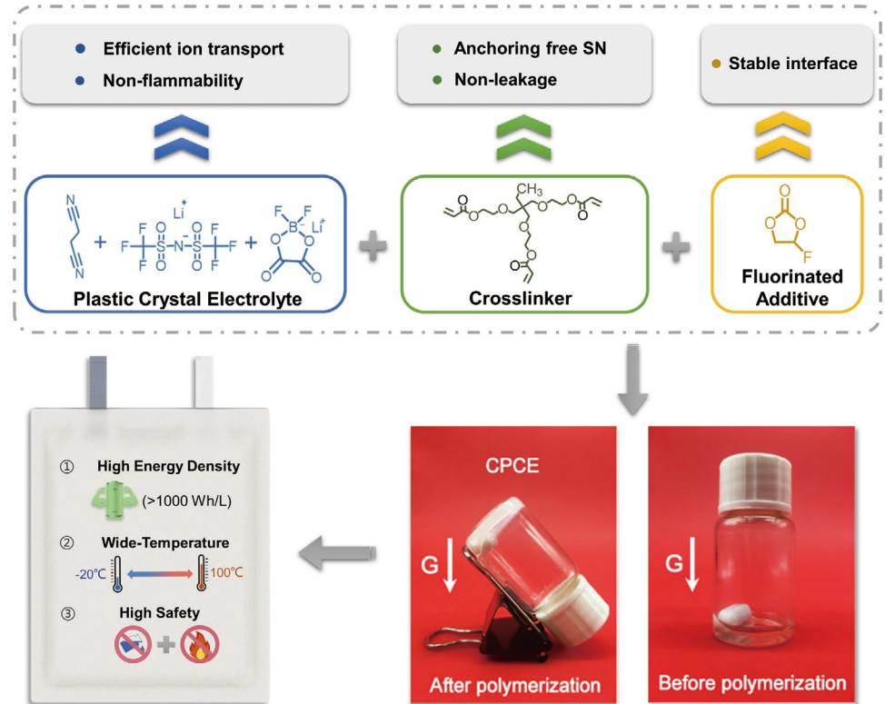
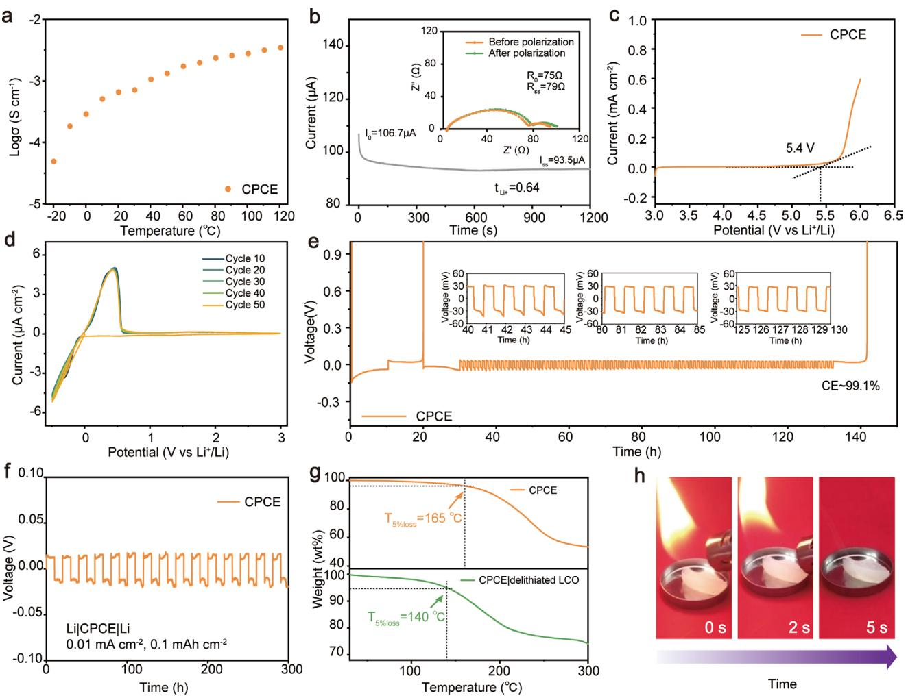
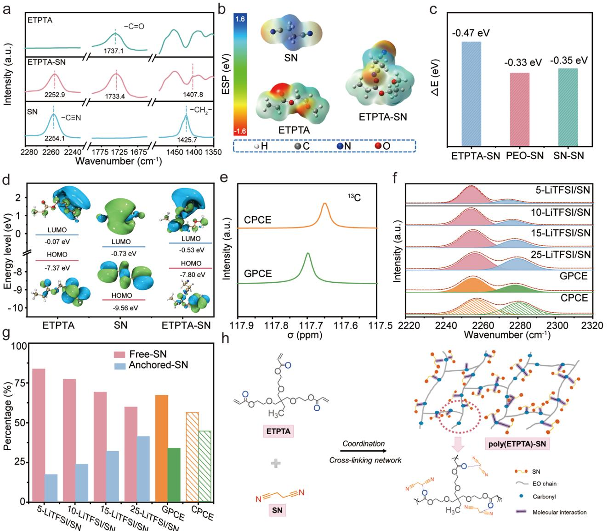
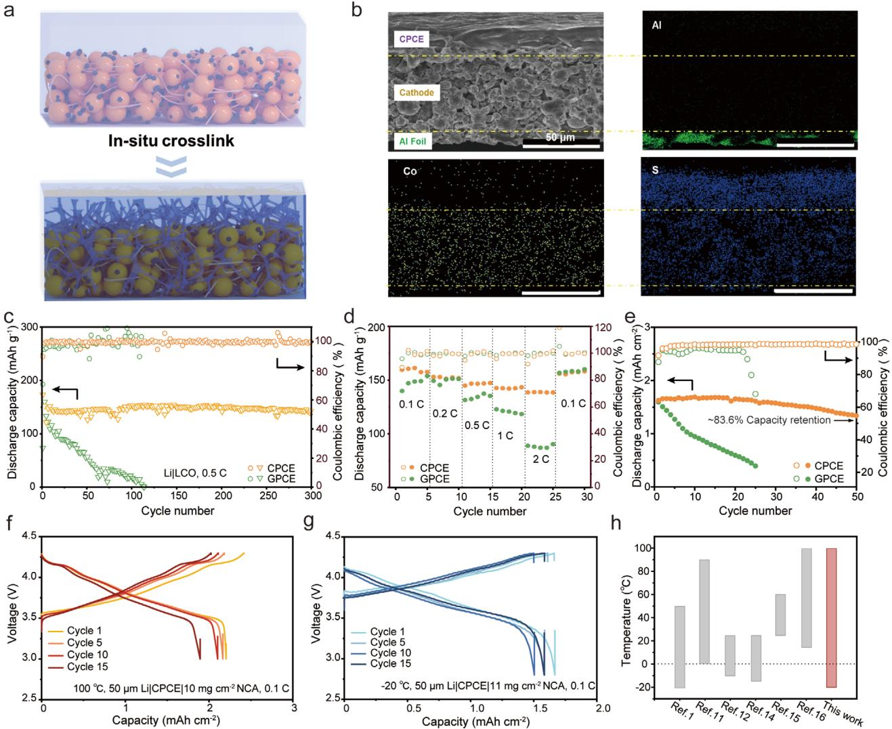
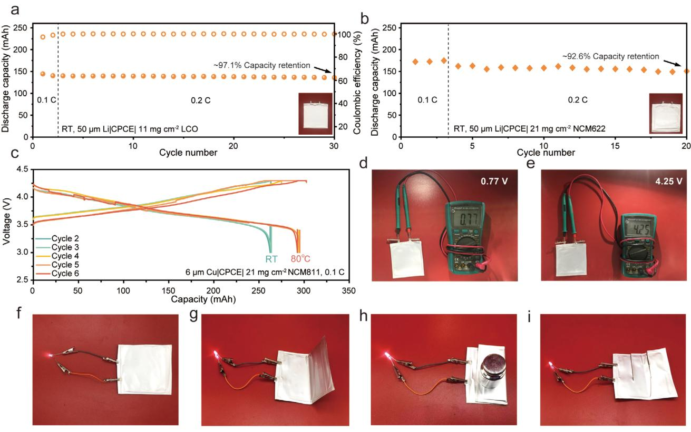

# **In Situ Cross-Linked Plastic Crystal Electrolytes for Wide-Temperature and High-Energy-Density Lithium Metal Batteries**

*Aoxuan Wang, Shouxian Geng, Zhengfei Zhao, Zhenglin Hu,\* and Jiayan Luo\**

**The development of high-energy-density lithium metal batteries has been significantly hampered mainly due to the poor electrolyte–electrode compatibility, narrow operating temperature range, and stringent safety concerns of conventional electrolytes. Here, an in situ cross-linked plastic crystal-based electrolyte (CPCE) with an optimized composition design is proposed. Based on the interaction of succinonitrile (SN) and ethoxylated trimethylolpropane triacrylate (ETPTA) with polar carbonyl groups, CPCE delivers well-tuned energy levels and a concentrated coordination structure, leading to an improved electrochemical window and stable electrode– electrolyte interface. In addition, the crystallization of SN molecules is also inhibited, ensuring suitable ion migration in bulky CPCE over a wide temperature range. Moreover, both the nonleakage of cross-linked ETPTA and the nonflammability of the plastic crystal electrolyte (PCE) further reinforce the safety of CPCE. As a result, the well-designed CPCE achieves high ion conductivity with a wide electrochemical window (≈5.4 V vs Li+/Li) and a broad operating temperature range (−20 to 100 °C). It also delivers dendrite-free lithium plating with high Coulombic efficiency of up to ≈99.1%. The Cu**|**CPCE**|**LiNi0.8Co0.1Mn0.1O2 anode-free pouch cell exhibits high energy density (≈1520 Wh L-1 ) and high safety during abuse tests. This study paves a new pathway to realize the practical application of high-energy-density lithium metal battery energy storage systems.**

# **1. Introduction**

Rechargeable lithium-ion batteries have been widely used from digital devices to electric vehicles in modern society.[1] However, due to the limited energy density of electrode materials based on

A. Wang, S. Geng, Z. Zhao, Z. Hu, J. Luo Key Laboratory for Green Chemical Technology of Ministry of Education State Key Laboratory of Chemical Engineering School of Chemical Engineering and Technology Tianjin University Tianjin 300072, China E-mail: huzl@tju.edu.cn; jluo@tju.edu.cn J. Luo Shanghai Key Lab of Advanced High-Temperature Materials and Precision Forming School of Materials Science and Engineering Shanghai Jiao Tong University Shanghai 200240, China

The ORCID identification number(s) for the author(s) of this article can be found under https://doi.org/10.1002/adfm.202201861.

#### **DOI: 10.1002/adfm.202201861**

the insertion mechanism, traditional lithium-ion batteries cannot meet the growing energy demand in emerging fields.[2] Lithium metal anodes are considered the Holy Grail among the candidate anode materials because of their ultrahigh specific capacity (3860 mAh g–1) and ultralow redox potential (-3.04 V vs Li+/Li).[3] Nonetheless, troublesome obstacles metal lithium usually faces still hinder the practical application of rechargeable lithium metal batteries, mainly caused by the employment of unsatisfactory electrolytes.[4]

Currently, neither commercial carbonate nor ether electrolytes are suitable for lithium metal batteries. Specifically, inhomogeneous lithium-ion deposition from carbonate electrolytes results in uncontrolled dendritic growth, which significantly reduces the battery's cycling life or even leads to short circuits.[5] Moreover, the limited electrochemical window of ether electrolytes (<4 V) precludes the development of high-energy-density lithium metal batteries.[6] Additionally, both of them are prone to leakage and flammability, which increases the safety

hazards of lithium metal batteries and even electronic devices in practical applications.[7]

To advance the practical usage of rechargeable lithium metal batteries, significant efforts have been undertaken to develop eligible electrolyte systems. The ideal electrolyte for practical lithium metal batteries needs to possess the following merits: First, high safety without risks of leakage and combustion; second, advanced temperature tolerance with favorable ion conductivity and thermodynamic stability to the electrode over a wide temperature range; third, ability to achieve a high-energydensity system with a wide electrochemical window and robust interfacial contact with high-loading cathodes.[8] However, among various candidates, the most explored solid polymer electrolytes (SPEs) constantly suffer from poor oxidative or reductive stability and unacceptable dynamics.[9] Meanwhile, the application of inorganic ceramic electrolytes is hindered by their brittleness, complicated procedures, and poor electrode-electrolyte interface contact.[10] It is noteworthy that due to its appropriate ionic conductivity and broad electrochemical window, the solid-state plastic crystal electrolyte (PCE) based on succinonitrile (SN) is considered another potential system.[11]

SN is a typical molecular plastic crystal that can dissolve various lithium salts and facilitate rapid ion transport due to the high polarity of nitrile groups.[12] Additionally, PCE benefits from the properties of nonflammability and nonvolatility, which makes it an attractive matrix in solid electrolytes.[11d,13]

Regrettably, the poor reductive stability of SN molecules usually causes irreversible interface corrosion of active lithium metal with severely reduced cycling life, which will become particularly intense at high temperatures (such as 100 °C).[14] Moreover, SN molecules tend to exhibit increased crystallinity and viscosity at low temperatures, which seriously weakens the ionic conductivity of the whole system (Figure S1, Supporting Information). Moreover, solvent-free PCE usually delivers undesirable wettability to electrode materials (especially for highloading cathodes), dramatically increasing the electrochemical impedance. Therefore, to date, PCE has merely been used as the cathode/electrolyte interface layer or the electrolyte for lithium-ion batteries, which fail to gain wide practical application in rechargeable lithium metal systems.[15]

In light of this, to expand the PCE into a high-performance electrolyte for lithium metal batteries, we present in this work an in situ crosslinked plastic crystal-based electrolyte (CPCE, **Figure 1**) that can simultaneously feature the abovementioned merits, leading to a promising high-energy-density battery system with superior safety and temperature tolerance behavior. PCE formed by a dual lithium salt (lithium bis(trifluoromethanesulfonyl)imide, LiTFSI, and lithium difluoro(oxalato)borate, LiDFOB) and SN can serve as an efficient ion transport medium in CPCE and provide it with excellent positive electrode stability and nonflammable properties. Ethoxylated trimethylolpropane triacrylate (ETPTA), a robust polymer monomer with high polar groups on the chain segments, is compounded with PCE via an in situ crosslinking polymerization reaction (Figure S2, Supporting Information). Each ETPTA monomer contains three carboxyl groups and can effectively interact with SN, leading to a high percentage of anchored SN. This anchoring design enabled by polar polymer molecules dramatically improves the stability of SN to lithium metal, especially under high-temperature conditions. The comparative study reveals that the polymer without high polarity functional groups (e.g., polyethylene oxide, PEO, Figure S3, Supporting Information) could only act as a cosolvent, increasing the content of free SN and thus exacerbating the side reactions of the lithium metal anode. Meanwhile, due to the reduced crystallinity of SN with electrostatic adsorption from ETPTA, which is much stronger than intermolecular adsorption of SN, CPCE can still show impressive electrochemical performance at low temperatures. In addition to eliminating the risk of electrolyte leakage, in situ crosslinking of the ETPTA-containing precursor exhibits robust interfacial contact, especially with high-loading cathodes. To further reinforce the electrode-electrolyte interface, a certain amount of fluorinated additive (fluoroethylene carbonate, FEC) is also added. In addition to fast lithium-ion transport kinetics with high conductivity (1.08 mS cm–1 at 40 °C) and lithium-ion transference number of 0.64, the as-developed CPCE exhibits excellent lithium plating/stripping reversibility on a lithium anode with a high Coulombic efficiency of ≈99.1%, which is

**Figure 1.** Schematic diagram of the design strategy and the characteristics of CPCE-based lithium metal cells.

mainly ensured by the SN-anchoring effect of ETPTA. Meanwhile, the interaction between ETPTA and SN molecules also leads to the high voltage stability of CPCE with a wide electrochemical window (5.4 V vs Li/Li+), which makes it suitable for high-energy-density batteries. It turns out that CPCE-based lithium metal symmetric cells and high-voltage full cells with a high-loading cathode can achieve stable cycling from -20 to 100 °C. The merits of CPCE enable negligible capacity degradation in the thin Li (50 µm)|CPCE|LiCoO2 (LCO, 11 mg cm–2 each side) pouch cell (0.15 Ah) for 30 cycles and anode-free Cu|CPCE|LiNi0.8Mn0.1Co0.1O2 (NMC811, 21 mg cm–2 each side) pouch cell (0.3 Ah) at the practical application level with an ultrahigh volumetric energy density of ≈1520 Wh L–1, both of which are among the state-of-the-art performances.[16]

# **2. Results and Discussion**

#### **2.1. Electrochemical and Thermal Stability Analysis of CPCE**

In this work, the SN-LiTFSI-LiDFOB-based dual lithium salt PCE was selected due to the high dissociation ability of LiTFSI and the excellent film-forming property of LiDFOB. The LiDFOB with low solubility was fixed at a saturation content relative to SN (LiDFOB: SN = 1/15 wt), and then dual-salt PCE possessing different mole ratios of LiTFSI: SN (5:95, 10:90, 15:85, 20:80, 25:75) can be obtained. Then, equal amounts of ETPTA and FEC (1/5 wt relative to SN, respectively) were added. After that, in situ polymerization was initiated by azobisisobutyronitrile (AIBN) during the heating process for hours. These as-prepared samples were denoted 5PCE, 10PCE, 15PCE, 20PCE, and 25PCE. As shown in Figure S4 (Supporting Information), the disappearance of the CC peak (1635 cm–1 and 1619 cm–1) belonging to unpolymerized ETPTA after the heating process indicates complete polymerization of the ETPTA monomer.[17] Temperature-dependent ion conductivity for the samples mentioned above was also measured, indicating that the 15PCE sample exhibits the highest lithium-ion conductivity (1.08 mS·cm–1 at 40 °C) over a wide temperature range, which has been selected for subsequent tests and abbreviated CPCE (Figure S5a, Supporting Information, and **Figure 2**a). The temperature-dependent ionic conductivity of CPCE follows Arrhenius behavior, indicative of a low activation energy (Ea) of 0.21 eV for lithium-ion transport (Figure S5b, Supporting Information). This low Ea approached the level of the typical liquid commercial electrolyte 1 M LiPF6-EC/DEC (LCE, 0.23 eV), which is much better than that of the SPE reported before (PEO, 0.65 eV), demonstrating the fast lithium-ion transport kinetics of CPCE.[18]

In addition to the thermodynamic factors discussed above, another critical merit for electrolytes is the lithium-ion transference number (*tLi*+).[19] Benefitting from the higher *tLi*+ (0.64, Figure 2b) than LCE (0.29, Figure S6, Supporting Information), CPCE is able to achieve higher power densities and swifter charging processes. Such a high *tLi*+ value of CPCE is primarily due to the effectively inhibited migration of anions in the polymer matrix, resulting in improved concentration polarization and rate performance for lithium metal batteries. To determine the oxidative stability of CPCE, a linear sweep voltammetry (LSV) test was applied at room temperature. As shown in Figure 2c, CPCE exhibits excellent oxidation stability (up to 5.4 V vs Li/Li+), which is favorable for matching highvoltage cathodes and achieving high-energy-density lithium metal batteries.

In addition, cyclic voltammetry (CV) tests were conducted to test the reductive stability of CPCE at the lithium metal anode interface. To analyze the effect of ETPTA, an equal mass fraction of PEO without polar groups was employed to replace ETPTA to prepare the comparative sample (gelatinized plastic crystal electrolyte, abbreviated GPCE). CV tests of Li|SS cells reveal that the peak current density for GPCE declined rapidly during the 50 cycles (Figure S7, Supporting Information), which is mainly due to the side-reactions of SN molecules with plated active lithium, leading to increased interface impedance. In stark contrast, the peak current density in CPCE exhibits only negligible change, proving its enhanced thermodynamic stability with lithium metal (Figure 2d). Benefitting from higher lithium plating/stripping reversibility with suppressed side reactions, the Li|CPCE|Cu cell exhibits a smooth voltage curve and lower nucleation overpotential with an average Coulombic efficiency of up to ≈99.1% (Figure 2e), which is higher than that of the Li|GPCE|Cu cell (Figures S8). Furthermore, it is worth noting that even at 100 °C, the Coulombic efficiency of the Li|CPCE|Cu cell can still be maintained at ≈97.1% (Figures S9). Moreover, the lithium metal deposited on copper in the Li|CPCE|Cu cell delivers a smooth and compact morphology (Figures S10), which provides a solid foundation for the improved performance of CPCEbased lithium metal batteries. Notably, the low current density during long-period cycling will enlarge the potential interfacial side reactions of Li|Li symmetric cells. Therefore, it is an effective method to test the thermodynamic stability of electrolytes to lithium metal anodes. Unsurprisingly, the Li|GPCE|Li symmetric cell shows apparent voltage fluctuations and fails to work prematurely only after 7 cycles during the galvanostatic charge–discharge (GCD, Figure S11, Supporting Information) test at room temperature. In contrast, the Li|CPCE|Li symmetric cell delivers favorable interface stability with a smooth voltage profile and an operating time of more than 300 h (Figure 2f).

In addition to basic electrochemical properties, the thermal stability of CPCE is also critical for the practical application of lithium metal batteries. Thermogravimetric (TG) curves and flame tests (Figure 2g,h) demonstrate that CPCE loses just 5% of its pristine weight at 168 °C and cannot be ignited even in contact with the flame for several seconds, showing low vapor pressure and nonflammability properties. Furthermore, even after heating CPCE with a delithiated LiCoO2 cathode (charged to 4.3 V) to 140 °C, there is still no obvious weight loss, demonstrating its enhanced safety performance under the condition of practical application. In contrast, severe mass loss can easily be detected in 1,3-dioxolane (DOL)-based solid-state electrolytes, usually accompanied by formaldehyde gas and other epoxides with low boiling points.[20] Similarly, flammable LCE also evaporates rapidly even at ambient temperature due to the low boiling points of carbonate solvents and is easily ignited, leading to potential application risks (Figures S12 and S13, Supporting Information).

**Figure 2.** a) Temperature-dependent ionic conductivity of CPCE. b) Current–time curves following DC polarization of 10 mV for the Li|CPCE|Li cell. The inset corresponds to AC impedance spectra before and after DC polarization. c) LSV of the Li|CPCE|SS cell (10 mV s–1). d) CV of lithium plating/ stripping with the Li|CPCE|SS cell (10 mV s–1). e) Average Coulombic efficiency of the Li|CPCE|Cu cell (0.5 mA cm–2). f) Long-term GCD test of the Li|CPCE|Li symmetric cell (0.01 mA cm–2, 0.1 mAh cm–2). g) The TG curves of the CPCE (top) and delithiated LiCoO2 cathode with CPCE (bottom). h) Optical images of CPCE under the flame test.

#### **2.2. Verification and Exploration of the SN Anchoring Effect**

To prove the interaction between ETPTA and SN molecules, as well as their roles in the coordination structure of the system, related samples, including pure SN, ETPTA, and ETPTA-SN, were systematically analyzed. To gain insights into the peak shifting of functional groups, Fourier transform infrared (FTIR) spectroscopy was applied in **Figure 3**a, in which the CN peak of SN at 2254.1 cm–1 decreases to 2252.9 cm–1 and the peak location of CH2− in SN delivers an apparent redshift from 1427.3 cm–1 to 1407.8 cm–1 after the introduction of ETPTA. Simultaneously, the CO bond of ETPTA exhibits a similar redshift from 1737.1 cm–1 to 1733.4 cm–1 for the ETPTA-SN sample, indicating a strong interaction between ETPTA and SN molecules.[17b,21] Generally, such a strengthened interaction can increase the bond length of the functional group, leading to a decrease in wavenumbers and vice versa.[22] Therefore, an anchoring effect is logically proposed between SN molecules and the carbonyl group segments of ETPTA, which can dramatically improve the electrochemical performance of CPCE.

In addition to experimental characterization, theoretical calculations were further introduced to investigate the internal interactions of CPCE. Local characteristic segments of PEO and ETPTA molecules were intercepted to simplify the structure and composition of the system. The electrostatic potential (ESP) was first calculated to show the electronegative and electropositive atoms of ETPTA, PEO, and SN, which primarily contribute to the molecular coordination (Figure 3b and S14). Obviously, PEO shows weaker electronegativity than ETPTA, which means that the coordination between ETPTA and SN molecules is stronger than that of PEO. To quantitatively compare the coordination of different systems, density functional theory (DFT) was also applied to calculate the binding energy of geometric configuration optimized systems. As shown in Figure 3c, the binding energy between ETPTA and SN is -0.47 eV. Compared with the values of PEO-SN (-0.33 eV) and SN-SN (-0.35 eV), SN in CPCE electrolytes tends to deliver more potent interactions with the highly electronegative groups in ETPTA than dipole–dipole interactions with itself. In comparison, SN in GPCE electrolytes

**Figure 3.** a) FTIR spectra of SN, ETPTA, and ETPTA-SN samples. b) The optimized geometric configurations and electrostatic potential of SN, ETPTA, and ETPTA-SN. c) The binding energy of ETPTA-SN, PEO-SN, and SN-SN. d) LUMO/HOMO levels of ETPTA, SN, and ETPTA-SN. e) 13C-NMR spectra of GPCE and CPCE. f) FTIR spectra of cyanide peaks in CPCE, GPCE, and LiTFSI/SN samples with different LiTFSI concentrations (more details are depicted in the Experimental Section). g) SN species (Free-SN and Anchored-SN) distributions in CPCE, GPCE, and LiTFSI/SN samples with different LiTFSI concentrations obtained from the fitted FTIR spectra. h) Schematic of the interaction between ETPTA and SN molecules.

prefers to coordinate with itself rather than the weaker electronegative chain segments of PEO. The discrepancy in molecular interactions proves the anchoring effect of SN in CPCE, which can effectively inhibit the side reaction between SN and lithium metal. Surprisingly, the differential scanning calorimetry (DSC) test further confirms that the crystallization of SN molecules at low temperatures in CPCE is restrained by the anchoring effect as well, which is advantageous to the low-temperature performance (Figure S15, Supporting Information).

To detect the effect of the intermolecular interaction on the redox stability of CPCE, the energy level structure of the components has been studied, according to which the lowest unoccupied molecular orbital (LUMO) and highest occupied molecular orbital (HOMO) levels are connected to the reduction and oxidization potentials, respectively.[23] As shown in Figure 3d, the uncoordinated free-SN molecule has the lowest LUMO energy level (-0.73 eV), indicating its strong reactivity to the lithium metal anode. In contrast, the LUMO level of coordinated SN increases to -0.53 eV, indicating that the reductive stability of the system has been dramatically improved. Similarly, the lowest HOMO energy of ETPTA (-7.37 eV) corresponds to the worst oxidation stability during high-voltage cycling, while the HOMO energy level of the coordinated ETPTA is reduced to -7.8 eV, effectively enhancing the oxidation resistance of ETPTA and extending the electrochemical window of CPCE.

To further investigate the coordination structure of CPCE, nuclear magnetic resonance (NMR) and FTIR spectroscopy measurements were performed. As shown in the 13C NMR spectra (Figure 3e), the peak of cyanogenic carbon belonging to SN in CPCE exhibits more significant displacement upfield than in GPCE, indicating the increased proportion of anchoring-SN in CPCE with the aid of ETPTA. This result was also verified by FTIR spectroscopy and the corresponding statistics bar chart (Figure 3f, g), where the signals at 2258 cm–1 and 2281 cm–1 represent free-SN and anchored-SN, respectively. The percentage of the integral area of the two peaks shows that the anchoring effect of SN molecules strengthens with increasing LiTFSI. Notably, the proportion of anchored-SN in CPCE is similar to that of the 25-LiTFSI/SN sample with a high LiTFSI concentration, far exceeding that in GPCE. Rather than diluting the electrolyte system such as the conventional polymer PEO, the addition of ETPTA with polar groups shows a significant anchoring effect to SN molecules, which reduces the proportion of free SN and achieves a concentrated coordination structure. It is noted that the higher content of anchored SN in CPCE than in GPCE can effectively enhance the reductive stability of SN molecules and the oxidative stability of ETPTA. In summary, the interactions between ETPTA and SN can be illustrated in Figure 3h, in which the hydrogen atoms of CH2 in SN molecules are strongly attracted to the electronegative oxygen atoms of CO in the highly branched poly(ETPTA), leading to a coordinated supramolecular structure rather than simply mixing. This network with a coordination structure can effectively inhibit the movement of SN and homogenize its electrostatic potential, thus preventing SN from directly contacting and reacting with lithium metal. Furthermore, ion transport at low temperatures and interfacial stability at high temperatures are both guaranteed by this anchoring effect, which promotes the performance of CPCE-based lithium metal batteries over a wide temperature range. Therefore, an effective strategy is proposed to design high-performance plastic crastalbased electrolytes by enhancing molecular interactions through the targeted introduction of ETPTA molecules with highly polar groups, which is helpful to promote the application of highenergy-density lithium metal batteries.

#### **2.3. Application of CPCE in Lithium Metal Batteries**

The electrochemical performance of CPCE was initially evaluated by Li|CPCE|Li symmetric cells. Enhanced lithium plating/ stripping reversibility was maintained even at a high current density of 1 mA cm–2 and an extremely harsh condition of 100 °C (Figure S16, Supporting Information). In addition, statistical results from recent reports on in situ polymerized electrolytes show that symmetric cells using CPCE achieve the highest levels of cycle life (>4800 h) and critical current density (4 mA cm–2, Figures S17 and S18 and Table S1, Supporting Information). Smooth and dendrite-free deposition morphology is also observed from both microscopic and macroscopic characterization (Figures S19 and S20, Supporting Information). In situ polymerization strategies possess the merit of excellent interfacial compatibility.[24] As depicted in **Figure 4**a, the CPCE precursor injected into the cell can fully infiltrate the cathode

material during the cell assembly process. From scanning electron microscopy (SEM) and corresponding energy-dispersive spectroscopy (EDS) of the electrolyte-cathode cross-section taken from a full cell with high cathode active material (Figure 4b) loading, the S element of TFSI– uniformly distributes in both the electrolyte and cathode, which indicates that CPCE can penetrate well into the interior of the high loading cathode, thus vastly reducing the interfacial impedance. Therefore, the Li|CPCE|LCO full cell exhibits outstanding cycling stability compared to GPCE (Figures 4c), with a capacity retention of ≈94.2% even after 300 cycles. A favorable rate performance can also be obtained with a specific capacity of 146 mAh g–1 at a rate of 1 C, much higher than that of the Li|GPCE|LCO cell (Figures 4d). To extend the CPCE to anode-free lithiummetal cells, Cu|CPCE|LCO full cells were also assembled with copper foil (6 µm) and a commercial high cathode active material loading LCO cathode (≈11 mg cm–2). As the volume of full cells has been minimized without an additional lithium source, the CPCE electrolyte shows excellent potential to meet the demand for high volumetric energy density devices. However, since the lithium metal plated on copper foil is supplied entirely by the lithiated cathode, the capacity loss caused by side reactions and "dead" lithium will be more pronounced.[25] Due to the stable interface and dendrite-free deposition morphology, the capacity retention of the Cu|CPCE|LCO cell is up to 83.6% after 50 cycles (Figure 4e), which is much higher than that of the Cu|GPCE|LCO cell (27.5% after 25 cycles). To verify the applicability of CPCE in existing lithium-ion batteries, graphite|CPCE|LCO full cells were further assembled with commercial high-loading electrodes (≈11 mg cm–2 LCO, N/P ratio = 1.1), which delivered good cycling stability at 0.1 C with ≈97.3% capacity retention after 70 cycles (Figure S21, Supporting Information). Moreover, when CPCE was applied to a lithium metal full cell matched with a high loading LiNi0.6Co0.2Mn0.2O2 (NCM622) cathode (≈21.6 mg cm–2), ≈88.6% of the initial capacity was maintained after 40 cycles at 0.2 C (Figure S22, Supporting Information).

Notably, because of the high ionic conductivity and temperature tolerance of CPCE, the corresponding full cells have been further evaluated under extremely harsh working conditions. To reveal the ability of CPCE under practical conditions, the long-term cycle under the wide-temperature range of Li|CPCE|LiNi0.8Co0.15Al0.05O2 (NCA) full cells with high cathode active material loading (11 mg cm–2) was further tested (Figure 4f, g). Notably, a discharge capacity of 1.7 mAh cm–2 (corresponding to a specific capacity of 154.5 mAh g–1) can still be maintained at a rate of 0.1 C at -20 °C. Moreover, the discharge specific capacity of the full cell at 0.1 C can reach 2.21 mAh cm–2 (221 mAh g–1) under an operating temperature of 100 °C, mainly due to the reduced impedance with rapid ion transport and outstanding interfacial stability of CPCE even at high temperatures. In sharp contrast, the Li|GPCE|NCA without the SN-anchoring effect exhibits evidently increased polarization at -20 °C, lowering the average discharge voltage and causing the deliverable capacity to fade from 1.2 mAh cm–2 (109.1 mAh g–1) to 0.9 mAh cm–2 (81.8 mAh g–1) after 10 cycles. The increased polarization of Li|GPCE|NCA should be attributed to the uninhibited crystallization tendency of SN in GPCE at low temperatures, which impairs the efficient transport of

**Figure 4.** a) Schematic illustration showing the in situ cross-linking of CPCE in the high-loading cathode. b) Cross-sectional SEM images and EDS maps of the interface between CPCE and the high-loading LCO cathode. c) Long-term cycle performance (room temperature, 3–4.3 V, 0.5 C) and d) rate performance of the Li|CPCE|LCO full cell and the Li|GPCE|LCO full cell (room temperature, 3–4.3 V). e) Long-term cycle performance of Cu|CPCE|LCO and Cu|GPCE|LCO full cells (room temperature, 3–4.3 V, 0.1 C). The charge–discharge curves of Li|CPCE|NCA full cells with high cathode active material loading under f) 100 °C and g) −20 °C at 0.1 C. h) Comparison of the operational temperature range for full cells with in situ polymerized electrolytes.

lithium ions and thus reduces the available specific capacity of NCA. Meanwhile, the Li|GPCE|NCA full cell fails to cycle under the operating temperature of 100 °C, primarily because of the deteriorated interface with a higher percentage of free-SN and fragile electrochemical window (Figure S23, Supporting Information). Compared with recent reports of in situ polymerized electrolytes applied in lithium metal batteries (Figure 4h and Table S1, Supporting Information), CPCE for the first time expands the operating temperature range of lithium metal full cells with high cathode active material loading from -20 to 100 °C, promoting its widespread application in a diversity of practical situations.

To further verify the practicality of CPCE, lithium metal pouch cells using thin lithium foil (50 µm) and a bilateral loading LCO cathode (11 mg cm–2 each side) were assembled and tested at room temperature, exhibiting a high total capacity of 140 mAh after 30 cycles at 0.2 C. There is virtually no capacity loss, and the Coulombic efficiency can be maintained at nearly 100% during charge–discharge cycling (**Figure 5**a). To better evaluate the suitability of CPCE for practical high nickel cathodes, the Li (50 µm)|CPCE|NCM622 (≈21 mg cm–2 each side) pouch cell with a total capacity of 175 mAh was further assembled. As expected, the long-cycling pouch cell exhibits excellent capacity retention (≈92.6% after 20 cycles at 0.2 C, Figure 5b) and high Coulombic efficiency.

An anode-free pouch cell using an industrial bilateral high loading LiNi0.8Co0.1Mn0.1O2 (NCM811) cathode (21 mg cm–2 each side) and ultrathin copper foil (6 µm) was constructed to pursue the limit of the volumetric energy density under practical conditions. The voltage curves prove that the as-assembled Cu|CPCE|NCM811 pouch cell (300 mAh) achieves stable cycling over a wide temperature range (Figure 5c) from room

**Figure 5.** a) Long-term cycle performance of the Li|CPCE|LCO pouch cell (room temperature, 3–4.3 V, 0.2 C). b) Long-term cycle performance of the Li|CPCE|NCM622 pouch cell (room temperature, 3–4.3 V, 0.2 C). c) The charge–discharge curves of the high-energy-density anode-free Cu|CPCE|NCM811 pouch cell at room temperature and 80 °C (3–4.3 V, 0.1 C). d) The initial open-circuit voltage of the Cu|CPCE|NCM811 pouch cell. e) The open-circuit voltage of the fully charged Cu|CPCE|NCM811 pouch cell. An LED powered by a fully charged Cu|CPCE|NCM811 pouch cell f) before and after g) 60° bending, h) folding, and i) cutting tests.

temperature to 80 °C. The corresponding volumetric energy density depending on the discharge capacity can reach up to 1520 Wh L–1 (the internal structure and calculation parameters of the pouch cell are shown in Figure S24 and Table S2, Supporting Information), which is an ideal value for incoming practical lithium metal batteries. The initial open-circuit voltage of the Cu|CPCE|NCM811 pouch cell is 0.77 V (Figure 5d). To further confirm the safety of the Cu|CPCE|NCM811 pouch cell during operation, a series of abuse experiments were conducted. After being fully charged to the upper cutoff voltage (4.3 V, Figure 5e), the Cu|CPCE|NCM811 pouch cell can successfully light up a light-emitting diode (LED) (Figure 5f). Moreover, the fully charged pouch cell is still able to stably power the LED without an internal short circuit or burning during 60° bending, folding, and cutting tests (Figure 5g-i), demonstrating the excellent safety performance of CPCE-based lithium metal batteries.

# **3. Conclusion**

In summary, our work demonstrates an in situ crosslinked plastic crystal-based electrolyte with high safety and widetemperature operational properties for high-energy-density lithium metal batteries due to its efficient ion transport and reinforced interface compatibility. First, the anchoring effect between crosslinked ETPTA and SN molecules is elucidated, which leads to a well-tuned energy level and a concentrated coordination structure, thus broadening the electrochemical window and ensuring the stability of the electrode interface. Second, this intermolecular interaction also inhibits the crystallization of SN, which guarantees the service capability of CPCE over a broad temperature range. Third, both the nonleakage of crosslinked ETPTA and the nonflammability of the plastic crystal electrolyte further reinforce the safety of CPCE. The well-designed CPCE spontaneously features high-voltage stability with a wide electrochemical window (≈5.4 V vs Li+/Li) and fast lithium-ion transport kinetics with high conductivity (1.08 mS cm–1 at 40 °C). In addition, the high reversibility of lithium plating/stripping is also proven by the dendrite-free lithium deposition morphology and the high Coulombic efficiency (≈99.1%) of the Li|Cu cell. These features enable the ultralong cycling life (>4800 h) and wide operational temperature (−20 to 100 °C) of Li|CPCE|Li and high-voltage full cells. Furthermore, the favorable behavior of lithium metal (0.15 Ah) pouch cell and high-energy-density (≈1520 Wh L–1) anode-free pouch cell (0.3 Ah) under realistic testing conditions has also been achieved in this work. It is expected that the CPCE design will provide deep insight to realize the practical application of high safety and high-energy-density lithium metal batteries.

### **4. Experimental Section**

*Preparation of Different Plastic Crystal-based Electrolytes*: Lithium difluoro(oxalato)borate (LiDFOB, 98%, Heowns) was continuously added to succinonitrile (SN, 99%, Alladin) until saturation at 60 °C, at which point the mass ratio of LiDFOB to SN was 1/15. Then, lithium bis(trifluoromethanesulfonyl)imide (LiTFSI, AR, DuoDuo Chem) was added with different molar ratios of LiTFSI:SN (5:95, 10:90, 15:85, 20:80, 25:75). Then, fluoroethylene carbonate (FEC, 99.95%, DuoDuo Chem) and ethoxylated trimethylolpropane triacrylate (ETPTA, average Mw ≈ 693, Alladin) were added to the above system based on the 20% mass of SN. After that, 0.5 wt.% 2,2′-azobis(2-methylpropionitrile) (AIBN, 99.5%, Alladin) as an initiator was added to the precursor. After mixing well at room temperature, the obtained homogeneous precursor was heated at 60 °C for 2 h and 80 °C for 6 h for complete polymerization. The samples were denoted 5PCE, 10PCE, 15PCE, 20PCE, and 25PCE. Subsequently, the 15PCE sample with the highest lithium-ion conductivity was abbreviated CPCE. The comparative sample GPCE was prepared by replacing ETPTA with an equal mass of PEO (average Mw ≈ 100 000, Alladin) in CPCE, and then a homogeneous gel was obtained by thorough mixing at 60 °C. All of the above procedures were conducted in an argon-filled glove box with moisture/oxygen concentrations below 0.01 ppm.

*Preparation of LiTFSI/SN Samples for FTIR Characterization*: The samples for FTIR characterization were prepared by mixing LiTFSI and SN in molar ratios of 5:95, 10:90, 15:85, 20:80, and 25:75 and then stirred at 60 °C until fully dissolved. The samples were named 5-LiTFSI/SN, 10-LiTFSI/SN, 15-LiTFSI/SN, and 25-LiTFSI/SN according to the molar fraction of LiTFSI in the corresponding samples. All of the above sample preparation procedures were conducted in an argon-filled glove box with moisture/oxygen concentrations below 0.01 ppm.

*Preparation of NCA Cathode and LCO Cathode*: The active material, Super P, and poly(vinyl difluoride) (PVDF) binder with a weight ratio of 8:1:1 were mixed in N-1-methyl-2-pyrrolidone (NMP). The obtained homogeneous slurry was coated on Al foil (10 µm) followed by vacuum drying at 80 °C for 24 h. The cathodes were punched into 1.13 cm2 disks. The active material loadings of the as-prepared NCA cathode and LCO cathode were 10–11 mg cm–2 and 2.5 mg cm–2, respectively.

*Fabrication of Coin Cells and the Anode-free Pouch Cell*: (1) All coin cells used for electrochemical tests were obtained by injecting the corresponding electrolyte precursor into the cells during the assembly stage and then heating at 60 °C for 2 h and 80 °C for 6 h for complete polymerization. (2) A bicell-type pouch cell with a capacity of 0.3 Ah was fabricated. The dimensions of the copper foil, high compaction density NCM811 cathode, and PP separator (Celgard 3501) were 62 mm × 65 mm, 57 mm × 62 mm, and 67 mm × 68 mm, respectively. All the electrodes and electrolyte sheets were stacked and packed into an aluminum-plastic film. After injecting CPCE precursor into the aluminum-plastic film, it was sealed and transferred into a pressurized test set. Then, the cell was heated at 60 °C for 2 h and 80 °C for 6 h to gain an anode-free pouch cell with CPCE.

*Characterization*: The morphology of the samples was characterized by field emission scanning electron microscopy (FE-SEM, Hitachi S4800). In situ optical microscopy studies were performed in a homemade electrochemical cell with a transparent window, where CPCE precursor thermally in situ polymerized and then used for observing the process of Li deposition by optical microscopy (RX50 M). The thermal polymerization reaction of ETPTA and species of SN was measured by Fourier transform infrared spectroscopy (FT-IR, Nicolet iS10). 13C-NMR spectra were recorded on a 600 MHz Solid–liquid NMR Spectrometer (JEOL JNM ECZ600R) at room temperature. The thermal characteristics of different electrolytes were evaluated by thermogravimetric analysis (TGA, NETZSCH STA 449 F3/F5) and differential scanning calorimetry (DSSC, TA Q200) under the protection of argon.

*Electrochemical Measurements*: Electrochemical measurements were conducted by using CR2032 coin cells or pouch cells. Electrochemical impedance spectroscopy (EIS), linear sweep voltammetry (LSV), cyclic voltammetry (CV), and lithium-ion transference number (*tLi* +) were

conducted on an electrochemical station (Solartron Metrology, Britain). The ionic conductivity of the different electrolytes was evaluated from −20 °C to 100 °C via EIS in stainless steel|tainless steel (SS) cells from 106 Hz to 0.1 Hz. The electrochemical stability of the different electrolytes was studied via the LSV method in Li|SS cells, and the voltage was increased from 3.0 to 6.0 V versus Li/Li+ at a scanning rate of 1 mV s–1. The CV measurements of full cells were carried out in Li|SS cells and cycled 50 times between -0.5 and 2.5 V vs Li/Li+ at a scanning rate of 10 mV s–1. The *tLi* + of CPCE was measured by DC polarization and AC impedance based on the following Equation (1).

$$
t_{Li^{+}} = \frac{I_{ss}(\Delta V - I_0 R_0)}{I_0(\Delta V - I_{ss} R_{ss})}
$$
\n(1)

Δ*V* is the polarization voltage of 10 mV. The initial current *I*0, steady current *Iss*, initial interfacial resistance *R*0, and steady interfacial resistance *Rss* were measured by DC polarization and AC impedance.

Galvanostatic charge–discharge (GCD) and Coulombic efficiency measurements were carried out in a battery test system (LAND-CT2001A, China). The coulombic efficiency of lithium plating and stripping cycles was studied via the method of Zhang et al. [\(https://doi.org/10.1002/](https://doi.org/10.1002/aenm.201702097) [aenm.201702097\)](https://doi.org/10.1002/aenm.201702097). A given amount of charge (*QT* = 5 mAh) was used to deposit lithium onto the Cu current collector as a lithium source, and then a certain number (*n* = 99) of cycles at a smaller charge (*Qc*) was conducted between the lithium electrode and the lithium source. After 99 cycles, the remaining lithium source was completely stripped to the cutoff voltage (1 V). The quantity of lithium source remaining was determined by measuring the final stripping charge (*Qs*). The average CE over *n* cycles can be calculated according to Equation (2):

$$
CE_{avg} = \frac{nQ_c + Q_s}{nQ_c + Q_T}
$$
 (2)

The volumetric energy density of the anode-free lithium metal battery was calculated according to Equation (3):

$$
E_{v} = U_{ave} \, \text{lt}/V_{cell} \tag{3}
$$

where *Uave* is the average potential of the discharge curves, *I* is the current density, *t* is the time of discharge, and *Vcell* is the volume of the cell, including the cathode, Al current collector, Cu foil, electrolyte, and package of aluminum plastic film (if necessary).

*Computational Simulation*: All density functional theory (DFT) calculations were carried out by using the Gaussian 09 W program. Geometric configurations were optimized at the B3LYP-D3 level with a 6–31+G (d,p) basis set under gas-phase conditions. The ESP surfaces were drawn with an isovalue of 0.001. The binding energy (*Eb*) was calculated by the following Equation (4):

$$
E_b = E_{P+S} - E_P - E_S \tag{4}
$$

*EP*+*S* is the total energy of ETPTA, PEO, and SN with coordinated SN, *EP* is the total energy of ETPTA, PEO, and SN, and *ES* is the total energy of SN.

### **Supporting Information**

Supporting Information is available from the Wiley Online Library or from the author.

#### **Acknowledgements**

A.W. and S.G. contributed equally to this work. This work was supported by National Key Research and Development Program of China (No. 2021YFB2500100) and National Natural Science Foundation of China [Grant No. 51872196].

# **Conflict of Interest**

The authors declare no conflict of interest.

# **Data Availability Statement**

The data that support the findings of this study are available from the corresponding author upon reasonable request.

# **Keywords**

anchoring effect, high-energy-density, lithium metal, plastic crystal electrolytes, succinonitrile

> Received: February 16, 2022 Revised: March 16, 2022 Published online: April 13, 2022

- [1] J. B. Goodenough, K. S. Park, *J. Am. Chem. Soc.* **2013**, *135*, 1167.
- [2] M. Armand, J. Tarascon, *Nature* **2001**, *414*, 359.
- [3] a) B. Xu, Z. Liu, J. Li, X. Huang, B. Qie, T. Gong, L. Tan, X. Yang, D. Paley, M. Dontigny, K. Zaghib, X. Liao, Q. Cheng, H. Zhai, X. Chen, L. Chen, C. Nan, Y. Lin, Y. Yang, *Nano Energy* **2020**, *67*, 104242; b) D. Lin, Y. Liu, Y. Cui, *Nat. Nanotechnol.* **2017**, *12*, 194.
- [4] Z. Yu, P. E. Rudnicki, Z. Zhang, Z. Huang, H. Celik, S. T. Oyakhire, Y. Chen, X. Kong, S. C. Kim, X. Xiao, H. Wang, Y. Zheng, G. A. Kamat, M. S. Kim, S. F. Bent, J. Qin, Y. Cui, Z. Bao, *Nat Energy* **2022**, 94,<https://doi.org/10.1038/s41560-021-00962-y>.
- [5] D. Lee, S. Sun, J. Kwon, H. Park, M. Jang, E. Park, B. Son, Y. Jung, T. Song, U. Paik, *Adv. Mater.* **2020**, *32*, 1905573.
- [6] a) X. Ren, L. Zou, S. Jiao, D. Mei, M. H. Engelhard, Q. Li, H. Lee, C. Niu, B. D. Adams, C. Wang, J. Liu, J. Zhang, W. Xu, *ACS Energy Lett.* **2019**, *4*, 896; b) Q. Ma, X. Zhang, A. Wang, Y. Xia, X. Liu, J. Luo, *Adv. Funct. Mater.* **2020**, *30*, 2002824.
- [7] a) X. Fan, L. Chen, O. Borodin, X. Ji, J. Chen, S. Hou, T. Deng, J. Zheng, C. Yang, S. Liou, K. Amine, K. Xu, C. Wang, *Nat. Nanotechnol.* **2018**, *13*, 715; b) T. Dong, J. Zhang, G. Xu, J. Chai, H. Du, L. Wang, H. Wen, X. Zang, A. Du, Q. Jia, X. Zhou, G. Cui, *Energy Environ. Sci.* **2018**, *11*, 1197.
- [8] a) X. Lin, G. Zhou, J. Liu, J. Yu, M. B. Effat, J. Wu, F. Ciucci, *Adv. Energy Mater.* **2020**, *10*, 2001235; b) Q. Zhao, S. Stalin, C. Zhao, L. A. Archer, *Nat. Rev. Mater.* **2020**, *5*, 229; c) S. Chen, F. Dai, M. Cai, *ACS Energy Lett.* **2020**, *5*, 3140; d) L. P. Hou, X. Q. Zhang, B. Q. Li, Q. Zhang, *Angew. Chem., Int. Ed.* **2020**, *59*, 15109; e) H. Zhang, J. Zhang, J. Ma, G. Xu, T. Dong, G. Cui, *Electrochem. Energy Rev.* **2019**, *2*, 128.
- [9] a) Z. Li, H. Zhang, X. Sun, Y. Yang, *ACS Energy Lett.* **2020**, *5*, 3244; b) C. Wang, T. Wang, L. Wang, Z. Hu, Z. Cui, J. Li, S. Dong, X. Zhou, G. Cui, *Adv. Sci.* **2019**, *6*, 1901036; c) P. Ding, Z. Lin, X. Guo, L. Wu, Y. Wang, H. Guo, L. Li, H. Yu, *Mater. Today* **2021**, *51*, 449.

- [10] a) A. Li, X. Liao, H. Zhang, L. Shi, P. Wang, Q. Cheng, J. Borovilas, Z. Li, W. Huang, Z. Fu, M. Dontigny, K. Zaghib, K. Myers, X. Chuan, X. Chen, Y. Yang, *Adv. Mater.* **2020**, *32*, 1905517; b) X. Han, Y. Gong, K. Fu, X. He, G. T. Hitz, J. Dai, A. Pearse, B. Liu, H. Wang, G. Rubloff, Y. Mo, V. Thangadurai, E. D. Wachsman, L. Hu, *Nat. Mater.* **2017**, *16*, 572.
- [11] a) A. Abouimrane, P. S. Whitfield, S. Niketic, I. J. Davidson, *J. Power Sources* **2007**, *174*, 883; b) P. J. Alarco, Y. Abu-Lebdeh, A. Abouimrane, M. Armand, *Nat. Mater.* **2004**, *3*, 476; c) J. Wang, Z. Zhao, G. Lu, Y. Zhang, Q. Kong, J. Zhao, G. Cui, *Mater. Today, Energy* **2021**, *20*, 100630; d) T. Jiang, P. He, G. Wang, Y. Shen, C. W. Nan, L. Z. Fan, *Adv. Energy Mater.* **2020**, *10*, 1903376; e) C. Hu, J. Qi, Y. Zhang, S. Xie, B. Liu, G. Xue, D. Chen, Q. Zheng, P. Li, S. H. Bo, Y. Shen, L. Chen, *Nano Lett.* **2021**, 10354, [https://doi.](https://doi.org/10.1021/acs.nanolett.1c03605) [org/10.1021/acs.nanolett.1c03605.](https://doi.org/10.1021/acs.nanolett.1c03605)
- [12] Z. Zhang, L. F. Nazar, *Nat. Rev. Mater.* **2022**, [https://doi.](https://doi.org/10.1038/s41578-021-00401-0) [org/10.1038/s41578-021-00401-0.](https://doi.org/10.1038/s41578-021-00401-0)
- [13] Z. Hu, F. Xian, Z. Guo, C. Lu, X. Du, X. Cheng, S. Zhang, S. Dong, G. Cui, L. Chen, *Chem. Mat.* **2020**, *32*, 3405.
- [14] Y. Liu, Y. Zhao, W. Lu, L. Sun, L. Lin, M. Zheng, X. Sun, H. Xie, *Nano Energy* **2021**, *88*, 106205.
- [15] a) Y. Zhou, F. Zhang, P. He, Y. Zhang, Y. Sun, J. Xu, J. Hu, H. Zhang, X. Wu, *J. Energy Chem.* **2020**, *46*, 87; b) Y. Chen, F. Huo, S. Chen, W. Cai, S. Zhang, *Adv. Funct. Mater.* **2021**, *31*, 2102347; c) Y. Dong, T. Ding, L. Fan, *Ionics* **2017**, *23*, 3339.
- [16] J. Chang, Q. Huang, Y. Gao, Z. Zheng, *Adv. Mater.* **2021**, *33*, 2004419.
- [17] a) C. Fu, Y. Ma, P. Zuo, W. Zhao, W. Tang, G. Yin, J. Wang, Y. Gao, *J. Power Sources* **2021**, *496*, 229861; b) H. Ha, Y. H. Kwon, J. Y. Kim, S. Lee, *Electrochim. Acta* **2011**, *57*, 40.
- [18] a) L. M. Carvalho, P. Guégan, H. Cheradame, A. S. Gomes, *Eur. Polym. J.* **2000**, *36*, 401; b) S. B. Aziz, T. J. Woo, M. F. Z. Kadir, H. M. Ahmed, *J. Sci.* **2018**, *3*, 1.
- [19] K. M. Diederichsen, E. J. McShane, B. D. McCloskey, *ACS Energy Lett.* **2017**, *2*, 2563.
- [20] W. Zhou, W. Li, J. Gao, H. Tian, X. Li, S. He, J. Li, W. Wang, L. Li, H. Li, J. Qiu, *Angew. Chem., Int. Ed.* **2021**, [https://doi.org/10.1002/](https://doi.org/10.1002/anie.202114805) [anie.202114805.](https://doi.org/10.1002/anie.202114805)
- [21] Q. Y. Wu, X. N. Chen, L. S. Wan, Z. K. Xu, *J. Phys. Chem. B* **2012**, *116*, 8321.
- [22] X. He, Y. Ni, Y. Hou, Y. Lu, S. Jin, H. Li, Z. Yan, K. Zhang, J. Chen, *Angew. Chem., Int. Ed.* **2021**, *60*, 22672.
- [23] a) J. Bae, Y. Qian, Y. Li, X. Zhou, J. B. Goodenough, G. Yu, *Energy Environ. Sci.* **2019**, *12*, 3319; b) T. Husch, M. Korth, *Phys. Chem. Chem. Phys.* **2015**, *17*, 22799.
- [24] a) T. Liu, J. Zhang, W. Han, J. Zhang, G. Ding, S. Dong, G. Cui, *J. Electrochem. Soc.* **2020**, *167*, 070527; b) C. Wang, H. Zhang, S. Dong, Z. Hu, R. Hu, Z. Guo, T. Wang, G. Cui, L. Chen, *Chem. Mat.* **2020**, *32*, 9167.
- [25] a) A. J. Louli, A. Eldesoky, R. Weber, M. Genovese, M. Coon, J. deGooyer, Z. Deng, R. T. White, J. Lee, T. Rodgers, R. Petibon, S. Hy, S. J. H. Cheng, J. R. Dahn, *Nat. Energy* **2020**, *5*, 693; b) S. Nanda, A. Gupta, A. Manthiram, *Adv. Energy Mater.* **2020**, *11*, 2000804.