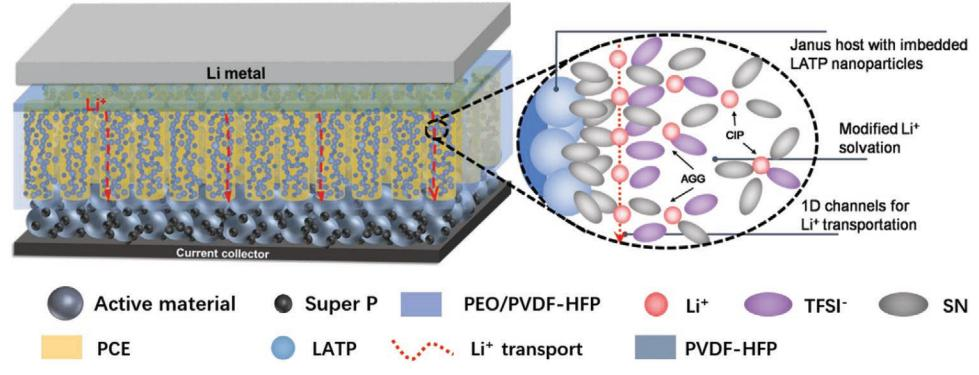
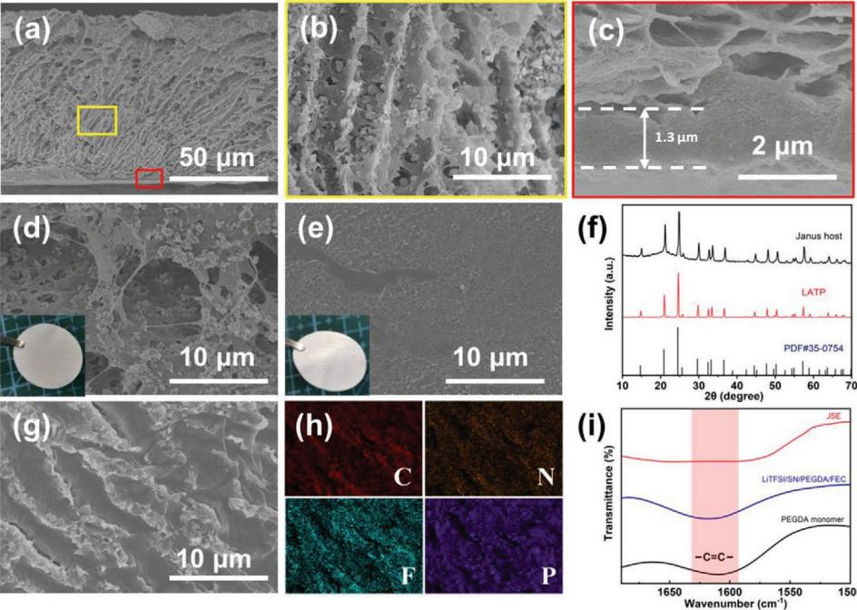
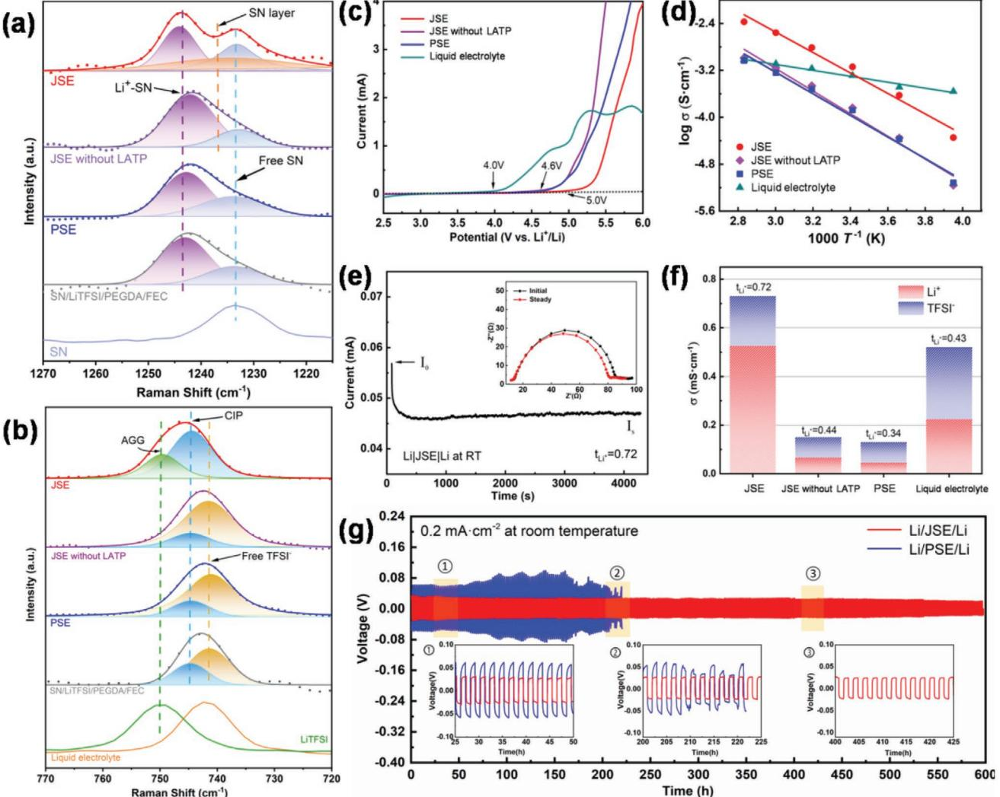
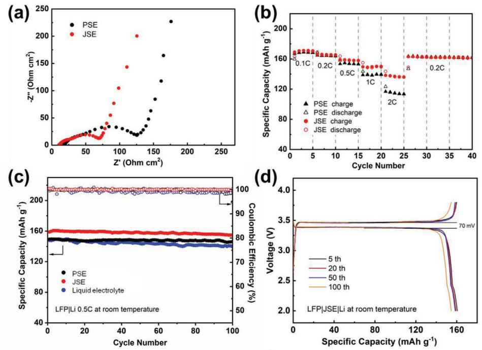
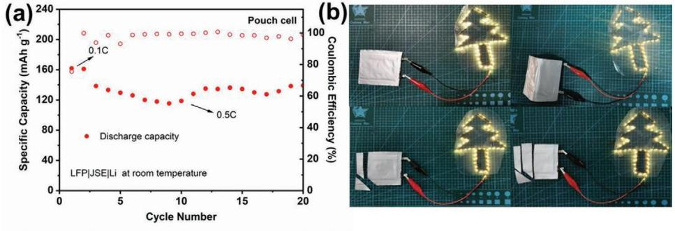

# **Janus Electrolyte with Modified Li+ Solvation for High-Performance Solid-State Lithium Batteries**

*Yuzhen Hu, Linge Li, Haifeng Tu, Xiaohong Yi, Jian Wang, Jingjing Xu,\* Wenbin Gong,\* Hongzhen Lin, Xiaodong Wu, and Meinan Liu\**

**Solid-state lithium-metal batteries attract great attention due to their high energy density and superior safety. However, the sluggish Li+ kinetics of solid electrolyte and poor interface compatibility between electrolyte and lithium anode lead to unsatisfied performance at room temperature, which severely limit their practical application. Herein, a Janus quasi-solid electrolyte (JSE) design is reported, which modifies the Li+ solvation environment in succinonitrile (SN) plastic crystal electrolyte and creates 1D Li+ transportation channels. Density functional theory calculations and Raman results reveal that Li1.3Al0.3Ti1.7(PO4)3 changes the Li+ solvation environment from SN units to aggregated ion pairs, which accelerates the diffusion rate of Li+. As a result, JSE presents excellent ionic conductivity (0.73 mS cm−1 ) and high lithium transference number (0.72). With this efficient JSE, Li symmetric cells deliver excellent cycle stability over 600 h with a low over potential of 60 mV. LiFePO4**|**JSE**|**Li solid-state battery delivers an impressive performance with a specific discharge capacity of 152 mAh g−1 after 100 cycles at room temperature under 0.5 C. Moreover, the corresponding pouch cell also shows outstanding performance (140 mAh g−1 under 0.5 C) and withstands abuse tests such as bending and cutting, demonstrating its superior safety for future utilization.**

## **1. Introduction**

Advanced energy storage technologies, especially lithium-ion batteries (LIBs), have revolutionized communications and transportation style of modern life.[1] The development of lithiumbased rechargeable batteries with exceptional energy density

Y. Hu, L. Li, J. Xu, H. Lin, X. Wu, M. Liu School of Nano-Tech and Nano-Bionics University of Science and Technology of China Hefei, Anhui 230026, China E-mail: jjxu2011@sinano.ac.cn; mnliu2013@sinano.ac.cn Y. Hu, L. Li, H. Tu, M. Liu Key Laboratory of Multifunctional Nanomaterials and Smart Systems Suzhou Institute of Nano-Tech and Nano-Bionics Chinese Academy of Sciences Suzhou, Jiangsu 215123, China X. Yi Ji Hua Laboratory Foshan, Guangdong 528200, China

The ORCID identification number(s) for the author(s) of this article can be found under https://doi.org/10.1002/adfm.202203336.

#### **DOI: 10.1002/adfm.202203336**

vs the standard hydrogen electrode) is regarded as the "Holy Grail" electrode and receives extensive research attention.[3] However, current lithium-metal batteries (LMBs) are far from the practical application because of the severe safety concern from the active reaction between Li and liquid electrolyte.[4] Solid-state electrolyte (SSE) is regarded as a promising candidate as it offers a substantial enhancement on safety by eliminating the flammable organic solvents.[5] Among all SSEs, solid polymer elec-

and safety is urgently demand in current

tive electrochemical potential (−3.040 V

Li metal with the extra high capacity

) and the lowest nega-

life.[2]

(3860 mAh g−1

trolytes (SPEs) are particularly attractive by their merits of facile processibility and conformal interface with electrode.[6] However, the lower ionic conductivity of SPEs at room temperature (10−5–10−3 mS cm−1 ) limits their wide application.[7] Highconcentrated lithium salt strategy, also called "polymer in salt," has been proved to be an efficient way to achieve high ionic

conductivity at room temperature.[8] For example, Liu et al. reported a polymer in salt SPE based on high-concentrated lithium bis(trifluoromethanesulphonyl)imide (LiTFSI) and poly(vinylidene fluoride-*co*-hexafluoropropylene) (PVDF-HFP), which delivers an ionic conductivity of 0.124 mS cm−1 at room temperature.[9] Although the value of ionic conductivity is

| J. Wang                                                              |
|----------------------------------------------------------------------|
| Helmholtz Institute Ulm (HIU)                                        |
| 89081 Ulm, Germany                                                   |
| W. Gong                                                              |
| School of Energy                                                     |
| Xuzhou University of Technology                                      |
| Xuzhou 221018, China                                                 |
| E-mail: gongwenbin@xzit.edu.cn                                       |
| W. Gong, M. Liu                                                      |
| Division of Nanomaterials and Jiangxi Key Lab of Carbonene Materials |
| Jiangxi Institute of Nanotechnology                                  |
| Nanchang 330200, China                                               |
| M. Liu                                                               |
| Gusu Laboratory of Materials                                         |
| Suzhou, Jiangsu 215123, China                                        |
|                                                                      |

enhanced by this high-concentrated salt more than two times, the high cost may impede its commercialization.

A special type of SPE, plastic crystal electrolyte (PCE) recently attracts much attention, especially succinonitrile (SN) based PCE (SN/LiTFSI) due to the unique property of SN-like solvent,[10] and thus leading to a satisfied ionic conductivity at room temperature.[11] One drawback of these PCEs is too soft to process; so many efforts have been endeavored to develop robust matrix.[12] For example, Wen and co-workers designed a ceramic host with channels to embrace SN-based PCE,[13] and Lee et al. developed a plastic-crystal-imbedded elastomer electrolyte.[14] Moreover, another disadvantage of these SN-based PCEs is their instability toward Li metal. It has been reported that fluoroethylene carbonate (FEC) additives can form a robust solid electrolyte interphase (SEI) on Li anode, and thus protect Li in some extent.[15] Developing a unique matrix, which can well block the direct contact between SN on Li, together with FEC additives will efficiently address the above issue. Recently, Janus structure shows great potential as a host due to its unique asymmetric structure and components.[16] Liang et al. designed Janus structure with different polymers to satisfy disparate interface demands from cathode and anode, and thus guarantee the stability of high-voltage Li-metal batteries.[17] As a consequence, combined porous quasi-solid electrolyte (PSE) electrolyte with Janus structure may construct a high-performance solid-state or quasi-solid-state electrolyte.

Herein, we propose a design of quasi-solid electrolyte constructed by PCE imbedded into the Janus host with modified solvation for solid-state Li batteries. As shown in **Figure 1**, the Li1.3Al0.3Ti1.7(PO4)3 (LATP) particles imbedded in PVDF-HFP along 1D channel modify the Li+ solvation environment in SN-based electrolyte to form aggregated ion pairs (AGG) as suggested by calculation and Raman spectra. The as-created unique 1D Li+ transportation tunnels enable high ionic conductivity and high Li+ transference number.[8c] Considering Na-superionic conductor (NASICON) type solid electrolytes are unstable to Li anode,[18] a dense layer with PVDF-HFP/polyethylene oxide (PEO) component in a Janus host will be helpful, which not only well avoids the contacting between LATP particles/SN molecules and Li anode, and thus effectively enhancing the stability of electrolyte, but also reduces the interface impedance of Li/electrolyte. This fast Li+ motion in 1D channels combined with conformal dense layer in Janus quasi-solid electrolyte (JSE) can effectively alleviate the dendrite issues caused by nonuniform surface deposition. As a result, the Li|JSE|Li symmetric cell can operate for 600 h with a low hysteresis of 60 mV. When paired with LiFePO4 (LFP) cathodes, all-solidstate LFP|JSE|Li cell delivers an impressive performance at room temperature. This delicate design of 1D ionic channel for carriers' diffusion through modifying solvation environment would expand to other solid-state battery systems and other metal battery systems as well.

### **2. Results and Discussion**

Plastic crystal SN shows strong affinity to NASICON-type ceramics.[13] This strong interaction between these two molecules may regulate SN distribution and further influence Li+ solvation. To examine this hypothesis, density functional theory (DFT) was conducted to study the interaction between LATP, SN, and LiTFSI. As shown in Figure S1 (Supporting Information), the binding strength between LATP and SN is 1.35 eV, which is larger than that between LATP and LiTFSI (0.75 eV), suggesting that SN molecules may prefer lining up along LATP particles, as shown in Figure 1. This strong interaction between LATP and SN may modify the Li+ coordination environment in SN-based electrolyte, and probably improve the electrochemical property of the electrolyte.

As suggested by the above calculation, a Janus host with LATP nanoparticles is designed and developed. The detailed synthesis procedure about aligned channel structure can be found in Figure S2, Supporting Information) and our previous work.[19] As illustrated in **Figure 2**a, it can be found that this Janus host membrane is constructed by two layers: one is dense composite polymer layer of PEO combined with PVDF-HFP and the other is aligned channel composite layer (LATP/PVDF-HFP). The thickness of this Janus host membrane is around 100 µm, in which dense PEO/PVDF-HFP layer is only around 1.3 µm (Figure 2c), and the channel LATP/PVDF-HFP layer is around 118 µm. The thickness of Janus electrolyte is 130 µm, as evidenced by Figure S3 (Supporting Information). The magnified image in Figure 2b shows that the channel diameter is around 4 µm and LATP nanoparticles are well imbedded into channel walls to form unique granular channels. The surface of channel layer in Figure 2d presents a porous structure, and lots of LATP nanoparticles can be found in PVDF-HFP matrix, while the surface of dense layer in Figure 2e is very smooth.

**Figure 1.** Schematic illustration of the as-designed JSE structure.

**Figure 2.** a–c) The cross-sectional SEM images of Janus host. d,e) Top view of Janus host: d) channel layer surface and e) dense layer surface. The insets are the optical images of Janus host with two different surfaces. f) XRD patterns of LATP particles and Janus host. g) The side view of JSE and h) the corresponding EDS mapping images of C, N, F, and P. i) FTIR spectra of PEGDA monomer, LiTFSI/SN/PEGDA/FEC before polymerization and JSE.

The channel layer will fasten the ionic transportation rate, while the dense layer will be helpful to form conformal interface with Li anode. X-ray diffraction (XRD) was used to characterize these LATP nanoparticles in PVDF-HFP matrix, and results suggest that the crystallinity of LATP remains well after imbedding in polymer walls (JCPDS No.35–0754, Figure 2g). Through filling PCE containing SN, LiTFSI, and FEC, as well as cross-linking poly(ethylene glycol) diacrylate (PEGDA) into Janus host membrane, free-standing JSE can be obtained after ultraviolet (UV) irradiation. As shown in Figure S4 (Supporting Information), the polymerization electrolyte can well stay on the bottle bottom when placing the bottle upside down, well demonstrating that infusing liquid electrolyte completely turns into quasi-solid electrolyte after UV irradiation. The microstructure of the as-obtained JSE is presented in Figure 2f. It can be found that these channels remain well, and amorphous solid polymer electrolyte imbeds in these LATP/PVDF-HFP channels. The energy dispersive spectroscopy (EDS) elemental mapping further demonstrates that solid electrolyte components, i.e., LiTFSI, SN, and PEGDA, homogeneously disperse in these channels, as shown in Figure 2g,h. Fourier transform infrared (FTIR) spectra were further used to investigate the degree of polymerization. As shown in Figure 2i, it can be found that the peaks from PEGDA and SN disappear after polymerization, again suggesting that JSE does not contain free solvent, which will greatly enhance its safety comparing to conventional liquid electrolyte.

According to the above calculation analysis, LATP will affect the coordination of Li+ in the LiTFSI/SN system. To examine the influence of LATP, Raman characterization on JSE and JSE without LATP, as well as pure SN, LiTFSI was conducted. Moreover, the structural influence was also considered, i.e., PSE studied here as a comparison. As shown in **Figure 3**a, a peak at 1233 cm−1 can be found in SN, which is assigned to the stretching vibration of CH2 derived from free SN molecules. While in a polymerized system (LiTFSI/SN/PEGDA/ FEC), this SN peak shifts to a higher wavenumber and it can be divided into two peaks: Li+ solvating SN molecular peak at 1243 cm−1 and free SN molecules peak at 1233 cm−1 , which can also be found in PSE and JSE without LATP. These results suggest that the host PVDF-HFP and different structures (porous or channel) have no influence on the coordination of Li+ with SN molecules. However, it can be clearly found that there are two peaks in JSE, which is quite different from the above three systems, indicating the appearance of LATP indeed affecting the Li+ solvation in this quasi-solid electrolyte system. The vibration mode of TFSI− was further studied and shown in Figure 3b. As reported, TFSI− consists of three different dissociation states: free TFSI− at 740 cm−1 , contact ion pairs (CIPs) at 744 cm−1 (TFSI− interacting with a single Li+), and AGGs at 749 cm−1 (TFSI− interacting with two or more Li+).[9,20] In the solid LiTFSI spectrum, only one peak at 749 cm−1 can be observed, which is in well accordance with AGGs. In the commercial liquid electrolyte system (LiTFSI/1,3-dioxolane, and full (DOL)/1,2-dimethoxyethane (DME)), only one peak at 740 cm−1 could be found, which is ascribed to free TFSI−. In a polymerized system, it can be found that one peak is located at around 742 cm−1 , which can be deconvoluted into two peaks, one peak at 740 cm−1 assigned to free TFSI− and the other peak at 744 cm−1 contributed by CIP, indicating that apart from SN molecules, Li+ also coordinates with a small part of TFSI−. Similar results can be found in PSE and JSE without LATP, which

**Figure 3.** a) Raman spectra of SN solvent and polymerized LiTFSI/SN/PEGDA/FEC, PSE, JSE without LATP and JSE in the range of 1270–1215 cm−1 (CH2 stretching vibration mode of SN). b) Raman spectra of solid LiTFSI salt, LiTFSI/DOL/DME liquid electrolyte, and polymerized LiTFSI/SN/ PEGDA/FEC, PSE, JSE without LATP and JSE in the range of 770–720 cm−1 (SN stretching, CS stretching, and CF3 bending vibration mode of TFSI−). Solid lines denote experimental spectra and shadow sections represent fitting peak (CIP: contact ion pair, AGG: aggregated ion pair). c) LSV curves of JSE, JSE without LATP, PSE, and liquid electrolyte. d) Arrhenius plots of JSE, JSE without LATP, PSE, and liquid electrolyte with the PP separator; lines represent the linear fitting results. e) Chronoamperometry curve of Li|JSE|Li with 10 mV at room temperature (where the inset shows the initial and steady-state AC impedance of the cell). f) Ionic conductivity and Li+ transfer number of JSE, JSE without LATP, PSE, and liquid electrolyte. g) Long-term plating/striping curve of the Li|JSE|Li and Li|PSE|Li at 0.2 mAh cm−2 and the segments of the ionic curve marked as ①, ②, and ③, respectively.

are quite well with conclusion in Figure 3a. While in the JSE spectrum, it can be found that Li+ coordination peaks are dominated by AGG and CIP, which are quite different from the other three systems. These Raman results and combined calculation analysis well demonstrate that the introduction of LATP indeed regulates the Li+ solvation, and the as-formed AGG ionic clusters may create a unique ionic transportation channel. To further confirm this favorable pathway of Li+, solid-state nuclear magnetic resonance (NMR) spectra of 6Li were also employed to investigate local structural environments and dynamics of Li+. [21] As shown in Figure S5 (Supporting Information), there is only one Li mode in PSE in 6 Li NMR spectra, as evidenced by the single peak at a chemical shift of −6.09 ppm, corresponding to Li+–SN interaction. While in JSE, there are three Li modes, as presented by three peaks at 0.22, −6.09, and −12.26 ppm, corresponding to the Li atom from solid LATP, Li+–SN interaction, and Li+–SN–TFSI− interaction (AGG), respectively.[22] Based on Raman and NMR results as well as calculation analysis, with the assistance of LATP, our JSE is expected to be a high-performance solid electrolyte.

To well study the electrochemical properties of JSE, a series of tests have been conducted. JSE without LATP and PSE as well as liquid electrolyte were also investigated for comparisons. As well known, the merits of solid electrolyte over liquid electrolyte are not only superior safety, but also wider voltage window. First, the linear sweep voltammetry (LSV)

measurements were performed. As shown in Figure 3c, JSE can be stable up to 5.0 V, which is much higher than that of JSE without LATP and PSE (4.6 V) and liquid electrolyte (4.0 V). This high-voltage window is contributed by the absence of free solvents and inorganic LATP particles inhibiting decomposition of PVDF-HFP under high voltage. This super wide voltage window of JSE can be qualified for most of high-voltage cathodes for future application. Ionic conductivity is another important parameter for solid electrolyte in practical application. The ionic conductivity (*σ*) of electrolytes was measured from −20 to 80 °C. JSE exhibits higher ionic conductivity in all temperature range than JSE without LATP and PSE. Specifically, JSE shows an ionic conductivity of 0.73 mS cm−1 at 20 °C, which is higher than that of JSE without LATP (0.15 mS cm−1 ) and PSE (0.13 mS cm−1 ), surprisingly even higher than that of liquid electrolyte (LiTFSI/DOL/DME) with a separator (0.52 mS cm−1 ). Even at −20 °C, JSE still presents an impressive ionic conductivity of 0.045 mS cm−1 . The corresponding impedance spectroscopy of electrolytes at different temperatures can be found in Figure S6 (Supporting Information). The activation energy (*E*a) of all electrolyte systems was calculated by the Arrhenius equation. The *E*a of JSE is 0.34 eV, which is lower than that of JSE without LATP (0.38 eV), PSE (0.36 eV), suggesting that 1D Li-ion transport channels induced by molecular force from LATP-SN efficiently reduce the *E*a of Li+ migration. Apart from ionic conductivity, the Li+ transference number (*t*Li+) is also a critical factor to evaluate the mobility of Li+. [23] From the directcurrent polarization results, *t*Li+ of JSE is calculated to be 0.72 based on the Vincent–Bruce equation (Figure 3f), which is higher than that of JSE without LATP (0.44), PSE (0.33), and liquid electrolytes (0.43), as shown in Figure 3g and Figure S7 (Supporting Information). The high *t*Li+ of JSE can be attributed to unique 1D Li-ion transportation channel. Considering the above merits, JSE is expected to deliver superior electrochemical performance in Li-metal battery systems. Symmetric Li/Li cells were used to evaluate the interfacial stability of electrolyte against Li anode and suppressing capability on lithium dendrites. As shown in Figure 3h, Li/Li cell with PSE exhibited increasing polarization voltage after 100 cycles and then reducing polarization voltage after 170 cycles, suggesting the short circuit of cell caused by lithium dendrites. In contrast, the overpotential of Li|JSE|Li cell is around 60 mV and it keeps stable over 600 h without fluctuation, again verifies the excellent property of JSE and its compatible with Li metal. To well reveal the efficiency of lithium deposition, the Li/Cu system with JSE electrolyte was tested and shown in Figure S8 (Supporting Information). It can be found that the Coulombic efficiency is around 97.5% and it keeps stable along 50 cycles at 0.2 mA cm−2 with an areal capacity of 0.2 mAh cm−2 , indicating the excellent electrochemical reversibility in this Li|JSE|Cu system. Furthermore, the Coulombic efficiency of Li/Cu under different current densities was also evaluated. From Figure S9a (Supporting Information), it can be found that the Coulombic efficiency of this Li|JSE|Cu battery keeps quite stable at different rates, and it can still remain at 95% at 0.5 mA cm−2 with an areal capacity of 0.5 mAh cm−2, demonstrating the superior electrochemical stability of JSE.

To demonstrate the potential application of this superior JSE, prototype solid-state LMBs were assembled with LFP as

the cathode and Li metal as the anode (N/P ratio is around 400). The LFP|PSE|Li cell (denoted as PSE cell) and LFP|liquid electrolyte|Li cell were also assembled for comparison. As shown in **Figure 4**a, it can be found that the LFP|JSE|Li cell (denoted as JSE cell) presents a lower impedance of 75 Ω than that of PSE cell (125 Ω), which is mainly attributed to the efficient Li+ kinetics, as evidenced by higher ionic conductivity, lithium transference number, and lower *E*a. The rate performance also verifies the excellent kinetic of JSE. Although JSE and PSE cells exhibit a similar discharge capacity at lower rate, such as 0.1 and 0.2 C, the capacity of PSE is much lower than that of JSE at higher rate, especially at 2 C, the former delivers a value of 115 mAh g−1 , but the latter can reach up to 136 mAh g−1 . The impressive rate performance, i.e., discharge capacities of 165, 157, 150, and 136 mAh g−1 at 0.2, 0.5, 1, and 2 C, respectively, can be delivered from this solid-state battery at room temperature, well demonstrating the great potential applications of JSE. Furthermore, the cycling stability of JSE cell was also evaluated and shown in Figure 4c. Impressively, JSE solid-state cell delivers an initial discharge capacity of 157 mAh g−1 at room temperature, and the capacity retention can reach as high as 96.8% after 100 cycles, which is much superior to PSE solid-state cell (149 mAh g−1 , 96.2%) and liquid cell (149 mAh g−1 , 92%). The typical charge/discharge curves of JSE cell at a current density of 0.5 C are shown in Figure 4d. The stable charge–discharge voltage plateau and small polarization voltage well suggest the excellent electrochemical properties of JSE. In addition, the performance of JSE cell with a small N/P ratio was also investigated to well evaluate its potential in future practical applications through increasing the mass loading of LFP to 5 mg cm−2 and decreasing the thickness of Li foil from 450 to 50 µm. As shown in Figure S10 (Supporting Information), the JSE cell with an N/P ratio of 23 delivers a specific discharge capacity of 155 mAh g−1 at 0.5 C under room temperature, which is similar to JSE cell with an N/P ratio of 400 (157 mAh g−1 ). These results well suggest that this JSE cell is quite promising in future practical application.

To further study the above excellent cycling stability, the morphology of Li anode after cycling was examined by scanning electron microscopy (SEM). As shown in Figure S11a,b (Supporting Information), the relatively smooth Li anode surface without any dendrites is observed in the JSE cell, while some small dendrites can be found in the PSE system, indicating the superior capability of JSE on suppressing lithium dendrite growth caused by these abundant 1D Li+ transport channels fastening Li+ diffusion, and thus impede these dendrites according to the space charge theory proposed by Chazalviel.[24] Furthermore, the composition of the as-formed SEI on Li anode surface was examined by X-ray photoelectron spectroscopy (XPS). It can be found in organic and inorganic substances, such as LiF, CO, and CF bonds[25] formed in SEI of both JSE and PSE systems (Figure S11c, Supporting Information). It should be noted that SEI of JSE shows a lower ratio of inorganic components like Li2O, but higher ratio of organic components, as evidenced by CO and CF bonds comparing to that of PSE, suggesting that SEI constructed from JSE is more flexible than that from PSE. Generally, SEI with more inorganic component may exhibit tough mechanical property, which will be helpful for suppressing lithium dendrites. Well in our JSE system,

**Figure 4.** Electrochemical performance of LFP|JSE|Li and LFP|PSE|Li cells at room temperature: a) electrochemical impedance spectra, b) rate performance, c) cycle capacity and Coulombic efficiency of LFP|JSE|Li, LFP|PSE|Li, and LFP|liquid electrolyte|Li, and d) voltage/capacity profiles of LFP|JSE|Li.

SEI seems more flexible; therefore, the outstanding ability of impeding dendrites is mainly from the higher uniform Li+ diffusion rate, which eliminates the dendrite at nucleation stage, rather than robust SEI.

Considering the good electrochemical stability of JSE (wide voltage window), high-voltage cathodes, such as LiCoO2 (LCO, ≈4.3 V), LiNi0.815Co0.15Al0.035O2 (NCA, ≈4.5 V), and Li1.143Mn0.544Co0.136Ni0.136O2 (LMNO), were employed here to further reveal the potential of JSE in a high-voltage battery system. As shown in Figure S12a (Supporting Information), the rate performance of JSE and PSE behaves similar at lower rate (0.1, 0.3, and 0.5 C), but JSE shows superior performance to PSE at a high rate of 1 C. The specific capacities of JSE cell are 148, 136, and 115 mAh g−1 at 0.3, 0.5, and 1 C, respectively, under room temperature. The cycle stability values of PSE and JSE at 0.3 C were also studied. As shown in Figure S12b (Supporting Information), the discharge capacity of LCO|JSE|Li solid-state cell can be stable at 149 mAh g−1 after 30 cycles, while the PSE cell delivers a discharge capacity of only 120 mAh g−1 . The smooth charge/discharge profiles at different cycles of LCO|JSE|Li cell illustrate no side reactions occurring when charging up to 4.3 V (Figure S12c, Supporting Information). Moreover, NCA cathode with a charging voltage of 4.5 V was also used here to evaluate the efficiency of JSE. It can be found that this NCA|JSE|Li system could deliver a specific discharge capacity of 176 mAh g−1 and keeps stable after 20 cycles at 0.3 C under room temperature (Figure S13, Supporting Information), suggesting that JSE could be stable under 4.5 V. LMNO cathode is a typical highvoltage cathode since its charging voltage can reach up to 4.8 V. To examine whether JSE could survive under this high voltage, the LMNO|JSE|Li battery was assembled and tested. Figure S14 (Supporting Information) exhibits the first to fifth charge/ discharge profiles of LMNO cathode. Upon the initial charge process, it can be observed a voltage plateau at 4.5 V, which is a typical plateau for LMNO, assigning to the electrochemical reaction of Li2MnO3. This voltage plateau at 4.5 V gradually disappears in the following charge/discharge processes. It can be found that this LMNO|JSE|Li system with a mass loading of 5.2 mg cm−2 could deliver a specific discharge capacity of 270 mAh g−1 at 0.3 C under room temperature after 5 cycles, revealing the excellent stability of JSE. These results well demonstrate the potential application of JSE in high-voltage solidstate battery systems.

To further check the potential application of this JSE-based solid-state lithium-metal battery, LFP|JSE|Li pouch cells were made and evaluated about its flexibility and safety. As shown in **Figure 5**a, this JSE pouch cell delivers a high initial discharge capacity of 160 mAh g−1 at 0.1 C at room temperature, and then drops to around 120 mAh g−1 at 0.5 C in the first 10 cycles and rebound to 140 mAh g−1 in 30 cycles, which is quite approaching to the value of coin cells, indicating the possibility of future commercialization. To evaluate the flexibility and safety, this all-solid-state pouch cell is connected to a Christmas tree light. As shown in Figure 5b, it can be found that Christmas tree light is still on after folding, demonstrating the good flexibility. Cutting tests were carried out to examine the safety of this JSE-based solid battery. After cutting several slices, and even cutting into a half cell, the solidstate pouch cell not only stays safe, i.e., no combust, but also remains operational and lights up the Christmas tree with strong luminescence. These results well suggest the super high safety of our JSE-based solid-state batteries. This flexible

**Figure 5.** Electrochemical performance of LFP|JSE|Li pouch cell at room temperature: a) cycling capacity at 0.5 C. b) The pouch cell lights up lightemitting diodes (LEDs) with Christmas tree pattern and safety tests under folding and cutting.

and safe JSE-based battery can be widely applied in wearable electronics in future.

### **3. Conclusion**

In summary, a high-performance quasi-solid-state electrolyte has been achieved by SN-based solid polymer electrolyte with the assistance of a unique Janus host with LATP. The strong interaction between SN and LATP induces locally high-concentrated lithium salt environment along channel host, and thus creates abundant 1D Li+ transport pathways in JSE. As a result, JSE exhibits high ionic conductivity (0.73 mS cm−1 at 20 °C), high Li+ transference number (0.72), and wide electrochemical window (5.0 V). Applying JSE in the LFP/Li system, this solid-state battery delivers an impressive discharge capacity of 157 mAh g−1 at 0.5 C under room temperature, and the capacity retention can be still up to 96.8% after 100 cycles. Moreover, the JSE-based solid-state pouch cells also demonstrate excellent capacity performance and high tolerance to abuses, such as bending and cutting. These results well demonstrate the potential of JSE on following scale-up and the promising applications of this super safe and flexible JSE-based solid-state battery in future.

#### **4. Experimental Section**

*Materials*: LATP (MTI), SN (Adamas), LiTFSI (Monils), PEGDA (*M*n= 1000, Aladdin), PVDF-HFP (*M*n = 1.1 × 105, Sigma–Aldrich), PEO (*M*v = 6 × 105 , Innochem), FEC (Aladdin), 2-hydroxy-2-methylpropiophenone (HMPP, Aladdin), LFP (MTI), LCO (MTI), NCA, LMNO, dimethyl sulfoxide (DMSO, Sinopharm), and *N*-methylpyrrolidone (NMP, Aladdin) were directly used without any processing.

*Preparation of Janus Host Membrane*: PEO and PVDF-HFP with a mass ratio of 3:2 were first dissolved in NMP (10 wt%) to form a homogeneous solution, then this polymer solution was cast on a glass substrate through the doctor blade method with a thickness of 75 µm, and finally PEO/PVDF-HFP polymer layer was achieved after drying at 70 °C for 12 h in a vacuum oven. Based on this PEO/PVDF-HFP layer, another channel layer with LATP/PVDF-HFP was also constructed to achieve Janus host membrane. The typical synthesis process is as follows. LATP and PVDF-HFP with a mass ratio of 2:1 were dispersed in DMSO (24 wt%) at 50 °C for 8 h. The as-prepared mixture solution was coated on the above dried glass substrate with PEO/PVDF-HFP layer to a thickness of 300 µm. Then Janus host constructed by LATP/PVDF-HFP

and PEO/PVDF-HFP was fabricated via the freeze-casting process as described in the previous work.[19] The solidified composite membrane was washed using deionized water and ethanol and then dried at 60 °C for 12 h. For comparison, Janus host membrane without LATP was prepared by the same approach. Porous host membrane was prepared by a conventional phase-inversion method. PVDF-HFP was dispersed in DMSO (15 wt%) to form a homogeneous solution, then the as-prepared solution was coated on a glass substrate with PEO/PVDF-HFP layer through the doctor blade process (gap thickness of 300 µm), and finally immersed the substrate with PVDF-HFP@PEO/PVDF-HFP into a cold ethanol bath to form porous PVDF-HFP@PEO/PVDF-HFP membrane. The above-obtained membranes were cut into small disks with a diameter of 19 mm for further use.

*Preparation of Janus Quasi-Solid Electrolyte*: PEGDA, SN, LiTFSI, and FEC with a weight ratio of 4:9:8:2 were mixed and stirred for 3 h to form a homogeneous solution. Then HMPP (1 wt% of PEGDA) was added to the above solution. The as-formed liquid electrolyte was poured into the Janus host. With the assistance of ultraviolet light (365 nm) having the intensity of 20 mW cm−2, the liquid electrolyte turned into quasisolid electrolyte after irradiating for 2 min and finally Janus quasi-solid electrolyte (JSE) was achieved. Similarly, JSE without LATP and porous quasi-solid electrolyte (PSE) sample were also prepared through filling the above liquid electrolyte into porous host membrane and then in situ polymerized into solid electrolyte via UV irradiation. It should be noted that all above processes were performed in an argon-filled glovebox.

*Material Characterization*: The morphologies of membranes and solid electrolytes were characterized by field-emission scanning electron microscopy (FE-SEM, Hitachi S4800). An energy dispersive spectrometer was used to investigate the elemental composition distribution on JSE. XRD (Bruker AXS D8 Advance) with Cu targeted K*α* diffraction was used to study the crystal structure of LATP and Janus host membrane. FTIR spectroscopy (Nicolet IN 10) was applied to investigate the cross-linking reaction of PEGDA monomers. Mechanical strength and elongation of membrane were tested by universal testing machine (Instron 3365). The Raman shifts of SN, LiTFSI, LiTFSI solution, and different quasi-solid electrolyte were studied by Raman spectroscopy (Horiba). SEI layers on the cycled Li metal were analyzed by XPS (Thermo Scientific Nexsa). Solidstate 6Li MAS NMR spectra were recorded on an Agilent 600 DD2 spectrometer (Agilent, USA, magnetic field strength = 14.1 T) at a resonance frequency of 233.08 MHz, and proton decoupling (twopulse phase-modulation) during acquisition. The powder samples were placed in a pencil-type zirconia rotor of 4.0 mm o.d. The spectra were obtained at a spinning speed of 8 kHz with a cycle delay of 5 s. LiCl was used as the reference of 6Li chemical shift.

*Electrochemical Measurement and Battery Assembly*: Electrochemical impedance spectroscopy (EIS) was used to evaluate the ionic conductivity of JSE sealed in coin cells with two stainless-steel plates as symmetric electrodes. The AC impedance was measured in the frequency range from 0.1 Hz to 100 kHz with an amplitude of 10 mV

over a temperature range from −20 to 80 °C. Ionic conductivity can be calculated according to the following equation

$$
\sigma = \frac{d}{R_b \times S} \tag{1}
$$

where *σ* is the ionic conductivity, *R*b is the bulk resistance of the model cell with different electrolyte, and *S* and *d* are the effective area and thickness, respectively. The *t*Li + was measured by a combination measurement of AC impedance and DC polarization along with EIS in the symmetric Li|electrolyte|Li cell. The value of *t*Li + can be deduced from the Bruce–Vincent–Evans equation as follows

$$
t_{Li^+} = \frac{I_S \left(\Delta V - I_0 R_0\right)}{I_0 \left(\Delta V - I_S R_S\right)}\tag{2}
$$

where Δ*V* is the applied polarization voltage, *R*0 and *R*s are the interfacial resistances before and after polarization, respectively, *I*0 and *I*s are the initial and steady-state currents separately. The electrolyte stability was studied by LSV for conducted SS|electrolyte|Li cells under a scanning rate of 10 mV s−1 and the voltage of 2.5–6 V. Li/Li and Li/Cu cells were assembled and tested using JSE and PSE with a current density of 0.2–0.5 mA cm−2 and a capacity of 0.2–0.5 mAh cm−2 under room temperature.

The LFP electrodes were prepared by mixing the active materials LFP, LATP, Super P, and polyvinylidene difluoride binder (5 w% PVDF in *N*-methylpyrrolidone) in a weight ratio of 7.5:0.5:1:1. Homogeneous paste was cast onto an aluminum foil and dried at 60 °C for more than 24 h. Finally, the LFP cathode was punched into disks with 10 mm diameter, and the average areal mass loading of LFP could be achieved to 2.4 or 5 mg cm−2. With polypropylene (PP) membrane (Celgard 2325) as the separator and lithium metal with a thickness of 450 µm as the anode, LFP/Li batteries were assembled in CR2025 coin cell. Similarly, LCO cathode was also prepared with a weight ratio of LCO (0.75 g):LATP (0.05 g):Super P (0.1 g):PVDF (0.1 g) = 7.5:0.5:1:1. The mass loading of LCO in cathode was around 3.4 mg cm−2. NCA cathode was prepared with a weight ratio of NCA (0.9 g):LATP (0.02 g):Super P (0.04 g):PVDF (0.04 g) = 9:0.2:0.4:0.4. The mass loading of NCA in cathode was around 5.4 mg cm−2 . LMNO cathode was also prepared with a weight ratio of LMNO (0.9 g):LATP (0.02 g):Super P (0.04 g):PVDF (0.04 g) = 9:0.2:0.4:0.4. The mass loading of LMNO in cathode was around 5.2 mg cm−2. With PP as the separator and lithium metal as the anode, LCO/Li, NCA/ Li, and LMNO/Li batteries were assembled in CR2025 coin cell for further investigation.

*Theoretical Simulation and Calculations*: All DFT simulations were performed by Vienna Ab initio Simulation Package (VASP), and projector-augmented wave (PAW) potentials with a plane-wave cutoff of 500 eV. The Perdew–Burke–Ernzerhof (PBE) form of the exchangecorrelation functional was employed in the simulation, and the longrange interlayer van der Waals (vdW) interaction was described using the DFT-D2 method. The (001) surface of LATP was built as a substrate to support the electrolyte molecule, and a vacuum region of 15 Å was added to the surface. The structure of the electrolyte adsorbed on LATP substrate was optimized using the conjugate gradient method, in which the convergence for total energy and interaction force was set to be 10−6 eV and 10−3 eV Å−1 , respectively. The Bader charges of the optimized structure were then calculated. The adsorption energy of LATP–SN or LATP–LiTFSI (*E*b) was calculated according to the following equation: *E*b = *E*LATP + mol − *E*LATP − *E*mol, where *E*LATP + mol is the energy of LATP with SN molecule or LATP with LiTFSI molecule, *E*LATP is the energy of LATP, and *E*mol is the energy of SN or LiTFSI.

### **Supporting Information**

Supporting Information is available from the Wiley Online Library or from the author.

### **Acknowledgements**

The financial support from National Natural Science Foundation of China (Grant Nos. 22075313 and 12004324), the Science and Technology Project of Jiangxi Province (Project Nos. 20192BCD40017 and 20202ACBL211005), Outstanding Youth Fund of Jiangxi Province (rant No. 20192BCB23028), and Jiangxi Double Thousand Talent Program (Program No. JXSQ2019101072) was acknowledged.

#### **Conflict of Interest**

The authors declare no conflict of interest.

#### **Data Availability Statement**

Research data are not shared.

#### **Keywords**

Janus quasi-solid electrolytes, solid-state lithium batteries, solvation structures

> Received: March 23, 2022 Revised: May 8, 2022 Published online: May 26, 2022

- [1] a) E. Evarts, *Nature* **2015**, *526*, S93; b) J. B. Goodenough, *Energy Storage Mater.* **2015**, *1*, 158; c) V. Etacheri, R. Marom, R. Elazari, G. Salitra, D. Aurbach, *Energy Environ. Sci.* **2011**, *4*, 3243; d) T. L. Kulova, *Int. J. Electrochem. Sci.* **2020**, *15*, 7242; e) M. Li, J. Lu, Z. Chen, K. Amine, *Adv. Mater.* **2018**, *30*, 1800561.
- [2] a) J. Liu, Z. Bao, Y. Cui, E. J. Dufek, J. B. Goodenough, P. Khalifah, Q. Li, B. Y. Liaw, P. Liu, A. Manthiram, Y. S. Meng, V. R. Subramanian, M. F. Toney, V. V. Viswanathan, M. S. Whittingham, J. Xiao, W. Xu, J. Yang, X.-Q. Yang, J.-G. Zhang, *Nat. Energy* **2019**, *4*, 180; b) D. Lin, Y. Liu, Y. Cui, *Nat. Nanotechnol.* **2017**, *12*, 194.
- [3] a) W. Xu, J. Wang, F. Ding, X. Chen, E. Nasybulin, Y. Zhang, J.-G. Zhang, *Energy Environ. Sci.* **2014**, *7*, 513; b) B. Liu, J.-G. Zhang, W. Xu, *Joule* **2018**, *2*, 833.
- [4] a) J. Wang, H. Hu, S. Duan, Q. Xiao, J. Zhang, H. Liu, Q. Kang, L. Jia, J. Yang, W. Xu, H. Fei, S. Cheng, L. Li, M. Liu, H. Lin, Y. Zhang, *Adv. Funct. Mater.* **2022**, *32*, 2110468; b) M. L. Meyerson, P. E. Papa, A. Heller, C. B. Mullins, *ACS Nano* **2021**, *15*, 29.
- [5] a) X. Yu, A. Manthiram, *Energy Storage Mater.* **2021**, *34*, 282; b) K. Yoon, S. Lee, K. Oh, K. Kang, *Adv. Mater.* **2022**, *34*, 2104666.
- [6] H. Huo, Y. Chen, J. Luo, X. Yang, X. Guo, X. Sun, *Adv. Energy Mater.* **2019**, *9*, 1804004.
- [7] a) S.-J. Tan, X.-X. Zeng, Q. Ma, X.-W. Wu, Y.-G. Guo, *Electrochem. Energy Rev.* **2018**, *1*, 113; b) W. Liao, C. Liu, *ChemNanoMat* **2021**, *7*, 1177.
- [8] a) S.-K. Jeong, H.-Y. Seo, D.-H. Kim, H.-K. Han, J.-G. Kim, Y. B. Lee, Y. Iriyama, T. Abe, Z. Ogumi, *Electrochem. Commun.* **2008**, *10*, 635; b) F. Qiu, X. Li, H. Deng, D. Wang, X. Mu, P. He, H. Zhou, *Adv. Energy Mater.* **2018**, *9*, 1803372; c) Y. Yamada, K. Furukawa, K. Sodeyama, K. Kikuchi, M. Yaegashi, Y. Tateyama, A. Yamada, *J. Am. Chem. Soc.* **2014**, *136*, 5039.
- [9] W. Liu, C. Yi, L. Li, S. Liu, Q. Gui, D. Ba, Y. Li, D. Peng, J. Liu, *Angew. Chem., Int. Ed.* **2021**, *60*, 12931.

**www.advancedsciencenews.com www.afm-journal.de**

- [10] R. Sasaki, M. Moriya, Y. Watanabe, K. Nishio, T. Hitosugi, Y. Tateyama, *J. Mater. Chem. A* **2021**, *9*, 14897.
- [11] C. Wang, K. R. Adair, J. Liang, X. Li, Y. Sun, X. Li, J. Wang, Q. Sun, F. Zhao, X. Lin, R. Li, H. Huang, L. Zhang, R. Yang, S. Lu, X. Sun, *Adv. Funct. Mater.* **2019**, *29*, 1900392.
- [12] W. Zha, J. Li, W. Li, C. Sun, Z. Wen, *Chem. Eng. J.* **2021**, *406*, 126754.
- [13] W. Zha, W. Li, Y. Ruan, J. Wang, Z. Wen, *Energy Storage Mater.* **2021**, *36*, 171.
- [14] M. J. Lee, J. Han, K. Lee, Y. J. Lee, B. G. Kim, K. N. Jung, B. J. Kim, S. W. Lee, *Nature* **2022**, *601*, 217.
- [15] Z. Lu, J. Yu, J. Wu, M. B. Effat, S. C. T. Kwok, Y. Lyu, M. M. F. Yuen, F. Ciucci, *Energy Storage Mater.* **2019**, *18*, 311.
- [16] a) W. Zha, Y. Ruan, Z. Wen, *Chem. Eng. J.* **2022**, *429*, 132506; b) C. Li, G. Liu, K. Wang, W. Dong, J. Han, Y. Yu, Z. Min, C. Yang, Z. Lu, *ACS Appl. Mater. Interfaces* **2021**, *13*, 39271; c) H. Duan, M. Fan, W. P. Chen, J. Y. Li, P. F. Wang, W. P. Wang, J. L. Shi, Y. X. Yin, L. J. Wan, Y. G. Guo, *Adv. Mater.* **2019**, *31*, 1807789.
- [17] J. Y. Liang, X. X. Zeng, X. D. Zhang, T. T. Zuo, M. Yan, Y. X. Yin, J. L. Shi, X. W. Wu, Y. G. Guo, L. J. Wan, *J. Am. Chem. Soc.* **2019**, *141*, 9165.
- [18] a) Z. Chen, H. Zhang, H. Xu, S. Dong, M. Jiang, Z. Li, G. Cui, *Chem. Eng. J.* **2022**, *433*, 133589; b) Q. Liu, D. Zhou, D. Shanmukaraj, P. Li, F. Kang, B. Li, M. Armand, G. Wang, *ACS Energy Lett.* **2020**, *5*, 1456.
- [19] L. Li, M. Wang, J. Wang, F. Ye, S. Wang, Y. Xu, J. Liu, G. Xu, Y. Zhang, Y. Zhang, C. Yan, N. V. Medhekar, M. Liu, Y. Zhang, *J. Mater. Chem. A* **2020**, *8*, 8033.
- [20] a) D. M. Seo, O. Borodin, S.-D. Han, P. D. Boyle, W. A. Henderson, *J. Electrochem. Soc.* **2012**, *159*, A1489; b) H. Tu, L. Li, Y. Hu, Y. Zhang, Y. Wang, W. Huang, Z. Ren, H. Lin, M. Liu, *Chem. Eng. J.* **2022**, *434*, 134647.
- [21] a) C. Wang, H. Zhang, S. Dong, Z. Hu, R. Hu, Z. Guo, T. Wang, G. Cui, L. Chen, *Chem. Mater.* **2020**, *32*, 9167; b) C. Hu, Y. Shen, M. Shen, X. Liu, H. Chen, C. Liu, T. Kang, F. Jin, L. Li, J. Li, Y. Li, N. Zhao, X. Guo, W. Lu, B. Hu, L. Chen, *J. Am. Chem. Soc.* **2020**, *142*, 18035.
- [22] C. Wan, M. Y. Hu, O. Borodin, J. Qian, Z. Qin, J.-G. Zhang, J. Z. Hu, *J. Power Sources* **2016**, *307*, 231.
- [23] K. M. Diederichsen, E. J. McShane, B. D. McCloskey, *ACS Energy Lett.* **2017**, *2*, 2563.
- [24] J. Chazalviel, *Phys. Rev. A* **1990**, *42*, 7355.
- [25] H. Wu, H. Jia, C. Wang, J. G. Zhang, W. Xu, *Adv. Energy Mater.* **2020**, *11*, 2003092.