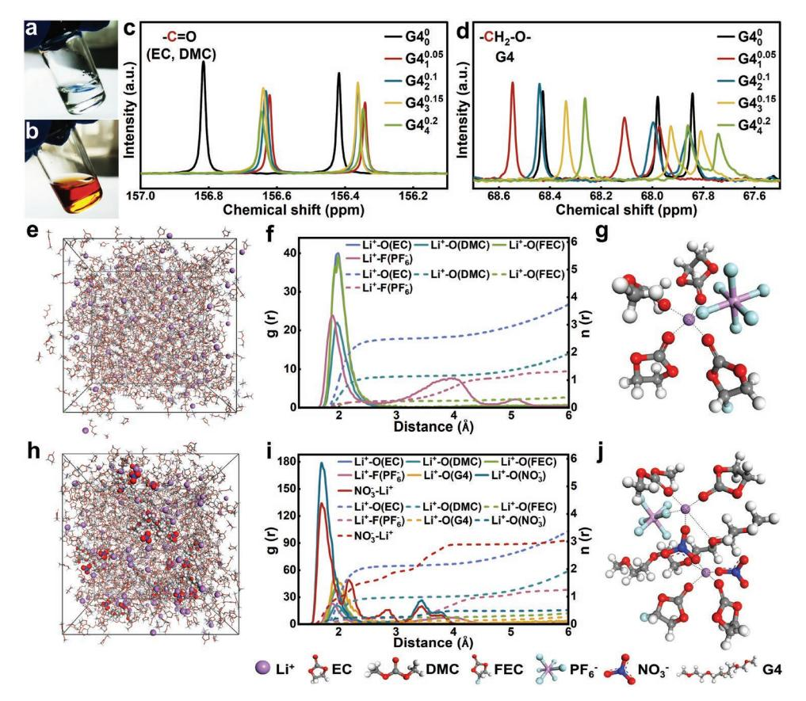
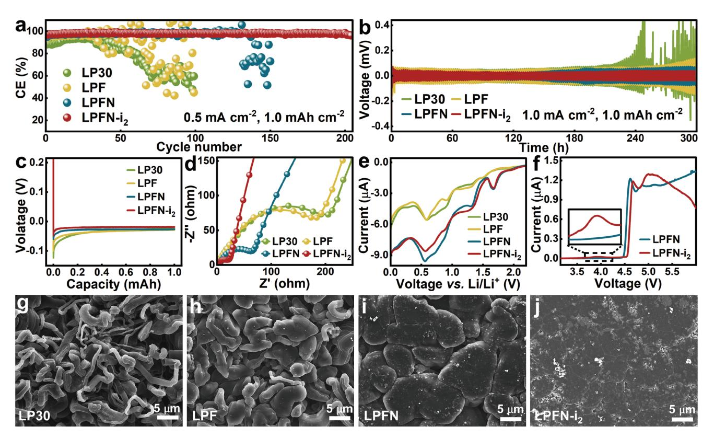
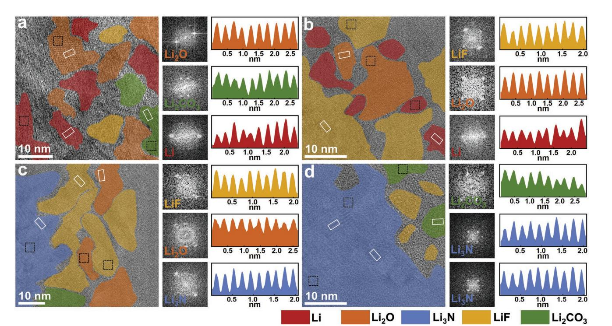
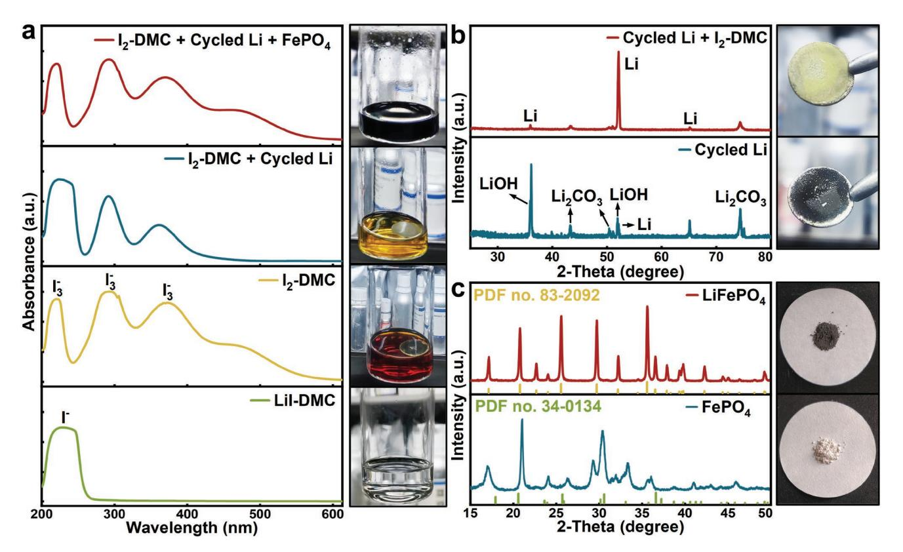
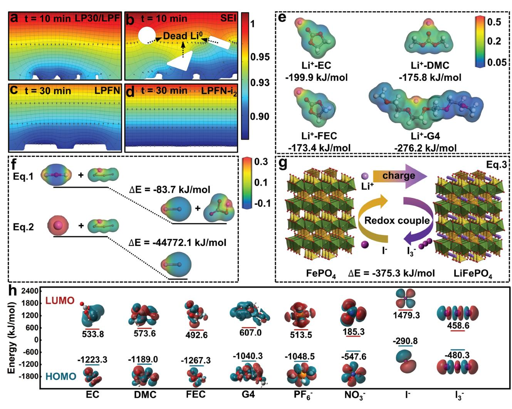
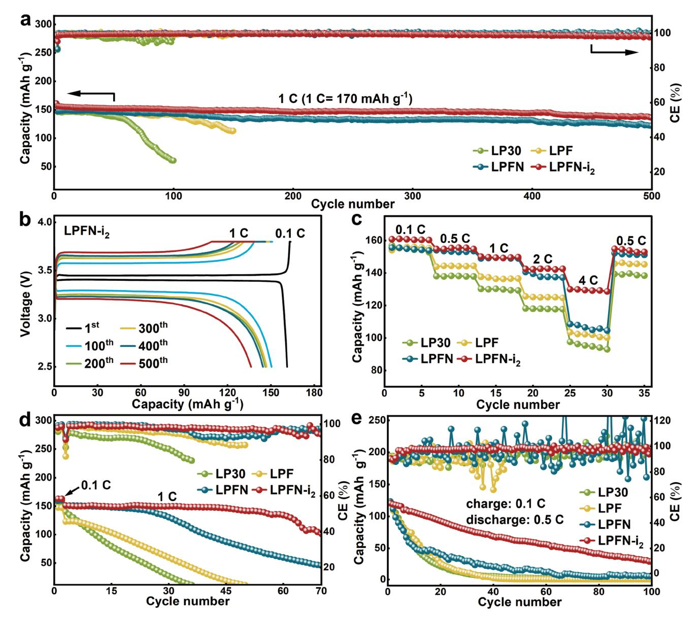

# **High-Concentration Additive and Triiodide/Iodide Redox Couple Stabilize Lithium Metal Anode and Rejuvenate the Inactive Lithium in Carbonate-Based Electrolyte**

*Zuxin Wen, Wenqiang Fang, Xiaoyu Wu, Zuoyu Qin, Hong Kang, Long Chen, Ning Zhang, Xiaohe Liu, and Gen Chen\**

**Carbonate-based electrolytes are incompatible with lithium (Li) metal anode because the generated solid electrolyte interphase (SEI) undergoes repeated breakage-repair, resulting in the accumulation of inactive Li including Li<sup>+</sup> compounds and electrically isolated dead Li0 in the SEI. Therefore, exploiting a suitable strategy to construct a stable SEI while efficiently rejuvenating the inactive Li capacity is urgent and more thoughtful than just building a stereotyped SEI layer. Herein, an innovative strategy is proposed of high-concentration additive (HCA) of LiNO3 inspired by (localized) high-concentration electrolyte and inactive Li restoration methodology via triiodide/iodide (I3 −/ I <sup>−</sup>) redox couple to improve the compatibility of carbonate-based electrolytes. The HCA of LiNO3 can maintain the cation–anion aggregates solvation structures in the carbonate-based bulk electrolyte and induce the in situ formation of superior-ionic-conductivity NO3 <sup>−</sup>-derived SEI. Moreover, the reversible I3 −/ I <sup>−</sup> redox couple can further optimize the SEI and constantly rejuvenate the inactive Li including solvent/LiNO3-derived Li2O, a derivative has almost been acquiescent in LiNO3-additive electrolytes, and dead Li0 into delithiated cathode. Consequently, epitaxy-like planar Li deposition, better reversibility, and higher capacity retention can be realized and are systematically verified by Li**||**Cu half cells, full cells with excess/limited Li (N/P ratio = 1.5) and anode-free lithium metal batteries.**

# **1. Introduction**

Metallic lithium (Li) has long been regarded as the ultimate alternative for intercalation-limited graphite anode that has approached its theoretical capacity (372 mAh g−<sup>1</sup> ),[1]

```
Z. Wen, W. Fang, Z. Qin, H. Kang, L. Chen, N. Zhang, G. Chen
School of Materials Science and Engineering
Central South University
Changsha, Hunan 410083, P. R. China
E-mail: geenchen@csu.edu.cn
X. Wu
Department of Chemistry
Southern University of Science and Technology
Shenzhen, Guangdong 518055, P. R. China
X. Liu
School of Chemical Engineering
Zhengzhou University
Zhengzhou, Henan 450001, P. R. China
     The ORCID identification number(s) for the author(s) of this article 
     can be found under https://doi.org/10.1002/adfm.202204768.
```

**DOI: 10.1002/adfm.202204768**

because of its highest theoretical capacity (3860 mAh g<sup>−</sup><sup>1</sup> ), lowest redox potential (−3.04 V vs standard hydrogen electrode) and modest density (0.534 g cm<sup>−</sup>3).[2] However, the commercial carbonate-based electrolytes such as ethylene carbonate (EC)-centric electrolyte used in graphitebased Li-ion battery are incompatible with Li anode due to the heterogeneous and brittle solid electrolyte interphase (SEI) derived from carbonate solvents,[3] which not only exacerbates Li dendrite growth and electrolyte consumption but also devastates the Coulombic efficiency (CE) and lifespan of rechargeable Li metal battery (LMB).[4] Moreover, repeated breakagerepair of SEI and Li dendrite growth cooperatively facilitate the formation of inactive Li, including Li<sup>+</sup>-containing compounds in the SEI and dead metallic Li<sup>0</sup> encapsulated by insulating compounds of SEI such as Li2O, Li2CO3 and so on.[5] And very recent researches have identified the dead Li0 instead of SEI compounds as the dominant source of capacity decay.[6]

In contrast, ether-based electrolytes have remarkably superior compatibility than carbonate-based electrolytes due to the formation of flexible organic oligomers.[7] However, the low interfacial energy and strong binding affinity between organic SEI and Li surface limit its role in inhibiting infinite volume change during Li plating/stripping.[8] Lithium nitrate (LiNO3), an almost indispensable additive in ether-based electrolyte, can effectively passivate the Li surface through NO3 <sup>−</sup>-derived inorganic-rich SEI.[9] The in situ generated nitrides/nitrogen oxides (such as Li3N, LiNO2, etc.) present high interfacial energy, Young's modulus and Li-ion conductivity, which boost the lateral growth of Li deposition and significantly restrain the dendrite growth and the derivation of dead Li0. [10] In spite of superior compatibility against metallic Li, LiNO3-modified ether-based electrolytes are still not appreciated due to their limited oxidative stability (<4 V) and conventional carbonate-based electrolytes (≈4.3 V) are still prospective candidates for high-voltage battery in short-term future.[11] Although considered to be the one of the most successful additive in ether-based electrolyte, the application of LiNO3 in carbonatebased electrolyte has been shelved frequently due to low solubility (≈0.01 mg mL−<sup>1</sup> ).

Extensive work has been devoted to the solubilization of LiNO3 in carbonate-based electrolyte. The most straightforward method is to construct ether-carbonate cosolvent electrolyte where LiNO3 can be used as additive or Li salt; while this method narrows the electrochemical window inherent in carbonate-based electrolyte.[12] Besides, some solvents with high Gutmann donor number (DN) and salts with Lewis acid sites, mainly including dimethyl sulfoxide,[13] sulfolane,[11a] *γ*-butyrolactone,[14] tris(pentafluorophenyl)borane,[15] copper fluoride,[16] tin trifuoromethanesulfonate,[17] can work as solubilizers. On the one hand, these solubilizers can indeed solubilize LiNO3 and improve the cycling performance of carbonate-based electrolyte remarkably. On the other hand, solubilizers with high DN and Lewis acid sites intrinsically react violently with Li[18] and have stronger coordination capability with cations, which decoordinate the NO3 <sup>−</sup> from solvation shell of cation and impede the access into electric double layer leading to weakened utility of NO3 −. [19] Moreover, the electrolytes used in the above-mentioned work are usually fluoroethylene carbonate (FEC)-based, an high-efficiency additive in carbonate-based electrolyte,[20] rather than the most common EC-based electrolyte, which may greatly obscure the role of LiNO3 (detailed compositions are shown in Table S1 in the Supporting Information). Therefore, there is an urgent need to exploit a Li-compatible LiNO3 solubilizer used in conventional EC-based electrolytes without sacrificing the merits of carbonate-based electrolytes.

Inspired by (localized) high-concentration electrolyte ((L) HCE) where free solvent molecules sharply reduce and contact ion pairs (CIPs) and cation–anion aggregates (AGGs) generate, leading to enhanced oxidation stability and anion-tuned SEI,[21] we herein proposed the idea of high-concentration additive (HCA), that is, adding the high-concentration LiNO3 solution into carbonate-based electrolyte with additive-level content. Licompatible tetraglyme (G4) was employed as solubilizer due to its proper DN, abundant solvation sites, higher solubility of LiNO3, oxidation stability (≈4 V) than conventional ether solvents (such as DME, DOL).[22] It is demonstrated that the CIPs and AGGs can be achieved when HCA of LiNO3 is added to carbonate-based electrolytes which can be considered as diluent in LHCE due to the feeble solubility to LiNO3. Furthermore, triiodide/iodide (I3 <sup>−</sup>/I<sup>−</sup>) redox couple were also introduced. Previous work about Li–O2 batteries[23] has demonstrated that the coexistence of halogen ions and NO3 <sup>−</sup> can induce dendrite-free epitaxial growth of Li metal, which is recommended by extensive literature due to minimized microstructural tortuosity and mitigation of electrically isolated dead Li<sup>0</sup> . [5,17] Halogen ions can permeate and destroy the original SEI layer, prompting stripping of the incompact original passivation layer and reducing the thickness of the passivation layer. NO3 <sup>−</sup> ions can immediately passivate the freshly exposed Li metal surface by forming nitride/oxide-rich, compact and thin SEI layer. Moreover, the I3 <sup>−</sup>/I− redox couple not only play an important role in optimizing the SEI in Li anode but also as a redox mediator in reclaiming inactive Li capacity into delithiated cathode. I3 <sup>−</sup> can spontaneously rejuvenate the irreversible Li capacity in Li2O and dead Li0 debris electrically isolated by insulating SEI components through chemical reactions (Equations (1) and (2)).[24] And the generated I<sup>−</sup> can be chemically oxidated back to I3 <sup>−</sup> by delithiated cathode (such as iron phosphate, FePO4, Equation (3)) or electrochemically oxidated when the working voltage of cathode exceeds 2.9 V.[25] Moreover, the LiNO3-derived inferior-ionicconductor Li2O, an unescapable reduction product that has previously been acquiescent and neglected in LiNO3-additive electrolytes, can be indiscriminately eliminated by the redox couple and a nitride-dominated SEI can be obtained artfully. Systematic experimental characterizations, phase field simulations and chemical theory calculations were used to detect the composition and nanostructure and interpret the emerging electrochemical phenomena.

$$3\text{Li}_2\text{O} + 3\text{I}_3^- = 6\text{Li}^+ + 8\text{I}^- + \text{IO}_3^- \tag{1}$$

$$2\text{Li} + \text{I}_3^- = 2\text{Li}^+ + 3\text{I}^-$$
 (2)

$$2FePO4 + 2Li+ + 3I- = 2LiFePO4 + I3-$$
 (3)

Consequently, the carbonate-based electrolyte with HCA of LiNO3 and I3 <sup>−</sup>/I− redox couple significantly optimizes the Li plating morphology and enhances the Li+ transfer kinetics. The Li||Cu half cells with designed electrolyte delivered high average CE of 98.27% for over 200 cycles at 0.5 mA cm−<sup>2</sup> with fixed discharging capacity of 1.0 mAh cm−<sup>2</sup> . LMBs with lithium iron phosphate (LiFePO4, LFPO, 12 mg cm<sup>−</sup>2) exhibit high discharge capacity retention rate (88.4%) for 500 cycles at 1 C (1 C = 170 mAh g−<sup>1</sup> ) and 93.3% with lithium–nickel–cobalt– manganese oxide (LiNi0.5Co0.2Mn0.3, NCM523, 12 mg cm<sup>−</sup>2) at 0.5 C (1 C = 200 mAh g−<sup>1</sup> ) for 100 cycles. Moreover, both LMBs at extremely low negative to positive areal capacity ratio (N/P, 1.5) and anode-free lithium metal battery (AFLMB) alleviate the decay of discharge capacity, confirming the utility of I3 <sup>−</sup>/I<sup>−</sup> redox couple in reclaiming inactive Li.

### **2. Results and Discussions**

The conventional carbonate-based electrolyte (LP30) with 1 M LiPF6 dissolved in EC-dimethyl carbonate (DMC) (1:1 by volume) was used as the basic electrolyte and 5 vt% FECcontaining LP30 (LPF) was also employed as control electrolyte. HCAs were prepared by dissolving 1, 2, 3, 4 m LiNO3 in G4 (G4*n*, *n* represents the concentration of LiNO3 in G4) and HCAs of LiNO3 can keep transparent without obvious precipitation due to the high solubility of LiNO3 in G4 (Figure S1, Supporting Information). 5 vt% G4*n* and 5 vt% FEC were added to LP30 and no obvious precipitation can be observed (**Figure 1**a; Figure S2a–c, Supporting Information), even when 5 vt% G44 was added (≈0.2 m LiNO3, LPFN). However, with the same amount of LiNO3 (0.2 m) in LP30 and LPF, LiNO3 particles hardly dissolves in both two electrolytes (Figure S2d,e, Supporting Information). To introduce the I3 <sup>−</sup>/I− redox couple into carbonate-based electrolyte, 0.01 × 10−<sup>3</sup> m I2 was added to LPFN (denoted as LPFN-i2) to reclaim the inactive Li capacity in solvent/LiNO3-derived Li2O and dead Li0 . With the addition of I2, the color evolution from colorless to reddish-brown will emerge (Figure 1b; Figure S3, Supporting Information) and significantly enhanced flame retardancy will be obtained unexpectedly due to the presence of halogen (Figure S4,




**Figure 1.** The characterization and MD simulation of Li<sup>+</sup>-solvation structure. The digital photographs of a) LPFN and b) LPFN-i<sub>2</sub>. <sup>13</sup>C NMR spectra of c) the carbonyl carbon in EC and DMC and d) the methylene carbon in G4.  $e-g$ ) and  $h-j$ ) Represent the MD simulation of the controlled electrolyte LPF and the additive-containing LPFN- $i_2$ , respectively. e,h) The snapshot of the constructed amorphous cell after dynamic simulation for 40 ps. f,i) The RDF ( $g(r)$ , solid lines) and coordination numbers ( $n(r)$ , short dash lines). g,j) Schematic diagram of representative Li<sup>+</sup>-solvation structure.

Supporting Information).<sup>[25b]</sup> In addition, the amount of  $I_2$ should be strictly controlled to prevent the further pitting corrosion on active Li according to the previous literature.<sup>[23,26]</sup>

To explore the effect of additives on solvation structure, nuclear magnetic resonance (NMR) was employed. A series of LPFN- $i_1$  type electrolytes with 5 vt% varied G4, were prepared (denoted as  $G4_n^m$ , *n,m* represents the concentration of LiNO<sub>3</sub> in G4 and in bulk electrolyte respectively.  $G4_0^0$  refers to the addition of 5 vt% pure solvent of G4 and  $G4_4^{0.2}$  is LPFN-i<sub>2</sub> mentioned above. Detailed preparation of  $G4_n^m$  can refer the Supporting Information). The chemical shifts shown in <sup>13</sup>C NMR spectra of carbonate solvents/additive (EC, DMC, and FEC) are completely different from that of G4. When  $0.05 \text{ M LiNO}_3$  is present in the bulk electrolyte ( $G4_1^{0.05}$ ), the <sup>13</sup>C spectra of carbonyl carbon atom in EC and DMC shift up-filed to a lower chemical shift while down-filed to a higher chemical shift for methylene carbon atom in G4 (Figure 1c,d). For such opposite chemical shifts, it is deduced that part of electron-rich<sup>[27]</sup>  $NO_3^-$  ions enter the Li<sup>+</sup> solvation shell originally dominated by carbonate molecules (EC, DMC, and FEC), which donates negative charge and strong shielding effect to carbonate molecules but deshielding effect to G4 due to the escape of  $NO_3^-$  and solvation of Li<sup>+</sup>. However, the chemical shift values of carbonyl carbon atom in EC and DMC remain almost constant. There are no obvious great up-field shifts as the further increment of LiNO<sub>3</sub> concentration (Figure 1c). In contrast, the continuously decreasing chemical shift values indicates the density of electron cloud surrounding the G4 molecules increases (Figure 1d). The bizarre phenomenon may be attributed to the very limited solvation capability of carbonate molecules for LiNO<sub>3</sub>. And the excess LiNO<sub>3</sub> beyond the solubility limit of carbonate-based electrolyte is mainly solvated by high-DN G4 molecules. As the concentration of LiNO<sub>3</sub> increases, the free G4 molecules are remarkably decreasing and NO<sub>3</sub><sup>-</sup> ions need to participate in the Li<sup>+</sup> solvation sheath to maintain electrical neutrality. Furthermore, the other <sup>13</sup>C spectra features associated with FEC and EC and <sup>1</sup>H spectra of  $G4_n$  show the analogous chemical shift pattern as above (Figures S5 and S6, Supporting Information). Meanwhile, the Raman spectra of  $G4_n$  and  $G4_n^m$  were also carried out to further study the solvation structure. The typical O-C-O bending and bands<sup>[28]</sup> of G4 solvent at 770–870 cm<sup>-1</sup> are maintained in the spectrogram. Nevertheless, they become much weaker and shift to higher value as gradually increasing LiNO<sub>3</sub> concentration (Figure S7, Supporting Information), which implies that G4 molecules are coordinated with  $Li^+$  to form  $[Li(G4)]^+$  complexes and leads to a sharp concentration drop of free G4 molecules. The peaks located at 1040  $\text{cm}^{-1}$  refer to the symmetric stretch<sup>[14]</sup> of free  $NO_3^-$  and the shoulder peaks at higher value emerge and dominate with increasing concentration (Figure S7, Supporting Information), indicating NO<sub>3</sub><sup>-</sup> ions enter the solvation

shell to form CIPs and AGGs in HCAs. The analogous trends of O-C-O bend and NO<sub>3</sub><sup>-</sup> symmetric stretch are also detected in  $G4_n^m$  (Figure S8a,b, Supporting Information). No obvious deviations of the O-C-O bending bands of EC and FEC at 700-750 cm<sup> $-1$ </sup> can be observed with the increasing LiNO<sub>3</sub> concentration (Figure S8c, Supporting Information), further confirming  $NO_3^-$  ions coordinate with  $[Li(G4)]^+$  complexes and the aggregates structure can be well reserved even though additive-level high-concentration  $G4_n$  is added into the carbonate-based bulk electrolyte. It is worth noting that such an experimental phenomenon is similar to LHCE and the carbonate solvents (EC, DMC, and FEC) are equivalent to diluents in LHCE due to their very limited solubility to LiNO<sub>3</sub> compared to G4.

Molecular dynamic (MD) was employed to elucidate the effect of additives on solvation structure on molecular scale. The carbonate solvent molecules (EC and DMC) dominate the first Li<sup>+</sup>-solvation sheath in conventional LP30 (Figure S9, Supporting Information), resulting in carbonate-derived organic SEI. However, FEC-added LPF appears an obvious Li<sup>+</sup>-O(FEC) peak at around 1.98  $\AA$  in the radial distribution function (RDF), indicating the participation of FEC in solvation structure (Figure 1e-g). To investigate the solvation behavior of HCA of  $LiNO<sub>3</sub>$  in carbonate-based bulk electrolyte, a series of MD simulations of  $G_{n}^{4^{m}}$  electrolytes were conducted. In order to reduce the computational difficulty and provide accurate understanding of the role of  $NO_3^-$ , we consider the effect of  $I_2$  on solvation structure is minimal, since the content of  $I_2$  (0.01 × 10<sup>-3</sup> M) is several orders of magnitude less than that of LiNO<sub>3</sub>. An intense peak assigned to Li<sup>+</sup>-O(NO<sub>3</sub><sup>-</sup>) emerges in RDF at around 1.70 Å and the coordination number for  $NO_3^-$  increases from 0.017  $(G4_1^{0.05})$  to 0.252  $(G4_4^{0.2})$  with the concentration augment of HCA (Figure 1h-j; Figure S10, Supporting Information), indicating that the  $NO_3^-$  is involved in the primary solvation sheath and inorganic-containing SEI derived from  $NO_3^-$  becomes feasible. Moreover, the G4 continuously enter the Li<sup>+</sup> solvation sheath ( $\approx$ 2.0 Å) and the free G4 molecules are decreasing dramatically to dissolve the excess LiNO<sub>3</sub> that exceeds the solubility limit of the carbonate electrolyte (Figures S10 and S11, Supporting Information). Interestingly, each  $NO_3$ <sup>-</sup> will coordinate with 1.02 Li<sup>+</sup> ion in  $G4_3^{0.15}$  and 1.55 in  $G4_4^{0.2}$  (namely, LPFN-i<sub>2</sub>), which is greater than 1 and indicates the formation of local cation-anion aggregates structure<sup>[13]</sup> (Figure S11, Supporting Information). In addition, the resemblant aggregation structure and coordination environment trend of  $NO_3^-$  and G4 can also be observed in HCA of  $LiNO_3$  (namely,  $G4_n$ , Figures S12 and S13, Supporting Information). Combining the results of experimental characterizations and MD simulations, we can deduce that the cationanion aggregates structure can be well maintained when HCA of LiNO<sub>3</sub> is added into the carbonate-based electrolyte, which is similar to the solvation structure in LHCE.

The electrochemical tests of Li||Cu half cells and Li||Li symmetrical cells were conducted to examine the effect of additives on long-term reversibility. As shown in Figure 2a, the CE of conventional carbonate-based electrolyte (LP30) experiences a sharp decline, begins at only 30 cycles, from 88.22% to less than 50% after only 70 cycles. Although the addition of 5 vt% FEC in LP30 (LPF) can improve the CE to some extent ( $\approx$ 95.66% within 40 cycles), severe fluctuations emerge afterwards, indicating the violent side reaction and limited effectiveness with

additive-level FEC.<sup>[29]</sup> In contrast, much higher average CE and better reversibility (≈98.10% within 130 cycles for LPFN and  $\approx$ 98.27% within 200 cycles for LPFN-i<sub>2</sub>) are achieved with the addition of HCA of  $LiNO_3$  and  $I_3^{-}/I^{-}$  redox couple, preliminarily confirming the feasibility of HCA of LiNO<sub>3</sub> and the positive synergistic effect between  $LiNO_3$  and  $I_3^-/I^-$  redox couple. Symmetric cells tests using LPFN and LPFN-i<sub>2</sub> present smaller overpotentials (76 vs 41 mV after 300 h), which is comparable to ether-based electrolytes.<sup>[10a]</sup> However, ever-increasing overpotentials, fatal short circuit, and drastic fluctuations arise obviously in LP30 and LPF (Figure 2b), indicating the continuous side reactions and the accumulation of fragile SEI by-products at the Li/electrolyte interface (Figure S14, Supporting Information). The gradually decreasing nucleation overpotentials and charge transfer resistances further corroborate the improved SEI stability and faster Li<sup>+</sup>-transfer kinetics with the addition of LiNO<sub>3</sub> and  $I_3^-/I^-$  redox couple (Figure 2c,d; Figure S15, Supporting Information). Note that LPFN-i<sub>2</sub> can further reduce the interfacial impedance compared to LPFN, which can be ascribed to the scavenging effect of  $I_3^-$  on poor-ionic-conductor Li<sub>2</sub>O through Equation (1) and more detailed discussion will be presented below. Cyclic voltammetry (CV) tests scanning from 2.2 to 0.0 V at 0.1 mV  $s^{-1}$  are employed to probe the reduction reactions and corresponding potentials. Compared to LP30 and LPF, analogous reduction curves and distinct reduction peaks which can be assigned to the decomposition of LiNO<sub>3</sub> around 1.6 V can obtain in LPFN and LPFN-i<sub>2</sub> (Figure 2e). The addition of  $I_2$  does not introduce additional reduction peak in CV because the reaction between  $I_3^-$  and  $Li_2O$  (Equation (1)) is essentially spontaneous chemical reaction. To evaluate the electrochemical oxidation window of electrolytes, linear sweep voltammetry (LSV) is conducted on stainless steel work electrode and Li foil is used as reference electrode and counter electrode. The electrochemical stability voltages of LPFN and LPFN-i<sub>2</sub> ( $\approx$ 4.5 V, Figure 2f) are not reduced due to the introduce of HCA and even slightly higher than LP30 (≈4.35 V) and LPF ( $\approx$ 4.29 V) (Figure S16, Supporting Information). Note that compared to LPFN, LPFN-i<sub>2</sub> exists a small oxidation peak starting at 3.6 V, which can be attributed to the electrochemical oxidation reaction<sup>[25b]</sup> of I<sup>-</sup> to I<sub>3</sub><sup>-</sup>. However, the addition of only 5 vt% pure ether solvent into carbonate-base electrolyte (LP30 + 5 vt% pure G4) greatly destroys the oxidation stability. Surprisingly, the oxidation window becomes broader with the increase of LiNO<sub>3</sub> concentration (Figure S17a, Supporting Information). The same trend can also be found in a series of  $G4_n$  electrolytes (Figure S17b, Supporting Information), which indirectly certifies that HCA in the bulk electrolyte can maintain the aggregated structure and the lack of free ether molecules. Moreover, the contact angles, viscosity and ionic conductivity were also provided. The contact angle, ionic conductivity and viscosity are just slightly changed after introducing the high-concentration additive and  $I_3^-/I^-$  redox couple into the conventional carbonate-based electrolytes. In sharp contrast, great increase in viscosity and sharp decrease in ionic conductivity are observed in high-concentration electrolyte  $(G4<sub>4</sub>)$ , indicating the strategy of high-concentration additive can effectively avoid some shortcomings (such as low ionic conductivity, high viscosity) caused by high-concentration electrolytes (Figures S18 and S19, Supporting Information). Scanning electron microscopy (SEM) is




**Figure 2.** Electrochemical performance and Li deposition morphologies in different electrolytes. a) CEs of Li||Cu half cells at 0.5 mA cm−<sup>2</sup> with fixed discharging capacity of 1.0 mAh cm−<sup>2</sup> . b) Voltage–time profiles of Li||Li symmetrical cells at 1.0 mA cm−<sup>2</sup> for 1.0 h in each half cycle. c) Voltage–capacity profiles of Li deposition on Cu foil at 0.5 mA cm<sup>−</sup>2. d) Electrochemical impedance Nyquist spectra of Li||Cu half cells after the activation process at 0.05 mA cm<sup>−</sup>2. e) CV curves of Li||Cu half cells between a voltage range of 0–2.2 V at 0.1 mV s−<sup>1</sup> . f) LSV curves of Li||SS cells scanned between open circuit voltage and 6 V at 0.5 mV s−<sup>1</sup> . The SEM morphologies of 2.0 mAh cm−<sup>2</sup> Li deposited on Cu foil at 0.5 mA cm−<sup>2</sup> in g) LP30, h) LPF, i) LPFN, j) LPFN-i2.

employed to characterize the morphologies of Li depositions after 0.1 or 2.0 mAh cm<sup>−</sup><sup>2</sup> Li plated on copper (Cu) current collector at 0.5 mA cm<sup>−</sup>2. Loose and porous dendritic structures are observed in both LP30 and LPF. The morphologies with such high specific surface area will lead to continuous breakagerepair of SEI and the hazard of short circuit (Figure 2g,h; Figure S20a,b,e,f, Supporting Information). In contrast, typical dough-like and dendrite-free Li depositions with colossal granular size can be obtained in LiNO3-containing LPFN (Figure 2i; Figure S20c,h, Supporting Information). Compared to LPFN, more planar Li deposition morphology similar to epitaxial growth is emerged in LPFN-i2 (Figure 2j; Figure S20d,g, Supporting Information), indicating the addition of I2 can substantially uniformize the SEI and similar results have also been reported in previous literature using other halogens in Li–air battery.[23]

The in-depth chemical components of the SEI forming in the specific electrolytes are characterized by in-depth X-ray photoelectron spectroscopy (XPS) sputtered by Ar-ion. The indicative C 1s spectra in carbonate-based electrolyte display four binding states at 284.80, 286.01, 288.17, 289.41 eV, corresponding to CC/CH, CO, CO and Li2CO3 groups respectively.[13] Compared to LP30 and LPF, the intensity of metastable organics (CC/CH, CO, and CO) derived from the decomposition of carbonate solvents are much weaker in LPFN-i2 (**Figure 3**a,b; Figure S21a, Supporting Information). The trend is not obvious at the surface (0 s of etching), but distinct intensity attenuation emerges during the rest of sputtering in LPFN (Figure S21b, Supporting Information). Moreover, the proportion of Li2CO3, an extremely stable SEI component with low oxidation state,[30] gradually increases in LPFN and LPFN-i2 while the intense CC/CH group always dominant the C 1s components in LP30 and LPF, indicating the organic-rich SEI and irrepressible solvent decomposition in conventional carbonate-based electrolytes (LP30 and LPF). For F 1s spectra, typical LiF signal at 684.44 eV is observed in these four electrolytes. Obviously, the LiF is mainly derived from the reduce of LiPF6 in FEC-absent LP30. However, the sacrificial-additive FEC will replace LiPF6 as the main decomposition source of LiF in other three FEC-containing electrolytes,[31] which will be further discussed by theoretical calculation in the following section. It is demonstrated that the LiF signal intensity improves significantly as the sputtering deepens in LP30, LPF, and LPFN, revealing LiF-rich inner SEI. However, for LPFN-i2, the content of LiF in the SEI is more uniform and the intensity is much smaller than that of the other electrolytes. For LiNO3-containing electrolytes (LPFN and LPFN-i2), an additional Li3N peak at 298.45 eV emerges in the SEI, confirming the reduction of LiNO3 in carbonate-based electrolyte. By contrast with LiF, Li3N not only possesses excellent electronic insulation and interfacial energy but also much smaller Li+ diffusion energy barrier (0.007 vs 0.729 eV).[32] It endows Li3N with super ionic conductivity (≈10−<sup>3</sup> S cm−<sup>1</sup> at room temperature, comparable to that of liquid electrolyte)[33]


**www.advancedsciencenews.com www.afm-journal.de**

**Figure 3.** The in-depth XPS spectra of Li metal surface after 12 cycles of plating in Li||Li symmetric cells at 1.0 mA cm<sup>−</sup>2 with 1.0 mAh cm<sup>−</sup><sup>2</sup> fixed capacity in a) LPF and LPFN-i2.

and induces planar and dense Li deposition,[34] as seen in the results of SEM (Figure 2i,j). For O 1s spectra, the ROCO2Li at 530.97 eV dominate the content in these four electrolytes, which is consistent with previous literature using carbonatebased electrolyte.[16,35] However, comparatively higher CO group content at 532.97 eV is found in LPFN-i2 than that of the other electrolytes and is still clearly visible even after 100 s of sputtering (Figure 3b; Figure S22, Supporting Information), which can be attributed to the catalytic effect of I− in promoting the H-abstraction reaction of solvent molecules to form elastic and Li<sup>+</sup>-conductive oligoether.[36] In addition, no obvious Li2O signal emerges at 527.72 eV, further affirming the scavenging effect of I3 <sup>−</sup> on Li2O. Unexpectedly, the Li2O content in the innermost SEI reaches up to 17.3% in LPFN, far exceeding that in LP30 (10.0%) and LPF (8.1%) (Figure S22, Supporting Information). The reason for improved Li2O content is promoted by the decomposition of LiNO3 and have been verified in previous literature using LiNO3 as additive in carbonate-based ele ctrolyte.[10b,13,15,37] Therefore, the addition of LiNO3 into electrolyte not only introduces fast-ionic-conductor Li3N but also interior-ionic-conductor Li2O into SEI. The influence of Li2O on deposition morphology will be detailly discussed below, which is commonly neglected in previous researches using LiNO3 as additive. In addition to the XPS spectra of the above elements, I 3d spectra are specially conducted for Li surface in LPFN-i2 and no obvious peaks are detected (Figure S23, Supporting Information), which can be ascribed to the high solubility of iodide in aprotic liquid electrolyte[38] and indirectly proves the interconversion between iodides in bulk electrolyte.

Cryogenic transmission electron microscopy (cryo-TEM) was further used to visualize the nanostructure and components distribution of the SEIs generated in different electrolytes. In the basic carbonate electrolyte without any additives (LP30), typical mosaic structure filled with diverse Li+ SEI components (including Li2O, LiF, Li2CO3) and nubby dead Li0 surrounded by these electrically insulating Li+ components are discovered, confirming by the corresponding fast Fourier transform (FFT) patterns and lattice fringes patterns (**Figure 4**a). However, LiF dominates and passivates the SEI in FEC-added LPF electrolyte due to the sacrificial decomposition of FEC. Although the addition of FEC can passivate and improve the SEI to some extent, dead Li<sup>0</sup> can still be clearly detected (Figure 2b), which may be ascribed to the huge volume effect brought by Li dendrite growth. The resulting irreversible capacity loss also determines that the improved CE is still not enough to achieve long cycling lifespan in LPF with FEC as additive instead of solvent.[39] For LPFN with HCA of LiNO3, the new component Li3N derived from LiNO3 and LiF dominate the majority




Figure 4. Nanostructures and components of SEIs generated in different electrolytes imaged by cryo-TEM. a-d) correspond to the results for LP30, LPF, LPFN, and LPFN-i». The FFT patterns are grabbed from the black square areas and the lattice fringes patterns from white rectangular areas marked in the high-resolution cryo-TEM images.

of the SEI and Li<sub>2</sub>O/Li<sub>2</sub>CO<sub>3</sub> chunks are randomly interleaved between Li<sub>3</sub>N and LiF (Figure 4c). In stark contrast, only Li<sub>3</sub>N dominate almost the entire SEI with a small amount of LiF and  $Li_2CO_3$  scatter in LPFN-i<sub>2</sub> electrolyte with  $I_3^{-}/I^{-}$  redox couple (Figure 4d). Consistent with the results of XPS, Li<sub>2</sub>O and dead Li<sup>0</sup> are barely detected due to the efficient scavenging of Li<sub>2</sub>O and dead  $\text{Li}^0$  recovery by  $I_3^-/I^-$  redox couple and much weaker plating/stripping volume effect with Li<sub>3</sub>N-rich and homogeneous SEI. Meanwhile, compared with LPFN, LiF is also greatly reduced, indicating the inhibition of the degradation of FEC with the addition of  $I_3^{-}/I^{-}$  redox couple. It is speculated that the  $I_3^{-}/I^{-}$  redox couple can quickly clean the inherent passivation layer on the surface of Li foil when LPFN-i<sub>2</sub> is in contact with the Li foil, enabling the LiNO<sub>3</sub>-derived Li<sub>3</sub>N to cover the Li foil surface more comprehensively and suppressing subsequent decomposition of FEC. On basis of in-depth XPS and cryo-TEM results, a Li<sub>3</sub>N-rich SEI with simpler compositions and more homogeneous nanostructure can be obtained in I<sub>2</sub>-added LPFN- $i_2$  electrolyte.

An ex situ visualization experiment conducted by ultraviolet spectrophotometry (UV) is carried out to validate the reversibility and mechanism of  $I_3^-/I^-$  redox couple. The broad peak at around 229 nm can be assigned to the absorption of I<sup>-</sup> in LiI-containing DMC solution (LiI-DMC), while the characteristic peaks at 215, 288, and 360 nm emerging in I<sub>2</sub>-containing DMC solution (I<sub>2</sub>-DMC) belong to  $I_3^-$  (Figure 5a),<sup>[24,26]</sup> the predominant form of  $I_2$  in polar solution.<sup>[25a,38]</sup> After adding a cycled Li (12 cycles in Li||Li symmetric cell with LP30) into the I<sub>2</sub>-DMC solution, evident peak broadening at around 229 nm and peak intensity weakening at 288 and 360 nm are observed in UV spectra, indicating the emergence of  $I^-$  and the decrease of  $I_3^-$  through Equations (1) and (2). The color of  $I_2$ -DMC solution will also change from reddish-brown to bright yellow at the same time. In addition, the black pristine SEI accumulation on cycled Li surface can also be removed, similar to chemical polishing,<sup>[40]</sup> and the XRD spectra show improved Li crystallinity and reduced impurity peaks (Figure 5b). Upon the continuous addition of delithiated gray-white iron phosphate (FePO<sub>4</sub>) into the cycled Li-reacted  $I_2$ -DMC solution, the broad peak representing I<sup>-</sup> disappeared while the intensity of  $I_3^-$  peaks are restored (Figure 5a). However, the colour of the solution does not return to the expected reddish-brown like  $I_2$ -DMC because of the large amount of black lithiated FePO<sub>4</sub> suspended in the solution. XRD patterns prove the appearance of LiFePO<sub>4</sub> after the spontaneous lithiation of FePO<sub>4</sub> through Equation (3) (Figure 5c). The original reddish-brown of the LiFePO<sub>4</sub>-containing solution will appear after centrifuging (Figure S24, Supporting Information), indicating the regeneration of  $I_3^-$  in this solution.

Physical field simulations and chemical calculations were synergistically carried out to further interpret the chemical/ electrochemical phenomena observed above. Referring to the characterizations implemented on SEI, finite element analysis based on surface film resistance method were achieved by COMSOL Multiphysics 5.6 to elucidate the Li deposition behavior in different electrolytes matching with different SEI compositions and structures (detail model geometry construction and physics boundary condition settings can be found in the explanatory text and figures in the Supporting Information). Due to diversity and heterogeneity of SEI composition in

**ADVANCED**<br>FUNCTIONAL

www.afm-journal.de


www.advancedsciencenews.com

**ADVANCED**<br>FUNCTIONAL www.afm-iournal.de



**Figure 5.** The intrinsic mechanism of  $I_3^-/I^-$  redox couple for rejuvenating the dead Li and scavenging Li<sub>2</sub>O. a) UV spectra and the colour evolution of I-containing solution. b) XRD patterns and digital photographs of cycled Li foil and cycled Li foil soaked into I<sub>2</sub>-DMC solution. c) XRD patterns and digital photographs of FePO<sub>4</sub> and lithiated FePO<sub>4</sub> soaked in Lil-DMC solution.

LP30 and LPF, Li ions tend to accumulate in some hot spots, result in uneven Li nucleation and dendrites growth (**Figure 6a**; Figure S26, Supporting Information). Typically, high ionic conductivity regions can act as hot spots where Li<sup>+</sup> flux tend to transport as indicated by the streamlines rather than the surrounding low ionic conductivity regions (Figure S28, Supporting Information). In addition, the effect of electrically isolated dead Li<sup>0</sup> in SEI on deposition behavior is also specially considered, the dead Li<sup>0</sup> will distort and derange the Li<sup>+</sup> flux as a physical block and eventually lead to dendrite growth (Figure 6b; Figure S30, Supporting Information). For LPFN electrolyte, the simulation shows that Li grows significantly faster in high ionic conductivity Li<sub>2</sub>N-rich regions than low ionic conductivity Li<sub>2</sub>O/LiF/ Li<sub>2</sub>CO<sub>3</sub>-rich regions and dough-like morphology emerges over time (Figure 6c; Figure S32, Supporting Information), which is in good agreement with the images observed by SEM. In sharp contrast, due to the scavenging effect of  $I_3^-$  for solventderived and LiNO<sub>3</sub>-derived poor-ionic-conductor Li<sub>2</sub>O and dead Li<sup>0</sup> and the reduction of LiF, the Li<sub>3</sub>N-dominant SEI enables a more uniform Li<sup>+</sup> flux and concentration gradient distribution, resulting in planar and dense Li deposition in LPFN-i<sub>2</sub> electrolyte (Figure 6d; Figure S34, Supporting Information). Systematic chemical calculations are also performed to disclose the chemical properties of electrolyte components and the intrinsic mechanism of chemical/electrochemical reaction. In comparison with carbonate solvents (EC, DMC, and FEC), the selected solubilizer G4 has the lowest binding energy  $(-276.2 \text{ kJ mol}^{-1})$ ,

Figure 6e), in agreement with the lowest electrostatic potential (ESP) and relatively low positive charge distribution of G4 (Figure S35, Supporting Information). The lowest binding energy means stronger affinity of G4 with Li<sup>+</sup> than carbonate solvents, which not only endows G4 with higher LiNO<sub>3</sub> solubility but also greater tendency to reduce on the Li surface to form elastic oligoether due to the higher desolvation energy (namely, binding energy). Under the catalytic effect of  $I^{-[36]}$  we can also explain the higher C-O peak intensity in O 1s spectra in LPFN- $i_2$  compared to LPFN. The reaction energies between  $I_3^-$  and various SEI components are evaluated by density functional theory (DFT). We find that the chemical reaction between  $I_3^-$  and  $Li_2O$  (Equation (1)) or Li (Equation (2)) is energetically favorable ( $\Delta E$  < 0 kJ mol<sup>-1</sup>, Figure 6f) but unfavorable with LiF, Li<sub>3</sub>N, LiOH, and Li<sub>2</sub>CO<sub>3</sub> ( $\Delta E > 0$  kJ mol<sup>-1</sup>, Figure S36, Supporting Information), suggesting that  $I_3^-$  can selectively scavenge the unfavorable components (Li<sub>2</sub>O and dead Li<sup>0</sup>) and retain the SEI-valid components (such as LiF and Li<sub>3</sub>N). Moreover, the reaction to rejuvenate the irreversible Li capacity into delithiated cathode through  $I_3^{-}/I^{-}$  redox couple is exothermic (Equation (3),  $\Delta E = -375.3$  kJ mol<sup>-1</sup>), indicating the reaction can proceed spontaneously and ensure the regeneration of  $I_3^{-}/I^{-}$ redox couple while recovering the inactive Li capacity. The frontier molecular theory is employed to evaluate the redox reaction activity of the electrolyte components by calculate the energy level of the lowest unoccupied molecular orbital (LUMO) and the highest occupied molecular orbital (HOMO). Compared


www.afm-journal.de



Figure 6. Simulation and theoretical calculation of various electrochemical behaviours. Finite element analysis of Li deposition behaviour simulated by COMSOL Multiphysics 5.6. Li deposition behaviour in a) LP30/LPF, c) LPFN, and d) LPFN-i<sub>2</sub> at current density of 0.5 mA cm<sup>-2</sup>. b) The effect of dead Li<sup>0</sup> in SEI on Li deposition behaviour. e) The binding energy and ESP of Li<sup>+</sup>-EC, Li<sup>+</sup>-DMC, Li<sup>+</sup>-FEC, and Li<sup>+</sup>-G4. The chemical mechanism of  $I_3^-/$ I<sup>-</sup> redox couple. f) The reaction energy  $\Delta E$  of Equations (1) and (2). g) Schematic illustration of loss Li capacity regeneration and reaction energy  $\Delta E$  of Equation (3) through  $I_3^-/I^-$  redox couple. h) The LUMO and HOMO energy level of solvents and solutes using in our electrolytes.

with carbonate molecules and PF<sub>6</sub><sup>-</sup> anion, NO<sub>3</sub><sup>-</sup> has relatively lower LUMO energy level, namely stronger electron affinity, suggesting that  $NO_3^-$  will preferentially reduce to form Li<sub>3</sub>Nrich and fast-ionic-conductivity SEI. And the LUMO energy level of FEC is lower than that of PF<sub>6</sub><sup>-</sup> anion, which indicates LiF is mainly derived from the dedicated decomposition of FEC instead of  $PF_6^-$  anion. The atomic ratio obtained from in-depth XPS and EDX were carried out to support this assertion (see detail in Figure S37 in the Supporting Information). Moreover, I<sup>-</sup> has highest HOMO energy level compared to other compositions, making the oxidation of  $I^-$  to  $I_3^-$  on the delithiated cathode side more advantageous and inhibiting the oxidation degradation of the solvent molecules to some extent. Likewise,  $I_3^-$  has the similar effect on the anode side due to the lower LUMO energy level than that of solvents.

Systematic investigations are conducted to evaluate the feasibility and effectiveness of the proposed electrolyte strategy in full cells. Compared to the rapid discharge capacity decay in LP30 (41.6% capacity retention after 100 cycles) and LPF (75.5% capacity retention after 150 cycles), significantly enhanced reversibility and higher discharge capacity retention are obtained in LPFN (82.9% after 500 cycles) and LPFN-i<sub>2</sub> (88.4% after 500 cycles), preliminarily confirming the feasibility of HCA of LiNO<sub>3</sub> and  $I_3^-/I^-$  redox couple in stabilizing Li anode interface and reclaiming irreversible inactive Li capacity (**Figure 7a**). Although the average  $CE$  ( $CE =$  discharge capacity/ charge capacity) of LPFN- $i_2$  (99.5%) is slightly lower than that of LPFN (99.8%), much higher charge capacity can be also obtained in LPFN-i<sub>2</sub> accordingly due to capacity recovery effect (Figure S38, Supporting Information), which ensures the overall higher discharging capacity retention in LPFN-i<sub>2</sub> than LPFN. The capacity–voltage profiles with different cycles in LPFN- $i_2$ also demonstrate slow capacity decay even after a few hundred cycles (Figure 7b). Moreover, similar discharge capacity, much higher than that of LP30 and LPF, can be obtained in LPFN and LPFN- $i_2$  at 0.1, 0.5, 1, 2 C due to the lower interface resistance


www.advancedsciencenews.com

**ADVANCED**<br>FUNCTIONAL

www.afm-iournal.de



**Figure 7.** Electrochemical performance of the full cells with 12 mg cm<sup>-2</sup> LiFePO<sub>4</sub> cathode in different electrolytes. a) Cycling performance of Li||LFPO cells at 1 C (1 C = 170 mAh g<sup>-1</sup>). b) The charge–discharge curves of Li||LFPO in LPFN-i<sub>2</sub>. c) Rate performance of Li||LFPO cells. d) Cycling performance of Li@Cu||LFPO with a limited Li capacity of 1.0 mAh cm<sup>-2</sup> and an extremely low N/P ratio of 1.5 at 1 C. e) Cycling performance of Cu||LFPO cells charged at 0.1 C and discharged at 0.5 C.

with the addition of  $LiNO<sub>3</sub>$  (Figure 7c), as revealed by the EIS results (Figure S39, Supporting Information). However, when the rate is further increased up to 4 C, a remarkably improved rate capability emerges in LPFN-i<sub>2</sub> (130.3 vs 105.9, 100.5, 94.2 mAh  $g^{-1}$ ), which may be attributed to more elastic and Li<sup>+</sup>conducting oligomers induced by  $I_3^-/I^-$  redox couple in the SEI. Excess Li used in anode tends to exaggerate electrochemical performance and even lead to misguided mechanism interpretation. Therefore, cells with extremely low negative to positive areal capacity ratio (N/P, 1.5) and anode-free lithium metal battery (AFLMB) are conducted to further evaluate the actual utility of  $I_3^-/I^-$  redox couple in recovering inactive Li. 1.0 mAh cm<sup>-2</sup> Li is predeposited on Cu current collector (denoted as Li@Cu)

and assemble the full cells against LFPO (Li@Cu||LFPO). Both LP30 and LPF exhibit plummeting capacity fade while LPFN only maintains relatively high capacity in the first 30 cycles (Figure 7d). However, slower capacity decay and higher capacity retention ( $\approx$ 90.2% after 60 cycles) can be obtained in LPFN-i<sub>2</sub>. Moreover, AFLMB is employed with a critical protocol charging at small rate  $(0.1 \text{ C})$  and discharging at high rate  $(0.5 \text{ C})$ , which has been proved to be beneficial for the stabilization of SEI in AFLMB.<sup>[41]</sup> As shown in Figure 7e, the discharge capacity is almost lost after only 30 cycles for LP30, LPF, and LPFN while residual capacity ( $\approx$ 30 mAh g<sup>-1</sup>) is still preserved after even 100 cycles. Moreover, in contrast with the relatively stable CE (97.9% in 100 cycles) in LPFN- $i_2$ , remarkable fluctuations appear


in the other three electrolytes, indicating the irrepressible side reaction in electrolytes without I2 additive. Furthermore, inactive Li-covered cycled Li (obtained from Li||Li symmetric cells at 3 mA cm<sup>−</sup><sup>2</sup> with fixed capacity of 3.0 mAh cm<sup>−</sup>2 after 200 cycles in LP30) and delithiated LiFePO4 cathode were employed to assemble cells (Figure S40, Supporting Information). Different from the skimp capacity that is difficult to maintain normal operation in other electrolytes (LP30, LPF, and LPFN), the cycled Li||delithiated LiFePO4 cell can be successfully operated for 20 cycles with initial capacity of 74.0 mAh g<sup>−</sup><sup>1</sup> , which directly indicates the I3 <sup>−</sup>/I<sup>−</sup> redox couple can effectively convert the irreversible inactive Li into reversible capacity and restore them into delithiated cathode. Specially, according to previous study,[25a] self-discharge problem will emerge with the introduction of I3 <sup>−</sup>/I<sup>−</sup> redox couple. Therefore, we also conducted experiments to detect the degree of self-discharge reaction in different electrolytes after standing 12, 24, and 48 h at 1 C (1 C = 170 mAh g<sup>−</sup><sup>1</sup> ) in Li||LiFePO4 cells. As shown in Figure S41a–d (Supporting Information), additive-free LP30 loses maximum discharge capacity (≈14 mAh g<sup>−</sup><sup>1</sup> ) after standing 48 h while the capacity loss is suppressed to some extent in LPF (≈7.3 mAh g<sup>−</sup><sup>1</sup> after 48 h) due to the passivation effect for Li anode by FEC. Compared to LP30 and LPF, almost negligible capacity decay (≈1.0 mAh g<sup>−</sup><sup>1</sup> after standing 48 h) can be achieved in LPFN and LPFN-i2, indicating the self-discharge is significantly inhibited due to the formation of efficient protective SEI layer. CV was conducted to detect the redox peaks of I3 <sup>−</sup>/I<sup>−</sup> redox couple in LPFN-i2 electrolyte by Li||NCM523 cells between 2.8 and 4.3 V at 0.5 mV s<sup>−</sup><sup>1</sup> . As shown in Figure S41e–h (Supporting Information), the overall CV profiles of different electrolytes do not present distinct difference. However, clear redox peaks of I3 −/ I<sup>−</sup> redox couple at around 3 V are observed in the enlarged view in LPFN-i2, which indicates I3 <sup>−</sup>/I<sup>−</sup> redox couple can continuously regenerate at operating voltage over 3 V and contribute to the cell performance. Additionally, low-voltage cathode (LFPO) is replaced by high-voltage lithium–nickel–cobalt–manganese oxide (NCM523) to compare the high-voltage cycling performance of ether-containing carbonate-based electrolytes (LPFN and LPFN-i2) with electrolytes containing only ester solvents (LP30 and LPF). Both LPFN and LPFN-i2 outperform LP30 and LPF and higher capacity retention (93.3% in LPFN-i2 and 84.7% in LPFN within 100 cycles) is achieved at 0.5 C (1 C = 200 mAh g−<sup>1</sup> , Figure S42, Supporting Information), indicating the strategy of HCA can indeed function as a reliable strategy to improve high-voltage electrochemical performance of some Li-compatible solvents with low electrochemical oxidation windows.

#### **3. Conclusion**

In summary, we introduce HCA of LiNO3 and I3 <sup>−</sup>/I− redox couple into carbonate-based electrolyte to construct an inorganic-rich SEI and rejuvenate the inactive Li, including the solvent/LiNO3-derived Li2O and electrically isolated dead Li0. HCA of LiNO3 can not only avoid the disadvantages in (L)HCE (such as high viscosity, high cost) but also maintain its unique aggregated solvation structure that ensures a NO3 <sup>−</sup>-derived SEI and significantly inhibits the oxidation of ether molecules at high


voltage. Moreover, the reversible I3 <sup>−</sup>/I<sup>−</sup> redox couple, unlike conventional sacrificial additives, can not only homogenize the SEI composition but also continuously convert the inactive (irreversible) Li capacity into delithiated cathode, leading to further improved cyclability and reversibility of LMBs. Consequently, a Li3N-rich SEI with superior ionic conductivity and epitaxy-like planar Li deposition are achieved. Moreover, the feasibility of this strategy has been successfully verified through systematic investigations including Li||Cu half cells, full cells with excess/limited Li capacity (N/P ratio = 1.5) and AFLMB and both observably enhanced reversibility and capacity retention are realized. This work provides a novel, promising and cost-effective additive strategy for prolonging the lifespan of LMBs in conventional carbonate-based electrolyte.

# **Supporting Information**

Supporting Information is available from the Wiley Online Library or from the author.

# **Acknowledgements**

The authors acknowledge the financial support by Natural Science Foundation for Distinguished Young Scholars of Hunan Province (2022JJ10089) and National Natural Science Foundation of China (52002405, U20A20123, 51874357), G.C. acknowledges the support from the 100 Talented program of Hunan Province and "Huxiang high-level talents" program (2019RS1007).

#### **Conflict of Interest**

The authors declare no conflict of interest.

## **Data Availability Statement**

The data that support the findings of this study are available from the corresponding author upon reasonable request.

#### **Keywords**

high-concentration additives, inactive Li rejuvenation, lithium nitrate, redox couples

> Received: April 27, 2022 Revised: June 1, 2022 Published online: June 22, 2022

- [1] Y. Zhang, T. Zuo, J. Popovic, K. Lim, Y. Yin, J. Maier, Y. Guo, *Mater. Today* **2019**, *33*, 56.
- [2] X. Cheng, R. Zhang, C. Zhao, Q. Zhang, *Chem. Rev.* **2017**, *117*, 10403.
- [3] S.-J. Tan, W.-P. Wang, Y.-F. Tian, S. Xin, Y.-G. Guo, *Adv. Funct. Mater.* **2021**, *31*, 2105253.
- [4] D. Lin, Y. Liu, Y. Cui, *Nat. Nanotechnol.* **2017**, *12*, 194.
- [5] C. Fang, J. Li, M. Zhang, Y. Zhang, F. Yang, J. Z. Lee, M.-H. Lee, J. Alvarado, M. A. Schroeder, Y. Yang, B. Lu, N. Williams, M. Ceja,

**www.advancedsciencenews.com www.afm-journal.de**


L. Yang, M. Cai, J. Gu, K. Xu, X. Wang, Y. S. Meng, *Nature* **2019**, *572*, 511.

- [6] a) C.-J. Huang, B. Thirumalraj, H.-C. Tao, K. N. Shitaw, H. Sutiono, T. T. Hagos, T. T. Beyene, L.-M. Kuo, C.-C. Wang, S.-H. Wu, W.-N. Su, B. J. Hwang, *Nat. Commun.* **2021**, *12*, 1452; b) F. Liu, R. Xu, Y. Wu, D. T. Boyle, A. Yang, J. Xu, Y. Zhu, Y. Ye, Z. Yu, Z. Zhang, X. Xiao, W. Huang, H. Wang, H. Chen, Y. Cui, *Nature* **2021**, *600*, 659; c) L. Hu, X. Zhang, P. Zhao, H. Fan, Z. Zhang, J. Deng, G. Ungar, J. Song, *Adv. Mater.* **2021**, *33*, 2104416.
- [7] Z. Yu, H. Wang, X. Kong, W. Huang, Y. Tsao, D. G. Mackanic, K. Wang, X. Wang, W. Huang, S. Choudhury, Y. Zheng, C. V. Amanchukwu, S. T. Hung, Y. Ma, E. G. Lomeli, J. Qin, Y. Cui, Z. Bao, *Nat. Energy* **2020**, *5*, 526.
- [8] H. Zhang, X. Liao, Y. Guan, Y. Xiang, M. Li, W. Zhang, X. Zhu, H. Ming, L. Lu, J. Qiu, Y. Huang, G. Cao, Y. Yang, L. Mai, Y. Zhao, H. Zhang, *Nat. Commun.* **2018**, *9*, 3729.
- [9] X. Gao, Y.-N. Zhou, D. Han, J. Zhou, D. Zhou, W. Tang, J. B. Goodenough, *Joule* **2020**, *4*, 1864.
- [10] a) Z. Wen, W. Fang, L. Chen, Z. Guo, N. Zhang, X. Liu, G. Chen, *Adv. Funct. Mater.* **2021**, *31*, 2104930; b) K. Kim, H. Ma, S. Park, N.-S. Choi, *ACS Energy Lett.* **2020**, *5*, 1537.
- [11] a) N. Piao, S. Liu, B. Zhang, X. Ji, X. Fan, L. Wang, P.-F. Wang, T. Jin, S.-C. Liou, H. Yang, J. Jiang, K. Xu, M. A. Schroeder, X. He, C. Wang, *ACS Energy Lett.* **2021**, *6*, 1839; b) K. Xu, *Chem. Rev.* **2004**, *104*, 4303; c) X. Fan, C. Wang, *Chem. Soc. Rev.* **2021**, *50*, 10486.
- [12] a) S. Zhang, G. Yang, Z. Liu, X. Li, X. Wang, R. Chen, F. Wu, Z. Wang, L. Chen, *Nano Lett.* **2021**, *21*, 3310; b) X. Wang, S. Wang, H. Wang, W. Tu, Y. Zhao, S. Li, Q. Liu, J. Wu, Y. Fu, C. Han, F. Kang, B. Li, *Adv. Mater.* **2021**, *33*, 2007945; c) X.-Q. Zhang, X. Chen, X.-B. Cheng, B.-Q. Li, X. Shen, C. Yan, J.-Q. Huang, Q. Zhang, *Angew. Chem., Int. Ed.* **2018**, *57*, 5301.
- [13] S. Liu, X. Ji, N. Piao, J. Chen, N. Eidson, J. Xu, P. Wang, L. Chen, J. Zhang, T. Deng, S. Hou, T. Jin, H. Wan, J. Li, J. Tu, C. Wang, *Angew. Chem., Int. Ed.* **2021**, *60*, 3661.
- [14] Y. Jie, X. Liu, Z. Lei, S. Wang, Y. Chen, F. Huang, R. Cao, G. Zhang, S. Jiao, *Angew. Chem., Int. Ed.* **2020**, *59*, 3505.
- [15] S. Li, W. Zhang, Q. Wu, L. Fan, X. Wang, X. Wang, Z. Shen, Y. He, Y. Lu, *Angew. Chem., Int. Ed.* **2020**, *59*, 14935.
- [16] C. Yan, Y.-X. Yao, X. Chen, X.-B. Cheng, X.-Q. Zhang, J.-Q. Huang, Q. Zhang, *Angew. Chem., Int. Ed.* **2018**, *57*, 14055.
- [17] W. Zhang, Q. Wu, J. Huang, L. Fan, Z. Shen, Y. He, Q. Feng, G. Zhu, Y. Lu, *Adv. Mater.* **2020**, *32*, 2001740.
- [18] X. Wang, S. Li, W. Zhang, D. Wang, Z. Shen, J. Zheng, H. L. Zhuang, Y. He, Y. Lu, *Nano Energy* **2021**, *89*, 106353.
- [19] R. Xu, X. Shen, X.-X. Ma, C. Yan, X.-Q. Zhang, X. Chen, J.-F. Ding, J.-Q. Huang, *Angew. Chem., Int. Ed.* **2020**, *60*, 4215.
- [20] L. Li, H. Dai, C. Wang, *Nano Select* **2021**, *2*, 16.

- [21] X. Cao, H. Jia, W. Xu, J.-G. Zhang, *J. Electrochem. Soc.* **2021**, *168*, 010522.
- [22] a) K. Yoshida, M. Nakamura, Y. Kazue, N. Tachikawa, S. Tsuzuki, S. Seki, K. Dokko, M. Watanabe, *J. Am. Chem. Soc.* **2011**, *133*, 13121; b) D. Xiao, Q. Li, D. Luo, G. Li, H. Liu, L. Shui, S. Gourley, G. Zhou, X. Wang, Z. Chen, *Small* **2020**, *16*, 2004688.
- [23] X. Xin, K. Ito, A. Dutta, Y. Kubo, *Angew. Chem., Int. Ed.* **2018**, *57*, 13206.
- [24] C. Jin, T. Liu, O. Sheng, M. Li, T. Liu, Y. Yuan, J. Nai, Z. Ju, W. Zhang, Y. Liu, Y. Wang, Z. Lin, J. Lu, X. Tao, *Nat. Energy* **2021**, *6*, 378.
- [25] a) Q. Zhao, Y. Lu, Z. Zhu, Z. Tao, J. Chen, *Nano Lett.* **2015**, *15*, 5982; b) Y. Zhao, L. Wang, H. R. Byon, *Nat. Commun.* **2013**, *4*, 1896.
- [26] C.-B. Jin, X.-Q. Zhang, O.-W. Sheng, S.-Y. Sun, L.-P. Hou, P. Shi, B.-Q. Li, J.-Q. Huang, X.-Y. Tao, Q. Zhang, *Angew. Chem., Int. Ed.* **2021**, *60*, 22990.
- [27] W. Wahyudi, V. Ladelta, L. Tsetseris, M. M. Alsabban, X. Guo, E. Yengel, H. Faber, B. Adilbekova, A. Seitkhan, A.-H. Emwas, M. N. Hedhili, L.-J. Li, V. Tung, N. Hadjichristidis, T. D. Anthopoulos, J. Ming, *Adv. Funct. Mater.* **2021**, *31*, 2101593.
- [28] J. Fawdon, J. Ihli, F. L. Mantia, M. Pasta, *Nat. Commun.* **2021**, *12*, 4053.
- [29] C.-C. Su, M. He, J. Shi, R. Amine, J. Zhang, K. Amine, *Angew. Chem., Int. Ed.* **2020**, *59*, 18229.
- [30] C. Ling, R. Zhang, K. Takechi, F. Mizuno, *J. Phys. Chem. C* **2014**, *118*, 26591.
- [31] T. Li, X.-Q. Zhang, P. Shi, Q. Zhang, *Joule* **2019**, *3*, 2647.
- [32] J. Tan, J. Matz, P. Dong, J. Shen, M. Ye, *Adv. Energy Mater.* **2021**, *11*, 2100046.
- [33] N. Tapia-Ruiz, A. G. Gordon, C. M. Jewell, H. K. Edwards, C. W. Dunnill, J. M. Blackman, C. P. Snape, P. D. Brown, I. MacLaren, M. Baldoni, E. Besley, J. J. Titman, D. H. Gregory, *Nat. Commun.* **2020**, *11*, 4492.
- [34] X. Fan, X. Ji, F. Han, J. Yue, J. Chen, L. Chen, T. Deng, J. Jiang, C. Wang, *Sci. Adv.* **2018**, *4*, eaau9245.
- [35] Y. Wang, F. Liu, G. Fan, X. Qiu, J. Liu, Z. Yan, K. Zhang, F. Cheng, J. Chen, *J. Am. Chem. Soc.* **2021**, *143*, 2829.
- [36] F. Wu, J. T. Lee, N. Nitta, H. Kim, O. Borodin, G. Yushin, *Adv. Mater.* **2015**, *27*, 101.
- [37] R. Guo, B. M. Gallant, *Chem. Mater.* **2020**, *32*, 5525.
- [38] M. Tułodziecki, G. M. Leverick, C. V. Amanchukwu, Y. Katayama, D. G. Kwabi, F. Bardé, P. T. Hammond, Y. Shao-Horn, *Energy Environ. Sci.* **2017**, *10*, 1828.
- [39] G. M. Hobold, J. Lopez, R. Guo, N. Minafra, A. Banerjee, Y. Shirley Meng, Y. Shao-Horn, B. M. Gallant, *Nat. Energy* **2021**, *6*, 951.
- [40] W. Tang, X. Yin, Z. Chen, W. Fu, K. P. Loh, G. W. Zheng, *Energy Storage Mater.* **2018**, *14*, 289.
- [41] M. Genovese, A. J. Louli, R. Weber, S. Hames, J. R. Dahn, *J. Electrochem. Soc.* **2018**, *165*, A3321.