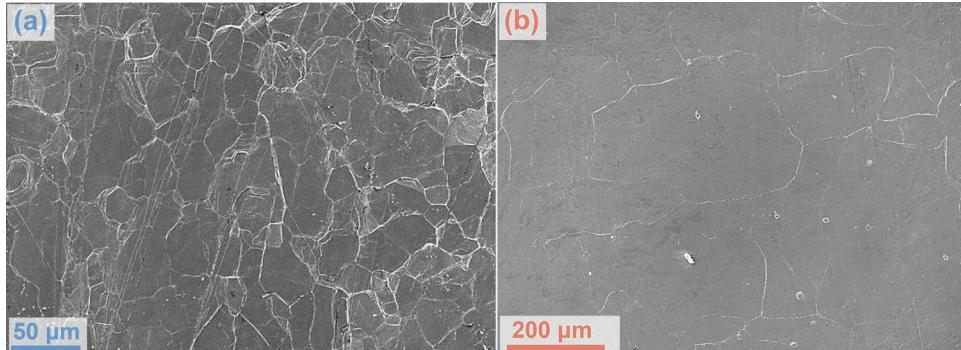
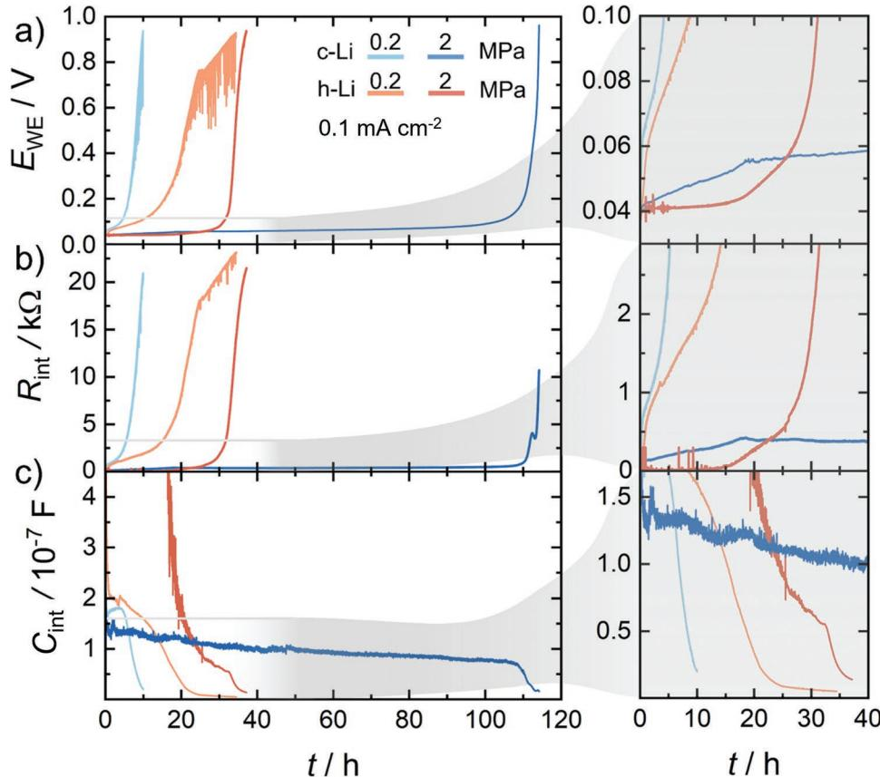
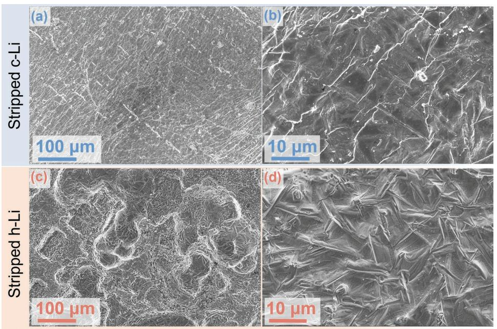
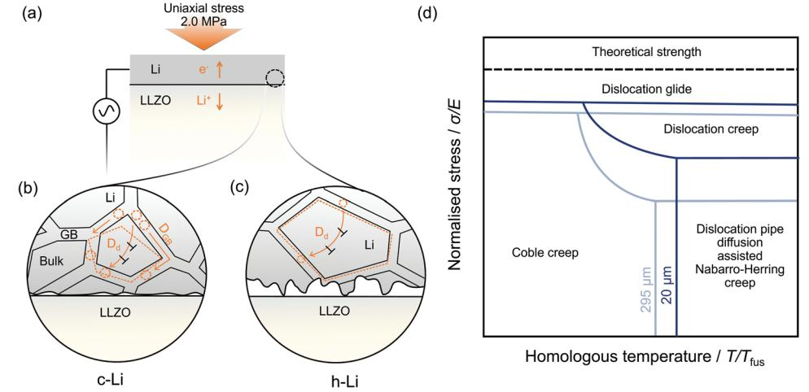

# **Overcoming Anode Instability in Solid-State Batteries through Control of the Lithium Metal Microstructure**

*Dheeraj Kumar Singh,\* Till Fuchs, Christian Krempaszky, Boris Mogwitz, Simon Burkhardt, Felix H. Richter,\* and Jürgen Janek\**

**Enabling the lithium metal anode (LMA) in solid-state batteries (SSBs) is the key to developing high energy density battery technologies. However, maintaining a stable electrode–electrolyte interface presents a critical challenge to high cycling rate and prolonged cycle life. One such issue is the interfacial pore formation in LMA during stripping. To overcome this, either higher stack pressure or binary lithium alloy anodes are used. Herein, it is shown that fine-grained (***d* **= 20 µm) polycrystalline LMA can avoid pore formation by exploiting the microstructural dependence of the creep rates. In a symmetric cell set-up, i.e., LiǀLi6.25Al0.25La3Zr2O12(LLZO)ǀLi, fine-grained LMA achieves > 11.0 mAh cm−2 compared to ≈ 3.6 mAh cm−2 for coarse-grained LMA (***d* **= 295 µm) at 0.1 mA cm−2 and at moderate stress of 2.0 MPa. Smaller diffusion lengths (≈ 20 µm) and higher diffusivity pathway along dislocations (***D***d ≈ 10−7 cm2 s−1 ), generated during cell fabrication, result in enhanced viscoplastic deformation in fine-grained polycrystalline LMA. The electrochemical performances corroborate well with estimated creep rates. Thus, microstructural control of LMA can significantly reduce the required stack pressure during stripping. These results are particularly relevant for "anodefree" SSBs wherein both the microstructure and the mechanical state of the lithium are critical parameters.**

D. K. Singh, T. Fuchs, B. Mogwitz, S. Burkhardt, F. H. Richter, J. Janek Institute of Physical Chemistry Justus-Liebig-University Giessen Heinrich-Buff-Ring 17, D-35392 Giessen, Germany E-mail: dheeraj.k.singh@pc.jlug.de; felix.h.richter@pc.jlug.de; Juergen.Janek@phys.Chemie.uni-giessen.de D. K. Singh, T. Fuchs, B. Mogwitz, F. H. Richter, J. Janek Center for Materials Research (ZfM) Justus-Liebig-University Giessen Heinrich-Buff-Ring 16, D-35392 Giessen, Germany

C. Krempaszky

Institute of Materials Science and Mechanics of Materials Technical University of Munich

Boltzmannstrasse 15, D-85748 Garching, Germany

The ORCID identification number(s) for the author(s) of this article can be found under https://doi.org/10.1002/adfm.202211067.

© 2022 The Authors. Advanced Functional Materials published by Wiley-VCH GmbH. This is an open access article under the terms of the Creative Commons Attribution-NonCommercial-NoDerivs License, which permits use and distribution in any medium, provided the original work is properly cited, the use is non-commercial and no modifications or adaptations are made.

#### **DOI: 10.1002/adfm.202211067**

**1. Introduction**

The drive for the improvement of electric energy storage systems causes long-term interest in lithium metal (3860 mAh g−1 , and −3.04 V vs SHE) based solid-state batteries (SSBs) with high energy density.[1,2] The replacement of conventional flammable organic liquid electrolytes with non-flammable inorganic solid-electrolytes (ISEs, *σ*ion > 1 mS cm−1 ) in SSBs additionally promises enhanced safety and longer cycle life.[3–5] However, maintaining a stable electrode–electrolyte interface is one of the key challenges that currently impedes the development of SSBs.[6,7] At the anode, apart from the solid–electrolyte interface (SEI), and mixed conducting interface (MCI) formation at the LiǀISE interface;[8,9] the interfacial pore formation/accumulation[6] in the lithium electrode severely contributes to increasing impedance and decreasing power density of the cell.

Therefore, overcoming pore formation during stripping is one of the funda-

mental issues that needs to be addressed in the development of fast-(dis)charging SSBs. The so-called critical current for stripping (CCS) in SSBs is still lower than the critical current for plating (CCP).[10] The presence of non-equilibrium defects, i.e., grain boundaries, and dislocations in lithium anode results in inhomogeneous LiǀISE interfacial kinetics resulting in spatially varying interfacial contacts.[11]

Generally, high stack pressures are applied to avoid pore formation during stripping in research. This results in plastic deformation of lithium in contact with the ISEs, thereby maintaining a good interfacial contact.[12,13] The magnitude of the required stress is governed by interfacial roughness, fracture toughness of ISEs, thermomechanical processing history of metal etc.[14–17] In practice, the applied stack pressure should be as low as possible for the following reasons. First, engineering and cost constraints in the fabrication of practical battery packs argue against the use of high stack pressures. Second, sulfur-based superionic conductors,[18–21] which are industrially relevant candidates, possess a low fracture toughness (*K*IC ≤ 0.23 MPa m1/2).[22] High pressures would lead to extensive interfacial fracture within these ISEs, and the resulting cracks would serve as favorable pathways for dendrite growth

through the bulk microstructure.[23–26] In effect, this lowers the critical current density (CCD), i.e., the maximum current density before shorting.[27] Since ceramics in general do not exhibit fatigue,[28] these interfacial fractured zones are expected to significantly affect the long-term cyclability. Additionally, the application of high pressure enhances the propensity for dendrite propagation.[29]

In another approach, binary lithium alloys (with Si, Sn, Al, Mg, As, Bi, Zn, In, etc.) are used.[30,31] Herein, enhanced lithium chemical diffusivity (*DLi* ≈ 10−7 cm2 s−1 ) compared to the much lower self-diffusivity (*D*Li ≈ 10−11 cm2 s−1 ) in pure lithium is utilized to mitigate pore formation issue by facilitating faster interfacial Li flux.[6,32] However, alloy anodes are constrained by both electrochemical as well as mechanical issues that tend to be system specific, and are governed by the width of the homogeneous composition range, mechanical properties of the alloys, density of the secondary component, inter-diffusion kinetics, volume change during alloying–dealloying, etc.[30,31,33] One issue specific to alloys is the drift of redox-potential with composition. For example, the In–Li anode has a potential of 0.62 V versus Li+/Li when > 50 at.% In is present, i.e., in the In–InLi two-phase field.[34] This limits both the theoretical and the practical specific capacity of alloys. Furthermore, alloying would lead to mechanical strengthening (usually of several orders)[35] of the anode material in general. Also, economic aspects pertaining to the cost of the alloying element need to be considered.

Chemo–mechanical degradation of alloy anodes at higher current rates or repeated alloying–dealloying may become another critical issue,[31] e.g., a charge extraction of 1.5 mAh causes the *β* → *α* phase transition in the Mg-70 wt.% Li system, thereby simultaneously compromising mechanical integrity, and kinetics (*Dα* < *Dβ*).[36] Also, alloys are prone to weakening of the redox plateau upon repeated cycling.[31]

Lastly, the alloyed element must itself be stable to oxidation, e.g., the potential window of Mg in Li–Mg alloy is limited as it is oxidized at 1.35 V versus Li+/Li.[37]

Hence, in view of these arguments, the use of (pure) lithium metal is desirable, ideally at very low stack pressure. Herein, we show that creep of polycrystalline lithium can be effectively utilized to overcome the pore formation associated interfacial instability observed during anodic stripping. Creep is a diffusion controlled, and hence, time-dependent plastic (viscoplastic) deformation of materials occurring below yield stresses, and/or at elevated temperature, i.e., high homologous temperatures, *T*H = *T*/*T*fus > 0.3–0.4 (*T* and *T*fus are the temperature of operation and the melting temperature respectively).[38] Creep is a complex process depending particularly on microstructural properties, such as grain size, grain shape, dislocation density, etc., which we aim to control.

In the present work, by implementing fine-grained polycrystalline lithium (*d* = 20 µm), we harness the shorter diffusion lengths (≈20 µm) via high diffusivity pathways (dislocation pipe diffusion, *D*d ≈ 10−7 cm2 s−1 ) to effect higher creep deformation or creep rates. The results are compared to data obtained with coarse-grained polycrystalline lithium (295 µm) anodes. In symmetric transference cells, we perform galvanostatic electrochemical impedance spectroscopy (GEIS) measurements and correlate the overpotential evolution (indicating the contact area) with the creep rates. Lastly, the contributions of different mechanisms viz. diffusional creep (Nabarro–Herring creep and Coble creep) and dislocation creep are discussed, and we assign the predominant operating mechanism under the present experimental conditions. Based on the observed anode performance, we propose microstructure-dependent deformation mechanism map for lithium. We show that an optimized microstructure of lithium metal can significantly reduce the required stack pressure in solid-state batteries.

Here, we chose Li6.25Al0.25La3Zr2O12 (LLZO) SE to study the creep behavior of the synthesized polycrystalline lithium metal for the following reasons. First, the LiǀLLZO interface forms a microscopically smooth interface, thereby eliminating the effect of interfacial load inhomogeneity.[6,14] Second, LLZO is practically stable against lithium,[39–41] and third, LLZO exhibits a higher fracture toughness (among studied ISEs, ≈ 1.25 MPa m1/2) [42] that ensures that the applied pressure will primarily lead to lithium creep without compromising its mechanical stability.

### **2. Results**

In order to depict the advantage of the microstructure assisted enhanced creep behavior of polycrystalline samples,[38,43] symmetric cells, i.e., LiidǀLLZOǀc/h-Li, implementing strained fine-grained lithium or c-Li (*d* = 20 µm), and strained coarsegrained lithium or h-Li *(d* = 295 µm) as working electrode were prepared as depicted schematically in **Figure 1** (see Supporting Information for details). Phase purity of the synthesized LLZO samples was demonstrated via powder X-ray diffraction (PXRD) measurements (Figure S1a, Supporting Information). The obtained diffraction pattern is indexed to the calculated Bragg reflections for the cubic garnet structure with the *Ia*3*d* space group. Cross-sectional scanning electron microscopy (SEM) images of a fractured LLZO pellet indicate that the grains are predominantly in the range of ≈10 µm. Furthermore, Figure S1b (Supporting Information) shows that the microstructure predominantly contains intergranular porosity with small contribution of closed porosity in the grain interiors. This is in accordance with the calculated density (≈93%) of the synthesized pellets as higher density pellets (≈97%) predominantly contain closed porosity. The conductivity of the LLZO pellet under ion-blocking conditions was found to be 0.53 mS cm−1 using potentiostatic electrochemical impedance spectroscopy (PEIS) (Figure S1c, Supporting Information), which is virtually equal with the ionic conductivity due to the very high transference number of lithium ions in LLZO.[44] A representative Nyquist plot at 298 K is shown in Figure S1c (Supporting Information) and is fitted with an equivalent circuit as shown in the inset of the corresponding figure. The equivalent circuit consists of a series connection of two parallel *R*-*Q* (resistor–constant phase element) elements in series with a *Q* element. The high frequency (4 MHz) and the middle frequency (50 kHz) semi-circles are assigned to the bulk and grain boundary transport based on their capacitance values,[45] while the low frequency component is attributed to the double-layer at the AuǀLLZO interface. Arrhenius plots yield the activation **www.advancedsciencenews.com www.afm-journal.de**

**Figure 1.** a) Preparation of fine-grained and coarse-grained polycrystalline lithium metal samples. Fine-/coarse-grained lithium foils of thickness ≈115–120 µm were obtained via mechanical processing of the respective lithium chunks. b) Fabrication of lithium symmetric cells for studying the creep deformation behavior of the anodes. During fabrication, the foils were strained to ≈16%, indicating significant strain hardening. Post-strained state of fine- and coarse-grained working electrodes are referred to as c-Li and h-Li, respectively.

energies, *E*A(bulk) = 0.32 eV and *E*A(GB) = 0.42 eV, for the bulk and the grain-boundary transport, respectively, fitting well to reported values.[6,46,47]

**Figure 2**a,b shows scanning electron microscopy (SEM) images of fine-and coarse-grained polycrystalline lithium foils (Please refer to Figure 1). The grain boundaries and the triple junctions are clearly visible in Figure 2a,b. The mean linear intercept method reveals that the in-plane[48] grain size of fine-grained foil is ≈20 µm (Figure 2a) whereas for the coarsegrained sample it is ≈295 µm (Figure 2b). Similarly, the grain size of the reference lithium foil was determined to be ≈160 µm (Figure S2, Supporting Information). No differences in the XRD patterns were found for fine-and coarse-grained lithium foils (see Figure S3, Supporting Information). For grain size

**Figure 2.** Scanning electron micrographs of a) fine-grained and b) coarse grained lithium foils. Grain boundaries and triple junctions are prominent in the above images.

broadening of reflections to occur, the average grain size must be below 200 nm, which is not the case for the lithium samples used in the present investigation.[49]

In order to investigate the creep deformation behavior of the lithium anodes, continuous temporal evolution of galvanostatic electrochemical impedance spectra (GEIS) under unidirectional stripping conditions of the symmetric cells (LiidǀLLZOǀc/h-Li) was recorded at 0.1 mA cm−2 with a cut-off voltage of 1.0 V. The advantage of GEIS measurements lies in the fact that they allow to follow and to deconvolute the relative contribution of an electrode process to the overall cell impedance under operating conditions. As lithium and LLZO form a chemically stable interface, following the temporal evolution of potential gives information about the interfacial contact loss or equivalently the strain/deformation rate of the lithium metal anode (Figure 1). The measurements were performed at two different stresses, i.e., 0.2 and 2.0 MPa, as creep is an activated process that is facilitated below yield stresses, as discussed later in detail.

The initial Nyquist plot of LiidǀLLZOǀc/h-Li symmetric cells, as shown in **Figure 3**, reflects the bulk and the grain boundary

**Figure 3.** Selected Nyquist plots at different times of the temporally evolving continuous galvanostatic electrochemical impedance spectroscopy (GEIS) measurements of LiidǀLLZOǀc-Li and LiidǀLLZOǀh-Li cells at 0.1 mA cm−2 . GEIS data for each of the cells were separately acquired at two different vertically applied stack pressures of 0.2 and 2.0 MPa. Note: the current is normalized with respect to the initial contact area of lithium electrode.

(GB) contribution to the total impedance. The absence of any interfacial contribution is in accordance with the previously reported data for LiǀLLZO, indicating combined effects of chemical stability of lithium against LLZO, and the applied pressure during cell fabrication on interfacial contacts. The obtained initial impedance is fitted with a series connection of two parallel *R–Q* elements for bulk and GB contribution, respectively, as shown in the inset of the Figure 3a. The assignment is based on the magnitude of the calculated values for bulk and GB capacitances, i.e., *C*Bulk ≈ 10−11 F and *C*GB ≈ 10−8 F.[45]

Selected Nyquist plots at different times for c/h-Li at 0.2 and 2.0 MPa resulting from continuous GEIS measurements are shown in Figure 3. Clearly, an additional contribution manifests and grows progressively with time for both types of anodes, i.e., c-Li and h-Li. The rates strongly differ and depend on the sample and applied stress. This component is attributed to a constriction resistance as the interfacial contact gradually diminishes. An additional parallel *R–Q* combination is added to the above circuit to account for this contribution (inset of Figure 3).

The corresponding temporal potential profiles for the continuous GEIS measurements are shown in **Figure 4**a. At a stack pressure of 0.2 MPa, the c-Li anode exhibits a faster contact loss (after ≈ 10.0 h) compared to the h-Li anode (after ≈ 34.5 h). This indicates that the deformation rates at 0.2 MPa are different for c-Li and h-Li. The time until contact loss in the potential profile is an indicator of the differences in the mechanical strengths of c-Li and h-Li since stress is constant (0.2 MPa) in both cases (as discussed later in detail). Therefore, h-Li is deformed more (lower strength) compared to c-Li and exhibits a higher strain rate. At 2.0 MPa, both anode materials show longer discharge until the cut-off potential (depletion) is reached. In this case, however, c-Li exhibits a longer stripping time (≈114 h) compared to h-Li (≈37 h). Note that the trend in interfacial resistance (*R*int) is similar to that of the voltage profile indicating the exclusive contribution of interfacial contact–loss to the observed overpotential. This is discussed below in detail.

The temporal evolution of the interfacial contact-loss imposed impedance (*R*int) obtained by fitting GEIS spectra is shown in Figure 4b. The trend in *R*int is analogous to the voltage profile, indicating the exclusive contribution of interfacial contact–loss to the observed overpotential. The relationship is not one-to-one as the overpotential also includes the resistance contribution from bulk transport in the ISE (*R*ohmic = 1/*σ*ion ∙*L*/*A*), and across the interface (*R*int) as analyzed in Figure 3. The origin of *R*int is attributed to the progressively depleting interfacial contacts upon continuous unidirectional stripping, resulting in an ensemble of constrictions or point contacts.[50,51] The impedance of such ensembles can be approximated as *R*int ≈ 1/(2*Ndσ*ion) (*σ*ion is the ionic conductivity of the ISE, *N* is the number of non-interfering point contacts, and *d* is the diameter of each contact).[52] Clearly, upon progressive cycling, *N* decreases as does *d*, resulting in the increase of *R*int. The extracted temporal interfacial capacitances (*C*int) are shown in Figure 4c. The capacitance is the result of progressively depleting contacts and concurrently evolving gaps.[52,53] Clearly, the c-Li sample exhibits faster decrease in capacitance at 0.2 MPa due to greater degree of pore accumulation (as gaps have lower permittivity) that complements the trend of *R*int.

**Figure 4.** a) Potential versus time profiles during GEIS measurements for c-Li and h-Li at 0.2 and 2.0 MPa. b) Corresponding temporal evolution of the interfacial contact-loss imposed impedance (*R*int) and c) the corresponding extracted interfacial capacitances (*C*int) obtained by fitting of GEIS spectra shown in Figure 3. The right side of the graphs depicts magnified data of the first 40 h during stripping.

To correlate the electrochemical measurements with the morphology of the stripped electrodes, SEM images of the stripped working c/h-Li electrodes were acquired. After the cut-off potential of 1.0 V is reached, electrodes stripped at a stack pressure of 0.2 MPa were detached without damage. On the contrary, if 2.0 MPa was applied, it was not possible to peel of the electrodes, even after 1 V is reached. Comparison of SEM images of the stripped anodes at low magnification indicates that the c-Li exhibits relatively uniform stripping (**Figure 5**a) whereas h-Li has higher roughness with pores in the dimensions of tens of microns (Figure 5c). This fits well with the electrochemical data as a higher amount of charge (≈3.41 mAh cm-2 ) was extracted from the surface of h-Li at 0.2 MPa (Figure 4) compared to ≈1.00 mAh cm-2 for c-Li. High magnification images (Figure 5b,d) reveal the presence of diminished contact points for both c/h-Li anodes as expected for constrictions (Figures 3 and 4a).

### **3. Discussion**

The interfacial contact is governed by either time-independent plastic flow via glide and/or time-dependent plastic flow (climb creep and diffusional creep) depending on the magnitude of the applied stress relative to yield strength, and the microstructure (grain size, grain shape, dislocation density, etc.). The microstructure evolution is influenced by the thermomechanical processing history of the metal. Since the yield strength of the material depends on the microstructure and is significantly affected by the applied stress during cell fabrication, we first discuss the influence of above factors on the yield strengths of c/h-Li prior to electrochemical measurements. Thereafter, we correlate the effects of the above factors on the deformation rates with the observed electrochemical data using relevant constitutive equations for the creep.

#### **3.1. Effect of the Grain Size on the Yield Strengths of c/h-Li**

Strengthening of metals involves impeding/reducing dislocation mobility. Plastic flow is mediated by the dislocation glide whereas grain boundaries act as barriers to the dislocation motion.[54] The stochastically oriented neighboring grains with their randomly oriented slip systems require higher stresses for the dislocations to cross the grain boundaries. As a result, dislocations tend to pile up at the grain boundaries. Therefore, the higher the number density of the grain boundaries, the greater is the impediment, resulting in enhanced strength. This type of strengthening is referred to as grain boundary strengthening, and it is described empirically by the Hall–Petch relationship,[55,56]

**Figure 5.** a) Low and b) high magnification SEM images of the stripped c-Li working electrode, acquired after the GEIS measurements at 0.2 MPa. (c) and (d) are the corresponding low and high magnification SEM micrographs for the stripped h-Li electrode.

$$
\sigma_{y} = \sigma_{i} + k_{y} d^{-1/2}
$$
 (1)

where *σ*y is the yield strength of the metal with the mean grain size *d*, *σ*i is the inherent lattice friction or Peierls–Nabarro stress, and *k*y is the strengthening coefficient. Therefore, according to Equation (1), c-Li is expected to have higher yield strength compared to h-Li on account of its smaller grain size.

### **3.2. Effect of the Applied Stress during Cell Fabrication on the Yield Strengths of c/h-Li**

An applied stress of 362 MPa during cell fabrication exceeds the yield strength of bulk lithium (*σ*y ≈ 0.8 MPa). Therefore, during isostatic compression (Figure 1), significant plastic deformation occurs (≈16% plastic strain), and the dislocation density increases in lithium metal via dislocation generation either at the grain boundaries or predominantly via the Frank–Read mechanism (a dislocation multiplication process involving shearing of the pinned dislocation and subsequent rearrangement).[54,57,58] This further impedes dislocation motion and additional stress is required to cause plastic flow. This results in strengthening of the metal, and is referred to as work hardening or strain hardening.[28] A dislocation density on the order of around 1016 m−2 can be expected during this step. The increase in required shear stress (Δ*τ*) to overcome the dislocation barrier is proportional to dislocation density, *ρ* and is given by:[59]

$$
\Delta \tau \propto G b \sqrt{\rho} \tag{2}
$$

where *α* is a constant, *G* is the shear modulus, *b* is the length of the Burgers vector, and *ρ* is the dislocation density. The influence of the increased dislocation density on creep deformation is discussed later in detail.

#### **3.3. Effect of Grain Size on Dislocation Density**

Investigations by Conrad et al. on the body centered cubic structure of niobium, a structure-analog of lithium showed that for a given strain, fine-grained polycrystalline samples have higher dislocation densities compared to coarse-grained specimen (as *ρ* varies as 1/*d*) on account of a smaller free slip length.[60,61] Therefore, by analogy, it is expected that c-Li shows an increased strain hardening rate compared to h-Li.

Therefore, the overall strengthening can be summarized by as:

$$
\sigma_{y} = \sigma_{i} + k_{y}d^{-1/2} + \alpha Gb\sqrt{\rho}
$$
\n(3)

where *α* is a constant, *σ*i is the inherent lattice friction,[58] the second and third terms on the right hand side of the above equation are the contributions from grain boundary strengthening, and strain hardening, respectively.

From the above considerations, it is clear that c-Li has a much higher strength compared to large bulk lithium and h-Li, i.e., *σ*y (c-Li) > *σ*y (h-Li) > *σ*y (bulk). In fact, recent work indicates that the effective yield strength of similarly processed coarse-grained lithium foil is (16 ± 2) MPa.[12] Therefore, applied stresses of 0.2 and 2.0 MPa are below the yield strengths of both c-Li and h-Li. Hence, the strengths of the lithium implemented in the electrochemical setup are different from those obtained from bulk mechanical measurements.

### **4. Creep Deformation Mechanism**

Various deformation mechanisms operate simultaneously during the creep of a polycrystalline sample and contribute to **www.advancedsciencenews.com www.afm-journal.de**

its plastic deformation. The set of parameters viz. temperature, applied stress, microstructure, i.e., grain size and grain shape, dislocation density, etc., determines that creep mechanism is predominant or rate-controlling.[62]

At low stresses and low temperatures, the net flux of atoms predominantly takes place along the grain boundaries (on account of its lower activation energy for migration), resulting in the change in the grain shape. Under this condition, the diffusion along the grain boundaries contributes toward predominant deformation and is referred to as Coble creep. The constitutive equation for the steady-state, grain boundary assisted diffusional creep is given by as:[63]

$$
\dot{\varepsilon}_{\rm C} = k_2 \left( \frac{D_{\rm GB}b}{d^3} \right) \left( \frac{Eb^3}{kT} \right) \left( \frac{\sigma}{E} \right) \tag{4}
$$

At higher temperatures, it represents the net transport of atoms through the lattice that contributes predominantly to creep and is known as the Nabarro–Herring creep. The constitutive equation for the steady-state lattice diffusional creep or Nabarro–Herring creep is given by:[63]

$$
\dot{\varepsilon}_{\rm NH} = k_1 \left( \frac{D_{\rm L}}{d^2} \right) \left( \frac{Eb^3}{kT} \right) \left( \frac{\sigma}{E} \right) \tag{5}
$$

At higher stresses, the non-conservative motion of edge dislocations, either via absorption or emission of vacancies (referred to as climb), results in the macroscopic plastic deformation of the material. If vacancy diffusion is assisted via low activation dislocation regions, then it is referred to as pipe diffusion-controlled dislocation climb creep (DCC) or power law creep. The constitutive relationship is given by:[63]

$$
\dot{\varepsilon}_{\rm DCC} = k_3 \left( \frac{D_d}{b^2} \right) \left( \frac{\sigma}{E} \right)^n \tag{6}
$$

where εNH, C ε , and DCC ε are the strain rates for Nabarro–Herring, Coble and dislocation climb creep respectively, *ki* is a material constant, *D*L and *D*GB are the lattice diffusivity and grain boundary diffusivity, respectively, *d* is the grain size, *E* is Young's modulus, *b* is the length of the Burgers vector, *k* is the Boltzmann constant, *T* is the absolute temperature, *n* is the stress exponent for the power-law creep, and *σ* is the applied stress (see Table S1, Supporting Information, for details).

Both Coble creep and Nabarro–Herring creep exhibit a strong dependence on the microstructure, i.e., grain size, and depend linearly on the stress (Equations 4,5) whereas dislocation climb creep exhibits a power-law dependence on stress (Equation 6).

When all the creep mechanisms operate simultaneously at a given *T*, *σ*, and *d*, then the total strain rate is determined by the sum of the individual strain rates:[64]

$$
\dot{\varepsilon}_{\text{overall}} = \sum \dot{\varepsilon}_i \tag{7}
$$

From Equation (7), it is clear that the fastest deformation process governs the overall creep rate.

#### **4.1. Creep Mechanism at 2.0 MPa**

To determine the predominant deformation mechanism under the given conditions, we calculated the strain rates for each of the above processes using constitutive Equations (4–6) (see Supporting Information for details). We substituted *D*d for *D*L in Equation (5) to account for strain hardening (≈ 16% strain) as discussed above. This leads to an upper bound estimation of Nabarro–Herring creep rate. For c-Li (*d* = 20 µm) at 2.0 MPa, we calculate εNH (4.2 × 10−2 s−1 ) > DCC ε (0.9 × 10−2 s−1 ) > C ε (2.3 × 10−6 s−1 ) whereas we obtain DCC ε (0.9 × 10−2 s−1 ) > εNH (1.9 × 10−4 s−1 ) > C ε (7.1 × 10−10 s−1 ) for h-Li (*d* = 295 µm), see the Supporting Information for details. We like to note that the strain rate for DCC calculated from Equation (4) is expected to be higher compared to the actual operating rate as it does not consider the effect of dislocation density.

The strain rate calculations at 2.0 MPa reveal the following: i) the strain rates are higher in c-Li compared to h-Li, ii) dislocation pipe diffusion assisted Nabarro–Herring creep is the predominant deformation mechanism in c-Li along with the dislocation pipe diffusion assisted DCC, whereas the latter is the primary deformation mechanism in the h-Li, and iii) Coble creep accounts for much smaller strain rates in either microstructure compared to the other two mechanisms and is around four orders smaller in h-Li compared to c-Li.

The calculated higher strain rate in c-Li at 2.0 MPa corroborates well with the electrochemical data (Figure 4a). The combined higher strain rates via Nabarro–Herring creep and DCC (≈5.7 times higher compared to h-Li) ensures a stable interface for ≈110 h, via faster deformation in the bulk of c-Li as opposed to ≈35 h for h-Li. The smaller diffusion lengths (equal to the grain size *d* ≈ 20 µm) in c-Li along fast diffusion pathways (dislocation pipe diffusion, *D*d = 8.8 × 10−7 cm2 s−1 , see the Supporting Information for detailed calculations) lead to an increased transport of atoms from one grain boundary to the other under a local stress gradient (**Figure 6**a–c). Therefore, Nabarro–Herring creep causes a higher strain rate in c-Li compared to h-Li wherein the diffusion length is ≈ 15 times longer. Also, the contribution of Coble creep to the overall deformation is small on account of much smaller cross-sectional area over which they operate. Although it affects a three order higher strain rate in the c-Li microstructure on account of the much higher density of grain boundaries (Figure 6b,c). The above observation is summarized in the form of the proposed deformation mechanism map that allows to visualize the predominant microscopic deformation mechanism effecting creep in the stress-temperature space, indicating the effect of microstructure on the deformation pathway (Figure 6d).

#### **4.2. Creep Mechanism at 0.2 MPa**

As above, to determine the predominant deformation mechanism, the strain rates for different processes were calculated and compared using Equations (4–6). Therefore, at 0.2 MPa and for c-Li (*d* = 20 µm), we obtain the following εNH (4.2 × 10−3 s−1 ) > C ε (2.3 × 10−7 s−1 ) > DCC ε (2.3 × 10−9 s−1 ) whereas we obtain εNH (1.9 × 10−5 s−1 ) > DCC ε (2.3 × 10−9 s−1 ) > C ε (7.1 × 10−11 s−1 ) for h-Li (*d* = 295 µm).

**Figure 6.** a) Anodic side of the symmetric cell, i.e., LiidǀLLZOǀc/h-Li. The interfacial region indicated by the dotted black circle is expanded in (b) and (c). Schematic indicating creep deformation in the bulk of the lithium microstructure, in the vicinity of the interface for (b) c-Li and (c) h-Li. b) At 2.0 MPa, Nabarro–Herring creep via dislocation pipe diffusion (*D*d, indicated by the curved solid orange line) being the predominant deformation mechanism. Higher flux of atoms (indicated by the dotted orange circles) is realized on account of shorter diffusion length (*d* = 20 µm) from one grain boundary to the other in the direction of the stress gradient. Dislocation pipe diffusion assisted dislocation climb creep also shown in (b). Coble creep mechanism via grain boundary predominated microstructure of c-Li results in significantly higher atomic transport along the grain boundaries (*D*GB, indicated by the solid orange lines in (b)) resulting in higher strain rate in (b) c-Li compared to (c) h-Li. c) Dislocation pipe diffusion assisted dislocation climb creep is the predominant deformation mechanism in h-Li followed by Nabarro–Herring creep via dislocation pipe diffusion (shown by the curved solid orange line). The effect of higher strain rate in c-Li compared to h-Li is shown by the dotted orange lines indicating the shape change of a representative grain during creep in either microstructure viz. b) c-Li and c) h-Li. d) Schematic of the proposed deformation mechanism map for lithium indicating the effect of the grain size.

The strain rate evaluation reveals the following: i) the order of the strain rates in either microstructure at 0.2 MPa is smaller compared to 2.0 MPa, ii) dislocation pipe diffusion assisted Nabarro–Herring creep is the major deformation mechanism in either microstructure, iii) Coble creep, although much smaller, causes greater deformation in c-Li, and iv) the deformation rate in c-Li is two orders of magnitude higher compared to h-Li.

The effect of comparatively lower strain rates at 0.2 MPa can be seen from Figure 4a, wherein both c-Li and h-Li at 2.0 MPa maintain a stable interface over longer times. As expected, at lower stresses, diffusional creep via Nabarro–Herring dominates in both microstructures (Equation (5)). The higher grain boundary density leads to comparably higher strain rate in c-Li via Coble creep compared to h-Li (Equation (4)). However, contrary to the calculated strain rates (εNH for c-Li > εNH for h-Li), h-Li is observed to deform faster compared to c-Li (Figure 4a). The apparent discrepancy between the calculated strain rates and the observed electrochemical behavior can be understood by considering the different deformation rates in the bulk and at the interface at 0.2 MPa as shown in Figure S4 (Supporting Information).

We divide the deformation in the LMA into two regimes viz.: i) deformation at the interface and ii) deformation in the vicinity of the interface or in the bulk. The logic of this subdivision stems from the fact that the inhomogeneous stripping (Figure 5; Figure S4, Supporting Information) coupled with much smaller creep rates in the bulk leads to progressively decreasing interfacial contact area at 0.2 MPa (Figure 4). Depleting contacts result in progressively increasing contact stresses, i.e., stress amplification on account of low load bearing area whereas comparably lower and uniform stress exist in the bulk (Figure S4, Supporting Information). Therefore, the deformation at the interface progressively switches from elastic and mixed elastic-plastic to plastic flow via glide with time.

Therefore, at the interface, the contact is mediated by the competition between progressively decreasing contact (in response to the applied current) and continuously increasing contact stresses resulting in overpotential fluctuations as evident from Figure S5 (Supporting Information, magnified view of Figure 4a at 0.2 MPa). The amplitude of the overpotential fluctuations increases with time and its magnitude is an indicator of the progressively increasing contact stresses (far exceeding the strengths of Li). It is to be noted that the amplitude of the fluctuations also depends on the contact geometry and the strength of Li. Figure S5 (Supporting Information) shows that at higher overpotentials, the amplitude of fluctuations is larger in h-Li. This can be reasoned from the SEM images (Figure 5) of the stripped lithium, wherein c-Li shows higher fraction of nominally flat contact regions (and hence higher load bearing area) compared to h-Li, which shows low density of isolated point contacts. This, when combined with low strength of h-Li, results in higher plastic deformation compared to c-Li.

The combined strain rates for the plastic deformation at the interface and viscoplastic deformation (creep) in the bulk of the lithium metal anode is unable to cope up with the imposed current at 0.2 MPa as the overpotential builds up progressively right from the beginning of the electrochemical measurements (Figure 4a).

The deformation at 0.2 MPa in c/h-Li can further be divided into two parts viz.: regime I) The low overpotential regime (*E* < 0.1 V) wherein the approximation of contact stress (*σ*contact) ≈ applied stress (*σ*applied) holds true, and regime II) the high overpotential regime (*E* > 0.4 V) wherein contact stress (a function of time, i.e., *σ*contact (*t*) >> *σ*applied applies. In this regime, local pressure exceeds the strength of the lithium, i.e., *σ*contact (*t*) > *σ*y, resulting in the voltage fluctuations as discussed above whereas in regime I, we have *σ*contact < *σ*y.

Since the overpotential is directly related to the interfacial contact area, comparing the initial *E* versus *t* slopes gives an idea about the strengths of the material. Figure 4a shows that the overpotential for c-Li at any given time *t* in regime I is higher compared to h-Li and, also the initial slope (*E* vs *t*) for c-Li is larger indicating relatively faster contact loss (or slower deformation) on account of its enhanced strength via grain boundary strengthening and strain hardening, as discussed in Section 3.1 and 3.2. The higher strain rates in the bulk at 2.0 MPa do not allow for the development of stress amplification, resulting in the absence of voltage fluctuations as observed at 0.2 MPa (Figure 4a).

### **5. Relevance in "Anode-free" Lithium Metal Batteries**

Although it appears as if the present investigation highlights the critical role of lithium microstructure only during the first stripping cycle; however, we believe that the present results also provide fundamental insight into the role of the microstructure of cathodically deposited (plated) lithium in "anode-free" SSBs.[65] The large volume expansion during plating exerts high stress on the deposited lithium and thus to the interface.[66–68] This can lead to a microstructural state (i.e., dislocation density, grain size, etc.) either similar or different to the present study, thus dictating the diffusion and deformation behavior in a complex way. The study of the lithium microstructure in enabling "anode-free" cell configurations becomes highly important, and we assume that it is strongly influenced by the microstructure of the current collector (on account of different lithium surface diffusion barriers and adsorption energies) and on the plating rate.[67,69]

### **6. Conclusions**

The influence of the lithium metal microstructure on the anodic pore formation during stripping (discharge) has been studied experimentally. Fine-grained (c-Li, *d* = 20 µm) and coarse-grained polycrystalline lithium (h-Li, *d* = 295 µm) anodes were prepared and stripped in a symmetric cell set-up at two different pressures viz., 0.2 and 2.0 MPa at 0.1 mA cm−2. The pressure-dependent electrochemical performance was then corroborated with creep rates calculated via established constitutive equations from creep mechanics. The deformation mechanism in the lithium anode has significantly influenced its thermo-mechanical processing history, i.e., grain boundary strengthening and strain hardening (increase in dislocation density). Our investigations indicate that the mechanical properties of lithium anodes in SSBs are different from that of bulk (single crystalline) lithium. We show that dislocation pipe diffusion assisted Nabarro–Herring creep followed by dislocation climb creep effects a higher strain rate in fine-grained polycrystalline lithium (c-Li) at 2.0 MPa resulting in a stable interface for ≈110 h compared to ≈ 5 h for coarse-grained polycrystalline lithium (h-Li). Dislocation pipe diffusion assisted climb creep is the predominant deformation pathway in h-Li, and the observed electrochemical behavior is supported by the strain rate calculations that are ≈5.7 times smaller compared to strain rates in c-Li. The relative strengths of c/h-Li and the overpotential govern the deformation behavior at 0.2 MPa. In the low overpotential regime (<0.1 V), the interfacial contact is governed by the strength of the material whereas at the higher potential (>0.4 V), the slow creep deformation in the bulk leads to stress inhomogeneity at the interface resulting predominantly in the plastic deformation via glide. Based on the observed electrochemical performance, we propose a microstructure-dependent deformation mechanism map for lithium. We thus show that microstructural control of plated lithium metal may help to significantly reduce the stack pressure in solid-state batteries.

## **Supporting Information**

Supporting Information is available from the Wiley Online Library or from the author.

### **Acknowledgements**

D.K.S. and T.F. contributed equally to this work. Financial support from the Federal Ministry of Education and Research (Bundesministerium für Bildung und Forschung, BMBF) within the FESTBATT consortium (projects 03XP0177A and 03XP0430A) is gratefully acknowledged, as well as within the US-German joint program supported by the US Department of Energy (DOE) and German Federal Ministry of Education and Research (BMBF) within the project "LiSI", grant identifier 03XP0224E.

Open access funding enabled and organized by Projekt DEAL.

### **Conflict of Interest**

The authors declare no conflict of interest.

### **Data Availability Statement**

The data that support the findings of this study are available from the corresponding author upon reasonable request.

### **Keywords**

creep, diffusion, interfaces, lithium metal anodes, microstructures

Received: September 23, 2022 Published online: November 9, 2022

[2] T. Krauskopf, F. H. Richter, W. G. Zeier, J. Janek, *Chem. Rev.* **2020**, *120*, 7745.

[1] P. Albertus, S. Babinec, S. Litzelman, A. Newman, *Nat. Energy* **2018**, *3*, 16.

**www.advancedsciencenews.com www.afm-journal.de**

- [3] T. M. Bandhauer, S. Garimella, T. F. Fuller, *J. Electrochem. Soc.* **2011**, *158*, R1.
- [4] X. Liu, D. Ren, H. Hsu, X. Feng, G.-L. Xu, M. Zhuang, H. Gao, L. Lu, X. Han, Z. Chu, J. Li, X. He, K. Amine, M. Ouyang, *Joule* **2018**, *2*, 2047.
- [5] J. Janek, W. G. Zeier, *Nat. Energy* **2016**, *1*, 16141.
- [6] T. Krauskopf, H. Hartmann, W. G. Zeier, J. Janek, *ACS Appl. Mater. Interfaces* **2019**, *11*, 14463.
- [7] S. Wenzel, T. Leichtweiss, D. Krüger, J. Sann, J. Janek, *Solid State Ionics* **2015**, *278*, 98.
- [8] S. Wenzel, S. Randau, T. Leichtweiß, D. A. Weber, J. Sann, W. G. Zeier, J. Janek, *Chem. Mater.* **2016**, *28*, 2400.
- [9] P. Bron, B. Roling, S. Dehnen, *J. Power Sources* **2017**, *352*, 127.
- [10] J. Kasemchainan, S. Zekoll, D. S. Jolly, Z. Ning, G. O. Hartley, J. Marrow, P. G. Bruce, *Nat. Mater.* **2019**, *18*, 1105.
- [11] S. S. Shishvan, N. A. Fleck, V. S. Deshpande, *J. Power Sources* **2021**, *488*, 229437.
- [12] X. Zhang, Q. J. Wang, K. L. Harrison, S. A. Roberts, S. J. Harris, *Cell Rep* **2020**, *1*, 100012.
- [13] M. J. Wang, R. Choudhury, J. Sakamoto, *Joule* **2019**, *3*, 2165.
- [14] B. N. J. Persson, *Surf. Sci. Rep.* **2006**, *61*, 201.
- [15] C. Xu, Z. Ahmad, A. Aryanfar, V. Viswanathan, J. R. Greer, *Proc. Natl. Acad. Sci. USA* **2016**, *114*, 57.
- [16] M. Klinsmann, F. E. Hildebrand, M. Ganser, R. M. McMeeking, *J. Power Sources* **2019**, *442*, 227226.
- [17] B. Verlinden, J. Driver, I. Samajdar, R. D. Doherty, *Thermo-Mechanical Processing of Metallic Materials*, Elsevier Science, Amsterdam **2007**.
- [18] P. R. Rayavarapu, N. Sharma, V. K. Peterson, S. Adams, *J. Solid State Electrochem.* **2012**, *16*, 1807.
- [19] M. A. Kraft, S. P. Culver, M. Calderon, F. Böcher, T. Krauskopf, A. Senyshyn, C. Dietrich, A. Zevalkink, J. Janek, W. G. Zeier, *J. Am. Chem. Soc.* **2017**, *139*, 10909.
- [20] N. Kamaya, K. Homma, Y. Yamakawa, M. Hirayama, R. Kanno, M. Yonemura, T. Kamiyama, Y. Kato, S. Hama, K. Kawamoto, A. Mitsui, *Nat. Mater.* **2011**, *10*, 682.
- [21] Y. Kato, R. Saito, M. Sakano, A. Mitsui, M. Hirayama, R. Kanho, *J. Power Sources* **2014**, *271*, 60.
- [22] F. P. McGrogan, T. Swamy, S. R. Bishop, E. Eggleton, L. Porz, X. Chen, Y.-M. Chiang, K. J. V. Vliet, *Adv. Energy Mater.* **2017**, *7*, 1602011.
- [23] P. Barai, K. Higa, A. T. Ngo, L. A. Curtiss, V. Srinivasan, *J. Electrochem. Soc.* **2019**, *166*, A1752.
- [24] X. Tingdong, Z. Lei, *Philos. Mag. Lett.* **2004**, *84*, 225.
- [25] E. J. Cheng, A. Sharafi, J. Sakamoto, *Electrochim. Acta* **2017**, *223*, 85.
- [26] D. K. Singh, A. Henss, B. Mogwitz, A. Gautam, J. Horn, T. Krauskopf, S. Burkhardt, J. Sann, F. H. Richter, J. Janek, *Cell Reports Phys. Sci.* **2022**, *3*, 101043.
- [27] A. Sharafi, H. M. Meyer, J. Nanda, J. Wolfenstine, J. Sakamoto, *J. Power Sources* **2016**, *302*, 135.
- [28] J. Roesler, H. Harders, M. Baeker, *Mechanical Behaviour of Engineering Materials: Metals, Ceramics, Polymers, and Composites*, Springer, Berlin, Heidelberg **2007**.
- [29] J.-M. Doux, H. Nguyen, D. H. S. Tan, A. Banerjee, X. Wang, E. A. Wu, C. Jo, H. Yang, Y. S. Meng, *Adv. Energy Mater.* **2020**, *10*, 1903253.
- [30] P. Kurzweil, K. Brandt, in (Eds. J. Garche, Brandt Systems, and Applications, K. B. T.-E. P. S. F.) pp. 47–82, Elsevier, Amsterdam **2019**, <https://doi.org/10.1016/B978-0-444-63777-2.00003-7>.
- [31] J. Yang, J. l. Wang, in (Eds. J. B. T.-E. of E. P. S. Garche), pp. 225–236, (Elsevier, Amsterdam **2009**, [https://doi.org/10.1016/](https://doi.org/10.1016/B978-044452745-5.00190-8) [B978-044452745-5.00190-8.](https://doi.org/10.1016/B978-044452745-5.00190-8)
- [32] T. Krauskopf, B. Mogwitz, C. Rosenbach, W. G. Zeier, J. Janek, *Adv. Energy Mater.* **2019**, *9*, 1902568.
- [33] A. Anani, R. A. Huggins, *J. Power Sources* **1992**, *38*, 351.
- [34] A. L. Santhosha, L. Medenbach, J. R. Buchheim, P. Adelhelm, *Batter Supercaps* **2019**, *2*, 524.
- [35] R. W. Cahn, P. Haasen, *Physical Metallurgy*, 4th ed., (Eds: R. W. Cahn, P. Haasen), Elsevier Science, Amsterdam **1996**.
- [36] Y. Zhang, K. S. R. Chandran, M. Jagannathan, H. Z. Bilheux, J. C. Bilheux, *J. Electrochem. Soc.* **2016**, *164*, A28.
- [37] Z. Shi, M. Liu, D. Naik, J. L. Gole, *J. Power Sources* **2001**, *92*, 70.
- [38] H. J. Frost, M. F. Ashby, *Deformation-Mechanism Maps: The Plasticity and Creep of Metals and Ceramics*, Elsevier Science Limited, Amsterdam **1982**.
- [39] Y. Zhu, G. J. Connell, S. Tepavcevic, P. Zapol, R. Garcia-Mendez, N. J. Taylor, J. Sakamoto, B. J. Ingram, L. A. Curtiss, J. W. Freeland, D. D. Fong, N. M. Markovic, *Adv. Energy Mater.* **2019**, *9*, 1803440.
- [40] Y. Zh, X. He, Y. Mo, *ACS Appl. Mater. Interfaces* **2015**, *7*, 23685.
- [41] J. G. Connell, T. Fuchs, H. Hartmann, T. Krauskopf, Y. Zhu, J. Sann, R. Garcia-Mendez, J. Sakamoto, S. Tepavcevic, J. Janek, *Chem. Mater.* **2020**, *32*, 10207.
- [42] J. Wolfenstine, H. Jo, Y.-H. Cho, I. N. David, P. Askeland, E. D. Case, H. Kim, H. Choe, J. Sakamoto, *Mater. Lett.* **2013**, *96*, 117.
- [43] P. M. Sargent, M. F. Ashby, *Scr. Metall.* **1984**, *18*, 145.
- [44] H. Buschmann, J. Dölle, S. Berendts, A. Kuhn, P. Bottke, M. Wilkening, P. Heitjans, A. Senyshyn, H. Ehrenberg, A. Lotnyk, V. Doppel, L. Kienle, J. Janek, *Phys. Chem. Chem. Phys.* **2011**, *13*, 19378.
- [45] J. T. S. Irvine, D. C. Sinclair, A. R. West, *Adv. Mater.* **1990**, *2*, 132.
- [46] T. Fuchs, B. Mogwitz, S.-K. Otto, S. Passerini, F. H. Richter, J. Janek, *Batter Supercaps* **2021**, *4*, 1145.
- [47] Y. Zhang, F. Chen, J. Li, L. Zhang, J. Gu, D. Zhang, K. Saito, Q. Guo, P. Luo, S. Dong, *Electrochim. Acta* **2018**, *261*, 137.
- [48] G. F. V. Voort, *Prakt. Metallogr.* **2013**, *50*, 239.
- [49] U. Holzwarth, N. Gibson, *Nat. Nanotechnol.* **2011**, *6*, 534.
- [50] J. Fleig, J. Maier, *Solid State Ionics* **1996**, *85*, 17.
- [51] J. Fleig, J. Maier, *Solid State Ionics* **1996**, *86–88*, 1351.
- [52] J. Fleig, J. Maier, *J. Electroceramics* **1997**, *1*, 73.
- [53] J.-H. Hwang, K. S. Kirkpatrick, T. O. Mason, E. J. Garboczi, *Solid State Ionics* **1997**, *98*, 93.
- [54] J. P. Hirth, J. Lothe, *Theory of Dislocations*, Wiley, New Jersey, USA **1982**.
- [55] E. O. Hall, *Proc. Phys. Soc., London, Sect. B* **1951**, *64*, 747.
- [56] N. J. Petch, *J. Iron Steel Inst.* **1953**, *174*, 25.
- [57] F. C. Frank, W. T. Read, *Phys. Rev.* **1950**, *79*, 722.
- [58] A. H. Cottrell, *Prog. Met. Phys.* **1953**, *4*, 205.
- [59] R. W. Hertzberg, *Deformation and Fracture Mechanics of Engineering Materials*, Wiley, New Jersey, USA **1996**.
- [60] H. Conrad, S. Feuerstein, L. Rice, *Mater. Sci. Eng.* **1967**, *2*, 157.
- [61] J. A. El-Awady, *Nat. Commun.* **2015**, *6*, 5926.
- [62] R. W. Hertzberg, R. P. Vinci, J. L. Hertzberg, *Deformation and Fracture Mechanics of Engineering Materials*, 5th ed., Wiley, New Jersey, USA **2012**.
- [63] O. A. Ruano, J. Wadsworth, O. D. Sherby, *J. Mater. Sci.* **1985**, *20*, 3735.
- [64] W. J. Kim, H. T. Jeong, *J Mater Res Technol* **2020**, *9*, 13434.
- [65] B. J. Neudecker, N. J. Dudney, J. B. Bates, *J. Electrochem. Soc.* **2000**, *147*, 517.
- [66] M. Motoyama, M. Ejiri, Y. Iriyama, *J. Electrochem. Soc.* **2015**, *162*, A7067.
- [67] V. Pande, V. Viswanathan, *ACS Energy Lett.* **2019**, *4*, 2952.
- [68] A. J. Louli, M. Genovese, R. Weber, S. G. Hames, E. R. Logan, J. R. Dahn, *J. Electrochem. Soc.* **2019**, *166*, A1291.
- [69] I. T. Røe, S. K. Schnell, *J. Mater. Chem. A* **2021**, *9*, 11042.