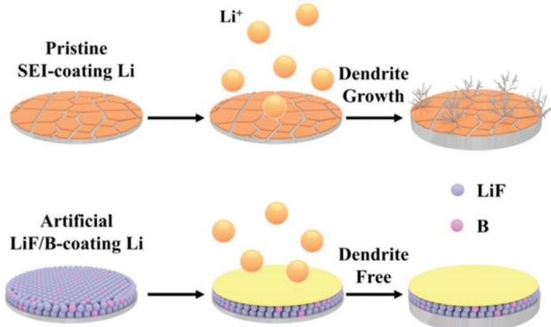
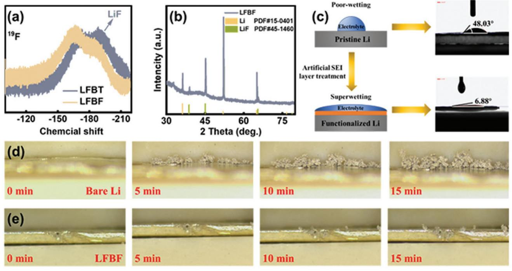
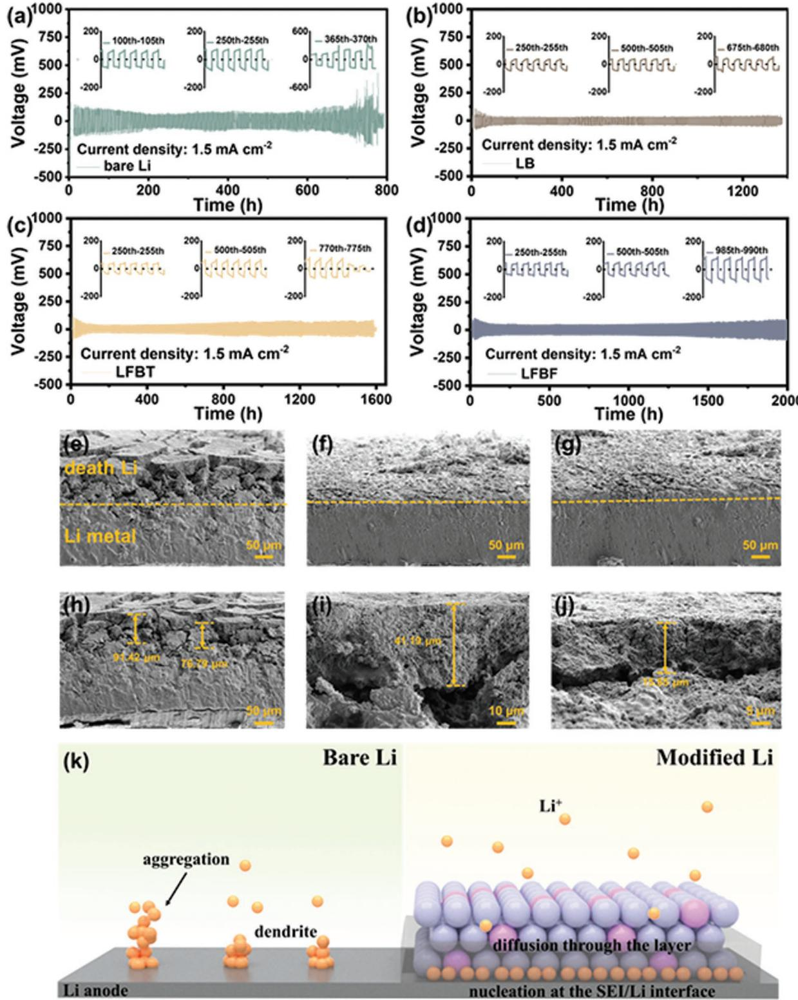
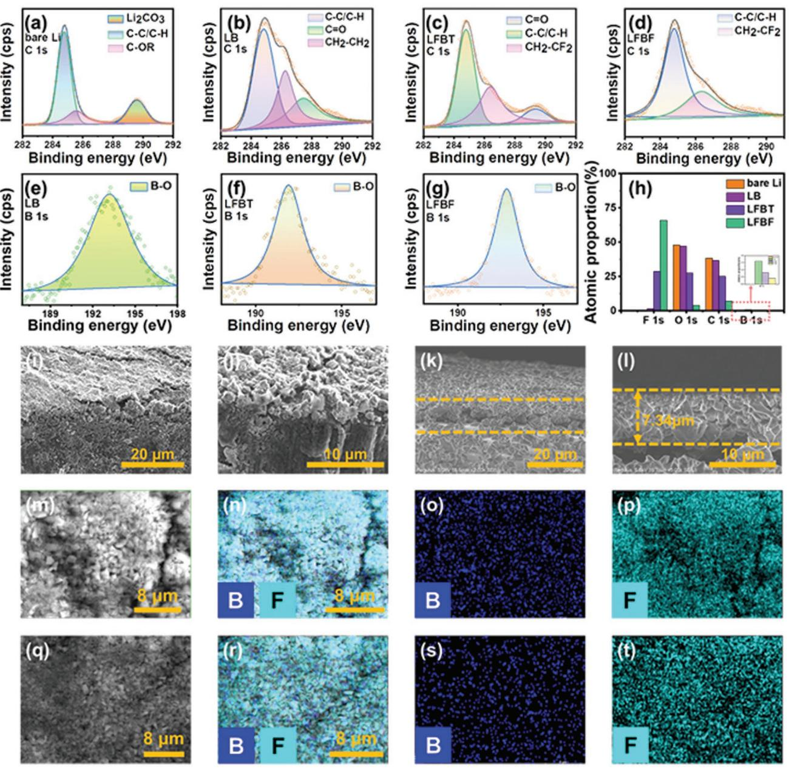
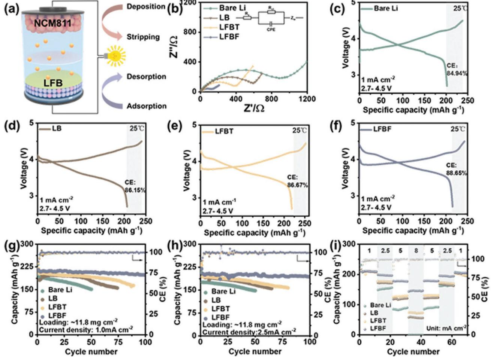
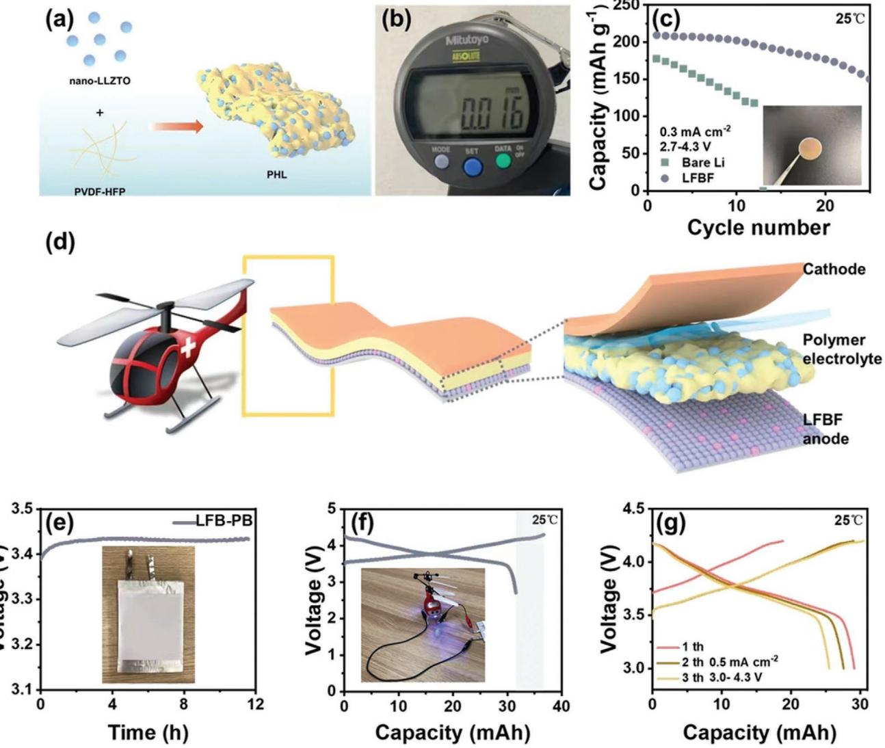

# **A Facile Surface Passivation Method to Stabilized Lithium Metal Anodes Facilitate the Practical Application of Quasi-Solid-State Batteries**

*Kangsheng Huang, Jiahui Yu, Langyuan Wu, Zhiwei Li, Hai Xu, Hui Dou, and Xiaogang Zhang\**

**Lithium metal anode matching solid electrolyte is an effective way to achieve high safety and high specific energy batteries, while the active interface of lithium metal has become a bottleneck problem that limits its application. Here, the challenges by forming an artificial solid electrolyte interphase (F-, B-containing) on lithium metal surface are surmounted. It demonstrates an extended cycling life over 2000 h of continuous plating/stripping at a high current density of 1.5 mA cm−2 . Nuclear magnetic resonance spectra prove the effectiveness of anion receptors for decoupling Li+-F−. The distribution and morphological features of the LiF/B artificial hybrid interphase can be observed from energy-dispersive spectroscopy and scanning electron microscopy. Specifically, the treated metal lithium anode is also stable in the quasi-solid-state pouch cell (polyvinylidene fluoride-hexafluoro propylene-LLZTO) system, which can make the rotor of the small aircraft rotate quickly and stably for 9.2 min.**

# **1. Introduction**

Currently, the demand for high-energy density lithium-ion batteries has increased dramatically in electric vehicles and electric aircraft.[1–5] However, batteries based on graphite anodes can only provide a limited energy density, which is a problem under the ever-increasing demand for large-scale storage.[6–9] Lithium metal has the characteristics of high specific capacity (3860 mAh g−1 ) and extremely low electrochemical oxidationreduction potential (−3.04 V vs SHE),[10–15] which stands out among various electrode materials. Applying stable Li metal instead of graphite electrode (372 mAh g−1 ) to lithium-ion batteries can easily achieve high energy density.[16–19] However, due to the thermodynamic instability of metallic lithium in organic solvents, adequate passivation of the lithium surface is difficult

K. S. Huang, J. H. Yu, L. Y. Wu, Z. W. Li, H. Xu, H. Dou, X. G. Zhang Jiangsu Key Laboratory of Electrochemical Energy Storage Technologies College of Materials Science and Technology Nanjing University of Aeronautics and Astronautics Nanjing 210016, China E-mail: azhangxg@nuaa.edu.cn K. S. Huang, J. H. Yu, H. Dou, X. G. Zhang Shenzhen Research Institute Nanjing University of Aeronautics and Astronautics Shenzhen 518000, China

The ORCID identification number(s) for the author(s) of this article can be found under https://doi.org/10.1002/admi.202102283.

**DOI: 10.1002/admi.202102283**

to achieve.[20–22] The solid electrolyte interphase (SEI) layer was broken during the Li deposition process, and lithium dendrites were generated at locations where the current density was locally increased. During the nucleation and growth of lithium dendrites, a mass of fresh lithium metal is exposed to the organic electrolyte, and new SEI layers are continuously produced during the cycle.[23–25] Repeated destruction and repair of the SEI layer will cause continuous loss of electrolyte and lithium source, which further leads to low coulomb efficiency lithium metal batteries.[26,27] More serious, the disordered accumulation of lithium dendrites during subsequent cycles will pierce the diaphragm and even catastrophic failures.[28–30]

There are many researchers trying to solve these problems. Various strategies have been devoted to passivation Li metal anode, such as the use of nanostructured anodes,[31–34] 3D electrode designing,[9,35–38] modify separators,[39] electrolyte composition modification,[40–43] and solid-state electrolyte,[44–46] and so on. These strategies effectively inhibit the reactivity of the lithium metal anode interface by inhibiting the generation of lithium dendrites or blocking the penetration of dendrites. However, these strategies have not changed the failure mechanism of the SEI layer. It is well known that in lithium metal batteries, partial dissolution of the protoplast layer and the SEI layer leading to an increase in the active area at the interface, where the Li ion flux is locally enhanced, thereby promoting the formation and growth of Li dendrites. Moreover, the selfformed SEI layer cannot prevent the growth of Li dendrites due to unevenness and low mechanical strength.[47,48] In view of this, recently, carbon-based interlayers,[49] artificial Li3PO4 SEI layer,[50–52] Li-based surface composite alloy films,[53,54] and LiF coating[55–60] have emerged to achieve sufficient passivation of metal anodes in liquid electrolyte. Especially, LiF has been studied intensively because of its excellent mechanical strength, the highest electron tunneling barrier, and the superior transmission channel of Li+. [61,62] Recently, Zhu et al. found that LiF can induce a stable solid–liquid interface and widen the temperature window of SnO2-based anode materials to −50 °C.[63] The construction of LiF artificial SEI can effectively reduce the impact of interface electron tunneling, and effectively deter the penetration of inferior lithium dendrites through SEI. However, the dense LiF layer will increase the interface resistance,

**Scheme 1.** Schematic illustration of the merits of LiF/B artificial SEI.

the design of organic/inorganic composite artificial SEI layer can effectively improve the direct contact between the electrolyte and the Li metal anode.[64–66] So it is necessary to construct a porous and composite SEI. For instance, Xiong et al. designed a lithium-antimony (Li3Sb) alloy and LiF composite artificial SEI layer, which can stable lithium plating/peeling behavior at ultra-high rate (20 mA cm−2 ).[67] Recently, Tao et al. reported a new type of electrolyte using porous LiF nanobox that can induce the formation of a highly fluorinated SEI layer.[68]

Here, we choose LiF crystal as the research subject and further introduce tris(trimethylsilyl) borate (TMSB) as a solvent to construct artificial SEI film rich in LiF and B elements (**Scheme 1**). Precursor solutions of different LiF concentrations are uniformly cover the surface of the lithium anode, and dried to form a uniform artificial SEI layer (Figure S1, Supporting Information).

Spectroscopic characterization results show that solutions with different LiF concentrations can form passivation layers with different thicknesses outside of lithium metal, and the F and B elements are evenly distributed in the passivation layer. Thus, 4 wt% LiF precursor solution treated Li metal anode is stabilized to sustain electrodeposition more than 2000 h of continuous plating/ stripping at a high current density of 1.5 mA cm−2 . Specifically, the treated metal lithium anode is also stable in the quasi-solidstate pouch cell (polyvinylidene fluoride [PVDF]-hexafluoro propylene [HFP]-LLZTO) (PHL) system, which can make the rotor of the small aircraft rotate quickly and stably for 9.2 min.

# **2. Results**

#### **2.1. Design of Artificial SEI Film and In Situ Optical Observation**

B-based anion acceptor additives have been proven to help the solvation of the electrolyte to improve battery performance, while the application of such additives on artificial SEI membranes has not yet been reported. Here, our work begins with the study of the ability of the anion receptor TMSB to dissociate LiF. The goal is to construct a controllable artificial SEI membrane rich in F and B elements. We use TMSB to dissolve LiF crystals with mass fractions of 2 wt% (LFBT) and 4 wt% (LFBF), respectively, and carried out 19F nuclear magnetic resonance (NMR) measurements for the precursor solution. The signal of LiF is at −204 ppm, and the spectrum shows the dissolution process of LiF. Obviously, an extra peak arises in precursor electrolyte, indicating there is an electron-rich group related to TMSB in the solvation structure (**Figure 1**a).[69] These changes

**Figure 1.** Ion coupling in the precursor solution and interface characterization. a) 19F NMR spectra of different precursor solution. b) X-ray diffraction patterns of the LFBF. c) Contact angle test and schematic. d) Optical microscopy investigates the dendrite growth of the Li-Li battery in different anode.

indicate that the de-shielding effect of the electron-deficient B atom forms an electron-rich group (TMSB-F) to weaken the coupling between Li+ and F− ions.[70,71] The existence of LiF crystals outside of lithium metal was determined by X-ray diffraction (XRD) method (Figure 1b). Four main broad diffraction peaks can be observed at 2*θ* with values of 38.7°,45°, 65.5°, and 78.8°, corresponding to (1 1 1), (2 0 0), (2 2 0), and (3 1 1) diffractions of LiF (PDF No. 45-1460), respectively. Notably, the standard diffraction peak of lithium metal also appeared on the spectrum, and it is speculated that the artificial SEI layer is a porous structure. Thus, we further evaluated the wetting ability of the artificial SEI layer, contact angle measurements were conducted with 5 mL carbonate electrolyte on bare Li and LFBF composite electrodes, respectively (Figure 1c). The experimental results show that the contact angle of bare lithium is about 48°, whereas the contact angle of processed lithium is only about 6.9°, showing an excellent wetting effect. The improved wettability is in favor of even distribution of the electrolyte and Li ion.[72–74]

In addition, for further understanding the actual situation of the artificial SEI layer on the improvement of the lithium deposition interface, in situ optical microscopy characterization of the Li-Li battery was performed to study the interface changes and lithium dendrite growth in these two anode materials (Figure 1d,e). After cycling for 15 min at 0.5 mA cm−2, large amounts of chaotically distributed lithium dendrites were formed on the surface of the bare Li anode, while the surface of the LFBF anode is uniformly deposited with lithium and almost no lithium dendrites are produced. The experimental results show that the artificial SEI rich in LiF-B component has a good wetting effect and can uniform lithium dendritic deposition behavior.

#### **2.2. Li Reversibility**

Beyond studying the physical properties of the artificial SEI layer, we are now focusing on whether the use of treated-Li can promote the reversibility of lithium metal anode. To illustrate the effect of the artificial SEI layer on the electrochemical stability of Li-metal during cell cycling, Li/Li symmetric battery was assembled with 200 µm Li foil as the anode, and the cycling stability of LFBT and LFBF electrodes under limited Li source was evaluated. The voltage data of the cell with blank Li and 0, 2, and 4 wt% LiF precursor solution treated Li metal anode are shown in **Figure 2**a–d (current density: 1.5 mA cm−2 ). It can be observed from Figure 2a, the bare Li-Li symmetric cells exhibit the large fluctuations and high overpotentials after 600 h. We observe that the stability of the cell is improved after the precursor solution treatment. Specifically, the symmetric cells of LFBF show the smallest overpotentials and can stably run the test over 2000 h (Figure 2d). This means that the artificial SEI layer is conducive to improving the stability of the metal lithium anode in the electrolyte and increasing the utilization efficiency of the lithium source. Carrying out the voltage profile of the metal lithium symmetric cells after the first three treatments when it fails, it can be clearly seen that when the cells invalid, the voltage will always have a large overpotential or unstable situation, and the symmetric cells of LFBF remain stable after 2024 h of cycling.

To further illustrate the role of artificial SEI in inhibiting the growth of dendrites, we assembled an Li-Li symmetric battery and cycled under a large current of 3 mA cm−2 . First, the symmetrical battery is cycled 50 times at a current density of 3 mA cm−2 . Scanning electron microscope (SEM) characterization was performed on the same side of lithium metal under fully charged conditions. It can be seen from Figure 2e,h that Li deposited on the blank Li anode showed uncontrolled and uneven growth, and the vertical growth length of dendrites reached 80–90 µm, because the spontaneously formed SEI layer induced by the electrolyte is too fragile, it cannot support the volume expansion under high current cycles, leading to the penetration of dendrites and the fragmentation of the SEI layer. Specifically, the LFBT anode has a more uniform surface after deposition/stripping. The dense Li is deposited on the surface, and the vertical growth of dendrites is about 40 µm (Figure 2f,i). Specifically, the thinnest lithium dendrites deposited on the surface of the LFBF anode is about 15 µm, and there is no obvious pulverization (Figure 2g,j). These results further prove that the artificial SEI layer plays a significant role in realizing the uniform ion transport of the metal lithium anode under high current density and inhibiting the growth of lithium dendrites. Given the results of the above two parts, we have established a reasonable SEI interphase layer Li deposition scenario, as shown in Figure 2k.

#### **2.3. Electrode Interface Analysis**

To further study the improvement of the interface stability of the artificial SEI film, we studied the chemical composition and element distribution of the SEI on the surface of the Li-metal anode through spectral characterization. Above all, we conducted an X-ray photoelectron spectroscopy (XPS) test before cycling the lithium metal anode to study its initial SEI composition. **Figure 3**a shows the initial interface formed by the bare lithium anode interface, in which clear signals of carbonyl species such as CC, COR, and more Li2CO3 compounds are obtained in the C1s spectrum. For LFBF anode, although the signal of the same type of Li2CO3 compound is significantly weakened, a new signal related to the CH2CF2 (286.9 eV) compound appears (Figure 3b–d). Moreover, high-resolution XPS spectrum of BO bonds was also detected on the surface of the LFBF anode (Figure 3e–g) which was due to the decomposition of TMSB. The O1s spectrum further verified this result. Due to the introduction of the organic layer of TMSB, an ultra-high signal of BO (532.5 eV) can be observed (Figure S2, Supporting Information). As summarized in Figure 3h, by comparison the initial artificial SEI formed in the LFBF anode, the atomic ratio of the elements such as F and B is higher, while the atomic ratio of elements such as C and O is lower. The types of elements in LFBT anode are the same as LFBF, but the content is lower than that in LFBF anode. The XPS results strongly depict that the precursor solution can form an artificial SEI layer outside of lithium metal with LiF and B compounds that are beneficial to ion transport and interface stability.[75]

To further characterize the structure and micromorphology of the lithium metal surface after treatment with different precursor solutions, SEM was carried out. We can clearly observe that outside of the blank lithium metal is smooth and has some

**www.advmatinterfaces.de**

**Figure 2.** Electrochemical evaluation of different anode. a–d) Li reversibility profiles of the different Li/Li symmetric cells. e–j) SEM profiles of bare Li, LFBT, and LFBF anode morphology evolution after 50 cycles at a current density of 3 mA cm−2 . k) Schematic illustration of Li plating on bare Li anode and LiF/B modified Li anode.

**www.advancedsciencenews.com**

**Figure 3.** Comparison of artificial SEI at the anode interface in different precursor solutions. a–g) High-resolution XPS spectra and h) atomic relative percent of the Li-metal anode treated in different precursor solutions. SEM image of Li surface in the i,j) LFBT anode and k,l) LFBF anode. Element mapping of the anode surface in the m–p) LFBT and q–t) LFBF.

cracks, while the surface of the lithium metal treated with the pure solvent obviously has a layer of non-dense film (Figure S3, Supporting Information). Specifically, the surface of the lithium metal treated with the 4 wt% LiF precursor solution forms a very dense and uniform artificial SEI layer with a thickness of about 8 µm. (Figure 3k,l). As demonstrated in Figure 3j, the surface of the metal lithium anode treated with 2 wt% LiF precursor solution is in a powdered state. In addition, we further used energydispersive spectroscopy (EDS) \*element mapping experiments to describe the distribution of F and B elements on the anode surface of LFBT and LFBF (Figure 3m–t). Consistent with the results of the XPS test, the F and B elements are clearly present and evenly distributed on the surface of the lithium metal anode. Such a compact artificial SEI layer rich in LiF and B element can effectively inhibit the growth of lithium dendrites, thereby achieving the purpose of protecting the lithium anode.

#### **2.4. Cycle Performance of the Full Cell**

First, we intended to assemble Li-NCM811 full cells to study the performance of LMB battery. The blank Li metal and the

**Figure 4.** Cycling performances of LMB full cells. a) Assembly and schematic working mechanism of NCM811|Li full cells. b) Electrochemical impedance spectroscopy of NCM811|Li full cells with different lithium metal anodes. Selected first charge and discharge profiles of NCM811|Li full cells in c) bare Li, d) LB, e) LFBT, and f) LFBF anode. g,h) Cycling performance and CE of NCM811|Li full cells in bare Li, LB, LFBT, and LFBF anode at a current density of 1.5 and 2.5 mA cm−1 , respectively. i) Rate performance at different current densities uses different anodes.

treated-Li metal were, respectively, rolled into a sheet with a thickness of 200 µm, paired with the NCM811 material (cathode mass: 11.8 mg) to obtain a high-voltage LMB coin cell. The uniform cathode materials were adopted, and bare lithium, LB, LFBT, and LFBF were used as the anode. Moreover, the coin cells cycling were carried out at current densities of 1 and 2.5 mA cm−2 , respectively, to reflect the influence of surface coating on the Li anode (schematic model of the cell in Figure 5a). First, we measured the electrochemical impedance spectroscopy (EIS) to explore the influence of the artificial SEI layer on the electrochemical stability of batteries in different systems. Excluding external influence factors, LFBF coin cell had the smallest initial internal electrochemical impedance, suggesting it has a less pseudo-reactions and more advantageous rate performance than the others, as shown in **Figure 4**b. Further studying the data of the first charge and discharge, we can see that in the voltage range of 2.7–4.5V, when the current density reached 1 mA cm−2 , the initial discharge capacity of the Li/NMC811-LFBF battery was 215.3 mAh g−1 , but the value of the bare Li cell was only 200.2 mAh g−1 . The Coulomb efficiency can also reflect their differences, the four of them were 84.94%, 86.15%, 86.67%, and 88.65%, respectively (Figure S3, Supporting Information; Figure 4c–f). Specifically, at a rate of 1 mA cm−2 , the capacity of the cell with bare Li dropped rapidly from 200.2 to 150.8 mAh g−1 after 50 cycles, and LB can slightly improve the capacity retention rate (Figure 4g). As the concentration of LiF concentration increases, the capacity retention rate of the cell gradually increases, especially the full battery with LFBF anode still maintains a capacity of 198.9 mAh g−1 after 100 cycles (Figure 4g). Similarly, at a rate of 2.5 mA cm−2 , after 50 cycles, the difference in capacity retention rate is more significant. The capacity of bare Li plunge from 207 to 148.2 mAh g−1 (decline of ≈30%), while LFBT anode cells only decrease by ≈5.3% after 100 cycles, keeping a high-capacity retention rate (Figure 4h). Hence, the rate capability of the Li/ NMC811-LFBF cell is expected to be superior. In view of this, a rate performance test was conducted. Specifically, when current density climbed to 8 mA cm−2 , the Li/NMC811-LFBF cell could maintain a high capacity of 179 mA g−1 while the other cell has been a great attenuation (Figure 4i). What's more, the capacity

**Figure 5.** Quasi-solid-state battery performance. a) Schematic representation of the detail synthesis process of PHL. b) Thickness of PHL membrane. c) Cycling performance of the quasi-solid-state coin cell using TLFB anode at 25 °C. d) Schematic illustration of the quasi-solid-state pouch cell based on flexible PHL membrane and LFBF anode. e) The voltage curve of the pouch cell during 10 h storage. f) First charge–discharge profiles of quasisolid-state pouch cell. Inset picture shows the pouch battery driving the helicopter wing to rotate. g) Charging and discharging curve of pouch battery after rotating wings.

nearly returns to its initial capacity when the current density is reverted to 1 mA cm−2 after 70 cycles, which indicating that the electrode has better rate performance. The improved cycle and rate performance could be attributed to the LiF and B enrichment interphase that effectively improves the uniform distribution of lithium ions during the plating/stripping process and promotes faster ion transmission kinetics.[67,76]

#### **2.5. Quasi-Solid-State Battery Design and Actual Device Display**

To further illustrate the protection of our artificial SEI for LFBF anodes, we assembled a single-chip quasi-solid-state pouch cell to better verify the stability of the interface. Firstly, we synthesized the solid electrolyte membrane of PHL, assembled it with Li/NCM811 into a quasi-solid-state pouch cell, and carried out electrochemical cycling test. **Figure 5**a shows the specific synthesis method and schematic diagram of the finished product. LLZTO solid electrolyte has the characteristics of high ionic conductivity and good dispersion, so we use this as an inorganic matrix material in this work. XRD data analysis shows that nano-LLZTO has a typical cubic phase structure, which is consistent with the standard structure of Li7La3Zr2O12 (PDF# No. 80-4057, Figure S5, Supporting Information). The prepared film has good flexibility and a thinner thickness (16 µm) (Figure 5b), which has huge practical application potential. Specifically, LFBF/PHL/NMC811 quasi-solid-state coin cell still exerts a specific capacity of 223.5 mAh g−1 while the other cell in bare Li anode is only 178.1 mAh g−1 under such condition under lean electrolyte conditions (Figure 5c). However,

the capacity of the bare-Li/PHL/NMC811coin cell decay rapidly in the subsequent cycles. He and co-workers have proved that lithium metal reacts with PVDF-HFP-based membrane to produce hydrogen, which causes thermodynamic instability.[77] To realize practical quasi-solid-state battery, we further fabricate a LFBF/PHL/NMC811 quasi-solid-state pouch batteries and execute the tests under realistic conditions. In specific, the open circuit voltage of the single-chip quasi-solid-state pouch cell is as high as 3.4 V, and the voltage remains stable after 12 h of standing at room temperature, which proves the stability of the metal-lithium interface. (Figure 5d). Specifically, the first CE of the pouch cell is as high as 86.09%, and it has a reversible capacity of 32 mAh. The actual flight demonstration experiment is carried out with an electric small aircraft, which can continuously drive the aircraft rotor to rotate at a high speed for 9.2 min (Figure S6, Supporting Information). Furthermore, the discharged pouch cell can still carry out a stable charge and discharge cycle (Figure 5f). Electrochemical instability of the PHL toward Li metal has been improved by stable anode interface using the designed artificial SEI rich in LiF and B elements.

The above research results show that the quasi-solid-state pouch battery with LFBF as the anode has excellent electrochemical performance and stability, and has broad application prospects in the practical application of high-energy density and long-life batteries.

# **3. Conclusion**

In this work, we reported the use of the shielding effect of anionic acceptor additives to construct artificial SEI membranes rich in F and B elements. Studies have shown that TMSB has a unique electron-deficient characteristic and can interact strongly with anions (TMSB-F), thus makes it possible to construct an artificial SEI rich in F and B elements. The results show that the artificial SEI film constructed by dissolving 4 wt% LiF crystals in TMSB has the best electrochemical performance. An ultralong and stable cycling over 2000 h has been achieved for LFBF anode symmetrical cell at a current density of 1.5 mA cm−2 , the life span of LFBF is significantly extended by more than three times that of unprotected Li. In high load Li/NCM811 full cells after 100 cycles LFBF cells have a capacity retention rate of 94.7%. Specifically, the treated metal lithium anode is also stable in the quasi-solid-state pouch cell system, which can make the rotor of the small aircraft rotate quickly and stably for 10 min. This study delivers a new and efficient method for preparing highly stable and safe lithium metal anode, provides a simple and feasible solution for the practical application of quasi-solid-state LMBs.

#### **4. Experimental Section**

*Materials*: LiNi0.8Co0.1Mn0.1O2 cathode (NCM811:conductive carbon:PVDF = 90:7:3, by weight) was supplied by Wuhu Tianyi Energy Technology Co., Ltd. Lithium hexafluorophosphate (LiPF6), fluoroethylene carbonate (FEC), lithium bisfluorosulfonimide (LiFSI), dimethyl carbonate (DMC), and ethyl methyl carbonate (EMC) were bought from DodoChem. TMSB was bought from Aladdin reagent

Co., Ltd., and PVDF-HFP (*M*n = 400 000 g mol−1 ) was supplied from Sigma-Aldrich. Nano-LLZTO powders were bought from Zhangzhou Xiangcheng Yuteng Ceramic Products Co., Ltd.

*Electrode Preparation*: The lithium metal was first rolled to a thickness of about 100 µm, and then polished to remove the surface magazine. Using a punch with a diameter of 10 mm, small discs were punched out and placed in a glove box to dry for 1 d. According to the concentration of different mass fractions (2, 4 wt%), dispersed and dissolved LiF in the TMSB solvent, magnetically stirred for 12 h, until the solution became clear and transparent. Dropped the precursor solution on the dried lithium metal surface, added four drops to each piece of lithium metal, and then placed it in the glove box to dry for 12 h until the surface formed an interface layer.

*Synthesis of Solid Electrolyte Membrane*: PVDF-HFP-LLZTO were synthesized by mixing PVDF-HFP (*M*n = 400 000 g mol−1 ) and LLZTO powders, and LiFSI, respectively.

In an argon atmosphere, 200 mg PVDF-HFP and 80 mg LiFSI were sequentially added to 3.0 mL NMP, and then magnetically stirred at 60 °C until the solution became clear. After the solution was naturally cooled to room temperature, 1.0 mL acetone and 0.4 g nano-LLZTO powder were added to the precursor solution, and stirring was continued for another 6 h to obtain a light brown solution. Then, the final solution was poured on the polytetrafluoroethylene (PTFE) mold, drying oven and dried at 70 °C for 48 h to remove the excess solvent NMP and acetone. Finally, the obtained composite film was cut into small discs with a diameter of 14 mm and an average thickness of 15 ± 2 µm using a cutting machine for assemble the cell.

*Material Characterization*: XRD result was measured on PANalytical X'Pert diffractometer using Cu K*α* radiation to determine the crystal structure of materials. 19F NMR spectra were collected on a 400 MHz DirectDrive2 spectrometer. Field emission SEM (Hitachi S-4800) was used to explore the morphology and microstructure of all materials. Surface chemical information of the powder was characterized by XPS (PHI 550 spectrometer with Al K*α* radiation source).

*Electrochemical Measurements*: The experiment was done by assembling CR-2032 coin cells. The bare Li and modified Li metal were, respectively, used as the electrodes to assemble symmetrical cells in a glove box filled with argon gas, including as-prepared electrode, Li metal was applied as an anode, and PP separator. Electrolyte is 1.5 m LiPF6 Li salt dissolved in FEC/EMC/DMC mixed solvent (34.7%, 57.2%, and 8.2% in weight). The volume of electrolyte added to each cell remained the same, and the usage was controlled at ≈80 µL. The cathode mass loading was 11.8 mg cm−2 . In terms of the pouch cell, the design capacity is 30 mAh. The cathode loading was 11.8 mAh cm−2 .

*In Situ Characterization*: The in situ observation instrument consisted of an electrochemical workstation, optical microscope, and a transparent battery device with a specific structure, which was used to characterize the deposition/stripping process of Li metal. The internal structure of the transparent battery was composed of a sandwich structure (lithium metal/electrolyte/lithium metal).

# **Supporting Information**

Supporting Information is available from the Wiley Online Library or from the author.

### **Acknowledgements**

This work was supported by the National Natural Science Foundation of China (U1802256 21773118), Leading Edge Technology of Jiangsu Province (BK20202008), Project Funded by the Priority Academic Program Development of Jiangsu Higher Education Institutions (PAPD), Free Exploration Basic Research Project in Shenzhen Virtual University Park (2021Szvup062), the Research and Practice Innovation Program in Nanjing University of Aeronautics and Astronautics (xcxjh20210603), **www.advancedsciencenews.com**

and Graduate student innovation experiment competition cultivation project (4003-016001).

# **Conflict of Interest**

The authors declare no conflict of interest.

#### **Author Contributions**

K.S.H. and J.H.Y. contributed equally to this work. X.G.Z. provided initial ideas. K.S.H. and J.H.Y. completed the experiment and writing work. H.D., L.Y.W., H.X., and W.Z.L. helped drawing and editing articles. All authors have contributed to the research work.

#### **Data Availability Statement**

The data that supports the findings of this study are available in the article and in the supplementary material of this article.

#### **Keywords**

anion receptor, artificial SEI, F-, B-containing, lithium metal anode, quasi-solid-state pouch cell

Received: November 29, 2021

Revised: December 29, 2021

Published online: February 11, 2022

- [1] Y. Bi, J. Tao, Y. Wu, L. Li, Y. Xu, E. Hu, B. Wu, J. Hu, C. Wang, J.-G. Zhang, *Science* **2020**, *370*, 1313.
- [2] H. Jin, S. Xin, C. Chuang, W. Li, H. Wang, J. Zhu, H. Xie, T. Zhang, Y. Wan, Z. Qi, *Science* **2020**, *370*, 192.
- [3] C. Yang, J. Chen, X. Ji, T. P. Pollard, X. Lü, C.-J. Sun, S. Hou, Q. Liu, C. Liu, T. Qing, *Nature* **2019**, *569*, 245.
- [4] D. H. Tan, Y.-T. Chen, H. Yang, W. Bao, B. Sreenarayanan, J.-M. Doux, W. Li, B. Lu, S.-Y. Ham, B. Sayahpour, *Science* **2021**, *373*, 1494.
- [5] F. He, W. Tang, X. Zhang, L. Deng, J. Luo, *Adv. Mater.* **2021**, *33*, 2105329.
- [6] S. Xia, X. Wu, Z. Zhang, Y. Cui, W. Liu, *Chem* **2019**, *5*, 753.
- [7] X. Shen, R. Zhang, X. Chen, X. B. Cheng, X. Li, Q. Zhang, *Adv. Energy Mater.* **2020**, *10*, 1903645.
- [8] Y. Guo, H. Li, T. Zhai, *Adv. Mater.* **2017**, *29*, 1700007.
- [9] D. Lin, Y. Liu, Y. Cui, *Nat. Nanotechnol.* **2017**, *12*, 194.
- [10] X. Fan, L. Chen, O. Borodin, X. Ji, J. Chen, S. Hou, T. Deng, J. Zheng, C. Yang, S.-C. Liou, *Nat. Nanotechnol.* **2018**, *13*, 715.
- [11] R. Weber, M. Genovese, A. Louli, S. Hames, C. Martin, I. G. Hill, J. Dahn, *Nat. Energy* **2019**, *4*, 683.
- [12] H. Chu, J. Jung, H. Noh, S. Yuk, J. Lee, J. H. Lee, J. Baek, Y. Roh, H. Kwon, D. Choi, *Adv. Energy Mater.* **2020**, *10*, 2000493.
- [13] Z. Yu, H. Wang, X. Kong, W. Huang, Y. Tsao, D. G. Mackanic, K. Wang, X. Wang, W. Huang, S. Choudhury, *Nat. Energy* **2020**, *5*, 526.
- [14] C. Niu, H. Pan, W. Xu, J. Xiao, J.-G. Zhang, L. Luo, C. Wang, D. Mei, J. Meng, X. Wang, *Nat. Nanotechnol.* **2019**, *14*, 594.
- [15] Z. Li, M. Peng, X. Zhou, K. Shin, S. Tunmee, X. Zhang, C. Xie, H. Saitoh, Y. Zheng, Z. Zhou, Y. Tang, *Adv. Mater.* **2021**, *33*, 2100793.
- [16] J. B. Park, C. Choi, S. Yu, K. Y. Chung, D.-W. Kim, *Adv. Energy Mater.* **2021**, *11*, 2101544.

- [17] Y. Gao, Z. Yan, J. L. Gray, X. He, D. Wang, T. Chen, Q. Huang, Y. C. Li, H. Wang, S. H. Kim, T. E. Mallouk, D. Wang, *Nat. Mater.* **2019**, *18*, 384.
- [18] X. Wu, W. Zhang, N. Wu, S. S. Pang, Y. Ding, G. He, *Adv. Energy Mater.* **2021**, *11*, 2003082.
- [19] T. Wei, Z.-H. Zhang, Z.-M. Wang, Q. Zhang, Y.-S. Ye, J.-H. Lu, Z. U. Rahman, Z.-W. Zhang, *ACS Appl. Energy Mater.* **2020**, *3*, 9428.
- [20] P. Shi, X. Q. Zhang, X. Shen, B. Q. Li, R. Zhang, L. P. Hou, Q. Zhang, *Adv. Funct. Mater.* **2021**, *31*, 2004189.
- [21] X. Q. Zhang, X. Chen, X. B. Cheng, B. Q. Li, X. Shen, C. Yan, J. Q. Huang, Q. Zhang, *Angew. Chem.* **2018**, *130*, 5399.
- [22] Y.-H. Tan, G.-X. Lu, J.-H. Zheng, F. Zhou, M. Chen, T. Ma, L.-L. Lu, Y.-H. Song, Y. Guan, J. Wang, Z. Liang, W.-S. Xu, Y. Zhang, X. Tao, H.-B. Yao, *Adv. Mater.* **2021**, *33*, 2102134.
- [23] X. Zhang, Y. Yang, Z. Zhou, *Chem. Soc. Rev.* **2020**, *49*, 3040.
- [24] P. Shi, X. B. Cheng, T. Li, R. Zhang, H. Liu, C. Yan, X. Q. Zhang, J. Q. Huang, Q. Zhang, *Adv. Mater.* **2019**, *31*, 1902785.
- [25] H. Liu, X. B. Cheng, R. Xu, X. Q. Zhang, C. Yan, J. Q. Huang, Q. Zhang, *Adv. Energy Mater.* **2019**, *9*, 1902254.
- [26] T. Dong, J. Zhang, G. Xu, J. Chai, H. Du, L. Wang, H. Wen, X. Zang, A. Du, Q. Jia, *Energy Environ. Sci.* **2018**, *11*, 1197.
- [27] J.-G. Zhang, W. Xu, J. Xiao, X. Cao, J. Liu, *Chem. Rev.* **2020**, *120*, 13312.
- [28] W. Zhang, Q. Wu, J. Huang, L. Fan, Z. Shen, Y. He, Q. Feng, G. Zhu, Y. Lu, *Adv. Mater.* **2020**, *32*, 2001740.
- [29] B. Liu, J.-G. Zhang, W. Xu, *Joule* **2018**, *2*, 833.
- [30] J. A. S. Oh, J. Sun, M. Goh, B. Chua, K. Zeng, L. Lu, *Adv. Energy Mater.* **2021**, *11*, 2101228.
- [31] R. Zhang, N. W. Li, X. B. Cheng, Y. X. Yin, Q. Zhang, Y. G. Guo, *Adv. Sci.* **2017**, *4*, 1600445.
- [32] X. Yang, X. Gao, C. Zhao, Q. Sun, Y. Zhao, K. Adair, J. Luo, X. Lin, J. Liang, H. Huang, *Energy Storage Mater.* **2020**, *27*, 198.
- [33] H. Wang, P. Hu, X. Liu, Y. Shen, L. Yuan, Z. Li, Y. Huang, *Adv. Sci.* **2021**, *8*, 2100684.
- [34] R. Zhang, N. W. Li, X. B. Cheng, Y. X. Yin, Q. Zhang, Y. G. Guo, *Adv. Sci.* **2017**, *4*, 1600445.
- [35] Y. Zhang, Y. Shi, X. C. Hu, W. P. Wang, R. Wen, S. Xin, Y. G. Guo, *Adv. Energy Mater.* **2020**, *10*, 1903325.
- [36] J. Xie, J. Wang, H. R. Lee, K. Yan, Y. Li, F. Shi, W. Huang, A. Pei, G. Chen, R. Subbaraman, *Sci. Adv.* **2018**, *4*, eaat5168.
- [37] T.-S. Wang, X. Liu, Y. Wang, L.-Z. Fan, *Adv. Funct. Mater.* **2021**, *31*, 2001973.
- [38] J. B. Park, C. Choi, S. Yu, K. Y. Chung, D. W. Kim, *Adv. Energy Mater.* **2021**, *11*, 2101544.
- [39] K. Sun, Z. Peng, *InfoMat* **2021**, *3*, 1083.
- [40] C. Yan, H.-R. Li, X. Chen, X.-Q. Zhang, X.-B. Cheng, R. Xu, J.-Q. Huang, Q. Zhang, *J. Am. Chem. Soc.* **2019**, *141*, 9422.
- [41] H. Dai, X. Gu, J. Dong, C. Wang, C. Lai, S. Sun, *Nat. Commun.* **2020**, *11*, 643.
- [42] K. Huang, S. Bi, B. Kurt, C. Xu, L. Wu, Z. Li, G. Feng, X. Zhang, *Angew. Chem., Int. Ed.* **2021**, *60*, 19232.
- [43] T. Li, X. Q. Zhang, N. Yao, Y. X. Yao, L. P. Hou, X. Chen, M. Y. Zhou, J. Q. Huang, Q. Zhang, *Angew. Chem.* **2021**, *133*, 22865.
- [44] Q. Zhao, X. Liu, S. Stalin, K. Khan, L. A. Archer, *Nat. Energy* **2019**, *4*, 365.
- [45] Z. Wang, L. Shen, S. Deng, P. Cui, X. Yao, *Adv. Mater.* **2021**, *33*, 2100353.
- [46] J. Wang, G. Huang, J.-M. Yan, J.-L. Ma, T. Liu, M.-M. Shi, Y. Yu, M.-M. Zhang, J.-L. Tang, X.-B. Zhang, *Natl. Sci. Rev.* **2021**, *8*, nwaa150.
- [47] S.-J. Yang, N. Yao, X.-Q. Xu, F.-N. Jiang, X. Chen, H. Liu, H. Yuan, J.-Q. Huang, X.-B. Cheng, *J. Mater. Chem. A* **2021**, *9*, 19664.
- [48] Z. Han, C. Zhang, Q. Lin, Y. Zhang, Y. Deng, J. Han, D. Wu, F. Kang, Q. H. Yang, W. Lv, *Small Methods* **2021**, *5*, e2001035.
- [49] P. Rani, K. S. Kumar, A. D. Pathak, C. S. Sharma, *ACS Appl. Energy Mater.* **2021**, *4*, 8294.
- [50] N. W. Li, Y. X. Yin, C. P. Yang, Y. G. Guo, *Adv. Mater.* **2016**, *28*, 1853.

**www.advancedsciencenews.com**

- [51] T. Deng, X. Ji, Y. Zhao, L. Cao, S. Li, S. Hwang, C. Luo, P. Wang, H. Jia, X. Fan, *Adv. Mater.* **2020**, *32*, 2000030.
- [52] X. Liu, J. Liu, T. Qian, H. Chen, C. Yan, *Adv. Mater.* **2020**, *32*, 1902724.
- [53] Y. Chen, X. Ke, Y. Cheng, M. Fan, W. Wu, X. Huang, Y. Liang, Y. Zhong, Z. Ao, Y. Lai, *Energy Storage Mater.* **2020**, *26*, 56.
- [54] H.-F. Huang, Y.-N. Gui, F. Sun, Z.-J. Liu, H.-L. Ning, C. Wu, L.-B. Chen, *Rare Met.* **2021**, *40*, 3494.
- [55] S. Sun, S. Myung, G. Kim, D. Lee, H. Son, M. Jang, E. Park, B. Son, Y.-G. Jung, U. Paik, *J. Mater. Chem. A* **2020**, *8*, 17229.
- [56] H. Kim, Y. S. Kim, J. Yoo, *Sustainable Energy Fuels* **2020**, *4*, 3282.
- [57] S. Zhou, Y. Zhang, S. Chai, I. Usman, Y. Qiao, S. Luo, X. Xie, J. Chen, S. Liang, A. Pan, *Chem. Eng. J.* **2021**, *404*, 126508.
- [58] J.-H. Lim, Y. Myung, M. Yang, J.-w. Lee, *ACS Appl. Mater. Interfaces* **2021**, *13*, 31741.
- [59] S. Liu, Y. Ma, J. Wang, P. Zuo, C. Du, G. Yin, Y. Gao, *Chem. Eng. J.* **2022**, *427*, 131625.
- [60] Y. Liu, R. Tao, S. Chen, K. Wu, Z. Zhong, J. Tu, P. Guo, H. Liu, S. Tang, J. Liang, *J. Power Sources* **2020**, *477*, 228694.
- [61] T. Liu, L. Lin, X. Bi, L. Tian, K. Yang, J. Liu, M. Li, Z. Chen, J. Lu, K. Amine, K. Xu, F. Pan, *Nat. Nanotechnol.* **2019**, *14*, 50.
- [62] Y. Han, B. Liu, Z. Xiao, W. Zhang, X. Wang, G. Pan, Y. Xia, X. Xia, J. Tu, *InfoMat* **2021**, *3*, 155.
- [63] L. Tan, X. Lan, J. Chen, H. Zhang, R. Hu, M. Zhu, *Adv. Energy Mater.* **2021**, *11*, 2101855.
- [64] X. Wu, K. Pan, M. Jia, Y. Ren, H. He, L. Zhang, S. Zhang, *Green Energy Environ.* **2019**, *4*, 360.
- [65] D. Kang, S. Sardar, R. Zhang, H. Noam, J. Chen, L. Ma, W. Liang, C. Shi, J. P. Lemmon, *Energy Storage Mater.* **2020**, *27*, 69.
- [66] Q. Wang, B. Liu, Y. Shen, J. Wu, Z. Zhao, C. Zhong, W. Hu, *Adv. Sci.* **2021**, *8*, e2101111.
- [67] A. Hu, W. Chen, X. Du, Y. Hu, T. Lei, H. Wang, L. Xue, Y. Li, H. Sun, Y. Yan, J. Long, C. Shu, J. Zhu, B. Li, X. Wang, J. Xiong, *Energy Environ. Sci.* **2021**, *14*, 4115.
- [68] Y. H. Tan, G. X. Lu, J. H. Zheng, F. Zhou, M. Chen, T. Ma, L. L. Lu, Y. H. Song, Y. Guan, J. Wang, *Adv. Mater.* **2021**, *33*, 2102134.
- [69] S. Li, W. Zhang, Q. Wu, L. Fan, X. Wang, X. Wang, Z. Shen, Y. He, Y. Lu, *Angew. Chem., Int. Ed.* **2020**, *59*, 14935.
- [70] S. Feng, M. Huang, J. R. Lamb, W. Zhang, R. Tatara, Y. Zhang, Y. G. Zhu, C. F. Perkinson, J. A. Johnson, Y. Shao-Horn, *Chem* **2019**, *5*, 2630.
- [71] Y. Meng, G. Chen, L. Shi, H. Liu, D. Zhang, *ACS Appl. Mater. Interfaces* **2019**, *11*, 45108.
- [72] Y. Liu, S. Xiong, J. Wang, X. Jiao, S. Li, C. Zhang, Z. Song, J. Song, *Energy Storage Mater.* **2019**, *19*, 24.
- [73] Z. T. Wondimkun, W. A. Tegegne, J. Shi-Kai, C.-J. Huang, N. A. Sahalie, M. A. Weret, J.-Y. Hsu, P.-L. Hsieh, Y.-S. Huang, S.-H. Wu, *Energy Storage Mater.* **2021**, *35*, 334.
- [74] J. Huang, J. Liu, J. He, M. Wu, S. Qi, H. Wang, F. Li, J. Ma, *Angew. Chem., Int. Ed.* **2021**, *60*, 20717.
- [75] R. Xu, X. Shen, X. X. Ma, C. Yan, X. Q. Zhang, X. Chen, J. F. Ding, J. Q. Huang, *Angew. Chem.* **2021**, *133*, 4261.
- [76] T. Li, X.-Q. Zhang, N. Yao, Y.-X. Yao, L.-P. Hou, X. Chen, M.-Y. Zhou, J.-Q. Huang, Q. Zhang, *Angew. Chem., Int. Ed.* **2021**, *60*, 22683.
- [77] S. Guo, N. Piao, L. Wang, H. Xu, G. Tian, J. Li, X. He, *ACS Appl. Energy Mater.* **2020**, *3*, 7191.