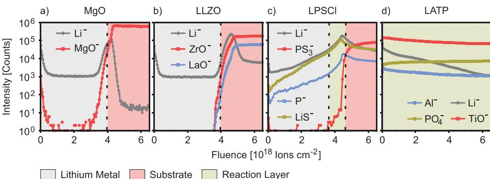
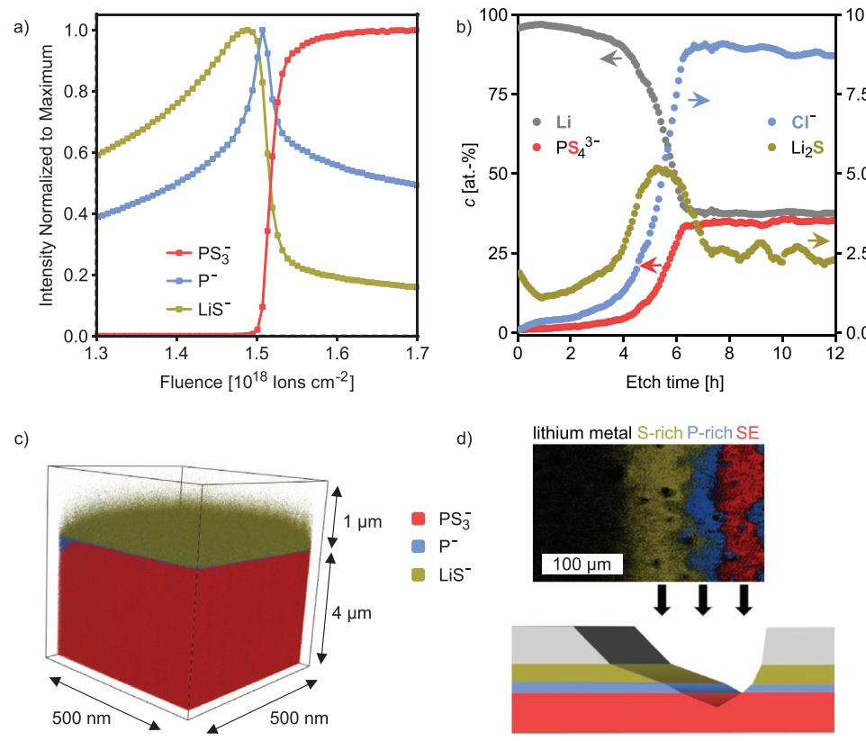
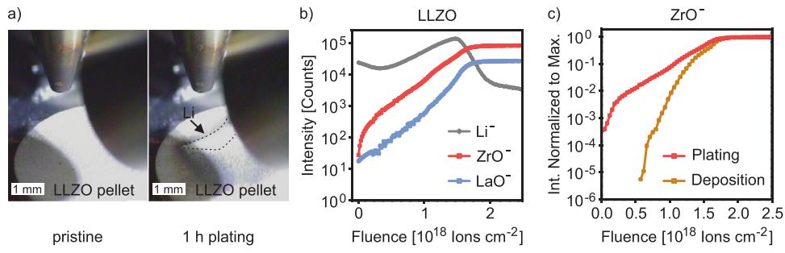
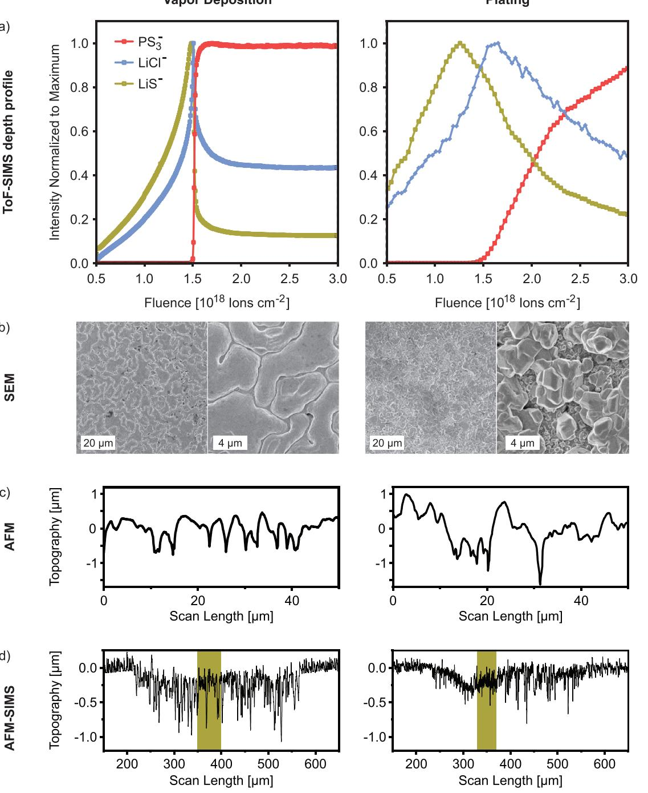

# **In Situ Investigation of Lithium Metal–Solid Electrolyte Anode Interfaces with ToF-SIMS**

*Svenja-K. Otto, Luise M. Riegger, Till Fuchs, Sven Kayser, Pascal Schweitzer, Simon Burkhardt, Anja Henss,\* and Jürgen Janek\**

**Solid-state batteries with a lithium metal anode (LMA) are promising candidates for the next generation of energy storage systems with high energy and power density. However, successful implementation of the LMA requires deeper insight into the lithium metal–solid electrolyte (Li**|**SE) interface. Since lithium is highly reactive, reaction products form when it comes into contact with most solid electrolytes (SEs) and the resulting interphase can have detrimental effects on cell performance. To better understand the formation of interphases, Li**|**SE interfaces are studied with time-of-flight secondary-ion mass spectrometry (ToF-SIMS), which provides chemical information with high sensitivity in 2D as well as 3D and is a valuable complement to commonly used techniques. To investigate the interphase, lithium is deposited in situ on SE pellets either through lithium vapor deposition or electrochemical lithium plating. Subsequent depth profiling provides information about the stability of the Li**|**SE interface and about the microstructure of the formed interphase. At the Li**|**Li6PS5Cl interface of lithium metal with argyrodite-type Li6PS5Cl, an apparently covering Li2S-rich layer is found as major part of the interphase. Independent of the deposition method, a combination of ToF-SIMS and atomic force microscopy indicates a thickness of about 250 nm for the Li2S-rich interlayer.**

S.-K. Otto, L. M. Riegger, T. Fuchs, S. Burkhardt, A. Henss, J. Janek Institute of Physical Chemistry Justus-Liebig-Universität Giessen Heinrich-Buff-Ring 17, D 35392 Giessen, Germany E-mail: anja.henss@phys.Chemie.uni-giessen.de; Juergen.Janek@phys.Chemie.uni-giessen.de S.-K. Otto, L. M. Riegger, T. Fuchs, P. Schweitzer, S. Burkhardt, A. Henss, J. Janek Center for Materials Research (ZfM) Justus-Liebig-Universität Giessen Heinrich-Buff-Ring 16, D 35392 Giessen, Germany S. Kayser IONTOF GmbH Heisenbergstraße 15, D 48149 Münster, Germany P. Schweitzer Institute of Applied Physics Justus-Liebig-Universität Giessen Heinrich-Buff-Ring 16, D 35392 Giessen, Germany

The ORCID identification number(s) for the author(s) of this article can be found under https://doi.org/10.1002/admi.202102387.

© 2022 The Authors. Advanced Materials Interfaces published by Wiley-VCH GmbH. This is an open access article under the terms of the Creative Commons Attribution-NonCommercial-NoDerivs License, which permits use and distribution in any medium, provided the original work is properly cited, the use is non-commercial and no modifications or adaptations are made.

#### **DOI: 10.1002/admi.202102387**

*Adv. Mater. Interfaces* **2022**, *9*, 2102387

# **1. Introduction**

The growing demand for electric vehicles and storage of renewable energy are strong driving forces behind intensive research on next-generation batteries.[1,2] They are expected to provide advantages over state-of-the-art lithium-ion batteries (LIBs) in terms of several key performance indicators, such as energy and power density, cycle lifetime, safety, and costs. Within this context, solid-state batteries (SSBs) are intensively explored as an emerging technology. Replacing the liquid electrolyte in conventional LIBs with a nonflammable solid electrolyte (SE) is expected to improve the battery safety. Furthermore, this transition is anticipated to allow the implementation of lithium metal as anode, a concept that may enable an exceptionally high energy density.[3,4]

Several approaches exist for implementing lithium metal anodes (LMAs) in the fabrication process of SSBs.[2] They are

based either on the use of thin lithium foils, the deposition of lithium metal by physical vapor deposition or from a lithium melt, or the electrochemical deposition of lithium from a lithiated cathode active material.[4,5] While the preparation and processing of thin lithium foils is challenging, the deposition of metals has generally proven to be scalable and economically feasible. These alternatives to implement the LMA differ by depositing lithium either during the cell assembly (deposition from the gas or liquid phase) or after cell assembly (electrochemical deposition). Especially the latter, which is often referred to as "anode-free" cell technology, appears to be highly attractive due the reduced amount of electrochemically inactive lithium excess, a reduced number of production steps, and the lack of a native passivation layer on typical commercial lithium foils.[6]

For the successful implementation of the LMA in SSBs, the lithium|SE interface (Li|SE interface) is critical, as (electro)chemical side reactions occur for most SEs. The degradation products that form at the Li|SE interface can cause a large interfacial resistance and lithium loss that adversely affect the battery performance. Despite its detrimental impact on the battery performance, the chemical composition and the structure of the forming interphase, as well as its microstructure, are rarely studied in detail. The properties of these interphases are determined by the interaction of lithium and the SE, which needs to be thoroughly investigated to understand the individual challenges, develop optimization strategies and, finally, enable LMAs in SSBs.[7,8]

In general, three types of Li|SE interphases have originally been defined by Wenzel et al.[9] First, the SE can be thermodynamically stable against lithium and no chemical reaction takes place. Consequently, the original 2D interface remains unchanged. In the second case, the SE is thermodynamically unstable against lithium metal and the formed reaction products create an interphase with noticeable partial electronic and ionic conductivity. Thus, the forming interphase does not hinder further reaction and the resulting mixed-conducting interphase (MCI) grows steadily.[8,10] The third possibility is the formation of a solid electrolyte interphase (SEI) with negligible electronic conductivity. In this case, the SE is thermodynamically unstable against lithium, but the electronically insulating properties of the forming reaction products prevent massive interphase formation on relevant time scales. Thus, the SE is kinetically stable.[9,11–13]

For the investigation and classification of Li|SE interfaces, different characterization strategies and methods were applied so far. Mostly, X-ray photoelectron spectroscopy (XPS) was used. For example, Wenzel et al. applied an in situ XPS approach to study the reaction between lithium metal and various SEs.[9] The authors used the internal argon ion sputter gun to deposit lithium from a target on the SE surface and analyzed the forming reaction products subsequently. With this strategy, the instability of lithium lanthanum titanate (LLTO) was investigated first.[9] In further studies, Wenzel et al. studied Li10GeP2S12 (LGPS), Li7P3S11, and argyrodite SEs in contact with lithium deposited through sputter deposition.[14–16] The XPS results were complemented by time-resolved electrochemical impedance spectroscopy measurements to follow the kinetics of the interphase formation, and the thickness of the SEI was estimated.[11,15] Liu et al. investigated the interaction of sulfide SE with lithium through a stepwise deposition of lithium on the SE surface and subsequent XPS characterization.[13] Also, the same authors described the effect of aging on the interphases.[15] In another XPS study, Wood et al. investigated the Li|Li2S–P2S5 interface with an operando approach.[12] They used the bias of an electron gun to bring Li to the SE surface and ultraviolet light to reverse this effect. By applying Auger electron spectroscopy, the authors found that the forming SEI is distributed inhomogeneously at the surface and shows a layered internal structure.[12] A similar operando study on LGPS and Li6PS5Cl (LPSCl) in contact with lithium was published.[17]

Recently, Connell et al. highlighted that the energy input at the interface is an important factor affecting the reactivity of Li7La3Zr2O12 with lithium metal.[18] For their study, the authors used a variety of in situ and operando XPS techniques and showed that the method for depositing lithium on the SE surface affects the reactivity with lithium metal.

Less frequently used methods for Li|SE interface characterization are transmission electron microscopy (TEM), time-of-flight secondary-ion mass spectrometry (ToF-SIMS), or others, as reviewed by Banerjee et al.[19] For example, in situ electron microscopy offers the possibility to study very thin reaction layers, as reported by Ma et al. and Hood et al., for the SEs Li7−3*x*Al*x*La3Zr2O12 and Li phosphorus oxynitride, respectively.[20,21] However, beam damage and artefacts caused by the energetic electron beam have to be taken into

account, even though the damage may be reduced by cryogenic temperatures.[22] The suitability of ToF-SIMS for studying Li|SE interfaces and interphases was demonstrated by Yang et al., who investigated LLTO after contact to lithium metal.[23] However, the method was not used to study different SEs systematically, and the important strength of ToF-SIMS to enable 3D elemental maps was not brought into play. 3D mapping with ToF-SIMS provides complementary information to that accessible with XPS and impedance characterization. In addition, ToF-SIMS bridges the length scale between XPS and TEM and is therefore a valuable complementary analytical tool.

In the present work, we focus on the characterization of Li|SE interfaces with ToF-SIMS. The interfaces are prepared either by lithium vapor deposition or electrochemical deposition. Depth profiling through micrometer-thick lithium layers on the SE substrate allows the classification of the interface type (stable, SEI, or MCI) and gives information about the 3D structure of interphases formed. In addition, we combine ToF-SIMS with complementary XPS analyses to confirm the structural information. The combination of ToF-SIMS and atomic force microscopy (AFM) is additionally used to obtain roughness and thickness information. For the argyrodite-type LPSCl, a widely used SE in SSBs, the thickness of the forming Li2S-rich interphase layer is determined and the influence of different in situ preparation methods of the Li|SE contact is investigated.

## **2. Results and Discussion**

For the ToF-SIMS investigation of Li|SE interfaces, we chose to characterize layered systems via depth profiling. With this approach, the good depth resolution of ToF-SIMS (down to 1 nm) can be used and 3D information is accessible. The samples for the study were SE pellets with a 1–3 µm thick lithium layer on top. The lithium layer was deposited on top of the SE pellets in situ either through thermal vapor deposition with an effusion cell, as described in Section S1 (Supporting Information) or by using a flood gun as "virtual" electrode. For analysis, depth profiling was conducted through the entire lithium layer and until signals related to the SE substrate were observed. The most suitable parameters for depth profiling are discussed in Section S2 (Supporting Information).

In the following sections, we focus first on the investigation of MgO as inert reference substrate and three different SEs, namely Li6.25Al0.25La3Zr2O12 (LLZO), LPSCl, and Li1.5Al0.5Ti1.5(PO4)3 (LATP), each with an in situ deposited lithium layer on top. It is shown how the stability of the materials can be classified through interpretation of the ToF-SIMS depth profiles. Next, we concentrate on LPSCl and show that – in addition to stability information – 3D structural information can be accessed from ToF-SIMS measurements. Complementary XPS analyses confirm the results and provide quantitative information. Afterward, the concept of in situ lithium plating with a "virtual" electrode is discussed in more detail. Last, the Li|SE layered systems prepared through lithium vapor deposition and those prepared by lithium plating on LPSCl are compared with respect to the obtained ToF-SIMS depth profiles. The analyses are complemented by AFM to access roughness and thickness information.

**Figure 1.** ToF-SIMS depth profiles through an originally 3 µm thick lithium layer on top of a) MgO, b) LLZO, c) LPSCl, and d) LATP substrates. The lithium layers were prepared by vapor deposition.

#### **2.1. Comparison of Different Li**|**SE Systems**

ToF-SIMS depth profiles through a 3 µm thick lithium layer vapor deposited on MgO, LLZO, LPSCl, and LATP are presented in **Figure 1** to provide a comprehensive overview on the results obtained from interfaces with a different stability against lithium metal. The (in)stability of all these materials is known from literature, which enables the interpretation of the profiles for the different samples.

First, MgO is shown (Figure 1a), which is stable against lithium[10,24] and can be used to document the depth profile for an inert material. The ToF-SIMS depth profile indicates that a covering layer of lithium forms on top of MgO, as no MgO− signal is detected at the beginning of the profile. The intensity at the very beginning of the profile is attributed to surface contamination signals in the MgO− *m*/*z* region. After a sputter fluence of about 4 × 1018 ions cm−2, the intensity of the MgO− signal increases quickly and becomes constant at a high signal intensity. Complementary to this, the Li− signal intensity is constant after sputtering through the uppermost surface layers, increases together with the first MgO− signals, and drops again afterward. The increase at the interface may derive from matrix effects, meaning that the increase in signal intensity is caused by the changing chemical environment and its influence on the ionization probability. Alternatively, the increase in Li− signal intensity may originate from reaction products formed with surface contaminations like hydrocarbons on the MgO substrate. For the interpretation of all ToF-SIMS depth profiles, it should be noted that Li signals are more intense for lithium-containing compounds than for the lithium metal itself (due to matrix effects). As a result, the Li− signal shows lower intensity in the region of the metallic lithium than at the surface or interface.[25]

As first SE, LLZO was investigated (Figure 1b). LLZO is a garnet-type oxide SE with an ionic conductivity of up to 1 mS cm−1 at room temperature. There is still debate about the stability of LLZO against lithium. LLZO is reported to be thermodynamically stable in contact with lithium,[26] however, some recent reports discuss, whether a very thin passivation layer is formed. Results by Connell et al.[18] indicate that the energy input upon contact is an important factor to consider when investigating a reaction layer. In any case, a formed interphase must be very thin and, e.g., Ma et al. reported a thickness of ≈5 unit cells.[20] Such a thin interphase would not be detectable by ToF-SIMS depth profiling. Consequently, LLZO resembles a stable SE for ToF-SIMS analyses and the ToF-SIMS depth profile shows close similarity to the one of MgO (see Figure 1a). LLZO-related signals appear only after prolonged sputtering and then increase rapidly to a constant signal intensity. The trend of the Li− signal is the same as for a MgO substrate, except for the intensity after reaching the bulk substrate, since LLZO contains lithium ions. The maximum in Li− signal intensity at the interface may again originate from matrix effects or contaminations on the substrate. Also, the sputter fluence required until the first LLZO-related signals appear is almost the same as for MgO. This similarity confirms that LLZO is stable against lithium. If an interlayer forms, it must be very thin and cannot be detected by ToF-SIMS depth profiling, which is consistent with the literature cited.

The next material analyzed is LPSCl, an argyrodite-type SE for which an ionic conductivity of about 2 mS cm−1 at room temperature has been reported.[2] Therefore, LPSCl is considered to be one of the best choices for SSB.[27] For LPSCl, the formation of a SEI in contact with lithium was found by XPS. As reaction products, Li3P, Li2S, and LiCl were reported.[15] Right in the beginning of the ToF-SIMS depth profile, SE-related signals like LiS− are detected. Also, these SE-related signals show a clear evolution and a maximum in intensity before the substrate region is reached. This indicates a layered structure of reaction products accumulated at the LPSCl interface forming the SEI. At a sputter fluence slightly higher than that required in experiments on MgO and LLZO, additional signals like the PS3 − fragment appear and rapidly increase in intensity, probably indicating that the LPSCl substrate is reached.

Finally, LATP, which is a NASICON-type oxide SE (Na super ion conductor), was investigated. For LATP, the formation of a MCI was found as Ti4+ is reduced to its metallic state in contact with lithium. This leads to an increase of the partial electronic conductivity of the material. In combination with the ionic conductivity of the forming reaction products, a continuous reaction of LATP and lithium is possible.[10,28] As expected for MCI-forming SEs, the ToF-SIMS depth profile looks completely different than the profiles observed previously. SE-related signals are intense from the very beginning of the depth profile on and only a slight increase in intensity is observed until the substrate should be reached corresponding to the fluence. Also, no **www.advancedsciencenews.com**

additional SE signals appear through sputtering, which probably indicates that the lithium layer is completely converted into the MCI. This is in accordance with the reported ongoing reaction between LATP and lithium.

#### **2.2. Classification of Li**|**SE Interfaces**

Based on the presented results, indicators for the classification of the stability of SEs in contact with lithium from ToF-SIMS depth profiles of Li|SE layered systems can be derived. For inert materials, no SE-related signals are present at the beginning of the profile. Also, the fluence required until substrate signals are detected matches for different inert materials if the same amount of lithium is vapor deposited. For calibration, MgO can be used as a substrate.

SEs that form a stable SEI show maxima in the intensity of SE-related signals, indicating the SEI before the substrate is reached. These signals may already appear at the beginning of the profiles and their intensity depends on the amount of vapor deposited lithium and the thickness of the forming SEI. Please note that the amount of deposited lithium that is optimal to classify different materials will vary depending on the thickness of the forming SEI. In the case of potentially thick SEIs, the deposition of different amounts of lithium is recommended, starting with low amounts. For the formation of a SEI, an increasing amount of deposited lithium will add a longer period of increasing signal intensity at the beginning of the depth profile.

For the formation of a MCI, the intensity of SE-related signals is high throughout the complete depth profile. Depending on the amount of lithium deposited, the material may have reacted to such an extent that the unaltered SE region can no longer be reached by sputtering. Also, in case of MCI formation, the deposition of a higher amount of lithium will not prevent or reduce the detection of SE-related signals, at least not for amounts that can react in the given time. In case of doubt, it is recommended to measure the sample several times after some waiting time (e.g., one week). In the case of a MCI, the reaction layer will grow strongly in short time periods, whereas the growth of a SEI is negligible and the ToF-SIMS depth profiles are unchanged over time, as shown for LPSCl in Section S3 (Supporting Information).

At this point, we like to emphasize that the distinction between SEI- and MCI-type interfaces is not sharp, since the rate of negligible interphase growth is rather undefined. Cell tests with impedance spectroscopy are necessary to find out whether the interfacial resistance attributed to the interphase growth is too high for a specific application. However, the analytical approach presented herein is valuable for understanding the cell test results and for finding strategies to overcome possible limitations.

#### **2.3. Microstructure of the Li**|**LPSCl Interphase**

ToF-SIMS depth profiles of Li|SE layered systems can also provide information about the 3D structure of the forming interphase. This is shown in the following text for the example of LPSCl, as investigation with TEM is difficult for thiophosphate SEs due to electron beam damage. Depth profiles of LPSCl with 1 µm of vapor deposited lithium on top are shown in **Figure 2**.

The normalized intensity data obtained during ToF-SIMS depth profiling are depicted with a linear instead of a logarithmic intensity scale. This shows the increasing signal intensity for SE-related signals like the LiS− signal before reaching the substrate even clearer and makes it also possible to identify the intensity maxima of different species. Interestingly, the maxima are reached after different fluences, which indicate a layered structure. It is clearly observed that the maximum of the LiS− signal is reached first and that the maximum for the P− signal follows later before the substrate, indicated by the PS3 − signal, is reached. The distribution of Cl signals is similar to P signals, which can be seen in Figure 4.

The assumption of a layered SEI structure is confirmed by the 3D representation of the depth profile in Figure 2c. Apparently, a layer of S-related species is observed at the interface toward the lithium metal layer. It is followed by a P-enriched layer toward the SE interface. Laterally, the LiS− and P− intensities are distributed homogenously, giving the impression of well-covering layers. Another way to assess the layered structure of the SEI is to image a wedge-shaped crater, as shown in Figure 2d. A wedge is a sputter crater prepared with increasing dose in one lateral direction. Please note that it is not possible to gain any direct depth information from the wedge image, as the sputter rates of the different layers and accordingly the slope of the regions may be different. This accounts also for the given depth profile. For the shown Li|LPSCl wedge, the depth of the crater increases from left to right. Accordingly, the 2D projection of the chemical composition within the wedge shows first an increasing LiS− signal intensity, then the P− signal becomes more intense before the substrate signal PS3 − is reached. The lateral distribution of the different species perpendicular to the direction in which the sputter dose was increased can also be assessed. Only slight deviations are observed in all signals, yet the qualitative sequence is not affected and the impression of covering layers is maintained at the length scale and resolution examined.

As SIMS is a semiquantitative method, changes in signal intensity may also be attributed to a changing matrix when reaching the substrate region. Therefore, XPS depth profiles of the Li|LPSCl sample were also recorded. The results presented in Figure 2b show a maximum for the S-concentration in the form of Li2S at lower etch time compared to the etch time at which the S-concentration in the form of PS4 3−, representing the substrate, reaches its full intensity. A comparison of the atomic concentrations of the Cl-concentration in the form of Cl− as well as the S- and P-concentrations in the form of PS4 3− can be found in Section S4 (Supporting Information). No maxima were found for the complementing SEI compounds Li3P and LiCl. This can originate either from a compound concentration below the detection limit, or from a chemical shift that is not pronounced enough to differentiate the signals of SE and reaction products by XPS. However, it seems reasonable that the enrichment of a S species in one layer comes along with an enrichment of the other elements in a different region to fit the chemical composition of the SE. The ToF-SIMS results indicate that this enrichment is present between a Li2S-rich layer

**Figure 2.** Characterization of the Li|LPSCl interface with ToF-SIMS and XPS. For the measurements, 1 µm of lithium was vapor deposited on a LPSCl pellet. a) ToF-SIMS depth profile, b) XPS depth profile: atomic percentages are given for the elements presented in bold and color. Please mind the two different scales, the arrows point toward the scale of the corresponding data and the labels are oriented accordingly. c) 3D representation of the ToF-SIMS depth profile and d) ToF-SIMS imaging of a wedge crater.

and the SE pellet. Such a layered structure for the Li|LPSCl interphase is supported by the operando XPS data reported by Davis et al.[17] They plated lithium on the LPSCl SE and detected the resulting reaction products by XPS. Measurements after increasing lithium plating times show that Li2S is detected much longer than P and Cl reaction products. Accordingly, the formation of Li2S extends possibly significantly deeper into the lithium.[17]

#### **2.4. In Situ Lithium Plating**

As recent studies show, the way how the Li|SE contact is created may influence the interface reactivity.[18] Also, different preparation methods may mimic the various cell concepts of SSB with LMA. Therefore, a second option to study the interfaces was tested by plating lithium electrochemically on top of the materials directly in the ToF-SIMS chamber. For this purpose, the flood gun of the SIMS instrument was used as virtual electrode to induce a lithium-ion flux through the SE. The resulting lithium film and the corresponding ToF-SIMS depth profile are shown for LLZO in **Figure 3**a,b, respectively.

As the picture of the sample after 1 h of plating already indicates, the plated lithium film is inhomogeneously distributed and the thickness varies across the substrate surface. Still, on the lateral scale of few hundreds of micrometers, the film is relatively homogenous and ToF-SIMS measurements can be conducted to obtain reliable and meaningful results. The intensity data obtained by depth profiling through the lithium layer show a low intensity for LLZO-related signals at the beginning, followed by an exponential increase until the signal intensities become constant. As it is known that LLZO is stable against lithium, the observation of a slower intensity increase for substrate signals compared to the sample with vapor deposited lithium indicates a higher roughness of the plated lithium layer. For a better comparison, the ZrO− depth profiles for plated and vapor deposited lithium are compared in Figure 3c. Due to the higher roughness of the plated lithium, the LLZO substrate is reached at various fluences for different spots of the measurement area and the profile is smeared out. Consequently, a direct comparison of ToF-SIMS depth profiles for vapor deposited and plated lithium layers is not possible. To overcome this limitation, we combined ToF-SIMS with AFM for further investigations.

#### **2.5. Comparison of Lithium Vapor Deposition with Plating for LPSCl**

For the AFM–SIMS study, a vapor deposited lithium layer is compared with a plated layer for LPSCl, as shown in **Figure 4**. AFM does not only allow to measure the roughness of the samples but also gives access to depth information through measuring the dimensions of the ToF-SIMS crater at defined points

**Figure 3.** In situ lithium plating on LLZO. a) Camera images showing the LLZO sample before and after 1 h of lithium plating. b) ToF-SIMS depth profile through the plated lithium film and c) comparison of the ZrO− signals from depth profiles through plated and vapor deposited lithium on LLZO. For better comparison, the fluence scale was shifted by 2.5 × 1018 ions cm−2 for the vapor deposited sample to match the point where the highest signal intensity is reached for both measurements.

of the depth profile. This information is used to determine the thickness of the forming Li2S-rich layers as dominant part of the observed SEI.

Only judging from the ToF-SIMS depth profile through vapor deposited and plated lithium on LPSCl shown in Figure 4a, the Li2S-rich layer defined by the LiS− signal seems to be thicker after plating, as the region of high intensity is broader. However, as shown previously, roughness effects need to be considered. Scanning electron microscope (SEM) and AFM measurements of the lithium layers in Figure 4b,c, respectively, show that the plated lithium is rougher than the vapor deposited lithium, as already indicated by the results obtained for LLZO. From the AFM measurements, a surface roughness of (189 ± 14) and (297 ± 56) nm was determined for vapor deposited and plated lithium layers on LPSCl, respectively. Both values are significantly higher than the roughness of pristine LPSCl pellets of (85 ± 25) nm.

SEM and AFM investigations of the vapor deposited sample show an island-like growth with pits between the different islands. The pits may serve as a reasonable explanation for the observation of SEI-related signals like LiS− at the beginning of the ToF-SIMS depth profiles. A complete exposure of the substrate is unlikely as no substrate signals are detected before sputtering. In addition, imaging indicates covering layers as discussed previously. Consequently, the hollow parts of the surface seem to play a minor role for the overall intensity data obtained during depth profiling. For the plated sample, the lithium shows an inhomogeneous structure with facets, typically observed in crystalline materials, as well as holes. However, the ToF-SIMS depth profile indicates that the plated lithium film is covering, since no substrate signals are detected before sputtering. Still, the very inhomogeneous structure causes the observed broadening of the depth profile. Additionally, the roughness probably leads to pronounced preferential sputtering.

To determine the actual thickness of the Li2S layers, homogenous areas were defined according to the LiS− and PS3 − signals in the ToF-SIMS depth profiles. The criteria for homogeneity of certain areas are that the signal intensities detected at positions within an area develop comparably at the same fluence and do not show a pronounced lateral gradient. In the defined areas, the difference profiles of AFM measurements were used to obtain depth information. The beginning and end of the Li2S-rich layers were defined by the fluence at the inflection points of the LiS− signal intensity. The corresponding difference profiles of AFM scans before and after the Li2S reaction layer are shown in Figure 4d. The regions used for thickness evaluation are marked in brown. The determined average thicknesses are (269 ± 35) nm for vapor deposited lithium and (251 ± 26) nm for plated lithium. According to these values, the thickness of the Li2S layer formed between lithium and LPSCl through vapor deposition and plating is the same within the uncertainty of the experiments. The sputter yield calculated for the Li2S layers from the AFM–SIMS measurements was 1.5 ± 0.2, which fits with the one determined for a Li2S pellet (1.4 ± 0.1). However, the generally high roughness of the samples and the high sputter rate for the underlying LPSCl substrate (about twice the sputter rate for Li2S) complicate the analysis and cause the reported uncertainty range of about 50 nm.

In literature, the thickness of various Li|SE interphases was estimated from impedance measurements.[14,16] For LPS, which behaves quite similar to LPSCl in impedance measurements and which was also tested to show a similar ToF-SIMS depth profile after lithium deposition, a thickness of only 23 nm after one year of growth was estimated.[15] This is one order of magnitude lower than the value determined with AFM–SIMS after one week. A possible explanation for the discrepancy may be the different interface preparation. For the mentioned impedance measurements, lithium foil, which is natively covered by a thin passivation layer, was pressed to a LPSCl pellet. The lithium foil might then be less reactive than vapor deposited or plated lithium, which naturally leads to a thinner interphase. Also, for the analysis of impedance data, the SEI thickness was estimated assuming Li2S bulk properties, which may differ substantially from the actual conductivity of the interphase. Impedance measurements of differently prepared lithium films could help to improve the understanding of the experiments.

# **3. Conclusions**

ToF-SIMS depth profiling is used to study Li|SE interfaces and the interphase formation taking place at such interfaces. As samples SE pellets with a micrometer-thick lithium layer on top were investigated. Stable, SEI forming, and MCI forming SEs can be differentiated from the SIMS depth profiles of thermally **www.advancedsciencenews.com**

**Figure 4.** Comparison of Li|LPSCl interfaces with vapor deposited and plated lithium layers. For the measurements, 1 µm of lithium was vapor deposited on LPSCl. Alternatively, lithium was plated for 1 h, which leads to a similar average thickness of lithium in the plating region, based on the fluence that is needed to detect the first substrate signals. a) ToF-SIMS depth profiles, b) SEM surface images, c) AFM surface scans, and d) AFM–SIMS difference profiles of scans before and after the Li2S-rich reaction layer.

deposited lithium layers. For stable SEs, no SE-related signals are detected at sputter fluences below the fluence required to reach the substrate. For SEI- and MCI-forming SEs, SE-related signals are detected at lower fluences. In the case of a SEI, a significant increase and maxima of the signal intensities are observed during depth profiling toward the substrate. In contrast to that, the formation of a MCI results in high signal intensities for SE-related species throughout the whole depth profile. To distinguish a thick SEI from a MCI, deposition of different thicknesses of lithium and measurements after different times for sample storage can be used. In addition to this classification, ToF-SIMS measurements give information on

**www.advmatinterfaces.de**

the 3D structure of the forming interphases. A layered structure with Li2S on top of potential P− and Cl− enrichments is found for LPSCl. Complementary XPS analyses confirmed the Li2S layer between lithium and LPSCl substrate.

To account for the possible influence of differently deposited lithium, we compared Li|SE interfaces prepared by lithium vapor deposition and lithium plating. In this comparison, the roughness of the lithium layer plays an important role. The higher roughness of the plated lithium leads to the impression that plating results in a thicker SEI on LPSCl than vapor deposition. The combination of SIMS and AFM allows to account for this issue and to determine the thickness of the SEI layers that form. AFM–SIMS measurements demonstrate that the thickness of the Li2S-rich layer between lithium and LPSCl has a comparable value of about 250 nm for lithium vapor deposition and lithium plating. For the reported material system and with respect to the application of lithium metal as anode active material in solid-state batteries, this information is crucial for understanding and modeling the charge transport across this interphase as well as the resulting limitations. Modifications of the Li|SE interphase, e.g., through chemical engineering or other approaches for interface design and optimization will also benefit greatly from knowledge of the internal interphase structure.

Wenzel et al. estimated a much thinner SEI of about 23 nm after one year of growth for LPS, which behaves very similar to LPSCl in impedance measurements and ToF-SIMS depth profiles.[15] We like to note that these values result from the assumption of a too low ionic conductivity of the SEI. Wenzel et al. measured the resistance of the SEI with impedance spectroscopy and assumed that the SEI shows the bulk conductivity of Li2S.[15] In the light of our current results, this assumption was incorrect at least by one order of magnitude. In fact, we conclude that the ionic conductivity of the SEI is at least a factor of 10 higher compared to the conductivity of bulk Li2S, which is reasonable for a nanocrystalline Li2S layer within the SEI.

Overall, ToF-SIMS is a valuable technique to expand the knowledge on Li|SE interphases. The method described can be used to analyze a wide variety of materials, including those that may be sensitive to beam damage in TEM analyses. Through ToF-SIMS depth profiling, detailed information regarding the stability of the SE and the 3D structure of the forming interphase are accessible in comparably short time. Moreover, the information shown is complementary to that of commonly used XPS and impedance measurements. By combining ToF-SIMS with AFM, roughness and thickness information can be added to provide a complete picture of the Li|SE interphase.

## **4. Experimental Section**

All sample handling and transfer was done under argon atmosphere (*p*(H2O)/*p* < 0.1 ppm, *p*(O2)/*p* < 0.1 ppm) to protect the samples from reaction with atmosphere components.

*Materials*: As reference substrate, MgO (CrysTec) was used. LPSCl was purchased from NEI Corporation (USA). LLZO was prepared as described previously.[29] LATP was prepared through the sol–gel route previously reported by Ma et al.[30] White TiO2/Ti(OH)2 nanoparticles were precipitated by slowly adding titanium(IV) isopropoxide (17 g) in deionized water (100 mL). These were filtered and washed with

deionized water before being redissolved in freshly prepared nitric acid (2 m, 150 mL). Afterward, citric acid monohydrate (25 g), LiNO3 (4.137 g), Al(NO3)3·9 H2O (7.506 g), and NH4H2PO4 (13.804 g) were added, gelation occurred after the addition of the latter. The gel was dried, crushed, and calcined in air heating at 2 °C min−1 to 650 °C for 3 h to give white nanopowders. To reduce particle agglomeration, the calcined powder was ball-milled using 3 mm ZrO2 milling media at 120 rpm for 6 h with mass ratios of LATP:EtOH:ZrO2 equal to 1:1.5:20. After ethanol evaporation, 250 mg of powders in a 13 mm cylindrical mold were uniaxially shaped at 150 MPa and then isostatically pressed at 500 MPa for 30 min. The obtained pellets were sintered, heating at 2 °C min−1 to 950 °C for 5 h in air, achieving samples with a geometrical density >97% of the theoretical value. Each surface of the pellets was polished with SiC paper up to P4000, ultrasonicated for 10 min in acetone, and recrystallized by heating at 2 °C min−1 to 900 °C without holding the temperature.

*Lithium Vapor Deposition*: A lithium rod (99.8%, abcr GmbH) was cut into smaller pieces as vapor source. The lithium pieces were placed in a crucible of a NTEZ low-temperature effusion cell (MBE Components). Lithium was vapor deposited at a crucible temperature of 450 °C. After a deposition time of 10 min, a lithium layer of 1 µm thickness had formed.

*Lithium Plating*: For lithium plating, thin slices of a lithium rod (99.8%, abcr GmbH) were pressed onto the SE pellets with a Cu foil as underlay. The plating samples were attached to the sample holder with Cu tape for electrical contact. In situ plating was achieved by placing the sample under the analyzer and switching on the flood gun (21 eV, 10 µA) of the SIMS instrument. The current corresponded to a current density of ≈0.1 mA cm−2 assuming that one sixteenth of the pellet surface was the actual plating area. 1 h of plating resulted in a lithium layer thickness of about 1 µm in the corresponding area. Subsequently, the samples were analyzed as described below, but without using the flood gun.

*ToF-SIMS*: ToF-SIMS measurements were carried out with a ToF. SIMS 5 instrument (IONTOF GmbH), equipped with a 25 kV Bi cluster primary-ion gun for analysis and a dual-source column for Cs+ depth profiling. Depth profiles were measured in spectrometry mode (bunched, about 40 000 cts s−1 , full width at half maximum (FWHM) *m*/Δ*m* = 5000@*m*/*z* = 17.00 (OH−)) with Cs+ (300 × 300 µm2, 2 kV, 130 nA) as sputter species and Bi+ (1.2 pA, 100 × 100 µm2) as primary ions. Between 25 s sputter steps with 2 s pause time, 5 frames with 2 shots frame−1 pxl−1 and 128 × 128 pxl were analyzed in random raster mode. The wedge was prepared with a size of 400 × 400 µm2 with Cs+ (2 kV, 130 nA). 6 cycles with 25 ms of maximal dwell time were used for preparation. Images were recorded in fast-imaging mode (unbunched, about 20 000 cts s−1 , FWHM *m*/Δ*m* = 80@*m*/*z* = 17.00 (OH−)). 50 scans were measured in sawtooth mode, with 1024 × 1024 pxl, a field of view of 500 × 500 µm2, 1 frame scan−1 , and 1 shot frame−1 pixel−1 . For all measurements, the cycle time was 100 µs and negative polarity was used. Data were evaluated with SurfaceLab 7.2 (IONTOF GmbH). If not stated differently, the samples were electrically isolated from the sample holder and measured with electron neutralization of the flood gun.

*XPS*: A PHI 5000 VersaProbe II Scanning ESCA Microprobe (Physical Electronics) with monochromatized Al K*α* X-ray source (beam diameter of 200 µm, X-ray power of 50 W) was used to measure XP spectra. To sputter through the sample, an acceleration voltage of 2 kV and an argon ion current of 4 µA were used for 5 min per step while rotating the sample with 360° min−1 to get a homogeneous sputter crater. An analyzer pass energy of 46.95 eV, a step time of 50 ms, and a step size of 0.2 eV were used for measuring the detail spectra. Samples were measured with a floating potential and the surface was charge neutralized with slow electrons and argon ions. CasaXPS software was used for data evaluation and the charge correction was done using the PS4 3− signals in the S2p (161.8 eV) and P2p (131.2 eV) spectra.

*SEM*: SEM images were acquired with a Merlin high-resolution SEM (Carl Zeiss AG) at a pressure in the low 10−6 mbar range, an electron acceleration voltage of 1 kV, and a probing current of 100 pA. An in-lens detector was used.

*AFM Roughness*: AFM was performed with a VacuScope 1000 microscope from AIST-NT, which was operated in AC mode under high vacuum below 10−4 Pa using an inert gold coated 160AC-GG probe from Opus. A custombuilt transfer module was used to prevent air contact of the samples during transport from the inert glove box atmosphere into the AFM system. Surface roughness parameters were evaluated with Gwyddion 2.55 from 50 µm line scans at scan rates between 0.02 and 0.1 Hz. The data were leveled by subtracting the mean of the measured height. Surface roughness was determined by taking the average *R*a value of 15 line scans. The standard deviation of the 15 measurements was given as uncertainty of the roughness.

*AFM–SIMS*: The combined ToF-SIMS/AFM measurements were carried out with a M6 Plus instrument (IONTOF GmbH), equipped with a 30 kV Bi cluster primary-ion gun for analysis and a dual-source column for Cs+ depth profiling. Depth profiles were measured in spectrometry mode (bunched, about 200 000 cts s−1 , FWHM *m*/Δ*m* = 9000@*m*/*z* = 17.00 (OH−)) with Cs+ (300 × 300 µm2 , 2 kV, 140 nA) as sputter species and Bi+ (2.5 pA, 100 × 100 µm2 ) as primary ions. Between 5 s sputter steps with 0.5 s pause time, 1 frame with 1 shot frame−1 pxl−1 and 128 × 128 pxl was analyzed in random raster mode. Negative polarity and a cycle time of 80 µs were used. For the AFM scans, a Ni cantilever with pyramidal boron-doped diamond tip was used in contact mode. Data were analyzed with SurfaceLab 7.2 (IONTOF GmbH). Thickness information was accessed through the height difference of AFM scans over the ToF-SIMS craters at initial and final positions of the evaluated region. For determining the thickness of the Li2S-rich region, the inflection points of the LiS− signal intensity were used to define the initial and final positions. The uncertainty was determined from the average variation of the AFM difference profiles outside the sputter crater.

# **Supporting Information**

Supporting Information is available from the Wiley Online Library or from the author.

## **Acknowledgements**

The authors like to thank Enrico Trevisanello for the synthesis of LATP SE and Jonas Horn for his help with AFM measurements. The authors acknowledge the financial support by the Bundesministerium für Bildung und Forschung (BMBF) within the FestBatt – Cluster of Competence for Solid-State Batteries (Grant Nos. 03XP0176D, 03XP0180). S.-K.O. acknowledges the financial support (Kékulé scholarship) by the Funds of the Chemical Industry (FCI). T.F. acknowledges the funding by the BMBF within the LiSI project (Grant No. 03XP0224E).

Open access funding enabled and organized by Projekt DEAL.

# **Conflict of Interest**

The authors declare no conflict of interest.

## **Data Availability Statement**

The data that support the findings of this study are available from the corresponding author upon reasonable request.

## **Keywords**

interphase formation, lithium metal anodes, solid electrolytes, solidstate batteries, ToF-SIMS

Received: December 4, 2021

- Revised: February 14, 2022
- Published online: March 17, 2022

- [1] a) M. J. Wang, E. Kazyak, N. P. Dasgupta, J. Sakamoto, *Joule* **2021**, *5*, 1371; b) S. Randau, D. A. Weber, O. Kötz, R. Koerver, P. Braun, A. Weber, E. Ivers-Tiffée, T. Adermann, J. Kulisch, W. G. Zeier, F. H. Richter, J. Janek, *Nat. Energy* **2020**, *5*, 259.
- [2] Y.-G. Lee, S. Fujiki, C. Jung, N. Suzuki, N. Yashiro, R. Omoda, D.-S. Ko, T. Shiratsuchi, T. Sugimoto, S. Ryu, J. H. Ku, T. Watanabe, Y. Park, Y. Aihara, D. Im, I. T. Han, *Nat. Energy* **2020**, *5*, 299.
- [3] a) J. Janek, W. G. Zeier, *Nat. Energy* **2016**, *1*, 16141; b) T. Krauskopf, F. H. Richter, W. G. Zeier, J. Janek, *Chem. Rev.* **2020**, *120*, 7745; c) Y.-K. Sun, *ACS Energy Lett.* **2020**, *5*, 3221.
- [4] Y. Guo, H. Li, T. Zhai, *Adv. Mater.* **2017**, *29*, 1700007.
- [5] J. Liu, Z. Bao, Y. Cui, E. J. Dufek, J. B. Goodenough, P. Khalifah, Q. Li, B. Y. Liaw, P. Liu, A. Manthiram, Y. S. Meng, V. R. Subramanian, M. F. Toney, V. V. Viswanathan, M. S. Whittingham, J. Xiao, W. Xu, J. Yang, X.-Q. Yang, J.-G. Zhang, *Nat. Energy* **2019**, *4*, 180.
- [6] a) M. J. Wang, E. Carmona, A. Gupta, P. Albertus, J. Sakamoto, *Nat. Commun.* **2020**, *11*, 1; b) S.-K. Otto, T. Fuchs, Y. Moryson, C. Lerch, B. Mogwitz, J. Sann, J. Janek, A. Henss, *ACS Appl. Energy Mater.* **2021**, *4*, 12798.
- [7] a) R. Chen, Q. Li, X. Yu, L. Chen, H. Li, *Chem. Rev.* **2020**, *120*, 6820; b) A. Gurung, J. Pokharel, A. Baniya, R. Pathak, K. Chen, B. S. Lamsal, N. Ghimire, W.-H. Zhang, Y. Zhou, Q. Qiao, *Sustainable Energy Fuels* **2019**, *3*, 3279; c) K. J. Kim, M. Balaish, M. Wadaguchi, L. Kong, J. L. M. Rupp, *Adv. Energy Mater.* **2020**, *11*, 2002689; d) Y. Xiao, Y. Wang, S.-H. Bo, J. C. Kim, L. J. Miara, G. Ceder, *Nat. Rev. Mater.* **2020**, *5*, 105; e) X. Chen, J. Xie, X. Zhao, T. Zhu, *Adv. Energy Sustainability Res.* **2021**, *2*, 2000101; f) C.-Z. Zhao, H. Duan, J.-Q. Huang, J. Zhang, Q. Zhang, Y.-G. Guo, L.-J. Wan, *Sci. China: Chem.* **2019**, *62*, 1286.
- [8] L. M. Riegger, R. Schlem, J. Sann, W. G. Zeier, J. Janek, *Angew. Chem., Int. Ed. Engl.* **2021**, *60*, 6718.
- [9] S. Wenzel, T. Leichtweiss, D. Krüger, J. Sann, J. Janek, *Solid State Ionics* **2015**, *278*, 98.
- [10] P. Hartmann, T. Leichtweiss, M. R. Busche, M. Schneider, M. Reich, J. Sann, P. Adelhelm, J. Janek, *J. Phys. Chem. C* **2013**, *117*, 21064.
- [11] F. J. Simon, M. Hanauer, F. H. Richter, J. Janek, *ACS Appl. Mater. Interfaces* **2020**, *12*, 11713.
- [12] K. N. Wood, K. X. Steirer, S. E. Hafner, C. Ban, S. Santhanagopalan, S.-H. Lee, G. Teeter, *Nat. Commun.* **2018**, *9*, 1.
- [13] Z. Liu, A. Borodin, G. Li, X. Liu, Y. Li, F. Endres, *J. Phys. Chem. C* **2020**, *124*, 300.
- [14] S. Wenzel, S. Randau, T. Leichtweiß, D. A. Weber, J. Sann, W. G. Zeier, J. Janek, *Chem. Mater.* **2016**, *28*, 2400.
- [15] S. Wenzel, S. J. Sedlmaier, C. Dietrich, W. G. Zeier, J. Janek, *Solid State Ionics* **2018**, *318*, 102.
- [16] S. Wenzel, D. A. Weber, T. Leichtweiss, M. R. Busche, J. Sann, J. Janek, *Solid State Ionics* **2016**, *286*, 24.
- [17] A. L. Davis, E. Kazyak, D. W. Liao, K. N. Wood, N. P. Dasgupta, *J. Electrochem. Soc.* **2021**, *168*, 070557.
- [18] J. G. Connell, T. Fuchs, H. Hartmann, T. Krauskopf, Y. Zhu, J. Sann, R. Garcia-Mendez, J. Sakamoto, S. Tepavcevic, J. Janek, *Chem. Mater.* **2020**, *32*, 10207.
- [19] A. Banerjee, X. Wang, C. Fang, E. A. Wu, Y. S. Meng, *Chem. Rev.* **2020**, *120*, 6878.
- [20] C. Ma, Y. Cheng, K. Yin, J. Luo, A. Sharafi, J. Sakamoto, J. Li, K. L. More, N. J. Dudney, M. Chi, *Nano Lett.* **2016**, *16*, 7030.
- [21] Z. D. Hood, X. Chen, R. L. Sacci, X. Liu, G. M. Veith, Y. Mo, J. Niu, N. J. Dudney, M. Chi, *Nano Lett.* **2021**, *21*, 151.
- [22] Y. Li, Y. Li, A. Pei, K. Yan, Y. Sun, C.-L. Wu, L.-M. Joubert, R. Chin, A. L. Koh, Y. Yu, J. Perrino, B. Butz, S. Chu, Y. Cui, *Science* **2017**, *358*, 506.
- [23] K.-Y. Yang, I.-C. Leu, K.-Z. Fung, M.-H. Hon, M.-C. Hsu, Y.-J. Hsiao, M.-C. Wang, *J. Mater. Res.* **2008**, *23*, 1813.
- [24] R. J. Lauf, J. H. DeVan, *J. Electrochem. Soc.* **1992**, *139*, 2087.

**www.advancedsciencenews.com**

- [25] S.-K. Otto, Y. Moryson, T. Krauskopf, K. Peppler, J. Sann, J. Janek, A. Henss, *Chem. Mater.* **2021**, *33*, 859.
- [26] a) F. Han, Y. Zhu, X. He, Y. Mo, C. Wang, *Adv. Energy Mater.* **2016**, *6*, 1501590; b) K. Fu, Y. Gong, B. Liu, Y. Zhu, S. Xu, Y. Yao, W. Luo, C. Wang, S. D. Lacey, J. Dai, Y. Chen, Y. Mo, E. Wachsman, L. Hu, *Sci. Adv.* **2017**, *3*, e1601659.
- [27] a) T. Chen, L. Zhang, Z. Zhang, P. Li, H. Wang, C. Yu, X. Yan, L. Wang, B. Xu, *ACS Appl. Mater. Interfaces* **2019**, *11*, 40808; b) F. Zhao, Q. Sun, C. Yu, S. Zhang, K. Adair, S. Wang, Y. Liu, Y. Zhao, J. Liang, C. Wang, X. Li, X. Li, W. Xia, R. Li, H. Huang,

L. Zhang, S. Zhao, S. Lu, X. Sun, *ACS Energy Lett.* **2020**, *5*, 1035; c) S. Wang, X. Zhang, S. Liu, C. Xin, C. Xue, F. Richter, L. Li, L. Fan, Y. Lin, Y. Shen, J. Janek, C.-W. Nan, *J. Materiomics* **2020**, *6*, 70.

- [28] Z. Tong, S.-B. Wang, Y.-K. Liao, S.-F. Hu, R.-S. Liu, *ACS Appl. Mater. Interfaces* **2020**, *12*, 47181.
- [29] T. Krauskopf, H. Hartmann, W. G. Zeier, J. Janek, *ACS Appl. Mater. Interfaces* **2019**, *11*, 14463.
- [30] Q. Ma, Q. Xu, C.-L. Tsai, F. Tietz, O. Guillon, *J. Am. Ceram. Soc.* **2016**, *99*, 410.