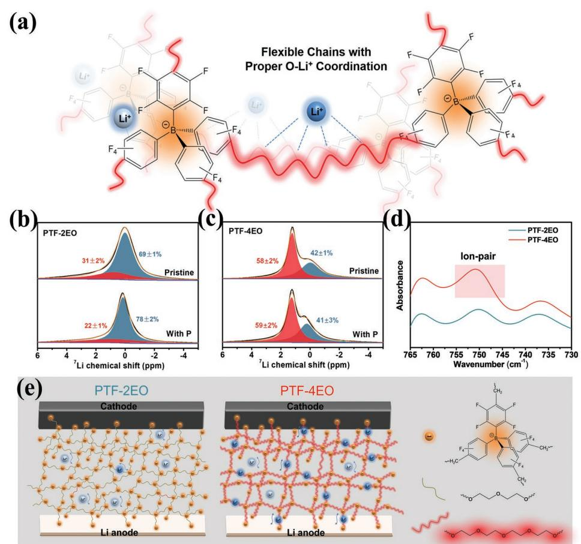
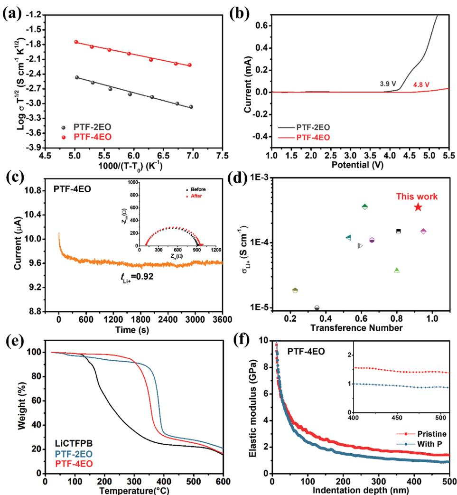
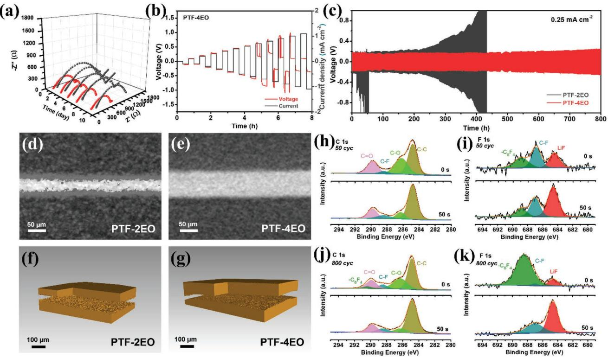
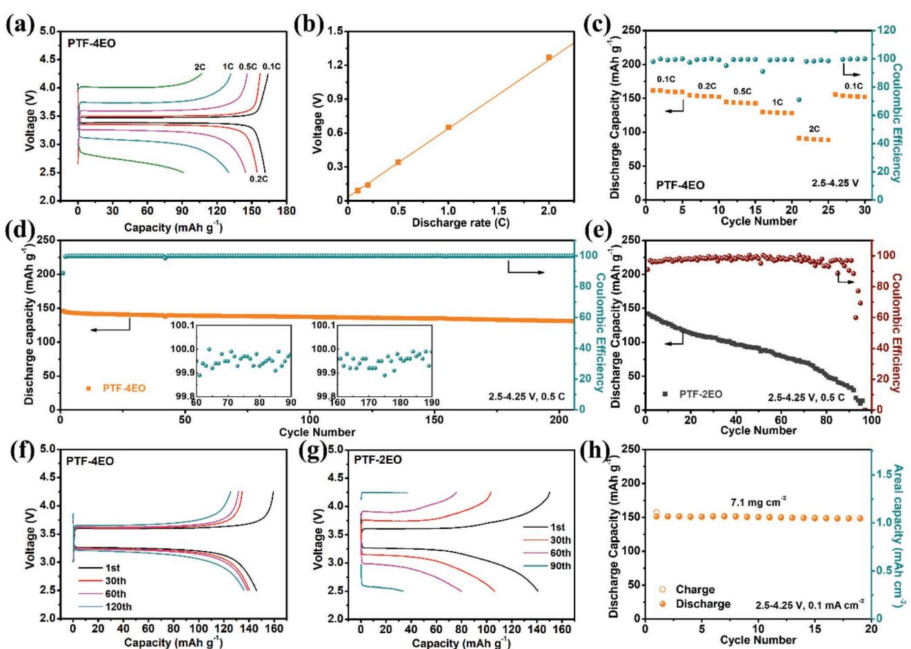
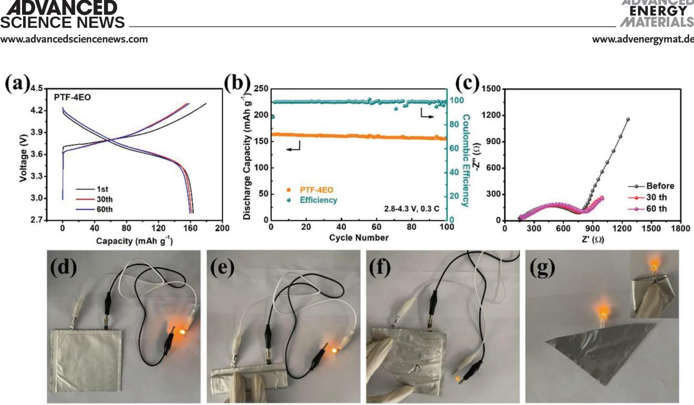

# **A Single-Ion Conducting Network as Rationally Coordinating Polymer Electrolyte for Solid-State Li Metal Batteries**

*Hao Li,\* Yunfei Du, Qi Zhang, Yong Zhao,\* and Fang Lian\**

**Solid state single-ion conducting polymer electrolytes (SSPEs) are one of the most promising candidates for long-life lithium-metal batteries. However, the traditional polyanion-type structure of SSPEs inevitably gives rise to insufficient conductivity and inferior mechanical stability, which limits their practical application. Herein, an interpenetrating single-ion network polymer (PTF-4EO) is fabricated by crosslinking lithium tetrakis(4- (chloromethyl)-2,3,5,6-tetrafluorophenyl)borate salt with tetraethylene glycol. The unique structure enables a PTF-4EO with weakly interacting anions and coordinating ether oxygen segments that functions as a highperforming SSPE, that delivers a high room-temperature conductivity of 3.53 × 10−4 S cm−1 , exceptional superior lithium-ion transference number of 0.92, wide electrochemical window > 4.8 V, and good mechanical properties. Moreover, the resultant SSPE can directly participate in constructing a favorable Janus solid electrolyte interphase, which further enhances the interfacial stability of the metallic lithium anode. The as-assembled LiFePO4||Li solid batteries present prominent cycling stability, coulombic efficiency, and capacity retention over 200 cycles between 2.50 and 4.25 V. Furthermore, LiNi0.7Mn0.2Co0.1O2||Li pouch cells exhibit remarkable safety even under harsh conditions. This study thereby offers a promising strategy for SSPE design to simultaneously achieve high ionic conductivity and good interfacial compatibility toward practical high-energy-density solid-state lithium metal batteries.**

H. Li, Q. Zhang, Y. Zhao

The ORCID identification number(s) for the author(s) of this article can be found under https://doi.org/10.1002/aenm.202103530.

#### **DOI: 10.1002/aenm.202103530**

## **1. Introduction**

Solid-state Li-metal batteries (SLMBs) consisting solid-state electrolytes (SSEs) and metallic lithium anode are promising to improve the safety and energy density of conventional liquid lithium-ion batteries and have been regarded as next-generation batteries in this decade.[1] Among the SSEs, solid polymer electrolytes (SPEs) have been widely researched due to their excellent processability, flexibility, and low density.[2] So far, SPEs are mainly prepared by dissolving lithium salts into polymer matrix (e.g., poly(ethylene oxide)/lithium bis(trifluoromethylsulphonyl) imide, PEO/ LiTFSI), their ionic conductivity has been already improved to above 10−4 S cm−1 in recent years through macromolecular design such as crosslinking,[3] copolymerization[4] and grafting.[5] However, the narrow electrochemical window, poor electrolyte/electrodes interfacial compatibility, and low lithium-ion transference number (*t*Li+ < 0.4) remain persistent obstacles to their practical applications.[6] In particular, the freely movable anions in the SPEs are liable to trigger concentration polarization during cycling, giving rise to deleterious

effects such as uncontrolled growth of lithium dendrite and unwanted side reactions with electrodes.[7]

Solid state single-ion conducting polymer electrolytes (SSPEs) in which the anions (e.g., carboxylate acid, sulfonylimide and sp3 boron[8] ) are covalently tethered onto the polymeric skeletons(e.g., polyether, silanes, methacrylic, and PEO[9] ), can help stabilize the electrodeposition process on Li anode and reduce concentration gradients. Conversely to conventional SPEs, SSPEs display higher *t*Li+ ≥ 0.8 with good electrochemical stability, but simultaneously resulted in a drop of ionic conductivities (below 10−5 –10−7 S cm−1 at 25 °C).[10] In order to improve the ionic conductivity of SSPEs, several factors regarding the chemical group selection and polymer structure design must be taken into account: 1) the mobility of anionic species should be efficiently suppressed; 2) anions should be regulated to minimize the anion-Li+ dissociation energy barrier, and provide sufficient carrier concentration;[11] 3) conductive polymeric intermediate with a proper polymer-Li+ coordination segment and low glass transition temperature (*T*g) is necessary

Key Lab for Special Functional Materials of Ministry of Education National & Local Joint Engineering Research Center for High-efficiency Display and Lighting Technology School of Materials Science and Engineering Collaborative Innovation Center of Nano Functional Materials and Applications Henan University Kaifeng 475004, China E-mail: li\_hao@henu.edu.cn; zhaoyong@henu.edu.cn Y. Du, F. Lian School of Materials Science and Engineering University of Science and Technology Beijing Beijing 100083, China E-mail: lianfang@mater.ustb.edu.cn

to assist Li-ion dissociation and transportation through the segment dynamics.[12] Shin et.al prepared an anionic borate network quasi-solid electrolyte (ANP-5) based on tetraphenylborate anions with strong delocalization of negative charge, which delivered ion conductivity of 1.5 × 10−4 S cm−1 at 25 °C and *t*Li+ up to 0.95 with 30 wt% plasticizer, emphasizing the importance of anions design.[13] In our previous works, lithiated polyvinyl formal (LiPVFM) SSPE with proper polymer-Li+ coordination has been developed with high *t*Li+ of 0.87, wide electrochemical stability window of > 5.5 V (vs Li+/Li) and excellent mechanical property.[14] Nevertheless, the relatively strong anion-Li+ interaction and low Li+ concentration (0.55 mol L−1 ) result in poor ionic conductivity (≈10−5 S cm−1 ), hence inferior cycling stability and low rate capability of the batteries. Therefore, it is still urgent to explore synthesis approaches of SSPE with advanced nanotopology structure to improve the ion transportation and desirable cycling performance of SLMBs.

In this work, a novel SSPE with high carrier concentration (1.08 mol L−1 ) is proposed herein in view of anion species as well as the Li+-transference kinetics, which amorphous lithium tetrakis(4-(chloromethyl)-2,3,5,6-tetrafluorophenyl)borate salt (LiCTFPB, and detail characterization in Figures S1–S4, Supporting Information) is crosslinked by tetraethylene glycol to form an effective single-ion conducting network for Li+ transportation. Weakened anion-Li+ interaction as well as conductive linkers with proper polymer-Li+ coordination in the SSPE work synergeticly to provide the improved ionic conductivity, high *t*Li+, wide electrochemical window, and large modulus at room temperature. Additionally, this as-designed PTF-4EO electrolyte is advantageous to generate favorable Janus solid electrolyte interphase (SEI) on Li metal anode and facilitate Li+ transport in the composite cathode, and thus boosting the electrolyte/ electrodes compatibility. The assembled LiFePO4 (LFP) ||Li and LiNi0.7Mn0.2Co0.1O2 (NMC)||Li solid batteries showed a high Coulombic efficiency and a long cycle life at 30 °C with excellent safety.

# **2. Results and Discussion**

#### **2.1. Design of PTF-4EO SSPE**

It is known that five or six ethylene oxide (EO) units coordinate with one Li+ in traditional PEO based SPEs, which is too strong for Li+ transportation.[15] Hence, PTF-4EO was prepared by crosslinking LiCTFPB salt with four EO units and expected to possess proper O-Li+ coordination, as shown in **Figure 1**a (Structural characterization in Figure S5, Supporting Information). To explore the interactions in PTF-4EO, the optimized geometric configurations of EO-Li+ interaction were simulated in PTF-*x*EO systems (*x* = 2, 4, and 5) based first-principles density functional theory, and the results are shown in Table S1 (Supporting Information). In PTF-*x*EO system without Li+ ion, each sample exhibits similar bond length of C-O-C groups (1.414 Å); After coordinating Li+, the bond length in PTF-4EO changes to 1.432 Å owing to the electrostatic potential interactions, which is larger than that of PTF-5EO (1.429 Å) and implying a weaker EO-Li+ interaction.[16] The electrostatic potential calculation further verified the O-Li+ coordination in PTF-4EO (Figure S6, Supporting Information). In addition, 7 Li solid state magic angle spinning nuclear magnetic resonance (ssMAS NMR) spectra was employed to study the Li+-related interactions of PTF-4EO. Meanwhile, LiCTFPB that crosslinked with two EO units (PTF-2EO) was also prepared for comparison, and the corresponding structural characterization in Figure S7 (Supporting Information). Detailed analysis of asymmetric peaks of the PTF-4EO sample in Figure 1c shows that the overall line-shape is composed of two Li+ environments. The right peak at 0.04 ppm amounts to 42% ± 1% of total integral and is assigned to the Li+ from [B(C6F4)4] −-Li+ interaction;[13] The left peak at 1.22 ppm, which is 58% ± 2% of the total integral, is ascribed to Li+ ions that coordinate to 4EO chains. As about 15 wt% plasticizer was added to polymer/electrodes interface during battery assembly, Li+ coordination environment of PTF-4EO with the existence of plasticizer was further studied. The right peak shifts downfield (0.32 ppm), which is attributed to the greater tendency of Li+ to dissociate from the [B(C6F4)4] − anions upon solvation by plasticizer. Moreover, line widths of the right peak become narrower, indicating the solvated Li+ with more freedom of motion and larger degree of dynamic averaging.[17] Meanwhile, the left peak at 1.23 ppm occurs no shift or line widths change, indicating that PTF-4EO maintains a stable O-Li+ coordination even in the presence of plasticizer. Thus, the hopping sites of Li+ are mainly the EO groups in the PTF-4EO, which is considered as typical feature for Li+ conduction in SPEs.[18] In contrast, the fraction of Li+ peak from O-Li+ coordination in PTF-2EO (left peak in Figure 1b) is only 31% with broader line shapes in ssMAS NMR. Moreover, this peak area further reduces to 22% and the peak shifts from 0.75 to 0.68 ppm simultaneously after the addition of plasticizer, indicating that the EO chains in PTF-2EO are insufficient to coordinate with cations. It can be concluded that Li-ions in PTF-2EO mainly transport via the plasticizer-associated phases, which is similar to that of quasi-solid or gel electrolytes.[19] Hence, the above results demonstrate that the well-chosen 4EO segments enable stable and proper O-Li+ coordination for Li+ transportation into the PTF-4EO.[20]

Fourier transform infrared spectroscopy (FTIR) measurement was also conducted to verify the interaction in PTF-4EO (Full spectra in Figure S8a, Supporting Information). As shown in Figure 1d, the intensities of peak centered at 750 cm−1 corresponding to the ion-pair signal of PTF-4EO[21] are greatly enhanced compare to those of PTF-2EO. Besides, the vibrational peaks between 1000 and 1150 cm−1 are assigned to the triplet COC stretching of the EO chains[22] (Figure S8b, Supporting Information), and their shapes change dramatically from the PTF-2EO to the PTF-4EO. These observations indicate the distorted and stretched 4EO conformation, resulting from an intensive interaction between the Li+ cations and the ether groups in PTF-4EO samples.[23] Besides, the X-ray diffraction (XRD) results (Figure S9, Supporting Information) show that the broad diffusion peak between 10° and 35° in PTF-4EO sample, indicating its amorphous nature which is beneficial to Li+ migration. As seen in Figure 1e, the unique diamondoid network and proper O-Li+ coordination of PTF-4EO enable a uniform and robust structure with high carrier concentration, implying the potentially excellent solid electrolyte for Li metal batteries.

**Figure 1.** a) Structural sketch of PTF-4EO. 7 Li ssMAS NMR of b) PTF-2EO and c) PTF-4EO before and after adding 15 wt% plasticizer. d) FTIR spectra of PTF-2EO and PTF-4EO membranes at room temperature. e) Schematic of lithium metal batteries featuring PTF-2EO and PTF-4EO as the solid electrolytes. The blue and light blue balls represent movable Li+ in the polymer membranes.

#### **2.2. Performance Evaluation of PTF-4EO**

Polymer electrolytes with dense structure can effectively suppress Li dendrites' growth and further improve the overall safety of cells.[24] Hence the field emission scanning electron microscopy (FE-SEM) and Atomic Force Microscope (AFM) were performed to check the morphology of the membranes (Figure S10, Supporting Information). The PTF-4EO membranes exhibit smooth surface and dense cross-section morphology. Corresponding energy dispersive spectrometer mapping of the cross-section show that the B, O, C and F elements are uniformly distributed, indicating good integration of PTF-4EO membranes. In contrast, PTF-2EO membranes display rough surface and crumbly cross-section with a mass of LiCTFPB particles (Figure S11, Supporting Information), implying poor contact with electrodes and increased resistance of lithium-ion conduction. Accordingly, beside the Li+ transport kinetics, the length of EO chains greatly affects the morphology of SSPEs and should be delicately selected.[25]

The temperature-dependent ionic conductivity of PTF-4EO membrane was evaluated as shown in **Figure 2**a. The ionic conductivity of PTF-4EO is 3.53 × 10−4 S cm−1 at room temperature, which is much higher than that of PTF-2EO sample (4.97 × 10−5 S cm−1 ) (detail electrochemical impedance spectroscopy (EIS) in Figure S12, Supporting Information). Considerable difference in ionic conductivity underlines the importance of linker length selection in EO-based crosslinked polymer electrolytes.[26] Besides, ionic conductivity of each polymer agrees with the Vogel–Tamman–Fulcher empirical equation and the fitting results are shown in Table S2 (Supporting Information). PTF-4EO shows the lower activation energy (0.049 eV) compared with that of PTF-2EO (0.060 eV), indicating a low energy barrier for Li+ diffusion. Moreover, the pre-exponential factor (*A*) for PTF-4EO is much larger than that of PTF-2EO. *A* is considered to correlate with the concentration of charge carriers in electrolytes.[27] Therefore, it reveals more salt dissociation in PTF-4EO, agreeing with the 7 Li ssNMR results that the 4EO chain coordinates more strongly with Li+ than [B(C6F4)4] − anions. The higher ionic conductivity and lower activation energy will benefit for battery performance, especially cycled at higher current densities. Cathodic Linear Sweep Voltammetry (LSV) was performed to investigate the electrochemical window of the PTF-4EO at 25 °C. As shown in Figure 2b, the PTF-4EO membrane is stable up to 4.8 V without any current fluctuation while PTF-2EO is decomposed at ≈3.9 V. The electrochemical stability of PTF-4EO was further studied by the cyclic

**Figure 2.** a) Ionic conductivity of PTF-4EO and PTF-2EO sample between 25 and 80 °C. b) LSV plots of PTF-4EO and PTF-2EO. c) Current–time profiles of the Li symmetrical cells with PTF-4EO. The inset shows the Nyquist impedance spectra of the batteries before and after polarization. d) Comparison of PTF-4EO with the reported SPEs in terms of Li+ transference number and ionic conductivity. Physical properties of PTF-4EO membrane: e) TGA curves and f) elastic modulus–distance loading curves.

voltammetry (CV) experiments under a voltage range from 0.0 to 5.5 V at room temperature. As shown in Figure S13 (Supporting Information), the PTF-4EO sample exhibits a low oxidative current up to 4.7 V versus Li+/Li after 4 cycles of sweeping, in agreement with the LSV results. The steady and small current density of PTF-4EO is attributed to its copolymer structure and the more stable interfacial compatibility.[8a,28] The improved electrochemical stability of PTF-4EO could match well with high-voltage cathodes for high energy-density batteries.

To investigate the single-ion conductivity feature of PTF-4EO, *t*Li+ is measured at 25 °C via steady-state current method along with a potential polarization (10 mV). Polarization curve as well as initial and steady state impedance diagram of Li||PTF-4EO||Li battery are depicted in Figure 2c (The measured values of the parameters are summarized in Table S3, Supporting Information). Specifically, PTF-4EO sample shows a single-ion conductive state of *t*Li+ = 0.92, which is much higher than those of reported dual ion conductors (e.g., PEO/LiTFSI for 0.22[29] ), and comparable to those of most state-of-the-art SSPEs (Figure 2d and detail in Table S4, Supporting Information). Tethered anions can avoid the formation of space charge regions at the interface of Li anode, and solid electrolyte with high *t*Li+ is more liable to facilitate uniform diffusion and deposition of Li+. The high *t*Li+ of PTF-4EO could be ascribed to its unique network structure. First, [B(C6F4)4] − anions which are covalently anchored by EO chains, have limited movability, while Li ions can move freely. Second, weakly B-Li+ interaction of [B(C6F4)4] − and appropriate ether coordination sites from 4EO chains facilitate the dissociation of Li ions, and flexible chain characteristic of 4EO is favorable to the transport of Li ions. Therefore, compared with other reported SPEs, PTF-4EO with the individual hybrid superstructure exhibits an advantage for simultaneously achieving enhanced ionic conductivity and high *t*Li+.

Thermogravimetric analysis (TGA) of the PTF-4EO is investigated to reveal its thermal stability, a critical character for solidstate electrolytes. As shown in Figure 2e, the thermal stability

temperature of PTF-4EO is up to ≈280 °C, much higher than that of LiCTFPB (138 °C). And it reveals that the thermal stability is largely improved after crosslinking effect. Furthermore, differential scanning calorimetry (DSC) was also employed to analyze *T*g of the PTF-4EO (Figure S14, Supporting Information). It is important to note that all the samples show a low *T*g value of −69 °C, demonstrating complete rubbery state and enhanced mobility of polymer chains at room temperature. Figure 2f shows the elastic modulus of polymers versus indentation depth, and PTF-4EO exhibits a high Young's modulus of 1.3 GPa. After introduction of plasticizer, it slightly decreases to 0.9 GPa, which is still much higher than that of PEO-LiTFSI (0.3 GPa) as reported.[5] The excellent mechanical properties of PTF-4EO can effectively prevent the growth of lithium dendrites and guarantee its practical application in SLMBs.

### **2.3. PTF-4EO/Li Interfacial Compatibility**

Based on the aforementioned advantages of PTF-4EO, symmetric Li/Li cells with the PTF-4EO electrolytes were assembled to study the Li/PTF-4EO interfacial stability. The interfacial resistance of the Li/Li symmetric cells is summarized in **Figure 3**a. PTF-4EO based Li symmetric cells keep a relatively stable interfacial resistance and show a much smaller value (≈760 Ω) compared to those of Li||PTF-2EO||Li cell (≈1580 Ω). With the improvement of mechanical strength and dimensional stability, the growth of lithium dendrite can be significantly inhibited with PTF-4EO, which is confirmed by Li/Li symmetric cell testing with current densities ranging from 0.1 to 1.5 mA cm−2 for 0.5 h per half cycle (Figure 3b). The PTF-4EO electrolyte could stably cycle until the current density reached 0.70 mA cm−2 without generating overpotential mutations. The long-term electrochemical compatibility of PTF-4EO with Li metal was further characterized by galvanostatic charging and discharging in Li/Li symmetric cells. As shown in Figures S15 and S16 (Supporting Information), symmetric Li/Li cells of PTF-4EO exhibits excellent long-term cyclic stability for over 2000 h (over 2.7 months) at current density of 0.10 mA cm−2 . Furthermore, as seen in Figure 3c and Figure S17 (Supporting Information), the uniform Li plating/stripping behaviors of the PTF-4EO are reflected by the steady polarization voltage over 800 h under a current density of 0.25 mA cm−2. In sharp contrast, PTF-2EO suffers rapid voltage increase after only 220 h due to the inferior interfacial compatibility and low ionic conductivity, which could not stop the advance of lithium dendrites. Moreover, the battery with PTF-4EO SSPE enables stable cycling at high capacity of 0.60 mAh cm−2 and high current density of 0.4 mA cm−2 with 1.5 h stripping/plating (Figure S18, Supporting Information).

Nondestructive synchrotron X-ray tomography was used to probe the morphology of the lithium surface after symmetric cell cycling at 0.25 mA cm−2 . In Figure 3e, Li||PTF-4EO||Li cell shows a uniform surface and maintains a good contact with the

**Figure 3.** a) Impedance spectra for Li||PTF-4EO||Li (red line) and Li||PTF-2EO||Li cells (dark gray line) over different time. b) Rate performance test of the Li||PTF-4EO||Li cell to determine its critical current density. c) Voltage profiles of the Li||PTF-4EO||Li and Li||PTF-2EO||Li cells at a current density of 0.25 mA cm−2 with a stripping/plating period of 0.5 h at 30 °C. Cross-sectional synchrotron X-ray tomography images showing of d) Li||PTF-2EO||Li and e) Li||PTF-4EO||Li cells after cycling. 3D reconstructions of f) Li||PTF-2EO||Li and g) Li||PTF-4EO||Li symmetric cell samples. XPS analysis of cycled Li metal in Li||PTF-4EO||Li symmetric cell before and after 50 s Ar etching: h) C 1s and i) F 1s after 50 cycles, j) C 1s and k) F 1s after 800 cycles.

polymer membrane after 800 h cycling, and no lithium dendrite is observed. It suggests a uniform plating/stripping of lithium metal at the PTF-4EO/Li interface. Conversely, Li||PTF-2EO||Li cell after cycling for 430 h shows a rough lithium morphology at PTF-2EO/Li interface with granular Li dendrite ("dead lithium") forming within the PTF-2EO itself (Figure 3d). Dendrites gradually penetrate the PTF-2EO electrolyte, no longer serving as an effective medium for Li electrodeposition.[30] The 2D and 3D reconstructed tomograms of the symmetric cells from the two samples provide further insight into the morphological evolution of the lithium anodes after cycling. Figure 3f and Figure S19a (Supporting Information) show the 3D and 2D tomograms of the cycled Li||PTF-2EO||Li cell where the gold volume elements represent the cycled Li electrodes. The formation of mossy lithium and dead lithium are observed on both sides. While tomograms of the Li||PTF-4EO||Li sample in Figure 3g and Figure S19b (Supporting Information) show smooth Li surface and no dendrite growth on the Li electrodes. Similar results have been demonstrated by FE-SEM (Figure S20, Supporting Information). These results confirm the strong influence of the PTF-4EO membrane in suppressing lithium dendrite nucleation and growth.

Further characterization of the PTF-4EO/Li interface is indispensable to understand the root cause of its superior performance in the Li/Li symmetric cells. X-ray photoelectron spectroscopy (XPS) has been conducted to explore the chemical nature of the Li surface in Li||PTF-4EO||Li sample after cycling. Figure 3h–k compares the XPS spectra of the lithium metal after cycling 50 and 800 h in the symmetric cells, respectively. In Figure 3h, the C 1s spectrum of lithium metal after 50 cycles shows that CO (286.3 eV) peak belongs to the decomposition of EO group, and CF (288.4 eV) is attributed to the decomposition of [B(C6F4)4] − group, respectively.[31] LiF (684.6 eV) and CF (687.1 eV) in F 1s spectra (Figure 3i) reveal the chemical reaction between Li metal and [B(C6F4)4] − group.[32] Meanwhile, C6F4 peak at 688.9 eV indicates that [B(C6F4)4] − anions are directly incorporated into the structure of SEI, suggesting fast Li+ migration along the PTF-4EO/Li interface. After Ar etching, the increased peak intensities of LiF and the decreased intensities of CO and C6F4 indicate that the formation of LiF layer suppressed decomposition of PTF-4EO. Interestingly enough, the surface and bulk of SEI layer on the cycled Li electrodes (800 cycles) displays entirely different chemical distributions, which is confirmed by Ar etching (Figure 3i,k). Strong peak of C6F4 appears at the surface of SEI layer, but it immediately disappears after etching accompanies with the appearance of strong LiF peak, implying the dense LiF layer entirely hinders the further reaction between PTF-4EO and lithium anodes. Corresponding O 1s spectra further reveals the compositions of SEI (Figure S21, Supporting Information). This steady LiF-rich Janus SEI layer with component gradient is expected to inhibit Li dendrites growth and render a long lifespan of Li metal electrode.

#### **2.4. Demonstration of the PTF-4EO in SLMBs**

The high oxidation stability and excellent compatibility with Li metal suggest the PTF-4EO electrolyte very promising candidate in high energy-density SLMBs. Consequently, solidstate LFP||PTF-4EO||Li batteries were assembled and worked between 2.50 and 4.25 V at 30 °C. The morphology of composite cathodes is shown in Figures S22 and S23 (Supporting Information), respectively. To verify the positive function of the PTF-4EO, LFP||Li solid-state batteries with PTF-2EO electrolyte were fabricated for comparison. As shown in **Figure 4**a, PTF-4EO based battery exhibits discharge capacities of 162, 155, 145, 131 and 91 mAh g−1 at current densities of 0.1, 0.2, 0.5, 1 and 2C, respectively. The overpotentials obtained from the discharge/charge profiles in Figure 4b change linearly with the discharge rate, which is typical for single-ion conducting batteries.[33] Moreover, the specific discharge capacity remains reasonably stable over long cycles at various current densities in Figure 4c, revealing exceptional rate performance of PTF-4EO based cells. In Figure 4d, PTF-4EO based battery maintains an initial capacity of 146.0 mAh g−1 with 89.8% capacity retention after 200 cycles at 0.5 C, which is superior to those of PTF-2EO batteries (Figure 4e). Besides, the average Coulombic efficiency of PTF-4EO battery is higher than 99.96%. Moreover, typical voltage profiles of PTF-4EO based batteries (Figure 4f) show smaller and negligible increased polarization voltages during long-term cycling than those of PTF-2EO based batteries (Figure 4f). Considering the strong capability of PTF-4EO electrolyte in suppressing Li dendrite growth and fast Li+ transport capability in LFP composite cathode, LFP||PTF-4EO||Li batteries with high LFP loading are explored. As shown in Figure 4g, similar to 3 mg cm−2 LFP loaded batteries, LFP||PTF-4EO||Li batteries with a LFP loading of 7.1 mg cm−2 deliver areal capacities of 1.21 mAh cm−2 at a current density of 0.10 mA cm−2. More importantly, there is no obvious increase of overpotentials compared to those in the regular testing, and the typical charge/discharge plateaus are clearly identified (Figure S24, Supporting Information), indicating great potential for application in high-performance SLMBs.

The availability of PTF-4EO electrolyte with wide electrochemical window has been also evaluated. NMC||Li batteries based on PTF-4EO electrolyte were assembled and corresponding electrochemical properties are exhibited in **Figure 5**. Figure 5a,b shows the voltage profiles and the galvanostatic cycling performance of NMC||PTF-4EO||Li batteries from 2.8 to 4.3 V at 0.3 C and 30 °C. The battery displays an initial discharge capacity of 163.4 mAh g−1 with 95.0% retention after 100 cycles, indicating superior electrolyte/ electrode interfacial stability and high voltage-resistance of the PTF-4EO during cycling. Besides, negligible changes of charge-transfer resistance of the battery during cycling suggest that PTF-4EO with superior interfacial stability is feasible for high energy density SLMBs (Figure 5c). The flexible NMC||Li solid pouch cell was further fabricated to evaluate the functionality of such PTF-4EO electrolyte in applications of highly safe lithium batteries. As shown in Figure 5d,e, the pouch cell could make light-emitting diode (LED) lamp operate well without noticeable dimming after folding. Meanwhile, the pouch cell kept a good shape without any flame after cutting and nail tests (Figure 5f), demonstrating the superior safety of NMC||PTF-4EO||Li pouch cell. Furthermore, the obtained piece of the cell could also light up LED **www.advancedsciencenews.com www.advenergymat.de**

**Figure 4.** Electrochemical performance of SLMBs. a) Charge–discharge voltage profiles and b) overpotential of LFP||PTF-4EO||Li battery at various rates. c) Rate capability of LFP||PTF-4EO||Li battery. Cycling performance of d) PTF-4EO and e) PTF-2EO based batteries at 2.50–4.25 V and 0.5 C. Typical charge–discharge voltage profiles of f) PTF-4EO and g) PTF-2EO based batteries. h) Cycling performance of PTF-4EO based batteries with 7.1 mg cm−2 LFP loading at 0.1 mA cm−2 .

lamp (Figure 5g), exhibiting that PTF-4EO based solid-state cells possess outstanding safety performance in various practical applications.

## **3. Conclusion**

In summary, a special single-ion conducting network with high cation concentration and rationally O-Li+ coordination was synthesized as SSPE by integrating LiCTFPB salt with proper EO segments through crosslinking effect. The intricately designed PTF-4EO electrolyte shows an ionic conductivity of 3.53 × 10−4 S cm−1 , high *t*Li+ of 0.92 and wide electrochemical window beyond 4.8 V at room temperature. The synergetic effect between anions and EO chains in PTF-4EO electrolyte provides robust and flexible structure, as well as favorable SEI on Li anode for boosting the electrolyte/ electrodes compatibility. For practical applications, PTF-4EO based LFP||Li solid batteries present both superior rate capability and excellent cycling performance with high cathode loading. More importantly, PTF-4EO based solid-state NMC||Li pouch batteries present impressive safety and flexibility properties even in extremely severe condition. The SSPE described herein can be a promising solid-state electrolyte, and thus promotes the development of high energy density, high performing, and high safety solid batteries.

# **4. Experimental Section**

*Preparation of Solid Electrolyte*: PTF-4EO was synthesized using a slightly modified version of the method presented in ref. [13]. Full experimental details of the synthesis and characterization of the polymer were described in the Supporting Information. Then, the obtained sample was dissolved into dimethyl sulfoxide (DMSO, Sinopharm Chemical Reagent) and stirred for 12 h. The solution was then cast onto a polytetrafluoroethylene mold and then dried under vacuum at 60 °C for 48 h to evaporate the solvent. Finally, the self-standing membrane was carefully peeled off from the mold and the thicknesses were in the range 90–120 µm.

*Material Analysis*: 1 H, 13C and 19F NMR spectra were acquired on a Bruker AVANCE II 400 spectrometer with DMSO-d6 as solvent. 7 Li ssMAS NMR spectra of the polymers were measured by Bruker AVANCE III 400 spectrometer. The crystalline structure of all samples was identified by XRD (Rigaku SmartLab3, Japan) in the

**Figure 5.** a) Typical charge-discharge voltage profiles of the PTF-4EO based batteries. b) Cycling performance of the batteries at 2.8–4.3 V and 0.3 C. c) The resistances of the PTF-4EO batteries before charge and in fully discharged state at 30th and 60th cycles. Photograph of NMC||PTF-4EO||Li pouch cell for safety performance test at d) flat, e) bending, and f) cutting and needle penetrating. g) The obtained piece of pouch cell for lighting LED lamp.

scanning range between 5° and 90° at a rate of 5° min−1 . The FTIR spectra (NEXUS FT-IR670) of all the samples were recorded with a frequency range of 500–4000 cm−1 . Morphological images of the samples were observed by FE-SEM (Carl Zeiss GeminiSEM500). The surface morphology of electrolyte membranes was characterized by AFM (BRUKER Dimension Icon). The elastic modulus of samples was conducted by nanoindentation (Nano Indenter XP, Keysight Technologies). TGA (Discovery, Waters) was conducted in nitrogen from 50 to 600 °C at a heating rate of 10 °C min−1 . DSC measurement is carried out on TA INSTRUMENTS (Q5000IR) at a heating rate of 10 °C min−1 from −70 to 140 °C. The cells were imaged using the nondestructive synchrotron X-ray tomography technique (YXLON FF35CT), which makes it possible to directly visualize the electrodes three dimensionally. XPS (Kratos AXIS Ultra DLD spectrometer) was used to investigate the composition of cycled Li metal. AXISULTRA-DLD spectrometer was used to investigate the XPS of samples.

*Electrochemical Measurements*: All the electrochemical properties of SPEs were performed on the VersaSTAT3 electrochemical workstation. The symmetric cells of SS (stainless steel)||SPEs||SS were used for the test of ionic conductivity by EIS experiments over the temperature range of 25–80 °C. In the assembling process of the cells, plasticizer (propylene carbonate/dimethyl carbonate mixture, 1:1 in vol) about 15 wt% of the related membrane was dropped to improve the SPE/ electrode interfacial compatibility.

Impedance data were obtained in the frequency range of 0.01–100 kHz with an AC amplitude of 5 mV. The ionic conductivity was calculated by using Equation (1)

$$
\sigma_i = \frac{L}{SR} \tag{1}
$$

where *L* and *S* represent the thickness and contacting area of the SSPEs, and *R* is the bulk resistance of the electrode.

The electrochemical stability window of PTF-4EO was measured using LSV and CV experiment performed on a Li||SPE||SS cell at a sweep rate of 1 mV s−1 between 0 and 5.5 V.

The *t*Li+ was calculated according to Equation (2)

$$
t_{\rm Li^*} = \frac{I_S R_{\rm bulk} (s) [\Delta V - I_0 R_{\rm Li}(0)]}{I_0 R_{\rm bulk} (0) [\Delta V - I_S R_{\rm Li}(s)]}
$$
(2)

where *I*0 and *I*s are the initial and the steady-state currents, respectively. ∆*V* is the potential applied across the cell, *R*bulk(0) and *R*bulk(s) represent the initial and final resistances of the PTF-4EO, respectively. *R*Li(0) and *R*Li(s) are the initial and steady-state resistances of the passive layers on the lithium metal electrode.

For the battery tests, composite cathodes were prepared by mixing LFP or NMC, carbon, polyvinylidene fluoride in N-Methyl-2-pyrrolidone with a weight ratio of 85:10:5. Then the homogenized slurry was cast on aluminum foil and dried in vacuum at 80 °C overnight. Finally, ≈2 µL PTF-4EO solution (20 wt% in DMSO) was added to the cathode surface and drying to obtain a dense and uniform structure. The active material loading of the cathode is about 3.0 mg cm−2 . All the batteries were tested on a Land battery testing system (Wuhan Land electronics Co. Ltd., China) after stored at 50 °C for 12 h.

# **Supporting Information**

Supporting Information is available from the Wiley Online Library or from the author.

## **Acknowledgements**

This work was financially supported by the National Key R&D Program of China (Grant No. 2018YFB0104300), the Beijing Municipal Natural Science Foundation (Grant No. 2202027), and the National Natural Science Foundation of China (Grant Nos. 21773055, U1604122, 51702086, 22005085, 21805070, and 51872026).

**www.advancedsciencenews.com www.advenergymat.de**

# **Conflict of Interest**

The authors declare no conflict of interest.

# **Data Availability Statement**

Research data are not shared.

# **Keywords**

high voltage, lithium metal batteries, single-ion conducting polymers, solid polymer electrolytes

Received: November 10, 2021

- Revised: January 14, 2022
- Published online: January 30, 2022
- [1] a) J. Lopez, D. G. Mackanic, Y. Cui, Z. Bao, *Nat. Rev. Mater.* **2019**, *4*, 312; b) L. Z. Fan, H. He, C. W. Nan, *Nat. Rev. Mater.* **2021**, *6*, 1003.
- [2] a) X. Yang, K. R. Adair, X. Gao, X. Sun, *Energy Environ. Sci.* **2021**, *14*, 643; b) R. Chen, Q. Li, X. Yu, L. Chen, H. Li, *Chem. Rev.* **2019**, *120*, 6820.
- [3] S. Tang, Q. Lan, L. Xu, J. Liang, P. Lou, C. Liu, L. Mai, Y.-C. Cao, S. Cheng, *Nano Energy* **2020**, *71*, 104600.
- [4] Z. Wang, L. Shen, S. Deng, P. Cui, X. Yao, *Adv. Mater.* **2021**, *33*, 2100353.
- [5] M. Zhou, R. Liu, D. Jia, Y. Cui, Q. Liu, S. Liu, D. Wu, *Adv. Mater.* **2021**, *33*, 2100943.
- [6] a) H. Li, Y. Du, X. Wu, J. Xie, F. Lian, *Adv. Funct. Mater.* **2021**, *31*, 2103049; b) J. Zhu, Z. Zhang, S. Zhao, A. S. Westover, I. Belharouak, P. F. Cao, *Adv. Energy Mater.* **2021**, *11*, 2003836.
- [7] K. S. Oh, J. H. Kim, S. H. Kim, D. Oh, S. P. Han, K. Jung, Z. Wang, L. Shi, Y. Su, T. Yim, *Adv. Energy Mater.* **2021**, *11*, 2101813.
- [8] a) R. Bouchet, S. Maria, R. Meziane, A. Aboulaich, L. Lienafa, J.-P. Bonnet, T. N. Phan, D. Bertin, D. Gigmes, D. Devaux, *Nat. Mater.* **2013**, *12*, 452; b) F. Lian, H. Y. Guan, Y. Wen, X. R. Pan, *J. Membr. Sci.* **2014**, *469*, 67.
- [9] a) S. Li, A. I. Mohamed, V. Pande, H. Wang, J. Cuthbert, X. Pan, H. He, Z. Wang, V. Viswanathan, J. F. Whitacre, *ACS Energy Lett.* **2017**, *3*, 20; b) Y. Kim, S. J. Kwon, H.-k. Jang, B. M. Jung, S. B. Lee, U. H. Choi, *Chem. Mater.* **2017**, *29*, 4401; c) Z. Li, F. Liu, S. Chen, F. Zhai, Y. Li, Y. Feng, W. Feng, *Nano Energy* **2021**, *82*, 105698.
- [10] a) K. Jeong, S. Park, G. Y. Jung, S. H. Kim, Y.-H. Lee, S. K. Kwak, S.-Y. Lee, *J. Am. Chem. Soc.* **2019**, *141*, 5880; b) K. Jeong, S. Park, S.-Y. Lee, *J. Mater. Chem. A* **2019**, *7*, 1917.
- [11] S. Liang, U. H. Choi, W. Liu, J. Runt, R. H. Colby, *Chem. Mater.* **2012**, *24*, 2316.
- [12] a) Q. Ma, Y. Xia, W. Feng, J. Nie, Y.-S. Hu, H. Li, X. Huang, L. Chen, M. Armand, Z. Zhou, *RSC Adv.* **2016**, *6*, 32454; b) M. P. Rosenwinkel, R. Andersson, J. Mindemark, M. Schönhoff, *J. Phys. Chem. C* **2020**, *124*, 23588.

- [13] D. M. Shin, J. E. Bachman, M. K. Taylor, J. Kamcev, J. G. Park, M. E. Ziebel, E. Velasquez, N. N. Jarenwattananon, G. K. Sethi, Y. Cui, *Adv. Mater.* **2020**, *32*, 1905771.
- [14] H. Zhang, F. Lian, L. Bai, N. Meng, C. Xu, *J. Membr. Sci.* **2018**, *552*, 349.
- [15] D. G. Mackanic, W. Michaels, M. Lee, D. Feng, J. Lopez, J. Qin, Y. Cui, Z. Bao, *Adv. Energy Mater.* **2018**, *8*, 1800703.
- [16] X. He, Y. Ni, Y. Hou, Y. Lu, S. Jin, H. Li, Z. Yan, K. Zhang, J. Chen, *Angew. Chem., Int. Ed.* **2021**, *60*, 22672.
- [17] A. Petronico, T. P. Moneypenny, B. G. Nicolau, J. S. Moore, R. G. Nuzzo, A. A. Gewirth, *J. Am. Chem. Soc.* **2018**, *140*, 7504.
- [18] X. Yu, L. Wang, J. Ma, X. Sun, X. Zhou, G. Cui, *Adv. Energy Mater.* **2020**, *10*, 1903939.
- [19] M. Falco, C. Simari, C. Ferrara, J. R. Nair, G. Meligrana, F. Bella, I. Nicotera, P. Mustarelli, M. Winter, C. Gerbaldi, *Langmuir* **2019**, *35*, 8210.
- [20] C. Yang, Q. Wu, W. Xie, X. Zhang, A. Brozena, J. Zheng, M. N. Garaga, B. H. Ko, Y. Mao, S. He, Y. Gao, P. Wang, M. Tyagi, F. Jiao, R. Briber, P. Albertus, C. Wang, S. Greenbaum, Y.-Y. Hu, A. Isogai, M. Winter, K. Xu, Y. Qi, L. Hu, *Nature* **2021**, *598*, 590.
- [21] a) A. Bakker, S. Gejji, J. Lindgren, K. Hermansson, M. M. Probst, *Polymer* **1995**, *36*, 4371; b) N. Wu, P.-H. Chien, Y. Li, A. Dolocan, H. Xu, B. Xu, N. S. Grundish, H. Jin, Y.-Y. Hu, J. B. Goodenough, *J. Am. Chem. Soc.* **2020**, *142*, 2497.
- [22] H. Li, F. Lian, N. Meng, C. Xiong, N. Wu, B. Xu, Y. Li, *Adv. Funct. Mater.* **2021**, *31*, 2008487.
- [23] B. Xu, X. Li, C. Yang, Y. Li, N. S. Grundish, P.-H. Chien, K. Dong, I. Manke, R. Fang, N. Wu, *J. Am. Chem. Soc.* **2021**, *143*, 6542.
- [24] Y. Wang, J. Ju, S. Dong, Y. Yan, F. Jiang, L. Cui, Q. Wang, X. Han, G. Cui, *Adv. Funct. Mater.* **2021**, *31*, 2101523.
- [25] M. L. Aubrey, J. C. Axelson, K. E. Engler, J. R. Long, *Macromolecules* **2021**, *54*, 7582.
- [26] a) R. Khurana, J. L. Schaefer, L. A. Archer, G. W. Coates, *J. Am. Chem. Soc.* **2014**, *136*, 7395; b) J. Shim, J. S. Lee, J. H. Lee, H. J. Kim, J.-C. Lee, *ACS Appl. Mater. Interfaces* **2016**, *8*, 27740; c) P.-F. Cao, B. Li, G. Yang, S. Zhao, J. Townsend, K. Xing, Z. Qiang, K. D. Vogiatzis, A. P. Sokolov, J. Nanda, *Macromolecules* **2020**, *53*, 3591.
- [27] M. Chintapalli, T. N. Le, N. R. Venkatesan, N. G. Mackay, A. A. Rojas, J. L. Thelen, X. C. Chen, D. Devaux, N. P. Balsara, *Macromolecules* **2016**, *49*, 1770.
- [28] F. Han, Y. Zhu, X. He, Y. Mo, C. Wang, *Adv. Energy Mater.* **2016**, *6*, 1501590.
- [29] H. Zhang, U. Oteo, H. Zhu, X. Judez, M. Martinez-Ibañez, I. Aldalur, E. Sanchez-Diez, C. Li, J. Carrasco, M. Forsyth, *Angew. Chem., Int. Ed.* **2019**, *131*, 7911.
- [30] C.-Z. Zhao, X.-Q. Zhang, X.-B. Cheng, R. Zhang, R. Xu, P.-Y. Chen, H.-J. Peng, J.-Q. Huang, Q. Zhang, *Proc. Natl. Acad. Sci. USA* **2017**, *114*, 11069.
- [31] S.-M. Xu, H. Duan, J.-L. Shi, T.-T. Zuo, X.-C. Hu, S.-Y. Lang, M. Yan, J.-Y. Liang, Y.-G. Yang, Q.-H. Kong, *Nano Res.* **2020**, *13*, 430.
- [32] W. Zhao, B. Zheng, H. Liu, F. Ren, J. Zhu, G. Zheng, S. Chen, R. Liu, X. Yang, Y. Yang, *Nano Energy* **2019**, *63*, 103815.
- [33] Y. Chen, H. Ke, D. Zeng, Y. Zhang, Y. Sun, H. Cheng, *J. Membr. Sci.* **2017**, *525*, 349.