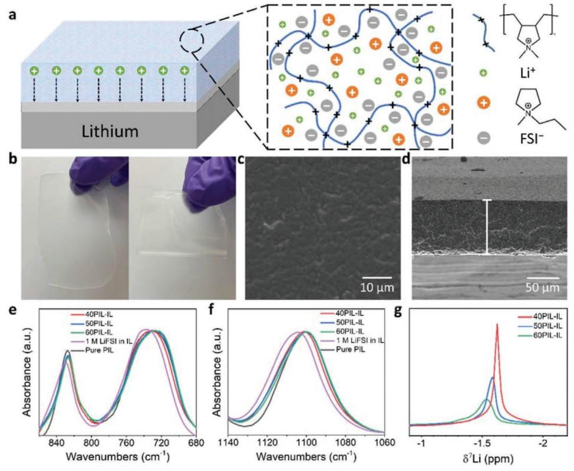
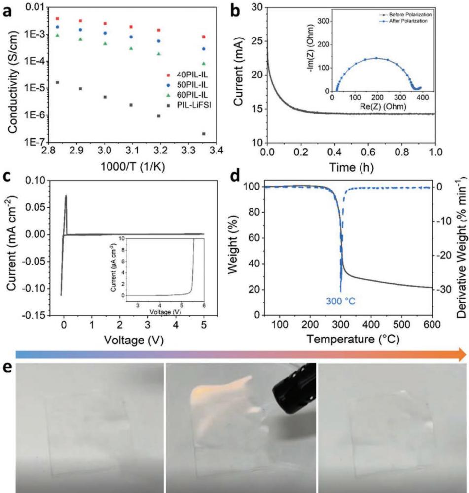
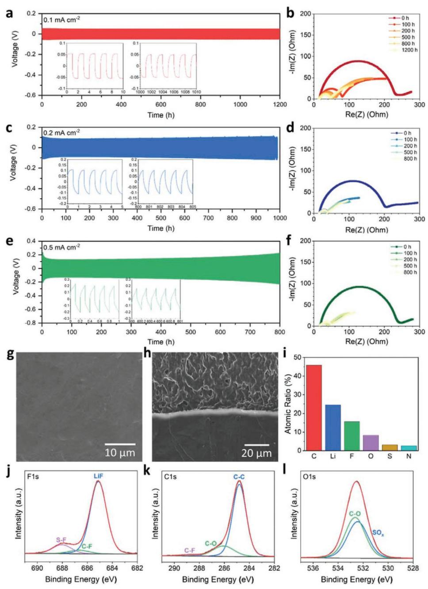
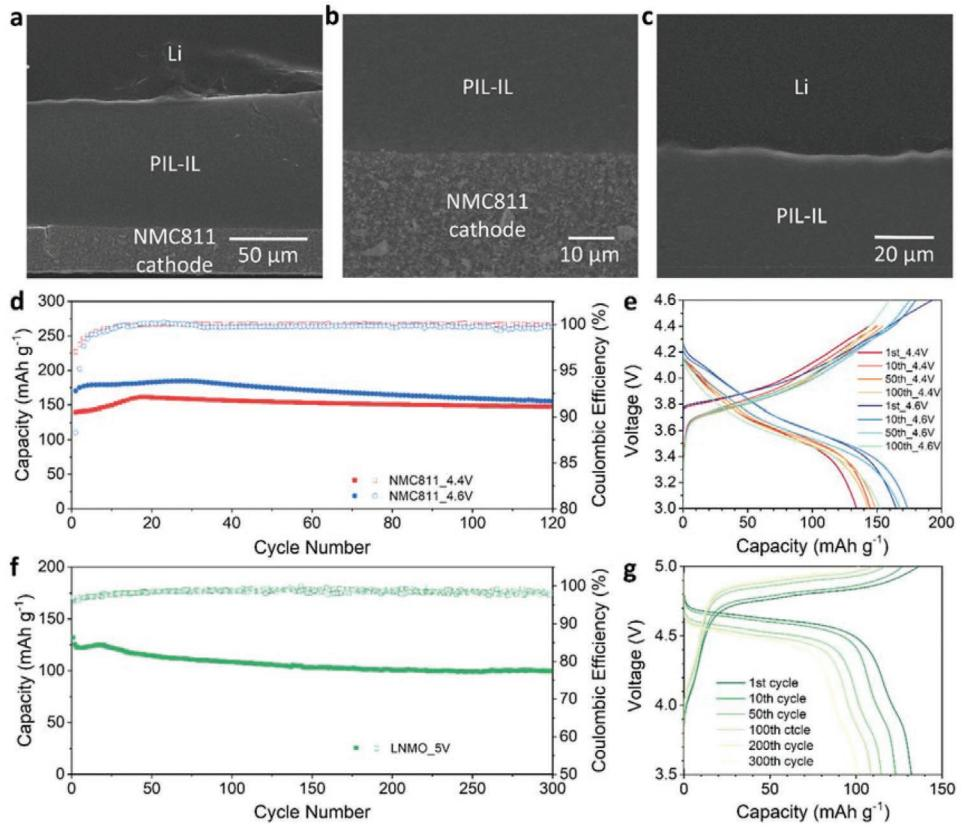
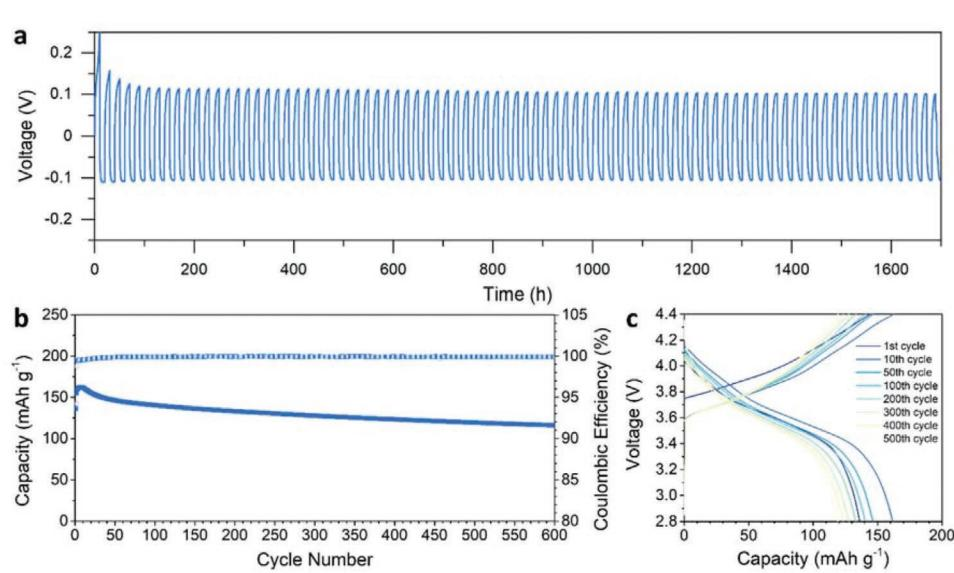
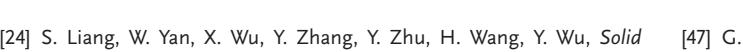

# **A Polymerized-Ionic-Liquid-Based Polymer Electrolyte with High Oxidative Stability for 4 and 5 V Class Solid-State Lithium Metal Batteries**

*Chengyin Fu,\* Gerrit Homann, Rabeb Grissa, Daniel Rentsch, Wengao Zhao, Tom Gouveia, Anaïs Falgayrat, Rongying Lin, Sébastien Fantini, and Corsin Battaglia*

**Polymer solid electrolytes for solid-state batteries typically suffer from low ionic conductivity and low oxidative stability. Herein, a polymer electrolyte based on a polymerized ionic liquid and an ionic liquid plasticizer offering simultaneously a high room-temperature ionic conductivity of 0.8 mS cm−1 and a high oxidative stability >5.0 V versus Li+/Li, is reported. The electrolyte is compatible with lithium metal and non-flammable upon direct flame exposure. In symmetric lithium metal cells, the electrolyte enables stable lithium plating and stripping at 0.1 mA cm−2 with a capacity of 1 mAh cm−2 per half cycle for over 1700 h at 25 °C. Cells with a lithium metal anode cycled against a state-of-the-art high-energy uncoated layered LiNi0.8Mn0.1Co0.1O2 cathode achieve an initial capacity of 162 mA h g−1 and a capacity retention of 72% after 600 cycles to an upper cut-off voltage of 4.4 V at 25 °C. Cells with a high-voltage spinel LiMn1.5Ni0.5O4 cathode reach an initial capacity of 132 mAh g−1 and a capacity retention of 76% after 300 cycles to an upper cut-off voltage of 5 V at 25 °C, confirming the high oxidative stability and technological potential of this electrolyte for high-voltage solid-state lithium metal batteries.**

# **1. Introduction**

Solid-state batteries are considered as the next-generation rechargeable battery technology and have drawn massive attention by researchers from both academia and industry in recent years.[1] Solid-state batteries employing solid electrolytes can circumvent some of the drawbacks associated with

C. Fu, G. Homann, R. Grissa, D. Rentsch, W. Zhao, C. Battaglia Empa−Swiss Federal Laboratories for Materials Science and Technology Überlandstrasse 129, Dübendorf 8600, Switzerland E-mail: chengyin.fu@empa.ch

T. Gouveia, A. Falgayrat, R. Lin, S. Fantini

11 Chemin des Silos, Toulouse 31100, France

#### **DOI: 10.1002/aenm.202200412**

the low thermal stability and flammability of liquid electrolytes employed in traditional lithium-ion batteries. Solid electrolytes also promise to enable the use of lithium metal as negative electrode, which exhibits very high specific capacity (3860 mAh g−1 ) and the lowest electrochemical potential (−3.04 V) of all chemistries, offering a pathway to batteries with energy densities of >400 Wh kg−1 and >1200 Wh L−1 on cell level when paired with a high-energy positive electrode.[2–10]

However, the electrochemical stability window of most solid electrolytes is typically not wide enough to enable stable cycling of lithium metal versus a 4 V-class positive electrode required to reach such high energy density.[11–13] Instead, most solid electrolytes tend to either chemically or electrochemically reduce at the interface to lithium metal and/or oxidize at the interface to the positive electrode resulting in poor cycling performance and poor

cycle life, if no passivating interphase is formed.[14,15] Furthermore, lithium metal anodes are prone to the formation of socalled lithium metal dendrites upon charging, which can penetrate into the solid electrolyte and can cause the cell to shortcircuit. Voids forming at the interface between lithium metal and solid electrolytes upon battery discharge cause current constrictions and were demonstrated to promote dendrite formation.[16–20] Therefore, a solid electrolyte needs to not only form a stable interface to lithium metal and the positive electrode, but must also enable stable plating and stripping of lithium metal.

Compared to inorganic solid electrolytes, polymer solid electrolytes are typically more flexible and able to maintain a much more intimate contact with the electrodes during cycling, which alleviates voids formation at the interface between lithium metal and solid electrolytes. However, the low room-temperature ionic conductivity and narrow electrochemical stability window hinder their application.[21–23] Incorporating plasticizers into polymer solid electrolytes helps to boost the ionic conductivity at room temperature while retaining the polymer's flexibility.[24–26] Polymer matrices, including poly(ethylene oxide) (PEO),[26–29] polyacrylonitrile (PAN),[30,31] poly(methyl methacrylate) (PMMA),[32,33] and poly(vinylidene fluoride)-co-hexafluoropropylene (PVDF-HFP),[34–37] and plasticizers, such as carbonates,[38–40]

Solvionic

The ORCID identification number(s) for the author(s) of this article can be found under https://doi.org/10.1002/aenm.202200412.

© 2022 The Authors. Advanced Energy Materials published by Wiley-VCH GmbH. This is an open access article under the terms of the Creative Commons Attribution-NonCommercial-NoDerivs License, which permits use and distribution in any medium, provided the original work is properly cited, the use is non-commercial and no modifications or adaptations are made.

ethers,[41–43] esters,[44,45] and ionic liquids,[46–49] have been investigated. Nevertheless, all of these polymers show insufficient oxidative stability to enable stable long-term cycling in contact with a 4 V-class LiNi0.8Mn0.1Co0.1O2 (NMC811) or 5 V-class LiNi0.5Mn1.5O4 (LNMO) positive electrode.

Here, we demonstrate a polymer solid electrolyte based on a polymerized ionic liquid (PIL) with ionic liquid (IL) as plasticizer as shown in **Figure 1**a. The polymer matrix consists of poly(diallyldimethylammonium) bis(fluorosulfonyl) imide (PDADMAFSI) and N-butyl-N-methylpyrrolidinium bis(trifluoromethylsulfonyl) imide (PYR13FSI) is employed as plasticizer in combination with lithium bis(fluorosulfonyl) imide (LiFSI) as lithium salt. PDADMAFSI and PYR13FSI were selected because of their outstanding chemical stability and broad electrochemical stability window.[50–52] Comparing to typical lithium-ion-coordinating polymer matrices, the positively charged PDADMA+ chains reduce lithiumion coordination with the polymer promoting high lithiumion mobility. LiFSI has low binding energy between Li+ and FSI−[53] and the ability to form stable interphases in contact with lithium metal.[54,55] Consequently, our polymer solid electrolyte exhibits high ionic conductivity and a wide electrochemical stability window enabling stable cycling of a lithium metal anode versus high-voltage uncoated LiNi0.8Mn0.1Co0.1O2 (NMC811) and LiMn1.5Ni0.5O4 (LNMO) cathodes at room temperature.

#### **2. Results and Discussion**

Different ratios of PDADMAFSI and 1 m LiFSI in PYR13FSI were mixed together, the resulting solutions were tape casted, and the dried films are denoted according to the PDADMAFSI content of 40 wt% (40PIL-IL), 50 wt% (50PIL-IL), and 60 wt% (60PIL-IL). Both LiFSI salt and PYR13FSI plasticizer are dissolved in the PDADMAFSI matrix as illustrated in Figure 1a. The PIL-IL films are homogeneous, transparent, and flexible as demonstrated in Figure 1b. The top-view scanning electron microscopy (SEM) image of the PIL-IL film in Figure 1c shows a smooth surface and a homogeneous film with no phase separation. The film has a thickness of 85 ± 2 µm as shown in the cross-sectional SEM image in Figure 1d.

Figure S1, Supporting Information, shows the Fourier-transform infrared spectroscopy (FTIR) spectra of the PIL-IL electrolytes, 1 m LiFSI in IL (PYR13FSI), and the pure PIL (PDAD-MAFSI). The S-N-S symmetric and asymmetric stretching modes of FSI− at 730 and 827 cm−1 are shown in Figure 1e.[56] When IL plasticizer is added into the PIL, the peak first shifts to lower wavenumbers, which suggests a weakening of the interaction between FSI− and the polymer chain. When the PIL content further decreases in the PIL-IL, the peak shifts to higher wavenumbers. This blue shift can be attributed to the higher degree of coordination between FSI− and Li+, [56] and the strongest Li-FSI coordination is observed in 1 m LiFSI in IL due to the

**Figure 1.** a) Scheme of the structure of PIL-IL electrolyte; b) photograph of the 40PIL-IL electrolyte; c) top-view SEM image of the 40PIL-IL electrolyte; and d) cross-sectional SEM image of the 40PIL-IL electrolyte; FTIR spectra of the PIL-IL electrolytes, 1 m LiFSI in IL (PYR13FSI), and the pure PIL focused on the region of e) S-N-S symmetric and asymmetric stretching modes and f) SO2 symmetric stretching mode; g) 7 Li solid-state NMR spectra of the PIL-IL electrolytes.

tration of Li+ in PIL-IL electrolytes.

the PIL-IL, indicating higher Li+ mobility,[48]

The 7

The 7

highest Li-ion concentration. The same shift is also observed for the SO2 symmetric stretch as shown in Figure 1f, which further supports the stronger Li-FSI coordination in PIL-IL with lower PIL content. The enhanced Li-FSI coordination is mainly due to the increased amount of 1 m LiFSI in IL and the higher concen-

The Li-FSI coordination can also be characterized by 7

state nuclear magnetic resonance (NMR) shown in Figure 1g.

Li peak shifts to lower frequency as the PIL content decreases in the PIL-IL, which is due the enhancement of the shielding effect on Li+ by the Li-FSI coordination. The Li-FSI coordination in the electrolyte can lower the lowest unoccupied molecular orbital of FSI−, which facilitate the decomposition of FSI− on lithium metal surfaces and results in a LiF-rich SEI.[57]

Li resonance also narrows as the PIL content decreases in

showing the highest Li+ mobility among the three PIL-IL electrolytes. Although 40PIL-IL shows slightly stronger Li-FSI coordination compared to other PIL-IL electrolytes, the increase in the IL plasticizer content is still able to enhance the Li+ mobility in the electrolyte due to the excellent Li-ion mobility in the IL as shown in Figure S2, Supporting Information. Figure S3, Supporting Information, shows the 1 H and 13C solid-state NMR spectra of the PIL-IL electrolytes and the pure PIL, and both series of NMR spectra also demonstrate a slight peak narrowing for samples with lower PIL contents, suggesting a slight increase in PYR13+ mobility. However, the peak narrowing in 7 Li NMR spectra is much more pronounced than that in 1 H and 13C NMR spectra, which indicates that the improvement in Li+ mobility is the dominant effect when the PIL content decreases. Therefore, decreasing the PIL content in the PIL-IL electrolytes is expected to increase the Li+ transference number (see below).

The ionic conductivity of the PIL-IL electrolytes was determined by electrochemical impedance spectroscopy as shown in **Figure 2**a. The ionic conductivity of a polymer electrolyte consisting of the pure PIL and LiFSI salt (PIL-LiFSI) without

Li solid-

with the 40PIL-IL

**Figure 2.** a) Ionic conductivity of the PIL-IL electrolytes and PIL-LiFSI at different temperatures; b) 30 mV polarization of a symmetric lithium cell with the 40PIL-IL electrolyte and Nyquist plots before and after polarization (inset) for transference number measurement; c) CV curve of the 40PIL-IL electrolyte in the range between −0.1 and 5 V with a scan rate of 1 mV s−1 at 25 °C and LSV curve at 0.1 mV s−1 and 25 °C (inset); d) thermogravimetric analysis of the 40PIL-IL electrolyte; and e) single images of the ignition test of the 40PIL-IL electrolyte from Video S1, Supporting Information.

IL plasticizer was also measured as control. PIL-LiFSI shows a low ionic conductivity on the order of 10−4 mS cm−1 at 25 °C. By adding the IL into PIL-LiFSI, a significant boost of the ionic conductivity was observed, and the ionic conductivity of the PIL-IL electrolytes increases with decreasing PIL content. However, further decreasing the PIL content results in poor mechanical properties and renders the electrolyte difficult to handle. The 40PIL-IL electrolyte shows the highest conductivity of 0.8 mS cm−1 at 25 °C. The glass transition temperature (*T*g) of the PIL-IL electrolytes and the pure PIL was measured by differential scanning calorimetry (DSC) as shown in Figure S4, Supporting Information. The pure PIL shows a relatively high *T*g of −18 °C which is responsible for the low ionic conductivity of PIL-LiFSI. When IL is added into the polymer, the *T*g drops significantly and the *T*g reduces further as PIL content decreases in the PIL-IL. 40PIL-IL shows the lowest *T*g of −92 °C, which contributes to its highest ionic conductivity.

The Li+ transference numbers of the PIL-IL electrolytes were measured using the Bruce–Vincent method in symmetric lithium cells.[58,59] The cells were subjected to a 30 mV polarization, and electrochemical impedance spectra were measured at initial and steady state. Figure 2b shows the measurement result for 40PIL-IL, and Figure S5, Supporting Information, shows the result for 50PIL-IL and 60PIL-IL. For samples 40PIL-IL, 50PIL-IL, and 60PIL-IL, Li+ transference numbers of 0.44, 0.31, and 0.17 were determined, respectively. The decrease in the transference number in this series is due to the decrease in Li+ mobility as supported by the 7 Li NMR data and the reduction of the ratio between Li+ and FSI− in the PIL-IL electrolytes. The Li+ transference number of 40PIL-IL is slightly higher than typical carbonate-based liquid electrolyte and much higher than for common polymer solid electrolytes (e.g., Li+ transference number of PEO-based PSE is ≈0.2[60] ). The high Li+ transference number in 40PIL-IL is explained by the weak coordination of Li+ to the polymer chains compared to the coordination to the chains of typical polymer solid electrolytes, which largely improves the Li+ mobility. Since 40PIL-IL shows the highest ionic conductivity and Li+ transference number, further investigations were conducted only on this electrolyte.

Figure 2c shows the cyclic voltammetry (CV) curve of 40PIL-IL with a lithium metal counter electrode and a stainless steel working electrode with a scan rate of 1 mV s−1 at 25 °C. The CV curve demonstrates stable lithium plating and stripping and electrochemical stability from −0.1 to 5 V. In order to determine the oxidative stability of the electrolyte more accurately, linear sweep voltammetry (LSV) was performed with a low scan rate of 0.1 mV s−1 as shown in the inset of Figure 2c (note the change in vertical scale units). 40PIL-IL shows a high oxidative stability even at such slow scan rate up to >5 V with the current increasing abruptly at 5.4 V. The thermal stability of 40PIL-IL was investigated by thermogravimetric analysis (TGA) as shown in Figure 2d. The 40PIL-IL electrolyte is thermally stable up to 300 °C, superior to a typical carbonate-based liquid electrolyte, with flash points near room temperature[61] and in which the LiPF6 salt starts decomposing already at 107 °C.[62] 40PIL-IL also shows excellent non-flammability as shown in Figure 2e and Video S1, Supporting Information. Even when exposed to a flame for several seconds, the 40PIL-IL film did not start to burn. The non-flammability of the 40PIL-IL is a consequence of the non-flammability of both PDADMAFSI and PYR13FSI.[51,52]

Electrodeposition of lithium from the 40PIL-IL electrolyte was investigated in symmetric lithium cells at 25 °C and was first performed at 0.1 mA cm−2 with a capacity of 0.1 mAh cm−2 per half cycle as shown in **Figure 3**a. The cell exhibits stable lithium plating and stripping over 1200 h, and no obvious change in the overpotential is observed during cycling. The voltage curves in the insets show smooth lithium plating and stripping with no sign of a soft short, which would lead to a sudden drop of the cell voltage and squaring of the voltage profiles.[63] The Nyquist plots measured by electrochemical impedance spectroscopy in Figure 3b all show a single full semicircle. The first intercept of the semicircle with the real axis indicates the ionic conductivity of the 40PIL-IL electrolyte, and the diameter of the semicircle represents the interfacial resistance between 40PIL-IL and the lithium metal electrode. The ionic conductivity of 40PIL-IL stays constant during cycling suggesting that the bulk of the electrolyte remains unchanged. After the first 100 h of cycling, the interfacial resistance also remains constant, which is in agreement with the constant overpotential and demonstrates the excellent compatibility of 40PIL-IL versus lithium metal. Symmetric lithium cells with 50PIL-IL and 60PIL-IL were also cycled at 0.1 mA cm−2 as shown in Figures S6a and S6b, Supporting Information, respectively. The cell with 50PIL-IL shows stable cycling up to ≈250 h, while the cell with 60PIL-IL shows a sharp increase in overpotential after plating lithium for only a couple of minutes. The shortened cycle life of 50PIL-IL and 60PIL-IL is associated with their relatively low ionic conductivity and Li+ transference numbers, which facilitate nonuniform lithium plating and stripping. In addition, as shown in Figure S7, Supporting Information, a symmetric cell with 1 m LiFSI in IL electrolyte was cycled at the same current density. The cell exhibits lower overpotential compared to the cell with 40PIL-IL electrolyte, which is due to the higher ionic conductivity of the IL electrolyte and the better contact between the IL electrolyte and the lithium metal surface. However, the cell only shows stable cycling for 95 h, and a sudden drop in overpotential was observed due to soft short. The result demonstrates the superior dendrite suppression ability of 40PIL-IL electrolyte. Figure 3c,e shows galvanostatic cycling of symmetric lithium cells with 40 PIL-IL at 0.2 and 0.5 mA cm−2 with a capacity of 0.1 and 0.05 mAh cm−2 per half cycle, respectively. At both current densities, stable lithium plating and stripping are observed, and both curves show only a small increase in the overpotential, which could be due to a slight reduction in the contact area between 40PIL-IL and lithium metal electrode caused by void formation at these higher current densities. The Nyquist plots in Figure 3d,f exhibit a slow increase in the interfacial resistance with increasing cycling time, which agrees with the trend of the overpotential and supports the void formation scenario.

In order to investigate the cycled lithium metal electrodes, they were retrieved from the symmetric cells after cycling at 0.1 mA cm−2 for 200 h at 25 °C. Figure 3g shows the top-view SEM image of the cycled lithium electrode. A very flat and smooth lithium surface is observed, which confirms uniform lithium plating. The cross-sectional SEM image in Figure 3h shows the interface between 40PIL-IL and lithium metal

**www.advancedsciencenews.com www.advenergymat.de**

**Figure 3.** a) Galvanostatic cycling of the symmetric lithium cells with the 40PIL-IL electrolyte at a) 0.1, c) 0.2, and e) 0.5 mA cm−2 with a capacity of 0.1, 0.1, and 0.05 mAh cm−2 per half cycle, respectively, of each deposition process at 25 °C; Nyquist plots at different cycles for the symmetric lithium cells with the 40PIL-IL at b) 0.1, d) 0.2, and f) 0.5 mA cm−2; g) top-view SEM image of the lithium electrode and h) cross-sectional SEM image of the lithium-electrode-electrolyte interface from the symmetric lithium cell after cycling at 0.1 mA cm−2 for 200 h at 25 °C; i) quantitative analysis from the XPS spectrum of the cycled lithium electrode shown in (g); j) F1s, k) C1s, and l) O1s XPS spectra of the cycled lithium electrode shown in (g).

electrode after cycling. The 40PIL-IL electrolyte maintains excellent contact with the lithium metal electrode, and no dendritic lithium, porous lithium, or voids are observed, which further confirms a uniform lithium metal plating. This is mainly due to the high ionic conductivity and relatively high Li+ transference number of 40PIL-IL as well as the low interfacial resistance and stable interphase layer formed by 40PIL-IL to lithium metal.

X-ray photoelectron spectroscopy (XPS) was performed on the cycled lithium metal electrode to further analyze the chemical composition of the interphase layer. The quantitative analysis from the XPS spectrum in Figure 3i demonstrates a high F content of 15.6 at% in the interphase layer. Figure 3j shows the F 1s spectrum, consisting of an intense LiF peak at 685.2 eV and relatively weak CF and SF peaks at 686.7 and 688.0 eV, respectively.[64,65] The ratio of the three species was calculated

by integrating the peak areas, which suggests that 85.2% of the fluorine in the interphase layer is in the form of LiF. The LiF-rich SEI layer not only serves as a stable interphase on lithium metal surface but also promotes uniform lithium metal plating.[63,65] The C1s spectrum in Figure 3k shows CC, CO, and CF at 284.8, 286.1, and 288.8 eV, respectively, and no carbonate species were observed.[65] The O1s spectrum in Figure 3l further confirms that the interphase layer contains no carbonate species. Since the pristine lithium metal contains trace amounts of Li2CO3 on its surface as supported by the C1s spectrum in Figure S8, Supporting Information, the disappearance of the carbonate species suggests a uniform coverage of the interphase layer on the lithium metal surface. Li1s, S2p, and N1s spectra are also provided in Figure S9, Supporting Information, for completeness.

The Coulombic efficiency of lithium plating and stripping was evaluated in a LiCu cell with 40PIL-IL electrolyte. As shown in Figure S10, Supporting Information, the LiCu cell shows an initial Coulombic efficiency of 80.1%, the relatively low initial Coulombic efficiency is due to the formation of the LiF-rich SEI. After 5 cycles, the Coulombic efficiency increases to and stabilizes at ≈87%, which suggests the formation of a stable SEI. Methods to further improve the Coulombic efficiency of LiCu cells are currently under investigation.

Full cells with 40PIL-IL electrolyte, an uncoated NMC811 cathode, and a lithium metal anode were also assembled. The NMC811 cathode consists of 70 wt% active material, 10 wt% carbon black, and 20 wt% 40PIL-IL, which serve as both solid electrolyte and binder in the cathode. The NMC 811 cathode has an active material loading of 3.7 ± 0.2 mg cm−2 . **Figure 4**a shows the cross-sectional SEM image of the full cell. Instead of using a razorblade as done for the images shown in Figures 1d and 3g, the cell was cut using an argon ion mill in order to obtain a clean cut of the relatively hard NMC811 particles. The use of the ion beam results in a smoother cut of the 40PIL-IL electrolyte compared to the cut by razorblade. Figure 4b,c shows higher magnification images of the NMC811-electrolyte and the electrolyte-lithium metal interface, respectively. Due to the excellent flexibility of the electrolyte, both interfaces show excellent contacts between the electrolyte and the electrode, which promises lower overpotential and longer cycle life. Figure 4d shows galvanostatic cycling of the full cells with a current density of 0.1 mA cm−2 at 25 °C. Two different upper cut-off voltages, 4.4 and 4.6 V, were used for charging the cells. For the cell cycled to the cut-off voltage of 4.4 V, a specific capacity of 161 mAh g−1 was achieved, and the cell shows a capacity retention of 92% after the 120 cycles. The average Coulombic efficiency is 99.9%, which suggests excellent electrochemical stability of the electrolyte within the voltage window. For the cell

**Figure 4.** Cross-sectional SEM image of a) the full cell with 40PIL-IL electrolyte, NMC811 cathode, and lithium metal anode, b) the NMC811-electrolyte interface, and c) the electrolyte-Li interface; d) galvanostatic cycling of the full cells with the NMC811 cathode with cut-off voltage of 4.4 and 4.6 V at 0.1 mA cm−2 and 25 °C; e) charge–discharge curves of the full cells with the NMC811 cathode; f) galvanostatic cycling of the full cells with a LNMO cathode with a cut-off voltage of 5 V at 0.1 mA cm−2 and 25 °C; g) charge–discharge curves of the full cell with the LNMO cathode.

cycled to the cut-off voltage of 4.6 V, a higher discharge capacity of 185 mAh g−1 and a capacity retention of 84% after 120 cycles were achieved, and the average Coulombic efficiency is 99.6%. The excellent performance of the full cells with NMC811 cathode is partially enabled by the high oxidative stability of 40PIL-IL electrolyte, and no coatings on NMC811 are required. Figure 4e shows the galvanostatic charge–discharge curves of the full cells with the NMC811 cathode, a slight increase in overpotential is observed in both cells during cycling, responsible for slow capacity fading because the effective upper cut-off voltage is decreased.

The rate performance of the full cell with the NMC811 cathode is shown in Figure S11, Supporting Information. The cell was cycled at different current densities ranging from 0.02 to 0.5 mA cm−2 with a cut-off voltage of 4.4 V at 25 °C, and each current density was applied for 5 cycles. The cell shows stable cycling up to 0.5 mA cm−2. Due to 40PIL-IL's decent ionic conductivity of 0.09 mS cm−1 at 0 °C, the full cell was also cycled at 0 °C with a cut-off voltage of 4.4 V as shown in Figure S12, Supporting Information. Stable cycling is observed over 180 cycles, and a highest capacity of 130 mAh g−1 was achieved. The result suggests that 40PIL-IL has a wide range of operation temperature. In order to investigate the cycling performance using a reduced excess of lithium metal, a cell, consisting of 40PIL-IL electrolyte, NMC811 cathode, and a 20 µm lithium metal anode, was also cycled with a cut-off voltage of 4.4 V at 25 °C as shown in Figure S13, Supporting Information. The cell exhibits a capacity of 163 mAh g−1 and stable cycling over 100 cycles.

In order to further demonstrate the excellent oxidative stability of the 40PIL-IL electrolyte, a cell was also assembled with a high-voltage LNMO cathode, consisting of 70 wt% active material, 10 wt% carbon black, and 20 wt% 40PIL-IL. The cell was cycled with a current density of 0.1 mA cm−2 and an upper cut-off voltage of 5 V at 25 °C as shown in Figure 4f. The cell shows an initial specific capacity of 132 mAh g−1 and a capacity retention of 76% after 300 cycles. The average Coulombic efficiency is 98.3% after 300 cycles. The galvanostatic charge– discharge curves in Figure 4g exhibit a high nominal voltage of 4.7 V and stable cycling of the cell. The results further confirm 40PIL-IL's outstanding oxidative stability resulting from the broad electrochemical window of the PIL and IL.

**Table 1** compares the key properties of 40PIL-IL electrolyte and the cell performance with some recently reported highperforming polymer electrolytes designed for lithium metal batteries. The comparison not only shows the remarkable ionic conductivity and non-flammability of 40PIL-IL electrolyte, but also clearly demonstrates the outstanding oxidative stability, which enables the highest upper cut-off voltage and Coulombic efficiency of the full cells. Combining these excellent properties makes 40PIL-IL a highly promising candidate for high-energydensity solid-state lithium metal batteries.

Although the 40PIL-IL electrolyte enables excellent cycling stability in symmetric lithium cells and full cell with NMC811 and LNMO, further improvement of the cycle life is hindered by the soft nature of the electrolyte. After long-term cycling, full cells typically start to show abnormal charge curves with severe voltage fluctuation. Figure S14, Supporting Information, shows the charge–discharge curves of the full cell with a NMC811 cathode at 250th cycle. Although this behavior does not show a strong influence on the discharge capacity, it largely reduces the Coulombic efficiency of the cells. This voltage fluctuation can be explained by the formation of a soft short in the cell, resulting from a lithium dendrites penetrating through the solid electrolyte and resulting in a temporary chemical lithiation of the cathode.[69] To prevent or at least delay the onset of this phenomenon, the soft 40PIL-IL electrolyte was reinforced with glass microfibers to improve its mechanical properties and increase the tortuosity with the intention to hinder dendrite propagation. 40PIL-IL electrolyte was infiltrated into a 260 µm thick glass microfiber filter with a pore size of 1.6 µm. The glass microfiber reinforced 40PIL-IL is denoted as 40PIL-IL-GF. Lithium plating and stripping with the 40PIL-IL-GF electrolyte was first performed in symmetric lithium cells at 0.1 mA cm−2 with a capacity of 1 mAh cm−2 per half cycle at 25 °C as shown in **Figure 5**a. Even with a 10 times higher capacity per half cycle compared to the experiments reported above, the cell shows an improved cycling performance with more than 1700 h of

**Table 1.** Comparison of the key properties of 40PIL-IL electrolyte and the cell performance with different polymer electrolytes.

| Polymer electrolyte                          | Ionic conductivity [mS cm−1 ] | Flammability | Operating temperature | Full cell Coulombic efficiency | Cathode material/ upper cut-off voltage |
|----------------------------------------------|-------------------------------------|--------------|--------------------------|-----------------------------------|--------------------------------------------|
| LiFSI-PS-PIL-PYR13FSI[46]                    | 3 × 10−4 at 25 °C                | No           | 50 °C                    | -                                 | LFP/3.8 V                                  |
| [47] LiFSI-PIL-P111i4FSI-Al2O3            | 0.2 at 30 °C                        | No           | 50 °C                    | 98%                               | LFP/3.8 V                                  |
| LiTFSI-PPG-PEG-PPG-DEGMDE[42]                | 0.1 at 25 °C                        | Yes          | 25 °C                    | 99.5%                             | LFP/3.8 V                                  |
| LiTFSI-PDE-TB[43]                            | 1.2 at 30 °C                        | No           | 25 °C                    | -                                 | NMC622/4.3 V                               |
| [40] LiFSI-ETPTA-PIL-PC-FEC-Ti-SiO2@Al2O3 | 0.4 at 25 °C                        | Yes          | 25 °C                    | -                                 | NMC811/4.6 V                               |
| LiTFSI-PEGMA-MePrPylTFSI[48]                 | 0.4 at 25 °C                        | No           | 25 °C                    | 99.7%                             | NMC811/4.4 V                               |
| LiFSI-PBDT-EMIMBF4-PYR13FSI[49]              | 1.5 at 25 °C                        | No           | 25 °C                    | -                                 | -                                          |
| [66] LiTFSI-PDOL-MP-FEC-LiPF6             | 2.8 at 30 °C                        | Yes          | 23 °C                    | 99.5%                             | NMC811/4.3 V                               |
| LiNO3-PBA-TMP[67]                            | 2.1 at 25 °C                        | No           | 25 °C                    | 99.9%                             | LFP/4.0 V                                  |
| LiTFSI-PEGDA-SN[68]                          | 1.1 at 20 °C                        | Yes          | 30 °C                    | 99.4%                             | NMC83/4.5 V                                |
| 40PIL-IL [this work]                         | 0.8 at 25 °C                        | No           | 25 °C                    | 99.9% (NMC811)                    | NMC811/4.6 V LNMO/5.0 V                 |

**Figure 5.** a) Galvanostatic cycling of the symmetric lithium cell with the 40PIL-IL-GF electrolyte at 0.1 mA cm−2 with a capacity of 1 mA cm−2 of each deposition process at 25 °C; b) galvanostatic cycling of the full cell with the 40PIL-IL-GF electrolyte, NMC811 cathode, and lithium metal anode with a cut-off voltage of 4.4 V at 0.1 mA cm−2 and 25 °C; and c) charge–discharge curves of the full cell.

stable cycling. The voltage curves show smooth lithium plating and stripping with no signs of a soft short. The cell exhibits a consistent overpotential throughout all cycles, which suggests stable electrolyte-lithium metal interfaces and uniform lithium plating. Figure 5b shows the full cell cycling with the 40PIL-IL-GF electrolyte and the same uncoated NMC811 cathode to a cut-off voltage of 4.4 V at 0.1 mA cm−2 and at 25 °C. A specific capacity of 162 mAh cm−2 was achieved. The cell shows a capacity retention of 72% and an average Coulombic efficiency of 99.9% after 600 cycles. The galvanostatic charge–discharge curves shown in Figure 5c also demonstrate the stable cycling of the full cell. The results demonstrate that improving the mechanical property of the 40PIL-IL electrolyte is beneficial to the cycle life of the full cells.

# **3. Conclusion**

In conclusion, we developed a PIL- and IL-based polymer solid electrolyte for all-solid-state lithium metal batteries, which combines high ionic conductivity, high oxidative stability, and excellent compatibility with lithium metal enabling stable cycling of lithium metal anodes versus high-energy uncoated NMC811 and high-voltage LNMO cathodes. The electrolyte exhibits a high thermal stability, is non-flammable, shows decent Li+ transference number, and possesses a low gravimetric density. In addition, the electrolyte is easily processed into films in ambient air conditions and can be dried subsequently to remove water from the ambient. Furthermore, updated industrial projections show that this kind of PIL-IL electrolyte will be available at a price of less than 80 \$ kg−1 (internal estimation by Solvionic for production at 50 t scale), when benefitting from the economy of scale rendering PIL-IL electrolytes as a strong contender for a competitive all-solid-state lithium metal battery technology capable of reaching the >400 Wh kg−1 and >1200 Wh L−1 targets on cell level set by the European Commission, when implemented in optimized cells.[2]

# **4. Experimental Section**

*Preparation of PIL-IL Electrolytes*: 1 m LiFSI in PYR13FSI was mixed with different amounts of PDADMAFSI in acetonitrile or N-methyl-2 pyrrolidone, and all the solutions were designed with and obtained from Solvionic. PIL-IL films were prepared by blade coating (height = 700 µm) the PIL-IL solution in acetonitrile onto a glass surface. The film was dried in a fume hood overnight and then further dried at 80 °C for 2 h. 40PIL-IL-GF was prepared by using a 260 µm thick glass microfiber Whatman filter with a pore size of 1.6 µm. The glass microfiber filter was first punched into 16 mm diameter discs, and they were soaked into 40PIL-IL solution in acetonitrile overnight. The soaked glass microfiber filters were then placed on a glass surface, and an extra amount of the 40PIL-IL solution was poured on top of them until their surface was fully covered by the solution. The electrolyte-infiltrated glass microfiber filters were dried in a fume hood overnight and then further dried in vacuum at 80 °C for 6 h.

*Material Characterization*: SEM images were taken at a beam energy of 30 keV (FEI Nova Nano SEM 230). FTIR analysis was performed in an argon-filled glovebox using a Bruker Alpha spectrometer (Bruker Daltonics Inc., Bremen, Germany) averaging 32 scans for each spectrum within 400–4000 cm−1 . The 1 H, 7 Li, and 13C MAS NMR experiments were conducted on a Bruker Avance III NMR spectrometer with a 4 mm CP/ MAS probe at 400.2, 155.5, and 100.6 MHz, respectively, applying the following parameters for the three nuclei: 4.9 µs (90°)/1.0 µs (10°)/2.0 µs (15°) pulses, 16/32/256 scans, and 15/10/10 recycle delays ensuring the acquisition of quantitative 1 H and 7 Li NMR data (13C NMR data not quantitative). All NMR spectra were recorded at 10 000 Hz MAS rotation rates. In the case of 13C, the proton frequency was decoupled with 71 kHz SPINAL-64 during data acquisition. The 1 H and 13C NMR chemical shifts were externally referenced to the signals at 1.8 and 39.5 ppm of adamantane, respectively, and 7 Li was referenced to a solution of 9.9 m LiCl in D2O. The solid polymer samples were prepared by drying the PIL-IL solutions in the 4 mm MAS rotors, and Teflon inserts were used to ensure proper rotation. TGA and differential scanning calorimetry (DSC) were measured by using Netzsch STA449 F3 Jupiter thermal analyzer under argon with a ramp rate of 5 °C min−1 . XPS measurements were performed by a PHI Quantum 2000 using a monochromated Al K*α* X-ray source (1486.6 eV) with a pass energy of 30 eV. XPS data were processed with CasaXPS software and quantified using the corrected cross sections with the instrument parameters. Spectra were calibrated by setting the CC peak in C 1s spectrum to 284.8 eV.

*Electrochemical Characterization*: Electrochemical measurements were all performed in CR2032 coin cells. Each cell contains a 1 mm and a 0.5 mm thick stainless steel spacer and a stainless steel 1.4 mm thick spring. For conductivity measurement, the PIL-IL films were sandwiched in between two stainless steel blocking electrodes with a diameter of 16 mm, which was then sealed in coin cells. Electrochemical impedance spectra was performed at 25, 40, 50, 60, 70, and 80 °C by Novocontrol broadband dielectric/impedance spectrometer. The CV and LSV of the PIL-IL electrolyte were measured by a Biologic VMP3 potentiostat with a lithium counter electrode with a diameter of 12 mm, a stainless steel working electrode with a diameter of 16 mm. CV was measured with a scan rate of 1 mV s−1 between −0.1 and 5 V. LSV was performed with a scan rate of 0.1 mV s−1 from OCV to 6 V. Symmetric lithium cells were assembled with two lithium metal electrodes with a diameter of 12 mm and a thickness of 200 µm and a PIL-IL electrolyte film in between. The symmetric lithium cells were cycled on a Biologic BCS-800 battery cycler at 25 °C. The Li+ transference number of the PIL-IL electrolyte was measured in a symmetric lithium cell. The cell was first subjected to a conditioning treatment, which consisted of charge and discharge cycles at 0.001 mA cm−2 in order to help stabilize the interface. The sequence performed was a 4 h charge, 30 min rest, a 4 h discharge, 30 min rest, and repeated for a total of 4 times. The cell was then polarized at 30 mV for 1 h, after which a steady state is reached, and electrochemical impedance spectra were measured separately before the polarization and at the steady state. The Bruce–Vincent method was used to calculate the transference number of the PIL-IL electrolyte:

$$
T_{ss} = \frac{I_{ss}}{I_0} \left( \frac{\Delta V - I_0 R_0}{\Delta V - I_{ss} R_{ss}} \right)
$$
 (1)

where *T*ss is the steady-state transference number, *ΔV* is the applied voltage, *I*0 is the initial current, *I*ss is the steady-state current, *R*0 is the initial interfacial resistance, and *R*ss is the steady-state interfacial resistance. The initial current is calculated by Ohm's law: *I*0 *= ΔV*/(*Re + RI + R*CT). Full cells were assembled with a PIL-IL electrolyte, a 200 µm thick lithium with a diameter of 14 mm, and a NMC811 or a LNMO cathode with a diameter of 12 mm. The cathode slurry was comprised of 70 wt% NMC811 (made in lab) or LNMO (NEI Corporation), 10 wt% carbon black (Super C65), and 20 wt% PIL-IL in NMP, and they were mixed by Fritsch Mini-Mill Pulverisette 23 for 20 min. The slurry was then blade coated on a Al current collector, dried in a fume hood overnight, and further dried in a vacuum oven at 80 °C for 12 h. The NMC 811 cathode has an active material loading of 3.7 ± 0.2 mg cm−2, and the LNMO cathode has an active material loading of 1.5 mg cm−2. The full cells were cycled on a Biologic BCS-800 battery cycler.

#### **Supporting Information**

Supporting Information is available from the Wiley Online Library or from the author.

### **Acknowledgements**

This work was supported by funding from the European Union's Horizon 2020 research and innovation programme for the Solidify project under grant agreement No. 875557. The NMR hardware was partially granted by the Swiss National Science Foundation under grant agreement No. 206021\_150638/1.

Open access funding provided by ETH-Bereich Forschungsanstalten.

## **Conflict of Interest**

The authors declare no conflict of interest.

| Data Availability Statement |  |
|-----------------------------|--|

The data that support the findings of this study are available from the corresponding author upon reasonable request.

# **Keywords**

high ionic conductivity, high oxidative stability, lithium metal batteries, solid polymer electrolytes, solid-state batteries

> Received: February 1, 2022 Revised: March 29, 2022 Published online: April 22, 2022

- [1] A vision for a sustainable battery value chain in 2030: unlocking the full potential to power sustainable development and climate change mitigation, [https://www.weforum.org/reports/a-vision-for](https://www.weforum.org/reports/a-vision-for-a-sustainable-battery-value-chain-in-2030)[a-sustainable-battery-value-chain-in-2030](https://www.weforum.org/reports/a-vision-for-a-sustainable-battery-value-chain-in-2030) (accessed: February 2021).
- [2] Strongly improved, highly performant and safe all solid state batteries for electric vehicles (RIA), [https://cordis.europa.eu/pro](https://cordis.europa.eu/programme/id/H2020_LC-BAT-1-2019)[gramme/id/H2020\\_LC-BAT-1-2019](https://cordis.europa.eu/programme/id/H2020_LC-BAT-1-2019) (accessed: February 2021).
- [3] Y. Tian, G. Zeng, A. Rutt, T. Shi, H. Kim, J. Wang, J. Koettgen, Y. Sun, B. Ouyang, T. Chen, Z. Lun, Z. Rong, K. Persson, G. Ceder, *Chem. Rev.* **2021**, *121*, 1623.
- [4] A. Manthiram, X. Yu, S. Wang, *Nat. Rev. Mater.* **2017**, *2*, 16103.
- [5] L.-Z. Fan, H. He, C.-W. Nan, *Nat. Rev. Mater.* **2021**, *6*, 1003.
- [6] K. B. Hatzell, X. C. Chen, C. L. Cobb, N. P. Dasgupta, M. B. Dixit, L. E. Marbella, M. T. McDowell, P. P. Mukherjee, A. Verma, V. Viswanathan, A. S. Westover, W. G. Zeier, *ACS Energy Lett.* **2020**, *5*, 922.
- [7] Q. Zhao, S. Stalin, C.-Z. Zhao, L. A. Archer, *Nat. Rev. Mater.* **2020**, *5*, 229.
- [8] S.-J. Tan, W.-P. Wang, Y.-F. Tian, S. Xin, Y.-G. Guo, *Adv. Funct. Mater.* **2021**, *31*, 2105253.
- [9] J. Wu, L. Yuan, W. Zhang, Z. Li, X. Xie, Y. Huang, *Energy Environ. Sci.* **2021**, *14*, 12.
- [10] X.-B. Cheng, C.-Z. Zhao, Y.-X. Yao, H. Liu, Q. Zhang, *Chem* **2019**, *5*, 74.
- [11] L. Zhou, T.-T. Zuo, C. Y. Kwok, S. Y. Kim, A. Assoud, Q. Zhang, J. Janek, L. F. Nazar, *Nat. Energy* **2022**, *7*, 83.
- [12] Y.-G. Lee, S. Fujiki, C. Jung, N. Suzuki, N. Yashiro, R. Omoda, D.-S. Ko, T. Shiratsuchi, T. Sugimoto, S. Ryu, J. H. Ku, T. Watanabe, Y. Park, Y. Aihara, D. Im, I. T. Han, *Nat. Energy* **2020**, *5*, 299.
- [13] R. Asakura, D. Reber, L. Duchêne, S. Payandeh, A. Remhof, H. Hagemann, C. Battaglia, *Energy Environ. Sci.* **2020**, *13*, 5048.
- [14] Y. Zhu, X. He, Y. Mo, *ACS Appl. Mater. Interfaces* **2015**, *7*, 23685.
- [15] P. Bron, B. Roling, S. Dehnen, *J. Power Sources* **2017**, *352*, 127.
- [16] H. Koshikawa, S. Matsuda, K. Kamiya, M. Miyayama, Y. Kubo, K. Uosaki, K. Hashimoto, S. Nakanishi, *J. Power Sources* **2018**, *376*, 147.
- [17] S.-S. Chi, Y. Liu, N. Zhao, X. Guo, C.-W. Nan, L.-Z. Fan, *Energy Storage Mater.* **2019**, *17*, 309.
- [18] T. Krauskopf, F. H. Richter, W. G. Zeier, J. Janek, *Chem. Rev.* **2020**, *120*, 7745.
- [19] A. Jonderian, E. McCalla, *Mater. Adv.* **2021**, *2*, 2846.
- [20] J. Kasemchainan, S. Zekoll, D. S. Jolly, Z. Ning, G. O. Hartley, J. Marrow, P. G. Bruce, *Nat. Mater.* **2019**, *18*, 1105.
- [21] J. Li, Y. Cai, H. Wu, Z. Yu, X. Yan, Q. Zhang, T. Z. Gao, K. Liu, X. Jia, Z. Bao, *Adv. Energy Mater.* **2021**, *11*, 2003239.
- [22] J. Lopez, D. G. Mackanic, Y. Cui, Z. Bao, *Nat. Rev. Mater.* **2019**, *4*, 312.
- [23] Q. Zhou, J. Ma, S. Dong, X. Li, G. Cui, *Adv. Mater.* **2019**, *31*, 1902029.

**www.advancedsciencenews.com www.advenergymat.de**

- *State Ionics* **2018**, *318*, 2. [25] Y.-G. Cho, C. Hwang, D. S. Cheong, Y.-S. Kim, H.-K. Song, *Adv.*
- *Mater.* **2019**, *31*, 1804909. [26] Z. Xue, D. He, X. Xie, *J. Mater. Chem. A* **2015**, *3*, 19218.
- [27] X. Pan, T. Liu, D. J. Kautz, L. Mu, C. Tian, T. E. Long, P. Yang, F. Lin, *J. Power Sources* **2018**, *403*, 127.
- [28] L. Niedzicki, M. Kasprzyk, K. Kuziak, G. Z. Żukowska, M. Armand, M. Bukowska, M. Marcinek, P. Szczeciński, W. Wieczorek, *J. Power Sources* **2009**, *192*, 612.
- [29] S. Chintapalli, R. Frech, *Macromolecules* **1996**, *29*, 3499.
- [30] P. Hu, J. Chai, Y. Duan, Z. Liu, G. Cui, L. Chen, *J. Mater. Chem. A* **2016**, *4*, 10070.
- [31] S.-H. Wang, P.-L. Kuo, C.-T. Hsieh, H. Teng, *ACS Appl. Mater. Interfaces* **2014**, *6*, 19360.
- [32] A. Hosseinioun, P. Nurnberg, M. Schonho, D. Diddens, E. Paillard, *RSC Adv.* **2019**, *9*, 27574.
- [33] R. Sharma, A. Sil, S. Ray, *J. Polym. Res.* **2016**, *23*, 194.
- [34] P. Yang, L. Liu, L. Li, J. Hou, Y. Xu, X. Ren, M. An, N. Li, *Electrochim. Acta* **2014**, *115*, 454.
- [35] N. H. Idris, M. M. Rahman, J.-Z. Wang, H.-K. Liu, *J. Power Sources* **2012**, *201*, 294.
- [36] J. Zhang, B. Sun, X. Huang, S. Chen, G. Wang, *Sci. Rep.* **2014**, *4*, 6007.
- [37] H. T. T. Le, D. T. Ngo, R. S. Kalubarme, G. Cao, C.-N. Park, C.-J. Park, *ACS Appl. Mater. Interfaces* **2016**, *8*, 20710.
- [38] L. R. A. K. Bandara, M. A. K. L. Dissanayake, B. E. Mellander, *Electrochim. Acta* **1998**, *43*, 1447.
- [39] K. Vignarooban, M. A. K. L. Dissanayake, I. Albinsson, B.-E. Mellander, *Solid State Ionics* **2014**, *266*, 25.
- [40] K.-S. Oh, J.-H. Kim, S.-H. Kim, D. Oh, S.-P. Han, K. Jung, Z. Wang, L. Shi, Y. Su, T. Yim, S. Yuan, S.-Y. Lee, *Adv. Energy Mater.* **2021**, *11*, 2101813.
- [41] C. Fu, M. Iacob, Y. Sheima, C. Battaglia, L. Duchêne, L. Seidl, D. M. Opris, A. Remhof, *J. Mater. Chem. A* **2021**, *9*, 11794.
- [42] D. G. Mackanic, X. Yan, Q. Zhang, N. Matsuhisa, Z. Yu, Y. Jiang, T. Manika, J. Lopez, H. Yan, K. Liu, X. Chen, Y. Cui, Z. Bao, *Nat. Commun.* **2019**, *10*, 5384.
- [43] J. Xiang, Y. Zhang, B. Zhang, L. Yuan, X. Liu, Z. Cheng, Y. Yang, X. Zhang, Z. Li, Y. Shen, J. Jiang, Y. Huang, *Energy Environ. Sci.* **2021**, *14*, 3510.
- [44] M. S. Michael, M. M. E. Jacob, S. R. S. Prabaharan, S. Radhakrishna, *Solid State Ionics* **1997**, *98*, 167.
- [45] A. M. Sukeshini, A. R. Kulkarni, A. Sharma, *Solid State Ionics* **1998**, *113–115*, 179.
- [46] N. Goujon, T.-V. Huynh, K. j. Barlow, R. Kerr, K. Vezzù, V. D. Noto, L. A. O'Dell, J. Chiefari, P. C. Howlett, M. Forsyth, *Batteries Supercaps* **2019**, *2*, 132.
- [47] G. M. A. Girard, X. Wang, R. Yunis, D. R. MacFarlane, A. J. Bhattacharyya, M. Forsyth, P. C. Howlett, *Batteries Supercaps* **2019**, *2*, 229.
- [48] C. Huang, C. L. A. Leung, P. Leung, P. S. Grant, *Adv. Energy Mater.* **2021**, *11*, 2002387.
- [49] Y. Wang, C. J. Zanelotti, X. Wang, R. Kerr, L. Jin, W. H. Kan, T. J. Dingemans, M. Forsyth, L. A. Madsen, *Nat. Mater.* **2021**, *20*, 1255.
- [50] X. Wang, R. Kerr, F. Chen, N. Goujon, J. M. Pringle, D. Mecerreyes, M. Forsyth, P. C. Howlett, *Adv. Mater.* **2020**, *32*, 1905219.
- [51] D. R. MacFarlane, M. Forsyth, P. C. Howlett, M. Kar, S. Passerini, J. M. Pringle, H. Ohno, M. Watanabe, F. Yan, W. Zheng, S. Zhang, J. Zhang, *Nat. Rev. Mater.* **2016**, *1*, 15005.
- [52] I. Osada, H. de Vries, B. Scrosati, S. Passerini, *Angew. Chem., Int. Ed.* **2016**, *55*, 500.
- [53] Y. Yamada, A. Yamada, *J. Electrochem. Soc.* **2015**, *162*, A2406.
- [54] X. Fan, L. Chen, X. Ji, T. Deng, S. Hou, J. Chen, J. Zheng, F. Wang, J. Jiang, K. Xu, C. Wang, *Chem* **2018**, *4*, 174.
- [55] R. Petibon, C. P. Aiken, L. Ma, D. Xiong, J. R. Dahn, *Electrochim. Acta* **2015**, *154*, 287.
- [56] S. A. M. Noor, N. C. Su, L. T. Khoon, N. S. Mohamed, A. Ahmad, M. Z. A. Yahya, H. Zhu, M. Forsyth, D. R. MacFarlane, *Electrochim. Acta* **2017**, *247*, 983.
- [57] S. P. Beltran, X. Cao, J.-G. Zhang, P. B. Balbuena, *Chem. Mater.* **2020**, *32*, 5973.
- [58] P. G. Bruce, J. Evans, C. A. Vincent, *Solid State Ionics* **1988**, *28–30*, 918.
- [59] P. G. Bruce, C. A. Vincent, *J. Electroanal. Chem. Interf. Electrochem.* **1987**, *225*, 1.
- [60] K. Pożyczka, M. Marzantowicz, J. R. Dygas, F. Krok, *Electrochim. Acta* **2017**, *227*, 127.
- [61] S. Hess, M. Wohlfahrt-Mehrens, M. Wachtler, *J. Electrochem. Soc.* **2015**, *162*, A3084.
- [62] H. Yang, G. V. Zhuang, P. N. RossJr., *J. Power Sources* **2006**, *161*, 573.
- [63] Y. Lu, Z. Tu, L. A. Archer, *Nat. Mater.* **2014**, *13*, 961.
- [64] X.-Q. Zhang, X. Chen, L.-P. Hou, B.-Q. Li, X.-B. Cheng, J.-Q. Huang, Q. Zhang, *ACS Energy Lett.* **2019**, *4*, 411.
- [65] Q.-C. Liu, J.-J. Xu, S. Yuan, Z.-W. Chang, D. Xu, Y.-B. Yin, L. Li, H.-X. Zhong, Y.-S. Jiang, J.-M. Yan, X.-B. Zhang, *Adv. Mater.* **2015**, *27*, 5241.
- [66] J. Yu, X. Lin, J. Liu, J. T. T. Yu, M. J. Robson, G. Zhou, H. M. Law, H. Wang, B. Z. Tang, F. Ciucci, *Adv. Energy Mater.* **2022**, *12*, 2102932.
- [67] G. Zhou, J. Yu, J. Liu, X. Lin, Y. Wang, H. M. Law, F. Ciucci, *Cell Rep. Phys. Sci.* **2022**, *3*, 100722.
- [68] M. J. Lee, J. Han, K. Lee, Y. J. Lee, B. G. Kim, K.-N. Jung, B. J. Kim, S. W. Lee, *Nature* **2022**, *601*, 217.
- [69] G. Homann, L. Stolz, J. Nair, I. C. Laskovic, M. Winter, J. Kasnatscheew, *Sci. Rep.* **2020**, *10*, 4390.

