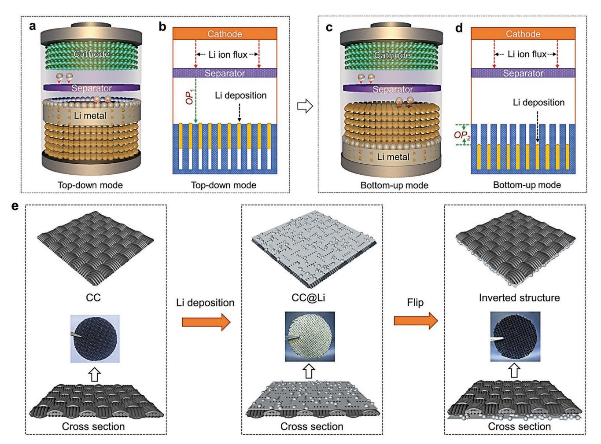
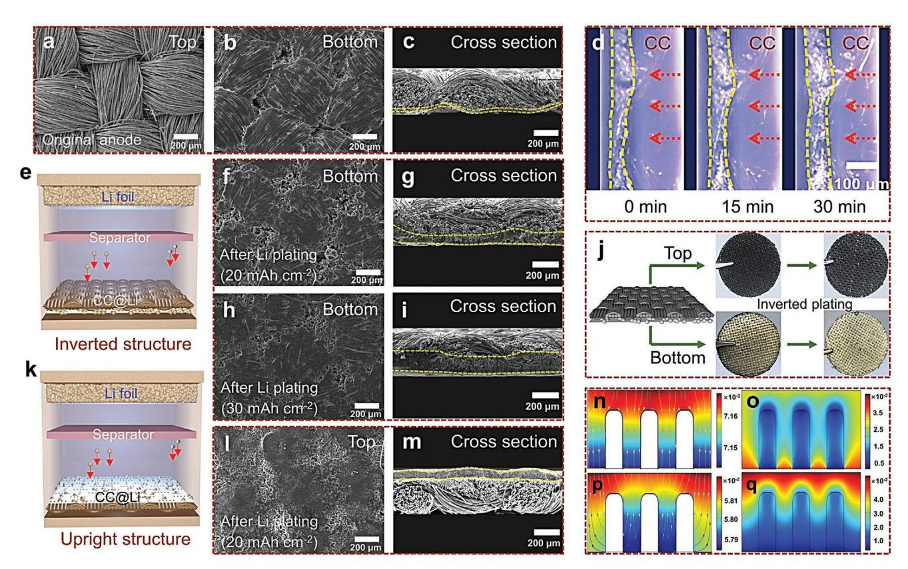
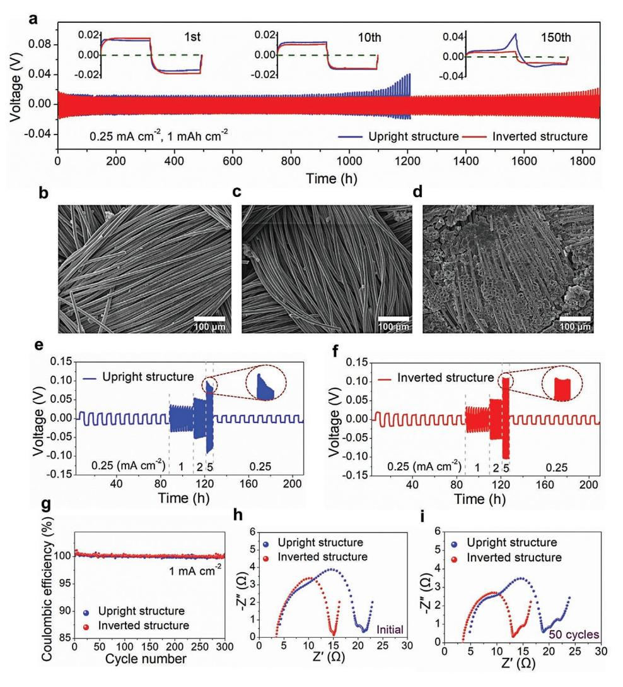
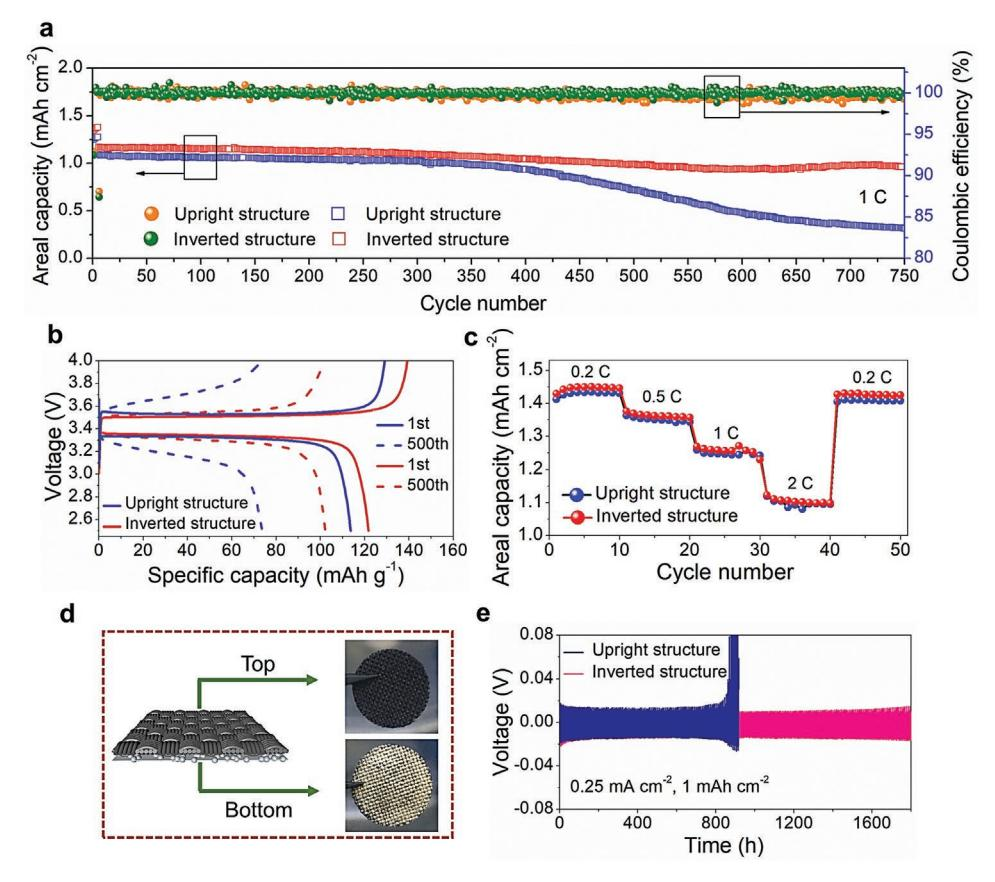
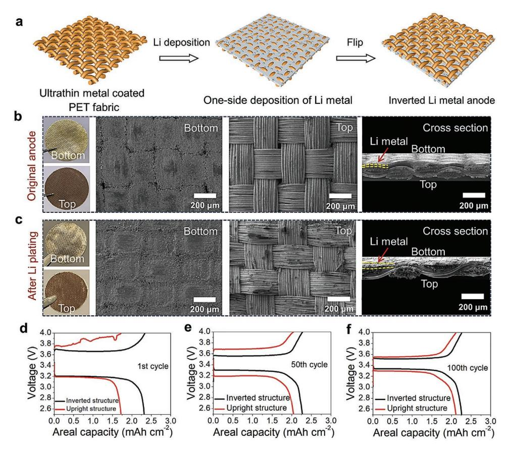

# **Inverted Anode Structure for Long-Life Lithium Metal Batteries**

*Dongdong Li, Chuan Xie, Yuan Gao, Hong Hu, Lei Wang, and Zijian Zheng\**

**Unlimited growth of lithium dendrites is undesirable yet preventing this still remains a challenge for pursuing high-energy battery systems. Serious safety hazards caused by short circuit and fire demand accurate control of the nucleation location of lithium deposition. Here, an inverted anode structure enabled by simple flipping of carbon fabric after lithium electrodeposition is reported. In contrast to traditional strategies of using regular upright structure, the inverted anode structure can guide a directional deposition of lithium to the bottom of the anode. The low nucleation barrier originating from the bottom lithium metal can induce a superior bottom-up deposition process. Lithium dendrite issues can thus be significantly alleviated, and approximately twice the cycle life extension of the lithium metal anode is achieved. More importantly, the solid electrolyte interphase immersed in the inverted anode structure is extremely stable, resulting from the well supporting skeleton of the surrounding carbon fabric fibers. The assembled lithium metal batteries show excellent cycling stability with a capacity retention per cycle of 99.98%, i.e., the battery capacity still retains 82.3% after 750 charge/discharge cycles. This simple inversion strategy is universal and can be extended to other porous current collectors, such as thin conductive fabric, and offers great opportunities for next-generation lithium-based batteries.**

# **1. Introduction**

Rechargeable lithium (Li) metal batteries (LMBs) are highly desirable high-energy-density battery systems for a wide variety

D. Li, C. Xie, Y. Gao, H. Hu, L. Wang, Z. Zheng Laboratory for Advanced Interfacial Materials and Devices Institute of Textiles and Clothing The Hong Kong Polytechnic University Hong Kong SAR 999077, China E-mail: tczzheng@polyu.edu.hk D. Li Key Laboratory for Organic Electronics and Information Displays & Institute of Advanced Materials (IAM) Nanjing University of Posts and Telecommunications 9 Wenyuan Road, Nanjing 210023, China Z. Zheng Research Institute for Smart Energy The Hong Kong Polytechnic University Hong Kong SAR 999077, China Z. Zheng Research Institute of Intelligent Wearable Systems The Hong Kong Polytechnic University Hong Kong SAR 999077, China

The ORCID identification number(s) for the author(s) of this article can be found under https://doi.org/10.1002/aenm.202200584.

**DOI: 10.1002/aenm.202200584**

of applications ranging from portable electronics, electrical vehicles, and grid storage nowadays, to wearable electronics and robotics in the near future.[1–6] Advances in extending the cycle life of LMBs require the precise control of the growth of Li dendrites, aiming to prevent the short circuit and even safety issue (e.g., battery fire).[7–9] So far, great efforts have been devoted to addressing the uncontrolled dendrite growth, including the use of solid-state electrolyte,[10,11] design of artificial solid electrolyte interface (SEI),[12–14] and introduction of electrolyte additives.[15,16] However, the dendrites still occur on the top surface of the Li anode during the longterm cycling test because of the hostless deposition of Li metal.

Recent studies have demonstrated that the use of 3D current collectors can reduce the localized current density and accommodate the huge volumetric change during the repeated Li plating/stripping process,[17–21] which benefits for the uni-

form deposition of Li metal, hence the suppressed growth of Li dendrites.[22–24] Nevertheless, Li metal still prefers to deposit on the upper surface of the 3D current collectors, and thus the dendrites formed on the top surface are likely to penetrate the separator and cause the internal short circuit (**Figure 1**a).[25] Multiphysical-field parameters such as current density, ion concentration, and electrode potential can affect the electrochemical behavior of the Li batteries. For a steady-state homogeneous environment, Li metal prefers to deposit on the top region of the 3D current collector, due to the lower overpotential (*OP*1) induced by the shorter diffusion pathway of Li+ ions (Figure 1b).[26–28]

One possible approach to addressing the challenge of short circuit is to preferentially navigate the deposition of Li to the bottom of the 3D current collectors (Figure 1c). Such an approach allows the growth of Li far from the separator, which increases the safe distance between the separator and Li metal. The large upper space of the 3D current collectors, meanwhile, can be used to buffer the huge volumetric expansion during the plating of Li. To realize the bottom-up deposition mode, an extra overpotential of *OP*2 originated from the extended diffusion distance need to be overcome in the plating process (Figure 1d).

Here, we propose an inverted anode structure, which can provide an electrochemical environment to overcome the *OP*2, and to guide the directional deposition of Li metal. The

**Figure 1.** Schematic of the Li deposition route and the fabrication process of the inverted Li metal anode. a) Top-down deposition of Li metal. b) The overpotential of top-down deposition of Li metal inside a Li metal battery (LMB). c) Bottom-up deposition of Li metal. d) The overpotential of bottom-up deposition of Li metal inside an LMB. e) The fabrication process of the inverted Li metal anode based on carbon cloth (CC).

inverted Li metal anode is achieved by simply flipping of a commonly used upright anode (Figure 1e), i.e., a predeposited Li metal anode (upright anode) on porous current collectors (e.g., carbon cloth (CC), ultrathin conductive fabric, and Cu foam) was turned upside down, so that the Li metal exists only at the bottom of the current collectors. The inverted Li anode structure can induce a bottom-up growth of Li attributing to the lower nucleation barrier of the bottom predeposited Li metal. The inverted Li anode possesses a stable SEI and a much longer cyclic life, which is approximately two folds higher than the upright anode even at a high current density of 5 mA cm–2. The use of such an anode also endows LMBs with an excellent rate capability and a high-capacity retention of ≈99.98% per cycle.

### **2. Results and Discussion**

The inverted anode was readily prepared by electrochemical plating of Li (6 mAh cm–2) onto CC, followed by flipping of the anode upside down. The details of the fabrication process and material characterization can be found in Method and Figure S1 (Supporting Information). **Figure 2**a–c showed the scanning electron microscopy (SEM) images of the as-fabricated inverted Li metal anode. The upper side of the anode was free of Li metal (Figure 2a). At the bottom side of the anode, Li metal partially covered the surface of the CC, and the texture of fabric structure was still observed (Figure 2b).

We performed the continuous electrochemical plating of Li metal onto the inverted anodes, and characterized their morphological change via in situ optical microscopy. As shown in Figure 2d and Video S1 (Supporting Information), Li+ ions travelled through the porous CC and deposited on the surface of the Li metal. With the increase of the plating time, the frontline of the Li metal anode extended into the inner body of the CC. During the plating of Li at a capacity of 20 mAh cm–2, the fabric texture at the bottom side of the inverted anode was gradually covered (Figure 2e,f), and the thickness of the Li metal anode continued to increase (Figure 2g). At a high capacity of 30 mAh cm–2, the Li metal could still deposit at the bottom part of the inverted structure, leaving the upper side free of Li metal (Figure 2h,i). These results were further confirmed by the optical photographs (Figure 2j). After deposition of Li inside the inverted anode structure with a capacity of 10 mAh cm–2, the bottom of the structure rendered a metallic luster while

**Figure 2.** Electrochemical behavior of the inverted anode structure during Li plating. a–c) SEM images of the top, bottom, and cross section of the inverted anode structure. d) The morphological change of the inverted anode structure with the increase of the Li plating time, characterized via in situ optical microscopy. e) Schematic of the Li plating process with the use of inverted anode structure. SEM images of the bottom and cross section of the inverted anode structure after deposition of Li with the capacities of f,g) 20 mAh cm–2 and h,i) 30 mAh cm–2. j) Photographs of the inverted anode structure before and after deposition of Li with a capacity of 10 mAh cm–2. k) Schematic of the Li plating process with the use of upright anode structure. l,m) SEM images of the top and cross section of the upright anode structure after deposition of Li with a capacity of 20 mAh cm–2. COMSOL Multiphysics modeling of the n,o) inverted and p,q) upright anode structures (panels (n) and (p) represent the current density, while panels (o) and (q) represent the plating thickness of the Li metal). The yellow dashed lines in c,d,g,i,m) cross-section images refer to the thickness of Li metal.

the upper side still remained black, indicating the growth of Li from the bottom of the structure. In contrast, the upright anode structure with predeposited Li metal on the upper side induced a preferred top deposition of Li metal, attributing to the lower nucleation barrier at the top surface. (Figure 2k–m and Video S2, Supporting Information).

To provide an in-depth discussion of the different electrochemical behavior when plating Li into different anode structures, we performed the simulation on the current density and the thickness of the plated Li using COMSOL Multiphysics (Figure 2n–q). The position of the cathode was fixed on the top boundary, while two anode boundaries were set on the upper and lower surfaces of the 3D current collector with predefined two different overpotentials. For the inverted anode structure, the lower overpotential at the bottom could guide the current density vector toward the bottom of the 3D current collector (Figure 2n), leading to the deposition of Li at the bottom (Figure 2o). By contrast, Li preferentially deposited on the top and side region of the 3D current collector when using the upright anode structure (Figure 2p), which caused a thicker Li deposition on the top region of the anode than the bottom part (Figure 2q). Note that we used the overpotentials as the dominant variable in the simulation. The different positions for the growth of Li metal between the inverted and upright structures were indeed determined by the initial position for the nucleation of Li metal (upper or bottom). This meant that the inverted anode structure can effectively regulate the Li plating behavior, resulting in the favorable bottom-up deposition of Li metal.

We further evaluated the cycling stability of the inverted and upright anode structures by assembling symmetric batteries with using a pair of Li//CC electrodes. As shown in **Figure 3**a, the electrodeposition of Li on CC experiences a two-step process: an early Li+ ion intercalation into carbon fibers to form LiC*x* complex and a subsequent Li metal deposition on the surface of CC. At the first charge/discharge cycle, the overpotential of the inverted anode (≈17 mV) was slightly higher than that of the upright anode (≈14.5 mV), owing to the longer diffusion pathway of Li+ ions. However, the upright anode showed an undesirable voltage fluctuation after cyclic test for 1100 h (≈150th cycle), which indicated a dendrite-induced cell failure. In contrast, the overpotential of the inverted anode decreased gradually and remained a stable value of ≈11 mV after tested for 1800 h (≈240th cycle). Similar result was also observed at high current densities of 1 and 5 mA cm–2, where the cyclic life of the inverted anode was ≈2 folds longer than the upright

**Figure 3.** Electrochemical properties of symmetric cells with the inverted and upright anodes. a) Galvanostatic profiles of Li plating/stripping at 0.25 mA cm–2. Insets are detailed galvanostatic profiles of Li plating/stripping at the 1st, 10th, and 150th cycles, respectively. SEM images of the top surface of the inverted anodes after the b) 5th and c) 50th cycles, respectively. d) SEM image of the top surface of the upright anode after the 50th cycle. Rate performance of symmetric cells with the e) upright and f) inverted anodes at various current densities from 0.25 to 5 mA cm–2. g) CE values of the inverted and upright anode-Li4Ti5O12 (LTO) cells. Nyquist plots of the symmetric cells at the h) 1st and i) 50th cycle, respectively. The initial areal capacity of Li metal anodes is 6 mAh cm–2.

anode (Figure S2a,b, Supporting Information), and largely outperformed that of Li//Cu foil (Figure S2c, Supporting Information). Not that this performance improvement only originates from the inverted anode structure, which thus represents a significant advancement with just using the simple inversion strategy. Figure 3b,c showed the top surface of the inverted anodes after the 5th and the 50th cyclic test, respectively. The Li-free surfaces well demonstrated that the prolonged cyclic life of the inverted anode structure was essentially ascribed to the dendrite-free morphology of the inverted anode structure during cyclic test. Such a result could be also achieved at a high current density of 5 mA cm–2 (Figure S3a–f, Supporting Information). Additionally, the volume expansion generated by the plating of Li metal could be greatly relieved by the large upper space in the inverted anode structure, which further benefited for the good electrochemical stability of the anode. In contrast, the upright anode experienced a completely different Li plating/stripping process. The top-down deposition in the upright anode resulted in a roughened top surface with loose Li particles (Figure 3d). The surface roughness could be further intensified at higher current densities (Figure S3g–i, Supporting Information).

The stabilization of SEI (e.g., the ability to avoid the repeated breaking and rebuilding of SEI) is also important toward the long-term cycling of LMBs. In the inverted anode structure, the SEI layer located above the Li metal, and was well supported by the surrounding carbon fabric fibers. This unique configuration could enhance the robustness of SEI, hence endowing the SEI with a high tolerance to withstand the huge volumetric change during Li plating and stripping. To certify such a statement, we recorded the rate performance of the cells at various current densities from 0.25 to 5 mA cm–2. As shown in Figure 3e,f,

the inverted and upright anode structures showed nearly identical voltage hysteresis when the current density increased from 0.25 to 2 mA cm–2. The voltage hysteresis of both inverted and upright anodes was much smaller than that of the Li// Cu foil anode (Figure S2d, Supporting Information). However, the upright anode structure showed a rapid voltage drop from the 1st to 10th cycle at the current density of 5 mA cm–2 (Figure 3e), implying the unstable Li/electrolyte interface and the breaking and rebuilding of the SEI.[26,29] In contrast, the inverted anode structure showed a stable voltage profile without any voltage fluctuation even at a high current density of 5 mA cm–2, indicating an extremely stable SEI with the protection by the surrounding carbon fabric fibers (Figure S4, Supporting Information). The Coulombic efficiency (CE) of the cells was also tested with using Li4Ti5O12 (LTO) as the counter electrode (1 mA h cm–2). The utilization of the LTO counter electrode can guarantee all the Li loss during cycling originates from Li/CC anode because LTO has no prestored Li. As shown in Figure 3g, the inverted anode structure shows a high CE value of ≈98.76%, slightly higher than that of the upright anode structure of ≈98.66%.

To reveal the mechanism of the reinforced SEI layer based on the inverted anode structure, electrochemical impedance spectroscopy (EIS) was tested after cyclic test of inverted anode for one cycle and 50 cycles (Figure 3h,i and Figure S2e, Supporting Information). The inverted anode displayed much smaller semicircles in the high frequency region when compared to the upright anode, indicating its lower interfacial resistance and charge-transfer resistance at the Li/electrolyte interface.[23] Such a result could be explained by the stable Li/electrolyte interface and the fast reaction kinetics of Li stripping/plating.[30] Two factors were believed to be responsible for the stable SEI in the inverted anode structure. (1) The carbon fabric fibers above Li metal can be regarded as a conductive interface. It can regulate the diffusion of Li+ ions for a uniform Li metal deposition, leading to a suppressed Li dendrites growth and less dead Li. (2) The carbon fabric fibers can serve as a porous skeleton to support SEI layer. It can provide an efficient protection during the volumetric change of Li metal, leading to a stable SEI.

LMBs were assembled with inverted/upright anode structures and LiFePO4 (LFP) cathodes. As shown in **Figure 4**a, the battery using the inverted anode structure delivered a capacity retention per cycle of 99.98%, i.e., the battery capacity still retained 93.7% even after 300 charge/discharge cycles and 82.3% after 750 cycles, which significantly outperformed the battery using the upright anode structure (≈400 cycles) and Li//Cu foil anode (≈23 cycles, Figure S5, Supporting Information). The charge/discharge curves in Figure 4b showed that the battery using the inverted anode structure displayed a much lower voltage polarization than that of the upright anode

**Figure 4.** Cycling performance of the full cells and the versatility of the inverted anode structure. a) Cycling stability and CE of the full cells at 1 C. b) Charge–discharge curves at the 1st and 500th cycles. c) Rate performance of the full cells, tested from 0.2 to 2 C. The initial areal capacity of Li metal anodes is 10 mAh cm–2. d) The as-fabricated inverted Li metal anode using bare CC as 3D current collector. The initial areal capacity of Li metal anodes is 6 mAh cm–2. e) Galvanostatic profiles of Li plating/stripping at 0.25 mA cm–2.

structure. In terms of specific capacity, the inverted anode structure could still deliver a discharge capacity of 102.1 mAh g–1 with a capacity retention of ≈83.9% after tested for 500 cycles. The battery using the upright anode structure, however, only remained ≈64.9% of its initial capacity. Figure 4c showed the rate performance of the batteries using different anode structures. The areal capacities of the battery using inverted anode structure were 1.45, 1.36, 1.26, and 1.11 mAh cm–2 at 0.2, 0.5, 1, and 2 C, respectively, which were slightly higher than that of the upright anode structure (1.43, 1.35, 1.25, and 1.09 mAh cm–2). The improved cycling stability of the full cells further demonstrated the advantages of using inverted anode structure for long-life and stable LMBs.

Our inverted anode structure is applicable to various porous current collectors. As a proof of concept, we expand the scope of application of the inverted anode structure to untreated CC (Figure 4d, Figure S6a,b, Supporting Information) and Cu foam (Figure S6c, Supporting Information), and tested their cyclic stability. As shown in Figure 4e, at the current density of 0.25 mA cm–2, the cyclic lifetime of the inverted anode using CC was twice of its upright counterpart. Similar results were also observed at higher current densities of 1 and 5 mA cm–2 (Figure S6a,b, Supporting Information). In addition, the inverted anode structure using Cu foam showed a better cycling stability (>550 cycles) than that of the upright anode (≈430 cycles) (Figure S6c, Supporting Information). These results proved the versatility of our inverted anode structure in thick conductive current collectors.

To further extend the utilization of the inverted anode structure, thin and lightweight current collectors are favorable in high-energy-density battery systems. As such, an ultrathin polyethylene terephthalate (PET) fabric with the thickness of 60 µm was employed after depositing a uniform layer of Cu onto fabric fiber via a modified polymer-assisted metal deposition (PAMD) method.[31] The resulting fabric exhibits high electrical conductivity and a low mass of 6.28 mg cm–2, which is even lighter than commercially available Cu foil (9.5 mg cm–2). The inverted anode structure was then obtained after flipping of the oneside Li deposited PET conductive fabric (Figure 5a). Figure 5b shows the photographs and SEM images of the bottom, top and cross section of the inverted Li metal anode. The bottom of the fabric was densely covered with Li metal, while the top surface retained the original fabric texture. As the deposition of Li was further developed, Li filled up the bottom pores between the yarns, leaving the top region still free of Li metal (Figure 5c), indicating the superiority of the inverted anode structure to avoid dendrite-induced cell failure. Figure 5d–f shows the voltage profiles of the full cells with the inverted and upright

**Figure 5.** The versatility of the inverted anode structure by using ultrathin and lightweight conductive PET fabric (fabric mass: 6.28 mg cm–2, thickness: 60 µm). a) The fabrication process of the inverted Li metal anode. b) Photographs and SEM images of the bottom, top and cross section of the inverted anode structure. c) Photographs and SEM images of the bottom, top and cross section after 2 mAh cm–2 of Li deposition. d–f) Charge–discharge curves of the full cells with the inverted and upright anodes at the 1st, 50th, and 100th cycles. The initial areal capacity of Li metal anodes is 5 mAh cm–2.

anodes at the 1st, 50th, and 100th cycles. The plating/stripping overpotentials of the inverted anode structure are lower than that of the upright one, indicating the much lower interfacial resistance induced by the unique anode structure.[32] The above results confirm that, even at a thin thickness, the inverted anode structure could remain guide the bottom-up deposition of Li, indicating the scalability of the inverted anode structure to more thin and lightweight current collectors.

## **3. Conclusion**

In conclusion, the undesirable growth of Li dendrites greatly hinders the further development of LMBs. We here proposed an inverted anode strategy by simply flipping of the Li-deposited CC. The inverted anode structure presented many advantages over the common upright anode structure. First, it can guide the directional deposition of Li to the bottom of the CC, due to the lower nucleation barrier of the bottom Li metal than that of the top carbon fabric. Second, the inverted anode structure elongated the distance between the as-deposited Li metal and separator, which circumvented the short circuit of the LMBs during cyclic test. Additionally, the inverted anode structure possessed a stable SEI, attributing to the effective supporting and protection by surrounding carbon fabric fibers. All these merits endowed the inverted anode structure with a longer cyclic life, which was approximately two folds longer than the upright one, and resulted in a stable LMB (>750 cycles with 82.3% capacity retention). More importantly, this work may inspire more ideas of utilizing other porous current collectors (e.g., ultrathin conductive fabric, Cu foam, and self-supporting metal nanowires) to construct different types of battery systems (e.g., LMBs, sodium metal batteries, potassium metal batteries, zinc metal batteries, etc.), by using the similar inverted anode strategy.

## **4. Experimental Section**

*Fabrication of the Cu-Coated PET Fabric*: Commercially available PET fabric was immersed into deionized (DI) water (>18 MΩ cm) and sonicated for 1 h before dried at 80 °C. For the PAMD process, the PET fabric was soaked in a solution constituted of [3-(methacryloyloxy) propyl]trimethoxysilane (4%, v/v) in a complex solvent including 95% ethanol, 1% acetic acid, and 4% DI water for 1 h at room temperature. The PET fabric was then rinsed with DI water for three times before immersed in an aqueous solution containing [2-(methacryloyloxy) ethyl]trimethyl ammonium chloride (METAC) (20 wt%) and potassium persulfate (2 g L–1) at 80 °C for 1 h. After rinsing with DI water, the PMETAC-adsorbed PET fabric was further dried at 80 °C before dipped into a (NH4)2PdCl4 aqueous solution (5 × 10–3 m) for 20 min in the dark. The extra [PdCl4] 2– was removed with DI water for several times. Then, an electroless deposition process was conducted in a 1:1 (v/v) mixed solution of A and B for 30 min, where A is sodium hydroxide (12 g L–1), copper sulfate pentahydrate (13 g L–1), and sodium potassium tartrate (29 g L–1) in DI water, and B is a formaldehyde (9.5 mL L–1) aqueous solution.

*Fabrication of the Inverted Anode Structure*: A layer of Cu film with the thickness of ≈150 nm was evaporated to one side of carbon fabric to get a lithophilic CuO layer after annealing at 300 °C. Then, Li electrodeposition process was performed with the CuO layer on the top surface, while Li foil was used as the counter electrode. A uniform Li metal layer with the capacity of 6 mAh cm–2 was deposited on the surface of CuO layer at the current density of 6 mA cm–2. At this high current density, Li metal deposited on one side of carbon fabric is more favorable to guide the transmission of Li+ ions after flipping, comparing with the discrete distribution of Li metal in whole fabric structure at lower current density. During assembling symmetric/full batteries, the inverted anode structure, namely placing the Li metal side at the bottom away from the separator, was used as the electrode relative to the regular upright anode structure with the Li metal side at the top. For the inverted anode structure without CuO layer, CC was used directly to electrodeposit Li metal on one side with the same capacity of 6 mAh cm–2 and the current density of 6 mA cm–2. The samples of Li//Cu foam and Li//ultrathin PET fabric anodes were also fabricated with using the same electrochemical conditions for Li deposition.

*Material and Electrochemical Measurements*: Morphology detection and elemental mapping were examined by VEGA3-TESCAN SEM. CHI660e electrochemical workstation was used for EIS testing. Optical images were obtained with using optical microscope (Leica Application Suite). CR2025-type coin cells were used for the electrochemical measurements with using Celgard 2500 as the separator and 1 m lithium bis(trifluoromethanesulfonyl)imide (LiTFSI) in 1,2-dimethoxyethane and 1,3-dioxolane (1:1 v/v) with 2 wt% LiNO3 additives as the electrolyte.[31,33] For assembling the LMBs, a self-prepared LFP was used as the cathode and 1 m LiPF6 in ethylene carbonate (EC)/dimethyl carbonate (DMC) (1:1 in volume) as the electrolyte. The electrolyte dosage was fixed at an excess of 40 µL cm–2, in which 20 µL cm–2 was absorbed by CC for its wetting. The retained electrolyte in CC could offset the irreversible electrolyte loss and further extend the cycling performance of the battery. Thus, the wetting of the CC with electrolyte is believed to be beneficial for the long-term operation of the battery. All cells were assembled in Ar-filled glove box and tested using NEWARE battery testers at room temperature.

*Theoretic Simulations*: COMSOL Multiphysics modeling was used to investigate the current density and Li plating thickness of the inverted and upright anode structures. Time-dependent Nernest–Plank equation was chosen in the model because the movement of the anode boundary as the deposition process progresses. The cathode position was kept fixed on the top boundary in the model, while two anode boundaries (the upper and lower surfaces of the 3D current collector) were defined with two different overpotentials. The other boundaries were natural boundaries. The initial concentration of Li+ ions was set as 1 mol L−1 and the diffusion coefficient was 2.93e–10 m2 s–1 at room temperature.[34,35]

# **Supporting Information**

Supporting Information is available from the Wiley Online Library or from the author.

# **Acknowledgements**

The authors acknowledge financial support from the Hong Kong Scholars Program (XJ2018008), the Hong Kong Research Institute of Textiles and Apparel (ITP/085/17TP), Shenzhen Municipal Science and Technology Innovation Commission (SGDX20190816232209446), General Research Fund of Hong Kong (PolyU 153032/18P), the National Natural Science Foundation of China (61704085), Jiangsu Planned Projects for Postdoctoral Research Funds (2019K202), the first-class discipline research promotion plan (N2104), the Natural Science Foundation of Universities from Jiangsu Province (17KJD510004), and the Natural Science Foundation of Nanjing University of Posts and Telecommunications (NY221086).

## **Conflict of Interest**

The authors declare no conflict of interest.

#### **Data Availability Statement**

The data that support the findings of this study are available from the corresponding author upon reasonable request.

#### **Keywords**

anodes, cycle life, inverted structures, lithium dendrites, lithium metal batteries

> Received: February 18, 2022 Published online: March 19, 2022

- [1] M. Zhu, O. G. Schmidt, *Nature* **2021**, *589*, 195.
- [2] L. Li, S. Basu, Y. Wang, Z. Chen, P. Hundekar, B. Wang, J. Shi, Y. Shi, S. Narayanan, N. Koratkar, *Science* **2018**, *359*, 1513.
- [3] X. Miao, H. Wang, R. Sun, C. Wang, Z. Zhang, Z. Li, L. Yin, *Energy Environ. Sci.* **2020**, *13*, 3780.
- [4] S. Liu, X. Ji, J. Yue, S. Hou, P. Wang, C. Cui, J. Chen, B. Shao, J. Li, F. Han, J. Tu, C. Wang, *J. Am. Chem. Soc.* **2020**, *142*, 2438.
- [5] J. Chang, Q. Huang, Y. Gao, Z. Zheng, *Adv. Mater.* **2021**, 2004419.
- [6] J. Liu, H. Yuan, X. Tao, Y. Liang, S. J. Yang, J. Q. Huang, T. Q. Yuan, M. M. Titirici, Q. Zhang, *EcoMat* **2020**, *2*, e12019.
- [7] Y. Gao, T. Rojas, K. Wang, S. Liu, D. Wang, T. Chen, H. Wang, A. T. Ngo, D. Wang, *Nat. Energy* **2020**, *5*, 534.
- [8] Z. Y. Wang, Z. X. Lu, W. Guo, Q. Luo, Y. H. Yin, X. B. Liu, Y. S. Li, B. Y. Xia, Z. P. Wu, *Adv. Mater.* **2020**, *33*, 2006702.
- [9] S. Jin, Y. Ye, Y. Niu, Y. Xu, H. Jin, J. Wang, Z. Sun, A. Cao, X. Wu, Y. Luo, H. Ji, L. J. Wan, *J. Am. Chem. Soc.* **2020**, *142*, 8818.
- [10] J. Wu, S. Liu, F. Han, X. Yao, C. Wang, *Adv. Mater.* **2020**, *33*, 2000751.
- [11] S. Chen, J. Zhang, L. Nie, X. Hu, Y. Huang, Y. Yu, W. Liu, *Adv. Mater.* **2020**, *33*, 2002325.
- [12] G. Zheng, S. W. Lee, Z. Liang, H. W. Lee, K. Yan, H. Yao, H. Wang, W. Li, S. Chu, Y. Cui, *Nat. Nanotechnol.* **2014**, *9*, 618.
- [13] Y. Liu, D. Lin, P. Y. Yuen, K. Liu, J. Xie, R. H. Dauskardt, Y. Cui, *Adv. Mater.* **2017**, *29*, 1605531.
- [14] K. Yan, H. W. Lee, T. Gao, G. Zheng, H. Yao, H. Wang, Z. Lu, Y. Zhou, Z. Liang, Z. Liu, S. Chu, Y. Cui, *Nano Lett.* **2014**, *14*, 6016.
- [15] H. Sun, G. Zhu, Y. Zhu, M. C. Lin, H. Chen, Y. Y. Li, W. H. Hung, B. Zhou, X. Wang, Y. Bai, M. Gu, C. L. Huang, H. C. Tai, X. Xu,
- M. Angell, J. J. Shyue, H. Dai, *Adv. Mater.* **2020**, *32*, 2001741.
- [16] Y. Lu, Z. Tu, L. A. Archer, *Nat. Mater.* **2014**, *13*, 961.
- [17] Y. Liu, D. Lin, Z. Liang, J. Zhao, K. Yan, Y. Cui, *Nat. Commun.* **2016**, *7*, 10992.
- [18] H. Wang, Y. Li, Y. Li, Y. Liu, D. Lin, C. Zhu, G. Chen, A. Yang, K. Yan, H. Chen, Y. Zhu, J. Li, J. Xie, J. Xu, Z. Zhang, R. Vilá, A. Pei, K. Wang, Y. Cui, *Nano Lett.* **2019**, *19*, 1326.
- [19] X. Y. Yue, X. L. Li, W. W. Wang, D. Chen, Q. Q. Qiu, Q. C. Wang, X. J. Wu, Z. W. Fu, Z. Shadike, X. Q. Yang, Y. N. Zhou, *Nano Energy* **2019**, *60*, 257.
- [20] Z. Liang, K. Yan, G. Zhou, A. Pei, J. Zhao, Y. Sun, J. Xie, Y. Li, F. Shi, Y. Liu, D. Lin, K. Liu, H. Wang, H. Wang, Y. Lu, Y. Cui, *Sci. Adv.* **2019**, *5*, eaau5655.
- [21] R. Lu, M. Cheng, L. Mao, M. Zhang, H. Yuan, K. Amin, C. Yang, Y. Cheng, Y. Meng, Z. Wei, *EcoMat* **2020**, *2*, e12010.
- [22] M. Wan, S. Kang, L. Wang, H. W. Lee, G. W. Zheng, Y. Cui, Y. Sun, *Nat. Commun.* **2020**, *11*, 829.
- [23] Q. Li, S. Zhu, Y. Lu, *Adv. Funct. Mater.* **2017**, *27*, 1606422.
- [24] C. P. Yang, Y. X. Yin, S. F. Zhang, N. W. Li, Y. G. Guo, *Nat. Commun.* **2015**, *6*, 8058.
- [25] P. Zou, Y. Wang, S. W. Chiang, X. Wang, F. Kang, C. Yang, *Nat. Commun.* **2018**, *9*, 464.
- [26] J. Pu, J. Li, K. Zhang, T. Zhang, C. Li, H. Ma, J. Zhu, P. V. Braun, J. Lu, H. Zhang, *Nat. Commun.* **2019**, *10*, 1896.
- [27] S. H. Hong, D. H. Jung, J. H. Kim, Y. H. Lee, S. J. Cho, S. H. Joo, H. W. Lee, K. S. Lee, S. Y. Lee, *Adv. Funct. Mater.* **2020**, *30*, 1908868.
- [28] L. L. Lu, J. Ge, J. N. Yang, S. M. Chen, H. B. Yao, F. Zhou, S. H. Yu, *Nano Lett.* **2016**, *16*, 4431.
- [29] S. S. Chi, Y. Liu, W. L. Song, L. Z. Fan, Q. Zhang, *Adv. Funct. Mater.* **2017**, *27*, 1700348.
- [30] L. Fan, H. L. Zhuang, W. Zhang, Y. Fu, Z. Liao, Y. Lu, *Adv. Energy Mater.* **2018**, *8*, 1703360.
- [31] J. Chang, J. Shang, Y. Sun, L. K. Ono, D. Wang, Z. Ma, Q. Huang, D. Chen, G. Liu, Y. Cui, Y. Qi, Z. Zheng, *Nat. Commun.* **2018**, *9*, 4480.
- [32] J. Xiang, L. Yuan, Y. Shen, Z. Cheng, K. Yuan, Z. Guo, Y. Zhang, X. Chen, Y. Huang, *Adv. Energy Mater.* **2018**, *8*, 1802352.
- [33] G. Jiang, N. Jiang, N. Zheng, X. Chen, J. Mao, G. Ding, Y. Li, F. Sun, Y. Li, *Energy Storage Mater.* **2019**, *23*, 181.
- [34] Z. Cao, B. Li, S. Yang, *Adv. Mater.* **2019**, *31*, 1901310.
- [35] Y. Lai, Y. Zhao, W. Cai, J. Song, Y. Jia, B. Ding, J. Yan, *Small* **2019**, *15*, 1905171.