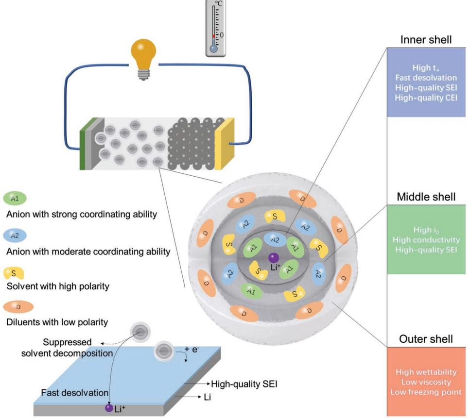
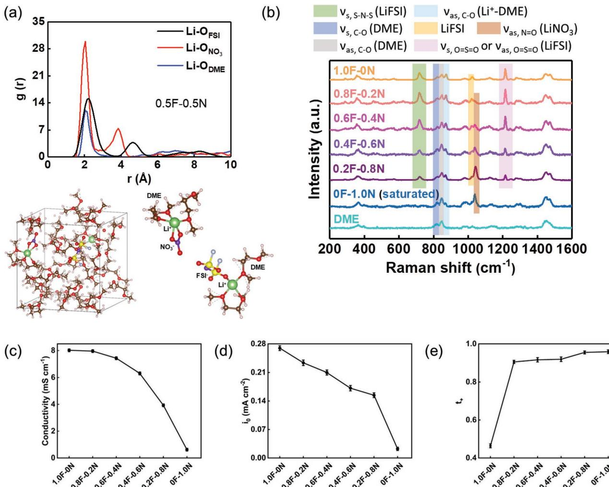
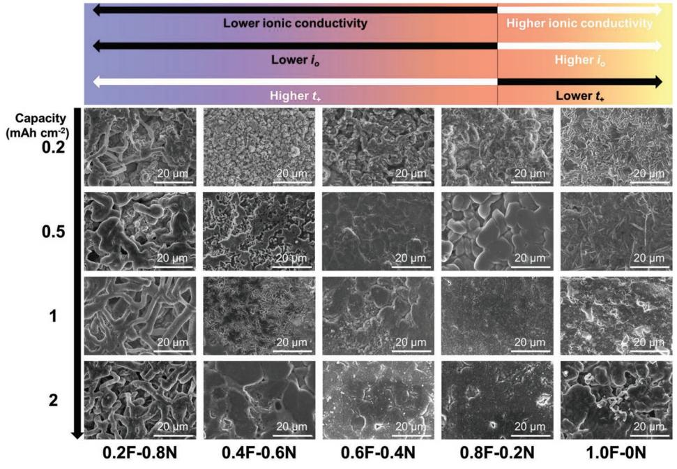
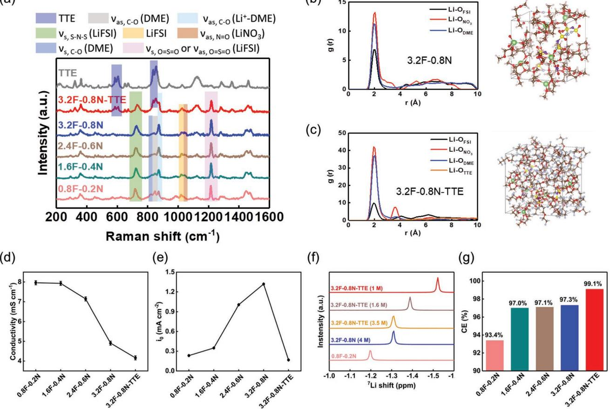
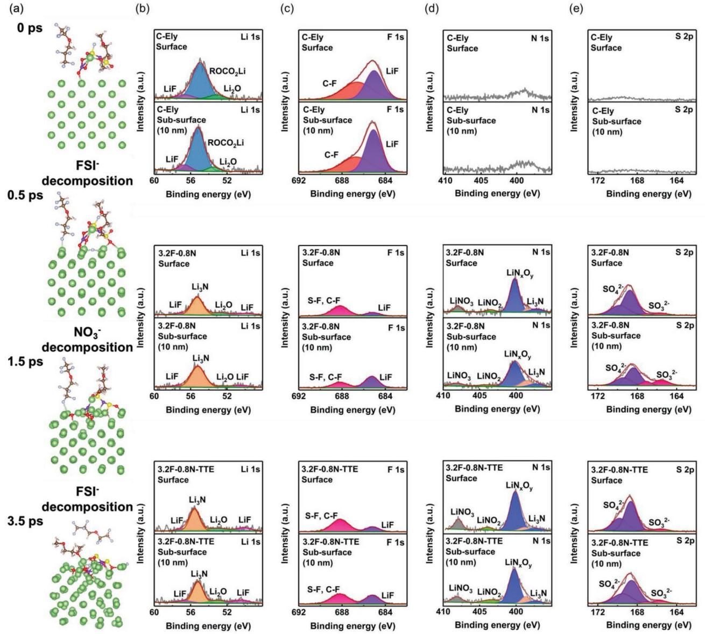
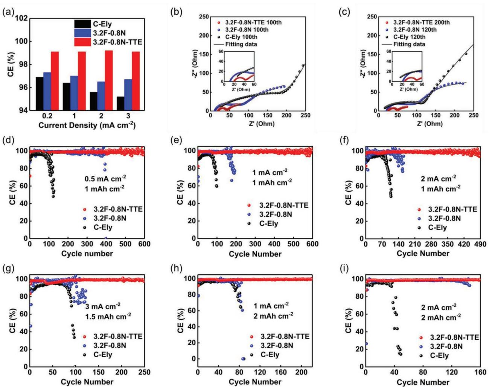
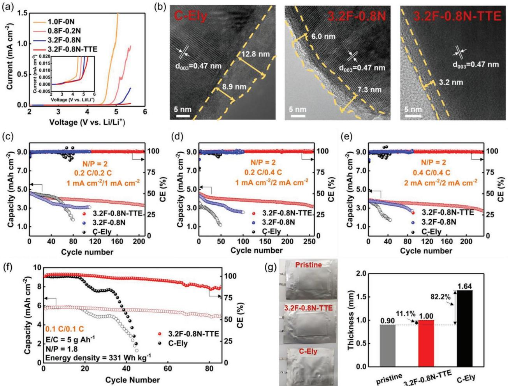
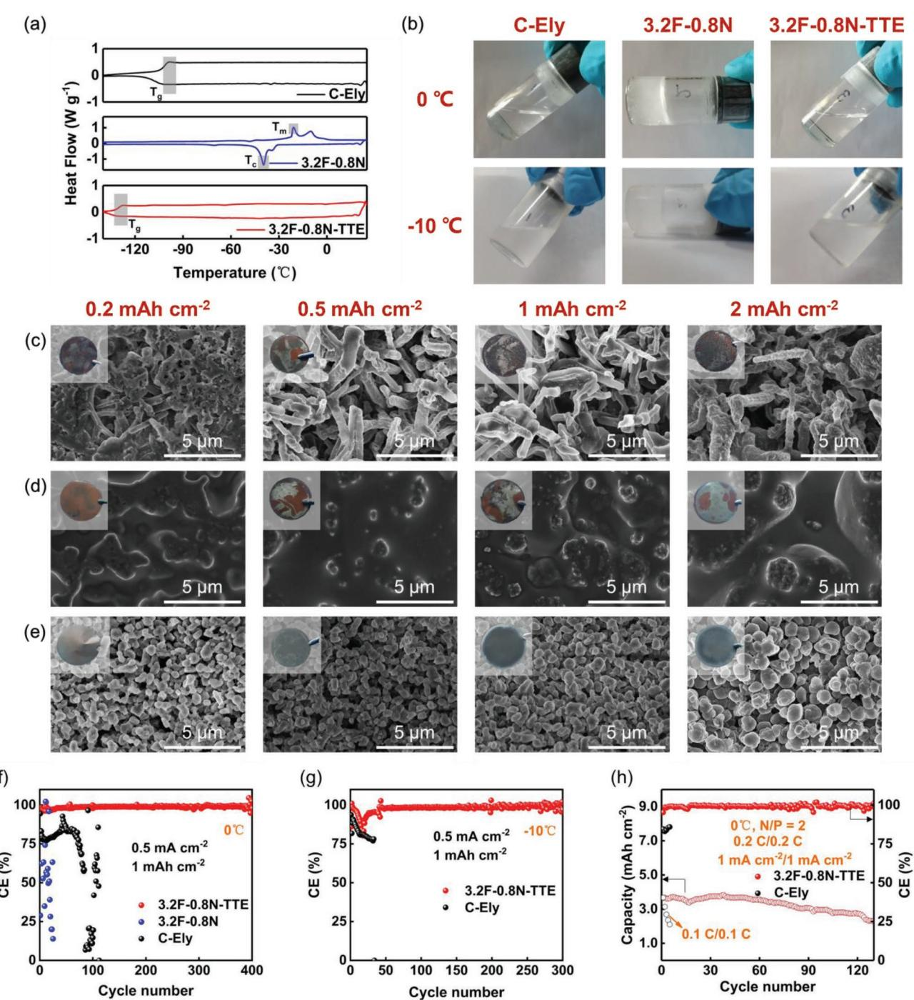

# **Anionic Coordination Manipulation of Multilayer Solvation Structure Electrolyte for High-Rate and Low-Temperature Lithium Metal Battery**

*Nannan Sun, Ruhong Li, Yue Zhao, Haikuo Zhang, Jiahe Chen, Jinting Xu, Zhendong Li, Xiulin Fan,\* Xiayin Yao,\* and Zhe Peng\**

**Challenges from high-energy-density storage applications have boosted the pursuit of designing high-rate and low-temperature lithium (Li) metal batteries (LMBs). Formulating high-concentration electrolytes (HCEs) with a high transference number (***t***+) is an alternative solution to satisfy these demands. However, the implementation of HCEs is impeded by their lower ionic conductivity, higher viscosity, poorer wettability, and higher melting point, which are harmful to the practical applications. Herein, an anionic coordination manipulation strategy is proposed to break the constraints presented by HCEs. By manipulating the anionic species with different coordinating abilities, a high**  *t***+ up to 0.9 can be achieved even in the low-concentration electrolytes of 1 mol L−1 . By further forming a multilayer solvation structure in the anion manipulated electrolyte using non-polar diluents, high Li Coulombic efficiency superior to 99% can be maintained under a high current density of 3 mA cm−2, and much-improved performance is also demonstrated in high-loading Li metal pouch cells. Furthermore, when applying multilayer solvated structure in electrolyte engineering, Li metal anodes at subzero temperature and LMBs at 0 °C also exhibit impressive cycling stability. This work provides a new guideline for designing advanced electrolytes for high-rate LMBs under practical conditions.**

N. Sun, Y. Zhao, J. Chen, J. Xu, Z. Li, X. Yao, Z. Peng Ningbo Institute of Materials Technology and Engineering Chinese Academy of Sciences Ningbo 315201, China E-mail: yaoxy@nimte.ac.cn; pengzhe@nimte.ac.cn N. Sun, J. Chen Center of Materials Science and Optoelectronics Engineering University of Chinese Academy of Sciences Beijing 100049, China R. Li, H. Zhang, X. Fan State Key Laboratory of Silicon Materials and School of Materials Science and Engineering Zhejiang University Hangzhou 310027, China E-mail: xlfan@zju.edu.cn

The ORCID identification number(s) for the author(s) of this article can be found under https://doi.org/10.1002/aenm.202200621.

#### **DOI: 10.1002/aenm.202200621**

**1. Introduction**

In recent years, the significant reduction in the cost of lithium (Li) ion batteries (LIBs) and the ecologically oriented measures make an exponentially expanded number of electric vehicles.[1] In addition to the booming deployment of LIBs in electric transportation applications, highenergy batteries that enable long-range electric vehicles are urgently called for in with regard to the limited energy density of LIBs (generally < 300 Wh kg−1 ).[1,2] Owing to the ultrahigh theoretical specific capacity (3862 mAh g−1 ) and the lowest electrochemical potential (−3.040 V vs standard hydrogen electrode) of Li metal anodes, the Li metal batteries (LMBs) are expected to achieve a high energy density beyond 500 Wh kg−1 by pairing Li metal anodes with new cathode materials that possess a specific capacity more than 250 mAh g−1 , and further optimizing cell parameters including the cathode thickness, porosity, inactive material content (current collectors, separator, etc), electrolyte/capacity ratio (E/C ratio), negative/ positive electrode areal capacity ratio (N/P

ratio) and so on.[2] However, the actual LMBs cannot simultaneously meet high-safety, high-power, and all-temperature performance, which are indispensable properties for practical applications. A major issue is the dendritic Li electroplating at the Li/electrolyte interface, resulting in solid electrolyte interphase (SEI) cracks and intensive side reactions of the exposed metallic Li with electrolyte.[3] Moreover, the dendrite growth induced by Li+ depletion is aggravated under high-power and/ or low-temperature conditions, due to the further mismatched ion transportation/reaction ratio with increased current density and/or decelerated transfer kinetic.[3] Therefore, stabilizing Li metal anodes in wide operation conditions constitutes a central challenge for next-generation battery technologies.

Compared with artificial protective structure engineering (Porous host, artificial protective layer, etc),[4–8] improving the stability of Li metal anode by electrolyte modification is a more economical and viable approach adapted to battery manufacture. In addition to the sacrificial decomposition of electrolyte components to form functional and robust electrode

interphases,[9–13] rational design and optimization of electrolyte solvation structure is more relevant to inherently improve the electrolyte stability and dynamics in LMBs.[14–22] The latter can be reflected by the sharply improved cycling stability of Li, Na, and K metal anodes in the 1 mol L−1 (denoted as M) class electrolyte through tailoring the stability of the Li+-solvent pair in the solvation structure at the electrode interface.[14] Notably, since the discovery of the unusual ability of the high-concentration electrolytes (HCEs) to inhibit the polysulfide dissolution in Li–S battery or the dissolution of both aluminum and transition metal in 5 V high-voltage LIB,[15,16] the HCE solvation structure of anions and solvent molecules that strongly coordinate to Li+ ions has attracted wide attentions in diversifying electrolyte formulation towards replacing the conventional diluted electrolytes. Accordingly, the study of HCEs was also extended to the Li anode and expected improvement in cycling stability was achieved thanks to the enlarged gap between the highest occupied and lowest unoccupied molecular orbitals, which can enhance both the anodic and cathodic stabilities of HCEs, as well as the anion decomposition leading to SEI formation with high content of inorganic species (such as LiF, Li2O) and high strength.[17–20]

It is worth noting that the overall ion conductivity (contributed by both cation and anion) of HCEs is reduced due to the increase in solution viscosity, but the improved electrochemical performances can be retained for HCEs at elevated current densities. The latter is attributed to the promoted Li+ cationic transport in the peculiar solvation structure of HCEs, resulting in the increased Li+ transference number (*t*+) with increasing salt concentration, which partially compensates for the loss of Li conductivity.[23] Despite the improved chemical stability and rate ability, HCEs are penalized by the high viscosity and poor wettability when thick electrodes are used, due to the limited contact surface areas between the electrolyte and electrode materials. Though the viscosity and wettability of HCEs can be improved by using non-polar diluent solvents to weaken the interaction between the polar solvent molecules,[24–26] the highcost and low-conductivity features of HCEs cannot be resolved.

Herein, an anionic coordination manipulation strategy is investigated to significantly improve the rate ability of the electrolyte without the use of HCE. Notably, we demonstrate that, in addition to the major anions with moderate coordinating ability, adding a second type of anions with stronger coordinating ability than the solvent molecules can afford a more efficient increase of *t*+, compared with the conventional remedy to increase the electrolyte concentration. More interestingly, the drastic increase of *t*+ doesn't require a high population of the strongly coordinating anions in the solvation structure, and thus the energy dissipation in dragging the anions with Li+ can be preserved significantly. Consequently, a high t+ up to ≈0.9 can be achieved without significantly affecting the ionic conductivity in the low concentration electrolyte (1 M) through a compromised anionic coordination manipulation. By further reducing the population of solvent molecules at a moderate concentration of 4 M and weakening the interaction strength between the adjacent solvation complexes through the addition of non-polar diluents, a multilayer solvation structure electrolyte (MSSE) is achieved, where the components in the 1st, 2nd, and 3rd shells are shown in **Scheme 1**. In such a system, the high *t*+ enables a major contribution of charge transfer by Li+ cations, on the other hand, the dominant Li+-anion pairs weaken the Li+-solvent coordination and engender a fast desolvation process and suppress solvent decomposition, resulting in both improved bulk and interfacial Li+ transfer kinetics as well as solvent stability, as compared to the low- and high-concentration electrolytes (Figure S1, Supporting Information). Furthermore, anionoriginated stable interphase can be derived from MSSE at both anode and cathode sides, protecting the Li anode and transition metal oxide cathode and avoiding solvent decompositions and Al corrosion at the positive electrode. As well, the nonpolar outer shell can significantly improve the thermal property of MSSE. The great versatility of MSSE leads to the high Li Coulombic efficiencies (CEs) superior to 99% under a high current density of 3 mA cm−2, and improved performance of high-loading Li metal pouch cells can also be obtained by using MSSE. MSSE also enables the stable cycling ability of Li metal anodes at subzero temperature and LMBs at 0 °C, which will meet the requirements for practical applications in highrate and low-temperature LMBs.

#### **2. Results and Discussion**

#### **2.1. Effect of Anionic Manipulation on the Properties of 1 M Electrolytes**

In this work, the anionic manipulations are performed by combining two of the most commonly used lithium nitrate (LiNO3) and lithium bis(fluorosulfonyl)imide (LiFSI) salts which not only possess the anions with suitable donor numbers (22.2 kcal mol−1 for NO3 − and 9.5 kcal mol−1 for FSI−, respectively) for the required coordinating abilities,[27,28] but also are expected to lead a hybridized anion-originated interphase for further stabilizing the Li anode surfaces.[29,30] Meanwhile, to achieve a flexible anionic manipulation, a solvent with strong solvation power is needed to reach a high salt solubility. Hence, the ether-based solvents often serving as strong Lewis bases with major donor numbers owing to lone pair electron situating on oxygen are preferred. In particular, compared with the cyclic dioxolane molecule, the linear 1,2-dimethoxyethane (DME) possesses a higher dielectric constant and lower viscosity and was used as an optimal solvent to achieve ultrahigh concentration electrolytes (>10 M) for the applications in LMBs.[18,20] It is worth noting that the DN number of DME is 20 kcal mol−1 , [31] which should involve competitive coordination between the DME molecule and NO3 − anion toward Li+. In previous work, it is reported that the introduction of a low content LiNO3 in a 2 M LiFSI-DME electrolyte can promote the complete decomposition of FSI− and form a stable SEI on the Li metal anode, due to the polarized solvation structure of FSI−. [12] However, the effects of LiNO3 are mainly emphasized in the interfacial chemistry for SEI formation. Herein, we further revealed the effect of the anionic manipulation on the Li+ transportation dynamism of the electrolyte system and demonstrated that a high *t*+ up to 0.9 with promising overall performance can be achieved even in the low-concentration electrolytes of 1 M by rationally balancing the LiFSI:LiNO3 ratio, breaking the

**Scheme 1.** Anionic coordination manipulation of multilayer solvation structure for high-rate and low-temperature electrolytes of LMBs.

constraints presented by the high-concentration electrolytes to achieve the high *t*+ previously.

To carry out a clear view of the coordination abilities among the NO3 −, FSI−, and DME surrounding the central Li+, the solvation structure of a model system of 1 M electrolyte with an equal population of NO3 − and FSI− anions in DME (0.5 M LiNO3 + 0.5 M LiFSI in DME) was investigated by ab initio molecular dynamics (AIMD) simulations. The equilibrium snapshots of the electrolyte systems and radial distribution function (RDF, g[r]) between Li+ and anion/solvent are shown in **Figure 1**a, which demonstrates the strongest coordinating ability of NO3 −, as depicted by the highest and closest peak between the central Li and O atoms from NO3 −. The latter indicates the stronger electronegativity of the lone pair electron situating on the oxygen of NO3 −. This feature not only enables the strong coordination between Li+ and NO3 − but also weakens the Li+-DME bonding,[32] which simultaneously results in the much-improved *t*+ and desolvation kinetics, as shown later by the outstanding high-rate ability.

The effect of anionic manipulation on the solvation structure was further assessed by Raman spectroscopy. Herein, 1 M electrolytes with the varied molar ratio of LiFSI:LiNO3 in DME were prepared systematically. As an example, the electrolyte labeled "0.8F-0.2N" contained 0.8 M LiFSI and 0.2 M LiNO3. As shown in Figure 1b, with increasing the concentration of LiNO3, the expected decrease of LiFSI corresponding peaks (S–N–S symmetrical stretching, *ν*s, S–N–S at 720 cm−1 and O=S=O symmetrical or asymmetrical stretching, *ν*s, O=S=O or *ν*as, O=S=O at 1214 cm−1 ) and increase of LiNO3 corresponding peak (N=O asymmetrical stretching, *ν*as, N=O at 1038 cm−1 ) are observed,[33,34] while the peaks of DME (C–O symmetrical stretching, *ν*s, C–O at 820 cm−1 and asymmetrical stretching, *ν*as, C–O at 848 cm−1 ) maintain invariant due to the fixed 1 M concentration.[34] Interestingly, the peak of C–O asymmetrical stretching, *ν*as, C–O at 872 cm−1 from the Li+-DME solvate decreases by the increase of LiNO3 content, proving the weakened Li+-DME coordination by the occupation of NO3 − anions in the solvation shell.

As the most important parameters reflecting the rate ability of electrolytes, the ionic conductivity, exchange current density (*i*0) and *t*+ were separately determined for the 1 M electrolytes. The electrochemical profiles for the determinations of *i*0 and *t*+ are shown in Figures S2 and S3, Supporting Information, respectively, with detailed methods in the experimental section. As shown in Figure 1c,d, the ionic conductivity and *i*0 quickly decrease with increasing the LiNO3 content. The latter can be attributed to the high dissociation energy required to break the Li+–NO3 − couple, resulting in high energy barriers for bulk transport and interfacial redox reactions. This is also the reason for which LiNO3 is generally used as an electrolyte additive with a small amount despite its moderate solubility (≈1 M) and great ability to form a stable SEI layer in the ether-based electrolyte.[35] Consistently, the value of *t*+ increases with LiNO3 content due

**Figure 1.** a) Snapshots and radial distribution function between Li and anion/solvent in the electrolyte of 0.5 M LiNO3 + 0.5 M LiFSI in DME. Color code for the snapshots: C, brown; O, red; Li, green; F, silver; S, yellow; N, purple; H, pink. b) Raman spectra, c) ionic conductivity, d) *i*0, and e) *t*+ of the 1 M electrolytes with varied molar ratios of LiFSI:LiNO3 in DME.

to the high interaction strength of Li+–NO3 − (Figure 1e). More interestingly, the value of *t*+ in the LiNO3-free electrolyte (1.0F-0N) is only 0.464 similar to the previously reported value,[18] while it drastically increases to 0.905 when the molar ratio of LiNO3 reaches 20 % (0.8F-0.2N). Though the value of *t*+ can further rise to 0.959 for the high LiNO3 molar ratio of 100 % (0F-1.0N), the 0.8F-0.2N electrolyte possessing both the high *t*+ and ionic conductivity retains a great interest.

The impacts of the above parameters on the morphology of Li electrodeposits are studied by scanning electron microscope (SEM) systematically. As shown in **Figure 2** and Figure S4, Supporting Information, a good compromise among the ionic conductivity, *i*0 and *t*+ is proved important to achieve uniform Li electrodeposition. Since the Li depletion in the electrode double electric layer is the main cause of dendrite initiation,[36] the drawback of sluggish interfacial transfer is clearly depicted by the fast dendrite growth in 0.2F-0.8N. With decreasing the LiNO3 content, the Li electrodeposits progressively change from powdery (0.4F-0.6N) to compact (0.8F-0.2N) morphology. However, in 1.0F-0N, the compactness of the Li deposition layer is decreased slightly. The latter can be attributed to the sharply decreased t+ from 0.905 (in 0.8F-0.2N) to 0.464 (in 1.0F-0N), which causes the low effective current density (46.4% of the overall value) for the cathodic reaction of metallic Li deposition in 1.0F-0N. Besides, the lack of LiNO3 in the electrolyte reduces the content of Li+ conducting Li3N in the SEI layer,[29] which can also be a concern for the less uniform Li deposition in 1.0F-0N. Consistently, the best cycling stability of the Li metal anode is obtained in 0.8F-0.2N for the 1 M electrolytes with the varied molar ratio of LiFSI:LiNO3 (Figure S5, Supporting Information).

#### **2.2. Properties of MSSE**

Based on the improved rate ability, Li plating uniformity, and cycling stability through the anionic manipulation of the 1 M electrolyte, the optimal LiFSI:LiNO3 molar ratio of 8:2 was fixed

**Figure 2.** SEM images of Li electrodeposits obtained in the 1 M electrolytes with varied molar ratios of LiFSI:LiNO3 in DME.

for the preparation of MSSE. The electrolytes with different concentrations at the fixed LiFSI:LiNO3 molar ratio of 8:2 were first prepared. It should be mentioned that the concentrations involved herein are limited to 4 M (3.2F-0.8N) since a further increase in concentration would lead to salt precipitation due to the solubility limit of LiNO3 in DME (≈1 M).[35] The related solvation structure revolution was assessed by Raman spectroscopy. As shown in **Figure 3**a, with progressively increasing concentrations, a critical change is the vanished signals of free DME solvent (C–O symmetrical stretching, *ν*s, C–O at 820 cm−1 and asymmetrical stretching, *ν*as, C–O at 848 cm−1 ),[34] indicating the formation of highly coordinated solvation structure.

To form MSSE, 1,1,2,2-tetrafluoroethyl-2,2,3,3-tetrafluoropropyl ether (TTE) as the diluent was added into the electrolyte of 3.2F-0.8N (labeled as 3.2F-0.8N-TTE, and corresponding to a diluted apparent concentration of 1 M). In a previous study, the non-polar TTE showed great compatibility with the ether-based HCE.[25] The incorporation of TTE in the solvation structure can be reflected by the appearance of corresponding peaks on the Raman spectrum of 3.2F-0.8N-TTE. Meanwhile, the inability of the TTE molecules to enter the first solvation shell is verified by the AIMD simulations. As shown in Figure 3b,c, the NO3 − still exhibits the strongest coordinating ability in 3.2F-0.8N and 3.2F-0.8N-TTE, respectively. In 3.2F-0.8N-TTE, no peak of TTE is observed in the inner solvation shell surrounding the central Li+ (Figure 3c). The coordination number of each component in the solvation structure of 3.2F-0.8N and 3.2F-0.8N-TTE is provided in Figure S6, Supporting Information. It can be seen that, in 3.2F-0.8N-TTE, the TTE molecules do not participate in the Li+ solvation (zero coordination number from 0 to 4 Å, Figure S6b, Supporting Information). Generally, multilayer solvation originates from the solvating power and conformation of given anions and solvents. The diluent with weak solvation power and low polarity are mainly located in the outermost layer, that is, TTE distributed in the outer shell, which is consistent with the well-established localized high-concentration electrolytes (LHCE) approach.[37] NO3 −, FSI−, and DME are located in the Li solvation layer (inner and middle shells), however, the relative position is somewhat different owing to the competitive coordination. It is thought that the species with strong coordinating abilities are more likely to step into the inner layers. The RDF results in Figure 3c verify that NO3 − possesses the strongest coordinating ability and is present at the nearest position with Li+ ions. To carry out a clear view of the distribution among both anions and solvent surrounding the central Li+ ions, the center of mass (CM) distribution of given NO3 −, FSI−, DME, and TTE for 3.2F-0.8N-TTE was further investigated.[38,39] As shown in Figure S7, Supporting Information, the radius of each shell can be designated by the static results of CM with a cut-off distance of 3.0 and 5.0 Å, respectively. Based on CM distribution profiles, nearly all NO3 − anions are distributed in the nearest layer from Li+ ions, both FSI− and DME are located in the first and second solvation shells. Further confirmation analysis reveals that geometries with polydentate coordination are distributed in the inner layer, while configurations with monodentate coordination are distributed in the middle layer. The results confirm the concept of molecular designing for the MSSE structure.

The evolution of coordination strength from 0.8F-0.2N to 3.2F-0.8N-TTE was further assessed using 7 Li nuclear magnetic resonance (NMR) spectroscopy. As shown in Figure 3f, the 7 Li NMR peak first shifts towards lower ppm values (lower frequencies) from 0.8F-0.2N to 3.2F-0.8N, demonstrating a gathering of the electron cloud surrounding Li+. The latter can be attributed to the stronger coordination strength between Li+-solvent and Li+-anion in the increased electrolyte concentration. When TTE

**Figure 3.** a) Raman spectra, d) ionic conductivity, e) *i*0, and g) average Li CEs of the electrolytes with different concentrations at the fixed LiFSI:LiNO3 molar ratio of 8:2. Snapshots and radial distribution function between Li and anion/solvent in the electrolytes of b) 3.2F-0.8N and c) 3.2F-0.8N-TTE. Color code for the snapshots: C, brown; O, red; Li, green; F, silver; S, yellow; N, purple; H, pink. f) 7 Li NMR spectra of 0.8F-0.2N and 3.2F-0.8N with different apparent concentrations obtained through TTE dilutions.

was progressively added in 3.2F-0.8N up to the apparent concentration of 1 M, a continuous shift of 7 Li NMR peak towards lower ppm values is observed, manifesting the further increased shielding environment surrounding the central Li+ due to the thickened non-polar outer shell by the increase in TTE content.

As above-mentioned, the increase in electrolyte concentration can result in a fast decrease in ionic conductivity. Hence, the previously reported HCEs with an ultrahigh concentration beyond 10 M only possess low ionic conductivities inferior to 2 mS cm−1 . [15,16,19] Here, 3.2F-0.8N with a moderate concentration of 4 M can achieve an ionic conductivity of ≈5 mS cm−1 (Figure 3d). Although the 4 M electrolyte has a lower conductivity than the 1 M electrolyte (Figure 3d), the *i*0 value increases with electrolyte concentration (from 1 to 4 M, Figure 3e and Figure S8, Supporting Information), and similar behavior has also been observed for LiTFSI-based electrolytes.[40] The latter is probably due to the higher Li+ cation amount within a given volume for the higher concentration electrolyte, leading to the shorter distance necessary for Li+ transport to maintain a given Li+ flux, and reducing concentration polarization to promote the interfacial redox reactions, as previously demonstrated by the more stable high-rate Li plating/stripping in 4 M LiFSI-DME than in the 1 M counterpart.[17] Even though *i*0 is a parameter defined at equilibrium, it can still be approximated by taking into account the balanced faradaic activity and expressed as follows:[41]

$$
i_0 = Fk^0 C^*_0 e^{-\alpha f \left( E_{eq} - E^0 \right)} \tag{1}
$$

Where *F* is the Faraday constant (C mol−1 ), *k0* is the standard rate constant (cm s−1 ), *CO* ∗ is the bulk concentration of Li+ cations (mol cm−3 ), *α* is the transfer coefficient, *f* symbolizes *F RT* (V−1 , where *R* and *T* are the ideal gas constant (J mol−1 K−1 ) and temperature (K), respectively), *Eeq* is the equilibrium potential (*V*), and *E*0′ is the formal potential (*V*, an adjusted form of the standard potential of *E*0 , manifesting activity coefficients and some chemical effects of the medium). Thus, it can be seen that *i*0 is directly proportional to the electrolyte concentration. It should be mentioned that the introduction of TTE can decrease both the ionic conductivity and *i*0 values (Figure 3d,e), probably, the former is due to the non-solvating TTE outer shell that forms a non-conducting medium in the electrolyte, and the latter is due to the decreased apparent concentration (1 M) of the diluted electrolyte. However, the improved physical properties (viscosity, wettability, and thermal stability) of 3.2F-0.8N-TTE result in sharply improved Li plating/stripping stability under high-rate and low-temperature conditions, as discussed in this work.

The average Li CEs were determined using a modified Aurbach method (Figure S9, Supporting Information).[8,42] With increasing electrolyte concentration from 1 M (0.8F-0.2N) to 4 M (3.2F-0.8N), the CE value increases from 93.4% to 97.3%, and a further increase to 99.1% is achieved for 3.2F-0.8N-TTE (Figure 3g). Despite the similar compact Li depositions in both 3.2F-0.8N and 3.2F-0.8N-TTE (Figure S10, Supporting Information), the higher CE of 3.2F-0.8N-TTE should not only be due to the reduced free solvents in the highly coordinated solvation structure and the stable SEI layer (as shown later) but also benefits from the dominant Li+-NO3 − pairs that provide high *t*+ and weaken the Li+-solvent coordination for enhancing desolvation kinetics and suppressing solvent decomposition. It is worth noting that 3.2F-0.8N-TTE has a higher t+ of 0.92 than 0.909 of 3.2F-0.8N. Besides, a conventional carbonate electrolyte (C-Ely, 1 M lithium hexafluorophosphate (LiPF6) in ethylene carbonate (EC): diethyl carbonate (DEC): fluoroethylene carbonate (FEC) (1:1:1 by vol.)) was also prepared, and only shows a low transference number of 0.415 due to the poor mobility of Li+ cations (Figure S11, Supporting Information).[26]

Besides the charge- and mass-transfers, the SEI layer which is one of the most important factors affecting Li metal stability was also studied herein. The decomposition mechanism of the electrolyte on Li metal highly depends on the solvation structure, and the adsorption and decomposition of the 3.2F-0.8N-TTE solvation complex on the Li surface were studied by AIMD simulation. As shown in **Figure 4**a, the decomposition reactions are initiated by S–F bond breaking to form LiF and

**Figure 4.** a) AIMD simulation for the adsorption and decomposition of 3.2F-0.8N-TTE solvation complex on Li surface. In-depth XPS study on cycled Li anodes in C-Ely, 3.2F-0.8N, and 3.2F-0.8N-TTE, with b) Li 1s, c) F 1s, d) N 1s, and e) S 2p spectra.

N(SO2F)SO2 for FSI− anion (0 ≈ 0.5 ps). Subsequently, NO3 − undergoes multiple reduction reactions and forms LiN*x*O*y* species (0.5 ≈ 1.5 ps). With the reaction proceeding, further decomposition of N(SO2F)SO2 occurs along with the removal of F and O atoms (1.5 ≈ 3.5 ps). The main products, including LiF, Li2O, and LiN*x*O*y*, were verified as the components of the SEI layer. As previously mentioned, the coordination between Li+-solvent can be weakened by the domination of Li+-NO3 − coordination, and the solvent decomposition is not observed in the time range of the simulation, consistent with the suppressed solvent decomposition and improved Li CEs in 3.2F-0.8N-TTE.

According to the AIMD simulation, it can be seen that the non-polar TTE molecules do not participate in the interphase formation of Li anode, and thus the SEI compositions should be similar between 3.2F-0.8N and 3.2F-0.8N-TTE. The SEI chemistry was studied by in-depth X-ray photoelectron spectroscopy (XPS) Ar+ etching measurements for C-Ely, 3.2F-0.8N, and 3.2F-0.8N-TTE (Figure 4b–e). As expected, similar SEI compositions are observed between 3.2F-0.8N and 3.2F-0.8N-TTE at the surface and sub-surface (10 nm), where Li3N, LiNxOy, and polythionate complex are revealed as the critical components arising from the FSI− and NO3 − anions, which are not observed in the SEI layer derived from C-Ely (Figure 4d,e).[29,30] Furthermore, a recent study showed that the atomic concentrations of the Fand N-containing SEI species derived from the FSI- decompositions are similar.[37] The atomic concentrations of corresponding elements on the Li surfaces related to the XPS results are shown in Figure S12, Supporting Information. For the cycled Li anodes in 3.2F-0.8N and 3.2F-0.8N-TTE (Figure S12b,c, Supporting Information, respectively), the atomic concentrations of the F- and N-containing SEI species are quite similar. Despite additional N-containing species derived from NO3 − being susceptible, the actual results indicate that the FSI− decompositions predominate during the SEI formation in these electrolytes, which are consistent with the AIMD simulation results. Interestingly, the content of LiF, which is efficacious in stabilizing Li anode (Figure S13, Supporting Information), is significantly higher in the SEI layer derived from C-Ely than that from 3.2F-0.8N-TTE (Figure 4c and Figure S12, Supporting Information), due to the radical decomposition of the film-forming additive of FEC.[10] However, as shown in the next part, both the electrolytes of 3.2F-0.8N and 3.2F-0.8N-TTE exhibit better Li CEs than that in C-Ely, indicating that in addition to the F-containing species such as LiF, the N- and S-containing SEI components should also play important roles in stabilizing the Li metal anodes. According to the state-of-the-art, polycrystalline Li3N is an exceptionally Li+ conductor (with high conductivity of ≈10−3 S cm−1 ).[43] The great ability of the polythionate complex to improve the robustness of the Li surface layer has also been demonstrated by using polysulfide as electrolyte additives.[44,45] Thus, the F, N, and S-containing SEI components can conduct a fast Li+ conducting and robust Li metal surface.

#### **2.3. Ability of MSSE at Room Temperature**

To assess the stability of Li metal anodes at room temperature, the average Li CEs were determined for C-Ely, 3.2F-0.8N, and 3.2F-0.8N-TTE under different current densities. As shown in **Figure 5**a and Figure S14, Supporting Information, high CEs >99% can be maintained for 3.2F-0.8N-TTE up to a high current density of 3 mA cm−2 , while the average Li CEs generally decreases with increasing current density for C-Ely and 3.2F-0.8N. At 3 mA cm−2 , the average Li CEs are only 95.2% and 96.7% for C-Ely and 3.2F-0.8N, respectively, while it is as high as 99.1% for 3.2F-0.8N-TTE. Consistently, long-term cycling stability of Li anode is also achieved in MSSE under various capacities and current densities. As shown in Figure 5d–f, for a moderate capacity of 1 mAh cm−2 , long and stable cycling over 600, 600, and 490 cycles are achieved for the Li||Cu cells using 3.2F-0.8N-TTE at 0.5, 1, and 2 mA cm−2 , respectively. However, the poor rate ability of C-Ely and 3.2F-0.8N results in fast performance deterioration by the increase of current density. The ability of 3.2F-0.8N-TTE to protect Li anode is also demonstrated for practical cycling conditions. As shown in Figure 5g, for a practical current density of 3 mA cm−2 and a high rate of 2C, stable cycling over 250 cycles is achieved for the cell using 3.2F-0.8N-TTE. The ability of MSSE to accommodate high-loading Li plating/stripping for a practical capacity of 2 mAh cm−2 is also demonstrated (Figure 5h). It is worth noting that at a given current density, the cycling CE at higher areal capacity is higher than that at lower areal capacity (Figure 5f,i). Basically, the continuous Li plating to high areal capacity can enable the formation of bigger grains with relatively low specific surface area, which would be advantageous for forming more uniform SEI to slow down parasitic side reactions. As well, in a recent work,[46] it is reported that under high Li deposition capacity, the Li deposits can undergo a morphological transition to produce (110)Li-dominated dense structures, and the resultant Li metal electrodes can afford fast kinetics for lithium stripping/plating processes with high reversibility. Moreover, in extreme conditions with both high current density and capacity, significant improvement of Li cycling stability was revealed for 3.2F-0.8N-TTE, compared with C-Ely and 3.2F-0.8N (Figure 5i and Figure S15, Supporting Information).

Electrochemical impedance spectroscopy (EIS) was also employed to study the interfacial stability of Li anodes in the investigated electrolytes. As shown in Figure 5b, after 100 cycles under 1 mA cm−2 –1 mAh cm−2 , a well-defined semi-circle with a small diameter can be observed on the Nyquist plot of the cell using 3.2F-0.8N-TTE, representing a typical low interfacial impedance of the Li surface. The EIS data were fitted by the equivalent circuit diagram (details can be found in the experimental section). As shown in Table S1, Supporting Information, the sharply lowered value of *R*film + *R*ct (corresponding to the interlayer film resistance and charge transfer resistance at the electrode interface, respectively) clearly reflects the greatly stabilized Li surface in 3.2F-0.8N-TTE. With cycling proceeding, the interfacial impedances continue to increase for 3.2F-0.8N, and an internal shorting due to the dendrite growth is detected in the cell using C-Ely, as shown by the abnormal decrease of the interfacial impedance (Figure 5c). In sharp contrast, the low interfacial impedance is retained for the cell using 3.2F-0.8N-TTE even after 200 cycles (Table S1, Supporting Information), demonstrating the highly stable electrode interphase.

Based on the outstanding stability of Li anode in MSSE, 3.2F-0.8N-TTE was further applied in full LMBs. The anodic instability is a major weakness of the ether-based electrolytes,

**Figure 5.** a) Average Li CEs of C-Ely, 3.2F-0.8N, and 3.2F-0.8N-TTE at various current densities. Nyquist plots of Li||Cu cells using C-Ely, 3.2F-0.8N, and 3.2F-0.8N-TTE after b) 100 and c) 120 cycles (200 cycles for 3.2F-0.8N-TTE). Long-term cycling Li CEs of Li||Cu cells using C-Ely, 3.2F-0.8N, and 3.2F-0.8N-TTE under d) 0.5 mA cm−2–1 mAh cm−2, e) 1 mA cm−2 –1 mAh cm−2 , f) 2 mA cm−2 –1 mAh cm−2 , g) 3 mA cm−2–1.5 mAh cm−2 , h) 1 mA cm−2 –2 mAh cm−2 , and i) 2 mA cm−2–2 mAh cm−2.

restricting the application in high-voltage LMBs. Besides, transition metal dissolution of the cathode material and oxidative dissolution of the aluminum (Al) current collector constitute the two main obstacles at the cathode side. Hence, the anodic stability of the investigated electrolytes was first assessed in Li||Al cells through linear sweep voltammetry (LSV) tests. As shown in **Figure 6**a, the anodic current starts to increase at ≈3 V versus Li/Li+ for 1.0F-0N (inset of Figure 6a), corresponding to the oxidation of DME and/or FSI−, followed by the drastic oxidation beyond 4.4 V versus Li/Li+. [25] However, a sharply improved anodic stability is observed from 1.0F-0N to 0.8F-0.2N, with shifted oxidation peak from 4.4 to 4.7 V versus Li/Li+. According to the SEM images of the cycled Al foils, the suppressed Al corrosion is the main reason for this improvement (Figure S16, Supporting Information). Different from the suppressed Al corrosion in HCEs due to the inhibited Al ion dissolution in the free-solvent-limited electrolyte,[16] 1.0F-0N and 0.8F-0.2N with the fixed 1 M concentration indicate that improved anodic stability should arise from the LiNO3 salt. As shown by the XPS spectra of the cycled Al foils in Figure S16, Supporting Information, compared with 1.0F-0N, the critical difference observed for 0.8F-0.2N is the reduced products arising from FSI− decomposition and the appearance of a new peak of LiNO3, indicating the preferential adsorption of NO3 − anions to the cathode interphase that results in a protective layer between the electrolyte and Al current collector. It is worth noting that a further increase in electrolyte concentration (3.2F-0.8N) and the addition of diluent (3.2F-0.8N-TTE) both improve the anodic stability beyond 5 V versus Li/Li+, owing to the reduction of free solvent and shielding effect of the nonpolar outer shell.

The mutual effect of the NO3 − derived interphase and the unique solvation structure of MSSE also results in improved cathode-electrolyte interphase (CEI). The CEI chemistry and morphology were studied by XPS and transmission electron microscopy (TEM) on the cycled LiNi0.88Co0.09Al0.03O2 (NCA) cathodes, disassembled from the Li||NCA cells operating after 50 cycles in the voltage window of 2.8–4.3 V versus Li/Li+. As

**Figure 6.** a) LSV curves of Li||Al cells using 1.0F-0N, 0.8F-0.2N, 3.2F-0.8N, and 3.2F-0.8N-TTE. b) TEM images of the cycled NCA cathodes disassembled from the Li||NCA cells operating after 50 cycles at 0.2C/0.2C in the voltage window of 2.8–4.3 V versus Li/Li+. Cycling performances of Li||NCA cells with an N/P ratio of 2, operating at c) 0.2/0.2C (1/1 mA cm−2 ), d) 0.2/0.4C (1/2 mA cm−2 ), and e) 0.4C/0.4C (2/2 mA cm−2 ), in the voltage window of 2.8–4.3 V versus Li/Li+. Application of MSSE in Li||NCM pouch cells, with f) cycling performances and g) thickness variations of the cycled cells.

shown in Figure S17, Supporting Information, besides the signals that can possibly arise from the conductive carbon, binder, and the surface carbonate/oxide layer on the NCA cathodes, different surface chemistry is observed for the cycled NCA cathodes in the investigated electrolytes, especially for the F-, N-, and S-containing species (Figure S17c–e, Supporting Information). For the NCA cathode cycled in C-Ely, a major peak of POxFy derived from the LiPF6 decomposition is observed on the F 1s spectrum. In contrast, the electrolyte interphases formed in 3.2F-0.8N and 3.2F-0.8N-TTE mainly consist of LiF, Li3N, LiNxOy, and polythionate complex arising from the FSI− and NO3 − anions. As well, S–Ox and N–Ox signals are observed on the cycled NCA cathodes in 3.2F-0.8N and 3.2F-0.8N-TTE, instead of C=O and O–C=O species in C-Ely (Figure S17b, Supporting Information), indicating the tight binding of the F, N, S-doped interphase on the NCA cathodes for efficient protection. Besides the functional components, the morphology also affects the CEI performance. As shown in Figure 6b, a ≈10 nm thick and heterogeneous CEI is observed on the cycled NCA particle in C-Ely, which can cause an impeded and uneven interfacial transfer. In contrast, the CEI thickness is reduced to ≈7 nm for 3.2F-0.8N due to the better stability of the LiNO3 assisted interphase. The improved cathode stability by using low-content LiNO3 as an electrolyte additive was also observed in previous studies.[47,48] An ultra-thin and uniform CEI of ≈3 nm is obtained for 3.2F-0.8N-TTE, indicating the further improved interfacial kinetics by the non-polar network that homogenizes the ion transport across the NCA particles. Consequently, in 3.2F-0.8N-TTE, the stable CEI and peculiar solution structure can not only suppress the transition metal dissolution and side reaction of the cathode material but also promote the interfacial ion transport behavior.

Based on the simultaneously improved anode and cathode stability in 3.2F-0.8N-TTE, Li||NCA cells with a practical cathode loading of 5 mAh cm−2 and a low N/P ratio of 2 were further tested to demonstrate the advancement of MSSE. As shown in Figure 6c and Figure S18a, Supporting Information, sharply improved long-term cycling performance is obtained for the cell using 3.2F-0.8N-TTE at 0.2C/0.2C, with a high CE of 99.61% over 211 cycles, significantly outperforming 98.43% over 80 cycles for C-Ely and 99.55% over 110 cycles for 3.2F-0.8N. Consistently, a very compact and flat surface was observed on the cycled Li anode disassembled from the cell using 3.2F-0.8N-TTE after 50 cycles, while more or less degraded Li surfaces were obtained from the cells using C-Ely or 3.2F-0.8N (Figure S19, Supporting Information). By further increasing the cycling rates to 0.2C/0.4C (Figure 6d and Figure S18b, Supporting Information) and 0.4C/0.4C (Figure 6e and Figure S18c, Supporting Information), stable cycling with high CEs of 99.85% over 261 cycles and 99.63% over 236 cycles can still be achieved for the cells using 3.2F-0.8N-TTE, confirming the high-rate ability of MSSE that is also proved by the rate capability test (Figure S20, Supporting Information). Moreover, the performances of Li||NCA cells using 3.2F-0.8N-TTE at N/P = 2 (corresponding to a depth of discharge (DOD) of 33.3% of Li anode) are not inferior to those at N/P = 8 (corresponding to a DOD of 11.1% of Li anode, Figure S21, Supporting Information), demonstrating the retained stability of Li anode for high DOD in MSSE. As compared to the reported Li||Cu half-cell and LMB performances in the literature (Tables S2 and S3, Supporting Information), the results obtained in this work prove that MSSE is highly promising for high-energy-density LMBs.

The pouch cells, using a 50 µm Li foil and a ≈5.85 mAh cm−2 LiNi0.8Mn0.1Co0.1O2 (NCM) cathode with a 331 Wh kg−1 energy density (Figure S22, Supporting Information), were used as the prototypes for assessing the applicability of MSSE. As shown in Figure 6f, the pouch cell using 3.2F-0.8N-TTE had a lifespan of 86 cycles with a capacity retention of 88%, while the control sample using C-Ely radically failed after ≈45 cycles. The suppressed side reactions in the cell using 3.2F-0.8N-TTE can also be reflected by the low thickness variation of 11.1% of the cycled cell compared with the pristine one (Figure 6g), while the variation is as high as 82.2% for the cell using C-Ely indicating the serious gazing and Li anode pulverization. These results demonstrate the great ability of MSSE to afford high utilization ratio of Li anodes in practical LMBs at room temperature. It is worth noting that the performance gap between the pouch cells using C-Ely and 3.2F-0.8N-TTE is much less pronounced than that in coin cells, where the applied pressure to the cell is one possible reason.[49] In this work, high pressure of ≈750 psi was applied to assemble the coin cells, however, the pouch cells were only fixed between two metallic plates without careful control of external pressure after vacuum sealing. Further improvement in the performance of pouch cells is expected through the application of a uniform and adequate external pressure, which will be assessed in further study.

#### **2.4. Ability of MSSE at Low Temperature**

The high freezing point is the major cause of the poor lowtemperature performance of the electrolyte. Hence, differential scanning calorimetry (DSC) measurements were performed to investigate the thermal properties of the investigated electrolytes. As shown in **Figure 7**a, 3.2F-0.8N exhibits high crystallization (*T*c) and melting (*T*m) points at −39.6 and −20.9 °C, respectively, due to the highly coordinated structure that limits the low-temperature application. For C-Ely, no *T*c and *T*m points are observed, and a glass transition region (*T*g) is observed at −102.1 °C. The latter is probably due to the high content (10 vol%) of F-containing species (FEC), as the good low-temperature performances reported for other fluorinated electrolytes.[26] Interestingly, an even lower *T*g at −136.1 °C is observed for 3.2F-0.8N-TTE, reflecting its outstanding lowtemperature property for battery application. This feature is due to the non-polar TTE shell that exhibits a wide liquid-phase range (Figure S23, Supporting Information) and inhibits the interaction between the adjacent solvation complexes. Consistently, the freezing features can be observed for 3.2F-0.8N when cooling from 25 to −10 °C, while liquid phases are retained for C-Ely and 3.2F-0.8N-TTE (Figure 7b and Figure S24a, Supporting Information). Thanks to the anti-freezing property, the ionic conductivity of 3.2F-0.8N-TTE can be maintained at a comparable value to that of room temperature (Figure S24b, Supporting Information), endowing its low-temperature ability for LMBs.

Since the decrease in temperature results in reduced charge mobility, the Li electroplating behavior is studied for the investigated electrolytes at 0 °C. Due to the low *T*c and *T*m points, the solid-solid contact can involve at the electrode/ electrolyte interphase in 3.2F-0.8N, and it is hard to achieve uniform Li electroplating on the Cu substrate, as shown by the photos of the Li-plated electrodes (insets of Figure 7d). Even in the Li present regions, the deposits are poorly distributed, and the increase in plating capacity further involves the formation of large but isolated deposits causing a serious increase in internal pressure (Figure 7d and Figure S25b, Supporting Information). Although C-Ely is in the liquid phase at 0 °C, dendritic deposits are formed and quickly developed with increasing capacity, leading to a high-surface-area mossy morphology with massive side reactions (Figure 7c and Figure S25a, Supporting Information). For 3.2F-0.8N-TTE, the Li electroplating kinetics is much improved, which can be directly illustrated by the shiny and compact Li layer wrapping the whole Cu substrate surface (insets of Figure 7e). As well, uniform Li microspheres are obtained at various capacities (Figure 7e and Figure S25c, Supporting Information), which are the desired shapes for lowering the SEI cracks and probability of separator failure.[50,51]

The electrochemical performances of the electrolytes are in good agreement with their thermal properties. As shown in Figure 7f and Figure S27a, Supporting Information, the Li||Cu cell using 3.2F-0.8N exhibits extremely high internal impedance and cannot be cycled stably at 0 °C even at a low current density of 0.5 mA cm−2 . Despite the good thermal properties, the cycling stability of Li anode in C-Ely is much poorer than that in 3.2F-0.8N-TTE, where highly fluctuating cycling behavior with a low CE of 81.8% is observed for C-Ely with a radical failure in less than 100 cycles, sharply inferior to the high CE of 98.9% over 400 cycles for the cell using 3.2F-0.8N-TTE. The latter indicates that only a wide liquid-phase range is not enough for achieving good low-temperature electrochemical performances, while the electrode/electrolyte interphase should also play an important role. As above-demonstrated, the SEI formed on Li anode in 3.2F-0.8N-TTE possesses a much higher

**Figure 7.** a) Heat flow as a function of temperature obtained from DSC analysis and b) digital photos at 0 and −10 °C for C-Ely, 3.2F-0.8N, and 3.2F-0.8N-TTE. Li electroplating morphology in c) C-Ely, d) 3.2F-0.8N, and e) 3.2F-0.8N-TTE at 0 °C. Cycling Li CEs of Li||Cu cells at f) 0 and g) −10 °C under 0.5 mA cm−2 –1 mAh cm−2 . h) Cycling performances of Li||NCA cells at 0 °C and 0.2/0.2 C.

content of LiNxOy and polythionate complex fast Li+ conductor which are not present in the SEI layer formed in C-Ely. Hence, the impressive low-temperature performance of 3.2F-0.8N-TTE should be attributed to the synergism between the fast bulk-phase dynamics and tuned electrolyte/electrode interphase. Consequently, stable cycling behavior under a higher current density of 1 mA cm−2 is also achieved for the Li||Cu cell using 3.2F-0.8N-TTE, significantly outperforming those using C-Ely and 3.2F-0.8N (Figures S26 and S27b, Supporting Information). Further decrease in cycling temperature (−10 °C) causes direct shutdown of the cell using 3.2F-0.8N and serious performance deterioration of the cell using C-Ely, while the cell using 3.2F-0.8N-TTE retains good cycling stability for both 0.5 and 1 mA cm−2 , with high CEs of 98.0% over 315 cycles and

95.4% over 220 cycles, respectively (Figure 7g, Figures S28 and S29, Supporting Information). Finally, the application of MSSE in low-temperature LMBs was conducted, where the Li||NCA cells using C-Ely cannot be cycled probably due to the serious polarization at the cathode side, and CEs of 99.2% over 130 cycles and 98.9% over 170 cycles were achieved at 0.2/0.2C and 0.2/0.4C for the cell using 3.2F-0.8N-TTE with the low N/P ratio of 2, respectively (Figure 7h, Figures S30 and S31, Supporting Information).

# **3. Conclusion**

To address the cycling stability of Li metal anode in wide operation conditions, an advanced MSSE was prepared to afford high-rate and low-temperature LMBs. The unique solvation structure of MSSE derived from the compromised anionic coordination manipulation and polar/non-polar shell discernment leads to the much-improved bulk and interfacial kinetics at both room and low temperatures, by the high t+ value, fast desolvation process, high-quality SEI and CEI layers with fast Li+ conductor components, and outstanding thermal property. Consequently, high Li CEs superior to 99% were achieved by MSSE under high current density up to 3 mA cm−2 at room temperature, and much improved long-term cycling performances of LMBs approaching practical configurations with a high cathode loading of ≈5 mAh cm−2 and a low N/P ratio of 2 were obtained, with high and stable CEs superior to 99.6% for the cycling rates up to 0.4/0.4C. Furthermore, the low-temperature cycling behavior LMBs was also enabled by MSSE at 0 °C. This work reveals a unique electrolyte designing strategy to withstand the stable cycling of high-energy-density LMBs over wide operating conditions.

# **Supporting Information**

Supporting Information is available from the Wiley Online Library or from the author.

# **Acknowledgements**

N.S. and R.L. contributed equally to this work. This work was supported by Ningbo S&T Innovation 2025 Major Special Program (Grant No. 2018B10061, 2018B10087 and 2019B10044), National Natural Science Foundation of China (22072134, 22161142017 and U21A2081), and the Fundamental Research Funds for the Zhejiang Provincial Universities (2021XZZX010). In the abstract , 3 mA cmL−2 was corrected to 3 mA cm−2 on November 10th 2022, after initial online publication.

# **Conflict of Interest**

The authors declare no conflict of interest.

# **Data Availability Statement**

The data that support the findings of this study are available on request from the corresponding author. The data are not publicly available due to privacy or ethical restrictions.

# **Keywords**

dendrites, lithium metal anodes, lithium metal batteries, SEI, solvation structures, transference number

> Received: February 21, 2022 Revised: August 13, 2022 Published online: September 15, 2022

- [1] R. V. Noorden, *Nature* **2014**, *507*, 26.
- [2] J. Liu, Z. Bao, Y. Cui, E. J. Dufek, J. B. Goodenough, P. Khalifah, Q. Li, B. Y. Liaw, P. Liu, A. Manthiram, Y. S. Meng, V. R. Subramanian, M. F. Toney, V. V. Viswanathan, M. S. Whittingham, J. Xiao, W. Xu, J. Yang, X.-Q. Yang, J.-G. Zhang, *Nat. Energy* **2019**, *4*, 180.
- [3] X.-B. Cheng, R. Zhang, C.-Z. Zhao, Q. Zhang, *Chem. Rev.* **2017**, *117*, 10403.
- [4] D. Lin, Y. Liu, Z. Liang, H.-W. Lee, J. Sun, H. Wang, K. Yan, J. Xie, Y. Cui, *Nat. Nanotechnol.* **2016**, *11*, 626.
- [5] K. Yan, Z. Lu, H.-W. Lee, F. Xiong, P.-C. Hsu, Y. Li, J. Zhao, S. Chu, Y. Cui, *Nat. Energy* **2016**, *1*, 16010.
- [6] G. Zheng, S. W. Lee, Z. Liang, H.-W. Lee, K. Yan, H. Yao, H. Wang, W. Li, S. Chu, Y. Cui, *Nat. Nanotechnol.* **2014**, *9*, 618.
- [7] E. Cha, M. D. Patel, J. Park, J. Hwang, V. Prasad, K. Cho, W. Choi, *Nat. Nanotechnol.* **2018**, *13*, 337.
- [8] Z. Peng, J. Song, L. Huai, H. Jia, B. Xiao, L. Zou, G. Zhu, A. Martinez, S. Roy, V. Murugesan, H. Lee, X. Ren, Q. Li, B. Liu, X. Li, D. Wang, W. Xu, J.-G. Zhang, *Adv. Energy Mater.* **2019**, *9*, 1901764.
- [9] J. Zheng, M. H. Engelhard, D. Mei, S. Jiao, B. J. Polzin, J.-G. Zhang, W. Xu, *Nat. Energy* **2017**, *2*, 17012.
- [10] X.-Q. Zhang, X.-B. Cheng, X. Chen, C. Yan, Q. Zhang, *Adv. Funct. Mater.* **2017**, *27*, 1605989.
- [11] W. Zhao, J. Zheng, L. Zou, H. Jia, B. Liu, H. Wang, M. H. Engelhard, C. Wang, W. Xu, Y. Yang, J.-G. Zhang, *Adv. Energy Mater.* **2018**, *8*, 1800297.
- [12] X.-Q. Zhang, X. Chen, L.-P. Hou, B.-Q. Li, X.-B. Cheng, J.-Q. Huang, Q. Zhang, *ACS Energy Lett.* **2019**, *4*, 411.
- [13] S. H. Lee, J.-Y. Hwang, S.-J. Park, G.-T. Park, Y.-K. Sun, *Adv. Funct. Mater.* **2019**, *29*, 1902496.
- [14] Q. Li, Z. Cao, W. Wahyudi, G. Liu, G.-T. Park, L. Cavallo, T. D. Anthopoulos, L. Wang, Y.-K. Sun, H. N. Alshareef, J. Ming, *ACS Energy Lett.* **2021**, *6*, 69.
- [15] L. Suo, Y.-S. Hu, H. Li, M. Armand, L. Chen, *Nat. Commun.* **2013**, *4*, 1481.
- [16] J. Wang, Y. Yamada, K. Sodeyama, C. H. Chiang, Y. Tateyama, A. Yamada, *Nat. Commun.* **2016**, *7*, 12032.
- [17] J. Qian, W. A. Henderson, W. Xu, P. Bhattacharya, M. Engelhard, O. Borodin, J.-G. Zhang, *Nat. Commun.* **2015**, *6*, 6362.
- [18] J. Zheng, X. Fan, G. Ji, H. Wang, S. Hou, K. C. DeMella, S. R. Raghavan, J. Wang, K. Xu, C. Wang, *Nano Energy* **2018**, *50*, 431.
- [19] X. Fan, L. Chen, X. Ji, T. Deng, S. Hou, J. Chen, J. Zheng, F. Wang, J. Jiang, K. Xu, C. Wang, *Chem* **2018**, *4*, 174.
- [20] X. Ren, L. Zou, S. Jiao, D. Mei, M. H. Engelhard, Q. Li, H. Lee, C. Niu, B. D. Adams, C. Wang, J. Liu, J.-G. Zhang, W. Xu, *ACS Energy Lett.* **2019**, *4*, 896.
- [21] P. Jaumaux, Q. Liu, D. Zhou, X. Xu, T. Wang, Y. Wang, F. Kang, B. Li, G. Wang, *Angew. Chem., Int. Ed.* **2020**, *59*, 9134.
- [22] J. Wu, X. Wang, Q. Liu, S. Wang, D. Zhou, F. Kang, D. Shanmukaraj, M. Armand, T. Rojo, B. Li, G. Wang, *Nat. Commun.* **2021**, *12*, 5746.
- [23] O. Borodin, L. Suo, M. Gobet, X. Ren, F. Wang, A. Faraone, J. Peng, M. Olguin, M. Schroeder, M. S. Ding, E. Gobrogge, A. Cresce, S. Munoz, J. A. Dura, S. Greenbaum, C. Wang, K. Xu, *ACS Nano* **2017**, *11*, 10462.

- [24] S. Chen, J. Zheng, D. Mei, K. S. Han, M. H. Engelhard, W. Zhao, W. Xu, J. Liu, J.-G. Zhang, *Adv. Mater.* **2018**, *30*, 1706102.
- [25] X. Ren, L. Zou, X. Cao, M. H. Engelhard, W. Liu, S. D. Burton, H. Lee, C. Niu, B. E. Matthews, Z. Zhu, C. Wang, B. W. Arey, J. Xiao, J. Liu, J.-G. Zhang, W. Xu, *Joule* **2019**, *3*, 1662.
- [26] X. Fan, X. Ji, L. Chen, J. Chen, T. Deng, F. Han, J. Yue, N. Piao, R. Wang, X. Zhou, X. Xiao, L. Chen, C. Wang, *Nat. Energy* **2019**, *4*, 882.
- [27] M. Schmeisser, P. Illner, R. Puchta, A. Zahl, R. Eldik, *Chem. Eur. J.* **2012**, *18*, 10969.
- [28] X. Wang, Z. Shang, A. Yang, Q. Zhang, F. Cheng, D. Jia, J. Chen, *Chem* **2019**, *5*, 364.
- [29] S. Xiong, K. Xie, Y. Diao, X. Hong, *Electrochim. Acta* **2012**, *83*, 78.
- [30] M. Wang, L. Huai, G. Hu, S. Yang, F. Ren, S. Wang, Z. Zhang, Z. Chen, Z. Peng, C. Shen, D. Wang, *J. Phys. Chem. C* **2018**, *122*, 9825.
- [31] G. Mamantov, *Chemistry of Nonaqueous Solutions: Current Progress*, Wiley, New York **1994**.
- [32] J. Ming, Z. Cao, W. Wahyudi, M. Li, P. Kumar, Y. Wu, J.-Y. Hwang, M. N. Hedhili, L. Cavallo, Y.-K. Sun, L.-J. Li, *ACS Energy Lett.* **2018**, *3*, 335.
- [33] D. Diaz, D. W. Hahn, *Spectrochim. Acta, Part A* **2020**, *233*, 118204.
- [34] Z. Jiang, Z. Zeng, X. Liang, L. Yang, W. Hu, C. Zhang, Z. Han, J. Feng, J. Xie, *Adv. Funct. Mater.* **2020**, *31*, 2005991.
- [35] C. M. Burke, V. Pande, A. Khetan, V. Viswanathan, B. D. McCloskey, *Proc. Natl. Acad. Sci. USA* **2015**, *112*, 9293.
- [36] J. Xiao, *Science* **2019**, *366*, 426.
- [37] X. Ren, P. Gao, L. Zou, S. Jiao, X. Cao, X. Zhang, H. Jia, M. H. Engelhard, B. E. Matthews, H. Wu, H. Lee, C. Niu, C. Wang,

B. W. Arey, J. Xiao, J. Liu, J.-G. Zhang, W. Xu, *Proc. Natl. Acad. Sci. USA* **2020**, *117*, 28603.

- [38] R. Jorn, R. Kumar, D. P. Abraham, G. A. Voth, *J. Phys. Chem. C* **2013**, *117*, 3747.
- [39] S. Pfeifer, F. Ackermann, F. Salzer, M. Schonhoff, B. Roling, *Phys. Chem. Chem. Phys.* **2021**, *23*, 628.
- [40] B. Wen, Z. Deng, P.-C. Tsai, Z. W. Lebens-Higgins, L. F. J. Piper, S. P. Ong, Y.-M. Chiang, *Nat. Energy* **2020**, *5*, 578.
- [41] A. J. Bard, L. R. Faulkner, *Electrochemical Methods: Fundamentals and Applications*, John, Wiley & Sons, Inc, Hoboken, NJ **2001**.
- [42] B. D. Adams, J. Zheng, X. Ren, W. Xu, J.-G. Zhang, *Adv. Energy Mater.* **2018**, *8*, 1702097.
- [43] M. Wu, Z. Wen, Y. Liu, X. Wang, L. Huang, *J. Power Sources* **2011**, *196*, 8091.
- [44] W. Li, H. Yao, K. Yan, G. Zheng, Z. Liang, Y.-M. Chiang, Y. Cui, *Nat. Commun.* **2015**, *6*, 7436.
- [45] C.-Z. Zhao, X.-B. Cheng, R. Zhang, H.-J. Peng, J.-Q. Huang, R. Ran, Z.-H. Huang, F. Wei, Q. Zhang, *Energy Storage Mater.* **2016**, *3*, 77.
- [46] Q. Zhao, Y. Deng, N. W. Utomo, J. Zheng, P. Biswal, J. Yin, L. A. Archer, *Nat. Commun.* **2021**, *12*, 6034.
- [47] J. Fu, X. Ji, J. Chen, L. Chen, X. Fan, D. Mu, C. Wang, *Angew. Chem., Int. Ed.* **2020**, *59*, 22194.
- [48] X. Wang, S. Li, W. Zhang, D. Wang, Z. Shen, J. Zheng, H. L. Zhuang, Y. He, Y. Lu, *Nano Energy* **2021**, *89*, 106353.
- [49] C. Niu, H. Lee, S. Chen, Q. Li, J. Du, W. Xu, J.-G. Zhang, M. S. Whittingham, J. Xiao, J. Liu, *Nat. Energy* **2019**, *4*, 551.
- [50] A. Pei, G. Zheng, F. Shi, Y. Li, Y. Cui, *Nano Lett.* **2017**, *17*, 1132.
- [51] Z. Jiang, Z. Zeng, X. Liang, L. Yang, W. Hu, C. Zhang, Z. Han, J. Feng, J. Xie, *Adv. Funct. Mater.* **2021**, *31*, 2005991.