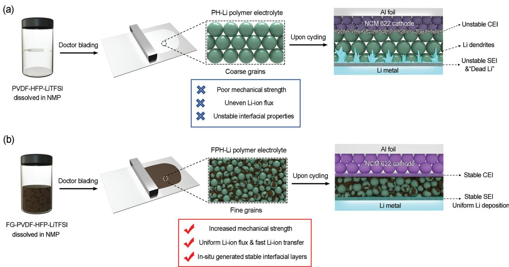
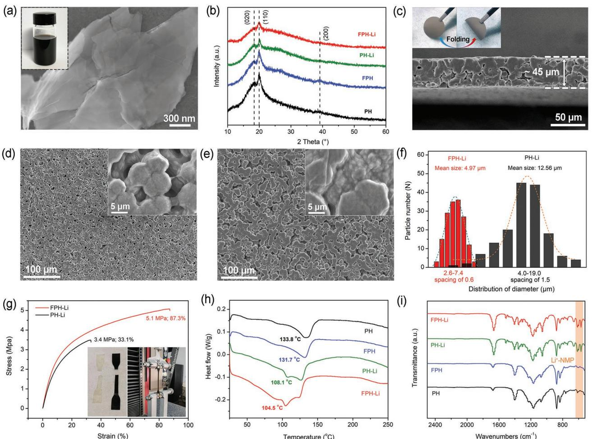
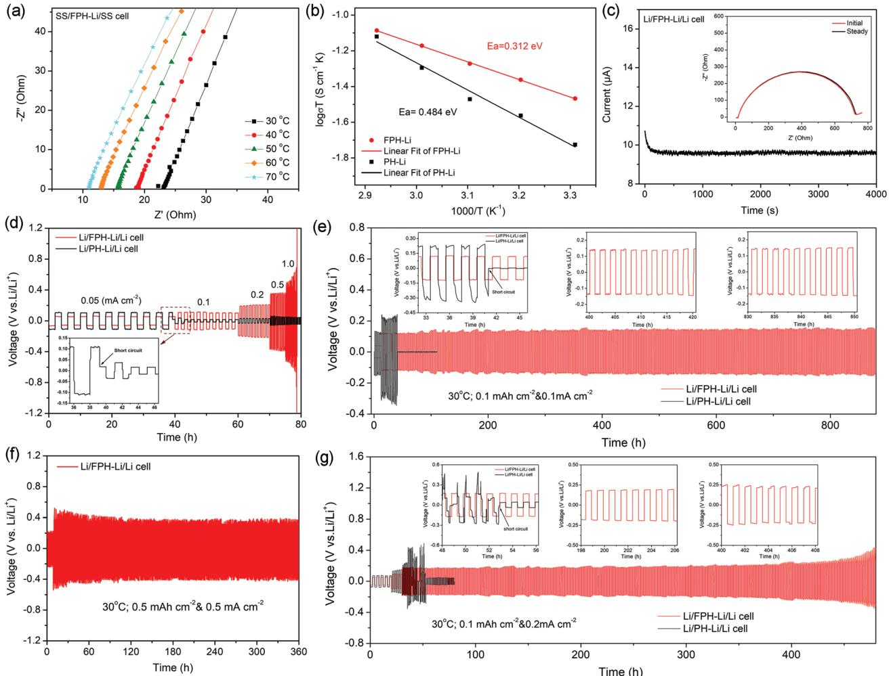
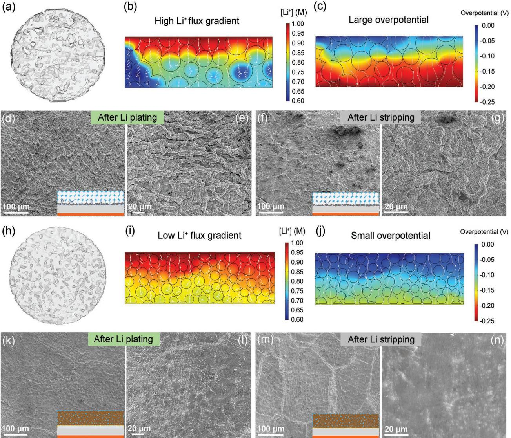
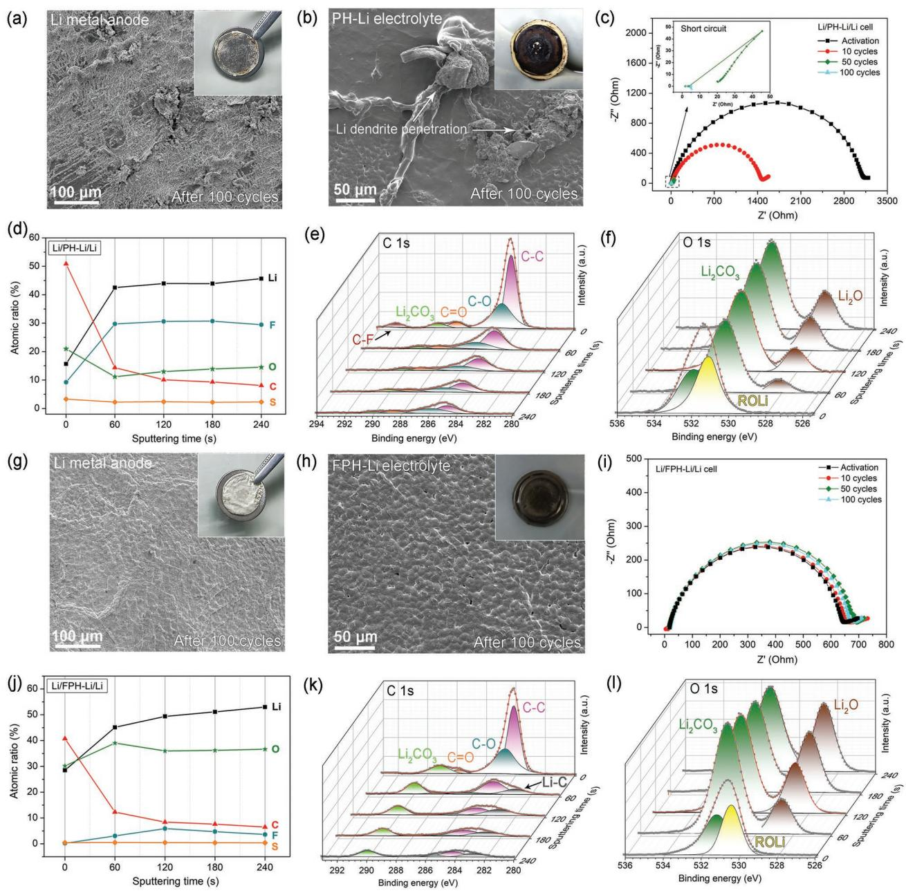
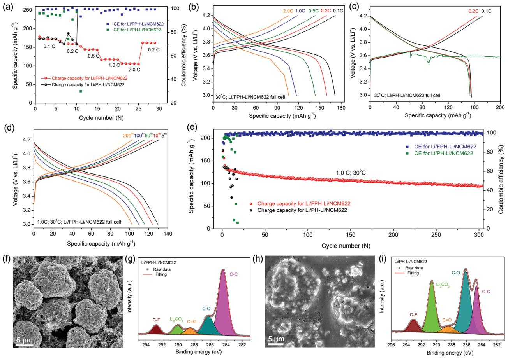

# **Two-Dimensional Fluorinated Graphene Reinforced Solid Polymer Electrolytes for High-Performance Solid-State Lithium Batteries**

*Pengbo Zhai, Zhilin Yang, Yi Wei, Xiangxin Guo,\* and Yongji Gong\**

**Solid polymer electrolytes (SPEs) hold a great promise in the application of solid-state lithium batteries, but suffer from poor mechanical properties and uncontrolled electrode/electrolyte interfacial reaction, which restrict their overall electrochemical performance. Herein, the design of 2D fluorinated graphene-reinforced PVDF-HFP-LiTFSI (FPH-Li) polymer electrolytes to address these challenges is reported. Uniformly dispersed fluorinated graphene induces a unique grain refinement effect, which effectively improves the mechanical properties without excessively increasing the thickness of the polymer electrolyte. Significant reduction in polymer grain size enhances interfacial lithium ion (Li-ion) transport and homogenizes Li-ion flux, thereby improving Li-ion conductivity and promoting uniform Li plating/stripping. Furthermore, extensive characterizations show that fluorinated graphene is involved in the construction of a stable artificial interface, which effectively prevents the side reactions between the lithium metal anode and solvated molecules. As a result, the use of thin FPH-Li polymer electrolytes (thickness of ≈45 µm) enables long-term Li plating/stripping with a small overpotential in Li/Li symmetrical cells and stable cycling of Li/LiNi0.6Co0.2Mn0.2O2 full cells with a high average Coulombic efficiency of 99.5% at 1.0 C. This work verifies the effectiveness of 2D materials in improving the comprehensive properties of polymer electrolytes and promotes the applications of SPEs in high-performance solid-state lithium batteries.**

#### **1. Introduction**

Developing solid-state lithium batteries (SSLBs) based on advanced solid electrolytes, high-voltage cathodes, and Li metal anode has been intensively pursued as a promising solution to achieve high energy density and solve the safety issues of

P. Zhai, X. Guo College of Physics Qingdao University Qingdao 266071, China E-mail: xxguo@qdu.edu.cn Z. Yang, Y. Wei, Y. Gong School of Materials Science and Engineering Beihang University Beijing 100191, China E-mail: yongjigong@buaa.edu.cn

The ORCID identification number(s) for the author(s) of this article can be found under https://doi.org/10.1002/aenm.202200967.

**DOI: 10.1002/aenm.202200967**

current Li-ion batteries based on flammable liquid electrolytes.[1–4] Among various solid electrolytes, solid polymer electrolytes (SPEs) attract extensive attention by virtue of their high flexibility, facile scalability, and low cost when compared with inorganic ceramic electrolytes.[5–7] Up to now, several SPEs based on poly- (ethylene oxide) (PEO),[8,9] poly(methyl methacrylate) (PMMA),[10,11] polyacrylonitrile (PAN),[10,12] and poly(vinylidene fluoride) (PVDF)[13–15] have been reported and are considered as promising choices for SSLBs. Nevertheless, poor mechanical properties, unstable electrode/electrolyte interface, and low Li-ion conductivity restrict their large-scale practical applications. For example, the PEO-based electrolytes which can transfer Li ions by local relaxation and segmental motion of polymer chains usually exhibit low ionic conductivity of ≈10–7 to 10–6 S cm–1 at room temperature.[16,17] The relatively low Young's modulus (≈10–3 MPa) makes them easily pierced by Li dendrites even at small current densities of below 0.3 mA cm–2, resulting in the short cycling time.[18,19] Moreover, PEO will be oxidized

and decomposed at ≈4.0 V versus Li/Li+ (3.57 V for PEO/LiTFSI electrolyte), making it difficult to match the high-voltage cathodes.[20–22] Although the room-temperature Li-ion conductivity of PEO-based electrolytes can be improved by adding inert or active fillers, the intrinsic deficiencies in mechanical properties and electrochemical stability still limit the energy density and cycling life of full cells.[23–26]

In comparison with other SPEs, PVDF-based electrolytes possess relatively high mechanical strength, good thermal stability, and wide electrochemical window.[27–29] Solvated molecules formed by the strong interaction between lithium salt and residual solvent can be quickly transported through the polymer chains, which endows PVDF-based electrolytes with relatively high room-temperature Li-ion conductivity. Copolymerization of hexafluoropropylene with vinylidene fluoride (PVDF-HFP) can improve the mobility of polymer chains, further increasing the lithium-ion conductivity.[30–32] However, there remains several problems hindering the practical application of PVDF-based electrolytes (**Figure 1**a). First, unlike polymers such as PEO and PAN, which can form dense and

**Figure 1.** Schematic illustration for the influence of fluorinated graphene on the properties of polymer electrolytes. a) Synthesizing process of common PVDF-HFP-LiTFSI (PH-Li) polymer electrolyte and the influence of its inherent shortcomings on full-cell cycling. b) Synthesizing process of fluorinated graphene reinforced PVDF-HFP-LiTFSI (FPH-Li) polymer electrolyte and the mechanism of its advantages for improving the cycling stability of the full cell.

void-free films, the PVDF-HFP matrix in SPEs is composed of micro-sized spherical particles with voids forming between the particles. These voids may reduce the mechanical strength and cause uneven distribution of lithium-ion flux, resulting in uncontrolled Li dendrite growth. Second, when matching with the Li metal anode, the alkaline radicals on the surface of Li metal rapidly induce the uncontrolled dehydrofluorination of PVDF-HFP (–(CH2–CF2)- + LiOH → –(CHCF)- + LiF + H2O), resulting in the formation of unstable solid electrolyte interphase (SEI) with porous structure.[33,34] The porous structure of the SEI layer leads to continuous side reactions between Li metal and solvated molecules, resulting in the further deterioration of interfacial stability. In addition, the residual solvents such as N, N-dimethylformamide (DMF), and N-Methyl pyrrolidone (NMP) continue to decompose under high potential due to the relatively high highest occupied molecular orbital (HOMO) energy, which will cause the rapid capacity decay of high-voltage cathodes.[35,36] Tremendous efforts have been devoted to solve these problems. The incorporation of SiO2 nanoparticles, LDH nanosheets, palygorskite nanowires, and glass fiber membranes into PVDF-based electrolytes was utilized to improve the mechanical properties and suppress the Li dendrite growth.[37–41] However, the ionic insulating feature of these additives inevitably leads to the uneven Li-ion flux distribution and hinders of forming the stable electrode/electrolyte interface. Introduction of Li-ion conducting active fillers such as Li6.75La3Zr1.75Ta0.25O12 (LLZTO), Li0.33La0.56TiO3-*x* (LLTO), and Li6.75La3Zr1.75Nb0.25O12 (LLZNO) can enhance the resistance to Li dendrites and increase the Li-ion conductivity.[34,42–44] Recently, Ke et al. reported the strong interactions between the Li1.4Al0.4Ti1.6(PO4)3 (LATP) nanowires and DMF molecules in

PVDF substrate, which enhanced the electrochemical stability of the LATP-PVDF composite electrolyte and facilitated interfacial Li-ion transport.[45] Despite these advantages, the alkaline surface of these ceramic oxide electrolytes can promote dehydrofluorination of PVDF polymers, causing the complex effect on the PVDF-based electrolytes.[34,42–45] Graphene-based materials have also been used to enhance the electrochemical performance of polymer electrolytes.[46] Xiang et al. synthesized a series of composite gel polymer electrolytes (GPEs) based on PVDF-HFP, [EMIM][TFSI], LiTFSI, and covalent linked 2,2″-(ethylenedioxy) bis (ethylamine) to reduced graphene oxide (rGO-PEG-NH2). The interaction between the rGO-PEG-NH2, [EMIM][TFSI] ionic liquid and PVDF-HFP was utilized to decrease the degree of crystallization of PVDF-HFP and accelerate the Li-ion transport.[47] Copolymerization of other polymers (such as PEO, PAN, etc.) with PVDF-HFP is also utilized to improve the electrochemical performances of SPEs.[48–53] Ren et al. designed and synthesized SPVDFLi-HFP/PVDF-HFP composite electrolyte, which shows enhanced mechanical properties and a high Li-ion transference number.[54] Sui et al. designed a self-enhancing gel polymer electrolyte (GPE) by in situ polymerizing 1,3-dioxolane (DOL) in the PDA/PVDF-HFP skeleton. Hydrogen bonds between the PDOL and skeleton effectively increase the mechanical strength of the GPE and improve ionic conductivity.[55] Due to the absence of a stable interfacial layer, the composite electrolyte still suffers from uncontrollable interfacial reactions with the electrodes. Various artificial SEI layers have been synthesized to improve interfacial stability.[56] More recently, Lai et al. modified PVDF solid polymer electrolytes with ZIF-8, which provided stable channels for Li-ion transmission.[57] The method of adjusting the

type and concentration of Li salts has been employed to construct stable interfacial layers.[58–60] Yao et al. designed a quasiionic liquid/polymer electrolyte by incorporating [Li(DMF)3] [TFSI] solvated complex with PVDF-HFP. Benefiting from the coordination of DMF to lithium ions, the obtained polymer electrolyte exhibits high room-temperature Li-ion conductivity and oxidation stability.[44] Liu et al. designed a PVDF-HFP-based polymer-in-salt solid electrolyte to achieve good interfacial stability and high room-temperature Li-ion conductivity.[30] However, the mechanical strength of the polymer electrolyte membrane decreases with increasing Li salt concentration. Increasing the thickness of the polymer electrolytes (usually >100 µm) is a common method to improve the mechanical properties, which however undoubtedly reduces the Li-ion conductivity and the energy density of the battery. According to Janek et al., the thickness of the solid electrolytes is required to be <50 µm to obtain the Li metal batteries with competitive energy density above 500 Wh kg–1. [61] Consequently, how to effectively improve the mechanical properties of the polymer electrolytes without excessively increasing the thickness and building stable electrode/electrolyte interfacial layers are still key issues to be resolved in the field of constructing high energy-density PVDF-based solid-state lithium metal batteries.

Herein, we report the design of a two-dimensional (2D) fluorinated graphene reinforced PVDF-HFP-LiTFSI solid polymer electrolyte (FPH-Li), which possesses improved mechanical strength, high room-temperature Li-ion conductivity, and excellent electrode/electrolyte interface stability. Several advantages involved in this FPH-Li electrolyte benefit to the improvement of comprehensive performance (Figure 1b). First, the introduction of 2D fluorinated graphene provides sufficient nucleation sites for the crystallization of PVDF-HFP and limits the growth process of PVDF-HFP grains, thereby reducing the size of polymer particles. The decreased grain size induces the fine-grain strengthening effect like that in metal matrix composites, which effectively improves the mechanical strength of the FPH-Li electrolyte with a thin thickness of ≈45 µm.[62] Second, the interface area of FPH-Li film increases with decreasing the polymer particle size. The uniformly dispersed fluorinated graphene inhibits the rapid growth of the polymer grains to a certain extent, thereby improving the segment movement of PVDF-HFP. Enhanced interfacial ion conduction together with the improved segment motion increases the room-temperature Li-ion conductivity and homogenizes the Li-ion flux within FPH-Li electrolyte, which has been verified by COMSOL simulations. More importantly, the fluorinecontaining groups on the surface of fluorinated graphene react with highly reductive lithium metal to generate an artificial interface layer with dense structure and stable chemical properties,[63,64] which effectively prevents the side reactions between electrodes and FPH-Li electrolytes. Benefiting from these advantages, the use of the FPH-Li electrolyte enables uniform and dendrite-free Li plating/stripping during longterm cycling in Li/Li symmetric cells. Solid-state Li/FPH-Li/ NCM622 full cells present significant improvements in cycling stability (i.e., over 300 cycles with 81.5% capacity retention at 1.0 C) at 30 °C. This work explores the application of 2D materials in the property regulation of solid polymer electrolytes, and sparks new insights in constructing high-performance SSLBs.

# **2. Results and Discussion**

Fluorinated graphene (FG) was obtained by the intercalation exfoliation strategy using fluorinated graphite as the precursor and NMP as the intercalating molecular.[63] As shown in **Figure 2**a, FG with a layered structure is uniformly dispersed in NMP and does not agglomerate even after standing for several months (inset in Figure 2a). The atomic content of fluorine (F) in fluorinated graphene is 53 at% and all the fluorine atoms exist in the form of C–F bond (Figure S2, Supporting Information). The fluorine content in fluorinated graphene can be adjusted by calcination in a reductive atmosphere (Figure S3, Supporting Information). Moreover, the dispersibility of fluorinated graphene in NMP deteriorates with decreasing fluorine content (Figure S4, Supporting Information).[65] The membranes of the FPH-Li polymer electrolyte were prepared through a facile solution-casting method with FG-dispersed NMP as solvent (details in Experimental section). In comparison, the PH-Li polymer electrolyte membranes were also synthesized using the same method with bare NMP as solvent. The PVDF-HFP/LiTFSI weight ratio and drying process for all the composite membranes are consistent to explore the effects of fluorinated graphene on the comprehensive properties of polymer electrolytes. X-ray diffraction (XRD) was conducted to correlate the structure of the samples. As shown in Figure 2b, three characteristic peaks at around 18.5°, 20.0°, and 39° corresponding to the (020), (110), and (200) planes of *α*-phase PVDF-HFP can be observed in PVDF-HFP (PH) and fluorinated graphene modified PVDF-HFP (FHP) polymer membranes without adding lithium salts. No diffraction peaks of LiTFSI can be detected in the FPH-Li and PH-Li polymer electrolytes, indicating the complete dissolving of the lithium salts in the polymer electrolyte membranes. The intensity of diffraction peaks corresponding to PVDF-HFP in FPH-Li and PH-Li decreases significantly, which can be attributed to that LiTFSI reduces the crystallinity of the polymer matrix. Moreover, compared with the PH-Li, the width of PVDF-HFP diffraction peaks in FPH-Li is increased and the intensity is weakened, indicating its smaller grain size and lower crystallinity, which helps to improve the Li-ion conductivity of the PVDF-HFP based polymer electrolytes. Scanning electron microscope (SEM) characterization was conducted to elucidate the microstructure of FPH-Li and PH-Li polymer electrolytes. The thickness of the FPH-Li electrolyte is ≈45 µm (Figure 2c), which is close to that of PH-Li electrolyte (≈46 µm, Figure S5, Supporting Information). The ultra-thin thickness endows the FPH-Li electrolyte with excellent flexibility, allowing it to be folded at any angle (inset in Figure 2c). Interestingly, the introduction of FG causes dramatic changes in PVDF-HFP grain size and microstructure of polymer electrolyte membranes. As shown in Figures 2d-e and Figure S6, Supporting Information, compared with the loose structure of PH-Li electrolyte, small grains of FPH Li electrolyte are densely packed to form a continuous texture. It can be observed in the high-magnification SEM image (inset in Figure 2d) that thin layers of FG appear on the surface of

**Figure 2.** Characterizations of FPH-Li electrolytes. a) SEM image of fluorinated graphene. The inset is the dispersion of fluorinated graphene in NMP. (b) XRD patterns of FPH-Li, PH-Li, FPH, and PH polymer membranes. c) Cross-section SEM image of FPH-Li. The insets are digital photos of the FPH-Li membrane before and after folding. d) SEM image of FPH-Li. The inset is the high-resolution SEM image of FPH-Li. e) SEM image of PH-Li. The inset is the high-resolution SEM image of PH-Li. f) The statistical diagram on the particle size distribution of FPH-Li and PH-Li electrolytes. g) Stress-strain curves of FPH-Li and PH-Li electrolytes during a tensile test. h) DSC curves and i) FT-IR curves of FPH-Li, PH-Li, FPH, and PH polymer membranes.

FPH-Li electrolyte, which is absent in the PH-Li electrolyte (inset in Figure 2e). FG can not only bridge the polymer particles to limit their rapid growth, but also create an extensive FG/ PVDF-HFP contact interface to improve the Li-ion transport rate of the FPH-Li electrolyte. Measurements of the threedimensional profile show that the surface roughness of FPH-Li electrolyte is only 0.9 µm, which is <2.2 µm of PH-Li electrolyte (Figure S7, Supporting Information). This indicates that the FPH-Li electrolyte presents a smoother surface, which is beneficial to form fine interfacial contact with the electrodes. Moreover, the statistical results of particle size (Figure 2f) show that the average particle size of FPH-Li electrolyte is ≈4.97 µm, which is much smaller than that of PH-Li electrolyte (≈12.56 µm). The reduction in particle size induces the finegrain strengthening effect, greatly improving the mechanical properties of the FPH-Li electrolyte. Accordingly, the breaking strength and total elongation of the FPH-Li electrolyte are 5.1 MPa and 87.3%, respectively, which are much better than 3.4 MPa and 33.1% of the PH-Li electrolyte (Figure 2g). A dense structure and greatly improved mechanical properties will effectively improve the Li dendrite resistance of the FPH-Li electrolyte. The density of FPH-Li polymer electrolyte is calculated to be 1.227 g cm–3, higher than that of PH-Li polymer electrolyte (1.141 g cm–3). The differential scanning calorimetry (DSC) curves were measured to investigate the crystallinity of the polymer membranes. As shown in Figure 2h, the glass transportation temperature (*Tg*) of the PH, FPH, PH-Li and FPH-Li membranes is 133.8, 131.7, 108.1, 1and 04.5°C, respectively, indicating that LiTFSI can greatly reduce the crystallinity of the PVDF-HFP due to the plasticizing effect of large anion TFSI– . Moreover, the *Tg* of the FPH-Li is slightly lower than that of PH-Li, indicating that the introduction of fluorinated graphene can not only induce the nucleation to reduce the grain size, but also slightly reduce the crystallinity of the polymer, which is consistent with the previous XRD results. Thermogravimetric analysis (TGA) curves show that the NMP solvent

content in the FPH-Li electrolyte is 18.08%, which is close to 17.42% in the PH-Li electrolyte (Figure S8, Supporting Information). As shown in Figure S9, the initial volatilization temperature of the free solvent NMP is ≈50 °C, and it completely volatilizes at around 135 °C. After dispersing fluorinated graphene in NMP (FG-NMP), the onset volatilization temperature of NMP is increased from 50 °C to 80 °C, indicating the interaction between fluorinated graphene and NMP molecules. The introduction of LiTFSI (FG-NMP-2 M LiTFSI solution) noticeably suppresses the evaporation of NMP due to the strong interaction between LiTFSI and the NMP solvent, and the obtained solvated molecules [Li(NMP)*x*] + exhibits higher thermal stability. In the FPH-Li polymer electrolyte, the thermal stability of the solvated molecules is further improved, indicating the strong interaction between the solvated molecules and the PVDF-HFP polymer chains. 1 H nuclear magnetic resonance (1 H NMR) was further conducted to investigate the content and state of NMP in FPH-Li electrolyte. As shown in Figure S10, Supporting Information, compared with pure NMP solvent, the intensity of characteristic peaks corresponding to the functional groups of NMP molecules in the 1 H NMR spectrum of the FPH-Li polymer electrolyte is reduced by more than 10 million times, which can be attributed to the ultra-low content of NMP in the FPH-Li electrolyte. Moreover, four characteristic peaks at 3.40, 2.33, 2.03, and 2.82 ppm, which are attributed to the three methylene (–CH2–) and methyl (–CH3) groups of NMP are broadened and shifted to the high chemical shift side, indicating that the NMP does not exist as free molecules in the FPH-Li electrolyte. In addition, the Fourier Transform infrared (FT-IR) spectra (Figure 2i and Figure S11, Supporting Information) exhibit that the CO peak of the free NMP molecule in FG-NMP solvent at 1675 cm–1 is blue-shifted and splits into two peaks located at 1664 and 1648 cm–1, corresponding to the Li+•••CO coordination (bound NMP) in the FPH-Li electrolyte. The absence of the characteristic bands at 1295, 1262, 1110, 983, 926, 655, and 470 cm–1 for free NMP indicates that all NMP molecules are bounded to Li+ and no free NMP can be observed in the FPH-Li electrolyte. The characteristic bands for solvated [Li(NMP)*x*] + molecules located at 570, 616, 1055, and 1352 cm–1 are observed in the FT-IR spectrum of FPH-Li electrolyte. In the Raman spectrum (Figure S12, Supporting Information) of the FPH-Li electrolyte, the characteristic peaks for the free NMP molecules are absent while the bands for [Li(NMP)]+ molecules (bound NMP) appear at 685, 578, and 509 cm–1. The result of Raman spectroscopy is consistent with the results of FT-IR, both of which indicate that NMP in the FPH-Li electrolyte exists in the bound form instead of in free form.[38] Rapid transport of solvated [Li(NMP)*x*] + at the interface leads to the excellent Li-ion conductivity of FPH-Li polymer electrolyte.[66]

Symmetrical batteries using stainless steel (SS) as blocking electrodes were assembled to measure the Li-ion conductivity of solid polymer electrolytes. According to the electrochemical impedance spectra (EIS), the Li-ion conductivity of the FPH-Li electrolyte at 30 °C can be calculated to be 1.32 × 10–4 S cm–1 (**Figure 3**a), much higher than that of PH-Li electrolyte (6.21 × 10–5 S cm–1, Figure S13, Supporting Information). This can be attributed to the grain refinement effect caused by the introduction of FG, which effectively increases the interface area and enhances the interfacial ion conduction, thereby significantly improving the Li-ion conductivity. Benefiting from the small thickness, the areal resistance of FPH-Li electrolyte is calculated to be only 34.09 Ω cm2 (Table S1, Supporting Information). The reduced areal resistance enables faster Li-ion transport in the FPH-Li electrolyte, which endows good rate capability. The Arrhenius plots (Figure 3b) based on Li-ion conductivity at different temperatures indicate that the activation energy (*Ea*) for Li-ion migration of FPH-Li and PH-Li electrolytes are 0.312 and 0.484 eV, respectively, indicating the lower barrier for Li-ion transport in FPH-Li polymer electrolyte. Li-ion transference number is another important metrics to evaluate the Li-ion migration ability in the electrolyte. The Li-ion transference number (*t*Li+) of FPH-Li is 0.472 (Figure 3c), higher than that of PH-Li (*t*Li+ = 0.315, Figure S14, Supporting Information), which is profited from accelerated interfacial Li-ion transport in the FPH-Li electrolyte. The results of DC polarization (Figure S15, Supporting Information) show that electronic conductivities of PH-Li and FPH-Li electrolytes are 1.29 × 10–9 and 1.98 × 10–9 S cm–1, respectively. The ratio of Li-ion conductivity to electron conductivity (*R*Li+ /e– ) of FPH-Li is calculated to be 6.67 × 104 , higher than that of the PH-Li (4.81 × 104 ), which suggests that the introduction of fluorinated graphene does not increase the electronic conductivity of the FPH-Li polymer electrolyte. The electrochemical stability of different polymer electrolytes was measured using linear sweep voltammetry (LSV). As shown in Figure S16, Supporting Information, compared with 4.26 V of PH-Li electrolyte, the initial oxidation potential of FPH-Li electrolyte is extended to 4.72 V, indicating that the FPH-Li electrolyte possesses better compatibility with highvoltage cathodes. This can be attributed to the introduction of electrochemically stable fluorinated graphene, which can effectively avoid the rapid decomposition of the PVDF-HFP matrix and solvated [Li(NMP)*x*] +. To investigate the effect of the NMP solvent on the performance of composite electrolytes, FPH-Li polymer electrolytes with NMP content of 2.8 wt.% and 51.3 wt.% (Figure S17, Supporting Information) were prepared by adjusting the drying temperature to 150 °C (denoted as FPH-Li-150) and 50 °C (denoted as FPH-Li-50), respectively. For FPH-Li-150 electrolyte, the particles of the PVDF-HFP are bonded together and some cracks can be observed (Figure S18, Supporting Information). The hardness of FPH-Li-150 electrolyte is increased but the toughness is decreased, which is detrimental to the interfacial contact between electrodes/electrolytes. Raman spectrum (Figure S19, Supporting Information) indicates that the characteristic peaks corresponding to solvated molecules disappear, which will affect the Li-ion transport behavior in the FPH-Li-150 polymer electrolyte. Consequently, the Li-ion conductivity of FPH-Li-150 is 7.41 × 10–7 S cm–1 at 30 °C (Figure S20, Supporting Information). In the FPH-Li-50 electrolyte, part of NMP exists in the form of free molecules, which can be verified by the Raman spectrum (Figure S21, Supporting Information). The Li-ion conductivity of FPH-Li-50 is 4.18 × 10–4 S cm–1 (Figure S22a, Supporting Information) at 30 °C and the Li-ion transference number is calculated to be 0.263 (Figure S22b, Supporting Information). Moreover, the presence of a large amount of free solvent molecules not only decreases the mechanical strength of the FPH-Li-50 but also induces aggravated side reactions between electrodes and

**Figure 3.** Electrochemical performances of symmetric cells. a) Nyquist plots of SS/FPH-Li/SS cell at various temperatures. b) Arrhenius plots of ionic conductivities for FPH-Li and PH-Li electrolytes. c) Chronoamperometry curve of Li/FPH-Li/Li cell under 10 mV polarization. The inset is EIS spectra before (red) and after (black) potential polarization. d) Galvanostatic charge/discharge curves of Li/FPH-Li/Li and Li/PH-Li/Li cells under different current densities. e) Galvanostatic cycling curves of Li/FPH-Li/Li and Li/PH-Li/Li cells under 0.1 mA cm–2 for 1 h. f) Galvanostatic cycling curves of Li/ FPH-Li/Li cell under 0.5 mA cm–2 for 1 h. g) Galvanostatic cycling curves of Li/FPH-Li/Li and Li/PH-Li/Li cells under 0.2 mA cm–2 for 1 h. The temperature of galvanostatic charge/discharge tests is 30 °C

electrolytes, deteriorating interfacial stability. As shown in Figure S23, Supporting Information, the decomposition voltage of the FPH-Li-50 electrolyte is lower than 3.3 V.

The electrochemical performances of solid polymer electrolytes with and without FG in contact with lithium metal anodes were further tested by assembling Li||Li symmetrical batteries to investigate the influence of FG additive on Li/electrolyte interface stability. Figure 3d shows the voltage profiles of Li plating/stripping in Li/FPH-Li/Li and Li/PH-Li/Li batteries, in which the current density increases from 0.05 to 1.0 mA cm–2 with a fixed capacity of 0.1 mAh cm–2. The polarization voltage of Li/FPH-Li/Li increases with current density and the cell maintains stable cycling without a short circuit even under 1.0 mA cm–2. In comparison, the Li/PH-Li/Li symmetrical cell is short-circuited when the current density is increased to 0.1 mA cm–2, which can be ascribed to the unstable interface and severe Li dendrite growth. The Li/FPH-Li/Li symmetrical cell shows a stable cycling performance at 30 °C for more than 900 h under 0.1 mA cm–2 using a capacity of 0.1 mAh cm–2, while the Li/PH-Li/Li symmetrical cell is short-circuited only after 40 h. Moreover, the low Li-ion conductivity of FPH-Li-150 results in the ultra-high overpotentials, preventing the efficient electrochemical cycling of Li/FPH-Li-150/Li symmetric cells (Figure S24a, Supporting Information). The overpotential of the Li/FPH-Li-50/Li symmetric cell keeps increasing due to the side reactions between Li metal and free NMP molecules and the symmetric cell is short-circuited after cycling for ≈100 h (Figure S24b, Supporting Information). When the current density is increased to 0.2 mA cm–2, the Li/FPH-Li/Li symmetrical cell can stably run for more than 500 h (Figure 3g). In contrast, the voltage curves of the Li/PH-Li symmetrical cell fluctuate violently with large voltage polarization, and the cell is shortcircuited rapidly. Even cycled at 0.5 mA cm–2 using a capacity of 0.5 mAh cm–2, the Li/FPH-Li/Li symmetrical cell can run

**Figure 4.** Investigation of Li metal plating/stripping behavior. a) Horizontal slice synchrotron X-ray computed tomography (SX-CT) pattern of PH-Li electrolyte. COMSOL simulations of b) Equilibrium Li-ion concentration profile and c) overpotential distribution within the PH-Li electrolyte. SEM images of Li metal anodes in Li/PH-Li/Li cell after d-e) plating 0.1 mAh cm–2 and f-g) stripping 0.1 mAh cm–2 at 0.1 mA cm–2. h) Horizontal slice SX-CT pattern of FPH-Li electrolyte. COMSOL simulations of i) Equilibrium Li-ion concentration profile and j) overpotential distribution within the FPH-Li electrolyte. SEM images of Li metal anodes in Li/FPH-Li/Li cell after k-l) plating 0.1 mAh cm–2 and m-n) stripping 0.1 mAh cm–2 at 0.1 mA cm–2.

for 360 h (Figure 3f and Figure S25, Supporting Information). The performances are comparable to that of the Li/Li symmetrical cells using common PVDF-HFP-based polymer electrolytes (Table S1, Supporting Information). With the decrease of fluorine content, the electronic conductivity of fluorinated graphene increases, and its homogeneity in the PVDF-HFP substrate decreases (Figure S26, Supporting Information). These changes lead to the increased electronic conductivities (Figure S27a, Supporting Information) and decreased Li-ion conductivities (Figure S27b, Supporting Information) of composite electrolytes with adding reduced fluorinated graphene. The Li/Li symmetrical cells using FPH-Li polymer electrolytes with adding reduced FG exhibit poor cycling performances (Figure S28, Supporting Information).

To reveal the mechanism by which fluorinated graphene enhances the stability of polymer electrolytes pairing with Li metal, the plating/stripping behavior of Li metal was characterized. The porosity and interface properties of different electrolyte membranes were first characterized using synchrotron X-ray computed tomography (SX-CT). As shown in **Figure 4**a, due to the large particle size of PVDF-HFP, many large voids can be observed within the PH-Li electrolyte, which deteriorates interfacial contact and impedes interfacial Li-ion transport. Simulations of the kinetic equilibrium of Li-ion concentration profiles within the polymer electrolytes were further carried out by solving the ionic diffusion and electrostatic potential field using a finite element approach (details in COMSOL Multiphysics simulations, Supporting Information) to illustrate

the effect of grain refinement on Li-ion transport behavior. As shown in Figure 4b, large voids are formed on the surface and inside of the PH-Li electrolyte membrane due to the large size of the polymer grains. These voids hinder the transport of lithium ions, resulting in uneven distribution of Li-ion flux in the PH-Li electrolyte. A high Li-ion flux gradient within the PH-Li electrolyte will lead to the high overpotential (≈0.25 V, Figure 4c) and large local current density (Figure S29a, Supporting Information) of Li plating/stripping, which can induce the rapid growth of Li dendrites. Morphology characterization of Li metal anodes in Li/PH-Li/Li cell after Li plating/stripping validates the above simulation results. Tremendous bulging lithium deposits can be observed on the electrode surface after plating 0.1 mAh cm–2 of Li at 0.1 mA cm–2 (Figure 4d). Enlarged SEM images (Figure 4e) demonstrate that the lithium deposits are dendritic. After Li stripping, a large amount of "dead lithium" remains on the electrode surface (Figure 4f–g), further deteriorating the stability of the PH-Li electrolyte/Li interface. In contrast, the grain refinement effect brought by the introduction of FG greatly reduces the particle size of the FPH-Li polymer electrolyte, which not only enhances the interface contact but also reduce the generation of large voids. Horizontal slice SX-CT image (Figure 4h) shows that the FPH-Li electrolyte possesses a much-decreased porosity with tight interfacial contact. Moreover, Li-ion flux is uniformly distributed within the FPH-Li electrolyte, which effectively reduces the gradient of the Li-ion flux (Figure 4i). At the same time, the overpotential of Li plating/stripping is reduced (≈0.1 V, Figure 4j) and the excessive local current density is alleviated (Figure S29b, Supporting Information), all of which help to suppress the Li dendrite formation. SEM images of Li/FPH-Li/Li cell (Figure 4k-l) show that the electrode surface is uniform and flat without Li dendrites after plating 0.1 mAh cm–2 of Li at 0.1 mA cm–2. After Li stripping, the electrode still exhibits a smooth surface and no "dead lithium" can be observed (Figure 4m-n). Even after plating 0.5 mAh cm–2 of Li at 0.5 mA cm–2, the surface of the Li metal anode in Li/FPH-Li/Li cell is still uniform and flat without large Li deposits or Li dendrites (Figure S30a-b, Supporting Information). After Li stripping, the electrode exhibits a smooth surface and no "dead lithium" can be observed (Figure S30c-d, Supporting Information). This indicates that the excellent Li-ion conductivity and interfacial stability enable the FPH-Li electrolyte to operate under conditions of higher current and larger Li capacity. In comparison, tremendous bulging lithium deposits and large size Li dendrites can be observed on the surface of Li metal anode in Li/PH-Li/Li cell after plating 0.5 mAh cm–2 of Li at 0.5 mA cm–2 (Figure S31a-b, Supporting Information). After Li stripping, a large amount of "dead lithium" remains on the electrode surface (Figure S31c-d, Supporting Information).

The significant difference in morphology of electrodes using different polymer electrolytes after Li plating/stripping prompted us to further explore the effect of fluorinated graphene on the SEI properties of Li metal anodes. As shown in **Figure 5**a and Figure S32 Supporting Information, after 100 cycles Li stripping, the surface of the electrode in Li/PH-Li/ Li cell becomes rough and dark (inset in Figure 5a) with massive "dead lithium". The cycled PH-Li electrolyte film turns dark brown (inset of Figure 5b) with large Li dendrites and massive by-products of Li/electrolyte interfacial side reactions accumulating on the surface of the PH-Li electrolyte (Figure 5b and Figure S33, Supporting Information). EIS spectra show that the interface resistance decreases sharply after 50 cycles, indicating that a micro-short circuit occurs in the Li/PH-Li/Li cell (Figure 5c). In-depth Auger electron spectroscopy (AES) was performed to investigate the element distributions in the interfacial layers of different cycled Li metal anodes. As shown in Figure S34 Supporting Information, during the whole process of Ar ion etching, the intensities of the C, O, and F elements remain high, indicating that the cycled Li metal anode in Li/ PH-Li/Li symmetrical cell is covered by a thick interfacial layer due to the uncontrolled side reactions. Considering the etching rate (≈0.2 nm s−1 ), the thickness of the interfacial layer of the cycled Li metal anode in Li/PH-Li/Li symmetrical cell exceeds 120 nm. The element mapping of Auger electron spectroscopy (Figure S35, Supporting Information) shows that the C, O, and F elements are unevenly distributed on the surface of cycled Li metal anode in Li/PH-Li/Li symmetrical cell and the SEI exhibits a porous structure, which can be attributed to the dehydrofluorination of PVDF-HFP and continuous reactions between Li metal and solvated molecules. The composition of SEI layers on the Li metal anode after 100 cycles was further identified through in-depth X-ray photoelectron spectroscopy (XPS). As shown in Figure 5d, the content of F increases rapidly from 9.21% to 29.76 at% upon sputtering, and remains above 30 at% during the whole sputtering process. Detailed F 1s spectra (Figure S36, Supporting Information) show that F exists in the form of LiF. Such a high content of LiF combined with the surface morphology analysis of the Li metal anode indicates that the PVDF-HFP in the PH-Li electrolyte undergoes an uncontrollable dehydrofluorination reaction, which leads to the thick SEI layer with porous structure. Before sputtering, the content of C is as high as 50.84% and the contents of C and O remain relatively high during the whole process of argon ion etching. Detailed C1s and O1s spectra (Figure 5e-f) show that the proportion of C–O and CO bonds corresponding to the organic components in the SEI layer is increased, indicating the aggravated side reactions between Li metal anode and solvated molecules.

In comparison, the surface of electrode in Li/FPH-Li/Li cell is still relatively flat and shiny (inset in Figure 5g) without accumulation of Li dendrites or dead lithium even after 100 cycles (Figure 5g and Figure S37, Supporting Information). A stable interfacial layer is in situ generated on the surface of the FPH-Li electrolyte, which remains uniform and smooth after 100 cycles. No Li dendrite penetration can be observed in FPH-Li electrolyte (Figure 5h and Figure S38, Supporting Information). EIS spectra show that the interfacial resistance of the Li/FPH-Li/Li cell remains constant at different cycles (Figure 5i), indicating the stable interface state. Moreover, the Li metal electrode in Li/PH-Li/Li cell exhibits a rather different composition from that of the electrode in Li/FPH-Li/Li cell. In-depth AES spectra exhibit that the intensities of the C, O, and F elements decrease rapidly, and the intensity of lithium element increases rapidly after 4 min of Ar ion etching, indicating that the thinner thickness (<50 nm) of the interfacial layer on the cycled Li metal anode in Li/FPH-Li/Li symmetrical cell (Figure S39, Supporting Information). When the time of Ar ion etching is 3 min and 4 min, the intensities of F and C elements reached their peaks, respectively, which can be ascribed to the formation of LiF and

**Figure 5.** Surface composition and structure identification of Li metal anodes. a) SEM image and digital photo (inset) of electrode in Li/PH-Li/Li cell after 100th Li stripping. b) SEM image of PH-Li electrolyte in Li/FPH-Li/Li cell after 100th Li stripping. c) EIS spectra of Li/PH-Li/Li cell at different cycles. d) In-depth atomic composition ratios and corresponding detailed XPS e) C1s and f) O1s spectra of cycled Li metal anode in Li/PH-Li/Li cell after different sputtering time. g) SEM image and digital photo (inset) of an electrode in Li/FPH-Li/Li cell after 100th Li stripping. h) SEM image of FPH-Li electrolyte in Li/FPH-Li/Li cell after 100th Li stripping. i) EIS spectra of Li/FPH-Li/Li cell at different cycles. j) In-depth atomic composition ratios and corresponding detailed XPS k) C1s and l) O1s spectra of cycled Li metal anode in Li/FPH-Li/Li cell after different sputtering time.

C layers induced by the reaction between fluorinated graphene and Li metal in the interfacial layer. The element mapping of Auger electron spectroscopy shows that the C, O, and F elements are evenly distributed on the surface of cycled Li metal anode in Li/FPH-Li/Li symmetrical cell and the SEI exhibits a dense and uniform structure (Figure S40, Supporting Information). Figure 5j shows the atomic ratios of selected elements on the Li metal electrode (extracted from Li/FPH-Li/Li cell after 100th

Li stripping) at different XPS depths. The F content reaches the highest value (5.88 at%) after sputtering for 120s and detailed F 1s spectra show that F exists in the form of LiF (Figure S41, Supporting Information). Such a low F content (much lower than that of cycled Li metal anode in Li/PH-Li/Li symmetrical cell) indicates that the LiF is not derived from the dehydrofluorination reaction of PVDF-HFP in the FPH-Li electrolyte film, but is generated from the in situ reaction between fluorinated

graphene and Li metal. With the depth profiling from the initial stage to sputtering for 120 s, C content decreased from 40.72 to 8.37 at%. Detailed and fitted XPS C 1s spectra (Figure 5k) show that C–C and Li2CO3 are the main peaks throughout the sputtering process while the C–O and CO bonds appearing at the initial stage correspond to the organic components in the SEI. Moreover, after sputtering for 60 s, the emergence of Li–C bond which is absent in the Li/PH-Li/Li cell can be attributed to the interaction of lithium ions with graphene which is generated from the in situ reaction between fluorinated graphene and Li metal (CF*x* + *x*Li → *x*LiF + C).[63,64] The appearance of Li–C bonds further indicates that fluorinated graphene is involved in the construction of the SEI layer. With increasing the sputtering time, the contents of Li and O (Figure 5l) increase continuously and dominate the composition, indicating that Li metal is uniformly deposited under the stable thin SEI layer. These results indicate that the introduction of fluorinated graphene helps to improve the interfacial stability between Li and FPH-Li, effectively suppressing the uncontrolled growth of lithium dendrites. During long-term cycling, the chemical stability and structural integrity of fluorinated graphene significantly affect the electrochemical performance of FPH-Li polymer electrolyte. The XPS results exhibit that the F content of fluorinated graphene in cycled FPH-Li electrolyte remains 51.83 at% (Figure S42a, Supporting Information). The detailed F1s spectrum (Figure S42b, Supporting Information) shows that most of the F elements still exist in the form of C–F, only a small amount of LiF (≈9.23%) is generated due to the interfacial reaction between Li metal and fluorinated graphene, indicating the excellent chemical stability of fluorinated graphene during cycling. Cross-sectional SEM images of cycled FPH-Li polymer electrolyte show that no Li dendrites or interfacial by-products can be observed inside the cycled FPH-Li electrolyte and fluorinated graphene is still uniformly coated on the surface of the polymer particles or evenly distributed between the electrolyte particles. In the enlarged SEM image (Figure S43, Supporting Information), it can be observed that the fluorinated graphene still maintains the uniform thin-layer structure. These results indicate that the FG can maintain excellent structural integrity in the FPH-Li polymer electrolyte even after hundreds of cycles.

Li/NCM622 full cells utilizing the FPH-Li and PH-Li electrolytes were further assembled and measured in the voltage range of 3.0-4.2 V at 30 °C to verify the application effectiveness of the FPH-Li electrolyte. As shown in **Figure 6**a, the

**Figure 6.** Electrochemical performances of Li/NCM622 full cells. a) Rate capability of Li/FPH-Li/NCM622 and Li/PH-Li/NCM622 cells. Charge/discharge curves of b) Li/FPH-Li/NCM622 and c) Li/PH-Li/NCM622 cells under different rates. d) Charge/discharge curves of Li/FPH-Li/NCM622 at 1.0 C. e) Cycling performance of Li/FPH-Li/NCM622 and Li/PH-Li/NCM622 cells at 1.0 C. f) SEM image and g) detailed XPS C1s spectrum of NCM622 cathode in Li/ FPH-Li/NCM622 after 20 cycles at 1.0 C. h) SEM image and i) detailed XPS C1s spectrum of NCM622 cathode in Li/PH-Li/NCM622 after 20 cycles at 1.0 C.

Li/FPH-Li/NCM622 cell deliveries capacities of 173.1, 159.7, 144.8, 118.0, and 106.3 mAh g–1 at 0.1, 0.2, 0.5, 1.0 and 2.0 C, respectively, and recovers to 159.3 mAh g–1 when the current density returns to 0.2 C, demonstrating the excellent rate capability benefiting from the fast Li-ion transfer kinetics in FPH-Li electrolyte. Charge/discharge profiles of Li/FPH-Li/NCM622 cell at various rates are stable, indicating that no side reaction occurs (Figure 6b). In contrast, the capacity of the Li/PH-Li/ NCM622 cell fluctuates violently at 0.2C, and the full cell fails at 0.5C. In the charge/discharge profile (Figure 6c), a voltage plateau corresponding to the side reaction appears at around 3.7 V. Long-term cycling performance is further tested. The Li/ FPH-Li/NCM622 cell can stably run for more than 300 cycles at 1.0 C with a capacity retention of ≈81.5% and an average coulombic efficiency of 99.5% (Figure 6d-e), while the capacity of Li/PH-Li/NCM622 cell decays rapidly and the cell fails only after 15 cycles (Figure 6e and Figure S44, Supporting Information). Further increasing the mass loading of NCM622 cathode to 7.6 mg cm−2, the full cell can still achieve stable cycling for more than 50 cycles at 0.2C (Figure S45, Supporting Information). The surface state of NCM622 cathodes after cycling was characterized to explore the mechanism for the large performance difference between Li/FPH-Li/NCM622 and Li/PH-Li/ NCM622 full cells. Both SEM (Figure 6f and Figure S46a–c, Supporting Information) and TEM (Figure S47, Supporting Information) show that the surface of the NCM622 electrode using FPH-Li electrolyte is still neat and smooth without a thick coating layer. Energy Dispersive Spectrum (EDS) indicates that the contents of C and O on the surface of the cycled NCM622 electrode in the Li/FPH-Li/NCM622 full cell are 13.41 and 12.89 wt%, respectively (Figure S47c, Supporting Information). However, for the NCM622 electrode using PH-Li electrolyte, the electrode particles are wrapped by a thick coating layer (Figure 6h, Figure S46d–f, and Figure S48a-b, Supporting Information). EDS spectrum (Figure S48c, Supporting Information) shows that the contents of C and O on the surface of the cycled NCM622 electrode in the Li/PH-Li/NCM622 full cell are 15.78 and 24.00 wt.%, respectively, much higher than those of the cycled NCM622 electrode in the Li/FPH-Li/NCM622 full cell. The XPS results (Figure S49c, Supporting Information) show that the C and O contents of the cycled NCM622 electrode in the Li/PH-Li/NCM622 full cell are 37.19 and 44.52 at%, respectively, which are much higher than those of the cycled NCM622 electrode in the Li/FPH-Li/NCM622 full cell (33 at% for C and 31.63 at% for O, Figure S49a, Supporting Information). Detailed C1s (Figure 6g) and O1s XPS spectra (Figure S49b, Supporting Information) exhibit that for the NCM622 electrode in the Li/FPH-Li/NCM622 full cell, the C–O, CO, and poly(CO3) peaks corresponding to the cathode electrolyte interphase (CEI) exhibit relatively low intensity, indicating the limited decomposition of the electrolyte and stable FPH-Li electrolyte/cathode interface. In comparison, for the NCM622 electrode using PH-Li electrolyte, significant increases can be observed in the intensity of the C–O, CO and poly(CO3) peaks corresponding to the CEI, indicating the severe decomposition of the and unstable PH-Li electrolyte/cathode interface (Figure 6i and Figure S49d, Supporting Information). After Li/NCM622 full cells cycling, the morphology and surface chemical state of different electrolyte films were also characterized.

As shown in Figure S50, the cycled FPH-Li electrolyte at the NCM622 cathode side is covered with a uniform interfacial layer, and no accumulation of by-products or structural damage can be observed. In contrast, a large amount of by-products accumulate on the surface of the PH-Li electrolyte in contact with the NCM622 electrode side, and structural damage can be clearly detected (Figure S51, Supporting Information). XPS survey spectra (Figure S52a-b, Supporting Information) of cycled electrolytes show that the contents of C and O elements on the surface of the cycled PH-Li electrolyte are 44.37 and 22.63 at%, much higher than those of the cycled FPH-Li electrolyte (35.79 at% for C and 10.48 at% for O). The content of F on the surface of the cycled PH-Li electrolyte is 19.52 at%, which is lower than that of the cycled FPH-Li electrolyte (39.10 at%). Detailed C1s spectra show that the intensity of C–O, CO and Li2CO3 peaks corresponding to the CEI in the cycled PH-Li electrolyte (Figure S52c, Supporting Information) is higher than that of the cycled FPH-Li electrolyte (Figure S52d, Supporting Information), indicating the severe side reactions at the unstable PH-Li electrolyte/cathode interface. The accumulation of side reaction products leads to the decrease of the fluorine content on the surface of the cycled PH-Li electrolyte. Moreover, the FTIR spectrum of the PH-Li electrolyte after 20 cycles exhibits significant changes compared with that of the original PH-Li electrolyte (Figure S53b, Supporting Information). The characteristic peaks corresponding to the solvated molecules disappear and the intensity of several peaks corresponding to the PVDF-HFP changes significantly, which can be ascribed to the severe side reactions between the PH-Li electrolyte and cathode. However, the FTIR spectrum of the FPH-Li electrolyte after cycling is consistent with that of the original FPH-Li electrolyte and the peak positions corresponding to PVDF-HFP and solvated molecules still exist (Figure S53a, Supporting Information), indicating that the side reactions between the electrolyte and cathode are effectively suppressed. Recent progress on PVDF-HFP-based CPEs and the corresponding full cell electrochemical performances have been compared and summarized in Table S1, Supporting Information. The improved interfacial stability of the FPH-Li electrolyte with both high-voltage NCM622 cathode and Li metal anode benefited from the introduction of fluorinated graphene enables stable cycling of the Li/FPH-Li/NCM622 full cell.

### **3. Conclusion**

A new design of two-dimensional fluorinated graphene reinforced PVDF-HFP solid polymer electrolyte has been developed and utilized in room-temperature Li metal batteries. The grain refinement effect induced by the addition of fluorinated graphene can not only improve the mechanical properties, but also enhance interfacial Li-ion transport thereby increasing the Li-ion conductivity of the polymer electrolyte. Moreover, the stable interface layer formed by the participation of fluorinated graphene improves the electrochemical stability of the polymer electrolyte on both the Li metal anode and NCM622 cathode side, enabling the long-term cycling of the solid-state Li/FPH-Li/NCM622 full cells. The present work verifies the feasibility of 2D materials in improving the comprehensive

performance of polymer electrolytes, and provides new ideas for promoting the development of SSLBs based on solid polymer electrolytes.

# **Supporting Information**

Supporting Information is available from the Wiley Online Library or from the author.

#### **Acknowledgements**

P.B.Z. and Z.L.Y. contributed equally to this work. This work was supported by the National Natural Science Foundation of China (Grant No. U1932205, 22171016, 51872012), the Key R&D Program of Shandong Province (Grant No. 2021CXGC010401), and the Taishan Scholars Program (Grant No. ts201712035). X. Guo gratefully acknowledges the support of the Project of Qingdao Leading Talents in Entrepreneurship and Innovation. The authors thank the BL13W1 beamline at Shanghai Synchrotron Radiation Facility (SSRF) for SX-CT measurements.

# **Conflict of Interest**

The authors declare no conflict of interest.

### **Data Availability Statement**

The data that support the findings of this study are available from the corresponding author upon reasonable request.

#### **Keywords**

2D fluorinated graphene, grain refinement effects, polymer electrolytes, solid-state lithium batteries, stable electrode/electrolyte interfaces

Received: March 21, 2022

Revised: August 17, 2022

Published online: September 6, 2022

- [1] Y. S. Hu, *Nat. Energy* **2016**, *1*, 16042.
- [2] M. Armand, J. M. Tarascon, *Nature* **2008**, *451*, 652.
- [3] B. Dunn, H. Kamath, J. M. Tarascon, *Science* **2011**, *334*, 928.
- [4] N. Zhao, W. Khokhar, Z. Bi, C. Shi, X. Guo, L. Z. Fan, C. W. Nan, *Joule* **2019**, *3*, 1190.
- [5] L. Z. Fan, H. He, C. W. Nan, *Nat. Rev. Mater.* **2021**, *6*, 1003.
- [6] P. Yang, X. Gao, X. Tian, C. Shu, Y. Yi, P. Liu, T. Wang, L. Qu, B. Tian, M. Li, *ACS Energy Lett.* **2020**, *5*, 1681.
- [7] Q. Zhou, J. Ma, S. Dong, X. Li, G. Cui, *Adv. Mater.* **2019**, *31*, 1902029.
- [8] S. Xu, Z. Sun, C. Sun, F. Li, K. Chen, Z. Zhang, G. Hou, H.-M. Cheng, F. Li, *Adv. Funct. Mater.* **2020**, *30*, 2007172.
- [9] N. Wu, Y. Li, A. Dolocan, W. Li, H. Xu, B. Xu, N. S. Grundish, Z. Cui, H. Jin, J. B. Goodenough, *Adv. Funct. Mater.* **2020**, *30*, 2000831.
- [10] S. Wang, J. Hu, X. Gui, S. Lin, Y. Tu, *J. Electrochem. Soc.* **2021**, *168*, 020514.
- [11] Z. Wang, L. Shen, S. Deng, P. Cui, X. Yao, *Adv. Mater.* **2021**, *33*, 2100353.
- [12] C. Hu, Y. Shen, M. Shen, X. Liu, H. Chen, C. Liu, T. Kang, F. Jin, L. Li, J. Li, Y. Li, N. Zhao, X. Guo, W. Lu, B. Hu, L. Chen, *J. Am. Chem. Soc.* **2020**, *142*, 18035.
- [13] G. Chen, F. Zhang, Z. Zhou, J. Li, Y. Tang, *Adv. Energy Mater.* **2018**, *8*, 1801219.
- [14] D. Xu, J. Su, J. Jin, C. Sun, Y. Ruan, C. Chen, Z. Wen, *Adv. Energy Mater.* **2019**, *9*, 1900611.
- [15] Q. Kang, Y. Li, Z. Zhuang, D. Wang, C. Zhi, P. Jiang, X. Huang, *J. Energy Chem.* **2022**, *69*, 194.
- [16] C. Berthier, W. Gorecki, M. Minier, M. B. Armand, J. M. Chabagno, P. Rigaud, *Solid State Ionics* **1983**, *11*, 91.
- [17] G. S. MacGlashan, Y. G. Andreev, P. G. Bruce, *Nature* **1999**, *398*, 792.
- [18] J. Ji, B. Li, W. H. Zhong, *J. Phys. Chem. B* **2010**, *114*, 13637.
- [19] J. Wan, J. Xie, X. Kong, Z. Liu, K. Liu, F. Shi, A. Pei, H. Chen, W. Chen, J. Chen, X. Zhang, L. Zong, J. Wang, L.-Q. Chen, J. Qin, Y. Cui, *Nat. Nanotechnol.* **2019**, *14*, 705.
- [20] K. Nie, X. Wang, J. Qiu, Y. Wang, Q. Yang, J. Xu, X. Yu, H. Li, X. Huang, L. Chen, *ACS Energy Lett.* **2020**, *5*, 826.
- [21] J. Qiu, X. Liu, R. Chen, Q. Li, Y. Wang, P. Chen, L. Gan, S. J. Lee, D. Nordlund, Y. Liu, X. Yu, X. Bai, H. Li, L. Chen, *Adv. Funct. Mater.* **2020**, *30*, 1909392.
- [22] X. Yang, M. Jiang, X. Gao, D. Bao, Q. Sun, N. Holmes, H. Duan, S. Mukherjee, K. Adair, C. Zhao, J. Liang, W. Li, J. Li, Y. Liu, H. Huang, L. Zhang, S. Lu, Q. Lu, R. Li, C. V. Singh, X. Sun, *Energy Environ. Sci.* **2020**, *13*, 1318.
- [23] L. Chen, Y. Li, S. P. Li, L. Z. Fan, C. W. Nan, J. B. Goodenough, *Nano Energy* **2018**, *46*, 176.
- [24] Y. Shi, Z. Fan, B. Ding, Z. Li, Q. Lin, S. Chen, H. Dou, X. Zhang, *J. Electroanal. Chem.* **2021**, *881*, 114916.
- [25] N. Wu, P. H. Chien, Y. Qian, Y. Li, H. Xu, N. S. Grundish, B. Xu, H. Jin, Y. Y. Hu, G. Yu, *Angew. Chem., Int. Ed.* **2020**, *59*, 4131.
- [26] H. Huo, Y. Chen, J. Luo, X. Yang, X. Guo, X. Sun, *Adv. Energy Mater.* **2019**, *9*, 1804004.
- [27] S. W. Choi, S. M. Jo, W. S. Lee, Y. R. Kim, *Adv. Mater.* **2010**, *15*, 2027.
- [28] D. Chen, Y. Liu, C. Xia, Y. Han, Q. Sun, X. Wang, W. Chen, X. Jian, W. Lv, J. Ma, W. He, *InfoMat* **2022**, *4*, e12247.
- [29] X. Zhang, S. Wang, C. Xue, C. Xin, Y. Lin, Y. Shen, L. Li, C. W. Nan, *Adv. Mater.* **2019**, *31*, 1806082.
- [30] W. Liu, C. Yi, L. Li, S. Liu, Q. Gui, D. Ba, Y. Li, D. Peng, J. Liu, *Angew. Chem., Int. Ed.* **2021**, *60*, 12931.
- [31] C. Zhou, S. Bag, B. Lv, V. Thangadurai, *J. Electrochem. Soc.* **2020**, *167*, 070552.
- [32] X. Zhang, J. Han, X. Niu, C. Xin, C. Xue, S. Wang, Y. Shen, L. Zhang, L. Li, C. W. Nan, *Batteries Supercaps* **2020**, *3*, 876.
- [33] Y. Wang, H. Wang, K. Liu, T. Wang, C. Yuan, H. Yang, *RSC Adv.* **2021**, *11*, 30734.
- [34] X. Zhang, T. Liu, S. Zhang, X. Huang, B. Xu, Y. Lin, B. Xu, L. Li, C. W. Nan, Y. Shen, *J. Am. Chem. Soc.* **2017**, *139*, 13779.
- [35] L. You, K. Duan, G. Zhang, W. Song, T. Yang, X. Song, S. Wang, J. Liu, *J. Phys. Chem. C* **2019**, *123*, 5942.
- [36] Z. Li, Y. Zhou, Y. Wang, Y.-C. Lu, *Adv. Energy Mater.* **2019**, *9*, 1802207.
- [37] X. He, Y. Ni, Y. Hou, Y. Lu, S. Jin, H. Li, Z. Yan, K. Zhang, J. Chen, *Angew. Chem., Int. Ed.* **2021**, *60*, 22672.
- [38] S. Xia, B. Yang, H. Zhang, J. Yang, W. Liu, S. Zheng, *Adv. Funct. Mater.* **2021**, *31*, 2101168.
- [39] J. Wu, X. Zuo, Q. Chen, X. Deng, H. Liang, T. Zhu, J. Liu, W. Li, J. Nan, *Electrochim. Acta* **2019**, *320*, 134567.
- [40] P. Yao, B. Zhu, H. Zhai, X. Liao, Y. Zhu, W. Xu, Q. Cheng, C. Jayyosi, Z. Li, J. Zhu, K. M. Myers, X. Chen, Y. Yang, *Nano Lett.* **2018**, *18*, 6113.
- [41] D. Lei, Y. B. He, H. Huang, Y. Yuan, G. Zhong, Q. Zhao, X. Hao, D. Zhang, C. Lai, S. Zhang, J. Ma, Y. Wei, Q. Yu, W. Lv, Y. Yu, B. Li, Q. H. Yang, Y. Yang, J. Lu, F. Kang, *Nat. Commun.* **2019**, *10*, 4244.

- [42] S. Liu, Y. Zhao, X. Li, J. Yu, J. Yan, B. Ding, *Adv. Mater.* **2021**, *33*, 2008084.
- [43] F. Xu, S. Deng, Q. Guo, D. Zhou, X. Yao, *Small Methods* **2021**, *5*, 2100262.
- [44] J. Sun, X. Yao, Y. Li, Q. Zhang, C. Hou, Q. Shi, H. Wang, *Adv. Energy Mater.* **2020**, *10*, 2000709.
- [45] K. Yang, L. Chen, J. Ma, C. Lai, Y. Huang, J. Mi, J. Biao, D. Zhang, P. Shi, H. Xia, G. Zhong, F. Kang, Y. B. He, *Angew. Chem., Int. Ed.* **2021**, *60*, 24668.
- [46] J. Wen, Q. Zhao, X. Jiang, G. Ji, R. Wang, G. Lu, J. Long, N. Hu, C. Xu, *ACS Appl. Energy Mater.* **2021**, *4*, 3660.
- [47] P. Xu, H. Chen, X. Zhou, H. Xiang, *J. Membr. Sci.* **2021**, *617*, 118660.
- [48] Z. Wang, Q. Guo, R. Jiang, S. Deng, J. Ma, P. Cui, X. Yao, *Chem. Eng. J.* **2022**, *435*, 135106.
- [49] J. Huang, Y. Huang, Z. Zhang, H. Gao, C. Li, *Energy Fuels* **2020**, *34*, 15011.
- [50] Y. Zhang, A. Bahi, F. Ko, J. Liu, *Small* **2022**, *18*, 2107186.
- [51] Y. F. Huang, T. Gu, G. Rui, P. Shi, W. Fu, L. Chen, X. Liu, J. Zeng, B. Kang, Z. Yan, F. J. Stadler, L. Zhu, F. Kang, Y.-B. He, *Energy Environ. Sci.* **2021**, *14*, 6021.
- [52] J. Mi, J. Ma, L. Chen, C. Lai, K. Yang, J. Biao, H. Xia, X. Song, W. Lv, G. Zhong, Y. B. He, *Energy Storage Mater.* **2022**, *48*, 375.
- [53] T. Deng, L. Cao, X. He, A. M. Li, D. Li, J. Xu, S. Liu, P. Bai, T. Jin, L. Ma, M. A. Schroeder, X. Fan, C. Wang, *Chem* **2021**, *7*, 3052.
- [54] X. Liu, J. Liu, B. Lin, F. Chu, Y. Ren, *ACS Appl. Energy Mater.* **2021**, *5*, 1031.
- [55] D. Chen, M. Zhu, P. Kang, T. Zhu, H. Yuan, J. Lan, X. Yang, G. Sui, *Adv. Sci.* **2022**, *9*, 2103663.
- [56] Y. Shan, L. Li, X. Chen, S. Fan, H. Yang, Y. Jiang, *ACS Energy Lett.* **2022**, *7*, 2289.
- [57] Y. Jiang, C. Xu, K. Xu, S. Li, J. Ni, Y. Wang, Y. Liu, J. Cai, C. Lai, *Chem. Eng. J.* **2022**, *442*, 136245.
- [58] S. Xu, R. Xu, T. Yu, K. Chen, C. Sun, G. Hu, S. Bai, H.-M. Cheng, Z. Sun, F. Li, *Energy Environ. Sci.* **2022**, *15*, 2289.
- [59] Y. Shan, L. Li, X. Yang, *ACS Appl. Energy Mater.* **2021**, *4*, 5101.
- [60] X. Pei, Y. Li, T. Ou, X. Liang, Y. Yang, E. Jia, Y. Tan, S. Guo, *Angew. Chem. Int. Ed.* **2022**, *61*, e202205075.
- [61] S. Randau, D. A. Weber, O. Kötz, R. Koerver, P. Braun, A. Weber, E. Ivers-Tiffée, T. Adermann, J. Kulisch, W. G. Zeier, F. H. Richter, J. Janek, *Nat. Energy* **2020**, *5*, 259.
- [62] X. Zhang, Y. Xu, M. Wang, E. Liu, N. Zhao, C. Shi, D. Lin, F. Zhu, C. He, *Nat. Commun.* **2020**, *11*, 2775.
- [63] J. Xiao, P. Zhai, Y. Wei, X. Zhang, W. Yang, S. Cui, C. Jin, W. Liu, X. Wang, H. Jiang, Z. Luo, X. Zhang, Y. Gong, *Nano Lett.* **2020**, *20*, 3911.
- [64] X. Shen, Y. Li, T. Qian, J. Liu, J. Zhou, C. Yan, J. B. Goodenough, *Nat. Commun.* **2019**, *10*, 900.
- [65] W. Feng, P. Long, Y. Feng, Y. Li, *Adv. Sci.* **2016**, *3*, 1500413.
- [66] Q. Liu, G. Yang, X. Li, S. Zhang, R. Chen, X. Wang, Y. Gao, Z. Wang, L. Chen, *Energy Storage Mater.* **2022**, *51*, 443.

