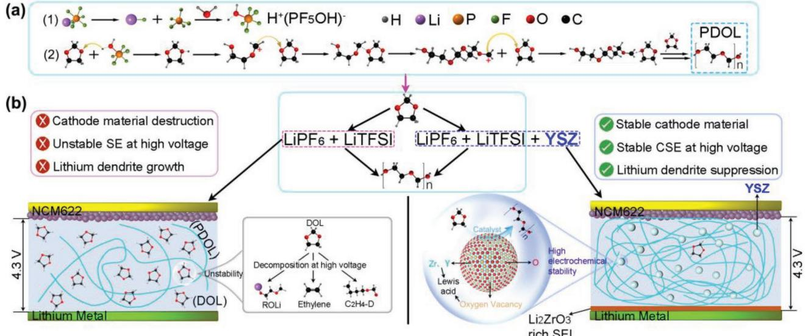
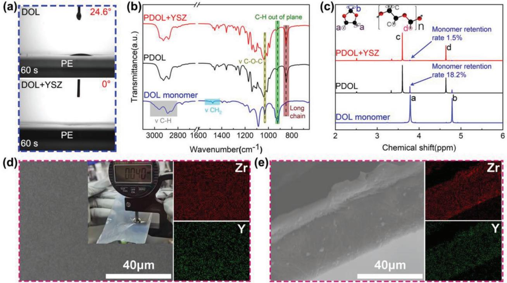
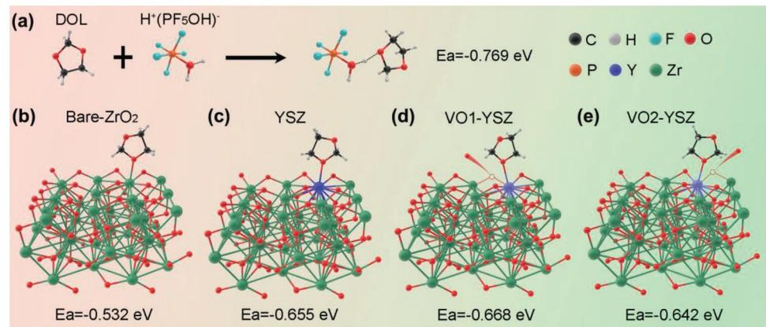
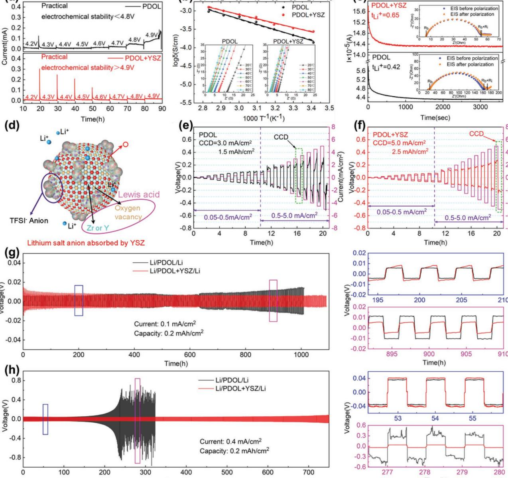
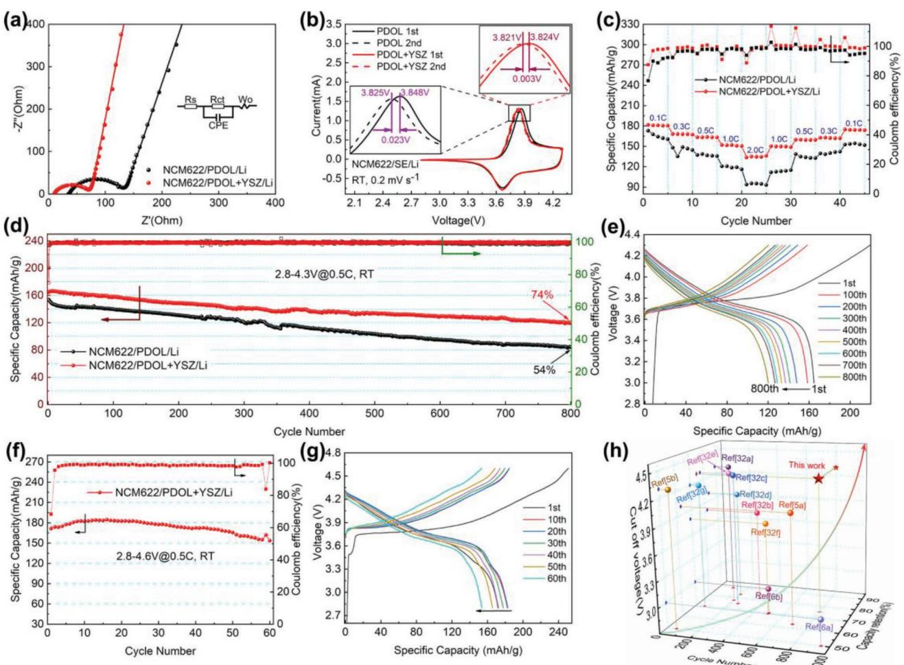
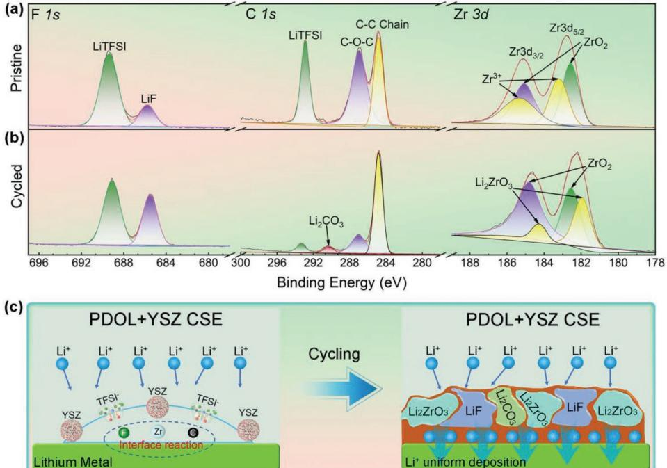

# **In Situ Catalytic Polymerization of a Highly Homogeneous PDOL Composite Electrolyte for Long-Cycle High-Voltage Solid-State Lithium Batteries**

*Hua Yang, Bo Zhang, Maoxiang Jing,\* Xiangqian Shen, Li Wang, Hong Xu, Xiaohong Yan, and Xiangming He\**

**High energy density solid-state lithium batteries require good ionic conductive solid electrolytes (SE) and stable matching with high-voltage electrode materials. Here, a highly homogeneous poly(1,3-dioxolane) composite solid electrolyte (CSE) membrane that can satisfy the above-mentioned requirements by in situ catalytic polymerization effect of yttria stabilized zirconia (YSZ) nanoparticles on the polymerization of 1,3-dioxolane (DOL), is reported. The well-dispersed YSZ nanoparticle catalyst leads to the polymerization conversion of DOL monomers up to 98.5%, which enlarges its electrochemical window exceeding 4.9 V. YSZ also significantly improves the room temperature ionic conductivity (2.75 × 10−4 S cm−1 ) and enhances the cycle life of lithium metal anode. Based on this CSE, the Li(Ni0.6Co0.2Mn0.2)O2 (NCM622) based solid-state lithium battery shows a long cycle life over 800 cycles. This investigation encourages polymer SE toward practical high energy solid-state batteries.**

# **1. Introduction**

The vigorous promotion of clean energy makes lithium-ion batteries, the "heart" of electric vehicles, have broad application prospects.[1] Solid-state lithium battery has become the future of lithium-ion batteries because of its high energy density and high safety.[2] However, the current solid-state batteries are often troubled by problems such as inferior electrochemical stability, poor interface contact, and low ion conductivity when satisfying high energy density.[3] In addition, although the lithium metal anode is a promising anode material for high energy density

H. Yang, M. Jing, X. Shen, X. Yan Institute for Advanced Materials School of Materials Science and Engineering Jiangsu University Zhenjiang 212013, China E-mail: mxjing2004@ujs.edu.cn B. Zhang, L. Wang, H. Xu, X. He Institute of Nuclear and New Energy Technology Tsinghua University Beijing 100084, China E-mail: hexm@tsinghua.edu.cn

The ORCID identification number(s) for the author(s) of this article can be found under https://doi.org/10.1002/aenm.202201762.

#### **DOI: 10.1002/aenm.202201762**

batteries, the problem of easily growing the dendrites has been inhibiting its wide application.[4]

Solid polymer electrolytes (SPEs) have attracted much attention in recent years due to their good machinability and interface compatibility. Thereinto, the formation of long-chain polymers by in situ initiation of liquid monomers is an effective method to improve the interface contact between solid electrolyte (SE) and electrode. Poly(1,3-dioxolane) (PDOL) is a typical example that has excellent lithiumion (Li+) transport ability and high electrochemical stability, some researchers have reported that the solid or gel-state PDOL electrolyte shows excellent cycling performance.[5] However, a fact that monomer and DOL short chain are easy to decompose at high voltage has been recently con-

firmed, which makes the electrolyte containing a large number of DOL monomer in previous studies unable to match with high-voltage cathode materials.[6] Therefore, it is very important to improve the conversion rate of DOL monomer in PDOLbased solid electrolyte or remove them for the electrochemical stability of SE at high voltage.

Adding inorganic fillers is a common and effective modification strategy for SPE.[2b,7] Inorganic fillers can improve the ion transport at the polymer/filler interface and enhance the electrochemical stability of SE,[8] such as Zeolite,[9] and metal–organic framework,[10] ZrO2, [11] yttrium stabilized zirconia (YSZ),[12] La2Zr2O7, [13] and Al2O3. [14] In addition, some inorganic fillers have a large number of Lewis acid sites, which can adsorb and fix the anion ions of lithium salts to release more free lithium ions,[15] which can reduce the polarization and improve the rate performance of the battery. In particular, some studies have found that Lewis acid initiator is an effective condition to initiate the polymerization of DOL monomer.[5,6] Therefore, adding Lewis acid filler into PDOL could further improve the conversion rate of DOL monomer, which is an appropriate way to improve the inherent problems of PDOL-based SE.

YSZ as a Lewis acid filler has attracted much attention. In previous studies, it has been confirmed that O2− is easy to jump to form oxygen vacancies in the YSZ lattice shown in Figure S6e, Supporting Information.[12] This kind of oxygen vacancy

happens to be in the state of electron deficiency and has the ability to obtain electrons, so it is called Lewis acid. Cui's group also confirmed the positive effect of the Lewis acidity of oxygen vacancies in the adsorption of lithium salt anions.[15] Similarly, Zr4+ (or Y3+) exposed on the surface of YSZ is also an electrondeficient group, also has the ability to adsorb anion ions, and has Lewis acidity.[16] Therefore, YSZ is a promising filler with multiple Lewis acid sites to improve the conversion rate of DOL. In this work, we for the first time explore the effects of YSZ nanoparticles on the polymerization of DOL monomer and the electrochemical performances of the PDOL electrolyte. We were surprised to find that YSZ nanoparticle like a catalyst shows in situ catalytic polymerization effect on the polymerization of DOL, not only improving the polymerization conversion of DOL monomers up to 98.5%, but also enhancing the electrochemical window, room-temperature ionic conductivity, and the cycle life of lithium metal anode, which provides a new idea for the research of PDOL-based composite solid electrolyte (CSE) at high-voltage lithium battery system.

# **2. Results and Discussion**

#### **2.1. Preparation and Design Principles for PDOL + YSZ CSE**

PDOL + YSZ CSE membranes are obtained by casting method. The raw materials and detailed preparation process are described in the Supporting Information and the flowchart is shown in Figure S1, Supporting Information. After casting, DOL monomers usually begin to ring-open and polymerize to long-chain PDOL under the action of initiator LiPF6, the reaction mechanism is shown in **Figure 1**a. Some of LiPF6 are usually decomposed into LiF and PF5 in DOL, and PF5 reacts with small amounts of water to form Lewis acid group H+(PF5OH)−

(Figure 1a1). The H+ in H+(PF5OH)− will combine with the oxygen atom on the DOL and open the DOL ring. The terminal CH2 group of the DOL chain is also Lewis acidic, which can further initiate chain reaction to form solid-state PDOL (Figure 1a2).[6a] The lithium bis(trifluoromethanesulfonyl) imide (LiTFSI) can provide more free Li+ to improve the ion conductivity of CSE.[17] In this work, the design principle of YSZ-enhanced PDOL-based solid-state battery performance is shown in Figure 1b, which mainly includes two aspects. On the one hand, there are a large number of Lewis acid sites (Zr4+, Y3+, and oxygen vacancy) on the surface of YSZ particles, which will promote further polymerization of unpolymerized monomers to minimize the presence of unstable DOL monomers that would decompose into by-products such as ROLi (CH3CH2OCH2Li and CH3OCH2CH2OLi),[18] ethylene (C2H4) and its derivatives CH2(CH2)3OCH2O (C2H4-D)[19] at high voltage, this will improve the cycle stability of SPE when matching with high-voltage cathode. On the other hand, in situ construction of SEI has the characteristics of simple process, low cost, and remarkable effect.[20] There are many kinds of SEI film, including LiF,[21] graphite/SiO2, [22] graphite fluoride,[23] LiC6, [13,24] and Li5AlO4 layer,[25] which all have good inhibition effect on lithium dendrite and significantly improve the cycle life of lithium-ion batteries. Li2ZrO3 is often used as the coating of ternary cathode materials because of its high ionic conductivity and excellent electrochemical stability.[26] The high ionic conductivity of Li2ZrO3 can guide the uniform deposition of lithium ions and delay the growth of lithium dendrites from the source.[27] The excellent electrochemical stability of Li2ZrO3 ensures the stability of the internal environment of the battery and extends the cycle life of the battery. All these indicate that Li2ZrO3 is an ideal material for SEI on lithium metal surface. In this work, the YSZ particles can in situ generate a robust Li2ZrO3 rich ion conductive layer at the CSE/Li metal interface,

**Figure 1.** Design idea of YSZ improving PDOL performance. a1) The existing form of LiPF6 in the case of trace water; a2) DOL is initiated by H+(PF5OH)– to form PDOL. b) Schematic illustrations of the design principles of YSZ enhancing the performance of PDOL-based solid-state batteries: The Lewis acid YSZ promotes the polymerization of DOL monomers to improve its electrochemical stability, and generates a Li2ZrO3 rich ion conductive layer on the surface of lithium metal, which guides the uniform deposition of lithium ions and inhibits dendrite growth.

which can guide the chaotically transported Li+ to deposit uniformly on the Li metal surface and effectively suppress dendrite growth.

#### **2.2. Physical Properties of YSZ Nanoparticles and CSE Membrane**

During casting process, we found that the contact angles (CA) of the DOL droplets and the PE skeleton at 0, 30 (Figure S2a, Supporting Information), and 60 s (**Figure 2**a) are 34.6°, 29.7°, and 24.6°, respectively, and the CA between the droplets added YSZ and PE skeleton at 0, 30 (Figure S2b, Supporting Information), and 60 s (Figure 2a) are 29.3°, 19.1°, and 0°, respectively. This shows that YSZ can significantly reduce the CA between DOL droplets and support skeleton. DOL + YSZ solution can completely infiltrate PE skeleton within 60 s. To further verify its effect, we take magnified cross-sectional images of the electrolyte membrane and the results are shown in Figure S3, Supporting Information. Before the addition of YSZ, the poor wettability leads to lots of unfilled voids in the cross-section of PDOL SE (Figure S3a, Supporting Information). In contrast, after adding YSZ, the cross-section of the CSE is compact and dense (Figure S3b, Supporting Information). The permeability enhancement makes CSE more homogeneous in overall structure, which will enhance the current, and carrier distribution are more uniform, thus the ion transmission efficiency can be improved.[28]

Fourier transform infrared spectroscopy (FT-IR) is used to analyze the functional group changes of the electrolyte before and after polymerization, and the effect of YSZ addition on the structure of PDOL segments is studied (Figure 2b). Compared with DOL monomer, SE with initiator alone or with both initiator and YSZ particles exhibits long chain vibration at 849 cm−1 . In addition, the changes in the vibration position of COC and the absence of CH vibration indicate that DOL ringopening polymerization forms the long chain of PDOL after the addition of the initiator. The addition of YSZ does not change the position and strength of the characteristic vibration peak of PDOL, indicating that YSZ filler would not affect the chain structure of PDOL, which provides a prerequisite for the high ionic conductivity and high electrochemical stability of CSE.

Hydrogen nuclear magnetic resonance spectroscopy (1 H NMR) can verify the influence of YSZ filler on the conversion rate of DOL monomer. The chemical environment of the H at positions *a* and *b* in the DOL monomer becomes *c* and *d*, respectively after being polymerized into segments. Therefore, comparing the ratio of *c*/*a* or *d*/*b* can reflect the ratio of the content of PDOL/DOL in the electrolyte, and the ratio can be calculated from the integral area of the corresponding peak. We define the conversion rate of DOL monomer *C*m *= c/(a + c)*. From Figure 2c, it can be calculated that the *C*m in the electrolyte with only the initiator added is 81.8%, while that with both initiator and YSZ particles is 98.5%. The results show that YSZ can obviously promote the ring-opening polymerization

**Figure 2.** Characterization of physical structure of SE and CSE. a) The CA of the DOL (or DOL + YSZ) droplets and the PE skeleton at 60s. b) FT-IR curve of liquid DOL monomer, PDOL SE, PDOL + YSZ CSE. c) 1 H NMR of liquid DOL monomer, PDOL SE, PDOL + YSZ CSE: The blue peak indicates the amount of DOL monomer (the magnified structures of DOL monomer and PDOL are shown in Figure S4, Supporting Information). d) CSE surface SEM image, the inset is a digital photo of CSE and Zr, Y element EDS images of CSE surface. e) The SEM images of CSE cross-section, and its Zr and Y element EDS images.

of DOL. The fundamental reason is that the oxygen vacancies on the surface of YSZ are Lewis acidic and have similar chemical properties to the initiator. With the addition of YSZ, the content of DOL monomer in the electrolyte decreases, which significantly improves the electrochemical stability at high voltage, and makes it possible to match with high-voltage cathode. The molecular weights of PDOL SE and PDOL + YSZ CSE are tested by gel permeation chromatography (GPC). *M*w of PDOL SE is ≈27 K and *M*n is ≈9 K (Figure S5a, Supporting Information), meanwhile, *M*w of PDOL + YSZ CSE is ≈24 K and *M*n is ≈9 K (Figure S5b, Supporting Information), both are very similar in molecular weight. The addition of YSZ provides more initiation sites, which slightly reduces the molecular weight of CSE. These long chains provide the conditions for the electrochemical stability of the electrolyte and the migration of Li+.

To clarify the effect of the YSZ nanoparticles on the DOL polymerization process, the features of the YSZ are characterized by a series of characterization techniques. Transmission electron microscope (TEM) image (Figure S6a, Supporting Information) shows that YSZ particles are 15–30 nm in diameter. The particle size distribution curve of YSZ shows that YSZ particles are partially agglomerated, and the average diameter of agglomerated particles is 318 nm (Figure S6b, Supporting Information). The N2 adsorption–desorption isotherm curves of YSZ nanoparticles are shown in Figure S6c, Supporting Information, the specific surface area is calculated to be 56.1 m2 g−1 . Such a large specific surface area provides a large number of active sites for promoting DOL polymerization and adsorbing lithium salt anions. High resolution transmission electron microscopy (HRTEM) images and its selected area electron diffraction (SAED) pattern (Figure S6d, Supporting Information) show that YSZ is composed of polycrystals with tetragonal structure. The grain size of YSZ is about 10 nm, which is within the critical size of stable tetragonal ZrO2, [15] indicating that YSZ has stable tetragonal structure. In addition, the polycrystalline YSZ can expose more Lewis acid sites than the single crystal YSZ, which can promote the ring-opening reaction of DOL and the adsorption of anion ions of lithium salt.

X-ray diffraction (XRD) patterns show that YSZ is mainly composed of tetragonal ZrO2 (t-ZrO2), mixed with a small amount of monoclinic ZrO2 (m-ZrO2), and the unit cell of t-ZrO2 is shown in the inset (Figure S6e, Supporting Information). The local environment of O2− in t-ZrO2 is shown in Figure S6f, Supporting Information. Previous studies use molecular dynamics to simulate O2− jumping between Zr4+ or Y3+ bridges (yellow arrows) and forming oxygen vacancies.[12] Furthermore, we performed X-ray photoelectron spectroscopy (XPS) analysis on the YSZ particles, and the results are shown in Figure S7, Supporting Information. Obviously Zr3+ appears in the spectrum, which is the direct evidence of the existence of oxygen vacancies in the YSZ unit cell.

The surface scanning electron microscope (SEM) image of PDOL-based CSE membrane (Figure 2d) shows that the surface of the membrane is flat and uniform without obvious convex structure, which is more conducive to the contact between electrolyte and electrode. The thickness of CSE measured is about 40 µm (inset). The X-ray energy dispersive spectroscopy (EDS) analysis of Zr and Y on the surface of CSE shows that YSZ particles are uniformly distributed in the electrolyte, which ensures the transverse homogeneity of the electrolyte, makes the ion transport capacity of CSE the same, and avoids the lithium dendrite growth caused by uneven ions deposition. In addition, Figure 2e shows that the cross-section structure of CSE is compact, which can effectively slow down the growth of lithium dendrites to a certain extent. The EDS images of Zr and Y elements in the cross-section show that YSZ particles are uniformly distributed in the longitudinal direction of the SE, which ensures the continuous ion conduction channels in the longitudinal direction. The uniform distribution of YSZ in PDOL volume is the basic requirement for the preparation of homogeneous high performance CSE.

Density functional theory (DFT) calculation is used to verify the interaction mechanism between DOL and YSZ. First, the ring-opening adhesive energy (*E*a) between DOL and initiator is calculated. *E*DOL + HPF5OH, *E*DOL, and *E*HPF5OH are −106.93, −61.52, and −44.64 eV, respectively, so its *E*a is −0.76 eV (**Figure 3**a). To verify the effect of YSZ on the ring-opening polymerization of DOL, the adhesive energies of DOL to ZrO2, YSZ, and oxygen vacancies in YSZ are calculated. The detailed process is shown in Table S1, Supporting Information, and the results are shown in Figure 3b–e. There are two types of oxygen vacancies

**Figure 3.** DFT calculation. Ring-opening adhesive energies of DOL with a) initiator H+(PF5OH)−, b) pure ZrO2, c) YSZ, oxygen vacancy d) VO1, and e) VO2 in YSZ.

in YSZ, named VO1 and VO2, respectively. From the calculation results, the ring-opening adhesive energy of bare ZrO2 to DOL is −0.532 eV, and the ring-opening adhesive energy of ZrO2 to DOL increases to −0.655 eV after Y2O3 doping. In addition, the adhesive energy of DOL to the two oxygen vacancies in YSZ is −0.668 and −0.642 eV, respectively. We found that YSZ always has the similar ring-opening adhesive energy as initiator H+(PF5OH)−, indicating that YSZ can promote DOL polymerization. Therefore, YSZ like a catalyst promotes the polymerization of DOL monomers, which further increases the proportion of PDOL long chains in solid electrolytes, thereby improving the electrochemical stability of PDOL.

The ion transport of SPE often relies on the relaxation motion of the polymer chain segment, so the degree of freedom of the chain segment is an important basis for ion transport capability.[29] The glass transition temperature (*T*g) of polymer is the lowest temperature at which the molecular segment can move, which is closely related to the flexibility of the molecular chain. Differential scanning calorimetry (DSC) is used to measure the glass transition temperature of PDOL SE and PDOL + YSZ CSE. The result is shown in Figure S8a, Supporting Information, in order to make the data easy to distinguish, we differentiate the heat flow with respect to the temperature to obtain a more obvious peak. The *T*g of the PDOL electrolyte decreases from −49.6 to −52.4 °C after adding YSZ particles, indicating that the addition of fillers disrupts the arrangement of polymer segments, which increases the amorphous region and the free segments for Li+ transport, it is beneficial to improve the ionic conductivity of electrolyte.

Thermogravimetric curve (TG) can reveal the thermal stability of PDOL SE and PDOL + YSZ CSE (Figure S8b, Supporting Information). A significant reduction in electrolyte mass indicates a loss of electrolyte composition by decomposition. The decomposition temperature of the electrolyte increases from 75 to 100 °C after adding YSZ. There are two main reasons: 1) The addition of inorganic fillers increases the overall specific heat capacity of CSE; 2) YSZ increases the DOL conversion rate and reduces the influence of DOL monomer thermal volatilization. The improvement of thermal stability can reduce safety accidents caused by thermal runaway during battery operation. Tensile tests are carried out on SE and CSE membranes, respectively. The stress–strain curves show that they have similar breaking strength, more than 180 MPa (Figure S8c, Supporting Information), indicating that the electrolyte membrane has good resistance to external pressure and can ensure the safe operation of the battery under accident. In addition, the flexibility of the CSE is tested and the results are shown in Figure S9, Supporting Information. The CSE membrane can be easily bended (Figure S9b, Supporting Information), twisted (Figure S9c, Supporting Information), and folded (Figure S9d,e, Supporting Information), then the CSE membrane can stretch to a flat solid electrolyte membrane (Figure S9f, Supporting Information) after these operations. We subjected the CSE membrane to tensile test (Figure S9g–i, Supporting Information), which can maintain a large deformation without breaking. The above tests show that the CSE membrane has good flexibility and can work normally under external deformation to cope with different application environments.

#### **2.3. Electrochemical Performances of Solid Electrolyte**

High specific energy batteries often need the support of highvoltage cathode materials, which requires the oxidation voltage of the electrolyte higher than the full charge voltage of the cathode material. Linear sweep voltammetry (LSV) is used to test the electrochemical stability window of the solid electrolyte (Figure S10, Supporting Information). At a scan rate of 0.2 mV s−1 , the oxidation current of PDOL SE increases significantly at 4.6 V (versus Li+/Li), while the electrochemical stability window of PDOL + YSZ CSE reaches 5.2 V. When the scan rate is 5.0 mV s−1 , the results show that the oxidation potentials of SE and CSE increase to 4.8 and 5.6 V, respectively (Figure S10b, Supporting Information), which may be caused by the delayed oxidation reaction at fast scanning. CSE still shows much higher electrochemical stability than SE, which further proves the role of YSZ in improving the stability of polymer electrolytes. An electrochemical floating experiment is carried out to further verify the practical electrochemical stability of the solidstate electrolyte in the Li(Ni0.6Co0.2Mn0.2)O2 (NCM622) battery, and its oxidation stability is evaluated by measuring the leakage current during constant voltage charging and the result is shown in **Figure 4**a. The current of PDOL SE starts to become turbulent when charging at a constant voltage of 4.6 V, and the current increases sharply at 4.9 V. The leakage current of CSE remains stable at 4.2–4.9 V, and the leakage current at 4.9 V is still very low (16 µA), which shows excellent electrochemical stability. The energy change during DOL ring opening is calculated to explain the deep reason for the better oxidation resistance after DOL polymerization (Figure S11, Supporting Information). During the ring-opening process of DOL (the process of 2 DOL binding to 4 DOL binding), the highest occupied molecular orbital (HOMO) energy is reduced (from −4.31 to −4.46 eV) (Figure S11a, Supporting Information). The reduction of HOMO energy enhances the antioxidant capacity of the substance, so the PDOL long chain has stronger antioxidant performance than DOL monomer and DOL short chain. In addition, the calculation of polymerization energy shows that DOL continuously releases energy in the chain reaction process of ring-opening polymerization, and the energy released by each polymerized DOL monomer is about 0.207 eV (Figure S11b, Supporting Information). This energy release process shows that the product (PDOL long chain) has higher stability than the reactant (DOL monomer). These two calculation results confirm in principle that PDOL polymer has higher oxidation resistance and stability than DOL monomer. PDOL SE still contains 18.2% DOL monomers, which is the reason of its oxidative deterioration at 4.6 V. However, YSZ in CSE catalyzes DOL polymerization in situ, resulting in a monomer residual rate of only 1.5%. The long chain of PDOL with high stability is dominant, so the oxidation voltage of CSE is higher than that of SE.

We also explored the effect of different YSZ additions on the ionic conductivity of PDOL at room temperature (20 °C), and the results are shown in Figure S12, Supporting Information. When a trace amount of YSZ is added, the impedance of the "Stainless Steel (SS)//SS" symmetric cells decreases with the increase of the addition amount, which also indicates the improvement of the ionic conductivity (Figure S12a,b, Supporting Information). This trend peaks at 0.2% YSZ, which

**Figure 4.** Electrochemical characterization of SE and CSE. a) Electrochemical floating analysis of cells assembled with NCM622 cathode for SE and CSE. b) The ionic conductivity at 20–80 °C of SE and CSE, the solid line and the dashed line are fitted with Arrhenius and Vogel–Fulcher–Tammann transmission models, respectively. The inset is the Nyquist curve of the electrochemical impedance spectroscopy (EIS) test of SE and CSE, respectively. c) The steady-state polarization curve of the lithium symmetric battery assembled by SE and CSE, insets: the EIS curve before and after polarization. d) Schematic diagram of the adsorption of lithium salt anions by Lewis acidic groups on YSZ. CCD of e) SE and f) CSE, the constant current charge–discharge test is carried out at the current density of 0.05–10 mA cm−2 , and each cycle includes half an hour of plating and half an hour of stripping. The constant current cycle performance of lithium symmetrical batteries assembled by SE and CSE at a current density of g) 0.1 mA cm−2 and h) 0.4 mA cm−2, the lithium plating capacity is 0.2 mAh cm−2 per cycle.

corresponds to an ionic conductivity of 2.75 × 10−4 S cm−1 . The impedance increases and the ionic conductivity decreases with the continuous addition of YSZ, which is related to the agglomeration of excess YSZ particles in the polymer. The digital photographs and SEM images of the CSE films with 2.0% YSZ addition are shown in Figures S12c and S12d, respectively. The surface particles show uneven aggregation, which not only worsens the interface contact, but also reduces the continuous transmission of Li+ in the polymer. Therefore, 0.2% YSZ is the optimal addition amount of PDOL-based polymer. On this basis, we compare the ionic conductivity of SE and CSE (with 0.2% YSZ addition) in the range of 20 to 80 °C (Figure 4b). The solid line and dotted line in the figure are fitted with Arrhenius and Vogel–Fulcher–Tammann transmission models, respectively. The bottom insets are Nyquist curves of SE and CSE by electrochemical impedance spectroscopy (EIS) testing, respectively. The results show that the ionic conductivity of CSE after adding YSZ is significantly higher than PDOL SE at 20–80 °C, and the ionic conductivity of CSE is twice that of PDOL SE at room temperature (20 °C), indicating that the addition of the inorganic filler YSZ could construct fast ion transport paths at the PDOL/YSZ interface and improves the Li+ transport rate.[30]

The change of current value of the lithium symmetric batteries assembled by SE and CSE are recorded under constant bias voltage, and the Li+ transference number of electrolytes could be calculated by the Bruce–Vincent–Evans equation combined with the impedance value before and after polarization. It can be seen from Figure 4c that the current of the CSE with YSZ added at a bias voltage of 10 mV drops from 1.58 × 10−4 to 1.43 × 10−4 A, and the impedance value shown in the inset increases from 48 to 49 Ω (*R*b is bulk impedance and *R*i is interface impedance). The PDOL SE current reduces from 5.77 × 10−5 to 4.30 × 10−5 A, and the impedance value increases from 137 to 145 Ω. It is calculated by the formula that the Li+ transference number of solid electrolytes increases from 0.42 to 0.65 after adding YSZ.

Form the above results, we can infer that Lewis acid YSZ plays an important role in improving the ionic conductivity and Li+ transference number of SE. The Lewis acid group (Zr4+, Y3+, and oxygen vacancy) on YSZ will absorb negatively charged lithium salt anion (Figure 4d). On the one hand, this will make lithium salt release more free Li+, and increases carrier concentration to improve ion conductivity.[15] On the other hand, the adsorption of anion by YSZ increases the proportion of Li+ in the total ion of transmitted charge, which will reduce the polarization of the battery during charge and discharge and bring higher output power capability.[31]

Critical current density (CCD) is an important parameter for evaluating the power density of solid-state batteries. The Li/CSE/Li symmetric battery is assembled for testing. Before testing, we cycled the symmetric battery at a weak current density of 0.05 mA cm−2 for 50 h to exclude the influence of the initial interface evolution. The test results show that both SE (Figure 4e) and CSE (Figure 4f) have stable polarization voltage platform up to 0.5 mA cm−2 , exhibiting good lithium plating/ stripping effects. However, when the current density gradually increases, some sharp peaks appear in the polarization voltage platform of SE, which are caused by the interfacial dead lithium and the generation of dendrites. At 3.0 mA cm−2, the polarization voltage of SE is extremely unstable and does not satisfy the conditions for normal operation at this current density, thus reaches its CCD. However, the CSE still maintains a relatively stable polarization voltage up to 5.0 mA cm−2 , and its CCD is not less than 5.0 mA cm−2 , which can provide solid-state batteries with much higher power density than SE.

The lithium symmetrical battery is also used to verify the stability of the electrolyte to the lithium metal anode during the Li+ plating/stripping long-cycle process. As shown in Figure 4g, the battery is cycled at a current density of 0.1 mA cm−2 , and the lithium plating capacity is 0.2 mAh cm−2 per cycle. In the early stage of the cycles, the PDOL + YSZ CSE has a higher polarization voltage, which may be due to the obstruction of Li+ conduction caused by the existence of YSZ at the CSE/Li interface. However, as the cycle proceeds, the polarization of CSE gradually decreases and stabilizes, which may be attributed to the interfacial fusion layer formed by the reaction between YSZ and Li+. The polarization increases significantly after PDOL SE cycling for 600 h, which is caused by the accumulation of dead lithium and dendrites at the electrolyte/electrode interface. By contrast, the polarization voltage of CSE is still stable after cycling for 1100 h, and the interfacial fusion layer formed under the action of YSZ effectively delays the generation of dead lithium and dendrites, making CSE exhibit excellent reversibility of lithium plating/stripping. To further verify the advantage of CSE, we cycle them at a higher current density (0.4 mA cm−2 ) and the plating/stripping capacity is still 0.2 mAh cm−2 per cycle (Figure 4h). The polarization voltage of both remains stable until 150 h, but then the polarization voltage of pure PDOL SE begins to rise and runs out of control after 220 h. On the contrary, the CSE kept the polarization voltage stable until 700 h, indicating that the interfacial fusion layer in the CSE has a stronger ability to resist the growth of lithium dendrites.

#### **2.4. Performances of Solid-State Lithium Battery**

**Figure 5**a shows the EIS curves of the coin cell assembled with SE and CSE, respectively, by using NCM622 cathode. The solid line is the curve of the original data fitting according to the equivalent circuit. It can be seen from the figure that the semicircle of the intermediate frequency region related to the impedance of the electrochemical reaction in the CSE curve is significantly smaller than that of SE, indicating that YSZ significantly accelerates the Li+ transmission inside the electrolyte, which is beneficial to improve the rate performance of the lithium battery. In addition, the slope of the low frequency region is related to the solid phase diffusion of ions in the electrode. The slope of CSE is higher than that of SE, which may be related to the fusion layer formed by YSZ at the electrode/electrolyte interface. The extraction and insertion of lithium ions in the electrode is smoother, which can effectively ensure the efficient operation of the lithium battery.

The cyclic voltammetry (CV) test is performed on the cells assembled by CSE and SE, and the scanning is performed in the voltage range of 2.8–4.3 V at a scanning speed of 0.2 mV s−1 (Figure 5b). The results show that the first-cycle oxidation peaks for CSE and SE coin cells are at 3.825 and 3.848 V, respectively. The oxidation peaks of SE cell are slightly higher than the typical NCM622 insertion voltage, indicating that the extraction of Li+ at the cathode or the deposition at the anode are hindered, while CSE with YSZ can effectively solve this problem. In the second scan, the oxidation peaks of the CSE and SE cells are at 3.821 and 3.824 V, respectively. The oxidation voltage gaps between the initial two cycles are 0.003 and 0.023 V. The smaller voltage gap indicates that YSZ makes the lithium battery have better cycle reversibility. The reduction peaks of CSE and SE cells are both at 3.666 V, but the peak current of SE cell is less than that of CSE cells, indicating that YSZ brings higher specific capacity release for lithium batteries.

The coin cells assembled with SE and CSE is cycled at room temperature (25 °C), and the charge and discharge voltage range of NCM622 cathode is 2.8–4.3 V. The rate performance

**www.advancedsciencenews.com www.advenergymat.de**

**Figure 5.** Performance demonstration of lithium metal coin cells using SE and CSE. a) EIS curve, b) CV curve (scanning speed: 0.2 mV s−1 ), c) rate performance, d) cycle performance (25 °C, 2.8–4.3 V at 0.5 C) of coin cells assembled by NCM622 cathode and Li metal anode with PDOL SE and PDOL + YSZ CSE, respectively. e) The charge–discharge voltage curve of NCM622/PDOL + YSZ CSE/Li coin cell during 800 cycles. f) Cycle performance (25 °C, 2.8–4.6 V at 0.5 C) and g) charge–discharge voltage curve of coin cells assembled by NCM622 cathode and Li metal anode with PDOL + YSZ CSE. h) The performance comparison between this work and reported PDOL-based electrolytes in terms of cut-off voltage, cycle number, and capacity retention.[5,6,32]

is shown in Figure 5c. At a low rate (0.1 C), the specific capacity of CSE cell reaches 181.5 mAh g−1 , while at a high rate (2.0 C) the specific capacity also exceeds 133.0 mAh g−1 , which is much higher that of SE (93.7 mAh g−1 ). After the high-rate cycle, the capacity of the CSE cell gradually rises as the rate gradually decreases, showing excellent cycle reversible performance.

The SE- and CSE-based NCM622/Li coin cells are cycled at 0.5 C for a long time, the results are shown in Figure 5d. At the first cycle, the specific discharge capacities for SE and CSE cells are 155.0 and 164.7 mAh g−1 , and the coulombic efficiencies are 84.2% and 75.0%, respectively. The reason for the lower initial coulombic efficiency of CSE is similar to the cycle of lithium symmetrical cell: the YSZ at the interface between the electrolyte and the anode affects the conductivity at the interface. As the cycle proceeds, the conductive layer of the reaction product of YSZ and Li+ is gradually formed at the CSE/Li interface, and the specific capacity gradually rises to the maximum value of 166.5 mAh g−1 . After 800 cycles, the capacity retention rate of SE cell is 54.5%, while the specific capacity of CSE is still 120.3 mAh g−1 , the attenuation rate per cycle is only 0.03%, and the coulombic efficiency is all above 99.5%. The charge–discharge voltage curves during cycling are shown in Figure 5e, and the longer charging process in the first cycle may be related to the formation of the conductive layer. Except this, the typical charge–discharge curves of NCM622 are shown and exhibit extremely low polarization and extremely high coulombic efficiency. The impedance of CSE is still much smaller than that of SE after cycling (Figure S13, Supporting Information), indicating that YSZ significantly reduces the occurrence of side reactions.

To verify the possibility of CSEs operating at higher cut-off voltages, we set the charge–discharge voltage range of NCM622/ PDOL + YSZ/Li coin cells to 2.8–4.6 V and cycle at 0.5 C. The results (Figure 5f) show that the initial discharge specific capacity of the coin cell is 171.8 mAh g−1 and reaches the highest value of 184.8 mAh g−1 , and its capacity retention rate is also as high as 90% after 60 cycles. Its charge–discharge voltage curve (Figure 5g) shows that CSE did not continuously decompose under high voltage resulting in voltage fluctuations, which indicates that CSE has excellent antioxidant stability. This is closely related to the design of YSZ to promote the conversion of DOL monomer into high stable PDOL long chain. The cycling stability of CSE at high voltage indicates its great application potential in high energy density solid-state Li-ion batteries.

In order to verify that CSE also has better stability at lower voltages, CSE is assembled with LiFePO4 (LFP) cathode and Li4Ti5O12 (LTO) cathode coin cells, respectively. For LFP//Li coin cells, the charge cut-off voltage is 3.8 V, and continue to charge at constant voltage until the leakage current is lower than 0.03 C, and the discharge cut-off voltage is 3.0 V. The result (Figure S14a, Supporting Information) shows that the specific discharge capacity of the coin cell at 0.5 C in the first cycle is 148.5 mAh g−1 , and the capacity retention rate is 96.0% after 100 cycles. Figure S14b, Supporting Information, is the charge– discharge voltage curve of the LFP battery, which shows the typical charge–discharge voltage platform of the LFP cathode. For LTO//Li coin cells, the charge and discharge voltage range is 1.0–2.5 V. The cycle results (Figure S15a, Supporting Information) show that the specific capacity of the second cycle discharge at 0.5C reaches 160.1 mAh g−1 , and its capacity retention rate is as high as 96.8% after 100 cycles. The charge–discharge voltage curve (Figure S15b, Supporting Information) shows the typical voltage platform of LTO cathode materials and has a very low polarization. These excellent performances indicate that CSE has good adaptability for different cathode materials.

Figure 5h statistically compares the performances of the reported PDOL-based solid-state batteries in terms of charge/discharge cut-off voltage, cycle number, and capacity retention.[5,6,32] Our work enables PDOL-based CSE to achieve 800 cycles at a high voltage of 4.3 V with a capacity retention rate of 74%. This is an obvious improvement over the previous works, which also provides a new and more effective research idea for the research of PDOL-based solid electrolytes.

#### **2.5. The Enhancement Mechanism of YSZ for PDOL Performance**

XPS is performed on the CSE near the lithium metal side to study the evolution of the Li/CSE interface before and after cycling. Figure S16, Supporting Information, and **Figure 6**a,b, respectively, show the XPS curves of the four elements Li 1s, F 1s, C 1s, and Zr 3d before and after cycling. Li 1s peak at 55.9 eV does not change, indicating the stability of Li+ during transmission (Figure S16, Supporting Information). F 1s peaks at 685.6 and 689.2 eV are LiTFSI and LiF, respectively. LiF is one of the main components of SEI. The increase in LiF content after cycling confirms the formation of SEI and effectively protects the lithium metal anode. C 1s peaks at 284.8 and 287.0 eV are both PDOL long-chain functional groups, and the peak at 293.1 eV is LiTFSI.[5a] Similarly, the new peak at 290.3 eV after cycling is Li2CO3, which is also one of the main components of SEI composed of LiF.[33] After cycling, new peaks of Zr 3d appear at 181.9 and 184.3 eV as Li2ZrO3, which has better Li+ conductivity and higher mechanical strength, and it can guide the uniform deposition of Li+ and block the growth of lithium dendrites.[26] Li2ZrO3 layer can effectively suppress the thermal runaway of solid-state lithium batteries and extend their cycle life. XPS curves for PDOL SE near the lithium anode side before and after cycling are shown in Figure S17, Supporting Information. Most importantly, a robust Li2ZrO3 layer cannot

**Figure 6.** Interface stability mechanism. XPS curves of CSE a) before and b) after cycling near the lithium anode side: F 1s, C 1s, and Zr 3d: Peaks at 689.2 (LiF), 290.3 (Li2CO3), 181.9, and 184.3 eV (Li2ZrO3) indicate the formation of SEI ion conductive layer. c) The mechanism diagram of YSZ enhancing the performance of PDOL-based solid electrolyte.

be formed without the addition of YSZ, which is not conducive to suppressing the growth of Li dendrites.

Based on the above results, the performance enhancement mechanism of YSZ for PDOL CSE mainly includes: 1) Lewis acid sites (Zr4+, Y3+, and oxygen vacancy) can further promote the polymerization of DOL monomers to improve the electrochemical stability of CSE; 2) The Lewis acid of YSZ can adsorb the anion of lithium salt and release free lithium ions to improve the concentration difference distribution of ions inside the SE, and YSZ disrupts the orderly arrangement of PDOL segments and enhances the ion transmission at the YSZ/PDOL interface, which improves the ion conductivity of SE; 3) YSZ could react with lithium anode to form a rigid Li2ZrO3 rich ionic conductive interface layer at the CSE/Li interface, which prevents the problem of Li+ preferential nucleation at the bulge, guides the uniform deposition of lithium ions, and inhibits the growth of dendrites (Figure 6c).

# **3. Conclusions**

In this work, YSZ nanoparticles containing a large number of Lewis acid sites were found to have the effect of catalyzing DOL polymerization, which is able to cooperate with LiPF6 to convert DOL monomers into a solid electrolyte at a higher conversion rate (98.5%). The CSE's electrochemical stability window reaches more than 4.9 V, reducing the damage of DOL monomer to cathode material under high voltage. Lewis acid sites of YSZ enable the Li+ transference number of CSE up to 0.65, and improve the ionic conductivity of CSE reaching to 2.75 × 10−4 S cm−1 at 20 °C. Further, YSZ reacts in situ at the CSE/Li interface to form a rigid Li2ZrO3 rich ionic conductive layer to guide the uniform deposition of Li+, leading the Li/CSE/Li symmetrical battery cycle stably for more than 1100 h at a current density of 0.1 mA cm−2 . The assembled NCM622/ CSE/Li coin cell can be cycled at 4.3 V and 0.5 C for 800 times with a capacity decay rate of only 0.03% per cycle, and it can operate normally even at a high voltage of 4.6 V. This simple and effective preparation of high-performance CSE will help accelerate the commercial application of solid-state batteries, and the mechanism of YSZ improving PDOL performance can provide a new idea and guidance for the research of PDOL-based CSE.

# **Supporting Information**

Supporting Information is available from the Wiley Online Library or from the author.

# **Acknowledgements**

This work was financially supported by the National Natural Science Foundation of China (Nos. 51474113 and U21A20170).

## **Author Contributions**

M.J. and X.H. figured out the idea of this paper and guided the formation of paper framework. H.Y. drafted this manuscript and B.Z. completed the calculation work. All authors helped to revise and complete this draft and finalized this work professionally.

# **Conflict of Interest**

The authors declare no conflict of interest.

# **Data Availability Statement**

The data that support the findings of this study are available in the Supporting Information of this article.

#### **Keywords**

catalytic polymerization, composite solid electrolytes, interfaces, ionic conductivity, solid-state battery

> Received: May 23, 2022 Revised: July 16, 2022 Published online: August 25, 2022

- [1] a) R. Chen, Q. Li, X. g , A. Rutt, T. Shi, H. Kim, J. Wang, J. Koettgen, Y. Sun, B. Ouyang, T. ChYu, L. Chen, H. Li, *Chem. Rev.* **2020**, *120*, 6820; b) J.-Y. Hwang, S.-J. Park, C. S. Yoon, Y.-K. Sun, *Energy Environ. Sci.* **2019**, *12*, 2174; c) Y. Tian, G. Zenen, Z. Lun, Z. Rong, K. Persson, G. Ceder, *Chem. Rev.* **2020**, *121*, 1623.
- [2] a) J. C. Bachman, S. Muy, A. Grimaud, H.-H. Chang, N. Pour, S. F. Lux, O. Paschos, F. Maglia, S. Lupart, P. Lamp, L. Giordano, Y. Shao-Horn, *Chem. Rev.* **2016**, *116*, 140; b) Z. Cheng, T. Liu, B. Zhao, F. Shen, H. Jin, X. Han, *Energy Storage Mater.* **2021**, *34*, 388; c) G. Cui, *Matter* **2020**, *2*, 805.
- [3] a) Y. Xiao, Y. Wang, S.-H. Bo, J. C. Kim, L. J. Miara, G. Ceder, *Nat. Rev. Mater.* **2019**, *5*, 105; b) Y. Yao, Z. Wei, H. Wang, H. Huang, Y. Jiang, X. Wu, X. Yao, Z. S. Wu, Y. Yu, *Adv. Energy Mater.* **2020**, *10*, 2070055; c) C.-Z. Zhao, B.-C. Zhao, C. Yan, X.-Q. Zhang, J.-Q. Huang, Y. Mo, X. Xu, H. Li, Q. Zhang, *Energy Storage Mater.* **2020**, *24*, 75; d) Q. Zhao, S. Stalin, C.-Z. Zhao, L. A. Archer, *Nat. Rev. Mater.* **2020**, *5*, 229; e) Z. Cheng, M. Xie, Y. Mao, J. Ou, S. Zhang, Z. Zhao, J. Li, F. Fu, J. Wu, Y. Shen, D. Lu, H. Chen, *Adv. Energy Mater.* **2020**, *10*, 1904230.
- [4] a) M. Bai, K. Xie, K. Yuan, K. Zhang, N. Li, C. Shen, Y. Lai, R. Vajtai, P. Ajayan, B. Wei, *Adv. Mater.* **2018**, *30*, 1801213; b) L. E. Camacho-Forero, T. W. Smith, S. Bertolini, P. B. Balbuena, *J. Phys. Chem. C* **2015**, *119*, 26828; c) Z. Huang, S. Choudhury, H. Gong, Y. Cui, Z. Bao, *J. Am. Chem. Soc.* **2020**, *142*, 21393.
- [5] a) Q. Zhao, X. Liu, S. Stalin, K. Khan, L. A. Archer, *Nat. Energy* **2019**, *4*, 365; b) Q. Liu, B. Cai, S. Li, Q. Yu, F. Lv, F. Kang, Q. Wang, B. Li, *J. Mater. Chem. A* **2020**, *8*, 7197.
- [6] a) F.-Q. Liu, W.-P. Wang, Y.-X. Yin, S.-F. Zhang, J.-L. Shi, L. Wang, X.-D. Zhang, Y. Zheng, J.-J. Zhou, L. Li, Y.-G. Guo, *Sci. Adv.* **2018**, *4*, eaat5383; b) W. P. Wang, J. Zhang, Y. X. Yin, H. Duan, J. Chou, S. Y. Li, M. Yan, S. Xin, Y. G. Guo, *Adv. Mater.* **2020**, *32*, 2000302; c) G. Xu, A. Kushima, J. Yuan, H. Dou, W. Xue, X. Zhang, X. Yan, J. Li, *Energy Environ. Sci.* **2017**, *10*, 2544.
- [7] M. Dirican, C. Yan, P. Zhu, X. Zhang, *Mater. Sci. Eng., R* **2019**, *136*, 27.
- [8] H. Huo, N. Zhao, J. Sun, F. Du, Y. Li, X. Guo, *J. Power Sources* **2017**, *372*, 1.
- [9] a) H. Jamal, F. Khan, H.-R. Si, J. H. Kim, *J. Mater. Chem. A* **2021**, *9*, 27304; b) H. Jamal, F. Khan, S. Hyun, S. W. Min, J. H. Kim, *J. Mater. Chem. A* **2021**, *9*, 4126.

**www.advancedsciencenews.com www.advenergymat.de**

- [10] Z. Wang, R. Tan, H. Wang, L. Yang, J. Hu, H. Chen, F. Pan, *Adv. Mater.* **2018**, *30*, 1704436.
- [11] E. M. Kock, M. Kogler, T. Gotsch, L. Schlicker, M. F. Bekheet, A. Doran, A. Gurlo, B. Klotzer, B. Petermuller, D. Schildhammer, N. Yigit, S. Penner, *Dalton Trans.* **2017**, *46*, 4554.
- [12] M. Jaipal, A. Chatterjee, *J. Phys. Chem. C* **2017**, *121*, 14534.
- [13] M.-x. Jing, H. Yang, C. Han, F. Chen, W.-y. Yuan, B.-w. Ju, F.-y. Tu, X.-q. Shen, S.-b. Qin, *Ceram. Int.* **2019**, *45*, 18614.
- [14] X.-y. Hu, Q.-y. Liu, M.-x. Jing, F. Chen, B.-w. Ju, F.-y. Tu, X.-q. Shen, S.-b. Qin, *Ceram. Int.* **2020**, *46*, 16224.
- [15] W. Liu, D. Lin, J. Sun, G. Zhou, Y. Cui, *ACS Nano* **2016**, *10*, 11407.
- [16] H.-m. Xu, M.-x. Jing, J. Li, Z.-h. Huang, T.-f. Wang, W.-y. Yuan, B.-w. Ju, X.-q. Shen, *ACS Sustainable Chem. Eng.* **2021**, *9*, 11118.
- [17] G. Xu, X. Shangguan, S. Dong, X. Zhou, G. Cui, *Angew. Chem., Int. Ed.* **2020**, *59*, 3400.
- [18] B. N. Olana, S. D. Lin, B.-J. Hwang, *Electrochim. Acta* **2022**, *416*, 140266.
- [19] a) X. Chen, T.-Z. Hou, B. Li, C. Yan, L. Zhu, C. Guan, X.-B. Cheng, H.-J. Peng, J.-Q. Huang, Q. Zhang, *Energy Storage Mater.* **2017**, *8*, 194; b) L. E. Camacho-Forero, P. B. Balbuena, *J. Power Sources* **2020**, *472*, 228449.
- [20] a) D. S. Hall, R. Gauthier, A. Eldesoky, V. S. Murray, J. R. Dahn, *ACS Appl. Mater. Interfaces* **2019**, *11*, 14095; b) Z. Huang, J. Ren, W. Zhang, M. Xie, Y. Li, D. Sun, Y. Shen, Y. Huang, *Adv. Mater.* **2018**, *30*, 1803270; c) Y. Chen, W. Li, C. Sun, J. Jin, Q. Wang, X. Chen, W. Zha, Z. Wen, *Adv. Energy Mater.* **2021**, *11*, 2002545; d) D. Luo, L. Zheng, Z. Zhang, M. Li, Z. Chen, R. Cui, Y. Shen, G. Li, R. Feng, S. Zhang, G. Jiang, L. Chen, A. Yu, X. Wang, *Nat. Commun.* **2021**, *12*, 186; e) J. Pan, P. Zhao, N. Wang, F. Huang, S. Dou, *Energy Environ. Sci.* **2022**, *15*, 2753.
- [21] a) S. Bag, C. Zhou, P. J. Kim, V. G. Pol, V. Thangadurai, *Energy Storage Mater.* **2020**, *24*, 198; b) Y. Yuan, F. Wu, Y. Bai, Y. Li, G. Chen, Z. Wang, C. Wu, *Energy Storage Mater.* **2019**, *16*, 411.
- [22] R. Pathak, K. Chen, A. Gurung, K. M. Reza, B. Bahrami, F. Wu, A. Chaudhary, N. Ghimire, B. Zhou, W. H. Zhang, Y. Zhou, Q. Qiao, *Adv. Energy Mater.* **2019**, *9*, 1901486.
- [23] X. Shen, Y. Li, T. Qian, J. Liu, J. Zhou, C. Yan, J. B. Goodenough, *Nat. Commun.* **2019**, *10*, 900.
- [24] P. Shi, T. Li, R. Zhang, X. Shen, X. B. Cheng, R. Xu, J. Q. Huang, X. R. Chen, H. Liu, Q. Zhang, *Adv. Mater.* **2019**, *31*, 1807131.
- [25] X.-y. Hu, M.-x. Jing, H. Yang, Q.-y. Liu, F. Chen, W.-y. Yuan, L. Kang, D.-h. Li, X.-q. Shen, *J. Colloid Interface Sci.* **2021**, *590*, 50.
- [26] a) H. Liang, Z. Wang, H. Guo, J. Wang, J. Leng, *Appl. Surf. Sci.* **2017**, *423*, 1045; b) D. Wang, X. Li, Z. Wang, H. Guo, Z. Huang, L. Kong, J. Ru, *J. Colloid Interface Sci.* **2015**, *647*, 612; c) X. Zhan, S. Gao, Y.-T. Cheng, *Electrochim. Acta* **2019**, *300*, 36; d) J. Zhang, Z. Li, R. Gao, Z. Hu, X. Liu, *J. Phys. Chem. C* **2015**, *119*, 20350.
- [27] X. B. Cheng, T. Z. Hou, R. Zhang, H. J. Peng, C. Z. Zhao, J. Q. Huang, Q. Zhang, *Adv. Mater.* **2016**, *28*, 2888.
- [28] S. Li, Y.-M. Chen, W. Liang, Y. Shao, K. Liu, Z. Nikolov, Y. Zhu, *Joule* **2018**, *2*, 1838.
- [29] L. Chen, Y. Li, S.-P. Li, L.-Z. Fan, C.-W. Nan, J. B. Goodenough, *Nano Energy* **2018**, *46*, 176.
- [30] W. Tang, S. Tang, X. Guan, X. Zhang, Q. Xiang, J. Luo, *Adv. Funct. Mater.* **2019**, *29*, 1900648.
- [31] J. Chai, Z. Liu, J. Ma, J. Wang, X. Liu, H. Liu, J. Zhang, G. Cui, L. Chen, *Adv. Sci.* **2017**, *4*, 1600377.
- [32] a) S. Wen, C. Luo, Q. Wang, Z. Wei, Y. Zeng, Y. Jiang, G. Zhang, H. Xu, J. Wang, C. Wang, J. Chang, Y. Deng, *Energy Storage Mater.* **2022**, *47*, 453; b) W. Li, J. Gao, H. Tian, X. Li, S. He, J. Li, W. Wang, L. Li, H. Li, J. Qiu, W. Zhou, *Angew. Chem., Int. Ed.* **2022**, *61*, e202114805; c) B. Deng, M.-x. Jing, R. Li, L.-x. Li, H. Yang, M.-q. Liu, J. Xiang, W.-y. Yuan, X.-q. Shen, *J. Colloid Interface Sci.* **2022**, *620*, 199; d) G. Yang, Y. Zhai, J. Yao, S. Song, L. Lin, W. Tang, Z. Wen, N. Hu, L. Lu, *Chem. Commun.* **2021**, *57*, 7934; e) J. Xiang, Y. Zhang, B. Zhang, L. Yuan, X. Liu, Z. Cheng, Y. Yang, X. Zhang, Z. Li, Y. Shen, J. Jiang, Y. Huang, *Energy Environ. Sci.* **2021**, *14*, 3510; f) H. Cheng, J. Zhu, H. Jin, C. Gao, H. Liu, N. Cai, Y. Liu, P. Zhang, M. Wang, *Mater. Today Energy* **2021**, *20*, 100623; g) C.-Z. Zhao, Q. Zhao, X. Liu, J. Zheng, S. Stalin, Q. Zhang, L. A. Archer, *Adv. Mater.* **2020**, *32*, 1905629.
- [33] V. Sharova, A. Moretti, T. Diemant, A. Varzi, R. J. Behm, S. Passerini, *J. Power Sources* **2018**, *375*, 43.